# 第一章：设置你的树莓派

在我们开始构建家庭安防系统之前，我们需要做一些准备工作，以确保树莓派能够正常运行。所以，我们将逐步完成准备工作，以便将树莓派做好开发的准备。

本章将涵盖以下主题：

+   探索不同版本的树莓派

+   为你的系统选择合适的树莓派版本

+   准备 SD 卡并安装 Raspbian 操作系统

+   学习如何通过家庭网络远程访问树莓派

+   使用最新的软件包更新我们的操作系统

+   探索树莓派上的时间管理选项

+   设置用户和根密码以保护我们的树莓派

# 选择哪款 Pi？

自 2012 年树莓派发布以来，已经发布了几个版本的迷你 PC 板。接下来，我将逐一介绍发布的每个版本及其特点，帮助你选择最适合你项目的版本。

好消息是，在电力方面使用哪个版本并不重要，因为我们的家庭安防系统根据你希望系统执行的功能，实际上并不需要大量的处理能力（当然，具体取决于你希望系统执行的任务）。你可能还有一块旧板子可以使用。

另一个好消息是，GPIO 接口引脚布局在所有版本中都是相同的。虽然较新的版本有更多的引脚，但原有的 26 个引脚仍然保持在同一位置。

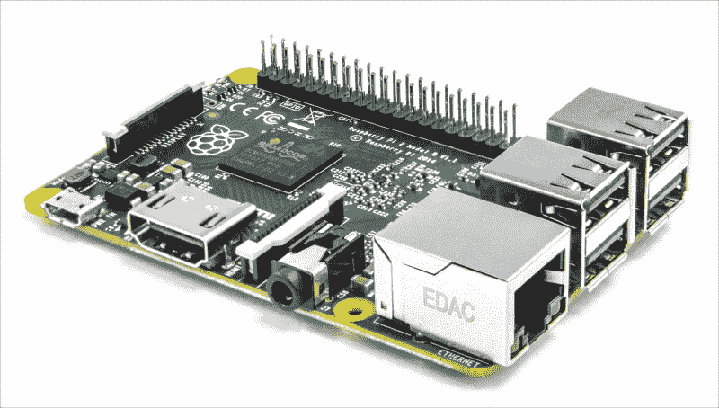

最新的树莓派版本 2

## 树莓派 Model A

家庭中的“宝宝”是 Model A；它作为 Model B 的低成本版本发布，Model B 将在接下来的章节中介绍。它与 Model B 的主要区别在于只有 256Mb 的内存，并且没有以太网端口；所以，如果你想将这个板子连接到网络，你只能使用 USB Wi-Fi 加密狗。

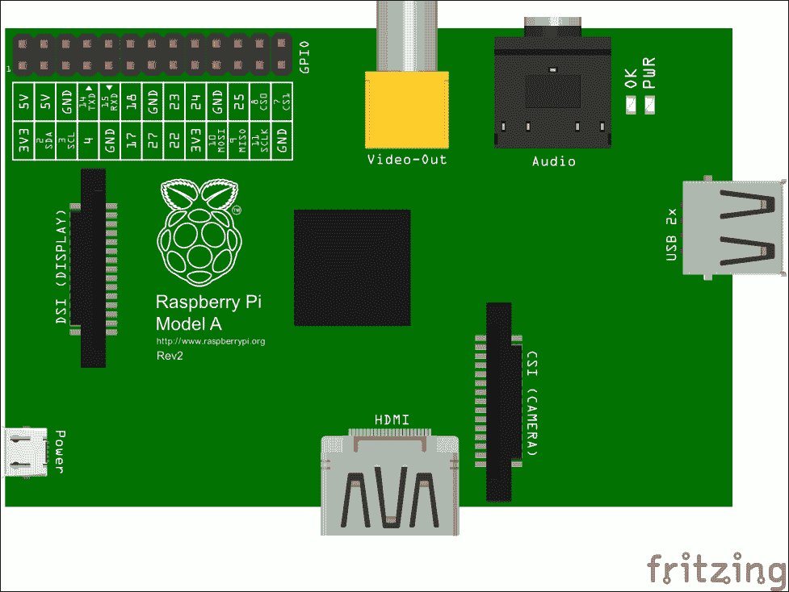

树莓派 Model A 板布局

## 树莓派 Model B

这是树莓派发布的第一个版本；后来发布了一个更新版，改善了电源系统和 USB 端口保护。它配备了 512Mb 的内存，并具有以太网端口，可以连接到网络。这个版本可能是最常见的，尤其是在需要快速启动、设置和配置树莓派时，拥有以太网端口非常有用，可以无需键盘和显示器快速设置。

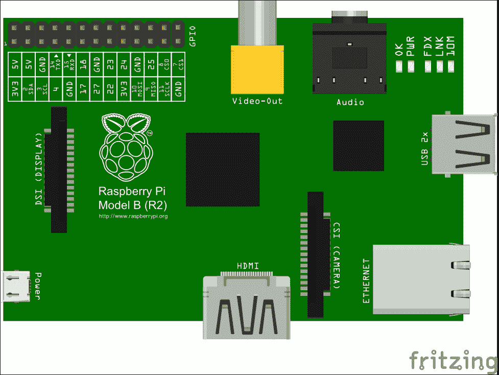

树莓派 Model B 布局

## 树莓派 Model B+和 Model 2

2014 年，树莓派基金会发布了一个新版本的板子，与之前的版本相比，做了一些根本性的变化。最根本的变化是板子布局、外形尺寸和安装点——这让许多外壳和配件制造商感到失望。

事实上，我们正在为一个基于树莓派的商业产品开发一个外壳原型——幸运的是，我们及时得知了板卡的更改，及时修改了外壳以支持即将发布的 Model B+。

此板的主要电子变化是增加了 2 个 USB 端口，能够为外设提供更多电力，扩展了 GPIO 接口，并移除了复合视频端口，现已将其整合到音频插孔中。它现在还使用了一个微型 SD 卡，并且卡槽更好。

2015 年 2 月，发布了更强大的树莓派：树莓派 Model 2。它在外形和接口上与 Model B+相似，但据称它比 Model B/B+快 6 倍，配备了升级版 ARM 处理器和 1Gb 内存。

以不到 30 英镑的低成本，它是一款非常出色的小型板卡，是嵌入式系统的强大动力源。

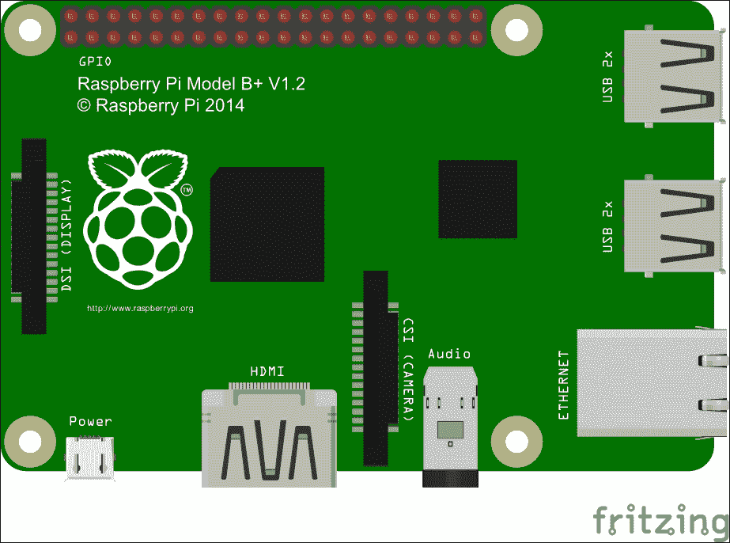

树莓派 Model B+和 Model 2 布局

## 模型对比表

|   | Model A | Model B | Model B+ | Version 2 |
| --- | --- | --- | --- | --- |

|

```
Processor
```

|

```
ARM1176JZF-S 700 MHz processor, VideoCore IV GPU
```

|

```
Quad-core ARM Cortex-A7 CPU and a VideoCore IV dual-core GPU
```

|

|

```
Memory
```

|

```
256Kb
```

|

```
512Kb
```

|

```
512Kb
```

|

```
1Gb
```

|

|

```
USB Ports
```

|

```
2
```

|

```
2
```

|

```
4
```

|

```
4
```

|

|

```
Ethernet
```

|

```
No
```

|

```
Yes
```

|

```
Yes
```

|

```
Yes
```

|

|

```
No.GPIO Pins
```

|

```
26
```

|

```
26
```

|

```
40
```

|

```
40
```

|

|

```
Storage
```

|

```
SD Card
```

|

```
SD Card
```

|

```
Micro SD Card
```

|

```
Micro SD Card
```

|

## 那么，选择哪个呢？

本书中展示的模块基本上适用于任何版本的树莓派，但如果你想利用像摄像头这样的功能，这可能需要更多的处理能力和内存，或者想要有以太网连接，那么你需要使用 Model B。

如果你想开始连接额外的设备，比如 GSM 调制解调器，我建议你使用 Model B+，因为它能为这些设备提供更多电力，而无需额外的 USB 集线器。

如果你打算进行更多的视频和图像处理，或想连接更多设备，那么选择最新的**Model 2**板。我假设你已经选择了这个板，并且在本书中我将一直使用它；如果你选择使用早期的版本，请注意可能的限制。

### 注意

树莓派基金会网站有关于每个模型的更详细信息，你可以访问 [`www.raspberrypi.org/products`](https://www.raspberrypi.org/products)。

# 准备 SD 卡

树莓派仅从 SD 卡（或 B+和 v2 模型的 micro SD 卡）启动，无法从外部硬盘或 USB 闪存盘启动（虽然严格来说，这并不完全正确，但超出了本书的范围）。

推荐使用 Class 10 SD 卡以获得更好的性能，但对于本项目，Class 4 或 6 卡也足够。你需要至少 4Gb 的卡。

现在我们已经准备好了树莓派板和 SD 卡，我们需要专门为我们的家庭安全系统准备 SD 卡。我们将使用标准的 Raspbian 操作系统，因为没有理由使用其他发行版；它是树莓派的事实标准选择。

## 下载 Raspbian 映像

你需要从树莓派官网[`www.raspberrypi.org/downloads`](https://www.raspberrypi.org/downloads)下载最新的**Raspbian OS**映像。

下载包含映像的 Raspbian OS ZIP 文件到你的 PC。

### 注意

在写这篇文章时，最新版本是 Raspbian Jessie 版本 4.1（`2015-09-24-raspbian-jessie.zip`）。

下载完成后，解压文件，你会得到文件`2015-09-24-raspbian-jessie.img`。

接下来要做的就是将这个映像烧录到你的 SD 卡……

## 使用 Microsoft Windows

在 Windows PC 上，将映像烧录到 SD 卡的最佳方式是使用**Win32 Disk Imager**工具。可以从[`sourceforge.net/projects/win32diskimager`](http://sourceforge.net/projects/win32diskimager)下载。

### 注意

目前的版本（在撰写本文时）是 0.9.5。

它没有安装程序，可以直接从 EXE 文件启动。

现在，是时候创建你的 SD 卡映像了：

1.  将 SD 卡插入 PC 并启动 Win32 Disk Imager。

1.  选择 SD 卡设备的驱动器字母（确保选择正确！）。

1.  选择你刚刚下载的 Raspbian 映像文件。

1.  点击**写入**按钮来创建 SD 卡映像。

## 使用 Linux

在 Linux PC 上，你需要使用**gparted**和**dd**工具将映像烧录到 SD 卡上。

执行以下步骤来创建你的 SD 卡映像：

1.  将`2015-09-24-raspbian-jessie.img`解压到你的`Home`文件夹中。

1.  将 SD 卡插入 PC。

1.  如果你还没有打开终端窗口，打开一个（你可以在大多数图形桌面系统上使用*Ctrl* + *Alt* + *T*）。

1.  在终端中输入以下命令：

    ```
    $ sudo fdisk -l 

    ```

    在列表中检查，你的 SD 卡显示为驱动器设备（例如，`/dev/sdb`）。在下一步中确保使用正确的设备是至关重要的。我们假设你的设备是`/sdb`。

1.  要将映像烧录到 SD 卡，输入以下命令：

    ```
    $ sudo dd if=2015-09-24-raspbian-jessie.img of=/dev/sdb

    ```

1.  按下*Enter*键，去泡一杯茶或咖啡，因为这个过程可能需要一些时间。当命令（`$`）提示符重新出现时，你就知道它已经完成。

1.  当命令提示符重新出现时，输入以下命令：

    ```
    $ sudo sync

    ```

1.  命令完成后，你可以从 PC 上取出 SD 卡。

## 启动你的 Pi

现在，你可以准备启动你的树莓派了。将崭新的 SD 卡插入树莓派并接通电源。

假设你已经将显示器连接到你的 Pi，你应该能够看到系统正常启动。虽然你可以等待它启动并通过终端会话连接到它（我们稍后会讨论），但我建议你至少在第一次启动时连接显示器，以确保一切正常。

在新的 **Jessie** 版本的 Raspbian 中，系统会直接启动到桌面 GUI，这与之前的版本有很大不同。在之前的版本中，系统首次运行时会进入 **raspi-config** 工具，那里你可以设置你的 Pi，并且非常重要的一点是，扩展文件系统以使用 SD 卡上的整个空间。

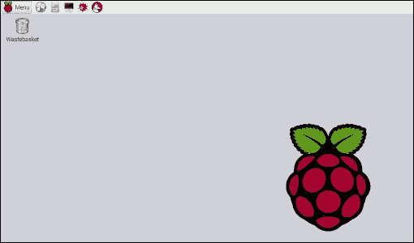

Debian Jessie 默认启动到 GUI

## 扩展文件系统

当你首次创建 Raspbian SD 卡时，不管你的 SD 卡有多大，文件系统中只剩下大约 200Mb 的空间。这并不够用，因此我们需要扩展文件系统，使其使用卡上的所有可用空间。

幸运的是，现在在 Raspberry Pi 上这非常容易，因为该功能已经集成在桌面上的 Raspberry Pi 配置工具中。

要访问新的配置工具，进入 **菜单**，选择 **首选项** | **Raspberry Pi 配置**。

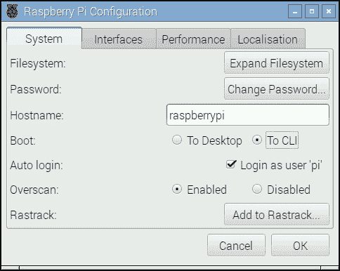

新的 Raspberry Pi 配置工具

### 提示

**告别 GUI**

我们的大部分工作将通过命令行界面（CLI）完成。因此，在我们稍后重启系统之前，让我们通过选择**到 CLI**选项来更改**启动**选项，如之前截图所示，以便以后启动到命令行。

无论如何，现在我们点击 **扩展文件系统** 按钮，几秒钟后，你会看到确认信息。文件系统将在系统下次重启时扩展。

### 使用 raspi-config 工具

如果你使用的是较旧版本的 Raspbian，或者你没有使用桌面 GUI，那么你需要使用 raspi-config 工具（这比我们以前必须在 shell 中手动执行要好得多）。首次启动时，你会直接进入 raspi-config 工具。

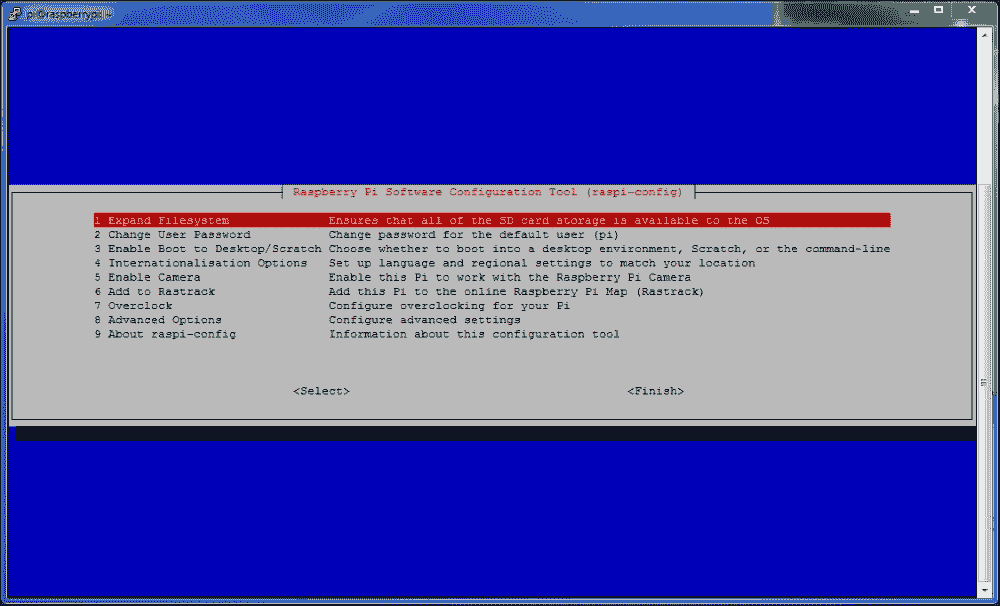

第一个选项是 `扩展文件系统` 选项；选择此项后，你会看到各种命令滚动在屏幕上。完成后，你会看到以下信息：

```
Root partition has been resized.
The filesystem will be enlarged upon the next reboot

```

点击 `确定`。

在配置界面上选择`完成`，并在提示时重启你的 Pi。

当你的 Pi 通过扩展后的文件系统重启后，系统会直接进入 shell 提示符，你可以使用默认的用户名和密码登录。

**登录**: `pi`

**密码**: `raspberry`

# 设置你的 Pi

当你进入 shell 并连接了以太网时，Pi 应该已经连接到你的家庭网络，并从路由器获取了 IP 地址。如果是这种情况，你应该能在登录提示之前看到分配的 **IP 地址**，如下图所示：

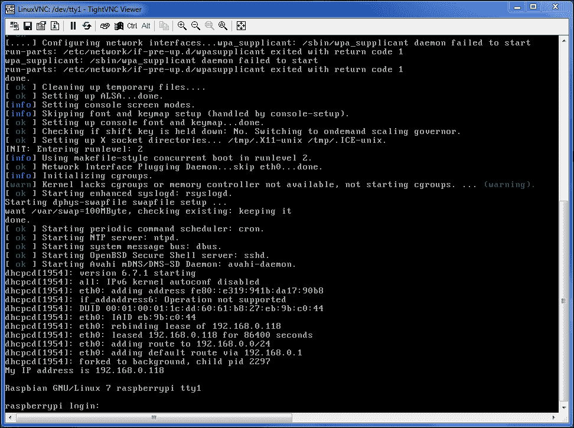

正如你从我的截图中看到的，它给出了我的 IP 地址，`192.168.0.118`。这很好，因为我现在可以通过安全 shell（SSH）客户端远程访问 Pi，舒适地坐在我的笔记本前。这在我的 Pi 在办公室时特别有用，我想坐在沙发上看电视，但仍然在操作它，这在我懒惰时经常发生。

### 提示

**下载示例代码**

你可以从你在[`www.packtpub.com`](http://www.packtpub.com)的账户中下载所有你购买的 Packt Publishing 书籍的示例代码文件。如果你是在其他地方购买的此书，你可以访问[`www.packtpub.com/support`](http://www.packtpub.com/support)并注册，以便将文件直接通过电子邮件发送给你。

要这样做，请下载**PuTTY**：一个允许你通过网络远程连接到 shell 终端的工具。你可以从[`www.putty.org`](http://www.putty.org)下载它。

安装并启动**PuTTY**，你就可以舒适地从沙发上远程连接到你的 Pi。

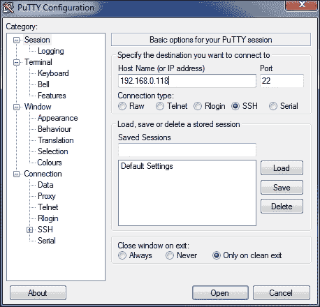

在“主机名”框中输入树莓派的 IP 地址，然后点击**打开**。你将通过远程终端窗口连接到你的 Pi。一旦登录后，你几乎可以在 Pi 上做任何事情，就像坐在它面前一样。

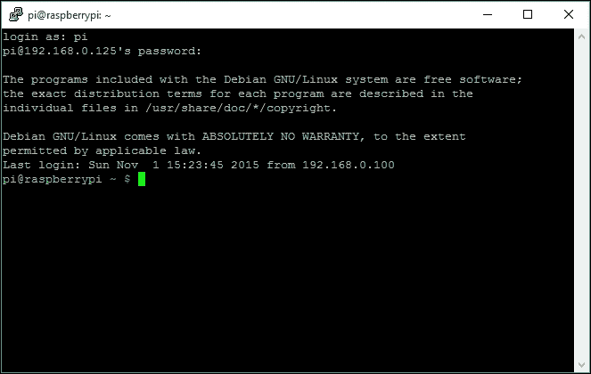

从现在开始，我们假设我们做的大部分工作都会通过远程 shell 会话进行，除非另有说明。

如果你想使用命令行来启动树莓派远程 shell——例如，从另一个 Linux 系统——请从你的终端窗口使用以下命令：

```
# ssh pi@192.168.0.125

```

接下来，你将被提示输入 Pi 的密码，并进入一个 shell 会话。

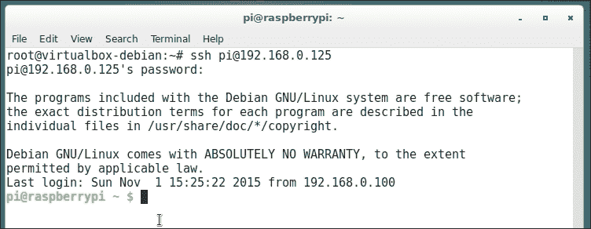

从 Debian 桌面终端窗口启动的 Pi shell 会话

## 更新系统

你应该养成定期更新操作系统的习惯；即使你可能已经安装了最新的镜像，仍然很有可能有可用的更新包。要更新操作系统，请输入以下命令：

```
$ sudo apt-get update

```

然后输入以下命令：

```
$ sudo apt-get dist-upgrade

```

这可能需要一些时间，具体取决于需要更新的数量。

## 获取正确的时间

树莓派没有内建的实时时钟硬件。这是为了降低板卡成本而故意省略的一个功能。相反，树莓派在启动时通过**网络时间协议**（**NTP**）从互联网上的时间服务器获取时间。然而，如果在启动时没有互联网连接，时间就会不准确。

### 注意

在我们的安全系统中，保持时间准确非常重要，以确保日志文件和图像上的时间戳是正确的。

### fake-hwclock

`fake-hwclock` 软件包已包含在最新的 Raspbian 发行版中，但在其他旧版本中并未包含。如果你需要安装它，请使用以下命令：

```
$ sudo apt-get install fake-hwclock

```

`fake-hwclock`是树莓派在没有网络连接时尝试保持时间的工具。它会定期保存当前时间，并在启动时恢复。这个方法的明显问题是，如果树莓派已经关机几天，那么时间将会设置为上次开机时的时间，使用的是`fake-hwclock`。

如果你想查看最后一次登录的时间，请输入以下命令：

```
$ cat /etc/fake-hwclock.data

```

### ntp

**网络时间协议**（**NTP**）在有互联网连接时使用，它可以从互联网上的一个或多个时间服务器请求最新且最准确的时间。

默认情况下，**ntp 服务**在最新的 Raspbian 发行版中是启用的，但如果没有互联网连接，它将在启动时从`fake-hwclock`获取时间。某些情况下，可能需要强制 ntp 服务从互联网更新——例如，如果在启动后某个时刻恢复了互联网连接。

要强制让 ntp 服务从互联网上更新，请使用以下命令：

```
$ service ntp stop
$ ntpd –gq
$ service ntp start

```

## 说到安全……

如果系统本身不安全，那么拥有安防系统就毫无意义。所以，现在我们将更改**pi**用户的默认密码。

在提示符下，输入以下命令：

```
$ sudo passwd pi
pi@raspberrypi ~ $ sudo passwd pi
Enter new UNIX password:
Retype new UNIX password:
passwd: password updated successfully

```

### 那么，这个 sudo 到底是啥意思？

你应该已经注意到，我们在终端窗口中运行的每个命令前都加上了`sudo`。这是为了让命令以**root 用户**身份执行——这是一种最高的安全级别。许多操作需要这种提升的安全权限。`sudo`实际上意味着*超级执行*。

如果你不想每次都输入`sudo`，那么可以通过输入以下命令切换到超级用户：

```
$ sudo su

```

你会看到提示符从`$`变成了`#`，这表示你现在以根用户身份运行命令。

所以，现在可能是时候更改 root 用户密码了！要这样做，输入以下命令：

```
# passwd
root@raspberrypi:/home/pi# passwd
Enter new UNIX password:
Retype new UNIX password:
passwd: password updated successfully
root@raspberrypi:/home/pi#
```

## 通过 Wi-Fi 连接

你还可以通过插入 USB 加密狗，将树莓派通过 Wi-Fi 连接到你的网络。为了实现这一点，还需要进行额外的配置步骤，超出了本章的范围，但有很多资源可以帮助你完成这个过程。

### 注意

你可以在 Rick Golden 所著的《**树莓派网络食谱**》中找到关于如何通过 Wi-Fi 连接树莓派的教程，该书由 Packt Publishing 出版 ([`www.packtpub.com/hardware-and-creative/raspberry-pi-networking-cookbook`](https://www.packtpub.com/hardware-and-creative/raspberry-pi-networking-cookbook))。

# 总结

在本章中，我们将树莓派从盒子中取出，并准备将其作为我们家庭安防系统的核心。过程中，我们安装并设置了操作系统，将树莓派连接到网络，并实现了远程访问。我们还确保了树莓派的安全性，并确保它能够保持准确的时间。

在下一章中，我们将探讨 GPIO 端口及其所具有的各种接口。我们将了解如何通过 GPIO 端口连接到树莓派的各种设备，包括开关和传感器，随着我们开始构建家庭安全系统。
