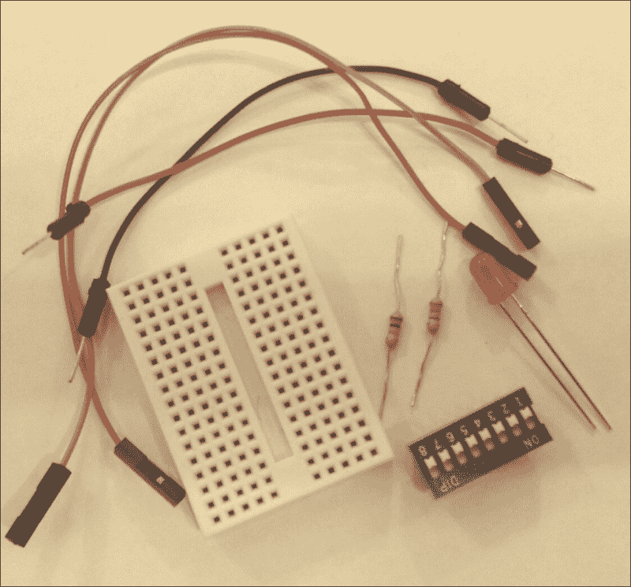
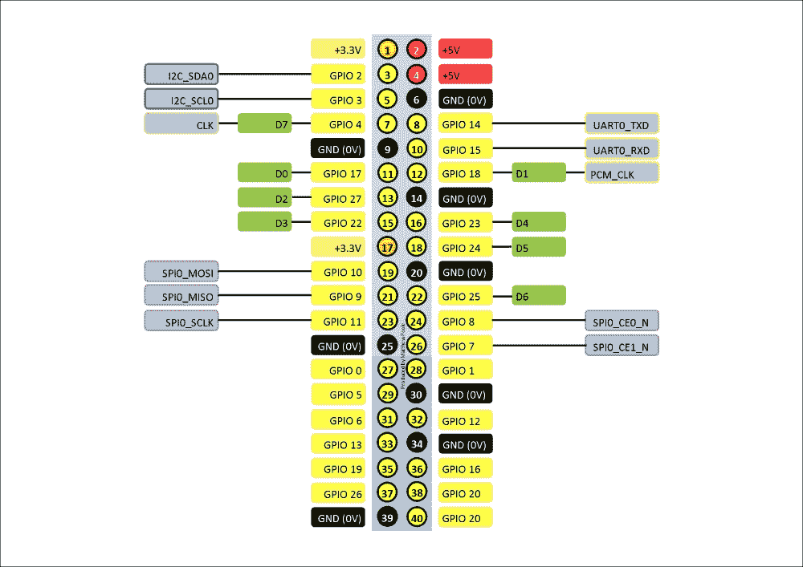
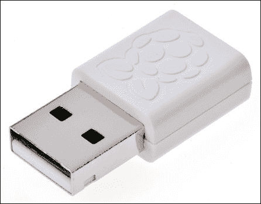
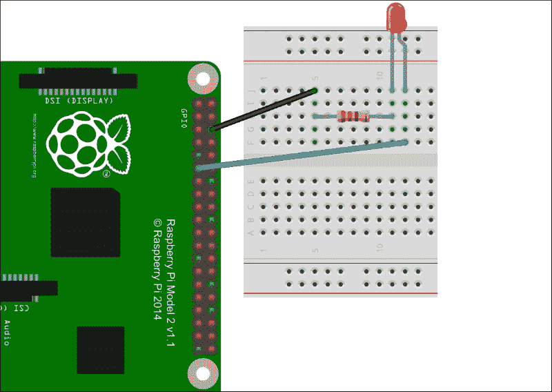
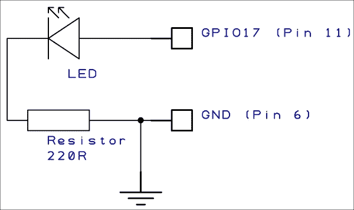
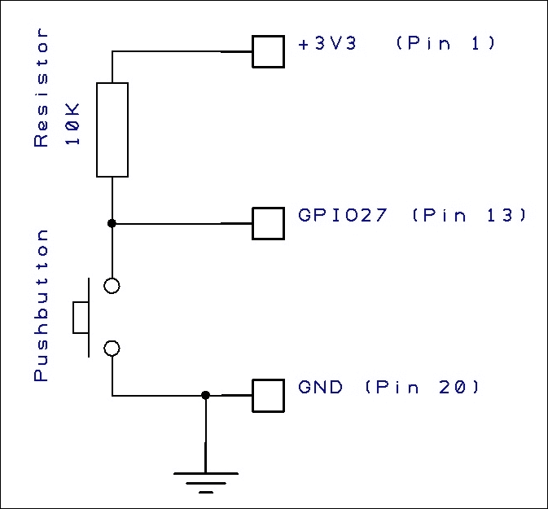
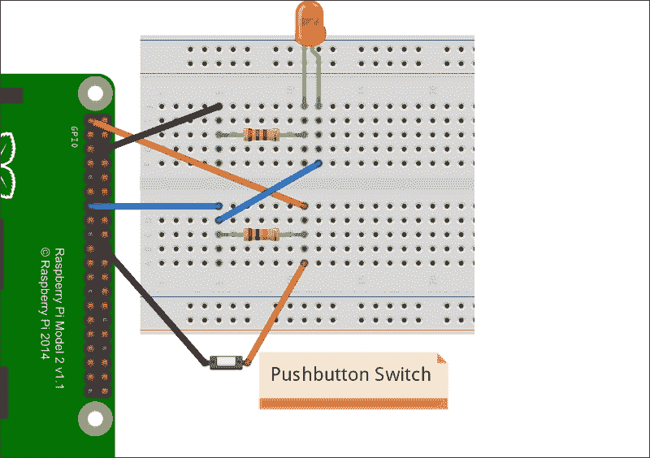
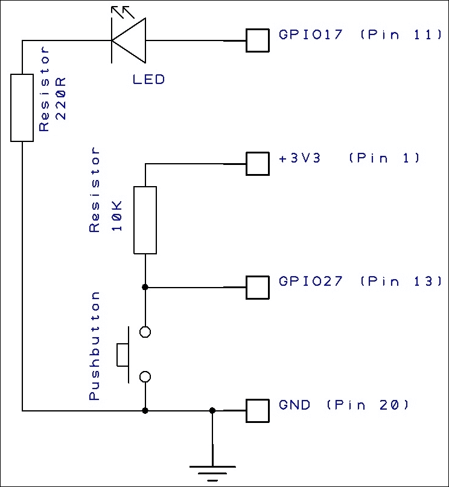

# 第二章：使用 GPIO 将设备连接到树莓派

树莓派有很多连接外设的方式，例如插入 USB 端口、连接设备到板载摄像头和显示端口，以及连接到组成**GPIO 连接器**的各种接口。作为我们家庭安全项目的一部分，我们将主要关注如何将设备连接到 GPIO 连接器。

在本章中，我们将涵盖以下主题：

+   检查 GPIO 连接器以及每个引脚的功能

+   学习将会在后续章节中使用的 I2C 和 SPI 总线

+   安全地将 LED 和开关连接到数据引脚，并通过简单的脚本访问这些数据引脚

+   理解 USB 端口及其局限性

# 前提条件

除了你的树莓派，你还需要以下部件来完成本章的项目：

+   面包板

+   一个 LED

+   一个 220 欧姆电阻（红色、红色、黑色）

+   一个 10K 欧姆电阻（棕色、黑色、橙色）

+   一个按钮开关或切换开关

+   一根连接线：

    我们的小配件集合

# 你好，GPIO

GPIO 连接器是树莓派板边缘的一组大引脚。在早期的型号中，这个连接器由 26 个引脚组成。但自从 B+型号开始，连接器有了 40 个引脚，尽管前 26 个引脚与以前的型号相同，我们将使用这 26 个引脚。你无需担心其余的引脚。

本质上，GPIO 连接器提供了对以下内容的访问：

+   电源

+   数字 I/O 引脚

+   I2C 总线

+   SPI 总线

+   UART 串行总线

GPIO 上的一些引脚具有多重功能，具体取决于它们的编程方式。以下图示是 GPIO 所有引脚的参考指南。黄色标签上的 GPIO 编号直接与 Broadcom 芯片上的编号对应，并且是脚本中通常使用的编号。



## 数字 I/O 引脚

GPIO 提供 8 个数字输入/输出引脚可供使用。这些引脚可以用于打开和关闭设备（输出模式），也可以用于检测外部设备的开关状态（输入模式）。每个引脚都可以独立配置为输入或输出操作，我在前面的图示中将其标记为**D0**到**D7**。

显然，如果我们使用每个引脚来驱动或感应一个独立的设备，我们将受到最多只能连接 8 个设备的限制。这在许多情况下可能不足够，因此在下一章中，我们将学习如何使用 GPIO 将更多设备连接到树莓派。

## I2C 总线

**互集成电路**（**I2C**）总线是一种低速接口，可以通过两线接口连接多个设备和简单传感器，而无需单独的时钟或设备选择线。通常情况下，这个总线的速度可以达到 100kbit/s。我们将在下一章中讨论这个内容，以帮助我们扩展数字输入/输出并连接更多设备。

## SPI 总线

**串行外设接口**（**SPI**）总线是一种同步双向串行连接，连接主设备和从设备。它可以用来访问更复杂的传感器或驱动显示器。

主设备提供同步，每次传输都通过**SCLK**（GPIO11/引脚 23）上的时钟脉冲进行同步。数据通过**MOSI**（主设备输出-从设备输入）和**MISO**（主设备输入-从设备输出）（分别是引脚 19 和 21）传输。

## UART 串行总线

**通用异步接收器和发射器**（**UART**）总线是一种通过串行数据连接与外部设备通信的方式，也是树莓派访问设备数据的一种常见方式，像 GPS 模块通常带有串行连接。由于它也与操作系统的串行控制台相连接，因此设置树莓派与 UART 连接的设备进行通信时可能会有些复杂。

## USB 端口

我们可能都很熟悉**通用串行总线**（**USB**）端口，因为我们用它们连接各种设备到我们的个人电脑，比如键盘、鼠标和硬盘。在树莓派上也是如此；我们可以连接键盘、鼠标和调制解调器，从而实现 Wi-Fi 和蓝牙连接。



官方树莓派 USB Wi-Fi 调制解调器

在早期的树莓派型号中，端口提供的电流非常低，如果连接的设备拉取过多电流，就会导致各种问题。从 B+型号开始，电流供应得到了显著改善，现在可以毫无问题地连接 GSM/LTE 调制解调器。

然而，如果你想连接硬盘驱动器等设备，仍然存在一些限制；这些设备的电流消耗可能超过树莓派 USB 端口所能提供的电流，因此建议在连接这类设备时使用带电源的 USB 集线器或 USB 电源注入器。

## 电源连接

GPIO 连接器还提供了对板载电源的访问。+5V 连接（引脚 2 和 4）基本上是从连接到微型 USB 电源端口的外部电源输入的+5V。这可以用来为小型外部电路供电，尽管如果需要较大电流，建议使用额外的外部+5V 电源。

+3.3V 电源（引脚 1 和 17）是板载 3.3V 稳压器的输出，提供最多 50mA 的小电流。如果你需要为外部电路提供超过 50mA 的电流，则应使用外部电源。我将在本书后面介绍如何制作一个外部电源。

### 注意

树莓派上的 I/O 引脚工作在 3.3V 电平上。如果将高于此电压的电压接入引脚，可能会永久性损坏你的 Pi。如果你遵循本书中的说明，一切应该没问题，但随机连接消耗大量电力的设备会损坏它！

# 熟悉 GPIO

在我们开始将许多东西连接到我们的 Pi 板之前，最好先通过一些简单的项目熟悉一下 GPIO，这将帮助我们理解如何使用 Shell 脚本与数字 I/O 引脚交互。

## 让这里有光

这个简单的小项目演示了如何将 GPIO 输出连接到 LED，并使用 Shell 命令打开和关闭它。

下图展示了如何使用面包板连接电路：



### 注意

你刚看到的漂亮电路图是使用 fritzing 这个免费软件工具制作的，fritzing 是一个开源硬件项目，旨在使电子学成为任何人都可以用作创意材料的领域。你可以从[fritzing.org](http://fritzing.org)下载它。

LED 的阳极（正极）连接到**D0**数字 I/O（连接器的第 11 针或 GPIO17）。当该引脚被打开时，它将为 LED 提供 3.3V 电源。

LED 通过一个 220R 的电阻与接地引脚连接，电阻连接在阴极（负极）上。电阻限制了 LED 的电压和电流，否则它会烧坏，因为 LED 只能承受约 2V 的电压。对于一个 3.3V 供电，LED 的电流大约为 10mA，220R 的电阻可以很好地保护 LED 和 GPIO。

这是它的电路图：



### 注意

**计算 LED 电阻值…**

尽管本书并不是一本电子学理论课程，但我觉得展示如何使用欧姆定律计算 LED 的电阻值会很有用，因为我们稍后还会涉及这个内容。

正如我提到的，一个典型的 LED 在其两端会有约 2V 的电压降，尽管这取决于颜色和类型。这被称为设备的正向电压或 VLED。

一个 LED 所需的电流大约为 10mA，同样这取决于它的规格。我们称流过 LED 的电流为 ILED。

本质上，电阻上的电压将是供电电压减去 LED 的电压降（例如，2V）。所以，如果我们有一个 12V 的电源（VS），电阻上的电压将是 10V（VS – VLED）。

根据欧姆定律，电阻 R 是它两端的电压除以流过它的电流：R = V / I。由于我们需要 10mA 的电流流过它，且两端电压为 10V，因此所需的电阻值为 10V 除以 0.01A，即 1000 欧姆或 1K。

总结一下，R = (VS - VLED) / ILED。

现在，来控制 LED 的开关：GPIO 引脚实际上在 Linux 文件系统中被映射为设备，所以使用 Shell 命令非常简单，尽管有很多库可以让你使用 Python 等语言控制 GPIO。但为了避免学习新语言，我们将通过 Shell 命令完成所有操作。

我们连接的**D0**引脚实际上是 GPIO17（参考前面的图示）。我们需要做的第一件事是创建对这个 GPIO 引脚的文件访问。我们可以通过以下命令实现：

```
$ sudo echo 17 > /sys/class/gpio/export

```

然后，我们需要将引脚的方向设置为输出：

```
$ sudo echo out > /sys/class/gpio/gpio17/direction

```

接下来，我们可以将引脚设置为高电平，打开 LED：

```
$ sudo echo 1 > /sys/class/gpio/gpio17/value

```

要关闭 LED，我们使用这个命令：

```
$ sudo echo 0 > /sys/class/gpio/gpio17/value

```

一旦我们完成 GPIO 端口的操作，就可以移除它的文件访问：

```
$ sudo echo 17 > /sys/class/gpio/unexport

```

### 开始闪烁…

我们可以将这些命令组合成一个 Bash 脚本来创建一个闪烁的 LED。要创建闪烁脚本，请在**nano**或其他文本编辑器中创建一个新的文本文件。或者，如我通常做的那样（别忘了我有点懒），在你的笔记本上创建文本文件，然后通过**WinSCP**将其复制到远程树莓派上（如果你希望避免一些麻烦，请阅读下面的注释）。

以下是`led-flash.sh`的代码列表：

```
#!/bin/bash
sudo echo 17 > /sys/class/gpio/export
sudo echo out > /sys/class/gpio/gpio17/direction
# loop forever
while true
do
  sudo echo 1 > /sys/class/gpio/gpio17/value
  sleep 0.5
  sudo echo 0 > /sys/class/gpio/gpio17/value
  sleep 0.5
done
```

### 注：

如果你使用 Windows 来创建文件，请记得将文件保存为 Linux 格式的行尾（即单个`0x0a`或换行符字符），而不是 Windows 格式（`0x0a + 0x0d`或换行符加回车符），否则你可能会发现 Bash 脚本在树莓派上运行不正常。Windows 上的文本编辑器，如优秀的 Notepad++，会自动将脚本的行尾格式转换成 Linux 格式。

通过调用`led-flash.sh`来运行脚本（假设你把它命名为这个）。如果你与脚本位于同一目录下，可以通过输入以下命令来执行：

```
$ sudo bash ./led-flash.sh

```

由于这是一个无限循环，LED 在半秒间隔内闪烁，你需要通过使用*CTRL* + *C*来中断它，从而停止脚本。

别忘了使用以下命令将 GPIO 引脚从文件访问中移除：

```
$ sudo echo 17 > /sys/class/gpio/unexport

```

否则，如果你重新运行脚本，你会看到错误信息：`echo:` `write` `error:` `Device` `or` `resource` `busy`，因为第一行再次尝试为 GPIO17 设置文件访问。

## 添加开关

在这个项目中，我们将看到如何将开关连接到 GPIO 输入，并编写一个 Shell 脚本来读取开关的状态——也就是说，判断它是开启还是关闭。

将开关连接到你的树莓派的 GPIO27 引脚，如下图所示：


### 振作起来

关于 GPIO 输入，有一点非常重要：它们处于所谓的*浮空状态*。这意味着，对于操作系统来说，除非它接收到已知电压，否则无法确定其参考状态。

这就是我们电阻发挥作用的地方——它将 GPIO 引脚拉至已知电压 3.3V，从而使其默认状态为高电平（或二进制`1`）。

当按钮开关被按下时，它会将 GPIO 引脚拉至 0V，即低电平（或二进制`0`）。

这是我们 GPIO 开关的电路图：



### 检测脚本

现在我们已经将开关连接到树莓派，我们需要编写一个小脚本来检测开关是否被按下。

这与之前显示的 LED 脚本类似，但这次我们将 GPIO 引脚设置为输入并读取其逻辑电平。

在这个项目中，我们将开关连接到**D2**，即**GPIO27**（请参考之前的 GPIO 引脚图）。与之前一样，我们需要通过输入以下命令为引脚创建文件访问权限：

```
$ sudo echo 27 > /sys/class/gpio/export

```

现在，将它的方向设置为`in`：

```
$ sudo echo in > /sys/class/gpio/gpio27/direction

```

现在我们准备好读取它的值了，可以使用以下命令来完成：

```
$ sudo cat /sys/class/gpio/gpio17/value

```

你会注意到它将返回`1`，或者说是高电平。这是由于我们之前提到的上拉电阻。意味着它的默认状态是高电平，当开关没有按下时。

当开关按下时，值应该读取为`0`或低电平。如果你有超过两只手，可以试试按下按钮并重新运行命令。或者，我们可以创建一个脚本来轮询开关状态。

`poll-switch.sh`的代码清单如下：

```
#!/bin/bash
sudo echo 27 > /sys/class/gpio/export
sudo echo in > /sys/class/gpio/gpio27/direction

# loop forever
while true
do
  # read the switch state
  SWITCH=$(sudo cat /sys/class/gpio/gpio27/value)

  if [ $SWITCH == 1 ]; then
    #switch not pushed so wait for a second
    sleep 1
  else
    #switch was pushed
    echo "You've pushed my button"
  fi
done
```

当你运行脚本并按下按钮时，你应该会看到`你按下了我的按钮`在控制台屏幕上滚动，直到你停止按下按钮。

别忘了，在完成 GPIO 端口的使用后，我们可以删除它的文件访问权限：

```
$ sudo echo 27 > /sys/class/gpio/unexport

```

我们现在已经看到了如何轻松读取开关输入，使用相同的电路和脚本可以读取其他传感器，例如门接触开关、簧片开关，或者任何其他具有开关状态的设备。

# 世界上最精密的灯光开关

通过将之前的两个小项目结合起来，我们现在可以创建一个系统，当按下按钮开关时执行一些有用的操作——例如，点亮我们也连接的 LED。虽然我们可以直接将 LED 连接到开关和电池，但那样不仅无聊，而且也违背了我们要做的事情的意义，那就是通过编程感知和控制事物。

这是我们精密灯光开关的面包板布局：



这是电路图：



## 照明脚本

我们的完整 Bash 脚本将展示如何控制精密灯光开关。该脚本将无限循环，检测开关的 GPIO 引脚状态，并在按下开关时打开 LED GPIO 引脚。

`light-switch.sh`的代码清单如下：

```
#!/bin/bash

#set up the LED GPIO pin
sudo echo 17 > /sys/class/gpio/export
sudo echo out > /sys/class/gpio/gpio17/direction

#set up the switch GPIO pin
sudo echo 27 > /sys/class/gpio/export
sudo echo in > /sys/class/gpio/gpio27/direction

# loop forever
while true
do
  # read the switch state
  SWITCH=$(sudo cat /sys/class/gpio/gpio27/value)

  #0=Pushed 1=Not Pushed
  if [ $SWITCH = "1" ]
  then
    #switch not pushed so turn off LED pin
    sudo echo 0 > /sys/class/gpio/gpio17/value
  else
    #switch was pushed so turn on LED pin
    sudo echo 1 > /sys/class/gpio/gpio17/value
  fi
  #short delay
  sleep 0.5
done
```

所以，现在我们有了一个脚本，它可以检测输入状态并做出响应；在这种情况下，它将打开一个 LED。我们现在正在构建如何组合我们的家庭安全系统的基础。

### 注意

记住，不要在 LED 位置上连接任何设备，例如蜂鸣器或其他大量消耗电流的设备。这可能会永久性地损坏你的板子。我们将在本书后面部分探讨如何控制需要更高功率的设备。

# 总结

在本章中，我们介绍了通过查看 GPIO 上可用的各种接口，将 Raspberry Pi 连接到外部世界的不同方法。我们了解了如何将设备连接到 Raspberry Pi GPIO 连接器上的数字引脚，并使用简单的 Bash 脚本进行控制和读取。特别是，我们已经安全且正确地将开关连接到数字输入引脚，这将为我们的家庭安全检测电路奠定基础。

在下一章中，我们将探讨如何扩展我们可以连接到 Raspberry Pi 的设备数量，通过利用 GPIO 上其他接口，并构建我们自己的输入/输出扩展板，克服只有 8 个数字引脚可用的限制。
