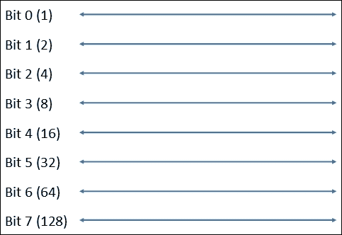
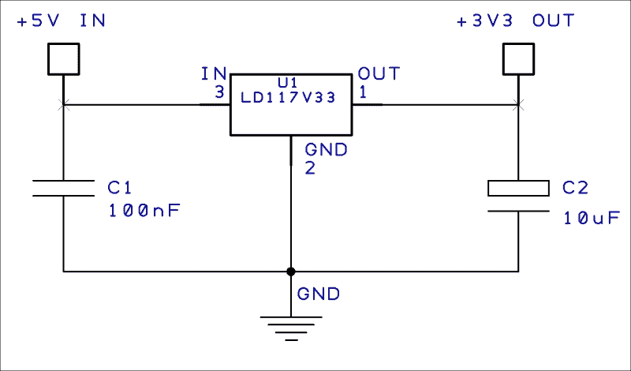
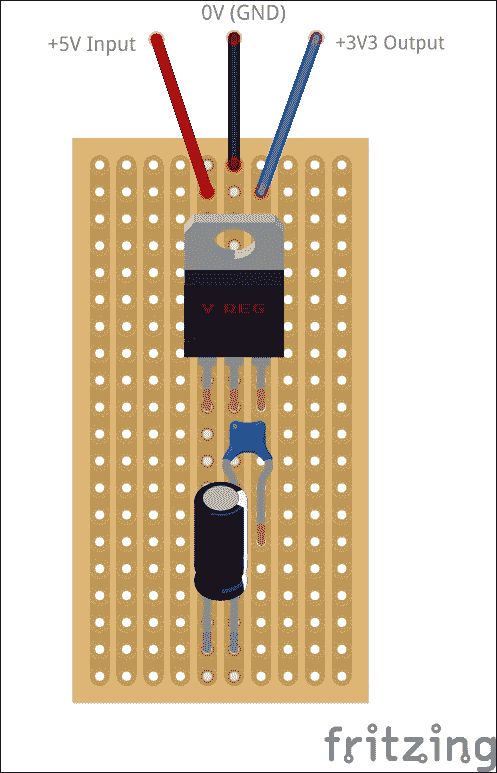
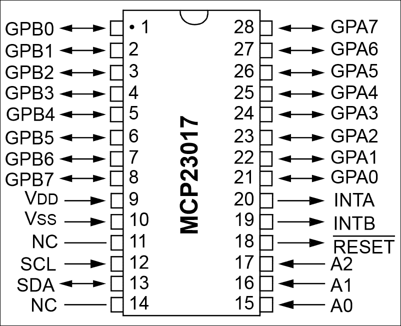
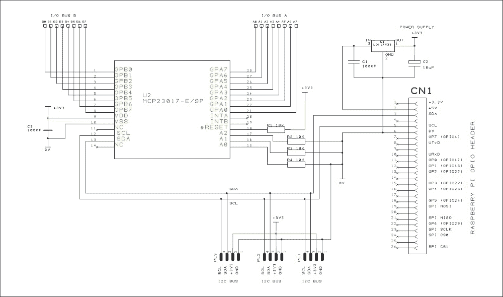
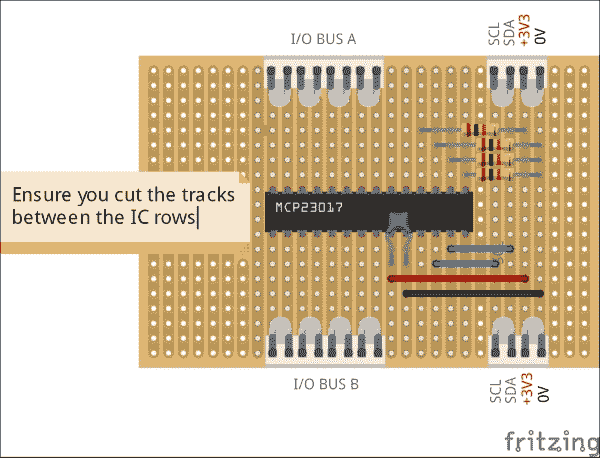
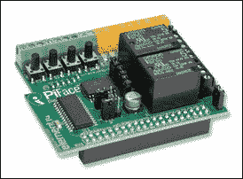
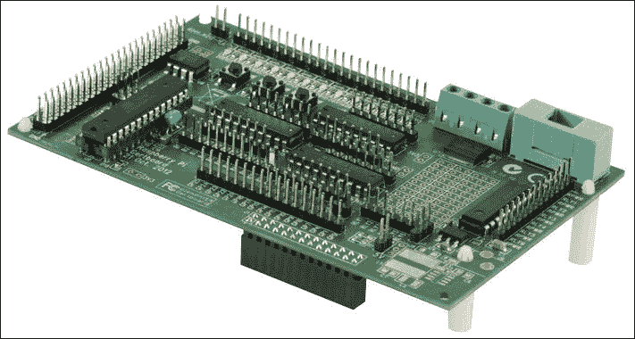

# 第三章：扩展你的树莓派以连接更多设备

现在我们将探讨如何扩展可以连接到树莓派的设备数量，克服仅有 8 个数字引脚的限制。我们将通过制作自己的扩展板来实现这一目标，这样理论上可以提供无限数量的数字输入和输出。

我们还将通过构建自己的 +3.3V 电源来克服 +3.3V 电源的限制，这个电源从树莓派的 +5V 电源中提取。

本章将涵盖以下内容：

+   详细了解 I²C 总线

+   学习串并转换与并串转换

+   构建一个 +3.3V 电源

+   构建一个基于 I2C 的端口扩展器，提供更多的输入和输出

+   了解替代的现成扩展板

# 前提条件

在本章中的项目中，除了树莓派，你还需要以下组件：

+   一块铜条板（或 Veroboard®）

+   一颗 LD1117V33 电压调节器

+   一颗 2 x 100nF，16V 的陶瓷电容

+   一颗 10uF，16V 的电解电容

+   一颗 1 x MCP23017 16 位端口扩展器 IC

+   一颗 4 x 10K 欧姆电阻

+   一根连接线

# I2C 总线

在上一章中，我们简要介绍了 I2C 总线（或称为互联集成电路总线），这是一种通过仅用两根线将多个设备连接在一起的方法。I2C 是由飞利浦公司在 1980 年代初发明的，作为一种将计算机外设通过统一协议连接在一起的方式。你可以将 I2C 看作一种早期形式的 USB。

与以太网（通常以高达 1Gbit/s 的速度运行）或 USB（最大可达 480Mbit/s）等接口相比，I2C 的速度通常较低，最高仅为 100kbit/s。然而，这对于连接基本传感器、显示设备或其他外设（如实时时钟）已经足够。事实上，I2C 协议还有一些更快的版本，某些设备可能会支持。

## 仅需 2 根线

I2C 是一种双向串行通信协议，通过两根线进行数据传输：

+   **串行数据线** (**SDA**) 负责在主设备与从设备之间传输数据。参考第二章《使用 GPIO 连接设备到树莓派》中的 GPIO 引脚参考，这是 GPIO 连接器的第 3 引脚。

+   **串行时钟线** (**SCL**) 负责控制总线上数据的时序和流量控制。这是 GPIO 连接器的第 5 引脚。

你应该记得我们在上一章提到过的上拉电阻，它确保 GPIO 数字输入被拉到已知状态。对于 I2C 总线的两条线路，这也是必须的，默认情况下应该使用电阻将线路拉高。然而，在树莓派上，这已经为我们完成了，因此在我们的情况下不需要担心这个问题。

## 你的地址是什么？

那么，如果我们只需要两根线就能与多个设备通信，树莓派如何知道与哪个设备通信呢？这就是 I2C 协议发挥作用的地方。每个连接到总线的设备都有自己独特的 ID 或地址，由 7 位或 10 位组成。有些设备允许您设置地址以确保它在系统中的唯一性，而其他设备则由制造商硬编码其地址。

两种寻址方法（7 位和 10 位）是兼容的，您可以在同一总线上连接使用任一方法的设备，因为树莓派本身支持这两种方法。因此，使用 10 位寻址方案，您会发现我们可以通过 I2C 总线连接许多设备，而不仅仅是 GPIO 上的有限数字引脚！

## 存在一个平行宇宙

数据通常以串行模式或并行模式传输，具体取决于所需的数据传输速度、线路距离以及功能等因素。大多数系统之间的数据通信*是通过*串行模式在几根线路上传输的，例如之前提到的 I2C 总线，但这也包括以太网、RS232/422 和 USB 等。

在计算机系统中，数据是通过宽度与数字系统的字长相匹配的*总线*以并行模式传输的。在并行模式下，数据字的所有位同时通过各自的线路在总线上传输，而不是像串行模式那样按顺序在单一线路上传输。

我们讨论过的数字 I/O 引脚（包括树莓派 GPIO 连接器上的引脚）通常作为并行总线组合在一起。在我们的系统中，我们将使用宽度为 8 位的并行总线（即 8 位数字 I/O 引脚组）。也就是说，总线有 8 根线路，可以使用 8 位二进制值（我们的字长）进行设置或读取。

8 位数据总线的表示

因此，在前面的图示中，我们有总线上的 8 根数字 I/O 线路。如果我们希望使线路 0、1 和 4*为高电平*或*开启*，而其余线路*为低电平*或*关闭*，那么我们将对总线进行寻址并将其设置为以下值：

+   用二进制表示，这将是 00010011

+   用十六进制表示，这将是*0x13*

+   用十进制表示，这将是 19（由*16+2+1*表示）

换句话说，要打开数据线 0、1 和 4，我们将字节值 19 发送到总线的地址。

### 串行转并行转换

那么，现在我们知道了如何通过我们的 I2C 总线，使用串行接口打开或关闭某些数字输出，或者读取某些数字输入，接下来该如何操作呢？

幸运的是，有许多**集成电路**（**ICs**）可以帮助我们简单、轻松地完成这项工作。这些集成电路被称为**移位寄存器**，它们执行**串行到并行转换**，将来自 I2C 串行总线的数据转换为并行表示，通过设置每个并行总线输出。

当读取并行总线数据线作为输入时，反向操作发生了，将位数据转换为 I2C 总线上的串行形式；这被称为**并行到串行**转换。

这是一个相当简化的概述，市面上有许多资源可以解释这些操作；我们将在本章后面看到这些操作的实际应用，但首先……

# 给我电源

你会记得在上一章中提到，大多数与 GPIO 相关的操作都在+3.3V 电平上进行，而不是通常与数字电路相关的+5V 电平。我们的基于 I2C 的移位寄存器也是如此——它们需要在+3.3V 电平上工作，以便与树莓派兼容。

然而，你还会记得，树莓派直接提供的+3.3V 电源并不多——实际上只有 50mA。这对于我们的接口来说真的不够。因此，在继续之前，我们将自己构建一个+3.3V 电源，它足以满足我们系统的需求。

对于我们的电源，我们将使用一个基本的 3.3V **电压调节器**（型号**LD1117V33**），它将从树莓派提供的稍多一些的+5V 电源调节为平稳的+3.3V 电源。我们应该能够从这个电源中提取几百毫安的电流——足够供我们安全系统的 I/O 电路使用。

我们电源所需的部件如下：

+   一颗 LD1117V33 电压调节器

+   一颗 100nF、16V 的陶瓷电容

+   一颗 10uF、16V 的电解电容

这是我们+3.3V 电源的电路图：

和我们所有的元件一样，LD1117V33 电压调节器可以从许多电子元件供应商那里广泛购买到。

我们的电源可以在一小块条形板上轻松构建，如下所示：

### 注意

上述布局中的条形板是从顶部展示的。也就是说，铜轨位于板子的底面，元件从普通的顶面插入并焊接到底下的条形带中。在这种布局中，不需要切割条形板上的任何轨道。

# 构建 I2C 扩展器

好的，现在我们已经弄清楚了如何为我们提供更多的数字 I/O 引脚，并为此构建了电源，我们可以开始构建我们的扩展端口了。

为了做到这一点，我们将使用一颗专门为此设计的芯片：**MCP23017**，由 Microchip 制造，并且可以从电子供应商那里广泛购买到。

MCP23017 是一款集成电路，直接连接到 I2C 总线（我们之前提到的 SDA 和 SCL 引脚），为我们提供 16 个双向输入和输出引脚。如果需要，我们可以将最多 8 个此类芯片连接到同一总线上，从而提供最多 128 个输入和输出（是的，我知道我之前说过“几乎无限”，但稍后我会解释）。

MCP23017 集成电路引脚图

### 注意

MCP23017 的完整数据手册可以在 Microchip 网站上找到，网址是 [www.microchip.com/MCP23017](http://www.microchip.com/MCP23017)。

## I2C 端口扩展器电路

构建你的端口扩展器所需的基本元件如下：

+   1 个 MCP23017 16 位端口扩展器 IC

+   1 个 10K 欧姆电阻（4 个）

+   1 个 100nF、16V 陶瓷电容

+   1 块铜条板（或 Veroboard®）

+   一根接线

这是我们 I2C 扩展端口电路的电路图。看起来有些复杂，但实际上大部分线路是用来连接外部世界的：

### 让我们逐步解析电路

在右侧，连接器 CN1 是我们的 Raspberry Pi GPIO 连接器——注意我们只使用了四个引脚：

+   +5V 输出（引脚 2）

+   I2C SDA（引脚 3）

+   I2C SCL（引脚 5）

+   0V/GND（引脚 6）

你会看到我的朋友，之前提到的 +3.3V 稳压器（U1、C1 和 C2）。它将来自 Raspberry Pi 的 +5V 输出转换为 +3.3V，以供电路的其余部分使用。

主要元件是 U2——我们的 **MCP23017** **端口扩展器** 芯片。芯片的引脚 9 和 10 分别连接到 +3.3V 电源和 GND，C3 用作靠近芯片的去耦电容器，用于减少电源上的噪声。

MCP23017 可以作为 16 位扩展器使用，或者作为 2 个 8 位扩展器使用。在我们的电路中，我们将设备分为 2 个 8 位总线：I/O 总线 A 和 I/O 总线 B。每个总线上的引脚可以被编程为输入或输出。

### 小贴士

**连接输入/输出引脚**

我们总线上的输入和输出引脚通常不能直接连接到设备——它们提供的电流有限，需要正确接口连接到蜂鸣器、灯光等设备；还必须保护它们免受损坏的输入信号。下一章我们将学习如何安全地连接到 I/O 端口。

Raspberry Pi 的 I2C SDA/SCL 线连接到芯片的引脚 12 和 13。你会看到还有额外的 I2C 输出（PL1 到 PL3），这表明我们可以将其他设备连接到 I2C 总线，例如另一个 MCP23017 芯片，以提供更多的 16 个数字 I/O。

电阻 R1 用于将 RESET 引脚（18）保持高电平。将此引脚拉低可以重置芯片。

电阻 R2 至 R4 用于将地址引脚 A0 至 A2（引脚 15-17）保持低电平。

**高电平与低电平**

当我们使用术语*高*和*低*来描述数字引脚或输入时，我们只是简单地描述引脚的逻辑电平分别是二进制 1 或 0。数字引脚不喜欢处于*浮空*状态——即既不高也不低——因为这会导致不可预测的操作。因此，我们始终确保它们保持在确定的逻辑电平。一般来说，将引脚连接到 0V（或地）可以确保它保持在逻辑电平 0，将其连接到正电源（如 3.3V）则可以确保它保持在逻辑电平 1。

记得我之前提到过，你可以将大量设备连接到 I2C 总线上，从而为我们提供几乎无限的 I/O 引脚？实际上，在许多情况下，这并不完全正确。这是因为 I2C 设备的寻址方式，使得当所有设备都连接到同一根两线时（通过其唯一的地址），所有设备都可以被识别。每个设备的地址是由制造商事先约定好的，以确保大家的设备能够在同一总线上正常工作，不会产生冲突。因此，地址是预先编程到设备中的。

MCP23017 已经赋予了一个唯一的基本地址，但可以通过将地址引脚 A0-A2 设置为高或低来修改；因此，实际上，它可以配置为 8 个地址中的一个。这就是为什么你只能在同一 I2C 总线上使用最多 8 个此类芯片，从而为我们提供理论上的最大 128 个 I/O 引脚（即 16 个 I/O x 8 个芯片）。

## 构建你的扩展板

这个电路可以轻松地在一小块条形板上构建。下面的图片显示了布局的示例，显得比电路图要简单一些。在下一章中，我们将学习如何连接我们的板并编程，以便检查它是否正常工作。

### 提示

使用条形板时，确保你切断 MCP23017 两排针脚之间的走线，以免它们短路。你可以从许多电子供应商处购买走线切割工具，这样可以轻松完成这项任务。再次提醒，前面提到的布局中，铜条位于板子下方，元件则位于平面侧。

你可能还想将+3.3V 电源电路加到同一块条形板上，这样可以将所有部件集成在一起。

### 注意

在下一章中，我们将学习如何编程设备，以便我们能将其用于我们的家庭安防系统。

# 使用现成的扩展板

虽然自己动手制作设备更令人满足，但如果你还不自信使用焊接铁，或者只是简单地没有时间，你可能会想购买一些现成的扩展板用于你的家庭安防系统。

以下是一些现成的扩展板，你可以获取；它们应该可以在我们稍作修改脚本、以支持硬件所需的库后，作为我们家庭安防系统的一部分使用。

## Hobbytronics MCP23017 扩展端口套件

这个套件几乎与本章前面部分中我们自己的电路完全相同。该套件包括一个 MCP23017 芯片、一个 PCB 和各种连接器。板卡设计成可以串联在一起，因此你可以拥有多个扩展板，以便为你提供更多的输入/输出端口。请注意，这个套件不是预组装的，需要焊接，但我认为我应该把它包括在内，因为它是我在原型设计时用来构建这种系统的板卡。你可以直接从 Hobbytronics 购买，[`bit.ly/mcp23017`](http://bit.ly/mcp23017)。

## PiFace 数字 I/O 扩展板

**PiFace 数字 I/O 扩展板**是我们板卡的预组装版本，但它使用的是**MSP23S17**芯片变体，该芯片通过**SPI 总线**工作，而不是 I2C 总线。该板设计有 8 个输入和 8 个输出，以及若干其他硬件组件，包括几个继电器、一些 LED 和开关。请注意，本书中针对我们系统的代码需要修改，以便与此板兼容，因为它使用了不同的接口和不同的库。你可以从 Farnell element14 购买，[`bit.ly/2434230`](http://bit.ly/2434230)。

PiFace 数字 I/O 扩展板

## Gertboard

**Gertboard**是一个 Raspberry Pi 附加板，由 Gert van Loo 设计——他是参与原始 Raspberry Pi 设计的硬件工程师之一。

这是一款功能强大且价格合理的板卡，已完全组装，具备 12 个缓冲的输入/输出线，适用于开启需要较大电流的设备（如蜂鸣器和灯光）的开集电极驱动器，还包括一个数字转模拟转换器。

你只能将一个这样的板卡连接到你的 Raspberry Pi，因此如果需要更多的 I/O 线，你还需要使用其他设备。但它是一个非常适合实验的板卡。有趣的是，它配备了**ATmega 微控制器**，这是 Arduino 使用的相同微控制器，而且你实际上可以为该设备使用**Arduino**开发环境。

再次提醒，本书中针对我们系统的代码需要修改，以便与此板兼容。

Gertboard 可通过 Farnell element14 购买，[`bit.ly/2250034`](http://bit.ly/2250034)。

组装好的 Gertboard

# 总结

我们现在已经详细了解了 I2C 总线，并学习了如何使用这种接口构建扩展端口，以便可以连接更多设备到我们的 Raspberry Pi，而不再仅限于 Raspberry Pi 的 GPIO 端口提供的 8 个数字 I/O 引脚。此外，我们还探索了其他现成的板卡，可以用于连接更多设备到 Raspberry Pi。我们还构建了一个电源供应器，可以提供比 Raspberry Pi 直接提供的更多的+3.3V 电力。

在下一章，我们将开始实际连接到我们的家庭安全系统，例如磁性传感器和其他类型的接触设备，并学习如何使用 Bash 脚本编程我们的 I2C 扩展端口，以便读取传感器的状态并开启警告 LED。我们还将开始开发系统的控制脚本，这将使我们能够布防和撤防系统，并添加延迟定时器。
