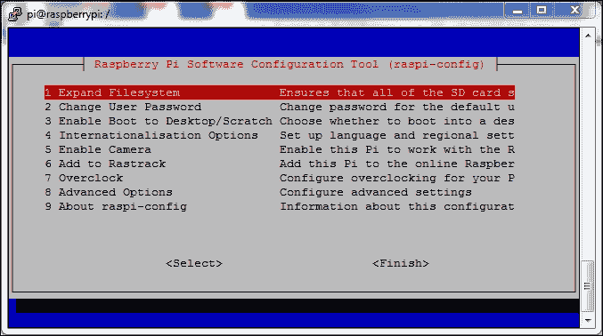
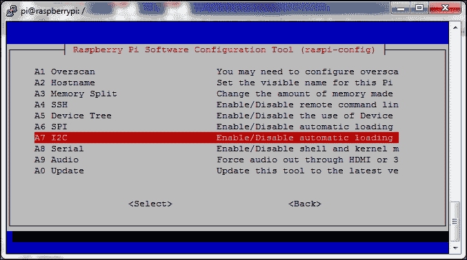
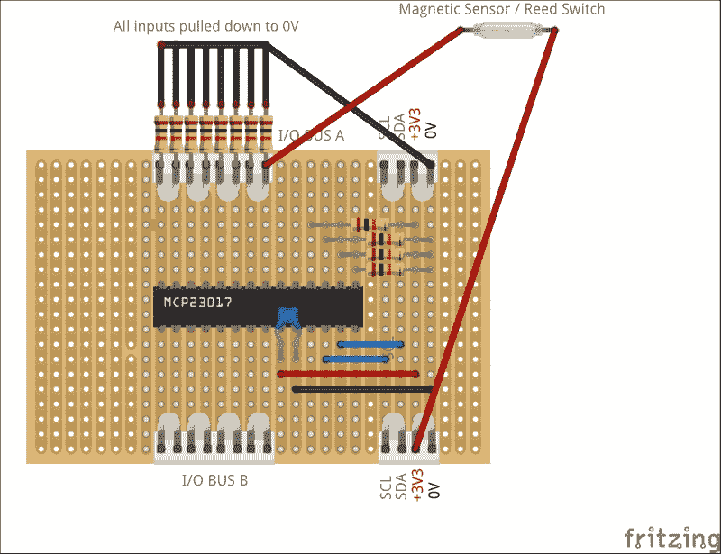
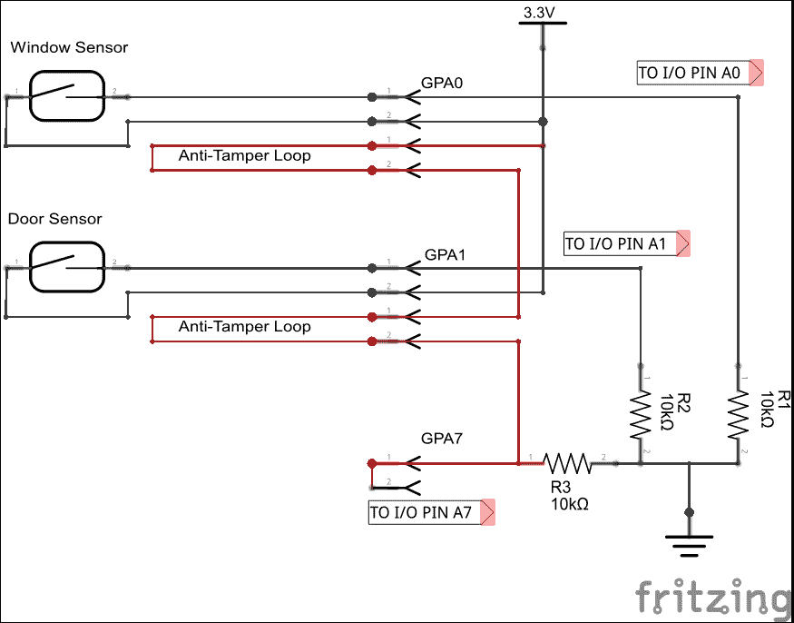

# 第四章. 添加磁性接触传感器

现在我们已经搭建了端口扩展器硬件，我们需要学习如何编程，使我们的树莓派能够检测到连接到它的设备，作为我们家庭安全系统的一部分。我们将首先通过连接开关，以磁性传感器的形式将其接入系统——这是家庭安全系统中最常见的组件，用于通过门窗检测入侵。

在本章中，我们将涵盖以下主题：

+   了解簧片开关及其作为门传感器的工作原理

+   在树莓派上启用并设置 I2C 总线

+   将我们的传感器连接到端口扩展器的输入端

+   学习如何通过 Bash 脚本访问我们的 I2C 端口扩展器

+   编写一个脚本，检测我们门传感器的状态

+   查看其他类型的接触传感器，这些传感器也可以以相同的方式连接和编程

# 前提条件

本章练习所需的部件如下：

+   我们的树莓派和端口扩展器板

+   8 个 10K 欧姆电阻

+   磁性门传感器和磁铁

+   一根连接线

+   一根 4 芯报警线

# 磁性接触传感器的工作原理

**簧片开关**本质上构成了我们的**磁性接触传感器**。簧片开关由两根金属触点组成，这些触点是由磁性材料（称为簧片）制成的，并置于一个玻璃外壳内。当触点接触时，开关处于开启状态；当触点弹开时，开关关闭，电路断开。控制这些触点的方式是通过**磁场**，当磁场靠近开关时，能够接通或断开电路。

一种常开（NO）类型的簧片开关通常处于关闭状态，直到磁铁靠近开关，将触点拉在一起。

常闭（NC）类型的簧片开关工作原理则与此相反，开关通常处于开启状态，直到磁铁靠近开关，将两个触点拉开。


一种典型的簧片开关

现在你可以看到，磁性簧片开关如何在安全应用中发挥作用，特别是在我们的家庭安全系统中，用于检测**门**和**窗户**的开关状态。我们只需要将一个簧片开关安装在门框上，并将其连接到我们的安全系统，磁铁则安装在实际门的开关对面。当门开关时，它就会接通或断开簧片开关的触点。

用于安全系统的簧片开关及其磁铁，通常被封装在小塑料外壳中，便于将其固定到门和门框上。


一个门框安装的磁性传感器，包含一个簧片开关（型号：Cherry MP201801）

磁性传感器安装在门框上（显然是为了能够连接到报警电路的电线），而对应的磁铁将被附在门上，位置足够接近边缘，以便当磁铁直接对着传感器时，传感器的接触会连接（或断开，取决于类型）。


对应的门装磁性驱动器（型号：Cherry AS201801）

# 设置 I2C 端口扩展器

既然我们已经构建了端口扩展器，接下来需要将其准备好，以便连接传感器。首先，我们需要在树莓派上安装工具，使我们能够使用 I2C 总线并编程连接到总线的设备，包括构成我们端口扩展器的 MCP23017 芯片。

### 注意

在设置好 I2C 总线之前，请不要将端口扩展器连接到树莓派。

## 启用 I2C 总线

很可能默认情况下并没有加载用于使用 I2C 总线的模块。幸运的是，这个过程相当简单，可以通过树莓派配置工具完成。请按照以下步骤操作：

1.  使用以下命令启动树莓派配置工具：

    ```
    $ sudo raspi-config

    ```

    

1.  选择选项 8：`高级选项`。

1.  选择选项 A7：`I2C`。

1.  选择`<Yes>`。

1.  重启树莓派以使设置生效。

现在 I2C 总线已经启用，我们需要设置操作系统，使其每次启动时加载所需的模块。请按照以下步骤操作：

1.  使用以下命令编辑 **Modules 文件**：

    ```
    $ sudo nano /etc/modules

    ```

1.  将以下行添加到文件中：

    ```
    i2c-bcm2708
    i2c-dev

    ```

1.  保存文件并退出 Nano。

## 安装 I2C 工具软件包

为了方便我们使用 Bash 脚本访问 I2C 总线，我们需要安装 `i2c-tools` 软件包：

```
$ sudo apt-get install i2c-tools

```

安装完成后，我们需要关闭系统：

```
sudo shutdown –h now

```

在活动停止后，关闭树莓派电源，连接端口扩展器到 GPIO 端口，再重新开机，以便开始使用它。

作为一个快速的检查，您可以通过输入以下命令来查看是否加载了 I2C 支持：

```
$ ls /dev/i2c-*

```

如果模块已经加载，这应该会给出至少一个总线的列表，例如 `/dev/i2c-1`。如果没有，您可能会得到以下响应：

**ls: 无法访问 /dev/i2c-*：没有此类文件或目录**

*在这种情况下，您需要回头检查之前的步骤，因为某些步骤没有正确完成。*

## 查找我们的设备

`i2c-tools` 软件包安装了几种不同的工具，帮助我们使用连接到总线的端口扩展器。`i2cdetect` 工具让我们能够查找 I2C 总线和附加到总线上的设备。

要获取系统上 I2C 总线的列表，请输入以下命令：

```
$ sudo i2cdetect -l

```

您应该会得到以下响应：

**pi@raspberrypi ~ $ sudo i2cdetect -l**

**i2c-1 i2c 20804000.i2c I2C 适配器**

上述输出显示我们有一个 I2C 总线，它将连接到我们的 GPIO。*注意，早期型号的树莓派可能会返回设备 ID 为 i2c-0*。

现在我们可以使用工具扫描所有连接到总线的设备。我们通过指定总线 ID 来实现这一点，如下命令所示：

```
$ sudo i2cdetect 1

```

如果 I2C 总线上没有连接任何设备（即没有连接我们的端口扩展器），我们预计会看到以下输出：

```
pi@raspberrypi ~ $ sudo i2cdetect 1
WARNING! This program can confuse your I2C bus, cause data loss and worse!
I will probe file /dev/i2c-1.
I will probe address range 0x03-0x77.
Continue? [Y/n] Y
 0  1  2  3  4  5  6  7  8  9  a  b  c  d  e  f
00:          -- -- -- -- -- -- -- -- -- -- -- -- --
10: -- -- -- -- -- -- -- -- -- -- -- -- -- -- -- --
20: -- -- -- -- -- -- -- -- -- -- -- -- -- -- -- --
30: -- -- -- -- -- -- -- -- -- -- -- -- -- -- -- --
40: -- -- -- -- -- -- -- -- -- -- -- -- -- -- -- --
50: -- -- -- -- -- -- -- -- -- -- -- -- -- -- -- --
60: -- -- -- -- -- -- -- -- -- -- -- -- -- -- -- --
70: -- -- -- -- -- -- -- --
pi@raspberrypi ~ $

```

*I2C 总线上未发现任何设备*

连接了我们的端口扩展器后，我们应该会看到以下输出：

```
pi@raspberrypi ~ $ i2cdetect 1
WARNING! This program can confuse your I2C bus, cause data loss and worse!
I will probe file /dev/i2c-1.
I will probe address range 0x03-0x77.
Continue? [Y/n] Y
 0  1  2  3  4  5  6  7  8  9  a  b  c  d  e  f
00:          -- -- -- -- -- -- -- -- -- -- -- -- --
10: -- -- -- -- -- -- -- -- -- -- -- -- -- -- -- --
20: 20 -- -- -- -- -- -- -- -- -- -- -- -- -- -- --
30: -- -- -- -- -- -- -- -- -- -- -- -- -- -- -- --
40: -- -- -- -- -- -- -- -- -- -- -- -- -- -- -- --
50: -- -- -- -- -- -- -- -- -- -- -- -- -- -- -- --
60: -- -- -- -- -- -- -- -- -- -- -- -- -- -- -- --
70: -- -- -- -- -- -- -- --
pi@raspberrypi ~ $

```

*我们的 I2C 端口扩展器从设备可以在地址 0x20（十进制 32）处找到。*

### 注意

上述地址是我们连接到 I2C 总线的 MCP23017 芯片的位置。如果没有看到这个地址，可能是接线有问题，需要重新检查。

你会记得，我们可以通过将 A0-A2 引脚设置为唯一的地址，在 I2C 总线上最多添加 8 个此类设备。如果 A0 设置为`high`，则设备的地址将显示为 0x21（十进制 33）——如果所有引脚都是高电平，则最多为 0x27（十进制 39）。

## 设置端口扩展器

如前一章所讨论的，我们可以在端口扩展器上拥有 2 个 8 位总线，每个引脚都可以定义为输入或输出。在我们构建的扩展板上，我们将它们称为 I/O 总线 A 和 I/O 总线 B。

要配置 I2C 总线上的 MCP23017 芯片，我们可以使用我们之前安装的**i2cset**工具发送适当的命令。

在我们的家庭安防系统中，我们将把总线 A 上的所有引脚分配为输入，用于连接传感器。为此，我们使用以下命令：

```
$ sudo i2cset –y 1 0x20 0x00 0xFF

```

### 注意

这个命令是什么意思？

+   -y: 这将在不与用户交互的情况下运行命令。

+   1: 这是总线的 ID（例如，`i2c-1`）。

+   0x20: 这是芯片的地址。

+   0x00: 这是芯片上的数据寄存器（在此情况下为 PORT A 引脚分配）。

+   0xFF: 这是加载到数据寄存器中的值（在此情况下，所有引脚都作为输入——二进制%11111111）。

你可以通过以下方式检查数据寄存器是否已正确设置：

```
$ sudo i2cget –y 1 0x20 0x00

```

这应该返回一个值`0xFF`，即我们之前设置的值。

# 连接我们的磁性接触传感器

现在我们已经让端口扩展器与树莓派一起工作，我们可以开始将设备连接到它，并创建脚本来监控输入引脚上的传感器。

让我们回到上一章中构建的端口扩展器条形电路板并连接我们的磁性传感器。但首先，我们需要确保所有输入默认都被拉低，并使用 10KΩ的电阻。这可以防止它们处于*悬空*状态，从而在读取端口数据时产生无效数据。

### 注意

在下面的示意图中，我将下拉电阻外接，但你也可以直接将它们放在条形电路板上。书的最后部分，我们将提供一个新的电路板布局，将我们到目前为止所有的原型工作整合成一个完整的解决方案。

为了检查端口的输入值，我们使用`i2cget`命令：

```
$ sudo i2cget –y 1 0x20 0x12

```

这应该返回`0x00`，表示所有输入都关闭（二进制 %00000000）。

### 注意

这个命令是什么意思？

+   -y：此命令在无需用户交互的情况下运行。

+   1：这是总线的 ID（例如 i2c-1）。

+   0x20：这是芯片的地址。

+   0x12：这是芯片上的数据寄存器（在此案例中为 PORT A 读取值）。

现在让我们将磁性传感器的簧片开关的一端连接到 BUS A 的数据引脚 0（我们将其称为 GPA0），另一端连接到+3.3V 电源线。默认情况下，开关是常开的（NO），这意味着输入仍然通过电阻拉低。

但是，当你将配套的磁铁靠近传感器开关时（例如，当门关闭时），开关将闭合，将输入拉高至+3.3V 电源线。如果你现在运行相同的命令读取端口的输入值，你应该会看到返回值是 0x01，表示第一个位是高电平（二进制 %00000001）。



# 监控传感器

现在，一切准备就绪，我们的磁性传感器能够检测门是否关闭，我们可以通过一个简单的 Bash 脚本来监控这个传感器，脚本将使用我们之前安装的 I2C 工具命令。

`poll-magnetic-switch.sh`的代码列表示如下：

```
#!/bin/bash
sudo i2cset –y 1 0x20 0x00 0xFF

# loop forever
while true
do
  # read the sensor state
  SWITCH=$(sudo i2cget –y 1 0x20 0x12)

  if [ $SWITCH == "0x01" ]
  then
    #contact closed so wait for a second
    echo "The door is closed!"
    sleep 1
  else
    #contact was opened
    echo "The door is open!"
  fi
done
```

当你运行脚本并按下按钮时，你应该会看到“**门是开的！**”在控制台屏幕上滚动，直到你停止按压按钮。

通过将此与我们在第二章中的复杂开关项目结合，我们可以在门打开时打开连接到 GPIO17 的 LED：

```
#!/bin/bash

#set up the LED GPIO pin
sudo echo 17 > /sys/class/gpio/export
sudo echo out > /sys/class/gpio/gpio17/direction

#set up port expander 
sudo i2cset –y 1 0x20 0x00 0xFF

# loop forever
while true
do
  # read the sensor state
  SWITCH=$(sudo i2cget –y 1 0x20 0x12)

  if [ $SWITCH == "0x01" ]
  then
    #switch not pushed so turn off LED pin
    sudo echo 0 > /sys/class/gpio/gpio17/value
  else
    #switch was pushed so turn on LED pin
    sudo echo 1 > /sys/class/gpio/gpio17/value
  fi
  #short delay
  sleep 0.5
done
```

### 注意

之后，随着我们将更多传感器连接到不同的输入引脚，我们需要能够检测到哪个传感器被触发。我们将在本书稍后的章节中编写一个 Bash 函数，它将解析从`i2cget`命令返回的十六进制值，并告诉我们到底是哪一个输入是高电平。

# 防篡改电路

如果你仔细观察我们的系统，可能会发现，根据你是检测常开还是常闭传感器开关，通过简单地切断电线是可能篡改传感器通道的。所以，在常开开关的情况下，如果电线被切断，监控系统不会激活，因为它始终显示为打开状态，即使开关已经关闭。

为了减少这种情况的发生，大多数报警系统采用 4 芯电缆系统，将传感器设备连接到主控板——其中两根线用于连接传感器，另外两根用于创建一个**防篡改回路**，该回路本身形成一个用于监控的传感器输入。


4 芯报警电缆

请查看以下电路，以便更好地理解我的意思：



在这个电路中，我们有两个传感器：一个用于监控窗户，另一个用于监控门。这些传感器连接到 I/O 总线 A 的输入端口，分别为 0 和 1（或我们喜欢称之为 GPA0 和 GPA1）。如前所述，它们通过电阻下拉至 0V，但当开关闭合时，正电压轨会使输入端口变高。

然而，我们在整个系统中还增加了一个防篡改回路，并将其连接到 GPA7 进行监控。这个回路通过连接传感器与控制板的每一条电缆进行菊花链连接。只要回路保持完整，输入端口 GPA7 将保持高电平，但如果电缆在任何地方被切断，电流就会停止流动，电阻 R3 将把输入端拉低。这将被监控脚本检测到。

许多安全传感器产品提供在其中终止防篡改回路电线的功能。

所以，在我们的家庭安全系统中，我们将分配 GPA7 作为我们的防篡改回路。

# 进入区域

你现在可能已经意识到，即使是一个适度大小的物业也可能需要大量的门窗传感器；因此，如果我们为每个传感器使用一个输入端口，我们很快就会用尽端口，除非我们在系统中加入越来越多的端口扩展器。市面上销售的安全系统也是如此。

因此，解决这个问题的方法是通过创建**区域**，每个区域包含一组传感器。例如，卧室可以定义为一个区域，其中有一个窗户传感器、一个门传感器和一个运动探测器组成该区域。在这种情况下，每个传感器通过串联（或菊花链）连接；如果其中一个被触发，它会通知监控系统该区域发生了触发。当然，触发源不一定是实际的探测器，这在大多数应用中并不会造成问题。

然而，在我们考虑在一个区域内混合使用常开和常闭类型传感器时，这可能会引入一些挑战，但这是我们将在本书后面探讨的问题。

你可以使用的其他传感器如下所示：

+   **霍尔效应传感器**：霍尔效应传感器是用于检测附近磁场的简单电子芯片。它们与我们一直使用的簧片开关相似；然而，由于它们是电子设备，它们能够测量与磁铁的接近程度（或磁场强度），而不仅仅是像簧片开关那样处于开或关状态。而且，由于它们是固态的，可以看作比机械开关更可靠。

    一种低成本的霍尔效应传感器—Allegro Microsystems A1302KUA-T

+   压力垫传感器：压力垫用于检测站立或行走在其上的人，并可以放置在地垫下以隐藏它们。它们甚至可以放置在椅子上，用于检测坐在椅子上的人。从本质上讲，它们是开关，就像簧片开关一样，只不过它们是通过踩踏产生的压力来激活的，因此可以与我们的磁性传感器电路以相同的方式接线和使用。

    压力开关可以放置在前门垫下

# 概述

在本章中，我们配置并使基于 I2C 的端口扩展器正常工作，并通过连接磁性传感器——安全系统中最常用的传感器之一——进行了实验。我们还学习了如何使用 Bash 脚本与 I2C 设备进行交互，以及如何读写这些设备的数据。

此外，我们现在应该开始理解安全系统的各个组成部分和基本构建块，包括防篡改环路和区域。这些概念将为我们后续章节做准备，届时我们将开始将这些元素组合在一起，构建最终的全面系统。

在下一章中，我们将了解被动红外运动探测器的工作原理，如何将有线和无线类型的探测器连接到我们的家庭安全系统。我们还将学习如何使用 Bash 脚本根据事件创建日志文件，从而记录探测器状态的变化历史。
