# 第五章：添加被动红外运动传感器

在上一章中，我们开始将基本但常用的磁性开关传感器添加到我们的家庭安全系统中，并读取它们的状态，以保护门窗免受入侵。我们还探讨了如何将我们的家分成不同的区域，例如按房间划分，这样我们就可以将传感器分组到逻辑电路中，进而作为这些区域的一部分，而不是单独的传感器输入。

我们将以**被动红外**（**PIR**）探测器的形式，将**运动传感器**添加到我们的系统中。这些探测器有多种类型，你可能曾在房间的角落看到过它们。基本上，它们的工作原理是相同的，即探测一定范围内的体热，因此它们通常用于当某人（或某物，如宠物猫）进入房间时触发报警系统。

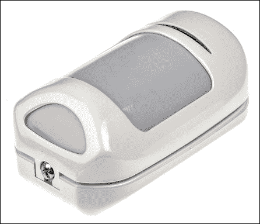

一个典型的 PIR 运动传感器（型号：GardScan QX-PIR）

在这一章中，我们将：

+   学习 PIR 探测器如何工作以及如何设置它们

+   将有线 PIR 探测器连接到我们的端口扩展器的输入端口

+   在我们的区域电路中开始使用 12V 电源，而不是 3.3V 电源

+   学习如何通过我们的 GPIO 端口安全地与 12V 电路接口

+   学习如何将一个 433 MHz 无线接收器连接到我们的 Raspberry Pi

+   使用 433 MHz 无线信号将一个遥控开关连接到我们的系统

+   编写一个脚本，当我们的探测器输入状态变化时，能够检测并记录该状态

# 前提条件

本章需要以下部件（除了上一章中使用的组件）：

+   一个有线类型的被动红外探测器（可以从任何 DIY 商店购买）

+   一个 4N25/4N35 光耦合器

+   一个 1N4148 二极管

+   一个 1 千欧电阻

+   一个 10 千欧电阻

+   一个 433 MHz 接收模块和远程发射器（这是可选的）

+   一个 12V 电源

+   一根连接线

+   一根 6 芯报警线

# 被动红外传感器解释

你可能没有意识到，但所有物体都会辐射热能（包括你的咖啡桌）；只是你看不见它，因为热量本质上是红外波，而这些波对于人眼是不可见的（就像你的电视遥控器一样）。不过，这些波可以被为此目的设计的电子设备探测到，例如你的电视红外接收器，它能检测到遥控器按下按钮时发出的能量。

你可能已经意识到，像我们、我们的猫，甚至地下地板上的老鼠，都会产生相当多的热量。安防系统和自动照明中使用的被动红外运动传感器正是为了检测这种热量。之所以称之为*被动*，是因为传感器本身并不辐射任何能量来进行探测——相反，它们只是检测物体发出的红外辐射。这与超声波传感器和雷达设备明显不同，后者依赖于探测物体反射的能量脉冲。

PIR 传感器需要有一点智能，因为它们必须应对房间中不断变化的温度。它们会确定所在房间的背景温度，例如指向的墙壁或地板的温度。当一个物体，例如我们自己或我们的猫，在探测器单元与背景物体之间移动时，传感器前面的温度迅速升高到人体温度，从而触发系统。

## 设置 PIR 传感器

PIR 传感器设备有许多不同的形式，包括传感器芯片中使用的不同材料以及传感器视窗前的镜头，这些都可能大幅影响设备的范围、视场和灵敏度。因此，设置传感器时，通常最好的指导就是附带的那张小说明纸。

然而，无论你使用什么类型的 PIR 传感器，以下是一些关于安装传感器位置的常规指南，以避免误触发：

+   确保设备安装在坚固的基础上，并且不受振动影响。

+   切勿将其安装在能够直接或反射阳光照射到镜头的地方。

+   同样，切勿将设备安装在面对或高于热源的地方。

+   不要将设备安装在通风的地方，因为这会影响其背景温度的校准。

设备的安装位置还取决于你想要保护的区域。例如，你可能希望检测从走廊进入客厅的人，因此你的覆盖区域可以定义为从设备安装的房间角落到客厅门的位置。

PIR 传感器通常提供固定的视场（例如 90 度或 110 度），但其范围会根据传感器的指向角度和安装高度有所不同。

在我的系统中，我将使用 Gardscan QX PIR 探测器作为我的有线设备，这是一个非常不错的、低成本的设备，可以从 RS Components 购买到（订货代码是 493-1289）。该设备具有 110 度的视场，并且根据其安装时配置的下倾角，最远可达 12 米的范围。从其数据表中可以看到，这个设备的覆盖模式如下图所示。请注意，从这些模式来看，设备前方的所有区域并不是都被覆盖，这可能并不是你所预期的。因此，根据设备的数据表正确放置设备至关重要。

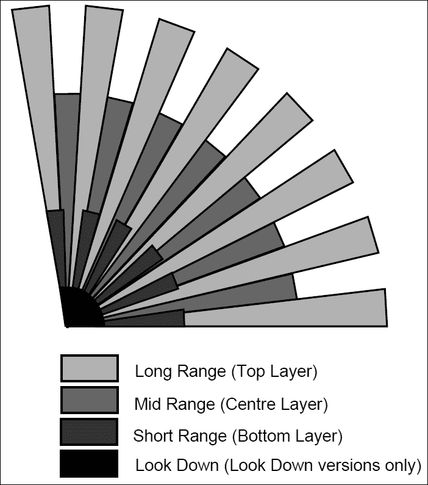

GardScan QX-PIR 在其 110 度视场下的覆盖图案（顶部/平面视图）

这里还有一个侧视图的示意图：

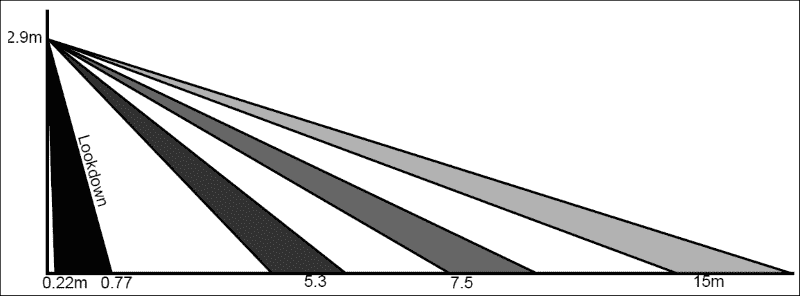

GardScan QX-PIR 覆盖图案取决于配置的角度以及一个“向下看的”窗口（侧视图）

# 给我电源（再来一次）

在我们将现成的安全设备连接到我们的报警系统之前，我们需要一个与这些设备兼容的电源。通常，报警电路及其设备使用 12V 电源，电流足够大以驱动所有设备和报警控制系统本身。

幸运的是，这并不太难解决，但这是我们现在必须做的事情；否则，我们将无法连接并为 PIR 传感器供电。最简单的方法是购买一个高质量的 12V 市电适配器，提供一个稳定的电源。这些适配器可以从网上商店或电子产品供应商处轻松购买到。或者，你可以自己制作一个 12V 稳压电源，并将其添加到我们在第三章中制作的电源条电路板上，*扩展你的 Pi 连接更多设备*。

### 注意

另一种选择是使用电池供电的 PIR 传感器，这意味着你无需直接通过安全系统的面板为设备供电；然而，显然也意味着电池需要定期更换。本章稍后我们将讨论的无线 PIR 就是电池供电的。

我们将在本章稍后讨论如何处理更高电压的传感器电路，以避免损坏我们的家庭安全控制电路或 Raspberry Pi。

# 连接我们的 PIR 动作传感器

商用报警系统通过 4 芯或 6 芯报警电缆连接其设备。在上一章中，我们使用了 4 芯电缆，因为我们连接了一个需要两根线的开关，以及一个需要另外两根线的防拆回路。

对于我们的 PIR 传感器电路，我们需要相同的四根线；然而，我们还需要从控制面板为设备供电，因此需要额外的两根线来实现这一点——因此需要一个六芯电缆。

以下示意图展示了我的 GardScan PIR 传感器的接线方式，实际上这对于大多数现成的安全系统设备来说是典型的：

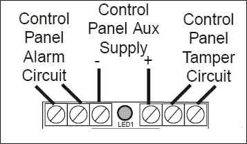

安全系统传感器设备的典型连接

与我们在上一章中看到的磁性接触传感器类似，设备可以有**常闭**（**NC**）或**常开**（**NO**）警报。这种特定的设备有一个常闭输出，这意味着当探测器被触发时，警报电路将被断开。这是我们传感器设备的首选配置，因为这意味着它们可以在每个区域内串联连接。

我们现在可以将这个传感器设备添加到我们在上一章中开始组建的警报电路中。以下示意图展示了到目前为止所有传感器都接入同一区域的电路：

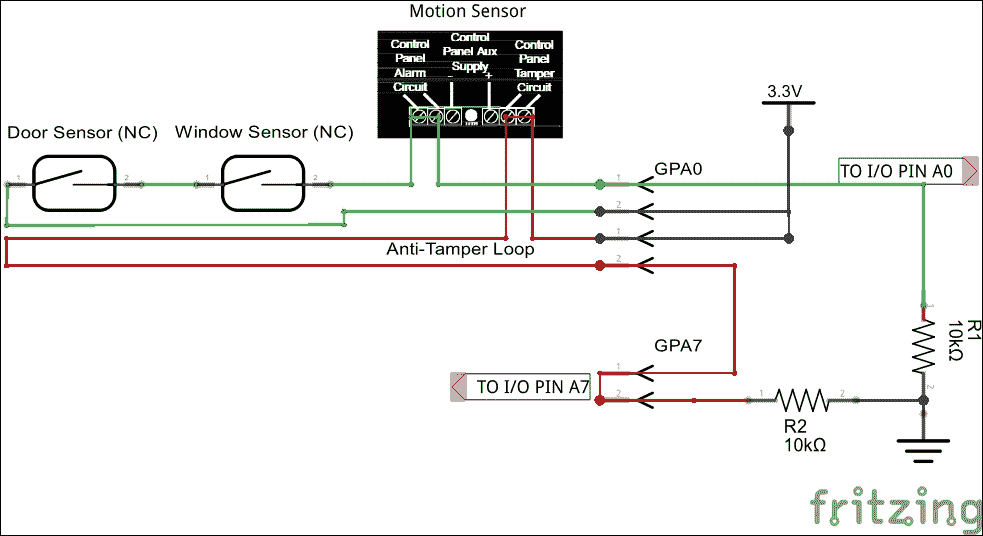

我们区域的示意图，其中所有三个传感器和防拆回路都在同一区域内

到目前为止，我们使用+3.3V 电源通过传感器开关和警报电路。实际上，这并不是一个好主意，我们这么做只是为了方便测试 GPIO 输入。

实际上，在我们的最终系统中，我们确实应该使用 12V 电源来通过传感器和防拆电路。因为较高的电压更容易通过系统传输，且对噪声的抗干扰能力更强，这样可以避免触发失败或误触发。这也使得它与市面上现有的系统和配件兼容。

# 12V 警报区域电路

使我们的区域电路使用 12V 而不是 3.3V，只需要更换电源，实际上我们迄今为止使用的所有传感器都能处理通过开关传递的 12V 电源。

然而，如果我们将 12V 电路连接到树莓派的 GPIO 端口或端口扩展器的输入端口，我们可能会看到“神奇的烟雾”，并闻到烧焦的味道。所以，我们需要添加一些电路，以便能够使用 12V 警报电路，并保护我们的控制板输入。

## 警报电路保护

一种有效的保护我们区域输入免受 12V 警报输入干扰的方法是使用一个叫做光隔离器的小型低成本设备。顾名思义，它通过光隔离警报电路与控制板的数字输入。

光隔离器（也称为光耦合器）内部有一个红外 LED，当电流通过时，它会将光传递给光电晶体管，从而打开它。这些电路在电气上是隔离的，因为它们仅通过光控制。

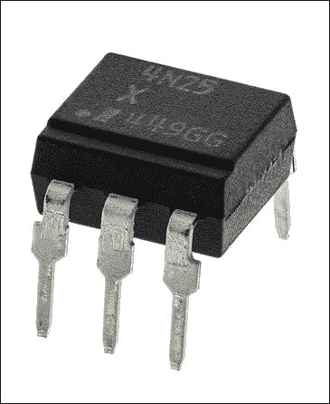

4N25（如前图所示）和 4N35 是低成本的 6 针光耦合器设备，大多数制造商倾向于使用以下示意图中的引脚布局：

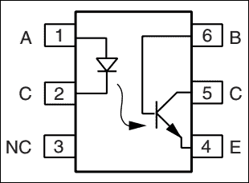

现在我们知道如何将 12V 报警电路与控制面板的输入连接，让我们构建整个电路，用于我们系统中每个添加的区域。

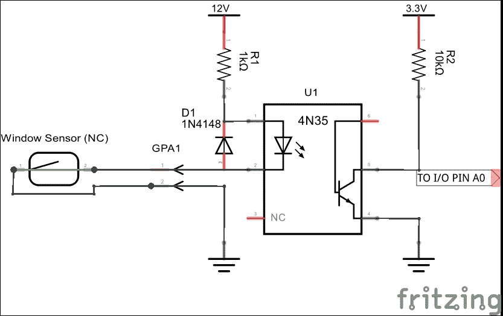

一个与 GPIO 输入光电隔离的 12V 区域电路

## 它是如何工作的

此时，我们假设我们的区域电路是常闭的—也就是说，当电路断开时，报警会触发。

12V 电源通过光电隔离器的 LED 传递，电流通过 1 千欧电阻限制。1N4148 二极管以反向方式存在，目的是保护光耦免受反向电压的损害。

### 注意

1 千欧电阻是基于我们有 12V 电源，并且 LED 的正向电压降（Vf）为 1.2V，电流（If）约为 10mA 的事实计算得出的。

当报警电路闭合时，电流流动，LED 亮起。这使得晶体管保持导通，GPIO 端口的输入保持低电平。如果报警电路断开，光耦 LED 熄灭，进而使晶体管关闭。GPIO 输入然后通过 10 千欧电阻被拉高。

这个过程相当简单但有效，不是吗？

这个电路的另一个优点是它应该在故障时呈现正向—也就是说，如果光耦发生故障，GPIO 端口上的报警输入应该被拉高，从而触发报警，而不是静默故障。

# 无线 PIR 运动传感器

**无线运动传感器**现在普遍以低成本提供，使其几乎可以安装在任何地方，而无需从报警控制面板接线。它们中的一些仍然需要外部电源，但许多依靠电池工作。报警系统必须包含与无线传感器兼容的无线接收器。

在本节中，我们将查看如何将基于 Raspberry Pi 的安全系统与无线接收器设备配合使用。

## 433 MHz 无线报警系统

无线系统使用未授权的射频在报警系统的各个组件之间进行通信。在英国，最常用的频率是**433 MHz**和**868 MHz**。尽管较新的系统现在使用 868 MHz 频率，433 MHz 仍然被广泛使用，因为它比 868 MHz 系统的范围稍长。然而，433 MHz 频段也被许多其他设备使用，这使得它变得拥挤，而 868 MHz 通常只用于报警系统。

虽然无线安全系统可能很方便，但理解使用无线而非有线系统的优缺点很重要。

优点如下：

+   它们安装的简便性和速度

+   它们的拆卸简便性，这意味着你可以随时带着它们走

+   将来扩展系统可能更容易，大多数系统会自动检测新设备

缺点如下：

+   它们比有线系统更昂贵，有时价格是有线系统的三到四倍

+   它们不像有线系统那样安全，并且根据欧洲标准 BSEN 50131，安全等级不能超过二级（尽管这个等级适用于家庭财产）

+   无线设备需要定期更换电池

+   无线系统的可靠性较差，容易受到干扰，甚至是无线电干扰

## 连接 433 MHz 接收器

过去，您可以通过使用廉价的接收器（如 XY-MV-5V 模块）以及由 GitHub 贡献者 Mark Wolfe 整理的**433-Util**库，为树莓派推出自己的 433 MHz 接收器。基本上，他将与 433 MHz 通信相关的代码集合在一起，并将其全部放入这个库中。最初为 Arduino 开发的这个库，现在已经移植到树莓派上。

然后你可以使用一个现成的发射器，例如车钥匙或任何其他 433 MHz 的发射器，在按下发射器上的每个按钮时查看接收到的代码。

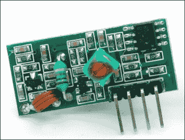

一个 XY-MK-5V 通用 433 MHz 接收模块

寻找合适的 433 MHz 接收器应该很容易，因为像亚马逊和 eBay 这样的网站上有大量出售这些设备，它们的价格低至几英镑。

### 注意

请注意，433 MHz 频段是许多设备可以使用的自由频段。因此，有许多不同类型的接收器，尽管它们都标称为 433 MHz 接收器，但它们可能使用 AM 或 FM 工作，并且某些接收器只能检测某些类型的数据。比如 Quasar QAM 系列，可能还需要特殊的解码芯片才能读取传输的数据，并且可能仅与配对的发射器配合使用。

这个接收模块可以接收到来自车钥匙遥控器的信号，例如下图所示的这种遥控器（可以从任何当地的 DIY 商店的家庭安全区购买），它将输出一系列方波。这些方波随后被 433-Util 软件解码。

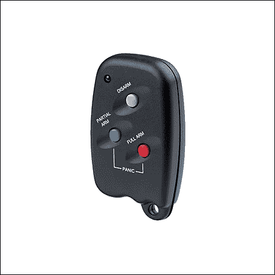

一个 Novar/Blyss 433 MHz 无线遥控器

我喜欢这个遥控器，因为我觉得它作为我们家庭安全系统的**布防**和**撤防**设备是非常合适的。我将在第八章中谈到布防和撤防，*各种各样的事物*，我们将在那里探讨实现这些功能的方法。

### 替代方法（因为我们别无选择）

我在上一节开始时提到“过去...”。这是因为最近，我无法使 433-Util 软件与接收模块一起正常工作，而这些接收模块过去是可以正常工作的。我不完全确定为什么会这样；然而，我只能猜测，由于该软件使用“位碰撞”（bit banging）技术解码传入的数据信号，导致时序不再正确，可能是因为后来的树莓派板卡更快，导致例程出错。

### 注意

**什么是位碰撞？**

位操作是一种通过软件进行串行通信的方式，而不是使用专用硬件。软件负责信号的所有参数，包括时序、电平和同步。位操作可以看作是一种“黑客”手段，但它确实允许以非常低的成本在不更改硬件的情况下实现不同的协议。

因此，为了让我们的生活更轻松（并且实际上让设备在所有版本的树莓派上都能正常工作），我们将使用一个专用的接收模块，你可以在亚马逊上以不到 5 英镑的价格购买，它不需要这些软件位操作的繁琐。你会从下图中注意到，它仍然使用类似的 XY-MK-5V 无线接收器；只是主板会为我们解码信号，并根据遥控器的命令开关继电器。

### 注意

如果你仍然对 433-Util 软件项目感兴趣，并且想尝试推出自己的接收器，你可以在[`github.com/ninjablocks/433Utils`](https://github.com/ninjablocks/433Utils)找到原始项目。

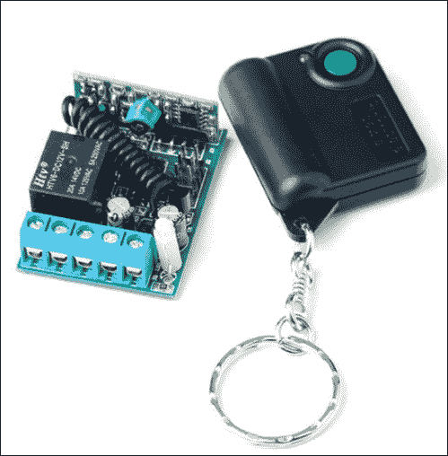

一款 Hielec 发射器钥匙扣和接收模块，可在亚马逊上购买

由于它只是简单地开关继电器，这意味着我们可以轻松地将其集成到我们的家庭安全系统中，因为它仅作为一个开关工作。当你按下发射器上的按钮时，继电器会接通触点；再按一次，继电器会断开。板上的螺丝端子为我们提供了继电器端子的接入。

## 接收器接线图

由于我们仅处理开关输入，我们可以使用与之前区域电路相同的电路，只不过这次连接到我们的开/关 GPIO 输入，具体设置我们将在第九章中讨论，*将所有内容组合在一起*。

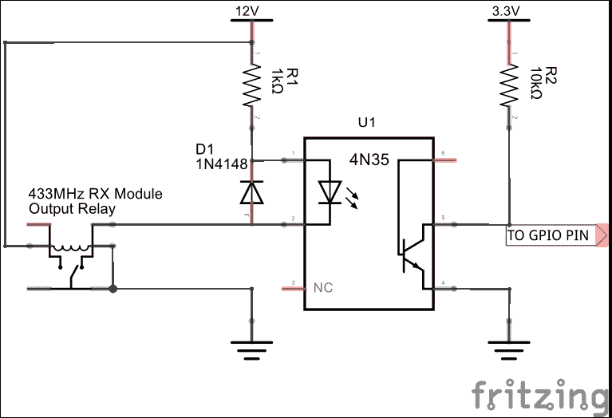

接收模块与 GPIO 输入接口的电路

当接收模块将继电器开关打开时，它将通过开启光耦合器的 LED 来完成 12V 电路。这样，晶体管将 GPIO 引脚拉至地面，提供低电平输入。

你可以使用这种类型的电路，连接任何配对的接收器，用于你想在系统中使用的无线安全设备。

# 记录探测数据

对于任何系统，能够在某些事件发生时记录数据都是很有用的。我们也可以通过每次区域探测器被触发时写入日志文件来实现这一点。这样，你可以记录下每次有人进入房间的时间，即使系统没有启用，你也可以在之后查看。你还可以记录系统启用和禁用的时间。

这是一个简单的脚本，展示了如何在我们连接到 GPIO 输入的区域发生事件时进行处理：

```
#!/bin/bash

#set up the I2C expansion port
sudo i2cset –y 1 0x20 0x00 0xFF

#reset status
CURR_STATE="0x00"
LAST_STATE="0x00"

#path to the log file
LOG_FILE="/etc/pi-alarm/zones.log"

# loop forever
while true
do
  # read the gpio inputs
  CURR_STATE=$(sudo i2cget –y 1 0x20 0x12)

   #check if state has changed
   if [ "$CURR_STATE" != "$LAST_STATE" ]
  then
    #write change to log file
      TIMESTAMP=`date "+%Y-%m-%d %H:%M:%S"`
     echo "$TIMESTAMP Zone Status Changed from $LAST_STATE to $CURR_STATE" > $LOG_FILE
  fi
  $LAST_STATE = $CURR_STATE
  sleep 1
done
```

前面的例子非常简单，但通过实际写出在构成区域中通过解码`i2cget`命令返回的十六进制值来改变的区域或区域，它可以变得更加有用。

### 注意

在第九章，*综合应用*中，你将学习如何做到这一点，以便在网页上显示每个区域的个别状态。你可以使用完全相同的技术来处理日志文件，实际上，完全可以通过扩展相同的脚本来输出到日志文件。

# 总结

在这一章中，我们首先学习了如何使用被动红外传感器来检测运动，以保护预定义的覆盖区域免受入侵。然后，我们研究了如何通过光耦合器将这些传感器连接到我们的端口扩展器的输入端，因为我们现在将使用 12V 为报警区域电路供电。

然后，我们研究了在开放的 433-MHz 频段上运行的无线报警系统，这个频段通常用于安全设备。经过探索使用我们树莓派上的传统 433-Util 位编码软件解码通过简单接收器传输的设备信号的可能性后，我们决定使用配对的接收器设备，这样它就能轻松与我们的报警电路输入接口。

最后，我们创建了一个简单的脚本，它将把我们的报警输入的变化记录到一个文本文件中，稍后可以扩展该脚本来详细记录系统的实际情况。
