# 第六章：向我们的安全系统添加摄像头

到目前为止，我们一直在组合能够将传感器连接到我们的报警系统的元素，使用开关或被动红外运动探测器来检测入侵，这些探测器将通知我们的树莓派在特定区域发生了某些事情。所有这些元素将在本书的后面结合成一个完整的系统。

随着相机的加入，我们的系统将变得更加复杂，可以拍摄图片和视频，并在检测到某些事件时立即通过电子邮件发送给我们。

我们还将使用电子邮件，在我们外出时，当系统中的任何传感器被触发时，向我们的智能手机发送警报。

本章将涉及以下主题：

+   设置树莓派相机模块并学习如何捕获静态图像和视频图像

+   学习如何将捕获的图像叠加文本和时间戳

+   使用运动探测器触发图像捕获

+   实时通过电子邮件发送图片和视频文件给我们

+   理解白天和夜间拍摄图像的差异

+   在需要时开启和关闭安全照明及其他高电流设备

+   连接 USB 网络摄像头，替代原生相机模块

# 前提条件

除了上一章使用的组件外，你还需要以下零件来完成本章内容：

+   树莓派标准相机模块

+   树莓派 NoIR 相机模块

+   红外 LED 阵列和/或可见 LED 阵列

+   一台 USB 网络摄像头

# 树莓派相机模块

树莓派相机模块是官方的树莓派配件，适用于所有型号的树莓派，可用于拍摄高清静态图片和视频图像。它直接连接到树莓派主板的**相机串行接口**（**CSI**）端口，这个端口专门用于这些模块以支持高速操作。

相机本身是一款 500 万像素固定焦距传感器，支持 1080p、720p 和 VGA 视频模式及静态图像拍摄。

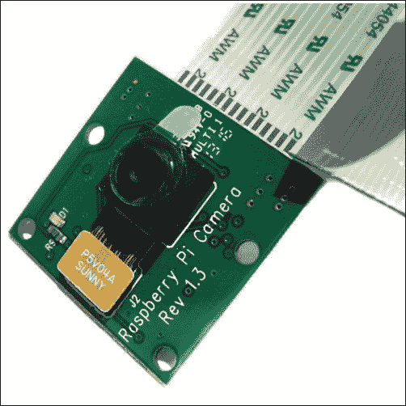

官方树莓派相机模块

你还可以购买相机模块的外壳，除非你打算为相机系统制作自己的外壳，否则我建议你使用现成的外壳。

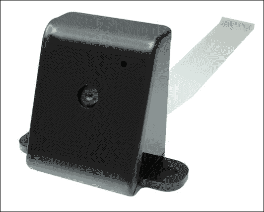

树莓派相机外壳有多种颜色和款式

## 连接相机模块

如前所述，该模块通过其专用的相机接口直接连接到树莓派主板，如下图所示。连接相机时，带状电缆的接触面朝向 HDMI 接口，电缆的蓝色面朝向网络接口。

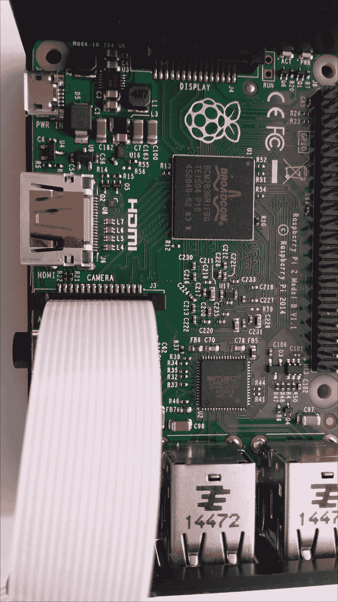

将相机模块连接到专用接口

正如你在下面的图片中看到的那样，排线连接器并不长，因此相机需要放置在 Raspberry Pi 附近。通过使用相机外壳，你实际上可以将相机直接安装在 Raspberry Pi 机箱上，如果这种方式适合你。

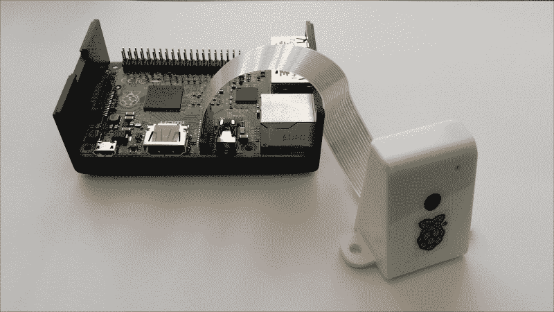

相机模块，放置在外壳内

## 设置相机模块

在我们使用相机模块之前，我们需要在 Raspberry Pi 上启用相机支持。为此，我们使用 `raspi-config` 工具，就像我们在旅程中早些时候为 I2C 总线所做的那样。

1.  通过 SSH 从沙发上懒洋洋地连接到你的 Raspberry Pi，或者直接使用键盘和显示器连接。

1.  一旦你登录，使用以下命令启动配置工具：

    ```
    $ sudo raspi-config

    ```

1.  然后，选择 `5 启用相机`。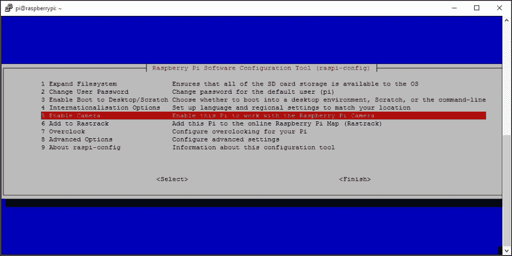

1.  接下来，它会要求你确认是否要启用相机支持。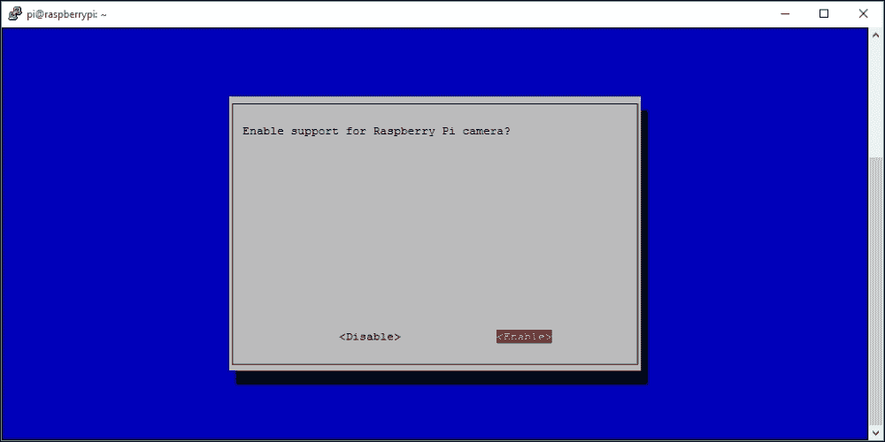

1.  选择 `<Enable>`。

1.  然后，选择 **Finish** 并重启你的 Pi 以启用相机设置。

### 测试相机模块

一旦你的 Raspberry Pi 重启，相机应该已经启用。我们可以通过使用 `raspistill` 工具拍摄一张静态图像来测试：

```
$ raspistill –v -o test.img

```

这将延迟 5 秒钟后拍照，并显示各种信息，如下图所示：

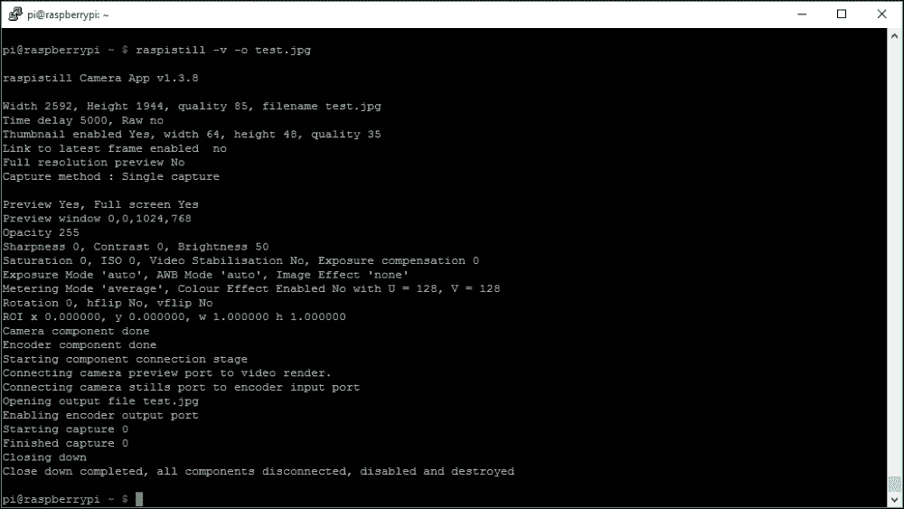

### 注意

相机模块在 Raspian 上需要至少 128 MB 的 GPU 内存才能正常运行。如果你遇到任何问题，首先确保 `/boot/config.txt` 配置文件中的 `gpu_mem` 设置为至少 `128`。

如果一切顺利，你应该能在你的主文件夹中找到文件 `test.jpg`。由于你是通过 Shell 连接的，你不会看到命令运行时显示的 5 秒预览图像。

如果你将图像文件下载到你的 PC 上，你应该能看到由相机模块拍摄的高质量照片。

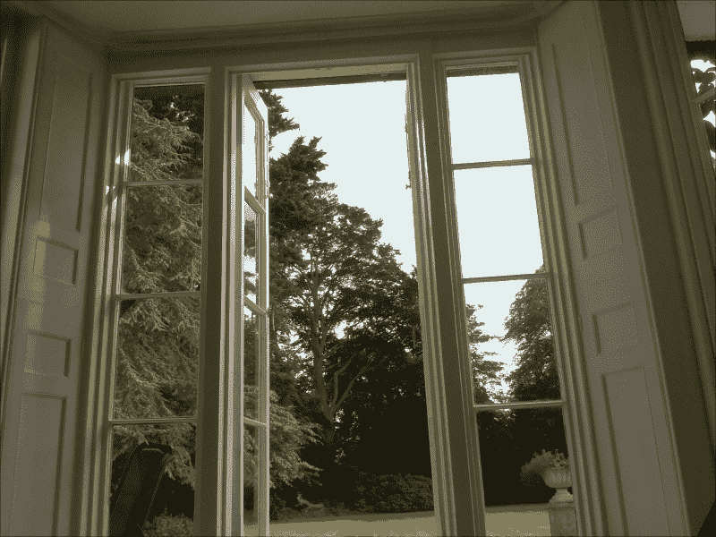

Raspberry Pi 相机模块拍摄的测试照片

### 小贴士

如果你发现运行 `raspistill` 时输出错误，确保它在排线的两端都连接正确。另一个问题是，有时连接相机镜头组件与相机板上小连接器的排线可能会松动。只需确保它也牢固连接。我曾多次遇到这种问题，当相机模块从我的杂乱测试箱里拿出来时，连接会松动。

`raspistill` 工具有很多选项可以用来操作它捕获的图像，稍后我们将在捕获脚本中使用其中一些选项。与此同时，要查看可用选项，只需运行 `raspistill` 而不带任何选项，选项会被列出：

```
$ raspistill

```

# 成为视频明星

现在我们知道我们的摄像头模块正常工作，可以尝试捕捉一些视频。为此，我们将使用 `raspivid` 工具。以下命令将拍摄 5 秒钟的高清视频并将文件保存在你的树莓派中：

```
$ raspivid –o test.h264 –t 5000

```

你会注意到该文件名为 `test.h264`——这是因为视频是以原始 **H.264** 视频流的形式捕捉的。不幸的是，并不是很多媒体播放器可以处理这些文件（虽然 VLC 播放器可以——它非常棒，几乎可以处理你投给它的任何文件——你可以在[www.videolan.org](http://www.videolan.org)下载它）。

如果你希望在智能手机和常规媒体播放器上播放该文件，我们需要将其封装成容器格式，比如 MPEG-4，并将文件扩展名更改为 `.mp4`。

为此，我们将使用 **GPAC** 包，它是一个开源的多媒体框架。它附带了一个名为 **MP4Box** 的工具，我们将使用这个工具来为我们的视频文件创建一个 MP4 容器：

1.  首先，安装 GPAC 包：

    ```
    $ sudo apt-get install gpac

    ```

1.  安装完成后，运行以下命令来转换我们创建的测试视频：

    ```
    $ MP4Box -fps 30 -add test.h264 test.mp4

    ```

现在你应该已经拥有了文件 `test.mp4`，你可以下载并在你的电脑或智能手机上播放。

### 小贴士

另一个常用的转换工具是 **ffmpeg**，我在 Windows 上经常使用它来转换视频文件；然而，它可能相当复杂，尽管树莓派上也有相应的包，但我实际上无法让它在树莓派上正确转换。MP4Box 要简单得多，更适合我们的需求。

## 捕捉到画面

所以，现如今我们已经有了捕捉静态图像和视频的方法，可以在我们的安全系统中使用。如果我们希望这一过程持续进行，可以编写脚本来持续拍摄视频，但这样很快就会填满我们的存储卡，并且效率不高。因此，我们将把摄像系统和之前连接的运动探测器结合起来。

在上一章中，我们创建了一个报警区，里面有一些传感器和一个连接到我们系统的运动探测器，输入端口是 GPA0。那么，让我们编写一个脚本，每当触发运动探测器时，就拍摄一个视频片段：

```
#!/bin/bash

#set up port expander 
sudo i2cset –y 1 0x20 0x00 0xFF

# loop forever
while true
do
  # read the GPA inputs
  GPA=$(sudo i2cget –y 1 0x20 0x12)

  # detect the zone on input 0
  if [ $GPA == "0x01" ]
  then
    #circuit normally closed so zone is OK
    #short delay
sleep 0.5

  else
    #zone is activated so take a 20 sec video clip

    #filename will be based on current timestamp
    sDate='date +%d%m%y'
    sTime='date +%T'
    echo "Zone 1 Activate at $sDate $sTime"

#take video clip
raspivid –o $sDate$sTime.h264 –t 20000

#convert to MP4
MP4Box -fps 30 -add $sDate$sTime.h264 $sDate$sTime.mp4
  fi
done
```

# 你有新的邮件

将图像存储在你的树莓派上其实用处不大——理想情况下，你会希望图像在捕捉到的瞬间就直接发送给你，这样你就可以在智能手机上查看它们。

一种简单、快速、可靠的方法是直接将其通过电子邮件发送给你。因此，我们将为我们的家庭安全系统添加一个电子邮件功能，将图像捕捉到的内容作为附件发送到你的电子邮件地址，之后你可以通过智能手机访问。这些图像可以从你的树莓派中删除，以防止 SD 卡空间被这些相对较大的文件占满。

## 设置电子邮件发送客户端

幸运的是，有一些很好的包可以帮助我们实现这一点。按照以下步骤安装我们所需的电子邮件包：

1.  使用以下命令更新软件包安装器：

    ```
    $ sudo apt-get update

    ```

1.  使用以下命令安装并设置 SMTP 客户端：

    ```
    $ sudo apt-get install ssmtp

    ```

    你现在需要设置客户端，通过你的电子邮件账户发送电子邮件。在以下配置文件中，我假设你使用的是 Gmail 账户。如果你使用其他邮件提供商，设置可能会有所不同。

1.  使用 **Nano** 或其他文本编辑器打开 `ssmtp` 配置文件：

    ```
    $ sudo nano /etc/ssmtp/ssmtp.conf

    ```

1.  用以下配置替换条目：

    ```
    root=<your-username>@gmail.com
    mailhub=smtp.gmail.com:587
    rewriteDomain=gmail.com
    AuthUser=<your-username>@gmail.com
    AuthPass=<your-password>
    FromLineOverride=YES
    UseSTARTTLS=YES
    ```

1.  `ssmtp` 可以单独使用，但在自动发送电子邮件时有点麻烦（默认情况下，你需要在命令行中手动输入电子邮件，或者创建一个文本文件），因此我们还需要安装 `mailutils` 包：

    ```
    $ sudo apt-get install mailutils

    ```

1.  安装完成后，我们可以使用 `mail` 命令更轻松地发送电子邮件。通过我们之前设置的 (G)mail 账户发送一封测试电子邮件，使用以下命令确保你的设置正常：

    ```
    $ echo "Test Email" | mail –s "Test Pi-Mail" me@mydomain.com

    ```

如果一切顺利，你应该能在几秒钟内收到测试电子邮件。

## 发送附件

现在我们可以从家庭安全系统发送基本电子邮件了，让我们尝试发送之前拍摄的静态图像。但首先，我们需要再安装一个包来帮助我们完成这项工作：

```
$ sudo apt-get install mpack

```

安装完毕后，你可以使用以下命令发送我们之前拍摄的测试图像文件：

```
$ sudo mpack –s "Security Photo" test.jpg me@mydomain.com

```

现在我们已经具备了所有元素，能够通过电子邮件将警报和图像从家庭安全系统直接发送到我们的智能手机。

## 那是在哪里拍的？

通常，你可以在电子邮件中注明附加图像的拍摄时间和地点，但这不如在图像上叠加一些文字酷吧？那么，让我们借助 `imagemagick` 来做一些魔法，它是一个流行的命令行图像处理工具。使用以下命令安装它：

```
$ sudo apt-get install imagemagick

```

现在我们将使用命令行来拍摄我们之前拍的测试照片，使用 `imagemagick` 工具之一叠加一些文字，并将其保存到另一个文件：

```
$ convert test.jpg –fill red –pointsize 48 annotate +20+60 'Camera 1' annotated.jpg

```

几秒钟后，这将生成一个名为 `annotated.jpg` 的文件，文件中包含我们带有 **Camera 1** 红色文字的图像。当我们把这些元素组合到最终系统中时，我们还会在图像上叠加时间戳。

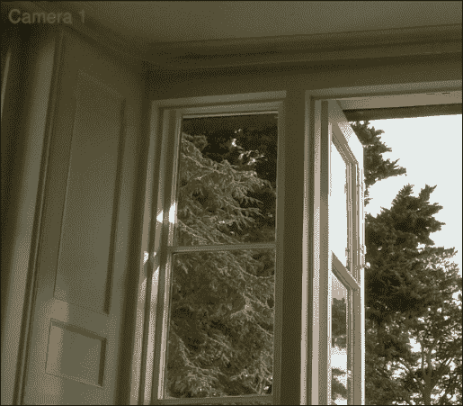

### 注意

目前，`raspistill` 工具生成的图像文件比较大，因为它们是高分辨率的照片。这使得处理和发送它们在处理时间上有些耗时，因此当我们构建最终系统时，我们将使用 `raspistill` 的选项 `–w`、`–h` 和 `–q` 来减少图像的大小和质量，从而提高系统效率。

要捕获较小的图像文件，可以尝试使用以下命令：

```
$ raspistill -o test.img –h 768 –w 1024 –q 25

```

# 夜视

标准的树莓派摄像头非常适合拍摄白天人们走在花园小道上的照片，但在夜间拍摄时，它并不适用。应对这一问题有两种方法：第一种是在 PIR 探测器触发时，用强光照亮拍摄区域；第二种是使用树莓派**NoIR 摄像头模块**和红外 LED 阵列，让摄像头能够在黑暗中看见。稍后会详细介绍。

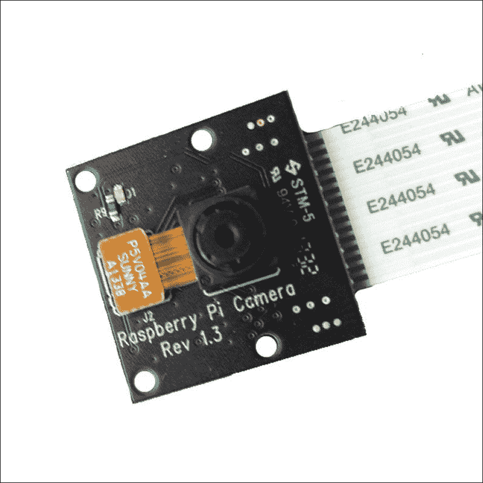

树莓派 NoIR 摄像头模块；它看起来与标准型号相似

## 照亮的体验

为了通过树莓派 GPIO 或我们的端口扩展电路打开灯或 LED 阵列，我们需要一些能够提供比 GPIO 端口本身更高电流和电压的设备。

一个合适的选择是**TIP120** **达林顿晶体管**，它能让我们通过 GPIO 引脚开关最大 80V 和 5A 的负载。在稍后的完整系统中，我们将使用 MCP23017 端口扩展器的 B 端口来控制输出，但这个原理适用于我们所有的 GPIO 输出端口。

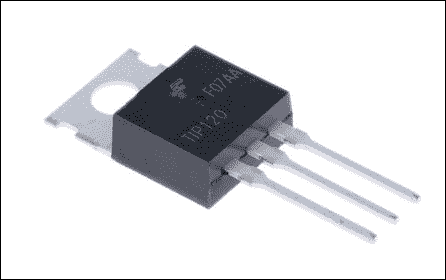

TIP120 晶体管价格便宜，但可以驱动大负载。

以下电路展示了我们如何通过 GPIO 端口输出驱动大负载。

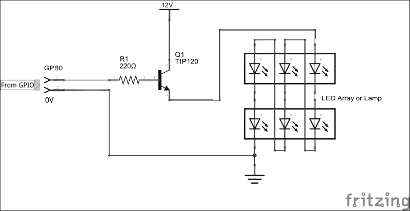

在我们的示例电路中，我们使用一个 GPIO 输出引脚，通过一个 220 欧姆电阻控制晶体管的基极。当 GPIO 引脚为高电平时，晶体管被打开，允许 12V 电路通过 LED 阵列。

在上述电路中，LED 没有电流限制，因为它们是串联连接的，因此，九个 LED 每个大约降压 1.5V，这对于 12V 电源来说是合适的（是的，我知道这里仅包括了六个 LED，但这只是为了示意）。记得根据你的具体需求调整。这个电路也能轻松驱动其他负载，例如灯泡或警报器。

### 注意

如果你打算驱动大功率负载，可能需要将 TIP120 安装到散热器上，以散热防止过热和烧毁。然而，在我们之前展示的电路中，你可能不需要散热器，因为我们最多只驱动了几百毫瓦的功率。

## 复杂的灯光开关重访

再次扩展我们在前几章中提到的复杂灯光开关，我们可以再次编写一个 Bash 脚本，在 PIR 探测器触发时打开摄像头灯，拍摄一张照片，并将其通过电子邮件发送给我们。

对于以下脚本，我们假设控制 TIP120 晶体管输出的是树莓派的 GPIO17 引脚（D0 或我们连接器的第 11 引脚），它替代了我们早期设置中的 LED。PIR 触发器的输入再次连接到 MCP23017 端口扩展器的 GPA0（端口 A，数据引脚 0）。其他所有输入与之前一样，使用 10 K 电阻连接至低电平：

```
#!/bin/bash

#set up the High Load GPIO pin
sudo echo 17 > /sys/class/gpio/export
sudo echo out > /sys/class/gpio/gpio17/direction

#set up port expander Port A for inputs
sudo i2cset –y 1 0x20 0x00 0xFF

#clear the output by default to switch light off
sudo echo 0 > /sys/class/gpio/gpio17/value

# loop forever
while true
do
  # read the sensor state
  SWITCH=$(sudo i2cget –y 1 0x20 0x12)

  #PIR is normally closed so pin is held high
  if [ $SWITCH != "0x01" ]
  then
    #PIR was triggered – pin taken low

    #switch on lamp driver
    sudo echo 1 > /sys/class/gpio/gpio17/value
    sleep 0.5

#take a still image
    sudo raspistill –o –image.jpg –h 768 –w 1024 –q 25

    #email the image
    mpack –s "Security Alert Photo" test.jpg me@mydomain.com

    #switch off the lamp driver
    sudo echo 0 > /sys/class/gpio/gpio17/value

  fi
  #short delay
  sleep 0.5
done
```

`pir-camera-trigger.sh`

你现在可以看到，我们已经开始开发控制家庭安防系统的软件基础。

## 那是獾吗？

如果你不想在捕捉图像之前照亮某个区域，可以使用**红外照明**与兼容的摄像头配合使用。标准的树莓派摄像头模块无法与红外照明配合使用，因为它包含红外滤光片，但我们可以使用 NoIR 版本的摄像头模块来代替。

树莓派 NoIR 摄像头模块与标准模块完全相同，不同之处在于它没有内置红外滤光片，这意味着它在红外照明的帮助下能够在黑暗中看到。这使得它非常适合在夜间观察獾类动物，以及用于我们的家庭安防系统。

你将需要一个红外 LED 阵列或聚光灯来不可见地照亮你希望用摄像头捕捉的区域。这些设备有各种外形和强度，或者你可以通过购买单个红外 LED 来自己制作，通常可以在电子商店找到。

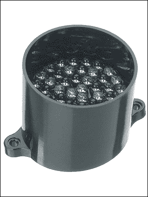

Kingbright 红外 LED 聚光灯需要 6V 电源，这意味着你可以将两个串联连接——分别安装在摄像头的两侧。

连接和驱动 LED 聚光灯模块的方式与上面提到的照明灯相同，都是使用 TIP120 驱动电路。唯一的区别是，我们人眼无法看到 LED 是否点亮。

# 使用 USB 摄像头

除了使用树莓派摄像头模块外，你还可以使用标准的 USB **网络摄像头**拍摄静态图像。不过需要注意的是，专用的摄像头模块在图像质量方面远优于 USB 摄像头。尽管如此，你可能已经有一款闲置在杂物盒里的摄像头，为什么不试试呢？

## 安装摄像头

在将摄像头连接到树莓派的 USB 端口后，你可以使用 `lsusb` 命令检查它是否已被识别：

```
$ lsusb

```

我正在使用一款 Logitech 网络摄像头，它在 `lsusb` 中显示如下（设备 006）：

```
pi@raspberrypi ~ $ lsusb
Bus 001 Device 002: ID 0424:9514 Standard Microsystems Corp.
Bus 001 Device 001: ID 1d6b:0002 Linux Foundation 2.0 root hub
Bus 001 Device 003: ID 0424:ec00 Standard Microsystems Corp.
Bus 001 Device 006: ID 046d:08d8 Logitech, Inc. QuickCam for Notebook Deluxe
```

### 注释

不是所有的网络摄像头都能与树莓派兼容。即使它被识别为一个 USB 设备，它也可能无法与操作系统正常工作并创建视频设备（例如，`/dev/video0`）。例如，我曾经使用的一款旧的便宜的 Trust 摄像头虽然被识别为 USB 设备，但无法捕捉任何图像。

你可以通过在 [`elinux.org/RPi_USB_Webcams`](http://elinux.org/RPi_USB_Webcams) 上查看你的摄像头品牌和型号来检查它是否可能与树莓派兼容。

现在，树莓派知道我们已经连接了一个网络摄像头设备，我们可以使用`fswebcam`工具来捕获图像帧。你可以在开发者网站上了解更多关于`fswebcam`的信息，网址为[`www.sanslogic.co.uk/fswebcam`](http://www.sanslogic.co.uk/fswebcam)。

使用以下命令安装`fswebcam`：

```
$ sudo apt-get install fswebcam

```

## 拍摄照片

现在，你可以通过捕获一张静态图像来测试摄像头，这可以通过运行以下命令完成：

```
$ fswebcam test.jpg

```

你应该期待看到类似以下的输出：

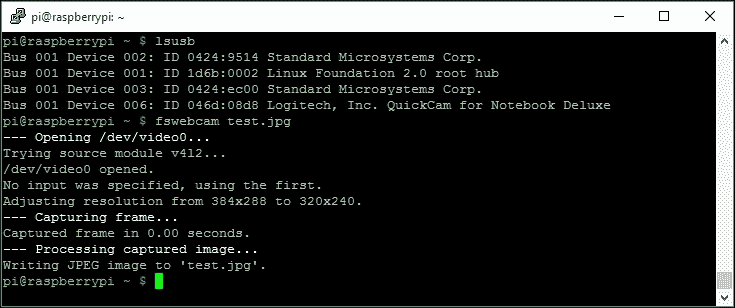

### 注意

`fswebcam`有很多选项可以调整图像的分辨率和质量。使用命令`fswebcam` `-?`可以查看所有选项。

### 拍摄，拍摄，拍摄

`fswebcam`不能接收视频流，但你可以将其设置为定期拍摄一系列**帧**。例如，为了每 10 秒拍一张照片，你可以使用以下命令：

```
$ fswebcam frame.jpg -l 10

```

一个如何实现这一功能的示例是通过设置网络摄像头每隔几秒钟拍一张照片（`–q`开关将`fswebcam`在后台运行）。当我们的安全系统被触发时，我们可以获取最新拍摄的照片，该照片可能是拍摄了你家门前的路径。

为了后续在本书中组建我们的整个系统，我们将重点介绍树莓派相机模块，但如果你想使用 USB 网络摄像头，你始终可以将代码替换为前面的示例。

你会注意到，`fswebcam`与`raspistill`不同，它能够在图像上叠加时间戳信息，因此你不需要像之前那样担心叠加文本。查看`fswebcam`命令行选项以获取更多信息。

# 多摄像头设置

你可能会想到，树莓派只有一个相机模块输入。如果你希望在你的财产周围放置多个由运动探测器触发的摄像头，这显然是一个限制。

然而，没人阻止我们构建独立的设备，这些设备配有单独的树莓派主板、PIR 探测器、相机模块和网络连接，可以使用 Wi-Fi 加密狗或以太网连接。

由于你只需要一个输入端口来检测 PIR 运动传感器是否被触发，你可以使用树莓派的 GPIO 端口连接传感器，而不是使用端口扩展器。树莓派将通过网络发送警报，并在需要时可以警告主控制器 Pi——使其成为一个从属传感器设备。

你可以轻松获取到小型 PIR 探测器，例如下图所示的 Parallax 探测器，你可以将其与相机模块一起安装在树莓派机箱上，创建一个自包含的设备。

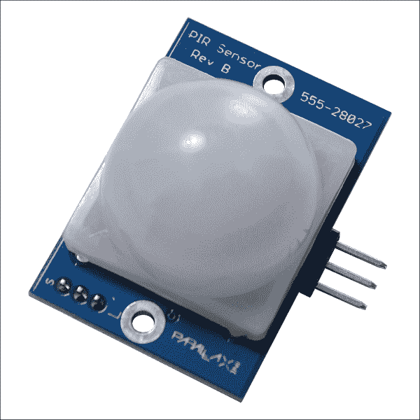

一个 Parallax PIR 运动传感器（型号 555-28027）

## 从属驱动程序

虽然为每个摄像头配备一个树莓派可能看起来相当复杂——想一想——但你实际上可以用大约 50 英镑的价格，购买包含所有组件的摄像头单元，这比购买一台无线*智能*摄像头便宜得多。如果你真的想变得聪明一点，还可以将其用作从本地单元接收进一步传感器输入的从设备。

没有什么可以阻止你将从设备的 GPIO 输出引脚连接到主控制器的输入引脚，并根据其本地传感器的状态来控制该引脚。通过在单元之间运行一条 6 芯电缆，如果你的电源足够强大（你需要一个输出 5V @ 1A 的电源来为从设备树莓派供电），你甚至可以为从设备提供电力。

我目前不会进一步深入探讨这种配置，但你可以挑战自己，使用多台树莓派以及本书中学到的构建模块和概念，创建一个完全分布式的家庭安防系统。

# 总结

在本章中，我们学习了如何将树莓派摄像头模块和 USB 摄像头连接到我们的树莓派板上，以便在家庭安防系统需要时捕捉图像和视频。我们还学习了如何在图像上叠加信息性文本，并将文件立即通过电子邮件发送给我们。

为了在夜间捕捉摄像头图像，我们还研究了如何使用可见光和红外光照亮捕捉区域，并能够根据需要通过使用高电流达林顿晶体管驱动器来开关照明。

在下一章，我们将开始实际搭建模块，构建一个针对移动设备优化的基于 Web 的家庭安防系统控制面板。我们将学习如何在树莓派上设置 Web 服务器，并使用我们的 Web 控制面板操作文件，这意味着我们将开始探索到目前为止我们遇到的所有元素如何结合在一起，成为最终系统的一部分。
