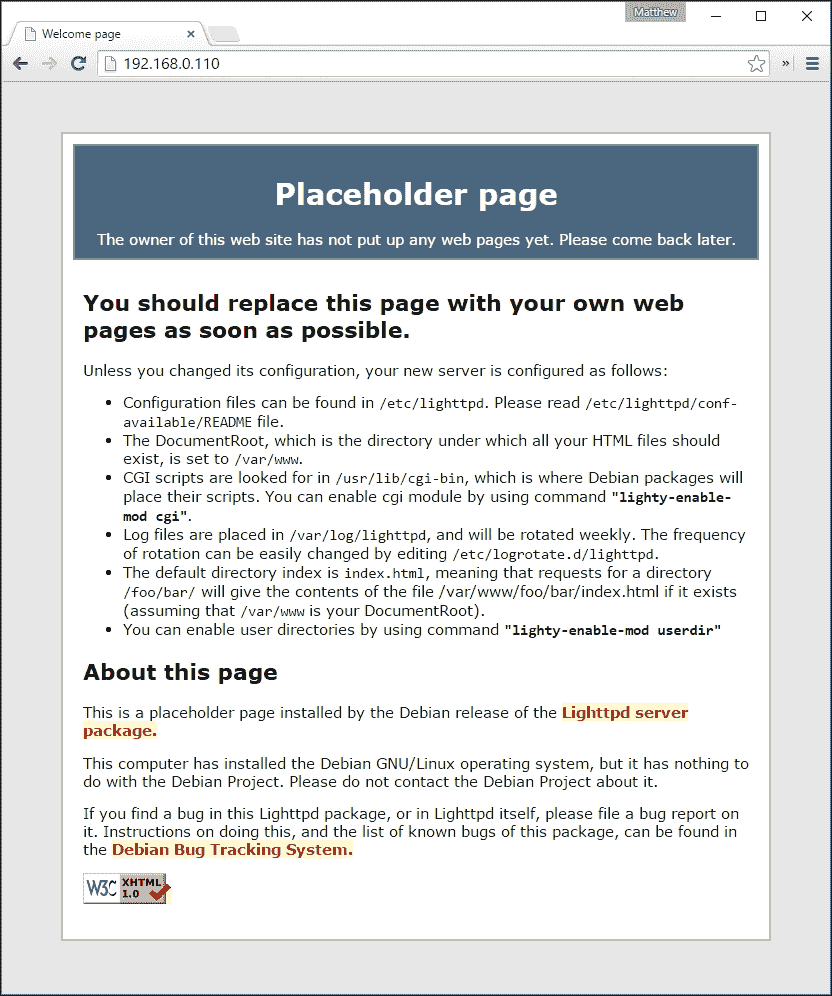
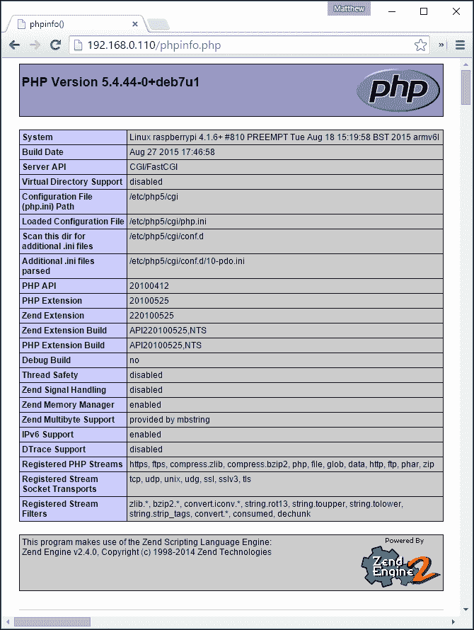
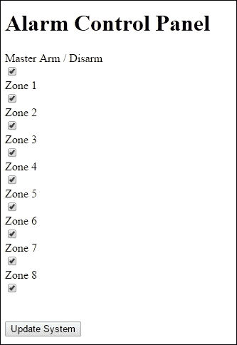
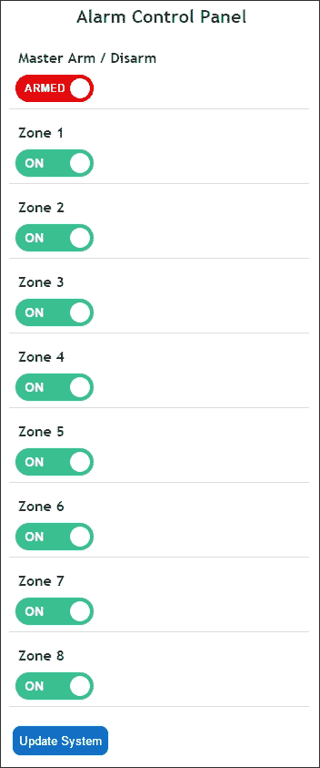
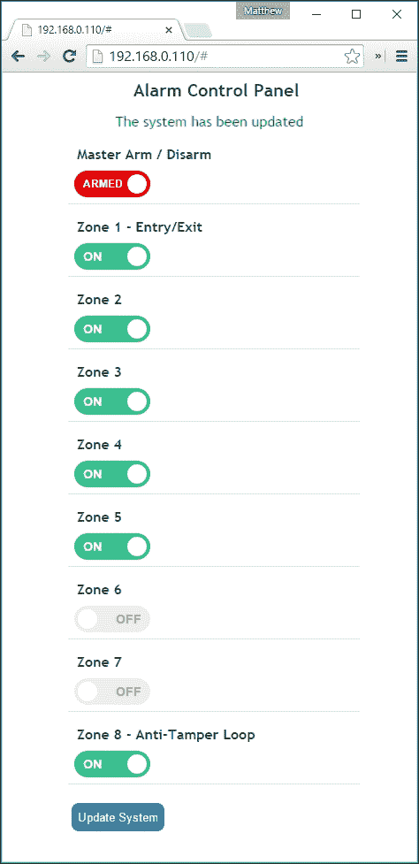
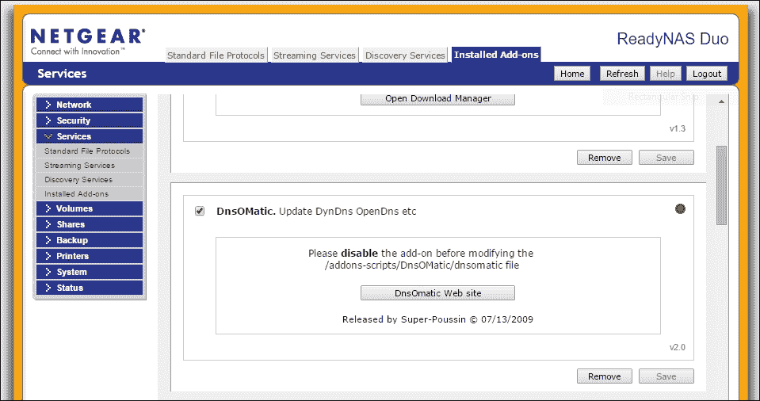
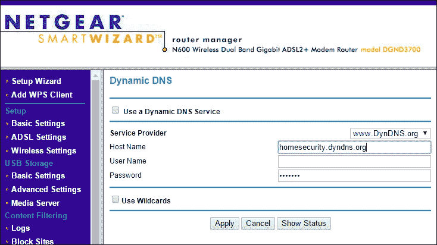
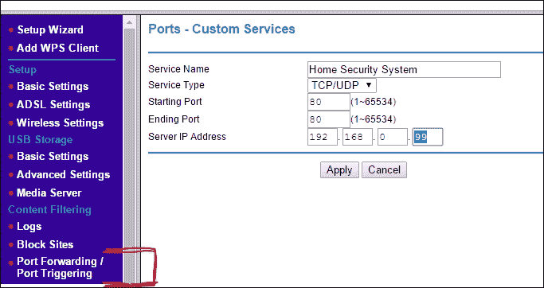

# 第七章：构建基于 Web 的控制面板

我们现在已经把所有硬件元素都准备好了，以创建一个完整的家庭安全系统，系统包括门窗接触开关、运动探测器和摄像头，用来拍摄那些想当入侵者的“开心照”！我故意通过模块化的方式引导您完成这些步骤，以便您可以根据需求挑选和扩展适合的硬件传感器元素。在第九章，*集成所有功能*，我们将把这些组件接线，构建基于区域的完整系统。

所有家庭安全系统都需要一个**控制面板**，该面板可以让我们**启动**和**停止**系统，并监控系统内各区域的状态。我们还可能想做一些事情，比如只启动某些区域，或者让系统在一天中的特定时间自动启动和停止。

所需的硬件，比如开关、LED 和 LCD 显示屏，可能会相当昂贵且耗时；它们也可能使系统变得不那么灵活和可配置。因此，在我们的系统中，我们将构建一个基于 Web 的控制面板，可以通过手机浏览器访问。这也意味着当我们不在家时，可以远程控制系统。

在本章中，我们将涵盖以下内容：

+   定义我们的家庭安全系统的范围，包括我们将监控的区域数量以及我们将使用的 I/O 端口

+   学习如何在我们的 Raspberry Pi 上安装和配置 web 服务器

+   为我们的报警控制面板开发一个基本的 HTML5 网页

+   学习如何使用 PHP 脚本动态配置我们系统的网页

# 安装 web 服务器

有几种可供选择的**web 服务器**可以安装在我们的 Raspberry Pi 上，它们都适用于我们的系统。但是我更喜欢**lighttpd** web 服务器，因为它易于使用且轻量级。lighttpd 通常被称作“Lighty”，说实话，比 lighttpd 这个名字更简短。

除了 web 服务器本身，我们还将安装**PHP**支持，这将使我们能够编写动态网页与 Linux 系统进行交互。说实话，虽然有很多原因让我不太喜欢 PHP 用于商业 Web 部署，但对于我们这样的嵌入式 Linux 系统，它是完美的，并且非常适用。如果您以前没有做过服务器端 Web 脚本，它也非常容易入门。

为了执行以下步骤，您需要通过终端控制台（例如 PuTTY）登录到 Raspberry Pi：

1.  更新软件包安装器：

    ```
    $ sudo apt-get update

    ```

1.  安装 `lighttpd` Web 服务器：

    ```
    $ sudo apt-get install lighttpd

    ```

    安装后，它将自动作为后台服务启动，并且每次 Raspberry Pi 启动时都会启动。

1.  安装 PHP5 支持：

    ```
    $ sudo apt-get install php5-cgi

    ```

1.  现在，我们需要在我们的 web 服务器中启用 PHP FastCGI 模块：

    ```
    $ sudo lighty-enable-mod fastcgi-php

    ```

1.  最后，我们需要重启 Web 服务器：

    ```
    $ sudo /etc/init.d/lighttpd

    ```

就这样！现在你应该已经成功安装了 PHP Web 服务器。默认情况下，网页内容文件将被安装在 `/var/www` 位置，Lighty 会在此位置安装一个测试占位符页面，你可以通过在浏览器中输入树莓派的 IP 地址来访问它，截图如下所示：



Lighttpd 占位符页面

## 测试 PHP5 安装

在此过程中，我们还应该测试 PHP 安装情况，因为它对构建我们的控制台至关重要。可以通过编写一个简单的 PHP 脚本页面来完成这项测试，如果 PHP 安装正确，它将返回有关环境和配置的信息：

1.  首先，进入网页内容文件夹：

    ```
    $ cd /var/www

    ```

1.  在 Nano 中创建一个名为 `phpinfo.php` 的文件：

    ```
    $ sudo nano phpinfo.php

    ```

1.  在编辑器中，输入以下单行命令，然后保存并退出 Nano：

    ```
    <?php phpinfo(); ?>

    ```

现在，在你的浏览器中，输入树莓派的 IP 地址后跟 `/phpinfo.php`，例如 http://192.168.0.110/phpinfo.php，应该会呈现如下页面：



由 Web 服务器生成的 PHP 信息页面

现在我们知道我们的网页服务器正常工作，可以开始创建我们的控制台网页了。

# 控制中

为了知道我们在报警控制面板上需要哪些控制项，我们需要绘制出系统的地图，列出区域输入和控制输入输出的数量。正如你从第三章中记得的那样，*扩展你的树莓派连接更多设备*，我们可以使用 I/O 扩展器上的两个端口最多设置 16 个区域。我们还可以使用树莓派板上的八个 GPIO 引脚。因此，让我们现在分配这些输出并将它们记录在下表中。

我将使用 I/O 扩展板的 A 端口为我的报警输入系统设置 8 个区域，使用原生 GPIO 引脚来连接按钮和警报输出。这样配置的一个原因是，系统可以始终保持安全故障模式——即使扩展板发生故障，树莓派仍然能够通信并触发连接到它的警报器和蜂鸣器。

| 端口 | I/O 引脚 | 标签/用途 |
| --- | --- | --- |
| 扩展器 A | 0 (A0) | 区域 1 输入（进/出通道） |
|   | 1 (A1) | 区域 2 输入 |
|   | 2 (A2) | 区域 3 输入 |
|   | 3 (A3) | 区域 4 输入 |
|   | 4 (A4) | 区域 5 输入 |
|   | 5 (A5) | 区域 6 输入 |
|   | 6 (A6) | 区域 7 输入 |
|   | 7 (A7) | 区域 8 – 防拆环路输入 |
| 扩展器 B | 0 (B0) |   |
|   | 1 (B1) |   |
|   | 2 (B2) |   |
|   | 3 (B3) |   |
|   | 4 (B4) |   |
|   | 5 (B5) |   |
|   | 6 (B6) |   |
|   | 7 (B7) |   |
| R-Pi GPIO | 0 (GP0) | 启动/解除开关（输入） |
|   | 1 (GP1) |   |
|   | 2 (GP2) |   |
|   | 3 (GP3) |   |
|   | 4 (GP4) | 武装 LED（输出） |
|   | 5 (GP5) | 启动/解除警报器（输出） |
|   | 6 (GP6) | 警报 LED（输出） |
|   | 7 (GP7) | 报警铃（输出） |

## 激活自己

*激活*和*解除激活*是报警系统中用于开启（**激活**系统）和关闭（**解除激活**系统）监控的术语。我们系统的第 1 区将与系统的激活和解除激活部分连接，因为它将连接到我们进出门的传感器；这个区域将是一个**入口**或**出口**用途的特殊区域。

当我们设置闹钟时，我们需要一些时间来离开房子。系统知道我们已离开房产的方式是通过监控*出口*区域，看我们是否在规定的时间内打开并关闭了前门。

同样，当我们返回时，我们将打开前门，但我们不希望报警立刻响起——我们需要在规定的时间内有机会解除激活系统。我们将通过基于 Web 的控制面板或使用某种开关在输入 GP0 上来激活和解除激活系统。

# 主配置文件

我们的系统将使用一个**主配置文件**，该文件会告诉系统所有设备如何设置和连接。这个配置文件将被 Web 控制面板和主报警控制脚本同时使用，使得两个子系统能够相互“通信”。让我们创建一个带有初始设置的文件。

设置文件将存储在与我们将在第九章中创建控制脚本的相同位置，*整合所有内容*，也就是在`/etc/pi-alarm`文件夹中。因此，接下来我们创建这个文件夹，并赋予其执行权限，以便我们的脚本可以运行：

```
$ cd /etc
$ sudo mkdir pi-alarm
$ sudo chmod 777 pi-alarm

```

现在我们将在这个文件夹中创建系统将使用的主配置文件：

```
$ cd pi-alarm
$ sudo nano alarm.cfg

```

### 提示

如前所述，你不必在 Raspberry Pi 上使用 Nano 创建文件——你可以在桌面计算机上创建文件，然后通过 SCP 将其传输到你的 Pi。

```
# ALARM MASTER CONFIG FILE #

#Number of zones in the system
NUM_ZONES=8

#Display labels for each zone
ZONE_LABEL_1="Zone 1 - Entry/Exit"
ZONE_LABEL_2="Zone 2"
ZONE_LABEL_3="Zone 3"
ZONE_LABEL_4="Zone 4"
ZONE_LABEL_5="Zone 5"
ZONE_LABEL_6="Zone 6"
ZONE_LABEL_7="Zone 7"
ZONE_LABEL_8="Zone 8"

#Zones that are enabled
#Set to 0 to Disable or 1 to Enable
ZONE_ENABLE_1=1
ZONE_ENABLE_2=1
ZONE_ENABLE_3=1
ZONE_ENABLE_4=1
ZONE_ENABLE_5=1
ZONE_ENABLE_6=1
ZONE_ENABLE_7=1
ZONE_ENABLE_8=1

SYSTEM_ARMED=0

#Zone status
#Set to 1 if zone is triggered
ZONE_STATUS_1=0
ZONE_STATUS_2=0
ZONE_STATUS_3=0
ZONE_STATUS_4=0
ZONE_STATUS_5=0
ZONE_STATUS_6=0
ZONE_STATUS_7=0
ZONE_STATUS_8=0
```

`alarm.cfg` 文件

# 创建网页

我们的基于 Web 的控制面板将是一个单一的 PHP 驱动的 HTML5 网页，并且是**移动优化的**。HTML5 是最新的网页标记标准，得到大多数现代智能手机和浏览器的支持。我们还将创建一个**层叠样式表**（**CSS**），使我们的页面在移动设备上看起来更加合理。

为了创建网页文件，我建议你在桌面计算机上使用像 Notepad++这样的优秀工具，而不是直接在 Raspberry Pi 上创建。或者，如果你是经验丰富的 Web 开发者，你可能已经有了自己的 IDE。

## 控制面板 HTML 模板

我们做的第一件事是创建一个 HTML 文件，用于在将 HTML 放入 PHP 文件之前测试布局，以便与系统交互。这可以让我们在不被 PHP 脚本干扰的情况下，先调整页面的外观。

### 注意

这不是一篇关于 Web 开发的教程——关于这个主题有大量的书籍可供参考——但我希望代码足够清晰，你能理解代码的运作方式。我将给你的代码是完全可用的，因此你可以直接使用我给你的代码，不必做其他操作。希望这也能让你的控制面板看起来还不错！

以下标记为你提供了一个基本的控制面板，显示我们 8 个区域的状态，一个主开关用于武装和解除武装，以及用于启用或禁用任何区域的开关。

代码的`<head>`部分包含一些`<meta>`标签，帮助移动设备识别该网站是移动友好的。在主`<body>`标记中，我们为每个区域创建了一个包含区域名称和开关的部分。每个区域都有自己的容器，以便我们能够高亮显示需要关注的特定区域，例如，如果该区域被触发。

你可以在`chapter 7`中的代码文件夹里找到完整的 HTML5 标记文件`alarm-panel.html`，它包含了我们控制面板的 HTML5 代码。

## 给它一些样式

目前，这个页面看起来并不好（事实上，它看起来很糟糕，像是 1990 年代的产物）；它对移动设备并不友好，很可能无法通过*香肠测试*。因此，我们将应用一些样式，使它看起来不至于那么糟糕。虽然前面的标记中提到了一个 CSS 文件——但我们还没有创建那个文件——所以这就是我们当前页面的样子（如我所说：它看起来糟糕）：



没有样式的 Web 控制面板

以下 CSS3 标记专门为我们的控制面板设计，它使得控制面板看起来相当漂亮，同时也能在**触摸屏**移动设备上使用。虽然 CSS 代码很长，看起来有些让人不知所措，但你不需要对它做任何处理，也不需要理解它——你唯一需要知道的是，它是为现代浏览器和智能手机设计的，所以不要指望它能在 Internet Explorer 7，甚至可能在 IE9 中正常工作！

本质上，它包含以下样式：

+   为我们的移动布局准备浏览器

+   我们的文本和区域区域

+   创建酷炫的开关，替代单调的复选框

+   在需要时让某个区域闪烁

```
/* Clear browser margin and padding defaults */
body, div, dl, dt, dd, ul, ol, li, h1, h2, h3, h4, h5, h6, pre, form, fieldset, input, textarea, p {
margin:0;padding:0;-webkit-text-size-adjust:none;
}

body {
  background: #ffffff;
  color: #4A5651;
  font-family: "Trebuchet MS", Helvetica, sans-serif;
  font-size:10px;  
  height: 100%;
  padding:0;
  margin:0 auto;
  max-width:320px;
  min-width:240px;
  text-align: left;
  width:100%;
  -webkit-box-shadow: 0px 20px 40px 0px rgba(0,0,0,0.50);
  -moz-box-shadow: 0px 20px 40px 0px rgba(0,0,0,0.50);
  box-shadow: 0px 20px 40px 0px rgba(0,0,0,0.50);
}

p, .zoneLabel {
  font-size:16px;
  margin:5px;
  line-height:1.4;
  color:#4A5651;
}

#header h1 {
  font-size:20px;
  line-height:40px;
  margin:0;
  padding:0 0 0 15px;
  text-align:center;
  text-overflow: ellipsis;
  font-weight:bold;
}

.zoneControl, .masterControl{
  border-bottom:1px solid #dddddd;
  margin-top:5px;
  margin-bottom:0px;
  padding:5px;
  display:block;
  width:100%;
}

.zoneLabel {
  font-weight:bold;
  text-overflow:ellipsis;
}

input[type="submit"] {
  border: none;
  background-color: #0b70cc;
  color: white;
  height: 32px;
  display: block;
  padding: 4px 7px;
  float: left;
  border-radius: 8px;
  position: relative;
  bottom: 1px;
  margin-left: 4px;
  text-align: center;
}
input[type="submit"]:hover {background-color: #b2ceec;color: #0b70cc;border: none;border: 1px solid #b2ceec;}

/* Flashing animation */
@-webkit-keyframes flash{0%, 50%, 100% {opacity: 1;} 25%, 75% {opacity: 0;}}
@keyframes flash {0%, 50%, 100% {opacity: 1;} 25%, 75% {opacity: 0;}}
.flash {
  -webkit-animation-name:
  flash;animation-name:
  flash;color:#f00000;
}
.animated { 
  -webkit-animation-duration: 1s; 
  animation-duration: 1s; 
  -webkit-animation-fill-mode: both; 
  animation-fill-mode: both; 
  animation-iteration-count:infinite; 
  -webkit-animation-iteration-count:infinite; 
}

/*
  ON/OFF SWITCH STYLES
  The rather cool On/Off switch styling was generated on
  https://proto.io/freebies/onoff/
*/
.onoffswitch {
  position: relative;
  width: 90px;
  -webkit-user-select: none;
  -moz-user-select: none;
  -ms-user-select: none;
}

.onoffswitch-checkbox {
  display: none;
}

.onoffswitch-label {
  display: block;
  overflow: hidden;
  cursor: pointer;
  border: 2px solid #FFFFFF;
  border-radius: 20px;
}

.onoffswitch-inner {
  display: block;
  width: 200%;
  margin-left: -100%;
  transition: margin 0.3s ease-in 0s;
}

  .onoffswitch-inner:before, .onoffswitch-inner:after {
    display: block;
    float: left;
    width: 50%;
    height: 30px;
    padding: 0;
    line-height: 30px;
    font-size: 14px;
    color: white;
    font-family: Trebuchet, Arial, sans-serif;
    font-weight: bold;
    box-sizing: border-box;
  }

  .onoffswitch-inner:before {
    content: "ON";
    padding-left: 10px;
    background-color: #34C290;
    color: #FFFFFF;
  }

  .onoffswitch-inner:after {
    content: "OFF";
    padding-right: 10px;
    background-color: #EEEEEE;
    color: #999999;
    text-align: right;
  }

.onoffswitch-switch {
  display: block;
  width: 18px;
  margin: 6px;
  background: #FFFFFF;
  position: absolute;
  top: 0;
  bottom: 0;
  right: 56px;
  border: 2px solid #FFFFFF;
  border-radius: 20px;
  transition: all 0.3s ease-in 0s;
}

.onoffswitch-checkbox:checked + .onoffswitch-label .onoffswitch-inner {
  margin-left: 0;
}
.onoffswitch-checkbox:checked + .onoffswitch-label .onoffswitch-switch {
  right: 0px;
}

.masterswitch {
  position: relative;
  width: 90px;
  -webkit-user-select: none;
  -moz-user-select: none;
  -ms-user-select: none;
}

.masterswitch-checkbox {
  display: none;
}

.masterswitch-label {
  display: block;
  overflow: hidden;
  cursor: pointer;
  border: 2px solid #FFFFFF;
  border-radius: 20px;
}

.masterswitch-inner {
  display: block;
  width: 200%;
  margin-left: -100%;
  transition: margin 0.3s ease-in 0s;
}

.masterswitch-inner:before, .masterswitch-inner:after {
  display: block;
  float: left;
  width: 50%;
  height: 30px;
  padding: 0;
  line-height: 30px;
  font-size: 12px;
  color: white;
  font-family: Trebuchet, Arial, sans-serif;
  font-weight: bold;
  box-sizing: border-box;
}

.masterswitch-inner:before {
  content: "ARMED";
  padding-left: 10px;
  background-color: #F00000;
  color: #FFFFFF;
}

.masterswitch-inner:after {
  content: "OFF";
  padding-right: 10px;
  background-color: #EEEEEE;
  color: #999999;
  text-align: right;
}

.masterswitch-switch {
  display: block;
  width: 18px;
  margin: 6px;
  background: #FFFFFF;
  position: absolute;
  top: 0;
  bottom: 0;
  right: 56px;
  border: 2px solid #FFFFFF;
  border-radius: 20px;
  transition: all 0.3s ease-in 0s;
}

.masterswitch-checkbox:checked + .masterswitch-label .masterswitch-inner {
  margin-left: 0;
}

.masterswitch-checkbox:checked + .masterswitch-label .masterswitch-switch {
  right: 0px;
}
/* END OF SWITCH STYLES */
```

Web 控制面板样式表 – `alarm-panel.css`

应用样式表后，效果如下（我认为看起来更漂亮了，你应该会同意）：



带样式的 Web 控制面板

## 使其动态化

现在我们已经定义了控制面板页面的布局代码，我们可以将其插入到 PHP 页面中，这样 PHP 脚本就可以根据我们家庭安防系统的状态动态修改页面。

PHP 脚本将帮助我们实现以下基本功能：

+   更新配置文件，包含各区域开关的位置

+   武装和解除武装系统

+   告诉我们在入侵被检测时，哪个区域被触发

再次强调，我不打算详细讲解 PHP 代码的工作原理，但希望代码中的注释能帮助你理解正在进行的操作，同时也能帮助你在需要时修改它的行为。

### 首先获得一些帮助

除非更改一些 PHP 配置，否则在代码中出现小错误时尝试找出问题可能会非常头疼，因为基本上你面对的是……什么都没有！

在创建和构建我们的 PHP 页面之前，我们将更改 PHP 配置文件中的一些设置，以确保我们知道是否存在任何问题：

1.  使用**Nano**打开配置文件：

    ```
    $ sudo nano /etc/php5/cgi/php.ini

    ```

1.  文件有点大而且笨重，但是通过它，找到这些设置，并按以下方式进行更改：

    ```
    error_reporting = E_ALL
    display_errors = On
    ```

1.  保存文件并退出 Nano。

1.  最后，重新启动 Lighty：

    ```
    $ sudo /etc/init.d/lighttpd restart

    ```

### 主 PHP 代码

就是这样……但是现在别运行它——还有更多事情要做……

你可以在`chapter 7`的代码文件夹内找到完整的主 PHP 代码。在我们的 Web 服务器内容文件夹中，现在应该有以下文件：

```
pi@raspberrypi ~ $ ls -1 /var/www
alarm-panel.css
alarm-panel.html
index.lighttpd.html
index.php
phpinfo.php
```

### 我是另一个人

现在，在我们实际能够成功打开这个 PHP 网页之前，我们需要意识到，默认情况下 Web 服务器实际上作为一个名为`www-data`的不同用户运行。这意味着它通常没有执行某些操作的权限；特别是那些涉及文件系统的操作。

如果你已经通过前面的 PHP 脚本工作过，你会发现它实际上执行了一些 Linux 命令来读取和更新我们的`alarm.cfg`文件。

与我们必须在许多命令前面加上`sudo`因为我们不是 root 用户一样，对其他用户也是如此，包括`www-data`。因此，为了给 Web 服务器赋予执行某些命令的权限，我们需要将其添加为一个**sudoer**，使用**visudo**实用程序。

运行实用程序打开 sudoer 配置文件：

```
$ sudo visudo

```

在文件底部添加以下行：

```
www-data ALL=(ALL) NOPASSWD:/bin/cat,/etc/pi-alarm/update-alarm-setting.sh
```

然后保存文件并退出。

最后一件事是创建一个小的**Bash 脚本**，用于处理更新我们的`alarm.cfg`文件中的设置任务。我们之所以需要这样做是因为我们将使用 Linux 的`sed`命令来更新文件。我们调用`sed`命令的方式意味着它需要创建一个临时文件。除非我们在配置 Web 服务器时进行一些工作以处理其文件位置上下文，否则它将无法正常工作。因此，创建一个被 PHP 脚本调用的简单的 Bash 脚本会更容易。这种方式下，Bash 环境处理临时文件上下文。

因此，我们将创建以下 Bash 脚本，并保存在我们的`/etc/pi-alarm`文件夹中：

```
#!/bin/bash
#/etc/pi-alarm/update-alarm-setting.sh
############################################
# Provides access to the sed command from  #
# PHP as it needs write access to a temp   #
# folder.                                  #
# $1 - Setting Name                        #
# $2 - Setting Value                       #
############################################

sed -i "s/^\($1\s*= *\).*/\1$2/" /etc/pi-alarm/alarm.cfg
```

update-alarm-setting.sh

然后我们需要赋予脚本执行权限：

```
$ sudo chmod 777 /etc/pi-alarm/update-alarm-setting.sh

```

此时，我们在`/etc/pi-alarm`文件夹中应该看到以下内容：

```
pi@raspberrypi ~ $ ls -1 /etc/pi-alarm
alarm.cfg
update-alarm-setting.sh
```

好了，经过这一切，我想现在我们可以在浏览器中启动控制面板页面了，位于

`http://<my-pi-ip>`.

`index.php`被配置为 Lighty 的默认页面，因此你不需要将其添加到 URL 的末尾；只需要 IP 地址就可以了。

通过更改开关位置，然后点击**更新系统**按钮，你应该会发现设置值在`alarm.cfg`中得到相应更新。现在你可以看到，这个文件将成为我们在第九章中开发的 Web 控制台和安全系统脚本之间交换状态的方式，*整合一切*。



最终操作控制面板

# 远程访问我们的控制面板

虽然我们可以设置系统在检测到入侵时接收电子邮件警报，但能在任何地方访问我们的基于 Web 的控制面板将非常有用，这样我们就可以在不在现场时，也许通过它来布防和撤防系统，或关闭某些区域。

但是，为了实现这一点，我们需要做一些准备工作：

## 设置动态 DNS 账户

我们大多数家里没有**固定的 IP 地址**来连接互联网；它可能会时常变化，尤其是在我们重启或拔掉路由器时，互联网服务提供商会在我们重新连接时分配一个新的 IP 地址。因此，我们不能依赖 IP 地址来访问家庭网络，特别是在外出时。为了解决这个问题，我们需要设置一个**动态 DNS**账户，这样我们就可以为我们的家庭网络设置一个域名（例如，*myhomenetwork.com*）。

它通过在你的网络内运行一个服务来工作，比如在路由器或笔记本电脑上，更新托管你域名的动态 DNS 服务，使用你当前的 IP 地址。然后，当你在浏览器中使用你的域名时，它将把你带到你家庭网络中的 Web 服务器。

市面上流行的动态 DNS 提供商包括 No-IP（[www.noip.com](http://www.noip.com)）和 DynDNS（[www.dyn.com](http://www.dyn.com)）。你还可以通过 OpenDNS 获得一个免费的 DnsOMatic 账户来管理你的服务（[www.dnsomatic.com](http://www.dnsomatic.com)）。



我的 Netgear NAS 设备有一个 DnsOMatic 更新服务插件



我的 Netgear 路由器提供更新动态 DNS 服务的选项

### 树莓派动态 DNS 客户端

由于你基于树莓派的家庭安全系统很可能始终开机，你可能更愿意在其上安装**ddclient**更新服务：

```
$ sudo apt-get install ddclient

```

安装完成后，你可以使用以下配置文件为你的特定服务和账户详细信息进行设置：

```
$ sudo nano /etc/ddclient.conf

```

## 在树莓派上设置静态 IP

为了让我们的家庭网络始终知道在哪里找到你的树莓派，我们需要为其设置**静态 IP 地址**，假设它目前每次启动时从路由器的 DHCP 服务器获取 IP 地址。

1.  为此，我们需要编辑 Raspberry Pi 上的网络设置。在 Nano 中，打开以下配置文件：

    ```
    $ sudo nano /etc/network/interfaces

    ```

1.  您可能会发现以太网端口配置类似于以下内容：

    ```
    auto eth0
    allow-hotplug eth0
    iface eth0 inet manual

    ```

1.  将此配置更改为您网络中未使用的静态 IP 地址。在我的例子中，我将其设置为`192.168.0.99`。网关设置为我的互联网路由器的 IP 地址：

    ```
    auto eth0
    allow-hotplug eth0
    iface eth0 inet static
            address 192.168.0.99
            netmask 255.255.255.0
            gateway 192.168.0.1
    ```

1.  现在，我们需要重启网络服务—请注意，您将会断开当前的终端会话。您需要使用新的 IP 地址重新连接：

    ```
    $ sudo /etc/init.d/networking restart

    ```

如果您遇到任何问题，只需使用`sudo reboot`重启 Pi，重新启动后所有问题应该都会解决。

## 端口转发

这个问题的最后一步是确保我们的互联网路由器能够将给定端口的传入流量定向到我们的 Raspberry Pi 的 Web 服务器。为了举例说明，我假设我们将保持 Web 服务器的默认端口 80。

### 提示

**关于安全性的说明**

由于我们的 Web 服务器现在可以从外部访问，我们需要注意确保系统的安全性。实现这一点的两种主要方法是将 Web 服务器的端口更改为 80 以外的随机数（例如，8799），并通过应用基本身份验证为您的网站添加密码保护。这两者都可以在`lighttpd`配置文件中完成。

大多数路由器都允许您将**端口转发**设置为其**防火墙**配置的一部分。基本上，设置这一项意味着来自互联网上某一给定 TCP 端口的任何传入流量将被允许通过路由器，并且会被定向到指定 IP 地址的设备。在我的 Netgear 路由器中，它的设置如下所示：



在 Netgear 路由器上设置端口转发

现在，当您在浏览器中输入您的个人域名时，即使您不在家，您也应该能够访问您的警报控制面板。

### 提示

您可能还希望考虑打开端口 22，这样您就可以从外部网络使用 PuTTy 和 SSH 直接访问 Raspberry Pi。

# 总结

我们现在已经开始构建控制家庭安全系统的软件，首先确定了主配置文件的格式。我们还安装了一个 Web 服务器，并使用 PHP、HTML5 和 CSS3 构建了一个基本的单页控制面板，该面板可以在我们的手机上良好访问，允许我们配置系统并查看状态。

此外，我们已经学习了如何配置家庭网络和 Raspberry Pi，以便我们在不在家时也能访问控制面板。

在第九章，*整合所有内容*，我们将把所有电子元件组合在一起，并编写运行家庭安全系统的主要脚本。但在此之前，在下一章中，我们将探讨一些其他的组件，比如将一些其他传感器添加到我们的家庭安全系统中，这些传感器不一定与入侵检测相关。我们还将了解如何通过 Web 浏览器远程管理整个 Raspberry Pi 系统，除了访问我们的家庭安全控制面板。
