# 第八章 一些杂项

前面的章节为我们提供了设计并组装整个家庭安全系统的基础和要素，我们将在下一章完成这一工作。我希望我已经以一种相对结构化和逻辑的方式指导你，帮助你为此做好准备。

不过，在此之前，我先放上一章名为*杂项的事物*，因为它确实是这样的。这一章包含了一些可选但有用的额外功能，我们应该考虑将其纳入系统，但它们并不足以单独占据一个完整的章节。我想你可以把它们看作是前几章的附注。

因此，我们将讨论以下几个话题：

+   如何在没有基于 Web 的面板的情况下武装和解除系统

+   从我们的 GPIO 输出安全驱动感性负载

+   向我们的系统添加一个逃生水传感器输入

+   向我们的系统添加一个温度传感器输入

+   如何将一氧化碳探测器添加到我们的系统中

+   使用 Webmin 远程管理我们的树莓派

# 武装和解除武装系统

我们在基于 Web 的控制面板上加入了一个开关，方便你通过智能手机来武装和解除武装系统。然而，这可能不是最方便的方式，特别是在你急匆匆出门时，或者你回到家时手机电池已没电。所以，我们需要找到一种额外的方式，在物业的出入口处武装和解除系统。

在上一章的区域列表表格中，你会注意到我将树莓派 GPIO 的输入 GP0 分配为我们的武装/解除武装开关输入。这个输入将与我们的控制面板开关配合使用。

这个输入可以是一个简单的切换开关，或者更安全一些，比如**钥匙开关**或**电子键盘**。无论哪种方式，它将在系统武装时与树莓派的 GP0（GPIO17）接地连接。

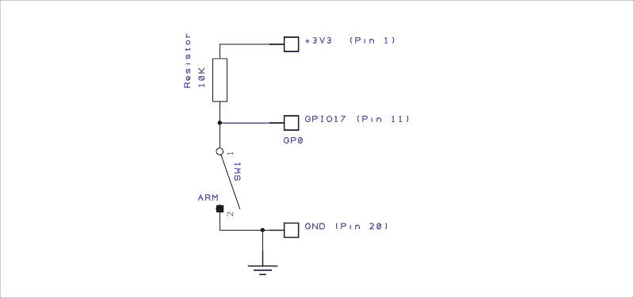

我们的武装/解除武装开关的电路图

如果你有开关或其他类似的设备将在户外并暴露于环境中，你需要确保它们适合户外使用，以免损坏并影响系统的完整性。

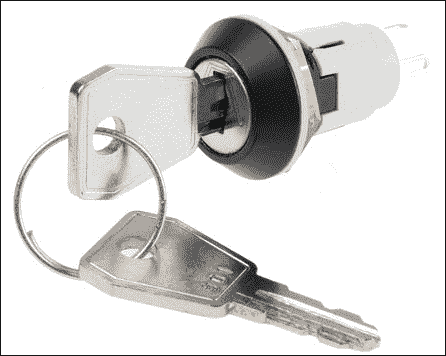

适用于户外使用的 IP67 等级钥匙开关（型号 Lorlin WRL-5-E-S-2-B）

通过使用独立的**安全键盘**，你可以为每个用户分配一个密码来武装和解除系统。例如，CDVI ECO 100 是一款低成本的键盘，支持最多 100 个用户。当输入正确的密码时，它会通过关闭内部开关来武装系统；再次输入密码时，键盘通过打开开关来解除武装系统。

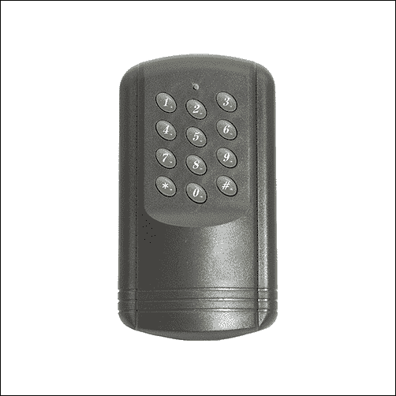

CDVI ECO 100 可编程键盘

# 驱动感性负载

我在第六章中讨论了驱动大负载的问题，*向我们的安全系统添加摄像头*，但现在可能是一个更好的时机，来进一步展开并讨论如何驱动**感性负载**，例如**铃声**和白炽**灯泡**。在之前的电路示例中，我使用了 TIP120 达林顿三极管来驱动一个不具感性的 LED 阵列。对于感性负载，您需要增加一些二极管保护，以防止继电器和铃声开关时产生的电磁干扰对电路造成影响。

这是我们带有 1N4007 **整流二极管**保护的数字负载驱动器的修改版电路：

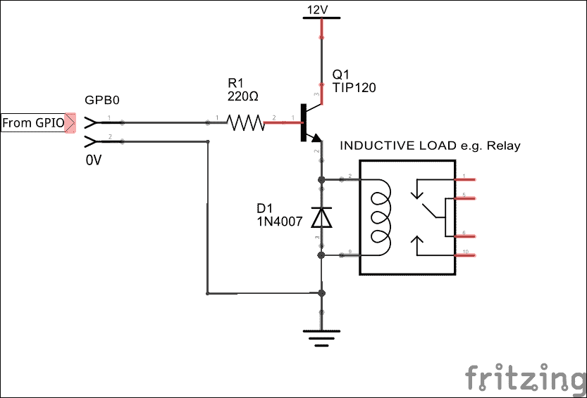

带二极管保护的数字负载驱动器

# 超越入侵检测

家庭安全不仅仅是为了防止入侵，也是在防范其他风险，如洪水、火灾、一氧化碳泄漏等。因此，将我们的家庭安全系统扩展到检测这些其他风险也是有意义的。

您可以选择设置系统，让某些类型的警报仅通过电子邮件发送到您的手机，而不是触发所有外部的铃声、灯光和警报。这可以通过调整下一章中的脚本来实现，以便它们按照您想要的方式运行。

## 一个简单的水位探测器

没有什么比外出几天后回家发现厨房被水淹了更糟的了，因为水槽下方发生了漏水。我们的简单电路将检测到水的存在，并在我们的家庭安全系统中触发一个输入，从而可以提醒您。您也可以购买现成的套件和模块来完成这个功能，但下面的电路便宜且使用了我们的光耦合器，因为我们实际的探测器需要不同的电压。

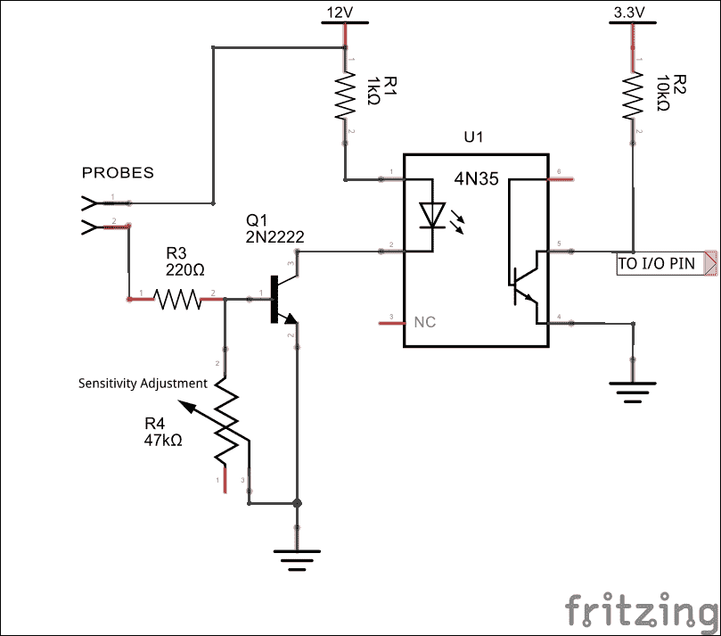

一个简单的水位探测器电路，已与 GPIO 输入隔离

### 工作原理

当水接触到探头时，电流就会流过水，并且流过三极管 Q1 基极的 R3/R4 电位分压器。当基极电流足够大，达到饱和状态时，三极管会完全导通，导致光耦合器内的 LED 亮起。这将拉低我们系统的输入引脚，并通过光耦合器内的光敏晶体管将其接地。

您可以使用微调电位器 R4 来校准传感器，通过调节其灵敏度。任何常见的 NPN 双极性晶体管都应该可以在这里工作，但显然它们的工作参数各不相同，所以需要选择一个合适的。

## 一个简单的温度传感器

如果我们希望在环境温度达到某个阈值时收到警报，那么我们可以使用常见的 LM34/LM35 温度传感器来构建一个电路。这是一个简单的设备，只有三个引脚：电源、地和输出，提供与温度成比例的电压。LM34 和 LM35 之间的区别在于，LM34 输出 10mV/°F，而 LM35 输出 10mV/°C。还有一个 LM335 变种，输出为 100mV/°K。

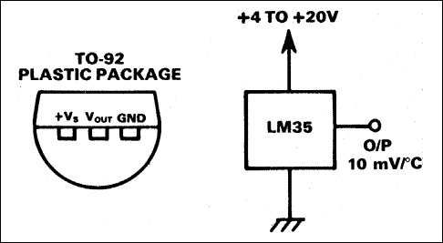

引脚图来自德州仪器 LM35DZ 数据手册

你可能已经注意到，这实际上是一个模拟设备——那么我们该如何将它与我们完全数字化的系统进行连接呢？一种方法是将模拟到数字接口集成到我们的输入控制板上，读取从中传入的数据，以便我们知道确切的温度，但这可能超出了本书的范围。因此，我们将实现一个电路，当温度超过预设阈值时，会发出警报，这在我们的家庭安防系统中可能已经足够了。

### 注意

如果你有兴趣构建一个模拟到数字的模块来扩展你的家庭安防，那么可以看看 NXP 的 PCF8591 芯片，它是一个基于 I2C 的模拟到数字转换器。这将连接到我们已经在使用的 I2C 总线，因此它实际上只是一个附加模块。

[`bit.ly/NXPPCF8591T`](http://bit.ly/NXPPCF8591T)

对于我们的温度探测电路，我们将使用一个配置为比较器的运算放大器，当预设温度达到时触发我们的光耦合器输入。因此，对于火灾探测，我们可能希望在环境温度超过 50°C 时进行检测。

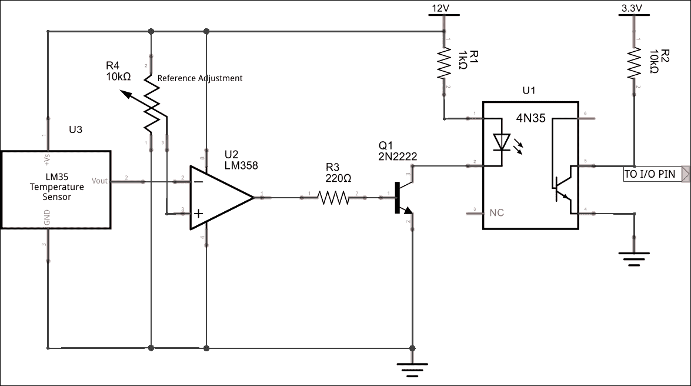

用于驱动我们数字输入的温度阈值传感器

### 工作原理

参考电压由可变电阻 R4 设置，它在 12V 和地之间形成一个电压分压器。这实际上意味着，运算放大器比较器的正输入端上的参考电压可以在 0 到 12V 之间。假设我们希望检测到 50°C 时触发，我们将需要运算放大器在负输入为 500mV（10mV/°C）时触发。

在我们的电路中，运算放大器的输出在正常状态下是高电平，这使得光耦合器保持开启。然而，当达到阈值时，运算放大器的输出被拉低，切断晶体管 Q1，进而关闭光耦合器。这通过电阻 R2 将我们的报警输入拉高。

## 一氧化碳探测器

完全可以构建烟雾和一氧化碳探测器，并将其连接到我们的家庭安防系统，方式与之前的传感器类似，尽管它们稍微复杂一些，因为可能需要特殊处理。SparkFun MQ-7 **一氧化碳** (**CO**) 探测器（实际上是由 Winsen Electronics 制造）可以像我们的温度传感器一样实现，当达到特定阈值时触发报警输入。


SparkFun 提供的 Winsen MQ-7 一氧化碳气体探测器。

### 注意

根据 ASHRAE（[www.ashrae.org](http://www.ashrae.org)）的标准，一氧化碳（CO）的最大安全连续暴露量为 9ppm（百万分之一）。你绝对不应该长时间暴露在高于这个浓度的 CO 中，35ppm 是正常 8 小时工作日的最大值。

MQ-7 探测器的灵敏度范围在 10 到 500ppm 之间，因此在我看来，我希望它一旦检测到任何东西就发出警报，因此我们应该将比较器的参考电压设置为灵敏度曲线低端的值，以符合数据表中提供的灵敏度曲线，如下所示：

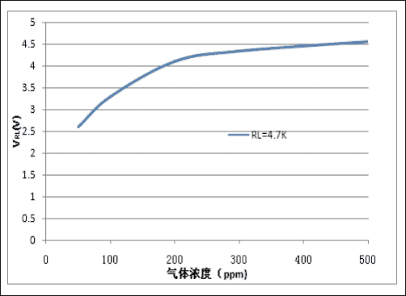

来自 Winsen MQ-7 制造商数据表中的灵敏度曲线。

### 注意

**警告**

我加入这一部分关于一氧化碳探测的内容，更多的是出于兴趣。它是一种有害物质，虽然出于兴趣自己制作探测器是可以的，但请仅限于此。将其作为我们家庭安防系统的一部分，能够在我们外出时提醒我们，这是有用的，但这 *不应* 作为一个商用探测器的替代品，商用探测器会放在锅炉旁，具备所有的认证、标准等，并且在我们家里时发出非常响亮的警报。

# 我们的树莓派远程管理

在上一章中，我们学习了如何设置系统和家庭网络，以便我们可以在任何地方远程访问报警控制面板。现在，我将向你展示如何扩展这个设置，以便能够管理和监控整个树莓派系统。

## 获取 Webmin

**Webmin** 是一个非常优秀且成熟的基于 Web 的界面，用于管理 Unix/Linux 系统。你可以在 [www.webmin.com](http://www.webmin.com) 上找到关于 Webmin 的所有信息。像本书中所有的内容一样，我假设你在树莓派上使用的是 Raspbian 发行版来安装 Webmin。

安装 Webmin 有几种方式：可以手动下载并解压，或者更新我们的软件源，以便我们可以使用 `apt-get`。我将选择后者，这样所有依赖项都会自动安装，未来更新也能更容易管理。虽然有几个步骤，但其实非常直接：

### 更新软件源

1.  我们需要做的第一件事是更新我们的存储库源，将 Webmin 存储库添加进去：

    ```
    $ sudo nano /etc/apt/sources.list

    ```

1.  将以下两行添加到文件末尾：

    ```
    deb http://download.webmin.com/download/repository sarge contrib
    deb http://webmin.mirror.somersettechsolutions.co.uk/repository sarge contrib

    ```

1.  保存并退出 Nano。

### 导入签名密钥

1.  接下来，我们需要下载并导入存储库的签名密钥：

    ```
    $ cd ~
    $ sudo wget http://www.webmin.com/jcameron-key.asc
    $ sudo apt-key add jcameron-key.asc

    ```

1.  现在我们拥有了所需的一切，可以更新包管理器并安装 Webmin。这可能需要一些时间，所以你可能想去泡一杯茶或咖啡：

    ```
    $ sudo apt-get update
    $ sudo apt-get install webmin

    ```

1.  安装完成后，你应该在命令行窗口看到以下消息：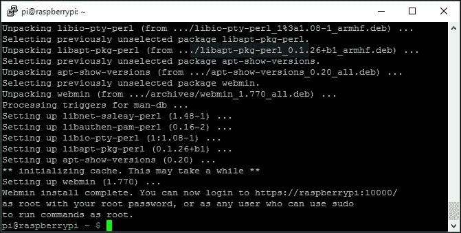

    Webmin 安装

### 本地访问 Webmin

默认情况下，Webmin 运行在 10000 端口，并使用安全的 HTTP**S** 协议；因此，要访问它，你需要在浏览器中输入以下 URL：

`https://<my-ip>:10000`

其中 `<my-ip>` 是你树莓派的 IP 地址。

在上一章中，我们在系统上设置了静态 IP 地址；在我的案例中，我将地址设置为 192.168.0.99。所以，要访问我系统上的 Webmin，我将使用：

`https://192.168.0.99:10000`

### 注意

**HTTPS 隐私错误**

在某些浏览器中，例如 Google Chrome，你可能会看到一个隐私错误，当你尝试访问 Webmin 网页时。这是因为 HTTPS 连接背后的 SSL 证书没有被一个已知的认证机构签署。这没问题——只需告诉浏览器你想接受此证书并继续操作（在 Chrome 中，你需要先点击 **高级** 链接才能看到该选项）。

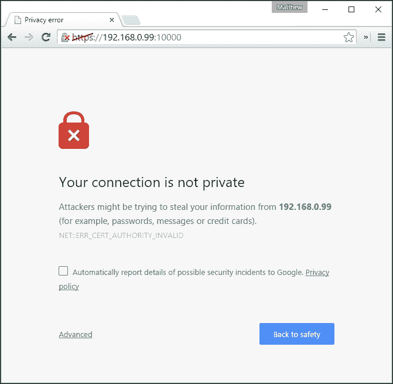

你可以使用 **root** 或 **pi** 用户账户登录 Webmin，或者任何具有 **sudo** 权限的账户：

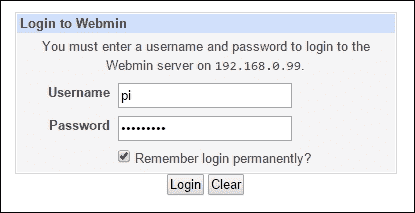

Webmin 登录

登录后，你将看到系统的主信息页面。可以好好探索一下，因为这里有很多有用的内容可以查看和操作。

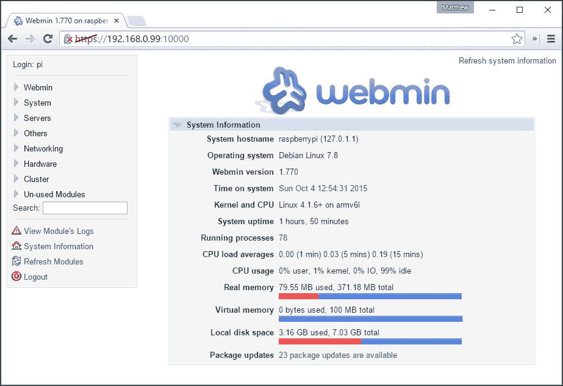

Webmin 系统信息视图

Webmin 自带了许多模块，并不是所有模块都会被安装；因此，你可能想要探索一下面板中的 **未使用模块** 部分，看看是否有任何你希望添加到 Webmin 的模块。

### 远程访问 Webmin

就像我们在上一章中为报警控制面板设置远程访问一样，你也可以用 Webmin 来做到这一点——只需在路由器上为端口 10000 设置端口转发。然后你可以通过 `https://<my-public-ip>:10000` 在任何地方访问 Webmin。

# 总结

这章算是对多个主题的混合和总结，在我们建立家庭安全系统框架之前。我希望你喜欢这些与前几章相关的补充内容，并且它能给你一些灵感，帮助你理解家庭安全系统可以做到什么程度。

我们首先查看了如何在不访问基于 Web 的控制面板的情况下，通过添加一个机械或数字开关到臂/解臂输入端，来对系统进行武装和解除武装。

然后我们研究了将模拟类型传感器添加到我们的系统中，利用设置为电压比较器的运算放大器，当达到某个阈值时可以提醒我们。这些比较器电路背后的思想可以应用于不同类型的传感器，用于检测模拟传感器输出端何时达到某一电压阈值。

最后，我们学习了如何在树莓派上安装 Webmin，以便我们能够监控和配置 Linux 操作系统的多个方面。

下一章是我们所有人期待的时刻；我们将把前几章中的所有元素和概念结合起来，构建我们完整的系统，包含我们想要实现的各个元素。整个过程的明星将是我们的 Bash 脚本，它将把所有这些元素串联起来，并提供整个系统的控制逻辑。
