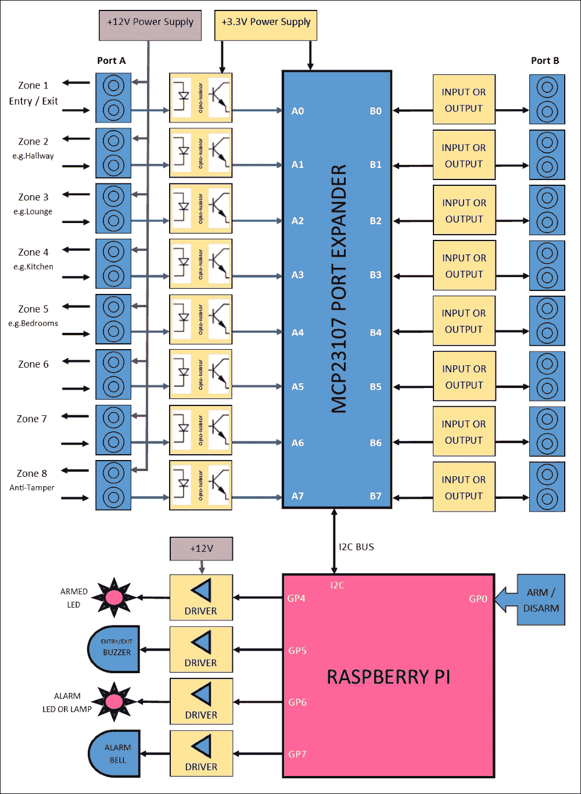
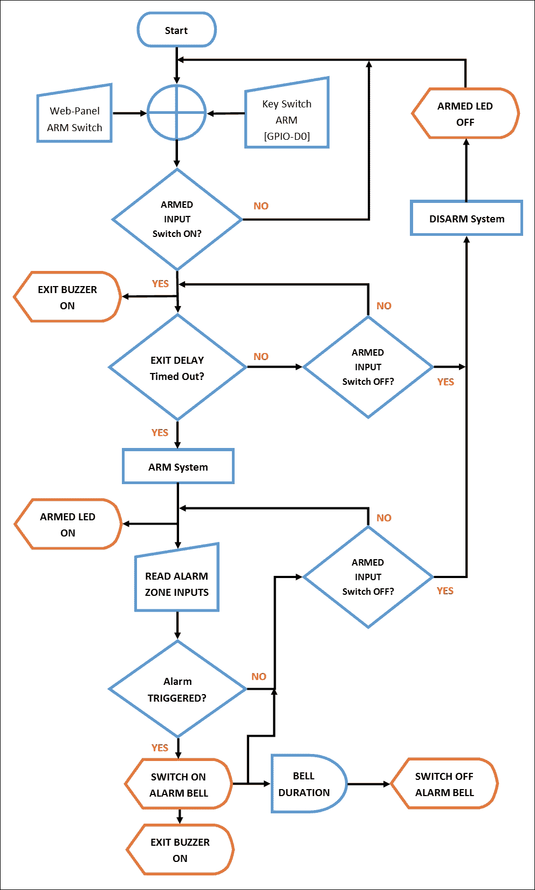

# 第九章. 将所有内容整合

在过去的八章中，我们探讨了你希望在住宅中安装的全功能家庭安全系统的元素和概念。它以模块化的方式呈现，这样你可以选择系统中想要的功能，从而使其变得紧凑基础，或大型复杂，完全根据你的需求来定制。

从根本上讲，家庭安全系统的理念是检测特定区域输入是否被外部传感器触发为高或低信号，不管是开关、运动探测器，还是水探测器。归根结底，控制软件关心的不是传感器的类型，而是系统软件的任务就是检查输入的状态并根据情况发出警报。

在本章的最后，我们将把所有概念整合在一起，构建一个安全系统框架，并围绕它编写控制脚本。我们将覆盖以下内容：

+   定义我们系统的高层次概述，详细说明连接的元素

+   构建整个模块化安全系统框架控制脚本，详细探讨代码

+   深入探讨一些详细的 Shell 脚本技巧，用于执行某些任务

+   学习如何让我们的系统在启动时自动启动

+   通过创建基于 RAM 的文件系统来防止 SD 卡烧毁

# 报警系统示意图

为了避免在过程中迷失方向，我建议首先绘制出一张完整的系统示意图，以便我们能够遵循。我在设计和组装任何系统时都会这么做，这样可以以结构化的方式构建系统，并且便于文档化和修改。

对于本章中的家庭安全系统，我设计了以下系统示意图，我们将以此作为框架。整个概念设计为模块化的，因此你可以根据自己的需求设计适合的系统，并根据本章中展示的脚本进行实现。



最终的家庭安全系统示意图

## 系统元素概述

前面的系统示意图包含了我们在前几章中讨论的元素和模块。以下是这些内容的快速回顾：

### 一个 +12V 电源

这是我们系统的主要电源，我们将从一个外部的主电源适配器中获取，适配器可能是**电池备份**的。此电源需要平稳且经过调节，以确保其对当前绘制的系统保持稳定。

所有报警接线和传感器将由该电源供电，外设如声响器和铃声也会从 12V 电源获得电力。第五章，*添加被动红外运动传感器* 讨论了使用 12V 电源为报警电路供电的优点。

### 一个 +3.3V 电源

此电源是数字端口扩展电路的调节+3.3V 电源；它还通过光耦合器提供逻辑报警区输入。+3.3V 电源可以从+12V 电源（建议）或根据所需电流选择树莓派 GPIO 连接器上的+5V 电源派生，使用电压调节器。

第三章，*扩展 Pi 以连接更多事物*，向您展示了如何构建+3.3V 调节供电。

### 光电隔离输入模块

当高触发时，此将隔离+12V 区域输入电源线与端口扩展器和 GPIO 数字输入，并且当高时应只向其呈现最大+3.3V。

这些光电隔离输入模块的电路在第五章中进行了讨论并显示出来，*添加被动红外运动传感器*。

### 端口扩展器

端口扩展器是我们的主要数字输入/输出系统，将接收报警区输入并通过 I2C 总线将其传输到树莓派，或允许树莓派开关输出。

我们在第三章中构建了基于 MCP23017 的端口扩展器电路，*扩展 Pi 以连接更多事物*，并在第四章中为其配置了软件，*添加磁接触传感器*。

### 武装/解除开关

武器/解除输入覆盖了我们基于 Web 的控制面板上的武器/解除**软开关**功能，并且是连接到树莓派 GPIO 连接器上的 GP0 的开关（键盘、数字键盘或其他）。

记住将任何开关电路适当连接到 GPIO 引脚，以避免损坏您的树莓派。这在第二章中进行了讨论，*使用 GPIO 连接 Pi 的事物*。

### 报警输出

在我们的系统中，我们有几个输出设备由我们的树莓派通过输出驱动电路控制。我们有一个出入口蜂鸣器的输出，一个武装状态 LED，一个报警铃声和一个报警 LED 指示灯。

这些由我们的树莓派 GPIO 连接器通过驱动电路开关控制，允许我们使用 GPIO 引脚驱动高电流和感性负载。这些驱动电路基于 TIP120 达林顿晶体管，在第六章中讨论过，*向我们的安全系统添加摄像头*和第八章中讨论过，*各种各样的事物*。

# 设计控制脚本

在我们开始编写控制我们的报警系统的脚本之前，最好先概述系统的**高级**流程。以下**流程图**帮助我们理解我们的系统应如何工作，以及我们的脚本需要做出的各种逻辑决策。

流程图可能看起来有些复杂，因为它的线条方向各异，但实际上它是非常线性且朝下的。参考流程图，它展示了控制脚本将要执行的以下任务：

+   安静地坐着，直到通过硬件钥匙开关或基于 Web 的面板软开关启动系统。

+   当系统首次启用时，它将在真正启动系统之前响起出口蜂鸣器一段预定的时间。这为您提供了离开房产或再次解除系统的机会，系统才开始监控输入。

+   一旦系统被启用，启用指示灯将亮起，系统将等待查看是否有任何报警区的输入被触发。它还将等待查看是否在您返回房产时解除报警。我们还可以选择在入口区添加一个进入计时器，以延迟触发报警。

+   如果报警最终被触发，主报警铃声和出口蜂鸣器将被打开。主铃声应仅持续一段时间，具体时间取决于您所在社区的环境限制，因此，它将在预定时间后关闭，但内部蜂鸣器将保持开启。

+   一旦触发，系统将等待您解除警报，然后再进行重置。

    控制脚本流程图

# 构建控制脚本

现在我们已经按照预期设计好了系统，接下来可以开始编写我们的 Bash **控制脚本**。和之前一样，我们将把脚本放在`/etc/pi-alarm`文件夹中，您可能还记得在第七章，*构建基于 Web 的控制面板*中，也有提到该文件夹是我们的 Web 控制面板写入配置状态文件`alarm.cfg`的地方。我们在脚本中也将引用该文件。

在这个脚本中，我们将使用**bc**工具（Bash 命令行**计算器**）将**十六进制**值转换为**二进制**。这个工具默认并未安装，因此您需要安装该软件包：

```
$ sudo apt-get update
$ sudo apt-get install bc

```

### 提示

我们的脚本文件相当长，所以和之前一样，您可能会想坐在沙发上用笔记本电脑写它，使用类似 Notepad++的工具。不过请记住，如果您使用的是 PC，确保将行尾（EOL）格式转换为 Unix 格式，否则当您将脚本复制到 Pi 时，Bash 脚本将无法运行。Notepad++会为您自动完成这项转换。

## 探索脚本代码

现在，我将引导您了解我所编写的控制脚本代码的各个部分，它将作为我们系统的框架。我之所以称其为“框架”，是因为尽管它为您提供了一个完全可用的控制脚本，但它仍然可以根据您的特定需求进行修改和扩展。

以下代码清单都属于一个名为`alarm-control.sh`的单一 bash 脚本，您可以从 Packt Publishing 网站下载完整的带注释的版本。

### 声明

我们首先设置追踪系统状态所需的各种**控制变量**：

```
#!/bin/bash
#/etc/pi-alarm/alarm-control.sh

ALM_BELL_DURATION=600    #duration in seconds the alarm bell should sound for
ALM_EXIT_DELAY=30    #entry/exit zone delay in seconds
ALM_KEY_ARMED=0    #status of the arm/disarm key switch
ALM_SYS_ARMED=0    #armed status of the system

ALM_ZONE_INPUT_READ=""      #this will store the value of the zone inputs read
ALM_ZONE_INPUT_STAT="00000000"    #binary representation of the inputs (b7-b0)
ALM_ZONE_INPUT_PREV=""      #previous zone input status
ALM_ZONE_TRIGGER=0    #this will be set to 1 if one or more zones is triggered
ALM_ZONES_STAT=(0 0 0 0 0 0 0 0)    #dynamic array of normalised zone status (z1 to z8 order) - 1 is triggered

STAT_RET_VAL=""    #return value from functions
```

因为我们可能会遇到这样一种情况，输入的 HIGH 或 LOW 可能代表一个触发区域，具体取决于其配置和接线方式，所以我在变量`ALM_ZONES_STAT`中引入了一组*标准化*的状态标志，这将是脚本所关注的最终状态。我们稍后会查看处理这个的函数。

### 更新配置设置

在第七章，*构建基于 Web 的控制面板*中，我们介绍了配置文件`alarm.cfg`，该文件存储系统状态和配置，以便 Web 控制面板使用。这个文件不仅需要被主控制脚本读取，以便获取通过控制面板进行的设置，还需要通过主控制脚本更新状态值，以便它们可以反馈到控制面板，基本上是在两个子系统之间交换数据。

因此，我们将包含一个帮助函数，该函数包含与网页 PHP 脚本调用相同的代码，用来从控制面板更新此文件：

```
#This helper function will update the alarm config
#file with the specified value (alarm.cfg) so that
#the Web panel can know the latest status
function almUpdateConfigSetting()
{
  #$1 - Setting Name
  #$2 - Setting Value
  sudo sed -i "s/^\($1\s*= *\).*/\1$2/" /etc/pi-alarm/alarm.cfg
}
```

### 设置 GPIO

我们现在需要根据之前的系统图设置树莓派的 GPIO 引脚。以下命令最早在第二章，*用 GPIO 连接树莓派*中讨论过：

```
# GPIO SET UP ###################################
#Set up the Raspberry Pi GPIO pins
#Refer to Chapter 2 for info
#D0 (GPIO17) Arm/Disarm Key Input
sudo echo 17 > /sys/class/gpio/export
sudo echo in > /sys/class/gpio/gpio17/direction

#D4 (GPIO23) Armed LED Output
sudo echo 23 > /sys/class/gpio/export
sudo echo out > /sys/class/gpio/gpio23/direction
sudo echo 0 > /sys/class/gpio/gpio23/value

#D5 (GPIO24) Exit Buzzer Output
sudo echo 24 > /sys/class/gpio/export
sudo echo out > /sys/class/gpio/gpio24/direction
sudo echo 0 > /sys/class/gpio/gpio24/value

#D6 (GPIO25) Alarm LED Output
sudo echo 25 > /sys/class/gpio/export
sudo echo out > /sys/class/gpio/gpio25/direction
sudo echo 0 > /sys/class/gpio/gpio25/value

#D7 (GPIO4)  Alarm Bell Output
sudo echo 4 > /sys/class/gpio/export
sudo echo out > /sys/class/gpio/gpio4/direction
sudo echo 0 > /sys/class/gpio/gpio4/value
```

### 注意

请注意，GPIO 引脚只能**导出**一次，除非它已被**取消导出**。因此，如果你重新运行脚本，试图再次导出引脚，你可能会看到错误`echo: 写入错误: 设备或资源忙碌`。你可以安全地忽略这个错误。

我们还会添加一些帮助函数，这些函数将使我们能够轻松地打开或关闭各种输出，从而简化主代码。我是一个很喜欢实现函数的人，不管它们多么简单，因为它们使代码保持模块化、可重用，并且在大多数情况下更容易阅读：

```
#This helper function will switch a specified GPIO output on or off
function almSetGPIOValue()
{
  #$1 - GPIO pin number
  #$2 - Value
  sudo echo $2 > /sys/class/gpio/gpio$1/value
}
#Helper functions to switch on and off the outputs
function almSetArmedLED()
{
  #$1 - 0 or 1 (Off or On)
  almSetGPIOValue 23 $1
  echo "[ALM] Armed LED set to $1"
}
function almSetExitBuzzer()
{
  #$1 - 0 or 1 (Off or On)
  almSetGPIOValue 24 $1
  echo "[ALM] Exit Buzzer set to $1"
}
function almSetAlarmLED()
{
  #$1 - 0 or 1 (Off or On)
  almSetGPIOValue 25 $1
  echo "[ALM] Alarm Trigger LED set to $1"
}
function almSetAlarmBell()
{
  #$1 - 0 or 1 (Off or On)
  almSetGPIOValue 4 $1
  echo "[ALM] Alarm Bell set to $1"
}
```

并且，我们将添加一个帮助函数，它将从树莓派的 D0（GPIO17）和 Web 控制台读取 ARM 开关状态，以查看 ARM 软开关是否已经设置：

```
#this function returns whether the system is armed via
#either the web console or key switch
function almGetArmedSwitchStatus()
{
  STAT_RET_VAL="0"
  #read arm key switch input from 
  local L_VAL=$(sudo cat /sys/class/gpio/gpio17/value)
  if [ $L_VAL -eq 1 ]; then
    #system has been armed with key switch
    echo "[ALM] System ARMED with key switch"
    ALM_KEY_ARMED=1
    almUpdateConfigSetting "SYSTEM_ARMED" "1" #set system armed console flag
    STAT_RET_VAL="1"
  else
    #read system armed value from web console config file
    if [ $SYSTEM_ARMED == 1 ]; then
      echo "[ALM] System ARMED with web console"
      STAT_RET_VAL="1"
    fi
  fi
}
```

### 设置 I2C 端口扩展器

接下来的几行代码设置 I2C 端口扩展器，将端口 A 和端口 B 上的所有引脚设置为输入。在我们的系统中，我们只使用端口 A，但这也允许我们在需要扩展系统时再增加 8 个输入。我们在第四章，*添加磁性接触传感器*中讨论过这个问题：

```
# PORT EXPANDER SET UP ##########################
#Refer to Chapter 4 for more information about the I2C bus

#We will set up I/O BUS A as all inputs
sudo i2cset -y 1 0x20 0x00 0xFF

#Whilst we're not using BUS B in our system,
#we can set that up as all inputs too
sudo i2cset -y 1 0x20 0x01 0xFF
```

### 注意

如果你没有连接 I2C 端口扩展器，那么在你尝试运行这些命令时，会看到以下错误：*错误：写入失败*

### 解码区域输入状态

下一个功能是关键的功能—对我们的系统至关重要。它将从 I2C 端口扩展器读取端口 A 的值。该值将以十六进制返回，因此我们需要将其转换为二进制值，用 0 或 1 标记每个输入位。我们将使用之前安装的`bc`工具来完成此操作。

一旦我们获得了每个输入位的状态，我们就通过确定 0 或 1 表示正触发来规范化状态。结果输出是数组`ALM_ZONES_STAT`，它包含每个区域的状态——其中 1 表示正被触发的区域。

```
#This function will read the port inputs and set the
#status of each zone
function almReadZoneInputs()
{
  #preserve previous zone status
  ALM_ZONE_INPUT_PREV=$ALM_ZONE_INPUT_STAT
  #read the 8-bit hex value of port a
  ALM_ZONE_INPUT_READ=$(sudo i2cget -y 1 0x20 0x12)

  if [[ $ALM_ZONE_INPUT_READ = *"Error"* ]]; then
    #An error occurred reading the I2C bus - set default value
    ALM_ZONE_INPUT_READ="0x00"
  fi

  #remove the 0x at the start of the value to get the hex value
  local L_HEX=${ALM_ZONE_INPUT_READ:2}
  #convert the hex value to binary
  local L_BIN=$(echo "obase=2; ibase=16; $L_HEX" | bc )
  #zero pad the binary to represent all 8 bits (b7-b0)
  ALM_ZONE_INPUT_STAT=$(printf "%08d" $L_BIN)

  echo "[ALM] Zone I/O Status: $ALM_ZONE_INPUT_STAT ($ALM_ZONE_INPUT_READ)"

  #check each zone input to see if it's in a triggered state
  #a triggered state may be either 1 or 0 depending on the input's configuration
  #you'll need to set the logic here accordingly for each input
  #the ALM_ZONES_STAT array contains the definitive trigger value for each input

  #zone 1 test (bit 0)
  local L_FLG=${ALM_ZONE_INPUT_STAT:7:1}
  if [ $L_FLG -eq 0 ]; then ALM_ZONES_STAT[0]=0; else ALM_ZONES_STAT[0]=1; fi

  #zone 2 test (bit 1)
  local L_FLG=${ALM_ZONE_INPUT_STAT:6:1}
  if [ $L_FLG -eq 0 ]; then ALM_ZONES_STAT[1]=0; else ALM_ZONES_STAT[1]=1; fi
  #zone 3 test (bit 2)
  local L_FLG=${ALM_ZONE_INPUT_STAT:5:1}
  if [ $L_FLG -eq 0 ]; then ALM_ZONES_STAT[2]=0; else ALM_ZONES_STAT[2]=1; fi

  #zone 4 test (bit 3)
  local L_FLG=${ALM_ZONE_INPUT_STAT:4:1}
  if [ $L_FLG -eq 0 ]; then ALM_ZONES_STAT[3]=0; else ALM_ZONES_STAT[3]=1; fi

  #zone 5 test (bit 4)
  local L_FLG=${ALM_ZONE_INPUT_STAT:3:1}
  if [ $L_FLG -eq 0 ]; then ALM_ZONES_STAT[4]=0; else ALM_ZONES_STAT[4]=1; fi

  #zone 6 test (bit 5)
  local L_FLG=${ALM_ZONE_INPUT_STAT:2:1}
  if [ $L_FLG -eq 0 ]; then ALM_ZONES_STAT[5]=0; else ALM_ZONES_STAT[5]=1; fi

  #zone 7 test (bit 6)
  local L_FLG=${ALM_ZONE_INPUT_STAT:1:1}
  if [ $L_FLG -eq 0 ]; then ALM_ZONES_STAT[6]=0; else ALM_ZONES_STAT[6]=1; fi

  #zone 8 test (bit 7)
  local L_FLG=${ALM_ZONE_INPUT_STAT:0:1}
  if [ $L_FLG -eq 0 ]; then ALM_ZONES_STAT[7]=0; else ALM_ZONES_STAT[7]=1; fi

  echo "[ALM] Zone Trigger Status: $ALM_ZONES_STAT[*]"
}
```

### 初始化

现在我们已经声明了模块级变量和辅助函数，我们将开始我们的主程序。首先，我们将初始化系统，清除`SYSTEM_ARMED`状态，并从配置文件中读取初始设置：

```
# initialise system #########
echo "[ALM] Initialising system..."
almUpdateConfigSetting "SYSTEM_ARMED" "0" #clear system armed console flag
sleep 1
sudo cat /etc/pi-alarm/alarm.cfg
sleep 1
echo "[ALM] Initialising done"
#############################
```

### 系统监控循环

脚本随后进入一个永无止境的循环，这将成为主要控制系统，监控武装/解除武装状态，并在武装时，监控区域输入状态并做出相应反应：

```
# loop continuously###########
while true
do

  # wait for system to be armed ###############
  echo "[ALM] Alarm now in STAND-BY state - waiting to be armed"
  almSetArmedLED 0 #switch off armed LED
  STAT_RET_VAL="0"
  while [[ $STAT_RET_VAL = "0" ]]; do  
    sleep 1
    #read the control panel status file
    . /etc/pi-alarm/alarm.cfg
    almGetArmedSwitchStatus #result is returned in STAT_RET_VAL
    echo -n "*" # indicate standby mode
  done
  #############################################
```

### 武装系统

当系统进入 ARMED 状态时，它将首先启动退出蜂鸣器，然后等待预定的时间。这将给你时间离开房产或解除系统武装：

```
  # perform exit delay ########################
  echo "[ALM] Alarm now in EXIT DELAY state"
  almSetExitBuzzer 1 #switch on exit buzzer
  COUNTER=$ALM_EXIT_DELAY
  while [[ $STAT_RET_VAL = "1" && $COUNTER -gt 0 ]]; do
    sleep 1
    #read the control panel status file
    . /etc/pi-alarm/alarm.cfg
    almGetArmedSwitchStatus #result is returned in STAT_RET_VAL
    COUNTER-=1
    echo -n "X$COUNTER " # indicate exit mode
  done
  almSetExitBuzzer 0 #switch off exit buzzer
  #############################################

  # system now armed - monitor inputs #########
  ALM_SYS_ARMED=1
  echo "[ALM] Alarm now in ARMED state"  
  almSetArmedLED 1 #switch on armed LED

  #read the control panel status file
  . /etc/pi-alarm/alarm.cfg  
  almReadZoneInputs  # > ALM_ZONES_STAT[x]
```

### 监控区域

一旦武装，系统将持续监控区域输入，直到系统被解除武装或某个区域输入被触发。当区域被触发时，系统将检查`ZONE_ENABLE_n`配置，看看该区域是否被禁用（此操作在基于网页的控制面板中完成）。如果区域未被禁用，则视为报警系统被触发。

`ZONE_STATUS_n`设置也在此更新，以便基于网页的控制面板显示出哪些区域已被触发：

```
  #check each zone input to set if it's enable
  #and has been triggered  
  #NUM_ZONES setting is stored in alarm.cfg

  while [[ $ALM_SYS_ARMED -eq 1 ]]; do
    echo -n "A" #indicate armed mode

    ALM_ZONE_TRIGGER=0  
    for (( i=$NUM_ZONES; i>0; i-- )); do  
      if [[ $ALM_ZONES_STAT[$i-1] -eq 1 ]]; then
        #zone has been triggered
        echo "[ALM] Zone $i TRIGGERED"
        E_VAR="ZONE_ENABLE_$i"
        E_VAL=`echo "$E_VAR"` #get zone enabled status loaded from alarm.cfg

        if [[ $E_VAL -eq 1 ]]; then
          #zone is enabled
          ALM_ZONE_TRIGGER=1 #set alarm triggered flag
          echo "[ALM] Zone $i ENABLED - alarm will be triggered"
          almUpdateConfigSetting "ZONE_STATUS_$i" "1" 

          ## YOU CAN INSERT CODE HERE TO TAKE CAMERA IMAGE IF YOU WANT##
          ## REFER BACK TO CHAPTER 6 ##

        fi
      fi
    done

    . /etc/pi-alarm/alarm.cfg
    almGetArmedSwitchStatus #result is returned in STAT_RET_VAL
```

### 入口延迟

当报警区域被触发时，系统将首先检查是否触发的是进出口区。如果是，系统将在发出主报警声之前延迟，给你机会解除系统武装。此时只会响起入口蜂鸣器：

```
    if [[ $ALM_ZONE_TRIGGER -eq 1 ]]; then
      # alarm has been triggered    
      almSetAlarmLED 1
      echo "[ALM] A zone has been triggered"

      #####################################
      # ZONE 1 is the ENTRY zone - if that's triggered then delay
      if [[ $ALM_ZONES_STAT[0] -eq 1 ]]; then
        # perform entry delay ###########
        echo "[ALM] Alarm now in ENTRY state"
        setExitBuzzer 1 #switch on entry/exit buzzer

        COUNTER=$ALM_EXIT_DELAY  
        STAT_RET_VAL="0"
        while [[ $STAT_RET_VAL = "1" && $COUNTER -gt 0 ]]; do
          echo -n "E$COUNTER " #indicate entry mode
          sleep 1
          #read the control panel status file
          . /etc/pi-alarm/alarm.cfg
          almGetArmedSwitchStatus #result is returned in STAT_RET_VAL    
          COUNTER-=1
        done
      fi
      #####################################
```

### 响起主报警

如果此时系统还没有解除武装，我们需要响起主铃。由于环境噪声限制，我们对铃声的持续时间有所限制；我们不希望报警响上几个小时，直到我们回家才停止，这样会烦扰邻居。此时，如果你希望收到发送到手机的警报邮件，可以参考第六章，*向我们的安全系统添加摄像头*，添加代码：

```
      #####################################
      # STAY in TRIGGERED mode until system has been disarmed
      if [[ $STAT_RET_VAL = "1" ]]; then
        #alarm has not been disabled
        almSetAlarmBell 1 #switch on alarm bell
        echo "[ALM] Alarm now in TRIGGERED state"

        ## YOU CAN INSERT CODE HERE TO SEND YOU AN EMAIL IF YOU WANT##
        ## REFER BACK TO CHAPTER 6 ##

        COUNTER=0
        STAT_RET_VAL="0"
        while [[ $STAT_RET_VAL = "1" ]]; do
          echo -n "T$COUNTER " #indicate triggered mode
          sleep 1
          #read the control panel status file
          . /etc/pi-alarm/alarm.cfg
          almGetArmedSwitchStatus #result is returned in STAT_RET_VAL    

          COUNTER+=1
          if [[ $COUNTER -gt $ALM_BELL_DURATION ]]; then
            almSetAlarmBell 0 #switch off alarm bell            
            echo "[ALM] Bell has been switched OFF"
          fi          
        done
      fi
      #####################################
```

### 解除武装并重置系统

当我们解除系统武装时，需要重置其状态并完成监控循环，这样我们就可以重新开始并等待重新武装：

```
      # alarm has been disarmed ##########
      echo "[ALM] Alarm has been DISARMED"
      ALM_SYS_ARMED=0
      almSetAlarmBell 0 #switch off alarm bell
      almSetExitBuzzer 0 #switch off exit buzzer
      almSetAlarmLED 0
      almSetArmedLED 0 #switch off armed LED

      #####################################
    fi

  done
  #############################################

done
#############################################
```

### 我们完成了（差不多）…

到这里了：树莓派上整个报警控制脚本的框架。如果你希望在脚本中实现其他功能，可能包括以下内容：

+   当触发时，从某区域的摄像头发送照片或视频片段

+   当触发报警时，发送包含状态详情的电子邮件提醒

+   写入一个定期的日志文件，记录历史状态信息

+   将额外的环境传感器添加到 B 端口

    ### 提示

    每个脚本块都来自单个脚本文件`alarm-control.sh`，所以你应该能够将所有描述的部分组合到一个文件中，以便拥有一个完全功能的脚本。

一如既往，在运行脚本之前，我们需要赋予它执行权限：

```
$ sudo chmod 777 /etc/pi-alarm/alarm-control.sh

```

将脚本复制到树莓派后，我们应该能在`/etc/pi-alarm`文件夹中看到以下内容：

```
pi@raspberrypi ~ $ ls -1 /etc/pi-alarm
alarm.cfg
alarm-control.sh
update-alarm-setting.sh
```

# 自动启动系统

现在，显然我们不希望每次树莓派启动时都手动启动报警控制脚本，例如在停电后——首先，我们甚至可能不在现场。因此，我们需要设置操作系统，使其在启动时自动启动`alarm-control.sh`脚本。

为此，我们需要使用 Nano 编辑`rc.local`文件：

```
$ sudo nano /etc/rc.local

```

在包含`exit 0`的行之前，插入以下一行：

```
sudo /etc/pi-alarm/alarm-control.sh &

```

### 注意

行末的`&`符号很重要，因为它会使脚本在一个不同的进程中运行，否则`rc.local`脚本将永远无法退出。

你的`rc.local`文件现在应该像这样：

```
#!/bin/sh -e
#
# rc.local
#
# This script is executed at the end of each multiuser runlevel.
# Make sure that the script will "exit 0" on success or any other
# value on error.
#
# In order to enable or disable this script just change the execution
# bits.
#
# By default this script does nothing.

# Print the IP address
_IP=$(hostname -I) || true
if [ "$_IP" ]; then
  printf "My IP address is %s\n" "$_IP"
fi

sudo /etc/pi-alarm/alarm-control.sh &
exit 0
```

操作系统在系统启动后运行`rc.local`脚本，因此你可以将任何想要在此时自动发生的操作放入该脚本。

# 保持 SD 卡的完整性

我想分享的最后一个话题是如何保护树莓派的 SD 卡。SD 卡有有限的写入周期，持续写入会最终损坏它。如果我们要频繁写入日志文件并拍摄大量图像，我们就需要保护 SD 卡，以保持系统的完整性和可靠性；使用系统 RAM 来代替可以帮助我们实现这一点。

## 创建一个基于 RAM 的文件系统

树莓派拥有大量的快速系统 RAM（最新型号有 1Gb），它不容易受到写入烧毁问题的影响。因此，我将向你展示如何分配一部分内存，用来创建一个临时磁盘，这样我们可以将不需要保存在 SD 卡上的文件写入其中。此类文件包括那些相当大的摄像头图像文件，它们会被通过电子邮件发送出去——因此不需要永久存储。你还应该考虑那些定期写入的日志文件，这些日志文件会定期从系统中传送出去。

### 注意

请记住，这是一个基于 RAM 的文件系统，所以当树莓派关闭或重启时，内容会丢失。因此，不要将任何需要在重启后保留的数据存储在这里。

让我们创建一个名为 `setup-ramfs.sh` 的 Bash 脚本文件，并将其复制到我们的 `/etc/pi-alarm` 文件夹中：

```
#!/bin/bash
#/etc/pi-alarm/setup-ramfs.sh

RAM_DISK="/ramfs"
RAM_DISK_SIZE=64M

# Create RAM Disk ##########################
if [ ! -z "$RAM_DISK" ]; then
  echo "[INIT] Creating RAM Disk... $RAM_DISK"
  mkdir -p $RAM_DISK
  chmod 777 $RAM_DISK
  mount -t tmpfs -o size=$RAM_DISK_SIZE tmpts $RAM_DISK/
  echo "[INIT] RAM Disk created at $RAM_DISK"  
fi
############################################
```

`setup-ramfs.sh` RAM 磁盘创建脚本

运行前面的脚本将会在 `/ramfs` 创建一个 RAM 磁盘文件夹——你可以像对待任何其他文件夹一样对待它；唯一不同的是，它存在于系统内存中，而不是 SD 卡上：

```
$ cd /ramfs
$ ls

```

你可以通过在 `alarm-control.sh` 脚本中包含以下行，在初始化过程中调用此脚本：

```
. /etc/pi-alarm/setup-ramfs.sh
```

# 结论

树莓派是一款强大的小型计算机，是构建低成本但高度可用的嵌入式系统的理想平台。其 GPIO 接口的设计使得通过简单的低成本电子元件和一些配置，就能轻松地将模块与之连接，从而构建出功能强大且灵活的系统。专用的相机接口和网络接口的加入，提供了构建互联网连接家庭安全系统所需的所有功能。

本书中我涉及了很多话题，虽然我本可以继续深入，但我希望我所呈现的内容是有条理且方法论的，并且能为你提供继续这段旅程的工具和技巧，使你能够根据自己的需求打造完美的家庭安全系统。

## 构建系统的技巧

作为一个需要日常处理多种技术和学科的系统工程师，我只想给你留下以下几点思考，供你在选择基于我们在本书中所构建的系统进行扩展时参考，当然，我希望你会选择这样做：

+   首先创建你提议系统的高层次图——有点像我在本章早些时候展示的那种图。

+   以模块化的方式定义所有内容，这样你可以将系统分成小块进行构建和测试，这使得尽早发现问题变得更容易。

+   使用更小模块来构建系统，使得重新使用和替换电路和代码变得更加容易，而且不要害怕混合和搭配不同的技术，使用最适合单个模块的技术。

+   不要试图重新发明轮子——使用已有的经过验证的代码和电路资源。这可以让你更快速地让系统工作，并最小化你与难题作斗争的次数。我称之为“借力”。

# 总结

好的，我们已经走到了使用强大的树莓派迷你计算机构建一个功能完备且可扩展的家庭安全系统的旅程的终点。在本章的最后，我们将前几章的所有元素和概念结合起来，从硬件和软件角度共同构建了一个家庭安全框架。

具体来说，本章指导我们构建了一个模块化的家庭安全系统框架，实施了任何商业化系统中都会有的功能，还有一些市面上看不到的功能。我们详细分析了完整的控制脚本，探索了其各个部分，并理解它们如何融入我们的系统中。

我们还学习了如何在树莓派启动时自动启动我们的家庭安全系统脚本，以及数据是如何通过配置文件在树莓派和基于网页的控制面板之间实时共享的。最后，我们探讨了如何通过创建一个非常实用的基于 RAM 的临时文件系统来防止 SD 卡烧毁。
