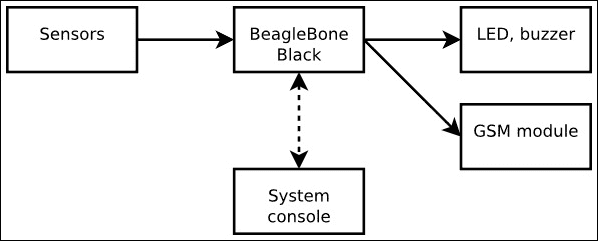
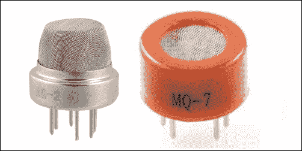
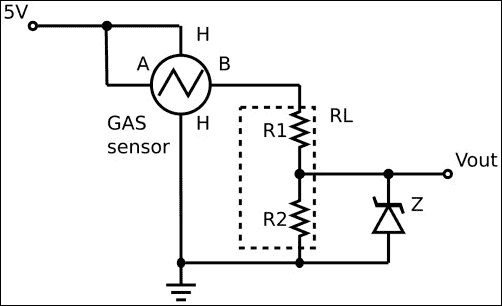
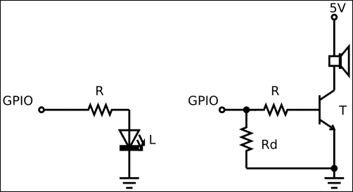
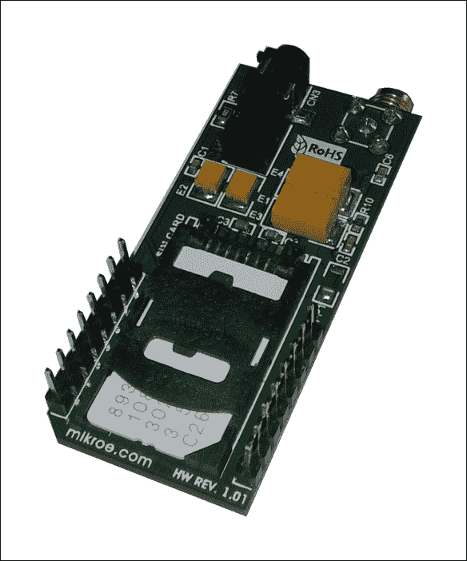
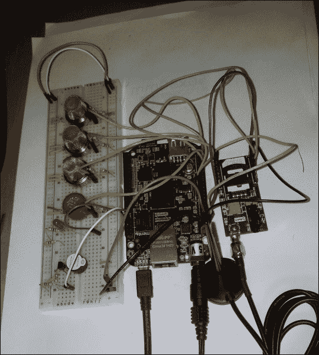
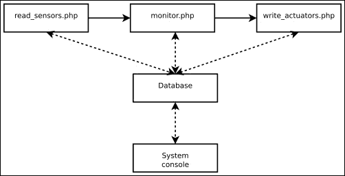
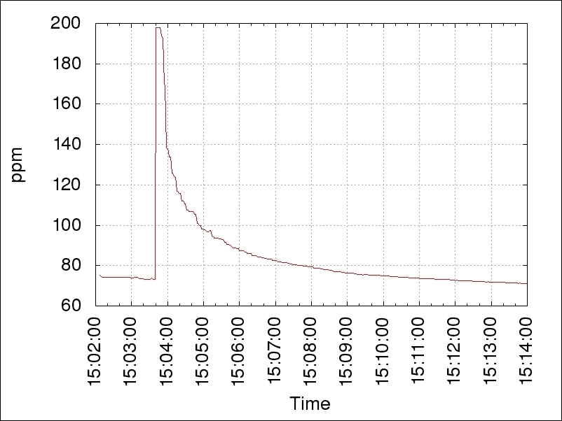

# 第一章：危险气体传感器

在本章中，我们将学习如何使用**BeagleBone Black**来监测房间中的一些危险气体，如*一氧化碳*、*甲烷*、*液化石油气*等，并在危险发生时启用声光报警。此外，通过使用 GSM 模块，用户还可以向预定义的电话号码发送短信，例如通知亲人。

此外，用户还可以通过命令行界面在系统控制台/终端中控制、记录和显示测量的浓度（这样可以保持代码的简洁）。

我们将看到如何构建电路来管理传感器，并从中获取气体浓度。接着，我们将了解如何管理 GSM 模块，以便发送短信。

# 基本功能

在本项目中，我们的 BeagleBone Black 将定期读取传感器的环境数据，比较用户可选择的范围，如果某个（或多个）数据读数超出该范围，则触发报警。

传感器将通过专用电路连接到 BeagleBone Black 的 ADC，而报警器将通过专用 GPIO 引脚启用。然后，GSM 模块将连接到 BeagleBone Black 的串口，用于通过短信发送其他报警信息。

# 设置硬件

如前所述，所有设备都与 BeagleBone Black 连接，BeagleBone Black 是系统的核心，如下图所示：



数据流从传感器流向报警执行器（LED、蜂鸣器和 GSM 模块），用户可以通过系统控制台发送命令或查看系统状态和采集到的数据。

## 连接气体传感器

气体传感器用于监测环境，我们可以选择不同种类的设备。我决定使用以下截图中所示的传感器，因为它们根据气体浓度充当可变电阻，因此可以通过普通 ADC 轻松读取：



在这里展示的原型中，气体传感器实际上有四个，但名为**MQ-2**（**烟雾探测器**）、**MQ-4**（**甲烷探测器**）和**MQ-7**（**液化石油气探测器**）的传感器看起来非常相似（除了每个传感器的标签），因此我只在前述截图中展示了其中一个，而一氧化碳探测器是带有 MQ-7 标签的红色设备。

### 注意

这些设备可以通过以下链接购买（或在互联网上查找）：

+   MQ-2: [`www.cosino.io/product/mq-2-gas-sensor`](http://www.cosino.io/product/mq-2-gas-sensor)

+   MQ-4: [`www.cosino.io/product/mq-4-gas-sensor`](http://www.cosino.io/product/mq-4-gas-sensor)

+   MQ-5: [`www.cosino.io/product/mq-5-gas-sensor`](http://www.cosino.io/product/mq-5-gas-sensor)

+   MQ-7: [`www.cosino.io/product/mq-7-gas-sensor`](http://www.cosino.io/product/mq-7-gas-sensor)

以下是我们可以获取每个气体传感器说明书的 URL：

+   MQ-2: [`www.seeedstudio.com/depot/datasheet/MQ-2.pdf`](http://www.seeedstudio.com/depot/datasheet/MQ-2.pdf)

+   MQ-4: [`www.pololu.com/file/0J311/MQ4.pdf`](https://www.pololu.com/file/0J311/MQ4.pdf)

+   MQ-5: [`www.dfrobot.com/image/data/SEN0130/MQ-5.pdf`](http://www.dfrobot.com/image/data/SEN0130/MQ-5.pdf)

+   MQ-7: [`www.parallax.com/sites/default/files/downloads/605-00007-MQ-7-Datasheet.pdf`](https://www.parallax.com/sites/default/files/downloads/605-00007-MQ-7-Datasheet.pdf)

仔细查看气体传感器的说明书，我们可以看到这些传感器的类别如何根据气体浓度变化其内部电阻（实际上，它还取决于环境的湿度和温度；但对于室内使用，我们可以将这些值视为常数）。因此，如果我们将其与一个电阻串联并施加一个恒定电压，我们可以得到一个与实际气体浓度成正比的输出电压。

下图展示了一个可能的电路图，其中气体传感器连接到**5V**电源，**RL**电阻由两个电阻（**R1**和**R2**）组成，因为我们不能在 BeagleBone Black 的 ADC 引脚上施加超过 1.8V 的电压。因此，通过选择这两个电阻，使得*R1 ≥ 2*R2*，我们可以确保在任何可能的工作条件下，ADC 输入引脚上的电压不超过*5.0V/3 ≈ 1.67V*，即使传感器的内部电阻被短接。然而，为了完全确保安全，我们可以添加一个反向阈值为 1.8V 的**齐纳二极管**（**Z**），但我在我的原型中并没有使用它。

下图展示了我用于连接每个传感器的电路：



### 小贴士

请注意，**气体传感器**有六个引脚，成对标记为**A**、**B**和**H**；其中**A**和**B**成对的引脚被短接，而标记为**H**的引脚一端必须连接到输入电压（在我们这里是 5V），另一端连接到地（有关更多信息，请参阅说明书）。

关于这些传感器的另一个重要问题是我们在使用它们之前应进行的校准。这个最后的调整非常重要；正如 MQ-2 的说明书中所报告的，我们读到以下建议：

> *我们建议您将探测器校准为 1000 ppm **液化石油气**（**LPG**）或 1000 ppm **异丁烷**（**i-C**[**4**]**H**[**10**]）浓度的空气，并使用大约**负载电阻**（**RL**）为 20K（5K 至 47K）的值。*

这一步可以通过将电阻**R1**或**R2**替换为**可变电阻**，然后微调其电阻来完成。然而，我决定使用普通电阻（*R1 = 15KΩ*，*R2 = 6.8KΩ*，使得 *RL = R1 + R2 ≈ 20KΩ*，如数据手册所示），然后在软件中实现了一些小的转换（见下节），即我们可以将 ADC 的原始数据转换为 **ppm**（**百万分之一**）值，以便用户可以处理物理数据。

该翻译可以通过以下公式中的 *增益* 和 *偏移* 值为每个传感器进行：

+   *ppm = raw * 增益 + 偏移*

在校准过程中，我们只需要使用两个已知点（*ppm1* 和 *ppm2*），读取相应的原始数据（*raw1* 和 *raw2*），然后应用以下公式：

+   *增益 = (ppm1 – ppm2) / (raw1 – raw2)*

+   *偏移 = ppm1 – raw1 * 增益*

当然，我们需要四组增益/偏移配对，每个传感器一组（校准过程相当长！）

一旦我们修正了输入电路，我们只需要将每个**Vout**连接到 BeagleBone Black 的 ADC 输入引脚。我们的板子有 8 个 ADC 输入，因此我们可以使用以下连接：

| 引脚 | 气体传感器 |
| --- | --- |
| P9.39 - AIN0 | Vout @MQ-2 |
| P9.37 - AIN2 | Vout @MQ-4 |
| P9.35 - AIN6 | Vout @MQ-5 |
| P9.33 - AIN4 | Vout @MQ-7 |

要启用它们，我们使用以下命令：

```
root@beaglebone:~# echo cape-bone-iio > /sys/devices/bone_capemgr.9/slots

```

如果一切正常，我们应该会看到以下内核信息：

```
part_number 'cape-bone-iio', version 'N/A'
slot #7: generic override
bone: Using override eeprom data at slot 7
slot #7: 'Override Board Name,00A0,Override Manuf,cape-bone-iio'
slot #7: Requesting part number/version based 'cape-bone-iio-00A0.dtbo
slot #7: Requesting firmware 'cape-bone-iio-00A0.dtbo' for board-name 'Override Board Name', version '00A0'
slot #7: dtbo 'cape-bone-iio-00A0.dtbo' loaded; converting to live tree
slot #7: #1 overlays
helper.12: ready
slot #7: Applied #1 overlays.

```

然后，`AIN0`、`AIN1`、…、`AIN7` 文件应该会变得可用，如下所示：

```
root@beaglebone:~# find /sys -name '*AIN*'
/sys/devices/ocp.3/helper.12/AIN0
/sys/devices/ocp.3/helper.12/AIN1
/sys/devices/ocp.3/helper.12/AIN2
/sys/devices/ocp.3/helper.12/AIN3
/sys/devices/ocp.3/helper.12/AIN4
/sys/devices/ocp.3/helper.12/AIN5
/sys/devices/ocp.3/helper.12/AIN6
/sys/devices/ocp.3/helper.12/AIN7

```

### 注意

这些设置可以通过书中示例代码仓库中的`bin/load_firmware.sh`脚本来完成，如下所示：

```
root@beaglebone:~# ./load_firmware.sh adc

```

然后，我们可以使用 `cat` 命令读取输入数据：

```
root@beaglebone:~# cat /sys/devices/ocp.3/helper.12/AIN0
1716

```

### 提示

请注意，ADC 也可以通过其他文件在 **sysfs** 文件系统中读取。例如，以下命令从 AIN0 输入引脚读取：

```
root@beaglebone:~# cat /sys/bus/iio/devices/iio:device0/in_voltage0_raw

```

## 连接报警执行器

现在，我们需要以一种方式连接报警执行器，使得用户可以通过视觉和听觉反馈任何可能的危险气体浓度。此外，我们还需要将 GSM 模块连接到串口以进行通信。

### LED 和蜂鸣器

LED 和蜂鸣器的连接非常简单。LED 可以直接（通过电阻）与 BeagleBone Black 的 GPIO 引脚连接，没有问题，而蜂鸣器则需要更多的工作，因为它需要比 LED 更高的电流才能工作。然而，我们可以通过使用晶体管来解决这个问题，正如下图所示，通过晶体管以更高的电流管理蜂鸣器。

### 提示

请注意，蜂鸣器不能是没有内部振荡器的简单压电器，否则必须使用外部振荡器电路或 **PWM** 信号！



在我的电路中，我为**LED**（**L**）使用了一个**R**（470Ω）电阻，为蜂鸣器使用了**R**（2KΩ）和**Rd**（4.7KΩ）电阻，并使用了一个**BC546 晶体管**（**T**）。请注意，关于 LED，R = 100Ω的电阻会导致更高的亮度，因此可以根据 LED 的颜色进行更改，以获得不同的效果。

另请注意，蜂鸣器电路中的电阻**Rd**用于在启动过程中将 GPIO 拉低。实际上，在此阶段它被设置为输入，即使在这种配置下，从引脚流出的电流也可能会启动蜂鸣器！

BeagleBone Black 有很多 GPIO 线，因此我们可以使用以下连接：

| 引脚 | 执行器 |
| --- | --- |
| P8.9 - GPIO69 | R @LED |
| P8.10 - GPIO68 | R @蜂鸣器 |

现在，为了测试连接，我们可以通过导出 GPIO 并使用以下命令将这些线路设置为输出，以此来设置 GPIO：

```
root@beaglebone:~# echo 68 > /sys/class/gpio/export
root@beaglebone:~# echo out > /sys/class/gpio/gpio68/direction
root@beaglebone:~# echo 0 > /sys/class/gpio/gpio68/value 
root@beaglebone:~# echo 69 > /sys/class/gpio/export
root@beaglebone:~# echo out > /sys/class/gpio/gpio69/direction
root@beaglebone:~# echo 0 > /sys/class/gpio/gpio69/value

```

### 注意

请注意，使用闪烁的 LED 来执行此任务是个不错的主意。然而，在本章中，我将使用普通的 GPIO 线，留待后续章节再讨论这个话题。

现在，要打开和关闭 LED 和蜂鸣器，我们只需将`1`或`0`写入相应的文件，如下所示：

```
root@beaglebone:~# echo 1 > /sys/class/gpio/gpio68/value 
root@beaglebone:~# echo 0 > /sys/class/gpio/gpio68/value
root@beaglebone:~# echo 1 > /sys/class/gpio/gpio69/value
root@beaglebone:~# echo 0 > /sys/class/gpio/gpio69/value

```

### 注意

这些设置可以通过使用本书示例代码库中的`bin/gpio_set.sh`脚本来完成，如下所示：

```
root@beaglebone:~# ./gpio_set 68 out
root@beaglebone:~# ./gpio_set 69 out

```

### GSM 模块

如本章简介所述，我们希望添加一个 GSM 模块，以便能够远程提醒用户。为此，我们可以将此设备与 TTL 级信号的常规串口连接。在这种情况下，我们只需选择 BeagleBone Black 上的一个串口即可。

以下截图显示了我决定使用的 GSM 模块：



### 注意

该设备可以通过以下链接购买（或通过网络搜索）：

[`www.cosino.io/product/serial-gsmgprs-module`](http://www.cosino.io/product/serial-gsmgprs-module)

用户手册可以通过[`www.mikroe.com/downloads/get/1921/gsm_click_manual_v101c.pdf`](http://www.mikroe.com/downloads/get/1921/gsm_click_manual_v101c.pdf)获取。

BeagleBone Black 有四个可用的串口。通过选择使用设备`/dev/ttyO1`，我们可以使用以下连接：

| 引脚 | GSM 模块 |
| --- | --- |
| P9.24 - TX-O1 | RX |
| P9.26 - RX-O1 | TX |
| P9.1 - GND | GND |
| P9.3 - 3.3V | 3.3V |
| P9.5 - 3.3V | 5V |

要启用**串口**，我们必须使用以下命令：

```
root@beaglebone:~# echo BB-UART1 > /sys/devices/bone_capemgr.9/slots

```

如果一切正常，我们应该会看到以下内核消息：

```
part_number 'BB-UART1', version 'N/A'
slot #8: generic override
bone: Using override eeprom data at slot 8
slot #8: 'Override Board Name,00A0,Override Manuf,BB-UART1'
slot #8: Requesting part number/version based 'BB-UART1-00A0.dtbo
slot #8: Requesting firmware 'BB-UART1-00A0.dtbo' for board-name 'Override Board Name', version '00A0'
slot #8: dtbo 'BB-UART1-00A0.dtbo' loaded; converting to live tree
slot #8: #2 overlays
48022000.serial: ttyO1 at MMIO 0x48022000 (irq = 73) is a OMAP UART1
slot #8: Applied #2 overlays.

```

设备文件`/dev/ttyO1`现在应该可用。

### 注意

这些设置可以通过使用本书示例代码库中的`bin/load_firmware.sh`脚本来完成，如下所示：

```
root@beaglebone:~# ./load_firmware.sh ttyO1

```

为了验证新设备是否已准备好，我们可以使用以下`ls`命令：

```
root@beaglebone:~# ls -l /dev/ttyO1
crw-rw---T 1 root dialout 248, 1 Apr 23 22:25 /dev/ttyO1

```

### 注意

读者可以参考本书作者所写的*BeagleBone Essentials*（*Packt Publishing*）一书，以获取更多关于如何激活和使用系统中可用的 GPIO 线和串口的信息。

现在，我们可以通过使用`screen`命令来测试我们是否能够与调制解调器通信，具体命令如下：

```
root@beaglebone:~# screen /dev/ttyO1 115200

```

### 注意

可以通过使用`aptitude`命令来安装`screen`命令，具体命令如下：

```
root@beaglebone:~# aptitude install screen

```

按下*ENTER*键后，你应该会看到一个空白终端，在那里如果输入`ATZ`字符串，你应该会得到字符串`OK`作为回应，代码如下所示：

```
ATZ
OK

```

是 GSM 模块在回应表示其正常工作。要退出`screen`命令，你必须按下*CTRL* + *A* + *\*键组合，然后当程序提示你`Really quit and kill all your windows [y/n]`时，按*y*键确认。

## 最终图像

好的，现在我们需要将所有内容整合在一起！下面的图片展示了我制作的原型，用来实现这个项目并测试软件：



请注意，我们需要外部电源供应，因为外部电路（尤其是 GSM 模块）需要 5V 电源。

# 设置软件

现在是时候思考实现所需功能的软件了，即检查气体浓度、记录数据，并最终激活警报。我们需要以下内容：

1.  一个周期性程序（`read_sensors.php`），定期扫描所有传感器并将其数据记录到数据库中。

1.  一个周期性程序（`monitor.php`），读取传感器的数据，将其与预设的阈值进行比较，然后设置一些内部状态。

1.  一个周期性程序（`write_actuators.php`），根据之前保存的状态启用警报。

以下图表展示了这一情况：



系统的核心是数据库，我们将所有希望记录的数据以及系统状态存储在其中。这样，所有的周期性功能可以作为独立任务实现，它们通过数据库本身进行交互。同时，我们可以通过在运行时修改`config`表来控制所有任务。

我使用**MySQL**实现了数据库系统，之前的配置可以通过使用`my_init.sh`脚本创建，在其中我们定义了适当的表格。

### 提示

可以通过使用`aptitude`命令来安装 MySQL 守护进程，具体命令如下：

```
root@beaglebone:~# aptitude install mysql-client mysql-server

```

下面是脚本的片段：

```
CREATE TABLE status (
   n VARCHAR(64) NOT NULL,
   v VARCHAR(64) NOT NULL,
   PRIMARY KEY (n)
) ENGINE=MEMORY;

# Setup default values
INSERT INTO status (n, v) VALUES('alarm', 'off');

#
# Create the system configuration table
#

CREATE TABLE config (
   n VARCHAR(64) NOT NULL,
   v VARCHAR(64) NOT NULL,
   PRIMARY KEY (n)
);

# Setup default values
INSERT INTO config (n, v) VALUES('sms_delay_s', '300');

INSERT INTO config (n, v) VALUES('mq2_gain', '1');
INSERT INTO config (n, v) VALUES('mq4_gain', '1');
INSERT INTO config (n, v) VALUES('mq5_gain', '1');
INSERT INTO config (n, v) VALUES('mq7_gain', '1');
INSERT INTO config (n, v) VALUES('mq2_off', '0');
INSERT INTO config (n, v) VALUES('mq4_off', '0');
INSERT INTO config (n, v) VALUES('mq5_off', '0');
INSERT INTO config (n, v) VALUES('mq7_off', '0');

INSERT INTO config (n, v) VALUES('mq2_th_ppm', '2000');
INSERT INTO config (n, v) VALUES('mq4_th_ppm', '2000');
INSERT INTO config (n, v) VALUES('mq5_th_ppm', '2000');
INSERT INTO config (n, v) VALUES('mq7_th_ppm', '2000');

#
# Create one table per sensor data
#

CREATE TABLE MQ2_log (
   t DATETIME NOT NULL,
   d float,
   PRIMARY KEY (t)
);

CREATE TABLE MQ4_log (
   t DATETIME NOT NULL,
   d float,
   PRIMARY KEY (t)
);

CREATE TABLE MQ5_log (
   t DATETIME NOT NULL,
   d float,
   PRIMARY KEY (t)
);

CREATE TABLE MQ7_log (
   t DATETIME NOT NULL,
   d float,
   PRIMARY KEY (t)
);
```

### 注意

`my_init.sh`脚本存储在本书示例代码库中的`chapter_01/my_init.sh`文件中。

读者应该注意，我们定义了一个`status`表，使用`MEMORY`存储引擎，因为我们不需要在重启时保留它，但需要良好的访问性能，而`config`表和每个传感器的日志表（`MQ2_log`、`MQ4_log`、`MQ5_log`和`MQ7_log`）则定义为普通表，因为我们需要在完全重启时仍然保存这些数据。请注意，我们为每个变量定义了一个表，以便轻松访问日志数据；然而，即使我们决定将日志数据保存在一个全局日志表中，也不会改变什么。

还需要注意的是，在数据库初始化过程中，我们可以通过简单地使用`INSERT`命令记录这些值来定义一些默认设置。对于`status`表，我们只需要将`alarm`变量设置为`off`，而在`config`表中，我们可以设置等待重新发送新的短信报警前的最小延迟时间（秒）（`sms_delay_s`），增益/偏移量转换变量（`mq2_gain`/`mq2_off`等），以及每个传感器的阈值变量（`mq2_th_ppm`等），这些变量用于触发报警。

## 管理 ADC

现在，要从**ADC**获取数据并将其保存到数据库中，我们需要编写一个定期任务。这非常简单，以下代码片段展示了文件`read_sensors.php`的主要功能实现，该功能完成此操作：

```
function daemon_body()
{
   global $loop_time;
   global $sensors;

   # The main loop
   dbg("start main loop (loop_time=${loop_time}s)");
   while (sleep($loop_time) == 0) {
      dbg("loop start");

      # Read sensors
      foreach ($sensors as $s) {
         $name = $s['name'];
         $file = $s['file'];
         $var = $s['var'];
         $log = $s['log'];

         # Get the converting values
         $gain = db_get_config($var . "_gain");
         $off = db_get_config($var . "_off");

         dbg("gain[$var]=$gain off[$var]=$off");

         # Read the ADC file
         $val = file_get_data($file);
         if ($val === false) {
            err("unable to read sensor $name");
            continue;
         }

      # Do the translation
      $ppm = $val * $gain + $off;

      dbg("file=$file val=$val ppm=$ppm");

      # Store the result into the status table
      $ret = db_set_status($var, $ppm);
      if (!$ret) {
         err("unable to save $name status db_err=%s",
             mysql_error());
         continue;
      }

      # Store the result into the proper log table
      $ret = db_log_var($log, $ppm);
      if (!$ret)
         err("unable to save $name log db_err=%s",
             mysql_error());
      }

      dbg("loop end");
   }
}
```

### 注意

完整的脚本存储在本书示例代码仓库中的`chapter_01/read_sensors.php`文件中。

该函数非常简单。它启动主循环，定期读取 ADC 数据，获取当前变量所需的*增益*和*偏移量*转换值，将其转换为相应的*ppm*值，然后修改当前的`status`变量，并将新值添加到读取传感器的日志表中。

如果我们执行脚本并启用所有调试命令行选项，我们将获得：

```
root@beaglebone:~# ./read_sensors.php -d -f -l -T 5
read_sensors.php[5388]: signals traps installed
read_sensors.php[5388]: start main loop (loop_time=5s)
read_sensors.php[5388]: loop start
read_sensors.php[5388]: gain[mq2]=0.125 off[mq2]=0
read_sensors.php[5388]: file=/sys/devices/ocp.3/helper.12/AIN0 val=810 ppm=101.25
read_sensors.php[5388]: gain[mq4]=1 off[mq4]=0
read_sensors.php[5388]: file=/sys/devices/ocp.3/helper.12/AIN2 val=1477 ppm=1477
read_sensors.php[5388]: gain[mq5]=1 off[mq5]=0
read_sensors.php[5388]: file=/sys/devices/ocp.3/helper.12/AIN6 val=816 ppm=816
read_sensors.php[5388]: gain[mq7]=1 off[mq7]=0
read_sensors.php[5388]: file=/sys/devices/ocp.3/helper.12/AIN4 val=572 ppm=572
read_sensors.php[5388]: loop end
read_sensors.php[5388]: loop start
read_sensors.php[5388]: gain[mq2]=0.125 off[mq2]=0
read_sensors.php[5388]: file=/sys/devices/ocp.3/helper.12/AIN0 val=677 ppm=84.625
read_sensors.php[5388]: gain[mq4]=1 off[mq4]=0
read_sensors.php[5388]: file=/sys/devices/ocp.3/helper.12/AIN2 val=1456 ppm=1456
read_sensors.php[5388]: gain[mq5]=1 off[mq5]=0
read_sensors.php[5388]: file=/sys/devices/ocp.3/helper.12/AIN6 val=847 ppm=847
read_sensors.php[5388]: gain[mq7]=1 off[mq7]=0
read_sensors.php[5388]: file=/sys/devices/ocp.3/helper.12/AIN4 val=569 ppm=569
read_sensors.php[5388]: loop end
...

```

### 提示

请注意，只有第一个传感器已经（或多或少）被校准！

该过程可以像往常一样通过*CTRL* + *C*组合键停止。

现在，我们可以通过使用`my_dump.sh`脚本来读取系统状态（在这种情况下，最后读取的传感器数据），方法如下：

```
root@beaglebone:~# ./my_dump.sh status
n   v
alarm   off
mq2   84.625
mq4   1456
mq5   815
mq7   569

```

### 注意

`my_dump.sh`脚本存储在本书示例代码仓库中的`chapter_01/my_dump.sh`文件中。

同一个脚本也可以用于转储日志表。例如，如果我们希望查看 MQ-2 的日志数据，可以使用以下命令：

```
root@beaglebone:~# ./my_dump.sh mq2_log
t   v
2015-05-15 17:39:36	101.25
2015-05-15 17:39:41	84.625
2015-05-15 17:39:46	84.625

```

## 管理执行器

当传感器检测到危险的气体浓度时，`alarm`状态变量将被设置为*开启*状态。因此，当发生这种情况时，我们必须同时开启 LED 和蜂鸣器，并且必须向用户预定义的号码发送短信。

要执行这些操作，我们必须像之前展示的那样正确设置管理 LED 和蜂鸣器的 GPIO 线，并通过串口与**GSM**模块通信以发送短信。为了完成最后一步，我们需要安装`gsm-utils`软件包，在其中可以找到`gsmsendsms`命令，用于实际发送短信。要安装该软件包，可以使用以下命令：

```
root@beaglebone:~# aptitude install gsm-utils

```

然后，在将可用的 SIM 卡放入模块后，我们可以验证通过以下代码与 GSM 模块通信：

```
root@beaglebone:~# gsmctl -d /dev/ttyO1 me 
<ME0>  Manufacturer: Telit
<ME1>  Model: GL865-QUAD
<ME2>  Revision: 10.00.144
<ME3>  Serial Number: 356308042878501

```

然后，我们可以使用以下命令验证当前 PIN 状态：

```
root@beaglebone:~# gsmctl -d /dev/ttyO1 pin
<PIN0> READY

```

上述消息显示了 GSM 模块已正确配置，并且其中的 SIM 卡已准备好运行；然而，如果我们收到以下消息，则必须通过插入正确的 PIN 码来启用 SIM 卡：

```
gsmsendsms[ERROR]: ME/TA error 'SIM PIN required' (code 311)

```

在这种情况下，我们必须使用以下命令：

```
root@beaglebone:~# gsmctl -d /dev/ttyO1 -I "+cpin=NNNN"

```

在上述命令中，`NNNN`是你的 SIM 卡的 PIN 码。如果命令完全没有输出而挂起，意味着连接有问题。

现在我们已经检查了连接并且 SIM 卡已启用，我们可以通过以下命令开始发送短信：

```
root@beaglebone:~# gsmsendsms -d /dev/ttyO1 "+NNNNNNNNNNNN" 'Hello world!'

```

在上述命令中，`NNNNNNNNNNNN`字符串是必须发送短信的号码。

### 提示

如果模块的回答如下，意味着**短信服务中心地址**（**SCA**）即接受短信以进行投递的中心电话号码未正确设置在你的手机中：

```
gsmsendsms[ERROR]: ME/TA error 'Unidentified subscriber' (code 28)
```

在这种情况下，你应该向你的 GSM 运营商询问，然后尝试以下命令：

```
root@beaglebone:~# gsmctl -o setsca "+SSSSSSSSSSSS"
```

在上述命令中，`SSSSSSSSSSSS`字符串是你的服务中心号码。

现在我们已经获得了所有控制执行器所需的信息。管理任务的主要功能可能的实现如下：

```
function daemon_body()
{
 global $loop_time;
 global $actuators;

 $sms_delay = db_get_config("sms_delay_s");

 $old_alarm = 0;
 $sms_time = strtotime("1970");

 # The main loop
 dbg("start main loop (loop_time=${loop_time}s)");
 while (sleep($loop_time) == 0) {
 dbg("loop start");

 # Get the "alarm" status and set all alarms properly
 $alarm = db_get_status("alarm");
 foreach ($actuators as $a) {
 $name = $a['name'];
 $file = $a['file'];

 dbg("file=$file alarm=$alarm");
 $ret = gpio_set($file, $alarm);
 if (!$ret)
 err("unable to write actuator $name");
 }

 # Send the SMS only during off->on transition
 if ($alarm == "on" && $old_alarm == "off" &&
 strtotime("-$sms_time seconds") > $sms_delay) {
 do_send_sms();
 $sms_time = strtotime("now");
 }

 $old_alarm = $alarm;

 dbg("loop end");
 }
}

```

### 注意

完整的脚本存储在本书示例代码仓库中的`chapter_01/write_actuators.php`文件中。

再次强调，这个函数非常简单——我们只需从数据库中读取当前`alarm`变量的状态，然后根据它设置执行器。请注意，必须为短信管理做特殊处理；事实上，系统必须每次只发送一条短信，并且仅在*从关到开*的转换中，并且必须在`sms_delay`秒后才能发送。为了实现这一点，我们使用`old_alarm`和`sms_time`变量来保存上次循环的状态。

要测试代码，我们可以使用以下命令通过`my_set.sh`命令控制`alarm`变量：

```
root@beaglebone:~# ./my_set.sh status alarm on
root@beaglebone:~# ./my_set.sh status alarm off

```

### 注意

脚本存储在本书示例代码仓库中的`chapter_01/my_set.sh`文件中。

因此，让我们使用以下命令启动脚本：

```
root@beaglebone:~# ./write_actuators.php -d -f -l -T 5
write_actuators.php[5474]: signals traps installed
write_actuators.php[5474]: start main loop (loop_time=5s)
write_actuators.php[5474]: loop start
write_actuators.php[5474]: file=/sys/class/gpio/gpio68 alarm=off
write_actuators.php[5474]: file=/sys/class/gpio/gpio69 alarm=off
write_actuators.php[5474]: loop end
write_actuators.php[5474]: loop start
write_actuators.php[5474]: file=/sys/class/gpio/gpio68 alarm=off
write_actuators.php[5474]: file=/sys/class/gpio/gpio69 alarm=off
write_actuators.php[5474]: loop end

```

在另一个终端上，我们可以通过以下命令更改`alarm`变量，正如已经提到的那样：

```
root@beaglebone:~# ./my_set.sh status alarm on

```

之后，我们注意到脚本正在正常工作：

```
write_actuators.php[5474]: loop start
write_actuators.php[5474]: file=/sys/class/gpio/gpio68 alarm=on
write_actuators.php[5474]: file=/sys/class/gpio/gpio69 alarm=on
write_actuators.php[5474]: send SMS...
write_actuators.php[5474]: loop end

```

关于如何在 PHP 中发送短信消息，我只是简单地使用了以下代码：

```
function do_send_sms()
{
   dbg("send SMS...");
   system('gsmsendsms -d /dev/ttyO1 "' . PHONE_NUM . '" "GAS alarm!"');
}
```

基本上，在这里我们使用`system()`函数调用`gsmsendsms`命令。

### 注意

你可能会注意到，`gsmsendsms`发送短信需要一些时间。这是正常现象。

## 控制环境

现在，我们只需要传感器和执行器之间的粘合剂，即一个周期性函数，根据用户输入定期检查是否根据读取的信息需要激活报警器。

`monitor.php`脚本主函数的可能实现如下：

```
function daemon_body()
{
   global $loop_time;
   global $actuators;

   # The main loop
   dbg("start main loop (loop_time=${loop_time}s)");
   while (sleep($loop_time) == 0) {
      dbg("loop start");

      # Get the gas concentrations and set the "alarm" variable
      $mq2 = db_get_status("mq2");
      $mq2_th_ppm = db_get_config("mq2_th_ppm");
      dbg("mq2/mq2_th_ppm=$mq2/$mq2_th_ppm");
      $mq4 = db_get_status("mq4");
      $mq4_th_ppm = db_get_config("mq4_th_ppm");
      dbg("mq4/mq4_th_ppm=$mq4/$mq4_th_ppm");
      $mq5 = db_get_status("mq5");
      $mq5_th_ppm = db_get_config("mq5_th_ppm");
      dbg("mq5/mq5_th_ppm=$mq5/$mq5_th_ppm");
      $mq7 = db_get_status("mq7");
      $mq7_th_ppm = db_get_config("mq7_th_ppm");
      dbg("mq7/mq7_th_ppm=$mq7/$mq7_th_ppm");

      $alarm = $mq2 >= $mq2_th_ppm ||
         $mq2 >= $mq2_th_ppm ||
         $mq2 >= $mq2_th_ppm ||
         $mq2 >= $mq2_th_ppm ? 1 : 0;

      db_set_status("alarm", $alarm);
      dbg("alarm=$alarm");

      dbg("loop end");
   }
}
```

### 注意

完整脚本存储在书籍示例代码库中的`chapter_01/monitor.php`文件中。

该函数启动了`main`循环，在获取传感器阈值后，它仅获取最后一个传感器的值，并相应地设置`alarm`变量。

同样，我们可以通过使用`my_set.sh`命令来更改气体浓度阈值，具体如下：

```
root@beaglebone:~# ./my_set.sh config mq2_th_ppm 5000

```

我们可以通过以下方式以与之前两次相同的方式执行脚本进行测试：

```
root@beaglebone:~# ./monitor.php -d -f -l -T 5
monitor.php[5819]: signals traps installed 
monitor.php[5819]: start main loop (loop_time=5s)
monitor.php[5819]: loop start
monitor.php[5819]: mq2/mq2_th_ppm=84.625/5000
monitor.php[5819]: mq4/mq4_th_ppm=1456/2000
monitor.php[5819]: mq5/mq5_th_ppm=815/2000
monitor.php[5819]: mq7/mq7_th_ppm=569/2000
monitor.php[5819]: alarm=0
monitor.php[5819]: loop end
monitor.php[5819]: loop start
monitor.php[5819]: mq2/mq2_th_ppm=84.625/5000
monitor.php[5819]: mq4/mq4_th_ppm=1456/2000
monitor.php[5819]: mq5/mq5_th_ppm=815/2000
monitor.php[5819]: mq7/mq7_th_ppm=569/2000
monitor.php[5819]: alarm=0
monitor.php[5819]: loop end
...

```

要停止测试，只需使用*CTRL* + *C*组合键。你应该能得到如下输出：

```
^Cmonitor.php[5819]: signal trapped!

```

# 最终测试

一旦所有设备都连接好并且软件准备就绪，就可以对我们的新系统进行一个小测试。这个演示可以通过使用打火机来完成。事实上，我们的系统对打火机中的气体非常敏感！

首先，我们需要检查系统配置：

```
root@beaglebone:~# ./my_dump.sh config
n   v
mq2_gain   0.125
mq2_off   0
mq2_th_ppm   150
mq4_gain   0.125
mq4_off   0
mq4_th_ppm   150
mq5_gain   0.125
mq5_off   0
mq5_th_ppm   150
mq7_gain   0.125
mq7_off   0
mq7_th_ppm   150
sms_delay_s   300

```

### 提示

请注意，我使用了一个非常弱的校准设置；然而，这些设置适用于演示。

然后，我们可以查看系统的当前状态：

```
root@beaglebone:~# ./my_dump.sh status
n   v
mq2   73.5
mq4   121.75
mq5   53
mq7   80.5
alarm   0

```

然后，我们可以通过使用`chapter_01/SYSINIT.sh`脚本一次性进行所有硬件设置，脚本可以在书中的示例代码库中找到，具体如下：

```
root@beaglebone:~# ./SYSINIT.sh
done!

```

好的，现在让我们启动所有必需的进程守护程序：

```
root@beaglebone:~# ./read_sensors.php -d -T 2
root@beaglebone:~# ./write_actuators.php -d -T 2
root@beaglebone:~# ./monitor.php -d -T 2

```

### 提示

请注意，所有守护程序都在后台运行；然而，调试消息已启用，可以通过以下命令在系统日志中查看：

```
# tail -f /var/log/syslog

```

现在，我们需要将打火机靠近传感器，并按下打火机上的按钮，使传感器能够检测到气体。一段时间后，报警器应该会启动，查看系统状态时，我们应该能看到以下内容：

```
root@beaglebone:~# ./my_dump.sh status
n   v
mq2   203.875
mq4   166.5
mq5   52.5
mq7   122.625
alarm   1

```

此外，如果我们已设置了电话号码，我们应该会收到一条短信！

最后一步，让我们通过绘制图表来显示记录的数据。我们可以使用以下命令从数据库中提取数据：

```
root@beaglebone:~# ./my_dump.sh mq2_log | awk '{ print $2 " " $3 }' > mq2.log

```

在`mq2.log`文件中，我们应该能找到如下内容：

```
root@beaglebone:~# cat mq2.log
15:02:07 75.25
15:02:10 74.25
15:02:12 74.25
15:02:14 74.375
15:02:16 74.25
...

```

现在，使用下一个命令，我们将创建一个包含我们数据图表的 PNG 图像：

```
$ gnuplot mq2.plot

```

### 提示

请注意，要执行此命令，你需要安装`gnuplot`命令，安装方法如下：

```
# aptitude install gnuplot

```

此外，还需要`mq2.log`和`mq2.plot`文件。前者由前述命令行创建，后者可以在书籍示例代码库中的`chapter_01/mq2.plot`文件中找到。它包含了有效绘制图表的`gnuplot`指令。

我测试的 MQ-2 数据的图表如下图所示：



如你所见，传感器对气体非常敏感；当我打开打火机并且气体接触到它们时，ppm 浓度迅速上升到很高的值。

要停止测试，我们可以使用以下命令：

```
root@beaglebone:~# killall read_sensors.php
root@beaglebone:~# killall write_actuators.php
root@beaglebone:~# killall monitor.php

```

# 总结

在这一章中，我们学习了如何管理 ADC、GPIO 线、GSM 模块和串口。我们还了解了如何实现一个简单的监控程序，该程序可以通过数据库服务器与传感器读取任务进行通信，收集输入数据，并与执行器管理器配合，在紧急情况下提醒用户。

在下一章中，我们将看到如何管理**超声波距离**传感器，以实现一个停车辅助系统，该系统能够向驾驶员传达汽车与车库墙壁之间的距离。然而，下一章真正有趣的部分是关于如何在两种不同的设置中管理距离传感器：一种是所有外设都靠近 BeagleBone Black，另一种是通过 USB 电缆远程连接传感器。
