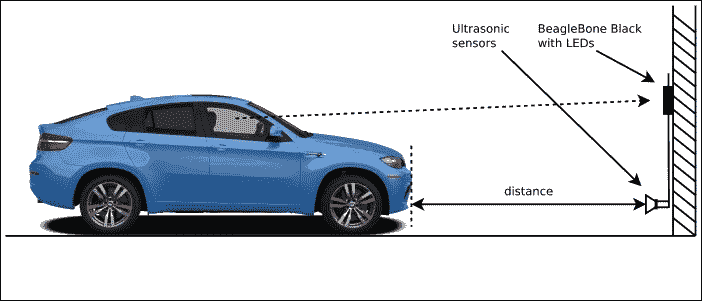
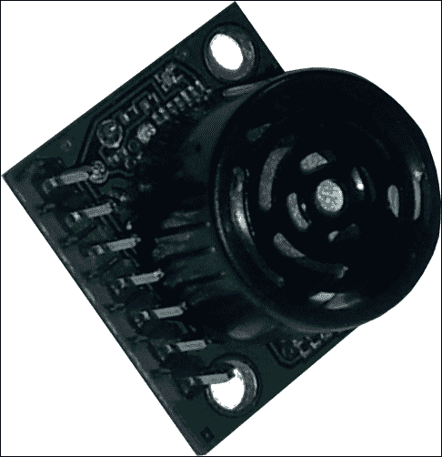
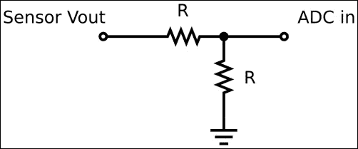
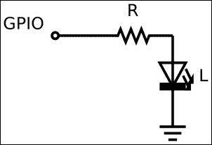
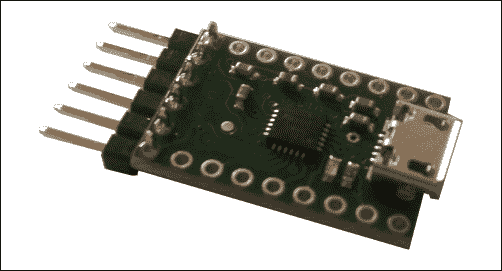
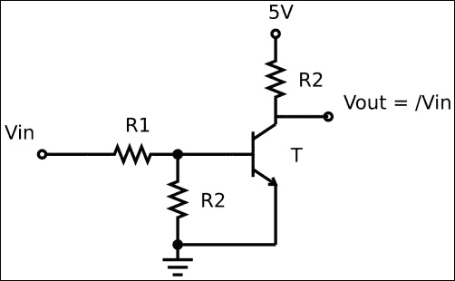
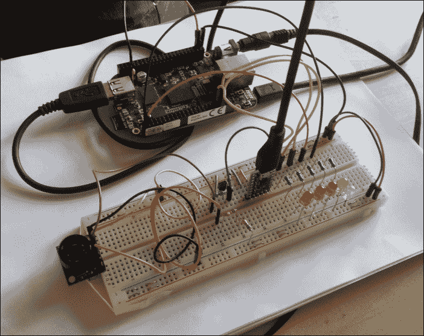

# 第二章。超声波停车助手

在本章中，我们将学习如何使用 BeagleBone Black 来实现停车辅助系统。我们将使用超声波传感器来检测汽车与车库墙壁之间的距离，并通过一些 LED 向驾驶员反馈汽车的位置，以避免碰撞。

我们将看到如何通过两种不同的方式设置超声波传感器，使用不同的接口来获取数据，以便用两种不同的方法解决问题并获得两种不同的系统配置。

# 基本工作原理

这个项目非常简单，尽管它需要一些电子技能来管理传感器输出。基本上，我们的 BeagleBone Black 只需要定期轮询超声波传感器的输出，然后根据与墙壁的距离点亮 LED：距离越短，点亮的 LED 就越多。

# 设置硬件

正如前面所说，在这个项目中，我们尝试实现两种不同的设置：第一种使用超声波传感器的模拟输出并实现电路设计，所有设备都直接连接到 BeagleBone Black（所有外设都靠近主板）；而第二种设置则允许我们通过 USB 连接远程管理超声波传感器，因此可以将传感器安装在离 BeagleBone Black 主板较远的地方。

简单来说，我们可以将传感器放在一个地方，而 LED 灯则放在另一个地方，可能放在一个更显眼的位置，如下图所示：



如您所见，表示驱动视角的虚线箭头，如果 LED 灯位于距离传感器的上方，更容易看清，而传感器应放置在离地面较近的位置，以便更好地捕捉到汽车的前部。

## 首次设置 – 所有设备放置在 BeagleBone Black 附近

在这个设置中，我们将使用 BeagleBone Black 的一个 ADC 引脚来读取超声波传感器的模拟输出。

### 使用距离传感器的模拟输出

以下图像展示了我在原型中使用的超声波传感器：



### 注意

设备可以通过以下链接购买（或通过上网查找）：

[`www.cosino.io/product/ultrasonic-distance-sensor`](http://www.cosino.io/product/ultrasonic-distance-sensor)。

该设备的数据手册可以在 [`www.maxbotix.com/documents/XL-MaxSonar-EZ_Datasheet.pdf`](http://www.maxbotix.com/documents/XL-MaxSonar-EZ_Datasheet.pdf) 上找到。

该设备非常有趣，因为它具有多个输出通道，可以用于获取测量的距离。特别是，它可以通过模拟电压通道和串口给出测量值；前者用于这个设置，后者将在第二个设置中讨论。

查阅数据手册后，我们发现模拟输出的分辨率为 *Vcc/1024 每厘米*，在 5V 下最大有效范围约为 700 毫米，在 3.3V 下约为 600 厘米。在这个设置中，我们使用 Vcc 设置为 3.3V，因此最大输出电压（**VoutMAX**）将为：

+   *VoutMAX = 3.3V / 1024 * 600 ≈ 1.93V*

记住 BeagleBone Black 的 ADC 最大输入电压为 1.8V，我们必须找到一种方法来缩小这个值。一个 *快速而简单* 的技巧是使用经典的电压分压器，如下图所示：



使用前述电路，我们只需将传感器输出除以 2。ADC 输入引脚的电压可以通过以下公式计算：

+   *V[ADCin]* *= R / (R + R) * Vout = R / 2 R * Vout = 1 / 2 * Vout*

所以，唯一需要做的就是为两个电阻（**R**）选择一个合适的值。在我的原型中，我将这个值设置为 *R=6.8KΩ*，这是一个合理的值，可以从传感器获得适当的电流。

在这种情况下，我们的分辨率变为约 1.61mV/厘米，连接到 BeagleBone Black 的接线如下面的表格所示：

| 引脚 | 距离传感器引脚（标签） |
| --- | --- |
| P9.1 - GND | 7 |
| P9.3 - 3.3V | 6 (Vcc) |
| P9.39 - AIN0 | 3 (AN) |

现在，为了启用 BeagleBone Black 的 ADC 引脚，我们可以像在第一章中一样使用以下命令，*危险气体传感器*：

```
root@beaglebone:~# echo cape-bone-iio > /sys/devices/bone_capemgr.9/slots

```

如果一切正常，我们应该看到以下内核信息：

```
part_number 'cape-bone-iio', version 'N/A'
slot #7: generic override
bone: Using override eeprom data at slot 7
slot #7: 'Override Board Name,00A0,Override Manuf,cape-bone-iio'
slot #7: Requesting part number/version based 'cape-bone-iio-00A0.dtbo
slot #7: Requesting firmware 'cape-bone-iio-00A0.dtbo' for board-name 'Override Board Name', version '00A0'
slot #7: dtbo 'cape-bone-iio-00A0.dtbo' loaded; converting to live tree
slot #7: #1 overlays
bone-iio-helper helper.12: ready
slot #7: Applied #1 overlays.

```

然后，`AIN0`、`AIN1`、…、`AIN7` 文件应该可以访问，如下所示：

```
root@beaglebone:~# find /sys -name '*AIN*'
/sys/devices/ocp.3/helper.12/AIN0
/sys/devices/ocp.3/helper.12/AIN1
/sys/devices/ocp.3/helper.12/AIN2
/sys/devices/ocp.3/helper.12/AIN3
/sys/devices/ocp.3/helper.12/AIN4
/sys/devices/ocp.3/helper.12/AIN5
/sys/devices/ocp.3/helper.12/AIN6
/sys/devices/ocp.3/helper.12/AIN7

```

### 注意

这些设置可以通过使用书中示例代码仓库中的 `bin/load_firmware.sh` 脚本完成，如下所示：

```
root@beaglebone:~# ./load_firmware.sh adc
```

然后，我们可以使用 `cat` 命令读取输入数据，如下所示：

```
root@beaglebone:~# cat /sys/devices/ocp.3/helper.12/AIN0
1716

```

### 小贴士

正如在第一章中所述，*危险气体传感器*，ADC 也可以通过使用另一个文件仍然位于 *sysfs* 文件系统中来读取，使用以下命令：

```
root@beaglebone:~# cat /sys/bus/iio/devices/iio:device0/in_voltage0_raw

```

现在，我们必须找到一种方法，将从 ADC 读取的值转换为以米为单位的距离，这样我们就能决定如何管理 LED 来给驾驶员提供反馈。回想一下前面提到的，分辨率约为 1.61mV/厘米，并且考虑到 ADC 的分辨率为 12 位，最大电压为 3.3V，**距离**（**d**）与汽车和墙壁之间的厘米数可以通过以下公式给出（其中 *n* 是从 ADC 读取的数据）：

+   *d = 3.3V * n / 4095 / 0.00161V/厘米*

请注意，这些是估计值，因此最好对传感器进行校准，以便至少在我们希望测量的最低值附近得到正确的读数（在我们的例子中，这个值是 0.20 米）。为此，我们可以将物体放置在距离传感器 20 厘米的位置，测量 ADC 输出值，然后计算补偿值 *K*，使得以下公式能够精确返回 20：

+   *d[calib] = K * 3.3V * n/4095 / 0.00161V/cm*

请注意，在没有校准的情况下，*K* 可以设置为 `1`（在这种情况下，我们再次得到原始公式，*d = d[calib]*。）

在我的原型中，将物体放置在距离传感器 20 厘米的位置时，我得到了以下值：

```
root@beaglebone:~# cat /sys/devices/ocp.3/helper.12/AIN0
29

```

所以，*K* 应设置为 `1.38`。

### 第一次设置中的 LED 连接

LED 的连接非常简单，因为它们可以直接连接到 BeagleBone Black 的 GPIO 引脚，以下是电路图，显示了单个 LED 连接的示意图，可以为每个 LED 复制：



### 注意

我使用了一个 *R = 470Ω* 的电阻来连接 **LED**（**L**）。同样，如前一章所述，我们需要记住，电阻值 **R** 应根据 LED 的颜色进行调整，如果我们希望达到更亮的效果。

我们有 5 个 LED，因此需要 5 根 GPIO 引脚。我们可以使用以下连接：

| 引脚 | LED 颜色 | 当距离低于时激活 |
| --- | --- | --- |
| P8.45-GPIO44 | 白色 | 5.00 米 |
| P8.46-GPIO67 | 黄色 | 2.00 米 |
| P8.7-GPIO69 | 红色 | 1.00 米 |
| P8.8-GPIO68 | 红色 | 0.50 米 |
| P8.9-GPIO45 | 红色 | 0.20 米 |

白色 LED 用来提示用户距离墙壁小于 5 米；黄色 LED 用来提示距离墙壁小于 2 米；红色 LED 用来提示车库墙壁距离小于 1 米、0.50 米和 0.20 米。

为了测试 LED 的连接，我们可以使用与第一章中相同的命令，*危险气体传感器*。例如，我们可以通过以下命令测试 GPIO68 上的 LED，首先设置 GPIO，然后将其关闭再打开：

```
root@beaglebone:~# echo 68 > /sys/class/gpio/export
root@beaglebone:~# echo out > /sys/class/gpio/gpio68/direction
root@beaglebone:~# echo 0 > /sys/class/gpio/gpio68/value 
root@beaglebone:~# echo 1 > /sys/class/gpio/gpio68/value

```

## 第二次设置 – 距离传感器远程化

在此设置中，我们将使用 BeagleBone Black 的串行端口读取超声波传感器测得的距离。

### 使用距离传感器的串行输出

这次，我们关注的是数据表中描述传感器串行输出能力的部分。特别是，我们读到：

> *第 5 引脚输出异步串行 RS232 格式，除了电压是 0-Vcc。输出是 ASCII 大写字母 "R"，后跟三个 ASCII 数字字符，表示最大 765 厘米的测量范围，最后是回车符（ASCII 13）。波特率为 9600，8 位，无奇偶校验，1 个停止位。虽然 0-Vcc 的电压超出了 RS232 标准，但大多数 RS232 设备有足够的裕度来读取 0-Vcc 串行数据。如果需要标准电压级别的 RS232，请反转并连接 RS232 转换器。*

这非常有趣，主要有两个原因：

1.  由于传感器以数字格式提供数据，而非模拟格式（因此测量对干扰更具免疫力），测量非常精确。

1.  信息可以通过 **RS-232** 线路发送（即使需要一些即将介绍的电子修正），这将允许我们将系统核心放置在与传感器不同的位置，从而提高整个系统的可用性。

所以，通过使用这种新的设置，LED 仍然安装在 BeagleBone Black 上，而距离传感器则通过 RS-232 线路远程连接。然而，由于我们仍然需要为传感器供电，并且标准的 RS-232 电缆无法传输电源，因此我们无法使用经典的 RS-232 线路！

解决方案是通过 USB 电缆使用 RS-232 连接。实际上，使用标准的 USB 电缆，我们能够发送/接收 RS-232 数据并提供所需的电源。

然而，仍然存在一些问题：

1.  USB 的电源电压为 5V，因此我们需要一个能够默认管理此电压级别的 *USB-to-serial* 转换器，或者至少能够耐受 5V。

1.  认真阅读数据手册中的前一段，我们发现输出电平是 TTL 并且是反向的！因此，在将 TX 信号发送到 *USB-to-serial* 转换器（连接到 RX 引脚）之前，我们必须将其电气反向。（别担心，我会详细解释的。）

第一个问题的解决方案是使用以下 *USB-to-serial* 转换器，该转换器不仅支持 3.3V 工作，还能耐受 5V。



### 注意

这些设备可以通过以下链接（或在互联网上搜索）购买：

[`www.cosino.io/product/usb-to-serial-converter`](http://www.cosino.io/product/usb-to-serial-converter)

该设备的数据手册可以在 [`www.silabs.com/Support%20Documents/TechnicalDocs/cp2104.pdf`](https://www.silabs.com/Support%20Documents/TechnicalDocs/cp2104.pdf) 获取。

为了解决第二个问题，我们可以使用以下电路来反转传感器 TX 信号的 TTL 电平：



### 提示

我使用了电阻值**R1**=2.2KΩ，**R2**=10KΩ，以及**BC546 晶体管**（**T**）。**Vin**与传感器的第 5 引脚（TX）连接，而**Vout**与**RS232**转换器的**RX**引脚连接。

工作原理非常简单——它是一个逻辑非端口与电平转换器。当逻辑 0（接近 0V 的电压）施加到**Vin**时，**晶体管**（**T**）不工作，因此没有电流通过它，电阻**R2**上没有电压损失，**Vout**为 5V（逻辑 1）。另一方面，当逻辑 1（接近 3.3V 的电压）施加到**Vin**时，**晶体管**（**T**）被打开，电流可以通过它流动，**Vout**降到接近 0V（逻辑 0）。下表清晰地显示了电路的工作原理，你可以看到它的工作与我们预期的完全一致！

| Vin (V)/逻辑 | Vout (V)/逻辑 |
| --- | --- |
| 0/0 | 5/1 |
| 3.3/1 | 0/0 |

在这种情况下，连接到 BeagleBone Black 的过程非常简单。事实上，我们只需将普通 USB 电缆连接到*USB-to-serial*转换器，再连接到距离传感器，具体连接方式见下表：

| USB-to-serial 引脚 | 距离传感器引脚（标签） |
| --- | --- |
| GND | 7 |
| VBUS | 6 (Vcc) |
| RX | 5 (/TX) |

### 提示

请注意，在表格中，我使用了*/TX*电子符号表示超声波传感器的 TX 引脚（在**C**中，我们可以写作*！TX*），因为如前所述，其输出信号必须反转，所以实际上，距离传感器的 TX 引脚必须连接到 TTL 反相器的**Vin**引脚，而**Vout**是有效信号*/TX*，必须连接到 USB 串口的 RX 引脚！

如果我们决定使用这个设置来连接距离传感器，从软件的角度来看，工作会更简单，因为不需要任何校准，因为传感器将以数字格式返回给我们距离，也就是说，不会出现由于模拟到数字转换或电压缩放造成的任何错误，正如在前一部分所看到的那样。事实上，我们只需通过 USB 连接读取串口数据即可获取距离；因此，如果一切正常，一旦我们连接 USB 电缆，应该会看到以下内核消息：

```
hub 1-0:1.0: state 7 ports 1 chg 0000 evt 0002
usb 1-1: reset full-speed USB device number 2 using musb-hdrc
hub 1-0:1.0: state 7 ports 1 chg 0000 evt 0002
usb 1-1: cp210x converter now attached to ttyUSB0

```

`/dev/ttyUSB0`设备现在可用：

```
root@beaglebone:~/chapter_02# ls -l /dev/ttyUSB0
crw-rw---T 1 root dialout 188, 0 Apr 23 20:28 /dev/ttyUSB0

```

现在，为了读取测量值，我们需要根据数据手册要求配置串口，使用以下命令：

```
root@beaglebone:~# stty -F /dev/ttyUSB0 9600

```

然后，可以使用以下命令实时显示数据：

```
root@beaglebone:~# cat /dev/ttyUSB0
126

```

### 提示

你可以通过按*CTRL* + *C*键来停止读取。

### 连接第二个设置中的 LED

在这个第二个设置中，由于连接与第一个设置基本相同，因此没有特别需要说明的 LED 事项。

请记住，LED 与 USB 连接无关，USB 连接仅用于远程连接距离传感器！

## 最终图片

以下截图显示了我实现这个项目并测试软件的原型。

请注意，我实现了两种配置：面包板的左半部分是超声波传感器及其相关电路（即可以远程操作的部分）；右半部分是 LED 电路；而上中部是反向电压转换器；下中部是实现电压分压器的两个电阻。

还要注意截图中间的 USB 转串口转换器，我将 USB 电缆连接到 BeagleBone Black 的 USB 主机端口：



由于外部电路和 BeagleBone Black 可能需要的电力超过了 PC 的 USB 端口提供的电量，我还使用了外部电源。

# 设置软件

在这个项目中，软件非常简单，因为我们只需要一个过程来定期读取距离，然后相应地打开和关闭 LED；然而，仍然有一些问题需要指出，尤其是关于如何管理 LED 以及两种超声波传感器配置之间的差异。

## 管理 LED

尽管前一章已介绍 GPIO 的管理，但需要指出的是，Linux 内核有多种设备，每种设备都有特定的用途，其中一种特殊设备是 LED 设备，这是一种可以用于管理 LED 并具有不同触发器的设备。**触发器**是 LED 的某种*管理器*，可以编程使其以特定方式工作。好了，还是做个示例更好，胜过空泛的解释！

首先，我们需要使用专用的设备树来定义 LED 设备，正如在书籍示例代码库中的`chapter_02/BB-LEDS-C2-00A0.dts`文件中所述。以下是该文件的代码片段：

```
   fragment@1 {
      target = <&ocp>;

      __overlay__ {
         c2_leds {
            compatible      = "gpio-leds";
            pinctrl-names   = "default";
            pinctrl-0       = <&bb_led_pins>;

            white_led {
               label   = "c2:white";
               gpios   = <&gpio3 6 0>;
               linux,default-trigger = "none";
               default-state = "on";
            };

            yellow_led {
               label   = "c2:yellow";
               gpios   = <&gpio3 7 0>;
               linux,default-trigger = "none";
               default-state = "on";
            };

            red_far_led {
               label   = "c2:red_far";
               gpios   = <&gpio3 2 0>;
               linux,default-trigger = "none";
               default-state = "on";
            };

            red_mid_led {
               label   = "c2:red_mid";
               gpios   = <&gpio3 3 0>;
               linux,default-trigger = "none";
               default-state = "on";
            };

            red_near__led {
               label   = "c2:red_near";
               gpios   = <&gpio3 5 0>;
               linux,default-trigger = "none";
               default-state = "on";
            };
         };
      };
   };
```

### 提示

有关如何定义 Linux **LED 设备**的更多信息，可以在 Linux 的源代码树中找到`linux/Documentation/devicetree/bindings/leds/leds-gpio.txt`文件，或者在线访问[`www.kernel.org/doc/Documentation/devicetree/bindings/leds/leds-gpio.txt`](https://www.kernel.org/doc/Documentation/devicetree/bindings/leds/leds-gpio.txt)。

如你所见，每个 GPIO 都被启用，并通过`gpio-leds`驱动程序定义为 LED 设备。代码非常易于理解，可以很清楚地看到每个 GPIO 定义都有一个预定义触发器（即默认触发器为`none`），并且预定义状态设置为`on`。

为了启用此设置，我们必须使用`dtc`命令将其编译成二进制形式，命令如下：

```
root@beaglebone:~# dtc -O dtb -o /lib/firmware/BB-LEDS-C2-00A0.dtbo -b 0 -@ BB-LEDS-C2-00A0.dts

```

然后，我们可以使用以下命令将其加载到内核中：

```
root@beaglebone:~# echo BB-LEDS-C2 > /sys/devices/bone_capemgr.9/slots

```

如果一切正常，我们应该能看到以下内核活动：

```
part_number 'BB-LEDS-C2', version 'N/A'
slot #7: generic override
bone: Using override eeprom data at slot 7
slot #7: 'Override Board Name,00A0,Override Manuf,BB-LEDS-C2'
slot #7: Requesting part number/version based 'BB-LEDS-C2-00A0.dtbo
slot #7: Requesting firmware 'BB-LEDS-C2-00A0.dtbo' for board-name 'Override Board Name', version '00A0'
slot #7: dtbo 'BB-LEDS-C2-00A0.dtbo' loaded; converting to live tree
slot #7: #2 overlays
...
slot #7: Applied #2 overlays.

```

### 提示

如果出现以下错误，我们需要禁用**HDMI**支持：

```
-bash: echo: write error: File exists

```

这可以通过编辑`/boot/uboot/uEnv.txt`文件中的 uboot 设置来完成，然后通过取消注释启用以下行：

```
optargs=capemgr.disable_partno=BB-BONELT-HDMI,BB-BONELT-HDMIN

```

请注意，在某些 BeagleBone Black 版本中，您可能会在`/boot`目录下找到`uEnv.txt`文件，您需要修改的`uboot`设置如下：

```
cape_disable=capemgr.disable_partno=BB-BONELT-HDMI,BB-BONELT-HDMIN
```

然后，我们只需要重新启动系统。如果一切设置正确，我们应该能够无错误地执行前述命令。

请注意，现在所有 LED 都已打开。现在，为了管理这些新的 LED 设备，我们可以使用以下目录下的 sysfs 条目：

```
root@beaglebone:~# ls -d /sys/class/leds/c2*
/sys/class/leds/c2:red_far   /sys/class/leds/c2:white
/sys/class/leds/c2:red_mid   /sys/class/leds/c2:yellow
/sys/class/leds/c2:red_near

```

如您所见，所有在 DTS 文件中使用的名称都已经存在，我们还会在每个目录中找到以下文件：

```
root@beaglebone:~# ls /sys/class/leds/c2\:white
brightness  device  max_brightness  power  subsystem  trigger  uevent

```

相关的文件有`trigger`、`brightness`和`max_brightness`。`trigger`文件用于查找当前的触发器，并在必要时更改它。实际上，通过读取该文件，我们可以看到以下内容：

```
root@beaglebone:~# cat /sys/class/leds/c2\:white/trigger
[none] nand-disk mmc0 mmc1 timer oneshot heartbeat backlight gpio cpu0 default-on transient

```

正如我们所期望的，当前触发器是`none`（方括号中的部分），我们可以通过将新名称写入相同的文件来简单地更改它（参见前面的示例）。

`brightness`和`max_brightness`文件是当前触发器特有的，可以用来将 LED 的亮度从`0`值设置到`max_brightness`文件中存储的最大值。为了测试它，我们可以读取这些文件中的当前值，以验证当前状态是否已达到最大亮度：

```
root@beaglebone:~# cat /sys/class/leds/c2\:white/max_brightness
255
root@beaglebone:~# cat /sys/class/leds/c2\:white/brightness
255

```

要关闭 LED，我们可以使用以下命令：

```
root@beaglebone:~/# echo 0 > /sys/class/leds/c2\:white/brightness

```

### 提示

请注意，我们的 LED 只有两个功能值，即`0`和`255`，这是因为我们使用的 LED 只有两个有效状态。

然而，在我们的项目中，当汽车靠近墙壁并且距离逐渐缩小时，具有闪烁功能，特别是当距离小于 0.10 米时，红色 LED 会亮起并停止闪烁，保持开启状态，这将为日益增加的*危险*提供更好的警告，可能非常有趣。具体来说，我们可以以这种方式做到：当根据本章中《第一次设置 LED 连接》部分的内容，需要打开红色 LED 时，闪烁的频率将随着距离的减少而不断增加，当距离小于 0.10 米时，闪烁将停止，LED 将保持开启状态。

要以所需的频率闪烁 LED，我们可以使用`timer`触发器。为了展示其工作原理，尝试通过以下命令在名为`red_far`的 LED 上启用它：

```
root@beaglebone:~# echo timer > /sys/class/leds/c2\:red_far/trigger

```

执行此命令后，LED 应该开始闪烁；然后再次查看目录，我们会看到现在有了新的文件：

```
root@beaglebone:~# ls /sys/class/leds/c2\:red_far
brightness  delay_on  max_brightness  subsystem  uevent
delay_off   device    power        trigger

```

新的有趣文件是`delay_on`和`delay_off`，它们可以用于定义 LED 必须开启和关闭的时长。显而易见，LED 的闪烁频率（F）现在可以通过以下公式设置：

*F = 1 / T*，其中*T = T[delay_on] + T[delay_off]*

因此，例如，如果我们希望 LED 以 10Hz 的频率闪烁，我们可以使用以下命令：

```
root@beaglebone:~# echo 50 > /sys/class/leds/c2\:red_far/delay_on 
root@beaglebone:~# echo 50 > /sys/class/leds/c2\:red_far/delay_off

```

值 50 表示：50ms 的*开*状态和 50ms 的*关*状态。所以，我们有*T[delay_on]=50ms* 和 *T[delay_off]* =50ms，所以 *T=100ms*，然后 *F=10Hz*。

考虑到人眼在最大约 25Hz 频率下仍然敏感，且允许的最小频率为 1Hz，写入上述两个文件的可能值从 500（毫秒）用于 1Hz 的闪烁频率，到 20（毫秒）用于 25Hz 的闪烁频率。

控制 LED 的程序实现可以在书中示例代码库中的`chapter_02/led_set.sh`文件中找到。以下代码是相关代码的片段：

```
case $mode in
-1)
   # Turn on the LED
   echo none > /sys/class/leds/c2\:$name/trigger
   echo 255 > /sys/class/leds/c2\:$name/brightness
   ;;

0)
   # Turn off the LED
   echo none > /sys/class/leds/c2\:$name/trigger
   echo 0 > /sys/class/leds/c2\:$name/brightness
   ;;

*)
   # Flash the LED
   t=$((1000 / $mode / 2))

   echo timer > /sys/class/leds/c2\:$name/trigger
   echo $t > /sys/class/leds/c2\:$name/delay_on
   echo $t > /sys/class/leds/c2\:$name/delay_off
   ;;
esac
```

在这里，当`mode`变量设置为`-1`时，代码将打开`name`变量指定的 LED，而当`mode`设置为`0`时，它会关闭同一个 LED。此外，代码会在`mode`变量的值在`1`到`25`（Hz）之间时，启用具有适当设置的`timer`触发器。

以下是一个示例用法：

```
root@beaglebone:~# ./led_set.sh red_far -1
root@beaglebone:~# ./led_set.sh red_far 0
root@beaglebone:~# ./led_set.sh red_far 10

```

# 距离监视器

现在是时候看看我们的停车助手如何在实践中工作了。代码的一个可能实现可以在书中的示例代码库中的`chapter_02/distance_mon.sh`脚本中找到。以下代码片段展示了主要代码：

```
# Ok, do the job
while sleep .1 ; do
   # Read the current distance from the sensor
   d=$($d_fun)
   dbg "d=$d"

   # Manage the LEDs
   leds_man $d
done
```

功能很简单——代码周期性地使用`d_fun`变量指向的函数读取传感器的距离，然后根据距离`d`（以厘米为单位）使用`leds_man`函数打开和关闭 LED。

`d_fun`变量保存应该通过使用 ADC 读取距离的函数的名称，即`read_adc`，或者使用串口的函数名称，即`read_tty`。以下是这两个函数：

```
function read_adc () {
   n=$(cat $ADC_DEV)

   d=$(bc -l <<< "$k * 3.3 * $n/4095 / 0.00161")
   printf "%.0f\n" $d
}

function read_tty () {
   while read d < $TTY_DEV ; do
      [[ "$d" =~ R[0-9]{2,3} ]] && break
   done

   # Drop the "R" character
   d=${d#R}

   # Drop the leading "0"
   echo ${d#0}
}
```

请注意，`read_adc`文件使用`bc`程序来计算之前讨论的转换公式，而`read_tty`使用 Bash 的`read`和`while`命令来读取完整的数据行（数据行格式为`Rxxx\r`，如数据手册所述）。

### 提示

`bc`命令可能不会默认安装在 BeagleBone Black 的发行版中，因此你可以通过以下命令安装它：

```
root@beaglebone:~# aptitude install bc

```

`leds_man`函数如下：

```
function leds_man () {
   d=$1

   # Calculate the blinking frequency with the following
   # fixed values:
   #    f=1Hz  if d=100cm
   #    f=25Hz if d=25cm
   f=$((25 - 21 * ( d - 25 ) / 75))
   [ $f -gt 25 ] && f=25
   [ $f -lt 1 ] && f=1

   if [ "$d" -gt 500 ] ; then
      ./led_set.sh white     0
      ./led_set.sh yellow    0
      ./led_set.sh red_far   0
      ./led_set.sh red_mid   0
      ./led_set.sh red_near  0

      return
   fi

   if [ "$d" -le 500 -a "$d" -gt 200 ] ; then
      ./led_set.sh white    -1
      ./led_set.sh yellow    0
      ./led_set.sh red_far   0
      ./led_set.sh red_mid   0
      ./led_set.sh red_near  0

      return
   fi

   if [ "$d" -le 200 -a "$d" -gt 100 ] ; then
      ./led_set.sh white    -1
      ./led_set.sh yellow   -1
      ./led_set.sh red_far   0
      ./led_set.sh red_mid   0
      ./led_set.sh red_near  0

      return
   fi

   if [ "$d" -le 100 -a "$d" -gt 50 ] ; then
      ./led_set.sh white    -1
      ./led_set.sh yellow   -1
      ./led_set.sh red_far  $f
      ./led_set.sh red_mid   0
      ./led_set.sh red_near  0

      return
   fi

   if [ "$d" -le 50 -a "$d" -gt 20 ] ; then
      ./led_set.sh white    -1
      ./led_set.sh yellow   -1
      ./led_set.sh red_far  -1
      ./led_set.sh red_mid  $f
      ./led_set.sh red_near  0

      return
   fi

   # if -le 20
   ./led_set.sh white    -1
   ./led_set.sh yellow   -1
   ./led_set.sh red_far  -1
   ./led_set.sh red_mid  -1
   ./led_set.sh red_near -1
}
```

该函数首先计算闪烁频率，以遵循前述部分的要求，然后使用一个大的 case 语句决定应使用哪种 LED 配置来通知驱动程序。

# 最终测试

要测试原型，我们首先必须选择一个设置并进行所需的连接，如之前所述。然后我们需要打开电路板。

登录后，我们必须使用之前讨论过的命令来设置系统，或者直接使用书中示例代码库中的`chapter_02/SYSINIT.sh`命令。然后，我们必须相应地执行`distance_mon.sh`命令。

### 注意

注意查看`SYSINIT.sh`文件时，你可以看到：

```
# Uncomment the following in case of buggy kernel in USB host management
# cat /dev/bus/usb/001/001 > /dev/null ; sleep 1
```

这是指在插入 USB 电缆后，设备识别`/dev/ttyUSB0`时出现错误的情况。

为了使用第一种设置测试我的原型，我使用了以下命令：

```
root@beaglebone:~# ./distance_mon.sh -d -k 1.38 adc
distance_mon.sh: d_fun=read_adc k=1.38
distance_mon.sh: d=176
distance_mon.sh: d=175
distance_mon.sh: d=175
distance_mon.sh: d=175
distance_mon.sh: d=175
...

```

另一方面，为了测试第二种设置，我使用了这个命令：

```
root@beaglebone:~# ./distance_mon.sh -d serial
distance_mon.sh: d_fun=read_tty k=1
distance_mon.sh: d=151
distance_mon.sh: d=152
distance_mon.sh: d=151
distance_mon.sh: d=152
distance_mon.sh: d=152
...

```

你可以通过按下*CTRL* + *C*键来停止程序。

# 总结

在本章中，我们探讨了如何通过两种不同的方式管理超声波传感器，一种是使用 ADC，另一种是通过 USB 电缆进行串行连接，从而实现同一设备的两种不同设置：一种是所有外设都连接到 BeagleBone Black 上，另一种是通过 USB 连接将传感器远程化。

此外，我们还学习了如何管理 Linux 的 LED 设备，这使我们能够通过内核功能对简单的 GPIO 线路进行不同的使用。

在下一章，我们将看到如何实现一个水族箱监控系统，在这个系统中，我们能够记录所有环境数据，然后我们将学习如何通过网页面板控制我们心爱的鱼类的生活。
