# 第三章：水族箱监控器

在本章中，我们将看到如何实现一个水族箱监控器，通过这个监控器，我们能够记录所有的环境数据，然后通过网页面板控制我们亲爱的鱼的生活。

通过使用特定的传感器，你将学会如何监控你的水族箱，设置警报，记录水族箱数据（如水温），并执行一些操作，如冷却水和喂鱼。

简单来说，我们将实现一个简单的水族箱网页监控器，包含实时视频直播、故障时的警报，并简单的温度数据记录，使我们能够从标准 PC 以及智能手机或平板电脑上监控系统，无需使用专门的移动应用程序，只需使用板载的标准浏览器。

# 功能基础

这个水族箱监控器是一个很好的（尽管非常简单）示例，展示了一个网页监控系统应如何实现，给读者一些关于一个中等复杂系统如何工作的基本想法，以及我们如何与它互动，以修改一些系统设置，显示故障时的警报，并在 PC、智能手机或平板上绘制数据记录。

尽管存在这些方面的问题，这个项目的基本功能和我们之前章节中做的类似：我们有一个定时任务来收集数据并决定要做什么。然而，这次我们有一个用户界面（网页面板）来管理，还有一个视频流需要重定向到网页中。

还需要注意的是，在这个项目中，我们需要一个额外的电源来为 12V 设备（如水泵、灯和冷却器）供电并管理它们，而 BeagleBone Black 本身是 5V 供电的。

### 注意

请注意，我不会在一个真实的水族箱上测试这个原型（因为我没有水族箱），而是使用一个普通的茶杯来装水！所以，你应该仅将这个项目视为教育用途，尽管经过一些改进后，它也可以用于真实的水族箱！

# 设置硬件

关于硬件，至少有两个主要问题需要指出：

+   **电源**：由于水泵、灯和冷却器是 12V 供电，而其他设备是 5V/3.3V 供电，所以我们需要使用两种不同的电压。因此，我们必须使用一个双输出电源（或两个不同的电源）来为我们的原型供电。

+   **接口**：第二个问题是关于在 12V 世界和 5V 世界之间使用适当的接口电路，以确保不会损坏 BeagleBone Black 或其他设备。我要指出的是，BeagleBone Black 的每个 GPIO 引脚只能管理 3.3V 电压，因此我们需要一个合适的电路来管理 12V 设备。

## 设置 12V 设备

如前所述，这些设备需要特别的关注，并且需要一条专用的 12V 电源线，这条线当然不能是我们用来为 BeagleBone Black 供电的那条线。在我的原型中，我使用了一款最大输出 1A 的 12V 电源。这些特性足以驱动单个水泵、灯泡和风扇。

获取适当的电源后，我们可以展示如何使用电路来控制 12V 设备。由于这些设备都是简单的开/关设备，我们可以使用继电器来控制它们。我使用了以下图片中的设备，其中包含 8 个继电器：

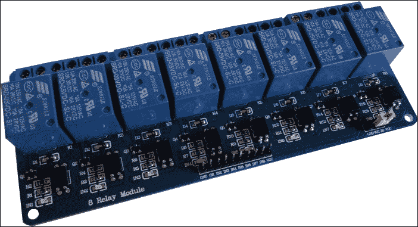

### 注意

这些设备可以在以下链接处购买（或通过浏览互联网找到）：[`www.cosino.io/product/5v-relays-array`](http://www.cosino.io/product/5v-relays-array)

然后，连接单个 12V 设备的电路图如下所示：

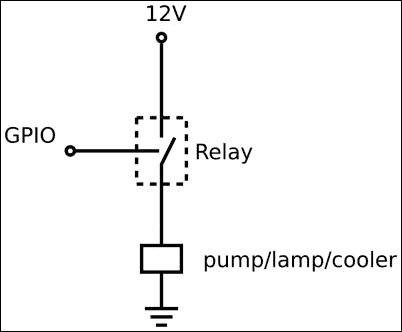

简单来说，对于每个设备，我们可以通过移动 BeagleBone Black 的特定 GPIO 来简单地打开和关闭电源。注意，每个继电器阵列板的继电器可以通过选择合适的连接来实现正逻辑或反逻辑控制，具体情况可以参考板上的标识。也就是说，我们可以决定，将 GPIO 设置为逻辑 `0` 状态时，激活继电器，从而打开连接的设备；而将 GPIO 设置为逻辑 `1` 状态时，关闭继电器，从而关闭连接的设备。

### 提示

使用以下逻辑时，当继电器的 LED 灯亮起时，对应的设备将被通电。

BeagleBone Black 的 GPIO 和我与 12V 设备一起使用的继电器阵列的引脚如下表所示：

| 引脚 | 继电器阵列引脚 | 12V 设备 |
| --- | --- | --- |
| P8.10 - GPIO66 | 3 | 灯泡 |
| P8.9 - GPIO69 | 2 | 风扇 |
| P8.12 - GPIO68 | 1 | 水泵 |
| P9.1 - GND | GND |   |
| P9.5 - 5V | Vcc |   |

为了测试每个 GPIO 引脚的功能，我们可以使用以下命令将 GPIO 设置为高电平输出引脚：

```
root@arm:~# ./bin/gpio_set.sh 68 out 1

```

### 提示

请注意，继电器的 *关* 状态是 `1`，而 *开* 状态是 `0`。

然后，我们只需向 `/sys/class/gpio/gpio68/value` 文件写入 `0` 和 `1` 来控制继电器的开关，如下所示：

```
root@arm:~# echo 0 > /sys/class/gpio/gpio68/value
root@arm:~# echo 1 > /sys/class/gpio/gpio68/value

```

## 设置网络摄像头

我在原型中使用的网络摄像头是普通的基于 UVC 的摄像头，但你可以安全地使用其他受 **mjpg-streamer** 工具支持的摄像头。

### 注意

查看 mjpg-streamer 项目的主页以获取更多信息：[`sourceforge.net/projects/mjpg-streamer/`](http://sourceforge.net/projects/mjpg-streamer/)。

一旦连接到 BeagleBone Black USB 主机端口，我得到了以下内核活动：

```
usb 1-1: New USB device found, idVendor=045e, idProduct=0766
usb 1-1: New USB device strings: Mfr=1, Product=2, SerialNumber=0
usb 1-1: Product: Microsoft LifeCam VX-800
usb 1-1: Manufacturer: Microsoft
...
uvcvideo 1-1:1.0: usb_probe_interface
uvcvideo 1-1:1.0: usb_probe_interface - got id
uvcvideo: Found UVC 1.00 device Microsoft LifeCam VX-800 (045e:0766)

```

现在，一个名为 `uvcvideo` 的新驱动已加载到内核中：

```
root@beaglebone:~# lsmod
Module                  Size  Used by
snd_usb_audio          95766  0
snd_hwdep               4818  1 snd_usb_audio
snd_usbmidi_lib        14457  1 snd_usb_audio
uvcvideo               53354  0
videobuf2_vmalloc       2418  1 uvcvideo
...

```

好的，现在，为了建立一个流媒体服务器，我们需要下载 mjpg-streamer 源代码并编译它。我们可以在 BeagleBone Black 上直接执行以下命令来完成：

```
root@beaglebone:~# svn checkout svn://svn.code.sf.net/p/mjpg-streamer/code/ mjpg-streamer-code

```

### 提示

`svn`命令是`subversion`包的一部分，可以通过以下命令安装：

```
root@beaglebone:~# aptitude install subversion

```

下载完成后，我们可以通过以下命令行编译并安装代码：

```
root@beaglebone:~# cd mjpg-streamer-code/mjpg-streamer/ && make && make install

```

### 注意

你可以在书籍示例代码仓库中的`chapter_03/mjpg-streamer-code.tgz`文件里找到该程序的压缩档案副本。

如果没有错误报告，你现在应该能够按照如下执行新的命令，在这里我们请求帮助信息：

```
root@beaglebone:~# mjpg_streamer --help
-----------------------------------------------------------------------
Usage: mjpg_streamer
 -i | --input "<input-plugin.so> [parameters]"
 -o | --output "<output-plugin.so> [parameters]"
 [-h | --help ]........: display this help
 [-v | --version ].....: display version information
 [-b | --background]...: fork to the background, daemon mode
...

```

### 提示

如果你遇到以下错误，这意味着你的系统缺少`convert`工具：

```
make[1]: Entering directory `/root/mjpg-streamer-code/mjpg-streamer/plugins/input_testpicture'
convert pictures/960x720_1.jpg -resize 640x480!
pictures/640x480_1.jpg
/bin/sh: 1: convert: not found
make[1]: *** [pictures/640x480_1.jpg] Error 127

```

你可以通过使用常见的`aptitude`命令来安装它：

```
root@beaglebone:~# aptitude install imagemagick

```

好的，现在我们准备测试网络摄像头。只需运行以下命令行，然后在网页浏览器中输入地址`http://192.168.32.46:8080/?action=stream`（在这里你需要将我的 IP 地址`192.168.32.46`替换为你 BeagleBone Black 的 IP 地址），即可获取来自摄像头的实时视频：

```
root@beaglebone:~# LD_LIBRARY_PATH=/usr/local/lib/ mjpg_streamer -i "input_uvc.so -y -f 10 -r QVGA" -o "output_http.so -w /var/www/"

```

### 提示

注意，如果你没有使用 BeagleBone Black 的以太网端口，你也可以使用 USB 以太网地址`192.168.7.2`。

如果一切正常，你应该看到类似以下截图的内容：

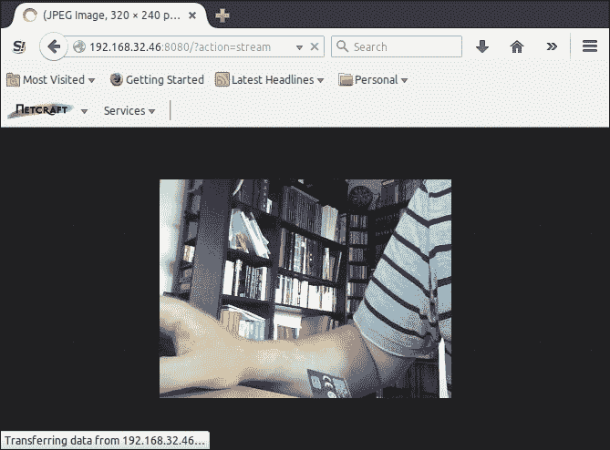

### 提示

如果你遇到以下错误，这意味着另一个进程占用了`8080`端口，很可能是被`Bone101`服务占用：

```
bind: Address already in use

```

要禁用它，可以使用以下命令：

```
root@BeagleBone:~# systemctl stop bonescript.socket
root@BeagleBone:~# systemctl disable bonescript.socket
rm '/etc/systemd/system/sockets.target.wants/bonescript.socket'

```

或者，你可以简单地使用另一个端口，也许是`8090`端口，使用以下命令行：

```
root@beaglebone:~# LD_LIBRARY_PATH=/usr/local/lib/ mjpg_streamer -i "input_uvc.so -y -f 10 -r QVGA" -o "output_http.so -p 8090 -w /var/www/"

```

## 连接温度传感器

我在原型中使用的温度传感器如下图所示：

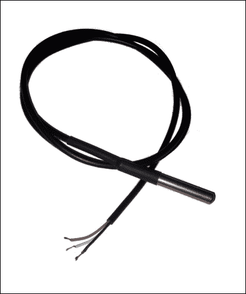

### 注意

这些设备可以通过以下链接（或通过上网搜索）购买：[`www.cosino.io/product/waterproof-temperature-sensor`](http://www.cosino.io/product/waterproof-temperature-sensor)。

该设备的数据表可以在[`datasheets.maximintegrated.com/en/ds/DS18B20.pdf`](http://datasheets.maximintegrated.com/en/ds/DS18B20.pdf)找到。

如你所见，它是一个防水设备，因此我们可以安全地将其放入水中以获取温度。

该设备是一个**1-Wire**设备，我们可以通过使用`w1-gpio`驱动程序来访问它，该驱动程序通过使用标准的 BeagleBone Black GPIO 引脚模拟 1-Wire 控制器。电气连接必须按照以下表格进行，记住传感器有三根颜色不同的连接电缆：

| 引脚 | 电缆颜色 |
| --- | --- |
| P9.4 - Vcc | 红色 |
| P8.11 - GPIO1_13 | 白色 |
| P9.2 - GND | 黑色 |

### 注意

感兴趣的读者可以访问以下 URL，了解更多关于 1-Wire 工作原理的信息：[`en.wikipedia.org/wiki/1-Wire`](http://en.wikipedia.org/wiki/1-Wire)

请记住，由于我们的 1-Wire 控制器是通过软件实现的，我们必须在红色和白色电缆之间添加一个 4.7KΩ的上拉电阻，以确保其正常工作！

一旦所有连接就位，我们可以使用书中示例代码库中的`chapter_03/BB-W1-GPIO-00A0.dts`文件，在 BeagleBone Black 的扩展连接器的*P8.11*引脚上启用 1-Wire 控制器。以下代码片段显示了我们启用`w1-gpio`驱动程序并为其分配适当 GPIO 的相关代码：

```
   fragment@1 {
      target = <&ocp>;

      __overlay__ {
         #address-cells  = <1>;
         #size-cell      = <0>;
         status          = "okay";

         /* Setup the pins */
         pinctrl-names   = "default";
         pinctrl-0       = <&bb_w1_pins>;

         /* Define the new one-wire master as based on w1-gpio
         * and using GPIO1_13
         */
         onewire@0 {
            compatible      = "w1-gpio";
            gpios           = <&gpio2 13 0>;
         };
      };
   };
```

要启用它，我们必须使用`dtc`程序按如下方式进行编译：

```
root@beaglebone:~# dtc -O dtb -o /lib/firmware/BB-W1-GPIO-00A0.dtbo -b 0 -@ BB-W1-GPIO-00A0.dts

```

然后，我们需要使用以下命令将其加载到内核中：

```
root@beaglebone:~# echo BB-W1-GPIO > /sys/devices/bone_capemgr.9/slots

```

如果一切正常，我们应该能在`/sys/bus/w1/devices/`目录下看到一个新的 1-Wire 设备，如下所示：

```
root@beaglebone:~# ls /sys/bus/w1/devices/
28-000004b541e9  w1_bus_master1

```

新的温度传感器由名为`28-000004b541e9`的目录表示。要读取当前温度，我们可以使用`cat`命令读取`w1_slave`文件，如下所示：

```
root@beaglebone:~# cat /sys/bus/w1/devices/28-000004b541e9/w1_slave
d8 01 00 04 1f ff 08 10 1c : crc=1c YES
d8 01 00 04 1f ff 08 10 1c t=29500

```

### 提示

请注意，您的传感器可能有不同的 ID，因此在您的系统中，您将在`/sys/bus/w1/devices/28-NNNNNNNNNNNN/w1_slave`路径下看到不同的路径名称。

在前面的示例中，当前温度为`t=29500`，单位是**毫摄氏度**（**m°C**），所以它相当于 29.5°C。

### 提示

读者可以查看本书作者撰写的《BeagleBone Essentials》，*Packt Publishing*，以获取有关在 BeagleBone Black 上管理 1-Wire 设备的更多信息。

## 连接喂食器

鱼饲料器是一种可以通过移动电机释放一些饲料的设备。其工作原理在下图中表示：

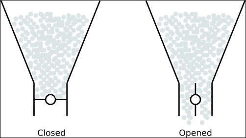

在关闭位置时，电机处于水平位置，因此饲料无法掉落，而在**开启**位置时，电机处于垂直位置，饲料才能掉落。我没有真正的鱼饲料器，但从前面的工作原理来看，我们可以通过使用下图所示的伺服电机来模拟它：

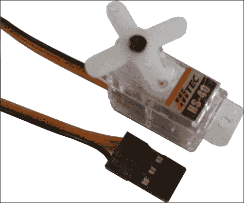

### 注意

该设备可以通过以下链接购买（或通过网络浏览）：[`www.cosino.io/product/nano-servo-motor`](http://www.cosino.io/product/nano-servo-motor)。

该设备的数据手册可以在[`hitecrcd.com/files/Servomanual.pdf`](http://hitecrcd.com/files/Servomanual.pdf.)上找到。

该设备可以进行位置控制，且通过适当的**PWM**信号输入，它可以旋转 90 度。事实上，查看数据表后，我们发现该伺服电机可以通过使用周期性方波来管理，其**周期**（**T**）为 20ms，**高电平时间**（**t[high]**）介于 0.9ms 和 2.1ms 之间，1.5ms 为中心值（大致）。因此，我们可以认为电机在**开启**位置时* t[high] =1ms*，在**关闭**位置时* t[high] =2ms*（当然，这些值在喂食器真正搭建完成后应进行仔细校准！）。

我们可以根据下表连接伺服电机：

| 引脚 | 电缆颜色 |
| --- | --- |
| P9.3 - Vcc | 红色 |
| P9.22 - PWM | 黄色 |
| P9.1 - GND | 黑色 |

### 提示

感兴趣的读者可以在[`en.wikipedia.org/wiki/Pulse-width_modulation`](https://en.wikipedia.org/wiki/Pulse-width_modulation)了解更多关于 PWM 的信息。

为了测试连接，我们需要启用 BeagleBone Black 的一个 PWM 生成器。为了保持前面的连接，我们需要启用一个输出线路位于扩展连接器`P9.22`引脚的 PWM 生成器。为此，我们可以使用以下命令：

```
root@beaglebone:~# echo am33xx_pwm > /sys/devices/bone_capemgr.9/slots
root@beaglebone:~# echo bone_pwm_P9_22 > /sys/devices/bone_capemgr.9/slots

```

然后，在`/sys/devices/ocp.3`目录下，我们应该能找到与新启用的 PWM 设备相关的新条目，如下所示：

```
root@beaglebone:~# ls -d /sys/devices/ocp.3/pwm_*
/sys/devices/ocp.3/pwm_test_P9_22.12

```

查看`/sys/devices/ocp.3/pwm_test_P9_22.12`目录，我们可以看到可以用来管理新 PWM 设备的文件：

```
root@beaglebone:~# ls /sys/devices/ocp.3/pwm_test_P9_22.12/
driver	duty   modalias   period   polarity   power   run   subsystem   uevent

```

如我们从之前的文件名中可以推断，我们需要正确地在名为`polarity`、`period`和`duty`的文件中设置值。例如，可以通过以下命令实现伺服电机的中心位置：

```
root@beaglebone:~# echo 0 > /sys/devices/ocp.3/pwm_test_P9_22.12/polarity
root@beaglebone:~# echo 20000000 > /sys/devices/ocp.3/pwm_test_P9_22.12/period
root@beaglebone:~# echo 1500000 > /sys/devices/ocp.3/pwm_test_P9_22.12/duty

```

极性设置为`0`以进行反转，而其他文件中写入的值是以纳秒表示的时间值，设置为 20ms 的周期和 1.5ms 的占空比，如数据表要求（时间值均为纳秒）。现在，要将齿轮完全顺时针转动，我们可以使用以下命令：

```
root@beaglebone:~# echo 2100000 > /sys/devices/ocp.3/pwm_test_P9_22.12/duty

```

另一方面，以下命令是将其完全逆时针转动：

```
root@beaglebone:~# echo 900000 > /sys/devices/ocp.3/pwm_test_P9_22.12/duty

```

因此，通过使用以下命令序列，我们可以打开并随后关闭（延迟`1`秒）饲料器的闸门：

```
echo 1000000 > /sys/devices/ocp.3/pwm_test_P9_22.12/duty
sleep 1
echo 2000000 > /sys/devices/ocp.3/pwm_test_P9_22.12/duty

```

请注意，通过简单地修改延迟，我们可以控制每次启动饲料器时掉落的饲料量。

### 注意

实现饲料控制机制的脚本可以在书籍示例代码仓库中的`chapter_03/feeder.sh`文件中找到。

## 水传感器

我使用的水传感器如以下截图所示：

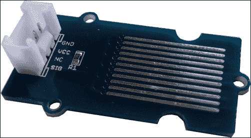

### 注意

该设备可以通过以下链接（或通过上网搜索）购买：[`www.cosino.io/product/water_sensor`](http://www.cosino.io/product/water_sensor)。

这是一个非常简单的设备，实现在以下截图中所示，其中添加了**电阻**（**R**）来限制水分闭合电路时的电流：

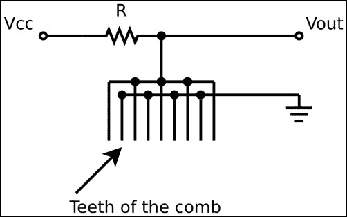

当一滴水*接触*原理图中梳子的两个或更多的齿时，电路闭合，**输出电压**（**Vout**）从**Vcc**降至 0V。

因此，如果我们想检查水族箱中的水位，换句话说，如果我们想检查是否有水泄漏，我们可以将水族箱放入某种托盘中，然后将此设备放入其中。如果发生水泄漏，水会被托盘收集，传感器的输出电压应从**Vcc**降至 GND。

此设备使用的 GPIO 如以下表格所示：

| 引脚 | 电缆颜色 |
| --- | --- |
| P9.3 - 3.3V | 红色 |
| P8.16 - GPIO67 | 黄色 |
| P9.1 - GND | 黑色 |

为了测试连接，我们必须使用以下命令将 GPIO 67 定义为输入行：

```
root@beaglebone:~# ../bin/gpio_set.sh 67 in

```

然后，我们可以通过使用以下两条命令来尝试读取 GPIO 状态，看看传感器在水中和不在水中的状态：

```
root@beaglebone:~# cat /sys/class/gpio/gpio67/value
0
root@beaglebone:~# cat /sys/class/gpio/gpio67/value
1

```

## 最终图片

以下截图展示了我为实现该项目并测试软件而实现的原型。正如你所看到的，水族箱已被一杯水替代：

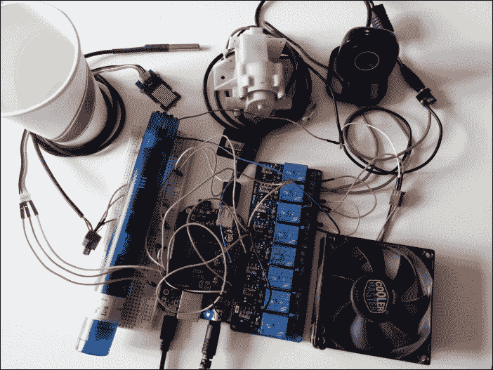

请注意，我们有两个外部电源：一个是常规的 5V 电源供电给 BeagleBone Black，另一个是输出电压为 12V 的电源供电给其他设备（你可以在右上角看到其连接器，位于网络摄像头右侧）。

# 设置软件

关于软件，这次的主要部分由 Web 界面覆盖，它是项目的核心，负责获取水族箱数据并管理执行器的控制过程。接下来，一个专门的监控脚本将用于实现 Web 界面与内部数据库之间的通信。

## 管理系统状态和配置

为了管理所有设备的状态并进行数据记录，我们可以再次使用数据库来存储所有相关数据，就像我们在第一章中所做的那样，*危险气体传感器*。因此，我们可以使用书中示例代码仓库中的`chapter_03/my_init.sh`文件来设置数据库。以下片段显示了定义项目中使用的表格的相关代码：

```
# Select database
USE aquarium_mon;

#
# Create the system status table
#

CREATE TABLE status (
        n VARCHAR(64) NOT NULL,
        v VARCHAR(64) NOT NULL,
        PRIMARY KEY (n)
) ENGINE=MEMORY;

# Setup default values
INSERT INTO status (n, v) VALUES('alarm_sys', '0');
INSERT INTO status (n, v) VALUES('alarm_level', '0');
INSERT INTO status (n, v) VALUES('alarm_temp', '0');
INSERT INTO status (n, v) VALUES('water', '21');
INSERT INTO status (n, v) VALUES('cooler', '0');
INSERT INTO status (n, v) VALUES('pump', '0');
INSERT INTO status (n, v) VALUES('lamp', '0');
INSERT INTO status (n, v) VALUES('force_cooler', '0');
INSERT INTO status (n, v) VALUES('force_pump', '0');
INSERT INTO status (n, v) VALUES('force_lamp', '0');
INSERT INTO status (n, v) VALUES('force_feeder', '0');

#
# Create the system configuration table
#

CREATE TABLE config (
   n VARCHAR(64) NOT NULL,
   v VARCHAR(64) NOT NULL,
   PRIMARY KEY (n)
);

# Setup default values
INSERT INTO config (n, v) VALUES('pump_t_on', '20');
INSERT INTO config (n, v) VALUES('pump_t_off', '60');
INSERT INTO config (n, v) VALUES('feeder_interval', '60');
INSERT INTO config (n, v) VALUES('water_temp_max', '27');
INSERT INTO config (n, v) VALUES('water_temp_min_alarm', '18');
INSERT INTO config (n, v) VALUES('water_temp_max_alarm', '29');

#
# Create one table per sensor data
#

CREATE TABLE temp_log (
   t DATETIME NOT NULL,
   v FLOAT,
   PRIMARY KEY (t)
);
```

`status`表格包含系统状态变量，含义如下：

| 变量名称 | 描述 |
| --- | --- |
| `alarm_sys` | 一般系统报警（I/O 和通信错误等）。 |
| `alarm_level` | 检测到水泄漏。 |
| `alarm_temp` | 水温超过`water_temp_max_alarm`值或低于`water_temp_min_alarm`值（单位：℃）。 |
| `Water` | 当前水温（单位：℃）。 |
| `Cooler` | 当前冷却器状态（0 = 关闭，1 = 开启）。 |
| `Pump` | 当前水泵状态（0 = 关闭，1 = 开启）。 |
| `Lamp` | 当前灯光状态（0 = 关闭，1 = 开启）。 |
| `force_cooler` | 用户请求开启冷却器。 |
| `force_pump` | 用户请求开启水泵。 |
| `force_lamp` | 用户请求开启灯光。 |
| `force_feeder` | 用户请求启用喂料器。 |

请注意，喂料器没有当前状态变量，因为它不能保持开启或关闭状态，而是具有*脉冲开启*的功能；也就是说，当启用时，它会打开然后关闭内部门。

另一方面，在`config`表格中，有系统配置变量，含义如下：

| 变量名称 | 描述 |
| --- | --- |
| `pump_t_on` | 水泵必须开启的时间（单位：秒）。 |
| `pump_t_off` | 水泵必须关闭的时间（单位：秒）。 |
| `feeder_interval` | 两次连续“午餐时间”之间的时间间隔（单位：秒）。 |
| `water_temp_max` | 如果水温超过此值（单位：°C），则启动冷却器。 |
| `water_temp_min_alarm` | 如果水温低于此值（单位：°C），则启用水温报警。 |
| `water_temp_max_alarm` | 如果水温超过此值（单位：°C），则启用水温报警。 |

### 提示

请注意，由于我的项目没有加热器来在水温过低时提高水温，因此缺少 `water_temp_min` 配置变量。然而，读者应该能够通过阅读本章获得填补此空白所需的所有信息！

最后，`temp_log` 表用于存储所有水温测量数据，这些数据对于在用户控制面板中展示小图表非常有用（请参阅下一个章节）。 

## 构建 Web 控制面板

Web 控制面板是用 **PHP** 和 **JavaScript** 编写的。PHP 用于实现数据采集和控制过程以及主页面，而 JavaScript 用于实现图形小部件。特别是，最后一部分是通过使用一个名为 **Drinks** 的有趣工具包实现的 ([`www.goincompany.com/drinks.php`](http://www.goincompany.com/drinks.php))。

使用该工具包实现的小部件非常简单。为了安装它，我们只需从项目主页下载 zip 压缩包，解压缩它，然后将扩展名为 `.js` 的文件移动到 Web 服务器的根目录。在我的 BeagleBone Black 上，我使用的是 Apache Web 服务器，其根目录在 `/var/www` 目录下。因此，为了安装 `Drinks` 工具包，我将文件移动如下：

```
root@beaglebone:~/chapter_03# ls /var/www/
Display.js  Knob.js  Slider.js   Drinks.js   Led.js   Switch.js

```

现在，我们需要添加代码以构建我们的 Web 控制面板并在该目录中进行管理。主脚本可以在书中的示例代码库中的 `chapter_03/aquarium.php` 文件中找到。接下来我将把它的所有相关代码分成几个代码片段进行展示。

在接下来的第一个代码片段中，是获取输入小部件初始状态的 PHP 代码。也就是说，这些小部件是用户直接管理的，用来向系统发送命令。在此页面首次加载时，用户将看到当前这些小部件的状态，它们存储在内部数据库中：

```
# Open the DB
db_open("aquarium_mon");

# Set initial statuses for input widgets
$force_cooler = db_get_status("force_cooler");
$force_pump = db_get_status("force_pump");
$force_lamp = db_get_status("force_lamp");
$force_feeder = db_get_status("force_feeder");
```

接下来是 **HTML** 页面的头部内容，如下所示：

```
<html>
   <head>
      <link href="aquarium.css" rel="stylesheet" type="text/css">

      <script type="text/javascript" src="img/Drinks.js"></script>

      <script>
         var man_in = Drinks.createManager();
         man_in.href = 'handler.php';
         man_in.input = new Array("force_cooler", "force_pump", "force_lamp", "force_feeder");
         man_in.refresh = 1;
         man_in.start();

         var man_out = Drinks.createManager();
         man_out.href = 'handler.php';
         man_out.refresh = 1;
         man_out.start();
      </script>
   </head>
```

通过使用这段代码，我们指示 Drinks 工具包生成两个管理器——一个管理输入小部件（`man_in`），另一个管理所有其他输出小部件（`man_out`）。与输入小部件不同，输出小部件是所有不受用户直接控制的小部件，它们由系统更新以向用户显示系统状态。

两个管理器每秒刷新一次其内部状态（`refresh=1`），并且都将使用名为`handler.php`的外部处理程序来完成这一操作。这个处理程序的代码（将在下一节中呈现）是定期执行的，用于获取输入小部件的状态，并将输出小部件的状态设置到控制面板中。

然后，控制面板分为三个主要小节。第一个小节用于放置实时视频和报警。可以通过以下代码片段实现：

```
   <table>
      <tr>
         <th><h3>Live video</h3></th>
         <th><h3>Alarms</h3></th>
      </tr>
      <tr>
         <td>
            :8080/?action=stream" alt="real-time video feed" />
         </td>
         <td>
            <table class="widget">
               <tr>
                  <th>system</th>
                  <th>Water level</th>
                  <th>Water temperature</th>
               </tr>
               <tr>
                  <td><led id="alarm_sys" type="round" radius="25" color="red"></led></td>
                  <td><led id="alarm_level" type="round" radius="25" color="red"></led></td>
                  <td><led id="alarm_temp" type="round" radius="25" color="red"></led></td>
               </tr>
            </table>
         </td>
      </tr>
   </table>
```

在这里，以下行用于启用来自摄像头的实时视频：

```
:8080/?action=stream" alt="real-time video feed" />
```

最后，以下三行用于定义与相应报警变量相关的报警 LED：

```
               <td><led id="alarm_sys" type="round" radius="25" color="red"></led></td>
               <td><led id="alarm_level" type="round" radius="25" color="red"></led></td>
               <td><led id="alarm_temp" type="round" radius="25" color="red"></led></td>
```

第二个小节包含控制小部件，即水温计、灯、冷却器、泵和进料器的 LED 和开关。由于所有输入小部件都在这里，代码使用一个大的 HTML 表单，将这些项目放置其中：

```
   <form method="post">
      <table class="widget">
         <tr>
            <th>Water temp (C)</th>
            <th>Lamp</th>
            <th>Cooler</th>
            <th>Pump</th>
            <th>Feeder</th>
         </tr>
         <tr>
            <td>
               <display id="water" type="thermo" max_range="50" range_from="10" range_to="50" autoscale="true"></display>
            </td>
            <td>
               <led id="lamp" type="round" radius="25"></led>
               <switch id="force_lamp" type="circle" value="<?=$force_lamp?>"></switch>
            </td>
            <td>
               <led id="cooler" type="round" radius="25"></led>
               <switch id="force_cooler" type="circle" value="<?=$force_cooler?>"></switch>
            </td>
            <td>
               <led id="pump" type="round" radius="25"></led>
               <switch id="force_pump" type="circle" value="<?=$force_pump?>"></switch>
            </td>
            <td>
               <led id="feeder" type="round" radius="25"></led>
               <switch id="force_feeder" type="toggle" width="80" value="<?=$force_feeder?>"></switch>
            </td>
         </tr>
      </table>
      <input type="hidden">
   </form>
```

以下行用于显示报告水温的温度计：

```
<display id="water" type="thermo" max_range="50" range_from="10" range_to="50" autoscale="true"></display>
```

以下两行用于显示灯、冷却器和泵的开关及相应的 LED 指示设备状态：

```
               <led id="lamp" type="round" radius="25"></led>
               <switch id="force_lamp" type="circle" value="<?=$force_lamp?>"></switch>
```

当 LED 打开时，相应的设备会被打开，而当 LED 关闭时，设备会被关闭。另一方面，用户通过切换前面的开关之一，可以强制系统在*下一个周期*内打开相应的设备。（我将在下一节中解释*下一个周期*的含义。）

进料器必须申请特殊的通知。如前所述，它可以通过脉冲启用，而不仅仅是开或关。为了突出这一点，这次我使用了不同类型的开关小部件。因此，LED 用于通知用户进料器将在下一个周期启用，而 LED 将保持点亮，直到进料器真正启用后才会关闭。

显示进料器控制的代码如下所示：

```
               <led id="feeder" type="round" radius="25"></led>
               <switch id="force_feeder" type="toggle" width="80" value="<?=$force_feeder?>"></switch>
```

这里，开关的类型是`toggle`，而不是`circle`。

最后一小节是温度日志图形，用于向用户显示过去 20 个周期内水温的变化情况。实现这一部分的代码如下：

```
   <display id="temp_graph" type="graph" scale="range" autoscale="true" mode="ch1" power_onload="true">
      <channel href="log_temp.php" refresh="60" sweep="0.005" frequency="20"></channel>
   </display>
```

请注意，在这种情况下，我们需要一个特殊的处理程序来生成表示水温的图形点。这个处理程序被称为`log_temp.php`，它在`channel`条目的`href`参数中指定，而其他参数定义了刷新时间（以秒为单位，`refresh="60"`）和图形的缩放（`sweep`和`frequency`）。有关这些参数的更多信息，请参阅`Drinks`文档页面。

在每次刷新时，`log_temp.php`脚本会被调用，它将返回一个点序列，以便显示小部件显示。为了了解它是如何发生的，我们需要移步到下一部分。但在此之前，让我向你展示一下我们刚才展示的 Web 控制面板在我的 PC 上是如何显示的：

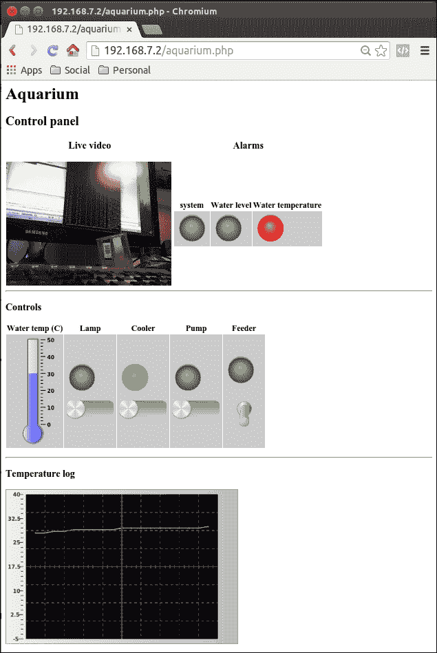

## 控制面板的处理

在前一部分中，我们发现网络控制面板需要一些处理程序来与底层系统发送/接收数据。特别是，我们提到输入/输出管理器与`handler.php`脚本进行通信，而温度日志则需要`log_temp.php`脚本来获取图形数据。接下来让我们看看这些脚本是如何编写的。

`handler.php`脚本中的代码如下：

```
<?php

require("db.php");

# Open the DB
db_open("aquarium_mon");

if (count($_GET) > 0) {
   # Input section
       db_set_status("force_cooler", $_GET["force_cooler"]);
       db_set_status("force_pump", $_GET["force_pump"]);
       db_set_status("force_lamp", $_GET["force_lamp"]);

   if ($_GET["force_feeder"])
      db_set_status("force_feeder", 1);
}

# Output section
$values["alarm_sys"] = db_get_status("alarm_sys");
$values["alarm_level"] = db_get_status("alarm_level");
$values["alarm_temp"] = db_get_status("alarm_temp");

$values["water"] = db_get_status("water");
$values["cooler"] = db_get_status("cooler");
$values["pump"] = db_get_status("pump");
$values["lamp"] = db_get_status("lamp");
$values["feeder"] = db_get_status("force_feeder");

$values["force_feeder"] = 0;

echo json_encode($values);
?>
```

### 注意

该脚本可以在书籍示例代码库中的`chapter_03/handler.php`文件中找到。

该脚本有一个输入部分来管理输入小部件，还有一个输出部分来管理输出小部件。在输入部分，我们只需获取每个输入小部件的状态，然后将其存储到`status`表中。唯一的例外是`force_feeder`变量，它只在状态为`1`时被记录，因为当馈料器在下一个周期启用时，它的状态会被清除（再次提到，*下一个周期*的含义将在稍后解释）。

在输出部分，我们只是从数据库中获取每个状态变量的状态，然后将其存储到一个数组中，该数组将通过`json_encode()`函数返回给`Drinks`工具包。这里需要特别注意的是，一旦`force_feeder`开关被移动到高电平状态，它的状态会被记录，然后会被清除，只是为了模拟它不是一个普通的开/关开关，而是一个*脉冲开*开关。

另一方面，正如刚才所说，`log_temp.php`脚本只需返回一个点的列表。以下是代码：

```
<?php

require("db.php");

# Open the DB
db_open("aquarium_mon");

# Get the last 20 points
$query = "SELECT v FROM temp_log ORDER BY t DESC LIMIT 20";
$ret = mysql_query($query);
if (!$ret)
  die();

$data = array();
$n = 0;
while ($row = mysql_fetch_array($ret)) {
  array_unshift($data, $row["v"]);
  $n++;
}

if ($n < 20)
  echo json_encode(array_merge(array_fill(0, 20 - $n, 0), $data));
else
  echo json_encode($data);
?>
```

### 注意

该脚本可以在书籍示例代码库中的`chapter_03/log_temp.php`文件中找到。

该脚本简单地从`temp_log`表中选择最后 20 个记录点，然后将它们存储到`data[]`数组中，并在开头添加一些零，以防存在少于 20 个存储的温度值。`array_unshift()`函数用于将每个新提取的值放到数组的开头，因为`SELECT`语句返回的数据是反向顺序的。

现在，最后一步是将所有这些脚本放到 Web 浏览器的根目录中。我的 BeagleBone Black 上的`/var/www`目录如下：

```
root@beaglebone:~/chapter_03# ls /var/www/
Display.js  Knob.js  Slider.js  aquarium.css  db.php   log_temp.php
Drinks.js   Led.js   Switch.js  aquarium.php  handler.php

```

### 提示

CSS 文件可以在书籍示例代码库中的`chapter_03/aquarium.css`文件中找到。由于它非常简单，并且对于理解项目并非严格必要，因此这里没有展示代码。

## 了解内部状态机

现在控制面板已经正确设置，我们需要查看内部的*状态机*，也就是在每个周期中收集所有环境数据，然后根据其内部状态和新的环境状态决定做什么的过程。

我们的机器实现位于书籍示例代码库中的`chapter_03/aquarium_mon.php`文件中。以下是其`daemon_body()`函数的几个代码片段（这是程序的真正核心）。

在开始时，该函数如下所示：

```
function daemon_body()
{
   global $loop_time;
   global $sensors;

   $pump_time = strtotime("now");
   $feeder_time = strtotime("now");

   # The main loop
   dbg("start main loop (loop_time=${loop_time}s)");
   while (sleep($loop_time) == 0) {
   dbg("loop start");

      $alarm_sys = 0;
```

在开始时，该函数初始化一些变量，然后启动主循环，第一步是获取水温，因为根据这个值需要执行许多任务！

还要注意，`while()`语句每次执行`sleep($loop_time)`函数，即每`loop_time`秒开始一个新的*机器周期*，并且所有变量根据读取的环境数据和用户输入进行修改。

然后，代码继续按如下方式读取温度：

```
   #
   # Temperature management
   #

   $ret = temp_get();
   if ($ret === false) {
      err("unable to get temperature!");
      $alarm_sys = 1;
   }
   $temp = $ret;
   dbg("t=$temp");

   # Save status
   db_set_status("water", $temp);

   #
   # Check alarms
   #

   $water_temp_min = db_get_config("water_temp_min_alarm");
   $water_temp_max = db_get_config("water_temp_max_alarm");
   $val = ($temp < $water_temp_min ||
      $temp > $water_temp_max) ? 1 : 0;
   db_set_status("alarm_temp", $val);

   # Store the result into the proper log table
   db_log_var("temp_log", $temp);

   $water_level = get_water_level();
   db_set_status("alarm_level", $water_level);
```

`temp_get()`函数通过读取相应的`w1_slave`文件来读取水温。它将此值存储在`temp`变量中，然后根据此新值检查一些警报。还要注意，在这种情况下，`alarm_sys`变量可以设置为`1`，以指示是否发生了 I/O 错误。

`get_water_level()`函数用于读取与水温传感器连接的 GPIO，其主体如下：

```
function get_water_level()
{
   global $gpios;

   return gpio_get($gpios["water"]) == 0 ? 1 : 0;
}
```

### 提示

请注意，如前面的代码所示，水温传感器具有反向逻辑。

现在轮到灯光的部分：

```
   #
   # Lamp management
   #

   # The lamp is directly managed by the force_lamp switch

   $lamp = db_get_status("force_lamp");

   # Set the new status
   set_lamp($lamp);
   db_set_status("lamp", $lamp);
   dbg("lamp %sactivated", $lamp ? "" : "de");
```

在前面的代码片段中，我们看到灯光根据用户输入开关，而没有任何系统的自动机制。

这对于冷却器来说并不成立。它的管理代码如下所示：

```
   #
   # Cooler management
   #

   # The cooler must be enabled if temp > water_temp_max in order
   # to try to reduce the temperature of the water...
   $water_temp_max = db_get_config("water_temp_max");
   $cooler = $temp > $water_temp_max ? 1 : 0;

   # We must force on?
   $force_cooler = db_get_status("force_cooler");
   $cooler = $force_cooler ? 1 : $cooler;

   # Set the new status
   set_cooler($cooler);
   db_set_status("cooler", $cooler);
   dbg("cooler %sactivated", $cooler ? "" : "de");
```

冷却器的状态根据`temp`值和`water_temp_max`设置来确定，最后如果`force_cooler`变量被设置为`1`，用户也可以强制开启。

对泵也适用类似的功能：

```
   #
   # Pump management
   #

   # The pump must be on for pump_t_on delay time and off for
      # pump_t_off delay time (if not forced of course...)
      $force_pump = db_get_status("force_pump");
      $pump = db_get_status("pump");
      $pump_interval = $pump ? db_get_config("pump_t_on") :
         db_get_config("pump_t_off");
      if ($force_pump ||
         strtotime("-$pump_time seconds") > $pump_interval) {
            $pump_time = strtotime("now");

            $pump = $force_pump ? 1 : !$pump;
         }

         # Set the new status
         set_pump($pump);
         db_set_status("pump", $pump);
         dbg("pump %sactivated", $pump ? "" : "de");
```

这次，开关状态是通过超时来设置的，同样，设备可以通过用户输入强制开启，即如果`force_pump`变量被设置为`1`。

所有前三段代码都调用了适当的函数来打开或关闭相应的 GPIO；例如，最后一段调用了`set_pump()`函数来设置泵的状态。该函数的主体如下：

```
function set_pump($status)
{
   global $gpios;

   gpio_set($gpios["pump"], $status ? 0 : 1);
}
```

另外两个函数也类似。

最后的提示是关于喂食器的。这次代码如下：

```
   #
   # Feeder management
   #

   $force_feeder = db_get_status("force_feeder");
   $feeder_interval = db_get_config("feeder_interval");
   if ($force_feeder || (strtotime("-$feeder_time seconds") > $feeder_interval)) {
      $feeder_time = strtotime("now");

      do_feeder();
      db_set_status("force_feeder", 0);
      dbg("feeder activated");
   }
```

喂食器可以根据超时或用户输入来激活；但是与前面的示例不同，代码调用了`do_feeder()`函数来调用前面展示的`feeder.sh`脚本，然后它必须清除`force_feeder`状态变量，告知用户喂食器已被激活。`do_feeder()`函数的主体如下：

```
function do_feeder()
{
   system("feeder.sh &");
}
```

### 提示

`system()`函数中的字符`&`是为了创建一个专门的进程来执行`feeder.sh`脚本。

现在，是时候执行脚本了。在我的系统上，我使用了以下命令行以调试模式执行它：

```
root@beaglebone:~# ./aquarium_mon.php -d -f -l
aquarium_mon.php[3882]: signals traps installed
aquarium_mon.php[3882]: start main loop (loop_time=15s)
aquarium_mon.php[3882]: loop start
aquarium_mon.php[3882]: t=28.5
aquarium_mon.php[3882]: lamp deactivated
aquarium_mon.php[3882]: cooler activated
aquarium_mon.php[3882]: pump deactivated
aquarium_mon.php[3882]: feeder activated
aquarium_mon.php[3882]: loop end
...
```

### 提示

请注意，在你的系统上，可能没有安装**PHP**支持。在这种情况下，你可以通过使用以下命令来解决：

```
root@beaglebone:~# apt-get install php5 libapache2-mod-php5

```

每 15 秒，脚本会唤醒并执行前面所有步骤，进入新的*循环*，属于*状态机*的一部分。请注意，要使其工作，你必须按本节中介绍的方式设置所有硬件。

# 最终测试

为了测试原型，我开启了开发板，并在登录后，通过使用之前讨论过的命令，或者使用书中示例代码库中的`chapter_03/SYSINIT.sh`脚本来设置系统，方法如下：

```
root@beaglebone:~# ./SYSINIT.sh
done!

```

然后，我按照如下方式执行了`aquarium_mon.php`命令：

```
root@beaglebone:~# ./aquarium_mon.php -d -f -l

```

此外，我用以下命令执行了视频流传输器：

```
root@beaglebone:~# LD_LIBRARY_PATH=/usr/local/lib/ mjpg_streamer -i "input_uvc.so -y -f 10 -r QVGA" -o "output_http.so -w /var/www/"

```

然后，我将浏览器指向 BeagleBone Black 的 IP 地址上的`aquarium.php`文件（即 URL `http://192.168.7.2/aquarium.php`），游戏就完成了！

请注意，此时，我们可以尝试强制设置一些参数，或者尝试通过使用书中示例代码库中的`chapter_03/my_dump.sh`和`chapter_03/my_set.sh`脚本来更改一些配置变量，方法如下：

```
root@beaglebone:~# ./my_dump.sh config
n   v
feeder_interval   60
pump_t_off   60
pump_t_on   20
water_temp_max   27
water_temp_max_alarm   29
water_temp_min   20
water_temp_min_alarm   18
root@beaglebone:~# ./my_set.sh config water_temp_max_alarm 30.5
root@beaglebone:~# ./my_dump.sh config
n   v
feeder_interval   60
pump_t_off   60
pump_t_on   20
water_temp_max   27
water_temp_max_alarm   30.5
water_temp_min   20
water_temp_min_alarm   18

```

在上述设置中，我仅作为示例更改了`water_temp_max_alarm`的限制值，你可以根据需要在你的系统上进行所有更改。

在本章结束之前，让我展示一下这个控制面板在我的智能手机上的样子：

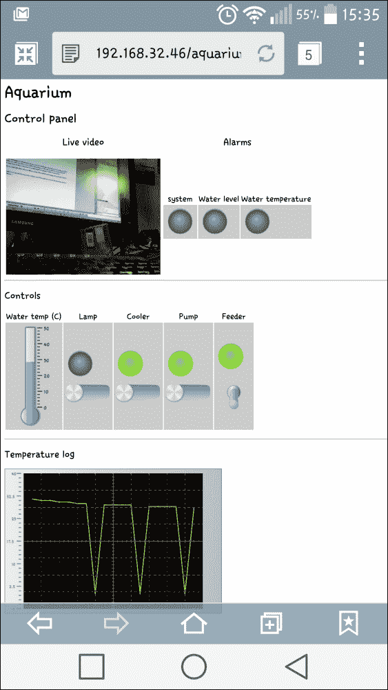

### 提示

读者应该注意到，在温度日志中有三个尖峰，这是因为在温度读取过程中，传感器返回了一个错误。这个问题可以通过在返回错误之前重复读取两到三次来解决。

# 总结

在本章中，我们了解了如何将我们的 BeagleBone Black 与多个电压不同的设备接口连接，并且如何管理 1-Wire 设备和 PWM 设备。同时，我们介绍了`Drinks`工具包来实现一个可以在 PC、智能手机或平板上使用的网页控制面板。

在下一章中，我们将看到如何实现一个气象站，该气象站可以将收集到的数据本地存储，不仅可以在网页浏览器上以漂亮的方式显示数据，还可以将数据发送到 Google Docs 文档！

简单来说，我们要实现一个简单的**物联网**（**IoT**）机器。
