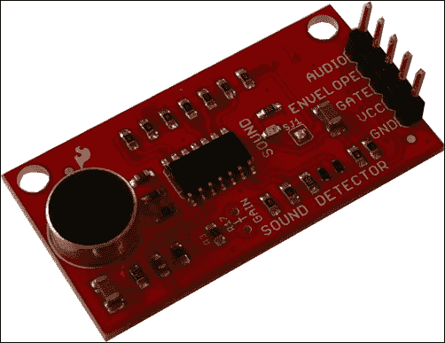
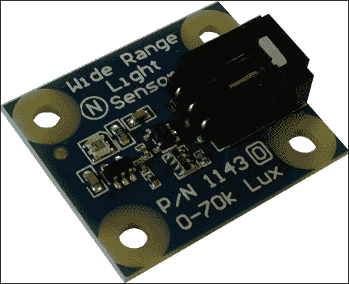
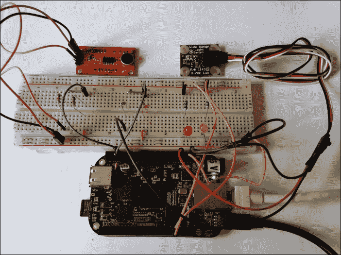
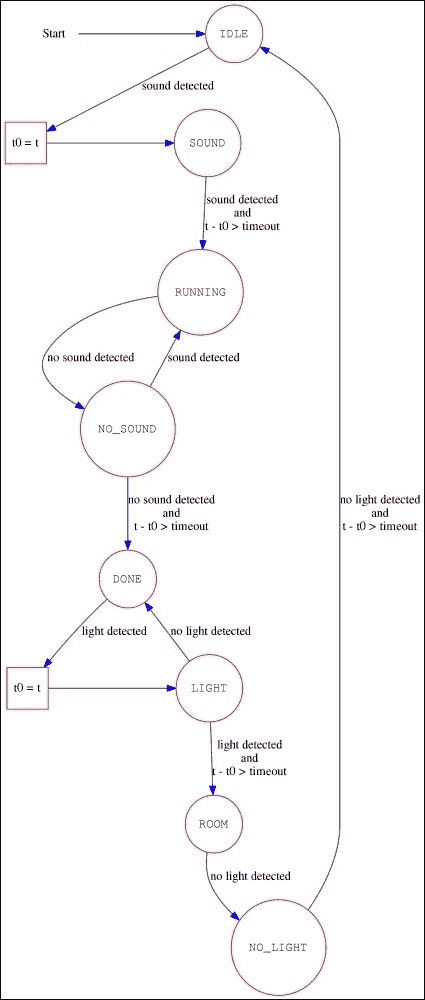
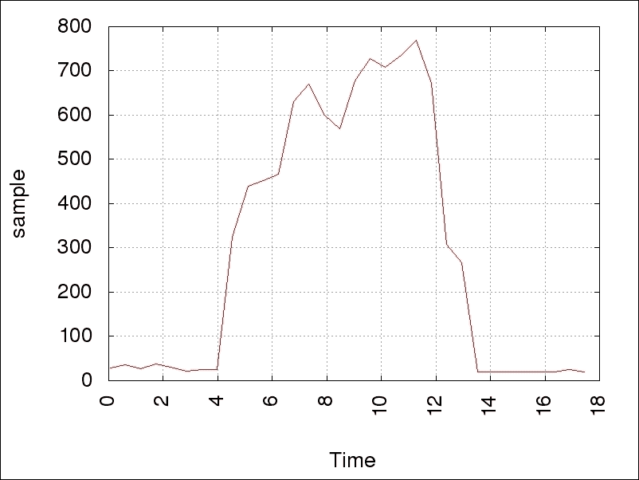
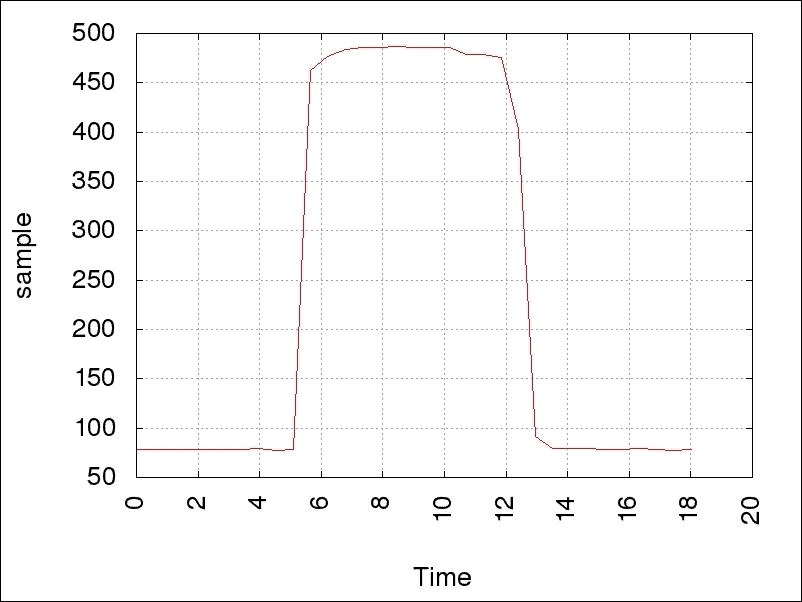

# 第五章. WhatsApp 洗衣房监控器

在本章中，我们将学习如何实现一个洗衣房监控系统，使用多个传感器，当特定事件发生时，能够通过 WhatsApp 账号直接提醒用户。

我们将学习如何将声音传感器和光线传感器连接到 BeagleBone Black，并通过它们监控我们的洗衣机。此外，我们还将看到如何通过使用 WhatsApp 账号直接与用户的智能手机进行交互，以便在某些事件发生时通知他们。

# 基本工作原理

假设我们的洗衣房配备了一台洗衣机和一盏灯，用户在取衣服时会用到这盏灯。在这种情况下，BeagleBone Black 可以配备一些特殊传感器，用于检测洗衣机何时开始或完成工作，以及何时有人进入洗衣房取走洗好的衣物。

在这种情况下，BeagleBone Black 应该能够检测到用户何时启动洗衣机，并在工作完成后等待。此时，系统可以生成一条 WhatsApp 消息，提醒用户取走衣服。当用户进入房间时，灯会亮起，当他们离开房间时，灯会熄灭。通过这种方式，我们的 BeagleBone Black 可以检测到用户是否已完成任务，并重新启动循环。

# 设置硬件

如前所述，在本项目中，我们需要两种不同类型的传感器：一种用于检测洗衣机的启动/停止，另一种用于检测是否有人进出洗衣房。前者的任务可以通过使用声音传感器来实现，即能够测量环境声音水平的设备；而后者的任务可以通过使用光线传感器来实现，即能够测量环境光线的设备。我们可以将这两种信号与阈值进行比较，以便检测相关的事件。

当洗衣机运行时，我们应当测得较高的声音水平，且持续一段较长的时间；而当洗衣机未运行时，环境声音应接近零并持续一段较长的时间。另一方面，我们可以假设，负责取衣服的人需要在洗衣房内打开灯，而当房间里没有人的时候，灯通常是关闭的。

为了帮助用户理解系统内部发生了什么，我们可以添加两颗 LED 灯，它们可以被打开/关闭或设置为闪烁模式，并赋予特定的含义（在下一节中，我将详细解释这些含义）。

## 设置声音传感器

本项目中用于检测环境声音的设备如下图所示：



### 注意

这些设备可以通过以下链接购买（或在网上搜索）：[`www.cosino.io/product/sound-detector`](http://www.cosino.io/product/sound-detector)。

该板基于放大器 LMV324，数据手册可在[`dlnmh9ip6v2uc.cloudfront.net/datasheets/Sensors/Sound/LMV324.pdf`](http://dlnmh9ip6v2uc.cloudfront.net/datasheets/Sensors/Sound/LMV324.pdf)上查看，而该板的原理图可在[`dlnmh9ip6v2uc.cloudfront.net/datasheets/Sensors/Sound/sound-detector.pdf`](http://dlnmh9ip6v2uc.cloudfront.net/datasheets/Sensors/Sound/sound-detector.pdf)上查看。

该设备非常简单，因为它提供了三个输出：标记为**AUDIO**的输出可以直接获取捕获的音频，而标记为**ENVELOPE**的输出则可以通过简单地读取模拟电压来轻松读取声音的幅度。最后一个标记为**GATE**的输出则是通过使用固定的阈值（尽管你可以通过改变板载电阻来改变阈值）来指示声音的存在。

对于我们的原型，我们可以使用**ENVELOPE**输出，因为我们可以读取模拟电压。不仅如此，它还允许我们设置自己的软件阈值。因此，让我们看看下面表格中的连接：

| 引脚 | 声音传感器引脚 |
| --- | --- |
| P9.4 - Vcc | VCC |
| P9.39 - AIN0 | R @ENVELOPE |
| P9.3 - GND | GND |

如第二章中所述，*超声波停车助手*，ADC 的输入必须限制在 1.8V，而 Vcc 电平是 3.3V，因此我们可以使用那里提到的电压分压器来将输出电压按 2 倍的比例缩放。请确保最大输入电平不超过 1.8V。因此，读者不应直接将*P9.39*引脚与声音传感器连接；他们应该使用第二章中所使用的电阻连接方式，来保护 BeagleBone Black 的**ADC**。

现在，为了验证所有连接是否正常，我们可以使用以下命令启用 BeagleBone Black 的 ADC：

```
root@beaglebone:~# echo cape-bone-iio > /sys/devices/bone_capemgr.9/slots

```

### 注意

这些设置可以通过使用书中示例代码库中的`bin/load_firmware.sh`脚本来完成，具体如下：

```
root@beaglebone:~# ./load_firmware.sh adc
```

然后，我们可以使用以下命令读取捕获的声音包络：

```
root@beaglebone:~# cat /sys/devices/ocp.3/helper.12/AIN0
24

```

如果我们在重新运行命令时尝试说话，我们应该得到更高的值，如下所示：

```
root@beaglebone:~# cat /sys/devices/ocp.3/helper.12/AIN0
201

```

因此，环境声音越大，返回的值也就越高。

### 提示

再次提醒，如第一章中所述，*危险气体传感器*，也可以通过以下命令使用`sysfs`文件系统中另一个文件来读取 ADC：

```
root@beaglebone:~# cat /sys/bus/iio/devices/iio:device0/in_voltage0_raw

```

## 设置光传感器

光传感器是下图所示的设备：



### 注意

这些设备可以通过以下链接购买（或通过上网搜索）：[`www.cosino.io/product/light-sensor`](http://www.cosino.io/product/light-sensor)。

本设备的用户指南可在[`www.phidgets.com/docs/1143_User_Guide`](http://www.phidgets.com/docs/1143_User_Guide)中找到。

至于声音传感器，这个设备有一个模拟输出，可以用来测量环境光照度。根据用户指南，光照度可以通过以下公式获得：

*光照度（lux） = e^(m*传感器输出 + b)*

在这里，*传感器输出*是传感器的原始值，*m*和*b*是用来获取粗略近似值的已定义常数。不过，由于我们只关心测量光的存在，而不是其精确强度，我们可以使用我们自己的值，或者为了简单起见，直接使用*传感器输出*值。

在用户指南中，我们还读到，即使设备需要 5V 的 Vcc 来工作，它的输出值不会超过 2.5V。因此，考虑到我们的 BeagleBone Black 的 ADC 最大输入值为 1.8V，我们可以使用上面提到的电压分压器将输出值缩小 2 倍，从而确保满足 1.8V 的阈值。

连接方式如以下表格所示：

| 引脚 | 光传感器电缆 |
| --- | --- |
| P9.6 - Vcc | 红色 |
| P9.40 - AIN1 | 红色 @white |
| P9.1 - GND | 黑色 |

现在，就像在上一节中对声音传感器的操作一样，我们可以通过以下命令来测试设备：

```
root@beaglebone:~# cat /sys/devices/ocp.3/helper.12/AIN1
386

```

然而，如果我将设备放在光线下，我得到：

```
root@beaglebone:~# cat /sys/devices/ocp.3/helper.12/AIN1
528

```

而当我用一杯咖啡覆盖传感器时，我得到：

```
root@beaglebone:~# cat /sys/devices/ocp.3/helper.12/AIN1
79

```

因此，关于声音传感器，同样的规则适用：环境光强度越高，传感器返回的值越高。

## 连接 LED

为了连接 LED，我们可以使用与第一章中相同的电路，*危险气体传感器*。连接方式见下表：

| 引脚 | LED 颜色 |
| --- | --- |
| P8.9 - GPIO69 | 红色 @red |
| P8.10 - GPIO68 | 红色 @yellow |

为了测试连接，我们可以使用以下命令将线路设置为输出，然后将其设置为高电平状态：

```
root@beaglebone:~# ../bin/gpio_set.sh 68 out
root@beaglebone:~# ../bin/gpio_set.sh 69 out
root@beaglebone:~# echo 1 > /sys/class/gpio/gpio68/value
root@beaglebone:~# echo 1 > /sys/class/gpio/gpio69/value

```

如果一切顺利，你应该看到两个 LED 都亮起。

## 最终图片

以下图片展示了我为实现这个项目并测试软件所做的原型：



没什么特别要说的，除了你必须为你的 BeagleBone Black 提供网络连接，否则 WhatsApp 警报服务将无法工作！如你所见，我使用了普通的以太网电缆，但让我提醒你，你也可以使用 USB 连接到主机，正如在*前言*中提到的那样。

# 设置软件

这次，为了实现这个原型的软件，我们可以使用一个状态机，包含以下状态及其相应的交易：

| 状态 | 描述 | 操作 | 交易条件 |
| --- | --- | --- | --- |
| `IDLE` | 空闲状态；洗衣机未工作。 |

+   LED 黄色关闭

+   LED 红色关闭

|

+   如果检测到声音，将`t0=t`并将状态切换为`SOUND`。

|

| `SOUND` | 检测到声音！请继续监控环境一段时间。 |
| --- | --- |

+   LED 黄灯闪烁

+   LED 红灯熄灭

|

+   如果检测到声音且 `t-t0 > timeout`，则切换到 `RUNNING` 状态。

|

| `RUNNING` | 检测到持续声音，因此洗衣机开始工作。 |
| --- | --- |

+   LED 黄灯亮起

+   LED 红灯熄灭

+   提醒用户

|

+   如果未检测到声音，设置 `t0=t` 并切换到 `NO_SOUND` 状态。

|

| `NO_SOUND` | 不再检测到声音！请继续监控环境一段时间。 |
| --- | --- |

+   LED 黄灯亮起

+   LED 红灯闪烁

|

+   如果未检测到声音且 `t-t0 > timeout`，则切换到 `DONE` 状态。

+   如果检测到声音，切换到 `RUNNING` 状态。

|

| `DONE` | 长时间没有声音；洗衣机已完成工作。 |
| --- | --- |

+   LED 黄灯亮起

+   LED 红灯亮起

+   提醒用户

|

+   如果检测到光线，设置 `t0=t` 并将状态切换到 `LIGHT`。

|

| `LIGHT` | 检测到光线！请继续监控环境一段时间。 |
| --- | --- |

+   LED 黄灯闪烁

+   LED 红灯亮起

|

+   如果检测到光线且 `t-t0 > timeout`，则切换到 `ROOM` 状态。

+   如果未检测到光线，切换到 `DONE` 状态。

|

| `ROOM` | 灯光持续亮起；有人进入洗衣房。 |
| --- | --- |

+   LED 黄灯熄灭

+   LED 红灯亮起

|

+   如果未检测到光线，设置 `t0=t` 并将状态切换到 `NO_LIGHT`。

|

| `NO_LIGHT` | 不再检测到光线！请继续监控环境一段时间。 |
| --- | --- |

+   LED 黄灯熄灭

+   LED 红灯闪烁

|

+   如果未检测到光线且 `t-t0 > timeout`，则切换到 `IDLE` 状态。

|

起始状态为 `IDLE`，变量 `t` 存储当前时间。`t0` 用来表示开始时间，而 `timeout` 值可以设置为适当的时间，以避免误判（因此，您应该尝试不同的值来适应您的需求）。

对于每个状态，如果任何交易条件未满足，状态机假定没有执行任何转换，并保持在原始状态。

上述表格的另一种表示方式如下所示，其中我们机器的所有状态通过圆圈表示，状态转换通过箭头和相应的标签表示，标签中包含状态转换条件（方块只是表示在状态之间转换前需要执行的动作）。这种表示方式更加清晰地展示了我们从一个状态到另一个状态所需的条件，以及状态之间的连接方式。



## 声音检测器管理器

好的，现在我们应该尝试理解如何检测洗衣机在运行和停止时的状态。如前所述，声音检测器可以帮助我们区分这两种状态。实际上，通过使用书中示例代码库中 `chapter_05/sample.sh` 文件中的脚本，我们可以绘制从 ADC 输入采样得到的图表。该脚本很简单，相关代码片段如下：

```
# Install the signals traps
trap sig_handler SIGTERM SIGINT

# Start sampling the data till a signal occours
echo "$NAME: collecting data into file sample.log..."

do_exit=false
t0=$(date '+%s.%N')
( while ! $do_exit ; do
        t=$(date '+%s.%N')
        v=$(cat $AIN_PATH/$dev)

        echo "$(bc -l <<< "$t - $t0") $v"

        # Sleep till the next period
        sleep $(bc -l <<< ".5 - $(date '+%s.%N') + $t")
done ) | tee sample.log

# Plot the data
echo "$NAME: done. Now generate the plot..."

gnuplot <<EOF
set terminal png size 800,600 enhanced font "Helvetica,20"
set output 'sample.png'
set autoscale
set nokey
set grid lw 1
show grid
set xlabel "\nTime"
set ylabel 'sample'
set xtics rotate
plot "sample.log" using 1:2 with lines
EOF

echo "$NAME: done. Data plotted into file sample.png"
```

脚本的第一部分仅仅是一个`while`循环，用于每 500 毫秒左右读取 ADC 数据（脚本是 Bash 编写的，所以不要期望太高的精度）。当用户按下*CTRL* + *C*键时，它们会生成一个信号，该信号被`sig_handler`信号处理程序捕获，该处理程序简单地将`do_exit`变量设置为`true`，如下所示：

```
function sig_handler () {
        do_exit=true
}
```

`tee`命令用于将采样数据显示到终端并同时保存到`sample.log`文件中。一旦数据被收集，我们使用`gnuplot`工具生成图表的方法与第一章 *危险气体传感器* 中所做的类似。

以下是我在原型机上做的一个样品演示。在测试的中间，我讨论了字母*A*以产生可检测的声音水平：

```
root@beaglebone:~# ./sample.sh AIN0
sample.sh: collecting data into file sample.log (press CTRL+C to stop)...
.046822125 29
.607965667 36
1.168452792 27
1.728863042 37
2.290465209 31
2.851453792 22
3.417320167 25
3.980918459 26
4.541227334 324
5.101803001 439
5.662116709 452
6.223465293 466
6.783610585 631
7.346517043 670
7.910204543 600
8.471078668 569
9.032048168 677
9.592383627 728
10.153342335 708
10.714916752 736
11.275682627 769
11.836266085 672
12.396825252 308
12.958963794 267
13.520244377 20
14.081049085 19
14.641610585 20
15.202588419 20
15.762929794 19
16.324602752 19
16.885479836 25
17.450904252 19
^Csample.sh: done. Now generate the plot...

 Rectangular grid drawn at x y tics
 Major grid drawn with linetype 0 linewidth 1.000
 Minor grid drawn with linetype 0 linewidth 1.000
 Grid drawn at default layer

sample.sh: done. Data plotted into file sample.png

```

正如您在前面的输出中所看到的，我只是用了我的声音，就可以轻松区分声音的存在或不存在。然而，以下屏幕截图是从前述脚本生成的`sample.png`文件中获取的，更具说明性：



很明显，只需使用阈值为 200，我们就可以搞定。

## 光传感器管理器

光传感器的功能与声音传感器非常相似，因此我们可以使用相同的`sample.sh`脚本来从中获取一些样本。这次，我通过简单地用小杯子盖住光传感器来模拟光的缺失/存在。

使用的命令如下所示：

```
root@beaglebone:~# ./sample.sh AIN1
sample.sh: collecting data into file sample.log (press CTRL+C to stop)...
.046757875 78
.609375334 78
1.169878875 78
1.730529209 78
2.291640417 78
2.852100834 78
3.412606126 78
3.973172542 79
4.534430834 77
5.094665667 78
5.655394084 463
6.216107209 477
6.777377459 484
7.337617209 486
7.898274043 486
8.458853793 487
9.023789835 486
9.590632751 486
10.154009085 486
10.715376668 479
11.275998293 479
11.836406710 476
12.397433502 403
12.958216252 92
13.519537710 79
14.080658377 79
14.641473210 79
15.202038044 78
15.762509877 78
16.323857252 79
16.884874669 78
17.445492127 77
18.006021794 78
^Csample.sh: done. Now generate the plot...

 Rectangular grid drawn at x y tics
 Major grid drawn with linetype 0 linewidth 1.000
 Minor grid drawn with linetype 0 linewidth 1.000
 Grid drawn at default layer

sample.sh: done. Data plotted into file sample.png

```

相应的绘图如下所示：



即使在这种情况下，我们可以使用阈值 200 来区分这两种状态。

## 控制 LED

如在第一章 *危险气体传感器* 或第二章 *超声波停车助手* 中已经显示的，Linux 系统中管理 LED 有两种不同的方式。第一种是使用 GPIO，第二种是使用 LED 设备；但是，由于我们的状态机要求 LED 应该闪烁，我们应该使用允许我们使用触发器获取闪烁状态的 LED 管理方法。

类似地，如同在第二章 *超声波停车助手* 中所做的那样，我们需要一个合适的`.dts`文件，读者可以在书中示例代码库的`chapter_05/BB-LEDS-C5-00A0.dts`文件中找到。找到后，我们必须使用以下命令行编译它：

```
root@beaglebone:~# dtc -O dtb -o /lib/firmware/BB-LEDS-C5-00A0.dtbo -b 0 -@ BB-LEDS-C5-00A0.dts

```

现在，我们可以使用以下命令启用它：

```
root@beaglebone:~# echo BB-LEDS-C5 > /sys/devices/bone_capemgr.9/slots

```

然后，系统中现在有两个新的 LED，如下所示：

```
root@beaglebone:~# ls -d /sys/class/leds/c5*
/sys/class/leds/c5:yellow  /sys/class/leds/c5:red

```

## 设置 WhatsApp API

现在是时候向您展示如何与**WhatsApp**服务进行交互了。在这个项目中，我们只需要向用户的账户发送消息，但即使是这么简单的任务，也需要我们完成几个步骤。

首先，我们必须在 BeagleBone Black 上安装一些前提软件包，如下所示：

```
root@beaglebone:~# aptitude install python python-dateutil python-argparse

```

接下来，我们需要安装一个名为`yowsup`的软件包，它可以用来通过 WhatsApp 发送消息：

```
root@beaglebone:~# pip install yowsup

```

### 注意

`yowsup`工具的维基页面在[`github.com/tgalal/yowsup/wiki`](https://github.com/tgalal/yowsup/wiki)。

安装完成后，我们可以使用以下命令来获取一个示例配置文件：

```
root@beaglebone:~# yowsup-cli demos --help-config > yowsup-cli.config

```

新的文件`yowsup-cli.config`现在应该包含以下几行：

```
root@beaglebone:~# cat yowsup-cli.config

############# Yowsup Configuration Sample ###########
#
# ====================
# The file contains info about your WhatsApp account. This is used during # registration and login.
# You can define or override all fields in the command line args as well.
#
# Country code. See http://www.ipipi.com/help/telephone-country-codes.htm.
 # This is now required.
cc=49
#
# Your full phone number including the country code you defined in 'cc', # without preceding '+' or '00'
phone=491234567890
#
# You obtain this password when you register using Yowsup.
password=NDkxNTIyNTI1NjAyMkBzLndoYXRzYXBwLm5ldA==
#######################################################

```

以#字符开头的行是注释，可以删除，重要的行如下：

```
cc=39
phone=39XXXXXXXXXX
id=
password=

```

### 提示

请注意，`id=` 行可能不存在。

在前面的示例中，为了保护隐私，我将我的电话号码替换成了`X`字符，但你必须在此处输入你的电话号码，以便访问系统。

### 提示

请注意，当你已经在使用 WhatsApp 时，无法使用该电话号码，否则会与你在智能手机上使用的 WhatsApp 客户端产生冲突。这就是为什么我在没有激活 WhatsApp 服务时使用了一个电话号码。

简单来说，你不需要在接收短信的手机上运行 WhatsApp 客户端！

一旦你添加了一个电话号码，你可以将其放入前面的`yowsup-cli.config`配置文件中，并保持`id`和`password`变量的行未分配。然后，必须执行以下命令：

```
root@beaglebone:~# yowsup-cli registration -r sms -c  yowsup-cli.config

```

过了一会儿，命令应该会回应如下信息：

```
INFO:yowsup.common.http.warequest:{"status":"sent","length":6,"method":"sms","retry_after":1805}

status: sent
retry_after: 1805
length: 6
method: sms

```

然后，你应该会收到一条短信，短信内容会显示你号码的信息；你只需要短信中的信息即可；实际上，短信内容应该类似于`WhatsApp code 633-170`，因此你需要使用以下命令完成注册：

```
root@beaglebone:~# yowsup-cli registration -R 633-170 -c yowsup-cli.config

```

如果一切顺利，前面的命令应该会输出如下信息：

```
{"status":"ok","login":"39XXXXXXXXXX","pw":"Kwf07sjuSz2J0Qwm3sBEtVNeBIk=","type":"new","expiration":1467142355,"kind":"free","price":"\u20ac0,89","cost":"0.89","currency":"EUR","price_expiration":1438319298}

status: ok
kind: free
pw: Kwf07sjuSz2J0Qwm3sBEtVNeBIk=
price: € 0,89
price_expiration: 1438319298
currency: EUR
cost: 0.89
expiration: 1467142355
login: 393292571400
type: new

```

这里的重要信息是我们必须使用的密码，以便正确登录我们的新 WhatsApp 账户。密码在`pw`字段中，因此在将此信息填入配置文件中的`password`字段后，`yowsup-cli.config`文件的新样式应如下所示：

```
root@beaglebone:~# cat yowsup-cli.config
cc=39
phone=39XXXXXXXXXX
id=
password=Kwf07sjuSz2J0Qwm3sBEtVNeBIk=

```

现在我们可以登录到我们的新账户，并从中发送消息了！例如，可以使用以下命令行从命令行发送消息：

```
root@beaglebone:~# yowsup-cli demos -c yowsup-cli.config -s 39YYYYYYYYYY "Hello, it's your BeagleBone Black writing! :)"
WARNING:yowsup.stacks.yowstack:Implicit declaration of parallel layers in a tuple is deprecated, pass a YowParallelLayer instead
INFO:yowsup.demos.sendclient.layer:Message sent

Yowsdown

```

请注意，我使用了另一个电话号码作为目标号码，隐藏为`39YYYYYYYYYY`，以便与之前使用的发送号码区分开。

### 提示

警告信息可以安全地忽略。

此外，也可能发生第一次执行命令时，未显示“Message Sent”输出。在这种情况下，请尝试重新执行该命令。

好的，现在一切都准备好了，我们只需要看看如何实现状态机。接下来我们进入下一节。

## 状态机

现在，每个子系统都已设置完成，是时候看看之前描述的状态机的可能实现了。完整的代码非常简单，已用 Bash 开发，并可以在书中的示例代码库中的`chapter_05/state_machine.sh`文件中找到。以下是相关代码的几个片段。

第一个片段是关于配置文件读取的，如下所示：

```
SOUND_DEV="/sys/devices/ocp.3/helper.12/AIN0"
LIGHT_DEV="/sys/devices/ocp.3/helper.12/AIN1"

source ../lib/logging.sh
source ./config.sh

# Check the configuration settings. If not specified use default values
[ -z "$TIMEOUT" ] && TIMEOUT=60
[ -z "$SOUND_TH" ] && SOUND_TH=500
[ -z "$LIGHT_TH" ] && LIGHT_TH=500
if [ -z "$WHATSAPP_USER" ] ; then
        err "you must define WHATSAPP_USER!"
        exit 1
fi
```

在进行一些初始设置后，代码会加载包含系统设置的`config.sh`文件（有关该文件的示例，请参见最后一节），然后检查设置变量。接着，代码继续定义传感器的读取函数。在以下代码片段中，我只展示了其中一个函数，因为它们非常相似：

```
function read_sound () {
        ret=0

        while [ -z "$v" ] ; do
                v=$(cat $SOUND_DEV)
        done
        [ "$v" -gt $SOUND_TH ] && ret=1

        echo -n $ret
}
```

该函数简单地读取 ADC 并将数据与指定的阈值进行比较。返回的值是`0`或`1`，取决于声音或光的有无。请注意，如果读取数据时发生错误，函数会重试操作直到成功读取。

### 提示

在这里，我们应该添加一个重试次数限制，以避免进入无限循环。但为了简化，我决定不实现它。

LED 管理部分如下所示：

```
function set_led () {
        name=$1
        val=$2

        case $val in
        on)
                echo none > /sys/class/leds/c5\:$name/trigger
                echo 255 > /sys/class/leds/c5\:$name/brightness
                ;;

        off)
                echo none > /sys/class/leds/c5\:$name/trigger
                echo 0 > /sys/class/leds/c5\:$name/brightness
                ;;

        blink)
                t=$((1000 / 2))

                echo timer > /sys/class/leds/c5\:$name/trigger
                echo $t > /sys/class/leds/c5\:$name/delay_on
                echo $t > /sys/class/leds/c5\:$name/delay_off
                ;;

        *)
                err "invalid LED status! Abort"
                exit 1
                ;;
        esac
}

function signal_status () {
        s=$1

        case $s in
        IDLE)
                set_led yellow off
                set_led red off
                ;;

        SOUND)
                set_led yellow blink
                set_led red off
                ;;

        RUNNING)
                set_led yellow on
                set_led red off
                ;;

        NO_SOUND)
                set_led yellow on
                set_led red blink
                ;;

        DONE)
                set_led yellow on
                set_led red on
                ;;

        LIGHT)
                set_led yellow blink
                set_led red on
                ;;

        ROOM)
                set_led yellow off
                set_led red on
                ;;

        NO_LIGHT)
                set_led yellow off
                set_led red blink
                ;;
        esac

        return
}
```

`set_led`函数根据`signal_status`函数传递的系统状态简单地设置 LED 状态。

### 提示

请注意，`signal_status`函数可以更紧凑地实现（可能通过使用关联数组），但这种形式更具可读性。

然后，通过 WhatsApp 系统发送警报消息的函数代码如下：

```
function send_alert () {
        msg=$1

        dbg "user=$WHATSAPP_USER msg=\"$1\""
        yowsup-cli demos -c yowsup-cli.config -s $WHATSAPP_USER "$msg"

        return
}
```

现在，整个项目的核心是`change_status`函数。这个函数实现了状态机。它根据当前状态和系统输入决定新的状态：

```
function change_status () {
     status=$1
     sound=$2
     light=$3
     t0=$4

     t=$(date "+%s")

     dbg "status=$status sound=$sound light=$light t-t0=$(($t - $t0))"

     case $status in
     IDLE)
             if [ $sound -eq 1 ] ; then
                     echo SOUND
                     return
             fi
             ;;

     SOUND)
             if [ $sound -eq 1 -a $(($t - $t0)) -gt $TIMEOUT ] ; then
                     echo RUNNING
                     return
             fi
             if [ $sound -eq 0 ] ; then
                     echo IDLE
                     return
             fi
             ;;

     RUNNING)
             if [ $sound -eq 0 ] ; then
                     echo NO_SOUND
                     return
             fi
             ;;

     NO_SOUND)
             if [ $sound -eq 0 -a $(($t - $t0)) -gt $TIMEOUT ] ; then
                     echo DONE
                     return
             fi
             if [ $sound -eq 1 ] ; then
                     echo RUNNING
                     return
             fi
             ;;

     DONE)
             if [ $light -eq 1 ] ; then
                     echo LIGHT
                     return
             fi
             ;;

     LIGHT)
             if [ $light -eq 1 -a $(($t - $t0)) -gt $TIMEOUT ] ; then
                     echo ROOM
                     return
             fi
             if [ $light -eq 0 ] ; then
                     echo DONE
                     return
             fi
             ;;

     ROOM)
             if [ $light -eq 0 ] ; then
                     echo NO_LIGHT
                     return
             fi
             ;;

     NO_LIGHT)
             if [ $light -eq 0 -a $(($t - $t0)) -gt $TIMEOUT ] ; then
                     echo IDLE
                     return
             fi
             if [ $light -eq 1 ] ; then
                     echo NO_LIGHT
                     return
             fi
             ;;

     *)
             err "invalid status! Abort"
             exit 1
             ;;
     esac

     # No status change!
     echo $status
}
```

你可以验证这个函数是否正确地实现了本章之前展示的状态机表（或图）。

此时，主函数的核心看起来如下所示：

```
# Ok, do the job
dbg "using TIMEOUT=$TIMEOUT SOUND_TH=$SOUND_TH LIGHT_TH=$LIGHT_TH"

status="IDLE"
t0=0

signal_status $status
while sleep 1 ; do
        dbg "old-status=$status"

        # Read the sensors
        sound=$(read_sound)
        light=$(read_light)

        # Change status?
        new_status=$(change_status $status $sound $light $t0)
        if [ "$new_status" != "$status" ] ; then
                t0=$(date "+%s")

                # Set the leds status
                signal_status $new_status

                # We have to send any alert?
                case $new_status in
                RUNNING)
                        # Send the message during SOUND->RUNNING # transaction
                        # only
                        [ "$status" == SOUND ] && send_alert "washing machine is started!"
                        ;;

                DONE)
                        # Send the message during NO_SOUND->DONE # transaction
                        # only
                        [ "$status" == NO_SOUND ] && send_alert "washing machine has finished!"
                        ;;

                *)
                        # Nop
                        ;;
                esac
        fi
        dbg "new-status=$new_status"

        status=$new_status
done
```

如你所见，`main`函数只是一个大循环，它定期读取传感器输入，然后根据输入更改系统的内部状态，在需要时发送一些警报，并相应地设置 LED 的状态。

# 最终测试

为了测试原型，我使用了一些技巧来模拟洗衣机和房间里的灯。洗衣机可以通过在主机 PC 上播放音频/视频并调节合理的音量来轻松模拟，而房间灯的开/关状态可以通过用小杯子遮住光传感器来模拟。

为了设置所有外设和驱动程序，我们可以使用所有前面的命令或`SYSINIT.sh`脚本，如下所示：

```
root@beaglebone:~# ./SYSINIT.sh
done!
```

### 注意

此命令可以在书中示例代码库中的`chapter_05/SYSINIT.sh`文件中找到

作为初始状态（`IDLE`），我们应该覆盖光传感器（以模拟灯关了）并停止视频/音频播放器（以模拟洗衣机关了）。然后，我们需要在配置文件中设置音频和光检测的低阈值，并设置一个非常短的超时（`5`秒）以加速测试。以下是我的配置文件：

```
root@beaglebone:~# cat config.sh
# Set the timeout value
TIMEOUT=5

# Set the sound threshold
SOUND_TH=200

# Set the light threshold
LIGHT_TH=200

# Set the Whatsapp account
WHATSAPP_USER=39YYYYYYYYYY

```

然后，我启动了系统，并通过以下命令在终端启用了所有调试消息：

```
root@beaglebone:~# ./state_machine.sh -d -l
state_machine.sh: using TIMEOUT=5 SOUND_TH=200 LIGHT_TH=200
state_machine.sh: old-status=IDLE
state_machine.sh: status=IDLE sound=0 light=0 t-t0=1398295377
state_machine.sh: new-status=IDLE
state_machine.sh: old-status=IDLE

```

### 注意

请注意，初始状态是`IDLE`，在没有检测到新事件之前，状态不会发生变化。

在接下来的输出列表中，我将使用`...`字符跳过不相关的行：

```
state_machine.sh: status=IDLE sound=0 light=0 t-t0=1398295379
...
state_machine.sh: status=IDLE sound=1 light=0 t-t0=1398295381
state_machine.sh: new-status=SOUND
state_machine.sh: old-status=SOUND

```

现在，我将模拟以下情况：首先，我打开洗衣机并等待它完成工作。然后，我去洗衣房拿我的洗净衣物。如前所述，我将通过视频/音频播放器来模拟运行中的洗衣机，而开/关灯则通过揭开/覆盖光传感器来模拟。

好的，测试开始了。过了一会儿，我启动了视频/音频播放器。所以，检测到了声音，新的状态变为`SOUND`：

```
state_machine.sh: status=SOUND sound=1 light=0 t-t0=1
...
state_machine.sh: status=SOUND sound=0 light=0 t-t0=4
state_machine.sh: new-status=IDLE
state_machine.sh: old-status=IDLE

```

哎呀！有一瞬间，声音水平低于阈值，所以我们又切换回了`IDLE`状态！这是正确的，因为洗衣机可能会暂时停下来。这里就是`timeout`起作用的地方，也就是说，我们必须选择比所有可能的洗衣机暂停时间更长的超时：

```
state_machine.sh: status=IDLE sound=1 light=0 t-t0=1
...
state_machine.sh: old-status=SOUND
cat: /sys/devices/ocp.3/helper.12/AIN0: Resource temporarily unavailable

```

这是读取 ADC 输入时的一个错误，但软件已编写为在没有问题的情况下重试故障操作：

```
state_machine.sh: status=SOUND sound=1 light=0 t-t0=4
...
state_machine.sh: status=SOUND sound=1 light=0 t-t0=6
state_machine.sh: user=393492432127 msg="washing machine is started!"
WARNING:yowsup.stacks.yowstack:Implicit declaration of parallel layers in a tuple is deprecated, pass a YowParallelLayer instead
INFO:yowsup.demos.sendclient.layer:Message sent

Yowsdown
state_machine.sh: new-status=RUNNING
state_machine.sh: old-status=RUNNING

```

好的！当超时在`SOUND`状态下过期时，意味着已经检测到持续的声音，这意味着洗衣机已经开始工作。

### 提示

请注意，更可靠的实现应该使用不同的超时来标识特定的事务。

以下片段展示了这一点：

```
state_machine.sh: status=RUNNING sound=1 light=0 t-t0=2
...
state_machine.sh: new-status=RUNNING
state_machine.sh: old-status=RUNNING
state_machine.sh: status=RUNNING sound=0 light=0 t-t0=8
state_machine.sh: new-status=NO_SOUND
state_machine.sh: old-status=NO_SOUND

```

现在，我已停止了视频/音频播放器，并且没有检测到声音，因此我们切换到`NO_SOUND`状态：

```
state_machine.sh: status=NO_SOUND sound=0 light=0 t-t0=1
...
state_machine.sh: status=NO_SOUND sound=0 light=0 t-t0=6
state_machine.sh: user=393492432127 msg="washing machine has finished!"
WARNING:yowsup.stacks.yowstack:Implicit declaration of parallel layers in a tuple is deprecated, pass a YowParallelLayer instead
INFO:yowsup.demos.sendclient.layer:Message sent

Yowsdown
state_machine.sh: new-status=DONE
state_machine.sh: old-status=DONE

```

好的，当我们在`NO_SOUND`状态下超时过期时，我们切换到`DONE`状态，表示洗衣机已经完成了工作：

```
state_machine.sh: status=DONE sound=0 light=0 t-t0=1
...
state_machine.sh: status=DONE sound=0 light=1 t-t0=10
state_machine.sh: new-status=LIGHT
state_machine.sh: old-status=LIGHT

```

现在，我已经揭开了光传感器，以模拟有人在洗衣房里打开了灯：

```
state_machine.sh: status=LIGHT sound=0 light=1 t-t0=1
...
state_machine.sh: status=LIGHT sound=0 light=1 t-t0=6
state_machine.sh: new-status=ROOM
state_machine.sh: old-status=ROOM

```

再次，由于超时已过，我们可以认为灯已经开了很长时间，这意味着用户已经收到了我们的 WhatsApp 消息并且进入了洗衣房拿取洗好的衣物：

```
state_machine.sh: status=ROOM sound=0 light=1 t-t0=1
...
state_machine.sh: status=ROOM sound=0 light=0 t-t0=8
state_machine.sh: new-status=NO_LIGHT
state_machine.sh: old-status=NO_LIGHT

```

现在，我再次覆盖了光传感器，以模拟洗衣房里的灯已经关闭：

```
state_machine.sh: status=NO_LIGHT sound=0 light=0 t-t0=1
...
state_machine.sh: status=NO_LIGHT sound=0 light=0 t-t0=6
state_machine.sh: new-status=IDLE
state_machine.sh: old-status=IDLE
state_machine.sh: status=IDLE sound=0 light=0 t-t0=1
state_machine.sh: new-status=IDLE
state_machine.sh: old-status=IDLE

```

最后，在`timeout`超时后，我们可以返回到`IDLE`状态，等待新一轮循环的开始。

以下是我的智能手机显示 WhatsApp 活动的截图：


# 总结

在本章中，我们了解了如何使用特定的传感器检测声音和光线的强度，并学习了如何编写一个简单的 Bash 脚本来实现一个状态机，用以管理我们的洗衣房。此外，我们还了解了如何通过 WhatsApp 服务向智能手机发送一些警报信息。

在下一章中，我们将尝试实现一个婴儿房间守卫来控制我们的小宝宝的情况！我们将能够监控房间温度，检测宝宝是否在哭泣，或者她是否正在呼吸，还有更多功能。
