# 第六章：宝宝房间哨兵

在本章中，我们将展示一个可能的宝宝房间哨兵实现，它可以通过检测宝宝是否在哭泣或宝宝在睡觉时是否在呼吸来监控房间。另外，作为一个特别功能，该系统还能够通过非接触式温度传感器测量宝宝的体温。

我们将看到几种不同的传感器，如压力传感器、声音传感器和温度传感器。另外，关于温度传感器，我们还将看到一个有趣的红外版本，它可以在不接触物体的情况下测量表面温度。此外，我们还将展示一个小巧精致的 LCD 屏幕原型，以便观察宝宝房间的情况。

# 功能基础

当我们有了宝宝后，购买各种设备来检测宝宝是否在哭泣、发烧，或者在睡觉时是否仍在呼吸是很常见的。因此，在本章中，我们将尝试使用我们的 BeagleBone Black 和一些特殊传感器来实现几种智能传感器，以检测这些危险状态。

### 小贴士

警告！*请让我提醒您，这个项目只是一个原型，不能作为个人安全应用使用！* 它仅仅是一个关于可能实现的宝宝房间哨兵设备的研究。

*本书作者和 Packt 出版社都不建议或支持将此产品单独使用或作为任何个人安全应用的组件。* 读者需要注意，这些传感器和控制器不包括用于此类用途的自检冗余电路。

*本书作者和 Packt 出版社对未经授权使用此原型不承担任何责任。用户使用此设备需自担风险！*

为了检测宝宝是否在哭泣，我们可以使用声音检测器，就像我们在上一章中做的那样；但这一次，我们应该稍微处理一下输入信号，以便有效地检测宝宝是否真的在哭泣。通过查看以下截图，我们可以看到一个简单的 40 秒的哭泣宝宝音频信号图（采样时间为*Ts=0.01 s=10ms*）：

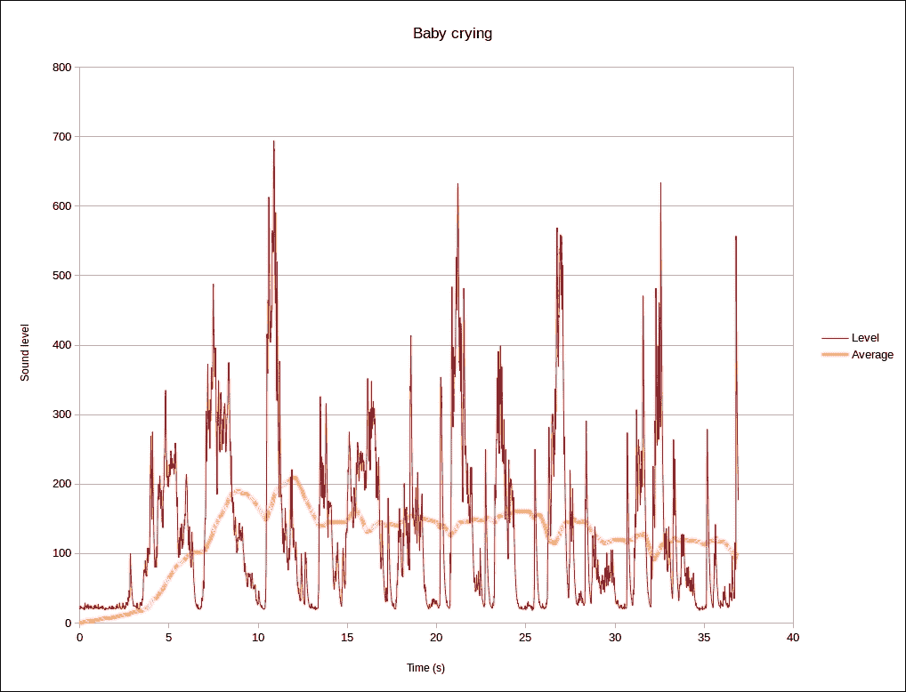

红色部分是原始音频信号，黄色部分则是当前时刻 5 秒窗口内该信号的平均值，也就是说，黄色信号是过去 5 秒内所有采集到的音频样本的平均值。

如前所述，采样时间*Ts*为*10ms*，这对于音频录制来说并不适用，但足以满足我们的需求。事实上，我们可以看到，通过使用黄色线表示的平均值，我们只需使用合适的阈值，就能检测到宝宝是否在哭泣。

关于呼吸，问题类似；事实上，我们可以假设，正常的睡眠呼吸频率大约在每分钟 12 到 16 次之间，也就是 0.26 Hz 到 0.2 Hz 的频率范围。然而，这次信号的平均水平没有用处，我们可以在一个合适的时间窗口内使用其幅度来替代。为了更好地解释这个概念，请看下面的截图：

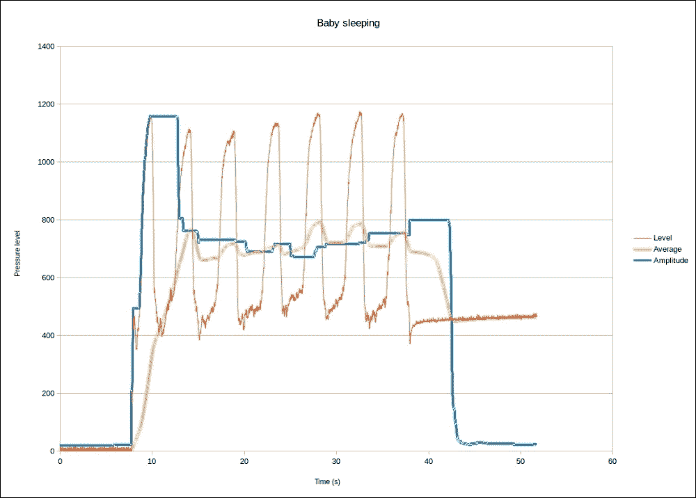

红色表示原始压力信号，而黄色表示该信号在当前时间之前 5 秒窗口内的平均值。如前所述，黄色信号仅是过去 5 秒内所有采集音频样本的平均值（采样时间仍为*Ts=10 ms*）。蓝色表示压力信号的幅度，它是通过计算所考虑时间窗口内最大值和最小值之间的差异得出的，即这次，我们每次都会计算过去 5 秒内采集音频样本的**最大值**（**Vmax**）和**最小值**（**Vmin**），并计算 Vmax 与 Vmin 之间的差值。

在前面图表的前 8 秒钟，输出接近 0，因为传感器上没有任何物体。然后，约在*T = 8*秒时，一个宝宝被放置到传感器上，传感器开始返回较高的值，正如预期的那样。在这种情况下，输入信号的平均值和幅度都增加，并且达到了（或多或少）一些稳定值。然而，重要的是要强调的是，当宝宝停止呼吸时（不用担心！在这个测试中没有宝宝停止呼吸！这只是一个模拟）。当宝宝停止呼吸时（大约发生在 T = **38**秒附近），压力传感器仍然探测到某些信号，且平均值和幅度都下降了；但最明显的变化是压力的幅度发生了最大的跳跃！正如你在上面的截图中看到的，当平均值从**700**降到**450**时，幅度从**700**降到**10**。

对于我们的原型，我们可以使用压力幅度来检测宝宝的呼吸，而使用压力平均值来检测是否有宝宝在场。用户应注意，平均值和幅度的计算可以通过使用如下所示的 C 函数同时进行：

```
void extract(int arr[], size_t n, int *avg, int *min, int *max)
{
        int i;
        float sum = 0;

        if (min)
                *min = 4096;
        if (max)
                *max = 0;
        for (i = 0; i < n; i++) {
                sum += ((float) arr[i]) / ((float) n);
                if (min)
                        *min = min(*min, arr[i]);
                if (max)
                        *max = max(*max, arr[i]);
        }
        *avg = (int) sum;
}
```

`extract()`函数获取包含压力数据的`arr`数组，并通过使用一个单一的`for`循环，可以并行执行这两个计算。

关于压力传感器，我们必须考虑到如果没有正确地将其放入一个具有特殊机制的盒子中，它无法正常工作，而该机制适用于检测呼吸。在下面的截图中，我展示了一个可能的这种盒子的实现：

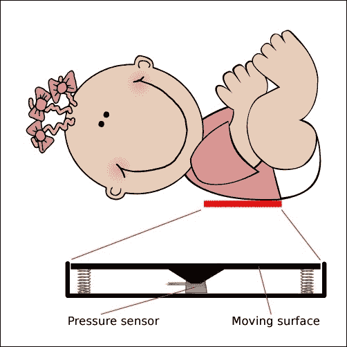

盒子应放在婴儿背部附近，注意确保上面的位置正确，以捕捉肺部的运动。盒子的顶部（移动表面）可以上下移动，得益于弹簧，它可以通过婴儿肺部运动时的压力感应器探测到压力，并通过针脚传递压力。

现在，最后需要处理的是用于测量体温的数字温度计。为此，我们可以使用普通的温度传感器，但由于我们讨论的是婴儿，我们希望使用非接触式温度传感器。这些特殊的传感器能够通过使用物体表面发出的红外线，并且这些红外线位于传感器的*视野范围*内，从而在不接触物体的情况下测量物体的温度。所以，当传感器前面没有物体时，我们可以检测到环境温度，但当靠近一个表面时，我们可以在不接触它的情况下检测该表面的温度！

以下截图展示了一个合适的区域，用于对准传感器以测量婴儿的体温：

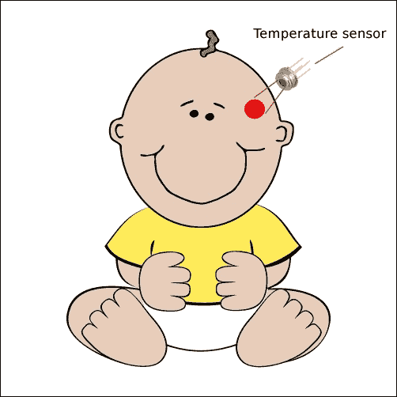

# 设置硬件

在这个项目中，我们将使用两个模拟传感器、一个数字传感器和一个小型 LCD 来实现一个简单的 GUI。模拟传感器连接到两个不同的 ADC，而数字传感器（即非接触式温度传感器）通过 I²C 总线与 BeagleBone Black 通信。最后，小型 LCD 通过 SPI 总线和一些 GPIO 连接到我们的 BeagleBone Black 板。

关于用来提醒父母的报警设备，我们可以使用普通的蜂鸣器，或者更先进的短信网关，甚至两者结合。但无论如何，这些设备的连接方式可以参考前面的章节，因此由于篇幅限制，本章不再添加相关内容。读者可以尝试自行实现硬件和软件作为练习。

## 设置非接触式温度传感器

本原型中使用的非接触式温度传感器如下面的截图所示：

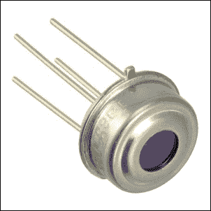

### 注意

这些设备可以从[`www.cosino.io/product/contactless-temperature-sensor`](http://www.cosino.io/product/contactless-temperature-sensor)购买，或者通过互联网查找。

该设备的用户手册可以在[`www.sparkfun.com/datasheets/Sensors/Temperature/SEN-09570-datasheet-3901090614M005.pdf`](https://www.sparkfun.com/datasheets/Sensors/Temperature/SEN-09570-datasheet-3901090614M005.pdf)找到。

这款设备非常有趣，因为它能够在不接触物体的情况下测量物体的温度！实际上，它是一个红外线温度计，具有 17 位分辨率，覆盖广泛的温度范围：环境温度为–40°C 至 85°C，物体温度为–70°C 至 382.2°C。

测量的值是传感器视野内所有物体的平均温度，因此显然我们可以用它来测量环境温度以及人体温度。只需将传感器靠近身体，结果就出来了！

该传感器的另一个重要特点是它是数字设备，也就是说，可以通过数字连接获取数据，这种连接对环境干扰免疫，甚至可以在（相对）较长的距离上使用。因此，我们可以考虑将其安装在手持设备上以实现更方便的使用。

这个设备使用的总线是 I²C 总线，所需的连接在下表中给出：

| 引脚 | 温度传感器引脚 |
| --- | --- |
| P9.4 - **VCC** | 3 - **VDD** |
| P9.17 - **SCL** | 1 - **SCL** |
| P9.18 - **SDA** | 2 - **SDA** |
| P9.2 - **GND** | 3 - **Vss** |

为了完整起见，设备的引脚映射显示在下图中：

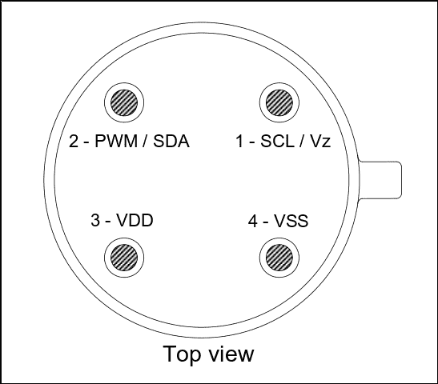

现在，如果一切连接正确，我们可以使用以下命令激活 I²C 总线：

```
root@beaglebone:~# echo BB-I2C1 > /sys/devices/bone_capemgr.9/slots

```

然后，通过使用`i2cdetect`命令，我们应该能看到类似以下的输出：

```
root@beaglebone:~# i2cdetect -y -r 2
 0  1  2  3  4  5  6  7  8  9  a  b  c  d  e  f
00:          -- -- -- -- -- -- -- -- -- -- -- -- --
10: -- -- -- -- -- -- -- -- -- -- -- -- -- -- -- --
20: -- -- -- -- -- -- -- -- -- -- -- -- -- -- -- --
30: -- -- -- -- -- -- -- -- -- -- -- -- -- -- -- --
40: -- -- -- -- -- -- -- -- -- -- -- -- -- -- -- --
50: -- -- -- -- -- -- -- -- -- -- 5a -- -- -- -- --
60: -- -- -- -- -- -- -- -- -- -- -- -- -- -- -- --
70: -- -- -- -- -- -- -- -- 

```

在这里，我们可以看到一个地址为`0x5a`的设备已做出响应。

### 提示

请注意，您可能会获得不同的地址。在这种情况下，所有后续命令必须相应地进行修改。

通过查看数据表，我们发现温度可以通过读取设备位置`0x07`来获取。因此，使用`i2cget`命令，我们可以执行以下操作：

```
root@beaglebone:~# i2cget -y 2 0x5a 0x07 wp
0x3bab

```

现在，可以通过将其转换为十进制后，再乘以 0.02，来将输出值转换为**摄氏度**（**°C**）。因此，我们可以使用以下命令：

```
root@beaglebone:~# echo "$(printf "ibase=16; %X\n" $(i2cget -y 2 0x5a 0x07 wp) | bc) * 0.02 - 273.15" | bc
32.11

```

为了更好地理解我们在前面的命令中所做的事情，下面我将通过一系列等效（且更易读）的命令来解释，从而展示如何通过使用`i2cget`从传感器获取数据，并将其存储到`v_hex`变量中：

```
v_hex=$(i2cget -y 2 0x5a 0x07 wp)
```

然后，我们使用`bc`命令将十六进制值转换为十进制，并将其存储在`v_dec`变量中，如下所示：

```
v_dec=$(printf "ibase=16; %X\n" $v_hex | bc)
```

最后，我们只需将`v_dec`变量中保存的十进制值乘以 0.02，就可以得到**开尔文温度**（**°K**）。然后，再减去 273.15 就能得到摄氏度（°C）：

```
echo "$v_dec * 0.02 - 273.15" | bc
```

现在，要测量体温，我们只需将传感器对准我们的头部，靠近太阳穴，并执行以下命令。我的输出如下：

```
root@beaglebone:~# echo "$(printf "ibase=16; %X\n" $(i2cget -y 2 0x5a 0x07 wp) | bc) * 0.02 - 273.15" | bc
34.97

```

太好了，我没有生病！

### 注意

读者可以参考《BeagleBone Essentials》一书，该书由本书的作者撰写，出版商为*Packt Publishing*，以获得更多关于如何激活和使用系统中可用的 I²C 总线的信息。

## 设置压力传感器

以下是压力传感器的示意图：

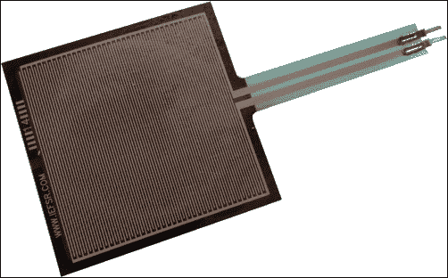

### 注意

这些设备可以从[`www.cosino.io/product/pressure-sensor`](http://www.cosino.io/product/pressure-sensor)购买，或者通过互联网搜索购买。

该设备的用户手册可在[`www.pololu.com/file/download/fsr_datasheet.pdf?file_id=0J383`](https://www.pololu.com/file/download/fsr_datasheet.pdf?file_id=0J383)获得。

该设备可以检测（并测量）作用在其表面上的力。简单来说，它可以通过变化其内部电阻来报告压力强度。从数据手册中可以看到，当没有施加力时，该电阻可能超过 1 MΩ，而当施加力时，则可能下降到几百欧姆。

通过记住 BeagleBone Black 的 ADC 输入必须限制在 1.8V，我们可以使用以下电路安全地读取此传感器的数据（请参阅第二章，*超声波停车助手*）：

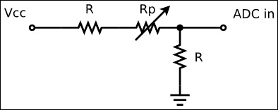

在上图中，*R=6.8 KΩ* 和 **Rp** 是压力传感器的内部电阻，它们由可变电阻表示。

### 提示

请注意，上述电路不仅将传感器连接到 BeagleBone Black 的 ADC 输入引脚，还防止该引脚的输入电压低于临界值 1.8V！V[ADCin]电压由以下公式给出：

*V[ADCin] = R / (R + Rp + R) * Vcc = R / (2R + Rp) * Vcc*

现在，我们知道*Vcc*是 3.3V，所以即使*Rp*值降到 0 Ω，*V[ADCin]*也等于 Vcc/2，即 1.65V，这是 BeagleBone Black 的 ADC 安全值。

该传感器必须连接到 BeagleBone Black 的*AIN1*输入引脚，该引脚标记为*P9.40*，另一端则必须连接到电阻 R，如前述电路图所示。

现在，为了检查所有连接，我们可以使用以下命令启用 BeagleBone Black 的 ADC：

```
root@beaglebone:~# echo cape-bone-iio > /sys/devices/bone_capemgr.9/slots

```

### 注意

可以通过使用书中的示例代码仓库中的`bin/load_firmware.sh`脚本来完成这些设置，具体如下：

```
root@beaglebone:~# ./load_firmware.sh adc
```

然后，我们可以使用以下命令读取传感器上的压力：

```
root@beaglebone:~# cat /sys/devices/ocp.3/helper.12/AIN1
2

```

上述值是因为传感器上没有任何物体；但是，如果我们只是尝试用手指触碰它，然后重新读取传感器，我们会得到以下结果：

```
root@beaglebone:~# cat /sys/devices/ocp.3/helper.12/AIN1
982

```

因此，传感器上的压力越高，返回的值也越高。

## 设置声音检测器

声音检测器与第五章中使用的相同，即*WhatsApp 洗衣房监控*，因此你可以查看同一章节中的*硬件设置*部分，了解如何设置和测试该设备。不过，为了完整性，关于它的一些基本信息再次提供，并且展示在下面的图像中：

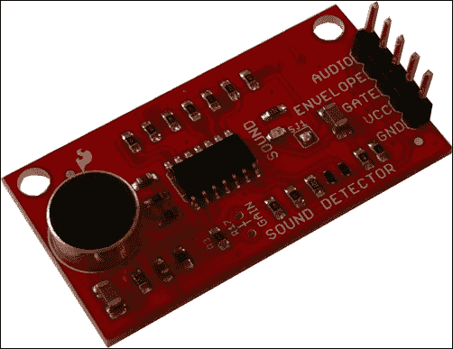

### 注意

这些设备可以从 [`www.cosino.io/product/sound-detector`](http://www.cosino.io/product/sound-detector) 购买，或通过互联网浏览获得。

该板基于放大器 LMV324，数据手册可在 [`dlnmh9ip6v2uc.cloudfront.net/datasheets/Sensors/Sound/LMV324.pdf`](http://dlnmh9ip6v2uc.cloudfront.net/datasheets/Sensors/Sound/LMV324.pdf) 上找到，板的原理图可在 [`dlnmh9ip6v2uc.cloudfront.net/datasheets/Sensors/Sound/sound-detector.pdf`](http://dlnmh9ip6v2uc.cloudfront.net/datasheets/Sensors/Sound/sound-detector.pdf) 上找到。

连接信息如下表所示：

| 引脚 | 声音传感器 |
| --- | --- |
| P9.4 - VCC | VCC |
| P9.39 - AIN0 | R @ENVELOPE |
| P9.3 - GND | GND |

### 提示

请记住，ADC 输入必须限制在 1.8V，因此我们必须将传感器的输出电压缩小两倍，正如前一章所述。

现在，要检查所有连接，我们可以使用以下命令：

```
root@beaglebone:~# cat /sys/devices/ocp.3/helper.12/AIN0
24

```

如果你在重新运行命令时试图发声，你应该会得到更高的值，如下所示：

```
root@beaglebone:~# cat /sys/devices/ocp.3/helper.12/AIN0
201

```

所以，环境声音越大，返回的值就越高。

## 连接微型 LCD

本章使用的微型 LCD 如下图所示：

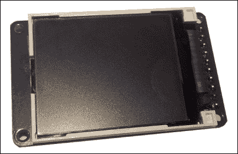

### 注意

该设备可以从 [`www.cosino.io/product/color-tft-lcd-1-8-160x128`](http://www.cosino.io/product/color-tft-lcd-1-8-160x128) 购买，或通过互联网浏览获取。

该 LCD 基于 ST7735R 芯片，数据手册可以在 [`www.adafruit.com/datasheets/ST7735R_V0.2.pdf`](https://www.adafruit.com/datasheets/ST7735R_V0.2.pdf) 上找到。

如前所述，要连接 LCD，我们必须使用 SPI 总线和 BeagleBone Black 扩展连接器中可用的一些 GPIO。下表显示了 BeagleBone Black 引脚与 LCD 引脚之间的电气连接：

| 引脚 | LCD 引脚 |
| --- | --- |
| P9.4 - Vcc | 9 - Vcc |
| P9.29 - MISO | 未连接 |
| P9.30 - MOSI | 4 - MOSI |
| P9.31 - SCLK | 3 - SCK |
| P9.28 - SS0 | 5 - TFT_CS |
| P9.25 | 7 - D/C |
| P9.27 | 8 - RESET |
| P8.19 | 1 - LITE |
| P9.2 - GND | 10 - GND |

要启用设备，我们可以使用一个驱动程序，该驱动程序应该已经在系统中可用。要验证它，只需使用以下命令：

```
root@beaglebone:~# zcat /proc/config.gz | grep -i st7735
CONFIG_FB_ST7735=y

```

在我的内核配置中，驱动程序是静态链接到内核中的，但将其作为模块也没问题。在这种情况下，输出应类似于以下输出：

```
CONFIG_FB_ST7735=m

```

检查驱动程序后，我们还需要一个合适的 DTS 文件来设置内核。为了避免从头开始编写，我通过 `wget` 命令从以下 URL 获取了一个合适的 DTS 文件：

```
root@beaglebone:~# wget https://raw.githubusercontent.com/beagleboard/devicetree-source/master/arch/arm/boot/dts/cape-bone-adafruit-lcd-00A0.dts

```

下载后，我们只需要使用以下命令编译前面的 DTS 文件：

```
root@beaglebone:~# dtc -O dtb -o /lib/firmware/cape-bone-lcd-00A0.dtbo -b 0 -@ cape-bone-adafruit-lcd-00A0.dts

```

现在，我们可以使用常规的 `echo` 命令启用 LCD：

```
root@beaglebone:~# echo cape-bone-lcd > /sys/devices/bone_capemgr.9/slots

```

### 提示

如果我们遇到以下错误，则需要禁用 HDMI 支持：

```
-bash: echo: write error: File exists

```

### 提示

这可以通过编辑 `/boot/uboot/uEnv.txt` 文件中的 u-boot 设置，然后启用以下行，方法是取消注释：

```
optargs=capemgr.disable_partno=BB-BONELT-HDMI,BB-BONELT-HDMIN
```

请注意，在某些 BeagleBone Black 版本中，`uEnv.txt` 文件可能位于 `/boot` 目录下，修改它的 u-boot 设置如下：

```
cape_disable=capemgr.disable_partno=BB-BONELT-HDMI,BB-BONELT-HDMIN
```

然后，我们只需重启系统。如果一切正确，我们应该能够无错误地执行前述命令。

如果一切正常，BeagleBone Black 应该启用一个彩色帧缓冲设备，宽度为 32 x 26 字符，并通过 **/dev/fb0** 设备在用户空间中表示。

### 注意

读者可以查看本书作者所写的《*BeagleBone Essentials*》，*Packt Publishing*，以获取更多关于如何激活和使用系统上可用的 SPI 总线、如何重新编译内核驱动程序以及 DTS 文件简要描述的信息。

最后，读者应记得，我们可以通过以下命令在 LCD 上打印字符串：

```
root@beaglebone:~# echo "Testing string" > /dev/tty0

```

这里，`/dev/tty0` 设备是连接到在 `/dev/fb0` 帧缓冲上运行的终端的设备。

## 最终图片

以下图片展示了我为实施这个项目并测试软件所制作的原型：

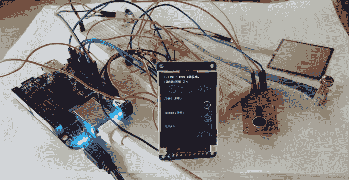

请注意，非接触式温度传感器已经通过平带电缆连接到板上，方便将其移动到不同的物体上进行温度测量。

# 设置软件

在这个项目中，我们将展示一个在两进程之间交换数据的简单方法。在本章开始时提到，ADC 必须以 100Hz 的频率进行采样，但我们并不需要这么快就能在外部 LCD 上呈现一个简单的界面。实际上，用户界面的合理更新频率可以是 1Hz（每秒一次）。因此，为了保持代码简洁，我们通过使用两个不同频率运行的进程来实现我们的设备，它们相互交换数据，而不是使用单一进程。

简单来说，如果我们实现一个名为 `adc` 的程序，它以 100Hz 的频率从 ADC 读取数据，并以 1Hz 的频率将输出打印到 `stdout` 流（标准输出），我们可以将此输出重定向到另一个名为 `lcd.sh` 的程序，它以 1Hz 的频率从 `stdin` 流（标准输入）读取数据，并相应地绘制用户界面。

数据流是单向的。程序 `adc` 从 ADC 读取数据，并在经过处理阶段后，将其输出发送到 `lcd.sh`，该程序管理 LCD。这个特殊的功能可以通过 Unix 的 *管道* 很好地表示，如下所示：

```
root@beaglebone:~# ./adc | ./lcd.sh

```

读者还应注意，接口的定时是由 `adc` 程序生成的，它只是以预定的间隔打印输出，没有任何其他定时机制，直接输出到 `lcd.sh` 程序。所以，让我们看看如何做到这一点。

## ADC 管理器

如前所述，要正确管理和分析 ADC 的输入信号，我们需要低 `jitter` 和细粒度的采样时间。已经提到，使用 *Ts=10 ms* 作为采样时间对于我们的目的足够了，那么让我们看看如何实现它！

在第五章《WhatsApp 洗衣房监视器》中，我们使用了一个简单的 Bash 脚本从 ADC 读取数据；但是对于那个原型，信号频率如此之低，以至于实现的解决方案非常可靠。现在，我们需要做一些更复杂的事情。这次，我们将使用 C 程序从 ADC 读取数据，如以下代码片段所示：

```
#define SYSFS_PRESSURE  "/sys/devices/ocp.3/helper.12/AIN1"
#define HZ              100
#define DELAY_US        (1000000 / HZ)

   /* Start sampling the ADC */
   while (1) {
      ret = clock_gettime(CLOCK_MONOTONIC_RAW, &t0);
      EXIT_ON(ret < 0);

      /* Read the ADC */
      fd = open(SYSFS_PRESSURE, O_RDONLY);
      EXIT_ON(fd < 0);
      ret = read(fd, ch, 5);
      EXIT_ON(ret < 1);
      close(fd);
      ret = sscanf(ch, "%d", &val);
      EXIT_ON(ret != 1);

      printf("%ld.%06ld %d\n", t0.tv_sec, t0.tv_nsec / 1000, val);

      /* Calculate the delay to sleep to the next period */
      ret = clock_gettime(CLOCK_MONOTONIC_RAW, &t);
      EXIT_ON(ret < 0);
      delay_us = DELAY_US - difftime_us(&t0, &t);
      EXIT_ON(delay_us < 0);
      usleep(delay_us);
   }
```

### 注意

完整代码可以在书籍示例代码库中的 `chapter_06/adc_simple.c` 文件中找到。

代码可以通过 `make` 命令直接在 BeagleBone Black 上编译。

代码的功能很简单。首先，我们使用 `clock_gettime()` 函数获取当前时间。然后，通过 `sysfs` 接口读取来自 ADC 的数据。最后，我们计算出在到达新的活动周期前需要休眠的时间。

运行前面的代码后，我们得到以下输出：

```
root@beaglebone:~/chapter_06# ./adc_simple
317330.142227 0
317330.153381 10
317330.163604 7
317330.174134 10
317330.184298 5
317330.194473 10
317330.204696 7
317330.214955 7
317330.225119 13
317330.235331 10
317330.245558 1
317330.255714 10
317330.265858 10
317330.276034 10
317330.286186 7
317330.296346 7
317330.306500 9
317330.316646 8
317330.326924 0
...

```

正如我们从前面的输出中看到的，程序相当精确；但是，如果我们使用一个简单的 `awk` 脚本来计算 1,000 个样本中的最小值、最大值和平均 `jitter` 值，我们会发现程序并不是那么精确：

```
root@beaglebone:~# ./adc_simple | awk -v T=0.01 -v N=1000 -f jitter.awk
avg=0.000255 min=0.000078 max=0.012252

```

### 注意

`awk` 脚本文件 `jitter.awk` 可以在书籍示例代码库中的 `chapter_06/jitter.awk` 文件中找到。

平均值和最小值是可以接受的，但最大值确实很高。此外，有时可能会发生以下情况：

```
root@beaglebone:~/chapter_06# ./adc_simple
319111.158747 0
319111.168981 8
319111.179131 9
319111.189269 10
319111.199439 10
319111.209586 11
…
319113.140526 0
adc_simple.c[  65]: main: fatal error in main() at line 65

```

当以下行中计算出的延迟变为负值时，会发生此错误：

```
        delay_us = DELAY_US - difftime_us(&t0, &t);
        EXIT_ON(delay_us < 0);
```

如果系统在周期开始时调度进程太慢，可能会发生我们没有足够的时间完成任务！这是因为我们没有使用实时系统，并且没有保证正确调度。

然而，我们可以尝试通过一些技巧来解决这个问题。Linux 内核并非实时系统，但它有一些可以帮助我们实现可接受折衷的功能。实际上，系统允许我们使用不同的调度器来管理 BeagleBone Black 上运行的进程。特别是，我们可以使用 `chrt` 命令来操作进程的实时调度属性，然后设置 **FIFO 调度器**，这可能有助于减少 `jitter` 值和调度延迟错误。如果我们使用 `chrt` 命令重新运行前面的测试，如下所示，我们将获得不同的结果：

```
root@beaglebone:~# chrt -f 99 ./adc_simple | awk -v T=0.01 -v N=1000 -f jitter.awk
avg=0.000102 min=0.000022 max=0.000781

```

此外，调度延迟错误消失了！

### 提示

请注意，即使使用 `chrt` 命令，Linux 内核仍然不是实时的，因此没有人能保证一切会永远顺利！为了使系统可靠，我们需要添加一些恢复代码，以防出现问题。

考虑到刚才所解释的，以下代码片段展示了可能的 ADC 管理器实现：

```
   /* Set stdout line buffered */
   setlinebuf(stdout);

   /* Do a dummy read to init the data buffers */
   c = read_adc(SYSFS_SOUND);
   for (snd_idx = 0; snd_idx < ARRAY_SIZE(snd); snd_idx++)
      snd[snd_idx] = c;
   c = read_adc(SYSFS_PRESSURE);
   for (prs_idx = 0; prs_idx < ARRAY_SIZE(prs); prs_idx++)
      prs[prs_idx] = c;

   /* Set FIFO scheduling */
   param.sched_priority = 99;
   ret = sched_setscheduler(getpid(), SCHED_FIFO, &param);
   EXIT_ON(ret < 0);

   /* Start sampling the ADC */
   snd_idx = prs_idx = 0;
   ret = clock_gettime(CLOCK_MONOTONIC_RAW, &t);
   EXIT_ON(ret < 0);
   while (1) {
      ret = clock_gettime(CLOCK_MONOTONIC_RAW, &t0);
      EXIT_ON(ret < 0);

      /* Read the data from the ADCs */
      snd[snd_idx] = read_adc(SYSFS_SOUND);
      prs[prs_idx] = read_adc(SYSFS_PRESSURE);

      /* Extract informations from buffered data */
      extract(snd, ARRAY_SIZE(snd), &snd_avg, NULL, NULL);
      extract(prs, ARRAY_SIZE(prs), &prs_avg, &prs_min, &prs_max);
      dbg("%ld.%06ld prs:%d min=%d max=%d snd:%d", t0.tv_sec, t0.tv_nsec / 1000, prs[prs_idx], prs_min, prs_max, snd[snd_idx]);

      /* We have to output the pressure data each second,
      * that is every HZ ticks.
      * Also we have to read the sound level...
      */
      if (ticks++ == 0)
         printf("%d %d %d\n", prs_avg, prs_max - prs_min, snd_avg);
         ticks %= HZ;

         /* Calculate the delay to sleep to the next period */
         ret = clock_gettime(CLOCK_MONOTONIC_RAW, &t);
         EXIT_ON(ret < 0);
         delay_us = DELAY_US - difftime_us(&t0, &t);
         EXIT_ON(delay_us < 0);
         usleep(delay_us);

         /* Move the index */
         prs_idx++;
         prs_idx %= ARRAY_SIZE(prs);
         snd_idx++;
         snd_idx %= ARRAY_SIZE(snd);
   }
```

### 注意

完整代码可以在书籍的示例代码库中的`chapter_06/adc.c`文件找到。

`setlinebuf()`函数用于强制在每一行输出时刷新，而`sched_setscheduler()`函数则用于启用 FIFO 调度器（就像`chrt`命令一样）。这段代码与之前的代码非常相似，唯一不同的是我们使用了`extract()`函数（在本章开头提到过）来计算输入数据的平均值、最小值和最大值。请注意，程序每秒打印一次输出，这要归功于`ticks`变量。

如果执行该程序，它将每秒打印几行，报告压力的平均值、压力信号的幅度以及声音的平均值，内容如下：

```
root@beaglebone:~# ./adc
0 16 20
0 19 21
1 21 21
2 22 23
3 22 23
4 22 24
...

```

所有这些数据都作为输入由`lcd.sh`进程获取，该进程将在下一节中描述。

### 注意

请注意，BeagleBone Black 的 ADC 具有连续模式功能，可以用来提高采样率，但由于该功能在所有内核中并非严格必要且并非所有内核都支持，因此我在这个项目中没有使用它。

好奇的读者可以通过[`processors.wiki.ti.com/index.php/AM335x_ADC_Driver's_Guide`](http://processors.wiki.ti.com/index.php/AM335x_ADC_Driver's_Guide)获取更多关于此主题的信息。

## LCD 管理器

管理 LCD 的程序是一个简单的 Bash 脚本，它使用一些技巧来实现对采集数据的精美渲染。

如前所述，该程序每秒运行一次，感谢 ADC 管理器定期将其输出发送到`lcd.sh`程序。该程序的简单功能可以通过以下元代码表示：

```
while true ; do
   wait_for_data_from_ADC
   render_data_to_LCD
done
```

就这些！其他复杂性仅与我们希望如何实现用户界面相关。

关于这个问题，我决定使用一个非常简单的解决方案：一些终端**转义序列**来管理颜色，以及`figlet`程序来*绘制*大字体。转义序列通过`echo`命令轻松地在屏幕上打印带有指定颜色的字符，示例如下：

```
root@beaglebone:~# echo -e "\e[31mRED TEXT\e[39m"
RED TEXT

```

`\e[31m`序列设置红色，而`\e[39m`序列将颜色重置为默认值。

### 注意

欲了解有关这些序列的更多信息，一个很好的起点是[`en.wikipedia.org/wiki/ANSI_escape_code`](https://en.wikipedia.org/wiki/ANSI_escape_code)。

`figlet`程序是一个可以在终端模拟打印大字体的工具，一种 ASCII 艺术。要安装它，可以使用以下命令：

```
root@beaglebone:~# aptitude install figlet

```

然后，使用方法非常简单，如以下示例所示：

```
root@beaglebone:~# figlet "simple string"
 _                 _            _        _ 
 ___(_)_ __ ___  _ __ | | ___   ___| |_ _ __(_)_ __   __ _
/ __| | '_ ` _ \| '_ \| |/ _ \ / __| __| '__| | '_ \ / _` |
\__ \ | | | | | | |_) | |  __/ \__ \ |_| |  | | | | | (_| |
|___/_|_| |_| |_| .__/|_|\___| |___/\__|_|  |_|_| |_|\__, |
 |_|                                  |___/

```

对于我们的用户界面实现，我使用了一些特殊的选项参数，由于篇幅限制，我不打算在这里解释，但有兴趣的读者可以查看`figlet`的 man 页面了解更多信息。

在这段简短的介绍之后，接下来是展示 `lcd.sh` 程序的主要代码片段：

```
# Ok, do the job
clear_scr

tick=1
while true ; do
   # Read the temperature from the sensor and convert it in C
   t=$(i2cget -y 2 0x5a 0x07 wp)
   t=$(hex2dec $t)
   t=$(echo "$t * 0.02 - 273.15" | bc)

   # Read the pressure and sound data from the " adc" tool
   read -u 0 v b s

   # Draw the GUI

   # Check for a minimum pressure, otherwise drop to 0 sound and
   # pressure data in order to not enable any alarm
   if [ $v -lt $PRS_AVG ] ; then
      s=0
      b=0
      enabled="false"
   else
      enabled="true"
   fi

   # Rewrite the screen
   goto_xy 0 0

   echo -en "[${CH_PULSE:$tick:1}] "
   echo -e "${FC_LIGHT_MAGENTA}BBB - BABY SENTINEL${FC_DEFAULT}\n"

   echo -en "TEMPERATURE (C):"
   if (( $(bc <<< "$t > 37.00") == 1 )) ; then
      echo -e "$FC_RED"
      t_alrm="true"
   else
      echo -e "$FC_GREEN"
      t_alrm="false"
   fi
   figlet -f small -W -r -w 32 "$t"
   echo -e "$FC_DEFAULT"

   echo -en "SOUND LEVEL:"
   if $enabled && [ $s -gt $SND_AVG ] ; then
      echo -e "$FC_RED"
      s_alrm="true"
   else
      echo -e "$FC_DEFAULT"
      s_alrm="false"
   fi
   figlet -f small -W -r -w 32 "$s"

   echo -en "BREATH LEVEL:"
   if $enabled && [ $b -lt $PRS_AMP ] ; then
      echo -e "$FC_RED"
      b_alrm="true"
   else
      echo -e "$FC_DEFAULT"
      b_alrm="false"
   fi
   figlet -f small -W -r -w 32 "$b"
   echo -en "${ES_CLEAR_LN}${FC_LIGHT_RED}ALARMS: ${FC_DEFAULT}"
   $t_alrm && echo -en "${BC_RED}TEMP. "
   $s_alrm && echo -en "${BC_RED}SOUND "
   $b_alrm && echo -en "${BC_RED}BREATH "
   echo -e "${BC_DEFAULT}"

   # Print some debugging messages if requested
   dbg "$(printf "t=%0.2f v=% 4d b=% 4d s=% 4d" $t $v $b $s)"
   dbg "PRS_AVG=$PRS_AVG PRS_AMP=$PRS_AMP SND_AVG=$SND_AVG"

   tick=$(( ($tick + 1) % ${#CH_PULSE} ))
done
```

### 注意

完整的代码可以在书籍示例代码库中的 `chapter_06/lcd.sh` 文件找到。

从 `while` 循环的开始到 `read` 语句，我们只是收集数据。然后，`Draw the GUI` 注释之后的代码只是为了渲染用户界面。请注意，带有 `read` 命令的那一行会等待直到来自 `stdin` 流的输入行到达，也就是来自 `adc` 程序的输入。

要通过 `SSH` 在我们主机系统的普通终端上测试它，并模拟 LCD，我们可以执行以下命令，将终端窗口的大小缩小为 32x26 个字符，这是 LCD 上终端的大小：

```
root@beaglebone:~# echo -e '\e8;26;32t'

```

### 提示

请注意，上面的命令只是另一个转义序列。

然后，我们可以按照如下方式执行程序：

```
root@beaglebone:~# ./adc | ./lcd.sh

```

输出如下面的截图所示：

![LCD 管理器

# 最终测试

为了测试原型，我使用了一些技巧来模拟婴儿：我在互联网上找到了哭声，并用音频播放器简单地播放出来。至于呼吸，我用一个娃娃，手动按压其胸部，配合我的呼吸。我承认这不是最好的测试方法，但我的孩子们太大了，无法帮我做这些实验！

要设置所有外设和驱动程序，我们可以使用 `SYSINIT.sh`，如以下命令所示：

```
root@beaglebone:~# ./SYSINIT.sh
done!

```

### 注意

这个命令可以在书籍示例代码库中的 `chapter_06/SYSINIT.sh` 文件找到。

然后，我使用以下命令行执行了 `adc` 和 `lcd.sh` 程序，以便将所有输出发送到运行在小型 LCD 上的终端：

```
root@beaglebone:~# ./adc | ./lcd.sh > /dev/tty0

```

### 提示

请注意，在第一个帧缓冲设备上，默认至少定义了一个终端，通过 `/dev/tty0` 设备引用它。

# 总结

在这一章中，我们发现了一种更可靠、更精确的方式来访问 BeagleBone Black 的 ADC，并学习了如何通过直接访问总线来访问 I²C 设备。这样做是为了能够管理压力传感器和无接触温度传感器。此外，我们还发现了如何通过 SPI 总线将一个小型 LCD 连接到我们的 BeagleBone Black 主板，以便添加一些用户界面。

在下一章中，我们将尝试实现一个植物监测器，来测量我们心爱的植物发生了什么！此外，我们还将发现如何定期拍摄一些照片，然后将其发布到 Facebook 账户上。
