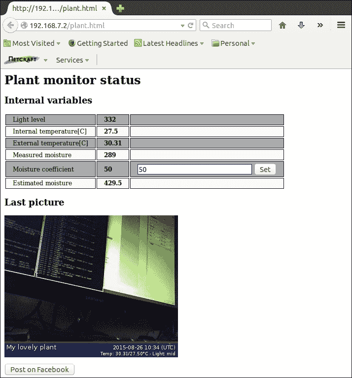

# 第七章：Facebook 植物监控

社交网络如今非常普遍，拥有一个与社交网络互动的监控（或控制）系统已成为必需，尤其对于消费系统来说。

在本章中，我们将学习如何实现一个植物监控器，能够测量太阳光、土壤湿度、土壤温度（包括内部和外部温度），并且通过网络摄像头在特定时间间隔拍摄照片。

用户可以通过 Web 界面控制监控器，并且可以决定是否将植物的照片发布到他们的 Facebook 时间线。

# 功能原理

在这个项目中，我将展示一个简单的植物监控系统实现，其中包含以下两个特殊功能：

+   第一个功能是能够根据专用传感器直接测量的湿度，以及通过植物所在花园花盆内外土壤温度差异来估算土壤湿度。这是因为湿度传感器的内部电阻可能会随温度变化；实际上，当阳光照射到土壤上，土壤温度升高时，电阻会发生变化，这种效应会导致出现错误的*干*读数。因此，我们使用两个不同的温度探头，以便判断土壤是否相对于内部土壤温度过热，从而调整湿度水平。

+   第二个功能是能够添加一个网络摄像头，在规定的时间间隔拍摄我们心爱的植物的照片，并根据用户的要求将这些照片发布到我们的 Facebook 时间线，向朋友们展示我们有多么的绿色大拇指！

以下是传感器位置的简单示意图，以便正确实现第一个功能：


假设 *Te* 是外部土壤温度，*Ti* 是内部土壤温度。如果我们将湿度传感器返回的值命名为 *M*，则可以通过以下公式给出湿度的合理估计值 (*Me*)：

*Me = M + K * (Te – Ti) 当 Te > Ti*

*Me = M 当 Te ≤ Ti*

其中 *K* 是一个合适的（且经验性的）*湿度系数*，用户可以在运行时设置，以满足他们的需求。请注意，如果 *K* 为 `0`，系统将直接采用测得的湿度水平，不进行任何补偿。

关于第二个功能，可以拍摄被监控植物的照片并将其发布到 Facebook。为了做到这一点，我们必须使用 Facebook API 来与 Facebook 帐户进行交互。这个步骤将在下一节中详细解释。

# 设置硬件

在本项目中，我们将使用两个模拟传感器、两个数字传感器和一个网络摄像头来拍照。模拟传感器连接到两个不同的 ADC 输入通道（如前一章所述）。非接触式外部温度传感器通过 I²C 总线与 BeagleBone Black 通信，而防水内部温度传感器使用 1-Wire 总线。最后，网络摄像头通过**USB** 总线连接。

如前一章所述，我可以添加一些执行器来给植物灌水等；但由于空间不足，我决定将这些任务留给读者作为练习。

## 连接湿度传感器

湿度传感器就是下图所示的设备：


### 注意

该设备可以从[`www.cosino.io/product/moisture-sensor`](http://www.cosino.io/product/moisture-sensor)购买，或者通过浏览互联网来获取。

该设备的用户指南可以在[`seeedstudio.com/wiki/Grove_-_Moisture_Sensor`](http://seeedstudio.com/wiki/Grove_-_Moisture_Sensor)获取。

该设备与第三章中的水传感器*水族馆监控*非常相似，因为它的工作原理仍然基于水的电导率；然而，由于我们关注的是土壤湿度水平，而非水的存在与否，其形状有所不同。

连接到 BeagleBone Black 的方式如下表所示：

| 引脚 | 电缆颜色 |
| --- | --- |
| P9.3 - Vcc | 红色 |
| P9.39 - AIN0 | 黄色 |
| P9.1 - GND | 黑色 |

使用万用表，我们可以验证当传感器处于空气中时输出电压接近 0V，当传感器处于水中时输出电压约为 1.5V，而其他所有输出值都保持在此范围内。

请注意，由于最大输出电压约为 1.5V，我们可以安全地将该设备的输出引脚直接连接到 BeagleBone Black 的 ADC 输入。然而，我们可以在*AIN0*引脚和 GND 之间使用一个 1.8V 的齐纳二极管，以确保输出电压不会超过 1.8V 的临界值。（记得前几章中多次提到过的这个问题，尤其是从第二章，*超声波停车助手*开始。）

现在，为了验证设备输出，我们可以通过以下命令启用 BeagleBone Black 的 ADC：

```
root@beaglebone:~# echo cape-bone-iio > /sys/devices/bone_capemgr.9/slots

```

### 注意

这些设置可以通过使用书中示例代码库中的`bin/load_firmware.sh`脚本来完成，如下所示：

```
root@beaglebone:~# ./load_firmware.sh adc
```

然后，我们可以将传感器放入水杯中读取水中的湿度水平，并执行以下命令：

```
root@beaglebone:~# cat /sys/devices/ocp.3/helper.12/AIN0
1745

```

然后，我们可以将传感器从水中取出，并重新运行以下命令来读取空气中的湿度水平：

```
root@beaglebone:~# cat /sys/devices/ocp.3/helper.12/AIN0
1

```

所以，湿度水平越高，返回的值也就越高。

## 连接光传感器

下图展示了一个环境光传感器：


### 注意

该设备可以从 [`www.cosino.io/product/photoresitor`](http://www.cosino.io/product/photoresitor) 购买，或者通过上网查找。

该设备的用户指南可以在 [`www.sparkfun.com/datasheets/Sensors/Imaging/SEN-09088-datasheet.pdf`](https://www.sparkfun.com/datasheets/Sensors/Imaging/SEN-09088-datasheet.pdf) 查阅。

该设备的功能与 第五章 中介绍的光传感器非常相似，*WhatsApp 洗衣房监控器*；然而，这是一个低功耗的单个光敏电阻，输出功能与 第六章 中介绍的压力传感器非常相似，*宝宝房间守卫*，因此，即使在这种情况下，我们也可以使用相同的电路进行管理，如下图所示：


在上面的示意图中，*R=6.8 KΩ*，**Rp** 是光传感器的内部电阻，由一个可调电阻表示。

### 小贴士

请注意，上面的电路不仅将传感器连接到 BeagleBone Black 的 ADC 输入引脚，还确保该引脚上的输入电压低于 1.8V 的临界值！实际上，V[ADCin] 电压由以下公式给出：

+   *V[ADCin]* *= R / (R + Rp + R) * Vcc = R / (2R + Rp) * Vcc*

现在我们知道 Vcc 为 3.3V，因此，即使 **Rp** 的值降到 0Ω，*V[ADCin]* 也等于 Vcc/2，即 1.65V，这是 BeagleBone Black 的 ADC 安全值。

该传感器必须连接到 BeagleBone Black 的 *AIN1* 输入引脚，该引脚标记为 *P9.40*，而另一端必须连接到电阻 R，如上面的电路图所示。

现在对于所有连接，我们可以使用以下命令：

```
root@beaglebone:~# cat /sys/devices/ocp.3/helper.12/AIN1
317

```

现在，正如我们在前几章中对其他光传感器所做的那样，我们可以用一个杯子将其覆盖，然后重新读取 ADC：

```
root@beaglebone:~# cat /sys/devices/ocp.3/helper.12/AIN1
15

```

另一方面，如果我们在传感器上方打开一盏灯，我们将得到以下结果：

```
root@beaglebone:~# cat /sys/devices/ocp.3/helper.12/AIN1
954

```

因此，环境光越亮，返回的数值越高。

## 设置非接触温度传感器

非接触温度传感器与 第六章 中使用的相同，*宝宝房间守卫*，因此你可以查看 *设置非接触温度传感器* 部分，了解如何设置和测试该设备；但是，为了完整性，以下再次提供一些基本信息：


### 注意

该设备可以从 [`www.cosino.io/product/contactless-temperature-sensor`](http://www.cosino.io/product/contactless-temperature-sensor) 购买，或者通过上网查找。

此设备的用户手册可在[`www.sparkfun.com/datasheets/Sensors/Temperature/SEN-09570-datasheet-3901090614M005.pdf`](https://www.sparkfun.com/datasheets/Sensors/Temperature/SEN-09570-datasheet-3901090614M005.pdf)中找到。

连接信息如下表所示：

| 引脚 | 温度传感器引脚 |
| --- | --- |
| P9.4 - Vcc | 3 - Vdd |
| P9.17 - SCL | 1 - SCL |
| P9.18 - SDA | 2 - SDA |
| P9.2 - GND | 3 - Vss |

现在，如果一切连接正确，我们可以使用以下命令激活 I²C 总线：

```
root@beaglebone:~# echo BB-I2C1 > /sys/devices/bone_capemgr.9/slots

```

温度可以通过读取设备位置`0x07`来获取，因此使用`i2cget`命令，我们可以执行如下操作：

```
root@beaglebone:~# i2cget -y 2 0x5a 0x07 wp
0x3bab

```

输出值必须通过乘以 0.02 并转换为十进制值后转化为摄氏度，因此我们可以使用以下命令：

```
root@beaglebone:~# echo "$(printf "ibase=16; %X\n" $(i2cget -y 2 0x5a 0x07 wp) | bc) * 0.02 - 273.15" | bc

```

## 设置防水温度传感器

关于内部温度传感器，我使用的是与第三章，*水族箱监控器*中使用的相同传感器，因此您可以查看*连接温度传感器*部分，了解如何设置和测试此设备；不过，为了完整起见，以下是一些基本信息：


### 注意

该设备可以从[`www.cosino.io/product/waterproof-temperature-sensor`](http://www.cosino.io/product/waterproof-temperature-sensor)购买，或者通过上网搜索找到。

该设备的数据手册可在[`datasheets.maximintegrated.com/en/ds/DS18B20.pdf`](http://datasheets.maximintegrated.com/en/ds/DS18B20.pdf)中找到。

连接信息如下表所示：

| 引脚 | 电缆颜色 |
| --- | --- |
| P9.4 - Vcc | 红色 |
| P8.11 - GPIO1_13 | 白色 |
| P9.2 - GND | 黑色 |

要启用它，我们必须通过以下命令将适当的 DTS 文件加载到内核中：

```
root@beaglebone:~# echo BB-W1-GPIO > /sys/devices/bone_capemgr.9/slots

```

### 注意

请参见第三章，*水族箱监控器*，了解如何获取 DTS 文件。

如果一切正常，我们应该在`/sys/bus/w1/devices/`目录下看到一个新的 1-Wire 设备，如下所示：

```
root@beaglebone:~# ls /sys/bus/w1/devices/
28-000004b541e9  w1_bus_master1

```

新的温度传感器由名为`28-000004b541e9`的目录表示，若要读取当前温度，我们可以使用`cat`命令访问`w1_slave`文件，如下所示：

```
root@beaglebone:~# cat /sys/bus/w1/devices/28-000004b541e9/w1_slave
d8 01 00 04 1f ff 08 10 1c : crc=1c YES
d8 01 00 04 1f ff 08 10 1c t=29500

```

在前面的示例中，当前温度为`t=29500`，表示为**毫度摄氏度**（**m°C**），因此它相当于 29.5°C。

### 提示

请注意，您的传感器有不同的 ID，因此，在您的系统中，您将得到不同的路径名称，形式为`/sys/bus/w1/devices/28-NNNNNNNNNNNN/w1_slave`。

## 设置摄像头

在第三章中，*水族馆监视器*，我解释了如何使用网络摄像头与 BeagleBone Black，你可以查看该章节来完成这项任务。然而，在那一章中，我要求使用基于 UVC 的网络摄像头（或至少是`mjpg-streamer`工具支持的其他摄像头）。但这次，你可以使用任何 Video4Linux 驱动类支持的摄像头。

### 注意

好奇的读者可以从`www.linuxtv.org/wiki/index.php/Main_Page`获取关于 Video4Linux 驱动程序的更多信息。

要知道我们的网络摄像头是否受 Video4Linux 系统支持，只需将其连接到 BeagleBone Black 的 USB 主机端口，然后检查是否添加了新的`/dev/video` **X**设备（其中**X**可以是 0、1、2 等）。

例如，在我的系统上，使用与第三章中相同的网络摄像头，*水族馆监视器*，我得到了以下输出：

```
root@beaglebone:~# ls -l /dev/video*
crw-rw---T 1 root video 81, 0 Jan  1  2000 /dev/video0

```

所以，我的网络摄像头由 Video4Linux 子系统支持，可以通过`fswebcam`程序来拍照。要安装该程序，可以使用以下命令：

```
root@beaglebone:~# aptitude install fswebcam

```

然后，我们可以通过以下命令拍摄简单的图片：

```
root@beaglebone:~# fswebcam webcam-shot.jpg
--- Opening /dev/video0...
Trying source module v4l2...
/dev/video0 opened.
No input was specified, using the first.
Adjusting resolution from 384x288 to 352x288.
--- Capturing frame...
Captured frame in 0.00 seconds.
--- Processing captured image...
Writing JPEG image to 'webcam-shot.jpg'.

```

### 提示

当执行`fswebcam`程序时，可能会收到以下消息：

```
--- Opening /dev/video0...
Trying source module v4l2...
/dev/video0 opened.
No input was specified, using the first.
Adjusting resolution from 384x288 to 352x288.
--- Capturing frame...
gd-jpeg: JPEG library reports unrecoverable error: Not a JPEG file: starts with 0x11 0x80
Captured frame in 0.00 seconds.
--- Processing captured image...
Writing JPEG image to 'webcam-shot.jpg'.
```

然后，当你尝试显示图片时，图片是黑色的。要解决这个问题，诀窍是使用`-S`选项参数跳过前几帧，如下所示：

```
root@beaglebone:~# fswebcam -S 10 webcam-shot.jpg

```

然而，这个程序真正有趣的地方在于可以在图片的不同位置添加文本。例如，通过以下命令，我们可以拍摄一张图片，在右下角显示文本`图片标题`，在左下角显示文本`信息文本`，并带有时间戳，使用更小的字体：

```
root@beaglebone:~# fswebcam --title "Picture's title" --info "Information text" --jpeg 85 webcam-shot.jpg
--- Opening /dev/video0...
Trying source module v4l2...
/dev/video0 opened.
No input was specified, using the first.
Adjusting resolution from 384x288 to 352x288.
--- Capturing frame...
Captured frame in 0.00 seconds.
--- Processing captured image...
Setting title "Picture's title".
Setting info text "Information text".
Setting output format to JPEG, quality 85
Writing JPEG image to 'webcam-shot.jpg'.

```

输出图片如下截图所示：


正如你所见，这是一个用来带有描述信息拍照的优秀软件！

## 添加水泵

由于我们知道地板上是否存在水，当检测到缺水时，我们还可以决定实施一个自动灌溉系统来为我们的植物浇水。一个可能的解决方案是使用水泵，就像在第三章中已经做过的那样。然后，我们可以通过使用 BeagleBone Black 的 GPIO 控制一个或多个继电器来控制几个水泵，但是，正如已经提到的，由于空间不足，我不打算在这里做这件事，因此，将此问题留给读者作为一个有用的练习。

## 最终图片

以下图片展示了我制作的原型，用于实施这个项目并测试软件：


这次连接非常简单。还要注意，所有传感器应该用长电缆连接到 BeagleBone Black，以便轻松放置在植物花盆中。

# 设置软件

这一次，我们监控（并可能控制）一个非常慢的系统（一个生长中的植物）。因此，使用一个简单的 Bash 脚本是非常合适的，而 Web 界面可以通过两个小的 HTML（带 JavaScript）和 PHP 脚本来实现。除了访问外围设备的难度外，真正的难点是使用 Facebook API 来访问一个账户。

关于监控循环和 Web 界面，有一个主要问题，即用于交换数据的**进程间通信**（**IPC**）系统。在第一章《危险气体传感器》中，我们主要使用了 MySQL 服务器来存储系统的数据和配置设置，但我们也利用它在构成系统的不同任务之间交换数据！然而，这一次，我们要存储的数据非常少，使用数据库可能非常昂贵。因此，我决定使用一种简单的方法来解决这个问题：我打算使用一个文件！是的，通过使用一个具有良好定义的内部结构和适当锁定功能的普通文件来序列化对其的访问，我们可以用极少的系统资源解决这个问题。这个解决方案将在后续部分详细解释。

## Facebook API

在[`developers.facebook.com/docs/reference/php/5.0.0`](https://developers.facebook.com/docs/reference/php/5.0.0)上，有一本用户手册，介绍了我用来访问 Facebook 账户的 PHP API。

### 注意

实际上，有不同的 API 可以访问 Facebook，关于这些 API 的更多信息，读者可以参考[`developers.facebook.com/docs/apis-and-sdks`](https://developers.facebook.com/docs/apis-and-sdks)。

阅读的内容很多，因此在接下来的部分，我列出了我安装和配置它时所遵循的所有步骤。

### 下载代码

首先，我们必须下载源代码。有两种方法可以做到这一点：通过**Composer**安装和手动安装。我决定使用手动安装方法，因为我的 BeagleBone Black 上没有 Composer 支持（而且我也不想为了这么一个简单的任务去安装它）。

### 注意

Composer 工具是一个 PHP 依赖管理工具；好奇的读者可以参考[`getcomposer.org/`](https://getcomposer.org/)以获取更多信息。

代码可以通过在主机 PC 上的浏览器中点击**Download the SDK for PHP v5.0**按钮，或者直接在 BeagleBone Black 上使用以下命令下载：

```
root@beaglebone:~# wget https://github.com/facebook/facebook-php-sdk-v4/archive/5.0-dev.zip

```

### 注意

该归档的副本可以在书籍示例代码仓库中的`chapter_07/5.0-dev.zip`文件中找到。

下载完成后，将归档文件放置在 BeagleBone Black 上（如果尚未存在），然后使用以下命令解压：

```
root@beaglebone
:~# unzip 5.0-dev.zip

```

### 提示

如果未安装，可以通过常用的`aptitude`命令获取`unzip`命令。

现在，要使用该 API，我们只需在所有脚本中使用以下两行：

```
define('FACEBOOK_SDK_V4_SRC_DIR', __DIR__ . '/facebook-php-sdk-v4-5.0-dev/src/Facebook/');
require_once __DIR__ . '/facebook-php-sdk-v4-5.0-dev/src/Facebook/autoload.php';
```

为了简化操作，我创建了一个名为`setup.php`的文件，在其中放入了这些行，这样我就可以在所有脚本中简单地包含它，如下所示：

```
require_once "setup.php";
```

### 注意

前面的文件可以在书籍示例代码库中的`chapter_07/setup.php`文件中找到。

### 创建新的 Facebook 应用

现在，我们需要一个新的应用来使用 API。事实上，所有对 Facebook 的访问都必须通过一个专用的应用程序进行，以下是创建新应用所需的步骤：

1.  访问 Facebook 开发者页面：[`developers.facebook.com/apps/?action=create`](https://developers.facebook.com/apps/?action=create)，然后点击**添加新应用**按钮。

1.  选择**网站**选项。

1.  为你的应用输入一个名称（我使用的是`BBB Plant Monitor`），然后点击**创建新的 Facebook 应用 ID**按钮。

1.  选择一个类别（我使用的是`娱乐`），然后点击**创建应用 ID**。

1.  在**站点 URL**中填写`http://localhost`，然后点击**下一步**。

    ### 提示

    请注意，为了能够按照前面的步骤操作，你需要一个预先存在的 Facebook 账户，否则系统会要求你先注册再继续。

你的应用现在已经创建。接下来，在**下一步**部分，点击**跳转到开发者仪表板**，然后应该出现如下截图所示的面板：


**应用 ID**默认是可见的，但**应用密钥**是隐藏的。点击**显示**，再次输入密码（如果系统要求），以显示**应用密钥**，然后复制并保留此信息。

现在，为了完成工作，点击**设置**，将`http://localhost`添加到**应用域名**中，将有效的电子邮件地址添加到**联系电子邮件**中，然后点击**保存更改**。

### 获取 Facebook 账户访问权限

现在我们的应用程序已经准备好，我们可以开始在其上尝试一些代码。然而，在上线之前，我们可以创建一个具有不同权限的`测试用户`账户，这样它就不会干扰我们的真实 Facebook 账户，以确保一切设置正确（在**角色**菜单下，然后是**测试用户**部分）。

以下截图显示了**测试用户**面板：


点击**编辑**按钮，并从显示的列表中选择**为此测试用户获取访问令牌**选项，接受默认设置，然后复制并保留该访问令牌。

现在是测试我们第一个脚本的时候了！以下是一个用于获取 Facebook 账户基本信息的简单脚本代码片段：

```
# Define the Facebook session
$fb = new Facebook\Facebook([
   'app_id'                  => APP_ID,
   'app_secret'              => APP_SECRET,
   'default_graph_version'   => 'v2.4',
   'default_access_token'    => DEF_TOKEN,
   'fileUpload'              => true,
   'cookie'                  => true,
]);

# Print user's information
try {
   $res = $fb->get('/me');
} catch(Exception $e) {
   err("error!\n");
   dbg("=========================================================================\n");
   dbg($e);
   dbg("=========================================================================\n");
   die();
}
$node = $res->getGraphObject();
info("name is \"%s\" (%s)\n",
   $node->getProperty('name'), $node->getProperty('id'));

# Print user's permissions
$res = $fb->get("/me/permissions");
$node = $res->getDecodedBody();
info("permissions are:\n");
foreach ($node['data'] as $perm)
   info("\t%s is %s\n", $perm['permission'], $perm['status']);
```

### 注意

完整代码可以在书籍示例代码库中的`chapter_07/get_info.php`文件中找到。

这个脚本非常简单。作为第一步，我们需要使用`Facebook\Facebook`类定义一个新的 Facebook 会话，其中`APP_ID`和`APP_SECRET`的值来自前面的应用信息，而`DEF_TOKEN`是之前生成的用户测试令牌。所有这些信息都存储在一个名为`config.php`的专用文件中，代码如下：

```
<?php

define('APP_ID', '000000000000000');
define('APP_SECRET', '00000000000000000000000000000000');
define('DEF_TOKEN', 'XXXXXXXXXXXXXXXXXXXXXXXXXXXXXXXXXXXXXXXX');

?>
```

### 提示

请注意，所有信息已被替换为零或`X`字符，因此您需要将其替换为自定义值。

然后，文件可以像前面的命令一样通过以下 PHP 命令加载：

```
require_once "config.php";
```

一旦创建了 Facebook 会话，我们可以通过使用`get()`方法并传入不同的参数来开始从中获取数据。例如，通过使用`/me`字符串，我们可以获取用户的姓名和 ID，而使用`/me/permissions`字符串，我们可以获取用户的权限。

### 注意

Facebook 的权限列表和解释可以在[`developers.facebook.com/docs/facebook-login/permissions/v2.2`](https://developers.facebook.com/docs/facebook-login/permissions/v2.2)查看。

一旦收集完成，用户的信息将显示如下：

```
root@beaglebone:~# ./get_info.php
get_info.php[  62]: name is "Open Graph Test User" (119617175051891)
get_info.php[  67]: permissions are:
get_info.php[  69]:    user_friends is granted
get_info.php[  69]:    publish_actions is granted
get_info.php[  69]:    public_profile is granted

```

API 正常，访问信息已经正确写入！现在，让我们看看如何在测试用户的时间线上发布一张图片。为了实现这个功能，我们必须使用`post()`方法，如下所示的代码片段：

```
# Define the Facebook session
$fb = new Facebook\Facebook([
   'app_id'                  => APP_ID,
   'app_secret'              => APP_SECRET,
   'default_graph_version'   => 'v2.4',
   'default_access_token'    => DEF_TOKEN,
   'fileUpload'              => true,
   'cookie'                  => true,
]);

# Print user's information
try {
   $res = $fb->get('/me');
} catch(Exception $e) {
   err("error!\n");
   dbg("=========================================================================\n");
   dbg($e);
   dbg("=========================================================================\n");
   die();
}
$node = $res->getGraphObject();
info("name is \"%s\" (%s)\n",
   $node->getProperty('name'), $node->getProperty('id'));

# Publish to user's timeline
try {
   $ret = $fb->post('/me/photos', array(
      'message'   => 'MyPlant message',
      'source'   => $fb->videoToUpload(realpath('web-cam-shot.jpg')),
   ));
} catch(Exception $e) {
   err("error!\n");
   dbg("=========================================================================\n");
   dbg($e);
   dbg("=========================================================================\n");
   die();
}

info("done\n");
```

在创建 Facebook 会话后，如前所述，我们必须调用`post()`方法，使用`/me/photos`字符串和适当的参数。特别是，您应该注意`videoToUpload()`方法，它用于指定要发布的图片。

现在，假设图片保存在`webcam-shot.jpg`文件中，我们可以使用以下命令进行发布：

```
root@beaglebone:~# ./post_pic.php
post_pic.php[  62]: name is "Open Graph Test User" (119617175051891)
post_pic.php[  78]: done

```

为了验证发布内容，我们可以通过选择**作为此测试用户登录**选项，使用之前生成的测试用户账户登录。以下截图显示了我在测试中得到的结果：


完成后，您必须从此测试账户登出，然后使用您的账户重新登录。

现在我们准备好了。在**您是否希望将此应用及其所有实时功能向公众开放？**部分点击**状态与审核**菜单，然后点击**是**。接着，我们需要一个 Facebook 配置文件的访问令牌，因此我们必须进入**工具与支持**顶端菜单，然后选择**Graph API Explorer**选项。在新页面中，点击**Graph API Explorer**下拉列表，然后选择我们的新应用**BBB Plant Monitor**。接着，点击**获取令牌**下拉列表，选择**获取访问令牌**。

在新窗口中，您可以添加任何权限；然而，我们只需要扩展权限`publish_actions`，因此请启用它，然后点击**获取访问令牌**按钮。

此时，应该会弹出一个授权窗口，如下图所示（抱歉，窗口中有非英文文本）：


然后，批准并选择新应用的受众（仅限你自己、只有你的朋友，或公开。别担心——这个设置可以稍后从你的个人资料设置中更改）。

现在，获取新的访问令牌并将其复制到`config.php`文件中，然后重新运行`get_info.php`脚本。如果一切正常，你应该看到类似下面的内容：

```
root@beaglebone:~# ./get_info.php
get_info.php[  62]: name is "Rodolfo Giometti" (10206138948545992)
get_info.php[  67]: permissions are:
get_info.php[  69]:    publish_actions is granted
get_info.php[  69]:    public_profile is granted

```

很好，现在我可以尝试通过使用`post_pic.php`脚本将一张图片发布到我的 Facebook 时间线，如下所示：

```
root@beaglebone:~# ./post_pic.php
post_pic.php[  62]: name is "Rodolfo Giometti" (10206138948545992)
post_pic.php[  78]: done

```

以下截图显示了我的 Facebook 时间线的一部分，包含了新的帖子：


好的，看起来似乎工作得不错！但是，有一个问题。如果你点击蓝色圆圈中的**i**（在新访问令牌的开始处），一个窗口会弹出，显示令牌的过期时间（也就是令牌将有效的时间），如你所见，这个时间非常短！通常只有 1 到 2 个小时。

参见以下截图作为示例：


为了增加这个时间，我们可以点击**在访问令牌工具中打开**按钮，然后点击**延长访问令牌**按钮请求一个扩展版。接着，将发布一个新的扩展令牌，如下图所示（注意，系统可能会要求你再次输入个人资料密码才能为你提供扩展令牌；如果是这样，请再次输入密码）：


新令牌现在有效期为 60 天。

不幸的是，我还没有找到合适的方式来自动化此过程，或者在当前令牌过期时更新令牌。当发生这种情况时，你需要重复此过程以获取一个新的有效令牌，然后相应地更新`config.php`文件。

### 提示

可能会遇到执行命令时出现错误的情况。在这种情况下，你可以通过使用`-d`选项参数启用调试信息，然后再次尝试执行命令，如下所示：

```
root@beaglebone:~# ./get_info.php -d
get_info.php[  54]: error!
get_info.php[  55]: ==========================================================================
get_info.php[  56]: exception 'Facebook\Exceptions\FacebookSDKException' with message 'SSL certificate problem: certificate is not yet valid' in /root/chapter_07/facebook-php-sdk-v4-5.0-dev/src/Facebook/HttpClients/FacebookCurlHttpClient.php:83
Stack trace:
#0 /root/chapter_07/facebook-php-sdk-v4-5.0-dev/src/Facebook/FacebookClient.php(216): Facebook\HttpClients\FacebookCurlHttpClient->send('https://graph.f...', 'GET', '', Array, 60)
#1 /root/chapter_07/facebook-php-sdk-v4-5.0-dev/src/Facebook/Facebook.php(504): Facebook\FacebookClient->sendRequest(Object(Facebook\FacebookRequest))
#2 /root/chapter_07/facebook-php-sdk-v4-5.0-dev/src/Facebook/Facebook.php(377): Facebook\Facebook->sendRequest('GET', '/me', Array, NULL, NULL, NULL)
#3 /root/chapter_07/get_info.php(52): Facebook\Facebook->get('/me')
#4 {main}get_info.php[  57]: ==========================================================================

```

这与 Facebook API 本身无关，而是与 SSL 证书的身份验证阶段有关。一个可能的解决方法是通过使用以下补丁实现的。然而，这会降低整个 API 的安全级别。请注意！

```
root@beaglebone# diff -u facebook-php-sdk-v4-5.0-dev/src/Facebook/HttpClients/FacebookCurlHttpClient.php.orig facebook-php-sdk-v4-5.0-dev/src/Facebook/HttpClients/FacebookCurlHttpClient.php
--- facebook-php-sdk-v4-5.0-dev/src/Facebook/HttpClients/FacebookCurlHttpClient.php.orig   2014-04-26 01:34:08.187500961 +0000
+++ facebook-php-sdk-v4-5.0-dev/src/Facebook/HttpClients/FacebookCurlHttpClient.php   2014-04-26 01:34:37.582032215 +0000
@@ -111,7 +111,7 @@
 CURLOPT_RETURNTRANSFER => true, // Follow 301 redirects
 CURLOPT_HEADER => true, // Enable header processing
 CURLOPT_SSL_VERIFYHOST => 2,
-            CURLOPT_SSL_VERIFYPEER => true,
+            CURLOPT_SSL_VERIFYPEER => false,
 CURLOPT_CAINFO => __DIR__ . '/certs/DigiCertHighAssuranceEVRootCA.pem',
 ];

```

## 监控循环

现在 Facebook API 已经正常运行，我们可以开始编写代码来实现我们的植物监控器。

如前所述，监控系统非常慢，因此使用 Bash 脚本可能是解决问题的最*快捷粗暴*方法。实际上，我们只需要从所有已安装的传感器读取植物数据，然后执行一些简单的操作。最困难的部分是创建一个包含所有测量数据的状态文件，该文件将与网页接口进行交换（有关这一部分，请参见下一节）。

监控循环位于书中的示例代码仓库中的`chapter_07/plant_mon.sh`文件中，相关代码显示如下：

```
function daemon_body () {
   # Read plant data and take the first picture
   read_sensors
   next_date=$(do_picture)

   # The main loop
   dbg "start main loop"
   while sleep 1 ; do
      # Read plant data from all sensors
      read_sensors

      ( # Wait for lock on LOCK_FILE (fd 99) for 10 seconds
      flock -w 10 -x 99 || exit 1

      # Read the user parameters
      cff_mois=$(cat $STATUS_FILE | json_decode cff_mois)
      [ -z "$cff_mois" ] && cff_mois=1
      dbg "cff_mois=$cff_mois"

      # Compute the moisture level
      est_mois=$msr_mois
      if (( $(bc <<< "$int_temp < $ext_temp") == 1 )) ; then
         est_mois=$(bc -l <<< "$msr_mois + $cff_mois * ( $ext_temp - $int_temp )")
         fi
         dbg "est_mois=$est_mois"

         # Write back the plant parameters
         json_encode lig_levl $lig_levl \
            int_temp $int_temp \
            ext_temp $ext_temp \
            msr_mois $msr_mois \
            cff_mois $cff_mois \
            est_mois $est_mois > $STATUS_FILE

         # Release the lock
         ) 99>$LOCK_FILE

         # Have to take a new picture?
         [ $(date "+%H%M") == "$next_date" ] && next_date=$(do_picture)
     done
}
```

如你所见，执行时有三个主要步骤：

1.  从所有传感器读取植物数据。

1.  通过管理由`STATUS_FILE`变量指向的文件来交换数据。

1.  根据用户输入拍摄新照片。

第一步通过`read_sensors`函数实现，代码如下：

```
function read_sensors ( ) {
   lig_levl=$(adc_read $LIGHT_DEV)
   int_temp=$(w1_read $INT_TEMP_DEV)
   ext_temp=$(i2c_read $EXT_TEMP_DEV)
   msr_mois=$(adc_read $MOISTURE_DEV)
   dbg "lig_levl=$lig_levl int_temp=$int_temp ext_temp=$ext_temp msr_mois=$msr_mois"
   dbg "curr_date=$(date "+%H%M") next_date=$next_date"
}
```

最后一步由`do_picture`函数实现，代码如下：

```
function do_picture ( ) {
   # Compute the light level
   ll="mid"
   [ $lig_levl -le $LIGHT_LOW ] && ll="low"
   [ $lig_levl -ge $LIGHT_HIGH ] && ll="high"

   # Take the picture
   fswebcam -q --title "My lovely plant" \
      --info "Temp: $ext_temp/$int_temp°C - Light: $ll" \
      --jpeg 85 $IMG_FILE

   # Compute the next picture time
   date -d "now +$1 minutes" "+%H%M"
}
```

第二个操作需要一些解释。如前所述，我们必须将植物的数据发送到网页接口。从网页接口中，我们需要读取一个输入值（湿度系数）。为了做到这一点，我决定使用普通文件，因为所有操作执行得非常慢。

使用文件交换数据的唯一困难在于我们必须确保对该文件具有独占访问权限。为此，我们可以使用`flock()`系统调用向系统请求对文件的独占访问，从而排除并发读取或写入操作。

要在 Bash 脚本中使用`flock()`，我们有`flock`命令，当它在 shell 脚本中使用时，必须按照`flock`的 man 页面中的建议进行使用。代码如下：

```
   (
      flock -n 9 || exit 1
      # ... commands executed under lock ...
   ) 9>/var/lock/mylockfile
```

### 提示

请参阅`man flock`命令获取更多信息。

获取锁后，我们可以开始读取文件。该文件以 JSON 格式保存系统状态，因为文件内容必须与一个 PHP 应用共享，而该应用具有预定义的函数来管理此格式。因此，首先我们通过`json_decode`函数读取用户输入，然后使用本章开始时描述的公式计算预估的湿度水平，最后，使用`json_encode`函数将状态文件以 JSON 格式写回。

要执行程序并启用所有调试信息，我们可以使用以下命令行：

```
root@beaglebone:~# ./plant_mon.sh -d -l -f -k 1
plant_mon.sh: min=1
plant_mon.sh: signals traps installed
plant_mon.sh: lig_levl=295 int_temp=29.50 ext_temp=31.01 msr_mois=0
plant_mon.sh: curr_date=1109 next_date=
plant_mon.sh: start main loop
plant_mon.sh: lig_levl=304 int_temp=29.50 ext_temp=31.11 msr_mois=0
plant_mon.sh: curr_date=1109 next_date=1110
plant_mon.sh: cff_mois=50
plant_mon.sh: est_mois=80.50
...

```

然后，可以通过按下*CTRL* + *C*键停止程序。

### 提示

请记得修改定义`INT_TEMP_DEV`变量的那一行，该变量存储了 1-Wire 温度传感器的 ID，根据你传感器的 ID 进行修改，否则在执行程序时会出现读取错误。

请注意，作为第一步，程序读取所有传感器的数据，然后拍照，以便网页接口获取它所需要的任何内容，以便向用户显示当前系统状态，具体细节见下一节。

## 网页接口

这一次，我将使用 HTML、PHP 和 JavaScript 语言实现一个简单的网页界面。我想实现的功能非常简单，允许用户查看植物的数据以及系统中存储的植物最后一张图片。然后，用户应该能够将这张图片发布到 Facebook 时间线上。

网页界面的核心在书中示例代码库的 `chapter_07/plant.html` 文件中，相关代码显示在下面的代码片段中：

```
<body>
 <h1>Plant monitor status</h1>

 <h2>Internal variables</h2>

 <table class="status">
  <tr class="d0">
    <td>Light level</td>
    <td><b id="lig_levl">0</b></td>
    <td></td>
  </tr>
  <tr class="d1">
    <td>Internal temperature[C]</td>
    <td><b id="int_temp">0</b></td>
    <td></td>
  </tr>
  <tr class="d0">
    <td>External temperature[C]</td>
    <td><b id="ext_temp">0</b></td>
    <td></td>
  </tr>
  <tr class="d1">
    <td>Measured moisture</td>
    <td><b id="msr_mois">0</b></td>
    <td></td>
  </tr>
  <tr class="d0">
    <td>Moisture coefficient</td>
    <td><b id="cff_mois">0</b></td>
    <td><input id="val_cff_mois" name="val_cff_mois" class="set-inputbox">
     <button id="set_cff_mois" class="set-button">Set</button>
    </td>
  </tr>
  <tr class="d1">
    <td>Estimated moisture</td>
    <td><b id="est_mois">0</b></td>
    <td></td>
  </tr>
 </table>

 <h2>Last picture</h2>

 

 <p><button id="post_pic" class="do-button">Post on Facebook</button></p>

</body>
```

如你所见，这里有一个简单的表格，所有数据都在其中报告，用户可以通过 **设置** 按钮更改湿度系数。然后，植物的图片显示在底部，并带有 **在 Facebook 上发布** 按钮，允许用户将当前图片发布到 Facebook。

**设置** 按钮由以下 JavaScript 代码管理，该代码包含在 `plant.html` 文件中：

```
<script>
 $(function() {
  $('button[class="set-button"]').click(function() {
   var id = $(this).attr("id");
   var box = document.getElementById(id.replace('set_', 'val_'));

   $.ajax({
    url: "/handler.php",
    type: "POST",
    data: "set=" + id.replace('set_', '') + "&val=" + box.value,      success: function() {
      console.log('set POST success');
     },
     error: function() {
      console.log('set POST error');
     }
   });
  });
 });
</script>
```

因此，每次按下按钮时，我们都会生成一个 `POST` 请求，并携带用户输入的值。

类似地，**在 Facebook 上发布** 按钮由以下代码管理：

```
    <script>
      $(function() {
        $('button[class="do-button"]').click(function() {
          var id = $(this).attr("id");

          $.ajax({
            url: "/handler.php",
            type: "POST",
            data: "do=" + id,
            success: function() {
              console.log('do POST success');
            },
            error: function() {
              console.log('do POST error');
            }
          });
        });
      });
    </script>
```

在这种情况下，我们生成另一个`POST`请求，但使用不同的参数。

另一方面，以下 JavaScript 代码用于两个主要任务：

```
    <script>
      var polldata = function() {
        $.getJSON('/handler.php', function(data) {
          $.each(data, function(key, val) {
            var e = document.getElementById(key);

            if (e != null) {
              if (e.type == "text")
                e.value = val;
              else
                e.textContent = val;
            }
          });
        });

        var url = '/webcam-shot.jpg';
        var d = new Date();
        $('#webcam_shot').attr('src', url + '?d=' + d.getTime());
      };

      setInterval(polldata, 1000);
    </script>
```

第一个任务是请求并更新网页上的植物数据，第二个任务是更新植物的图像。

### 提示

请注意，我们使用了一种技巧来强制浏览器刷新植物的图片：

```
        var url = '/webcam-shot.jpg';
        var d = new Date();
        $('#webcam_shot').attr('src', url + '?d=' + d.getTime());
```

在这里，我为图片的属性附加了当前日期的参数，以强制浏览器更新图片。

从前面的代码来看，读者可以注意到，当 PHP 文件执行时，`handler.php` 脚本也会依次执行。`handler.php` 文件管理服务器端的数据，下面的代码片段展示了其相关代码：

```
#
# Ok, do the job
#

# Check the POST requests
if (isset($_POST["val"]))
   $new_cff_mois = floatval($_POST["val"]);
else if (isset($_POST["do"]))
   do_post();

# Wait for lock on /tmp/plant.lock
$lock = file_lock(LOCK_FILE);
if (!$lock)
   die();

# Read the status file and decode it
$ret = file_get_contents(STATUS_FILE);
if ($ret === false)
   die();
$data = json_decode($ret, true);

# Use the stored value reset to a specific defualt
if (isset($new_cff_mois))
   $data['cff_mois'] = $new_cff_mois;

# Write back the new status (if needed)
$status = json_encode($data);
if (isset($new_cff_mois)) {
   $ret = file_put_contents(STATUS_FILE, $status);
   if ($ret === false)
      die();
}

# Release the lock
file_unlock($lock);

# Encode data for JSON
echo $status;
```

### 注意

完整代码可以在书中示例代码库中的 `chapter_07/handler.php` 文件中找到。

在第一步中，我们检查是否有任何 `POST` 请求，如果有，则处理它们。在第一种情况下，我们更新湿度系数；而在第二种情况下，我们调用下文解释的 `do_post()` 函数，将植物的图片发布到 Facebook。

然后，我们必须使用 `flock()` 系统调用来读取（并最终更新）系统的状态文件。在 PHP 中，文件锁由 `flock()` 函数管理，如下所示，用于获取和释放文件的锁：

```
function file_lock($name)
{
   $f = fopen($name, 'w');
   if ($f === false)
      return false;

   $ret = flock($f, LOCK_EX);
   if ($ret === false)
      return false;

   return $f;
}

function file_unlock($f)
{
   flock($f, LOCK_UN);
   fclose($f);
}
```

最后的操作是将植物的数据以适合调用的 JavaScript 的 JSON 格式返回给浏览器。

好的，现在我们要展示最后一项内容，即 `do_post()` 函数：

```
function do_post()
{
   # Define the Facebook session
   $fb = new Facebook\Facebook([
      'app_id'                => APP_ID,
      'app_secret'            => APP_SECRET,
      'default_graph_version' => 'v2.4',
      'default_access_token'  => DEF_TOKEN,
      'fileUpload'            => true,
      'cookie'                => true,
   ]);

   # Publish to user's timeline
   $ret = $fb->post('/me/photos', array(
      'message'    => 'My lovely plant!',
      'source'     => $fb->videoToUpload(realpath('webcam-shot.jpg')),
   ));
}
```

该功能简单地执行与前面展示的 `post_pic.php` 脚本相同的步骤，以便将植物的图片发布到用户的 Facebook 时间线。

# 最终测试

为了测试原型，我首先执行了书中示例代码库中的 `chapter_07/SYSINIT.sh` 文件来设置所有外设：

```
root@beaglebone:~# ./SYSINIT.sh
done!

```

现在，在检查了 Web 服务器是否运行之后，我启动了 `plant_mon.sh` 植物监控脚本，并启用了所有调试信息：

```
root@beaglebone:~# root@beaglebone:~/chapter_07# ./plant_mon.sh -d -l -f
plant_mon.sh: min=10
plant_mon.sh: signals traps installed
plant_mon.sh: lig_levl=442 int_temp=29.50 ext_temp=29.91 msr_mois=0
plant_mon.sh: curr_date=0010 next_date=
plant_mon.sh: start main loop
plant_mon.sh: lig_levl=428 int_temp=29.50 ext_temp=29.25 msr_mois=0
plant_mon.sh: curr_date=0010 next_date=0011
plant_mon.sh: cff_mois=50
plant_mon.sh: est_mois=221
plant_mon.sh: lig_levl=423 int_temp=29.50 ext_temp=27.99 msr_mois=0
plant_mon.sh: curr_date=0010 next_date=0011
plant_mon.sh: cff_mois=50
plant_mon.sh: est_mois=220
...

```

然后，我设置了 Web 服务器的根目录以实现 Web 界面。在我的 BeagleBone Black 上，Web 服务器的根目录是 `/var/www/`，但根据系统设置可能会有所不同。

### 注意

读者可以阅读由本书作者编写的《*BeagleBone Essentials*》，*Packt Publishing*，以获取更多关于如何在 BeagleBone Black 上设置 Web 服务器的信息。

如果您的配置与我的相同，并且 `plant_mon.sh` 脚本正在运行，那么您的 `/var/www/` 目录应该如下所示：

```
root@beaglebone:~# ls /var/www/
plant.lock  plant.status  webcam-shot.jpg

```

这些文件是由监控脚本创建的，分别是锁文件、系统状态文件和最后拍摄的图片。除了这些文件之外，您还需要 Facebook API（因此我们需要在此解压其源代码，如前所述）和配置文件 `config.php` 和 `setup.php`。

然后，我们需要添加 `plant.html`、`plant.css` 和 `handler.php` 文件，以及 `jquery-1.9.1.js` 文件，该文件可以通过在主机 PC 上的浏览器或直接在 BeagleBone Black 上使用以下命令行从 [`code.jquery.com/jquery/`](https://code.jquery.com/jquery/) 下载：

```
root@beaglebone:# wget --no-check-certificate https://code.jquery.com/jquery-1.9.1.js

```

然后，我们必须确保所有文件都归系统用户 `www-user` 所有，以便 Web 服务器可以不出问题地读写它们。为此，我们可以使用以下命令：

```
root@beaglebone:# cd /var/www && chown -R www-data:www-data *

```

如果一切顺利，您的 Web 服务器根目录应该如下所示：

```
root@beaglebone:/var/www# ls -l
total 308
-rw-r--r-- 1 www-data www-data    344 Aug 19  2015 config.php
drwxr-xr-x 5 www-data www-data   4096 Aug 18  2015 facebook-php-sdk-v4-5.0-dev
-rw-r--r-- 1 www-data www-data   1846 Aug 26  2015 handler.php
-rw-r--r-- 1 www-data www-data 268381 Oct 24  2014 jquery-1.9.1.js
-rw-r--r-- 1 www-data www-data   2968 Aug 26  2015 plant.html
-rw-rw-rw- 1 www-data www-data      0 Apr 26 01:17 plant.lock
-rw-rw-rw- 1 www-data www-data     95 Apr 26 01:17 plant.status
-rw-r--r-- 1 www-data www-data    183 Aug 24  2015 setup.php
-rw-r--r-- 1 www-data www-data  17583 Apr 26 01:17 webcam-shot.jpg

```

现在，一切应该就绪，所以在我的主机 PC 上，我通过 USB 电缆将浏览器指向 BeagleBone Black 在模拟以太网线上的 IP 地址，以显示 Web 界面。以下是我的测试截图：



请注意，通过智能手机或平板电脑也可以获得类似的结果。事实上，如果我将 BeagleBone Black 连接到我的局域网，然后将智能手机的浏览器指向 BeagleBone Black 的 IP 地址，我会看到以下截图所示的内容：


### 提示

请记住，USB 模拟以太网的 IP 地址通常是 `192.168.7.2`，而当 BeagleBone Black 连接到您的局域网时，它的 IP 地址可能会根据您的局域网设置而有所不同。可以通过在 BeagleBone Black 的终端上使用 `ifconfig eth0` 命令来获取。

# 总结

这次，我们使用了多个传感器来获取关于我们可爱植物的重要数据。然后，我们还发现了一种通过使用普通文件在进程之间交换数据的简单方法。我们学会了如何使用 Facebook PHP API，通过一个简单的脚本在用户的时间线上发布内容。

在下一章中，我们将尝试实现一个入侵报警系统，配备运动检测传感器，当触发报警时，系统将开始拍摄入侵者的照片，并将其发送到用户的电子邮件地址。
