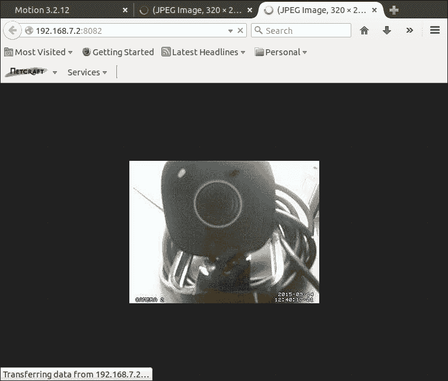

# 第八章. 入侵检测系统

如今，入侵检测系统非常常见，但确实价格昂贵。在本章中，我将展示如何使用我们的 BeagleBone Black 和两台（或更多）摄像头实现一个廉价且质量合理的入侵检测系统。

系统将能够通过发送带有入侵者照片的电子邮件来提醒用户。

# 基本功能

如前所述，我们将通过 USB 总线将两台摄像头连接到 BeagleBone Black。然后，我们将安装并运行一个特殊的运动检测软件，该软件能够检测动态场景中的运动。当程序检测到运动时，它会拍摄一张或多张运动物体的照片，并通过电子邮件将照片发送到用户账户。

# 设置硬件

这次连接非常简单，因为它们只是通过几根 USB 电缆连接完成的。

在前几章中，我们已经看到如何设置摄像头（例如，请参见第三章中的 *水族馆监控*）；但这次，由于我们同时使用两台摄像头，因此配置有所不同。

如读者所知，BeagleBone Black 板只有一个 USB 主机端口，因此要连接两个摄像头，我们需要一个 USB 集线器。这些设备（用于将多个设备连接到 USB 主机端口）非常常见，读者可以在互联网上随处找到它们。

### 小贴士

理论上，集线器端口越多，我们可以在系统中使用的摄像头就越多！但当然，由于每个摄像头都会给系统增加 CPU 负载，因此可用的摄像头数量是有最大限制的。

使用带有三个端口的 **USB 集线器**的系统简单示意图如下所示：


## 设置摄像头

对于我的原型，我使用了两台通用摄像头，它们由 **Video4Linux** 驱动类支持，正如在第三章中所解释的，*水族馆监控*，并通过 **USB 集线器** 连接，如下图所示。然而，您可以使用您首选的设备，因为这是一种非常常见的设备。


### 注意

好奇的读者可以在 [`en.wikipedia.org/wiki/USB_hub`](https://en.wikipedia.org/wiki/USB_hub) 获取有关 USB 集线器驱动程序的更多信息。

要验证所有设备是否正确连接并且得到支持，您需要按前一节图示所示连接摄像头。然后，您应该能得到类似于我系统输出的结果，如下所示：

```
root@beaglebone:~# ls -l /dev/video*
crw-rw---T 1 root video 81, 0 Jan  1  2000 /dev/video0
crw-rw---T 1 root video 81, 1 Jan  1  2000 /dev/video1

```

### 小贴士

请注意，您必须为集线器使用外部电源，否则您的 BeagleBone Black 将无法提供足够的电流来同时管理这两台摄像头。

好的，现在我们可以验证网络摄像头是否正确管理，方法与前一章使用`fswebcam`程序的方式相同。不过，这次我们必须指定使用哪一台网络摄像头来拍摄简单的图片给`fswebcam`程序。这个技巧可以通过使用`-d`选项参数来完成，如以下命令行所示：

```
root@beaglebone:~# fswebcam -d /dev/video0 video0-shot.jpg
--- Opening /dev/video0...
Trying source module v4l2...
/dev/video0 opened.
No input was specified, using the first.
Adjusting resolution from 384x288 to 352x288.
--- Capturing frame...
Captured frame in 0.00 seconds.
--- Processing captured image...
Writing JPEG image to 'video0-shot.jpg'.

```

### 提示

正如在第三章中提到的，*水族馆监控*，如果你得到一个完全空白的图像并伴随如下信息，你可以通过在命令行中添加`-S`选项参数来解决该问题：

```
root@beaglebone:~# fswebcam -d /dev/video0 -S 10 webcam-shot.jpg

```

然后，为了从另一台网络摄像头拍照，我们可以使用以下命令行：

```
root@beaglebone:~# fswebcam -d /dev/video1 video1-shot.jpg
--- Opening /dev/video1...
Trying source module v4l2...
/dev/video1 opened.
No input was specified, using the first.
Adjusting resolution from 384x288 to 320x240.
--- Capturing frame...
Captured frame in 0.00 seconds.
--- Processing captured image...
Writing JPEG image to 'video1-shot.jpg'.

```

以下两张截图展示了来自两台对面放置的网络摄像头的两张照片，即第一台网络摄像头拍到第二台的图像，反之亦然。


## 最终图片

以下截图展示了我用来实现这个项目和测试软件的所有设备：


这里没有什么特别需要强调的；所有连接只是非常简单的 USB 连接。不过，我想强调的是，我为 BeagleBone Black 板和 USB 集线器都使用了外部电源，以避免由于网络摄像头的高功耗导致的电力损失。

# 设置软件

这次，我们需要设置两个程序：邮件发送程序和运动检测系统。前者用于发送报警邮件，设置非常简单；而后者用于实现入侵检测系统，由于支持大量不同的设备和功能，设置会稍微复杂一些。

## 设置邮件发送程序

根据这个项目的要求，我们应该通过发送邮件来提醒用户可能的入侵。有几种方法可以在类 Unix 系统上发送邮件，而最常用的是`mail`命令，调用方式如下：

```
echo "Test message" | mail -s "test mail" email_address@somedomain.com

```

### 注意

关于`mail`程序的更多信息，读者可以查看其手册页（使用`man mail`命令）或访问[`en.wikipedia.org/wiki/Mail_%28Unix%29`](https://en.wikipedia.org/wiki/Mail_%28Unix%29)进行阅读。

真正的问题是，这个命令依赖于系统的邮件发送程序，它是实际负责通过互联网发送邮件的程序！默认情况下，我们的 BeagleBone Black 没有有效的邮件发送程序，因此，如果我们尝试使用`mail`程序发送邮件，就会出现以下错误：

```
root@beaglebone:~# echo "Test message" | mail -s "test mail"giometti@hce-engineering.com
root@beaglebone:~# /usr/lib/sendmail: No such file or directory
"/root/dead.letter" 8/200
. . . message not sent.

```

### 提示

前面输出中使用的`-s`选项参数是用来为邮件指定主题的。

为了解决我们的问题，我们需要安装一个有效的`/usr/lib/sendmail`程序，正如前面所提到的，有几种方法可以做到这一点。我决定使用`ssmtp`工具和我的 Gmail 账户。

### 注意

请注意，`ssmtp` 工具是一个通用工具，用于与邮件服务器一起使用，因此它不是 Gmail 相关的产品。有关该工具的更多信息，您可以查看 [`wiki.debian.org/sSMTP`](https://wiki.debian.org/sSMTP)。

要安装它，我们可以使用常规的 `aptitude` 命令以及两个用于电子邮件处理的其他实用工具：

```
root@beaglebone:~# aptitude install ssmtp mailutils mpack

```

安装完成后，我们需要根据以下补丁修改 `/etc/ssmtp/ssmtp.conf` 配置文件：

```
--- /etc/ssmtp/ssmtp.conf.orig   2015-09-11 21:52:39.531475392 +0000
+++ /etc/ssmtp/ssmtp.conf   2015-09-11 21:56:01.859600416 +0000
@@ -18,4 +18,10 @@
 # Are users allowed to set their own From: address?
 # YES - Allow the user to specify their own From: address
 # NO - Use the system generated From: address
-#FromLineOverride=YES
+FromLineOverride=YES
+
+# Add GMail settings
+mailhub=smtp.gmail.com:587
+AuthUser=rodolfo.giometti@gmail.com
+AuthPass=XXXXXXXXXX
+useSTARTTLS=YES

```

由于我们希望指定自己的 `From:` 地址，因此启用了 `FromLineOverride` 设置；然后，其他字段是必需的，以便我们可以通过 Gmail 账户发送电子邮件。

### 提示

出于显而易见的原因，我将我的密码替换成了 `XXXXXXXXXX` 字符串。当然，你需要设置 `AuthUser` 和 `AuthPass` 设置，以便与你的 Gmail 账户匹配。

如果一切顺利，我们现在应该能够使用以下命令发送电子邮件：

```
root@beaglebone:~# echo "Test message" | mail -s "Test subject" -r "BBB Guardian <myaccount@gmail.com>" giometti@hce-engineering.com

```

### 提示

请注意，如果您的 Gmail 凭据未正确设置，您可能会收到以下错误消息：

```
send-mail: Authorization failed (535 5.7.8  https://support.google.com/mail/answer/14257 fr10sm1091535wib.14 – gsmtp)

```

另外，还要注意，`-r` 选项的参数用于指定发件人姓名；因此，在前面的示例中，`From:` 字段中显示了 `BBB Guardian <myaccount@gmail.com>` 字符串，否则将显示 Gmail 地址。

以下截图显示了我在智能手机上收到的消息：


## 使用 motion

|   | *Motion 是一个监控来自摄像头的视频信号的程序。它能够检测到图像中是否有显著部分发生了变化；换句话说，它可以检测到运动。* |   |
| --- | --- | --- |
|   | --*[Motion WebHome]* |

### 注意

访问项目主页请访问 [`www.lavrsen.dk/foswiki/bin/view/Motion/WebHome`](http://www.lavrsen.dk/foswiki/bin/view/Motion/WebHome)。

该软件是一个自由的闭路电视（CCTV）软件应用程序，专为基于 GNU/Linux 的系统开发，正如程序主页所述，它可以监控一个或多个摄像头的视频信号，并能够检测图像中是否有显著部分发生变化，检测到运动时保存视频。

该程序是一个命令行驱动的工具，用 **C** 语言编写，适用于 Video4Linux 接口。它可以作为守护进程运行，占用较小的系统资源和低 CPU 使用率。它可以在某些事件发生时调用用户可配置的 *触发器*，然后生成图片（`.jpeg`、`.netpbm`）或视频（`.mpeg`、`.avi`）。

`motion` 主要通过配置文件进行操作，尽管最终的视频流可以通过网页浏览器查看。

### 下载代码

在 BeagleBone Black 上下载和安装 `motion` 非常简单，因为我们只需使用常规命令安装新软件包，如下所示：

```
root@beaglebone:~# aptitude install motion
...
Setting up motion (3.2.12-3.4) ...
Adding group `motion' (GID 117) ...
Done.
Adding system user `motion' (UID 111) ...
Adding new user `motion' (UID 111) with group `motion' ...
Not creating home directory `/home/motion'.
Adding user `motion' to group `video' ...
Adding user motion to group video
Done.
[ ok ] Starting motion (via systemctl): motion.service.

```

当所有代码安装完成后，就可以配置程序了！事实上，如果我们查看系统的日志消息，看到以下输出：

```
root@beaglebone:~# tail -f /var/log/syslog
...
Sep  4 15:18:41 beaglebone motion[4511]: Not starting motion daemon, disabled via /etc/default/motion ... (warning).

```

由于守护进程必须在启用之前正确配置，默认情况下它是禁用的。所以，接下来我们来看一下如何配置它。

### 配置守护进程

为了配置守护进程以使用两个网络摄像头，我们必须修改三个文件：主配置文件 `/etc/motion/motion.conf`，每个摄像头的配置文件 `/etc/motion/thread1.conf` 和 `/etc/motion/thread2.conf`。守护进程为每个使用的网络摄像头创建一个线程，所有与网络摄像头相关的特殊设置必须在相应的文件中进行设置。

我们从修改 `/etc/motion/motion.conf` 文件开始。首先，我们必须为每个网络摄像头启用一个线程，因此需要应用以下补丁：

```
--- motion.conf.orig   2014-04-23 21:12:18.511719124 +0000
+++ motion.conf   2014-04-23 21:12:47.710937877 +0000
@@ -630,8 +630,8 @@
 # This motion.conf file AND thread1.conf and thread2.conf.
 # Only put the options that are unique to each camera in the
 # thread config files.
-; thread /usr/local/etc/thread1.conf
-; thread /usr/local/etc/thread2.conf
+thread /etc/motion/thread1.conf
+thread /etc/motion/thread2.conf
 ; thread /usr/local/etc/thread3.conf
 ; thread /usr/local/etc/thread4.conf

```

然后，我们可以通过以下命令以调试模式运行 `motion` 守护进程来验证设置：

```
root@beaglebone:~# motion -s -n
[0] Processing thread 0 - config file /etc/motion/motion.conf
[0] Processing config file /etc/motion/thread1.conf
[0] Processing config file /etc/motion/thread2.conf
[0] Motion 3.2.12 Started
[0] ffmpeg LIBAVCODEC_BUILD 3482368 LIBAVFORMAT_BUILD 3478785
[0] Motion running in setup mode.
[0] Thread 1 is from /etc/motion/thread1.conf
[0] Thread 1 is device: /dev/video0 input 8
[0] Webcam port 8081
[0] Thread 2 is from /etc/motion/thread2.conf
[0] Thread 2 is device: /dev/video1 input 1
[0] Webcam port 8082
[0] Waiting for threads to finish, pid: 3096
[1] Thread 1 started
[0] motion-httpd/3.2.12 running, accepting connections
[0] motion-httpd: waiting for data on port TCP 8080
[2] Thread 2 started
[1] cap.driver: "uvcvideo"
[1] cap.card: "Microsoft LifeCam VX-800"
[1] cap.bus_info: "usb-musb-hdrc.1.auto-1.1"
[1] cap.capabilities=0x84000001
[1] - VIDEO_CAPTURE
[1] - STREAMING
[1] Config palette index 8 (YU12) doesn't work.
[1] Supported palettes:
[1] 0: YUYV (YUV 4:2:2 (YUYV))
[1] Selected palette YUYV
[1] Test palette YUYV (320x240)
[1] Using palette YUYV (320x240) bytesperlines 640 sizeimage 153600 colorspace 00000000
[1] found control 0x00980900, "Brightness", range -10,10
[1]    "Brightness", default 2, current 2
[1] found control 0x00980901, "Contrast", range 0,20
[1]    "Contrast", default 10, current 10
[1] found control 0x00980902, "Saturation", range 0,10
[1]    "Saturation", default 4, current 4
[1] found control 0x00980903, "Hue", range -5,5
[1] 	"Hue", default 0, current 0
[1] found control 0x00980910, "Gamma", range 100,200
[1]    "Gamma", default 130, current 130
[1] found control 0x00980913, "Gain", range 32,48
[1]    "Gain", default 34, current 34
[1] mmap information:
[1] frames=4
[1] 0 length=153600
[1] 1 length=153600
[1] 2 length=153600
[1] 3 length=153600
[1] Using V4L2
[2] cap.driver: "gspca_zc3xx"
[2] cap.card: "USB Camera (046d:08a2)"
[2] cap.bus_info: "usb-musb-hdrc.1.auto-1.2"
[2] cap.capabilities=0x85000001
[2] - VIDEO_CAPTURE
[2] - READWRITE
[2] - STREAMING
[2] Unable to query input 1 VIDIOC_ENUMINPUT: Invalid argument
[2] ioctl (VIDIOCGCAP): Inappropriate ioctl for device
[2] Could not fetch initial image from camera
[2] Motion continues using width and height from config file(s)
[1] Resizing pre_capture buffer to 1 items
[2] Resizing pre_capture buffer to 1 items
[2] Started stream webcam server in port 8082

```

从前面的输出可以看出，我们可以获取很多关于守护进程状态的有用信息。首先，我们注意到每行开头都有一个方括号中的数字，表示每个线程的输出。数字 `0` 表示 `motion` 主线程，数字 `1` 表示连接到第一个网络摄像头（设备 `/dev/video0`）的第一个线程，数字 `2` 表示连接到第二个网络摄像头（设备 `/dev/video1`）的第二个线程。

然后，我们看到对于第一个网络摄像头，守护进程给出了以下输出：

```
[1] cap.driver: "uvcvideo"
[1] cap.card: "Microsoft LifeCam VX-800"
[1] cap.bus_info: "usb-musb-hdrc.1.auto-1.1"
[1] cap.capabilities=0x84000001
[1] - VIDEO_CAPTURE
[1] - STREAMING
[1] Config palette index 8 (YU12) doesn't work.
[1] Supported palettes:
[1] 0: YUYV (YUV 4:2:2 (YUYV))
[1] Selected palette YUYV

```

当前的调色板设置（YU12）对于该网络摄像头无效，系统表示将使用 YUYV。

第二个线程显示了一个错误消息：

```
[2] cap.driver: "gspca_zc3xx"
[2] cap.card: "USB Camera (046d:08a2)"
[2] cap.bus_info: "usb-musb-hdrc.1.auto-1.2"
[2] cap.capabilities=0x85000001
[2] - VIDEO_CAPTURE
[2] - READWRITE
[2] - STREAMING
[2] Unable to query input 1 VIDIOC_ENUMINPUT: Invalid argument
[2] ioctl (VIDIOCGCAP): Inappropriate ioctl for device
[2] Could not fetch initial image from camera

```

这次，看起来是一个严重错误，但让我们一步步来，先修复第一个摄像头。在 `/etc/motion/thread1.conf` 文件中，我们看到以下设置（以下是整个文件的一个片段）：

```
# Videodevice to be used for capturing  (default /dev/video0)
# for FreeBSD default is /dev/bktr0
videodevice /dev/video0

# The video input to be used (default: 8)
# Should normally be set to 1 for video/TV cards, and 8 for USB cameras
input 8
```

`videodevice` 和 `input` 设置正确，但缺少视频调色板设置，因此使用默认值。正如前面的输出所示，这是错误的。为了修复它，我们必须添加以下几行：

```
--- /etc/motion/thread1.conf.orig   2014-04-23 21:12:25.712890999 +0000
+++ /etc/motion/thread1.conf   2014-04-23 20:25:15.089843787 +0000
@@ -12,6 +12,25 @@
 # for FreeBSD default is /dev/bktr0
 videodevice /dev/video0

+# v4l2_palette allows to choose preferable palette to be use by motion
+# to capture from those supported by your videodevice. (default: 8)
+# E.g. if your videodevice supports both V4L2_PIX_FMT_SBGGR8 and
+# V4L2_PIX_FMT_MJPEG then motion will by default use V4L2_PIX_FMT_MJPEG.
+# Setting v4l2_palette to 1 forces motion to use V4L2_PIX_FMT_SBGGR8
+# instead.
+#
+# Values :
+# V4L2_PIX_FMT_SN9C10X : 0  'S910'
+# V4L2_PIX_FMT_SBGGR8  : 1  'BA81'
+# V4L2_PIX_FMT_MJPEG   : 2  'MJPEG'
+# V4L2_PIX_FMT_JPEG    : 3  'JPEG'
+# V4L2_PIX_FMT_RGB24   : 4  'RGB3'
+# V4L2_PIX_FMT_UYVY    : 5  'UYVY'
+# V4L2_PIX_FMT_YUYV    : 6  'YUYV'
+# V4L2_PIX_FMT_YUV422P : 7  '422P'
+# V4L2_PIX_FMT_YUV420  : 8  'YU12'
+v4l2_palette 8
+
 # The video input to be used (default: 8)
 # Should normally be set to 1 for video/TV cards, and 8 for USB cameras
 input 8

```

请注意，我将条目 `v4l2_palette` 设置为 `6`，以选择 `YUYV` 调色板。现在，如果我们重新启动守护进程，得到以下输出：

```
[2] Thread 2 started
[1] cap.driver: "uvcvideo"
[1] cap.card: "Microsoft LifeCam VX-800"
[1] cap.bus_info: "usb-musb-hdrc.1.auto-1.1"
[1] cap.capabilities=0x84000001
[1] - VIDEO_CAPTURE
[1] - STREAMING
[1] Test palette YUYV (320x240)
[1] Using palette YUYV (320x240) bytesperlines 640 sizeimage 153600 colorspace 00000000

```

太好了！现在，让我们修复第二个网络摄像头的配置文件。在 `/etc/motion/thread2.conf` 文件中，我们看到以下输出：

```
# Videodevice to be used for capturing  (default /dev/video0)
# for FreeBSD default is /dev/bktr0
videodevice /dev/video1

# The video input to be used (default: 8)
# Should normally be set to 1 for video/TV cards, and 8 for USB cameras
input 1
```

再次，`videodevice` 设置正确，但 `input` 设置不正确！因此，让我们按照以下补丁修复它，然后重新运行守护进程：

```
--- /etc/motion/thread2.conf.orig   2014-04-23 21:12:30.703125375 +0000
+++ /etc/motion/thread2.conf   2014-04-23 20:31:54.214843835 +0000
@@ -14,7 +14,7 @@

 # The video input to be used (default: 8)
 # Should normally be set to 1 for video/TV cards, and 8 for USB cameras
-input 1
+input 6

 # Draw a user defined text on the images using same options as C #function strftime(3)
 # Default: Not defined = no text

```

现在，第二个线程的守护进程输出如下所示：

```
[2] cap.driver: "gspca_zc3xx"
[2] cap.card: "USB Camera (046d:08a2)"
[2] cap.bus_info: "usb-musb-hdrc.1.auto-1.2"
[2] cap.capabilities=0x85000001
[2] - VIDEO_CAPTURE
[2] - READWRITE
[2] - STREAMING
[2] Config palette index 8 (YU12) doesn't work.
[2] Supported palettes:
[1] Resizing pre_capture buffer to 1 items
[2] 0: JPEG (JPEG)
[2] Selected palette JPEG

```

因此，我们需要再次修改 `/etc/motion/thread2.conf` 文件，如下所示的补丁：

```
--- /etc/motion/thread2.conf.orig   2014-04-23 20:34:51.173828231 +0000
+++ /etc/motion/thread2.conf   2014-04-23 20:34:32.744140729 +0000
@@ -12,6 +12,25 @@
 # for FreeBSD default is /dev/bktr0
 videodevice /dev/video1

+# v4l2_palette allows to choose preferable palette to be use by motion
+# to capture from those supported by your videodevice. (default: 8)
+# E.g. if your videodevice supports both V4L2_PIX_FMT_SBGGR8 and
+# V4L2_PIX_FMT_MJPEG then motion will by default use V4L2_PIX_FMT_MJPEG.
+# Setting v4l2_palette to 1 forces motion to use V4L2_PIX_FMT_SBGGR8
+# instead.
+#
+# Values :
+# V4L2_PIX_FMT_SN9C10X : 0  'S910'
+# V4L2_PIX_FMT_SBGGR8  : 1  'BA81'
+# V4L2_PIX_FMT_MJPEG   : 2  'MJPEG'
+# V4L2_PIX_FMT_JPEG    : 3  'JPEG'
+# V4L2_PIX_FMT_RGB24   : 4  'RGB3'
+# V4L2_PIX_FMT_UYVY    : 5  'UYVY'
+# V4L2_PIX_FMT_YUYV    : 6  'YUYV'
+# V4L2_PIX_FMT_YUV422P : 7  '422P'
+# V4L2_PIX_FMT_YUV420  : 8  'YU12'
+v4l2_palette 3
+
 # The video input to be used (default: 8)
 # Should normally be set to 1 for video/TV cards, and 8 for USB cameras
 input 8

```

现在，如果我们重新启动第二个线程的守护进程，得到以下输出：

```
[2] cap.driver: "gspca_zc3xx"
[2] cap.card: "USB Camera (046d:08a2)"
[2] cap.bus_info: "usb-musb-hdrc.1.auto-1.2"
[2] cap.capabilities=0x85000001
[2] - VIDEO_CAPTURE
[2] - READWRITE
[2] - STREAMING
[2] Test palette JPEG (320x240)
[2] Using palette JPEG (320x240) bytesperlines 320 sizeimage 29390 colorspace 00000007

```

完美！现在，网络摄像头已正确配置。

## Web 界面

现在是验证视频输出的时间了，通过直接查看视频流来进行。为此，`motion` 设置了几个 Web 服务器，用于监控主线程（编号为 `0`）和每个摄像头线程（编号从 *1* 到 *N*）。

如果我们查看`motion.conf`、`thread1.conf`和`thread2.conf`文件中的`webcam_port`设置，我们会看到每个线程打开了不同的监控端口，如下所示：

```
root@beaglebone:~# grep webcam_port /etc/motion/{motion,thread1,thread2}.conf
/etc/motion/motion.conf:webcam_port 8081
/etc/motion/thread1.conf:webcam_port 8081
/etc/motion/thread2.conf:webcam_port 8082

```

唯一需要修改的设置是`control_localhost`和`webcam_localhost`，必须设置为`off`，以允许第一个线程的远程控制连接和每个摄像头线程的远程摄像头连接。修补程序如下：

```
--- /etc/motion/motion.conf.orig   2014-04-23 21:12:18.511719124 +0000
+++ /etc/motion/motion.conf   2014-04-23 20:48:18.068359577 +0000
@@ -410,7 +410,7 @@
 webcam_maxrate 1

 # Restrict webcam connections to localhost only (default: on)
-webcam_localhost on
+webcam_localhost off

 # Limits the number of images per connection (default: 0 = unlimited)
 # Number can be defined by multiplying actual webcam rate by desired number of seconds
@@ -426,7 +426,7 @@
 control_port 8080

 # Restrict control connections to localhost only (default: on)
-control_localhost on
+control_localhost off

 # Output for http server, select off to choose raw text plain (default: on)
 control_html_output on

```

请注意，如果`8080`端口被另一个运行中的进程（例如 Apache）占用，守护程序将无法启动。请验证这种情况是否存在。

现在，如果我们重新运行守护程序，我们可以使用以下命令行在不同的终端上验证三个`motion` Web 服务器是否在`8080`、`8081`和`8082`端口上运行：

```
root@beaglebone:~# netstat -pnl | grep motion
tcp        0      0 0.0.0.0:8080            0.0.0.0:*               LISTEN      2388/motion 
tcp        0      0 0.0.0.0:8081            0.0.0.0:*               LISTEN      2388/motion 
tcp        0      0 0.0.0.0:8082            0.0.0.0:*               LISTEN      2388/motion 

```

太棒了！现在，我们可以使用普通浏览器连接到主线程（线程编号 0），但是为了检查网络摄像头的输出，我们可以在以下网址获取每个网络摄像头的视频流：`http://192.168.7.2:8081`和`http://192.168.7.2:8082`，如下面的屏幕截图所示：



### 小贴士

请注意，在这最后的测试中，我执行了不带`-s`选项参数的守护程序，以禁用设置模式，即使用以下命令行：

```
root@beaglebone:~# motion -n

```

这是因为我注意到在设置模式中，摄像头的视频输出非常糟糕（我不知道这是一个 bug 还是一个特性）。

另一方面，控制线程可以通过网页浏览器在`http://192.168.7.2:8080`上进行控制。下面的截图显示了主页面：


如果我们导航到**All** | **Config** | **list**菜单项，我们会到达`http://192.168.7.2:8080/0/config/list`，在那里我们可以获取包含主线程所有配置设置的页面，如下面的屏幕截图所示：


### 小贴士

请注意，我们只需点击相关链接并输入新值即可更改每个设置。但是，在本书中我们不会使用这些界面来设置系统。

关于主线程，我们可以通过点击相关链接然后导航到菜单来获取每个运行线程的配置。例如，对于线程 1，我们可以在`http://192.168.7.2:8080/1/config/list`上读取其当前配置，如下面的屏幕截图所示：


## 管理事件

现在是时候看看当事件发生时我们如何执行某些操作。`motion`守护程序定义了几个事件，在主配置文件中都有详细说明。实际上，在`/etc/motion/motion.conf`文件中，我们可以看到以下设置（再次是文件的一部分）：

```
############################################################
# External Commands, Warnings and Logging:
# You can use conversion specifiers for the on_xxxx commands
# %Y = year, %m = month, %d = date,
# %H = hour, %M = minute, %S = second,
# %v = event, %q = frame number, %t = thread (camera) number,
# %D = changed pixels, %N = noise level,
# %i and %J = width and height of motion area,
# %K and %L = X and Y coordinates of motion center
# %C = value defined by text_event
# %f = filename with full path
# %n = number indicating filetype
# Both %f and %n are only defined for on_picture_save,
# on_movie_start and on_movie_end
# Quotation marks round string are allowed.
############################################################

# Do not sound beeps when detecting motion (default: on)
# Note: motion never beeps when running in daemon mode.
quiet on

# Command to be executed when an event starts. (default: none)
# An event starts at first motion detected after a period of no motion defined by gap
; on_event_start value

# Command to be executed when an event ends after a period of no motion
# (default: none). The period of no motion is defined by option gap.
; on_event_end value

# Command to be executed when a picture (.ppm|.jpg) is saved (default: none)
# To give the filename as an argument to a command append it with %f
; on_picture_save value

# Command to be executed when a motion frame is detected (default: none)
; on_motion_detected value

# Command to be executed when motion in a predefined area is detected
# Check option 'area_detect'.   (default: none)
; on_area_detected value

# Command to be executed when a movie file (.mpg|.avi) is created. (default: none)
# To give the filename as an argument to a command append it with %f
; on_movie_start value

# Command to be executed when a movie file (.mpg|.avi) is closed. (default: none)
# To give the filename as an argument to a command append it with %f
; on_movie_end value

# Command to be executed when a camera can't be opened or if it is lost
# NOTE: There is situations when motion doesn't detect a lost camera!
# It depends on the driver, some drivers don't detect a lost camera at all
# Some hang the motion thread. Some even hang the PC! (default: none)
; on_camera_lost value
```

这些都是守护进程报告的所有可能事件，在这里我们可以定义当某个事件发生时执行的命令。我们只需要输入一个带有特定参数的命令文件，守护进程会在适当的时候调用它。允许的参数在前面列表的注释中有显示。

作为示例，并为了更好地理解机制是如何工作的，我们可以考虑以下名为`args.sh`的简单**Bash**脚本：

```
#!/bin/bash

NAME=$(basename $0)
ID=$RANDOM

function log ( ) { 
    echo "$(date "+%s.%N"): $NAME-$ID: $1"
} 

log "executing with $# args"

n=1
for arg ; do 
    log "$n) $arg" 
    n=$((n + 1))
done

log "done"

exit 0
```

### 注意

代码存储在书中示例代码库的`chapter_08/bin/args.sh`脚本中。

如果我们从命令行执行它，它会简单地打印出其参数（并带有时间戳前缀），如下所示：

```
root@beaglebone:~/chapter_08# ./args.sh arg1 "arg 2" "..." 'arg-N'
1398299270.472083231: args.sh-12334: executing with 4 args
1398299270.498241897: args.sh-12334: 1) arg1
1398299270.523545772: args.sh-12334: 2) arg 2
1398299270.548859939: args.sh-12334: 3) ...
1398299270.574398731: args.sh-12334: 4) arg-N
1398299270.599793272: args.sh-12334: done

```

### 提示

请注意，程序在其名称后面打印了一个随机数字。这是因为我们需要一个唯一的名称来区分线程 1 和线程 2（参见以下部分）。

现在，如果我们将这个脚本复制到`/usr/local/bin/`目录中，我们可以像下面这样调用它：

```
root@beaglebone:~/chapter_08# /usr/local/bin/args.sh test command line
1398299445.322540043: args.sh-13425: executing with 3 args
1398299445.348607251: args.sh-13425: 1) test
1398299445.374537126: args.sh-13425: 2) command
1398299445.400261585: args.sh-13425: 3) line
1398299445.429571918: args.sh-13425: done

```

我们可以使用这个程序与`motion`一起，来发现当事件发生时，传递给外部程序的参数。例如，我们可以考虑`on_picture_save`事件。我们可以通过以下补丁启用它：

```
--- /etc/motion/motion.conf.orig   2014-04-23 21:12:18.511719124 +0000
+++ /etc/motion/motion.conf   2015-09-11 20:58:19.334749400 +0000
@@ -518,7 +518,7 @@

 # Command to be executed when a picture (.ppm|.jpg) is saved (default: #none)
 # To give the filename as an argument to a command append it with %f
-; on_picture_save value
+on_picture_save /usr/local/bin/args.sh %C %t %f

 # Command to be executed when a motion frame is detected (default: none)
 ; on_motion_detected value

```

通过这种方式，我们要求`motion`在保存新图片时执行`args.sh`脚本，并传递给它事件的时间戳、生成事件的线程编号以及图片文件的完整路径名。

在再次运行守护进程之前，我们必须确保在每个线程的配置文件中，通过注释相应的行来禁用相同的事件，就像下面的补丁中所示，例如对于第一个线程：

```
--- /etc/motion/thread1.conf.orig   2014-04-23 21:12:25.712890999 +0000
+++ /etc/motion/thread1.conf   2015-09-11 20:57:49.828890021 +0000
@@ -50,7 +69,7 @@

 # Command to be executed when a picture (.ppm|.jpg) is saved (default: none)
 # The filename of the picture is appended as an argument for the command.
-on_picture_save /usr/local/motion-extras/camparse1.pl
+; on_picture_save /usr/local/motion-extras/camparse1.pl

 # Command to be executed when a movie file (.mpg|.avi) is closed. #(default: none)

```

### 提示

如果你忘记在网络摄像头的线程中禁用事件，就会出现多个错误，例如以下错误：

```
[2] File of type 1 saved to: /usr/local/apache2/htdocs/cam2/01-20150911205458-00.jpg
 &: 1:  &: /usr/local/motion-extras/camparse2.pl: not found
[1] File of type 1 saved to: /usr/local/apache2/htdocs/cam1/01-20150911205555-01.jpg
 &: 1:  &: /usr/local/motion-extras/camparse1.pl: not found

```

所以，请记得为所有正在运行的线程禁用此设置！

现在，如果我们再次执行守护进程，并在摄像头前做一些动作，我们将看到如下消息：

```
[1] File of type 1 saved to: /usr/local/apache2/htdocs/cam1/01-20150911210615-00.jpg
1442005575.375926790: args.sh-7523: executing with 3 args
1442005575.386901248: args.sh-7523: 1) 20150911210615
1442005575.398043498: args.sh-7523: 2) 1
1442005575.408981165: args.sh-7523: 3) /usr/local/apache2/htdocs/cam1/01-20150911210615-00.jpg
1442005575.419728082: args.sh-7523: done

```

很棒！一切正常工作。现在，完成这个工作非常简单。事实上，我们只需要将`args.sh`脚本替换为一个可以发送带有图片附件的电子邮件的脚本！下面是这种程序可能实现的一个代码片段：

```
#
# Local functions
#

function log ( ) { 
    echo "[$cam] $1"
}

function send_alert { 
    # Build the attachments list 
    [ ! -e $ALERT_LIST ] && return 
    for f in $(head -n $ALERT_LIMIT $ALERT_LIST) ; do 
        list="-a $f $list" 
    done 

    # Send the letter 
    echo -e ${ALERT_MESG/\%time/$time} | \ 
        mail -s "$ALERT_SUBJ" -r "$ALERT_FROM" $list "$ALERT_TO"
}

usage() { 
    echo "usage [to add image]: $NAME <timestamp><cam #><filepath>" >&2 
    echo "usage [to send alert]: $NAME <timestamp><cam #>" >&2 
    exit 1
}

#
# Main
#
# Check command line
[ $# -lt 2 ] && usage

( # Wait for lock on LOCK_FILE (fd 99) for 10 seconds
flock -w 10 -x 99 || exit 1

if [ $# -eq 3 ] ; then 
    # Must add the picture to the list 
    time=$1 
    cam=$2 
    path=$3 

    log "got new picture $path at $time" 
    echo "$path" >> $ALERT_LIST

elif [ $# -eq 2 ] ; then 
    # Send the mail alert 
    time=$1 
    cam=$2 

    log "sending alert at $time" 
    send_alert 
    rm $ALERT_LIST

else 

    cam="?" 
    log "invalid command!"

fi

# Release the lock
) 99>$LOCK_FILE

exit 0
```

### 注意

完整的代码存储在书中示例代码库的`chapter_08/bin/send_alert.sh`脚本中。

要使用它，我们必须像之前一样将其复制到`/usr/local/bin/`目录中，接着我们需要将`/etc/motion/motion.conf`配置文件中所有出现的`args.sh`替换为`send_alert.sh`。完成后，只需重新运行`motion`守护进程，当检测到运动时，我们应该会看到如下的日志消息：

```
[1] File of type 1 saved to: /usr/local/apache2/htdocs/cam1/01-20150915210814-01.jpg
[1] got new picture /usr/local/apache2/htdocs/cam1/01-20150915210814-01.jpg at 20150915210814
[1] File of type 1 saved to: /usr/local/apache2/htdocs/cam1/01-20150915210815-00.jpg
[1] got new picture /usr/local/apache2/htdocs/cam1/01-20150915210815-00.jpg at 20150915210814
[1] File of type 1 saved to: /usr/local/apache2/htdocs/cam1/01-20150915210815-01.jpg
[1] got new picture /usr/local/apache2/htdocs/cam1/01-20150915210815-01.jpg at 20150915210814

```

请注意，拍摄大量图片是很常见的，因此如果没有一些特定的防洪技术，我们可能会冒着发送大量电子邮件的风险！这里的技巧非常简单——通过使用`gap`和`on_event_end`选项，我们可以在运动检测到当前事件结束时生成一个*电子邮件发送*事件。事实上，通过查看配置文件，我们可以看到以下内容：

```
# Gap is the seconds of no motion detection that triggers the end of an event
# An event is defined as a series of motion images taken within a short timeframe.
# Recommended value is 60 seconds (Default). The value 0 is allowed and disables
# events causing all Motion to be written to one single mpeg file and no pre_capture.
gap 60
```

我们可以设想将图片的文件名存储在一个列表中，然后在`on_event_end`事件发生时，我们可以读取这些文件名，并发送一封带有附件的电子邮件。

为了启用`on_event_end`事件，我使用了以下设置：

```
--- /etc/motion/motion.conf.orig   2014-04-23 21:12:18.511719124 +0000
+++ /etc/motion/motion.conf   2015-09-15 20:55:31.654352880 +0000
@@ -514,11 +514,11 @@

 # Command to be executed when an event ends after a period of no motion
 # (default: none). The period of no motion is defined by option gap.
-; on_event_end value
+on_event_end /usr/local/bin/send_alert.sh %C %t

 # Command to be executed when a picture (.ppm|.jpg) is saved (default: none)
 # To give the filename as an argument to a command append it with %f
-; on_picture_save value
+on_picture_save /usr/local/bin/send_alert.sh %C %t %f

```

这里，`send_alert.sh`脚本实现了这个解决方案。如果我们不带参数运行它，它会显示一个简短的使用信息，如下所示：

```
root@beaglebone:~# ./send_alert.sh
usage [to add image]: send_alert.sh <timestamp> <cam #> <filepath>
usage [to send alert]: send_alert.sh <timestamp> <cam #>

```

如果使用三个参数执行，它会将`filepath`存储在由`ALERT_LIST`变量指定的文件中，而当使用两个参数执行时，它会重新读取文件，并将若干张图片（由`ALERT_LIMIT`变量限制）作为附件发送电子邮件。

为了测试程序是否正常工作，我们可以尝试只用两个参数执行它，然后验证是否有电子邮件消息到达我们的账户。

# 最终测试

现在是测试我们的原型的时候了。为此，我决定将网络摄像头对准我的书架，那里存放着我珍贵的邮票收藏。然后，我运行`motion`工具，开始等待。

请注意，这次没有什么特别的配置工作需要进行。

过了一段时间，我收到以下电子邮件：


然后，在查看其中一张图片时，我发现了一个非常危险的入侵者。


# 总结

在本章中，硬件工作非常少，但另一方面，我们发现了如何使用一个非常强大的工具，名为`motion`。这个工具让我们能够实现（几乎）专业级别的、但最小化的防入侵系统。此外，你还学会了如何通过电子邮件发送带有附件的图片，来通知用户系统中的重要事件。

在下一章，我们将探索如何使用不同的识别设备（如 RFID 读卡器和智能卡读卡器）来实现访问控制系统。
