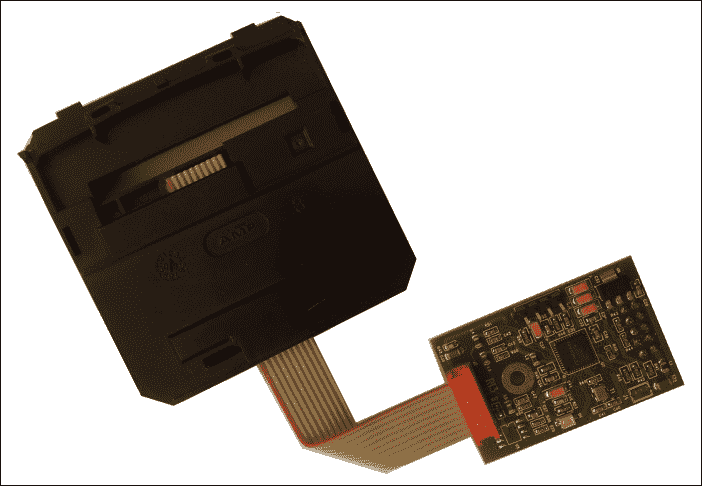
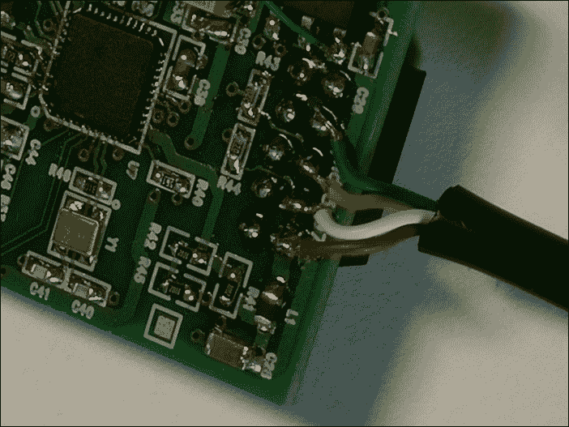
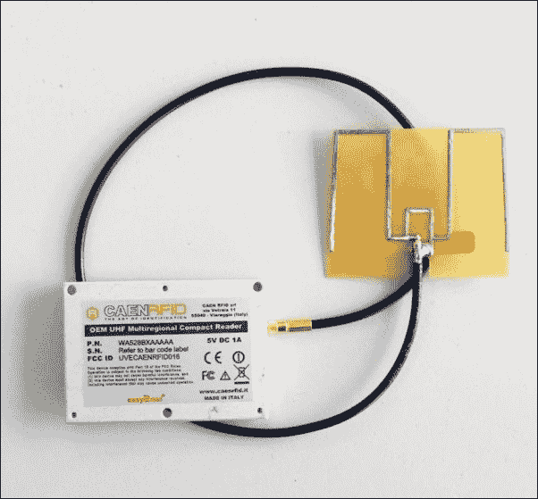
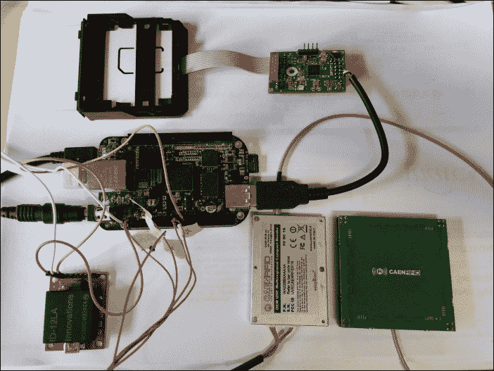
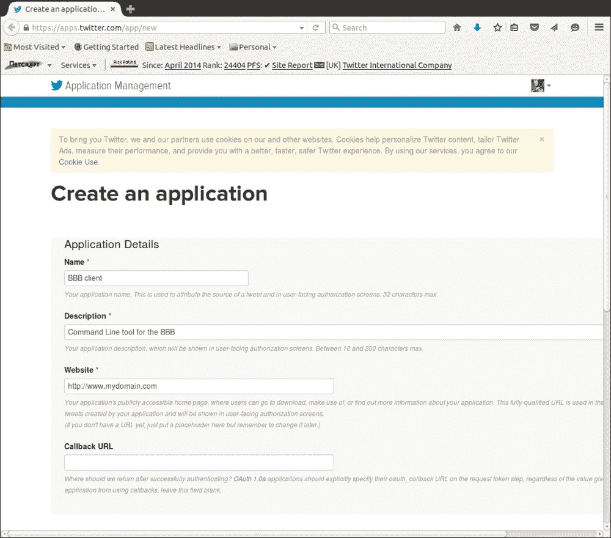
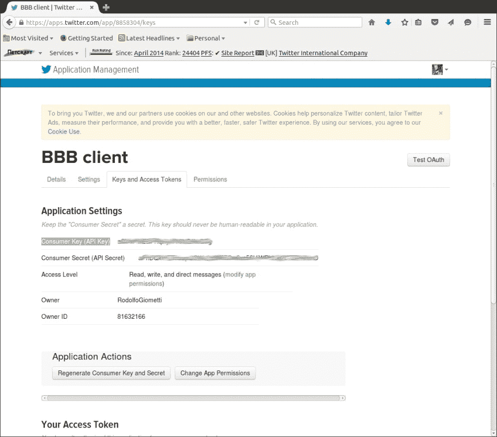

# 第九章：使用智能卡和 RFID 的 Twitter 访问控制系统

用计算机识别人员或物体可能看起来像是一项简单的任务，但实际上，完成这一任务的设备背后有着大量的技术。

在本章中，我们将使用智能卡读卡器和两种类型的 RFID 读卡器（适用于短距离的**低频**或**LF**读卡器，以及适用于长距离的**超高频**或**UHF**读卡器），以展示实现最小化识别系统用于访问控制的不同可能性。

一旦完成检测，系统将向我们的 Twitter 账户发送一条信息，通知我们的关注者发生了什么（在正常情况下，我们可能会锁定或解锁某些东西，但我决定做点不一样的事情）。

# 工作原理基础

例如，智能卡和智能卡读卡器是复杂的设备，如今无处不在，从我们的信用卡到智能手机。智能卡一词意味着一套技术，包括集成电路、微处理器、存储器、天线等，这些都集成在同一个电路中，形成微芯片，成为智能卡的核心。另一方面，智能卡读卡器是复杂的设备，能够与卡片进行通信并在其上保存数据或将数据返回计算机。

### 注意

读者可以通过查看[`en.wikipedia.org/wiki/Smart_card`](https://en.wikipedia.org/wiki/Smart_card)获取更多有关智能卡世界的信息。

智能卡的发展是**射频识别**（**RFID**）设备的演变，这些设备可以用于以非接触的方式识别人员或物体，识别距离从几厘米到几米不等。RFID 读卡器和相应的标签（或应答器）是高技术的无线设备，能够相互交换数据，从而完成识别任务。

### 注意

读者可以通过查看[`en.wikipedia.org/wiki/Radio-frequency_identification`](https://en.wikipedia.org/wiki/Radio-frequency_identification)来获取更多有关**RFID**世界的信息。

这次，所有项目的复杂性都集中在硬件设备（智能卡读卡器和 RFID 读卡器）及其相应的软件管理器中，因此我们只需要编写代码以访问这些设备并获取智能卡或 RFID 标签中的数据。

为了展示管理识别设备的不同技术，我们将编写三个程序（每个设备一个）使用三种不同的编程语言。然而，所有程序的结果都是相同的：当一个明确定义的人员（或物体）被识别时，系统将向我们的 Twitter 账户发送一条信息。

为了完成最后的任务，我们将使用一个专用（且有趣的）工具，它允许用户通过命令行管理 Twitter 账户。

每个识别系统都有其独特的特点；然而：

+   使用智能卡读卡器的解决方案可以用于需要通过插入信用卡（或类似物品）进行身份识别的场合。这不适用于无线应用。我要在我的原型中使用的智能卡读卡器是一个 USB 设备，带有一个插槽，必须插入智能卡才能识别。

+   第二种解决方案，也就是使用 RFID LF 读卡器的方案，适用于需要无线识别任务，但对象与读卡器之间的距离不超过几厘米的场合。这类设备通常非常简单，比如我将在我的原型中使用的设备。RFID 读卡器通过串口与主机连接，每当检测到标签时，它会简单地返回一个字符串。

+   最后的解决方案是通过 RFID UHF 读卡器实现的，也就是说，使用一种能够以无线模式检测标签的设备，类似于之前的 RFID LF 读卡器，但距离可达到几米远。这些 UHF 设备比 LF 设备更为复杂，例如我将在我的原型中使用的设备。RFID 读卡器仍然使用串口连接与主机通信，但它实现了一种更复杂的协议来交换数据。

# 硬件设置

如前面章节所述，这次我们需要连接一个 USB 设备和两个串口设备。关于 USB 设备，主要问题是它有一个非标准的 USB 连接器，因此我们必须找到一个解决方法（见下一部分）；而对于串口设备，我们需要在 BeagleBone Black 的扩展连接器上找到两个空闲的串口。

关于最后这个问题，我们应该记住 BeagleBone Black 默认禁用六个板载串口，只有`/dev/ttyO0`设备是与串口控制台配对的。如果我们登录到系统中，可以通过以下命令轻松验证：

```
root@BeagleBone:~# ls -l /dev/ttyO*
crw-rw---- 1 root tty 248, 0 Apr 23 20:20 /dev/ttyO0

```

要启用其他串口，我们需要修改内核设置，以便启用我们希望使用的串口。选择启用哪个端口取决于我们希望使用的引脚来连接设备，以下表格可能有助于我们做出选择：

| 设备 | TxD | RxD | RTS | CTS | 名称 |
| --- | --- | --- | --- | --- | --- |
| `/dev/ttyO1` | P9.24 | P9.26 |   |   | `UART1` |
| `/dev/ttyO2` | P9.21 | P9.22 | P8.38 | P8.37 | `UART2` |
| `/dev/ttyO4` | P9.13 | P9.11 | P8.33 | P8.35 | `UART4` |
| `/dev/ttyO5` | P8.37 | P8.38 |   |   | `UART5` |

所有设备都适用于我们的范围，因此我选择使用两个`/dev/ttyO1`和`/dev/ttyO2`设备，并且为了激活它们，我们可以使用以下命令：

```
root@BeagleBone:~# echo BB-UART1 > /sys/devices/bone_capemgr.9/slots
root@BeagleBone:~# echo BB-UART2 > /sys/devices/bone_capemgr.9/slots

```

现在，两个新的串口已准备好使用，如下所示的命令所示：

```
root@beaglebone:~# ls -l /dev/ttyO*
crw-rw---- 1 root tty     248, 0 Apr 23 20:20 /dev/ttyO0
crw-rw---T 1 root dialout 248, 1 Apr 23 21:48 /dev/ttyO1
crw-rw---T 1 root dialout 248, 2 Apr 23 21:48 /dev/ttyO2

```

### 注意

读卡器还可以查看这本书《*BeagleBone Essentials*》，由本书的作者编写，出版商为*Packt Publishing*，以便获得更多有关如何管理 BeagleBone Black 的串口，进而与传感器进行通信的信息。

## 设置智能卡读卡器

我在这个原型中使用的智能卡读卡器如下图所示：



### 注意

该设备可以通过以下链接购买（或通过上网搜索）：[`www.cosino.io/product/http://www.cosino.io/product/smartcard-reader-isoiec-7816`](http://www.cosino.io/product/http://www.cosino.io/product/smartcard-reader-isoiec-7816)。

该设备基于**Maxim 73S1215F**芯片，其数据表可在[`datasheets.maximintegrated.com/en/ds/73S1215F.pdf`](http://datasheets.maximintegrated.com/en/ds/73S1215F.pdf)上找到。

如前所述，这个设备具有非标准的 USB 连接器，因此我们必须找到一种方法将其连接到我们的 BeagleBone Black 上。

*快速且简便*的解决方案是使用来自旧 USB 设备的 USB 插头类型 A 适配器，然后必须将其焊接到板上，如下图所示：



连接必须按照以下表格进行：

| 智能卡读卡器引脚 | USB 插头类型 A 电缆 |
| --- | --- |
| VBus | 红色 |
| D- | 白色 |
| D+ | 黄色 |
| GND | 绿色 |

### 注意

连接器引脚输出可以在[`en.wikipedia.org/wiki/USB`](https://en.wikipedia.org/wiki/USB)的**引脚输出**框中查看。

如果连接正确，一旦你将设备连接到 BeagleBone Black，应该会得到如下输出：

```
usb usb1: usb wakeup-resume
usb usb1: usb auto-resume
hub 1-0:1.0: hub_resume
hub 1-0:1.0: port 1: status 0101 change 0001
hub 1-0:1.0: state 7 ports 1 chg 0002 evt 0000
hub 1-0:1.0: port 1, status 0101, change 0000, 12 Mb/s
usb 1-1: new full-speed USB device number 2 using musb-hdrc
usb 1-1: ep0 maxpacket = 16
usb 1-1: skipped 1 descriptor after interface
usb 1-1: skipped 1 descriptor after interface
usb 1-1: default language 0x0409
usb 1-1: udev 2, busnum 1, minor = 1
usb 1-1: New USB device found, idVendor=1862, idProduct=0001
usb 1-1: New USB device strings: Mfr=1, Product=2, SerialNumber=3
usb 1-1: Product: TSC12xxF CCID-DFU Version 2.10
usb 1-1: Manufacturer: Teridian Semiconductors
usb 1-1: SerialNumber: 123456789
usb 1-1: usb_probe_device
usb 1-1: configuration #1 chosen from 1 choice
usb 1-1: adding 1-1:1.0 (config #1, interface 0)
usb 1-1: adding 1-1:1.1 (config #1, interface 1)
hub 1-0:1.0: state 7 ports 1 chg 0000 evt 0002
hub 1-0:1.0: port 1 enable change, status 00000103

```

好的，一切正常工作，但现在我们需要一些包来管理我们的智能卡读卡器。那么，让我们通过以下命令安装它们：

```
root@beaglebone:~# aptitude install pcsc-tools pcscd libccid

```

完成后，`pcsc`工具就可以开始工作了。

### 注意

好奇的读者可以查看以下网址，了解更多关于此工具的信息：[`ludovic.rousseau.free.fr/softwares/pcsc-tools/`](http://ludovic.rousseau.free.fr/softwares/pcsc-tools/)。

安装完成后，我们可以通过以下命令执行它：

```
root@beaglebone:~# pcsc_scan
PC/SC device scanner
V 1.4.20 (c) 2001-2011, Ludovic Rousseau <ludovic.rousseau@free.fr>
Compiled with PC/SC lite version: 1.8.3
Using reader plug'n play mechanism
Scanning present readers...
Waiting for the first reader...

```

### 提示

如果你收到以下错误而不是前述输出，可以尝试使用`/etc/init.d/pcscd restart`命令重启守护进程，然后再次执行`pcsc_scan`工具：

```
SCardEstablishContext: Service not available.

```

好的，守护进程已正确启动，但它仍然没有识别我们的设备。在这种情况下，我们需要修补`/etc/libccid_Info.plist`配置文件，如下所示的补丁所示：

```
--- /etc/libccid_Info.plist.orig	2014-04-23 20:39:48.664062641 +0000
+++ /etc/libccid_Info.plist	2014-04-23 20:40:28.705078271 +0000
@@ -325,6 +325,7 @@
       <string>0x08C3</string>
       <string>0x08C3</string>
       <string>0x15E1</string>
+      <string>0x1862</string>
    </array>

    <key>ifdProductID</key>
@@ -550,6 +551,7 @@
       <string>0x0401</string>
       <string>0x0402</string>
       <string>0x2007</string>
+      <string>0x0001</string>
    </array>

    <key>ifdFriendlyName</key>
@@ -775,6 +777,7 @@
       <string>Precise Biometrics Precise 250 MC</string>
       <string>Precise Biometrics Precise 200 MC</string>
       <string>RSA RSA SecurID (R) Authenticator</string>
+                <string>TSC12xxF</string>
    </array>

    <key>Copyright</key>
```

在所有修改完成后，我们必须重启守护进程。现在，输出应该会发生如下变化：

```
root@beaglebone:~# /etc/init.d/pcscd restart
[ ok ] Restarting pcscd (via systemctl): pcscd.service.
root@beaglebone:~# pcsc_scan
PC/SC device scanner
V 1.4.20 (c) 2001-2011, Ludovic Rousseau <ludovic.rousseau@free.fr>
Compiled with PC/SC lite version: 1.8.3
Using reader plug'n play mechanism
Scanning present readers...
0: TSC12xxF (123456789) 00 00
1: TSC12xxF (123456789) 00 01
2: TSC12xxF (123456789) 00 02
3: TSC12xxF (123456789) 00 03
4: TSC12xxF (123456789) 00 04

Wed Apr 23 20:40:56 2014
Reader 0: TSC12xxF (123456789) 00 00
 Card state: Card removed,
Reader 1: TSC12xxF (123456789) 00 01
 Card state: Card removed,
Reader 2: TSC12xxF (123456789) 00 02
 Card state: Card removed,
Reader 3: TSC12xxF (123456789) 00 03
 Card state: Card removed,
Reader 4: TSC12xxF (123456789) 00 04
 Card state: Card removed,

```

好的！现在我们可以通过将卡片插入插槽并验证工具是否应该打印出以下内容，来验证读卡器是否正常工作：

```
Wed Apr 23 20:52:22 2014
Reader 0: TSC12xxF (123456789) 00 00
 Card state: Card inserted,
 ATR: 3B BE 11 00 00 41 01 38 00 00 00 00 00 00 00 00 01 90 00

ATR: 3B BE 11 00 00 41 01 38 00 00 00 00 00 00 00 00 01 90 00
+ TS = 3B --> Direct Convention
+ T0 = BE, Y(1): 1011, K: 14 (historical bytes)
 TA(1) = 11 --> Fi=372, Di=1, 372 cycles/ETU
 10752 bits/s at 4 MHz, fMax for Fi = 5 MHz => 13440 bits/s
 TB(1) = 00 --> VPP is not electrically connected
 TD(1) = 00 --> Y(i+1) = 0000, Protocol T = 0
-----
+ Historical bytes: 41 01 38 00 00 00 00 00 00 00 00 01 90 00
 Category indicator byte: 41 (proprietary format)

Possibly identified card (using /usr/share/pcsc/smartcard_list.txt):
3B BE 11 00 00 41 01 38 00 00 00 00 00 00 00 00 01 90 00
 ACS (Advanced Card System) ACOS-1

```

该设备正在正常工作；然而，我们需要一个专门的程序来管理卡片。因此，我们先通过常用的`aptitude`命令安装`python-pyscard`包，然后考虑以下代码片段：

```
#
# Smart Card Observer
#

class printobserver(CardObserver):
   def update(self, observable, (addedcards, removedcards)):
      for card in addedcards:
         logging.info("->] " + toHexString(card.atr))
      for card in removedcards:
         logging.info("<-] " + toHexString(card.atr))

#
# The daemon body
#

def daemon_body():
   # The main loop
   logging.info("INFO waiting for card... (hit CTRL+C to stop)")

   try:
      cardmonitor = CardMonitor()
      cardobserver = printobserver()
      cardmonitor.addObserver(cardobserver)

      while True:
         sleep(1000000) # sleep forever

   except:
      cardmonitor.deleteObserver(cardobserver)
```

### 注意

完整代码存储在书籍示例代码仓库中的`chapter_09/smart_card/smart_card.py`脚本中。

程序定义了一个`cardmonitor`对象，并通过`addObserver()`方法添加其观察者，以便在插入或移除卡片时调用。

如果执行成功，程序将输出如下内容：

```
root@beaglebone:~/smart_card# ./smart_card.py
INFO:root:INFO waiting for card... (hit CTRL+C to stop)
INFO:root:->] 3B BE 11 00 00 41 01 38 00 00 00 00 00 00 00 00 01 90 00
INFO:root:<-] 3B BE 11 00 00 41 01 38 00 00 00 00 00 00 00 00 01 90 00

```

### 提示

如果在执行命令时出现以下错误，则需要安装`python-daemon`包：

```
ImportError: No module named daemon

```

你可以通过使用以下命令解决此问题：

```
root@beaglebone:~/smart_card# pip install python-daemon

```

## 设置 RFID LF 读取器

作为一个 RFID LF 读取器，我们可以使用下图所示的设备，它通过 TTL 3.3V 电平的串口发送数据：


### 注意

该设备可以通过以下链接购买（或通过搜索互联网）：[`www.cosino.io/product/lf-rfid-low-voltage-reader`](http://www.cosino.io/product/lf-rfid-low-voltage-reader)。

该设备的 datasheet 可以在[`cdn.sparkfun.com/datasheets/Sensors/ID/ID-2LA,%20ID-12LA,%20ID-20LA2013-4-10.pdf`](http://cdn.sparkfun.com/datasheets/Sensors/ID/ID-2LA,%20ID-12LA,%20ID-20LA2013-4-10.pdf)找到。

它可以直接连接到我们的 BeagleBone Black，并连接到扩展连接器*P9*的以下引脚，对应已启用的串口设备`/dev/ttyO1`：

| 引脚 | RFID LF 读取器引脚 - 标签 |
| --- | --- |
| P9.4 - Vcc | 8 - Vcc |
| P9.26 - RxD | 6 - TX |
| P9.2 - GND | 7 - GND |

在所有引脚连接完毕后，标签的数据将在`/dev/ttyO1`设备上可用。为了快速验证，我们可以使用以下命令：

```
root@BeagleBone:~# stty -F /dev/ttyO1 9600 raw
root@BeagleBone:~# cat /dev/ttyO1

```

然后，当将标签靠近读取器时，我们应该能听到*哔哔声*，并且相应的标签 ID 应显示在命令行中，如下所示。（下面的`cat`命令为提高可读性而重复，您不需要重新输入它）：

```
root@BeagleBone:~# cat /dev/ttyO1
.6F007F4E1E40

```

然而，使用`cat`命令并不是最适合我们需求的操作，因为它的输出并不是完全干净的 ASCII 文本（有关此问题的更多信息，请参阅设备的 datasheet）；事实上，在标签 ID 之前接收了一些*脏*字节。例如，标签 ID 前的点符号“`.`”就是这些字节之一。因此，我们可以设想编写一个专用工具来清理从设备接收到的消息，以便获得一个干净的 ASCII ID 字符串。这样的工具的代码片段如下：

```
# Read the tags' IDs
cat $dev | while read id ; do
   # Remove the non printable characters and print the data
   echo -n $id | tr '\r' '\n' | tr -cd '[:alnum:]\n'
done
```

### 注意

完整代码存储在书籍示例代码仓库中的`chapter_09/rfid_lf/rfid_lf.sh`脚本中。

`cat`命令从由`dev`变量指定的设备读取数据，如前面的示例所示；然后，输出通过`tr`命令传递，以去除不可打印字符。结果如下：

```
root@beaglebone:~/rfid_lf# ./rfid_lf.sh /dev/ttyO1
6F007F48C199

```

### 提示

好奇的读者可以查看`tr`的 man 页面，以获取有关其用法的更多信息。

## 设置 RFID UHF 阅读器

作为 RFID UHF 阅读器，我们可以使用以下设备，它通过 TTL 3.3V 级别的串口发送数据：



### 注意

该设备可以通过以下链接购买（或通过网络搜索）：[`www.cosino.io/product/uhf-rfid-long-range-reader`](http://www.cosino.io/product/uhf-rfid-long-range-reader)。

产品的制造商信息可以在[`www.caenrfid.it/en/CaenProd.jsp?mypage=3&parent=59&idmod=818`](http://www.caenrfid.it/en/CaenProd.jsp?mypage=3&parent=59&idmod=818)查看。

它可以直接连接到我们的 BeagleBone Black，通过扩展连接器*P9*的以下引脚，这些引脚与已启用的串口设备`/dev/ttyO2`连接：

| 引脚 | RFID UHF 阅读器引脚 - 标签 |
| --- | --- |
| P9.6 - Vcc | 1 - +5V |
| P9.21 - TxD | 9 - RXD |
| P9.22 - RxD | 10 - TXD |
| P9.1 - GND | 12 - GND |

在所有引脚连接完成后，标签的数据将可通过`/dev/ttyO2`设备获取，但为了获取这些数据，我们需要额外的软件。事实上，这个设备需要一种特殊的协议与主机进行通信，因此我们需要安装一个专用的**C**库来完成这一任务，具体方法将在下面部分进行说明。

我们需要下载、编译并安装三个库：`libmsgbuff`、`libavp`和`libcaenrfid`。

首先，我们需要一些先决软件包。所以，让我们安装它们：

```
root@beaglebone:~# aptitude install git debhelper dctrl-tools

```

现在，我们可以使用以下命令开始下载第一个库：

```
root@beaglebone:~# git clone http://github.com/cosino/libmsgbuff.git

```

然后，我们需要进入新目录`libmsgbuff`并执行`autogen.sh`命令，如下所示：

```
root@beaglebone:~# cd libmsgbuff
root@beaglebone:~/libmsgbuff# ./autogen.sh

```

### 提示

可能会出现以下错误：

```
aclocal:configure.ac:11: warning: macro `AM_SILENT_RULES' not found in library
aclocal:configure.ac:18: warning: macro `AM_PROG_AR' not found in library
configure.ac:11: error: possibly undefined macro: AM_SILENT_RULES
 If this token and others are legitimate, please use m4_pattern_allow.
 See the Autoconf documentation.

```

在这种情况下，带有宏`AM_SILENT_RULES`和`AM_PROG_AR`的行应该被删除，如下所示的补丁所示：

```
 index dcfd1ce..333e417 100644
--- a/configure.ac
+++ b/configure.ac
@@ -8,14 +8,12 @@ AC_CONFIG_SRCDIR([msgbuff.c])
 AC_CONFIG_HEADERS([configure.h])

 AM_INIT_AUTOMAKE([1.9 foreign -Wall -Werror])
-AM_SILENT_RULES([yes])

 # Global settings
 AC_SUBST(EXTRA_CFLAGS, ['-Wall -D_GNU_SOURCE -include configure.h'])

 # Checks for programs
 AC_PROG_CXX
-AM_PROG_AR
 AC_PROG_AWK
 AC_PROG_CC
 AC_PROG_CPP
```

然后，我们可以安全地重新启动`autogen.sh`命令。

然后，要重新编译库，我们可以使用以下命令行：

```
root@beaglebone:~/libmsgbuff# ./debian/rules binary
dpkg-deb: building package `libmsgbuff0' in `../libmsgbuff0_0.60.0_armhf.deb'
.
dpkg-deb: building package `libmsgbuff-dev' in `../libmsgbuff-dev_0.60.0_armhf.deb'.

```

好的，既然软件包已经准备好，我们可以使用`dpkg`命令安装它们，如下所示：

```
root@beaglebone:~/libmsgbuff# dpkg -i ../libmsgbuff0_0.60.0_armhf.deb ../libmsgbuff-dev_0.60.0_armhf.deb
Setting up libmsgbuff0 (0.60.0) ...
Setting up libmsgbuff-dev (0.60.0) ...

```

现在轮到第二个库了。步骤与前面的示例相同。完成后，进入上级目录，然后使用以下`git`命令下载新源代码：

```
root@beaglebone:~# git clone http://github.com/cosino/libavp.git

```

然后，在库的目录中执行`autogen.sh`脚本：

```
root@beaglebone:~# cd libavp
root@beaglebone:~/libavp# ./autogen.sh

```

### 提示

同前面的例子一样，如果发生`undefined macro`错误，只需按照前面示例中的补丁修复当前`autogen.sh`脚本。

然后，开始以下编译：

```
root@beaglebone:~/libavp# ./debian/rules binary
dpkg-deb: building package `libavp0' in `../libavp0_0.80.0_armhf.deb'.
dpkg-deb: building package `libavp-dev' in `../libavp-dev_0.80.0_armhf.deb'.

```

最后，执行`dpkg`命令来安装软件包：

```
root@beaglebone:~/libavp# dpkg -i ../libavp0_0.80.0_armhf.deb ../libavp-dev_0.80.0_armhf.deb

```

好的，最后一个库的过程类似，但有一个小提示。首先，进入上级目录。然后，下载代码并执行`autogen.sh`脚本（如有需要，可以像之前一样修补）：

```
root@beaglebone:~# git clone http://github.com/cosino/libcaenrfid.git
root@beaglebone:~# cd libcaenrfid/
root@beaglebone:~/libcaenrfid# ./autogen.sh

```

然后，我们需要为 BeagleBone Black 的架构（在 Debian 中名为`armhf`）创建两个新文件。命令如下：

```
root@beaglebone:~/libcaenrfid# cp src/linux-gnueabi.c src/linux-gnueabihf.c
root@beaglebone:~/libcaenrfid# cp src/linux-gnueabi.h src/linux-gnueabihf.h

```

现在，我们可以执行常规的包生成命令，紧接着是安装命令，如下所示：

```
root@beaglebone:~/libcaenrfid# ./debian/rules binary
...
dpkg-deb: building package `libcaenrfid0' in `../libcaenrfid0_0.91.0_armhf.deb'.
dpkg-deb: building package `libcaenrfid-dev' in `../libcaenrfid-dev_0.91.0_armhf.deb'.
root@beaglebone:~/libcaenrfid# dpkg -i ../libcaenrfid0_0.91.0_armhf.deb ../libcaenrfid-dev_0.91.0_armhf.deb

```

到目前为止，所需的库已经就绪，我们可以编译我们的程序来访问 RFID UHF 读卡器。以下是可能实现的一个代码片段：

```
int main(int argc, char *argv[])
{
   int i;
   struct caenrfid_handle handle;
   char string[] = "Source_0";
   struct caenrfid_tag *tag;
   size_t size;
   char *str;
   int ret;

   if (argc < 2)
      usage();

      /* Start a new connection with the CAENRFIDD server */
      ret = caenrfid_open(CAENRFID_PORT_RS232, argv[1], &handle);
      if (ret < 0)
         usage();

      /* Set session "S2" for logical source 0 */
      ret = caenrfid_set_srcconf(&handle, "Source_0",
         CAENRFID_SRC_CFG_G2_SESSION, 2);
      if (ret < 0) {
         err("cannot set session 2 (err=%d)", ret);
         exit(EXIT_FAILURE);
      }

      while (1) {
         /* Do the inventory */
         ret = caenrfid_inventory(&handle, string, &tag, &size);
         if (ret < 0) {
            err("cannot get data (err=%d)", ret);
            exit(EXIT_FAILURE);
         }

         /* Report results */
         for (i = 0; i < size; i++) {
            str = bin2hex(tag[i].id, tag[i].len);
            EXIT_ON(!str);

            info("%.*s %.*s %.*s %d",
               tag[i].len * 2, str,
               CAENRFID_SOURCE_NAME_LEN, tag[i].source,
               CAENRFID_READPOINT_NAME_LEN, tag[i].readpoint,
               tag[i].type);

            free(str);
         }

         /* Free inventory data */
         free(tag);
      }

      caenrfid_close(&handle);

      return 0;
}
```

### 注意

完整的代码存储在书籍示例代码库中的`chapter_09/rfid_uhf/rfid_uhf.c`脚本中。

该程序简单地使用`caenrfid_open()`方法与读卡器建立连接，并使用`caenrfid_inventory()`方法来检测标签。`caenrfid_set_srcconf()`方法用于设置一个内部特殊功能，以避免多次读取相同的标签。

该程序可以通过在`rfid_uhf`目录中执行`make`命令进行编译，工具可以如下使用：

```
root@beaglebone:~/rfid_uhf# ./rfid_uhf /dev/ttyO2

```

如果读卡器天线附近没有标签，程序将不会有输出，但如果我们靠近一些标签，则会得到如下所示的内容：

```
root@beaglebone:~/chapter_09/rfid_uhf# ./rfid_uhf /dev/ttyO2
rfid_uhf.c[ 110]: main: e280113020002021dda500ab Source_0 Ant0 3

```

请注意，在这种情况下，与 RFID LF 的情况相反，读卡器可以在几米外检测到标签（具体距离取决于你使用的天线！）

## 最终图像

以下图像展示了我实现该项目并测试软件时制作的原型：



请注意，要使用 RFID UHF 读卡器，必须使用外部电源，而其他两种读卡器则不需要。

# 设置软件

在硬件设置完成后，大部分工作已经完成；为了完成我们的任务，我们首先需要安装一个工具来访问我们的 Twitter 帐户，然后我们必须添加一个机制，每次成功完成识别过程时调用它。所以，在接下来的章节中，我将展示如何安装并正确设置一个命令行工具与 Twitter 进行通信，然后如何在三种不同的编程语言中调用它，以支持三种不同的识别系统。

为了简化项目，我们可以在每个程序中使用一个已知 ID 的静态列表，但你可以理解，这个列表可以通过外部数据库轻松管理。所以，我将这个实现留给你作为练习。

## 设置 Twitter 工具

我将用于访问 Twitter 帐户的工具命名为单字符`t`。根据其主页的描述，`t`程序源自 Twitter 的短信命令：

> *该 CLI 从 Twitter 的短信命令中获取语法提示，但它提供了比 SMS 命令更多的命令和功能。*

实际上，一旦安装完成，它使用简单的命令来更新我们的 Twitter 状态、关注/取消关注用户、获取 Twitter 用户的详细信息、为你关注的所有人创建列表等等。

### 注意

对于 `t` 工具的完整参考，[`github.com/sferik/t`](https://github.com/sferik/t)网址是一个很好的起点。

要将此工具安装到我们的 BeagleBone Black 上，我们首先需要安装 `ruby-dev` 包，并使用 `aptitude` 程序：

```
root@beaglebone:~# aptitude install ruby-dev

```

然后，使用以下命令安装 `t`：

```
root@beaglebone:~# gem install t -V

```

### 提示

执行此命令可能非常缓慢！所以，请耐心等待。

安装结束后，我们可以执行程序，如果一切正常，应该会显示一个长长的可用命令列表，如下所示：

```
root@beaglebone:~# t -h
Commands:
 t accounts                          # List accounts
 t authorize                         # Allows an application to request user...
 t block USER [USER...]              # Block users.
 t delete SUBCOMMAND ...ARGS         # Delete Tweets, Direct Messages, etc.
 t direct_messages                   # Returns the 20 most recent Direct Mes...
 t direct_messages_sent              # Returns the 20 most recent Direct Mes...
 t dm USER MESSAGE                   # Sends that person a Direct Message.
 t does_contain [USER/]LIST USER     # Find out whether a list contains a user.
 t does_follow USER [USER]           # Find out whether one user follows ano...
 ...

```

此时，与其他社交网络一样，我们需要为我们的 Twitter 账户创建一个特殊的应用程序，以获取对我们的数据的访问权限。为此，让我们将浏览器指向[`apps.twitter.com/app/new`](https://apps.twitter.com/app/new)网址。我们将看到一个表单，在其中填写有关新应用程序的信息。只需填写三个字段：**名称**、**描述**和**网站**。请注意，应用程序的名称必须在所有 Twitter 用户中唯一，且不能包含 `twitter` 一词，而网站可以是任意的（例如，`http://www.mydomain.com`），如下图所示：



关于**回调 URL**字段，您可以将其留空。然后，点击页面底部的开发者条款同意框，再点击**创建您的 Twitter 应用程序**按钮。

一旦您的应用程序成功创建，您将看到一个页面，可以在此管理您的应用程序设置，如下图所示：


现在，转到**权限**选项卡，并将**访问**类型更改为**读取、写入和访问直接消息**，然后保存。

下一步是授权您的应用程序访问您的 Twitter 账户。为此，运行以下命令：

```
root@beaglebone:~# t authorize
Welcome! Before you can use t, you'll first need to register an
application with Twitter. Just follow the steps below:
 1\. Sign in to the Twitter Application Management site and click
 "Create New App".
 2\. Complete the required fields and submit the form.
 Note: Your application must have a unique name.
 3\. Go to the Permissions tab of your application, and change the
 Access setting to "Read, Write and Access direct messages".
 4\. Go to the API Keys tab to view the consumer key and secret,
 which you'll need to copy and paste below when prompted.

Press [Enter] to open the Twitter Developer site.

```

然后，按下*回车*键后，会显示以下输出：

```
xprop:  unable to open display ''
xprop:  unable to open display ''
Enter your API key: /usr/bin/xdg-open: 1: eval: www-browser: not found
/usr/bin/xdg-open: 1: eval: links2: not found
/usr/bin/xdg-open: 1: eval: elinks: not found
/usr/bin/xdg-open: 1: eval: links: not found
/usr/bin/xdg-open: 1: eval: lynx: not found
/usr/bin/xdg-open: 1: eval: w3m: not found
xdg-open: no method available for opening 'https://apps.twitter.com'

```

除了由于 `t` 无法执行任何浏览器而导致的错误信息外，我们还需要转到**密钥和访问令牌**选项卡，并在**应用程序设置**下的**消费者密钥（API 密钥）**字段中输入密钥。然后，工具会要求输入 API 密钥，因此您需要在之前的页面中输入**消费者密钥（API 密钥）**。



完成后，如果两个密钥有效，工具将显示以下输出：

```
In a moment, you will be directed to the Twitter app authorization page.
Perform the following steps to complete the authorization process:
 1\. Sign in to Twitter.
 2\. Press "Authorize app".
 3\. Copy and paste the supplied PIN below when prompted.

Press [Enter] to open the Twitter app authorization page.

```

与之前一样，工具会再次尝试打开浏览器，以显示 Twitter 应用程序授权页面，但当然它无法打开，因此会显示以下错误信息：

```
xprop:  unable to open display ''
xprop:  unable to open display ''
Enter the supplied PIN: /usr/bin/xdg-open: 1: eval: www-browser: not found
/usr/bin/xdg-open: 1: eval: links2: not found
/usr/bin/xdg-open: 1: eval: elinks: not found
/usr/bin/xdg-open: 1: eval: links: not found
/usr/bin/xdg-open: 1: eval: lynx: not found
/usr/bin/xdg-open: 1: eval: w3m: not found
xdg-open: no method available for opening 'https://api.twitter.com/oauth/authorize?oauth_callback=oob&oauth_consumer_key=sHSeFMEGPRqRyf9V0UB4LtQOg&oauth_nonce=9T9rSHXiaSiWXkh0ksVE5ioTcop0srz7xMG92VhVI&oauth_signature=oNWj1Lj%225BUmrFkD%252B065axJv6WSeM%253D&oauth_signature_method=HMAC-SHA1&oauth_timestamp=1443370645&oauth_token=J2fp-gAAAAAAhyrAAABAUA-YNw8&oauth_version=1.0'

```

好的，我们只需要*复制并粘贴*上面的 URL 到主机 PC 的浏览器中以完成此操作。明确来说，URL 如下：

```
https://api.twitter.com/oauth/authorize?oauth_callback=oob&oauth_consumer_key=sHSeFMEGPRqRyf9V0UB4LtQOg&oauth_nonce=9T9rSHXiaSiWXkh0ksVE5ioTcop0srz7xMG92VhVI&oauth_signature=oNWj1Lj%225BUmrFkD%252B065axJv6WSeM%253D&oauth_signature_method=HMAC-SHA1&oauth_timestamp=1443370645&oauth_token=J2fp-gAAAAAAhyrAAABAUA-YNw8&oauth_version=1.0

```

然后，应出现一个新页面，要求输入您的 Twitter 凭据，如下图所示：


### 提示

对不起，虽然是意大利语，但这是我 Twitter 账户默认语言设置的语言。

输入你的 Twitter 凭证，如果它们正确，系统应该会提供一个 PIN，用于完成授权过程（见下图）：


只需*复制并粘贴* PIN 到工具运行的终端中，然后按 *Enter*（再次提醒，启动浏览器时不必担心错误）。不过，如果所有步骤正确，`t`工具的最后一条消息应该是：

```
Authorization successful.

```

太好了！现在，我们准备从 BeagleBone Black 的命令行发布第一条推文了！命令如下：

```
root@beaglebone:~# t update 'Hello there! This is my first tweet from the command line!'
Tweet posted by @RodolfoGiometti.

Run `t delete status 648174339569897474` to delete.

```

下图展示了我的 Twitter 账户的一部分，最近发送的消息已发布：


## 智能卡实现

现在让我们从获取智能卡的访问权限开始，实施我们的识别系统。代码是用 Python 编写的，展示了通过使用智能卡读卡器实现访问控制系统的一种可能实现方式。

### 提示

请注意，这种实现非常简约，因为我们只关注 ATR 参数，而 ATR 参数在所有情况下不能唯一地识别智能卡。

该程序与存储在`chapter_09/smart_card/smart_card.py`文件中的程序非常相似，所以我这里只展示相关的差异：

```
# The known IDs
ID2NAME = {
        '11 11 11 11 11 11 11 11 11 11 11 11 11 11 11 11 11 11 11': "user1",
        '22 22 22 22 22 22 22 22 22 22 22 22 22 22 22 22 22 22 22': "user2",
        '3B BE 11 00 00 41 01 38 00 00 00 00 00 00 00 00 01 90 00': 'Rodolfo Giometti'
}
...
#
# Smart Card Observer
#

class printobserver(CardObserver):
   def update(self, observable, (addedcards, removedcards)):
      for card in addedcards:
         try:
            id = toHexString(card.atr)
         except:
            pass
         if len(id) == 0:
            continue
         logging.info("got tag ID " + id)

         # Verify that the tag ID is known and then
         # tweet the event
         try:
            name = ID2NAME[id]
        except:
           logging.info("unknow tag ID! Ignored")
           continue

        logging.info("Twitting that " + name + " was arrived!")
        call([t_cmd, t_args, name + " was arrived!"])
```

### 注意

完整代码存储在本书示例代码库中的`chapter_09/smart_card/smart_card2twitter.py`脚本中。

`ID2NAME`数组保存了已知 ID 的列表，也就是我们与知名人物关联的有效 ID 的 *数据库*。在这里，容易想象如果使用真实数据库会是更好的实现，但这种解决方案对于我们的教学目的已经足够。

`update()`方法提取智能卡的 ATR 字段，然后，它并非简单地打印出来，而是将当前 ID 与我们的内部数据库进行比较，在匹配成功的情况下，调用`t`工具更新 Twitter 帐户。

## RFID LF 实现

如同前面的示例，我们需要稍微修改`chapter_09/rfid_lf/rfid_lf.sh` **Bash** 脚本，以便在当前标签 ID 出现在`ID2NAME`数组中的已知 ID 列表时，调用`t`工具。修改后的代码片段如下：

```
# The known IDs
declare -gA 'ID2NAME=(
   [111111111111]="user1",
   [222222222222]="user2"
   [6F007F4E1E40]="Rodolfo Giometti"
)'
…
# Read the tags' IDs
cat $dev | while read id ; do
   # Remove the non printable characters
   id=$(echo $id | tr -cd '[:alnum:]')
   info "got tag ID $id"

   # Verify that the tag ID is known and then tweet the event
   name=${ID2NAME[$id]}
   if [ -z "$name" ] ; then
      info "unknow tag ID! Ignored"
   else
      info "Twitting that $name was arrived!"
      $t_cmd $t_args "$name was arrived!"
   fi
done
```

### 注意

完整代码存储在本书示例代码库中的`chapter_09/rfid_lf/rfid_lf2twitter.sh`脚本中。

## RFID UHF 实现

最后的实现是用 C 编写的，并且使用 RFID UHF 读卡器获取识别字符串。这个方法现在已经非常流行；我们只需修改`chapter_09/rfid_uhf/rfid_uhf.c`程序，以便检查当前标签 ID 是否与`ID2NAME`数组中已知的 ID 匹配。代码片段如下：

```
/* The known IDs */
struct associative_array_s {
   char *id;
   char *name;
} ID2NAME[] = {
   { "111111111111111111111111", "user1" },
   { "222222222222222222222222", "user2" },
   { "e280113020002021dda500ab", "Rodolfo Giometti" },
};
...
   /* The main loop */
   while (1) {
      /* Do the inventory */
      ret = caenrfid_inventory(&handle, string, &tag, &size);
      if (ret < 0) {
         err("cannot get data (err=%d)", ret);
         exit(EXIT_FAILURE);
      }

      /* Report results */
      for (i = 0; i < size; i++) {
         str = bin2hex(tag[i].id, tag[i].len);
         EXIT_ON(!str);
         info("got tag ID %.*s", tag[i].len * 2, str);

         for (j = 0; j < ARRAY_SIZE(ID2NAME); j++)
            if (strncmp(str, ID2NAME[j].id,
               tag[i].len * 2) == 0)
            break;
         if (j < ARRAY_SIZE(ID2NAME)) {
            info("Twitting that %s was arrived!",
               ID2NAME[j].name);
            ret = asprintf(&cmd, "%s %s %s was arrived!", t_cmd, t_arg, ID2NAME[j].name);
            EXIT_ON(ret < 1);
            ret = system(cmd);
            EXIT_ON(ret < 0);
            free(cmd);
         } else
         info("unknow tag ID! Ignored");

         free(str);
   }

   /* Free inventory data */
   free(tag);
}
```

### 注意

完整的代码存储在书中示例代码库中的`chapter_09/rfid_uhf/rfid_uhf2twitter.c`文件中。

执行之前，别忘了先编译它！

# 最终测试

为了测试我们的原型，我们必须运行前一节中介绍的三种不同的程序。和前几章一样，我首先执行了书中示例代码库中的`chapter_09/SYSINIT.sh`文件，以设置所有外设：

```
root@beaglebone:~# ./SYSINIT.sh
done!

```

然后，让我们启动智能卡程序并插入智能卡，如下所示：

```
root@beaglebone:~/smart_card# ./smart_card2twitter.py
INFO:root:got tag ID 3B BE 11 00 00 41 01 38 00 00 00 00 00 00 00 00 01 90 00
INFO:root:Twitting that Rodolfo Giometti was arrived!
Tweet posted by @RodolfoGiometti.

Run `t delete status 649586168313552896` to delete.
```

现在，按下*CTRL* + *C*键停止程序，然后按照如下方式尝试 RFID LF 程序，通过接近相应标签来进行测试：

```
root@beaglebone:~/rfid_lf# ./rfid_lf2twitter.sh /dev/ttyO1
rfid_lf2twitter.sh: got tag ID 6F007F4E1E40
rfid_lf2twitter.sh: Twitting that Rodolfo Giometti was arrived!
Tweet posted by @RodolfoGiometti.

Run `t delete status 649586168313552896` to delete.
```

再次使用*CTRL* + *C*键停止程序，然后按照如下方式重新接近相应标签来测试最后一个程序：

```
root@beaglebone:~/rfid_uhf# ./rfid_uhf2twitter /dev/ttyO2
rfid_uhf2twitter.c[ 122]: main: Twitting that Rodolfo Giometti was arrived!
Tweet posted by @RodolfoGiometti.

Run `t delete status 649586168313552896` to delete.
```

# 总结

在这一章，我们探索了如何向 Twitter 账户发布消息，以及使用不同的识别技术和编程语言识别人员或物体的三种不同方法。

在下一章，我们将探索如何使用普通遥控器（或任何红外设备）管理一些灯光。我们将看到如何通过我们的电视遥控器让 BeagleBone Black 板接收一些命令。
