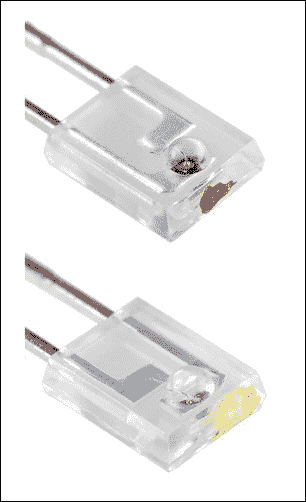
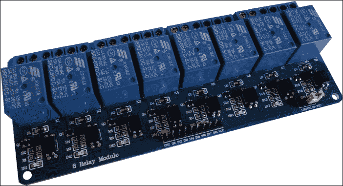
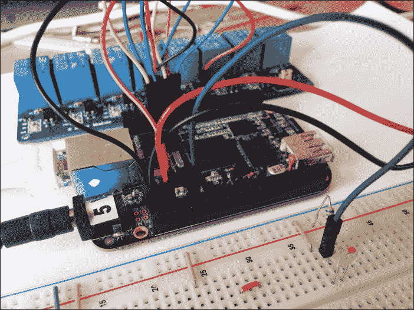

# 第十章：使用电视遥控器的灯光管理器

在这个项目中，我们将通过使用普通的电视遥控器来管理我们家的灯光。

实际上，我们可以使用任何我们拥有的遥控器，但这个想法是通过红外机制将远程控制功能添加到我们家中的任何设备上。实际上，在本章中，我将展示如何管理一个简单的开关设备；但这个概念可以很容易地扩展到我们可以连接到 BeagleBone Black 的任何其他设备！

我们将看到如何通过使用合适的电路来捕捉遥控器发送到我们的 BeagleBone Black 的红外消息，然后，我们将使用专用的内核驱动程序来管理这些消息，并将它们转换为我们用户空间程序的明确命令。

# 工作原理基础

我们将要实现的原型的功能非常简单。我们需要一个电子电路，能够检测遥控器发出的红外光，然后生成一些脉冲，这些脉冲会被一个特殊的软件捕捉并存储在配置文件中，以便稍后使用。然后，通过使用一个特殊的守护进程，我们可以将遥控器上的按键按下转换为适合我们 BeagleBone Black 的命令。

在这种情况下，我们需要实现的硬件非常简单。我们只需要一个带红外功能的光电二极管（红外接收器）的简单电路。另一方面，软件部分稍微复杂一些，因为我们首先需要一个内核驱动程序来可靠地检测来自遥控器的消息，然后是一个用户级程序来记录这些消息，一个程序来识别按下的是哪个按钮，最后一个程序将这些按键转换为开关命令（或者我们希望控制的其他命令）。

由于空间限制，我将使用第三章中使用的继电器阵列，*水族馆监控*，并留给你连接你需要的设备。

### 注意

警告——请记住，即使使用的继电器阵列适合控制高电压，*出于安全原因，如果你不知道自己在做什么，请不要连接任何电压高于 12V 的设备！*

# 设置硬件

如前所述，硬件设置非常简单。继电器阵列已经在前一章中设置好了，而红外接收器电路则非常复杂。所以，让我们继续吧！

## 设置红外探测器

我在这个原型中使用的红外探测器（或接收器）如下图所示（实际上，接收器是带有红点的设备；另一个是我们在这里不使用的发射器）。



### 注意

这些设备可以通过以下链接购买（或通过上网搜索）：[`www.cosino.io/product/infrared-emitter-detector`](http://www.cosino.io/product/infrared-emitter-detector)。

数据表可以在 [`www.sparkfun.com/datasheets/Components/LTR-301.pdf`](https://www.sparkfun.com/datasheets/Components/LTR-301.pdf) 获取。

### 提示

请注意，图像仅显示了红外设备的最上部分。实际上，它们看起来类似于普通二极管。

管理该电路的电路图如下所示：


**红外接收器**（**IR**）是前面图示中带红点的二极管，**R** 是一个 6.8KΩ 的电阻。下表显示了与 BeagleBone Black 的连接：

| 引脚 | IR 接收器标签 |
| --- | --- |
| P9.3 - Vcc | 3.3V |
| P9.12 - GPIO60 | GPIO @R |
| P9.1 - GND | GND |

要测试功能，可以通过以下命令将 GPIO 60 引脚设置为输入引脚：

```
root@arm:~# ./bin/gpio_set.sh 60 in

```

### 提示

请记住，系统中不能加载任何使用该引脚的驱动程序，否则会出现错误信息！

然后，我们可以使用以下脚本持续读取 GPIO 状态，并在其变为 `0` 时在终端打印出来：

```
root@arm:~# while true ; do cat /sys/class/gpio/gpio60/value | grep 0 ; done

```

当你将遥控器对准红外接收器并按下一个按钮时，你应该会得到如下输出：

```
root@arm:~# while true ; do cat /sys/class/gpio/gpio60/value | grep 0 ; done
0
0
0
0
0
...

```

要停止脚本，只需按下 *CTRL* + *C* 键组合。

## 设置继电器阵列

继电器阵列在下图中显示。它是已在第三章中使用的设备，*水族馆监控*，因此你可以参考那里了解更多信息，而在这里我只会展示此原型所需的连接。



### 注意

该设备可以通过以下链接（或通过上网搜索）购买：[`www.cosino.io/product/5v-relays-array`](http://www.cosino.io/product/5v-relays-array)。

BeagleBone Black 的 GPIO 引脚和我用来与这些设备配合使用的继电器阵列板的引脚显示在下表中：

| 引脚 | 继电器阵列引脚 |
| --- | --- |
| P8.10 - GPIO68 | IN1 |
| P8.9 - GPIO69 | IN2 |
| P8.12 - GPIO44 | IN3 |
| P8.11 GPIO45 | IN4 |
| P9.1 - GND | GND |
| P9.6 - 5V | Vcc |

要测试每个 GPIO 引脚的功能，我们可以通过以下命令启用其中一个引脚，作为示例：

```
root@arm:~# ./bin/gpio_set.sh 68 out 1

```

### 提示

请注意，继电器的关断状态是 `1`，而开启状态是 `0`。

然后，我们可以通过在 `/sys/class/gpio/gpio68/value` 文件中写入 `0` 和 `1` 来打开和关闭继电器，如下所示：

```
root@arm:~# echo 0 > /sys/class/gpio/gpio68/value
root@arm:~# echo 1 > /sys/class/gpio/gpio68/value

```

## 最终图片

下图显示了我为实现这个项目并测试软件所制作的原型。你应该注意到红外接收器位于右下角。



请注意，要使用需要 5V 电源电压的继电器阵列，必须使用外部电源为 BeagleBone Black 供电。

# 设置软件

现在，是时候设置软件来管理我们的红外探测器了。为此，我们将使用**LIRC**（**Linux 红外遥控**）子系统，这是为此目的开发的一个特殊代码。

### 注意

若要进一步了解 LIRC 子系统，您可以查看[`www.lirc.org/`](http://www.lirc.org/)。

我们将需要一个内核驱动程序，将红外探测器生成的脉冲转换为定义良好的消息，然后通过 LIRC 设备将它们发送到用户空间程序。在用户空间级别，我们将使用 LIRC 项目的一个特殊工具，将红外消息转换为输入事件，即普通键盘发送到内核的消息。

### 注意

若要进一步了解 Linux 输入子系统，您可以查看[`www.kernel.org/doc/Documentation/input/input.txt`](https://www.kernel.org/doc/Documentation/input/input.txt)。

## 设置内核驱动程序

为了设置内核驱动程序以管理我们的红外接收器，我们可以使用类似于第四章中所使用的程序，*Google Docs 气象站*。一旦从 GitHub 仓库下载了源代码，我们需要按照第四章，*Google Docs 气象站*中的程序，直到需要应用我们特殊补丁的步骤。事实上，在这种情况下，我们必须应用位于书籍示例代码仓库中的`chapter_10/0001-Add-support-for-Homebrew-GPIO-Port-Receiver-Transmit.patch`文件中的补丁，以便添加对红外接收器的支持。

命令如下：

```
$ git am --whitespace=nowarn 0001-Add-support-for-Homebrew-GPIO-Port-Receiver-Transmit.patch

```

### 提示

请注意，`--whitespace=nowarn`命令行选项是必需的，以防您的`git`系统被配置为自动修复空格错误，但在此情况下这是错误的。

如果一切顺利，`git log` 命令应该显示以下内容：

```
$ git log -1
commit be816108417ce82c7114ebd578ac32a45aef934a
Author:     Rodolfo Giometti <giometti@linux.it>
AuthorDate: Sun Oct 11 08:43:49 2015 +0200
Commit:     Rodolfo Giometti <giometti@linux.it>
CommitDate: Thu Oct 22 14:53:44 2015 +0200

 Add support for Homebrew GPIO Port Receiver/Transmitter

 Signed-off-by: Rodolfo Giometti <giometti@linux.it>

```

在开始内核编译之前，先让我简要说明一下这个补丁。它仅仅是将一个新驱动程序添加到 Linux 源代码中的`KERNEL/drivers/staging/media/lirc`目录下。所以，应用补丁后，如果我们查看新文件`lirc_gpio.c`，就能发现它是如何工作的。

### 提示

以下是对驱动代码的简要说明。如果您不关心这些内容，并且只希望直接使用驱动程序*原样*，您可以安全地跳过这一部分，直到内核编译命令部分。

一开始，我们有如下内核模块参数：

```
/*
 * Module parameters
 */

/* Set the default GPIO input pin */
staticintgpio_in = -1;
MODULE_PARM_DESC(gpio_in, "GPIO input/receiver pin number "
                   "(warning: it MUST be an interrupt capable pin!)");
module_param(gpio_in, int, S_IRUGO);

/* Set the default GPIO output pin */
staticintgpio_out = -1;
MODULE_PARM_DESC(gpio_out, "GPIO output/transmitter pin number");
module_param(gpio_out, int, S_IRUGO);

/* Set the sense mode: -1 = auto, 0 = active high, 1 = active low */
staticint sense = -1;
MODULE_PARM_DESC(sense, "Override autodetection of IR receiver circuit: ""0 = active high, 1 = active low (default -1 = auto)");
module_param(sense, int, S_IRUGO);

/* Use softcarrier by default */
static unsigned int softcarrier = 1;
MODULE_PARM_DESC(softcarrier, "Software carrier: 0 = off, 1 = on (default on)");
module_param(softcarrier, uint, S_IRUGO);
```

我们将使用`gpio_in`参数来指定红外接收器连接的输入引脚。接下来，跟随一些本地函数（此处不予列出），然后我们会看到文件操作定义：

```
static const struct file_operationslirc_fops = {
        .owner          = THIS_MODULE,
        .write          = lirc_write,
        .unlocked_ioctl = lirc_ioctl,
        .read           = lirc_dev_fop_read,
        .poll           = lirc_dev_fop_poll,
        .open           = lirc_dev_fop_open,
        .release        = lirc_dev_fop_close,
        .llseek         = no_llseek,
};
```

每个函数都与一个明确定义的系统调用相关，我们可以在新的 LIRC 设备上使用它。

在文件的最底部，有一个 `lirc_gpio_init_module()` 函数，它负责设置新设备。作为第一步，这个函数尝试请求所有所需的 GPIO 引脚：

```
 /*  
   * Check for valid gpio pin numbers 
   */ 
   ret = gpio_request(gpio_in, LIRC_GPIO_NAME " ir/in"); 
   if (ret) { 
      pr_err("failed to request GPIO %u\n", gpio_in); 
      return -EINVAL; 
   } 
   ret = gpio_direction_input(gpio_in); 
   if (ret) { 
      pr_err("failed to set pin direction for gpio_in\n"); 
      ret = -EINVAL; 
      goto exit_free_gpio_in; 
   } 
   pr_info("got GPIO %d for receiving\n", gpio_in); 
   /* Is GPIO in pin IRQ capable? */ 
   irq = gpio_to_irq(gpio_in); 
   if (irq < 0) { 
      pr_err("failed to map GPIO %d to IRQ\n", gpio_in); 
      ret = -EINVAL;
      goto exit_free_gpio_in; 
   } 
   ret = request_irq(irq, (irq_handler_t) irq_handler, IRQF_TRIGGER_FALLING | IRQF_TRIGGER_ RISING, LIRC_GPIO_NAME, (void *) 0); 
   if (ret < 0) { 
      pr_err("unable to request IRQ %d\n", irq); 
      goto exit_free_gpio_in; 
   } 
   pr_info("got IRQ %d for GPIO %d\n", irq, gpio_in); 
   if (gpio_out >= 0) { 
      ret = gpio_request(gpio_out, LIRC_GPIO_NAME " ir/ out"); 
      if (ret) { 
         pr_err("failed to request GPIO %u\n", gpio_ out); 
         goto exit_free_irq; 
      } 
      ret = gpio_direction_output(gpio_out, 0); 
      if (ret) { 
         pr_err("failed to set pin direction for gpio_ out\n"); 
         ret = -EINVAL; 
         goto exit_free_gpio_out; 
      } 
      pr_info("got GPIO %d for transmitting\n", gpio_out); 
   } 
```

在请求 `gpio_in` 引脚后，函数将其设置为输入引脚，然后检查该 GPIO 引脚是否支持中断；否则，驱动程序将无法正常工作。如果支持，函数请求 IRQ 引脚，然后继续处理 `gpio_out` 引脚（注意这不是强制性的）。

然后，驱动程序通过一个小的自动检测程序设置传感模式（如果用户在加载时没有直接指定），如下所示代码片段：

```
     /* Set the sense mode */
     if (sense != -1) {
             pr_info("manually using active %s receiver on GPIO %d\n",
                     sense ? "low" : "high", gpio_in);
     } else {
             /* wait 1/2 sec for the power supply */
             msleep(500);

             /*
              * probe 9 times every 0.04s, collect "votes" for
              * active high/low
              */
             nlow = 0;
             nhigh = 0;
             for (i = 0; i < 9; i++) {
                     if (gpio_get_value(gpio_in))
                             nlow++;
                     else
                             nhigh++;
                     msleep(40);
             }
             sense = (nlow >= nhigh ? 1 : 0);
             pr_info("auto-detected active %s receiver on GPIO pin %d\n",
                     sense ? "low" : "high", gpio_in);
     }
```

然后，我们可以通过首先调用 `lirc_buffer_init()` 函数来正确分配一个内存缓冲区用于消息管理，接着调用 `lirc_register_driver()`，将驱动程序注册到系统中，如下所示代码片段：

```
     /*
      * Setup the LIRC driver
      */

     ret = lirc_buffer_init(&rbuf, sizeof(int), RBUF_LEN);
     if (ret < 0) {
          pr_err("unable to init lirc buffer!\n");
             ret = -ENOMEM;
             goto exit_free_gpio_out;
     }

     ret = platform_driver_register(&lirc_gpio_driver);
     if (ret) {
             pr_err("error in lirc register\n");
             goto exit_free_buffer;
        }

        lirc_gpio_dev = platform_device_alloc(LIRC_GPIO_NAME, 0);
        if (!lirc_gpio_dev) {
                pr_err("error on platform device alloc!\n");
                ret = -ENOMEM;
goto exit_driver_unreg;
        }

        ret = platform_device_add(lirc_gpio_dev);
        if (ret) {
                pr_err("error on platform device add!\n");
goto exit_device_put;
        }

        driver.features = LIRC_CAN_REC_MODE2;
        if (gpio_out >= 0) {
                driver.features |= LIRC_CAN_SET_SEND_DUTY_CYCLE |
                          LIRC_CAN_SET_SEND_CARRIER |
                          LIRC_CAN_SEND_PULSE;
        }

        driver.dev = &lirc_gpio_dev->dev;
        driver.minor = lirc_register_driver(&driver);

        if (driver.minor < 0) {
                pr_err("device registration failed!");
                ret = -EIO;
goto exit_device_put;
        }

        pr_info("driver registered!\n");

        return 0;
```

好的，现在我们可以使用以下命令开始编译内核：

```
$ ./build_kernel.sh

```

### 提示

这一步，以及接下来的步骤，都比较耗时且需要耐心，所以你可以喝杯你喜欢的茶或咖啡，耐心等待。

一段时间后，程序将显示标准的内核配置面板，现在我们应该验证所需的驱动程序是否已启用。你应该在菜单中导航至 **设备驱动程序** | **暂存驱动程序** | **媒体暂存驱动程序** | **Linux 红外遥控接收器/发射器驱动程序**，其中 **Homebrew GPIO 端口接收器/发射器** 条目应选择为模块（**<M>**）。

然后，退出配置菜单，内核编译应该开始。接着，当编译完成时，新的内核镜像将准备就绪，并且应该显示如下消息：

```
-----------------------------
Script Complete
eewiki.net: [user@localhost:~$ export kernel_version=3.13.11-bone12]
-----------------------------

```

现在，我们可以使用以下安装工具将其安装到 microSD 上：

```
$ ./tools/install_kernel.sh

```

如果一切正常，经过常规登录后，我们可以使用以下命令验证新内核是否真的在运行：

```
root@arm:~# uname -a
Linux arm 3.13.11-bone12 #1 SMP Sun Oct 11 09:15:46 CEST 2015 armv7l GNU/Linux

```

### 提示

请注意，你系统上的内核版本可能比我的更新。

好的，新内核已经准备好了！现在，我们可以通过以下命令加载 LIRC 驱动程序：

```
root@arm:~# modprobe lirc_gpio gpio_in=60

```

### 提示

请注意，GPIO 60 必须没有被使用，否则你可能会遇到如下错误：

```
ERROR: could not insert 'lirc_gpio': Invalid argument

```

内核消息应类似如下：

```
lirc_dev: IR Remote Control driver registered, major 241
lirc_gpio: module is from the staging directory, the quality is unknown, you have been warned.
lirc_gpio: got GPIO 60 for receiving
lirc_gpio: got IRQ 204 for GPIO 60
lirc_gpio: auto-detected active low receiver on GPIO pin 60
lirc_gpio lirc_gpio.0: lirc_dev: driver lirc_gpio registered at minor = 0
lirc_gpio: driver registered!

```

此外，现在应该在 `/dev` 目录下准备好一个新条目：

```
root@arm:~/chapter_10# ls -l /dev/lirc*
crw-rw---T 1 root video 241, 0 Aug 13 16:35 /dev/lirc0

```

## LIRC 工具

现在内核模块已设置并运行，我们需要一些用户空间工具来管理它。所以，让我们通过常规的 `aptitude` 命令安装 `lirc` 包：

```
root@arm:~# aptitude install lirc
...
Setting up lirc (0.9.0~pre1-1) ...
[ ok ] No valid /etc/lirc/lircd.conf has been found..
[ ok ] Remote control support has been disabled..
[ ok ] Reconfigure LIRC or manually replace /etc/lirc/lircd.conf to enable..

```

如前述所示，为了启用 `lircd` 守护进程（即我们需要的工具），我们必须替换配置文件 `/etc/lirc/lircd.conf`；然而，我们并不打算以这种方式使用守护进程。实际上，我们可以通过执行以下命令来测试驱动程序是否按预期工作：

```
root@arm:~# mode2 --driver default --device /dev/lirc0

```

直到你将遥控器对准红外接收器并按下一个按钮，什么都不会发生。在这种情况下，你应该看到一些输出，如下所示：

```
space 3333126
pulse 8985
space 4503
pulse 564
space 535
pulse 564
space 561
pulse 542
space 551
...

```

好的！`/dev/lirc0`设备正在正常工作，驱动程序正确地检测到来自遥控器的消息！现在，我们必须创建一个自定义配置文件，将每个遥控器按钮与输入事件关联起来。

### 提示

由于空间不足，我将在以下示例中仅配置几个按钮；但你可以根据需要添加任何按钮。

使用的命令是`irrecord`，如下所示：

```
root@arm:~# irrecord --driver default --device /dev/lirc0 myremote.conf

```

`myremote.conf`是我们希望保存配置的文件。程序随后将显示如下输出：

```
irrecord -  application for recording IR-codes for usage with lirc

Copyright (C) 1998,1999 Christoph Bartelmus(lirc@bartelmus.de)

This program will record the signals from your remote control
and create a config file for lircd.

A proper config file for lircd is maybe the most vital part of this
package, so you should invest some time to create a working config
file. Although I put a good deal of effort in this program it is often
notpossible to automatically recognize all features of a remote
control. Often short-comings of the receiver hardware make it nearly
impossible. If you have problems to create a config file READ THE
DOCUMENTATION of this package, especially section "Adding new remote
controls" for how to get help.

If there already is a remote control of the same brand available at
http://www.lirc.org/remotes/ you might also want to try using such a
remote as a template. The config files already contain all
parameters of the protocol used by remotes of a certain brand and
knowing these parameters makes the job of this program much
easier. There are also template files for the most common protocols
available in the remotes/generic/ directory of the source
distribution of this package. You can use a template files by
providing the path of the file as command line parameter.

Please send the finished config files to <lirc@bartelmus.de> so that I
can make them available to others. Don't forget to put all information
that you can get about the remote control in the header of the file.

Press RETURN to continue.

```

好的，按下*return*/*Enter*键，程序将继续显示以下消息：

```
Now start pressing buttons on your remote control.

It is very important that you press many different buttons and hold them
down for approximately one second. Each button should generate at least one dot but in no case more than ten dots of output.
Don't stop pressing buttons until two lines of dots (2x80) have been
generated.

Press RETURN now to start recording.

```

好的，现在非常重要的是仔细遵循前面的指示。因此，开始按下不同的按钮并保持大约一秒钟，以便为每次按下生成至少一个点，但每次按下的输出点数不能超过十个！

所以，程序将开始打印点，直到它到达终端的末尾，如下所示：

```
....................................................................
Found const length: 107736

```

当第一行完成时，程序会显示以下消息，并且会出现新的点，但这次每按一个按钮只会出现一个点！：

```
Please keep on pressing buttons like described above.
............irrecord: signal too long
Creating config file in raw mode.
Now enter the names for the buttons.

```

现在，第一阶段的检测已经完成，我们可以开始真正的检测，每次按一个按钮。系统会提示输入按钮名称或按*Enter*键完成：

```
Please enter the name for the next button (press <ENTER> to finish recording)

```

现在，我通过插入`KEY_0`字符串来输入按钮**0**的名称，如下所示。然后，系统会提示你按住按钮**0**，直到它识别到：

```
KEY_0

Now hold down button "KEY_0".
Got it.
Signal length is 67

```

### 提示

有效的按钮名称可以通过使用`irrecord`命令列出，如下所示：

```
root@arm:~# irrecord --list-namespace
KEY_0
KEY_102ND
KEY_1
KEY_2
KEY_3
KEY_4
KEY_5
KEY_6
KEY_7
KEY_8
KEY_9
KEY_A
KEY_AB
...

```

然后，程序将为下一个按钮重新开始如下过程：

```
Please enter the name for the next button (press <ENTER> to finish recording)
KEY_1

Now hold down button "KEY_1".
Got it.
Signal length is 67

Please enter the name for the next button (press <ENTER> to finish recording)
KEY_2

Now hold down button "KEY_2".
Got it.
Signal length is 67

Please enter the name for the next button (press <ENTER> to finish recording)
KEY_3

Now hold down button "KEY_3".
Got it.
Signal length is 67

```

此时，我什么也不输入，只需按*Enter*键退出，然后会再次显示提示符：

```
Please enter the name for the next button (press <ENTER> to finish recording)

root@arm:~#

```

现在，一个名为`myremote.conf`的新文件应该已经准备好了。以下是我的文件片段：

```
# Please make this file available to others
# by sending it to <lirc@bartelmus.de>
#
# this config file was automatically generated
# using lirc-0.9.0-pre1(default) on Wed Aug 13 15:54:26 2014
#
# contributed by
#
# brand:                       myremote.conf
# model no. of remote control:
# devices being controlled by this remote:
#

begin remote

  name  myremote.conf
  flags RAW_CODES
  eps            30
  aeps          100

  gap          96036

begin raw_codes

          name KEY_0
             8998    4478     566     541     570     541
              570     541     570     542     570     541
              570     541     570     541     578     533
              570     541     570     541     570     542
              570     540     570    1679     571     541
              570     541     569     543     569     542
              570     541     570    1679     570    1678
              571     541     570     541     570     542
              570     540     570    1679     570    1679
              570     541     571     540     571    1685
              563    1679     570    1678     571    1678
              571   47910    9003    2231     570

          name KEY_1
             8969    4507     537     571     539     571
              540     572     539     572     539     572
              540     571     540     572     546     565
              539     572     540     571     540     571
              540     571     540    1709     540     572
              539     572     546     566     538    1709
              540    1709     540     572     539     572
              539     572     539     573     545     566
              538     572     539     573     538     572
              539    1710     540    1709     539    1712
              539    1709     539    1709     539    1710
              539   47930    8983    2261     539
...
```

现在，我们准备好测试我们的工作了。我们需要验证是否所有按钮都已正确识别。为此，我们必须从命令行执行`lircd`守护进程，命令如下：

```
root@arm:~# lircd --nodaemon --device /dev/lirc0 --driver default --uinput myremote.conf
lircd-0.9.0-pre1[2235]: lircd(default) ready, using /var/run/lirc/lircd

```

最后一个参数`--uinput`用于指示`lircd`守护进程将按钮按压转换为输入事件，就像它们来自普通键盘一样，因此我们可以使用`evtest`命令来测试它们。由于前一个命令必须与`evtest`同时运行，因此该命令必须在另一个终端中执行！命令如下：

```
root@arm:~# evtest
No device specified, trying to scan all of /dev/input/event*
Available devices:
/dev/input/event0:      lircd
Select the device event number [0-0]:

```

现在，我们必须选择（唯一的）可用输入设备，使用`0`号，程序将继续显示以下输出：

```
Input driver version is 1.0.1
Input device ID: bus 0x0 vendor 0x0 product 0x0 version 0x0
Input device name: "lircd"
Supported events:
 Event type 0 (EV_SYN)
 Event type 1 (EV_KEY)
 Event code 1 (KEY_ESC)
 Event code 2 (KEY_1)
 Event code 3 (KEY_2)
 Event code 4 (KEY_3)
 ...
 Event code 237 (KEY_BLUETOOTH)
 Event code 238 (KEY_WLAN)
 Event code 239 (KEY_UWB)
 Event code 240 (KEY_UNKNOWN)
 Event type 20 (EV_REP)
Properties:
Testing ... (interrupt to exit)

```

然后，当我按下遥控器上的按钮时，我会看到以下输出：

```
Event: time 1445765562.506427, type 1 (EV_KEY), code 11 (KEY_0), value 1
Event: time 1445765562.506427, -------------- SYN_REPORT ------------
...
Event: time 1445765566.745716, type 1 (EV_KEY), code 2 (KEY_1), value 1
Event: time 1445765566.745716, -------------- SYN_REPORT ------------
...
Event: time 1445765568.216621, type 1 (EV_KEY), code 3 (KEY_2), value 1
Event: time 1445765568.216621, -------------- SYN_REPORT ------------
...
Event: time 1445765569.357041, type 1 (EV_KEY), code 4 (KEY_3), value 1
Event: time 1445765569.357041, -------------- SYN_REPORT ------------
...

```

### 提示

`evtest`程序可以使用以下命令安装：

```
root@arm:~# aptitude install evtest

```

请注意，遥控器上的**0**按钮对应于`KEY_0`输入事件，该事件的代码为`11`，而**1**、**2**和**3**按钮分别对应`KEY_1`、`KEY_2`和`KEY_3`输入事件，它们的代码分别是`2`、`3`和`4`。因此，我们可以通过使用如下查找表将这些事件映射到相应的 GPIO 线路（Python 语法）：

```
GPIO = [-1, -1, 69, 44, 45, -1, -1, -1, -1, -1, -1, 68]
```

`-1`值表示*无 GPIO*。因此，当我们按下**0**按钮时，我们会收到`KEY_0`输入事件，该事件的代码为`11`，在数组的第 11 个位置（从**0**开始计数）我们有`68`值，所以`GPIO68`与遥控器上的**0**按钮连接。以类似的方式，**1**、**2**和**3**按钮分别对应`KEY_1`（代码为 2）、`KEY_2`（代码为 3）和`KEY_3`（代码为 4）输入事件，它们分别连接到`GPIO 69`（数组索引 2）、`GPIO 44`（数组索引 3）和`GPIO 45`（数组索引 4）。

## 输入事件管理器

现在，我们只需要添加最后一个元素，即：处理输入事件并打开或关闭相应继电器的软件。为了以一种*快速且简单*的方式做到这一点，我们可以使用 Python 语言和`evdev`库，该库可以通过以下命令轻松安装到我们的 BeagleBone Black 上：

```
root@arm:~# pip install evdev

```

### 注意

好奇的读者可以在[`python-evdev.readthedocs.org/en/latest/`](https://python-evdev.readthedocs.org/en/latest/)获取更多关于此库的信息。

在安装了该库后，我们可以考虑我们输入事件管理器的一个可能实现，如下所示的代码片段：

```
#
# Local functions
#

def gpio_get(gpio):
   fd = open("/sys/class/gpio/gpio" + str(gpio) + "/value", "r")
   val = fd.read()
   fd.close()
return int(val)

def gpio_set(gpio, val):
   fd = open("/sys/class/gpio/gpio" + str(gpio) + "/value", "w")
   v = fd.write(str(val))
   fd.close()

def usage():
   print("usage: ", NAME, " [-h] <inputdev>", file=sys.stderr)
   sys.exit(2);

#
# Main
#

try:
   opts, args = getopt.getopt(sys.argv[1:], "h",
      ["help"])
except getopt.GetoptError, err:
   # Print help information and exit:
   print(str(err), file=sys.stderr)
   usage()

for o, a in opts:
   if o in ("-h", "--help"):
      usage()
   else:
      assert False, "unhandled option"

# Check command line
if len(args) < 1:
   usage()

# Try to open the input device
try:
   dev = InputDevice(args[0])
except:
   print("invalid input device", args[0], file=sys.stderr)
   sys.exit(1);

logging.info (dev)
logging.info("hit CTRL+C to stop")

# Start the main loop
for event in dev.read_loop():
    if event.type == ecodes.EV_KEY and event.value == 1:
           # Get the key code and convert it to the corresponding GPIO
           code = event.code
           if code < 0 or code > len(GPIO):
                   gpio = -1
           else:
                   gpio = GPIO[code]
           logging.info("got code %d -> GPIO%d" % (code, gpio))

           if gpio > 0:
                   # Get current GPIO status and invert it
                   status = gpio_get(gpio)
                   status = 1 - status
                   gpio_set(gpio, status)
                   logging.info("turning GPIO%d %d -> %d" %
                           (gpio, 1 - status, status))
           else:
                  logging.info("invalid button")
```

### 注意

完整的代码存储在本书示例代码库中的`chapter_10/read_events.py`文件中。

代码本身很容易理解，但让我解释一些要点。首先，请注意`GPIO`数组是在前一节中定义的，然后`gpio_get()`和`gpio_set()`方法用于获取和设置 GPIO 状态。程序在对命令行进行简单检查后，开始通过`InputDevice()`方法打开用户提供的输入设备，然后进入大循环，在此循环中等待按键按下，之后它会切换相应 GPIO 的状态（如果有的话）。

以下是一个示例用法：

```
root@arm:~# ./read_events.py /dev/input/event0
INFO:root:device /dev/input/event0, name "lircd", phys ""
INFO:root:hit CTRL+C to stop
INFO:root:got code 2 -> GPIO68
INFO:root:turning GPIO68 1 -> 0
INFO:root:got code 3 -> GPIO69
INFO:root:turning GPIO69 1 -> 0
INFO:root:got code 3 -> GPIO69
INFO:root:turning GPIO69 0 -> 1
INFO:root:got code 2 -> GPIO68
INFO:root:turning GPIO68 0 -> 1

```

现在，在继续之前，我想向您推荐使用 Linux 输入层的一个有趣功能。

尽管使用输入层而不是直接访问`lircd`守护进程可能看起来有点复杂，但这种方法有一个巨大优势，那就是我们可以使用任何输入设备来测试我们的继电器管理器！事实上，如果你尝试将普通键盘连接到 BeagleBone Black 的 USB 端口，你将获得如下所示的新输入设备：

```
root@arm:~# evtest
No device specified, trying to scan all of /dev/input/event*
Available devices:
/dev/input/event0:   lircd
/dev/input/event1:   HID 04d9:1203
Select the device event number [0-1]:

```

现在，选择新的输入设备`/dev/input/event1`，我们只需按下**0**、**1**、**2**和**3**键，就可以生成与之前相同的输入事件：

```
Event: time 1445766356.367407, type 4 (EV_MSC), code 4 (MSC_SCAN), value 70027
Event: time 1445766356.367407, type 1 (EV_KEY), code 11 (KEY_0), value 1
Event: time 1445766356.367407, -------------- SYN_REPORT ------------
...
Event: time 1445766365.537391, type 4 (EV_MSC), code 4 (MSC_SCAN), value 7001e
Event: time 1445766365.537391, type 1 (EV_KEY), code 2 (KEY_1), value 1
Event: time 1445766365.537391, -------------- SYN_REPORT ------------
...
Event: time 1445766367.437377, type 4 (EV_MSC), code 4 (MSC_SCAN), value 7001f
Event: time 1445766367.437377, type 1 (EV_KEY), code 3 (KEY_2), value 1
Event: time 1445766367.437377, -------------- SYN_REPORT ------------
...
Event: time 1445766369.537383, type 4 (EV_MSC), code 4 (MSC_SCAN), value 70020
Event: time 1445766369.537383, type 1 (EV_KEY), code 4 (KEY_3), value 1
Event: time 1445766369.537383, -------------- SYN_REPORT ------------
...

```

### 提示

请注意，尽管由于空间限制这里未显示，但键盘会生成比通常的`EV_KEY`事件更多的输入事件。不过，我们可以通过选择正确的输入事件类型轻松跳过它们。

在这种情况下，如果我们按以下命令行执行程序，我们就可以像使用遥控器一样管理继电器：

```
root@arm:~# ./read_events.py /dev/input/event1
INFO:root:device /dev/input/event1, name "HID 04d9:1203", phys "usb-musb-hdrc.1.auto-1/input0"
INFO:root:hit CTRL+C to stop
INFO:root:got code 11 -> GPIO68
INFO:root:turning GPIO68 1 -> 0
INFO:root:got code 2 -> GPIO69
INFO:root:turning GPIO69 1 -> 0
INFO:root:got code 3 -> GPIO44
INFO:root:turning GPIO44 1 -> 0
INFO:root:got code 4 -> GPIO45
INFO:root:turning GPIO45 1 -> 0

```

# 最终测试

和前几章一样，我们首先需要执行本书示例代码库中的`chapter_10/SYSINIT.sh`文件，以便设置所有 GPIO 线路并加载内核模块：

```
root@beaglebone:~# ./SYSINIT.sh
done!

```

然后，我们必须执行`lircd`守护进程，通过命令行并且不带`--nodaemon`选项参数：

```
root@arm:~# lircd --device /dev/lirc0 --driver default --uinputmyremote.conf

```

然后，我们可以执行前面的`read_events.py`程序来管理继电器：

```
root@arm:~# ./read_events.py /dev/input/event0

```

现在，技巧已经完成。我们只需要将遥控器对准红外探测器，按下**0**、**1**、**2**或**3**按钮。当我们按下按钮时，开关会打开；而当我们再次按下按钮时，开关会关闭，从而改变连接的继电器的状态，最后，改变连接到继电器的设备状态。

# 总结

本章中，我们查看了一个内核驱动程序来管理红外设备。接着，我们学习了如何使用 LIRC 项目的用户空间工具接收遥控器发送的消息，并将其转化为特定的 Linux 输入事件。这使我们能够管理连接到 BeagleBone Black 的设备。

在下一章中，我们将探讨如何管理无线设备来控制墙插，并通过一种常见的家居自动化通信系统——**Z-Wave**协议，来监控连接到该插座的设备的电力消耗。
