# 第十一章：Z-Wave 无线家居控制器

在这个项目中，我们将展示如何通过使用 Z-Wave 控制器（连接到我们的 BeagleBone Black）和两个 Z-Wave 设备：一个壁式插座和一个多功能传感器设备，来实现一个小型的无线家居控制器。借助前者，我们可以开启或关闭连接到它的每个家电，同时测量其电力消耗；借助后者，我们可以测量多个环境变量，如温度、湿度和光照强度（并且还具备运动探测功能）。

Z-Wave 通信协议使我们能够无线管理多个家居自动化传感器和执行器，因此我们无需修改现有的布置。此外，我们还可以轻松添加一个电力消耗测量系统或多个环境传感器，对现有家居布局的影响很小。

最后一步，为了保持代码的简洁性，并让用户能够轻松管理系统，我们将编写一个简单的 Python Web 界面，便于管理原型。

# 功能基础

这次项目比之前更为复杂，但所有的复杂性并不在硬件方面（连接非常简单，只需插入 USB 加密狗，操作就完成了！），而是在软件方面！实际上，设置和控制这些设备的管理软件需要一些技能。此外，由于 Z-Wave 世界非常庞大，而且本书的篇幅有限（我想我可以要求我的编辑专门写一本书来讲解如何使用 Z-Wave 进行家居自动化项目！），所以我这里只会介绍 Z-Wave 协议的基本知识，展示一个最小化的应用，您可以在此基础上扩展。

如前所述，我们将使用一个 Z-Wave 控制器连接到 BeagleBone Black 的 USB 主机端口来管理两个 Z-Wave 设备：一个用于测量环境数据，另一个用于开关连接的设备。因此，我们需要编写一些软件，能够通过控制器发送和接收这些设备之间的消息，以便在 BeagleBone Black 和这两个从设备之间交换数据和命令。我们将编写的代码应该包括一个用于管理 Z-Wave 消息的部分和一个与用户互动的部分。至于后者，我决定使用 Python 编写一个 Web 界面，并辅以少量的 HTML 和 JavaScript 代码。

# 设置硬件

Z-Wave 技术面向住宅控制和自动化市场，设计上适合电池供电的设备。实际上，其主要目标之一就是尽量减少功耗。尽管如此，它依然能够提供可靠且低延迟的小数据包传输，数据传输速率最高可达 100 kbps，并且提供一种简单而可靠的方法来无线管理传感器，控制家庭中的灯光和电器。

### 注意事项

要了解更多关于 Z-Wave 的信息，一个好的起点是[`en.wikipedia.org/wiki/Z-Wave`](https://en.wikipedia.org/wiki/Z-Wave)。

在我们的项目中，我们将使用一个 USB 加密狗上的 Z-Wave 控制器，一个由它连接的插座供电的从设备，以及一个可以由电池或通过外部 USB 连接供电的多传感器设备。

## 设置 Z-Wave 控制器

我在这个原型中使用的 Z-Wave 控制器如下图所示：


### 注意

该设备可以通过以下链接（或在互联网上搜索）购买：[`www.cosino.io/product/usb-z-wave-controller`](http://www.cosino.io/product/usb-z-wave-controller)。

参考设计可以在这里找到：

[`z-wave.sigmadesigns.com/docs/brochures/UZB_br.pdf`](http://z-wave.sigmadesigns.com/docs/brochures/UZB_br.pdf)。

一旦通过`lsusb`命令连接到 BeagleBone Black 的 USB 主机端口，我们应该得到如下输出：

```
root@beaglebone:~# lsusb
Bus 001 Device 002: ID 0658:0200 Sigma Designs, Inc.
Bus 001 Device 001: ID 1d6b:0002 Linux Foundation 2.0 root hub
Bus 002 Device 001: ID 1d6b:0002 Linux Foundation 2.0 root hub

```

我们还应该看到以下内核活动：

```
hub 1-0:1.0: hub_resume
hub 1-0:1.0: port 1: status 0101 change 0001
hub 1-0:1.0: state 7 ports 1 chg 0002 evt 0000
hub 1-0:1.0: port 1, status 0101, change 0000, 12 Mb/s
usb 1-1: new full-speed USB device number 2 using musb-hdrc
usb 1-1: ep0 maxpacket = 8
usb 1-1: skipped 4 descriptors after interface
usb 1-1: udev 2, busnum 1, minor = 1
usb 1-1: New USB device found, idVendor=0658, idProduct=0200
usb 1-1: New USB device strings: Mfr=0, Product=0, SerialNumber=0
usb 1-1: usb_probe_device
usb 1-1: configuration #1 chosen from 1 choice
usb 1-1: adding 1-1:1.0 (config #1, interface 0)
cdc_acm 1-1:1.0: usb_probe_interface
cdc_acm 1-1:1.0: usb_probe_interface - got id
cdc_acm 1-1:1.0: This device cannot do calls on its own. It is not a modem.
cdc_acm 1-1:1.0: ttyACM0: USB ACM device
usb 1-1: adding 1-1:1.1 (config #1, interface 1)
hub 1-0:1.0: state 7 ports 1 chg 0000 evt 0002
hub 1-0:1.0: port 1 enable change, status 00000103

```

查看倒数第四行，我们可以发现 Z-Wave 控制器已经连接到`/dev/ttyACM0`设备文件。因此，设备已正确连接。但要真正测试它，我们需要安装合适的管理软件。为此，我们可以使用名为**Open Z-Wave**的 Z-Wave 协议的开源实现，在那里我们可以找到很多适合测试 Z-Wave 网络的软件。

### 注意

Open Z-Wave 项目的主页在[`www.openzwave.com`](http://www.openzwave.com)。

使用以下命令，我们可以将所需的代码下载到我们的原型中：

```
root@beaglebone:~# git clone https://github.com/OpenZWave/open-zwave openzwave

```

然后，我们需要一些额外的软件包来编译所需的工具。因此，接下来我们用以下命令安装它们：

```
root@beaglebone:~# aptitude install build-essential make git libudev-dev libjson0 libjson0-dev libcurl4-gnutls-dev

```

现在，只需进入`openzwave`目录，然后使用`make`命令如下所示：

```
root@beaglebone:~# cd openzwave
root@beaglebone:~/openzwave# make

```

### 提示

编译过程比较慢，所以请耐心等待。

完成后，我们需要使用以下命令将另一个仓库下载到当前目录：

```
root@beaglebone:~/openzwave# git clone https://github.com/OpenZWave/open-zwave-control-panel openzwave-control-panel

```

然后，在下载之后，我们需要安装一个额外的软件包来继续进行编译。因此，接下来我们再次使用`aptitude`命令，如下所示：

```
root@beaglebone:~/openzwave# aptitude install libmicrohttpd-dev

```

现在，作为最后一步，进入`openzwave-control-panel`目录，并使用以下命令行重新运行`make`命令：

```
root@beaglebone:~/openzwave# cd openzwave-control-panel/
root@beaglebone:~/openzwave/openzwave-control-panel# make

```

当编译完成后，`ozwcp`程序应该就可以使用了。接下来，让我们通过以下命令行执行它：

```
root@beaglebone:~/openzwave/openzwave-control-panel# ln -s ../config
root@beaglebone:~/openzwave/openzwave-control-panel# ./ozwcp -d -p 8080
2014-04-23 21:12:52.943 Always, OpenZwave Version 1.3.526 Starting Up
webserver starting port 8080

```

### 提示

请注意，`ln`命令只需要使用一次，用来与 Open Z-Wave 配置目录`config`创建一个正确的链接，该目录位于上级目录。

如果在执行程序时遇到以下错误，意味着很可能是你的 Web 服务器占用了`8080`端口，所以你需要禁用它：

```
Failed to bind to port 8080: Address already in use

```

现在，我们应该将主机 PC 上的网页浏览器指向地址`http://192.168.7.2:8080/`，以查看下图所示的内容：

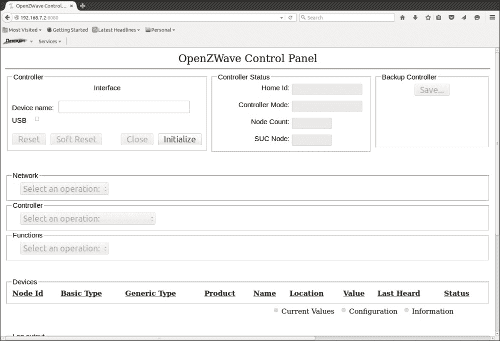

好的，现在我们需要在**设备名称**字段中输入`/dev/ttyACM0`路径名，然后按下**初始化**按钮以启动通信。如果一切正常，您应该看到在**设备**标签中列出了一个新设备，如下图所示：

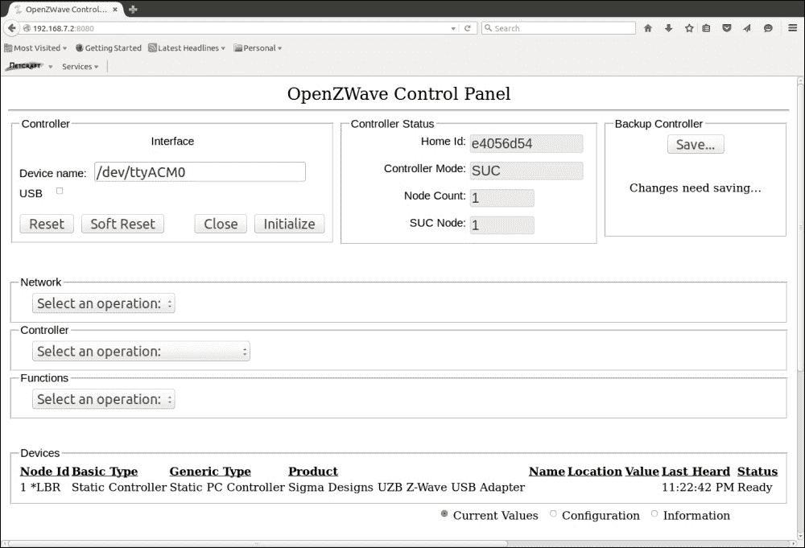

现在，控制器已经启动并运行，因此我们可以继续安装 Z-Wave 从设备。

## 设置 Z-Wave 墙插

第一个 Z-Wave 从设备是下图所示的墙插：

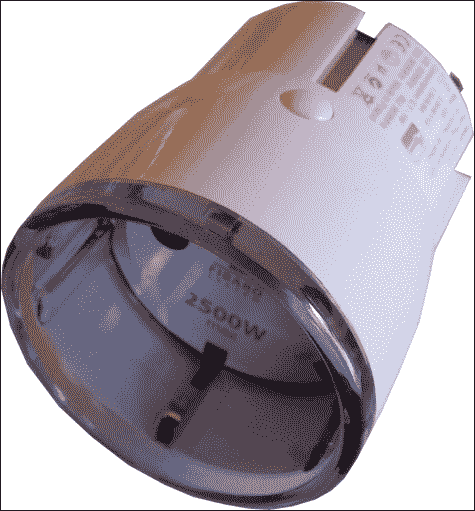

### 注意

该设备可以通过以下链接（或通过浏览互联网）购买：[`www.cosino.io/product/z-wave-wall-plug`](http://www.cosino.io/product/z-wave-wall-plug)。

可以在此处找到参考手册：

[`www.fibaro.com/manuals/en/FGWPx-101/FGWPx-101-EN-A-v1.00.pdf`](http://www.fibaro.com/manuals/en/FGWPx-101/FGWPx-101-EN-A-v1.00.pdf)。

该设备是无线的，一旦与通电的插座连接，它会自供电；因此，我们不需要特别的连接来设置它。然而，我们需要将一些家用电器连接到它，如下图所示，以便进行功率消耗测量：

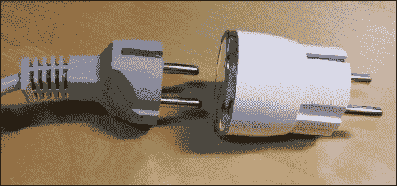

现在，为了测试该设备及其与控制器的通信，我们可以再次使用`ozwcp`程序。只需点击**控制器**标签中的**选择操作**菜单项，选择**添加设备**条目，然后按下**开始**按钮。在左侧，您应该看到**添加设备：等待用户操作**的消息。因此，我们可以通过将设备插入墙插并按下设备上的按钮来启动配对程序（就像蓝牙设备一样）。

### 提示

请注意，较新版本的该设备不需要按下按钮来启动配对程序——它会在插入第一个插座后自动启动。

如果一切正常，新的设备应出现在**设备**标签中，如下所示：

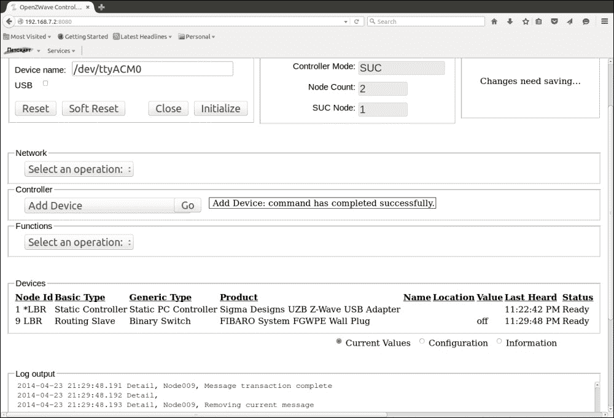

现在，我们可以通过选择新设备，然后点击**设备**列表标签下的**配置**选项来更改设备的某些设置。应该会出现类似下图的面板设置：

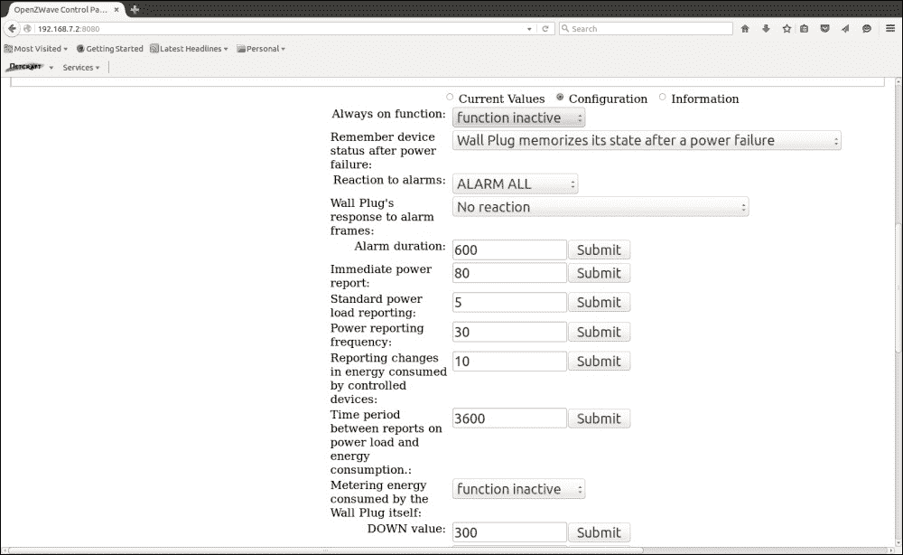

现在，我们可以通过在相关字段中输入新值，然后按下**提交**按钮来更改**标准功率负载报告**条目。通过这种方式，我们可以定义一个较低的值，表示必须更改多少功率负载（以百分比计），才能报告给主控制器（我使用的值是`5`）。

## 设置 Z-Wave 多传感器

第二个 Z-Wave 从设备是下图所示的多传感器：

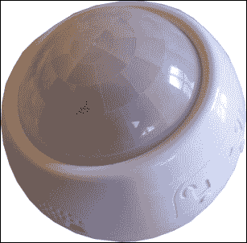

### 注意

该设备可以通过以下链接购买（或通过上网搜索）：[`www.cosino.io/product/z-wave-multi-sensor`](http://www.cosino.io/product/z-wave-multi-sensor)。

参考手册可以在这里找到：

[`aeotec.com/z-wave-sensor/47-multisensor-manual.html`](http://aeotec.com/z-wave-sensor/47-multisensor-manual.html)。

要为设备供电，我们可以使用 4 节电池或如下面图示那样连接 USB 电缆。然后，为了测试设备及其与控制器的通信，我们可以再次使用`ozwcp`程序。所以，只需点击**控制器**选项卡中的**选择操作**菜单项，然后选择**添加设备**条目。接着，按下**开始**按钮，以便再次执行配对过程（配对按钮是位于电池盖下方灵敏度调节器旁的黑色按钮，在下图中位于右上角）。

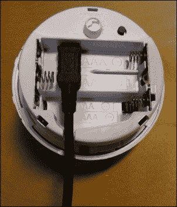

如果一切正常，一个新设备应该出现在**设备**选项卡中，如下所示：

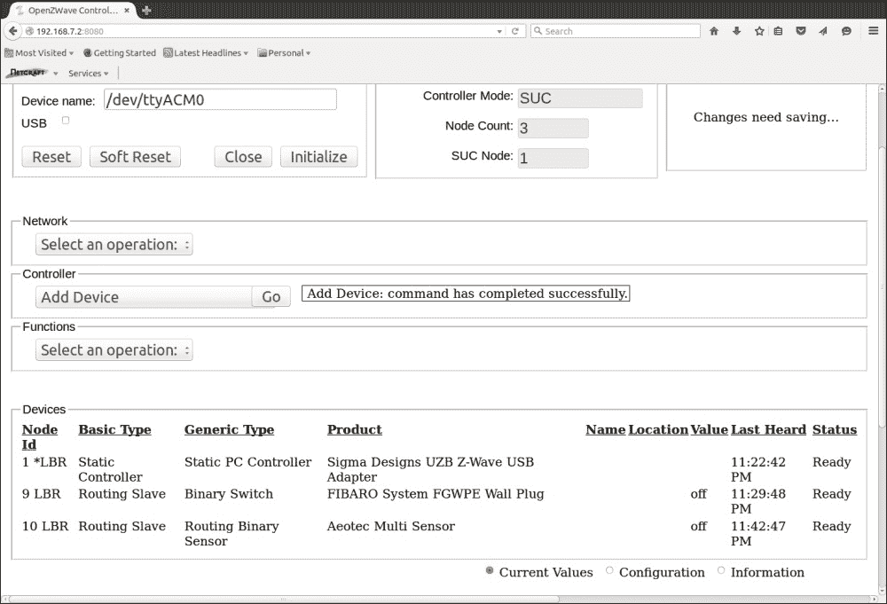

现在，和之前一样，我们可以更改默认设置。特别是，我们可以通过将**组 1 报告**条目设置为`224`，将**组 2 报告**条目设置为`1`，然后将**组 1 间隔**设置为`10`，将**组 2 间隔**设置为`60`，来设置环境报告的频率和内容。

这些特殊设置将指示多传感器启用第 7 位（亮度）、第 6 位（湿度）和第 5 位（温度）到组 1，以及第 0 位（电池电量）到组 2，并每 10 秒重复组 1，每 60 秒重复组 2（见下图）：

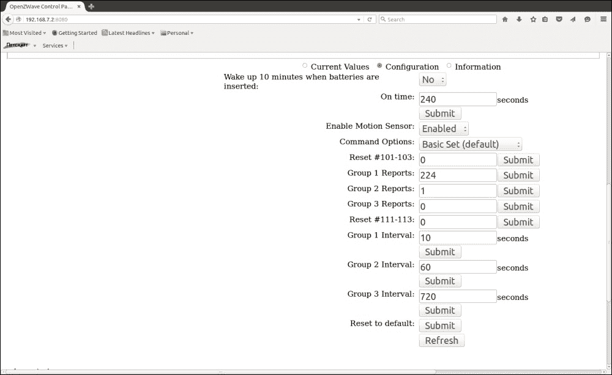

好的，现在所有设备都准备好操作了！我们可以通过按下*CTRL* + *C* 键序列来停止`ozwcp`程序，并继续下一部分。

## 最终图片

以下是显示我为实现此项目并测试软件而实现的原型的图片。

这里没什么特别要说的；只需要 BeagleBone Black 配合 Z-Wave 控制器 USB 加密狗以及之前描述的两台 Z-Wave 设备。

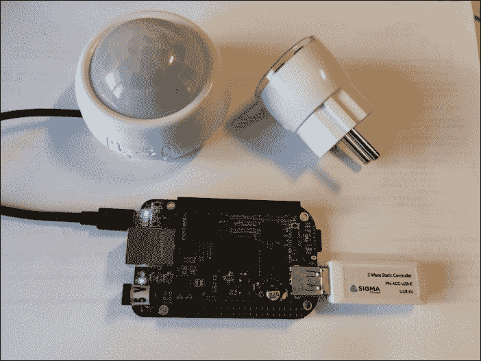

# 设置软件

如前所述，原型的复杂部分在于软件。我们需要将多个软件包安装到 BeagleBone Black 中，而且我们需要自己编写的软件也需要一些技能。不过，别担心，我将逐步解释所有需要的步骤！

## 设置 Python 绑定

安装**Python**绑定相当复杂，因为名为`python-openzwave`的软件包似乎仍在开发中，并且它依赖于大量的**Python**包！不过，我通过以下命令行获取了项目的特定版本，成功完成了安装：

```
root@beaglebone:~# wget http://bibi21000.no-ip.biz/python-openzwave/python-openzwave-0.3.0b5.tgz

```

### 注意

`python-openzwave`包的其他版本可以在[`bibi21000.no-ip.biz/python-openzwave/`](http://bibi21000.no-ip.biz/python-openzwave/)获取。

现在，要探索归档文件，我们可以使用以下命令：

```
root@beaglebone:~# tar xvfz python-openzwave-0.3.0b5.tgz

```

创建了一个新目录`python-openzwave-0.3.0b5`；但是，要成功编译代码，我们需要多次使用以下命令行安装一些 Python 包：

```
root@beaglebone:~# pip install 
<package>

```

在这里，使用**<package>**时，我使用了以下名称：`Louie`、`urwid`、`Flask-SocketIO`、`versiontools`、`gevent-socketio`、`WebOb`、`Flask-Themes`和`Flask-Babel`。

### 提示

实际上，`pip install`命令可以一次接受多个由空格分隔的包，因此你可以使用单个命令一次性安装所有需要的包。

还要注意，要安装`urwid`包，我需要使用不同的命令来更新已经安装的包。该命令如下：

```
root@beaglebone:~# pip install --upgrade urwid

```

同时，为了安装版本为 0.9.5 的`Flask-WTF`包，我使用的命令如下：

```
root@beaglebone:~# pip install Flask-WTF==0.9.5

```

然而，在我的系统上，我无法成功执行它，因此我通过对`python-openzwave-0.3.0b5`目录中的`setup-web.py`文件应用以下补丁，使用了一种*脏技巧*：

```
--- ./setup-web.py.orig   2014-04-24 03:50:41.398440723 +0000
+++ ./setup-web.py	2014-04-24 03:39:52.212893771 +0000
@@ -49,7 +49,7 @@
   install_requires = [
                      'openzwave == %s' % pyozw_version,
                      'Flask == 0.10.1',
-                     'Flask-WTF == 0.9.5',
+                     'Flask-WTF >= 0.9.5',
                      'Babel >= 1.0',
                      'Flask-Babel == 0.9',
                      #'Flask-Fanstatic == 0.2.0',
```

幸运的是，即使使用比 0.9.5 更新的版本，代码也能正常工作！

安装所有依赖项后，只需转到`python-openzwave-0.3.0b5`目录并使用`make`命令完成任务，如下所示：

```
root@beaglebone:~/python-openzwave-0.3.0b5# make deps build

```

### 提示

编译过程非常缓慢，请耐心等待！

完成后，我们必须使用以下命令行安装新代码：

```
root@beaglebone:~/python-openzwave-0.3.0b5# make install

```

我们做到了！为了测试我们新编写的代码，我们现在可以通过进入`examples`目录并执行以下命令行来使用提供的示例：

```
root@beaglebone:~/python-openzwave-0.3.0b5# cd examples/
root@beaglebone:~/python-openzwave-0.3.0b5/examples# ./test_lib.py --device=/dev/ttyACM0

```

### 提示

请注意，为了更好地呈现`test_lib.py`命令的输出行，所有时间参考已被删除。

此外，对于所有后续的 Python 代码，你可以安全地忽略以下形式的所有警告消息：

```
./test_lib.py:28: UserWarning: Module libopenzwave was already imported from None, but /usr/local/lib/python2.7/dist-packages/libopenzwave-0.3.0b5-py2.7-linux-armv7l.egg is being added to sys.path

```

上面命令的输出非常长，由于空间有限，我无法完全报告，因此我将只报告相关部分。

在前几行，我们得到了如下的基本信息消息：

```
Always, OpenZwave Version 1.3.482 Starting Up
Add watcher
Add device
Info, Setting Up Provided Network Key for Secure Communications
Warning, Failed - Network Key Not Set
Info, mgr,     Added driver for controller /dev/ttyACM0
Sniff network during 60.0 seconds
Info,   Opening controller /dev/ttyACM0
Info, Trying to open serial port /dev/ttyACM0 (attempt 1)
Info, Serial port /dev/ttyACM0 opened (attempt 1)

```

这里有一些关于软件版本和我们正在访问的设备（即`/dev/ttyACM0`）的信息。然后，列出了待执行的命令队列，如下所示：

```
Detail, contrlr, Queuing (Command) FUNC_ID_ZW_GET_VERSION: 0x01, 0x03, 0x00, 0x15, 0xe9
Detail, contrlr, Queuing (Command) FUNC_ID_ZW_MEMORY_GET_ID: 0x01, 0x03, 0x00, 0x20, 0xdc
Detail, contrlr, Queuing (Command) FUNC_ID_ZW_GET_CONTROLLER_CAPABILITIES: 0x01, 0x03, 0x00, 0x05, 0xf9
Detail, contrlr, Queuing (Command) FUNC_ID_SERIAL_API_GET_CAPABILITIES: 0x01, 0x03, 0x00, 0x07, 0xfb
Detail, contrlr, Queuing (Command) FUNC_ID_ZW_GET_SUC_NODE_ID: 0x01, 0x03, 0x00, 0x56, 0xaa
Detail, contrlr, Sending (Command) FUNC_ID_ZW_GET_VERSION: 0x01, 0x03, 0x00, 0x15, 0xe9
Detail, contrlr, Received: 0x01, 0x10, 0x01, 0x15, 0x5a, 0x2d, 0x57, 0x61, 0x76, 0x65, 0x20, 0x33, 0x2e, 0x37, 0x39, 0x00, 0x01, 0x9b

```

这里是一些初步的回答：

```
Info, contrlr,   Received reply to FUNC_ID_ZW_GET_VERSION:
Info, contrlr,   Static Controller library, version Z-Wave 3.79

```

接下来，关于探测所有可用**Z-Wave**节点的许多消息紧随其后：

```
Info, contrlr,     Node 001 - New
Detail, Node001, AdvanceQueries queryPending=0 queryRetries=0 queryStage=None live=1
Detail, Node001, QueryStage_ProtocolInfo
Detail, Node001, Queuing (Query) Get Node Protocol Info (Node=1): 0x01, 0x04, 0x00, 0x41, 0x01, 0xbb
Detail, Node001, Queuing (Query) Query Stage Complete (ProtocolInfo)
Info, Node001, Initilizing Node. New Node: false (false)
Info, contrlr,     Node 009 - New
Detail, Node009, AdvanceQueries queryPending=0 queryRetries=0 queryStage=None live=1
Detail, Node009, QueryStage_ProtocolInfo
Detail, Node009, Queuing (Query) Get Node Protocol Info (Node=9): 0x01, 0x04, 0x00, 0x41, 0x09, 0xb3
Detail, Node009, Queuing (Query) Query Stage Complete (ProtocolInfo)
Info, Node009, Initilizing Node. New Node: false (false)
Info, contrlr,     Node 010 - New
Detail, Node010, AdvanceQueries queryPending=0 queryRetries=0 queryStage=None live=1
Detail, Node010, QueryStage_ProtocolInfo
Detail, Node010, Queuing (Query) Get Node Protocol Info (Node=10): 0x01, 0x04, 0x00, 0x41, 0x0a, 0xb0
Detail, Node010, Queuing (Query) Query Stage Complete (ProtocolInfo)

```

然后，系统开始添加新发现的节点。第一个是读卡器，如下所示：

```
--------------------
[DriverReady]:

homeId: 0xe4056d54
nodeId: 1
--------------------

2014-04-24 13:56:31.961 Detail, Node001, Notification: NodeNew

--------------------
[NodeNew]:

homeId: 0xe4056d54
nodeId: 1
--------------------

2014-04-24 13:56:31.963 Detail, Node001, Notification: NodeAdded

--------------------
[NodeAdded]:

homeId: 0xe4056d54
nodeId: 1
---------------
-----

```

然后是墙壁插座，如下所示：

```
2014-04-24 13:56:31.966 Detail, Node009, Notification: NodeNew

--------------------
[NodeNew]:

homeId: 0xe4056d54
nodeId: 9
--------------------

2014-04-24 13:56:31.967 Detail, Node009, Notification: NodeAdded

--------------------
[NodeAdded]:

homeId: 0xe4056d54
nodeId: 9
--------------------

```

最终，出现了多传感器，如下所示：

```
2014-04-24 13:56:31.969 Detail, Node010, Notification: NodeNew

--------------------
[NodeNew]:

homeId: 0xe4056d54
nodeId: 10
--------------------

2014-04-24 13:56:31.972 Detail, Node010, Notification: NodeAdded

--------------------
[NodeAdded]:

homeId: 0xe4056d54
nodeId: 10
--------------------

```

在探测阶段之后，系统会请求设备信息，并返回大量信息！你可以看到当前的值、标签、计量单位、只读状态等：

```
 --------------------
[NodeProtocolInfo]:

homeId: 0xe4056d54
nodeId: 1
--------------------

2014-04-24 13:56:32.015 Detail, Node001, Notification: ValueAdded

--------------------
[ValueAdded]:

homeId: 0xe4056d54
nodeId: 1
valueID: 72057594055229441
Value: None
Label: None
Units: None
ReadOnly: False
--------------------

--------------------
[NodeProtocolInfo]:

homeId: 0xe4056d54
nodeId: 9
--------------------

2014-04-24 13:56:32.094 Detail, Node009, Notification: ValueAdded

--------------------
[ValueAdded]:

homeId: 0xe4056d54
nodeId: 9
valueID: 72057594193723392
Value: False
Label: Switch
Units:
ReadOnly: False
--------------------
...
--------------------
[NodeProtocolInfo]:

homeId: 0xe4056d54
nodeId: 10
--------------------

2014-04-24 13:56:32.150 Detail, Node010, Notification: ValueAdded

--------------------
[ValueAdded]:

homeId: 0xe4056d54
nodeId: 10
valueID: 72057594210680832
Value: False
Label: Sensor
Units:
ReadOnly: True
--------------------

```

正如你在这些示例中看到的，协议确实非常强大，而且也相当复杂！因此，为了更好地建立我们新的 Z-Wave 网络模型，我们可以使用另一个工具，如下所示：

```
root@beaglebone:~/python-openzwave-0.3.0b5/examples# ./api_demo.py --log=Info --device=/dev/ttyACM0

```

再次出现大量消息，不过这次，在接近结束时，我们可以看到以下输出：

```
Try to autodetect nodes on the network
------------------------------------------------------------
Nodes in network : 3
------------------------------------------------------------
Retrieve switches on the network
------------------------------------------------------------
node/name/index/instance : 9//0/1
 label/help : Switch/
 id on the network : e4056d54.9.25.1.0
 state: False
------------------------------------------------------------
Retrieve dimmers on the network
------------------------------------------------------------
------------------------------------------------------------
Retrieve sensors on the network
------------------------------------------------------------
node/name/index/instance : 10//0/1
 label/help : Sensor/
 id on the network : e4056d54.10.30.1.0
 value: True
node/name/index/instance : 10//1/1
 label/help : Temperature/
 id on the network : e4056d54.10.31.1.1
 value: 0.0 F
node/name/index/instance : 10//3/1
 label/help : Luminance/
 id on the network : e4056d54.10.31.1.3
 value: 675.0 lux
node/name/index/instance : 10//5/1
 label/help : Relative Humidity/
 id on the network : e4056d54.10.31.1.5
 value: 48.0 %
node/name/index/instance : 9//32/1
 label/help : Exporting/
 id on the network : e4056d54.9.32.1.32
 value: False
node/name/index/instance : 9//4/1
 label/help : Power/
 id on the network : e4056d54.9.31.1.4
 value: 0.0 W
node/name/index/instance : 9//0/1
 label/help : Energy/
 id on the network : e4056d54.9.32.1.0
 value: 0.0 kWh
node/name/index/instance : 9//8/1
 label/help : Power/
 id on the network : e4056d54.9.32.1.8
 value: 0.0 W
------------------------------------------------------------
Retrieve switches all compatibles devices on the network 
------------------------------------------------------------
node/name/index/instance : 9//0/1
 label/help : Switch All/
 id on the network : e4056d54.9.27.1.0
 value / items: Disabled / set([u'Disabled', u'On and Off Enabled', u'On Enabled', u'Off Enabled'])
 state: False
------------------------------------------------------------
Retrieve protection compatibles devices on the network 
------------------------------------------------------------
Retrieve battery compatibles devices on the network 
------------------------------------------------------------
node/name/index/instance : 10//0/1
 label/help : Battery Level/
 id on the network : e4056d54.10.80.1.0
 value : 100
------------------------------------------------------------
Retrieve power level compatibles devices on the network 

```

在这个输出中，更容易找到关于我们从设备的所有相关信息；也就是，第九部分的墙插（可以作为普通开关工作，并且能返回一些能耗信息），以及第十部分的多传感器（能够返回温度、湿度、环境亮度和运动活动信息）。

好的，Python 支持现在已经完全正常了！接下来，让我们进入下一节，看看如何为我们的 Z-Wave 原型编写代码！

## Z-Wave 管理器

安装了管理 Z-Wave 设备的 Python 绑定后，我们需要编写自己的代码来实现原型的软件。

如前所述，我们需要实现一个控制器，它能够记录来自传感器的传入消息，可以向执行器发送命令，同时还能够与用户进行交互。前者是 Z-Wave 相关的，后者则可以通过使用 Python 创建的 web 界面，并结合一些额外的 HTML/JavaScript 和 CSS 文件来实现。

现在，让我们来看看 Python 代码。整段代码相当长，所以我只会展示相关部分，但你可以在本书示例代码仓库中的 `chapter_11/zwmanager.py` 文件中找到完整代码。

一开始，我们需要声明导入的代码：

```
from __future__ import print_function
import os
import sys
import getopt
import string
import syslog
import resource
import time

from openzwave.node import ZWaveNode
from openzwave.value import ZWaveValue
from openzwave.scene import ZWaveScene
from openzwave.controller import ZWaveController
from openzwave.network import ZWaveNetwork
from openzwave.option import ZWaveOption
from louie import dispatcher, All

from BaseHTTPServer import BaseHTTPRequestHandler, HTTPServer
import json
import cgi
```

正如你所见，我们需要从 `openzwave` 包中包含多个模块，而 `BaseHTTPServer`、`json` 和 `cgi` 则用于管理 Web 界面。

接下来是一些默认设置：

```
NAME = os.path.basename(sys.argv[0])
debug = False
logstderr = False
log = "Info"
timeout_s = 20
port = 8080

# Default system status
values = {
   "switch" :  "off",
   "power"  :    0.0,
   "temp"   :      0,
   "hum"    :      0,
   "lum"    :      0,
   "bat_lvl":      0,
   "sensor" :   "no",
}
```

在这里，最重要的是 `values` 变量，我们将在其中存储所有设备的状态。

然后，定义了与 Z-Wave 相关的函数，如下所示：

```
def louie_value(network, node, value):
   # Record all new status changing
   if (value.label == "Switch"):
      values["switch"] = "on" if value.data else "off"
   elif (value.label == "Power"):
      values["power"] = value.data
   elif (value.label == "Temperature"):
      values["temp"] = value.data
   elif (value.label == "Relative Humidity"):
      values["hum"] = value.data
   elif (value.label == "Luminance"):
      values["lum"] = value.data
   elif (value.label == "Battery Level"):
      values["bat_lvl"] = value.data
   elif (value.label == "Sensor"):
      values["sensor"] = "yes" if value.data else "no"
   dbg("dev=%s(%d) name=%s data=%d" % \
      (node.product_name, node.node_id, value.label, value.data))

def louie_network_started(network):
   dbg("network is started: homeid %0.8x" % network.home_id)

def louie_network_resetted(network):
   dbg("network is resetted")

def louie_network_ready(network):
   dbg("network is now ready")
   dispatcher.connect(louie_value, ZWaveNetwork.SIGNAL_VALUE)
```

相关函数包括 `louie_network_ready()` 函数，它在 Z-Wave 网络准备好时安装一个新的分发器，以及 `louie_value()` 函数，它读取所有设备的通知并将其存储在 `values` 变量中。

### 提示

请注意，这段代码远未完美，因为我们假设一次只会有一个多传感器设备和一个墙插存在！如果你想管理更多设备，你需要完全重写这些函数。

接下来是与 HTTP 相关的函数：

```
class myHandler(BaseHTTPRequestHandler):
   # Disable standard logging messages
   def log_message(self, format, *args):
      return

   # Handler for the GET requests
   def do_GET(self):
      if self.path == "/":
         self.path = "/house.html"
      elif self.path == "/get":
         #dbg("serving %s..." % self.path)

         # Return the current status in JSON format
         self.send_response(200)
         self.send_header('Content-type', 'application/json')
         self.end_headers()
         self.request.sendall(json.dumps(values))

         return

      # Otherwise try serving a file
      try:
         # Open the file and send it
         f = open(os.curdir + os.sep + self.path)
         self.send_response(200)
         self.send_header('Content-type', 'text/html')
         self.end_headers()
         self.wfile.write(f.read())
         f.close()
         dbg("file %s served" % self.path)

      except IOError:
         self.send_error(404, 'File Not Found: %s' % self.path)
         dbg("file %s not found!" % self.path)

      return

   # Handler for the POST requests
   def do_POST(self):
      if self.path == "/set":
         # Parse the data posted
         dbg("managing %s..." % self.path)
         data = cgi.FieldStorage(fp = self.rfile, headers = self.headers, environ = {'REQUEST_METHOD':'POST', 'CONTENT_TYPE':self.headers['Content-Type'],})

         self.send_response(200)
         self.end_headers()
         dbg("got label=%s" % data["do"].value)

         # Set the device according to user input
         if data["do"].value == "switch":
         network.nodes[sw_node].set_switch(sw_val, False if values["switch"] == "on" else True)

         return

      # Otherwise return error
      self.send_error(404, 'File Not Found: %s' % self.path)
      dbg("file %s not found!" % self.path)

      return
```

上述代码实现了一个 Web 服务器，我们只需要管理 `GET` 和 `POST` HTTP 请求来完成任务。`GET` 请求由 `do_GET()` 方法处理，该方法简单地尝试将正常的文件提供给客户端，除了当 URL 中使用特殊路径 `/get` 时，在这种特殊情况下，服务器会以 JSON 格式返回 `values` 变量的内容。

作为相反的功能，当接收到`POST`请求时，它将传递给`do_PUT()`方法，该方法反过来将在未使用特殊路径`/set`时返回错误代码；如果使用，系统将解析客户端发布的数据，然后根据用户请求切换壁式插座状态。

### 提示

请注意，我们再次假设只有一个壁式插座存在！因此，如果您希望管理多个壁式插座设备，您必须重新编写代码。

现在，我们必须展示系统如何设置。在对命令行进行一些健全性检查后，我们开始设置 Z-Wave 网络：

```
# Define some manager options and create a network object
options = ZWaveOption(device, config_path = "./openzwave/config", user_path = ".", cmd_line = "")
options.set_log_file(NAME + ".log")
options.set_append_log_file(False)
#options.set_console_output(True)
options.set_console_output(False)
options.set_save_log_level(log)
options.set_logging(True)
options.lock()
network = ZWaveNetwork(options, log = None)

# Add the basic callbacks
dispatcher.connect(louie_network_started, ZWaveNetwork.SIGNAL_NETWORK_STARTED)
dispatcher.connect(louie_network_resetted, ZWaveNetwork.SIGNAL_NETWORK_RESETTED)
dispatcher.connect(louie_network_ready, ZWaveNetwork.SIGNAL_NETWORK_READY)
dbg("callbacks installed")

info("Starting...")

# Waiting for driver to start
for i in range(0, timeout_s):
   if network.state >= network.STATE_STARTED:
      break
   else:
      sys.stdout.flush()
      time.sleep(1.0)
if network.state < network.STATE_STARTED:
   err("Can't initialize driver! Look at the logs file")
   sys.exit(1)

info("use openzwave library   = %s" % network.controller.ozw_library_version)
info("use python library      = %s" % network.controller.python_library_version)
info("use ZWave library       = %s" % network.controller.library_description)
info("network home id         = %s" % network.home_id_str)
info("controller node id      = %s" % network.controller.node.node_id)
info("controller node version = %s" % (network.controller.node.version))
```

`ZwaveOption()`函数用于设置网络的选项，然后`ZwaveNetwork()`函数根据所选的选项实际执行工作。然后，我们设置回调函数，每当收到 Z-Wave 信号时调用它们，并且必须使用`dispatcher.connect()`方法来管理它。

好的，现在一切就绪，我们只需等待 Z-Wave 驱动程序启动。完成后，我们打印一些网络信息。现在，下一步是等待网络正常运行，以便我们可以转到检测壁式插座设备并使用以下代码存储其相关节点信息：

```
# Waiting for network is ready
time_started = 0
for i in range(0, timeout_s):
   if network.state >= network.STATE_READY:
      break
   else:
      time_started += 1
      sys.stdout.flush()
      time.sleep(1.0)

dbg("detecting the switch node...")
for node in network.nodes:
   for val in network.nodes[node].get_switches():
      data = network.nodes[node].values[val].data
      values["switch"] = "on" if data else "off"
      sw_node = node
      sw_val = val
      dbg(" - device %s(%s) is %s" % \
         (network.nodes[node].values[val].label, node, values["switch"]))

      # We can manage just one switch!
      break

info("Press CTRL+C to stop")
```

`get_switches()`方法用于获取所有可以作为开关的节点，因此我们使用它来检测我们的壁式插座，然后将其信息存储到`sw_node`和`sw_val`变量中，以便稍后在`do_POST()`方法中根据用户请求打开/关闭开关。

### 提示

在这里，很明显代码是为网络中一次只有一个壁式插座编写的！

现在，我们只需定义 Web 服务器即可完成工作，我们可以使用以下代码来实现：

```
# Create a web server and define the handler to manage the incoming requests
try:
   server = HTTPServer(('', port), myHandler)
   info("Started HTTP server on port %d" % port)

   # Wait forever for incoming HTTP requests
   server.serve_forever()

except KeyboardInterrupt:
   info("CTRL+C received, shutting down...")
   server.socket.close()
   network.stop()

info("Done.")
```

主要函数是启动监听`8080`端口的内部 Web 服务器的`HTTPServer()`函数。

现在，为了完成软件演示，我需要展示`house.html`文件的工作原理。这是每次新客户端连接到服务器时提供的文件。

### 注意

同样，与以前一样，我只打算显示相关部分，但您可以在书中示例代码库中的`chapter_11/house.html`文件中获取完整的代码。

在头部部分，我定义了 CSS 文件名和要使用的 JavaScript 代码：

```
   <head>
      <link href="house.css" rel="stylesheet" type="text/css">

      <script src="img/jquery-1.9.1.js"></script>

      <script>
         var polldata = function() {
            $.getJSON('/get', function(data) {
               $.each(data, function(key, val) {
                  var e = document.getElementById(key);

                  if (e != null) {
                     if (e.type == "text")
                        e.value = val;
                  else
                     e.textContent = val;
                 }
               });
            });
         };

         setInterval(polldata, 1000);
      </script>

      <script>
         $(function() {
            $('button[class="do-button"]').click(function() {
               var id = $(this).attr("id");

               $.ajax({
                  url: "/set",
                  type: "POST",
                  data: "do=" + id,
                  success: function() {
                     console.log('do POST success');
                  },
                  error: function() {
                     console.log('do POST error');
                  }
               });
            });
         });
      </script>
   </head>
```

在这段代码中，我们采用了与第七章中*Facebook 植物监控*相同的技术，其中我安装了一个轮询函数，每秒执行一次`GET`请求到服务器，以更新以`JSON`格式返回的显示数据。此外，每当按下按钮时，我们都会向服务器发送一个`POST`请求，将按钮 ID 传递给服务器进行管理。

在`house.html`文件的主体部分，我们定义了表格以便美观地显示我们的数据：

```
 <body>
  <h1>Home monitor status</h1>

  <h2>Internal variables</h2>

  <table class="status">
   <tr class="d0">
     <td>Switch</td>
     <td><b id="switch">off</b></td>
     <td><button id="switch" class="do-button">switch</button</td>
   </tr>
   <tr class="d0">
     <td>Power[KW]</td>
     <td><b id="power">0</b></td>
     <td></td>
   </tr>
   <tr class="d1">
     <td>Temperature[C]</td>
     <td><b id="temp">0</b></td>
     <td></td>
   </tr>
   <tr class="d1">
     <td>Relative Humidity[%]</td>
     <td><b id="hum">0</b></td>
     <td></td>
   </tr>
   <tr class="d1">
     <td>Luminance[lux]</td>
     <td><b id="lum">0</b></td>
     <td></td>
   </tr>
   <tr class="d1">
     <td>Battery Level[%]</td>
     <td><b id="bat_lvl">0</b></td>
     <td></td>
   </tr>
   <tr class="d1">
     <td>Motion</td>
     <td><b id="sensor">no</b></td>
     <td></td>
   </tr>
  </table>
 </body>
```

关于 CSS 文件，没有什么重要的要说的（它只是一个 CSS 文件！），而`jquery-1.9.1.js`文件是已经在*最终测试*部分中使用的文件，如第七章中的*Facebook 植物监控*所示；因此，只需参考该部分即可了解如何获取和安装它。

# 最终测试

现在，为了测试原型，我将墙插连接到我的打印机（负载电源），并用 PC 的 USB 端口为多传感器供电（仅为避免使用电池）。然后，我按照以下方式启动了`zwmanager.py`程序：

```
root@beaglebone:~# ./zwmanager.py -d -l /dev/ttyACM0
zwmanager.py[2732]: callbacks installed
zwmanager.py[2732]: Starting...
zwmanager.py[2732]: network is started: homeid e4056d54
zwmanager.py[2732]: use openzwave library   = 1.3.482
zwmanager.py[2732]: use python library      = 0.3.0b5
zwmanager.py[2732]: use ZWave library       = Static Controller version Z-Wave 3.79
zwmanager.py[2732]: network home id         = 0xe4056d54
zwmanager.py[2732]: controller node id      = 1
zwmanager.py[2732]: controller node version = 4
zwmanager.py[2732]: network is now ready
zwmanager.py[2732]: detecting the switch node...
zwmanager.py[2732]:  - device Switch(9) is off
zwmanager.py[2732]: Press CTRL+C to stop
zwmanager.py[2732]: Started HTTP server on port 8080

```

接下来，我将浏览器连接到`192.168.7.2:8080`网址，但在此之前，我稍等了一会儿，查看了一些来自传感器的消息：

```
zwmanager.py[4915]: dev=Multi Sensor(10) name=Battery Level data=100
zwmanager.py[4915]: dev=Multi Sensor(10) name=Battery Level data=100
zwmanager.py[4915]: dev=Multi Sensor(10) name=Luminance data=51
zwmanager.py[4915]: dev=Multi Sensor(10) name=Luminance data=51
zwmanager.py[4915]: dev=Multi Sensor(10) name=Relative Humidity data=48
zwmanager.py[4915]: dev=Multi Sensor(10) name=Relative Humidity data=48
zwmanager.py[4915]: dev=Multi Sensor(10) name=Temperature data=20
zwmanager.py[4915]: dev=Multi Sensor(10) name=Temperature data=20

```

然后，当我启动浏览器时，收到了以下消息：

```
zwmanager.py[4937]: file /house.html served
zwmanager.py[4937]: file /house.css served
zwmanager.py[4937]: file /jquery-1.9.1.js served

```

正如预期的那样，主要的 HTML 文件、CSS 文件和 JavaScript 文件被提供给客户端，客户端展示了如下内容，如下图所示：

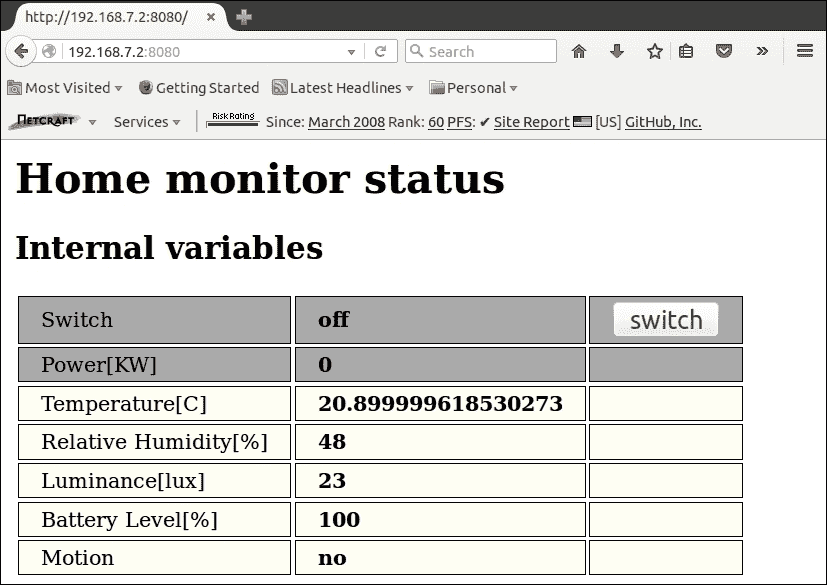

现在，我可以通过按下**开关**按钮来尝试开启连接到墙插的打印机。我从`zwmanager.py`程序中收到了以下消息：

```
zwmanager.py[5002]: managing /set...
zwmanager.py[5002]: got label=switch
zwmanager.py[5002]: dev=FGWPE Wall Plug(9) name=Switch data=1
zwmanager.py[5002]: dev=FGWPE Wall Plug(9) name=Power data=0
zwmanager.py[5002]: dev=FGWPE Wall Plug(9) name=Power data=21
zwmanager.py[5002]: dev=FGWPE Wall Plug(9) name=Power data=30
zwmanager.py[5002]: dev=FGWPE Wall Plug(9) name=Power data=36
zwmanager.py[5002]: dev=FGWPE Wall Plug(9) name=Power data=13

```

与此同时，网页面板发生了如下变化：

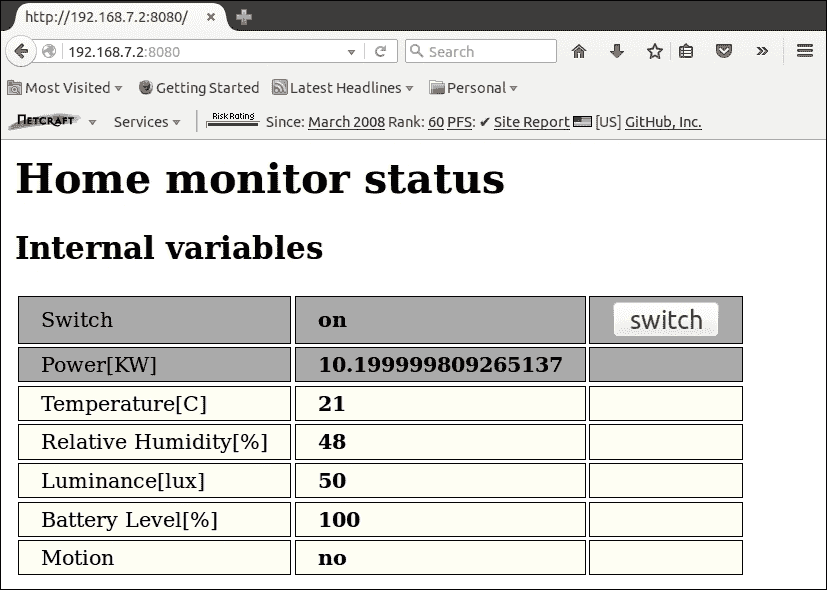

# 总结

在本章中，我们发现了如何实现一个基本的家居管理系统，该系统具有一个 Web 界面，可以控制两个 Z-Wave 设备，用来监控一些环境数据并控制墙插。

尽管所展示的代码有点复杂，但它可以很容易地扩展以支持更多的 Z-Wave 设备，从而管理一个真正复杂的网络。
