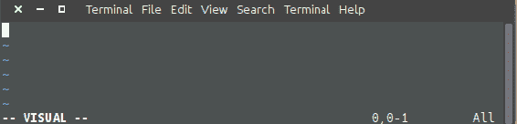

# 第一章：Bash 快速入门

本章的主要目的是让你掌握足够的 Linux shell/Bash 知识，以便你能够顺利启动并运行，之后的内容就会变得简单易懂。

在本章中，我们将涵盖以下主题：

+   开始学习 Bash 和 CLI 基础

+   创建和使用基本变量

+   隐藏的 Bash 变量和保留字

+   使用 if、else 和 elseif 的条件逻辑

+   case/switch 语句和循环结构

+   使用函数和参数

+   包括源文件

+   解析程序输入参数

+   标准输入、标准输出和标准错误

+   使用管道链接命令

+   查找更多关于 Bash 中使用的命令的信息

本章将为你提供完成本书其余章节食谱所需的基础知识。

# 开始学习 Bash 和 CLI 基础

首先，我们需要打开一个 Linux 终端或 shell。根据你所使用的 Linux 发行版，这可以通过多种方式完成，但在 Ubuntu 中，最简单的方法是导航到应用程序菜单并找到标有“终端”的程序。终端或 shell 是用户输入命令并在同一 shell 中执行命令的地方。简而言之，结果（如果有的话）会显示出来，终端将保持打开状态，等待输入新命令。一旦 shell 被打开，一个*提示符*将会出现，类似于以下内容：

```
rbrash@moon:~$
```

提示符的格式为 `username@YourComputersHostName`，后面跟着一个分隔符。在本书的整本食谱中，你会看到命令使用用户 `rbrash`；这是作者名字（Ron Brash）的缩写，在你的情况下，它将与你的用户名相匹配。

它也可能看起来类似于：

```
root@hostname #
```

`$` 表示普通用户，而 `#` 表示 root 用户。在 Linux 和 Unix 系统中，root 指的是*root 用户*，类似于 Windows 中的管理员账户。它可以执行任何任务，因此在使用具有 root 权限的用户时应该小心。例如，root 用户可以访问操作系统中的所有文件，并且还可以删除操作系统使用的任何或所有关键文件，这可能会导致系统无法使用或崩溃。

当终端或 shell 运行时，Bash shell 会以一组特定于用户 bash 配置文件的参数和命令执行。这个配置文件通常称为 `.bashrc`，它可以用于包含命令别名、快捷方式、环境变量和其他用户增强功能，例如提示符颜色。它位于 `~/.bashrc 或 ~/.bash_profile`。

`~ 或 ~/` 是用户主目录的快捷方式。它与 `/home/yourUserName/` 等效，对于 root 用户来说，它是 `/root`。

用户的 Bash shell 还会包含一个记录用户执行的所有命令的历史记录（位于 `~/.bash_history`），可以通过 `history` 命令查看，如下所示：

```
rbrash@moon:~$ history
1002 ls
1003 cd ../
1004 pwd
1005 whoami
1006 history
```

例如，您的第一个命令可能是使用`ls`来确定目录的内容。命令`cd`用于切换到父目录上方的某个目录。`pwd`命令用于返回当前工作目录的完整路径（例如，终端当前所在的目录）。

您可能还会在 shell 上执行另一个命令`whoami`，该命令将返回当前登录到 shell 的用户：

```
rbrash@moon:/$ whoami
rbrash
rbrash@moon:/$
```

使用输入命令的概念，我们可以将这些（或任何）命令放入*shell 脚本*中。以最简化的方式表示，shell 脚本看起来如下：

```
#!/bin/bash
# Pound or hash sign signifies a comment (a line that is not executed)
whoami      #Command returning the current username
pwd         #Command returning the current working directory on the filesystem
ls          # Command returning the results (file listing) of the current working directory
echo “Echo one 1”; echo “Echo two 2” # Notice the semicolon used to delimit multiple commands in the same execution.
```

第一行包含解释器的路径，并告诉 shell 在解释此脚本时使用哪个解释器。第一行*始终*包含 shebang（`#!`）和路径前缀，二者之间没有空格：

```
#!/bin/bash
```

脚本不能自行执行；它需要由用户执行或*被*另一个程序、系统或其他脚本调用。脚本的执行还需要具备*可执行*权限，用户可以授予这些权限以使其变为可执行；这可以通过`chmod`命令完成。

要添加或*授予*基本可执行权限，请使用以下命令：

```
$ chmod a+x script.sh
```

执行脚本时，可以使用以下方法之一：

```
$ bash script.sh          # if the user is currently in the same directory as the script
$ bash /path/to/script.sh # Full path
```

如果应用了正确的权限，并且 shebang 和 Bash 解释器路径正确，您可以使用以下两条命令来执行`script.sh`：

```
$ ./script.sh # if the user is currently in the same directory as the script
$ /path/to/script.sh # Full path
```

从前面的命令片段中，您可能会注意到一些关于路径的事情。脚本、文件或可执行文件的路径可以使用*相对*地址和`完整路径`来引用。相对地址有效地告诉解释器执行当前目录中可能存在的内容，或使用用户的全局 shell `$PATH` 变量。例如，系统知道二进制文件或可执行二进制文件存储在`/usr/bin`、`/bin/`和`/sbin`中，并会首先在这些目录中查找。完整路径更加具体且*硬编码*；解释器会尝试使用完整路径。例如，`/bin/ls`或`/usr/local/bin/myBinary`。

当您想在当前工作目录中运行二进制文件时，可以使用`./script.sh`、bash `script.sh`，甚至是完整路径。当然，每种方法都有其优缺点。

当您确切知道某个二进制文件在特定系统上的位置时，硬编码或完整路径可能很有用，特别是在由于潜在的安全或系统配置原因，无法依赖`$PATH`变量时。

当需要灵活性时，相对路径非常有用。例如，程序`ABC`可以位于`/usr/bin`或`/bin`位置，但可以简单地使用 ABC 来调用，而不是`/pathTo/ABC`。

到目前为止，我们已经介绍了基本的 Bash 脚本样式，并简要介绍了一些非常基础但关键的命令和路径。然而，要创建脚本，你需要一个编辑器！在 Ubuntu 中，通常默认情况下，你可以使用几种编辑器来创建 Bash 脚本：vi/vim、nano 和 gedit。还有许多其他的文本编辑器或 **集成开发环境**（**IDE**）可供选择，但这取决于个人偏好，读者可以根据自己的喜好选择一个。无论选择哪个文本编辑器，本书中的所有示例和教程都可以遵循。

在资源受限的环境中，例如树莓派，不使用像 Eclipse、Emacs 或 Geany 这样的完整编辑器，仍然可以使用它们作为灵活的集成开发环境（IDE）。

当你希望通过 SSH 远程或在控制台上创建或修改脚本时，了解 vi/vim 和 nano 非常有用。虽然 vi/vim 看起来有些过时，但当你最喜欢的编辑器没有安装或无法访问时，它就能派上用场。

# 使用 Vim 编写你的第一个 Bash 脚本

让我们从使用改进版的 vi（称为 `vim`）创建脚本开始。如果 Vim（增强版 VI）没有安装，可以使用 `sudo` 或 `root` 权限通过以下命令进行安装（`-y` 是 yes 的简写）：

```
For Ubuntu or Debian based distributions
$ sudo apt-get -y install vim
For CentOS or RHEL
$ sudo yum install -y vim
For Fedora
$ sudo dnf install -y vim
```

打开终端并输入以下命令，首先查看当前终端导航到哪里，并使用 `vim` 创建脚本：

```
$ pwd
/home/yourUserName
$ vim my_first_script.sh
```

终端窗口将转换为 Vim 应用程序（类似于下图），你将准备好编写第一个脚本。与此同时，按下 *Esc* + *I* 键进入插入模式；左下角会有指示符，光标块开始闪烁：



要在 Vim 中导航，你可以使用许多键盘快捷键，但箭头键是最简单的，可以将光标向上、下、左、右移动。将光标移动到第一行的开头并输入以下内容：

```
#!/bin/bash
# Echo this is my first comment
echo "Hello world! This is my first Bash script!"
echo -n "I am executing the script with user: "
whoami
echo -n "I am currently running in the directory: "
pwd
exit 0
```

我们已经介绍了注释的概念和一些基本命令，但还没有介绍灵活的 `echo` 命令。`echo` 命令可以用来将文本输出到控制台或文件中，`-n` 标志可以打印文本而不包含换行符（换行符的效果与按下 *Enter* 键相同）——这使得 `whoami` 和 `pwd` 命令的输出能够显示在同一行。

程序退出时返回 `0` 状态，表示它以正常状态退出。随着我们进一步了解如何搜索或检查命令的退出状态，错误和其他条件也将涵盖此内容。

完成后，按 *Esc* 键退出插入模式；返回命令模式并输入 `:`，然后可以执行 vim 命令 *w* + *q*。总结起来，键入以下键序列：*Esc*，然后 *:wq*。这将通过写入磁盘（w）并退出（q）来退出 Vim，并将你带回控制台。

您可以通过查阅其文档使用 Linux 手册页或参考 Packt 提供的一个兄弟书籍获得有关 Vim 的更多信息（[`www.packtpub.com/application-development/hacking-vim-72`](https://www.packtpub.com/application-development/hacking-vim-72)）。

要执行您的第一个脚本，请输入`bash my_first_script.sh`命令，控制台将返回类似的输出：

```
$ bash my_first_script.sh 
Hello world! This is my first Bash script!
I am executing the script with user: rbrash
I am currently running in the directory: /home/rbrash
$ 
```

恭喜您——您已经创建并执行了您的第一个 Bash 脚本。有了这些技能，您可以开始创建更复杂的脚本来自动化和简化几乎任何日常 CLI 例程。

# 创建和使用基本变量

将变量视为值的占位符是最好的方式。它们可以是永久的（静态的）或瞬时的（动态的），并且它们将有一个称为**作用域**的概念（稍后详述）。为了准备使用变量，我们需要考虑刚刚编写的脚本：`my_first_script.sh`。在脚本中，我们可以轻松地使用变量来包含静态值（每次都在那里）或通过每次运行脚本创建的动态值。例如，如果我们想使用像`PI`的值（`3.14`的值），那么我们可以像这样使用一个变量来编写这段简短的脚本：

```
PI=3.14
echo "The value of PI is $PI"
```

如果包含在完整脚本中，脚本片段将输出：

```
The value of Pi is 3.14
```

请注意，将一个值（`3.14`）分配给变量的想法被称为赋值。我们*赋予*了变量名为`PI`的变量值为`3.14`。我们还使用`$PI`引用了`PI`变量。这可以通过多种方式实现：

```
echo "1\. The value of PI is $PI"
echo "2\. The value of PI is ${PI}"
echo "3\. The value of PI is" $PI
```

这将输出以下内容：

```
1\. The value of PI is 3.14
2\. The value of PI is 3.14
3\. The value of PI is 3.14
```

虽然输出是相同的，但机制略有不同。在第 1 版中，我们在双引号中引用`PI`变量，这表示一个**字符串（字符数组）**。我们也可以使用单引号，但这将使其成为**字面字符串**。在第 2 版中，我们在`{ }`或*squiggly*大括号内引用变量；这对于在可能破坏脚本的情况下保护变量非常有用。以下是一个例子：

```
echo "1\. The value of PI is $PIabc" # Since PIabc is not declared, it will be empty string
echo "2\. The value of PI is ${PI}"  # Still works because we correctly referred to PI
```

如果任何变量未声明然后我们尝试使用它，那个变量将被初始化为空字符串。

以下命令将把数值转换为字符串表示。在我们的示例中，`$PI`仍然是一个包含数字的变量，但我们也可以像这样创建`PI`变量：

```
PI="3.14" # Notice the double quotes ""
```

这将包含一个字符串而不是数值，比如**整数或浮点数**。

数据类型的概念在本手册中没有得到充分探讨。最好将其作为读者探索的主题，因为它是编程和计算机使用的基本概念。

等等！你说数字和字符串之间有区别？当然有，因为如果没有转换（或者一开始没有正确设置），这可能会限制你能做的事情。例如，3.14 与 3.14（数字）是不一样的。3.14 由四个字符组成：3 + . + 1 + 4。如果我们想对以字符串形式表示的 PI 值进行乘法运算，要么计算/脚本会出错，要么我们会得到一个毫无意义的答案。

我们将在后续的第二章中进一步讲解转换内容，*像打字机和文件浏览器一样工作*。

假设我们想将一个变量赋值给另一个变量。我们可以这样做：

```
VAR_A=10
VAR_B=$VAR_A
VAR_C=${VAR_B}
```

如果前面的代码片段在一个有效的 Bash 脚本中，我们会为每个变量得到值 10。

# 动手实践变量赋值

打开一个新的空白文件并添加以下内容：

```
#!/bin/bash

PI=3.14
VAR_A=10
VAR_B=$VAR_A
VAR_C=${VAR_B}

echo "Let's print 3 variables:"
echo $VAR_A
echo $VAR_B
echo $VAR_C

echo "We know this will break:"
echo "0\. The value of PI is $PIabc"     # since PIabc is not declared, it will be empty string

echo "And these will work:"
echo "1\. The value of PI is $PI"
echo "2\. The value of PI is ${PI}"
echo "3\. The value of PI is" $PI

echo "And we can make a new string"
STR_A="Bob"
STR_B="Jane"
echo "${STR_A} + ${STR_B} equals Bob + Jane"
STR_C=${STR_A}" + "${STR_B}
echo "${STR_C} is the same as Bob + Jane too!"
echo "${STR_C} + ${PI}"

exit 0
```

注意命名法。使用标准化机制来命名变量是很好的，但如果多次使用`STR_A`和`VAR_B`，显然它们不够具描述性。未来，我们将使用更具描述性的名称，比如`VAL_PI`表示 PI 的值，或者`STR_BOBNAME`表示代表 Bob 名字的字符串。在 Bash 中，通常使用大写字母来描述变量，因为这样可以增加清晰度。

按下保存并退出到终端（如果终端尚未打开，请打开一个）。在应用适当的权限后执行脚本，你应该会看到以下输出：

```
Lets print 3 variables:
10
10
10
We know this will break:
0\. The value of PI is 
And these will work:
1\. The value of PI is 3.14
2\. The value of PI is 3.14
3\. The value of PI is 3.14
And we can make a new string
Bob + Jane equals Bob + Jane
Bob + Jane is the same as Bob + Jane too!
Bob + Jane + 3.14
```

首先，我们看到如何使用三个变量，为它们赋值，并打印它们。其次，我们通过演示看到，连接字符串时解释器可能会出错（我们要记住这一点）。第三，我们打印了我们的`PI`变量，并用`echo`将其连接到一个字符串中。最后，我们进行了几种不同的连接方式，包括最终版本，它将一个数字值转换并附加到字符串中。

# 隐藏的 Bash 变量和保留字

等等——有隐藏变量和保留字吗？是的！有一些单词你不能直接在脚本中使用，除非它们被正确地包含在某个构造中，比如字符串。全局变量可在**全局上下文**中使用，这意味着它们对当前 shell 或打开的 shell 控制台中的所有脚本可见。在后面的章节中，我们将进一步探讨全局 shell 变量，但目前你需要了解的是，有一些有用的变量可以供你重复使用，例如`$USER`、`$PWD`、`$OLDPWD`和`$PATH`。

若要查看所有 shell 环境变量的列表，可以使用`env`命令（输出已被截短）：

```
$ env
XDG_VTNR=7
XDG_SESSION_ID=c2
CLUTTER_IM_MODULE=xim
XDG_GREETER_DATA_DIR=/var/lib/lightdm-data/rbrash
SESSION=ubuntu
SHELL=/bin/bash
TERM=xterm-256color
XDG_MENU_PREFIX=gnome-
VTE_VERSION=4205
QT_LINUX_ACCESSIBILITY_ALWAYS_ON=1
WINDOWID=81788934
UPSTART_SESSION=unix:abstract=/com/ubuntu/upstart-session/1000/1598
GNOME_KEYRING_CONTROL=
GTK_MODULES=gail:atk-bridge:unity-gtk-module
USER=rbrash
....
```

修改`PATH`环境变量非常有用，但也可能会让人感到沮丧，因为它包含了二进制文件的文件系统路径。例如，你的二进制文件可能位于`/bin`、`/sbin`或`/usr/bin`目录中，但当你运行某个命令时，系统会在你没有指定路径的情况下直接执行该命令。

好的，我们已经确认了预先存在的变量以及用户或其他程序可能创建的新全局变量的存在。在使用可能具有高概率相似命名的变量时，请务必使其特定于您的应用程序。

除了隐藏变量外，还有一些保留用于脚本或 Shell 内部的词语。例如，`if` 和 `else` 是用于为脚本提供条件逻辑的词语。想象一下，如果您创建了一个与已存在的命令、变量或函数（稍后详述）同名的命令，脚本可能会中断或执行错误的操作。

在尝试避免任何命名冲突（或命名空间冲突）时，请尝试通过附加或前缀标识符使您的变量更可能被您的应用程序使用。

以下列表包含一些您可能会遇到的常见保留字。其中一些可能看起来非常熟悉，因为它们告诉 Bash 解释器以特定方式解释任何文本，重定向输出，后台运行应用程序，甚至在其他编程/脚本语言中使用。

+   `if`, `elif`, `else`, `fi`

+   `while`, `do`, `for`, `done`, `continue`, `break`

+   `case`, `select`, `time`

+   `function`

+   `&`, `|`, `>`, `<`, `!`, `=`

+   `#`, `$`, `(, )`, `;`, `{, }`, `[, ]`, `\`

欲查看完整参考，请访问：[`www.gnu.org/software/bash/manual/html_node/Reserved-Word-Index.html`](https://www.gnu.org/software/bash/manual/html_node/Reserved-Word-Index.html).

列表中的最后一个元素包含一组特定字符，告诉 Bash 执行特定的功能。井号标志着例如注释的开始。但是反斜杠 `\` 是非常特殊的，因为它是一个**转义字符**。转义字符用于*转义*或*停止*解释器在看到这些特定字符时执行特定功能。例如：

```
$ echo # Comment

$ echo \# Comment
# Comment
```

在 第二章 中，即《如打字机和文件资源管理器一样操作》时，处理字符串和单/双引号时，转义字符将非常有用。

转义字符阻止在斜杠后执行下一个字符。但是，当处理换行符 (`\n`, `\r\n`) 和空字节 (`\0`) 时，这种行为不一定是一致的。

# 使用 `if`, `else` 和 `elseif` 进行条件逻辑

前一节介绍了几个保留字和一些会影响 Bash 运行的字符。其中最基本且可能被广泛使用的条件逻辑是使用 `if` 和 `else` 语句。让我们使用一个代码片段作为例子：

```
#!/bin/bash
AGE=17
if [ ${AGE} -lt 18 ]; then
 echo "You must be 18 or older to see this movie"
fi
```

注意 `if` 语句中方括号前后的空格。Bash 对括号语法要求格外严格。

如果我们使用小于（`<`）或`-lt`来评估变量`age`（Bash 提供了许多用于评估变量的语法构造），我们需要使用`if`语句。在我们的`if`语句中，如果`$AGE`小于`18`，我们将输出消息`You must be 18 or older to see this movie`。否则，脚本将不会执行`echo`语句，而是继续执行。注意，`if`语句以保留字`fi`结束。这不是错误，符合 Bash 语法要求。

假设我们想使用`else`添加一个通用的捕获条件。如果`if`语句的`then`命令块不满足条件，则会执行`else`。

```
#!/bin/bash
AGE=40
if [ ${AGE} -lt 18 ]
then
    echo "You must be 18 or older to see this movie"
else
    echo "You may see the movie!"
    exit 1
fi
```

当`AGE`设置为整数值`40`时，`if`语句中的`then`命令块将不满足条件，`else`命令块将被执行。

# 评估二进制数字

假设我们想引入另一个`if`条件并使用`elif`（即*else if*的缩写）：

```
#!/bin/bash
AGE=21
if [ ${AGE} -lt 18 ]; then
 echo "You must be 18 or older to see this movie"
elif [ ${AGE} -eq 21 ]; then
 echo "You may see the movie and get popcorn"
else
 echo "You may see the movie!"
 exit 1
fi

echo "This line might not get executed"
echo:
```

```
You may see the movie and get popcorn
This line might not get executed
```

使用`if`、`elif`和`else`，结合其他评估方法，我们可以执行特定的逻辑分支和函数，甚至退出脚本。要评估原始的二进制变量，请使用以下**运算符**：

+   `-gt`（大于 >）

+   `-ge`（大于或等于 >=）

+   `-lt`（小于 <）

+   `-le`（小于或等于 <=）

+   `-eq`（等于）

+   `-nq`（不等于）

# 评估字符串

如变量小节所述，数字值与字符串不同。字符串通常按如下方式进行评估：

```
#!/bin/bash
MY_NAME="John"
NAME_1="Bob"
NAME_2="Jane"
NAME_3="Sue"
Name_4="Kate"

if [ "${MY_NAME}" == "Ron" ]; then
    echo "Ron is home from vacation"
elif [ "${MY_NAME}" != ${NAME_1}" && "${MY_NAME}" != ${NAME_2}" && "${MY_NAME}" == "John" ]; then
    echo "John is home after some unnecessary AND logic"
elif [ "${MY_NAME}" == ${NAME_3}" || "${MY_NAME}" == ${NAME_4}" ]; then
    echo "Looks like one of the ladies are home"
else
    echo "Who is this stranger?"
fi
MY_NAME variable will be executed and the string John is home after some unnecessary AND logic will be echoed to the console. In the snippet, the logic flows like this:
```

1.  如果`MY_NAME`等于`Ron`，则执行`echo "Ron is home from vacation"`

1.  否则，如果`MY_NAME`不等于`NAME_1` **并且**`MY_NAME`不等于`NAME_2` **并且**`MY_NAME`等于`John`，则执行`echo "John is home after some unnecessary AND logic"`

1.  否则如果`MY_NAME`等于`NAME_3` **或** `MY_NAME`等于`NAME_4`，则执行`echo "Looks like one of the ladies"`

1.  否则`echo "Who is this stranger?"`

注意运算符：`&&`、`||`、`==`和`!=`

+   `&&`（表示和）

+   `||`（表示或）

+   `==`（等于）

+   `!=`（不等于）

+   `-n`（不是空的或未设置）

+   `-z`（为空且长度为零）

在计算机世界中，Null 表示未设置或为空。你可以在脚本中使用许多不同类型的运算符或测试。欲了解更多信息，请查看：[`tldp.org/LDP/abs/html/comparison-ops.html`](http://tldp.org/LDP/abs/html/comparison-ops.html)和[`www.gnu.org/software/bash/manual/html_node/Shell-Arithmetic.html#Shell-Arithmetic`](https://www.gnu.org/software/bash/manual/html_node/Shell-Arithmetic.html#Shell-Arithmetic)

你还可以像字符串一样评估数字，使用`((" $a" > "$b"))`或`[[ "$a" > "$b" ]]`。注意使用了双括号和方括号。

# 嵌套的`if`语句

如果单一层级的`if`语句不足以满足需求，且你希望在`if`语句中添加额外的逻辑，你可以创建**嵌套条件语句**。可以通过以下方式来实现：

```
#!/bin/bash
USER_AGE=18
AGE_LIMIT=18
NAME="Bob" # Change to your username if you want to execute the nested logic
HAS_NIGHTMARES="true"

if [ "${USER}" == "${NAME}" ]; then
    if [ ${USER_AGE} -ge ${AGE_LIMIT} ]; then
        if [ "${HAS_NIGHTMARES}" == "true" ]; then
            echo "${USER} gets nightmares, and should not see the movie"
        fi
    fi
else
    echo "Who is this?"
fi
```

# `case/switch`语句和循环结构

除了`if`和`else`语句，Bash 还提供了 case 或 switch 语句以及循环结构，可以用来简化逻辑，使其更易读和可持续。想象一下，如果有很多`elif`评估的`if`语句，它会变得很繁琐！

```
#!/bin/bash
VAR=10

# Multiple IF statements
if [ $VAR -eq 1 ]; then
    echo "$VAR"
elif [ $VAR -eq 2]; then
    echo "$VAR"
elif [ $VAR -eq 3]; then
    echo "$VAR"
# .... to 10
else
    echo "I am not looking to match this value"
fi
```

在大量的`if`和`elif`条件逻辑块中，每个`if`和`elif`需要在执行特定的代码分支之前进行评估。使用 case/switch 语句可能更快，因为第一个匹配的条件会被执行（而且看起来更简洁）。

# 基本的 case 语句

你可以用**case 语句**代替`if`/`else`语句来评估一个变量。请注意，`esac`是反向拼写的，用来退出 case 语句，类似于`fi`用于`if`语句。

Case 语句遵循以下流程：

```
case $THING_I_AM_TO_EVALUATE in
  1) # Condition to evaluate is number 1 (could be "a" for a string too!)
    echo "THING_I_AM_TO_EVALUATE equals 1"
    ;; # Notice that this is used to close this evaluation
  *) # * Signified the catchall (when THING_I_AM_TO_EVALUATE does not equal values in the switch)
    echo "FALLTHOUGH or default condition"
esac # Close case statement
```

以下是一个可运行的示例：

```
#!/bin/bash
VAR=10 # Edit to 1 or 2 and re-run, after running the script as is.
case $VAR in
  1)
    echo "1"
    ;;
  2)
    echo "2"
    ;;
  *)
    echo "What is this var?"
    exit 1
esac
```

# 基本循环

你能想象遍历一个文件列表或动态数组，单调地评估每一个文件吗？或者等到某个条件为真？对于这些类型的场景，你可能想使用**for 循环、do while 循环或 until 循环**来优化你的脚本，使得操作更简单。for 循环、do while 循环和 until 循环可能看起来相似，但它们之间有细微的差别。

# For 循环

`for`循环通常用于你需要对数组中的每个条目执行多个任务或命令时，或者*希望在有限数量的项上执行给定命令*。在这个例子中，我们有一个包含三个元素的数组（或列表）：`file1`、`file2`和`file3`。`for`循环将`echo`每个`FILES`中的元素并退出脚本：

```
#!/bin/bash

FILES=( "file1" "file2" "file3" )
for ELEMENT in ${FILES[@]}
do
        echo "${ELEMENT}"
done

echo "Echo\'d all the files" 
```

# Do while 循环

作为替代，我们包括了`do while`循环。它与`for`循环相似，但更适用于*动态条件*，比如当你不知道什么时候会返回某个值，或者在满足条件之前一直执行任务时。方括号中的条件与*if*语句相同：

```
#!/bin/bash
CTR=1
while [ ${CTR} -lt 9 ]
do
    echo "CTR var: ${CTR}"
    ((CTR++)) # Increment the CTR variable by 1
done
echo "Finished"
```

# Until 循环

为了完整性，我们包括了`until`循环。它并不常用，几乎与`do while`循环相同。请注意，它的条件和操作与递增计数器直到某个值达到时的一致：

```
#!/bin/bash
CTR=1
until [ ${CTR} -gt 9 ]
do
    echo "CTR var: ${CTR}"
    ((CTR++)) # Increment the CTR variable by 1
done
echo "Finished"
```

# 使用函数和参数

到目前为止，我们提到函数是一个保留字，仅用于单个过程的 Bash 脚本中，那么什么是函数呢？

为了说明什么是函数，首先我们需要定义什么是函数——**函数**是一个自包含的代码段，执行单一任务。然而，执行某项任务的函数可能还会执行多个子任务来完成其主要任务。

例如，你可以创建一个名为`file_creator`的函数，执行以下任务：

1.  检查文件是否存在。

1.  如果文件存在，截断它。否则，创建一个新文件。

1.  应用正确的权限。

函数也可以传递参数。**参数**就像变量，可以在函数外部设置，然后在函数内部使用。这非常有用，因为我们可以创建执行通用任务的代码段，其他脚本或甚至循环内的代码都可以重用。你也可以有**局部**变量，它们在函数外部不可访问，仅在函数内部使用。那么函数是什么样子的呢？

```
#!/bin/bash
function my_function() {
    local PARAM_1="$1"
    local PARAM_2="$2"
    local PARAM_3="$3"
    echo "${PARAM_1} ${PARAM_2} ${PARAM_3}"
}
my_function "a" "b" "c"
```

正如我们在简单脚本中看到的那样，有一个使用`function`保留字声明的名为`my_function`的函数。函数的内容包含在大括号`{}`内，并引入了三个新概念：

+   **参数**是这样系统地引用的：`$1`代表参数 1，`$2`代表参数 2，`$3`代表参数 3，依此类推。

+   `local`关键字指的是带有此关键字声明的变量仅在该函数内部可访问。

+   我们可以仅通过名称调用函数，并简单地添加参数，就像在前面的示例中一样。

在接下来的部分，我们将深入探讨一个更实际的示例，这将使这个观点更清晰：函数是日常有用的，并且能够在适当的地方让任何部分的功能变得易于重用。

# 在 for 循环中使用带参数的函数

在这个简短的示例中，我们有一个名为`create_file`的函数，它在`FILES`数组中的每个文件上调用。该函数创建一个文件，修改其权限，然后使用`ls`命令被动地检查其存在性：

```
#!/bin/bash
FILES=( "file1" "file2" "file3" ) # This is a global variable

function create_file() {
    local FNAME="${1}" # First parameter
    local PERMISSIONS="${2}" # Second parameter
    touch "${FNAME}"
    chmod "${PERMISSIONS}" "${FNAME}"
    ls -l "${FNAME}"
}

for ELEMENT in ${FILES[@]}
do
        create_file "${ELEMENT}" "a+x"
done

echo "Created all the files with a function!"
exit 0
```

# 包含源文件

除了函数外，我们还可以创建多个脚本并将它们包含在内，这样我们就可以利用任何共享的变量和函数。

假设我们有一个包含多个用于创建文件的函数的库或工具脚本。这个脚本本身可能在多个脚本任务中有用或**可重用**，因此我们使其与程序无关。然后，我们有另一个脚本，这个脚本专门处理一个任务：执行无用的文件系统操作（IO）。在这种情况下，我们将有两个文件：

1.  `io_maker.sh`（包括`library.sh`并使用`library.sh`中的函数）

1.  `library.sh`（包含已声明的函数，但不执行它们）

`io_maker.sh`脚本简单地导入或包含了`library.sh`脚本，并继承了任何全局变量、函数和其他包含内容。通过这种方式，`io_maker.sh`实际上认为这些可用的函数是它自己的，并且可以像它们是在其中定义的一样执行它们。

# 包含/导入库脚本并使用外部函数

为了准备这个示例，创建以下两个文件并打开它们：

+   `io_maker.sh`

+   `library.sh`

在`library.sh`中，添加以下内容：

```
#!/bin/bash

function create_file() {
    local FNAME=$1
    touch "${FNAME}"
    ls "${FNAME}" # If output doesn't return a value - file is missing
}

function delete_file() {
    local FNAME=$1
    rm "${FNAME}"
    ls "${FNAME}" # If output doesn't return a value - file is missing
}
```

在`io_maker.sh`中，添加以下内容：

```
#!/bin/bash

source library.sh # You may need to include the path as it is relative
FNAME="my_test_file.txt"
create_file "${FNAME}"
delete_file "${FNAME}"

exit 0
```

当你运行脚本时，应该得到相同的输出：

```
$ bash io_maker.sh
my_test_file.txt
ls: cannot access 'my_test_file.txt': No such file or directory
```

尽管不明显，但我们可以看到两个函数都被执行了。第一行输出是 `ls` 命令，在 `create_file()` 中创建文件后成功找到 `my_test_file.txt`。在第二行中，我们可以看到当删除作为参数传入的文件时，`ls` 返回了一个错误。

不幸的是，直到现在，我们只能创建和调用函数，并执行命令。下一步将在下一节中讨论，获取命令和函数的返回码或字符串。

# 获取返回码和输出

到目前为止，我们一直在间歇性地使用 `exit` 命令退出脚本。对于那些好奇的人，你们可能已经在网上查找过这个命令的作用，但需要记住的关键概念是，*每个*脚本、命令或二进制文件都会以*返回码*退出。返回码是数字，并且被限制在 0 到 255 之间，因为使用的是无符号的 8 位整数。如果使用 `-1`，则会返回 `255`。

好的，那么返回码有哪些用处呢？返回码在你想知道在执行匹配时是否找到匹配项时非常有用（例如），以及命令是否完全成功或出现错误。让我们通过一个实际示例来探索使用 `ls` 命令的情况：

```
$ ls ~/this.file.no.exist
ls: cannot access '/home/rbrash/this.file.no.exist': No such file or directory
$ echo $?
2
$ ls ~/.bashrc 
/home/rbrash/.bashrc
$ echo $?
0
```

注意返回值吗？在这个例子中，`0` 或 `2` 表示成功（0）或出现错误（1 和 2）。这些值是通过获取 `$?` 变量获得的，我们甚至可以像这样将其设置为一个变量：

```
$ ls ~/this.file.no.exist
ls: cannot access '/home/rbrash/this.file.no.exist': No such file or directory
$ TEST=$?
$ echo $TEST
2
```

从这个例子中，我们现在知道了返回码是什么，以及如何利用它们来获取从函数、脚本和命令返回的结果。

# 返回码 101

深入终端并创建以下 Bash 脚本：

```
#!/bin/bash
GLOBAL_RET=255

function my_function_global() {
    ls /home/${USER}/.bashrc
    GLOBAL_RET=$?
}
function my_function_return() {
    ls /home/${USER}/.bashrc
    return $?
}
function my_function_str() {
    local UNAME=$1
    local OUTPUT=""
    if [ -e /home/${UNAME}/.bashrc ]; then
        OUTPUT='FOUND IT'
    else
        OUTPUT='NOT FOUND'
    fi
    echo ${OUTPUT}
}

echo "Current ret: ${GLOBAL_RET}"
my_function_global "${USER}"
echo "Current ret after: ${GLOBAL_RET}"
GLOBAL_RET=255
echo "Current ret: ${GLOBAL_RET}"
my_function_return "${USER}"
GLOBAL_RET=$?
echo "Current ret after: ${GLOBAL_RET}"

# And for giggles, we can pass back output too!
GLOBAL_RET=""
echo "Current ret: ${GLOBAL_RET}"
GLOBAL_RET=$(my_function_str ${USER})
# You could also use GLOBAL_RET=`my_function_str ${USER}`
# Notice the back ticks "`"
echo "Current ret after: $GLOBAL_RET"
exit 0
```

脚本将在退出并返回码为 `0`（记住，`ls` 在成功运行时返回 `0`）之前输出以下内容：

```
rbrash@moon:~$ bash test.sh
Current ret: 255
/home/rbrash/.bashrc
Current ret after: 0
Current ret: 255
/home/rbrash/.bashrc
Current ret after: 0
Current ret: 
Current ret after: FOUND IT
$
```

在这一节中，有三个函数利用了三个概念：

1.  `my_function_global` 使用 `global` 变量来返回命令的返回码

1.  `my_function_return` 使用保留字 `return`** 和一个值（命令的返回码）

1.  `my_function_str` 使用 `fork`（一个特殊操作）来执行命令并获取输出（我们回显的字符串）

对于选项 3，有多种方法可以从函数中返回字符串，包括使用 `eval` 关键字。然而，在使用 `fork` 时，最好注意它在多次执行相同命令以获取输出时可能消耗的资源。

# 链接命令、管道和输入/输出

本节可能是本书中最重要的一部分，因为它描述了 Linux 和 Unix 上一个基本且强大的功能：使用管道并重定向输入或输出。就其本身而言，管道是一个相当简单的功能——命令和脚本可以将它们的输出重定向到文件或其他命令。那么，这有什么了不起的呢？在 Bash 脚本世界中，这几乎是对管道和重定向功能的极大低估，因为它们允许你通过其他命令或功能增强命令的功能。

让我们通过一个示例来看看如何使用名为 `tail` 和 `grep` 的命令。在这个例子中，用户 Bob 想要实时查看他的日志，但他只希望查找与无线接口相关的条目。Bob 的无线设备名称可以通过 `iwconfig` 命令找到：

```
$ iwconfig
wlp3s0 IEEE 802.11abgn ESSID:"127.0.0.1-2.4ghz" 
          Mode:Managed Frequency:2.412 GHz Access Point: 18:D6:C7:FA:26:B1 
          Bit Rate=144.4 Mb/s Tx-Power=22 dBm 
          Retry short limit:7 RTS thr:off Fragment thr:off
          Power Management:on
          Link Quality=58/70 Signal level=-52 dBm 
          Rx invalid nwid:0 Rx invalid crypt:0 Rx invalid frag:0
          Tx excessive retries:0 Invalid misc:90 Missed beacon:0

```

`iwconfig` 命令现在已被弃用。以下命令也会为你提供无线接口的信息：

```
$ iw dev                # This will give list of wireless interfaces
$ iw dev wlp3s0 link    # This will give detailed information about particular wireless interface
```

现在 Bob 知道了他无线网卡的标识名称（`wlp3s0`），他可以在系统日志中进行搜索。日志通常可以在 `/var/log/messages` 中找到。使用 `tail` 命令和 `-F` 标志（允许将日志持续输出到控制台），Bob 现在可以看到系统的 *所有* 日志。不幸的是，他希望通过 `grep` 过滤日志，使得只显示包含关键词 `wlp3s0` 的日志。

Bob 面临一个选择：他是持续搜索该文件，还是可以将 `tail` 和 `grep` 结合使用，以获取他所需要的结果？答案是肯定的——使用 *管道*！

```
$ tail -F /var/log/messages | grep wlp3s0
Nov 10 11:57:13 moon kernel: wlp3s0: authenticate with 18:d6:c7:fa:26:b1
Nov 10 11:57:13 moon kernel: wlp3s0: send auth to 18:d6:c7:fa:26:b1 (try 1/3)
Nov 10 11:57:13 moon kernel: wlp3s0: send auth to 18:d6:c7:fa:26:b1 (try 2/3)
...
```

当新的日志进入时，Bob 现在可以实时监控它们，并且可以通过 *Ctrl*+*C* 停止控制台输出。

使用管道，我们可以将多个命令组合成强大的混合命令，将每个命令的最佳特性扩展到单一命令行中。记住管道！

管道的使用和灵活性应该是相对直接的，但如果我们需要将命令的输入和输出进行重定向呢？这就需要引入三个命令，以便将信息从一个地方传送到另一个地方：

+   `stdin`（标准输入）

+   `stdout`（标准输出）

+   `stderr`（标准错误）

如果我们考虑的是一个 *单独* 的程序，`stdin` 是任何可以提供给它的内容，通常是作为参数或用户输入，**例如使用 read**。`stdout` 和 `stderr` 是两种 **流**，用于发送输出。通常，两个流的输出会显示在控制台上，但如果你只想将 `stderr` 流中的错误输出到文件呢？

```
$ ls /filethatdoesntexist.txt 2> err.txt
$ ls ~/ > stdout.txt
$ ls ~/ > everything.txt 2>&1 # Gets stderr and stdout
$ ls ~/ >> everything.txt 2>&1 # Gets stderr and stdout
$ cat err.txt
ls: cannot access '/filethatdoesntexist.txt': No such file or directory
$ cat stdout.txt
.... # A whole bunch of files in your home directory
```

```
>, 2>, and 2>&1. With the arrows we can redirect the output to any file or even to other programs!
```

注意单个 `>` 和双 `>>` 之间的区别。单个 `>` **会截断**所有输出到文件的内容，而 `>>` **会附加**内容到文件末尾。

当同时将`stderr`和`stdout`重定向到同一文件时，常会出现错误。Bash 应当先将输出写入文件，然后再重复输出文件描述符。有关文件描述符的更多信息，请参见：[`en.wikipedia.org/wiki/File_descriptor`](https://en.wikipedia.org/wiki/File_descriptor) `# 这是正确的`

`ls ~/ > everything.txt 2>&1`

`# 这是错误的`

`ls ~/ 2>&1> everything.txt`

现在我们已经了解了 Bash 中最强大的功能之一的基础知识，接下来让我们尝试一个例子——重定向和管道大作战。

# 重定向和管道大作战

打开一个 Shell 并在你喜欢的编辑器中创建一个新的 Bash 文件：

```
#!/bin/sh

# Let's run a command and send all of the output to /dev/null
echo "No output?"
ls ~/fakefile.txt > /dev/null 2>&1

# Retrieve output from a piped command 
echo "part 1"
HISTORY_TEXT=`cat ~/.bashrc | grep HIST`
echo "${HISTORY_TEXT}"

# Output the results to history.config
echo "part 2"
echo "${HISTORY_TEXT}" > "history.config"

# Re-direct history.config as input to the cat command
cat < history.config

# Append a string to history.config
echo "MY_VAR=1" >> history.config

echo "part 3 - using Tee"
# Neato.txt will contain the same information as the console
ls -la ~/fakefile.txt ~/ 2>&1 | tee neato.txt
```

首先，`ls`是产生错误的一种方式，而不是将错误输出推送到控制台，而是将其重定向到 Linux 中的一个特殊设备`/dev/null`。`/dev/null`特别有用，因为它是一个丢弃不会再使用的输入的地方。然后，我们将`cat`命令与`grep`结合使用，通过管道找到任何包含文本的行，并使用`fork`捕获输出到一个变量（`HISTORY_TEXT`）。

然后，我们使用`stdout`重定向将`HISTORY_TEXT`的内容回显到一个文件（`history.config`）中。使用`history.config`文件，我们将`cat`命令重定向为使用原始文件——这将在控制台上显示。

使用双重`>>`，我们将一个任意字符串追加到`history.config`文件中。

最后，我们使用重定向结束脚本，同时重定向`stdout`和`stderr`，管道以及`tee`命令。`tee`命令很有用，因为即使内容已经重定向到文件，它仍然可以用来显示内容（就像我们刚才演示的那样）。

# 获取程序输入参数

获取程序输入参数或参数与获取函数参数的方式非常相似，在最基本的层面，它们可以像`$1 (arg1)`，`$2 (arg2)`，`$3 (arg3)`等一样访问。然而，到目前为止，我们已经看到了一种叫做**标志**的概念，它允许你执行一些漂亮的操作，比如`-l`、`--long-version`、`-v 10`、`--verbosity=10`。**标志**实际上是一种用户友好的方式，可以在程序运行时传递参数或参数。例如：

```
bash myProgram.sh -v 99 --name=Ron -l Brash
```

现在你知道了标志是什么以及它们如何帮助你改进脚本，可以使用以下部分作为模板。

# 传递程序标志

在进入 Shell 并打开你喜欢的编辑器中新建一个文件后，让我们开始创建一个 Bash 脚本，实现以下功能：

+   当没有指定任何标志或参数时，它会打印帮助信息。

+   当设置了`-h`或`--help`标志时，它会打印帮助信息。

+   当设置了`-f`或`--firstname`标志时，它会设置名字变量。

+   当设置了`-l`或`--lastname`标志时，它会设置姓氏变量。

+   当设置了*`firstname`*和*`lastname`*标志时，它会打印欢迎信息并且不会报错。

除了基本的逻辑之外，我们可以看到代码利用了一个叫做`getopts`的功能。Getopts 允许我们抓取程序的参数标志，以便在程序中使用。还有一些我们也学过的基本构造——条件逻辑、while 循环和 case/switch 语句。一旦脚本发展成不仅仅是一个简单的工具或提供多个功能时，更基础的 Bash 构造就会变得司空见惯。

```
#!/bin/bash

HELP_STR="usage: $0 [-h] [-f] [-l] [--firstname[=]<value>] [--lastname[=]<value] [--help]"

# Notice hidden variables and other built-in Bash functionality
optspec=":flh-:"
while getopts "$optspec" optchar; do
    case "${optchar}" in
        -)
            case "${OPTARG}" in
                firstname)
                    val="${!OPTIND}"; OPTIND=$(( $OPTIND + 1 ))
                    FIRSTNAME="${val}"
                    ;;
                lastname)
                    val="${!OPTIND}"; OPTIND=$(( $OPTIND + 1 ))
                        LASTNAME="${val}"
                    ;;
                help)
                    val="${!OPTIND}"; OPTIND=$(( $OPTIND + 1 ))
                    ;;
                *)
                    if [ "$OPTERR" = 1 ] && [ "${optspec:0:1}" != ":" ]; then
                        echo "Found an unknown option --${OPTARG}" >&2
                    fi
                    ;;
            esac;;
        f)
                val="${!OPTIND}"; OPTIND=$(( $OPTIND + 1 ))
                FIRSTNAME="${val}"
                ;;
        l)
                val="${!OPTIND}"; OPTIND=$(( $OPTIND + 1 ))
                LASTNAME="${val}"
                ;;
        h)
            echo "${HELP_STR}" >&2
            exit 2
            ;;
        *)
            if [ "$OPTERR" != 1 ] || [ "${optspec:0:1}" = ":" ]; then
                echo "Error parsing short flag: '-${OPTARG}'" >&2
                exit 1
            fi

            ;;
    esac
done

# Do we have even one argument?
if [ -z "$1" ]; then
  echo "${HELP_STR}" >&2
  exit 2
fi

# Sanity check for both Firstname and Lastname
if [ -z "${FIRSTNAME}" ] || [ -z "${LASTNAME}" ]; then
  echo "Both firstname and lastname are required!"
  exit 3
fi

echo "Welcome ${FIRSTNAME} ${LASTNAME}!"

exit 0
```

执行前面的程序时，我们应该期待类似以下的响应：

```
$ bash flags.sh 
usage: flags.sh [-h] [-f] [-l] [--firstname[=]<value>] [--lastname[=]<value] [--help]
$ bash flags.sh -h
usage: flags.sh [-h] [-f] [-l] [--firstname[=]<value>] [--lastname[=]<value] [--help]
$ bash flags.sh --fname Bob
Both firstname and lastname are required!
rbrash@moon:~$ bash flags.sh --firstname To -l Mater
Welcome To Mater!
```

# 获取有关命令的更多信息

随着我们深入，您可能会看到本书广泛使用许多命令，且没有详尽的解释。为了不让本书充斥着 Linux 介绍和有用命令的内容，有几个非常实用的命令可供使用：`man`和`info`。

`man`命令，即手册命令，非常详细，甚至在同一条目在不同类别中存在时，有多个部分。对于调查可执行程序或 Shell 命令来说，第 1 类就足够了。我们来看一下 mount 命令的条目：

```
$ man mount
... 
MOUNT(8) System Administration MOUNT(8)
NAME
 mount - mount a filesystem
SYNOPSIS
 mount [-l|-h|-V]
 mount -a [-fFnrsvw] [-t fstype] [-O optlist]
 mount [-fnrsvw] [-o options] device|dir
 mount [-fnrsvw] [-t fstype] [-o options] device dir
DESCRIPTION
 All files accessible in a Unix system are arranged in one big tree, the
 file hierarchy, rooted at /. These files can be spread out over sev‐
 eral devices. The mount command serves to attach the filesystem found
 on some device to the big file tree. Conversely, the umount(8) command
 will detach it again.
...
(Press 'q' to Quit)
$
```

另外，还有`info`命令，如果信息页面存在，它会为你提供相关信息。

习惯`man`和`info`页面的风格，可以让你快速访问信息，从而节省时间，尤其是在没有网络连接时。

# 总结

在本章中，我们介绍了变量、类型和赋值的概念。我们还介绍了一些基础的 Bash 编程原语，如 for 循环、while 循环和 switch 语句。稍后，我们学习了函数的概念，它们的使用方式，以及如何传递

参数。

在下一章，我们将学习一些附加技术，使 Bash 更加强大。
