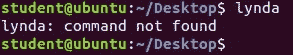
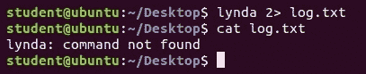
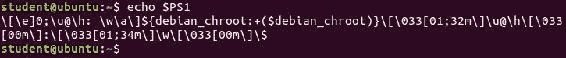
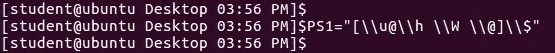
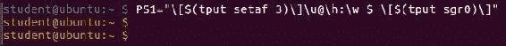
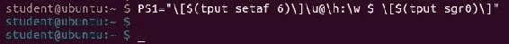
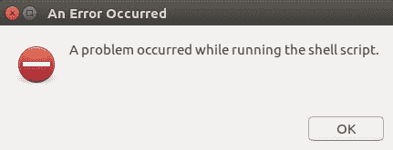
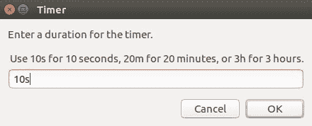
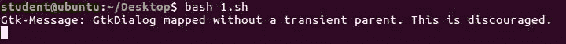

# 第八章：高级脚本编写技巧

本章将介绍以下内容：

+   计算和减少脚本的运行时间

+   编写单行条件语句和循环

+   避免“命令未找到”警告/错误并提高可移植性

+   创建配置文件并将其与脚本配合使用

+   改进你的 Shell – GCC 和命令行颜色

+   添加别名，修改用户路径/变量

+   将输出回显到原始终端设备

+   为 Bash 脚本创建简单的前端 GUI

+   编译和安装你自己的 Bash Shell

+   记录终端会话以实现自动化

+   通过示例编写高质量的脚本

# 介绍

本章将帮助读者学习高级脚本编写技巧，以及如何自定义他们的 Shell。用户将学习如何计算并减少脚本的运行时间。编写单行循环和条件语句将变得非常容易。用户将学习如何编写脚本以避免警告和错误，学习如何创建配置文件并使用它。用户还将学会如何改进 Shell，添加别名，修改路径变量，并将输出回显到终端设备。用户还将了解如何记录终端会话和编写脚本。

# 计算和减少脚本的运行时间

在这个示例中，我们将学习如何计算并减少脚本的运行时间。一个简单的`time`命令将有助于计算执行时间。

# 准备工作

除了打开终端外，请确保系统中已经存在必要的脚本。

# 如何操作…

现在，我们将编写一个简单的脚本，包含几个命令，然后使用`time`命令来获取该脚本的运行时间。创建一个名为`cal_runtime.sh`的脚本，并在其中写入以下代码。

```
clear
ls -l
date
sudo apt install python3
```

# 工作原理…

现在，我们已经编写了一个脚本`cal_runtime.sh`，并在该脚本中包含了四个命令：`clear`、`ls`、`date`和一个`python3`安装命令。按如下方式运行你的脚本：

```
$ time bash cal_runtime.sh
```

执行后，你将在输出的底部看到脚本的运行时间。

# 编写单行条件语句和循环

在这个示例中，我们将编写包含单行条件语句和循环语句的脚本。

# 准备工作

你需要具备基本的条件语句和循环语句知识。

# 如何操作…

现在我们将编写一个包含单行条件语句的脚本。在这个脚本中，我们将编写一个简单的`if`条件。创建一个名为`if_oneline.sh`的脚本，并在其中写入以下代码：

```
a=100
if [ $a -eq 100 ]; then echo "a is equal to $a"; fi
```

接下来，我们将编写一个包含单行`loop`语句的脚本。在其中，我们将编写一个执行 10 次的命令。创建一个名为`for_online.sh`的脚本，并在其中写入以下代码：

```
for i in {1..10}; do echo "Hello World"; done
```

现在，我们将编写一个包含单行`while`语句的脚本。这个脚本将是一个无限循环。创建一个名为`while_oneline.sh`的脚本，并在其中写入以下代码：

```
x=10
while [ $x -eq 10 ]; do echo $x; sleep 2; done
```

# 工作原理…

在本教程中，我们为一行 if 语句、for 循环和 while 循环编写了三个脚本。在 if 示例中，条件将被检查，然后输出将显示在屏幕上。

在 `for` 循环示例中，`echo` 命令将执行 10 次，"Hello world" 会在屏幕上显示 10 次。在 while 示例中，它将是一个无限循环。我们已设置了 `2` 秒的休眠时间，以便每 2 秒执行一次输出 10 的操作。

# 避免 "command not found" 警告/错误并提高可移植性

在本教程中，我们将学习如何避免 Shell 脚本中的警告和错误。为此，我们将使用重定向的概念。

# 准备中

除了打开终端外，你还需要具备重定向技术的基本知识。

# 如何操作...

有时，在调试你的 Shell 脚本时，你可能不想查看错误或警告信息以及标准输出。因此，我们将使用重定向技术。现在，我们将在终端中输入 `lynda` 命令，按如下方式运行该命令。

```
$ lynda
```



你将遇到 `command not found` 错误。我们可以通过运行以下命令来避免这个错误。

```
$ lynda 2> log.txt
```

我们将编写一个声明变量时语法错误的脚本。并将该错误信息重定向到 `log.txt`。创建一个名为 `avoid_error.sh` 的脚本，并在其中写入以下内容。

```
echo "Hello World"
a = 100
b=20
c=$((a+b))
echo $a
```

在第二行，`a = 100`，我们会遇到一个错误。

# 它是如何工作的...

无论你按下 *Enter* 后遇到什么错误信息，那个错误都会被存储在 `log.txt` 中。现在，按照以下方式查看 `log.txt` 的内容：

```
$ cat log.txt
```



通过这种方式，你可以避免警告和错误。现在，按照以下方式运行脚本：

```
$ bash avoid_error.sh 2> log.txt
```

错误信息将被存储在 `log.txt` 中。你可以通过运行 `cat log.txt` 命令查看它。

# 创建一个配置文件并与脚本一起使用

在本教程中，我们将创建一个配置文件，并在我们的 Shell 脚本中使用它。

# 准备中

除了打开终端外，你还需要具备创建脚本和配置文件的基本知识。

# 如何操作...

现在，我们将创建一个脚本和配置文件。配置文件的扩展名为 `.conf`。创建一个名为 `sample_script.sh` 的脚本，并在其中写入以下代码：

```
#!/bin/bash
typeset -A config
config=(
    [username]="student"
    [password]=""
    [hostname]="ubuntu"
)
while read line
do
    if echo $line | grep -F = &>/dev/null
    then
        varname=$(echo "$line" | cut -d '=' -f 1)
        config[$varname]=$(echo "$line" | cut -d '=' -f 2-)
    fi
done < sampleconfig.conf
echo ${config[username]}
echo ${config[password]}
echo ${config[hostname]}
echo ${config[PROMPT_COMMAND]}
```

我们现在将创建一个配置文件。创建一个名为 `sampleconfig.conf` 的文件，并在其中写入以下代码：

```
password=training
echo rm -rf /
PROMPT_COMMAND='ls -l'
hostname=ubuntu; echo rm -rf /
```

# 它是如何工作的...

在运行脚本后，用户名、密码和主机名将会显示在我们在 `PROMPT_COMMAND` 中提到的命令里。

# 改善你的 Shell – GCC 和命令行颜色

在本教程中，我们将学习如何改进 Shell。我们将使用 PS1 Bash 环境变量来实现这一点。

# 准备中

除了终端之外，你还需要具备基本的 PS1 知识。

# 如何操作...

终端外观由 `PS1` shell 变量控制。`PS1` 中允许包含反斜杠转义特殊字符。

首先，我们将查看系统中 PS1 的当前内容。为此，请运行以下命令：

```
$ echo $PS1
```



这里是反斜杠转义特殊字符：

+   `\u`：当前用户名

+   `\h`：主机名

+   `\W`：当前工作目录

+   `\$: 如果用户是 root，则显示 `#`；否则仅显示 $

+   `\@`：当前时间，12 小时制 AM/PM 格式

现在，我们将修改我们的 Bash。运行以下命令：

```
$ PS1="[\\u@\\h \\W \\@]\\$"
```



现在，我们将编写一个命令来更改颜色。

要使文本颜色为蓝色，请运行以下命令：

```
$ PS1="[\\u@\\h \\W \\@]\\$\\e0;34m"
```

![

现在我们来看看 `tput` 命令。运行以下命令：

```
$ PS1="\[$(tput setaf 3)\]\u@\h:\w $ \[$(tput sgr0)\]"
```



```
$ PS1="\[$(tput setaf 6)\]\u@\h:\w $ \[$(tput sgr0)\]"
```



# 工作原理...

我们使用 `PS1` shell 变量来改进我们的 shell。我们在 `PS1` 变量中添加了颜色并更改了颜色。我们还使用了 `tput` 命令。此命令还用于修改设置。`setaf` 设置前景色，`setab` 设置背景色。`tput` 命令的颜色代码如下：

| **代码** | **颜色** |
| --- | --- |
| 0 | 黑色 |
| 1 | 红色 |
| 2 | 绿色 |
| 3 | 黄色 |
| 4 | 蓝色 |
| 5 | 洋红色 |
| 6 | 青色 |
| 7 | 白色 |

# 添加别名，并改变用户路径/变量

在这个示例中，我们将创建一个命令的别名并改变用户路径变量。我们将学习 `alias` 命令。使用 `alias` 命令，我们将为其他命令创建别名。

# 准备工作

除了打开一个终端外，我们还需要基本的别名命令知识。

# 如何做...

1.  我们将为 `pwd` 命令创建一个别名。运行此命令：

```
$ alias p=pwd
```

1.  现在，我们将为 `ls` 命令创建一个别名。运行以下命令：

```
$ alias l=”ls -l”
```

# 工作原理...

`alias` 命令用于创建常用命令的快捷方式。

1.  我们为 `pwd` 命令创建了别名 `p`。因此，只需运行 `p` 命令即可获取当前工作目录。

1.  我们为 `ls` 命令创建了别名 `l`。因此，只需运行 `l` 命令即可获取列表。

# 将输出回显到原始终端设备

在这个示例中，我们将学习如何将一个终端的输出回显到另一个终端。为了实现这一点，我们将使用 `tty`。

# 准备工作

除了打开一个终端外，您还需要基本的 `tty` 知识。

# 如何做...

**tty** 意味着 **电传打字机**。`tty` 显示与标准输入连接的终端的文件名。在 Linux 中，一切都是文件。因此，`tty` 打印连接到标准输入的终端的文件名。

现在，打开一个终端并运行 tty：

```
$ tty
```

运行此命令后，将显示当前 `tty` 会话。

打开另一个终端 B 并执行相同操作；您将获取该终端的 tty 会话。

现在我有两个 tty 会话如下：

+   终端 A = `/dev/pts/4`

+   终端 B = `/dev/pts/7`

在终端 A 中，运行以下命令：

```
$ echo "Hello World" > /dev/pts/7
```

现在检查终端 B；`Hello world` 将显示在终端上。再次运行以下命令，将另一个字符串发送到终端 B。

```
$ echo "Hello This is John" > /dev/pts/7
```

# 它是如何工作的…

以下是在终端 B 上的输出。

```
Hello World
Hello This is John
```

# 为 Bash 脚本创建简单的前端 GUI

在这个教程中，我们将创建一个简单的 GUI。我们将使用 zenity 工具来实现它。

# 准备就绪

除了打开终端外，请确保你的系统中安装了 zenity。

# 如何实现…

**Zenity** 用于通过一个命令为 Shell 脚本添加图形界面。Zenity 默认包含在 Ubuntu 中。如果没有，请按以下方式安装：

```
$ sudo apt install zenity
```

首先，我们将在 Shell 脚本中捕获 `yes/no` 响应，然后根据按钮执行不同的命令。运行以下命令以获取 `yes/no` 响应。

```
$ zenity --question --title="Query" --text="Would you like to run the script?"
```


运行以下命令以获取错误消息框：

```
$ zenity --error --title="An Error Occurred" --text="A problem occurred while running the shell script."
```



运行以下命令以获取文本输入框：

```
$ zenity --entry --title="Favorite Website" --text="What is your favorite website?"
```


现在我们将创建一个脚本，用户需要输入一个时间，直到该时间过去，用户才可以继续。当等待时间结束时，用户将收到一条消息。创建一个脚本 `user_wait.sh`，并在其中写入以下内容。

```
#!/bin/bash
time=$(zenity --entry --title="Timer" --text="Enter a duration for the timer.\n\n Use 10s for 10 seconds, 20m for 20 minutes, or 3h for 3 hours.")
sleep $time
zenity --info --title="Timer Complete" --text="The timer is over.\n\n It has been $time."
```

使用 10s 表示 10 秒，20m 表示 20 分钟，或 3h 表示 3 小时，如下截图所示：





定时器已结束：


# 它是如何工作的…

Zenity 是一个开源应用程序，通过 Shell 脚本和命令行显示对话框。使用 zenity，用户与 Shell 之间的通信将变得简单：

+   `--question`：显示问题对话框

+   `--error`：显示错误对话框

+   `--entry`：显示文本输入对话框

+   `--info`：显示信息对话框

在脚本 `user_wait.sh` 中，我们使用文本输入对话框和信息对话框创建了一个定时器。我们创建了一个名为 `time` 的变量。我们让用户输入一个时间段，该值将存储在 time 变量中。然后，我们将该变量传递给 sleep。因此，在此期间，用户需要等待。时间结束后，用户将收到信息对话框，表示时间已到。

# 编译并安装你自己的 Bash shell

在这个教程中，我们将学习如何编译并安装 Bash shell。我们将使用 SHC，它是一个 Shell 脚本编译器。

# 准备就绪

除了打开终端外，请确保你的系统中安装了 SHC。

# 如何实现…

现在我们将编写一个简单的 Shell 脚本来打印 `“Hello World”`。使用 SHC，Shell 脚本将直接转换为二进制文件。创建一个脚本 `hello.sh`，并在其中写入以下内容。

```
#!/bin/bash
echo "Hello World"
a=10
b=20
c=$((a+b))
echo $c
```

现在，要记录所有命令，请运行以下 `logger` 命令：

```
$ logger -f hello.sh
```

# 它是如何工作的…

执行脚本后，将创建两个额外的文件。文件包括：

+   `hello.sh.x`：此文件是以二进制格式加密的 Shell 脚本的二进制版本

+   `hello.sh.x.c`：该文件是`hello.sh`的 C 源代码

现在，按如下方式执行加密的 Shell 脚本：

```
$ ./hello.sh.x
```

日志记录命令将在你的系统的`/var/log`目录下的 syslog 文件中记录关于你的文件的条目。你可以查看该文件。导航到`/var/log`目录并运行`nano syslog`；你将在其中找到相关条目。

# 录制终端会话以实现自动化

在本教程中，我们将学习如何记录终端会话。我们将使用**ttyrec**工具来实现。

# 准备工作

除了打开终端外，确保你的系统已安装 ttyrec。

# 如何操作……

要记录终端数据，我们使用 ttyrec 工具。你还可以播放录制的数据。现在，输入`ttyrec`命令以记录终端会话。你可以通过输入`exit`来结束录制。运行以下命令以记录终端会话：

```
$ ttyrec
```

# 它是如何工作的……

当你运行`ttyrec`命令时，终端会话的记录将开始。录制会一直持续，直到你输入`exit`。一旦输入`exit`，录制将停止，并且一个文件将在当前工作目录中创建。文件名将是`ttyrecord`。你可以通过运行`ttyplay`命令来播放此文件。如下所示运行`ttyrecord`文件：

```
$ ttyplay ttyrecord
```

# 通过示例编写高质量脚本

在本教程中，我们将看到 Shell 脚本中的函数。我们将看到如何在程序的各个部分逐步进行测试，使用函数。函数有助于提高程序的可读性。

# 准备工作

除了打开终端外，你还需要具备基本的函数知识。

# 如何操作……

我们将在 Shell 脚本中编写一个简单的函数来返回当前的日期和时间。创建一个脚本`function_example.sh`，并在其中编写如下代码：

```
#!/bin/bash
print_date()
{
echo "Today is `date`"
return
}
print_date
```

现在我们将创建另一个脚本，其中包含两个相同名称的函数。创建一个脚本`function2.sh`，并在其中编写以下内容。

```
#!/bin/bash
display ( ) {
echo 'First Block'
echo 'Number 1'
}
display ( ) {
echo 'Second Block'
echo 'Number 2'
}
display
exit 0
```

# 它是如何工作的……

在第一个脚本中，我们创建了一个名为`print_date()`的函数，并通过该函数打印了一个日期。

在第二个脚本中，我们编写了两个相同名称的函数。然而，执行后，最后一个值会被打印到屏幕上。所以在这种情况下，第二块编号 2 会被打印到屏幕上。
