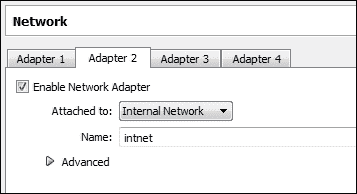
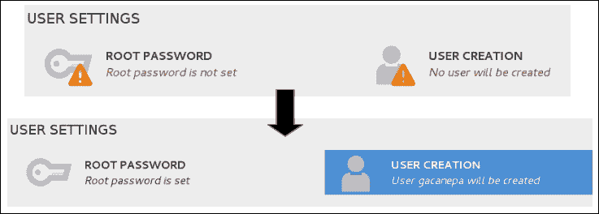

# 第一章：集群基础和在 CentOS 7 上的安装

在本章中，我们将介绍集群的基本原理，并逐步展示如何将两台 Linux 服务器设置为集群的成员。

在这个过程中，我们将从零开始安装 CentOS 7 Linux 发行版，并安装必要的软件包，最后配置基于密钥的认证，以便从一台计算机通过 SSH 访问另一台计算机。所有命令，除非特别说明，必须以 root 身份执行，并且在本书中始终以 `$` 符号开头。

# 集群基础知识

在计算机科学中，集群由一组计算机组成（每台计算机称为**节点**或**成员**），它们共同工作，使得外部看来这一组计算机就像一个单一的系统。

企业和科研环境通常需要强大的计算能力来分析每天产生的大量数据，并且需要冗余。为了确保结果始终可供使用这些服务或管理这些服务的人访问，我们依赖于计算机系统的高可用性和高性能。互联网网站，如银行和其他商业机构使用的网站，在承受较大负载时仍能良好运行，正是使用集群优势的一个明显例子。

有两种典型的集群设置。第一种是将不同的任务分配给每个节点，从而实现比单个成员独立执行多个任务时更高的性能。集群的另一个经典用途是通过提供故障转移功能来确保高可用性，使得一个节点在另一个节点出现故障时能自动替代它，从而最小化一个或多个关键服务的停机时间。在这两种情况下，集群的概念不仅仅是利用每个成员的计算功能，而是通过相互补充来最大化它。

这种类型的集群设置被称为**高可用性**（**HA**），它的目的是通过在节点出现故障并导致无法使用时将服务从一个节点故障转移到另一个节点，从而消除系统停机时间。与需要人工干预的切换操作不同，故障转移过程由集群自动执行，无需停机。换句话说，这一操作对集群外部的终端用户和客户是透明的。

第二种设置使用其节点执行并行操作，以增强一个或多个应用程序的性能，这种设置被称为**高性能集群**（**HPC**）。HPC 通常出现在涉及使用大量数据集合的应用程序和进程的场景中。

## 为什么选择 Linux 和 CentOS 7？

如前所述，我们将构建一个包含两台运行 Linux 的机器的集群。选择这种方式是因为它具有低成本和稳定性——不需要付费的操作系统或软件许可证，并且可以在资源较少的系统（如 Raspberry Pi 或相对较旧的硬件）上运行 Linux。因此，我们可以用非常少的资源或资金搭建集群。

我们将通过设置组成系统的独立节点开始我们的集群之旅。我们选择的操作系统是 Linux 和 CentOS 7 版本，因为这是当前可用的 CentOS 最新发行版。与 Red Hat Enterprise Linux ©（这是企业和科学环境中使用最广泛的发行版之一）的二进制兼容性，加上其经过验证的稳定性，是我们做出这一决定的原因。

### 注意

CentOS 7 可以从项目官网 [`www.centos.org/`](http://www.centos.org/) 免费下载。除此之外，关于该版本的具体详情可以随时查阅 CentOS wiki 上的发布说明，地址为 [`wiki.centos.org/Manuals/ReleaseNotes/CentOS7`](http://wiki.centos.org/Manuals/ReleaseNotes/CentOS7)。

## 下载 CentOS

要下载 CentOS，请访问 [`www.centos.org/download/`](http://www.centos.org/download/) 并点击下图所示的三种选项之一：


+   **DVD ISO**：这是一个 `.iso` 文件（约 4 GB），可以写入普通的 DVD 光盘，并包含常用工具。如果你有稳定的网络连接，并可以以后下载其他软件包和工具，可以选择下载这个文件。

+   **Everything ISO**：这是一个 `.iso` 文件（约 7 GB），包含 CentOS 7 基础仓库中的完整软件包集。如果你没有持续的网络连接，或者你的计划需要安装或填充本地或网络镜像，请下载这个文件。

+   **替代下载**：此链接将带你到官方 CentOS 镜像的一个公共目录，其中包含前述选项以及其他版本，包括不同桌面版本的选择（GNOME 或 KDE），以及最小化的 `.iso` 文件（约 570 MB），该文件包含发行版的核心或基本软件包。

虽然这三种下载选项都可以使用，但我们将使用最小化安装，因为它足以满足我们的需求，且以后可以通过 **标准 CentOS 包管理器 yum** 使用公共软件包仓库安装其他所需的软件包。推荐下载的 `.iso` 文件是从下载页面获取的最新版本，截至本文编写时为 **CentOS 7.0 1406 x86_64 Minimal.iso**。

# 设置 CentOS 7 节点

如果你没有专用硬件可以用来设置集群的节点，你仍然可以使用一些虚拟化软件，如 Oracle Virtualbox © 或 VMware © 等，创建虚拟机来设置这些节点。通过虚拟化，我们可以在设置第一个节点后，通过克隆轻松地设置第二个节点。唯一的限制是我们无法使用 STONITH 设备。**Shoot The Other Node In The Head**（**STONITH**）是一种机制，旨在防止两个节点在 HA 集群中同时作为主节点，从而避免数据损坏的可能性。

以下设置将在具有 1 GB RAM 和 30 GB 硬盘空间、以及两个网络卡接口的 Virtualbox 虚拟机上进行。第一个网络卡将允许我们访问互联网以下载其他软件包，而第二个则用于创建一个共享 IP 地址，以便整个集群能够访问。

我选择 VirtualBox 而不是 VMware 的原因是，前者是免费的，且可用于 Microsoft Windows、Linux 和 macOS，而后者的完整版需要付费。

要下载并安装 VirtualBox，请访问 [`www.virtualbox.org/`](https://www.virtualbox.org/) 并选择适用于你操作系统的版本。有关安装说明，你可以参考 [`www.virtualbox.org/manual/UserManual.html`](https://www.virtualbox.org/manual/UserManual.html)，特别是 *1.7 创建你的第一个虚拟机* 和 *1.13 克隆虚拟机* 部分。

此外，你还需要确保虚拟机有两个网络接口卡。第一个是默认创建的，第二个需要手动创建。

要显示虚拟机的当前网络配置，请在 Virtualbox 的主界面中点击该虚拟机，然后点击 **设置** 按钮。会弹出一个窗口，列出不同的硬件类别。选择 **网络** 并将 **适配器 1** 配置为 **桥接适配器**，如下图所示：


点击 **适配器 2**，勾选相应的复选框启用它，并将其配置为 **内部网络**，命名为 **intnet**，如下图所示：



我们将使用安装过程建议的默认分区方案（LVM）。

## 安装 CentOS 7

我们将通过一步步创建第一个节点，然后使用 Virtualbox 的克隆功能实例化一个相同的节点。这将减少安装所需的时间，因为只需要稍微修改主机名和网络配置。按照以下步骤在虚拟机中安装 CentOS 7：

1.  以下截图中的启动画面是加载安装介质后安装过程的第一步。使用上下箭头高亮**安装 CentOS 7**，然后按*回车*键：

1.  选择**英语**（或你偏好的安装语言）并点击**继续**：

1.  在下一屏幕上，你可以设置当前的日期和时间，选择键盘布局和语言支持，选择硬盘安装目标以及分区方式，连接主要网络接口，并为节点分配一个唯一的主机名。我们将当前节点命名为**node01**，并将其他设置保持为默认（我们稍后会配置额外的网卡）。然后，点击**开始安装**按钮。

1.  在安装后台继续进行时，我们将被提示为 root 账户设置密码并创建一个管理用户。一旦这些步骤确认完成，相应的警告将不再出现：

1.  当过程完成后，点击**完成配置**，系统将完成配置系统和设备。当系统准备好自行启动时，你会被提示这么做。移除安装介质并点击**重启**。

1.  在成功重启计算机并启动到 Linux 提示符后，我们的第一个任务将是更新我们的系统。然而，在此之前，我们首先需要设置基本的网络适配器来访问互联网，以便下载和更新包。之后，我们就可以继续配置我们的网络接口。

## 设置网络基础设施

由于我们的节点将通过网络进行互相通信，我们将首先定义我们的网络地址和配置。我们相当基础的网络基础设施将包括两台 CentOS 7 机器，它们具有静态 IP 地址和主机名`node01 [192.168.0.2]`和`node02 [192.168.0.3]`，以及一个名为**简单网关 [192.168.0.1]**的网关路由器。

在 CentOS 中，所有的网络接口配置都使用位于`/etc/sysconfig/network-scripts`目录中的脚本。如果你按照之前的步骤创建了第二个网络接口，那么该目录下应该有`ifcfg-enp0s3`和`ifcfg-enp0s8`文件。第一个是我们用来访问互联网并通过外部客户端进行 SSH 连接的网络卡的配置文件，而第二个将在后面的章节中用作集群资源的一部分。请注意，网络接口的具体命名可能会稍有不同，但可以假设它们会遵循`ifcfg-enp0sX`的格式，其中`X`是一个整数。

这是在我们的第一个节点的`/etc/sysconfig/network-scripts/ifcfg-enp0s3`目录中所需的最小内容（当您稍后设置第二个节点时，只需将 IP 地址`(IPADDR)`更改为`192.168.0.3`）：

```
HWADDR="08:00:27:C8:C2:BE"
TYPE="Ethernet"
BOOTPROTO="static"
NAME="enp0s3"
ONBOOT="yes"
IPADDR="192.168.0.2"
NETMASK="255.255.255.0"
GATEWAY="192.168.0.1"
PEERDNS="yes"
DNS1="8.8.8.8"
DNS2="8.8.4.4"
```

请注意，`UUID`和`HWADDR`的值会因为硬件的不同而有所不同。为了避免问题，可以将这些设置保留为默认值。此外，请注意，集群主机必须分配静态 IP 地址——绝不要将其交给 DHCP！在前面使用的配置文件中，我们使用的是 Google 的 DNS，但如果您愿意，也可以使用其他 DNS。

修改完成后，保存文件并重启网络服务以应用更改。由于 CentOS 从版本 7 开始使用 systemd 代替 SysVinit 进行服务管理，本书中我们将使用`systemctl`命令来重启服务，而不是使用`/etc/init.d`脚本，如下所示：

```
$ systemctl restart network.service # Restart the network service
```

您可以使用以下命令验证之前的更改是否生效：

```
$ systemctl status network.service # Display the status of the network service
```

您可以通过以下命令验证预期的更改是否已正确应用：

```
$ ip addr | grep 'inet' ''# Display the IP addresses
```


您可以忽略所有与回环接口相关的错误信息，如前面的截图所示。然而，您需要仔细检查与`enp0s3`相关的任何错误信息（如果有），并解决它们，以便继续进行后续操作。

第二个接口将被命名为`enp0sX`，其中`X`通常是`8`，正如我们在本例中所示。您可以通过以下命令验证这一点，正如下面的截图所示：

```
$ ip link show
```


至于`enp0s8`的配置文件，您可以安全地通过复制`ifcfg-enp0s3`的内容来创建它。不过，别忘了通过`ip link show enp0s8`命令获取网卡的硬件（MAC）地址，并将其更改，同时将 IP 地址字段留空，使用以下命令：

```
ip link show enp0s8
cp /etc/sysconfig/network-scripts/ifcfg-enp0s3 /etc/sysconfig/network-scripts/ifcfg-enp0s8
```

接下来，按照之前的说明重启网络服务。

请注意，您还需要设置至少一种基本的 DNS 解析方法。考虑到我们只会设置两个节点的集群，因此我们将在两个主机的`/etc/hosts`中使用该方法。

编辑`/etc/hosts`，内容如下：

```
192.168.0.2	node01
192.168.0.3	node02
192.168.0.1	gateway
```

一旦您按照后续部分的说明设置了两个节点，在继续操作之前，您可以进行一次 ping 测试，以确保两个主机之间的连接正常，确保它们能够互相访问。

首先，在`node01`中执行：

```
$ ping –c 4 node02
```

接下来，在`node02`上执行相同操作：

```
$ ping –c 4 node01
```

# 安装集群所需的软件包

一旦我们完成操作系统的安装和基本网络基础设施的配置，就可以开始安装将为每个节点提供集群功能的软件包。在这里我们要强调的是，没有这些核心组件，我们的两个节点将变成简单的独立服务器，在其中一个节点发生系统崩溃或其他重大问题时无法相互支持。

## 关键软件组件

每个节点都需要以下软件组件，以便作为集群的一员工作。这些包在 CentOS 7 中作为集群设置的一部分得到全面支持，而其他已被弃用的替代方案则不再支持：

+   **Pacemaker**：这是一个集群资源管理器，它会在启动时运行脚本，在各个节点启动或停止时，或者在相关资源故障时执行。此外，它还可以配置为定期检查每个集群成员的健康状态。换句话说，pacemaker 负责启动和停止服务（例如，经典的网页服务器或数据库服务器），并实施逻辑，确保所有必要的服务始终只在一个位置运行，以避免数据故障或损坏。

+   **Corosync**：这是一个消息服务，它将为节点之间提供通信通道。正如你所猜测的，corosync 对 pacemaker 完成其任务至关重要。

+   **PCS**：这是一个 corosync 和 pacemaker 配置工具，它将允许你轻松查看、修改并创建基于 pacemaker 的集群。这并非严格必需，而是可选的。我们选择安装它，因为它在后续阶段会派上用场。

要安装前述的三个软件包，请运行以下命令：

```
$ yum update && yum install pacemaker corosync pcs
```

Yum 将更新所有已安装的软件包到最新版本，以便更好地满足依赖关系，然后继续实际安装。

除了安装上述软件包外，我们还需要启用`iptables`，因为 CentOS 7 的默认防火墙是`firewalld`。我们选择`iptables`而非`firewalld`，是因为它的使用更为广泛，并且相比相对较新的`firewalld`，你更有可能熟悉它。我们将在此安装所需的包，并将配置留到下一章进行。

为了通过 systemd 工具管理`iptables`，您需要使用以下命令安装（如果尚未安装）`iptables-services`软件包：

```
yum update && yum install iptables-services
```

现在，您可以使用以下命令停止并禁用`firewalld`：

```
systemctl stop firewalld.service
systemctl disable firewalld.service
```

接下来，启用`iptables`，使其在启动时初始化，并在当前会话中启动：

```
systemctl enable iptables.service
systemctl start iptables.service
```

您可以参考以下截图，以查看此过程的逐步示例：


一旦第一个节点（`node01`）的安装成功完成，按照 `Virtualbox 手册`（第 1.13 节，“克隆虚拟机”）中的大纲克隆第一个节点。克隆虚拟机完成后，向第二个虚拟机添加以下小修改：

+   将机器命名为 `node02`。当您启动这个新创建的虚拟机时，它的主机名仍然设置为 `node01`。要更改它，运行以下命令，然后重启机器以使更改生效：

    ```
    $ hostnamectl set-hostname node02
    $ systemctl reboot
    ```

+   在 `node02` 的 `enp0s3` 配置文件中，输入 `192.168.0.3` 作为 IP 地址，并设置正确的 `HWADDR` 地址。

+   确保两个虚拟机都在运行，并且每个节点都能 ping 通另一个节点和网关，如下两张截图所示。

首先，我们将从 `node01` 向 `node02` 和网关发送 ping，并将看到以下输出：


然后，我们将从 `node02` 向 `node01` 和网关发送 ping：


如果有任何 ping 操作没有返回预期的结果，如前面截图所示，请检查 Virtualbox 和配置文件中的网络接口配置，具体步骤见本章前面部分。

## 设置基于密钥的 SSH 访问认证

虽然不是严格要求，但我们也会设置基于公钥的 SSH 认证，这样就可以在不输入帐户密码的情况下从一台主机访问另一台主机。这个功能在某些情况下会很有用，比如需要在某个节点上执行系统管理任务时。请注意，您需要在两个节点上都执行此操作。

为了提高安全性，我们在创建 RSA 密钥时也可以设置一个密码短语，如下图所示。此步骤是可选的，如果您希望，可以跳过它。事实上，我建议您留空，以便今后操作更方便，但这完全取决于您。

运行以下命令以创建 RSA 密钥：

```
$ ssh-keygen -t rsa
```


为了启用无密码登录，我们将把新创建的密钥复制到 `node02`，反之亦然，接下来两张图分别展示了这一过程。

```
$ cat .ssh/id_rsa.pub | ssh root@node02 'cat' >> .ssh/authorized_keys'
```

将密钥从`node01`复制到`node02`：


将密钥从 `node02` 复制到 `node01`：


接下来，我们需要验证能否从每个集群成员连接到其他节点，且不需要密码，而是使用我们之前输入的密码短语：


最后，如果无密码登录没有成功，您可能需要确保 SSH 守护进程在两台主机上都在运行：

```
$ systemctl status sshd
```

如果没有运行，请使用以下命令启动它：

```
$ systemctl start sshd
```

在尝试重新启动服务后，您可能需要再次检查服务的状态。如果有任何错误，`systemctl status sshd`的输出将为您提供有关服务问题的指示，帮助您了解为什么它无法正常启动。按照这些指示，您将能够轻松地排查问题。

# 总结

在本章中，我们回顾了如何安装操作系统，并安装了实现基本集群功能所需的软件组件。在继续进行第二章，*安装集群服务并配置网络组件*之前，请确保已按照本章前述内容安装好节点、基本的集群软件，并配置好网络和 SSH 访问，我们将在该章节中配置资源管理器、消息层和防火墙服务，以便开始构建我们的集群。
