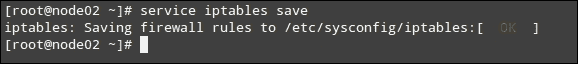

# 第二章：安装集群服务并配置网络组件

在本章中，你将学习如何设置和配置基本的网络基础设施，并配置我们在上一章中安装的集群组件。

除此之外，我们还将回顾防火墙和互联网协议的基本概念，并解释如何添加防火墙规则，以允许节点之间的通信，并确保每个节点上的集群服务能够正常运行。

如果你的母语不是英语，你必须已经上过英语课或像我一样自学过，才能阅读这本书。当两个人不说相同语言时，他们也面临同样的情况。至少其中一个人需要知道对方的语言，或者两人需要达成一致使用一种共同的语言，才能互相理解。

在网络中，以上类比中的语言对应的就是**协议**。为了使两台机器之间能够进行数据传输，必须有一种逻辑方式让它们能够相互沟通。这正是互联网协议套件的核心内容，也被称为**互联网模型**，它提供了一组通信协议或规则。

正是这一套协议使得在像互联网这样的网络中数据传输成为可能。在本章后面，我们将解释参与集群内部通信的协议和网络端口。

# 配置和启动集群服务

在回顾了之前概述的关键网络概念后，我们现在可以开始描述集群服务。

## 启动并启用集群服务

你可能还记得，在上一章中我们安装了以下集群组件：

+   **Pacemaker**：这是集群资源管理器

+   **Corosync**：这是消息传递服务

+   **PCS**：这是同步和配置工具

正如你从之前的列表中可能已经猜到的，这些组件应当作为守护进程运行，守护进程是一种特殊的后台进程，无需管理员直接干预或控制。尽管我们在第一章中安装了必要的软件包，*集群基础与在 CentOS 7 上的安装*，但我们并没有启动集群资源管理器或消息传递服务。因此，我们现在需要手动首次启动它们，并在下次系统启动时使其自动运行。

我们将首先配置`pacemaker`和`corosync`，并将 PCS 配置留到本章后面。

如下截图所示，在你完成第一章，*集群基础和 CentOS 7 上的安装* 中列出的所有任务后，第一次启动两个节点时，这些守护进程（也称为 systemd 系统中的单元）是非活动的（并且在重启时不会自动启动）。你可以使用以下命令检查它们当前的运行状态：

```
systemctl status pacemaker
systemctl status corosync
```


为了在每个节点上启动 corosync 和 pacemaker 并启用这两个服务在系统启动时自动启动，首先通过复制安装包中随附的示例文件来创建 corosync 配置文件。与 pacemaker 和 PCS 不同，corosync 不会为你自动创建配置文件：

要创建 corosync 配置文件，请执行以下操作：

```
cp /etc/corosync/corosync.conf.example /etc/corosync/corosync.conf
```

然后通过运行以下命令来重启并启用服务：

```
systemctl start pacemaker
systemctl enable corosync
systemctl enable pacemaker
```

在前面的命令中，请注意我们并没有手动启动 corosync，因为当 pacemaker 启动时，corosync 会自动启动。需要注意的是，在基于 systemd 的系统中，启用服务并不等同于启动它。一个单元可以被启用但未启动，反之亦然。如下所示，启用服务涉及创建一个指向单元配置文件的符号链接，该配置文件指定了系统启动和关机时需要执行的操作等内容。

在两个节点上执行以下操作：

```
[root@node01 ~]# systemctl enable pacemaker
ln -s '/usr/lib/systemd/system/pacemaker.service' '/etc/systemd/system/multi-user.target.wants/pacemaker.service'
[root@node01 ~]# systemctl enable corosync
ln -s '/usr/lib/systemd/system/corosync.service' '/etc/systemd/system/multi-user.target.wants/corosync.service'
[root@node01 ~]#
```

最后，在我们可以在后续阶段配置集群之前，我们需要执行以下步骤：

1.  启动并启用 PCS 守护进程（`pcsd`），该守护进程将负责保持 `node01` 和 `node02` 上的 corosync 配置同步。为了使 `pcsd` 守护进程按预期工作，corosync 和 pacemaker 必须先前已经启动。请注意，当你使用 `systemctl` 工具在基于 systemd 的系统中管理服务时，可以省略守护进程名称后面的 `.service`（或者如果你愿意，也可以使用它，正如在第一章，*集群基础和 CentOS 7 上的安装* 中所示）。通过以下命令启动并启用 PCS 守护进程：

    ```
    systemctl start pcsd
    systemctl enable pcsd
    ```

1.  现在设置 hacluster Linux 账户的密码，该账户是在安装 PCS 时自动创建的。此账户由 PCS 守护进程用于设置节点之间的通信，最好在两个节点上使用相同的密码来管理此账户。要设置 hacluster 密码，请输入以下命令，并在两个节点上设置相同的密码：

    ```
    passwd hacluster
    ```

## 故障排除

在正常情况下，启动 pacemaker 应该会自动启动 corosync。你可以通过运行 `systemctl status corosync` 命令来检查 corosync 的状态。如果出于某种原因 corosync 没有自动启动，你仍然可以运行以下命令手动启动消息服务：

```
systemctl start corosync
```

如果前面的命令返回错误，运行 `systemctl -l status unit`，其中 `unit` 可以是 corosync 或 pacemaker，将返回有关相应服务的详细状态。

这是另一个有用的故障排除命令：

```
journalctl -xn
```

这将查询 systemd 日志（systemd 的日志），并返回关于最近事件的详细消息。

这两个命令将提供有用的信息，帮助你找出出了什么问题，并指引你解决问题的正确方向。

### 提示

你可以在其手册页中阅读更多关于 systemd 日志的信息，*man journalctl*，或者在在线版本中查看，网址是[`www.freedesktop.org/software/systemd/man/journalctl.html`](http://www.freedesktop.org/software/systemd/man/journalctl.html)。

# 安全基础

现在，我们准备讨论网络安全问题，以便仅允许节点之间正确的网络流量。在初始设置过程中以及执行第一次测试时，你可能希望禁用防火墙和 SELinux（稍后在本章中会介绍），然后在稍后的阶段再通过这两者——具体取决于你目前对它们的熟悉程度。

## 进出控制

在启动并启用前面提到的服务之后，我们可以更详细地了解集群配置和维护过程中涉及的网络进程。在 `netstat` 命令的帮助下，这是 CentOS 7 中 `net-tools` 包的一部分，我们将打印出当前的监听网络端口，并验证 corosync 是否正在运行并监听连接。在此之前，你需要安装 `net-tools` 包，因为它并未包含在 CentOS 7 的最小安装中，使用以下命令进行安装：

```
yum –y install net-tools && netstat -npltu | grep -i corosync
```

如下截图所示，Corosync 正在监听回环接口（`127.0.0.1`）的 **UDP** 端口 `5404` 和 `5405`，以及多播地址（默认设置为 `239.255.1.1`，提供一种逻辑方式来标识这一组节点）上的端口 `5405`：


### 注意

**用户数据报协议**（UDP）是互联网模型的核心协议之一。该协议允许应用程序向网络中的主机发送消息（也称为 **数据报**），以便在不进行完整握手（即不在网络中建立成功连接）的情况下设置数据传输路径。此外，UDP 不包含网络通信中的错误检查和修正（这些检查由目标应用程序本身执行）。

**传输控制协议**（**TCP**）是互联网模型的另一个核心协议。与 UDP 相对，它提供了数据流在网络中计算机之间的错误检测、传输、排序和重复检查。几个著名的应用层协议（如 HTTP、SMTP 和 SSH 等）都封装在 TCP 中。

**互联网组管理协议**（**IGMP**）是网络设备（无论是主机还是路由器）用于建立多播数据传输的通信协议，它允许网络中的一个主机将数据报发送到多个其他感兴趣的系统，供它们接收源内容。

在继续之前，我们需要在每个节点的防火墙上允许流量通过。默认情况下，以下列表中命名的端口是这些服务启动后监听的默认端口，正如我们之前所做的那样。具体来说，在两个节点中，我们需要执行以下步骤：

1.  使用以下命令打开`corosync`所需的网络端口（**UDP**端口**5404**和**5405**）和 PCS（通常是**TCP** **2224**）：

    ```
    iptables -I INPUT -m state --state NEW -p udp -m multiport --dports 5404,5405 -j ACCEPT
    iptables -I INPUT -p tcp -m state --state NEW --dport 2224 -j ACCEPT
    ```

    ### 注意

    请注意，使用`-m`多端口选项可以将多个不同的端口组合成一条规则，而无需编写几乎相同的多个规则。这将减少规则数量，并简化`iptables`的维护。

1.  使用以下命令允许 IGMP 和多播流量：

    ```
    iptables -I INPUT -p igmp -j ACCEPT
    iptables -I INPUT -m addrtype --dst-type MULTICAST -j ACCEPT
    ```

1.  将`INPUT`链的默认`iptables`策略更改为`DROP`。因此，任何不符合我们刚刚添加的规则的数据包将被丢弃。请注意，与`REJECT`策略不同，`DROP`不会向调用客户端发送任何响应，只是保持“无线电静默”并主动丢弃数据包：

    ```
    iptables -P INPUT DROP
    ```

1.  添加必要规则后，我们的防火墙配置如下所示，在以下代码中可以清楚地看到，除了我们在前两步中添加的规则外，还有一些是我们启动并启用`iptables`时默认初始化的，如在第一章中所解释的，*集群基础与 CentOS 7 的安装*。运行以下命令以列出防火墙规则及其对应的编号：

    ```
    [root@node01 ~]# iptables -L -v --line-numbers
    Chain INPUT (policy DROP 0 packets, 0 bytes)
    num   pkts bytes target     prot opt in     out     source               destination
    1      423 48645 ACCEPT     all  --  any    any     anywhere             anywhere             ADDRTYPE match dst-type MULTICAST
    2        0     0 ACCEPT     igmp --  any    any     anywhere             anywhere
    3        0     0 ACCEPT     tcp  --  any    any     anywhere             anywhere             state NEW tcp dpt:efi-mg
    4     1200  124K ACCEPT     udp  --  any    any     anywhere             anywhere             state NEW multiport dports hpoms-dps-lstn,netsupport
    5       86  7152 ACCEPT     all  --  any    any     anywhere             anywhere             state RELATED,ESTABLISHED
    6        0     0 ACCEPT     icmp --  any    any     anywhere             anywhere
    7      387 41151 ACCEPT     all  --  lo     any     anywhere             anywhere
    8        0     0 ACCEPT     tcp  --  any    any     anywhere             anywhere             state NEW tcp dpt:ssh
    9       65 10405 REJECT     all  --  any    any     anywhere             anywhere             reject-with icmp-host-prohibited

    Chain FORWARD (policy ACCEPT 0 packets, 0 bytes)
    num   pkts bytes target     prot opt in     out     source               destination
    1        0     0 REJECT     all  --  any    any     anywhere             anywhere             reject-with icmp-host-prohibited

    Chain OUTPUT (policy ACCEPT 1149 packets, 127K bytes)
    num   pkts bytes target     prot opt in     out     source               destination
    ```

1.  如果`INPUT`链中的最后一条默认规则执行了对不符合要求的数据包的`REJECT`操作，我们将删除它，因为我们已经通过修改链的默认策略来解决这个需求：

    ```
    iptables -D INPUT [rule number]
    ```

1.  最后，我们必须保存防火墙规则，以确保在系统重启时规则能保持持久性。如以下截图所示，这包括将更改保存到`/etc/sysconfig/iptables`中：

    ```
    service iptables save
    ```

    

如果我们使用首选的文本编辑器或分页程序查看`/etc/sysconfig/iptables`文件，我们会发现该文件以一种较易阅读的格式呈现了相同的防火墙规则，如以下代码所示：

```
[root@node02 ~]# cat /etc/sysconfig/iptables
# Generated by iptables-save v1.4.21 on Sat Dec  5 10:09:24 2015
*filter
:INPUT DROP [0:0]
:FORWARD ACCEPT [0:0]
:OUTPUT ACCEPT [263:28048]
-A INPUT -m addrtype --dst-type MULTICAST -j ACCEPT
-A INPUT -p igmp -j ACCEPT
-A INPUT -p tcp -m state --state NEW -m tcp --dport 2224 -j ACCEPT
-A INPUT -p udp -m state --state NEW -m multiport --dports 5404,5405 -j ACCEPT
-A INPUT -m state --state RELATED,ESTABLISHED -j ACCEPT
-A INPUT -p icmp -j ACCEPT
-A INPUT -i lo -j ACCEPT
-A INPUT -p tcp -m state --state NEW -m tcp --dport 22 -j ACCEPT
-A INPUT -j REJECT --reject-with icmp-host-prohibited
-A FORWARD -j REJECT --reject-with icmp-host-prohibited
COMMIT
# Completed on Sat Dec  5 10:09:24 2015
```

接下来，您还需要编辑`/etc/sysconfig/iptables-config`文件，以指示防火墙规则应在系统关机和重启时保持持久性。请注意，这些行已经存在于文件中，需要进行更改。为了谨慎起见，您可能希望在进行更改之前备份现有文件：

```
cp /etc/sysconfig/iptables-config /etc/sysconfig/iptables-config.orig
```

现在，使用你喜欢的文本编辑器打开`/etc/sysconfig/iptables-config`，并确保指定的行如下所示：

```
IPTABLES_SAVE_ON_STOP="yes"
IPTABLES_SAVE_ON_RESTART="yes"
```

如往常一样，别忘了重启`iptables`（`systemctl restart iptables`）以应用更改。

CentOS 7，和以往的版本一样，内置了**SELinux**（**Security Enhanced Linux**）支持。这为操作系统提供了基于内核本身的本地、灵活的访问控制功能。你可能会想知道在此阶段应该如何处理 SELinux 策略。当前的设置，可以通过`sestatus`和`getenforce`命令显示，如下图所示，暂时可以满足需求：


简单来说，为了安全起见，我们将默认模式保持为`enforcing`。这应该不会引起任何问题，但如果出现问题，可以使用以下命令将模式设置为`permissive`：

```
setenforce 0
```

前述命令将启用警告并记录错误，以帮助你在服务器仍在运行时进行故障排除。如果你需要排查问题，并且怀疑 SELinux 可能是原因，你应该查看`/var/log/audit/audit.log`。SELinux 的日志信息会通过`auditd`（Linux 审计系统，默认启动）写入该文件，其中带有 AVC 关键字。否则，这些信息会写入`/var/log/messages`。

现在，在处理下一个标题之前，别忘了在另一个节点上重复相同的操作并保存更改！

# 了解 PCS

我们正在接近实际设置集群的步骤。在开始这个任务之前，我们需要了解 PCS——我们集群的核心组件——可以说它将用于控制和配置 pacemaker 与 corosync。为了开始这项工作，我们可以仅仅运行 PCS 而不加参数，如下所示：

```
pcs
```

这将返回以下截图中显示的输出，其中提供了每个选项和命令的简要说明：


我们对**Commands**部分感兴趣，其中列出了可以通过此工具管理的集群实际类别，并简要描述了它们的使用方法。每个类别都支持多个功能，可以通过在`pcs [category]`后附加**help**来显示。例如，让我们看看`cluster`命令所提供的功能（顺便说一下，我们很快会使用到它）：

```
pcs cluster help
Usage: pcs cluster [commands]...
Configure cluster for use with pacemaker

Commands:
 auth [node] [...] [-u username] [-p password] [--force] [--local]
 Authenticate pcs to pcsd on nodes specified, or on all nodes
 configured in corosync.conf if no nodes are specified (authorization
 tokens are stored in ~/.pcs/tokens or /var/lib/pcsd/tokens for root).
 By default all nodes are also authenticated to each other, using
 --local only authenticates the local node (and does not authenticate
 the remote nodes with each other).  Using --force forces
 re-authentication to occur.

 setup [--start] [--local] [--enable] --name <cluster name> <node1[,node1-altaddr]>
 [node2[,node2-altaddr]] [..] [--transport <udpu|udp>] [--rrpmode active|passive]
 [--addr0 <addr/net> [[[--mcast0 <address>] [--mcastport0 <port>]
 [--ttl0 <ttl>]] | [--broadcast0]]
 [--addr1 <addr/net> [[[--mcast1 <address>] [--mcastport1 <port>]
 [--ttl1 <ttl>]] | [--broadcast1]]]]
 [--wait_for_all=<0|1>] [--auto_tie_breaker=<0|1>]
 [--last_man_standing=<0|1> [--last_man_standing_window=<time in ms>]]
 [--ipv6] [--token <timeout>] [--join <timeout>]
 [--consensus <timeout>] [--miss_count_const <count>]
 [--fail_recv_const <failures>]
 Configure corosync and sync configuration out to listed nodes
 --local will only perform changes on the local node
 --start will also start the cluster on the specified nodes
 --enable will enable corosync and pacemaker on node startup
 --transport allows specification of corosync transport (default: udpu)
 The --wait_for_all, --auto_tie_breaker, --last_man_standing,
 --last_man_standing_window options are all documented in corosync's'
 votequorum(5) man page.
 --ipv6 will configure corosync to use ipv6 (instead of ipv4)
 --token <timeout> sets time in milliseconds until a token loss is
 declared after not receiving a token (default 1000 ms)
 --join <timeout> sets time in milliseconds to wait for join mesages
 (default 50 ms)
 --consensus <timeout> sets time in milliseconds to wait for consensus
 to be achieved before starting a new round of membership configuration
 (default 1200 ms)
 --miss_count_const <count> sets the maximum number of times on
 receipt of a token a message is checked for retransmission before
 a retransmission occurs (default 5 messages)
 --fail_recv_const <failures> specifies how many rotations of the token
 without receiving any messages when messages should be received
 may occur before a new configuration is formed (default 2500 failures)
```

### 注意

请注意，输出已被截断以简化显示。

你将经常查阅文档，因此你应该认真考虑熟悉帮助功能。

## 管理身份验证并创建集群

现在我们已经准备好将 PCS 认证到命令行中指定节点上的`pcsd`服务。默认情况下，所有节点之间会进行相互认证，因此 PCS 可以从一个集群成员与其他成员进行通信。

这正是`hacluster`用户派上用场的时候（我们之前已经更改了它的密码），因为这是用于此目的的账户。PCS 在具有`N`个节点的集群中执行此步骤的通用语法如下：

```
pcs cluster auth member1 member 2 … memberN
```

在我们当前的两节点设置中，设置认证意味着：

```
pcs cluster auth node01 node02
```

我们将被提示输入用户名和密码，以进行认证，正如前面讨论的那样，幸运的是，这个过程不需要重复进行，因为我们现在可以从任何节点控制集群。这个过程在下面的截图中进行了示范（我们从`node01`设置`pcs`的认证），然后当我们从`node02`发出命令创建集群时，`/etc/corosync/corosync.conf`文件会同步到另一个节点：


要使用指定节点创建集群，请在（仅在一个节点上，在如前所示成功尝试密码之后）键入以下命令：

```
pcs cluster setup --name MyCluster node01 node02
```

在这里，`MyCluster`是我们为集群选择的名称（你可以根据自己的喜好进行更改）。接下来，按下*Enter*键并验证输出。请注意，正是这个命令在两个节点的`/etc/corosync/corosync.conf`路径中创建了集群配置文件。

如果你按照本章前面的说明使用示例配置文件创建了`corosync.conf`文件（以启动 pacemaker 和 corosync），你将需要使用`--force`选项，以当前新创建的集群设置覆盖该文件：

```
[root@node01 ~]# pcs cluster setup --name MyCluster node01 node02
Error: /etc/corosync/corosync.conf already exists, use --force to overwrite
[root@node01 ~]# pcs cluster setup --name MyCluster node01 node02 --force
Shutting down pacemaker/corosync services...
Redirecting to /bin/systemctl stop  pacemaker.service
Redirecting to /bin/systemctl stop  corosync.service
Killing any remaining services...
Removing all cluster configuration files...
node01: Succeeded
node02: Succeeded
[root@node01 ~]#
```

### 注意

如果在尝试设置`pcs`认证时收到以下错误信息，请确保`pcsd`在`nodeXX`节点上正在运行（并且已启用），然后重试：

```
Error: Unable to communicate with nodeXX
```

### 注意

（此处，`XX`是节点编号）

此时，`node02`中的`/etc/corosync/corosync.conf`文件应与`node01`中的文件完全相同，从任一节点运行`diff`命令时，输出为空表示`corosync`配置文件已正确同步到另一个节点：

```
diff /etc/corosync/corosync.conf <(ssh node02 'cat /etc/corosync/corosync.conf')
```

下一步是通过发出命令来实际启动集群（同样，仅在一个节点上执行）：

```
pcs cluster start --all
```

### 注意

用于启动集群的命令（`pcs cluster start`）值得进一步解释：

```
 start [--all] [node] [...]
 Start corosync & pacemaker on specified node(s), if a node is not
 specified then corosync & pacemaker are started on the local node.
 If --all is specified then corosync & pacemaker are started on all
 nodes.
```

### 注意

有时你可能希望在特定节点上启动集群。在这种情况下，你将指定该节点，而不是使用`--all`标志。

前一个命令的输出应如下所示：

```
pcs cluster start --all
[root@node01 ~]# pcs cluster start --all
node01: Starting Cluster...
node02: Starting Cluster...
[root@node01 ~]#
```

一旦集群启动，你可以从任何节点检查其状态（记住，PCS 让你可以从任何节点管理集群）：

```
[root@node01 log]# pcs status cluster
Cluster Status:
 Last updated: Sat Dec  5 11:59:14 2015         Last change: Sat Dec  5 11:53:01 2015 by root via cibadmin on node01
 Stack: corosync
 Current DC: node02 (version 1.1.13-a14efad) - partition with quorum
 2 nodes and 0 resources configured
 Online: [ node01 node02 ]
[root@node01 log]#or just pcs status:
[root@node01 log]# pcs status
Cluster name: MyCluster
WARNING: no stonith devices and stonith-enabled is not false
Last updated: Sat Dec  5 11:55:43 2015          Last change: Sat Dec  5 11:53:01 2015 by root via cibadmin on node01
Stack: corosync
Current DC: node02 (version 1.1.13-a14efad) - partition with quorum
2 nodes and 0 resources configured

Online: [ node01 node02 ]

Full list of resources:

PCSD Status:
 node01: Online
 node02: Online

Daemon Status:
 corosync: active/disabled
 pacemaker: active/disabled
 pcsd: active/enabled
```

### 注意

`pcs status` 命令提供了更详细的信息，包括服务和资源的状态。可能会注意到其中一个节点显示为 `OFFLINE`，如下所示：

```
Online: [ node01 ]
OFFLINE: [ node02 ]
```

### 注意

在这种情况下，请确保 `pacemaker` 和 `corosync` 在标记为 `OFFLINE` 的节点上都已启用（如在 `Daemon status:` 行后指示的），然后再次执行 `pcs status` 命令。

您可能会遇到的另一个问题是，一个或多个节点处于不干净的状态。虽然这不常见，但通过在两个节点上停止和重新启动集群来重新同步节点将解决此问题：

```
pcs cluster stop
pcs cluster start
```

标记为 **DC** 的节点，即 **Designated Controller**，是最初启动集群并从该节点典型地发出集群相关命令的节点。如果当前的 DC 由于某种原因失败，将自动从剩余节点中选择新的指定控制器。您可以使用以下命令查看当前 DC 的节点：

```
pcs status | grep -i dc
```

要查看集群中的当前 DC，请执行：

```
[root@node01 ~]# pcs status | grep -i dc
Current DC: node02 (version 1.1.13-a14efad) - partition with quorum
[root@node01 ~]#
```

您还需要分别检查每个节点：

`pcs status nodes` 命令允许您查看有关集群及其配置资源的所有信息：

```
[root@node01 ~]# pcs status nodes
Pacemaker Nodes:
Online: node01 node02
Standby:
Offline:
[root@node01 ~]#
```

`corosync-cmapctl` 命令是访问集群对象数据库的另一个工具，您可以在其中查看每个节点的属性和配置。由于 `corosync-cmapctl` 命令的输出相当长，您可能希望按选定的关键字进行过滤，例如 `members` 或 `cluster_name`：

```
[root@node01 ~]# corosync-cmapctl | grep -Ei 'cluster'_name|members'
runtime.totem.pg.mrp.srp.members.1.config_version (u64) = 0
runtime.totem.pg.mrp.srp.members.1.ip (str) = r(0) ip(192.168.0.2)
runtime.totem.pg.mrp.srp.members.1.join_count (u32) = 1
runtime.totem.pg.mrp.srp.members.1.status (str) = joined
runtime.totem.pg.mrp.srp.members.2.config_version (u64) = 0
runtime.totem.pg.mrp.srp.members.2.ip (str) = r(0) ip(192.168.0.3)
runtime.totem.pg.mrp.srp.members.2.join_count (u32) = 1
runtime.totem.pg.mrp.srp.members.2.status (str) = joined
totem.cluster_name (str) = MyCluster
[root@node01 ~]#
```

正如您可以看到的前面的输出，您可以查看集群的名称、IP 地址以及每个成员的状态。

# 为集群设置虚拟 IP

正如在 第一章 中提到的，*Cluster Basics and Installation on CentOS 7*，由于集群定义为一组计算机（我们一直称之为节点或成员），它们共同工作，使得外部从端看起来像是单一系统，我们需要确保最终用户和客户也这样看待。

因此，本章的最后一件事情是配置虚拟 IP，这是外部客户端连接到我们集群的地址。请注意，在普通的非集群环境中，您可以使用诸如 `ifconfig` 的工具来为系统配置虚拟 IP。

但在我们的情况下，我们将只使用 PCS 并同时执行两个操作：

+   创建 IPv4 地址

+   将其分配给整个集群

## 将虚拟 IP 添加为集群资源

由于虚拟 IP 是所谓的 **集群资源**，我们将使用 `pcs resource help` 查找有关如何创建它的信息。您需要事先选择一个在您的局域网中未被使用的 IP 地址分配给虚拟 IP 资源。初始化虚拟 IP 后，您可以像通常一样对其进行 ping 测试以确认其可用性。

要创建名为`virtual_ip`、地址为`192.168.0.4/24`、每 30 秒监控一次`enp0s3`的虚拟 IP，在任一节点上运行以下命令：

```
pcs resource create virtual_ip ocf:heartbeat:IPaddr2 ip=192.168.0.4 cidr_netmask=24 nic=enp0s3 op monitor interval=30s
```

到目前为止，在`pcs cluster status`或`pcs status`的输出中，虚拟 IP 资源将显示为已停止，直到后续阶段我们禁用 STONITH（STONITH 是一个集群功能，将在下一节中解释）。

## 查看虚拟 IP 的状态

要查看集群资源的当前状态，请使用以下命令：

```
pcs status resources
```

如果新创建的虚拟 IP 没有自动启动，你需要进行更彻底的检查，包括通过`crm_verify`提供的正在运行的集群配置的详细输出，`crm_verify`是 pacemaker 集群资源管理器的一部分：

```
[root@node01 ~]# crm_verify -L -V
 error: unpack_resources:     Resource start-up disabled since no STONITH resources have been defined
 error: unpack_resources:     Either configure some or disable STONITH with the stonith-enabled option
 error: unpack_resources:     NOTE: Clusters with shared data need STONITH to ensure data integrity
Errors found during check: config not valid
[root@node01 ~]#
```

### 注意

**STONITH**，即**Shoot The Other Node In The Head**的缩写，代表一个集群功能，防止高可用集群中的节点同时变为活跃状态，从而避免同时提供相同的内容。

正如前面的错误信息所示，共享数据的集群需要 STONITH 来确保数据完整性。然而，我们将把对这个功能的适当讨论推迟到下一章，并且暂时禁用它，以便能够展示虚拟 IP 如何启动并变得可访问。另一方面，当`crm_verify –L –V`没有返回任何输出时，表示配置有效且没有错误。

请禁用 STONITH，但请记住，我们将在下一章中重新讨论此问题：

```
pcs property set stonith-enabled=false
```

接下来，再次检查集群状态。

当你查询集群状态时，资源现在应该显示为已启动。你可以通过 ping 来检查资源的可用性：

```
ping -c 4 192.168.0.4
```

如果 ping 操作返回一个警告，说明一些数据包未能送达目标，请查看`/var/log/pacemaker.log`或`/var/log/cluster/corosync.log`，获取有关可能失败的原因的信息。

# 总结

在本章中，你学习了如何设置和配置基本的网络基础设施，以及我们在第一章，*CentOS 7 上的集群基础与安装*中安装的集群组件。通过回顾与安全、防火墙和互联网协议相关的概念，我们能够添加防火墙规则，允许每个节点之间的通信，并确保每台机器上的集群服务正常运行。

我们将在本书接下来的内容中继续使用本文讨论的工具，不仅用于检查集群或单个节点的状态，还作为故障排除技巧，以防事物未按预期进行。
