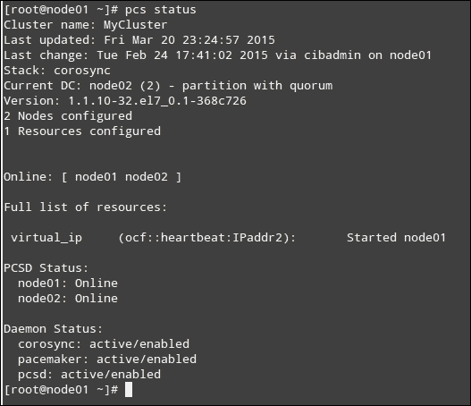
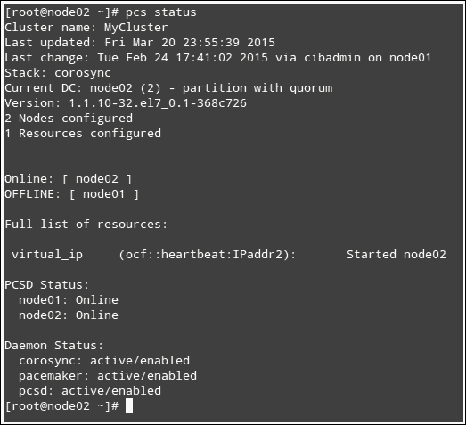
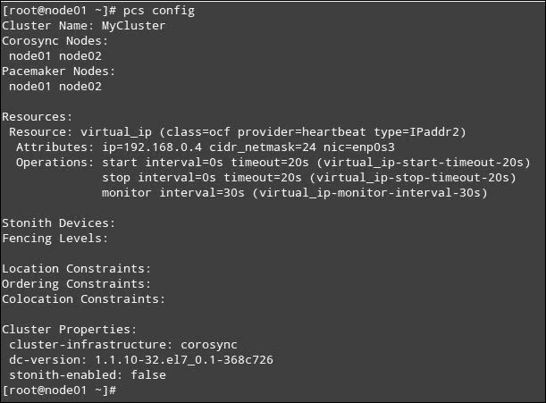
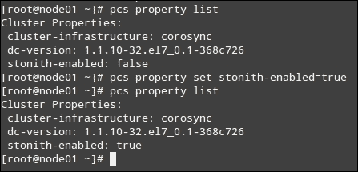
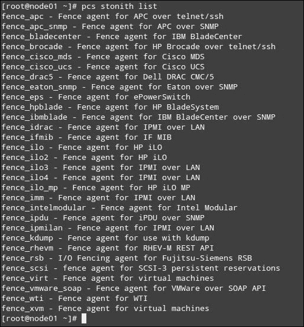
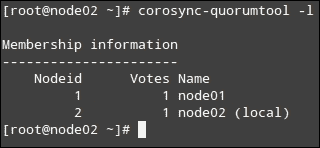
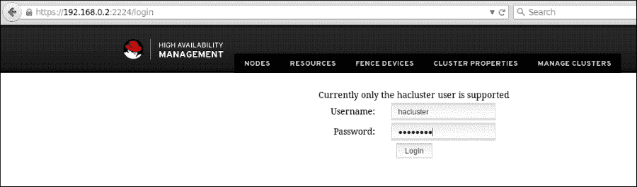
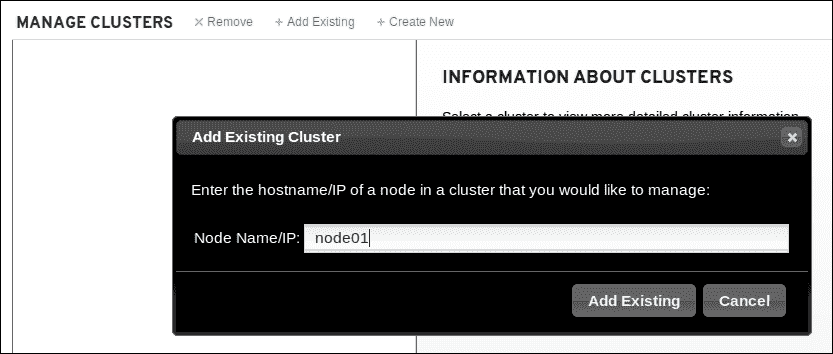
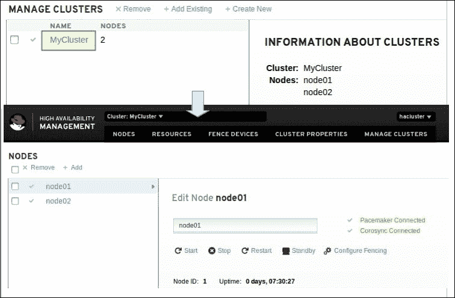

# 第三章：高可用性的更深入探讨

本章将比在第一章中更详细地讲解高可用性集群的组件；你可能希望复习那一章，以便在继续深入学习之前刷新记忆。

本章将涵盖以下主题：

+   故障切换——高可用性和性能的概述

+   围栏——隔离故障节点

+   脑裂——准备避免不一致

+   多数决策——在集群内评分

+   通过 PCS 图形界面配置我们的集群

本章将通过提问几个关于如何实现高可用性的问题来开始，我们将在过程中尝试寻找答案。在下一章中，我们将设置实际的实际示例：

+   如何确保自动故障切换而不需要人工干预？

+   为了确保在多种故障场景下的高可用性，集群中需要多少个节点？

+   如何在离线节点重新上线时始终确保数据完整性和高可用性？

总体而言，集群可以分为两大类。为了简化，我们将使用一个由两个节点组成的集群来进行以下定义，但这个概念可以轻松扩展到包含更多节点的集群：

+   **主动/主动（A/A）**：在这种类型的集群中，所有节点都同时处于活动状态。因此，它们能够同时并平等地处理请求，每个节点都有独立的工作负载。当需要故障切换时，剩余的节点将承担额外的处理负载，从而对集群的整体性能产生负面影响。

+   **主动/被动（A/P）**：在这种类型的集群中，有一个活动节点和一个被动节点。正常情况下，活动节点处理所有流量，而被动节点则处于空闲状态，等待在发生故障切换时登场，实际通过自己的资源接管情况，直到另一个节点重新上线。

正如你从最后两段中可以推测的那样，A/P 集群相比 A/A 集群有一个明显的优势，即在发生故障切换时，相同比例的硬件和软件资源会被分配给最终用户。这使得性能保持稳定且透明，这在数据库服务器中尤其重要，因为性能是一个关键要求。另一方面，A/A 集群通常提供更高的可用性，因为至少有两个服务器在积极运行应用程序并向最终用户提供服务。在下一章中，你会注意到，我们将首先详细设置一个 A/P 集群，并提供总体说明，以便你在后续阶段如果希望将其转换为 A/A 集群时能够做到。

# 故障转移 – 高可用性和性能简介

故障转移过程大致可以描述为，在发生电力或网络故障时，切换到一个可用资源，以尽可能减少停机时间，零停机时间是高可用性集群的主要目标。

在第二章，*安装集群服务并配置网络组件*，我们配置了一个简单但对我们目的至关重要的资源：虚拟 IP 地址。你还会记得，为了开始了解 PCS——用于管理集群配置的前端工具——我们介绍了它的基本语法和使用方法。

### 提示

与 Linux 生态系统中的其他情况一样，程序/协议/包的名称写成大写，而工具和实用程序的名称写成小写。因此，PCS 用于表示包名称，而它是用于管理 PCS 的命令行工具。

使用`pcs status`命令，我们将能够查看集群的当前状态以及几条重要信息，如下图所示：



以下内容展示了当前可用的`MyCluster`集群资源：

```
Full list of resources:
virtual_ip    (ocf::heartbeat:IPaddr2):    Started node01
```

如图所示，虚拟 IP 地址（在第二章中方便地命名为`virtual_ip`，*安装集群服务并配置网络组件*）已在`node01`上启动。由于虚拟 IP 是集群资源，因此可以预期，如果该节点发生故障，此资源会自动故障转移到`node02`。我们将通过停止该集群成员上的`corosync`和`pacemaker`来模拟节点因真实问题而下线。

对于我们当前的目的，这次模拟不涉及关闭（关机）节点，因为我们想在停止该节点上的`corosync`和`pacemaker`之后，展示`pcs status`的输出中一些有趣的内容。

### 提示

您还可以通过在 VirtualBox 中暂停其中一台虚拟机来模拟故障转移（选择**VM**选项，在**Oracle VM VirtualBox Manager**中按*Ctrl* + *P*，或者从**机器菜单**中选择**暂停**），也可以通过在该节点上使用`systemctl disable network`命令禁用网络来模拟。

让我们在`node01`上停止`pacemaker`和`corosync`：

```
pcs cluster stop node01
```

然后在另一台节点，即`node02`上再次运行，使用以下命令：

```
pcs status
```

要查看集群、节点和资源的当前状态，如下图所示，您需要在当前运行集群的节点上运行`pcs status`命令：



有一些前面截图中的行值得讨论。

**OFFLINE: [ node01 ]**这一行表示`node01`处于离线状态——就整个集群而言——这是我们在停止集群资源管理器和该成员的消息服务后所预期的。但是，接下来的代码表明，`pcsd`守护进程（远程配置接口）仍在`node01`上运行，这使得仍然可以本地或通过其他节点远程控制`pacemaker`和`corosync`：

```
PCSD Status:
 node01: Online
```

最后，`virtual_ip (ocf::heartbeat:IPaddr2): Started node02`命令让我们看到虚拟 IP 地址从`node01`故障转移到`node02`是自动完成的且没有错误。如果在执行虚拟 IP 地址故障转移时遇到错误，你需要检查相关日志，以了解可能出了什么问题。

例如，让我们来看一个集群资源没有其他节点可以故障转移的案例。假设`node02`处于离线状态（可能是因为你暂停了**虚拟机**，或者真的将其关闭了），然后突然`node01`也宕机了（记住，我们这里讨论的是集群服务不可用，而非实际的电力或网络中断）。当然，这一切都发生在幕后——你现在唯一知道的是，有用户投诉无法访问你的集群提供的任何应用、资源或服务。

你可能最先想尝试的是查看虚拟 IP 地址是否可以在你的网络内 ping 通（在配置资源时根据你的选择更改 IP 地址，参考第二章，*安装集群服务和配置网络组件*）：

```
ping -c 4 192.168.0.4
```

你会注意到四个数据包中没有一个能够到达其预定目的地：

```
PING 192.168.0.4 (192.168.0.4) 56(84) bytes of data.
From 192.168.0.2 icmp_seq=1 Destination Host Unreachable
From 192.168.0.2 icmp_seq=2 Destination Host Unreachable
From 192.168.0.2 icmp_seq=3 Destination Host Unreachable
From 192.168.0.2 icmp_seq=4 Destination Host Unreachable
--- 192.168.0.4 ping statistics ---
4 packets transmitted, 0 received, +4 errors, 100% packet loss, time 3000ms
```

因此，前往`node01`，你首先启动资源的地方，检查节点状态：

```
Error: cluster is not currently running on this node
```

然后你会看到集群在`node01`上宕机。但故障转移不是应该自动发生吗？此时，你有两个选择：

+   转到`node02`检查集群是否在该节点上运行。

+   检查`node01`上的日志。注意，这假设你已经关闭了`node02`，然后是`node01`。无论如何，你需要查看你最后关闭的节点上的日志。

在`/var/log/pacemaker.log`中简要搜索关键字`virtual_ip`（或在第二章的最后阶段你为资源设置的名称）会告诉你问题所在。以下是`grep virtual_ip /var/log/pacemaker.log`文件的简短摘录：

```
Mar 21 07:52:45 [3839] node01    pengine:     info: native_print:     virtual_ip    (ocf::heartbeat:IPaddr2):    Stopped
Mar 21 07:52:45 [3839] node01    pengine:     info: native_color:     Resource virtual_ip cannot run anywhere
Mar 21 07:52:45 [3839] node01    pengine:     info: LogActions:     Leave   virtual_ip    (Stopped)
```

第一条消息表示`virtual_ip`在`node01`上被停止，第二条消息则指出它无法在任何地方进行故障转移。结果是，资源保持为`Stopped`状态（如第三条消息所述），直到从集群中的任何节点手动重新启用它。然而，请记住，在此之前需要先启动该节点上的集群：

```
pcs cluster start node01
```

然后，在`node01`上运行以下命令：

```
pcs resource enable virtual_ip
```

进一步检查`pcs status`可能会表明资源仍然处于停止状态（此时最好也 ping 一下虚拟 IP 地址）。如果`virtual_ip`拒绝启动，我们可以使用以下命令获取有关该资源未正确启动的详细信息，然后重置集群资源以重新加载其正确配置：

```
pcs resource debug-start virtual_ip --full
```

请记住，`pcs`命令接受一个选项（不是必需的）和一个命令作为参数，这些参数后面可能会跟随特定的选项。在这方面，`pcs cluster stop`中，`cluster`是命令，`stop`表示该命令的特定操作，可以用来关闭`corosync`和`pacemaker`，无论是在本地节点、所有节点，还是特定节点上。在以下`man pcs`摘录中，你可以查看`pcs cluster stop`的语法：

```
stop [--all] [node] [...]
Stop  corosync  and  pacemaker  on  specified node(s), if a node is not specified then corosync and pacemaker are stopped on the local node. If --all is specified then corosync and pacemaker are stopped on all nodes.
```

### 注意

请记住，当`corosync`和`pacemaker`在两个节点上运行时，你可以从任一节点运行任何 PCS 命令来配置集群。如果发生严重故障，`pcsd`在两个节点上都不可用时，你将不得不使用 SSH 从一个节点连接到另一个节点来排查和修复问题。

正如在其他情况下发生的一样，日志文件是系统管理员最好的朋友，在发生问题时，它们可以发挥关键作用，帮助你找出问题的根本原因。有三个日志是你可能需要不时查看的，甚至在执行故障转移时也需要查看：

+   `/var/log/pacemaker.log`

+   `/var/log/cluster/corosync.log`

+   `/var/log/pcsd/pcsd.log`

### 注意

此外，你还可以使用`journalctl -xn`在 systemd 日志中进行搜索，并使用`grep`来过滤特定的单词或短语。

### 提示

你可以使用`pcs resource disable <resource_name>`和`pcs resource enable <resource_name>`命令重置集群资源的状态。

# 隔离——隔离故障节点

随着集群中节点数量的增加，其可用性也增加，但其中一个节点在某个时刻失败的可能性也随之增加。无论事件严重与否，这种失败事件都意味着我们必须找到一种方法来将故障节点与集群隔离，以便完全释放其处理任务给集群的其他部分。想象一下在共享存储集群中一个不稳定的节点可能引发的问题——数据损坏将不可避免地发生。在这里，“故障”一词的含义不仅仅是在英语中通常的意思（指不能正常工作的东西），还包括一个节点及其上启动的资源，无论出于何种原因，集群都无法确定其状态。

这就是“隔离”这个术语的用处所在。根据定义，集群隔离是将一个节点与其不应访问的资源或启动服务分离或隔离出来，并与其他节点隔离开来的过程。因此，计算机集群的 ABC 法则之一可以表述为，不要让一个故障节点运行任何集群资源——在所有情况下都要进行隔离。根据上述声明，一个无响应的节点在另一个节点接管之前必须被下线。

使用一种称为 STONITH 的机制执行隔离操作，我们在上一章节中简要介绍过（简单来说，STONITH 是一种用于隔离故障节点以防止其在集群中引发问题的隔离方法）。你会记得我们在那时禁用了这个功能，并提到我们会在这里重新讨论这个话题。对集群配置的快速检查，如下面截图所示，将确认 STONITH 当前处于禁用状态：



### 小贴士

如果你运行`pcs config`代码，你将能够详细查看集群的当前配置，如前面的截图所示。

最后，`stonith-enabled: false`一行清楚地提醒我们 STONITH 在我们的集群中是禁用状态的。

在继续进行集群配置时，你会想把`pcs config`添加到必须牢记的基本命令列表中。它将允许你快速查看通过集群提供的设置和资源。

因此，让我们开始重新启用 STONITH：

```
pcs property set stonith-enabled=true
```

接下来，再次检查配置，可以使用`pcs config`或`pcs property list`命令。为了简洁起见，在下面截图所示的情况下，我们使用了`pcs property list`命令，以介绍另一个有用的 PCS 命令。注意在重新启用 STONITH 之前和之后如何检查此属性：



一旦我们在集群中启用了 STONITH，现在是时候通过配置 STONITH 资源（也称为 STONITH 设备）来最终设置集群中的隔离操作了。

# 安装和配置 STONITH 设备

值得注意的是，STONITH 设备是一个集群资源，用于关闭故障或无响应的节点。在两个节点上安装以下软件包将使多个 STONITH 设备在我们的集群中可用。如果你正在按照第一章中早期的建议，使用两台虚拟机设置 2 节点集群，*集群基础与 CentOS 7 上的安装*，请在两个节点上安装以下软件包：

```
yum update && yum install fence-agents-all fence-virt
```

安装完成后，你可以使用`pcs stonith list`命令列出所有可用的代理，如下图所示。

在下图中列出的每个设备都由多个可用参数描述，这些参数可以通过`pcs stonith describe agent`命令显示，在这里你需要将`agent`替换为相应的资源名称。请注意，在稍后的步骤中，我们在实际配置 STONITH 设备时会使用这些参数。所需的参数在描述的开头标有（`required`）字样，使用`pcs stonith describe fence_ilo`命令将返回以下输出：

```
Stonith options for: fence_ilo
 ipaddr (required): IP Address or Hostname
 login (required): Login Name
 passwd: Login password or passphrase
 ssl: SSL connection
 notls: Disable TLS negotiation
 ribcl: Force ribcl version to use
 ipport: TCP/UDP port to use for connection with device
 inet4_only: Forces agent to use IPv4 addresses only
 inet6_only: Forces agent to use IPv6 addresses only
 passwd_script: Script to retrieve password
 ssl_secure: SSL connection with verifying fence device's' certificate
 ssl_insecure: SSL connection without verifying fence device's' certificate
 action (required): Fencing Action
 verbose: Verbose mode
 debug: Write debug information to given file
 version: Display version information and exit
 help: Display help and exit
 power_timeout: Test X seconds for status change after ON/OFF
 shell_timeout: Wait X seconds for cmd prompt after issuing command
 login_timeout: Wait X seconds for cmd prompt after login
 power_wait: Wait X seconds after issuing ON/OFF
 delay: Wait X seconds before fencing is started
 retry_on: Count of attempts to retry power on
 stonith-timeout: How long to wait for the STONITH action to complete per a stonith device.
 priority: The priority of the stonith resource. Devices are tried in order of highest priority to lowest.
 pcmk_host_map: A mapping of host names to ports numbers for devices that do not support host names.
 pcmk_host_list: A list of machines controlled by this device (Optional unless pcmk_host_check=static-list).
 pcmk_host_check: How to determine which machines are controlled by the device.
```



在这些参数中，你可以看到有一个操作（`action`），它将在发生围栏事件时执行，还有一个将由该设备控制的主机列表（`pcmk_host_list`）和一个等待时间（`timeout`或`stonith-timeout`），即等待围栏操作完成所需的时间。这些都是在创建设备并设置基础设施时，指定 STONITH 选项时需要考虑的关键信息。

下一步，创建设备本身，将主要依赖于你所拥有的硬件设备。例如，如果你想用内置 iLO 接口为惠普节点（如 Proliant 服务器）设置围栏，你将使用`fence_ilo`代理，或者如果你的节点是在 VMWare 虚拟化环境上，你可能需要选择`fence_vmware_soap`。另一个常见的选项是戴尔的**戴尔远程访问控制器**（**DRAC**），你将使用`fence_drac5`。遗憾的是，截止目前，VirtualBox 并没有现成的围栏设备。

### 提示

**iLO**（**集成灯光关闭**）卡是一个独立的接口，具有独立的网络连接和 IP 地址，允许系统管理员通过 HTTPS 远程执行某些操作，适用于 HP 服务器。类似的功能在戴尔服务器上也可通过内置的 DRAC 实现。

现在，让我们创建一个名为`Stonith_1`的 STONITH `fence_ilo`设备，用来围栏`node01`（尽管我们在这个例子中使用的是`node01`，但请注意这必须逐个节点进行设置）：

```
pcs stonith create Stonith_1 fence_ilo pcmk_host_list="""node01" action=reboot --force
```

创建围栏设备的基本语法如下：

```
pcs stonith create stonith_device_name stonith_device_type stonith_device_options
```

你可以通过`man stonithd`查看已解释的`stonith_device_options`列表。

要更新设备，请使用以下命令：

```
pcs stonith update stonith_device_name stonith_device_options
```

要删除设备，请使用以下命令：

```
pcs stonith delete stonith_device_name
```

最后，`pcs stonith show [stonith_device_name] --full`命令将显示所有用于`[stonith_device_name]`的选项，或者如果未指定`[stonith_device_name]`，则显示所有围栏设备。

然后，你可以通过使用以下命令杀死`pacemaker`和`corosync`进程来模拟围栏情况（请注意，在实际事件中，这一过程是自动进行的）：

```
pcs cluster stop node01 # Clean stop of the cluster on node_name
pcs stonith fence node01 --off
```

同时，使用`pcs stonith confirm node01`命令确认`node_name`实际上已脱机。

# 分脑现象 – 为避免不一致性进行准备

到此为止，我们已经考虑了一些集群中的基本概念，接下来是一个不完全虚构的场景——如果一个集群由位于不同网络中的节点组成，并且它们之间的通信链路中断会发生什么？当节点处于同一网络中，链路中断时也是如此。也就是说，实际上没有任何节点脱机，但每个节点都认为对方不可用。默认行为是，每个节点假设另一个节点已经宕机，并继续提供集群之前运行的资源或应用程序。

到目前为止，一切正常！现在，假设网络连接恢复在线，但两个节点仍然认为它们是主集群成员。这时就会发生数据损坏（最坏的情况）或不一致（最好情况）。这是由于任何一方对数据所做的更改未能复制到另一端所造成的。

这就是为什么配置围栏如此重要，同时也要确保集群成员之间的冗余通信链路，以便不会因为**单点故障**（**SPOF**）导致我们集群中的分脑现象。

就围栏而言，只有标记为**指定控制器**（**DC**）并且具有法定人数的节点才能围栏其他节点，并在我们的 A/P 集群中作为主节点或活动节点运行应用程序和资源。通过这样做，我们确保不会允许另一个节点接管可能导致前面提到的数据不一致性的资源。

# 法定人数 – 在集群内部评分

简单来说，法定人数的概念指的是为了使整个集群可用，必须保持活动状态的最小节点数量。具体来说，当活动节点的数量大于总节点数量的一半时，集群被认为具有法定人数。另一种表达方式是，法定人数通过至少简单多数（总节点数的 50% + 1）来实现。

尽管仲裁概念不能防止分裂大脑的情况发生，但它将决定哪个节点（或节点组）是主导的，并允许运行集群，以便在发生分裂大脑情况时，只有一个节点（或节点组）能够运行集群服务。

默认情况下，当集群没有仲裁时，`pacemaker`将完全停止所有资源，以防止它们在比期望的更多节点上启动。然而，集群成员仍将监听其他节点在网络上重新出现的情况，但在再次具备仲裁之前，它们将无法作为集群工作。

您可以通过停止`node01`和`node02`上的集群，然后再次启动来轻松确认此行为。您将注意到`virtual_ip`仍然停止：

```
Full list of resources:
virtual_ip    (ocf::heartbeat:IPaddr2):    Stopped
```

直到您手动启用它，可以使用以下命令：

```
pcs resource enable virtual_ip
```

对于我们的情况是 2 节点集群，当我们在第二章中使用`pcs cluster`设置时，为我们在`/etc/corosync/corosync.conf`中添加了以下部分：

```
quorum {
provider: corosync_votequorum
two_node: 1
}
```

`two_node: 1`行告诉`corosync`在 2 节点集群中，一个成员足以维持仲裁。因此，即使一些人会争辩说 2 节点集群是没有意义的，我们的集群在至少一个节点在线时仍将继续工作。也许您之前在一个节点上停止和启动集群时已经注意到了，但是值得指出的是，在尝试停止我们 2 节点集群中的一个成员时，您将被要求使用`--force`选项：

```
pcs cluster stop node01 --force
```

要显示集群中当前节点列表及其对集群仲裁的个别贡献（如在**Votes**列下的图中所示），请运行`corosync-quorumtool -l`命令：



在前述潜在的分裂大脑情况下，并假设集群被划分为两个分区，得票数占多数的分区仍然可用，而其他分区将由 DC 自动进行隔离，如果已经放置并正确配置了 STONITH。例如，在 4 节点集群中，仲裁在至少三个集群节点正常运行时建立。否则，集群将不再具备仲裁，`pacemaker`将停止集群运行的服务。

# 使用 PCS GUI 配置我们的集群

如果您按照第二章中概述的步骤来为 Hacluster 帐户启用集群管理，我们还可以使用 PCS GUI，一个集群管理 Web 界面，来管理集群。这包括能够添加、删除和编辑现有的集群。

要访问 PCS Web 界面，请前往 `https://<ip_of_one_node>:2224`（注意是 `https` 而不是 `http`），接受安全例外，然后使用之前为 Hacluster 设置的凭据登录，如下图所示：



你接下来看到的屏幕（如下图所示）将展示移除现有集群、添加现有集群或创建新集群的菜单。当你点击**添加现有**按钮时，系统会提示你输入一个当前属于现有集群的节点的主机名或 IP 地址，以便使用 Web UI 进行管理：



然后，点击集群名称，并可以随意浏览下图顶部的菜单，这也有助于我们添加、删除或编辑我们迄今为止讨论过的资源：



# 摘要

在本章中，我们探讨了节点故障和故障集群成员的基本技术，以及一些更深入的集群概念。除此之外，我们还学习了如何添加集群资源，以便进一步将我们新创建的集群配置为实际使用案例，这将在下一章中详细讲解。

还值得再次强调的是，我们并没有详细讨论某些硬件组件，比如围栏设备，你应该注意围栏代理和设备（根据 `pcs stonith list`），并查看它们是否适用于你所在案例中的可用硬件。

最后但同样重要的是，你需要记住，为了避免分脑现象，除了彻底应用本章中概述的概念外，还需要确保节点所在网络之间有冗余通信链路。这将帮助你防止**单点故障**（**SPOF**）可能导致此类不希望发生的事件。
