# 第四章 集群的实际应用

在本章中，您将学习如何通过部署 Web 服务器和数据库服务器在实际场景中使用集群。在此之前，我们需要回顾一些与这些关键组件相关的基本概念，配置复制存储，以便文件在节点之间保持同步，然后最后用示例数据填充数据库，之后我们将使用一个简单的 PHP 应用程序对其进行查询。

由于本书不涉及编程方面的内容，您可以根据自己的选择使用其他编程语言。如果您希望使用 PHP，我选择它是因为简便。请记住，本书的重点不是教您如何构建用于 CentOS 7 集群的 Web 应用程序，而是如何使用它为这些应用程序提供高可用性。

在本章中，您将注意到我们将依赖前几章介绍的概念和配置的服务，随着深入探讨如何利用我们已经搭建好的集群架构。

# 设置存储

当我们开始讨论集群的基本概念时，我们提到高可用性集群的目标，简单来说，就是通过提供故障切换功能，尽量减少服务的停机时间。在我们开始在集群中安装 Web 服务器和数据库服务器的过程中，我们不禁要想，如何在节点之间同步这些服务应提供给我们的内容。我们需要找到一种方法，让节点共享一个共同的存储空间，数据将保存在其中。如果一个节点无法提供访问，另一个节点将接管客户端请求。

在 Linux 中，处理这个问题的一种常见且免费的方法是一个开源技术，称为**分布式复制块设备**（**DRBD**），它使得能够通过网络连接将单个存储设备（如硬盘或分区）从一个节点镜像或复制到另一个节点。用一个相对高层次的解释，您可以把 DRBD 提供的功能看作是一个基于网络的 RAID-1。其基本结构和数据流如图所示：

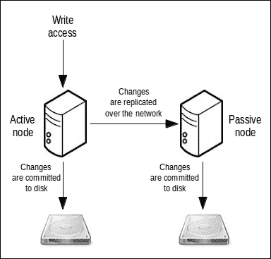

### 提示

所有复制的数据集，例如共享存储设备，都称为 DRBD 中的资源，不应与前面章节中讨论的 PCS 资源混淆。

为了安装 DRBD，您需要在两个节点上启用 ELRepo 仓库，因为该软件包未通过标准的 CentOS 仓库分发。以下是 ELRepo 仓库的目的和内容的简要说明：

1.  第一步是导入用于签署`rpm`包的 GPG 密钥，该包代表着仓库的基础。如果在导入密钥之前尝试使用 rpm 安装该软件包，安装将因为安全措施而失败。

1.  在两个节点上运行以下命令：

    ```
    rpm --import https://www.elrepo.org/RPM-GPG-KEY-elrepo.org
    rpm -Uvh http://www.elrepo.org/elrepo-release-7.0-2.el7.elrepo.noarch.rpm
    ```

1.  你可以通过以下命令验证 ELRepo 是否已被添加到你配置的仓库中：

    ```
    yum repolist | grep elrepo
    ```

    输出应该与以下屏幕截图所示相似：

    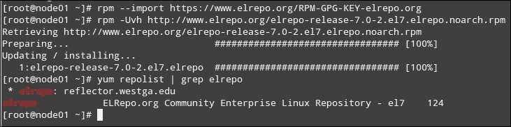

    ### 提示

    另外，你可以在安装添加它到系统中的 `rpm` 包后显式禁用 ELRepo，并仅在安装必要的包时启用它（为防万一，请确保先备份原始仓库配置文件）：

    ```
    cp /etc/yum.repos.d/elrepo.repo /etc/yum.repos.d/elrepo.repo.ORG 
    sed -i "s/enabled=1/enabled=0/g" /etc/yum.repos.d/elrepo.repo
    yum --enablerepo elrepo update
    yum --enablerepo elrepo install -y drbd84-utils kmod-drbd84
    ```

1.  然后，使用以下命令：

    ```
    yum update && yum install drbd84-utils kmod-drbd84
    ```

    它将安装必要的管理工具，以及相应的 DRBD 内核模块。此过程完成后，你需要使用以下命令检查模块是否已加载：

    ```
    lsmod | grep -i drbd
    ```

    如果模块没有自动加载，你可以按如下方式在两个节点上手动加载该模块：

    ```
    modprobe drbd
    ```

### 注意

请注意，`modprobe` 命令将在当前会话中负责加载内核模块。然而，为了让它在启动时加载，你必须通过创建一个文件到 `/etc/modules-load.d/` 中来使用 systemd-modules-load 服务，以确保每次系统启动时 DRBD 模块都能正确加载：

```
echo drbd >/etc/modules-load.d/drbd.conf
```

# ELRepo 仓库与 DRBD 可用性

ELRepo 是一个为兼容 Red Hat 企业版 Linux 的 Linux 发行版提供的软件仓库，CentOS 和 Scientific Linux 是其衍生版。ELRepo 主要关注与硬件相关的软件包（尤其是驱动程序），以增强或提供当前内核中没有的功能。因此，通过安装相应的软件包，你可以免去仅为添加某个功能而重新编译内核，或者等待它在上游仓库中得到支持，或等待该功能被包含在以后版本的内核发布中。ELRepo 仓库由相关发行版（RHEL、CentOS 和 Scientific Linux）的活跃成员维护。

由 ELRepo 提供的 DBRD 主要用于评估和体验 RHEL 基础平台上的 DRBD，但它并未得到 Red Hat 和 DRBD 的创建者 LINBIT 官方支持。然而，按照本章及本书其余部分所述的程序，你可以确保在集群中提供所有必要的功能。

一旦我们安装了前面提到的包，我们需要分配用于存储复制内容的物理空间。考虑到可扩展性，我们将使用 **逻辑卷管理器**（**LVM**）技术来创建动态硬盘分区，这样以后如果需要，可以轻松调整其大小。

首先，我们将为每个节点添加一块 2GB 的硬盘。该硬盘的用途是作为 Apache Web 服务器访问的 PHP 应用程序的底层文件系统。

我选择这个大小是因为它足以存储所有需要复制的文件，并且因为 Virtualbox 允许你为存储磁盘选择任意大小。如果你在跟随本书操作时使用的是实际硬件，你可能需要根据实际情况选择不同的大小。

要向 Virtualbox 中的现有虚拟机添加虚拟硬盘，请按照以下步骤操作：

1.  关闭 **虚拟机**

1.  在 Virtualbox 的初始界面中右击它

1.  在上下文菜单中选择 **设置**，然后选择 **存储**

1.  选择 **控制器：SATA**，然后点击 **添加硬盘**，接着点击 **创建新磁盘**

1.  选择 **虚拟磁盘映像（VDI）** 和 **动态分配**，然后继续到下一步

1.  最后，为设备指定一个名称并选择 2 GB 作为大小

启动并启动每个节点后，我们应该执行以下命令来识别新添加的磁盘（在我们的例子中，新磁盘是尚未分区的那个）：

```
ls -l /dev | grep -Ei sd[a-z]
```

我们将通过以下命令来识别新添加的磁盘：

```
dmesg | grep sdb
```

这里，`/dev/sdb` 是新磁盘的 ID，正如之前列出 `/dev` 目录内容时返回的那样：

```
[root@node02 ~]# dmesg | grep sdb
[  2.484257] sd 3:0:0:0: [sdb] 4194304 512-byte logical blocks: (2.14 GB/2.00 GiB)
[  2.484258] sd 3:0:0:0: [sdb] Write Protect is off
[  2.484258] sd 3:0:0:0: [sdb] Mode Sense: 00 3a 00 00
[  2.484258] sd 3:0:0:0: [sdb] Write cache: enabled, read cache: enabled, doesn't support DPO or FUA
[  2.487361]  sdb: unknown partition table
[  2.498564] sd 3:0:0:0: [sdb] Attached SCSI disk
[root@node02 ~]#
```

现在，让我们在磁盘上创建一个分区，对应的物理卷，一个卷组（`drbd_vg`），以及最终的逻辑卷（`drbd_vol`）。确保在每个节点上重复这些步骤，根据需要更改设备（`dev/sdX`）：

```
parted /dev/sdb mklabel msdos
parted /dev/sdb mkpart p 0% 100%
pvcreate /dev/sdb1
vgcreate drbd_vg /dev/sdb1
lvcreate -n drbd_vol -l 100%FREE drbd_vg
```

### 注意

你可以通过命令 `lvdisplay /dev/drbd_vg/drbd_vol` 来检查新创建的逻辑卷的状态。

# 配置 DRBD

在每个节点上成功创建并分区我们的 DRBD 磁盘后，DRBD 的主配置文件位于 `/etc/drbd.conf`，该文件仅包含以下两行：

```
include "drbd.d/global_common.conf";
include "drbd.d/*.res";
```

这两行包括相对路径，从 `/etc/` 开始，指向实际的配置文件。在 `global_common.conf` 文件中，你将找到你的 DRBD 安装的全局设置，以及 DRBD 配置中的公共部分（定义那些应该被每个资源继承的设置）。另一方面，在 `.res` 文件中，你会找到每个 DRBD 资源的特定配置。

我们将通过以下命令将现有的 `global_common.conf` 文件重命名为 `global_common.conf.orig`（作为原始设置的备份副本）：

```
mv /etc/drbd.d/global_common.conf /etc/drbd.d/global_common.conf.orig
```

然后，我们将通过打开文件并使用你喜欢的文本编辑器创建一个新的 `global_common.conf` 文件，内容如下：

```
global {
 usage-count no;
}
common {
 net {
  protocol C;
 }
}
```

一旦你在一个节点（例如，`node01`）上创建了前面的文件，你可以轻松地将其复制到另一个节点，方法如下：

```
ssh node02 mv /etc/drbd.d/global_common.conf /etc/drbd.d/global_common.conf.orig
scp /etc/drbd.d/global_common.conf node02:/etc/drbd.d/
```

### 注意

你应该养成备份原始配置文件的习惯，这样当出现问题时，你可以恢复到之前的设置。

`usage-count no` 行在全局部分会跳过每次安装新版本软件时向 DRBD 团队发送通知。如果你希望提交来自系统的信息，可以将其更改为 `yes`。或者，如果你希望每次升级时都提示你做出决定，可以将其更改为 `ask`。无论哪种方式，你都应该知道他们仅将这些信息用于统计分析，而且他们的报告总是公开的，位于 [`usage.drbd.org/cgi-bin/show_usage.pl`](http://usage.drbd.org/cgi-bin/show_usage.pl)。

`protocol C` 行告诉 DRBD 资源使用完全同步的复制，这意味着，作为主节点的本地写操作只有在本地和远程磁盘的写入都得到确认后，才视为完成。因此，如果单个节点出现故障，在正常情况下不会导致任何数据丢失，除非两个节点（或其存储子系统）同时不可恢复地损坏。

接下来，我们需要为我们的资源创建一个特定的新配置文件（称为 `/etc/drbd.d/drbd0.res`），我们将其命名为 `drbd0`，文件内容如下（其中 `192.168.0.2` 和 `192.168.0.3` 是我们两个节点的 IP 地址，`7789` 是用于通信的端口）：

```
resource drbd0 {
     disk /dev/drbd_vg/drbd_vol;
     device /dev/drbd0;
     meta-disk internal;
     on node01 {
             address 192.168.0.2:7789;
     }
     on node02 {
             address 192.168.0.3:7789;
     }
}
```

### 注意

你可以在 Linbit 网站上的资源配置文件中查找每个指令的含义（以及其他指令），地址为 [`drbd.linbit.com/users-guide-8.4/`](http://drbd.linbit.com/users-guide-8.4/)。

TCP 端口 `7789` 是大多数 DRBD 安装中使用的典型端口号。然而，官方文档指出，DRBD（按照惯例）使用从 `7788` 开始的 TCP 端口，每个资源都监听一个单独的端口。在本章中，由于我们只处理一个资源，我们将仅使用端口 `7789`——无论是在唯一的资源配置文件中，还是在两个节点的防火墙设置中。请务必记住在防火墙中打开此端口，否则，资源将无法进行后续的同步。

要在防火墙配置中打开 `7789` TCP 端口，在两个节点上执行以下命令：

```
iptables -I INPUT -p tcp -m state --state NEW -m tcp --dport 7789 -j ACCEPT
service iptables save
```

另外，你可以按如下方式将此文件复制到另一个节点：

```
scp /etc/drbd.d/drbd0.res node02:/etc/drbd.d/
```

当我们之前安装 DRBD 时，一个名为 `drbdadm` 的工具也被安装了，从它的名字可以猜到，它是用于管理 DRBD 资源的工具，类似于我们新配置的卷。启动并使 DRBD 资源上线的第一步是初始化其元数据（如果你在配置文件中设置了不同的名称，可能需要更改资源名称）。请注意，事先需要 `/var/lib/drbd` 目录。如果在安装 DRBD 时没有创建该目录，请在继续之前手动创建它，使用以下代码：

```
mkdir /var/lib/drbd
drbdadm create-md drbd0
```

这些行应返回以下输出，并显示相应的确认消息，表示设备的元数据已成功创建：

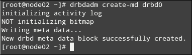

### 注意

“元数据”一词被定义为关于数据的数据。在 DRBD 资源的上下文中，资源的元数据包含有关设备及其所存储数据的多条信息。如果出现问题，`drbdadm create-md [drbd resource]`命令将返回有用的调试信息。

下一步是启用`drbd0`，以完成磁盘和网络资源的分配：

```
drbdadm up drbd0
```

你可以通过查看`/proc`虚拟文件系统来验证资源的状态，它允许你查看内核视角下的系统资源，正如以下截图所示。但是，请确保你已按照之前的指示在两个节点上执行：

```
cat /proc/drbd
```

请查看以下截图：

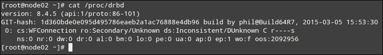

请注意，由于我们尚未指明哪个 DRBD 设备（每个节点一个）将作为主设备，哪个将作为从设备，因此设备的状态显示为未知和不一致。在这种情况下，考虑到我们从零开始设置了两个 DRBD 设备，选择哪个作为主设备并不重要。然而，如果我们使用了一个已有数据的设备，那么选择那个设备作为主资源就非常重要。否则，你有丢失数据的严重风险。

运行以下命令，将其中一个设备标记为主设备并执行初步同步。你只需要在具有主资源的节点（在我们的示例中，是`node01`）执行此操作：

```
drbdadm primary --force drbd0
```

如同之前一样，你可以在同步进行时检查当前的同步状态。`cat /proc/drbd`命令显示资源的创建和同步进度，如下所示：

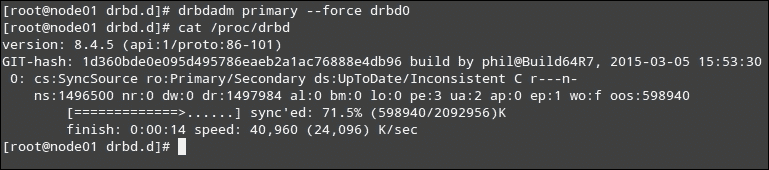

现在，通过`drbd-overview`命令，如其名称所示，你可以查看当前配置的 DRBD 资源概览。在这种情况下，你应该会看到`node01`作为主设备，`node02`作为从设备，通过在两个节点上运行命令可以验证这一点（如下截图所示）：

在`node01`上，`drbd-overview`命令应该返回：

```
0:drbd0/0  Connected Primary/Secondary UpToDate/UpToDate
```

而在`node02`上，你应该看到：

```
0:drbd0/0  Connected Secondary/Primary UpToDate/UpToDate
```

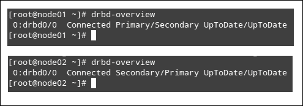

最后，我们需要在`node01`上的`/dev/drbd0`上创建一个文件系统。你可以选择任何适合你需求或要求的文件系统，如果有的话。如果你还没有决定使用哪个，`Ext4`是一个不错的选择。XFS 是 CentOS 7 系统默认的文件系统。然而，如果我们以后需要调整它的大小（例如，遇到更复杂的底层存储需求来支持网页和数据库服务器的运行），则无法调整 XFS 的大小。

在主节点上运行以下命令，为`/dev/drbd0`创建`ext4`文件系统，并等待其完成，如下面的屏幕截图所示：

```
mkfs.ext4 /dev/drbd0
```

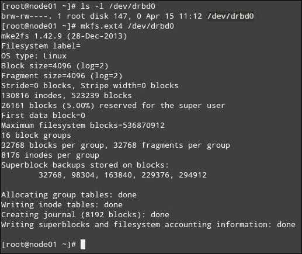

现在，您的 DRBD 资源已准备好如常使用。您现在可以挂载它并开始保存文件。但是，在我们将其用作高可用和故障转移组件之前，我们仍然需要将其添加为集群资源。这就是我们将在下一节中执行的操作。

非常重要的是，您需要从`node01`，即我们的主节点上为资源创建文件系统。否则，在试图从非主集群成员节点添加文件系统时，将遇到挂载问题。

# 将 DRBD 添加为 PCS 集群资源

您会回想起在第二章中，我们如何为集群添加虚拟 IP 地址。现在，是时候为我们刚刚创建和配置的 DRBD 资源执行相同的操作了。

然而，在执行此操作之前，我们必须指出 PCS 命令行工具的一个最显著特性之一，即它能够将当前集群配置保存到文件中，然后可以使用命令行工具添加进一步的设置。然后，您可以使用生成的文件更新运行中的集群配置。

要从**集群信息库**（**CIB**）中检索集群配置并将其保存到名为`drbd0_conf`的文件中，当前工作目录，请确保首先启动集群，并使用以下命令：

```
pcs cluster start --all
```

然后将集群配置保存到之前提到的文件中（`drbd0_conf`将自动创建）：

```
pcs cluster cib drbd0_conf
```

接下来，我们将 DRBD 设备作为 PCS 集群资源添加。请注意`-f`开关，指示以下命令的更改应追加到`drbd0_conf`文件。以下命令必须从与前一条命令相同的目录执行（即包含`drbd0_conf`文件的目录）：

```
pcs -f drbd0_conf resource create web_drbd ocf:linbit:drbd drbd_resource=drbd0 op monitor interval=60s
```

最后，我们需要确保该资源同时在两个节点上运行，通过添加克隆资源（一种应在多个主机上同时活动的特殊资源）来实现此目的：

```
pcs -f drbd0_conf resource master web_drbd_clone web_drbd master-max=1 master-node-max=1 clone-max=2 clone-node-max=1 notify=true
```

此时，我们可以使用`drbd0_conf`文件更新集群配置。但是，在更新全局配置之前和之后运行`pcs status`命令快速检查集群状态及其资源，能更好地可视化变更：

```
pcs status
pcs cluster cib-push drbd0_conf
```

如果更新成功，最后的命令应该会显示以下消息：

```
CIB updated
```

现在，让我们再次检查当前的集群配置：

```
pcs status
```

如果最后的 PCS 状态显示有某个故障事件（很可能与 SELinux 策略有关，而不太可能与常规文件权限有关），你应该检查`/var/log/audit/audit.log`文件来开始排查问题。以 AVC 开头的行会指明你需要首先查看的地方。以下是一个示例：

```
type=AVC msg=audit(1429116572.153:295): avc:  denied  { read write } for  pid=24192 comm="drbdsetup-84" name="drbd-147-0" dev="tmpfs" ino=20373 scontext=system_u:system_r:drbd_t:s0 tcontext=unconfined_u:object_r:var_lock_t:s0 tclass=file
```

前面的错误信息似乎表明 SELinux 正在拒绝`drbdsetup-84`可执行文件对临时`tmpfs`文件系统的读/写访问。其相应的被拒绝的系统调用支持这一理论：

```
type=SYSCALL msg=audit(1429116572.153:295): arch=c000003e syscall=2 success=no exit=-13 a0=125e080 a1=42 a2=180 a3=7fff42b39f80 items=0 ppid=24191 pid=24192 auid=4294967295 uid=0 gid=0 euid=0 suid=0 fsuid=0 egid=0 sgid=0 fsgid=0 tty=(none) ses=4294967295 comm="drbdsetup-84" exe="/usr/lib/drbd/drbdsetup-84" subj=system_u:system_r:drbd_t:s0 key=(null)
```

### 注意

NSA 增强安全 Linux（SELinux）是 Linux 中一个灵活的强制访问控制架构的实现。如果你在最初遇到一些问题，你可以禁用 SELinux 来执行以下步骤（但强烈建议不要这么做）。如果你选择通过编辑`/etc/sysconfig/selinux`禁用 SELinux，别忘了使用`pcs resource cleanup [resource_id]`清理资源错误计数，其中`resource_id`是`pcs resource show`返回的资源名称。

为了清除所有疑虑，安装`policycoreutils-python`包（其中包含用于管理 SELinux 环境的管理工具）：

```
yum update && yum install policycoreutils-python
```

使用其中包含的`audit2allow`工具，以人类可读的形式查看访问被拒绝的原因，然后根据被拒绝操作的日志生成 SELinux 的允许规则。以下命令将输出`audit.log`文件中最后一行包含 AVC 的内容，然后将其传递给`audit2allow`，生成可读格式的结果：

```
cat /var/log/audit/audit.log | grep AVC | tail -1 | audit2allow -w -a
```

如下图所示，我们可以确认由于缺少类型强制规则，访问被拒绝：

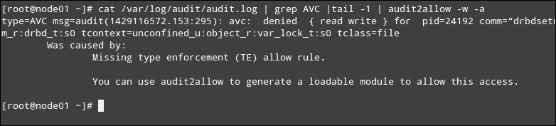

现在我们知道是什么原因导致了问题，让我们创建一个策略包，将必要的类型强制规则应用到命令行中指定的模块：

```
cat /var/log/audit/audit.log | grep AVC | tail -1 | audit2allow -a -M drbd0_access_0
```

如果你在当前工作目录中执行`ls -l`，你会发现前面的命令创建了一个类型强制文件（`drbd_access_0.te`）并将其编译成一个策略包（`drbd_access_0.pp`），你需要使用以下命令激活它：

```
semodule -i drbd0_access_0.pp
```

前面的命令可能需要约一分钟才能完成，所以如果你遇到这种情况也不用担心，正如下面的截图所示，没有输出意味着操作成功：

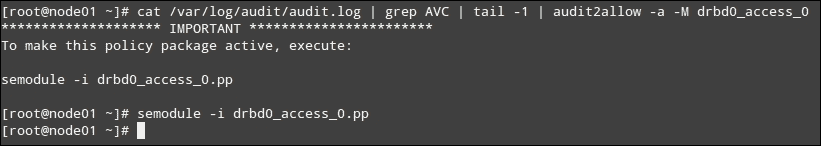

现在，我们需要将模块复制到`node02`并在那里安装。这也是我们在第一章中设置节点间基于密钥的认证的原因之一，*集群基础与 CentOS 7 上的安装*：

```
scp drbd0_access_0.pp node02:~
```

然后，在`node02`上运行以下命令：

```
semodule -i drbd0_access_0.pp
```

另外，你也可以在 `node01` 上执行以下命令：

```
ssh node02 semodule -i drbd0_access_0.pp
```

此外，SELinux 的 `daemons_enable_cluster_mode` 策略应在两个节点上设置为 true：

```
setsebool -P daemons_enable_cluster_mode 1
```

然后，如果 `pcs status` 的输出显示进一步的错误，你可能需要多次重复这个过程。如果你发现需要多次重复，可能需要考虑将 SELinux 设置为 permissive，这样它就会发出警告而不是阻止集群资源。然后，你可以继续进行设置，稍后再进行调试。

我们可以看到两个节点都在线，集群资源已正确启动，如下所示：

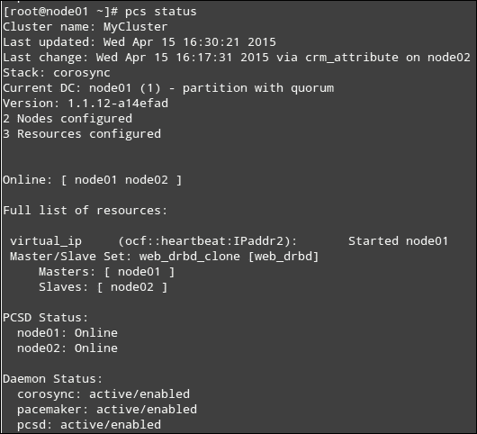

现在，让我们暂时休息一下 DRBD，集中安装 Web 和数据库服务器。请注意，我们将在第五章 *集群健康监控*中重新讨论这个话题，我们将在那里模拟并排除问题。需要注意的是，如果你重新启动了一个节点或两个节点，它们可能会在此时检测到分脑情况，我们将在下一章手动修复这一问题（因为这是 LINBIT 推荐的方法），当时我们会排除集群操作中可能出现的最常见问题。

# 安装 Web 和数据库服务器

在写这本书时，Apache HTTP 服务器（简称 Apache）仍然是全球使用最广泛的 Web 服务器，通常用于所谓的 **LAMP 堆栈**中。在这个堆栈中，Linux 发行版作为操作系统，Apache 作为 Web 服务器，MySQL/MariaDB 作为数据库服务器，PHP 作为应用程序的服务器端编程语言。每个组件都是免费的，这些技术被广泛使用，因此学习和获取帮助也非常容易。

要安装 Apache 和 MariaDB（MySQL 的免费开源分支）服务器，请在每个节点上运行以下命令。请注意，这也会安装 PHP：

```
yum update && yum install httpd mariadb mariadb-server php
```

安装成功后，我们将继续之前的操作。首先，让我们在两个节点上启用并启动 Web 服务器：

```
systemctl enable httpd
systemctl start httpd
```

别忘了确保 Apache 正在运行：

```
systemctl status httpd
```

在防火墙中允许通过 TCP 端口 `80` 的流量：

```
iptables -I INPUT -p tcp -m state --state NEW -m tcp --dport 80 -j ACCEPT
service iptables save
```

此时，你可以启动一个 Web 浏览器，并指向节点的独立 IP 地址（记住，我们还没有将 Apache 添加为集群资源，因此不能通过两个节点的虚拟 IP 访问 Web 服务器）。你应该能看到 Apache 的欢迎页面，如下图所示，我们可以看到 Web 服务器在 `node02`（根据我们的初始设置为 `192.168.0.3`）上运行正常：

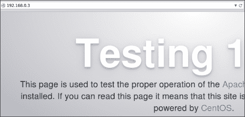

现在，是时候稍微退后一步了。我们将禁用并停止两个节点上的 Apache，这样 PCS 在继续时会管理它：

```
systemctl disable httpd
systemctl stop httpd
```

为了让 Apache 在虚拟 IP（我们已将 `192.168.0.4` 分配为该 IP 地址）和回环地址上监听（稍后我们会解释原因），我们需要修改主配置文件 `(/etc/httpd/conf/httpd.conf)`，如下所示（你可能需要先备份此文件）：

```
# Listen: Allows you to bind Apache to specific IP addresses and/or
# ports, instead of the default. See also the <VirtualHost>
# directive.
#
# Change this to Listen on specific IP addresses as shown below to
# prevent Apache from glomming onto all bound IP addresses.
#
#Listen 12.34.56.78:80
Listen 192.168.0.4:80
Listen 127.0.0.1
```

然后，重新启动 Apache：

```
systemctl restart httpd
```

请注意，当在第二个节点上重启 Web 服务器时，预计会出现错误，因为该套接字上已经有一个服务在运行。然而，这是正常现象，现在，你应该能够通过将浏览器指向虚拟 IP 来访问 Apache 欢迎页面。

有趣的部分是找出虚拟 IP 启动的节点，如下图所示。如果这里出现错误，确保 `virtual_ip` 首先由 PCS 启动：

```
pcs status | grep virtual_ip
```

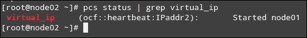

现在，让我们使用以下命令停止该节点上的集群：

```
pcs resource show virtual_ip
```

然后，在另一个节点上，它仍应指示该资源处于活动状态。

然而，即使虚拟 IP 被故障转移到 `node02`，也无法通过该资源访问 Web 服务器，因为它最初并没有在该节点启动。因此，我们仍然需要将 Apache 配置为集群资源，以便它能作为资源进行管理。

# 将 Web 服务器配置为集群资源

你会记得在我们在第二章 *安装集群服务和配置网络组件*中配置虚拟 IP 时，以及在本章早些时候添加复制存储时，我们必须指明一种方式，供 PCS 定期检查资源是否可用。

在这种情况下，我们将使用服务器状态页面（`http://node0[1-2]/server-status`），这是首选的 Apache 网页，因为它提供了有关服务器性能的信息，PCS 每分钟会查询一次该页面。通过在两个节点的`/etc/httpd/conf.d`目录下创建一个名为`status.conf`的文件，可以实现这一功能：

```
<Location /server-status>
  SetHandler server-status
  Order deny,allow
  Deny from all
  Allow from 127.0.0.1
</Location>
```

然后，使用以下命令，我们将 Apache 添加为集群资源。资源的状态将由 PCS 每分钟检查一次：

```
pcs resource create webserver ocf:heartbeat:apache configfile=/etc/httpd/conf/httpd.conf statusurl="http://localhost/server-status" op monitor interval=1min
```

默认情况下，pacemaker 会尝试平衡集群中的资源使用。然而，在某些情况下，我们的设置要求两个相关资源（如 Web 服务器和虚拟 IP）必须在同一主机上运行。

Web 服务器应始终在虚拟 IP 活动的主机上运行。这也意味着，如果虚拟 IP 资源在任何节点上都没有激活，则 Web 服务器根本不应运行。此外，由于我们需要 Web 服务器在虚拟 IP 地址上以及每个主机的回环设备上监听，显然

我们必须确保虚拟 IP 资源在 Web 服务器资源之前启动。

我们可以通过以下约束来实现这两个要求：

```
pcs constraint colocation add webserver with virtual_ip INFINITY
pcs constraint order virtual_ip then webserver
```

运行第二个命令后，您应该会在屏幕上看到以下消息。请注意，必须先启动虚拟 IP 资源，然后才能启动 Web 服务器，这是强制性的要求：

```
Adding virtual_ip webserver (kind: Mandatory) (Options: first-action=start then-action=start)
```

现在，让我们检查集群的状态，并关注其分配的资源，如下图所示：

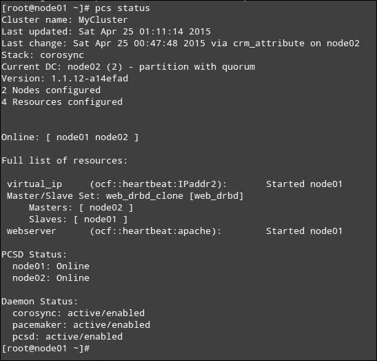

现在，您可以通过强制 `node01` 下线来模拟故障转移。为此，您可以运行以下命令：

```
pcs cluster stop
```

资源应该会在 `node02` 上自动启动，如下图所示：

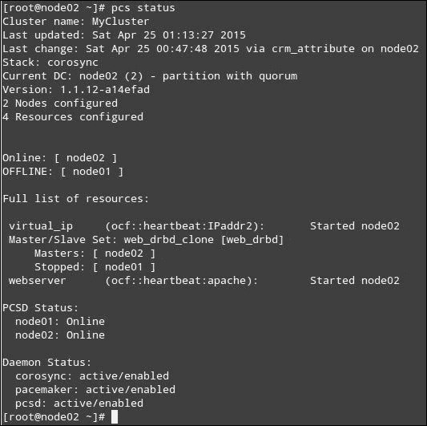

最后的步骤是将 DRBD 资源挂载到 `/var/html/www 目录` 上，并在其中添加一个简单的 PHP 页面以显示集群的 PHP 配置。然后，您可以在这个简单示例的基础上构建更复杂的应用程序。

在尝试使用 `/dev/drbd0` 之前，我们应该通过 `drbd-overview` 检查它在两个节点上的状态。如果输出显示 StandAlone 或 WFConnection，我们就遇到了脑裂（split-brain）情况，可以通过以下命令的输出确认这一点：

```
dmesg | grep -i brain 
```

这将导致出现 `Split-Brain detected, dropping connection!` 错误信息。

Linbit 建议通过选择一个修改将被丢弃的节点来手动解决此类情况，然后在该节点上执行以下命令：

```
drbdadm secondary [resource name] 
drbdadm connect --discard-my-data [resource name] 
```

然后连接另一个节点上的 DRBD 资源：

```
drbdadm connect [resource name]
```

您还可以在 `node01` 上使用以下命令启动或停止 DRBD 并查看概况：

```
drbdadm up drbd0
drbdadm down drbd0
drbd-overview
ssh node02 drbdadm up drbd0
ssh node02 drbdadm down drbd0
ssh node02 drbd-overview
```

### 注意

在选择脑裂情况的恢复方法之前，请仔细审查 DRBD 文档。由于没有适用于所有情况的单一解决方案，因此我选择在本书中介绍推荐的方法。

# 挂载 DRBD 资源并与 Apache 一起使用

在使用 DRBD 资源之前，必须在其上定义一个文件系统并将其挂载到本地目录。我们将使用 Apache 的文档根目录（`/var/www/html`），但根据情况，您也可以使用虚拟主机目录。如前所述，我们将逐步在配置文件中添加这些更改，并稍后将其推送到运行中的 CIB（`node01` 或其他数据中心）。

首先，创建一个名为 `fs_dbrd0_cfg` 的新配置文件（如果需要，可以更改文件名）：

```
pcs cluster cib fs_drbd0_cfg
```

接下来，我们将创建文件系统资源本身（如果需要，修改变量值）。这是另一个开箱即用的特殊类型资源：

```
pcs -f fs_drbd0_cfg resource create web_fs Filesystem device="/dev/drbd0" directory="/var/www/html" fstype="ext4"
```

这表示文件系统应该始终在主 DRBD 资源上可用：

```
pcs -f fs_drbd0_cfg constraint colocation add web_fs with web_drbd_clone INFINITY with-rsc-role=Master
```

请注意，为了确保文件系统能够正确启动，必须首先启动 `/dev/drbd0`，因此我们需要为此目的添加一个约束条件：

```
pcs -f fs_drbd0_cfg constraint order promote web_drbd_clone then start web_fs
```

最后，确保 Apache 需要与文件系统资源在同一节点上运行，且该资源也需要在 Web 服务器资源启动之前上线：

```
pcs -f fs_drbd0_cfg constraint colocation add webserver with web_fs INFINITY
pcs -f fs_drbd0_cfg constraint order web_fs then webserver 
```

你可以使用以下命令查看配置：

```
pcs -f fs_drbd0_cfg constraint
```

输出如下所示的截图：

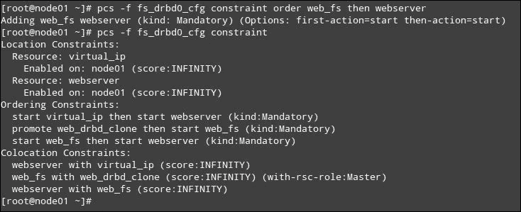

如果一切正确，使用以下命令将其推送到运行中的 CIB：

```
pcs cluster cib-push fs_drbd0_cfg 
```

上述命令应在成功完成后显示 CIB 已更新。

如果现在运行`pcs status`，你应该会看到新添加的资源，正如下面截图所示：

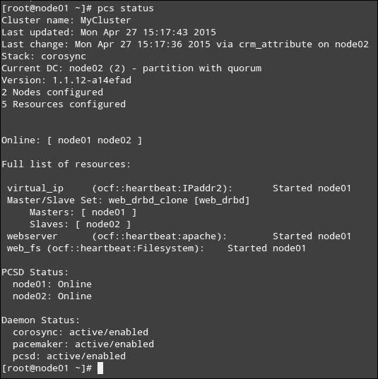

现在，你无需手动挂载`/dev/drbd0`到`/var/www/html`，因为集群会自动处理。你可以使用以下命令验证 DRBD 设备是否已经挂载到`/var/www/html`：

```
mount | grep drbd0
```

### 注意

请记住，在`/dev/drbd0`挂载时，`/var/html/www`中任何原有的内容将不可用。

# 测试 DRBD 资源与 Apache 一起使用

作为一个简单的测试，我们将显示 PHP 安装信息。在`node01`的`/var/www/html`中创建一个名为`info.php`的文件，内容如下：

```
<?php
phpinfo();
?>
```

现在，将浏览器指向`192.168.0.4/info.php`，并验证输出是否与此处显示的类似：

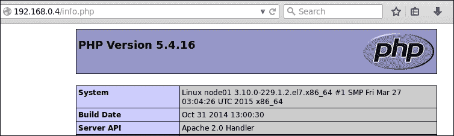

然后，停止`node01`上的集群（`pcs cluster stop`）或将其置于待机模式（`pcs cluster standby node01`），并刷新浏览器。输出中唯一应该变化的是系统名称，如下图所示，因为`phinfo()` PHP 函数返回的是本地主机名以及 PHP 安装的信息：

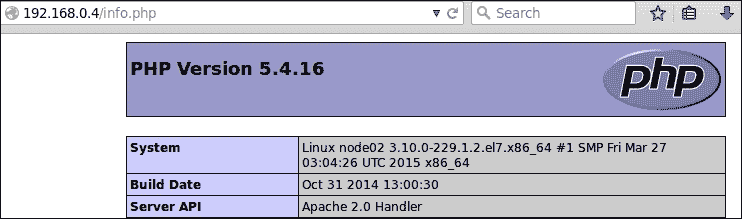

此外，如果你列出`node02`上`/var/www/html`的内容，你会看到原本在`node01`上创建的`info.php`文件现在也出现在`node02`上，如下图所示：

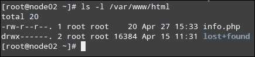

在继续之前，请记得将`node01`恢复到正常模式：

```
pcs cluster unstandby node01
```

# 设置具有复制存储的高可用数据库

本章的最后部分重点介绍设置具有复制存储的高可用 MariaDB 数据库。首先，我们需要像之前一样设置另一个 DRBD 资源。为了清晰起见，我们将在此回顾必要的步骤：

1.  为每个虚拟机添加另一个虚拟磁盘（2 GB 磁盘即可）。

1.  在新添加的磁盘上创建一个分区，然后按照流程在`/dev/``sdc1`上创建**物理卷**（**PV**）、**卷组**（**VG**，命名为`drbd_db_vg`），最后创建**逻辑卷**（**LV**，`drbd_db_vol`）：

    ```
    parted /dev/sdc mklabel msdos
    parted /dev/sdc mkpart p 0% 100%
    pvcreate /dev/sdc1
    vgcreate drbd_db_vg /dev/sdc1
    lvcreate -n drbd_db_vol -l 100%FREE drbd_db_vg
    ```

1.  为新的 DRBD 资源（`drbd1`）创建一个配置文件（`/etc/drbd.d/drbd1.res`），并基于第一个复制存储资源的配置文件，按需编辑设置并使用不同的端口：

    ```
    resource drbd1 {
     disk /dev/drbd_db_vg/drbd_db_vol;
     device /dev/drbd1;
     meta-disk internal;
     on node01 {
     address 192.168.0.2:7790;
     }
     on node02 {
     address 192.168.0.3:7790;
     }
    }
    ```

    然后，添加一条防火墙规则以允许流量：

    ```
    iptables -I INPUT -p tcp -m state --state NEW -m tcp --dport 7790 -j ACCEPT
    service iptables save
    ```

1.  在第二个节点上重复之前的步骤。为新 DRBD 资源初始化元数据：

    ```
    drbdadm create-md dbrd1
    ```

1.  启用复制存储资源，以便为其操作分配磁盘和网络资源：

    ```
    drbdadm up drbd1
    ```

1.  将 DC 节点上的 DRBD 设备标记为主设备：

    ```
    drbdadm primary --force drbd1
    ```

1.  将新的 DRBD 设备添加为集群资源：

    ```
    mkdir -p /var/lib/mariadb_drbd1/data
    pcs cluster cib drbd1_conf
    pcs -f drbd1_conf resource create db_drbd ocf:linbit:drbd drbd_resource=drbd1 op monitor interval=60s
    pcs -f drbd1_conf resource master db_drbd_clone db_drbd master-max=1 master-node-max=1 clone-max=2 clone-node-max=1 notify=true
    pcs -f fs_drbd1_cfg resource create db_fs Filesystem device="/dev/drbd1" directory="/var/lib/mariadb_drbd1" fstype="ext4"
    pcs cluster cib-push drbd1_conf
    ```

当此过程完成时，所有已配置的 DRBD 资源概述应如下所示：

```
[root@node01 ~]# cat /proc/drbd
version: 8.4.6 (api:1/proto:86-101)
GIT-hash: 833d830e0152d1e457fa7856e71e11248ccf3f70 build by phil@Build64R7, 2015-04-10 05:13:52
 0: cs:Connected ro:Primary/Secondary ds:UpToDate/UpToDate C r-----
 ns:98324 nr:0 dw:32888 dr:66457 al:11 bm:0 lo:0 pe:0 ua:0 ap:0 ep:1 wo:f oos:0
 1: cs:Connected ro:Primary/Secondary ds:UpToDate/UpToDate C r-----
 ns:2092956 nr:0 dw:33996 dr:2094412 al:0 bm:0 lo:0 pe:0 ua:0 ap:0 ep:1 wo:f oos:0
[root@node01 ~]# drbd-overview
 0:drbd0/0  Connected Primary/Secondary UpToDate/UpToDate /var/www/html ext4 2.0G 6.1M 1.9G 1%
 1:drbd1/0  Connected Primary/Secondary UpToDate/UpToDate
[root@node01 ~]#
```

此外，集群现在应包含新的 DRBD 资源及其克隆（分别为`db_drbd`和`db_drbd_clone`）以及文件系统资源，正如您在此截图中所看到的：

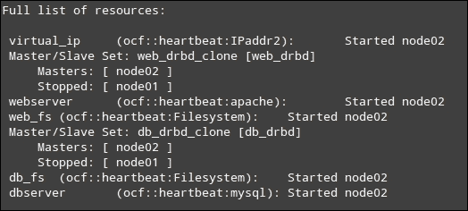

我们现在可以将 MariaDB 文件分成两个独立的部分：

+   二进制文件、套接字和`.pid`文件将放置在常规分区的一个目录中，每个节点独立（默认在`/var/lib/mysql`）。这些文件不需要具备高可用性或故障安全性。

+   数据库和配置文件（`my.cnf`）将存储在一个 DRBD 资源中，该资源将挂载在`/var/lib/mariadb_drbd1`下的名为 data 的目录中。

接下来，我们需要将数据库服务器作为集群资源添加：

```
pcs resource create dbserver ocf:heartbeat:mysql config="/var/lib/mariadb_drbd1/my.cnf" datadir="/var/lib/mariadb_drbd1/data" op monitor interval="30s" op start interval="0" timeout="60s" op stop interval="0" timeout="60s"
```

我们将添加与 Apache 相同的约束：

```
pcs constraint colocation add dbserver with virtual_ip INFINITY
pcs constraint order virtual_ip then dbserver
pcs constraint colocation add db_drbd_clone with virtual_ip INFINITY
pcs constraint order virtual_ip then db_drbd_clone
```

接下来，我们将添加防火墙规则以允许流量：

```
iptables -I INPUT -p tcp -m state --state NEW -m tcp --dport 3306 -j ACCEPT
service iptables save
```

我们将首先在`drbd1`上创建一个`ext4`文件系统，并将其挂载到之前创建的目录中。此步骤仅在数据中心（DC）上执行：

```
mkfs.ext4 /dev/drbd1
mount /dev/drbd1 /var/lib/mariadb_drbd1
```

接下来，我们需要将数据库服务器配置文件移动到`drbd1`的挂载点（在两个节点上执行以下所有步骤）：

```
mv /etc/my.cnf /var/lib/mariadb_drbd1/my.cnf
```

编辑该文件，确保`datadir`变量指向 DRBD 资源挂载点内正确的目录，同时指定数据库服务器应监听虚拟 IP 资源的 IP 地址上的 TCP 连接：

```
datadir=/var/lib/mariadb_drbd1/data
bind-address=192.168.0.4
```

接下来，我们需要初始化数据库数据目录：

```
mysql_install_db --no-defaults --datadir=/var/lib/mariadb_drbd1/data
```

最后，登录到数据库服务器：

```
mysql –h 192.168.0.4 –u root –p
```

然后，授予通过定义的密码识别的 root 用户所有权限：

```
GRANT ALL ON *.* TO 'root'@'%' IDENTIFIED BY 'MyDBpassword'; 
FLUSH PRIVILEGES;
```

### 注意

此权限设置仅用于测试，在将集群迁移到生产环境之前，应根据需要修改以满足安全要求。

或者，我们可以创建一个空数据库：

```
CREATE DATABASE cluster_db;
```

最后，确保`mysql`用户可以访问`/var/lib/mariadb_drbd1`目录：

```
chown -R mysql:mysql /var/lib/mariadb_drbd1/
```

如果我们现在从活动节点切换到被动节点，`datadir`中的实际数据库文件将通过 DRBD 复制到另一个节点的相同目录中。

# 故障排除

如前所述，`pcs status`命令的`Failed actions`部分将显示集群资源是否存在问题，并提供解决方案的信息。

这是一个示例：

+   `exit-reason='Config /var/lib/mariadb_drbd1/my.cnf doesn't exist'`：确保 MariaDB 的配置文件存在，并且在两个节点上的内容完全一致。

+   `exit-reason='Couldn't find device [/dev/drbd1]. Expected /dev/??? to exist'`：DRBD 设备未正确创建。请检查指示并尝试重新创建该设备。

如您所见，退出原因将为您提供有价值的信息，以帮助排除故障并修复可能遇到的问题。如果在验证了错误信息中列出的条件后，您仍然在处理特定资源时遇到问题，那么清理资源的操作历史并重新检测其当前状态是非常有用的：

```
pcs resource cleanup [resource name]
```

来自 Kamran 的真实问题场景，发生在读者按照本章的指示操作时（或者在跟随过程中迷失方向）：

```
[root@node01 ~]# pcs status
Cluster name: MyCluster
Last updated: Tue May 12 17:07:04 2015
Last change: Tue May 12 16:54:03 2015
Stack: corosync
Current DC: node01 (1) - partition with quorum
Version: 1.1.12-a14efad
2 nodes configured
9 resources configured

Online: [ node01 node02 ]

Full list of resources:

 virtual_ip  (ocf::heartbeat:IPaddr2):  Started node02 
 Master/Slave Set: web_drbd_clone [web_drbd]
 Masters: [ node01 ]
 Slaves: [ node02 ]
 webserver  (ocf::heartbeat:apache):  Stopped 
 web_fs  (ocf::heartbeat:Filesystem):  Started node01 
 dbserver  (ocf::heartbeat:mysql):  Stopped 
 Master/Slave Set: db_drbd_clone [db_drbd]
 Masters: [ node02 ]
 Stopped: [ node01 ]
 db_fs  (ocf::heartbeat:Filesystem):  Stopped 

Failed actions:
 dbserver_start_0 on node01 'not installed' (5): call=36, status=complete, exit-reason='Config /var/lib/mariadb_drbd1/my.cnf doesn't exist', last-rc-change='Tue May 12 17:01:09 2015', queued=0ms, exec=66ms
 db_fs_start_0 on node01 'not installed' (5): call=41, status=complete, exit-reason='Couldn't find device [/dev/drbd1]. Expected /dev/??? to exist', last-rc-change='Tue May 12 17:01:09 2015', queued=0ms, exec=38ms
 dbserver_start_0 on node02 'not installed' (5): call=41, status=complete, exit-reason='Config /var/lib/mariadb_drbd1/my.cnf doesn't exist', last-rc-change='Tue May 12 17:01:09 2015', queued=0ms, exec=91ms
 db_fs_start_0 on node02 'not installed' (5): call=32, status=complete, exit-reason='Couldn't find device [/dev/drbd1]. Expected /dev/??? to exist', last-rc-change='Tue May 12 17:01:08 2015', queued=0ms, exec=39ms

PCSD Status:
 node01: Online
 node02: Online

Daemon Status:
 corosync: active/enabled
 pacemaker: active/enabled
 pcsd: active/enabled
[root@node01 ~]# 
```

# 总结

本章中，我们解释了如何设置集群的实际应用：一个数据库服务器和一个 Web 服务器。这两个应用都基于一个复制的存储设备，通过提供故障转移存储来增加可用性，用于存储常规文件和数据库文件。

在接下来的两章中，我们将基于这里介绍的概念和资源进行扩展，排查基于集群的 Web 和数据库服务器中的常见问题，并防止常见瓶颈，以确保应用程序的高可用性。
