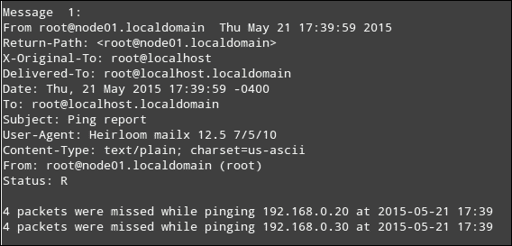
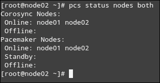
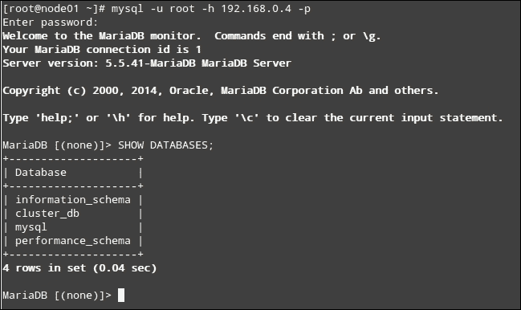
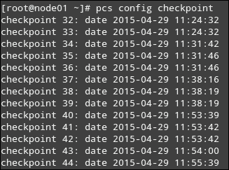
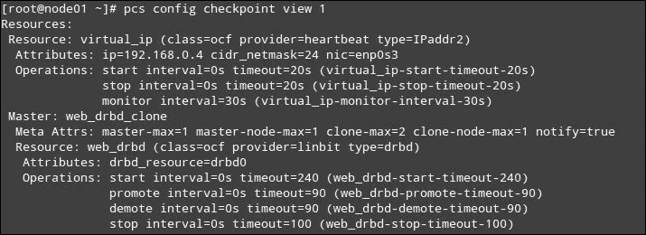
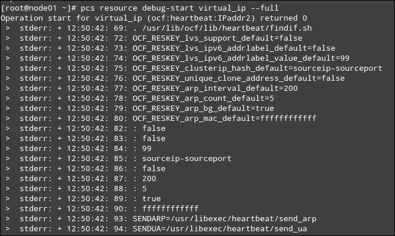
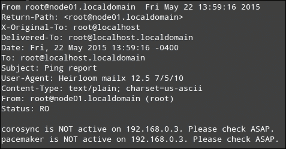

# 第五章. 监控集群健康状态

在第二章，*安装集群服务并配置网络组件*中，我们提到，熟悉 PCS 及其众多选项将有助于我们朝着安装一个完全可操作的高可用性集群的目标迈进。尽管在前面的章节中我们已经确认了这一说法的准确性，但在这里，我们将进一步利用 PCS 来监控集群的性能和可用性，以便识别并防止可能的瓶颈，并解决可能出现的任何问题。

# 集群服务和性能

尽管每个系统管理员必须熟悉广泛使用的 Linux 命令，如`top`和`ps`，以便快速报告每个节点中运行的守护进程和其他进程的快照，但您还必须学会依赖 CentOS 7 提供的新工具，来启动我们的节点监控，这些工具我们在之前的章节中已经介绍过。但更重要的是，我们还将使用基于 PCS 的命令来深入了解我们的集群及其资源。

# 监控节点状态

正如您所猜测的那样，也许您首先需要检查的就是每个节点的状态——它们是在线还是离线。否则，继续进行进一步的可用性和性能分析就没有意义了。

如果您有一个网络管理系统（例如**Zabbix**或**Nagios**）服务器，您可以轻松监控集群成员的状态，并在它们无法访问时收到警报。如果没有，您必须想出一个补充解决方案（可能没有那么有效或没有那么防错），用来检测节点何时离线。

一种解决方案是一个简单的 bash 脚本（我们将其命名为`pingreport.sh`，并将其保存在`/root/scripts`中，通过`chmod +x /root/scripts/pingreport.sh`使其可执行），它将定期从另一台主机 ping 您的节点，并通过电子邮件向系统管理员报告，如果其中一个节点处于离线状态，以便您采取适当的措施。以下 shell 脚本正是这样做的，它针对 IP 地址为`192.168.0.2`和`192.168.0.3`的节点（您可以在`NODES`变量中添加更多节点，这些节点将用于以下的 for 循环，但记得用空格分隔它们）。如果两个节点都能 ping 通，则报告将为空，且不会发送任何电子邮件。

为了利用以下脚本，您需要准备好电子邮件解决方案，以便发送警报。在这种情况下，我们使用名为 mailx 的邮件工具，该工具在安装包（`yum install mailx`）后可用：

```
#!/bin/bash

# Directory where the ping script is located
DIR=/root/scripts

# Hostname or IP of remote host (to send alerts to)
REMOTEHOST="192.168.0.5"

# Name of report file
PING_REPORT="ping_report.txt"

# Make sure the current file is empty
cat /dev/null > $DIR/$PING_REPORT

#Current date to be used in the ping script
CURRENT_DATE=$(date +'%Y-%m-%d %H:%M')

# Node list
NODES="node01 node02"

# Loop through the list of nodes
for node in $NODES
 do
 LOST_PACKETS=$(ping -c 4 $node | grep -i unreachable | wc -l)
 if [ $LOST_PACKETS -ne "0" ]
 then
 echo "$"LOST_PACKETS packets were missed while pinging $node at $CURRENT_DATE" >> $DIR/$PING_REPORT
 fi
done

# Mail the report unless it's' empty
if [ -s "$"DIR/$PING_REPORT" ]
 then
 mail root@$REMOTEHOST -s "Ping report" -a $DIR/$PING_REPORT
fi
```

尽管前面的脚本足以判断一个节点是否可以 ping 通，你可以根据需要调整该脚本，然后将其添加到 cron 中，以便按期望的频率自动运行。例如，以下的 cron 作业将每五分钟执行一次该脚本，无论是哪个日子：

```
*/5 * * * * /root/scripts/pingreport.sh
```

如果你想手动运行脚本，可以按以下方式进行：

```
/root/scripts/pingreport.sh
```

以下示例表明，在上次运行脚本时，`192.168.0.2` 和 `192.168.0.3` 都无法 ping 通。请注意，为了简便起见，脚本从 `node01`（集群成员）执行；然而，在正常情况下，你会希望使用一个独立的主机来执行该操作：



我们将在本章稍后继续使用该脚本，并扩展其功能。

现在，是时候深入查看 `corosync`/`pacemaker` 中配置节点的状态了，使用以下命令：

```
pcs status nodes pacemaker | corosync | both
```

在前面的命令中，使用竖线来表示互斥的参数。

在以下截图中，你可以看到`pcs status nodes both`如何返回两个节点上`pacemaker`和`corosync`的状态：



### 注意

虽然你可以使用`pcs status`检查集群的整体状态，但正如我们之前提到的，`pcs status nodes both`会提供更加精细的节点状态信息。你可以停止其中一个（或两个）节点上的服务，然后运行相同的命令来验证。这相当于在每个节点上使用`systemctl is-active pacemaker | corosync`。

# 监控资源

正如我们在前面的章节中所解释的，集群资源是通过至少一个节点提供的高可用服务。在我们到目前为止配置的资源中，可以提到虚拟 IP、复制存储设备、Web 服务器和数据库服务器。你可以参考第四章，*集群的实际应用*，我们在其中添加了约束，指示了集群资源应该如何（按什么顺序）以及在哪个节点上启动。

无论是`pcs status`还是`pcs resource show`，都将列出当前所有配置资源的名称和状态。

### 注意

如果你通过其 ID 指定一个资源（即`pcs resource show virtual_ip`），你将看到该资源的配置选项。另一方面，如果指定了`--full`（`pcs resource show --full`），则会显示所有配置的资源选项。

如果资源在错误的节点上启动（例如，如果它依赖于当前在另一个节点上活动的服务），在尝试使用它时，你会收到一条信息性消息。例如，以下截图显示`dbserver`在`node02`上启动，而其相关的底层存储设备（`db_fs`）已在`node01`上启动。你会从之前的章节中回忆到，这是`pcs status`输出的一部分：


因此，如果你尝试使用虚拟 IP 地址登录到数据库服务器（这是集群资源的公共链接），你将得到以下截图中所示的错误消息，告诉你无法连接到 MariaDB 实例：


让我们看看当我们将`dbserver`资源移动到`node01`并手动启用它，以便它立即启动时会发生什么（如下一个截图所示）。以下约束旨在使`dbserver`优先选择`node01`，这样每当有可用节点时，它始终在`node01`上运行：

```
pcs constraint location dbserver prefers node01=INFINITY
pcs resource restart dbserver
```


### 提示

如果需要删除约束，可以使用`pcs constraint --full`查找其 ID，并定位相关资源。然后，使用`pcs constraint remove constraint_id`删除它，其中`constraint_id`是第一个命令返回的标识符。你也可以使用`pcs resource move <resource_id> <node_name>`手动将资源从一个节点移到另一个节点，但请注意，当前的约束可能会允许或不允许你成功完成此操作。

现在我们可以按预期访问数据库服务器资源，如下所示：



偶尔，在故障转移过程或启动过程中，你可能会遇到一些错误——你可以自己判断。这些消息会出现在`pcs status`的输出中，如下文摘所示：


在我们继续之前，也许你会问自己：如果我想保存关于集群问题的所有可用信息，以便进行离线分析和故障排除该怎么办？如果你期待 PCS 提供一个工具来帮助你，你是对的。在`--from`和`--to`选项后输入日期和时间，并将`dest`替换为文件名（在以下命令中也提供了具体示例）：

```
pcs cluster report [--from "YYYY-M-D H:M:S" [--to "YYYY-M-D" H:M:S"]]" dest
```

这将创建一个包含报告集群问题所需的所有信息的 tar 包。如果没有使用`--from`和`--to`选项，则报告将包括过去 24 小时的数据。

在接下来的截图中，我们省略了`--from`和`--to`标志以简洁起见，我们还可以看到设置通过`ssh`进行基于密钥的认证在第一章中并非仅仅是一个建议——您必须报告来自两个节点的集群信息。

在我们的例子中，我们将执行以下命令，在当前工作目录中获取一个名为`YYYY-MM-DD-report.tar.gz`的 tar 包。请注意，文件名中的日期部分仅用于标识：

```
pcs cluster report $(date +%Y-%m-%d)-report
```


一旦包含报告文件的 tar 包创建完成，您可以解压并检查它。您会注意到它包含了以下图像中看到的文件和目录。在进一步操作之前，您可能希望查看其中的一些文件，如下所示：

```
tar xzf $(date +%Y-%m-%d)-report.tar.gz
cd $(date +%Y-%m-%d)-report
```


当然，您现在可能想清除过去已解决的失败操作记录。为此，PCS 允许您指示集群忘记资源（或所有资源）的操作历史，重置故障计数，并重新检测当前状态：

```
pcs resource cleanup <resource_id>
```

请注意，如果未指定`resource_id`，则所有资源/STONITH 设备将被清理。

最后，在我们还在讨论监控集群资源时，不妨问自己：是否有一种方法可以备份当前的集群配置文件，并在需要时恢复它们，是否可以轻松回到之前的配置？这两个问题的答案是肯定的——让我们看看怎么做。

为了备份集群配置文件，您将使用以下命令：

```
pcs config backup <filename>
```

在这里，`<filename>`是您选择的文件标识，PCS 会在创建 tar 包后为其追加`tar.bz2`扩展名。

请考虑以下示例：

```
pcs config backup cluster_config_$(date +%Y-%m-%d)
```

这将导致创建一个 tar 包备份，内容如以下截图所示。为了方便起见，我们将在当前工作目录中创建一个名为`cluster_config`的子目录。我们将使用这个新创建的子目录来解压报告 tar 包的内容：

```
mkdir cluster_config
tar xzf cluster_config_$(date +%Y-%m-%d).tar.bz2 -C cluster_config
ls -R cluster_config
```


### 注意

如果您按照本书中概述的步骤逐步进行安装，bzip2 可能未安装。您需要使用`yum update && yum install bzip2`来安装它，以便解压集群配置 tar 包。

恢复配置同样简单（您需要停止节点并在恢复过程完成后重新启动它），请使用以下命令：

```
pcs config restore [--local] <filename>
```

此命令将使用备份文件作为源，在所有节点上恢复集群配置文件。如果只需要恢复当前节点的文件，请使用`--local flag`。请注意，文件名必须是`.tar.bz2`文件（而不是解压后的文件）。

你还可以通过 `pcs config checkpoint` 及其相关选项，回到集群配置的某个时间点。如果不加任何选项，`pcs config checkpoint` 会列出所有可用的配置检查点，如下所示：



`pcs config checkpoint view <checkpoint_number>` 命令将指定的配置检查点详细信息显示到标准输出中，如下图所示。请参考以下示例：

```
pcs config checkpoint view 1
```



`pcs config checkpoint restore <checkpoint_number>` 命令将集群配置恢复到指定的检查点，这也是在恢复之前检查所需检查点详细信息的一个好主意。

## 当资源拒绝启动

在正常情况下，集群资源将自动管理，系统管理员不需要太多干预。然而，有时可能会出现某些问题，导致资源无法正常启动，这时就需要采取即时的行动。

如 PCS 手册页所述，

> *在集群上启动资源几乎总是由 pacemaker 完成，而不是直接由 PCS 执行。如果你的资源没有启动，通常是由于资源配置错误（你可以通过系统日志进行调试）、约束条件阻止资源启动或资源被禁用。你可以使用 `pcs resource debug-start` 测试资源配置，但通常不应使用它来启动集群中的资源。*

话虽如此，当 `pacemaker` 因某些原因无法正常启动资源时，可以执行以下命令：

```
pcs resource debug-start <resource id> [--full]
```

这将强制在当前节点上启动指定的资源，忽略集群的推荐配置。结果将显示在屏幕上（使用 `--full` 参数可以获取更详细的输出），并提供有助于排除资源和集群操作故障的相关信息。

在以下截图中，`pcs resource debug-start virtual_ip --full` 的输出已被截断，以简化显示：



从这个示例中，你可以开始领略到这个命令的实用性，因为它会逐步为你提供关于资源操作的非常详细的信息。例如，如果 `dbserver` 资源即使在反复清理后仍然无法启动并返回错误，可以运行以下命令：

```
pcs resource debug-start dbserver --full | less
```

通过此命令，你将能够非常详细地查看集群通常在尝试启动此类资源时执行的步骤。如果该过程在某个环节失败，你将获得关于出错原因和时间的描述，帮助你更好地修复问题。

## 检查核心组件的可用性

在结束之前，让我们回到第一个示例（检查每个节点的在线状态），并对其进行扩展，以便我们还能够监控集群框架的核心组件，即`pacemaker`、`corosync`和`pcsd`，这些内容在第二章，*安装集群服务和配置网络组件*中已有概述。

### 提示

为确保通过`ssh`从一个节点成功连接到自身，您需要将其密钥复制到`authorized_keys`中。因此，要为用户 root 启用无密码登录，请在两个节点上运行以下命令：

```
cp /root/.ssh/id_rsa.pub /root/.ssh/authorized_keys
```

在最佳情况下，在优雅的故障转移期间，您希望在其中一个（或多个）服务停止时收到通知。通过在脚本中添加几行代码，还可以检查相应守护进程的状态，并在它们停止时发出警报：

```
#!/bin/bash

# Directory where the ping script is located
DIR=/root/scripts

# Hostname or IP of remote host (to send alerts to)
REMOTEHOST="192.168.0.5"
# Name of report file
PING_REPORT="ping_report.txt"

# Make sure the current file is empty
cat /dev/null > $DIR/$PING_REPORT

#Current date to be used in the ping script
CURRENT_DATE=$(date +'%Y-%m-%d %H:%M')
# Node list
NODES="node01 node02"

# Outer loop: check each node
for node in $NODES
 do
 LOST_PACKETS=$(ping -c 4 $node | grep -i unreachable | wc -l)
 if [ $LOST_PACKETS -ne "0" ]
 then
 echo "$"LOST_PACKETS packets were missed while pinging $node at $CURRENT_DATE" >> $DIR/$PING_REPORT
 fi
# Inner loop: check all cluster core components in each node
 for service in corosync pacemaker pcsd
 do
 IS_ACTIVE=$(ssh -qn $node systemctl is-active $service)
 if [ $IS_ACTIVE != "active" ]
 then
 echo "$"service is NOT active on $node. Please check ASAP." >> $DIR/$PING_REPORT
 fi
 done
done

# Mail the report unless it's' empty
if [ -s "$"DIR/$PING_REPORT" ]
 then 
 mail -s "Ping report" root@localhost < $DIR/$PING_REPORT
fi
```

作为一个简单的测试，请在`node02`（`192.168.0.3`）上停止集群（`pcs cluster stop`），从监控主机或任何节点运行脚本，并检查您的邮件收件箱，以验证它是否正常工作。在以下截图中，您可以看到其应该呈现的样子：



# 总结

本章中，我们已经解释了如何监控、故障排除和修复常见的集群问题和需求。并非所有问题都会像突然的系统崩溃那样是不期而至或不希望出现的。有时，您需要关闭集群及其运行的资源，以便进行计划维护，或者在断电时，确保**不间断电源**（**UPS**）还没有耗尽。

由于预防是此类情况下最好的盟友，请确保定期监控集群的健康状况。按照本章中概述的程序进行操作，以确保在真实的紧急情况出现时不会遇到任何意外。具体来说，无论是在真实还是模拟的情况下，都必须备份集群配置，分别停止两个节点上的集群，然后才能停用节点。
