# 第六章。衡量与提升性能

到目前为止，我们已经创建了一个主动/被动集群，向其添加了几个资源并测试了其故障转移功能。我们还讨论了如何排查常见问题。我们旅程的最后一步是衡量和提高集群的性能，直到目前为止它的安装情况——就其上运行的服务而言。

此外，我们还将提供将 A/P 集群转换为 A/A 集群的整体指南。

# 设置示例数据库

为了正确测试我们的 MariaDB 数据库服务器，我们需要一个填充了示例数据的数据库。因此，我们将使用 Employees 数据库，由 Patrick Crews 和 Giuseppe Maxia 开发，并由 Oracle 公司根据创意共享署名-相同方式共享 3.0 国际许可协议提供。它提供了一个非常大的数据集（约 160 MB 和约 400 万条记录），分布在六个表中，非常适合我们的性能测试。

### 注意

创意共享署名-相同方式共享 3.0 国际许可协议，详情请见[`creativecommons.org/licenses/by-sa/3.0/`](http://creativecommons.org/licenses/by-sa/3.0/)，它赋予我们以下自由，关于 Employees 数据库：

*分享：这使我们能够在任何介质或格式中复制和再分发该素材*

*改编：这使我们能够混合、转化并基于该素材进行创作*

*用于任何目的，包括商业用途。*

*只要你遵循许可证条款，许可方不能撤销这些自由。*

## 下载并安装 Employees 数据库

让我们继续通过以下步骤下载并安装数据库：

1.  要下载 Employees 表，请访问[`launchpad.net/test-db/`](https://launchpad.net/test-db/)并获取最新稳定版本的 tarball 链接（在写这本书时，版本是 v1.0.6），如下图所示：

1.  然后，将其下载到运行数据库服务器的节点（在我们的案例中，是 `node01`）。为此，首先需要使用以下命令安装名为 `wget` 和 `bzip2` 的两个软件包：

    ```
    yum –y install wget bzip2 && wget https://launchpad.net/test-db/employees-db-1/1.0.6/+download/employees_db-full-1.0.6.tar.bz2
    ```

    然后，在当前工作目录中提取/解压其内容：

    ```
    tar xjf employees_db-full-1.0.6.tar.bz2
    ```

1.  这将创建一个名为 `employees_db` 的子目录，其中包含主安装脚本（`employees.sql`），如以下两个命令的输出所示：

    ```
    cd employees_db
    ls
    ```

1.  接下来，使用以下命令连接到我们在第四章中设置和配置的集群数据库服务器，*集群的实际应用*（注意，你将被提示输入 root MariaDB 用户的密码）：

    ```
    mysql -h 192.168.0.4 -u root -p -t < employees.sql
    ```

1.  这还将安装 employees 数据库并将相应的信息加载到其表中：

    +   `departments`

    +   `employees`

    +   `dept_emp`

    +   `dept_manager`

    +   `titles`

    +   `salaries`

    ### 注意

    在设置好示例数据库后，随时进行强制故障转移，验证资源和数据库（以及它们的表和记录）是否能在当前被动节点中变得可用。如果需要，回顾第四章以回顾相关指令。

    由于大量数据正在加载到数据库中，预计安装过程可能需要一两分钟的时间才能完成。我们在此期间会看到导入过程的进展：数据库结构和存储引擎被实例化，然后创建表，最后填充数据，如下所示：

    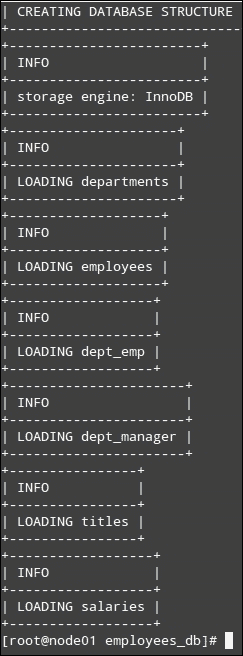

1.  我们可以通过登录到数据库服务器并执行这些命令来验证，首先列出所有数据库。然后，切换到最近安装的员工数据库，并用它进行后续查询：

    ```
    SHOW DATABASES;
    USE employees;
    SHOW TABLES;
    ```

1.  输出应该类似于前面截图所示的内容。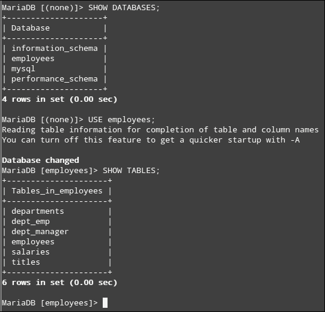

1.  在我们继续进行实际性能测试（在故障转移事件前后测量整体性能）之前，可以使用`DESCRIBE`语句来调查那些表（以及它们包含的字段）。然后，使用`SELECT`语句浏览记录，如下所示：

    ```
    DESCRIBE salaries;
    SELECT * FROM salaries LIMIT 5;
    ```

1.  结果可以在以下截图中看到：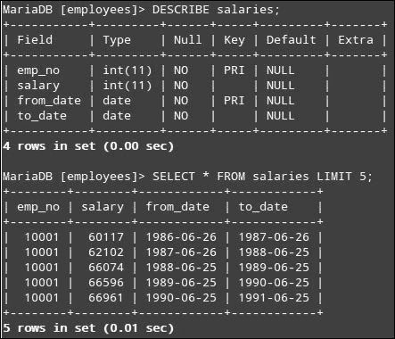

一旦你花时间熟悉了数据库的结构，我们就准备好继续进行测试了。

# 引入初始集群测试

此外，对于实际的性能测试，你应该注意，MariaDB 附带了几个与数据库相关的工具，这些工具可以帮助你完成各种管理任务。其中之一是`mysqlshow`，它可以通过一个快速命令返回关于数据库和表的完整信息。

它的通用语法如下：

```
mysqlshow [options] [db_name [tbl_name [col_name]]]
```

所以，我们可以使用以下命令来显示`employees`数据库中`titles`表的描述：

```
mysqlshow employees titles -h 192.168.0.4 -u root -p
```

### 注意

你可以使用`ls /bin | grep mysql`命令列出包含在 MariaDB 安装中的完整工具集。每个工具都有相应的手册页面，可以像平常一样从命令行调用。

我们将使用 MariaDB 附带的另一个工具，看看在显著负载下我们的数据库服务器表现如何。该工具是`mysqlslap`，这是一个诊断程序，旨在模拟 MariaDB/MySQL 服务器的客户端负载，并报告每个阶段的时间。它的工作方式就像多个客户端同时访问服务器一样。

在执行我们将在后续测试中使用的实际命令之前，我们将介绍`mysqlslap`的几个可用标志：

+   `--create-schema`：此命令指定我们将在其中运行测试的数据库

+   `--query`：这是一个字符串（或者说是一个文件），其中包含用于检索数据的`SELECT`语句

+   `--delimiter`：此命令允许你指定一个分隔符，用来分隔`--query`中同一字符串中的多个查询

+   `--concurrency`：此命令表示模拟的并发连接数

+   `--iterations`：这是运行测试的次数

+   `--number-of-queries`：此命令限制每个客户端（参见`--concurrency`）的查询数量

此外，`mysqlslap`手册页中列出了其他你可以使用的开关，如果你愿意的话。

也就是说，我们将在集群中的数据库服务器上运行以下测试。

## 测试 1 – 检索所有记录的所有字段

在第一个测试中，我们将执行一个相当简单的查询，内容是从员工表中检索所有记录的所有字段。我们将模拟`10`个并发连接，总共进行`50`次查询。这将导致每个客户端运行`5`次查询（50/10 = 5）：

```
mysqlslap --create-schema=employees --query="SELECT * FROM employees" --concurrency=10 --iterations=2 --number-of-queries=50 -h 192.168.0.4 -u root -p
```

几分钟后，你将能够看到类似以下截图中的输出。虽然这里列出了一个独立测试的结果，但你可能希望自己多次执行此操作并记录结果以供后续对比。然而，如果你选择这样做，请确保查询结果没有被缓存，在每次运行后，运行以下命令清除 MariaDB 服务器会话中的缓存：

```
RESET QUERY CACHE;
```

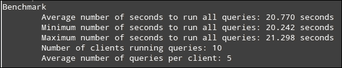

## 测试 2 – 执行 JOIN 操作

在这个第二个测试中，我们将执行一个`JOIN`操作，将员工表和薪资表进行连接（一个更现实的例子），并稍微调整连接数、查询数和迭代次数：

```
mysqlslap --create-schema=employees --query="SELECT A.first_name, A.last_name, B.salary FROM employees A JOIN salaries B on A.emp_no = B.emp_no" --concurrency=3 --number-of-queries=12 --iterations=2 -h 192.168.0.4 -u root -p
```

在以下截图中，我们可以看到这次运行查询所花费的时间有所增加，这是预期中的结果：

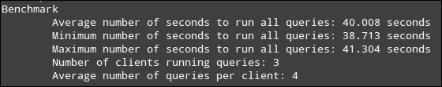

在继续之前，可以随意调整连接数、迭代次数和查询，或者修改查询本身。根据这些值，你可能会使数据库服务器崩溃。这在某些时候是可以预期的，因为我们构建基础设施和示例时使用的是基于虚拟机的集群。因此，你可能希望在每个节点的 VirtualBox 配置中增加处理资源，尽可能利用可用容量，或者考虑购买真实硬件来搭建集群。

### 注意

数据库管理和优化是本书范围之外的话题。强烈建议在将集群迁移到生产环境之前，您也要考虑这些主题。由于数据库和 Web 服务器的性能可以通过各自的设置单独优化，在本书中，我们将重点分析并改进这些资源（分别命名为`dbserver`和`webserver`）的可用性，使用它们各自的配置文件和内部设置。

## 执行故障切换

我们现在通过停止当前所有资源运行所在节点（`node01`）上的集群功能来强制进行故障切换，这样资源将转移到`node02`。在这里，我们将执行测试 1 和测试 2，预计会看到与之前相似的行为。需要牢记的是，在故障切换期间，数据不会自动加密。如果您担心敏感数据在不安全的连接上传输，您应采取必要的预防措施，使用加密措施，无论是在文件系统级别还是在逻辑卷级别。然而，在我们进行此操作之前，必须牢记，频繁将敏感资源（例如数据库服务器）在集群中移动可能会对该资源的可用性产生负面影响。因此，我们希望它保持在当前活动的节点上，除非发生实际的节点停机。资源粘性正是实现这一目标：它允许我们指示所有集群资源，在节点恢复可用后，要么恢复到其原始节点，要么保持在当前活动的节点上。以下语法用于指定所有资源的默认值：

```
pcs resource defaults resource-stickiness=value
```

值越高，资源越倾向于保持当前所在的位置。默认情况下，Pacemaker 使用`0`作为值，这意味着在发生故障切换时，集群希望（并且认为最优）将资源迁移到其他位置。要为特定资源指定粘性，请使用以下语法设置该资源的粘性：

```
pcs resource meta <resource_id> stickiness=value
```

假设您在前面的命令中使用`INFINITY`作为值：

```
pcs resource defaults resource-stickiness=INFINITY
pcs resource meta <resource_id> stickiness=INFINITY
```

（其中，`resource_id`需要替换为实际的资源标识符）

然后，所有资源的默认粘性和由`resource_id`标识的资源的粘性将设置为`INFINITY`。话虽如此，现在我们开始执行故障切换。请使用以下命令记录当前节点和资源状态：

```
pcs status
```

然后，通过以下命令停止集群：

```
pcs cluster stop
```

然后，验证所有资源是否在另一个节点上正确启动。如果没有，使用第五章中解释的工具进行故障排除，*监控集群健康*。最后，继续在`node02`上运行测试 1 和测试 2。

当前情况下的结果在此解释。

对于测试 1，请参考以下截图：

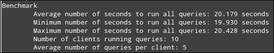

总结测试 1 在两个节点上的结果

为了方便比较，我们将两个结果汇总如下：

| 测试 1 [秒] | Node01 | Node02 |
| --- | --- | --- |
| 平均值，所有查询 | 20.770 | 20.179 |
| 最小值，所有查询 | 20.242 | 19.930 |
| 最大值，所有查询 | 21.298 | 20.428 |

另一方面，对于测试 2，以下截图和下一张表格展示了详细信息：

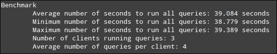

总结测试 2 在两个节点上的结果

| 测试 2 [秒] | Node01 | Node02 |
| --- | --- | --- |
| 平均值，所有查询 | 40.008 | 39.084 |
| 最小值，所有查询 | 38.713 | 38.779 |
| 最大值，所有查询 | 41.304 | 39.389 |

正如您所看到的，两种情况下的结果非常相似，这证明了故障转移并未影响我们集群上运行的数据库服务器的性能。虽然故障转移确实没有提高性能，但我们可以看到，资源在故障转移期间的可用性已经得到确认，并且对集群的功能有一定的负面影响。

# 测量和提高性能

您可能还记得，在之前的章节中，按照定义，资源是由集群使其高度可用的服务。每个资源都会被分配一个叫做 **资源代理** 的外部 Shell 脚本，负责独立于系统管理的方式（如 systemd）管理集群中的实际资源。因此，资源的实际操作对集群来说是透明的，因为它是由资源代理来管理的。

资源代理位于 `/usr/lib/ocf/resource.d` 目录下，您可以随意查看它们，以便更好地了解它们的结构。在大多数情况下，您无需修改它们，而是需要修改特定资源的配置文件，正如我们接下来将看到的那样。您可能还记得，在之前的章节中，添加集群资源涉及使用 `standard:provider:resource_agent` 形式的参数（例如 `ocf:heartbeat:mysql`）。您还可以通过分别使用 `pcs resource standards` 和 `pcs resource providers` 查看完整的资源标准和提供者列表。此外，您可以通过 `pcs resource agents standard:provider` 查看每个 `standard:provider` 配对的可用代理。

## Apache 的配置和设置

当 Apache web 服务器首次安装时，默认情况下，它会附带几个模块，形式为 **动态共享对象** (**DSO**)，用于扩展其功能。缺点是，如果这些模块持续加载，而您的应用程序并没有使用它们，它们可能会不必要地消耗资源。正如您可能猜到的，这可能会随着时间的推移导致性能损失。

在 CentOS 7 中，您可以通过 `httpd -M` 查看当前加载和共享的模块列表。以下输出由于简洁起见已被截断，但在您的情况下应该非常相似：

```
Loaded Modules:
 core_module (static)
 so_module (static)
 http_module (static)
 access_compat_module (shared)
 actions_module (shared)
 alias_module (shared)
 allowmethods_module (shared)
 auth_basic_module (shared)
 auth_digest_module (shared)
 authn_anon_module (shared)
 authn_core_module (shared)
```

仔细检查模块列表，并充分了解您的应用程序实际需要哪些模块，这将帮助您定义哪些模块不需要，因此可以暂时卸载它们。

查看 `/etc/httpd/conf/httpd.conf` 中的以下行：

```
IncludeOptional conf.modules.d/*.conf
```

这一行表示 Apache 将在 `conf.modules.d` 目录中查找加载 `.conf` 文件内模块的指令。例如，在标准安装中，`00-base.conf` 包含约 70 个 `LoadModule` 指令，指向 `/etc/httpd/modules` 内的 DSO。在这些 `.conf` 文件中，您可以启用或禁用 Apache 模块（通过在每个 `LoadModule` 指令前添加 `#` 符号，从而注释掉该行）。请注意，这必须在两个节点上执行。

## 加载和禁用模块

在下图中，已加载 `userdir_module` 模块、`version_module` 和 `vhost_alias_module`，而 `buffer_module`、`watchdog_module` 和 `heartbeat_module` 通过 `00-base.conf` 被禁用：

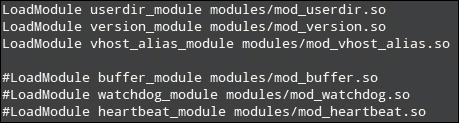

例如，要禁用 `userdir` 模块，请在两个节点的 `/etc/httpd/conf.modules.d/00-base.conf` 中注释掉对应的 `LoadModule` 指令：

```
#LoadModule userdir_module modules/mod_userdir.so
```

在当前节点上重启集群资源：

```
pcs resource restart webserver
```

## 限制 Apache 进程和子进程的数量

为了使 Apache 能够处理所需的并发请求数量，同时防止其占用超过您为应用程序所能承受的 RAM，您需要将 `MaxRequestWorkers`（在 2.3.13 版本之前称为 `MaxClients`）指令设置为一个适当的值，主要依据您的特定环境中可分配的物理内存。请注意，如果此值设置得过高，可能会导致 Web 服务器（以及资源本身）崩溃。

另一方面，设置一个适当的值，该值是基于每个 Apache 进程的内存使用情况与分配的 RAM 相比计算出来的，将使 Web 服务器能够同时响应如此多的请求。如果请求数量超过服务器的处理能力，多余的请求将在先前的请求处理完毕后才会被处理，从而避免所有连接的资源挂起。

有关更多详情，请参阅 Apache MPM 常用指令文档：[`httpd.apache.org/docs/2.4/mod/mpm_common.html`](http://httpd.apache.org/docs/2.4/mod/mpm_common.html)。请记住，Apache 的精细调优超出了本书的范围，文中提到的操作通常不足以用于生产环境。

## 数据库资源

由于你很少会使用没有附带数据库服务器的 Web 服务器，因此你也需要关注那一侧的性能优化。以下是一些你可能需要关注的基本事项。

### 创建索引

一个包含数十万或百万条记录的数据库，在执行典型的 `SELECT-FROM-WHERE` 语句以检索特定记录时，可能迅速成为性能瓶颈。为了实现这一点，必须逐行检查表中的每一行，这在硬盘级别上执行时被认为是非常低效的。

使用索引时，操作会在内存中执行而不是在磁盘上，且记录可以自动排序，这样查找我们想要的记录会更快，因为索引仅包含实际排序的数据和指向原始数据记录的链接。此外，我们可以为每个需要排序的列创建索引，因此使用索引成为提高性能的便捷工具。

首先，退出 MariaDB 会话并运行测试 3，以衡量没有索引时的性能：

```
mysqlslap --create-schema=employees --query="SELECT * FROM employees WHERE emp_no=1007" --concurrency=15 --number-of-queries=150 --iterations=10 -h 192.168.0.4 -u root -p
```

现在，让我们在 `employees` 和 `salaries` 表的 `emp_no` 字段上创建索引，因为我们将在 `WHERE` 子句中使用它们，然后再次执行测试 3。执行以下步骤：

1.  首先，使用以下命令登录到数据库服务器：

    ```
    mysql -h 192.168.0.4 -u root -p
    ```

1.  然后，从 MariaDB shell 中执行以下命令：

    ```
    USE employees;
    RESET QUERY CACHE;
    CREATE INDEX employees_emp_no ON employees(emp_no);
    CREATE INDEX salaries_emp_no ON salaries(emp_no);
    ```

1.  之后，退出 MariaDB shell 并再次运行测试以比较性能。结果显示在以下截图中，并在下一个表格中与之前的示例（没有索引）进行了汇总：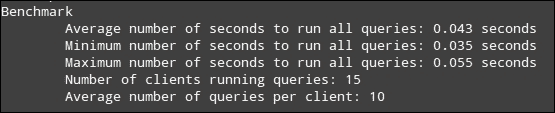

现在，让我们来看一下相同测试的结果，不过这次使用了索引：

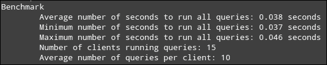

总结 node01 上有索引和没有索引的测试 2 结果

| 测试 3（秒） | Node01（没有索引） | Node01（有索引） |
| --- | --- | --- |
| 平均值，所有查询 | 0.043 | 0.038 |
| 最小值，所有查询 | 0.035 | 0.037 |
| 最大值，所有查询 | 0.055 | 0.046 |

上面的截图演示了在可搜索字段上创建索引将提高性能，因为它可以防止服务器在返回结果之前必须遍历所有行。

### 使用查询缓存

在 MariaDB 数据库服务器中，`SELECT` 查询的结果存储在查询缓存中，这样当相同的操作再次执行时，结果可以更快地返回。现代大多数网站正是如此，重复进行相似的查询（高读低写环境）。

那么，这在服务器级别是如何发生的呢？如果一个传入的查询在缓存中找不到，它将按正常方式处理，然后将其结果集存储在查询缓存中。否则，结果将从缓存中提取，这使得操作比正常处理时完成得要快得多。

在 MariaDB 中，默认启用查询缓存（`SHOW VARIABLES LIKE 'query'_cache_type';`），但其大小设置为零（`SHOW VARIABLES LIKE 'query'_cache_size';`），如以下截图所示：

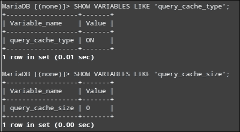

出于这个原因，我们需要根据应用程序的使用情况设置查询缓存大小变量为一个合适的值。在下面的截图中，这个变量设置为 100 KB（`SET GLOBAL query_cache_size = 102400;`），我们可以看到查询缓存大小已经相应更新：

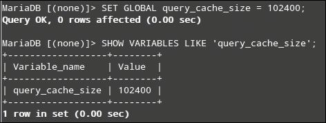

请注意，查询缓存大小的正确值在很大程度上（如果不是完全）取决于您具体案例的需求。将其设置得过高会导致性能下降，因为系统必须分配额外的资源来管理一个较大的缓存。另一方面，设置得过低会导致至少一些重复查询正常处理而不被缓存。在前面的示例中，我们将 100 KB 的数据分配为缓存，以存储查询及其对应的结果。

如需更多详细信息，请参考 MariaDB 文档（[`mariadb.com`](https://mariadb.com)），特别是*管理 MariaDB/优化与调优*部分。

### 注意

MariaDB 文档包含非常有用的信息，帮助从头开始调优数据库服务器（从操作系统级别到查询优化）。其他可以提高性能和稳定性的工具包括 MySQL 调优器（[`mysqltuner.com/`](http://mysqltuner.com/)）、MySQL 调优指南（[`launchpad.net/mysql-tuning-primer`](https://launchpad.net/mysql-tuning-primer)）以及 phpMyAdmin 顾问（[`www.phpmyadmin.net/`](https://www.phpmyadmin.net/)）。最后一个工具可以在标准 phpMyAdmin 安装的**状态**标签页中找到。

# 转向 A/A 集群

正如您从第三章的介绍中记得的那样，*深入了解高可用性*，A/A 集群倾向于提供更高的可用性，因为多个节点同时运行应用程序（顺便说一下，这要求所有集群成员上同时可用这些应用程序所需的数据）。其缺点是，如果一个或多个节点下线，剩余的节点将被分配额外的处理负载，从而对集群的整体性能产生负面影响。

话虽如此，让我们简要地看一下将当前的 A/P 集群转换为 A/A 集群所需的步骤。确保已定义 STONITH 资源（有关更多详细信息，请参考第三章）。

1.  使用以下命令启用 STONITH 资源：

    ```
    pcs property set stonith-enabled=trueInstall
    ```

1.  安装将需要的额外软件：

    ```
    yum update && yum install gfs2-utils dlm
    ```

    与传统的日志文件系统如`ext4`（我们在本书中到目前为止使用的文件系统）不同，你将需要一种方式来确保所有节点能够同时访问相同的块存储。**全局文件系统 2**（也称为**GFS2**）通过其命令行工具提供了这一功能，这些工具包含在`gfs2-utils`包中。

1.  此外，`dlm`包将安装**分布式锁管理器**（也称为**DLM**），这是集群文件系统中同步访问共享资源的要求。将（并克隆）分布式锁管理器作为`ocf`类的集群资源，pacemaker 提供程序和`controld`类：

    ```
    pcs cluster cib dlm_cfg
    pcs -f dlm_cfg resource create dlm ocf:pacemaker:controld op monitor interval=60s
    pcs -f dlm_cfg resource clone dlm clone-max=2 clone-node-max=1
    ```

1.  现在，将新创建的资源推送到 CIB：

    ```
    pcs cluster cib-push dlm_cfg
    ```

1.  选择一个复制存储资源，并在其关联的设备节点上创建`gfs2`文件系统。

    例如，我们可以使用在第四章，*集群的实际实现*中创建的`/dev/drbd0`设备。在我们能够在该设备上创建`gfs2`文件系统之前，需要先将其从具有 DRBD 主角色的节点（最可能是`node01`）卸载：

    ```
    umount /dev/drbd0
    mkfs.gfs2 -p lock_dlm -j 2 -t MyCluster:Web /dev/drbd0
    ```

    如下图所示，`MyCluster`是我们集群的原始名称，`Web`是一个随机名称，`-j`标志表示文件系统将使用两个日志（在这种情况下，每个节点一个——如果你的集群包含更多节点，您将需要更改此数字）。最后，`-p`选项告诉我们，我们将使用由内核提供的 DLM：

    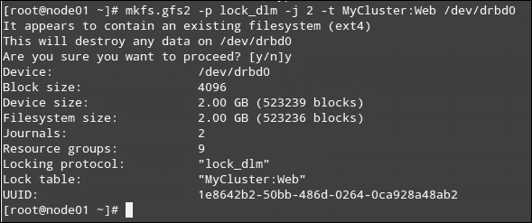

    你还需要将`web_fs`资源的`fstype`选项从`ext4`（我们在第四章，*集群的实际实现*中首次创建时使用的原始文件系统）更改为`gfs2`，并在 PCS 资源配置中进行相应更改：

    ```
    pcs resource update web_fs fstype=gfs2
    ```

    需要注意的是，如果集群在`dlm-clone`之前尝试启动`web_fs`，我们将遇到问题（如果没有`dlm`功能，就无法挂载`gfs2`文件系统）。因此，我们需要添加同居和排序约束，以确保`web_fs`总是在`dlm-clone`启动的节点上启动：

    ```
    pcs constraint colocation add web_fs with dlm-clone INFINITY
    ```

    `anddlm-clone`将在`web_fs`之前启动。

1.  `pcs constraint`顺序`dlm-clone`然后`web_fsClone`虚拟 IP 地址资源。

    克隆 IP 地址将使我们能够有效地在两个节点上使用资源，但与此同时，任何给定的数据包将只会发送到一个节点（从而在集群中实现基本的负载均衡方法）：

    为此，我们将把集群配置保存到一个名为`load_balancing_cfg`的文件中，并使用以下命令更新该文件：

    ```
    pcs cluster cib load_balancing_cfg
    ```

    从 pcs resource 帮助中你会注意到，克隆操作允许你指定某些选项。在接下来的几行中，`clone-max` 指定了承载 `virtual_ip` 资源的节点数量（在本例中为 2），而 `clone-node-max` 指定了每个节点允许运行的资源实例数量。接下来，`globally-unique` 指示资源代理每个节点与其他节点不同，因此也处理不同的流量。最后，`clusterip_hash=sourceip` 告诉我们，将使用数据包的源 IP 地址来决定哪个节点处理哪个请求：

    ```
    pcs -f load_balancing_cfg resource clone virtual_ip clone-max=2 clone-node-max=2 globally-unique=true
    pcs -f load_balancing_cfg resource update virtual_ip clusterip_hash=sourceip
    ```

    下一步是克隆文件系统和 Apache 和/或 MariaDB 资源。请注意，为了允许 DRBD 设备中的两个主节点同时提供内容，你需要在资源配置文件的网络部分中将 `allow-two-primaries` 指令设置为 yes（例如，`allow-two-primaries yes;`），配置文件路径为 `/etc/drbd.d/drbd0.res`：

    ```
    resource drbd0
      net {
        protocol C;
        allow-two-primaries yes;
      }
      ...
    }
    ```

1.  再次保存当前的 CIB 到本地文件，并添加克隆资源信息。在下一个示例中，我们将使用 `web_fs`、`web_drbd_clone` 和 `webserver`：

    ```
    pcs cluster cib current_cfg
    pcs -f current_cfg resource clone web_fs
    pcs -f current_cfg resource clone webserver
    ```

1.  现在，`web_drbd` 应该被允许作为主节点或主节点提供两个实例：

    ```
    pcs -f current_cfg resource update web_drbd_clone master-max=2
    ```

1.  然后，激活新的配置：

    ```
    pcs cluster cib-push current_cfg
    ```

1.  最后但同样重要的是，你需要记住，你需要将资源粘性值设置为 `0`，以便在故障转移后将实例返回其原始节点。为此，请参考本章的 *执行故障转移* 部分。

现在，你可以像往常一样强制进行故障转移并测试资源的可用性。不幸的是，正如我之前所解释的那样，在 Virtualbox 环境中这是不可能的。然而，如果你能够使用真实硬件和实际的 STONITH 设备构建集群，那么完全是可行的。

# 总结

在本章的最后，我们为需要在集群中实现高可用性的示例服务设置了一些性能测试工具，并提供了一些建议来分别优化它们的性能。请注意，这些建议并不旨在代表一份详尽的调优方法清单，而只是一个起点。我们还提供了整体的指导，以便你可以将一个 A/P 集群转变为 A/A 集群。

最后，请记住，本书是使用虚拟机而非专用硬件编写的。因此，我们遇到了一些相关的限制，例如缺少真实的 STONITH 设备，否则我们本可以实际演示 A/A 集群的功能。然而，本书中概述的原则无疑将成为你自己搭建集群的指南，无论你是使用虚拟机进行实验还是使用真实硬件。

祝你在努力中取得成功！
