# CentOS 7 入门

**社区企业操作系统**，通常称为**CentOS**，是一个快速、稳定、开源的企业级 Linux 发行版，广泛应用于笔记本、台式机和服务器。它源自**Red Hat Enterprise Linux**（**RHEL**）的源代码，后者由 CentOS 社区开发和维护。所有与 Red Hat Inc. 相关的专有内容都被从 CentOS 软件包中移除，之后这些软件包会重新编译，加入 CentOS 社区的资源，如标志等。CentOS 7 是 RHEL 7 的完全复制版，但它免费提供并由社区支持和更新。CentOS 项目现在由 Red Hat Inc. 官方赞助，最适用于那些不强求操作系统商业支持的环境。

本章将为你提供一个安装 CentOS 7 到你计算机的详细指南。安装完成后，我们将介绍 Linux 的命令行控制台，以便你使用**Bash**（即**Bourne Again Shell**）。本章将教你如何设置环境，以便执行本书后续章节中的所有练习。

本章将涵盖以下内容：

+   准备安装 CentOS 7

+   执行手动安装

+   使用控制台访问命令行

+   介绍 Bash Shell

+   Bash shell 和命令执行

# 准备安装 CentOS 7

CentOS 社区发布了最新的操作系统版本，名为 CentOS 7.6-1810，其中 7.6 源自 RHEL 7.6，1810 表示其发布日期（2018 年 10 月）。CentOS 7.6 可以安装在物理或虚拟硬件上。你可以根据你的环境使用任何主流的桌面虚拟化软件，如 Oracle VirtualBox（[`www.virtualbox.org/wiki/Downloads`](https://www.virtualbox.org/wiki/Downloads)）或 VMWare Workstation（[`www.vmware.com/products/workstation-pro/workstation-pro-evaluation.html`](https://www.vmware.com/products/workstation-pro/workstation-pro-evaluation.html)）。我选择的桌面虚拟化软件是 VirtualBox，因为它是免费的、开源的，且易于使用。你还需要一个正常工作的互联网连接，以便从社区下载页面下载 CentOS 镜像。

使用 Linux 作为基础操作系统的用户也可以使用 KVM 进行虚拟化。

# 获取合适的硬件

对于 CentOS 7.6 的最小安装，必须满足以下硬件要求：

+   512 MB 内存

+   4 GB 硬盘空间

+   网络适配器

然而，为了练习本书中描述的所有练习，我们建议满足以下硬件要求：

+   支持 64 位架构

+   1 GB 内存

+   10 GB 硬盘空间

+   DVD 驱动器或 USB 存储棒

+   网络适配器

# 获取软件

有多种方法可以获取执行本书中所有练习所需的软件。然而，最简单、最灵活的方法是从 CentOS 网站下载 `iso` 文件，并将其刻录到 DVD 上，或使用 CentOS 创建可启动的 USB 驱动器。然后，如果您使用的是虚拟机，请使用 ISO DVD 镜像启动您的 PC。如果您在物理系统上安装，则使用可启动的 USB 驱动器或刻录的 CentOS DVD 进行安装。

使用以下链接下载 CentOS 7.6（64 位）ISO 镜像文件：

[`centos.mirror.net.in/centos/7.6.1810/isos/x86_64/CentOS-7-x86_64-DVD-1810.iso`](http://centos.mirror.net.in/centos/7.6.1810/isos/x86_64/CentOS-7-x86_64-DVD-1810.iso)

您可以从 CentOS 网站下载镜像文件的 MD5 和 SHA1 哈希值。下载的镜像文件的哈希值应与 CentOS 网站上发布的哈希值相同。

# 完成服务器设置细节

一旦您有了合适的硬件和软件来进行 CentOS 安装，您应该决定在安装过程中需要指定的基本设置参数。下表列出了我们在本章描述的 CentOS 7.6 服务器安装中使用的详细信息：

| **设置参数** | **示例值** |
| --- | --- |
| IP 地址 | `192.168.0.100` |
| 子网掩码 | `255.255.255.0` |
| 主机名 | `Server.example.com` |
| 根密码 | `Linux@12345` |
| 用户名 | `Student` |
| 用户密码 | `Student@12345` |

# 执行手动安装

如今，安装 CentOS 最快、最简单的方法是使用可启动的 USB 驱动器；然而，在我们的案例中，我选择使用带有虚拟机的 DVD ISO 镜像。首先，我们需要使用 DVD 启动计算机系统/虚拟机。启动 DVD 后，您将看到一个酷炫的 CentOS 屏幕，显示基本的安装选项、媒体测试和故障排除选项。一旦您的系统/虚拟机成功启动了 CentOS 7 的可启动 DVD，请按照以下步骤在系统上安装 CentOS：

1.  我们必须选择**安装 CentOS 7**选项并按*Enter*键，如下图所示。这将启动图形化安装程序，并询问要在安装过程中使用的语言：

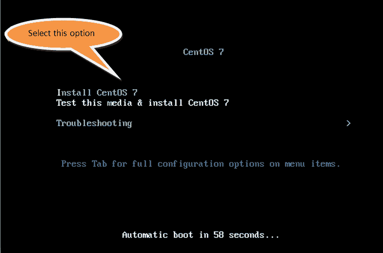

1.  现在，您将看到一个**欢迎使用 CentOS 7**屏幕，提示您选择语言和键盘设置。选择您的语言和键盘设置，然后点击**继续**按钮，如下图所示。在我的案例中，我选择了英语：

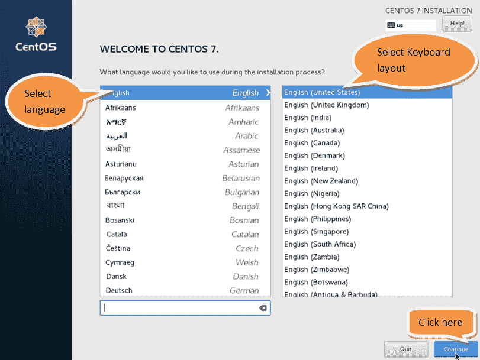

1.  接下来，您将看到一个**安装摘要**屏幕。在此屏幕上，您可以指定您想要用于三个不同部分及其子部分的设置，如下图所示：

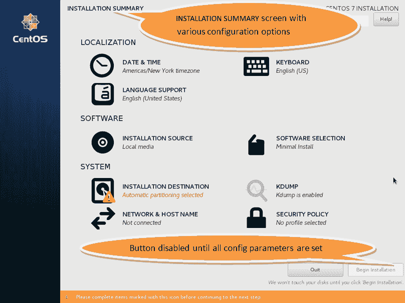

在此屏幕上，只要安装总结屏幕中显示的任何部分或子部分还未完成，开始安装按钮将保持禁用。只有当屏幕上显示的所有部分和子部分都完成且符合最小安装要求时，开始安装按钮才会启用。

默认情况下，安装程序会自动进行硬盘分区。如果我们想使用默认的布局，那么我们必须点击安装目标，然后在下一个屏幕上点击“完成”按钮，批准我们要用于自动分区的磁盘设备。之后，“开始安装”按钮将被启用，我们可以进行最小配置的 CentOS 安装，如下图所示：

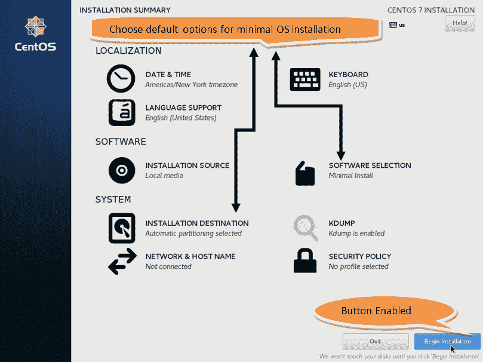

CentOS 7 的最小安装没有图形界面——它只安装了一些基本的包，命令行界面中功能有限。

1.  如果你是新手并且希望使用带有**图形用户界面**（**GUI**）的 CentOS 7，请按照这些安装说明进行操作。在这个步骤中，我们将学习如何使用 CentOS，并修改在安装过程中需要配置的某些选项。安装总结屏幕包含三个部分，如下所示：

    +   本地化

    +   软件

    +   系统

这三个部分的说明如下：

+   本地化：该部分还包含以下三个子部分供配置：

    +   日期和时间

    +   键盘

    +   语言支持

或者这三个选项中，日期和时间子部分通常需要配置。其他两个选项我们已经在之前的步骤中配置过了。

在日期和时间选项中，通过点击世界地图上的位置选择你所在的时区。你还可以从这个窗口中配置当前的日期和时间，如下图所示：

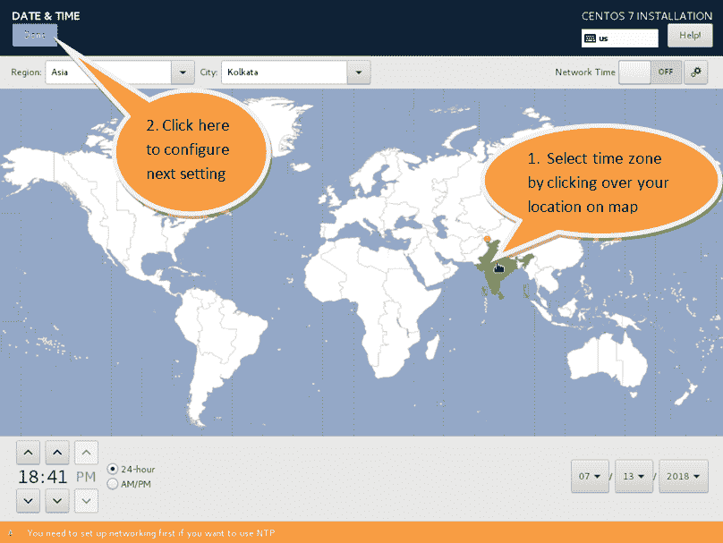

我们将键盘和语言支持设置保持为默认，接着进入下一个需要配置的部分——在这个案例中是软件**。**

+   软件：该部分还包含两个子部分供配置：

    +   安装源

    +   软件选择

在“软件”部分，我们将安装源设置为默认的本地媒体（DVD-ROM），如下截图所示：

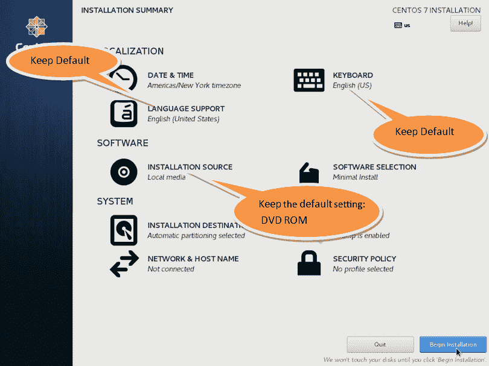

下一个需要配置的子部分是软件选择。这是安装过程中的一个重要部分。点击此选项，你将看到下面截图所示的界面。在这里，你可以选择默认的基础环境和可用的附加组件。在我们的演示中，我们将安装 GNOME 桌面基础环境，并添加四个附加组件：GNOME 应用程序、办公套件与生产力工具、开发工具和系统管理工具，如下图所示：

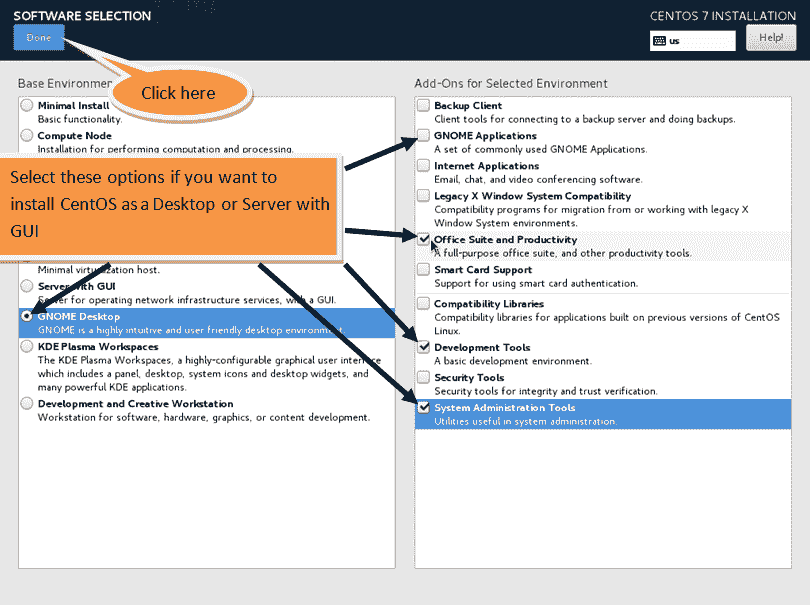

+   系统：此部分进一步包含四个子部分以进行配置：

    +   安装目标

    +   KDUMP

    +   网络与主机名

    +   安全策略

在本节中，我们将 KDUMP 和**安全策略**子部分保持为默认参数，并按照以下方式配置其余两个子部分：

在安装目标子部分中，我们指定了 CentOS 的安装位置。默认情况下选择了自动分区，但我们可以根据自己的需求创建自定义的手动分区方案。作为最低标准，我们将创建以下三个分区：

+   +   **启动分区**：此分区存储可引导文件，如内核镜像等。

    +   **交换分区**：用于将文件和程序在内存和磁盘之间交换。其大小通常为内存的两倍。

    +   **根（/）** **分区**：包含 Linux 文件系统。

以下截图显示了点击的位置，以创建手动分区：

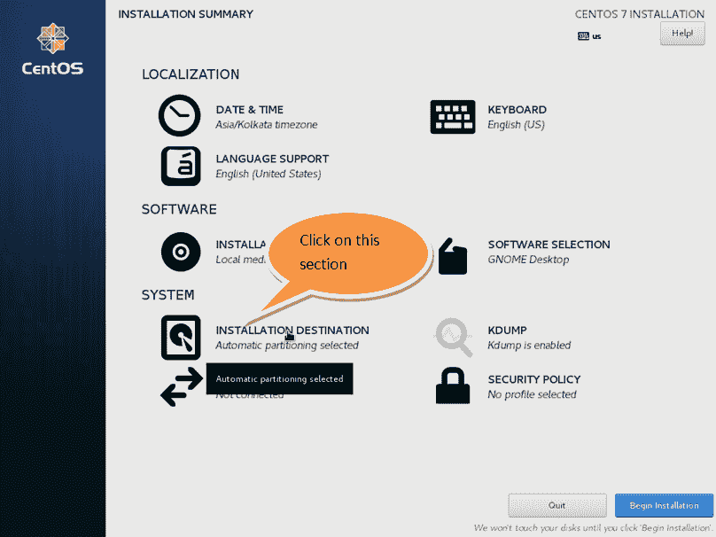

1.  选择要安装操作系统的设备，并选择“我将配置分区”。最后，点击“完成”按钮以继续按照以下截图所示创建多个分区：

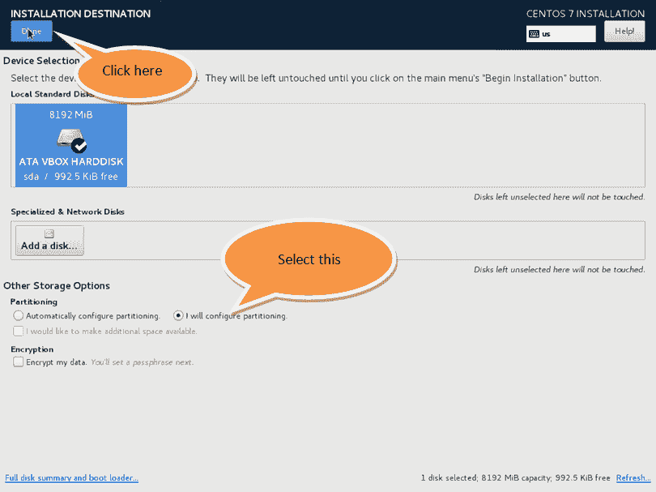

1.  现在，我们在分区表中创建至少三个分区（`boot`、`swap`和`/`）。在我的情况下，我将文件系统设置为 xfs，并为`boot`和`/`分区选择了标准分区类型。对于`swap`分区，文件系统类型设置为`swap`，如下图所示：

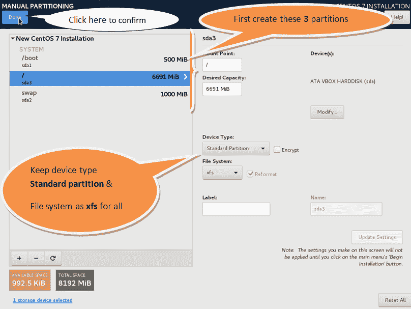

1.  接下来，按下“完成”后，您将看到“更改摘要”对话框。点击“接受更改”按钮，开始在磁盘上创建我们在分区表中指定的分区，如下图所示：

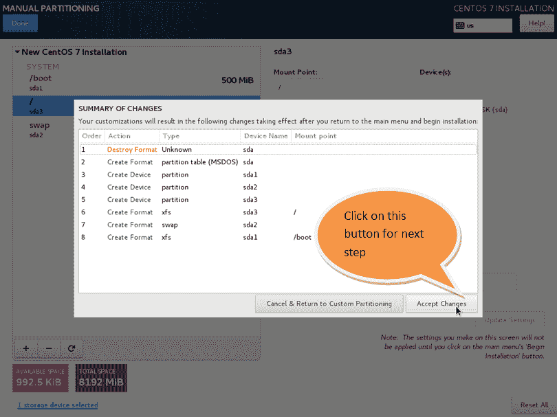

1.  网络与主机名：在安装总结的最后部分，我们将配置网络。您可以保持默认设置，从 DHCP 服务器获取 IP 地址，或者点击“网络与主机名”手动设置网络。在对话框中，点击 IPv4 设置标签，然后从下拉菜单中选择“手动”作为方法，并指定私有 IP 地址，如下图所示：

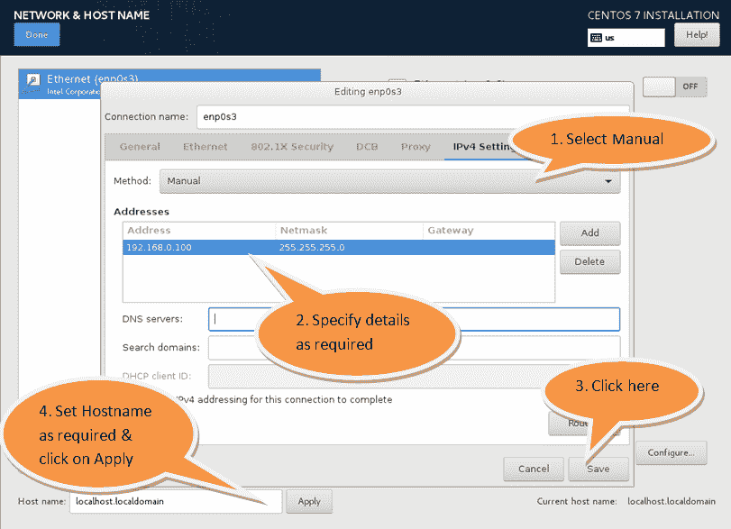

在网络与主机名设置中，将网络连接状态从关闭更改为打开，如下图所示：

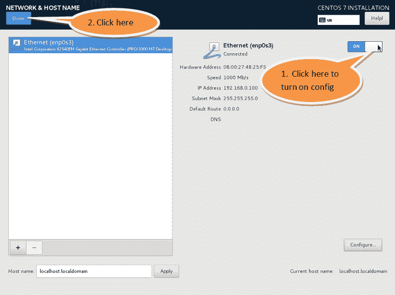

1.  现在，所有的安装总结部分已经按要求配置，**开始安装**按钮已启用。点击“**开始安装**”按钮以启动安装过程，如下图所示：

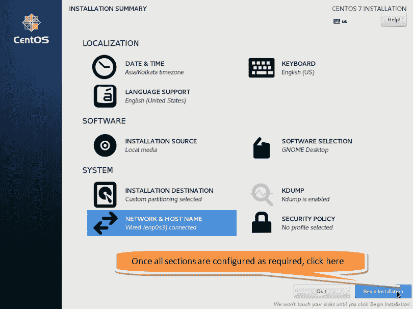

1.  接下来，屏幕提示输入用户设置。这里，我们首先点击 Root Password 并将密码设置为 `Linux@12345`。

1.  接下来，我们点击 CREATE USER 来创建一个用户。在 Full name 和 User name 字段中，输入 `student`，并将密码设置为 `Student@12345`。在这里，我们还需要点击 Done 按钮两次以确认密码，如下图所示：


1.  在安装过程中，喝杯咖啡吧。安装完成后，移除任何安装介质（这些指示仅适用于 DVD 方法），然后点击 Reboot 按钮，如下图所示：

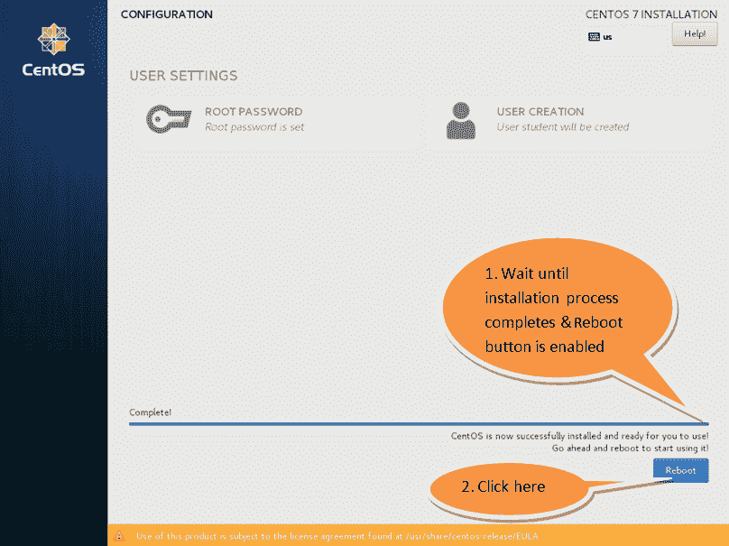

1.  系统重新启动后，我们将看到 INITIAL SETUP 屏幕，在这里我们必须接受 EULA 协议后才能登录系统。此时，我们点击 LICENSE INFORMATION 来接受许可协议，如下图所示：

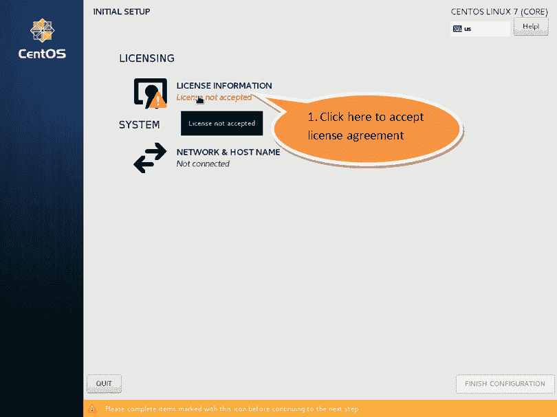

1.  一旦接受了许可协议，FINISH CONFIGURATION 按钮将变为可用。点击它以进入登录屏幕。

1.  在登录屏幕上，点击 student 用户名并输入密码 `Student@12345`，如下图所示：

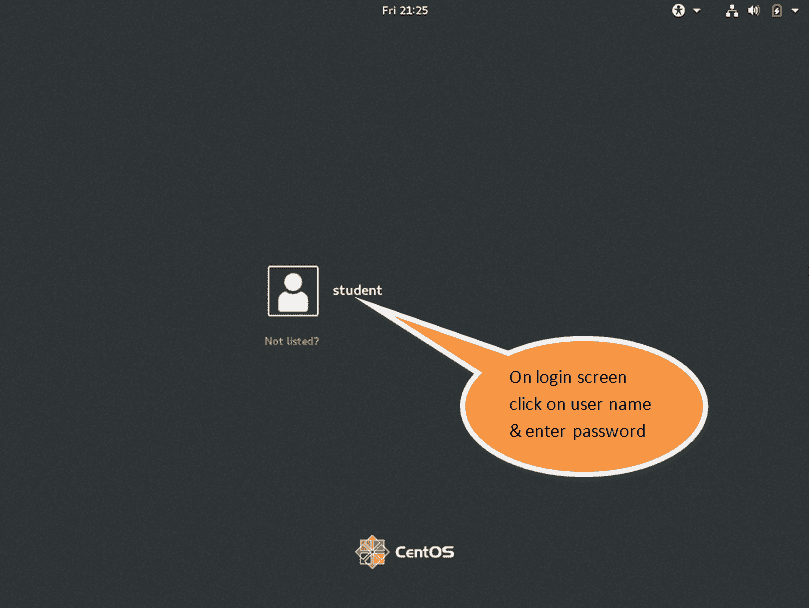

1.  成功登录后，你将看到欢迎屏幕，该屏幕仅在用户首次登录时显示。点击 Next 按钮以进入桌面。

1.  恭喜！你已经成功在你的计算机系统或虚拟机上安装了最新版本的 CentOS 7。你可以探索你的新 CentOS 7 环境并执行其他任务，例如更新系统或安装其他日常操作所需的软件。要关闭系统，点击桌面右上角。你将看到一个下拉菜单；从中可以点击 Shut down，如下图所示：

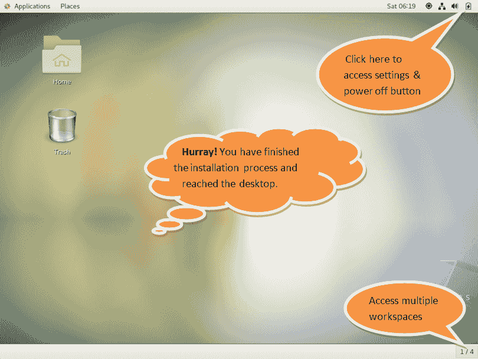

至此，安装过程已完成。在接下来的章节中，我们将学习如何访问命令行控制台。

# 使用控制台访问命令行

使用 CentOS 时，系统管理或应用程序开发任务是通过 **命令行界面** (**CLI**)，例如 Bash shell，或通过图形界面，如 GNOME、KDE 等来完成的。在本节中，我们将学习如何在 Linux 控制台的 Bash shell 中输入命令。

# 启动终端

当你以 CLI 模式登录 Linux 系统或打开终端时，它会显示一个字符串，等待用户输入（一个命令）。这被称为 **shell 提示符**。

要在图形界面环境中访问 shell 提示符，必须启动一个终端应用程序，例如 GNOME 终端。有多种方式可以启动终端。访问终端的最常用方式如下：

+   选择应用程序 | 系统工具 | 终端

+   在终端上右键单击任意位置，然后从弹出的上下文菜单中选择“在终端中打开”

+   在活动概览中，选择终端

如果你以普通用户身份启动了终端应用程序，则默认的提示符以 `$` 字符结尾，如下图所示：

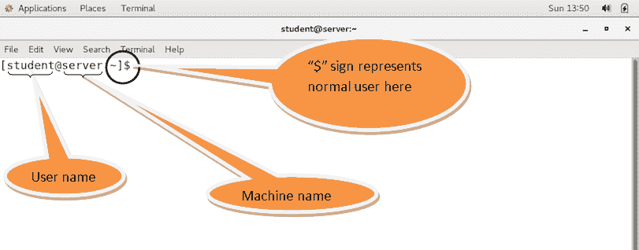

普通的 Shell 提示符列出以下三项内容：

+   当前用户的登录名

+   机器的短主机名，也称为机器名称

+   当前工作目录的名称

Shell 提示符中的波浪线（`~`）代表用户的主目录。我们将在接下来的章节中进一步了解这一点。

如果你以 root 用户身份启动或切换到 Shell，也就是被称为**超级用户**或**管理员**，则提示符以 `#` 字符结尾，如下图所示：

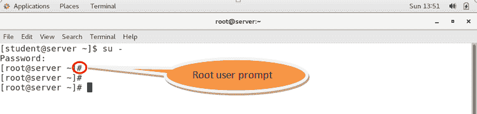

CentOS 7 的默认 Shell 是 Bash，它提供了脚本功能，用于自动化重复任务。任何 Shell 的主要功能是解释用户在提示符下输入的命令，并为启动任何其他程序提供平台。

Unix 发行版的默认 Shell 通常设置为 Bourne Shell。它类似于 Microsoft Windows 的命令提示符应用程序`cmd.exe`。从 Windows 7 和 Windows Server 2008 R2 开始，包含了 Microsoft PowerShell，它在功能上与 Bash 非常相似。

有两种方法可以访问 Shell。第一种方法是通过终端。当你以没有图形界面（如文本安装）的方式安装 Linux 时，这可以是 Linux 机器的物理控制台，包含一个用于输入的键盘和一个显示输出的显示器。

第二种方法是通过虚拟控制台中的 Shell。Linux 机器的物理控制台支持多个虚拟控制台，这些虚拟控制台作为独立的终端，拥有独立的登录会话。如果安装了图形用户界面（GUI），那么第一个虚拟控制台就是 CentOS/RHEL 中的图形界面。除了第一个图形环境，虚拟控制台还提供五个纯文本环境，你可以使用这些环境访问登录 Shell。*Ctrl* + *Alt* + (*F2* 到 *F6*) 是基于文本的，而 *Ctrl* + *Alt* + *F1* 是图形桌面。

# 命令行语法和结构

在 Shell 提示符中输入的任何命令都可以分为三部分：

| **部分** | **描述** |
| --- | --- |
| 命令 | 要执行的应用程序的名称 |
| 选项 | 这会修改命令的行为；选项通常以一个或两个短划线开头 |
| 参数 | 这些通常指示命令应用的目标 |

一个命令可以由一个或多个选项组成，并且可以接受一个或多个参数，这取决于它的语法。理解命令的语法将告诉你它可以接受哪些选项和参数，以及它们的顺序。要查看命令的语法，我们可以使用`--help`选项或查看手册页。`mkdir`命令及其选项的用法如下图所示：

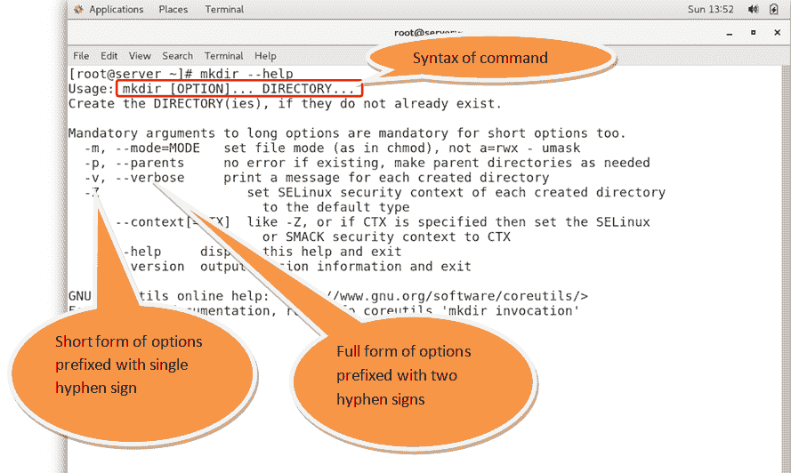

最初，你可能会觉得`--help`选项的输出有些困惑。然而，一旦你理解了语法中使用的基本约定，它就会变得简单得多，接下来会讨论这些约定：

+   方括号`[ ]`包含可选项。例如，执行`mkdir`命令时，不强制要求使用任何选项，以下命令行中展示了这一点：

```
$ mkdir mydirectory
```

+   省略号`…`表示某种类型的多个项。例如，我们可以将多个选项，如`-m`和`-p`或`-v`，与`mkdir`命令一起使用，如以下命令行所示：

```
$ mkdir -p -v demo/linux/centos
```

+   斜体括号`<>`中的文本表示变量数据。有时，变量数据也用大写字母书写。例如，`mkdir`中的`DIRECTORY..`表示我们必须插入希望与`mkdir`命令一起使用的目录名称。

+   用管道符号（`|`）分隔的多个项目，意味着只能指定其中一个项目。

# 退出 shell

当你使用完 shell 并且想要结束会话时，有多种退出方法。以下是一些常用的退出 shell 选项：

+   在控制台上随时输入`exit`命令可以终止当前会话。

+   按下`Ctrl + D`键组合也是一个常用的快捷方式，用于终止当前会话。

# 介绍 Bash shell

GNU Bash 主要是一个解释用户在提示符下输入的命令的程序。正如我们在之前的*命令行语法与结构*部分所学到的，每个由用户输入的命令可以包含三部分：

+   命令

+   选项（以`-`或`--`开头）

+   参数

在 shell 中输入的每个单词与其他单词之间用空格分隔。命令是我们系统中安装的各种应用程序的名称，每个命令都有自己的选项和参数。

当你想执行在提示符处输入的命令时，按下*Enter*键。按下*Enter*键后，命令的输出会显示在 shell 上，紧接着再次显示提示符，如以下截图所示：

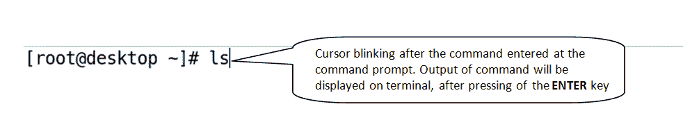

每个命令都是在单独的一行上输入的；然而，如果你愿意，你可以在一行中输入多个命令，使用分号（`;`）作为命令分隔符。

shell 执行的各种功能包括以下内容：

+   它提供了用户与操作系统之间的接口

+   它是用户执行命令和其他程序的一种方式

+   它充当命令提示符下输入命令的命令行解释器

+   Shell 还通过读取来自特定文本文件的命令（称为 Shell 脚本）来实现任务自动化

+   Shell 为在操作系统上运行的用户和程序提供了一个环境

每个 Linux 发行版上都安装了多种类型的 shell，它们之间的功能略有不同。**Bourne shell**（**sh**）是最原始的，而 Bash shell 是最先进的。以下表格列出了这些 shell 之间的差异：

| **特性** | **Bourne** | **Korn** | **C** | **Tcsh** | **Bash** |
| --- | --- | --- | --- | --- | --- |
| 后台处理 | 是 | 是 | 是 | 是 | 是 |
| 命令历史 | 否 | 是 | 是 | 是 | 是 |
| I/O 重定向 | 是 | 是 | 是 | 是 | 是 |
| Shell 脚本 | 是 | 是 | 是 | 是 | 是 |
| 命令别名 | 否 | 是 | 是 | 是 | 是 |
| 文件名补全 | 否 | 是 | 否 | 是 | 是 |
| 命令补全 | 否 | 否 | 否 | 是 | 是 |
| 命令行编辑 | 否 | 是 | 否 | 是 | 是 |
| 作业控制 | 否 | 是 | 是 | 是 | 是 |

# Bash shell 和命令执行

在本节中，我们将学习 Bash shell 的不同功能，通过这些功能，你可以减少错误并提高在终端上工作的速度。

# Tab 补全

Linux Shell 语法对大小写和空格敏感，因此输入错误是任何初学者的首要障碍。然而，如果初学者采用 Tab 补全功能，就能显著减少输入错误，使得操作变得非常简便流畅。

Tab 补全功能可以在命令提示符下输入足够的字符来唯一标识命令名或文件名时自动完成。如果输入的字符不唯一，按 *Tab* 键两次会显示所有可以以已输入字符开始的命令。以下截图展示了使用 *Tab* 键进行命令补全的示例：

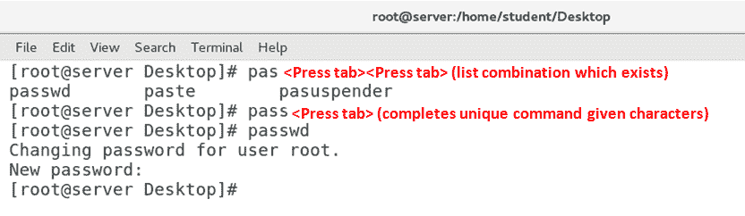

Tab 补全功能可以在输入文件名或路径名作为命令的参数时自动补全。按下 *Tab* 键一次，如果文件名或路径名唯一，就会自动完成；否则，再按一次 *Tab* 键会列出所有可能的文件名或路径名组合。之后，你可以输入额外的字符来使名称或路径唯一，再次按 *Tab* 键即可完成命令行。以下截图展示了使用 *Tab* 键进行路径和文件名补全的示例：

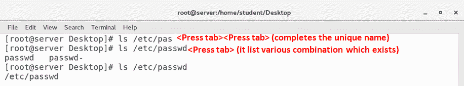

# 命令行编辑快捷键

Bash 具有非常实用的命令行编辑功能，可以提高你在终端工作时的生产力。它使用户能够使用一些快捷命令在命令提示符上移动或删除字符。

以下表格列出了 Bash 中最有用的命令行快捷键：

| **快捷键** | **描述** |
| --- | --- |
| **移动光标** |
| *Ctrl* + *A* | 将光标移动到命令行的开头 |
| *Ctrl* + *E* | 将光标移动到命令行的末尾 |
| *Ctrl* + *Left arrow* | 将光标移动到命令行中当前单词的开始位置 |
| *Ctrl* + *Right arrow* | 将光标移动到命令行中下一个单词的开始位置 |
| **删除字符** |
| *Ctrl* + *U* | 删除从当前光标位置到命令行开头的所有字符 |
| *Ctrl* + *K* | 删除从当前光标位置到命令行末尾的所有字符 |
| *Ctrl* + *W* | 从当前光标位置删除命令行中的最后一个单词 |
| *Ctrl* + *L* | 清屏（你也可以输入 `clear` 命令） |
| **修改终端窗口大小** |
| *Ctrl* + *+* | 增加终端窗口的大小 |
| *Ctrl* - - | 减小终端窗口的大小 |

# history 命令

`history` 命令用于显示之前执行过的命令列表，每条命令前都有一个命令编号，表示其执行的顺序，如下图所示：

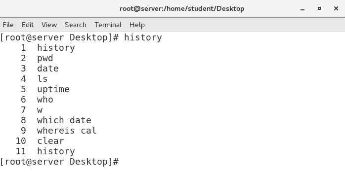

感叹号字符（`!`）是 Bash 中的元字符，用于从历史列表中扩展先前执行的命令。

以下表格列出了对初学者非常有用的各种 `history` 命令：

| **命令** | **描述** |
| --- | --- |
| `!<number>` | 展开为与指定编号匹配的命令 |
| `!<string>` | 展开为历史列表中以指定字符串开头的最新命令 |
| `history -d <number>` | 用于从历史中删除指定编号的命令 |
| `history -c` | 清空历史列表 |
| *Ctrl* + *R* | 在命令历史列表中搜索模式，并在找到时执行最匹配的命令 |

以下截图显示了 `history` 命令的用法：

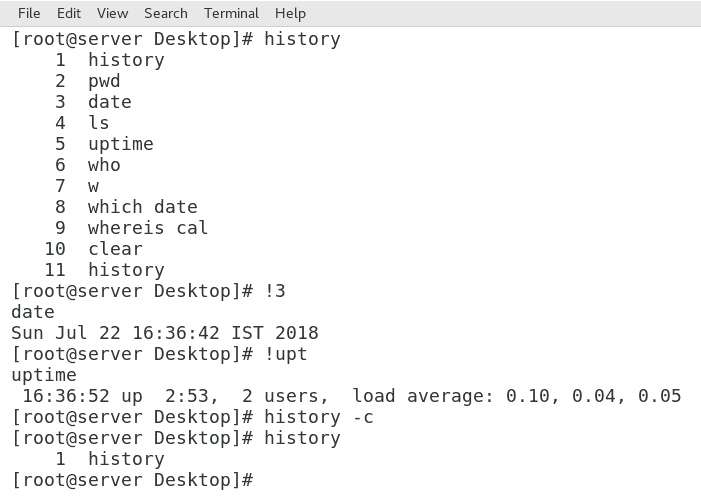

除了已经列出的选项外，我们还可以使用箭头键在 shell 历史中的上一条和下一条命令之间进行导航。上箭头键会显示历史列表中上一次执行的命令，下箭头键则会显示历史列表中的下一条命令。

# 命令别名

`alias` 命令用于为常用命令创建别名或昵称。它通过为长命令或命令组合提供别名名称，从而简化了管理过程。

# 列出当前的别名

要列出当前为你的 shell 配置的别名，只需在提示符下输入 `alias` 命令，不带任何参数，如下命令行所示：

```
$ alias
```

# 设置别名

使用以下语法可以为 `exit` 命令设置别名 `x`。因此，在设置此别名后，每当你想退出终端时，只需在提示符下输入 `x`：

```
$ alias x="exit"
$ alias c="clear"
```

# 移除一个 alias

要移除一个 `alias`，可以使用 `unalias` 命令。例如，要移除之前设置的 `alias`，我们可以按如下方式使用 `unalias` 命令：

```
$ unalias x
```

`alias` 命令将只为当前会话设置别名。如果你想为任何命令设置永久的别名，你需要在 `/etc/bashrc` 文件中添加相应条目以进行全局修改。如果想要设置用户特定的修改，则应将该条目添加到存储在用户主目录中的 `.bashrc` 文件中。

# 总结

在本章中，我们开始了 CentOS 7 的学习之旅。首先，我们从安装过程开始，接着介绍了 Bash shell 及命令行语法和结构。然后，我们通过 *Tab* 键、命令行快捷方式、`history` 和 `aliases`，掌握了如何通过更少的敲击从 shell 中运行命令的基本功能。

在下一章中，我们将继续深入探索 CentOS 7，了解 Linux 文件系统层级结构以及其他基本内容。
