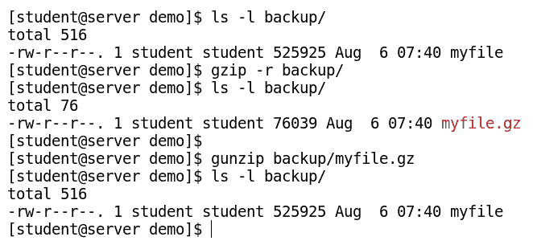

# 第二章：命令行和文件系统导航

在本章中，我们的目标是确定 CentOS 7 文件系统中重要目录的作用，并学习各种基本的命令行技能。当我们在命令行工作时，必须清晰地了解文件系统的层次结构、布局和组织方式。我们将通过 CentOS 7 中存在的各种文档，包括 man 页面、info 页面、`help`命令选项等来了解。随后，我们将学习各种文件系统导航和管理命令，包括更改目录、复制、移动、重命名文件等。最后，我们将学习归档和压缩文件，这在创建备份时非常常见。

在本章中，我们将覆盖以下内容：

+   理解 CentOS 7 的文件系统层次结构

+   使用 man 页面和`help`命令

+   管理带有路径扩展的文件名

+   使用命令行工具管理文件

+   管理档案和压缩文件

# 理解 CentOS 7 的文件系统层次结构

我们可以将文件系统比作冰箱，或者任何其他有多个货架用于存储不同物品的储物柜。这些货架或隔间帮助我们根据物品的形状、大小、类型等特征，在冰箱中组织食品。同样的类比适用于文件系统，它是存储和组织数据及文件集合的缩影，以便人类可以使用。

文件系统以倒根树的设计方式组织，`/`（一个斜杠，发音为根）是文件系统的根，其下方是其余的目录和子目录，如下图所示：


CentOS 7 中的重要文件系统目录

这种文件系统层次结构的布局在 Linux 文件系统层次结构标准中进行了描述。

在这里，`/`表示两种含义：

+   文件系统层次结构顶部的根目录。

+   它也作为目录分隔符，用来将一个目录与另一个目录分开。例如，`home`目录位于**`/`**目录下，因此它被称为`/home/`。类似地，如果我们有另一个位于`/home`目录上方的目录`alice`，它被表示为`/home/alice/`。

每个目录都用于组织特定类型和目的的文件。任何目录都可以包含四种类型的内容，如下表所示：

| **内容类型** | **描述** |
| --- | --- |
| 静态 | 这种类型的内容保持不变，直到明确编辑 |
| 动态或可变 | 这种类型的内容通常会不断修改 |
| 持久性 | 这种类型的内容在重启后仍然保留所做的更改，例如配置文件 |
| 运行时 | 这种类型的内容大多驻留在内存中，其内容会在重启时被清除，例如系统进程使用的文件 |

以下表格列出了 CentOS 7 中重要目录的位置和用途：

| **位置** | **用途** |
| --- | --- |
| `/boot` | 包含启动 CentOS 7 的引导过程所需的文件，包括 GRUB 配置文件、内核镜像（`vmlinuz`）、RAM 磁盘文件（`initramfs`）等。 |
| `/dev` | 包含系统用于访问硬件和软件设备的特殊设备文件，例如`/dev/sda`（硬盘驱动器）或`/dev/pts1`（表示伪终端）。 |
| `/etc` | 包含此系统上安装的应用程序的配置文件（如`resolv.conf`、`passwd`等），用于进行系统范围的更改。 |
| `/root` | 根用户的家目录，也称为超级用户的家目录。 |
| `/home` | 包含普通用户的家目录，用于存储个人文件。 |

| `/run` | 包含自上次启动以来为进程启动而产生的运行时数据、变量、进程 ID、锁文件等。该目录的内容会在重启系统后重新生成（在 CentOS 6 中，其内容存储在`/var/run`和`/var/lock`中）。该目录中的一个重要子目录如下：

+   `/run/media`: 用作可移动设备的挂载点，例如 USB、CD、DVD 等。

|

| `/var` | 包含特定于系统的可变数据，这些数据在重启后仍会保持。随着系统运行，这些文件的内容和大小会动态变化（例如日志文件、打印机缓存的文档、网站内容和 FTP 内容）。`/var`目录可以单独放在文件系统中，这样文件的增长就不会对系统造成致命影响。 |
| --- | --- |
| `/tmp` | 包含临时文件；为系统上的所有用户启用了写入权限。过去 10 天内未被访问、修改或更改的文件会自动从此目录中删除。我们系统中的另一个临时存储目录是`/var/tmp`。 |

| `/usr` | 包含应用程序文件、共享库和文档。该目录中的文件是静态的、只读的，并且是可共享的。它还包含三个重要的子目录，如下所示： |

+   `/usr/bin`: 包含基本的用户命令（`ps`、`ls`、`cp`等）

+   `/usr/sbin`: 包含系统管理命令（`fsck`、`shutdown`等）

+   `/usr/local`: 包含特定于本地计算机的数据和程序

+   **`/usr/include`**: 包含用于编译应用程序的头文件

|

| `/bin` | 指向`/usr/bin`的符号链接。 |
| --- | --- |
| `/sbin` | 指向`/usr/sbin`的符号链接。 |
| `/lib` | 指向`/usr/lib`的符号链接；包含应用程序使用的共享库，这些应用程序存储在`bin`和`/sbin`目录下。 |
| `/lib64` | 指向`/usr/lib64`的符号链接，包含应用程序使用的 64 位共享库，这些应用程序存储在`/bin`和`/sbin`目录下。 |
| `/mnt` | 该目录用于作为文件系统树中分区和设备的临时挂载点，例如用于挂载 NFS 文件系统。 |
| `/proc` | 包含虚拟文件系统（即它仅存在于内存中）；也称为内核的伪文件系统。它包含动态的运行时系统信息（例如系统内存、已挂载设备、硬件配置等），被认为是内核的控制和信息中心。一些工具直接调用此目录中存储的文件并显示信息，例如通过`/proc/meminfo`文件查看空闲内存，使用`/proc/net/arp`文件查看 ARP 表信息，等等。 |

若要查看 Linux 文件系统层次结构标准的详细信息，可以参考*使用 man 命令*部分，并访问[`www.tldp.org/LDP/Linux-Filesystem-Hierarchy/html/`](https://www.tldp.org/LDP/Linux-Filesystem-Hierarchy/html/)获取在线参考资料。

# 使用 man 页面和 help 命令

我们可以花费大量时间学习 CentOS 7；这就像是给你端上做好的菜，但实际上我们可以学会如何烹饪，这样你就能自己做出不同的菜谱。Linux 有着最全面、最庞大的操作系统文档库，涵盖了大多数命令及其选项。无论你是经验丰富的用户还是初学者，你都无法记住所有 Linux 命令和工具的确切用法，每个命令都有多个选项。在这种情况下，Linux 文档将为我们提供帮助。

# Linux 中可用的不同类型文档

在 Linux 中，有多种文档来源可供学习如何使用不同的命令及其选项，如下图所示：


Linux 中的不同类型文档

# 使用 man 命令

**Man**（手册页，**manual**的缩写）是 Linux 中最常用的文档来源，涵盖了系统内各种程序、工具、系统调用、库文件、配置文件和内核。整个 man 文档被组织成九个部分，每个部分针对特定类型的文档。如果某个命令有多个部分，默认情况下，它会显示遇到的第一个部分的文档。`man`命令的使用语法如下：

```
$ man <topic name>
```

执行上述命令后，指定主题的内容将逐屏显示。使用箭头键逐行滚动，或者按空格键切换到下一个屏幕。默认情况下，man 页面会在 less 查看器中打开。

下表列出了 man 页面导航命令键及其描述：

| **键** | **描述** |
| --- | --- |
| 空格键/*Page Down* | 向下滚动一屏 |
| *Page Up* | 向上滚动一屏 |
| 下箭头 (*↓*) | 向下滚动一行 |
| 上箭头 (*↑*) | 向上滚动一行 |
| */string* | 向前（下）搜索给定字符串在 man 页面中的位置 |
| *?string* | 向后（上）搜索给定字符串在手册页中的位置 |
| *n* | 在手册页中向前重复上一次的搜索 |
| *N* | 在手册页中向后重复上一次的搜索 |
| *q* | 退出手册并返回到提示符 |
| *g*/*Home* | 返回手册页的开始 |
| *G*/*End* | 跳转到手册页的末尾 |

一些常用的`man`命令选项包括以下内容：

+   `$ man -f <topic name>`：给出该主题的简短描述（相当于`whatis`命令）。使用方法请参见以下截图：


+   `$ man -k <topic name>`：列出所有包含指定主题的匹配页面（相当于`apropos`命令）。使用方法请参见以下截图：


+   `$ man -a <topic name>`：依次显示所有章节中包含指定主题名称的手册页。例如，`man -a passwd`会列出所有包含`passwd`的手册页，不论其属于哪个章节。

+   `$ man <section number> <topic name>`：强制`man`命令从指定的章节显示主题文档。否则，默认情况下，当没有指定章节号时，它会显示最常用的章节，如以下命令所示：

```
$ man passwd
```

执行上述命令后的输出如下所示：


指定章节的`man`命令会列出该章节的文档，如以下命令所示：

```
$ man 5 passwd
```

执行上述命令后的输出如下所示：


# 使用 GNU info 命令

Linux 中的下一个文档来源是 GNU 信息页面，其中的主题通过超链接连接。可以通过命令行使用`info`或`pinfo`命令，或借助图形工具来阅读信息页面中的文档。一些命令和工具同时拥有 info 和 man 文档，但 info 文档通常会更为详细。

在 info 页面中查看的主题被称为**节点**。每个节点可以包含菜单和子主题，称为**项**。项的名称前缀是星号（`*`）符号。你可以使用常规按键（箭头键、*Page Up*和*Page Down*）浏览主题列表。下表列出了在 info 页面中导航时最常用的按键：

| **Key** | **Description** |
| --- | --- |
| *Page Down* 或 空格键 | 向前滚动一页 |
| *Page Up* 或 b | 向上滚动一页 |
| *n* | 跳转到下一个节点 |
| *p* | 返回到上一个节点 |
| *u* | 在索引中向上移动一个节点 |
| *Tab* | 移动到下一个超链接（节点） |
| *Enter* | 选择节点并显示当前光标位置的内容 |
| *q* | 退出查看 info 页面 |
| */string* | 在打开的文档中搜索字符串 |
| /<*Enter* Key> | 向前重复上一次的搜索 |

在终端中键入`info`命令而不带任何参数，会显示可用主题的索引，如以下命令所示：

```
$ info <topic name>
```

执行前述命令时，输出结果如下截图所示：


# 使用 help 命令和--help 选项

`help`命令是 Linux 中另一个重要的文档来源。大多数 Linux 命令都有简短的描述，可以使用`--help`或`-h`选项以及命令或应用程序名称查看。

例如，你可以通过运行带有`--help`选项的`mkdir`命令来了解更多信息，如以下命令所示：

```
$ mkdir --help
```

执行前述命令时，输出结果如下截图所示：


`--help`选项作为快速参考非常方便，因为它显示了与给定命令相关的各种选项的有限信息。单独执行`help`命令会显示 Bash 中内置命令的列表。你也可以通过输入`help`后跟内置命令名来显示这些内置命令的帮助信息，如以下命令所示：

```
$ help exit
```

执行前述命令时，输出结果如下截图所示：


# 其他文档来源

除了`man`和`pinfo`之外，页面开发者还可以将文档包含在应用程序的 RPM 包中。这些文档会在安装包时安装，并且通常存储在`/usr/share/doc/<packagename>`目录中。它包含开发者希望共享的任何其他相关信息，但这些信息在该包的 man 页面中并未提供。你可能会在这些目录中找到基于 PDF、HTML 或 TXT 格式的文档、许可证协议、示例配置文件等等。

除了前述的文档来源，如果你安装了 GUI，那么`gnome-help`或`Khelpcenter`是系统上可用的其他文档来源。CentOS 7 的在线社区也包含大量的文档和帮助资源。每个 Linux 发行版都有自己用户驱动的论坛和 Wiki 部分。

CentOS 文档可在[`www.centos.org/docs/`](https://www.centos.org/docs/)找到，但它正与 RHEL 文档合并，合并地点为[`access.redhat.com`](http://access.redhat.com)，因为相比之下 CentOS 的资源有限。

一些有用的命令可以提供其他命令的描述，以下是一些示例：

+   `Whatis`：此命令显示 Linux 系统中可用二进制文件的简短描述。在 CentOS 7 中，使用另一个命令`makewhatis`，该数据库会每天更新。

+   `Whereis`：此命令定位给定命令的二进制文件、源代码及手册页。

+   `Which`：此命令接受一个或多个命令名作为参数，并返回给定命令名的绝对路径。

# 管理带有路径扩展的文件名

在本节中，我们将看到可以提高文件管理效率的元字符和扩展技巧。

# 文件通配符匹配

bash shell 可以根据一些元字符来匹配路径名。这个功能被称为**文件通配符匹配**。路径名匹配能力在历史上被称为通配符匹配（也称为模式匹配），用于管理大量文件。它扩展了用于文件名和路径名的元字符。

使用文件通配符匹配文件名或路径名时，元字符在命令执行之前会被匹配的路径名列表所替代。以下表格列出了模式及其对应的结果：

| **模式** | **结果** |
| --- | --- |
| `?` | 匹配任何单个字符 |
| `*` | 匹配任何字符字符串（0 个或多个） |
| `[set]` | 匹配集合中的任何字符；例如，`[akl]` 将匹配字符 `a`、`k` 或 `l` 的任意单个出现 |
| `[!set]` 或 `[^set]` | 匹配在字符集之外的任何字符 |
| `~` | 匹配当前用户的主目录（称为波浪线展开） |
| `~username` | 匹配用户名的主目录 |

# 通配符扩展

要使用 `?` 通配符搜索文件，请用 `?` 替换每个未知字符，如此例所示：

+   `$ ls /etc/???.conf` 将列出所有仅由三个字符组成的 `conf` 文件

要使用 `*` 通配符搜索文件，请用 `*` 替换未知字符串，如此例所示：

+   `$ ls /etc/*.conf` 将列出 `/etc/` 目录中的所有 `conf` 文件

前面命令的结果如下所示：


# 波浪线展开

波浪线字符 `~`，如果后面紧跟着一个斜杠 `/`，则匹配当前用户的主目录，如下图所示：


波浪线字符 `~`，如果后面紧跟着一个字符串和一个斜杠 `/`，则匹配字符串中指定的用户名，如下图所示：


# 花括号扩展

花括号扩展生成一组字符字符串。在花括号内，我们指定一个由逗号分隔的字符串列表或一个序列表达式，它前后可以有文本来附加在花括号内的字符串上，如下图所示：


# 命令替换

命令替换允许将命令的输出存储到变量中；命令可以被自身替代。命令替换有两种方法：

+   将命令包含在反引号内，如 `` `command` ``。使用反引号是一种较旧的方法，并且有两个缺点：

    +   反引号有时会与单引号混淆。

    +   反引号不能嵌套在其他反引号内，因此不支持嵌套命令替换。

+   使用美元符号和括号将命令括起来，如`$(command)`。这种方式克服了在命令替换中使用反引号的缺点，如下图所示：


# 引用与转义

在 bash shell 中有一些特殊意义的字符，它们被称为元字符。Bash 元字符增强了 bash 的灵活性、功能和使用性。元字符的例子包括星号（`*`）、问号（`?`）、连字符（`-`）、感叹号（`!`）等。扩展元字符感叹号（`!`）的使用可以在第一章中找到解释，*《CentOS 7 入门》*一书的*历史命令*部分对其进行了详细讲解。引用和转义用于 bash shell 内部，以保护元字符扩展：

+   **转义**：反斜杠（`\`）是一个转义字符，用于保护紧随其后的字符的特殊含义

+   **引用**：为了保护较长的字符字符串，可以将其用单引号（`'`）或双引号（`"`)括起来

+   **双引号**（**"**）：使用双引号可以抑制通配符和 shell 扩展，但允许命令和变量替换，如下图所示：


+   **单引号（'）**：使用单引号可以抑制所有类型的扩展，单引号内的所有内容都被视为字面字符，没有任何特殊意义，如下图所示：


# 文件命名规范

文件或文件夹名称是用于标识文件的字符串。它可以由 255 个字符组成，包括字母、数字和特殊字符，但不能包含（`/`），因为它作为目录分隔符使用。你可以包含特殊字符（元字符）；然而，不建议在文件名中使用某些字符，包括`'`、`"`、`$`、`#`、`!`等，因为这些字符在 shell 中有特殊含义。

Linux 是区分大小写的，空格也有特殊意义，因此文件名也是区分大小写的。这意味着，如果我们在同一目录下创建文件`data.txt`和`Data.txt`，它们将被视为两个独立的文件。

空格是 Linux 文件名中可以接受的字符；然而，空格也作为命令 shell 的分隔符，用于命令行语法解析，因此通常不建议在文件名中使用空格，以免在执行命令时造成歧义。

# 使用命令行工具管理文件

命令是安装在系统上的程序的名称。在进行基本命令操作之前，让我们先看一下 Linux 中的两种路径遍历方式：

+   **绝对路径**：这种方法指定文件的完整路径，不论你当前的位置。这种路径总是以`/`（根目录）开头，并指定每个子目录的遍历顺序，以唯一表示文件系统中的某个文件。这样可以消除路径中的任何歧义。路径中的一个目录与另一个目录通过正斜杠（`/`）分隔。在创建 Shell 脚本时，应该使用这种命名约定来引用文件。与相对路径相比，绝对路径较长，但在命令行中频繁使用相对路径来引用文件或目录。

+   **相对路径**：这种方法指定了相对于当前位置的文件路径。路径可以以一个或多个点符号（`.`）开头，也可以不以点符号开头。该路径永远不会以`/`开头。在这种遍历方法中，两个不同的工作位置可能在同一个 Linux 文件系统中具有相同的相对路径。使用 Shell 脚本时，应该避免使用这种命名约定，以确保脚本可以从 Linux 文件系统中的不同位置执行。

例如，如果你在`/home/student`的家目录下工作，并且想要移动到`/home/student/backup`目录，可以使用以下两种方法：

+   绝对路径遍历：`$ cd /home/student/backup`

+   相对路径遍历：`$ cd backup`：


`backup`目录的相对路径，当用户的当前工作目录是`/home/student`时，就是简单的`backup`。在这里，我们只使用`cd`命令指定目录名称，因为我们已经在`/home/student`目录下工作。

在标准的 Linux 文件系统中，文件的路径名（包括所有字符，甚至`/`目录分隔符）不能超过 4,095 字节。通常，使用相对路径进行导航比较容易，因为它需要更少的输入，并且可以利用元字符提供的快捷方式：

+   `.`：单点表示当前目录

+   `..`：双点表示父目录

+   `~`：波浪符表示用户的家目录

例如，假设你在`/home/student`的家目录下工作，想要移动到`/usr/bin`目录，可以使用以下两种方法：

+   绝对路径遍历：`# cd /usr/bin`

+   相对路径遍历：`# cd ../../usr/bin`

# 导航命令

这些命令属于导航类命令，主要用于路径导航：

+   `pwd`：`pwd`命令显示当前工作目录的完整路径。它有助于确定当前语法，以便与其他命令（如`cp`、`mv`、`rm`、`mkdir`等）一起使用相对路径，如下图所示：


+   `ls`: `ls` 命令用于列出给定目录的内容。如果未指定目录名，则列出当前目录的内容，如下图所示：


`ls` 命令有很多选项，通常一起使用以生成更结构化且易于阅读的输出。最常用的 `ls` 选项列在下面的表格中：

| **选项** | **描述** |
| --- | --- |
| `-a` | 显示以 (`.`) 开头的文件名，任何以 (`.`) 开头的文件默认是隐藏的 |
| `-l` | 显示详细信息，也叫长列表格式 |
| `-t` | 按修改时间排序列出内容，最近修改的文件排在最前 |
| `-r` | 按文件名反向排序列出内容 |
| `-h` | 以人类可读的格式显示文件大小（例如 1 K、50 M、3 G 等） |
| `-S` | 按文件大小排序内容 |
| `-i` | 显示列出文件的 inode 号 |
| `-Z` | 显示每个文件的安全上下文（SELinux 参数） |

`ls` 命令的使用示例如下图所示：


+   `cd`: `cd` 命令用于更改工作目录。我们通常使用相对路径名来简化命令行中的目录切换。然而，在创建脚本时，使用绝对路径名是一种良好的实践。`cd` 命令有很多选项，其中一些选项在下表中描述：

| **选项** | **描述** |
| --- | --- |
| `cd -` | 切换到上一个工作目录 |
| `cd` 或 `cd ~` | 切换到用户的主目录 |
| `cd ~<username>` | 切换到指定 `<username>` 用户的主目录 |
| `cd . .` | 切换到上一级目录，即父目录 |

`cd` 命令使用示例如下图所示：


(`. .`) 表示当前工作目录的父目录，而 (`.`) 表示当前目录的相对路径格式。

# 文件管理命令

文件管理是创建、删除、复制和移动文件或目录的过程，用于逻辑地组织文件。在命令行上执行文件管理任务时，了解当前工作目录非常重要。这将帮助你为当前任务提供正确的绝对路径或相对路径。

**`cp`** 用于将文件或目录从一个位置复制到另一个位置。与此命令一起使用的各种有用选项列在下面的表格中：

| **命令** | **描述** |
| --- | --- |
| `cp file1 file2` | 将 `file1` 复制为 `file2`，并放置在当前目录 |
| `cp file1 file2 /tmp/` | 将 `file1` 和 `file2` 复制到 `/tmp/` 目录，并保留相同的文件名 |
| `cp file1 /tmp/myfile` | 将 `file1` 复制到 `/tmp/` 目录，并重命名为 `myfile` |
| `cp -r backup /tmp/` | 将 `backup` 目录递归地复制到 `/tmp/` 目录 |

以下是 `cp` 命令使用示例的截图：


**`mv`** 用于两个目的。首先，如果源路径和目标路径在同一目录下，它会重命名文件或目录。其次，当源目录和目标目录不同时，它用于执行剪切粘贴（移动）操作。

以下是 `mv` 命令中最常用的一些选项：

| **命令** | **描述** |
| --- | --- |
| `mv file1 file2` | 将当前目录下的 `file1` 重命名为 `file2` |
| `mv file1 file2 /tmp/` | 将 `file1` 和 `file2` 移动到 `/tmp/` 目录下 |
| `mv file1 /tmp/myfile` | 将 `file1` 移动到 `/tmp/` 目录，并重命名为 `myfile` |
| `mv backup /tmp/` | 将名为 `backup` 的目录移动到 `/tmp/` 目录 |

以下是 `mv` 命令使用示例的截图：


**`mkdir`** 用于创建目录。此命令在命令行中也可与不同的选项一起使用，包括以下选项：

| **命令** | **描述** |
| --- | --- |
| `mkdir backup` | 在当前目录下创建一个名为 backup 的示例目录 |
| `mkdir /tmp/backup` | 在 `/tmp` 目录下创建一个名为 `backup` 的示例目录 |
| `mkdir -p backup/linux/centos` | 创建全路径的目录 `backup/linux/centos`（如果目标路径中缺少父目录，将自动创建完整路径） |
| `mkdir linux windows mac` | 在当前目录下创建名为 `linux`、`windows` 和 `mac` 的目录 |

以下是 `mkdir` 命令使用示例的截图：


**`rmdir`** 用于仅删除空目录。如果目录中包含子目录或文件，则必须使用 `rm -rf` 命令，如下所示：

```
$ rmdir <empty directoryname>
```

以下是 `rmdir` 命令使用示例的截图：


**`rm`** 用于从文件系统中删除/移除一个文件。此命令也有多个选项，使用时需要小心，因为一旦文件被删除，它将无法从命令行模式下的回收站（Linux 的回收站）恢复。

这是一个列出了常用的 `rm` 命令选项及其描述的表格：

| **命令** | **描述** |
| --- | --- |
| `rm` | 删除一个文件 |
| `rm -f` | 强制删除文件 |
| `rm -i` | 交互式删除文件，在每次删除前进行提示（如果你不确定文件名，使用此选项） |
| `rm -rf` | 强制递归删除目录（使用此选项时需谨慎） |

以下是 `rm` 命令使用示例的截图：


`ln`命令用于创建链接。在 Linux 中有两种类型的链接，硬链接和软链接，也称为符号链接（symlink）。文件和目录的软链接可以看作是 Windows 中快捷方式的等价物，分别对应文件和文件夹：

+   创建硬链接：`$ ln file1 file2`

+   创建软链接：`$ ln -s file1 file2`

`ln`命令使用示例如下图所示：


# 管理归档文件和压缩文件

归档是将来自同一位置或不同位置的多个文件提取并打包成一个文件的过程。通常，这一过程会与压缩一同进行，或者紧接着进行压缩。这有助于简化备份过程，如下文所述。

# 压缩

文件数据通常会被压缩，以节省磁盘空间、减少流量，并减少通过网络传输文件所需的时间。Linux 有多种压缩工具，以下表格列出了其中的一些：

| **命令** | **描述** |
| --- | --- |
| `gzip` | 最流行的 Linux 压缩工具 |
| `gunzip` | 解压`gzip`压缩文件的工具 |
| `bzip2` | 另一种压缩工具，压缩效果优于`gzip` |
| `bunzip2` | 用于解压`.bzip2`压缩文件的工具 |
| `xz` | Linux 中最节省空间的压缩工具 |
| `zip` | 流行的解压缩工具，用于解压其他操作系统的归档文件 |

这些工具有不同的压缩算法，因此具有不同的效率和资源消耗水平（一般来说，更高效的技术会消耗更多时间）。不同方法的解压时间差异不大。

# gzip 和 gunzip 压缩

`gzip`工具比其他工具压缩文件的速度更快。

下表列出了`gzip`压缩命令及其描述，并附带一些示例：

| **命令** | **描述** |
| --- | --- |
| `gzip *` | 压缩当前目录中的所有文件，并将每个压缩文件重命名为`.gz`扩展名 |
| `gzip -r backup/` | 压缩`backup/`目录及其子目录中的所有文件 |
| `gunzip myfile.gz` 或 `gzip -d myfile.gz` | 解压`myfile.gz`为`myfile` |

`gzip`和`gunzip`命令的示例如下图所示：



# bzip2 和 bunzip2 压缩

`bzip2`命令的语法与`gzip`类似，但它使用不同的压缩算法，并生成更小的压缩文件，但压缩所需的时间也更长。

下表列出了`bzip2`压缩命令及其描述，并附带一些示例：

| **命令** | **描述** |
| --- | --- |
| `bzip2 *` | 压缩当前目录中的所有文件，并将每个压缩文件重命名为`.bz2`扩展名 |
| `bunzip2 *.bz2` 或 `bzip2 -d *.bz2` | 解压当前目录下所有`.bz2`扩展名的文件 |

`bzip2`和`bunzip2`命令的示例如下所示：


# xz 压缩

这是 Linux 中最节省空间的压缩工具。压缩的权衡是较慢的压缩速度，换来更高的压缩比。

下表列出了`xz`压缩命令及其描述，并附带了一些示例：

| **命令** | **描述** |
| --- | --- |
| `xz *` | 压缩当前目录下的所有文件，每个压缩文件都会被重命名为`.xz`扩展名 |
| `xz myfile` | 将`myfile`文件压缩为`myfile.xz`，默认压缩级别为 6；压缩后删除原始的`myfile` |
| `xz -dk` | 解压`myfile.xz`到`myfile`并保留`myfile.xz` |
| `xz -d *.xz` 或 `unxz` | 解压当前工作目录中所有`.xz`扩展名的文件 |

`xz`命令使用示例如下所示：


# zip

这个程序通常不用于压缩 Linux 中的文件，但在从 Windows 操作系统解压归档文件时经常需要使用。

下表列出了`zip`命令及其描述，并附带了一些示例：

| **命令** | **描述** |
| --- | --- |
| `zip backup *` | 压缩当前工作目录中的所有文件，并将它们放入`backup.zip`中 |
| `zip -r backup.zip /home/student/abc` | 将存储在`/home/student/abc`中的文件和目录归档到`backup.zip`文件 |
| `unzip backup.zip` | 解压当前目录下的`backup.zip`文件中的所有文件 |

`zip`和`unzip`命令的示例如下所示：


# 归档

除了压缩，`tar`（磁带归档）工具常用于将文件归档成一个名为**tarball**的归档文件，然后将整个归档文件进行压缩。将多个文件放在一起形成一个单独的文件包称为归档。

以下表格列出了`tar`命令的各种选项及其描述：

| **tar** **命令选项** | **描述** |
| --- | --- |
| `c` | 创建一个新的归档文件 |
| `v` | 显示详细信息，用于查看正在添加和提取的文件 |
| `f` | 要操作的归档文件名 |
| `x` | 提取归档文件 |
| `t` | 列出归档文件的内容 |
| `z` | 使用`.gzip`压缩（`.tar.gz`） |
| `j` | 使用`.bzip2`压缩（`.tar.bz2`），比`.gzip`更优 |
| `J` | 使用`.xz`压缩（`.tar.xz`），比`.bzip2`更优 |

`tar`命令本身可以使用`.gzip`、`.bzip2`或`.xz`压缩归档文件。

下表列出了`tar`命令与压缩工具一起使用的选项：

| **命令** | **描述** |
| --- | --- |
| `Tar cvf abc.tar file1 file2 file3` | 归档 `file1`、`file2` 和 `file3` 文件，并将它们放入一个名为 `abc.tar` 的文件中 |
| `Tar xvf abc.tar` | 提取当前目录中 `abc.tar` 归档中的所有文件 |
| `Tar tvf abc.tar` | 列出 `abc.tar` 归档中所有可用的文件 |
| `Tar cvzf abc.tar.gz *` | 创建一个 `abc.tar.gz` 归档文件，其中包含当前目录中的所有文件，并使用 `.gzip` 压缩 |
| `Tar cvjf abc.tar.bz2 *` | 创建一个 `abc.tar.bz2` 归档文件，其中包含当前目录中的所有文件，并使用 `.bzip2` 压缩 |
| `Tar cvJf abc.tar.xz *` | 创建一个 `abc.tar.xz` 归档文件，其中包含当前目录中的所有文件，并使用 `.xz` 压缩 |
| `Tar xvf abc.tar.gz abc.tar.bz2 abc.tar.xz` | 提取当前目录中 `abc.tar.gz`、`abc.tar.bz2` 和 `abc.tar.xz` 中的所有文件 |

# 使用 tar 进行归档

在下面的示例中，我们将介绍如何创建和提取归档文件：


# 使用 tar 进行归档和压缩（.gzip）

在下面的示例中，我们将介绍如何创建和提取 `gunzip` 压缩档案：


# 使用 tar 进行归档、压缩（.bzip2）和列出内容

在下面的示例中，我们将介绍如何创建和提取 `.bzip2` 压缩档案：


# 使用 tar 进行归档和压缩（.xz）

在下面的示例中，我们将介绍如何创建和提取 `.xz` 压缩档案：


# 总结

在本章中，我们了解了 Linux 文件系统层次标准以及不同类型的内置文档。随后，我们介绍了基本的命令行操作，包括文件系统导航和从命令行管理文件系统。最后，我们亲自实践了 Linux 中的不同压缩技术和归档方法。

在下一章中，我们将学习不同的文本文件管理方法。
