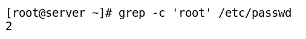

# 第三章：管理文本文件

计算机系统主要用于编辑、操作或管理数据。在 Linux 系统中，这些数据通常以文本文件的形式存在。一般来说，Linux 中的一切都是文件，掌握处理文本文件的技巧非常重要。Linux 中所有重要信息都存储在文本格式的文件中。

在本章中，我们的目标是学习如何在命令行中处理文本文件，使用最流行的默认基于文本的编辑器 vi 以及其他文本文件操作工具。然后，我们将学习如何在文件和程序中执行输入/输出重定向，以进行进一步处理。

在本章中，我们将涵盖以下主题：

+   创建文本文件的不同方法

+   使用 vi 编辑器编辑文件

+   使用文本文件操作工具

+   将输出重定向到文件和程序

+   使用 grep 进行文本匹配

+   使用 locate 和 find 命令查找文件

# 创建文本文件的不同方法

文本文件可以使用任何存在于 Linux 中的文本编辑器查看和编辑。然而，在学习编辑部分之前，我们必须对创建纯文本文件的不同方法有一个基本了解。根据需求，可以使用不同的方法来创建文本文件。接下来将介绍一些最常用的方法。

# 使用 cat 命令创建一个文本文件

如果我们想立即向一个新空白文件添加一些文本，可以使用 `cat` 命令来创建一个文本文件。使用 `cat` 命令创建文件的语法如下：

```
$ cat > demo.txt
```

按下 *Enter* 后，我们将返回提示符，可以直接开始向文件中插入文本。当你完成文本输入后，按下 *Ctrl* + *D* 来标记文件结束并返回提示符，如下图所示：


如果你想使用 `cat` 命令从 bash 脚本中创建文件，我们必须使用一种称为 here document 的操作符。它可以是任何任意字符串，用来标记文件的开始，并在新的一行中重复出现时标记文件的结束，如下图所示：


# 使用 touch 命令创建一个空文本文件

`touch` 命令的原始目的是更新文件的时间戳为当前的日期和时间，而不对文件内容进行修改。 `touch` 命令也可以用来创建一个大小为 0 字节的空文件。我们不能使用 `touch` 命令在文件中输入文本，但我们可以通过一个命令创建多个新文件。它通常用于创建计划将来使用的文件。 `touch` 命令的语法如下：

```
$ touch <path_for_empty_file>
```

以下截图显示了 `touch` 命令的示例：


# 使用重定向符号（>）创建一个文本文件

我们也可以使用重定向符号（`>`）创建文本文件，该符号用于将命令的输出重定向到文件。如果单独使用重定向符号而不前缀任何命令，它将创建一个空文件，大小为 0 字节，并且如果文件已存在，则会删除文件内容，如以下命令行所示：

```
$ > demo.txt
```

如果我们在任何命令前加上重定向符号（`>`），它将创建一个新文件，其中包含重定向符号前命令的输出，如下图所示：


我们可以通过重定向符号一次创建一个文件。

# 使用`echo`或`printf`命令创建文本文件

有时我们需要创建一个短小的文件，而不需要调用完整的文本编辑器。在这种情况下，可以使用`echo`或`printf`命令与重定向操作符一起创建空文件或包含单行内容的文件。创建文件的方法可以在脚本中使用，使用`echo`和`printf`命令的截图如下：


# 使用 vi 编辑器创建一个文本文件

vi 编辑器是最流行的命令行编辑器，并且是大多数 Linux 发行版的默认编辑器。它有三种操作模式，稍后将在本章中讨论。要使用 vi 编辑器创建文件，请按以下步骤操作：

1.  `vi` <文件名> 并按*Enter*

1.  按*I*键进入插入模式并添加文本

1.  持续向文件中添加自定义文本，直到完成

1.  按*Esc*键进入命令模式

1.  输入`:wq`并按*Enter*保存并退出

下图显示了在 vi 编辑器中创建文件的过程：


除了这种方法，还可以使用其他方式创建文本文件，如使用`nano`、`ed`、`joe`、`emacs`或`pico`编辑器。你也可以尝试使用这些编辑器。

# 使用 vi 编辑器编辑文件

vi 编辑器是最常用的编辑器，用于从 Shell 提示符编辑或创建新文件。它有文本界面和图形界面两种形式，且具有扩展功能。此文本编辑器用于编写脚本、编辑系统配置文件或开发编程语言的源代码。vi 的发音为“vee-eye”。

**vim**（**vi 改进版**）版本的 vi 编辑器具有许多增强功能，使得使用 vi 编辑器更加便捷。它支持扩展功能，如为许多配置文件和编程语言提供语法高亮。我们在这一节中学习的关于 vi 编辑器的知识也适用于 vim 编辑器。

vi 编辑器有三种操作模式，具体如下：

+   **命令模式**

+   **插入模式**

+   **行模式**

下图展示了 vi 编辑器的不同模式以及切换模式的键位：


在使用 vi 编辑器时，了解当前工作模式至关重要。许多命令和按键在不同模式下的行为不同。下表简要描述了不同模式及其特性：

| **模式** | **功能** |
| --- | --- |
| 命令模式 |

+   默认情况下，`vi`编辑器启动时处于命令模式

+   命令模式中的按键被解释为修改内容的命令

+   在此模式下，您可以给出命令以执行剪切、删除、复制和粘贴操作，并使用按键在文件中导航

+   在此模式下无法编辑或插入文本

|

| 插入模式 |
| --- |

+   按下*I*键从命令模式切换到插入模式（按*I*键进入插入模式是最常用的选项；但是，还有其他键也可以按下来从命令模式进入插入模式）

+   插入模式用于修改或插入文件中的文本

+   插入模式在屏幕底部显示为`- - INSERT - -`

+   按下*Esc*键退出插入模式并返回命令模式

|

| 行模式 |
| --- |

+   按下*:*键仅从命令模式切换到行模式（不能直接从插入模式切换到行模式）

+   行模式由 vi 编辑器最后一行的冒号键*:*开头指示，光标放在冒号之后

+   我们可以使用从旧的行编辑器继承的行编辑命令，如将文件内容保存到磁盘、执行 shell 命令以及读取其他文件的内容等。

+   需要按下*Enter*键以执行命令

+   按下*Esc*键退出行模式并返回命令模式

|

当你不确定当前工作模式时，按两次*Esc*键，即可返回命令模式。

# 使用 vi 编辑器处理文件

要启动 vi 编辑器并编辑文件，请使用以下语法：

```
$ vi <filename>
```

如果文件以指定的文件名存在，则将打开该文件并在命令模式下显示其内容。如果文件不存在，则在首次保存到磁盘时，`vi`将创建该文件。默认情况下，`vi`使用无名临时缓冲区编辑文件，直到其内容保存到磁盘。现在，让我们详细了解`vi`在不同模式下的工作方式。

# 插入模式

此模式用于在文件中输入新文本或修改现有文本。有多种方法可以进入插入模式，如下表所述：

| **键** | **用法** |
| --- | --- |
| *a* | 在当前光标位置之后插入文本，直到按下*Esc*键 |
| *A* | 在行的末尾插入文本，直到按下*Esc*键 |
| *i* | 在当前光标位置之前插入文本，直到按下*Esc*键 |
| *I* | 在行的开头插入文本，直到按下*Esc*键 |
| *o* | 在当前光标位置后插入新的一行以输入文本，直到按下*Esc*键 |
| *O* | 在当前光标位置前插入新的一行以输入文本，直到按下*Esc*键 |
| *s* | 删除当前光标位置的字符并保持在插入模式，直到按下*Esc*键 |
| *S* | 删除当前光标位置的行并进入插入模式，直到按下*Esc*键 |
| *r* | 替换当前光标位置的字符 |
| *R* | 从当前光标位置开始替换文本，直到按下*Esc*键 |

# 行模式

此模式用于执行编辑命令。在此模式下，最常执行的操作包括将文件保存到磁盘、关闭文件以及在不保存文件到磁盘的情况下退出 vi 编辑器。行模式操作需要在键入命令后按下*Enter*键。以下表格描述了行模式下最常用的一些操作：

| **操作** | **用法** |
| --- | --- |
| **保存并退出操作** |
| `:q` | 仅当编辑的文件没有做任何修改时，退出 vi 编辑器 |
| `:q!` | 退出 vi 编辑器，不保存当前打开文件的修改 |
| `:wq` | 将文件内容写入/保存到磁盘并退出 vi 编辑器 |
| `:x` | 将文件内容写入/保存到磁盘并退出 vi 编辑器 |
| `ZZ` | 从命令模式写入/保存文件内容到磁盘并退出 vi 编辑器 |
| **写入/保存文件操作** |
| `:w` | 将文件内容写入/保存到磁盘 |
| `:w demo` | 将文件内容写入/保存到磁盘，文件名为`demo` |
| `:w! demo2` | 强制覆盖文件，文件名为`demo2` |
| `:f demo3` | 将当前文件重命名为`demo3` |
| `:w >> demo4` | 将当前文件附加到文件名为`demo4`的文件 |
| `:5,10w demo5` | 将第 5 行至第 10 行写入文件名为`demo5`的文件 |
| `:5,10w >>demo6` | 将第 5 行至第 10 行附加到文件名为`demo6`的文件 |
| `:r demo7` | 在当前光标位置读取文件名为`demo7`的文件内容 |
| `:e demo8` | 打开文件名为`demo8`的另一个文件 |
| `:e#` | 在打开的 vi 窗口之间切换（注意：此命令仅在你已用`:w`将文件保存到磁盘后有效） |
| **搜索文件内容** |
| `/<pattern>` | 在缓冲区中向前搜索指定文本模式的出现 |
| `?` | 在缓冲区中向后搜索指定文本模式的出现 |
| `n` | 以正向方向重复上一次的搜索命令 |
| `N` | 以相反方向重复搜索命令 |

我们可以在行模式中执行替换操作。默认情况下，替换操作只会在当前行进行；然而，我们可以在替换命令`s`前加上地址选项，以在多行中执行替换，如下表所示：

| **行模式命令** | **描述** |
| --- | --- |
| **在当前行进行替换** |
| `:s/file/book` | 将当前行中第一个出现的 file 替换为 book |
| `:s/file/book/g` | 将当前行中所有的 file 替换为 book |
| **在指定的地址范围（x,y）之间进行替换** |
| `:1,5s/cat/dog/` | 在第 1 到第 5 行之间将第一个出现的 cat 替换为 dog |
| `:1,5s/cat/dog/g` | 在第 1 到第 5 行之间将所有出现的 cat 替换为 dog |
| **在当前文件（%）中进行替换** |
| `:%s/cat/dog/` | 将文件中第一个出现的 cat 替换为 dog |
| `:%s/cat/dog/g` | 将文件中所有的 cat 替换为 dog |
| `:%s/cat/dog/gc` | 在每次替换前进行提示，并将文件中所有的 cat 替换为 dog |

# 确定 vi 编辑器中行模式的行号

行模式具有确定当前行号或正在编辑文件的总行数的能力。

下表列出了用于确定行号的命令：

| **命令** | **描述** |
| --- | --- |
| `:.=` | 该命令返回当前行的行号，并显示在屏幕的最后一行 |
| `:=` | 该命令返回屏幕最后一行的总行数 |
| *Ctrl* + *g* | 该快捷键在屏幕的最后一行显示当前行号以及文件中的总行数（命令模式快捷键组合） |

# 如何在行模式下执行外部命令

在 vi 编辑器中执行 shell 命令有时非常有用。下表列出了在行模式下执行 shell 命令的一些示例：

| **行模式命令** | **描述** |
| --- | --- |
| `:! <shell command>` | 执行一个 shell 命令（按*Enter*键返回 vi 编辑器） |
| `:!wc %` | 在 vi 编辑器中执行`wc`命令（`%`表示当前正在编辑的文件） |
| `:sh` | 暂时返回到 shell 提示符（输入*Exit*返回 vi 编辑器） |
| `:r !<shell command>` | 将 shell 命令的输出读取到当前光标位置的文件中 |

# 命令模式

这是 vi 编辑器的默认模式。在此模式下，大多数文件内容的浏览和导航操作都在此进行。除了文件内容的导航，还可以在命令模式下执行剪切、删除、复制和粘贴操作。下表描述了命令模式中的常用导航操作：

| **键** | **用法** |
| --- | --- |
| **按字符移动** |
| 箭头键 | 用于将光标向上、下、左、右移动 |
| `j` 或 `<enter>` | 将光标向下一行移动 |
| `k` | 将光标向上一行移动 |
| `h` 或 Backspace | 将光标向左移动一个字符 |
| `l` 或 空格键  | 将光标向右移动一个字符 |
| **按单词移动** |
| `w` | 将光标移动到下一个单词的开头 |
| `b` | 将光标移动到前一个单词 |
| `e` | 将光标移动到当前单词的末尾 |
| **按行移动** |
| `0` 或 `^` | 将光标移动到行的开头 |
| `$` | 将光标移动到行尾 |
| **按句子移动** |
| `(` | 将光标移动到前一个句子的开头 |
| `)` | 将光标移动到下一个句子的末尾 |
| **按段落移动** |
| `{` | 将光标移动到前一个段落的开头 |
| `}` | 将光标移动到下一个段落的末尾 |
| **按屏幕移动** |
| *Ctrl* + *F* 或 Page Down | 向前移动一个屏幕 |
| *Ctrl* + *B* 或 Page Up | 向后移动一个屏幕 |
| *Ctrl* + *D* | 向下移动半个屏幕 |
| *Ctrl* + *U* | 向上移动半个屏幕 |
| *H* | 屏幕上的第一行 |
| *M* | 屏幕中的中间行 |
| *L* | 屏幕上的最后一行 |
| **在整个文档中移动** |
| `:0` 或 `1G` 或 `gg` | 移动到文件的开头 |
| `:$` 或 `G` | 移动到文件的最后一行 |
| `:n` 或 `nG` | 移动到第 n 行 |

| 接下来，我们将了解如何在命令模式下执行剪切、删除、复制和粘贴操作。删除字符会将文本放入一个未命名的临时缓冲区。删除的字符存储在临时缓冲区中，可以粘贴到其他位置。因此，我们可以说，删除和粘贴操作类似于剪切和粘贴操作。 |

| 在 vi 编辑器中，字符的复制被称为“复制”（yanking）。复制（yanking）操作使用`y`命令。以下表格描述了在 vi 编辑器中进行的各种剪切、复制、删除和粘贴操作： |

| **键** | **用法** |
| --- | --- |
| **删除/剪切单个字符** |
| `x` | 删除当前光标位置的一个字符 |
| `Nx` | 删除当前光标位置右侧的 N-1 个字符 |
| `3x` | 从当前光标位置开始删除共三个字符，依次是当前字符和右侧两个字符 |
| `X` | 删除光标左侧的一个字符 |
| **删除/剪切更大块的内容** |
| `dw` | 删除当前位置的单词，直到下一个空格或标点符号 |
| `db` | 删除一个单词（向后删除） |
| `d$` | 删除从当前光标位置到行尾的内容 |
| `d^` 或 `d0` | 删除从当前光标位置到行首的内容 |
| `dG` | 删除从当前行到文件末尾的内容 |
| `dgg` | 删除从当前行到文件的开头 |
| `D` | 删除当前行剩余的内容 |
| `dd` | 删除当前行 |
| `Ndd` 或 `dNd` | 从当前行删除 N 行 |
| **复制/复制文本（将文本放入临时缓冲区）** |
| `yw` | 复制一个单词 |
| `yb` | 复制一个单词（向后复制） |
| `y$` | 复制从当前光标位置到行尾的内容 |
| `y^` 或 `y0` | 从当前光标位置到行首复制（yank）当前行 |
| `yy` | 复制当前行并将其放入缓冲区 |
| `Nyy` 或 `yNy` | 复制 N 行并将其放入缓冲区 |
| `p` | 粘贴当前行下方的内容（来自缓冲区的复制行） |
| `P` | 粘贴当前行上方的内容 |
| `u` | 撤销上一个操作 |
| *Ctrl* + *R* | 重做上次的撤销操作 |

在提示符下输入 `vimtutor` 可以启动一个简洁但全面的初学者教程。该教程简短且切中要点，旨在使初学者熟练使用 vi 编辑器。

# 使用文本文件操作工具

系统管理员、开发人员和用户在使用 Linux 时需要处理文本文件、配置文件和日志文件。这些文件有的很大，有的较小或中等大小。这些文件中包含的数据通常需要查看、更新或提取。在本节中，我们将学习如何在 Linux 上管理和操作文本文件。

# 不同类型的编辑器用于查看文件内容

有不同类型的编辑器用于查看文件内容。一些编辑器，如 vim 或 nano，需要首先将整个文件加载到内存中。这些类型的编辑器不适合处理或查看大文件的内容，如银行数据库日志文件，因为打开这些大文件可能会由于高内存使用率而引发问题。然而，在这种情况下，您可以使用 `less` 命令来逐页查看大文件的内容，无需将整个文件一开始就加载到内存中。这比使用 vi 或 nano 等文本编辑器要快得多。

# less 命令

这是用于查看较大文件的工具，因为它是一个分页程序；它按页显示内容，具有回滚功能。我们还可以执行搜索操作并在文件内部进行导航：

+   `/<string>`: 在正向方向搜索`<string>`

+   `?<string>`: 在反向方向搜索`<string>`

+   `q`: 退出 less 编辑器

以下是 `less` 命令的示例：

```
$ less /var/log/messages or
$ cat /var/log/messages | less
```

主页页面使用 less 工具显示。

# more 命令

该程序也用于查看较大的文件，因为它也是一个分页程序。它是一个较老的工具，选项较少。以下截图展示了 `more` 命令的示例：


# cat 命令

**连接**（**cat**）是最常用的 Linux 命令行工具之一。它最常用来查看单个文件的内容或连接多个不太长的文件的内容。它不提供回滚功能。

以下截图展示了使用 `cat` 命令处理单个文件的示例：


以下截图演示了如何使用多个文件来利用`cat`命令：


我们可以使用`cat`命令执行多个任务，如下表所示：

| **命令** | **描述** |
| --- | --- |
| `cat file1 file2` | 连接`file1`和`file2`并显示输出。`file1`的完整内容后跟`file2`的内容 |
| `cat file1 file2 > file3` | 合并`file1`和`file2`的内容，并将输出保存到一个新的文件`file3`中 |
| `cat demo1 >> demo2` | 将`demo1`文件的内容附加到现有的`demo2`文件末尾 |
| `cat > demo` | 在终端中输入的任何后续行将进入`demo`文件，直到按下*Ctrl* + *D* |
| `cat >> demo` | 输入的任何后续行将附加到`demo`文件中，直到按下*Ctrl* + *D* |

# tac 命令

`tac` 命令用于从下到上、从最后一行开始查看文件的内容。`tac`的语法与`cat`命令完全相同，如下截图所示：


# head 命令

`head` 命令默认用于打印文件的前 10 行。然而，可以使用`-n`选项，或仅使用`-<number>`，来显示指定的不同数量的行。要显示内容的文件名作为参数传递给`head`命令，如下截图所示：


# tail 命令

`tail` 命令默认用于打印文件的最后 10 行。然而，像`head`命令一样，我们可以使用`-n`选项或仅使用`-<number>`来更改显示的行数，如下截图所示：


`tail` 命令在我们使用日志文件排查问题时更为有用。它通过持续显示日志文件中新行的添加，帮助我们查看最新的输出行，从而让我们能够监控当前报告或记录的活动，如以下命令行所示：

```
$ tail -f /var/log/messages
```

# wc 命令

`wc` 命令默认用于计算文件中的行数、单词数和字符数。它可以接受`-l`、`-w`或`-c`选项，分别仅显示行数、单词数或字符数。文件名作为参数传递给`wc`命令，如下截图所示：


# file 命令

`file` 命令扫描文件头并告诉我们文件是什么类型。要识别的文件类型作为参数传递给`file`命令，如下截图所示：


# 查看压缩文件

在 Linux 中，我们可以在不解压的情况下查看压缩文件的内容。这是查看大型日志文件的一个好选择，这些文件使用该工具进行了压缩。有多个工具，其名称前缀带有字母`z`，用于处理`.gzip`压缩文件。

本表列出了一些`z`家族的命令：

| **命令** | **描述** |
| --- | --- |
| `zcat demo.gz` | 查看压缩的`demo.gz`文件 |
| `zless demo.gz`或`zmore demo.gz` | 按页查看压缩的`demo.gz`文件 |
| `zgrep -i host demo.gz` | 在压缩的`demo.gz`文件中搜索 |
| `zdiff file1.gz file2.gz` | 使用`diff`命令比较两个压缩文件，`file1.gz`和`file2.gz` |
| `zcmp file1.gz file2.gz` | 使用`cmp`命令比较两个压缩文件，`file1.gz`和`file2.gz` |

类似地，对于其他文本操作，可以将实用程序与其他压缩方法结合使用，例如`bzip2`和`xz`。要查看`bzip2`压缩档案中的文件内容，我们可以使用`bzcat`、`bzless`命令，而要查看`xz`压缩档案中的文件内容，我们可以分别使用`xzcat`和`xzless`。

`zcat`命令的使用方法在以下截图中展示：


`zgrep`命令的使用方法在以下截图中展示：


# cut 命令

`cut`命令用于从文本文件或其他命令输出中仅显示特定的列或字符。例如，在以下命令中，我们从`/etc/passwd`文件中显示登录名：

```
$ cut -d: -f1 /etc/passwd
```

执行上述命令后的输出显示在以下截图中：


以下命令行显示了一个冒号分隔文件的第一和第三字段（输出去除了额外行）：

```
$ cut -d: -f1,3 /etc/passwd 
```

执行上述命令后的输出显示在以下截图中：


以下命令行仅显示`/etc/passwd`文件中每行的前四个字符：

```
$ cut -c 1-4 /etc/passwd
```

# sort 命令

`sort`命令用于按升序或降序排序文本文件的行，或按指定的键进行排序。以下示例演示了`sort`命令的工作原理。

以下截图展示了`sort`命令按升序排序`/etc/passwd`文件的示例：


以下截图展示了`sort`命令按第三字段数值排序`/etc/passwd`文件的示例。在这里，`-t`选项指定了分隔符，`-k`选项指定了用于排序的字段：


# uniq 命令

`uniq`命令用于从已排序的文件中删除重复的行。它要求重复项位于相邻的行中，因此通常与`sort`命令结合使用，`sort`命令用于先对文件内容进行排序。`uniq`命令的语法如下：

```
$ sort <filename> | uniq
 or
$ sort -u <filename>
```

要计算文件中重复的行，请执行如下所示的命令行：

```
$ sort <filename> | uniq -c
```

要仅显示重复的条目，请执行如下所示的命令行：

```
$ sort <filename> | uniq -cd
```

# paste 命令

`paste`命令用于合并来自不同文件的字段，或合并来自多个文件的行。例如，我们有两个文件，`f1`包含员工姓名，`f2`包含员工 ID 和电话号码。

要粘贴来自`f1`和`f2`的内容，请按命令行中的步骤执行，如下图所示：


要粘贴以分隔符分隔的内容，请执行`paste`命令，如下图所示：


常用的分隔符与`-d`选项一起使用，包括空格、Tab、|、:和逗号。`paste`命令的增强版本是`join`，它可以处理具有相似列的文件。

# 输出重定向到文件和程序

当我们执行任何程序时，默认情况下，它的输出或错误会显示在屏幕上。我们可以使用输入/输出重定向操作符将程序的文本输出重定向到文件，或者使用管道重定向到另一个程序。为此，当执行任何命令时，操作系统会创建并打开三个标准文件流（文件描述符）。这些流分别被称为标准输入（`stdin`）、标准输出（`stdout`）和标准错误（`stderr`）。

第一个流与`stdin`（编号为 0）关联，用于从键盘读取输入。第二个文件流与`stdout`（编号为 1）关联，用于程序在屏幕上打印输出，最后一个文件流是`stderr`（编号为 2），用于程序在屏幕上打印错误信息。

下表列出了不同的文件描述符（也称为通道），以及它们的数值、默认连接和符号名称：

| **通道描述** | **通道符号名称** | **默认连接** | **描述符值** |
| --- | --- | --- | --- |
| 标准输入 | `stdin` | 键盘 | 0 |
| 标准输出 | `stdout` | 终端 | 1 |
| 标准错误 | `stderr` | 终端 | 2 |
| 其他文件 | `filename` | 其他文件 | 3+ |

将`stdout`/`stderr`重定向到文件可以防止任何进程输出出现在终端上。Linux 有一个特殊的文件`/dev/null`，它丢弃重定向到它的任何通道输出。小于符号（`<`）用于从文件进行输入重定向，大于符号（`>`）用于将输出重定向到文件。如果我们将输出重定向符号（`>>`）重复使用两次而不是一次，它会将内容追加到文件名后缀。

下表解释了输入/输出重定向操作符的使用：

| **操作符使用** | **说明** |
| --- | --- |
| `Cmd > file` | 将命令输出重定向到一个文件 |
| `Cmd >> file` | 将命令输出重定向并附加到当前文件内容 |
| `Cmd 2> file` | 将命令的标准错误重定向到文件 |
| `Cmd 2>> file` | 将命令的标准错误附加到当前文件内容 |
| `Cmd 2> /dev/null` | 将标准错误消息重定向到`/dev/null`，丢弃错误消息 |
| `Cmd &> file` 或 `Cmd > file 2>&1` | 将标准输出和标准错误消息重定向到同一个文件 |
| `Cmd >> file 2>&1` | 将标准输出和标准错误消息附加到同一个文件中 |

以下是一些输出重定向的示例：

+   通过执行以下命令将`/var/log/messages`的最后 10 行保存到`f1`中：

    ```
    $ tail -n 10 /var/log/message > f1
    ```

+   通过执行以下命令，将`date`附加到名为`f1`的文件中：

    ```
    $ date >> f1
    ```

+   将错误保存到名为`error`的文件中，并通过执行以下命令在屏幕上显示输出：

    ```
    $ find /etc/ -name passwd 2> error
    ```

+   将输出保存到名为`result`的文件中，将错误保存到名为`error`的文件中：

    ```
    $ find /etc/ -name passwd > result 2> error
    ```

+   将执行`find`命令时获得的输出或错误保存到名为`both`的常规文件中，如下命令所示：

    ```
    $ find /etc/ -name passwd &> both or
    $ find /etc/ -name passwd > both 2>&1
    ```

+   将输出保存到名为`result`的文件中，丢弃错误消息，通过执行以下命令：

    ```
    $ find /etc/ -name passwd > result 2> /dev/null
    ```

+   使用输入重定向从文件中读取数据，通过执行以下命令：

    ```
    $ wc -l < /etc/hosts
    ```

# 管道

Unix 哲学是将简单且简短的程序（命令）结合使用，以解决复杂的问题，而不是拥有一个复杂的程序，带有多个选项。为了实现这一目标，创建了管道，它将一个命令的输出作为输入传递给另一个命令。管道符号是两个或多个命令之间的竖线符号（`|`），如下所示：

```
$ command1 | command2 | command3 ..
```

以下是几个示例，展示了如何使用管道（将一个程序的输出重定向为另一个程序的输入）：

+   使用管道分页长输出，如下例所示：

    ```
    $ ls -l /bin | less
    ```

+   将多个命令通过管道连接起来，如下例所示：

    ```
    $ ls | head -3 | tail -1
    ```

+   如下例所示，结合管道和重定向：

    ```
    $ ls | head -3 | tail -1 > output
    ```

+   将命令的标准输出以及标准错误通过管道传递给另一个进程，如下例所示：

    ```
    find /etc -name passwd |& wc -l or find /etc -name passwd 2>&1 | wc -l
    ```

# tee 命令

使用管道的好处是，你不需要将命令的输出保存到临时文件中，再传递给其他命令进行处理。这样可以节省磁盘空间并提高执行速度，因为读写磁盘通常是系统中最慢的瓶颈。而且，如果你需要在传递给后续命令之前将输入保存到文件中，Linux 还有一个非常实用的命令，称为`tee`。`tee`命令的语法如下：

```
$ command1 | tee <log_filename> | command2 ......
```

以下是`tee`命令用法的示例：

+   将`ls`命令的输出发送到`wc`命令并保存到名为`listoffile`的文件中：

    ```
    $ ls | tee listoffile | wc
    ```

+   通过管道将标准输出以及命令的标准错误通过`tee`发送到另一个文件，并接着传递给后续命令：

    ```
    $ find /etc -name passwd |& tee logfile | wc -l
    ```

# 使用 grep 进行文本匹配

**Grep**（即**Global** **Regular Expression Print**的缩写）是一个广泛使用的命令，作为文本文件中的文本搜索工具。它搜索文件中的模式并打印包含匹配模式的相应行。它扫描文件以查找指定的模式，并且可以与正则表达式以及文本字符串一起使用。它的语法如下：

```
$ grep [options] pattern [files]
```

以下表格展示了使用`grep`命令时的情形：

| **命令** | **用法** |
| --- | --- |
| `grep 'student' /etc/passwd` | 在文件`/etc/passwd`中搜索字符串`student`，并打印所有匹配的行 |
| `grep -v 'student' /etc/passwd` | 打印所有不包含字符串`student`的行 |
| `grep -i 'STUDENT' /etc/passwd` | 以不区分大小写的方式搜索字符串`STUDENT`，并打印所有匹配的行（`-i`表示忽略大小写） |
| grep -c 'student' /etc/passwd | 打印包含文本`student`的行的总数，来自`/etc/passwd`文件 |
| `grep -rl 'student' /etc/` | 递归搜索目录，并打印包含字符串`student`的文件名 |
| `grep -rL `student` /etc/` | 递归搜索目录，并打印不包含字符串`student`的文件名 |
| `grep -n 'student' /etc/passwd` | 打印包含模式`student`的行及其行号 |
| `grep -A1 'student' /etc/passwd` | 在匹配项之后打印额外的一行 |
| `grep -B1 'student' /etc/passwd` | 在匹配项之前打印额外的一行 |
| `grep -C1 'student' /etc/passwd` | 在匹配项前后各打印一行 |
| `grep -a 'dir' /bin/mkdir` | 在`/bin/mkdir`二进制文件内搜索，并打印包含字符串`dir`的行 |
| `grep 'root' /etc/passwd` | 打印包含字符串`root`的行 |
| `grep '^root' /etc/passwd` | 打印以字符串`root`开头的行 |
| `grep 'bash$' /etc/passwd` | 打印以字符串`bash`结尾的行 |
| `grep '^$' <filename>` | 打印文件中的空行 |
| `grep -v '^$' <filename>` | 仅打印文件中非空的行 |
| `grep '[br]oot' /etc/passwd` | 打印包含以字符`b`或`r`开头并紧跟字符串`oot`的行，位于`/etc/passwd`文件中的任意位置 |
| `who &#124; grep 'student'` | 从`stdin`读取输入，打印包含字符串`student`的行 |

使用`grep`匹配文件中的字符串的示例如下图所示：


使用`grep`打印不包含指定字符串的行的示例如下图所示（部分输出已被省略）：


`grep` 命令可以与 `-c` 选项一起使用，以计算指定模式的出现次数。以下示例展示了如何使用 `grep` 命令计算系统中 CPU 核心的数量：

```
$ grep -c name /proc/cpuinfo (count the number of cpu cores in 
system)
```

以下截图展示了如何使用 `grep` 命令计算 `root` 字符串在 `/etc/passwd` 文件中的出现次数：



以下截图展示了如何使用 `grep` 打印匹配行的行号：


以下截图展示了如何打印以指定字符串开头的行：


# 使用 sed 和 awk 进行文本提取

经常需要从文件中重复提取相同的文本。对于这种操作，当我们需要在同一位置编辑文件或从多个文件中提取相同文本时，可以使用 `sed` 和 `awk`。虽然有多种文本提取工具，但这些工具使用较少的系统资源，执行速度更快，且更简便。

# sed

这是最古老且最流行的 Unix 文本处理工具之一。它是一个非交互式流编辑器，通常用于过滤文本、执行文本替换以及对文本文件进行非交互式编辑。调用 `sed` 命令有两种主要方式，如下所示：

+   `sed -e command <filename>`：在命令行指定编辑命令，操作指定的文件并在终端显示输出。这里，`-e` 命令选项允许我们在命令行中同时指定多个编辑命令。

+   `sed -f scriptfile <filename>`：指定包含 `sed` 命令的脚本文件来操作指定的文件并在终端显示输出。

现在，我们将讨论使用 `sed` 执行的最常见操作，例如替换。以下表格列出了替换操作的基本语法：

| **命令** | **用途** |
| --- | --- |
| `sed 's/original_string/new_string/s file` | 用新的字符串替换每行中原始字符串的第一次出现 |
| `sed 's/original_string/new_string/g' file` | 用新的字符串替换每行中原始字符串的所有出现 |
| `sed '1,3s/original_string/new_string/g' file` | 用新的字符串替换文件中第 1 行到第 3 行之间每行中原始字符串的所有出现 |
| `sed -i 's/original_string/new_string/g' file` | 用新的字符串替换文件中每行原始字符串的所有出现 |

**使用 `sed` 工具与打印命令**：

`p` 命令将打印匹配的行，`-n` 选项会抑制标准输出，以便只显示匹配的行，如下所示的示例所示：

```
$ sed -n '1,3' /etc/passwd
$ sed -n '/^root/' /etc/passwd
```

**使用 `sed` 工具进行替换** **命令**：

`s`命令将匹配的字符串替换为新字符串。`s`选项可以与范围前缀一起使用，以限制替换到指定数量的行，如以下示例所示：

```
$ sed '/^student/s/bash/sh/' /etc/passwd
```

**使用`sed`工具并配合删除命令**：

在下面的示例中，`sed d`命令将删除`ntp.conf`中的空行和注释行，并创建一个带有备份扩展名`ntp.conf.backup`的`ntp.conf`备份文件，如以下命令行所示：

```
$ sed -i.backup '/^#/d;/^$/d' /etc/ntp.conf
```

使用`-i`选项时要小心，因为一旦对文件进行修改，这些更改将不可逆转。通常更好的方法是先不使用`-i`选项运行`sed`，然后将输出重定向到一个新文件中。

# awk

`awk`命令用于从文件中提取数据并打印特定内容。它经常用于重构数据并构建报告。它的名字来源于其创建者的姓氏：Alfred Aho、Peter Weinberger 和 Brian Kernighan。它的主要特性包括以下几点：

+   它是一种类似于 C 的解释型编程语言

+   它用于文件中的数据操作，并用于从文件中检索和处理文本

+   它将文件视为记录和字段

+   它有算术和字符串操作符

+   它具有变量、条件语句和循环

+   它从文件或标准输入设备读取，并将输出发送到像终端这样的标准输出设备

它的一般调用语法如下：

```
$ awk   '/pattern/{command}'   <filename>
```

从文件中打印选定的列或行是通常使用`awk`执行的基本任务。

在下面的示例中，`awk`命令用于逐行打印文件的内容，直到文件结束：

```
$ awk '{ print $0}' /etc/passwd
```

在下面的示例中，`awk`命令用于打印包含用户名`student`的行的第一个字段（列）。这里使用了`-F`选项将字段分隔符设置为`:`。

```
$ awk -F:  '/student/{ print $1}' /etc/passwd
```

在下面的示例中，`awk`命令用于打印文件`/etc/passwd`中包含匹配模式的行的选定字段：

```
$ awk -F: '/student/{print "Username :", $1, "Shell :", $7}' /etc/passwd
```

# 查找文件（locate 和 find 命令）

如果我们能快速找到所需的文件，那一定会让我们成为更快乐的 Linux 用户。我们可以在需要时搜索 Linux 系统中的任何目录或多个目录。CentOS 7 有两个常用工具用于查找文件：

+   `locate`命令

+   `find`命令

# 定位

该工具通过一个预先创建的文件和目录数据库进行搜索。它匹配包含指定字符字符串的所有条目。有时它会返回一个非常长的匹配结果列表，可以使用`grep`命令进一步筛选，如以下命令行所示：

```
$ locate zip | grep bin
$ locate iproute2
```

`locate`命令使用另一个程序`updatedb`创建的数据库。大多数 Linux 系统每天通过调度程序自动运行此程序。然而，我们可以通过在终端中运行`updatedb`命令，随时更新`locate`命令数据库。

# 查找

`find`是 Linux 系统中最有用且最常用的工具。它从任何位置遍历文件系统目录树，以指定条件搜索文件。其一般语法如下：

```
$ find  [pathnames]   [conditions]
```

我们可以在`/var`目录中搜索文件，查找其名称中包含特定字符串的文件，命令行如下所示：

```
$ find /var -name "*.log"
```

当没有给定任何参数（路径）时，它只会在当前目录及其子目录中搜索文件。

我们可以使用`find`命令搜索`/usr`目录中名为`gcc`的文件或目录，如下所示的命令行：

```
$ find /usr -name gcc
```

我们可以通过指定文件类型来缩小搜索范围，例如使用`d`查找目录，使用`f`查找文件，如下所示的命令行：

```
$ find /usr -type f -name gcc
$ find /usr -type d -name gcc
```

**搜索大于特定大小的文件：**

+   以下`find`命令用于列出`/var`目录中大小为`0` KB 的文件：

```
$ find /var -type f -size 0
```

+   以下`find`命令用于列出`/var/log`目录中大小超过`2` MB 的文件：

```
$ find /var/log -type f -size +2M
```

+   以下`find`命令用于查找名为 messages 的文件，并使用`gzip`工具通过`xargs`压缩它：

```
$ find /var/log -type f -name messages | xargs gzip
```

+   查找所有`.jpg`图像并使用`xargs`和`tar`进行归档，如下所示的命令行：

```
$ find / -name *.jpg -type f -print | xargs tar -cvzf images.tar.gz
```

# 总结

在本章中，我们首先学习了创建文本文件的各种方法。接着，我们走过了不同的文本操作工具，这些工具对于执行日常操作非常有帮助。这些工具主要包括`head`、`tail`、`wc`、`sort`、`less`和`more`等。然后，我们学习了将输入输出重定向到文件和程序的各种技术。之后，我们快速浏览了文本过滤和提取工具，如`grep`、`sed`和`awk`。最后，我们了解了如何使用 find 和 locate 命令在 CentOS 7 中搜索文件。

在我们下一章中，我们将学习如何在 CentOS 7 中管理用户和组。
