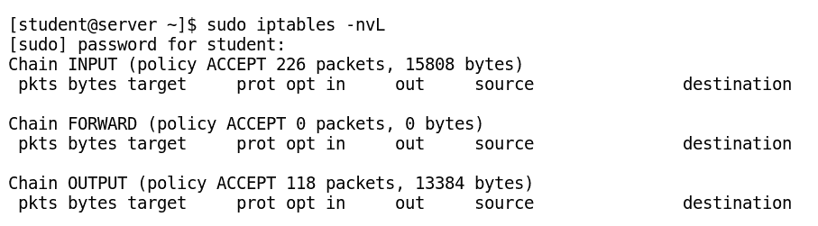

# 第四章：用户和组管理

Linux 是一个多用户操作系统，因此对用户管理有基本的了解是至关重要的。在本章中，您将学习如何添加、删除、修改和暂停用户账户，并授予它们执行基本任务的权限。您还将学习如何在 Linux 环境中应用密码策略。

本章将涵盖以下内容：

+   理解 CentOS 7 中不同类型的用户和组

+   以超级用户身份执行命令在 CentOS 7 中

+   创建、修改和删除本地用户账户

+   创建、修改和删除本地组账户

+   管理用户密码和密码过期策略

# 理解 CentOS 7 中的用户和组

管理不同类型的用户和组是系统管理的主要任务之一。通过将不同类型的用户和组账户作为基于角色的访问控制配置到系统中。根据用户的权限，我们可以限制用户访问各种系统资源。

# 定义用户

我们系统中运行的每个进程都由一个用户启动，并归该用户所有。运行进程访问不同文件和目录的权限由与该进程关联的用户决定。同样，系统中的每个文件都归某个用户所有，访问系统中不同文件和目录的权限也受到用户权限的限制。默认情况下，创建新文件的用户即为该文件的所有者。

在 Linux 系统中，通常有三种类型的用户账户：

+   根用户（管理员）

+   系统用户（由各种服务使用）

+   普通用户（执行日常操作的普通用户）

# 识别当前用户

由于 Linux 是一个多用户操作系统，我们可以有多个用户同时登录。下表列出了用于查找登录用户及与用户相关的其他信息的不同命令：

| **命令** | **描述** |
| --- | --- |
| `$ who` | 显示当前登录用户 |
| `$ w` | 显示当前登录用户的详细信息 |
| `$ whoami` | 显示当前用户 |
| `$ id` | 显示当前登录用户的信息（如用户 ID、主组、次组和 SELinux 上下文） |
| `$ id <用户名>` | 显示传递给 `id` 命令的用户名的相关信息 |

以下截图展示了 `id` 命令、`who` 命令和 `w` 命令使用的示例：


要查看与文件关联的用户，请使用长列表（`ls -l`）命令，该命令在第三列显示用户关联信息，如以下命令行所示：

```
$ ls -l /tmp
```

要查看与进程关联的用户，请使用带有 `u` 选项的 `ps` 命令。大多数时候，`ps` 命令也会与 `a` 选项一起使用，以显示与终端相关的所有进程，如以下命令所示：

```
$ ps -au
```

所有 Linux 用户都会分配一个唯一的整数，称为 **用户 ID** (**UID**)。Linux 系统使用特定的 UID 数字和范围来执行特定任务。

以下表格列出了不同的 UID 范围及其描述：

| **UID** | **描述** |
| --- | --- |
| UID 0 | 根用户总是分配 UID 为 0。 |
| UID 1-999 | UID 1-999 分配给系统用户账户。其中，UID 1-200 静态分配给系统进程，UID 201-999 保留给系统。UID 201-999 在 CentOS 7 中安装应用程序时会动态分配给该应用程序。 |
| UID 1000+ | 常规用户账户默认从 UID 1000 开始。 |

用户信息的映射，如 `username`、`UID`、`GID` 和用户的 `home` 目录，定义在一个纯文本文件 `/etc/passwd` 中。`/etc/passwd` 文件包含七个由冒号分隔的字段，如下所示：

```
username : password : UID : GID: Gecos : /home/dir : Default shell
```

以下表格描述了 `/etc/passwd` 文件的各个字段：

| **字段** | **描述** |
| --- | --- |
| `username` | 它是与 UID 关联的用户登录名，方便人类阅读（应为 1 到 32 个字符之间）。 |
| `password` | 在此字段中，密码最初以加密格式存储。现在，它们存储在 `/etc/shadow` 文件中。 |
| `UID` | 它是系统用来识别用户的 UID：UID 0：保留给 rootUID 1-200：保留给预定义的系统账户（静态）UID 201-999：保留给系统账户（动态）UID 1000+：保留给常规用户账户 |
| `GID` | 它是用户的主 GID，由系统用来将用户与其主组关联 |
| `Gecos` | 该字段是可选的，包含与用户相关的额外信息，如用户的全名、地址、联系方式等 |
| `/home/dir` | 该字段包含用户主目录的绝对路径 |
| `默认 shell` | 它是用户默认 shell 的绝对路径（该程序在用户登录系统时运行），提供用户的命令提示符 |

`/etc/passwd` 文件中最后两行的内容如下所示：


# 理解 Linux 中的组

Linux 使用组来组织系统中的用户。组是具有某些共享特征和访问控制的账户集合。像用户一样，组也有一个名称，该名称与一个称为 **组 ID** (**GID**) 的数字相关联，通常与 UID 相同。本地组信息存储在 `/etc/group` 文件中。与用户账户相关的组有两种类型：

+   **主组**：

    +   每个用户只有一个主组。

    +   它是用户所属的默认组。

    +   每个本地用户的主组由 `/etc/passwd` 文件第三字段中列出的组的 GID 编号定义。

    +   默认情况下，主组拥有用户创建的所有新文件。

    +   通常，新创建用户的主组将与用户同名。每个用户是其私人主组的唯一成员。

+   **补充组**：

    +   每个用户可以与 0 个或多个补充组相关联。

    +   每个本地用户的附加组条目在`/etc/group`文件的最后一个字段中定义。此文件包含一个以逗号分隔的用户列表，决定了用户所属组的组成员身份。

    +   补充组成员身份有助于实现对系统中文件和其他资源的访问权限、特权和安全考虑。`/etc/group`文件的各个字段如下：

```
groupname : password : GID : <comma separated list of users who belong to this group>
```

以下截图显示了`/etc/group`文件最后两行的内容：


# 在 CentOS 7 中以超级用户身份执行命令

每个操作系统都有一个账户来管理系统的资源。在 CentOS Linux 中，这个用户账户被称为**root**，通常称为**超级用户**。root 账户是 Linux/Unix 系统中权限最高的账户。此账户用于执行系统管理任务，如管理用户账户及其密码、管理软件包、修改系统文件和重启系统服务。以 root 用户身份工作时必须特别小心，因为它没有任何安全限制。如果 root 账户被破坏，另一个人将完全控制该系统。Linux 中的 root 账户相当于 Windows 中的本地管理员账户。

当以 root 用户身份登录时，shell 提示符会显示`#`符号，表示你正在作为系统中权限最高的用户工作。

在 Linux 中，有两个命令，`su`和`sudo`，用于暂时授予普通用户 root 访问权限。我们将逐一讨论这些命令。

# 使用`su`命令切换用户

**su**（即**switch user**或**substitute user**的缩写）命令用于切换到其他用户账户。如果`su`命令没有指定用户名作为参数，它会默认考虑 root 账户。该命令有两种调用方式，如下所示：

+   `$ su - <用户名>`：此方法启动一个新的**登录 shell**，并指定另一个用户名。它将设置 shell 环境，就像在系统中作为该用户进行正常登录一样。

+   `$ su <用户名>`：此方法启动一个**非登录 shell**，并指定用户名。它只会使用当前用户的环境设置启动新的 shell，而不会调用其他用户名的 shell 变量。

    如果没有指定任何用户名，`su –`将调用 root shell，并要求在提示符处输入 root 凭据，如以下截图所示：


# 使用`su`命令授予普通用户 root 访问权限的缺点

一旦用户通过`su`登录为 root 账户，他们可以在不再询问 root 密码的情况下，做任何事情，直到注销为止。该命令的日志功能也有限。

# 使用`sudo`以根用户身份运行命令

在前面的方法中，标准用户通过`su`命令临时成为 root；通过指定`root`密码授予 root 的所有权限。此方法不适用于以 root 身份运行某些程序，因为它给普通用户授予了无限的权限。使用`sudo`授予权限更安全，也是首选的方法。

`sudo`功能用于根据`/etc/sudoers`文件中的设置，分配更多有限的权限给用户账户。在这种方法中，`sudo`要求用户输入他们自己的密码进行身份验证，而不是他们试图访问的账户的密码。这种方法使他们能够委派系统管理任务，而不需要让他们接触 root 密码。我们还可以将用户的权限限制为一组特定的命令；也就是说，他们只能以 root 身份执行有限数量的指定命令。通过`sudo`执行的任何命令默认会被记录到`/var/log/secure`日志文件中。

要以 root 权限执行单个命令，输入`sudo <command>`。命令执行后，您将返回到普通的无权限用户。以下截图展示了使用`sudo`执行仅`iptables`命令的例子：



使用`sudo`执行的命令日志存储在`/var/log/secure`中，如下图所示：


下面的截图展示了通过在`/etc/sudoers`文件中进行必要的条目，来授予用户执行管理员命令的权限的示例：


在 CentOS 7 中，所有属于 wheel 组的成员都可以通过指定自己的密码，使用`sudo`以 root 身份运行任何命令。CentOS 7 中`/etc/sudoers`文件中并没有将其设置为默认规则。

# 创建、修改或删除本地用户账户

在 CentOS 7 中有多个命令可用于管理本地用户账户。本节仅介绍 CentOS 7 中用于管理本地用户账户的最常用命令。

# 使用`useradd`命令创建用户

`useradd`命令在没有选项的情况下运行时，会创建一个具有默认参数的用户账户。默认参数是从`/etc/login.defs`文件中读取的，包括有效的 UID、GID 号、默认的密码过期规则等。这些值仅在创建新用户时使用。`useradd`的语法如下：

```
$ useradd    <username>
```

`useradd --help`将显示可以与`useradd`命令一起使用的选项，以覆盖默认参数。

使用`useradd`命令创建用户帐户的示例，如下截图所示：


除了`useradd`，我们还可以使用`adduser`命令在 Linux 中创建本地用户帐户。您可以通过`man adduser`命令阅读有关`adduser`的更多信息。

# 使用`usermod`命令修改用户

`usermod`命令与各种选项一起使用，以修改现有的用户帐户参数。运行`usermod --help`命令将显示可以使用的各种选项。`usermod`的语法如下：

```
$ usermod    -<option>     <username>
```

以下表格列出了与`usermod`命令常用选项及其描述：

| **选项** | **描述** |
| --- | --- |
| `usermod -c "Comments" <username>` | 在 GECOS 字段中添加注释，例如用户的全名、地址、电话号码等。 |
| `usermod -g <gid> <username>` | 修改用户的主组。 |
| `usermod -G <groupname> <username>` | 修改用户的辅助组。 |
| `usermod -a -G <groupname> <user>` | 仅与`-G`选项一起使用。它将用户添加到指定的辅助组中，而不会将用户从其他组中移除。 |
| `usermod -s <shell> <username>` | 修改用户帐户的登录 shell。 |
| `usermod -L <username>` | 锁定用户帐户。 |
| `usermod -U <username>` | 解锁用户帐户。 |

使用`usermod`命令修改用户登录 shell 的示例，如下截图所示：


以下命令用于查看与用户相关联的`groups`：

```
$ groups <username>
$ groups sam
```

`usermod`命令可以用于在用户的现有辅助组中添加新的辅助组。以下命令将把新的辅助组 wheel 添加到用户`sam`的现有辅助组中，如下截图所示：


# 使用`userdel`命令删除用户帐户

`userdel`命令用于删除现有的用户帐户。`userdel`命令可以以两种方式使用，如下所述：

+   `userdel <username>`：这将从`/etc/passwd`文件中删除用户条目，但保留用户的主目录和邮件不变。这种删除用户帐户的方式不推荐使用。

+   `userdel -r <username>`：这将删除用户及其主目录以及用户的邮件箱。这样会从用户的主目录中删除由用户拥有的文件及其帐户。带有`-r`选项的`userdel`命令示例如下：


# 创建、修改或删除本地组帐户

组用于组织用户。一个组是具有共享权限的账户集合。然而，组必须在用户被添加到该组之前存在。CentOS 7 中有多个命令可以用于管理组账户。本节仅介绍在 CentOS 7 中管理本地组账户的最常用命令。

组成员控制由`/etc/group`文件管理。该文件列出了组及其成员。

# 使用`groupadd`创建附加组

`groupadd` 命令可以与多个选项一起使用，用于为用户账户创建附加组，或创建系统用户组。

下表列出了`groupadd`命令及其不同选项的描述：

| **命令** | **描述** |
| --- | --- |
| `groupadd <groupname>` | 从`/etc/login.defs`文件中给定的范围内的下一个可用 GID 创建用户私有组（GID 1000+）。 |
| `groupadd -g GID <groupname>` | 使用给定的 GID 创建用户私有组 |
| `groupadd -r <groupname>` | 使用默认系统组范围（1-999）中的 GID，或`/etc/login.defs`文件中给定的 GID 创建一个系统组。 |

以下截图展示了`groupadd`命令使用的示例：


# 使用`groupmod`命令修改现有组

`groupmod` 命令用于修改组属性，如组的 GID、组名等。下图中的示例展示了如何使用`groupmod`命令及`-n`选项来修改指定组的`groupname`：


`-g`选项用于为现有的`groupname`分配新的 GID，如下图所示：


# 使用`groupdel`命令删除组

`groupdel` 命令通常用于从系统中删除一个组，前提是该组不是任何现有用户的主组。以下命令行展示了如何使用`groupdel`命令从系统中删除名为`appusers`的组：

```
$ groupdel appusers
$ tail -2 /etc/group
```

# 管理用户密码和过期策略

本节介绍用于管理密码和密码过期参数的命令，这些命令适用于 CentOS 7 中的 shadow 密码文件。

# 使用`passwd`命令设置用户密码

`passwd` 命令用于设置用户的初始密码或修改用户现有密码。`passwd`命令的语法如下：

```
$ passwd    <username>
```

root 用户可以为任何用户设置密码，而无需知道其当前密码。对于普通用户，默认策略是使用至少八位字符的密码，并且密码不能是字典单词、用户名或以前的密码。以下截图展示了使用`passwd`命令更新用户密码的示例：


# 理解 shadow 密码文件

在 Linux 发展的早期，加密的密码存储在一个可读的文件中，`/etc/passwd`。在字典攻击对加密密码的攻击日益猖獗之前，这被认为是存储密码的安全机制。现在，为了加强 Linux 安全性，加密的密码（盐化密码哈希）存储在`/etc/shadow`文件中。此文件还包含密码老化策略参数。只有 root 权限的用户可以修改或读取此文件。我们可以通过执行以下命令查看此文件的最后一行： |

```
# tail -1 /etc/shadow
```

执行前述命令后，我们得到以下输出，其中显示了加密的密码、盐和各种密码老化参数： |

```
jack:$6$cKc/hj8V$JZPyiz6TMpz/YpPtSPdNARPd/gXxLqm3c0qHZinNmweXEpM/IMBYGiBYXZw7OuzLnr0YkFdZZifPvywkJYuqv0:17783:0:99999:7:::
```

在前述输出中，`/etc/shadow`文件的第二个字段是密码字段，包含以下三个信息，使用`$`符号分隔，存储在`/etc/shadow`文件中： |

+   `6`: 它表示用于加密密码的哈希算法。数字 1 表示 MD5 哈希，数字 5 表示 SHA-256 哈希，数字 6 表示 SHA-512 哈希算法。 |

+   `cKc/hj8V`: 它表示用于加密哈希的随机盐值。这个盐值与未加密的密码结合后加密生成密码哈希。使用盐可以防止两个或更多使用相同密码的用户在`/etc/shadow`文件中拥有相同的条目。 |

+   `JZPyiz6TMpz/YpPtSPdNARPd/gXxLqm3c0qHZinNmweXEpM/IMBYGiBYXZw7OuzLnr0YkFdZZifPvywkJYuqv0`: 它是加密的哈希值。 |

当用户在登录提示符下输入密码时，系统会查找`/etc/shadow`中的用户条目，然后将用户的盐与未加密的密码结合，并使用指定的哈希算法生成哈希值。如果密码匹配，用户将成功登录；否则，登录尝试失败。 |

# 理解密码老化参数 |

`chage`命令用于列出现有的密码老化策略或修改该策略。`/etc/shadow`文件包含九个由冒号分隔的字段，其中包括加密的密码和密码老化策略。以下是`/etc/shadow`文件中包含信息的格式： |

```
name : password : lastchange : minage : maxage : warning : inactive : expire : blank
```

下表列出了`/etc/shadow`文件字段及其描述： |

| **字段** | **描述** |
| --- | --- |
| 登录名 | 它是本地系统中的用户帐户登录名。 |
| 密码 | 它是加密的密码。如果该字段包含`!`符号，则表示密码已被锁定。 |
| 最后更改 | 它是最后一次密码更改的日期，以自`01.01.1970`以来的天数表示。 |
| 最小年龄 | 它是密码在更改之前必须保持的最小天数。`0`表示没有最小天数要求。 |
| 最大年龄 | 它是密码必须更改的最大天数。 |
| 警告期 | 这是密码过期前的天数，当此时用户将开始接收到更改密码的警告。此字段中的`0`表示不会给出警告。 |
| 不活跃 | 这是密码过期后账户仍然保持活跃的天数。在这个不活跃期间，用户仍然可以登录并更改密码。超过指定天数后，账户将被锁定并变为不活跃状态。 |
| 过期日期 | 这是账户过期日期，表示自`01.01.1970`以来的天数。 |
| 空白 | 为将来使用预留的空白字段。 |

默认情况下，密码设置为不自动过期。强制密码过期是强大安全策略的一部分。我们可以通过修改`/etc/login.defs`文件来更改默认的过期设置。我们还可以使用`chage`命令来更改密码过期策略。`chage`命令的语法如下所示：

```
$ chage    [option]    <username>
```

下面的截图展示了使用`chage`命令列出用户所有现有密码过期策略参数的例子：


下表列出了与`chage`命令一起使用的各种选项及其描述：

| **选项** | **描述** |
| --- | --- |
| `Chage -l <username>` | 列出用户当前的所有密码过期参数设置 |
| `Chage -d 0 <username>` | 强制用户在下次登录时更改密码 |
| `Chage -m 3 <username>` | 设置用户可以保留密码的最短天数 |
| `Chage -M 30 <username>` | 设置用户可以保留密码的最长天数（`-1`表示无限期） |
| `Chage -W 7 <username>` | 设置用户在密码更改前开始接收警告的天数 |
| `Chage -d YYY-MM-DD <username>` | 设置密码的最后更改日期（`/etc/shadow`文件记录自 1970 年 1 月 1 日起的天数） |
| `Chage -E YYYY-MM-DD <username>` | 设置用户的密码过期日期（`/etc/shadow`文件记录自 1970 年 1 月 1 日起的天数） |

下面的截图展示了使用`chage`命令修改各种参数的例子：


# 限制用户访问

一旦使用`chage`命令设置的账户过期日期到达，用户将无法与系统进行交互式登录。`chage`命令的一些参数可以通过`useradd`和`usermod`命令设置。可以使用`usermod`命令通过`-L`选项来锁定账户，如下所示：

```
# usermod -L jack
# su - jack
```

我们还可以使用`-U`选项来解锁用户账户，如下所示：

```
# usermod -U jack
```

# 假壳或 nologin shell

有时，我们可能需要一个带有密码的用户帐户来进行系统身份验证，但不需要为该用户名提供交互式 shell。这样有助于防止该用户帐户使用密码登录系统。在这种情况下，我们可以将用户的 shell 设置为`/sbin/nologin`。如果用户尝试登录系统，`nologin` shell 将关闭用户的连接，如下图所示：


这样的情况示例可能是邮件服务器，在这种情况下，需要一个用户帐户来存储邮件和密码，以便用户可以通过邮件客户端进行身份验证并接收邮件；然而，如果分配了`/sbin/nologin` shell，则该用户无法使用该帐户登录系统。

# 总结

本章开始时，我们学习了 CentOS 7 中不同类型的用户和组。接着，我们了解了 `su` 和 `sudo` 之间的区别，它们可以临时授予用户 root 权限。然后，我们学习了如何管理本地用户帐户和本地用户组。最后，我们查看了密码如何在 Linux 中设置和存储，以及 CentOS 7 中密码过期策略的实现方式。

在下一章，我们将学习如何在 CentOS 7 中管理文件权限。
