# 管理文件权限

权限是 Linux 在正确应用时增强安全性的几个优点之一。由于 Linux 是一个多用户操作系统，不同的用户将同时处理多个程序和文件等。权限有助于保持安全和组织。在本章中，您将学习如何使用基本的读取、写入和执行权限以及用户或组所有权来管理文件的访问控制。您还将学习如何应用特殊权限和**访问控制列表**（**ACL**）。

在本章中，我们将讨论以下主题：

+   理解 Linux 文件系统权限

+   管理文件权限

+   管理文件所有权

+   特殊权限

+   管理默认权限

+   管理文件上的 ACL

# 理解 Linux 文件系统权限

在基于 Linux/Unix 的操作系统中，每个文件都属于一个用户和一个组。默认情况下，创建文件的用户是该文件的所有者，文件属于该用户的主组。通过 Linux 文件系统访问文件的权限由应用于该文件的权限控制。这些权限针对文件的所有者（也称为**用户**）、该文件的组（也称为**组所有者**）以及系统中的其他所有人（也称为**其他人**）进行分类。

有三种标准权限类型应用于文件：

+   读取，由字母`r`表示

+   写入，由字母`w`表示

+   执行，由字母`x`表示

这些通常以三元组（如`rwx`或`r-w`）的形式分组，用于表示一类权限。每个文件有三类权限；也就是说，这些权限影响系统中的三个类别的访问：

+   **用户/所有者（u）**：描述适用于文件所有者的权限。默认情况下，创建文件的用户即为所有者。

+   **组（g）**：描述适用于拥有文件的组的权限。

+   **其他人/所有人（o）**：描述系统中其他所有人的权限。

# 权限对文件和目录的影响

权限控制对文件和目录的访问。相同的权限对文件和目录有不同的影响。

下面是列出权限及其对文件和目录的相应影响的表格：

| **权限** | **对文件的影响** | **对目录的影响** |
| --- | --- | --- |
| 读取（`r`） | 可以读取文件内容 | 可以使用`ls`命令列出目录内容 |
| 写入（`w`） | 可以修改文件内容 | 我们可以创建或删除文件并修改文件或目录的权限 |
| 执行（`x`） | 我们可以将文件作为命令执行 | 可以访问目录内容（我们可以在该目录上使用`cd`命令） |

如果用户对某个目录具有读取权限，意味着他们可以仅通过`ls`命令列出目录中的文件名。如果用户仅对某个目录具有执行权限，则不能使用`ls`命令列出目录的内容；然而，如果用户知道该目录的内容，他们可以通过明确访问文件名来访问目录内容。

任何用户只要对文件所在目录具有写权限，就可以删除该文件或子目录，而与文件本身的所有权或权限无关。Root 用户拥有完全的权限控制；它可以访问或删除文件系统中的任何文件。然而，存在一些高级权限，如`chattr`和**安全增强 Linux**（**SELinux**）控制，这些可以用于为 Root 创建访问控制。SELinux 是一种强制访问控制，相关内容在第九章中讨论，*概述和必要的高级实用工具*。

# 查看应用的权限和所有权

使用`ls`命令加上`-l`选项可以获取目录内容的详细信息，包括权限和所有权。它将列出目录中所有文件的详细信息。为了防止进入子目录并查看目录本身的信息，可以在`ls`命令中使用`-d`选项，如下图所示：

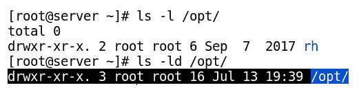

长格式列出命令的第一个字符告诉我们文件的类型。这里的连字符（`-`）表示一个普通文件，它可以包含数据或文本，或者是一个二进制文件。下表列出了各种文件类型及其在长格式列表中作为第一个字符的标识符。

下面是列出文件类型及其描述的表格：

| **类型** | **描述** |
| --- | --- |
| `-` | 文件 |
| `d` | 目录 |
| `l` | 链接（符号链接，类似于 Windows 上的快捷方式） |
| `c` | 字符设备文件 |
| `b` | 块设备文件 |
| `s` | 套接字类型文件 |
| `p` | 命名管道 |

# 管理文件权限

`chmod`命令用于修改文件的权限。**更改模式**（**chmod**）权限也称为文件的**模式**。使用`chmod`，我们可以分别修改系统中所有者、组和其他用户的权限。我们可以通过两种方式使用`chmod`来修改权限：一种是使用数字，另一种是使用符号表示法。

# 使用符号修改文件权限（chmod）

`chmod`命令用于更改文件或目录的权限或模式。它将新的权限集作为第一个参数，后跟文件和目录的列表，应用这些新权限。符号方法的语法如下：

```
$ chmod     whowhatwhich    file   |   directory
```

下面是列出与`chmod`一起使用的关键字及其描述的表格：

| **关键字** | **描述** |
| --- | --- |
| 谁 | 它表示您想要更改权限的人：`u`：用户权限`g`：组权限`o`：其他权限`a`：所有用户权限如果在此字段中未指定任何内容，则采用（`a`）作为默认值。 |
| 什么 | 它表示您想要对权限执行的操作：`+`：在现有权限集中添加一些权限`-`：从现有权限集中删除一些权限`=`：精确设置指定的权限，不考虑现有权限集 |
| 哪一个 | 它表示您正在使用哪些权限：`r`：读`w`：写`x`：执行 |

以下是一些示例，说明使用`chmod`命令的用法，使用符号：

列出名为`myfile`的文件的现有权限，如下屏幕截图所示：

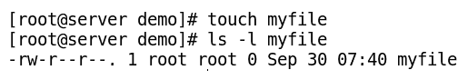

为名为`myfile`的文件添加用户执行权限，如下屏幕截图所示：

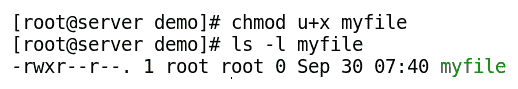

从组中删除写权限，并为名为`myfile`的文件添加其他用户执行权限，如下屏幕截图所示：

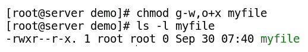

精确设置读权限，并从所有名为`myfile`的文件中删除任何现有权限，如下屏幕截图所示：

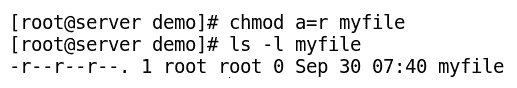

精确设置并从名为`myfile`的文件中删除所有其他人的现有权限，如下屏幕截图所示：

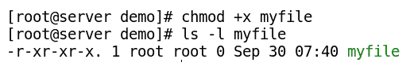

# 使用数字管理`chmod`命令的文件权限

`chmod`命令也可用于修改文件或目录的权限，使用数字方法。此方法使用`chmod`命令精确设置指定的新权限，不考虑文件或目录的现有权限。在数字方法中，权限用三位八进制数（或设置特殊权限时为四位数）表示。每个八进制数表示一个访问级别（用户、组或其他）的权限总和，数字介于零到七之间。使用数字应用权限的语法如下所示：

```
$ chmod     ###     file   |    directory
```

这里，每个`#`表示用户、组和其他访问级别的权限，从左到右。它是该访问级别所有权限（读、写和执行）的总和，每个权限具有特定的数字权重，如下所示：

这是一个列出权限数字权重的表格：

| **权限** | **数字权重** |
| --- | --- |
| 读（`r`） | 4 |
| 写（`w`） | 2 |
| 执行（`x`） | 1 |

使用数字方法设置权限时，我们计算我们需要为用户、组或其他人分配的所有权限的总和；例如，如果您希望为`file1`使用`set-rwx-r-xr--`作为新的权限，则执行以下操作：

*user → rwx → 4+2+1=7*

*group → r-x → 4+1=5*

*others → r- - → 4=4*

以下是`chmod`命令的示例，展示了如何使用数字设置权限以及使用符号设置相同权限的`chmod`用法：

```
$ chmod 754 file1 
$ chmod u=rwx,g=rx,o=r file1 
```

以下是一些示例，说明如何使用数字设置`chmod`命令的权限：

为名为`file1`的文件设置用户的读权限、组的写权限，并为其他用户设置无权限，如下截图所示：

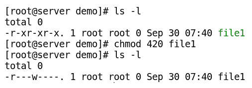

使用带有`-R`选项的`chmod`命令可以递归地设置目录中所有文件和子目录的权限。使用`X`选项，你可以为目录（而非文件）添加或移除执行权限。虽然这个选项不常用，但在某些情况下很有用；你可以使用`chmod -R +rX /data`为`/data`文件夹中的目录设置执行权限，但不会影响其中的文件。

# 管理文件所有权

在 Linux 系统上创建的每个文件或目录都属于一个用户和一个组，这些都被称为文件的所有者或文件的组所有者。文件或目录的所有权可以由根用户或文件所有者修改。而组所有权只能由根用户或文件所有者修改，且只对该所有者所属的组有效。本节将介绍如何管理文件和目录的所有权。

# 理解默认的文件所有权

当我们创建文件或目录时，它会获得某些默认的所有权和组所有权。创建文件的用户成为该文件的用户（所有者），该用户的主组成为该文件的组。要确定用户或组是否有权限访问文件或目录，shell 会按以下顺序检查文件的所有权：

1.  访问文件时，shell 会检查你是否是文件的所有者。如果用户是文件的所有者，那么该用户将根据为文件所有者设置的权限访问该文件。

1.  如果用户不是文件的所有者，shell 会检查文件所属的组。如果用户是该组的成员，那么他将根据该组的权限访问文件。

1.  如果用户既不是文件的所有者，也不属于文件所属的组，则该用户将根据其他权限访问该文件。

使用长列表命令`ls -l`可以查看文件当前的所有权。该命令输出的第三和第四列显示文件的所有者和所属组，如下图所示：

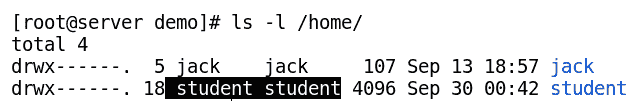

# 使用`chown`修改用户所有权

`chown`命令可用于更改文件或目录的用户所有权以及组所有权。首先，我们将看到如何使用`chown`命令更改文件所有权。`chown`命令的语法如下：

```
$ chown    <user_name_to_set_as_owner>    <file_or_foldername>
```

以下是一些示例，说明了 `chown` 命令的使用：

使用 `ls` 命令列出名为 `myfile` 的文件的当前所有权，如下所示：

```
$ ls -l myfile
```

将名为 `myfile` 的文件的用户所有权授予 `jack`，如下所示的截图所示：

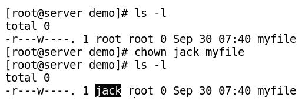

`chown` 命令常常与 `-R` 选项一起使用，用于递归修改整个目录树的所有权。以下命令用于将名为 `mydir` 的目录及其中的所有文件和子目录的所有权授予用户 `jack`，如下所示的截图所示：

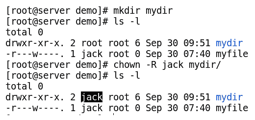

# 使用 `chown` 修改组所有权

`chown` 命令也可以通过在组名之前加上冒号（`:`）或句点（`.`）符号来修改文件或目录的组所有权，如下所示的命令所示：

```
$ chown :group <filename_or_directoryname>
```

以下截图显示了使用 `chown` 命令将 `myfile` 的组更改为 `jack` 的过程：

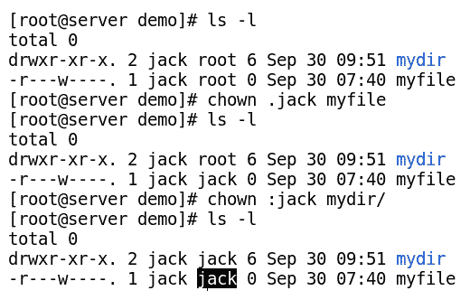

# 使用 `chown` 修改用户和组的所有权

`chown` 命令还可以通过以下任一语法同时修改文件的所有者和组：

```
$ chown    owner:group    <filename_or_dirname>
$ chown    owner.group    <filename_or_dirname>
```

`chown` 命令可用于将名为 `myfile` 的文件的所有者更改为 root，并将该文件的组更改为 wheel，如下所示的截图所示：

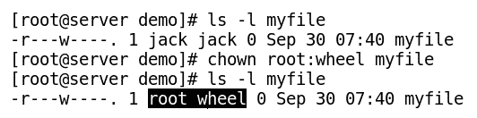

# 使用 `chgrp` 修改组所有权

`chgrp` 命令也用于修改文件或目录的组。与前面的命令 `chown` 不同，`chgrp` 只能修改组所有者，不能修改用户所有者和组所有者。此命令的语法如下：

```
$ chgrp    <new_groupname>    <filename_dirname>
```

`chgrp` 命令可用于将 `myfile` 文件的组更改为 `jack` 组，如下所示的截图所示：

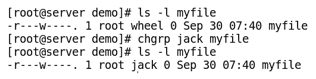

# 特殊权限

除了默认适用的基本权限集外，Linux 还拥有一些特殊/高级权限集，偶尔用于增强某些功能。这些权限适用于文件（主要是可执行文件）和目录。包括 `setuid`、`setgid` 和粘滞位（sticky bit）。

# 修改文件的特殊权限

`Setuid` 和 `setgid` 是应用于可执行文件的两种特殊权限。

如果 `setuid` 应用于一个可执行文件，这意味着如果该文件作为程序执行，它将以文件的用户身份运行，而不是以运行程序的用户身份运行。

同样，当 `setgid` 应用于文件时，文件将以文件的组身份运行，而不是以运行程序的组身份运行。

`passwd` 命令在 Linux 系统中默认应用 `setuid`，如下所示的截图所示：

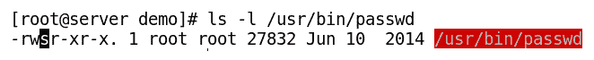

`chmod` 命令可用于向名为 `myscript` 的脚本文件添加 `setuid`，如下所示的命令行所示：

```
$ ls -l myscript
$ chmod u+s myscript

or

$ chmod 4755 myscript
$ ls -l myscript
```

可以使用`chmod`命令为名为`myscript`的脚本文件添加`setgid`权限，如下所示的命令行所示：

```
$ ls -l myscript
$ chmod g+s myscript

or

$ chmod 2755 myscript
$ ls -l myscript
```

# 修改特殊权限，适用于目录

`sticky bit`和`setgid`是应用于特殊目录的特殊权限。

# 使用粘滞位

`sticky bit`特殊权限用于对文件删除进行限制。当在目录上设置粘滞位时，只有文件的所有者和根用户可以删除该目录中的文件，例如：

在 Linux 系统中，`/tmp`文件夹默认应用了粘滞位，如下图所示：

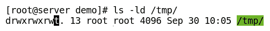

以下示例演示了如何使用`chmod`命令为目录添加粘滞位（sticky bit）权限：

```
$ ls -ld mydir
$ chmod o+t mydir

or

$ chmod 1775 mydir
$ ls -ld mydir
```

# 使用 setgid

`setgid`特殊权限用于启用从父目录继承组权限。当在目录上设置`setgid`时，在该目录中创建的文件将从父目录继承组权限，而不是从创建文件的用户继承。它通常用于协作（共享）目录，以自动将文件的组从默认的用户私有组更改为共享组。

以下命令行用于查看目录的现有权限：

```
$ ls -ld mydir
```

以下示例演示了如何使用`chmod`命令为目录添加`setgid`权限：

```
$ chmod g+s mydir
or
$ chmod 2770 mydir
$ ls -ld mydir
```

下面是列出特殊权限及其对文件和目录影响的表格：

| **特殊权限** | **第四位数字权重** | **对文件的影响** | **对目录的影响** |
| --- | --- | --- | --- |
| `setuid` `(u+s)` | Setuid = 4 | 文件以拥有该文件的用户身份执行，而不是运行该文件的用户身份 | 无效 |
| `setgid` `(g+s)` | Setgid = 2 | 文件作为拥有该文件的组来执行 | 启用组继承。在该目录中创建的文件将继承该目录的组所有者 |
| `sticky bit (o+t)` | 粘滞位 = 1 | 无效 | 只有根用户或文件所有者可以删除带有粘滞位的目录中的文件 |

在设置这些特殊权限时需要格外小心，因为错误设置（使用）`setuid`和`setgid`在二进制文件上可能导致权限提升。这种情况可以帮助攻击者通过普通用户账户获取根账户的访问权限。

# 管理默认权限

文件从创建它们的用户或进程中获取默认权限。如果文件是使用文本编辑器创建的，则它将对所有人具有读写权限，但没有可执行权限。同样，通过编译器创建的二进制可执行文件通常具有可执行权限集，因为它们是为了执行而创建的。

# 理解 umask

默认的文件和文件夹权限由`umask`程序设置。没有任何参数的`umask`命令会显示当前的`umask`值。加上新的八进制值作为参数，`umask`命令会设置新的值。以下命令行用于查看用户的现有`umask`值：

```
$ umask
```

普通用户和 root 用户的`umask`值不同，这决定了文件和目录的默认权限。以下示例说明了系统中普通用户和 root 用户的不同`umask`值：

+   在终端中以 root 用户执行`umask`命令，查看 root 账户的`umask`值，如下图所示：

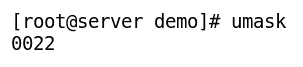

+   要查看`student`用户的`umask`值，首先切换到`student`用户账户，然后执行`umask`命令，如下图所示：

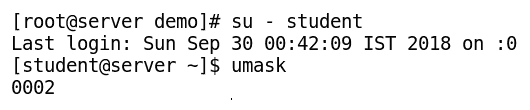

对于文件，最大默认值通常是`666`（普通文件默认不需要设置执行权限），对于目录，最大默认值是`777`（因为目录需要执行权限来使用`cd`命令）。`umask`值是从最大默认八进制值中减去的，用来决定文件和目录的默认权限。

例如，让我们理解一下`umask`值`0022`，它是 root 账户的默认值。这意味着从文件和目录的最大权限中去除组和其他用户的写权限。因此，文件的默认权限将是`644`，目录的默认权限将是`755`。类似地，`umask`值`0002`，这是普通用户账户的默认值，意味着从文件和目录的最大权限中去除其他用户的写权限。因此，文件的默认权限将是`664`，目录的默认权限将是`775`。

当为用户设置新的`umask`值时，如果`umask`命令的参数少于三位八进制数字，则参数部分会自动补充零。

# 管理文件上的 ACL

标准的 Linux 文件权限适用于文件所有者、文件所属组或系统中的其他所有人。使用标准权限时，我们不能为单个文件设置多个用户或多个组的不同权限。这种精细的控制可以通过 Linux 中的 ACL 来实现。我们可以为同一个文件设置多个用户或多个组的权限。

文件所有者或 root 可以对单个文件或目录设置 ACL，前提是文件系统启用了 ACL 支持。CentOS 7 的默认文件系统是`XFS`，它内置了 ACL 支持。虽然并非所有应用程序（如`tar`）都支持 ACL，但它仍然是 Linux 系统中的一个强大功能。

# 查看 ACL 权限

使用`ls -l`命令，我们可以查看标准权限，并判断文件或目录是否应用了 ACL。如果权限的第十个字符是`+`符号，则表示该文件或目录应用了 ACL。

如果文件上存在加号（`+`）符号，则表示用户权限代表用户的 ACL 设置，组权限代表 ACL 掩码（而不是组所有者设置），其他权限则为其他 ACL 设置。以下截图显示了如何检查文件是否应用了 ACL 权限：

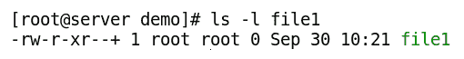

如果文件应用了 ACL，则使用 `chmod` 修改其组权限会改变 ACL 掩码，而不是组所有者权限。

# 使用 getfacl

要查看文件或目录上的 ACL，可以使用`getfacl`命令。其语法如下图所示：

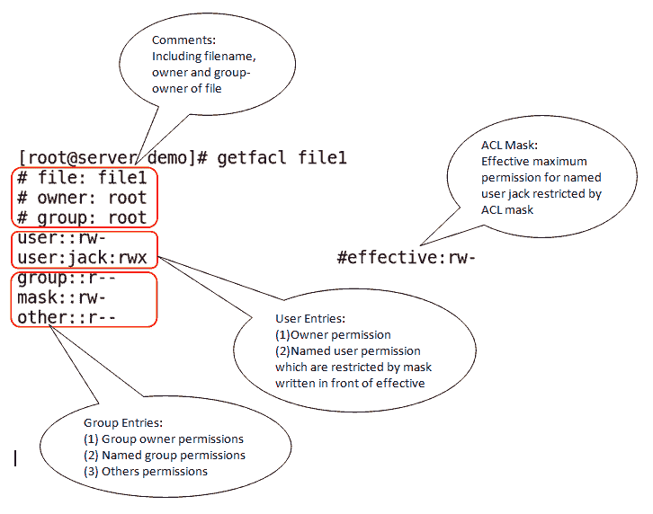

`getfacl`命令也可以用于将应用于文件或目录的 ACL 导出到文件中，如以下命令行所示：

```
$ getfacl -R /data > file.acl
```

可以通过从文件导出 ACL 并使用`setfacl`命令应用，如以下命令行所示：

```
$ setfacl --set-file=file.acl
```

# ACL 掩码

ACL 掩码用于设置文件的组所有者、命名用户和命名组的最大有效权限。所有者或其他用户的最大权限是通过`chmod`设置的，而不是由 ACL 掩码控制。

使用`setfacl`命令可以在文件上设置 ACL 掩码，如下所示：

```
$ setfacl   -m    m::r    filename
```

使用`getfacl`命令可以查看 ACL 掩码，如下所示：

```
$ getfacl     filename
```

`getfacl`命令会在被掩码限制的条目前显示字符串`#effective:`。每当使用`chmod`更新组权限时，它会自动更新。

下表列出了 Linux 系统中的用户类型及其相应的 ACL 优先级：

| **用户类型** | **ACL 优先级** |
| --- | --- |
| 所有者用户 | 应用 ACL 权限 |
| 命名用户 | 应用 ACL 权限（应等于或小于 ACL 掩码） |
| 组 | 应用 ACL 权限（应等于或小于 ACL 掩码） |
| 命名组 | 应用 ACL 权限（应等于或小于 ACL 掩码） |
| 其他人 | 应用 ACL 权限 |

# 修改 ACL 权限

ACL 使用与 `chmod` 相同的标准文件系统权限表示。

下表列出了符号及其在 ACL 中对应的权限表示：

| **符号** | **权限** |
| --- | --- |
| `r` | 读取 |
| `w` | 写入 |
| `x` | 执行 |
| `-` | 该权限不存在 |
| `X` | 表示执行权限应设置在目录上，而不是常规文件上 |

# 使用 setfacl

`setfacl`命令与`-m`选项一起使用，用于修改或添加新的 ACL 到文件或目录。例如，可以使用`chmod`或`setfacl`来设置文件所有者权限。如果在`setfacl`的用户部分未指定命名用户，则该权限应用于文件所有者，如以下命令所示：

```
$ ls -l file1
$ setfacl -m u::rwx file1
```

使用用户名或 UID 在文件上设置命名用户 ACL，如以下命令所示：

```
$ setfacl -m u:jack:rwx file1
```

如果在 ACL 中未指定命名组，则该 ACL 适用于组所有者，如以下命令所示：

```
$ setfacl -m g::rw file1
```

我们可以使用组名或 GID 修改或添加命名组 ACL，如以下命令所示：

```
$ setfacl -m g:sam:rw  file1
```

我们可以使用`getfacl`命令的输出，并将其作为输入传递给`setfacl`命令来设置 ACL。在以下示例中，`--set-file`选项使`setfacl`命令能够从文件或`stdin`（`-`）读取输入，如以下命令所示：

```
$ getfacl file1 | setfacl  --set-file=- file2
```

我们可以使用`-R`选项递归地设置目录的 ACL。`X`选项通常与递归一起使用，以便目录将获得可执行权限，这样在递归设置 ACL 权限时，能避免意外地给文件添加可执行权限：

```
$ setfacl -R -m u:jack:rX dir1
```

我们可以在目录上设置默认 ACL，以便对所有新文件和子目录启用 ACL 继承，使用`-d`选项或在`setfacl`命令前加上`d:`，如以下命令所示：

```
$ setfacl -m d:u:jack:rwX directory
```

要删除默认 ACL，请使用`-x`选项并加上`d:`，如以下命令所示：

```
$ setfacl -x d:u:jack:rwX directory
```

# 删除 ACL

`setfacl`命令也可以与`-x`选项一起使用，删除任何用户或组应用的 ACL。与设置 ACL 时的不同之处在于，我们在删除时不指定权限。以下示例演示了如何使用`setfacl`命令删除文件`file1`上应用于用户 jack 和组 sam 的 ACL：

```
$ setfacl -x  u:jack,g:sam  file1
```

要从文件或目录中删除所有 ACL，可以使用`-b`选项，如以下命令所示：

```
$ setfacl -b file1
```

# 总结

本章我们首先学习了 Linux 系统中不同类型的权限以及如何使用数字和符号管理它们。接着我们学习了如何使用`chown`和`chgrp`命令管理文件所有权。然后我们了解了可执行文件和目录的特殊权限。之后我们学习了如何管理默认权限。最后，我们探讨了如何在 CentOS 7 上查看、设置和删除文件及目录的 ACL。

在下一章中，我们将学习 CentOS 7 中的进程管理。进程管理是管理系统资源所必需的基本技能，它将为优化系统性能奠定坚实的基础。
