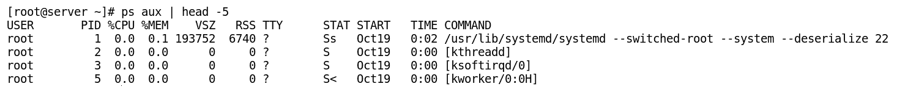
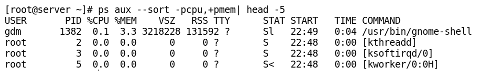

# 第六章：进程管理

进程在运行系统中访问多个资源。进程管理对于有效管理这些资源并保持系统平稳运行至关重要。在本章中，你将学习如何查看在 Linux 系统上运行的进程，以及如何通过命令行进行交互式管理。然后，你将学习如何使用命令行控制在 Linux 系统上运行的不同程序。你还将学习如何使用信号与不同的进程进行通信，以及如何在运行系统中修改它们的优先级。

在本章中，我们将涵盖以下主题：

+   理解进程

+   查看当前进程

+   使用信号与进程进行通信

+   监控进程和负载平均值

+   使用 nice 和 renice 管理进程的优先级

+   在命令行中控制作业

# 理解进程

本节介绍与进程相关的各种概念，如进程的类型、状态、属性等。进程管理是所有类型的 Linux 系统用户应掌握的重要技能。

# 定义进程

进程是程序执行的实例。它不同于程序或命令，因为单个程序可以同时启动多个进程。每个进程使用多个资源，如下所列：

+   内存中的地址空间

+   每个进程都有一些安全属性，如所有权、权限等。

+   每个进程都有一个状态

+   每个进程都有本地和全局环境变量

+   每个进程都有一个调度上下文

+   每个进程都有分配的资源，如文件描述符、网络端口等。

+   内核通过为每个进程分配一个独特的**进程 ID**（**PID**）编号来跟踪每个进程。

+   用户的程序通过一个名为 `/proc/PID` 的目录访问每个进程的信息，该目录由内核维护。

# Linux 系统上的进程创建

CentOS 7 上的所有进程都是第一个系统进程的后代，该进程被称为**systemd**。一个现有进程（父进程）通过 fork 系统调用复制自己的地址空间，创建一个新的进程（子进程）结构。每个新进程都会被分配一个独特的 PID，用于跟踪进程状态、CPU 使用率、内存使用率等特征。PID 通常在创建新进程时按升序分配。PID 1 被分配给 systemd 进程。PID 和**PPID**（即**父进程 ID**）是每个在 Linux 系统上运行的进程的属性。

PPID 是启动子进程的父进程的 PID。如果父进程死亡，该进程被称为**孤儿进程**。长期以来，孤儿进程由 `init`（PID=1）进程收养。然而，在现代内核中，`kthread`（PID=2）是孤儿子进程的收养进程。

**线程 ID**（**TID**）号与单线程进程的 PID 相同。对于多线程进程，所有线程共享相同的 PID，但每个线程有不同的 TID。

# 进程类型

根据任务的不同，进程有不同的类型。以下子节描述了一些 Linux 系统上常见的进程类型。

# 交互式进程

这种类型的进程由用户启动，可以通过命令行或图形用户界面启动，如 Bash shell、Firefox、`top` 命令等。

# 批处理进程

这种类型的进程通常在终端中调度运行，并在稍后的阶段断开与终端的连接。例如，`updatedb` 就是一个例子。

# 守护进程

这些进程在系统启动时自动启动，并持续运行，直到关机或在中途被手动停止。它们在后台不断等待用户或系统请求。按照惯例，大多数守护进程的名称以字母 `d` 结尾，如 `httpd`、`named`、`mysqld` 等。

# 线程

线程也被称为 **轻量级进程**（**LWPs**）。每个线程都有一个主进程，线程与主进程共享内存和其他资源。每个线程由内核调度并独立运行。线程可以随时结束，而不会终止整个进程，进程也可以随时创建新的线程。例如，当我们在 Firefox 浏览器中打开多个标签页时，浏览器会创建多个线程，每个线程独立运行。

# 内核线程

这些是由内核启动并使用的内核任务，用户对它们的控制非常有限，例如 `kthreadd`。

# 进程状态

Linux 是一个多任务操作系统，每个 CPU 核心在任何时刻执行一个进程。这个调度过程（不断地将进程从 CPU 上切换下来和分配 CPU 时间，依据优先级）是内核的关键功能之一。基于此，进程被分配一个状态，如运行、休眠、停止等，并且随着情况的变化而不断变化。

下表列出了 Linux 进程状态及其标志和描述：

| **进程状态名称** | **标志** | **内核定义名称** | **描述** |
| --- | --- | --- | --- |
| 运行中 | `R` | `TASK_RUNNING` | 在此状态下，进程要么正在 CPU 上执行，要么在队列中等待运行。这个状态也被称为 **可运行**，当进程准备好运行并在队列中等待时。 |
| 休眠中 | `S` | `TASK_INTERRUPTIBLE` | 在此状态下，进程正在等待某个事件完成。接收到信号时，进程将返回到运行状态。 |
| `D` | `TASK_UNINTERRUPTIBLE` | 在此状态下，进程不会响应信号。它仅在特定条件下使用，通常与 I/O 相关，当不希望中断时使用。 |
| `K` | `TASK_KILLABLE` | 在此状态下，进程处于休眠状态，并且只会响应 kill 信号以退出。 |
| 停止 | `T` | `TASK_STOPPED` | 该状态发生在进程被作业控制信号停止时。 |
| 僵尸 | `Z` | `EXIT_ZOMBIE` | 僵尸或死掉的进程状态是指进程已终止，但其条目没有被相应的父进程从进程表中移除。 |

# 查看当前进程

每个在 Linux 系统上运行的进程都有各种属性，如 PID、PPID、进程消耗的 CPU 时间、进程的物理和虚拟内存消耗等。所有这些信息都可以在操作系统的进程表中找到。当在多用户环境中工作时，可能会发生某个用户启动的进程过度消耗 CPU 周期。因此，管理进程和计算机资源的效率至关重要。为此，我们需要识别进程的类型并调整其优先级，甚至在必要时终止它们。本节描述了多种有助于查看进程及其属性的命令。

# 列出正在运行的进程

**ps**（即**进程状态**的缩写）用于列出进程表中当前的进程信息。它类似于 Windows 中的`tasklist`命令，用于在命令提示符下列出 Windows 正在运行的任务。

# ps 命令

Linux 版的`ps`命令支持三种格式，如下所示：

+   **Unix (POSIX)标准**：在此格式中，选项可以组合使用，并且前面带有连字符

+   **BSD 标准**：在此格式中，多个选项可以组合使用，但不以连字符符号为前缀

+   **GNU 标准**：在此格式中，使用长选项，且前面带有两个连字符符号

`ps`命令的各种用法在以下小节中进行了描述。

# 显示当前 shell 运行的进程

使用`ps`命令，如下所示的截图，列出当前 shell 运行的进程：


输出显示数据行，包含以下列：

| **命令** | **描述** |
| --- | --- |
| `PID` | 正在运行的进程的进程 ID |
| `TTY` | 进程运行的终端类型 |
| `TIME` | 进程及其启动的子进程所消耗的累积 CPU 时间 |
| `CMD` | 当前进程运行的命令 |

# 按用户显示所有进程

可以使用`ps`命令和`-u`选项通过用户过滤进程，如下所示的命令行：

```
$ ps -u student
```

# 以不同格式显示所有进程

`ps`命令可以以不同的格式显示系统中所有正在运行的进程，如下所示：

以 Unix 格式显示系统中所有正在运行的进程。

`ps`命令可以使用`-A`或`-e`选项显示系统中所有正在运行的进程，以简单的 Unix 格式，如下所示的命令行：

```
$ ps -A
or
$ ps -e
```

`ps`命令可以通过使用`-e`选项显示所有正在运行的进程，并使用`-f`选项显示每个进程的完整细节，以 Unix 格式显示，如下所示的命令行：

```
$ ps -ef
```

执行前述命令后的输出如下所示：


在前面的示例中，我们已将`ps`命令的输出限制为仅显示前五行，使用了`head`命令。在后续示例中，我们使用了相同的技巧来限制`ps`命令的输出以便进行演示。

输出显示带有以下列的数据行：

| **命令** | **描述** |
| --- | --- |
| `UID` | 执行命令的用户 ID |
| `PID` | 命令的进程 ID |
| `PPID` | 启动该命令的父进程 |
| `C` | 进程拥有的子进程数量 |
| `STIME` | 进程的启动时间 |
| `TTY` | 与进程关联的终端；如果进程没有附加到终端，你将看到一个问号`?` |
| `TIME` | 进程及其子进程消耗的累计 CPU 时间 |
| `CMD` | 启动该进程的命令 |
| 使用`-F`选项与`-e`选项一起使用（`$ ps -eF`）将列出更多的列： |
| `PSR` | 分配给进程的处理器编号 |
| `SZ` | 给定进程的物理页面总内存大小 |
| `RSS` | 常驻内存集大小，表示进程实际占用的物理内存大小 |

使用 BSD 语法显示系统中所有正在运行的进程。

`ps`命令可以与 aux 选项一起使用，以 BSD 语法显示所有运行的进程，如下所示的命令行。在这里，选项`a`列出所有附加到终端的进程，选项`u`列出进程的用户，选项`x`列出所有未与终端关联的进程：

```
$ ps aux
```

执行前述命令后的输出如下所示：



输出显示带有以下列的数据行：

| **命令** | **描述** |
| --- | --- |
| `USER` | 与该进程关联的用户名称 |
| `PID` | 分配给该进程的唯一数字进程 ID |
| `%CPU` | 进程使用的 CPU 百分比（进程运行的时间长度除以进程使用的总 CPU 时间） |
| `%MEM` | 进程使用的 RAM 内存百分比（使用的内存除以总可用内存） |
| `VSZ` | 表示虚拟内存大小，以 KiB 为单位 |
| `RSS` | 常驻内存集大小，表示进程实际占用的物理内存大小 |
| `TTY` | 控制该进程的终端；如果进程没有附加到终端，你将看到`?` |
| `STAT` | 显示以下进程状态：`R`：运行中`S`：可中断休眠`D`：不可中断休眠`T`：已停止`Z`：僵尸进程`<`：高优先级`N`：低优先级`L`：内存中有页面被锁定`s`：会话领导进程`l`：多线程`+`：前台进程 |
| `START` | 进程启动的日期或时间 |
| `TIME` | 进程及其启动的子进程所消耗的累计 CPU 时间 |
| `CMD` | 启动进程时使用的命令 |

# 基于不同参数排序进程

在本节中，我们将展示不同的示例，向您展示如何根据不同的参数使用`ps`命令对进程进行排序。每个示例的输出将在随后的截图中显示。

+   按 CPU 利用率升序排序进程：


+   按内存利用率升序排序进程：


+   通过单一命令结合 CPU 和内存利用率进行排序：



如果进程表中有僵尸进程条目，它将显示为退出或无效。

# 按用户显示进程

要按用户过滤进程，`-u`选项后跟用户名。可以提供多个用户名，用逗号分隔。以下示例使用`ps`命令仅列出由用户 Apache 启动的进程，如下图所示：


# 按进程名显示进程信息

要按进程名列出进程信息，使用`-C`选项，后跟准确的进程名，如下图所示：


# 按 PID 显示进程详情

使用 PID 显示进程信息时，使用`-p`选项，后跟进程的 PID，多个 PID 之间用逗号分隔，如下图所示：


# 以树形结构显示进程层次

要显示进程之间的父子关系，可以使用`--forest`选项，如下图所示：


# 显示父进程的子进程

要显示某个父进程的子进程，可以使用`--ppid`选项，后跟主进程的 PID。主父进程由 root 拥有，子进程由父进程分叉并由父进程拥有。以下示例展示了如何使用`ps`命令显示指定父进程 PID 的子进程：


# 显示进程的线程

要显示进程的线程，`-L`选项与`ps`命令一起使用，如下图所示：


输出显示了一行行数据，包含多个列，所有列都已在前面的示例中介绍，除了 `LWP` 列（表示 TID）和 **NLWP**（即 **Number of Lightweight Processes** 的缩写，表示进程中线程的数量）。

# 如果已知进程名称，则显示该进程的 pid

若要仅打印已知名称的进程的 PID，可以使用 `-C` 选项，后跟精确的进程名称，并使用 `-o` 选项，后跟 `pid=`，如下所示：


你可以从 `ps` 命令的手册页中查找 Unix 标准和 BSD 标准中所有标签的含义以及各种进程状态描述。

# 使用 `pstree` 命令

此命令用于以层次格式显示父子关系。此命令的输出与 `ps axjf` 命令和 `ps -ef --forest` 命令的输出非常相似，如以下命令行所示：

```
$ pstree
```

以下截图展示了使用 `pstree` 命令显示单个进程的 PID 树状层次结构：


执行给定命令行来显示用户进程的树状层次结构：

```
$ pstree -p student
```

执行前述命令时，分配给每个进程的 PID 将显示在每个进程名称后面的括号中。

# 查找正在运行的进程的 PID

很多时候，我们需要识别一个 PID 来管理它，例如，如果你需要停止某个进程的执行。有时，你可能需要改变进程的优先级。因此，最常用的方法是通过 PID 与进程进行通信。本节介绍了多种用于查找正在运行的进程 PID 的命令。

# 使用 `pgrep` 命令

`pgrep` 命令用于根据进程的名称和其他属性查找当前正在运行的进程，并显示匹配的进程 PID。其语法如下：

```
$ pgrep    [options]    pattern
```

以下是解释如何使用 `pgrep` 命令的示例：

要列出命令名为 `sshd` 的进程（该进程也由 root 所有），可以按如下命令行执行：

```
$ pgrep -u root sshd
```

要列出由用户 `root` 或 `daemon` 所拥有的进程，执行如下命令行：

```
$ pgrep -u root,daemon
```

`pgrep` 命令可用于通过指定包含进程名称的模式来列出进程。以下命令行将查找名为 Firefox 的进程的 PID：

```
$ pgrep firef
```

以下示例展示了如何使用 `pgrep` 命令列出用户 student 的所有进程：

```
$ pgrep -U student
```

# pidof

`pidof` 命令可用于查找正在运行的程序的进程 ID，如果提供给 `pidof` 命令的参数是精确的进程名称，如下所示：

```
$ pidof bash
$ pidof firefox
```

# 使用 `ps` 命令与 grep

实际上，很难记住 Linux 系统上正在运行的进程的准确名称。在无法记住进程精确名称的情况下，`pidof` 命令不会返回进程的 PID。此时，可以将 `ps` 命令的输出作为输入，使用 grep 过滤器查找所需的进程名称，命令行如下所示：

```
$ ps aux | grep <process_name>
$ ps aux | grep sshd
```

输出的第二列包含了被过滤进程的 PID。

# 与进程通过信号进行通信

进程通过信号进行相互通信。我们也可以使用 `kill`、`pkill` 或 `killall` 命令与进程进行通信，传递不同的信号。

# 定义信号及其类型

信号是一种软件中断，作用于进程。信号也可以看作是需要处理的特定事件的通知。`Kill`、`pkill` 和 `killall` 是用来将这些信号发送到进程的程序。在 Linux 系统中，所有的信号名称都以 SIG 开头。以下表格中描述的信号编号在不同的 Linux 硬件平台上可能会有所不同，但信号名称和含义始终保持一致。

以下表格列出了用于进程管理的常见信号及其描述：

| **信号**编号 | **信号**名称 | **含义** | **描述** |
| --- | --- | --- | --- |
| `1` | `SIGHUP` | 挂起 | 当控制终端挂起（用户离开时终端关闭）时发送。 |
| `2` | `SIGINT` | 键盘中断 | 用于通过键盘组合键 *Ctrl* + *C* 终止程序。 |
| `3` | `SIGQUIT` | 键盘退出 | 用于通过键盘组合键 *Ctrl* + *D* 终止程序。 |
| `9` | `SIGKILL` | 强制终止 | 强制、突然地终止程序。无法被阻塞、忽略或处理。 |
| `15`（默认） | `SIGTERM` | 优雅终止 | 优雅地终止程序。此信号可以被阻塞、忽略或处理。它是 `kill` 命令发送的默认信号。 |
| `18` | `SIGCONT` | 继续 | 告诉已停止的进程恢复运行。 |
| `19` | `SIGSTOP` | 停止 | 暂停一个进程。此信号无法被阻塞或处理。 |
| `20` | `SIGTSTP` | 键盘暂停 | 用于通过键盘组合键 *Ctrl* + *Z* 暂停进程。此信号可以被阻塞、忽略或处理。 |

`kill` 命令用于列出 Linux 系统支持的所有信号，如以下截图所示：


每个信号都有一个默认的动作，例如终止进程、停止进程、继续已停止的进程等。

# 向进程发送信号

向进程发送信号的方法有多种。最常见的一种是使用键盘中断，如 *Ctrl* + *C*、*Ctrl* + *D* 等。另一种方法是使用 `kill`、`killall` 和 `pkill` 命令。

# 使用 kill 命令按 PID 向进程发送信号

`kill`命令通过 PID 向进程发送信号。与其名称相反，`kill`命令可用于向进程发送任何信号。`kill`命令发送的默认信号是`SIGTERM`，例如信号编号`15`。`kill`命令的语法如下：

```
$ kill   -<signal_name_or_signal_number>    PID_OF_PROCESS
```

以下是一些示例，解释`kill`命令的用法：

+   要发送默认信号以优雅地终止进程，请使用以下命令：

```
$ kill PID
```

+   要使用信号名称终止进程，请使用以下命令：

```
$ kill -SIGTERM PID
```

+   要使用信号编号终止进程，请使用以下命令：

```
$ kill -15 PID
```

+   要强制终止进程，请使用以下命令之一：

```
$ kill -SIGKILL PID
or
$ kill -9 PID
```

这类似于我们在 Windows 的任务管理器中执行的操作，当我们右键点击任务管理器中的进程名并传递结束进程命令时：

+   `kill`命令可用于挂起/停止一个进程，并在其在前台运行时将其发送到后台。可以使用以下任一命令来实现：

```
$ kill -SIGTSTP  PID
or
$ kill -20 PID
```

+   如果进程已被停止，使用以下任一命令来恢复进程：

```
$ kill -SIGCONT PID
or
$ kill -18 PID
```

# 按名称向多个进程发送信号

我们还可以使用`killall`命令和`pkill`命令，通过进程名称向一个或多个进程发送信号，具体内容将在以下小节中讨论。

# killall

`killall`命令用于在匹配以下条件之一时，向一个或多个进程发送信号：

+   **命令**：匹配精确的进程名称

+   **所有者**：匹配进程所有者的精确名称

+   **所有系统**：系统范围的进程

其语法如下：

```
 $ killall    <process_name>
 $ killall   -<signal>    <process_name>
 $ killall   -<signal>   -u    <username>    <process_name>
```

# pkill

`pkill`命令还可以在匹配一组条件时，向多个进程发送信号，以下是一些示例：

+   使用带有命令模式的`pkill`：`pkill`命令可以向匹配的进程名称发送信号，如下所示：

```
$ pkill   <command_name_pattern>
 $ pkill   -<signal_name_or_signal_number>   <command_name_pattern>
```

下面的截图展示了使用单个`pkill`命令向多个`sleep`进程发送信号的示例：


+   使用带有 UID 的`pkill`命令：`pkill`命令可以通过指定 UID，将信号发送给由指定 Linux 用户帐户拥有的进程，具体语法如下：

```
$ pkill    -u     <username_or_uid>     <command_pattern>
```

+   使用带有 GID 的`pkill`命令：`pkill`命令可以通过指定 GID，将信号发送给由指定 Linux 组帐户拥有的进程，具体语法如下：

```
$ pkill    -g     <groupname_or_gid>    <command_pattern>
```

+   使用带有父 PID 的`pkill`命令：`pkill`命令可用于向指定父进程的所有子进程发送信号，具体语法如下：

```
$ pkill    -P   PPID    <command_pattern>
```

+   使用带有终端名称的`pkill`命令：`pkill`命令可以向从特定控制终端运行的进程发送信号，具体语法如下：

```
$ pkill   -t   <terminal_name>   -U   UID   <command_pattern>
```

# 监控进程和负载平均值

负载平均值是给定时间段内每个 CPU 的负载平均值。它考虑了以下因素：

+   积极运行的进程（包括将每个线程视为独立的、单独的任务）在 CPU 核心上运行。

+   可运行的进程，等待 CPU 变得可用。

+   睡眠中的进程，例如，等待某种资源（通常是磁盘 I/O 或网络 I/O）变得可用。

+   Linux 将每个物理 CPU 核心和微处理器超线程视为独立的执行单元，并将其称为独立的 CPU。每个 CPU 都有一个独立的请求队列。我们可以使用以下命令来计算系统 CPU 的总数：

    ```
    $ grep "model name" /proc/cpuinfo | wc -l
    ```

# 理解 Linux 中的负载平均值

进程的负载平均值可以通过使用`w`、`uptime`或`top`命令来查看，也可以在图形界面模式下通过 gnome-system-monitor 查看。这些命令通过结合所有 CPU 在过去 1、5 和 15 分钟内的负载平均值来显示负载。

# uptime

`uptime`命令告诉你系统已经运行了多长时间。不过，它同时还提供了其他有用的信息，例如当前登录的用户数以及过去 1、5 和 15 分钟内的系统负载平均值：


当我们有多个 CPU 时，负载平均值将根据前面的截图进行按 CPU 数量的划分。短时间内负载的增加并不成问题，但如果过去 5 分钟或 15 分钟的负载平均值持续上升，则可能需要关注。

# w

`w`命令用于显示当前登录到机器的用户及其正在运行的进程的信息。输出的第一行（标题）与我们在`uptime`命令输出中看到的相同。以下截图展示了`w`命令的一个示例：


输出显示了包含以下列的数据行：

| **命令**  | **描述** |
| --- | --- |
| `USER` | 用户登录名 |
| `TTY` | 控制终端类型，在 GUI 中显示为 pts/N（伪终端），或在系统控制台或其他直接连接的设备上显示为 ttyN |
| `FROM` | 用户登录的远程主机名 |
| `LOGIN@` | 用户的登录时间 |
| `IDLE` | 自用户在该终端上输入命令以来的空闲时间 |
| `JCPU` | 所有附加到 tty 的进程的 CPU 时间消耗，包括当前在后台运行的作业 |
| `PCPU` | 当前进程（在`WHAT`字段中列出）的 CPU 时间消耗 |
| `WHAT` | 当前执行进程的命令行 |

# 实时交互式进程监控

`ps`命令提供系统上正在运行的进程的静态快照。有时，也需要对系统进行实时监控。`top`命令用于执行系统的实时监控。

# top

`top` 程序提供一个每 2 秒更新一次的系统进程实时视图，直到按 *q* 停止执行。它显示多项信息，包括系统的运行时间、正在运行的任务列表、CPU 状态、内存状态摘要，并显示每个进程所消耗的不同资源。`top` 命令的执行方式如下：

```
$ top
```

执行前述命令时的输出如下面的截图所示：


输出显示了系统信息摘要，接下来是每个不同进程的信息，以行的形式排列，按 CPU 使用率从高到低排列在以下列中：

| **系统信息摘要** |
| --- |
| 1) 第一行显示系统已运行的时间、登录用户的数量以及负载平均值。 |
| 2) 第二行显示了进程总数，后面跟着正在运行、休眠、停止和僵尸进程的数量。 |
| 3) 第三行显示各种 CPU 使用参数： |
| `us` | CPU 时间中用于运行非优先用户进程的百分比 |
| `sy` | CPU 时间中用于运行内核进程的百分比 |
| `ni` | CPU 时间中用于运行用户优先进程的百分比 |
| `id` | 内核处理程序处于空闲状态时花费的 CPU 时间百分比 |
| `wa` | CPU 时间中用于等待 I/O 完成的百分比 |
| `hi` | CPU 时间中用于处理硬件中断的百分比 |
| `si` | CPU 时间中用于处理软件中断的百分比 |
| `st` | 抢占时间是虚拟机管理程序使用的 CPU 空闲时间的百分比 |
| 4) 第四行和第五行显示内存使用情况。第四行显示物理内存，第五行显示虚拟内存。 |
| 5) 第六行包含了按 CPU 使用率降序排列的进程信息列表的标题。它包含以下字段： |
| `PID` | 进程 ID 号。 |
| `USER` | 进程所有者的用户名。 |
| `PR` | 进程的系统优先级。 |
| `NI` | 进程的用户优先级值，也称为“优先值”。 |
| `VIRT` | 进程使用的总内存。虚拟内存是常驻内存、共享内存和交换内存的组合。 |
| `RES` | 进程使用的物理内存。 |
| `SHR` | 进程使用的共享内存。 |
| `S` | 显示进程状态代码（D、R、S、T、Z）。 |
| `%CPU` | 进程启动以来使用的 CPU 百分比。 |
| `%MEM` | 进程使用的内存百分比。 |
| `TIME+` | 执行时间。 |
| `COMMAND` | 启动进程时使用的命令名称。 |

`top` 命令类似于 Linux 中的命令行任务管理器。使用`top`，我们可以进行交互式监控并管理正在运行的进程。还有一些单键快捷键可以管理运行中进程的不同属性。

以下表格列出了用于管理`top`命令的各种键盘快捷键及其描述：

| **键盘快捷键**（在顶部） | **描述** |
| --- | --- |
| *t* | 切换显示汇总信息 |
| *m* | 切换显示内存信息 |
| *l* | 切换显示正常运行时间信息 |
| 1 | 切换显示所有 CPU 的汇总信息或单个 CPU 的汇总信息 |
| *H* | 切换在任务的汇总信息中显示线程 |
| *s* | 更改屏幕刷新率（以秒为单位） |
| *A* | 按最顶级资源消耗者排序进程列表 |
| *r* | 重设（修改优先级）一个选定进程，通过提供 PID 和 nice 值 |
| *k* | 向特定进程发送信号（默认信号是终止），通过提供 PID 和信号编号 |
| f | 打开`top`命令的配置界面 |
| M | 按内存使用量降序排序进程 |
| P | 按 CPU 利用率降序排序进程 |
| ? 或 h | 显示交互式键盘快捷键的帮助信息 |
| U | 筛选用户名显示 |
| *q* | 退出 |
| *Enter*, 空格键 | 立即刷新显示的信息 |

以下是一些示例，用于解释`top`命令的使用：

+   使用以下命令仅显示指定`pid`的进程状态：

```
$ top -p pid
```

+   使用以下命令指定连续屏幕刷新的延迟时间：

```
$ top -d 2
```

+   使用以下命令仅显示`top`命令在指定迭代次数下的输出：

```
$ top n <number>
```

你可以了解更多关于高级工具的信息，例如`htop`，它是一个进程监控工具，允许你垂直和水平滚动以查看更多的进程。

# 使用 nice 和 renice 管理进程的优先级

Linux 是一个多任务操作系统。在任何给定的时间，系统上都有多个进程在运行或等待队列中等待，但单个 CPU 实际上一次只能执行一个任务。如果进程队列过长，可能会导致一些更重要的进程花费更多时间在等待上，而不是执行。因此，为了解决这个问题，Linux 允许我们设置和修改进程的优先级。低优先级进程会获得更少的 CPU 时间，而高优先级进程则会获得更多的 CPU 时间。通过使用`nice`和`renice`命令，我们可以管理进程的优先级。

# 理解优先级

进程的优先级被称为它的**nice**值（或**友好度**）。它告诉你进程在 CPU 上的友好程度（使用的 CPU 周期数）。它的值从`-20`到`19`不等。较低的 nice 值代表较高优先级的进程，将占用更多的 CPU 周期，而较高的 nice 值代表低优先级的进程，可以等待更长时间且占用更少的 CPU 周期。因此，`-20`表示最高优先级，`19`表示最低优先级。新进程的默认值通常是`0`，它继承自父进程。

# 修改优先级

为 CPU 密集型进程分配低的 nice 值，即更高的优先级，会影响在同一 Linux 系统上运行的其他进程的性能。因此，只有 root 用户才被允许为进程分配更高的优先级，例如，为正在运行的进程设置负的 nice 值。

普通用户只能降低自己进程的优先级，即他们只能为给定进程设置一个比现有 nice 值更大的正值。

# 查看进程的优先级

在 CentOS 7 中，可以使用不同的命令来查看进程的优先级，如下所示：

+   使用 gnome-system-monitor 在图形界面模式下显示 nice 值。这是 CentOS 7 中的图形任务管理器。可以通过按下应用程序 | 系统工具 | 系统监视器来调用：


+   `top`命令也可以用来显示进程的优先级。它显示两列，分别为 `NI`（显示进程的 nice 值映射）和 `PR`（显示内核中优先级值的映射，表示更大的优先级队列）。

+   `ps`命令也可以通过使用`o`选项来显示`nice`级别，打印所选列，其中也包括 nice 字段，如下图所示：


如果在`ps`命令的输出中显示了负号（`-`），则意味着该进程正在以不同的调度策略运行，具有更高的优先级。

# 修改新进程的优先级（nice 值）

通常，当进程启动时，它会获得默认的优先级值 `0`。`nice` 命令用于以不同的优先级启动进程。其语法如下：

```
$ nice   -n   <NICELEVEL>   <command>
```

使用`nice`命令修改进程优先级的示例如下图所示：


root 用户可以设置 nice 值在（`-20` 到 `19`）之间，而非特权的普通用户只能设置 nice 值在（`0` 到 `19`）之间。

# 修改正在运行的进程优先级（renice）

`renice`命令用于修改已存在进程的 nice 值。其语法如下：

```
$ renice    -n    <NICELEVEL>   <PID’s>
```

在以下截图中，普通用户试图通过分配负值来提高进程优先级，因此他们收到了“权限拒绝”的提示，正如下面截图所示：


现在，当普通用户通过分配正值来降低进程优先级时，会立即生效，如下图所示：


除了`renice`命令外，`top`命令也可以用来修改正在运行的进程的 nice 值。使用以下步骤通过`top`命令修改进程优先级：

1.  调用`top`命令

1.  按下键盘上的 *r* 键，在 `top` 命令的当前交互会话中弹出设置新 nice 值的选项

1.  输入新的`nice`值和 PID，然后按*Enter*键

# 在命令行中控制作业

Linux 支持在前台和后台执行程序。这个特性允许你在单个 Shell 实例中运行多个程序。这个特性称为作业控制或作业管理。

# 了解与作业管理相关的不同术语

本节描述了与终端上的作业管理相关的各种术语。

# 作业管理及其关联的控制终端

作业是从终端窗口启动的命令。每个作业可以作为独立的后台程序运行，或作为附加程序从终端运行（这里也称为控制终端）。`ps`命令中的`TTY`字段用于显示与程序关联的控制终端名称。

一些程序，例如守护进程（系统服务），是由系统启动的，并且没有任何控制终端。因此，这些程序不被视为作业的一部分，不能在前台运行。此类程序在`ps aux`命令的`TTY`字段中显示为`?`。

当程序作为前台进程从终端启动时，终端无法用于其他任何操作，因为它正在执行该前台进程。例如，以下命令：

```
$ sleep 1000
```

执行前面的命令后，终端将无法响应任何其他程序，因为它正在前台控制`sleep`程序，持续时间为`1000`秒。

# 前台进程或作业

前台进程或作业是直接从 Shell 执行的进程（这里也称为**控制**终端）。只要该前台作业正在运行，其他进程必须等到它完成才能访问 Shell。

这种启动程序的方法是可以的，只要程序运行时间较短并且能够在短时间内完成。如果从 Shell 中以前台方式启动一个需要很长时间（比如需要几个小时完成）的程序，它将使该 Shell 在这段时间内无法使用。这种做法不适合用于命令执行。

前台进程在使用`ps`命令查看其详细信息时，会在其状态后添加`+`符号。加号`+`表示它处于前台进程组中。

在一个终端中启动`sleep`命令作为前台进程，如以下命令行所示：

```
$ sleep 1000
```

以下图像列出了所有进程，并使用`grep`命令对它们进行过滤，以显示命令名称中包含 sleep 的进程列表：


如果你想中断一个正在运行的前台程序，可以使用*Ctrl* + *C*（从键盘中断）。

# 后台进程或作业

对于需要较长时间完成的程序，将其作为后台进程（作业）启动是理想的做法。这可以释放 Shell，使其可用于其他任务。在程序作为后台作业运行时，我们可以在终端中执行其他命令。

默认情况下，所有程序都是作为前台任务从终端执行的。要从终端启动后台作业，只需在命令末尾添加一个“和”符号。例如，从终端启动`sleep`命令作为后台任务，如下图所示：


# 将前台进程挂起到后台

我们可以通过以下两个步骤将前台进程移至后台：

1.  首先，按下*Ctrl* + *Z*，将进程移到后台并使其进入 Stopped 状态

1.  第二，输入`bg`命令，将最后一个后台进程的状态从`Stoppedas`改为 Running，如下图所示：


# 管理后台作业

通过在命令末尾加上&符号，可以将程序启动为后台进程。启动后台程序时，会显示作业 ID（该会话唯一）和后台进程的 PID，如下图所示：


使用`jobs`命令显示与 Shell 相关的后台作业。`jobs`命令显示作业 ID、状态和命令名称。如果有多个后台作业，默认选择将会在前面加上`+`，如下图所示：


`fg`命令用于将后台作业通过其作业 ID 带到前台。作业 ID 和程序的`%`后面跟着方括号中的作业号，如下图所示：


通过首先使用*Ctrl* + *Z*在终端中挂起前台程序，然后将其发送到后台，如下图所示：


使用`jobs`命令并加上`-l`选项时，还会列出程序 ID。为了获得更多信息，我们可以使用`ps`命令并加上`j`选项，如下图所示：


使用`bg`命令并跟上`%`和作业 ID，可以将已停止的程序恢复到后台，如下图所示：


# 总结

在本章中，我们首先学习了什么是进程，以及在 Linux 系统中不同的进程状态和类型。接着，我们了解了 CentOS 7 中查看正在运行的进程的不同方法。随后，我们了解了进程之间如何相互通信，以及我们如何通过信号与进程进行通信。然后，我们学习了如何监控正在运行的进程，以及如何通过调整优先级值（nice 值）来管理它们的优先级。最后，我们了解了如何在命令行中管理`jobs`（命令），通过将一些应用程序在后台启动并将应用程序从后台切换到前台，反之亦然。

在下一章中，我们将学习 CentOS 7 中的网络概念和网络命令。我们还将学习如何通过网络执行安全的远程登录和备份。
