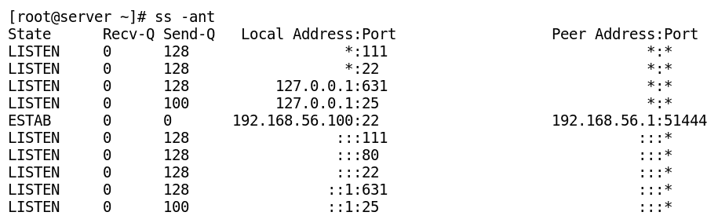
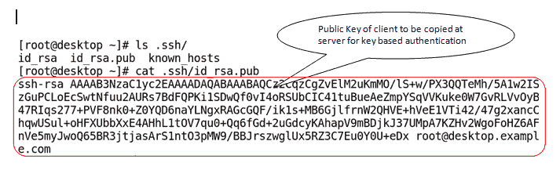

# 第七章：在 CentOS 中管理网络

独立系统通常没什么用处。网络使我们能够与其他网络设备和连接的计算机交换信息和共享资源。在本章中，您将学习从命令行管理网络连接所需的基本技能。然后，您将学习如何使用 **SSH**（即 **安全外壳**）访问远程系统，以及如何使用 **SCP**（即 **安全复制**）和 `rsync` 工具进行安全文件传输。

本章将涵盖以下内容：

+   Linux 网络概念

+   使用 Linux 网络命令

+   使用 nmcli 管理网络

+   编辑网络配置文件

+   配置主机名和 **DNS**（即 **域名系统**）解析

+   使用 SSH 访问远程登录

+   在 Linux 中传输文件

# Linux 网络概念

网络是由两台或更多计算机或计算设备组成的群体，通过任何通信媒介（如电缆或无线媒介）连接。这些设备可能位于相同的地理位置，也可能分布在全球各地。网络环境提供以下三项服务：

+   使连接的设备能够相互通信

+   使多个用户能够共享设备，如打印机、复印机、扫描仪等

+   使文件共享和信息管理在计算机之间进行

大多数组织使用两种类型的网络：一种用于与内部员工的通信，另一种用于与外部世界的通信。**内部网**是用于定义组织内部网络通信的术语，**互联网**用于外部通信。互联网也是世界上最大的网络，通常被称为“网络的网络”。

# Linux 网络中常用的术语

本节描述了用于定义计算设备和 Linux 中使用的网络术语的各种术语。

# IP 地址

每个连接到网络的设备必须具有至少一个唯一地址，用于标识该设备在网络中的位置。这个地址称为 IP 地址，并且它对于将数据包从源头路由到目标非常重要。网络上的信息或数据以数据包的形式传输。每个数据包附带一个头部，包含将数据包从源头路由到目标所需的信息。IP 地址方案有两种类型，分别为 IPv4 和 IPv6。

# IPv4

IPv4 是一种 32 位逻辑地址，用于计算设备通过 TCP/IP 协议栈相互通信。它通常以四个字节的十进制表示，每个字节包含 8 位，并用点分隔。每个字节的值可以从 0 到 255 之间变化。这个地址可以进一步分为两部分；例如，网络部分和主机部分：

+   **主机部分**：主机部分用于标识子网中的主机。同一子网中的两个主机不能具有相同的主机部分。

+   **网络部分**：网络部分用于标识子网。位于同一子网的主机可以互相通信，而无需路由器。

使用 32 位地址时，我们最多可以拥有 43 亿个唯一地址，其中许多地址被保留且不可使用。因此，为了满足未来的需求，IPv6 使用 128 位地址被创建。

# IPv6

IPv6 使用 128 位进行地址分配。它以八个八位字节表示，每个字节包含 16 位，且由冒号分隔。使用 128 位提供了 3.4 × 10³⁸个唯一地址。从 IPv4 向 IPv6 的网络设备和地址迁移需要大量的理解和努力。IPv6 没有广播地址。

本章将专注于 IPv4，因为它仍然被广泛使用，并且在进行网络操作时，你会最常遇到它。

# 不同类别的 IP 地址

IPv4 地址分为**五个公共**类别：A、B、C、D 和 E，以及**三个私有**IP 地址类别。

# 公共类别

公共 IP 地址类别从 A 到 E 共有五种。这里，A、B、C 类被划分为两个部分：**网络地址**（简写为**Net ID**）和**主机地址**（简写为**Host ID**）。Net ID 用于标识网络，Host ID 用于标识网络上的主机，如下表所示：

| **公共类别** | **第 1 字节** | **第 2 字节** | **第 3 字节** | **第 4 字节** | **范围** |
| --- | --- | --- | --- | --- | --- |
| 类别 A | 网络标识符 | 主机标识符 | 主机标识符 | 主机标识符 | `1.0.0.0` 至 `127.255.255.255` |
| 类别 B | 网络标识符 | 网络标识符 | 主机标识符 | 主机标识符 | `128.0.0.0` 至 `191.255.255.255` |
| 类别 C | 网络标识符 | 网络标识符 | 网络标识符 | 主机标识符 | `192.0.0.0` 至 `223.255.255.255` |
| 类别 D | 多播地址 | `224.0.0.0` 至 `239.255.255.255` |
| 类别 E | 保留供未来使用 | `240.0.0.0` 至 `255.255.255.254` |

# 私有类别

以下三个 IP 地址范围保留供组织内部网络的私有使用。这些 IPv4 地址可以在网络、校园等内部使用，且无法在互联网中路由。因此，如果任何数据包包含这些私有 IP 地址，路由器将丢弃它。通常，当设备在私有 IPv4 地址空间内工作时，使用 NAT 机制与公共 IPv4 地址空间进行通信。下表列出了私有 IPv4 地址类别及其地址范围，以及一些特殊 IPv4 地址，如链路本地地址和回环地址：

| **私有类别** | **地址范围** | **子网掩码** | **地址块** |
| --- | --- | --- | --- |
| 类别 A | `10.0.0.0` 至 `10.255.255.255` | `255.0.0.0` | `10.0.0.0 /8` |
| 类别 B | `172.16.0.0` 至 `172.31.255.255` | `255.240.0.0` | `172.16.0.0 /12` |
| 类别 C | `192.168.0.0` 至 `192.168.0.255` | `255.255.0.0` | `192.168.0.0 /16` |
| 回环地址 | `127.0.0.0` 至 `127.255.255.255` | `255.0.0.0` | `127.0.0.0 /8` |
| 链路本地地址（APIPA） | `169.254.0.0` 至 `169.254.255.255` | `255.255.0.0` | `169.254.0.0 /16` |

# 回环地址

`127.0.0.1`是一个特殊的地址，总是指向本地系统（localhost），并用于测试各种服务。网络`127.0.0.0/8`是本地系统的回环网络，它允许在单一系统上进行服务器与客户端的通信。

# 链路本地地址或 APIPA

如果机器连接到 DHCP 环境中，但无法从 DHCP 服务器获取 IP 地址，则使用链路本地地址或**自动私有 IP 地址分配**（**APIPA**）。这也有助于在 DHCP 服务器未连接或宕机的情况下，通过在`169.254.0.0/16`范围内分配 IP 地址，使同一网络中的机器之间能够建立通信。

# 子网掩码

子网掩码用于标识一个子网。将 32 位主机 IP 地址与 32 位子网掩码进行按位与运算，得到地址的网络部分。子网中最低的地址是主机部分全为零，它表示网络地址**。** 子网中最高的地址是主机部分全为一，它表示广播地址，适用于子网内的所有主机。子网掩码可以用两种形式表示。传统语法使用十进制表示网络部分，而新的语法使用 CIDR 表示法表示网络前缀（网络地址中 1 的数量）。例如，我们可以用以下两种形式表示一个 24 位子网掩码：

+   **传统形式**：`255.255.255.0`

+   **CIDR 表示法**：`/24`

假设我们拥有以下 IP 地址和子网掩码信息：

+   `10.1.1.212 / 8`

+   `192.168.1.100 / 24`

现在，利用上述有限信息，我们可以找到其他相关的网络信息，如网络地址和广播地址，具体如下表所示：

拥有以下详细信息的系统的网络信息：`10.1.1.212 / 8`

| **信息描述** | **值** |
| --- | --- |
| IP 地址（主机地址） | `10.1.1.212` |
| 子网掩码（网络前缀） | `255.0.0.0/8` |
| 网络地址 | `10.0.0.0` |
| 广播地址 | `10.0.0.255` |

拥有以下详细信息的系统的网络信息：`192.168.1.100 / 24`

| **信息描述** | **值** |
| --- | --- |
| IP 地址（主机地址） | `192.168.1.100` |
| 子网掩码（网络前缀） | `255.255.255.0/24` |
| 网络地址 | `192.168.1.0` |
| 广播地址 | `192.168.1.255` |

# 网关

网关通常是用于连接两个或多个不同网络的路由器设备或计算机。在 Linux 中，它是内核路由表中的一项条目，当没有匹配的路由条目时，将使用该条目。

# 主机名

主机名是与机器 IP 地址关联的人类可读名称。DNS 服务器用于将主机名映射到 IP 地址，反之亦然。我们可以通过输入`hostname`命令（不带任何参数）查看任何机器的主机名，如下所示：

```
$ hostname
```

每台机器都有一个特殊的主机名，即与回环 IP 地址`127.0.0.1`关联的 localhost。此地址用于测试系统上的各种服务。

# 域名服务器

Nameserver 也称为**DNS 服务器**。DNS 服务器的目的是将主机名转换为 IP 地址，反之亦然。在 CentOS 7 中，进行 DNS 查找时有一个默认的固定文件顺序。这一顺序由`nsswitch.conf`文件中写入的规则管理，管理员可以进行修改。系统在解析 DNS 查询时会查找以下两个文件：

+   **`/etc/hosts`**：在将查询转发到 DNS 服务器之前，首先会查找该文件中的条目。它是一个主机名和 IP 地址映射的本地数据库。对于小型独立网络来说，它也非常有用。

+   **`/etc/resolv.conf`**：如果在`/etc/hosts`文件中找不到 DNS 查询的答案，则该查询将传递给`/etc/resolv.conf`中指定的 DNS 服务器。此文件可以通过 dhclient 更新或手动更新。

以下命令用于显示当前的 nameserver 设置：

```
$ cat /etc/resolv.conf
```

配置好 nameserver 后，可以使用 host 命令验证 DNS 连接，方法如下：

```
$ host www.google.com
```

# NetworkManager

NetworkManager 是一个用于管理网络设置的 GUI 应用程序。它配有守护进程和 Gnome 小程序，提供网络状态并能快速修改设置。通过 NetworkManager 所做的更改会存储在`/etc/sysconfig/network-scripts`目录中，因此它会覆盖该处的任何手动更改。如果你想通过修改网络脚本文件来手动配置网络连接，那么应该禁用 NetworkManager。NetworkManager 提供了一种用户友好的方式来管理网络连接，非常适合初学者。

# 网络接口命名规则

传统上，Linux 中的网络接口按顺序编号为`eth0`，`eth1`，`eth2`等。

以下表格列出了接口的传统名称及其描述：

| **接口名称** | **描述** |
| --- | --- |
| `eth0`，`eth1`，以此类推 | 以太网接口 |
| `wlan0`，`wlan1`，以此类推 | 无线接口 |
| `eth0:1`，`eth0:2`，以此类推 | 别名接口 |
| `ppp0`，`ppp1`，以此类推 | 拨号接口 |
| `bond0` | 第一个绑定的网络设备 |
| `virbr0` | 虚拟主机的内部桥接 |
| `lo` | 回环接口 |

现在，CentOS 7 有了新的默认命名规则。接口名称基于硬件、拓扑结构和设备类型。

以下表格展示了 CentOS 7 中的网络接口命名规则：

| **命名规则中的字符** | **描述** |
| --- | --- |
| 前两个字符表示接口类型 |

+   `en`: 以太网接口

+   `wl`: Wlan 接口

+   `ww`: WWAN 接口

|

| 后续字符表示适配器类型 |
| --- |

+   `o`: 集成适配器

+   `s`: 热插拔插槽

+   `p`: PCI 卡

+   `x`: MAC 地址

|

| 最后一个字符是数字`N`，表示索引、ID 或端口 |
| --- |

+   `N`: 0, 1, 2 等

|

如果无法使用新的接口命名方案确定固定名称，则将使用旧的传统命名方案，例如`eth0`或`eth1`。这里给出了新的接口命名方案的示例：

+   `eno1`：第一个嵌入式网络接口

+   `enp1s0`：带有热插拔插槽索引 0 的第一个 PCI 卡网络接口

如果服务器启用了 biosdevname 功能，则此命名方案将被另一种命名方案覆盖。

# 使用 Linux 网络命令

本节讨论了用于显示或修改现有网络配置的各种网络命令和基本工具。

# 查看 IP 地址详情

在 CentOS 7 中，我们有三个主要工具用于显示设备和地址信息：

+   较新的 IP 命令（`/sbin/ip`）

+   几乎已过时的`ifconfig`命令，属于 net-tools 包（`/sbin/ifconfig`）

+   多功能`netstat`命令（`/usr/bin/netstat`）

# 使用 IP 命令

`ip`是一个非常强大的工具，用于执行许多任务。早期，`ifconfig`和`route`等多个旧工具用于执行这些功能。`ip`命令的绝对路径是`/sbin/ip`。

**以下是说明如何使用 ip 命令的示例：**

+   以下`ip`命令用于显示 IP 地址：

```
$ /sbin/ip addr show
```

+   `ip`命令还可以用于显示网络性能的统计信息（接收和发送的包、错误、丢包计数等），如以下命令行所示：

```
$ ip -s link show enp0s3
```

+   `ip`命令还可以用于显示路由信息，如以下命令行所示：

```
$ /sbin/ip route show
```

`/sbin/ip`命令还可以用于为单个设备分配多个 IP 地址，并使用别名。将多个 IP 地址绑定到单个网卡，并为其分配不同的标签在许多情况下非常有用（例如，在虚拟主机中）。别名被视为独立的接口，通常在关闭 NetworkManager 时进行配置。创建别名的命令如下：

`$ ip addr add 10.1.1.250/24 dev enp0s8 label enp0s8:0`。

# 使用 ifconfig 命令

这是一个旧的命令，用于显示或修改当前的网络接口配置。`ifconfig`命令现在已经过时，已被较新的`ip`工具取代。现在，`ip addr`和`ip link`命令被优先用来替代`ifconfig`，以显示网络接口信息。

以下表格列出了`ifconfig`的常用选项及其描述：

| **命令** | **描述** |
| --- | --- |
| `$ ifconfig` | 仅显示当前活动接口的配置 |
| `$ ifconfig -a` | 显示系统中所有接口的信息，无论它们是活动的还是非活动的 |
| `$ ifconfig eth0` | 显示指定接口`eth0`的配置 |
| `$ ifconfig eth0 up` | 如果网络适配器`eth0`处于关闭状态，则激活它。 |
| `$ ifconfig eth0 down` | 如果网络适配器`eth0`处于开启状态，则将其关闭。 |

`ifconfig` 命令可以用来为网络适配器分配 IP 地址和子网掩码。这些更改是运行时生效的，并且在重启后会丢失。以下命令行展示了如何使用 ifconfig 为接口分配 IP 地址和子网掩码：

```
$ ifconfig eth0 192.168.1.51/24 or
$ ifconfig eth0 192.168.1.51 netmask 255.255.255.0
```

一些较为初学的用户仍然发现，较旧的 `ifconfig` 命令相比新版本更为易用，而 `ip` 命令则功能更强大且灵活。

`ifconfig` 工具是 net-tools 包的一部分。如果该包未安装在系统上，那么在 CentOS 7 中你可能无法访问该工具。

# Netstat

`netstat` 命令也可以用来打印接口详情。要显示所有接口的内核接口信息，可以使用 `-i` 选项与 `-e` 选项，来显示接口的扩展信息，如下所示：

```
$ netstat -ie 
```

# 查看路由信息

无论底层 IP 地址方案如何，在通信过程中，信息需要从一个网络上的主机传输到另一个网络上的主机。每个主机可以有多个路由表，决定如何将流量从主机路由到特定网络。路由表确保使用正确的网络接口将数据包发送到目标网络。我们还可以在路由表中定义任何中间路由器的 IP 地址，以便到达目标网络。

# 使用 `ip route` 命令

`ip route` 命令是新版本 `ip` 工具的众多功能之一。此命令可以用来显示或修改现有的 IP 路由表。我们可以使用 `ip route` 命令添加、删除或修改指向特定主机或网络的静态路由。

**以下是展示 `ip route` 命令用法的示例：**

+   我们可以使用 `ip route` 命令显示当前的路由表，如下所示：

```
$ ip route 
```

+   `ip route` 命令可以用来向路由表中添加静态路由。在以下示例中，我们**添加** **网络路由**信息，将 `25.25.25.0/24` 网络路由通过 `eth0` 接口，如下所示：

```
$ ip route add 25.25.25.0/24  dev  eth0

```

+   `ip route` 命令也可以用来**添加主机** **路由**信息。在以下示例中，我们将信息添加到 IPv4 地址 `15.15.15.15`，并通过 `eth1` 接口路由：

```
$ ip route add 15.15.15.15 dev eth1
```

+   `ip route` 命令也可以用于从路由表中删除静态路由。在以下示例中，我们**删除** **网络路由**信息，目标是 `25.25.25.0/24` 网络，如下所示：

```
$ ip route del 25.25.25.0/24 dev eth0
```

+   `ip route` 命令也可以用来**删除** **主机** **路由**信息。在以下示例中，我们删除通过 `eth1` 接口路由 IPv4 地址 `15.15.15.15` 的信息：

```
$ ip route del 15.15.15.15 dev eth0
```

# 使用 route 命令

`route` 命令也可以用于修改路由表。

**以下是展示 `route` 命令用法的示例：**

+   使用 `route` 命令，如下所示，来显示当前的路由表：

```
$ route -n
```

+   `route` 命令也可以用来在路由表中添加静态路由。以下路由命令语法用于在路由表中添加网络路由信息：

```
$ route add -net x.x.x.x/prefix dev <devname>
```

+   以下路由命令语法用于在路由表中添加主机路由信息：

```
$ route add -host x.x.x.x dev <devname>
```

+   `route` 命令也可以用来删除路由表中的静态路由。以下 `route` 命令语法用于删除路由表中的网络路由信息：

```
$ route del -net x.x.x.x/prefix dev <devname>
```

+   以下 `route` 命令语法用于删除路由表中的主机路由信息：

```
$ route del -host x.x.x.x dev <devname> 
```

# 使用 netstat 命令

`netstat` 命令，也称为网络统计命令，是一个功能强大的命令，具有很多功能。此命令用于打印网络连接详细信息、内核路由表信息、接口统计信息、开放端口等。在本节中，我们仅关注如何使用 `netstat` 命令来获取路由表信息。

**以下是说明如何使用 `netstat` 命令的示例。**

+   使用 `netstat` 命令显示带有 `-r` 选项的内核路由表信息，如下所示：

```
$ netstat -r
```

+   使用 `netstat` 命令显示内核路由表信息，而不解析主机名或端口名，如下所示：

```
$ netstat -anr
```

`netstat` 是在类 Unix 操作系统和 Windows 操作系统中默认可用的少数命令之一。

# 网关

我们可以使用 `route` 命令在运行时添加或删除默认网关。默认网关告诉我们，如果路由表中没有与数据包目标 IP 地址匹配的网络或主机条目，应该将数据包发送到哪里。

以下命令行用于从路由表中删除默认网关：

```
$ route del default gw <ip_address_of_default_gateway> 
```

以下命令行用于在路由表中添加默认网关：

```
$ route add default gw <ip_address_of_default_gateway>
```

要为所有接口添加相同的永久网关，我们可以修改 `/etc/sysconfig/network` 文件，并添加以下条目：

```
GATEWAY=<ip_address_of_new_default_gateway>
```

要为每个接口分配不同的网关条目，我们可以修改 `/etc/sysconfig/network-scripts/ifcfg-<interfacename>` 配置文件，如下所示：

```
GATEWAY=<ip_address_of_new_default_gateway>
```

# 查看域名服务器详细信息

域名服务器或 DNS 服务器信息存储在 `/etc/resolv.conf` 文件中。此文件可以通过 dhclient 或 NetworkManager 更新，或者由管理员手动更新。在此文件中，我们可以指定最多三个域名服务器指令，并按优先级顺序从上到下排列。

域名服务器配置文件的内容可以通过以下方式查看：


# 网络故障排除工具

在本节中，我们将了解一些网络工具/故障排除工具。网络工具对于监控和调试网络问题（如网络连接和网络流量）非常有用。

# 使用 ethtool 命令

`ethtool`是一个用于显示和配置以太网卡驱动程序和硬件设置的工具。使用`ethtool`所做的更改是运行时更改，而非持久性更改。

**以下是一些示例，说明`ethtool`命令的用法：**

+   使用`ethtool`命令显示以太网接口当前设置，如下所示：

```
$ ethtool enp0s3
```

+   使用`ethtool`命令显示以太网接口驱动程序设置，如下所示：

```
$ ethtool -i enp0s3
```

+   使用`ethtool`命令修改以太网接口设置，如下所示：

```
$ ethtool --change enp0s3 speed 10 duplex half autoneg off
```

+   使用`ethtool`命令，如下所示，闪烁以太网接口端口指示灯 10 秒以进行标识：

```
$ ethtool --identify enp0s3 10 
```

# 使用 ping 命令

`ping`命令用于验证远程主机的网络连接性。它可以告诉你机器是否连接到网络且在线并响应。它还提供网络丢包和延迟测量的统计信息。

**以下是一些示例，说明`ping`命令的用法：**

+   `ping`命令可以用于识别远程主机的状态（是否存活），如下所示：

```
$ ping <hostname_or_host_ipaddress>
$ ping 8.8.8.8
```

+   `ping`命令可以用于通过指定的接口发送`ping`请求，如下所示：

```
$ ping -I eth0 8.8.8.8 
```

+   `ping`命令还可以通过向指定的 URL 发送 ping 请求来排查 DNS 问题。如果我们能够使用 IP 地址`ping`某个 URL，但指定该 URL 的名称时却收不到回复，说明我们的 DNS 服务器设置不正确或无法正常工作。以下是使用 URL 的`ping`命令示例：

```
$ ping www.google.com
```

+   `ping`命令也可以通过`-c`选项发送固定数量的数据包，如下所示：

```
$ ping -c 4 8.8.8.8
```

在 Windows 系统中，默认情况下，`ping`命令仅发送四个数据包，而在 Linux 系统中，`ping`命令会继续发送数据包，直到按下*Ctrl* + *C*中止其执行。ICMP ping 不能作为持久的诊断工具，只是众多工具之一。网络诊断依赖于网络中的许多因素。同时，ICMP ping 是最基础和默认的工具，每个系统用户都应了解如何使用它。

# 使用 tracepath 命令

`tracepath`命令用于跟踪从源到目的地的路径。`tracepath`输出中的每一行表示数据包经过的一个路由器（跳跃）。

`tracepath`命令的示例如下图所示：


# 使用 traceroute 命令

此命令用于显示或检查数据包到达目的地所经过的网络路径。它在排查网络延迟和错误时非常有用。

默认情况下，`traceroute`和`tracepath`命令使用 UDP 包来探测到目的地的路径。如果 IDS 或 IPS 阻止了 UDP 流量，`traceroute`命令可以选择使用 ICMP（`-I`）或 TCP（`-T`）包来检查路径。

**以下是一个示例，说明 traceroute 命令的用法**：

+   `traceroute` 命令可用于显示数据包到达网络主机所经过的路由，如下图所示：


# 使用 mtr 命令

该命令结合了 `ping` 和 `traceroute` 的功能。它不断地轮询远程服务器，并获取延迟和性能变化。mtr 命令的使用示例如下所示：

```
$ mtr www.google.com
```

执行前述命令后的输出如下所示：


# 验证 DNS 连接性

CentOS 7 提供了多种工具来验证 DNS 连接性。

# 使用 nslookup 命令

这是一个网络管理工具，用于查询 DNS 以获取域名或 IP 地址映射，或其他特定的 DNS 记录。它既可以在非交互模式下使用，也可以在命令行界面（CLI）中的交互模式下由用户使用。

**以下是一些示例，说明了 nslookup 命令的使用：**

+   使用 `nslookup` 命令查找域名的 IP 地址，如下所示：

```
$ nslookup www.centos.org
```

+   使用 `nslookup` 命令查找域名的授权名称服务器，如下所示：[`www.centos.org/`](http://www.centos.org/)

```
$ nslookup -type=ns centos.org
```

+   `nslookup` 命令可用于对 `/etc/resolv.conf` 文件中指定的 DNS 服务器执行非授权的 MX 记录查询，如下所示：

```
$ nslookup -query=mx centos.org
```

+   `nslookup` 命令可用于向 DNS 服务器发起授权查询以获取 MX 记录。我们可以指定区域的授权名称服务器作为参数，如下所示：

```
$ nslookup -query=mx centos.org ns1.centos.org 
```

# 使用 host 命令

Host 是最简单的 DNS 查询工具之一。如果不带任何选项使用 `host` 命令，它会打印出其参数的简要摘要。

`host` 命令的示例显示在命令行中：

```
$ host www.centos.org [](http://www.centos.org/) $ host 8.8.8.8
```

# 使用 dig 命令

**DIG**（即 **Domain Information Groper** 的缩写）是最灵活、最强大的 DNS 查询工具，用于 DNS 故障排除。

**以下是一些示例，说明了** dig **命令的使用：**

+   使用 `dig` 命令查找域名的 IP 地址，如下命令行所示：

```
$ dig centos.org
```

+   `dig` 命令可以通过简短的 DNS 查询，仅返回 IP 地址，如下命令行所示：

```
$ dig centos.org +short
```

+   `dig` 命令可以使用选项关闭额外的信息，仅显示所需的答案，如下命令行所示：

```
$ dig centos.org MX +noall +answer
$ dig centos.org NS +noall +answer
$ dig centos.org ANY +noall +answer
```

+   `dig` 命令可以通过使用 `-x` 选项执行反向查询（查找指定 IP 地址的主机名），如下命令行所示：

```
$ dig -x 8.8.8.8 +short
```

DIG 是一个灵活且多功能的工具。建议参考 `dig` 工具的手册（`$ man dig`）。

# 查找本地端口和服务信息

Linux 系统中有多个服务运行在标准的逻辑端口上。著名的端口及其相关服务条目可以在 `/etc/services` 文件中找到。识别系统中运行的服务状态是至关重要的。有多个命令，如 `netstat`、`ss` 等，用于查找本地主机上运行服务的状态。

# 使用 ss 命令

`ss` 命令是另一个用于查看套接字统计信息的工具，类似于 `netstat` 命令。使用 `ss` 的优点是它能显示比默认存在的其他工具更多的 TCP 和连接状态信息。

这里展示了一个 `ss` 命令的使用示例：



# 使用 netstat 命令

如前所述，`netstat` 命令用于显示所有活动连接和路由表信息。这个命令对于性能监控和故障排除非常有用。

这里展示了一个 `netstat` 命令的使用示例：


下面是列出常用选项的表格，这些选项与 `ss` 和 `netstat` 命令一起使用：

| **选项** | **描述** |
| --- | --- |
| `-a` | 显示所有监听和非监听的套接字 |
| `-n` | 显示数字而非服务名称 |
| `-t` | 显示 TCP 套接字 |
| `-u` | 显示 UDP 套接字 |
| `-l` | 仅显示监听中的套接字 |
| `-p` | 显示套接字的进程 ID 信息 |

# 网络工具

本节讨论了各种基于命令行的网页工具，如命令行下载器、命令行网页浏览器等。

# 图形化和非图形化网页浏览器

网页浏览器是用于通过 **万维网** (**WWW**) 协议检索、传输或处理信息的应用软件。简单来说，它们向网页服务器发送请求，并显示从网页服务器收到的响应。

大多数时候，我们使用图形化网页浏览器，如 Firefox、Google Chrome、Opera 等，然而，有时我们没有图形环境，但仍然需要访问网站。在这些情况下，我们可以使用非图形浏览器，如 Lynx、elinks、W3M 等。

# 命令行文件下载器 (wget)

`wget` 命令是 Linux 中最流行的非交互式命令行文件下载工具之一。它可以下载多个文件/目录，并且可以在后台运行。下载的网页可以使用任何图形或非图形浏览器打开。

它的一些常用功能如下：

+   支持 HTTP、HTTPS 和 FTP 协议，以及通过 HTTP 代理的检索

+   恢复部分下载

+   大文件下载

+   用于镜像网站的递归下载

+   需要密码的下载

`wget` 命令的语法如下所示：

```
$ wget   <url>
```

这里展示了一个 `wget` 命令的使用示例：


# 使用 curl 进行命令行下载和上传

**Curl**（**客户端 URL 库**的缩写）是一个非交互式的命令行工具，用于自动化通过网页浏览器完成的 HTTP 任务及其他许多功能。使用 curl，用户可以通过基于 URL 的语法下载多个文件或将文件上传到一个 URL。

一个`curl`命令使用示例如下：


# 使用`nmcli`管理网络

Linux 中有多种网络管理工具，但在 CentOS 7 中，附加的`nmcli`工具简化并加速了网络设置。`nmcli`是 NetworkManager 命令行工具的缩写，用于从命令行控制网络管理器工具。`nmtui`工具曾是系统管理员的最爱，但`nmcli`节省了大量时间，并且其可用于脚本的功能使其成为 Linux 中最好的网络工具之一。

# 定义基本术语

以下是与`nmcli`一起使用的几个基本术语，了解这些术语将有助于我们更好地理解它。

# 设备或接口

设备是网络接口，如`eno1`、`eno2`、`enp0s1`、`eth0`等。

# 连接

在`nmcli`的上下文中，连接是用于存储设备状态的设置或配置的集合。一个设备可以有多个连接，但一次只能有一个连接处于活动状态。

例如，网络接口的 DHCP 配置可以存储在一个连接中，静态配置可以存储在另一个状态中。这有助于快速切换连接，而无需每次手动更改配置。连接也通常被称为**连接配置文件**。

# 使用 nmcli 显示网络信息

我们可以使用`nmcli`命令显示活动连接列表或所有已保存的连接。

**以下是说明如何使用** nmcli **命令显示网络信息的示例：**

+   使用`nmcli`命令显示所有连接的列表，如下所示：

```
$ nmcli con show
```

+   使用`nmcli`命令仅显示活动连接，如下所示：

```
$ nmcli con show --active
```

+   使用`nmcli`命令通过指定连接 ID（`NAME`）显示连接详情，如下所示：

```
$ nmcli con show "enp0s3"
```

显示连接状态的`nmcli`命令使用示例如下：


+   使用`nmcli`命令显示设备（接口）状态为已连接或未连接，如下所示：

```
$ nmcli dev status
```

+   使用`nmcli`命令显示设备详情，如下所示：

```
$ nmcli dev show enp0s3
```

显示设备详情的`nmcli`命令示例如下：


# 使用 nmcli 创建网络连接

我们可以使用`nmcli`命令创建新连接或连接配置文件。在创建连接配置文件时，参数的顺序非常重要。我们可以指定 IP 地址、网关等。连接参数必须包括连接类型、接口名称和连接名称等，以便创建连接配置文件。诸如 DNS 服务器等附加信息，则是在创建连接配置文件后通过修改该配置文件来设置的。

**以下是说明如何使用** **nmcli** **命令创建新连接配置文件的示例：**

+   创建一个名为`dhcp`的新连接配置文件，该文件将通过 DHCP 连接方式在`enp0s8`设备上自动连接，如下所示：


+   创建另一个名为`static`的新连接配置文件，并通过`nmcli`命令指定 IP 地址和网关。还需在启动时将自动连接关闭，如下所示：


+   使用`nmcli`命令显示系统中存在的连接配置文件，如下所示：


+   使用`nmcli`命令将现有设备`enp0s8`的连接配置文件更改为静态，如下所示：


+   使用`nmcli`命令再次将设备`enp0s8`的连接配置文件切换为`dhcp`，如下所示：


创建 nmcli 连接配置文件时，我们需要提供的选项取决于所使用的类型。要查看所有可用选项，可以在命令行中输入`nmcli con add help`。

# 使用 nmcli 修改网络接口

可以使用`nmcli con mod`命令修改现有的连接配置文件。可以在此指定其他设置，例如 DNS 服务器。某些属性（如 IP 地址和网关）在创建连接配置文件时使用的名称与修改后使用的名称不同。

`nmcli con mod`命令后跟的是一组键/值对参数。`nmcli con show <connection_profile_name>`命令用于列出当前连接的键值。

当将 DHCP 连接配置文件修改为静态时，`ipv4.method`属性键应设置为`manual`：

| **创建时的属性名称** | **修改时的属性名称** |
| --- | --- |
| `ip4` | `ipv4` |
| `gw4` | `gwv4` |

**以下是说明如何使用 nmcli con mod 命令修改网络接口设置的示例：**

+   在命令行中关闭连接配置文件的自动连接，如下所示：

```
$ nmcli con mod "static" connection.autoconnect no
```

+   使用`nmcli con mod`命令指定 DNS 服务器，如下所示：

```
$ nmcli con mod "static" ipv4.dns "1.1.1.1"
```

+   我们可以通过在参数前添加`+`或`-`符号，进一步向某个键添加更多值。我们还可以使用`nmcli con mod`命令添加另一个 DNS 服务器，如下所示：

```
$ nmcli con mod "static" +ipv4.dns "8.8.8.8"
```

+   我们可以如下面所示修改连接配置文件的静态 IP 地址和网关：

```
$ nmcli con mod  "static"  ipv4.address  "50.50.50.50/24" ipv4.gateway  "50.50.50.254"
```

+   我们可以在现有配置文件中为同一接口分配一个不带网关的二级 IP 地址，如下所示：

```
$ nmcli con mod "static" +ipv4.addresses "70.70.70.100/16"
```

+   要激活更改，需要使用`nmcli con`命令激活连接配置文件，如下所示：

```
$ nmcli con up "static"
```

+   使用`nmcli del`命令删除连接配置文件，如下所示：

```
$ nmcli del "static"
```

+   使用`nmcli`命令禁用所有受管理接口，如下所示：

```
$ nmcli net off
```

+   通过暂时断开设备来关闭接口，如下所示：

```
$ nmcli dev dis enp0s8
```

+   通过连接设备来启动接口，如下所示：

```
$ nmcli dev con enp0s8
```

# 编辑网络配置文件

在前一部分中，我们了解了如何使用`nmcli`配置静态和动态 IP 地址。除了 NetworkManager 的命令行接口和 GUI 接口，我们还可以通过修改网络接口配置文件手动配置网络。在任何时候，我们可以通过手动配置网络接口文件或使用 NetworkManager 来配置网络，但不能同时使用两者。网络接口文件（脚本）的存储位置在不同的 Linux 发行版中有所不同。在 CentOS 7 中，网络接口配置文件存储在`/etc/sysconfig/network-scripts/`文件夹中，并且其命名规则以`ifcfg-<device_name>`开头。

# 配置静态和动态模式下的网络选项

我们可以通过修改网络接口配置文件以手动配置静态 IP 地址或 DHCP IP 地址模式。

**以下是手动配置 CentOS 7 网络的示例：**

+   动态（`dhcp`）配置的`ifcfg`文件如下所示：


+   `ifcfg`文件的静态配置如下所示：

如果要在静态配置中分配多个 IP 地址、前缀或网关，则在其后加上一个数字。如果要分配多个 DNS 服务器，它们将按照查找顺序编号，如下所示：


在对配置文件进行所需更改后，需要重新启动网络服务，或者可以运行`nmcli con reload`命令。这样会使 NetworkManager 重新读取配置文件并应用更改。在重新加载`nmcli`配置时，接口需要先上升再下降一次，才能使更改生效，如下所示：

```
$ nmcli con reload
$ nmcli con down "static"
$ nmcli con up "static"
```

# 配置主机名和名称解析

主机名和 DNS 服务器在网络中扮演着重要角色，因为计算机可以通过 IP 地址或主机名在网络中访问。DNS 服务器负责将 IP 地址转换为域名，也负责将域名转换为 IP 地址。这个转换过程也被称为**名称解析**或**DNS 解析**。

自 CentOS 7 起，静态主机名被存储在一个新的文件中，`/etc/hostname`。在早期版本中，它存储在`/etc/sysconfig/network`文件中。现在，新增了一个名为`hostnamectl`的命令，用于查看和修改机器的主机名。

# 显示和修改主机名

`hostname`命令用于查看主机名或在运行时临时修改主机名。而`hostnamectl`命令用于通过命令行永久修改主机名。

**以下是说明`hostname`命令用法的示例：**

+   使用`hostname`命令查看 CentOS 7 的完全限定主机名，如下所示：


+   使用`hostname`命令临时修改完全限定的主机名，如下所示：


**以下是说明`hostnamectl`命令用法的示例：**

+   使用`hostnamectl`命令查看已修改的主机名变化，如下截图所示：


+   使用`hostnamectl`命令可以永久修改主机名，如下截图所示：


# 修改名称服务器（DNS 服务器）

域名与 IP 地址之间的查询顺序在本章前面已讨论。DNS 服务器（名称服务器）的信息存储在`/etc/resolv.conf`文件中。`nameserver`指令后跟名称服务器的 IP 地址，用于查询 IP 查找。如果一个名称服务器宕机，最多可以在此文件中指定三个`nameserver`指令以提供备份。

`/etc/resolv.conf`中的 DNS 服务器条目由 NetworkManager 管理。如果 NetworkManager 正在运行，我们应该使用`nmcli`或图形界面 NetworkManager 来添加或修改 DNS 服务器。

**以下示例用于解释如何查看或修改系统的名称服务器：**

+   显示名称服务器详细信息，如下所示：


+   我们可以通过为特定连接配置文件添加 DNS 服务器来使用`nmcli`修改名称服务器条目，如下所示：

```
$ nmcli con mod <connection_profile> ipv4.dn <ip_of_dns_server>
$ nmcli con mod  "static"  ipv4.dns "8.8.8.8"
```

如果 NetworkManager 正在运行，那么对`/etc/resolv.conf`文件的手动修改将被 NetworkManager 覆盖。因此，要手动修改并保留`/etc/resolv.conf`文件中的条目，我们应该先关闭 NetworkManager，然后再进行修改，如下所示：

```
$ vi /etc/resolv.coonf 
search mydomain.com
nameserver 8.8.8.8
nameserver 1.1.1.1
```

# 使用 SSH 访问远程登录

SSH 是一个 OpenSSH 客户端程序，用于安全地登录到远程计算机进行远程管理。它为两台主机之间提供经过身份验证的加密通信通道，适用于不可信的网络。

# 理解 OpenSSH

SSH 组件可以分为两个部分。第一个是 OpenSSH 服务器（sshd 服务），它安装并运行在远程服务器上，接受来自 OpenSSH 客户端的连接。默认情况下，它使用 TCP 协议在 `22` 端口上运行，防火墙应该允许 OpenSSH 客户端连接。

第二个组件是 SSH 客户端，应该安装在任何客户端系统上（Linux、Windows 或 macOS），从这些系统中你可以连接到运行 OpenSSH 服务器的系统进行远程管理。

因此，SSH 协议通过客户端-服务器架构促进了两个系统之间的安全通信。SSH 完全加密用户登录会话，从而使入侵者难以嗅探任何未加密的密码，并消除了**中间人攻击**（**MITM**）的网络风险。SSH 使用私钥-公钥方案进行认证，进一步消除了网络上的冒充攻击。

# 远程通过 SSH 执行命令

以下是一些示例，说明了 `ssh` 命令的基本用法：

+   `ssh` 命令可以使用当前登录的客户端用户名登录远程系统，连接到 SSH 服务器，如命令行和下图所示：

```
$ ssh <hostname_or_ip_address> 
```


+   `ssh` 命令可以通过指定用户名和主机名/IP 地址以另一个用户身份执行，如下所示：

```
$ ssh <username>@<hostname_or_ip_address>
or 
$ ssh -l <username> <hostname>
```

以下是以不同用户身份执行 ssh 命令的示例：


+   你可以通过 `ssh` 在远程系统上执行命令，如下所示：

```
$ ssh <username>@<hostname_or_ip_address> <command_name>
```

通过 `ssh` 在远程系统上执行命令的示例，如下图所示：


# 基于密钥的 SSH 认证

SSH 通信通过公钥加密技术保障安全。当用户第一次使用 SSH-client 连接到 SSH-server 时，SSH 程序会将 SSH-server 公钥存储在用户的主目录下的一个名为`~/.ssh/`的隐藏文件夹中的 `known_hosts` 文件里，如下图所示：


下图显示了远程主机的公钥指纹示例，保存在客户端的已知主机文件中：


现在，每当 ssh-client 连接到服务器时，它会将服务器发送的公钥与存储在`~/.ssh/known_hosts`文件中的服务器公钥进行比较。如果公钥不匹配，客户端会认为网络流量可能被劫持，或者连接的服务器不一样，因此 SSH-client 会断开连接，如下所示：


服务器可能会因为某些合法原因被重新格式化，或服务器密钥被替换。在这种情况下，用户需要通过删除旧的密钥来更新他们的`~/.ssh/known_hosts`文件，以便重新登录服务器。

# 配置 ssh-keygen 实现无密码认证

SSH 服务器有多种方式来验证连接到它的客户端。最常见的方式是基于密码的身份验证，因为它是最简单的方法，但它的安全性较差。密码通过安全机制进行交换，然而由于易于使用，密码通常不够复杂或长。因此，攻击者可以通过暴力破解或字典攻击来破解密码。在这种情况下，SSH 密钥可以为客户端提供一种安全可靠的认证方式。

SSH 服务器使用公钥密码学方案进行用户认证。在这种方案中，会生成一对密钥，即公钥和私钥，用于身份验证。顾名思义，私钥由客户端保密，因为私钥泄露可能导致未经额外身份验证就能登录到服务器。

客户端的秘密私钥对应的公钥不会被保密，而是被复制到用户登录的系统中。私钥用于解密使用客户端关联的公钥加密的消息。通过使用密钥对，我们还可以实现无密码认证。

客户端的受信任公钥存储在一个名为`authorized_keys`的特殊文件中，该文件位于用户帐户的`home`目录中，用于登录，如下图所示：


当客户端尝试使用密钥进行 SSH 服务器身份验证时，服务器会使用存储在服务器上的客户端公钥发起挑战。成功使用客户端私钥解密挑战后，用户即可访问服务器的 shell。

除了基于密码和基于密钥的认证方式外，SSH 还支持 Kerberos 和 gssapi 等认证方式。

# 创建 SSH 密钥对

在此步骤中，客户端使用一个特殊的工具`ssh-keygen`来生成用于与服务器进行身份验证的 SSH 密钥对。该工具与 OpenSSH 一起捆绑，默认情况下它创建一个 2048 位的 RSA 密钥对。它支持 RSA 和 DSA 两种加密算法，每种算法支持不同长度的密钥。建议使用 4096 位的密钥长度，以便在两台机器之间建立安全连接。下图展示了如何创建一个 2048 位的 RSA 密钥对：


系统会提示你选择生成密钥的存储位置。默认情况下，密钥存储在用户的主目录下的`~/.ssh`目录中，私钥命名为`id_rsa`，公钥命名为`id_rsa.pub`。私钥的权限为 600，公钥的权限为 644。

然后，它会提示你为密钥输入一个可选的密码短语，该密码短语用于解密本地计算机（客户端）上的密钥。因此，暴力破解或字典攻击无法对这个密码短语进行攻击。密码短语还提供了额外的安全性，以防系统被攻破。例如，当 SSH 密钥已在被攻破的系统中交换时，它可以防止攻击者登录到其他服务器。下图显示了用于身份验证的 RSA 密钥对公钥：



现在，为了启用基于密钥的身份验证，需要将客户端的公钥复制到运行 SSH 服务器的目标系统。

**以下示例演示了如何使用`ssh-copy-id`命令将公钥复制到远程计算机：**

+   有一个工具，`ssh-copy-id`，它也包含在 OpenSSH 中，可以用来将密钥复制到远程系统。默认情况下，它会将`~/.ssh/id_rsa.pub`文件复制到远程系统，如下所示：


`ssh-copy-id`命令的一般语法如下：

```
$ ssh-copy-id     username@remotehost
```

+   以下图示展示了如何在远程主机上进行 SSH 登录而不需要输入密码：


+   另一种将公钥复制到远程主机`authorized_keys`文件中的方法，如下所示：

```
$ cat ~/.ssh/id_rsa.pub | ssh student@192.168.56.100 "cat >> ~/.ssh/authorized_keys"
```

现在，通过在提示时输入密码短语来 SSH 登录远程主机（仅在创建密钥时给定密码短语时需要）。

# 配置和保护 SSH 登录

可以通过修改远程主机上的 OpenSSH 服务器配置文件`/etc/ssh/sshd_config`，启用额外的安全措施。以下是一些可以采取的措施来保护 SSH 登录：

1.  现在，由于我们在前一节中已配置了基于 SSH 密钥的身份验证，因此可以禁用密码身份验证来保护 SSH 登录。编辑远程主机上运行 SSH 服务器的 SSH 守护进程配置文件，并将`PasswordAuthentication`指令的值设置为`no`，如下所示：

```
$ vi /etc/ssh/sshd_config
PasswordAuthentication no
```

1.  禁止通过 SSH 直接以 root 用户身份登录，因为 root 用户具有无限制的权限，并且默认情况下每个 Linux 系统上都有 root 用户。为了通过 SSH 保护 root 用户账户，我们可以在配置文件中做如下更改：

    +   注释掉带有指令`PermitRootLogin`的行，如下所示：

```
 #PermitRootLogin yes
```

1.  +   将指令`PermitRootLogin`的值设置为`no`，如下所示：

```
PermitRootLogin no
```

1.  +   通过将指令`PermitRootLogin`的值设置为`without-password`，仅允许使用密钥进行 root 账户的 SSH 登录，如下所示：

```
PermitRootLogin without-password
```

1.  在修改完 SSH 服务器配置文件`/etc/ssh/sshd_config`后，重新启动`sshd`服务，以使所做的更改生效，如下所示：

```
$ systemctl restart sshd
```

# 在 Linux 中传输文件

我们已经看过如何使用 SSH 保护客户端与远程主机服务器之间的通信。在本节中，我们将安全地传输两个连接机器之间的文件。CentOS 7 提供了两个常用的工具，`scp`和`rsync`，用于在连接的机器之间进行安全的数据传输。

# 使用 SCP 进行安全文件传输

`scp`命令用于安全地从本地系统传输文件到远程主机，或者从远程主机传输文件到本地系统。它使用 SSH 服务器进行安全（加密）数据传输和身份验证。

`ssh`、`scp`和`sftp`被打包成`ssh`软件包，并在安装`ssh`时自动安装。

# 从本地到远程文件系统的文件传输

从本地系统传输文件到远程文件系统的语法如下：

```
$ scp    <local_filenames>    <username>@<host>:<remote_host_directory>
```

执行前面的命令时，系统会提示输入远程用户密码。输入正确的密码后，文件传输将开始，如下图所示：


# 从远程到本地文件系统的文件传输

从远程系统传输文件到本地文件系统的语法如下：

```
$ scp    <username>@<host>:<remote_host_file>    <local_path>
```

执行前面的命令时，系统会提示输入远程用户密码。输入正确的密码后，文件传输将开始，如下所示：


# 使用 rsync 同步文件

Rsync 是另一个用于快速、安全地从一个系统复制文件到另一个系统的工具。它使用 SSH 连接进行数据传输，并与 SCP 不同，因为它仅复制现有文件中的差异。Rsync 比 SCP 更快，因为它仅复制文件之间的差异，而 SCP 则会复制所有内容。

下表列出了与`rsync`命令一起使用的重要选项及其说明，用于同步文件和文件夹：

| **选项** | **说明** |
| --- | --- |
| `-a` | 存档模式（包括递归、同步符号链接、保留权限、保留组所有权、时间戳、文件所有权，以及同步设备文件）。它相当于以下选项：`-rlptgoD` |
| `-v` | 同步时在输出中增加详细信息。 |
| `-r` | 递归同步整个目录树。 |
| `-n` | 执行干跑操作，不做任何更改。 |
| `--remove-source-files` | 同步后的文件将从发送系统中删除。 |
| `-z` | 在从源到目标的传输过程中压缩文件数据。 |
| `-X` | 从源到目标同步 SELinux 上下文。 |
| `-A` | 同步文件的 ACL。 |

# 在本地从一个文件夹到另一个文件夹同步数据进行备份

用于从一个文件夹备份到另一个文件夹的本地同步语法如下：

```
$ rsync    -<options>    <source_directory>    <destination_directory>
```

下面是一个`rsync`命令使用示例，用于同步本地文件：


# 从本地到远程主机文件系统同步数据

本地到远程主机文件系统同步的语法如下：

```
$ rsync   -<options>   <source_directory>   <username>@<host>:<remote_host_directory>
```

执行上述命令时，系统会提示输入远程用户密码。输入正确密码后，文件同步将开始，如下所示：


# 从远程主机同步数据到本地文件系统

远程主机到本地文件系统同步的语法如下：

```
$ rsync     -<options>      <username>@<host>:<remote_host_directory>     <local_directory>
```

执行上述命令时，系统会提示输入远程用户密码。输入正确密码后，文件同步将开始，如下所示：


# 总结

在本章中，我们首先学习了基本的网络概念，如 IP 地址、DNS、网关等。接着，我们介绍了 CentOS 7 中常用的基本网络命令。然后，我们了解了如何使用 nmcli（NetworkManager 命令行界面）管理网络接口，手动编辑网络配置文件进行配置，以及如何修改主机名、DNS 服务器参数等。随后，我们学习了如何使用 SSH 客户端和密码以及公钥认证来安全地连接远程主机。最后，我们学习了如何使用命令行安全地传输和同步文件，以便从一台主机备份到另一台主机。

在下一章中，我们将学习如何保持 CentOS 7 及其安装的应用程序始终保持最新。我们还将学习如何通过命令行安装或删除不需要的应用程序。
