# 第八章：软件包管理

为了保持系统最新，并根据需要安装或删除应用程序，Linux 支持多种方法。一种方法是使用应用程序的源代码进行编译并安装到机器上。另一种方法是使用预构建的程序或一组程序，称为**包**，这些程序已经准备好在特定的发行版上安装。

在本章中，你将学习如何使用 RPM 和 YUM 工具管理这些预构建的软件包。你还将学习如何在 CentOS 7 中添加或删除官方和第三方仓库。

在本章中，我们将涵盖以下主题：

+   使用 RPM 管理应用程序

+   使用 YUM 管理应用程序

+   管理官方和第三方仓库

+   创建自定义仓库

# 使用 RPM 管理应用程序

**RPM**（即**Red Hat 软件包管理器**）是由 Red Hat 为基于 RPM 的系统（如 RHEL、CentOS 和 Fedora）开发的开源包管理工具。使用 RPM 工具，用户可以安装、删除、更新、查询和验证以`.rpm`格式构建的应用程序包。你可以从包含`.rpm`格式应用程序包的仓库下载`.rpm`包。

一个 RPM 包可能需要或不需要任何资源前提。如果一个 RPM 包需要某些资源，比如共享库或其他包必须在安装该 RPM 包之前存在于系统中，那么这些资源被称为该包的依赖项。像 YUM 这样的包管理工具会在安装包时自动解决依赖关系，而 RPM 工具则没有此功能。使用 RPM 工具，你可以查找包的依赖项，但 RPM 无法自动安装它们。RPM 工具也被称为低级包管理工具。

# RPM 的结构

每个 RPM 包文件的命名遵循一个标准，如下所示：

```
name-version-release.architecture.rpm
```

用于 RPM 包的命名约定如下面的图示所示：

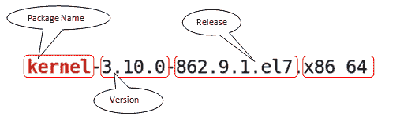

下表描述了用于命名 RPM 包的各个字段及其描述：

| **字段** | **描述** |
| --- | --- |
| 名称 | 它由描述应用程序内容的字符串组成。 |
| 版本 | 它是应用程序的版本号。 |
| 发布 | 它是由打包者设置的包的发布编号。 |

| 架构 | 它描述了包的架构。它说明包是为哪种架构构建的：32 位、64 位，或两者兼有：

+   `i386`：32 位

+   `x86_64`：64 位

+   `noarch`：与任何架构无关，可以在 32 位和 64 位系统上使用

|

使用 RPM 包安装应用程序具有管理的额外优势（跟踪包文件、更新包、删除包）。几乎所有 CentOS 提供的软件都是以 RPM 包的形式提供的。

RPM 包主要由三个部分组成：元数据、文件和脚本。元数据包含包名、版本、发布、构建者、日期、依赖关系等信息。文件部分包含要安装的包中包含的文件档案。RPM 包内的脚本文件会在安装、移除或更新包时执行。

# 更新应用程序时会发生什么

当应用程序更新时，通常，旧版本的包会从系统中移除。现有的配置文件通常会被保留，但是否保留、覆盖或以不同的名称写入新的配置文件则是在创建包时决定的。

在典型情况下，每次只安装一个版本的应用程序。然而，在某些情况下，可能会存在同一应用程序的多个版本，比如内核包或在多架构环境中，同一包会为不同架构（32 位和 64 位）安装。内核包设计时考虑到可以保留多个版本。如果新的内核安装失败，旧版本的内核始终可以作为备用。请始终记住，内核包从不通过 RPM 工具的更新选项进行更新，它总是安装而不是更新。

# 使用 RPM 查询选项与 RPM 包一起使用

有几个选项可以与查询选项一起使用。一些常用的选项如下：

+   列出系统中安装的所有包：

```
$ rpm -qa
```

+   通过将上一命令的输出传递给 `grep` 命令来查找系统中安装的特定包，如下所示：

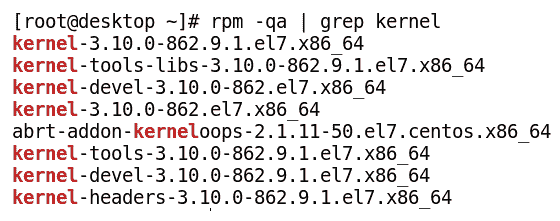

+   如下所示，识别安装了某个文件的包：

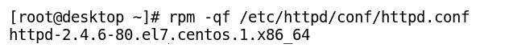

+   显示 RPM 包安装的文件列表，如下所示：

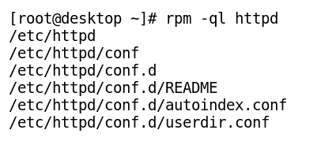

+   显示最近安装的 RPM 包，如下所示：

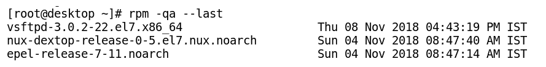

+   显示已安装包的信息，如下所示：

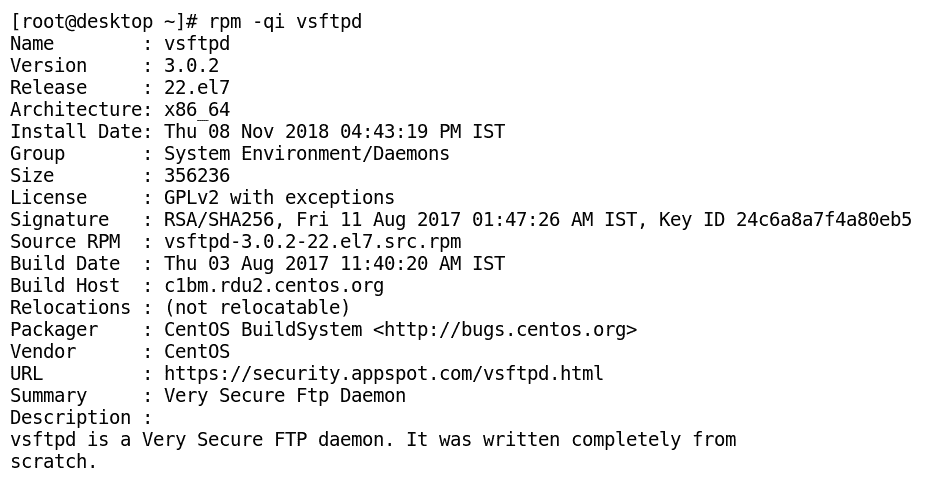

+   显示包安装的文件文档，如下所示：

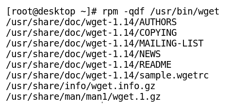

+   显示包安装的文档，名称如下所示：

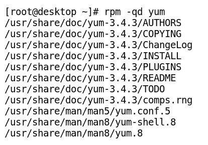

+   显示包安装的配置文件，如下所示：

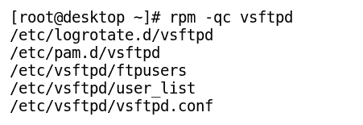

+   显示特定包的变更信息列表，如下所示：

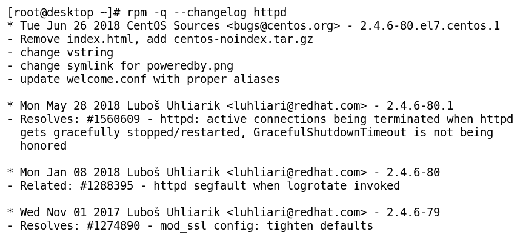

# 验证 RPM 包签名

RPM 包通常由打包它们的组织、社区或个人使用 GPG 私钥签名。在我们系统上安装包之前，我们应始终使用其公共 GPG 密钥验证包的签名，以确认其完整性。以下命令用于检查 RPM 包的签名：

```
$ rpm --checksig <packagename.rpm>
```

# 使用 RPM 安装包

要安装包，使用`-i`选项。通常与`-v`和`-h`选项一起使用，以便在安装过程中显示详细信息并使用哈希符号显示安装进度，如下所示：

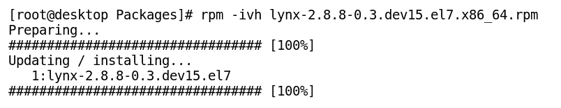

使用此方法的缺点是 RPM 无法自动解析依赖关系，因此如果在安装包时遇到任何未满足的依赖关系，它将中途退出安装。

我们还可以使用 RPM 强制安装包，通过在安装过程中使用`--nodeps`选项禁用依赖检查。这个方法不推荐使用，因为程序可能会在没有解析依赖关系的情况下失败。

使用 RPM 工具强制安装包的示例如下所示：

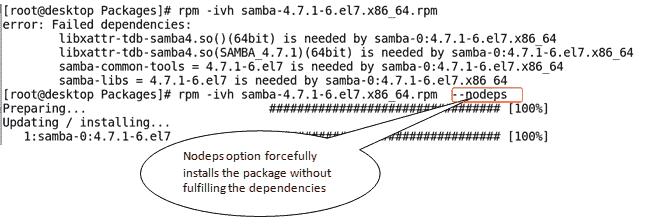

# 使用 rpm 删除包

我们可以通过指定包名和`-e`选项来删除一个包，如下所示：

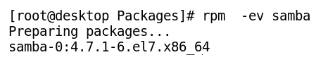

我们也可以在不进行依赖检查的情况下删除一个包。这将强制从系统中删除包，任何依赖该包的应用程序可能无法运行。以下图示显示了如何在不检查依赖关系的情况下删除包：

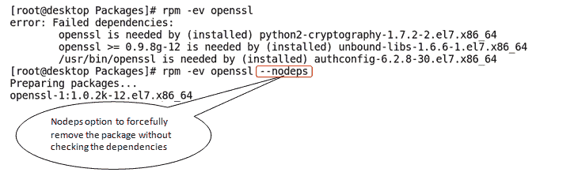

# 使用 RPM 升级包

大多数情况下，已安装的包会通过像 YUM 这样的高级包管理器自动升级。然而，如果包无法通过中央仓库升级，可以从互联网下载并手动升级，如下所示：

```
$ rpm -U <file.rpm> 
```

我们可以使用前面的命令或下面的命令手动升级一个包：

```
$ rpm -Uvh <file.rpm>

```

下面是使用`rpm`命令升级包的示例：

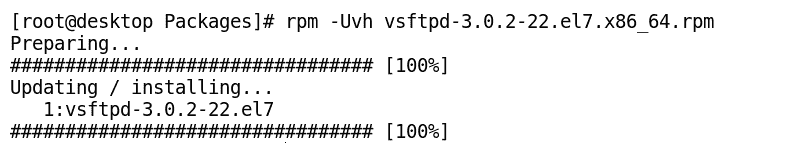

# 使用 RPM 验证包

如下所示，验证包的已安装文件与 RPM 文件中的文件是否一致：

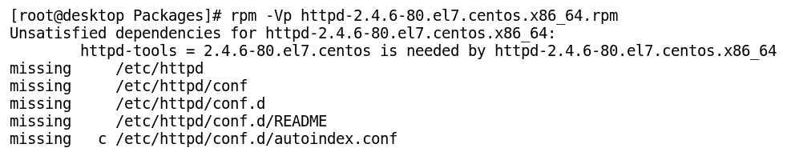

# 导入 RPM GPG 密钥

在安装前验证包的完整性时，必须将仓库或包作者的公共 GPG 密钥导入到系统中。以下截图显示了导入 CentOS 7 GPG 密钥的命令：

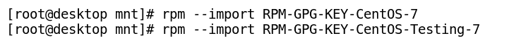

显示系统上所有导入的 RPM 仓库的 GPG 密钥，如下图所示：

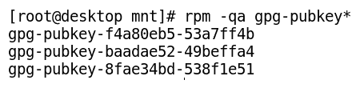

# 使用 YUM 管理应用程序

**YUM**（**Yellowdog Updater Modified**的缩写）是由 Red Hat 公司为基于 RPM 的系统开发的开源工具。它是一个高级包管理工具，用于在系统或网络仓库中轻松安装、删除、更新或搜索软件包。它允许我们使用 CentOS 基础和第三方仓库，这些仓库可以托管在远程或本地服务器上，在解决依赖关系后自动安装单个包或一组包。

在未来的版本中，YUM 将被 DNF 替代（其命令集兼容）。YUM 已在 Fedora 中被 DNF（改良版 YUM）替代，成为主要的包管理工具。

# 理解 YUM 包管理器

YUM 的主配置文件是`/etc/yum.conf`，存储仓库配置文件的主目录是`/etc/yum.repos.d/`。仓库配置文件有特定的语法，且应以`.repo`扩展名结尾，存放在`/etc/yum.repos.d/`目录下。

仓库配置文件包含仓库的 URL、`repo id`、`repo name`、使用 GPG 检查软件包签名的说明以及启用或禁用仓库的选项。

# 使用 YUM 命令行

在本节中，我们将学习如何在 Linux 命令行中使用 YUM 进行包管理。

# 使用 yum 查找应用程序

我们可以通过多种方式使用 YUM 搜索包名。带有关键字（包名）的搜索选项将列出包名本身以及包的摘要字段中包含指定关键字的包。以下示例用于说明`yum search`命令的工作方式：

+   仅通过包名使用`yum search`命令查找包，如下所示：

```
$ yum search <package_name>
```

下面是一个使用 yum search 命令查找名为`whois`的包的示例：

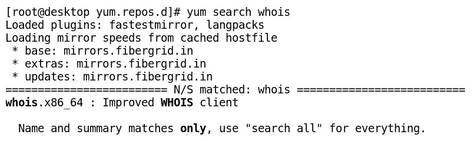

+   查找包时，如果搜索字符串出现在名称、摘要和描述字段中，则可以找到包，如下所示：

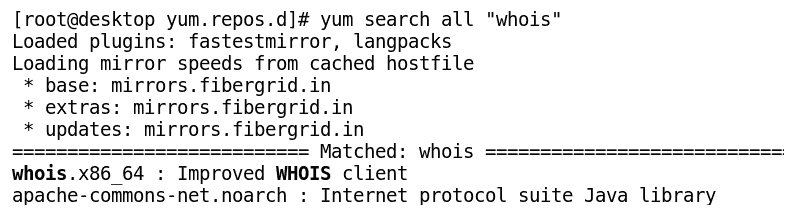

+   使用`yum whatprovides`命令根据包描述搜索包，如下所示：

```
$ yum whatprovides "*/package_name"
```

下面是一个使用`yum whatprovides`命令查找包名`lynx`的示例：

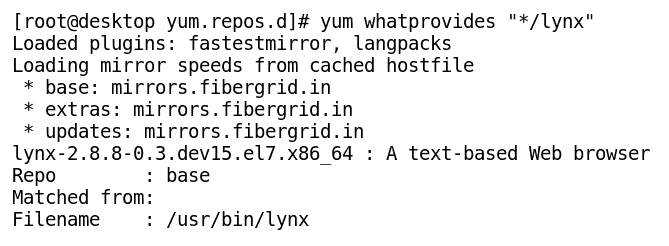

+   使用`yum provides`命令识别在系统中安装了某个文件（绝对路径名）的包，如下所示：

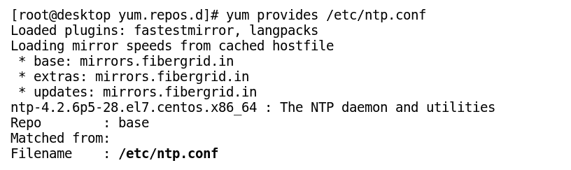

# 使用 YUM 安装应用程序

我们可以使用 YUM 工具安装新包。YUM 工具将解析包的所有依赖关系，并在安装前提示确认。

**以下是一些示例，用于说明使用 yum 命令安装包的方法：**

+   使用以下命令通过 YUM 安装应用程序：

```
$ yum install firefox
```

+   使用`-y`选项安装应用程序而不提示确认：

```
$ yum -y install firefox
```

+   安装一个不验证其签名的包：

```
$ yum install firefox --nogpgcheck
```

+   从本地目录安装已下载的 RPM 文件。它会自动从配置的仓库下载包的依赖项：

```
$ yum localinstall <path_to_rpm_file>
```

`yum localinstall`命令的示例如下所示：

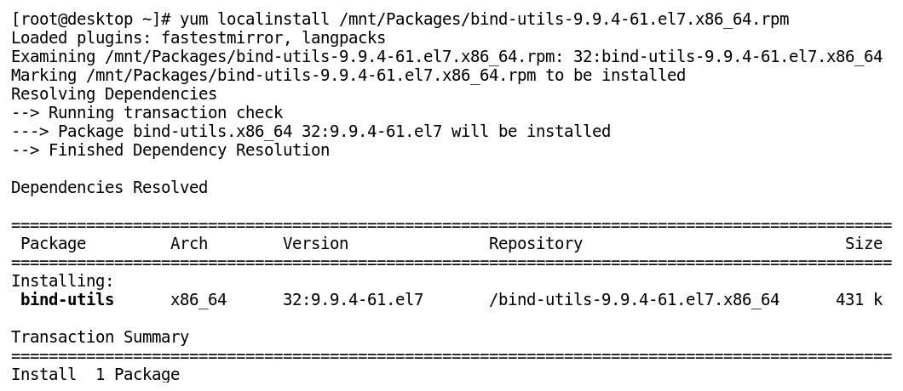

# 使用 YUM 显示软件包及其信息

以下是使用`yum`命令显示软件包详细信息的示例：

+   `yum info`命令的用法如这里所示：

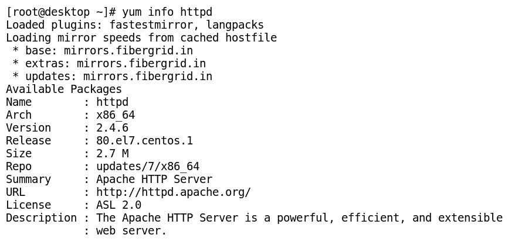

+   使用`yum list`命令显示已安装软件包列表，如命令行中所示：

```
$ yum list installed
```

+   使用`yum list`命令按名称显示已安装和可用的软件包信息，如下图所示：

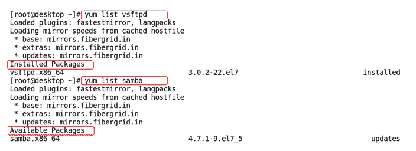

+   `yum list`命令也可以用来显示来自 YUM 数据库的所有可用软件包，如命令行中所示：

```
$ yum list
```

# 使用 yum 删除应用程序

以下是使用`yum`命令删除应用程序包的示例：

+   `yum`命令可用于删除一个软件包及其所有依赖项，如命令行中所示：

```
$ yum remove firefox
```

+   `yum`命令还可以与`-y`选项一起使用，以在没有提示确认的情况下删除应用程序，如命令行中所示：

```
$ yum -y remove firefox
```

# 使用 yum 更新应用程序和系统

我们可以通过执行命令行来查看系统中已安装的软件包是否有更新，如下所示：

```
$ yum check-update
```

我们还可以使用`yum`命令将已安装的应用程序及其依赖项更新到最新的稳定版本。在此过程中，YUM 会保留现有的配置文件，除非必须更新配置文件以便在更新版本的应用程序上工作，如命令行中所示：

```
$ yum update httpd
```

我们可以通过不指定任何应用程序名称给`yum update`命令，从而在一条命令中同时更新系统和已安装的应用程序，如命令行中所示：

```
$ yum update
```

在更新系统或应用程序时，除了内核以外，所有应用程序会立即在运行时更新。最新的内核版本仅在重新启动系统后生效。我们可以使用`uname -r`命令查看当前运行的内核版本。

# 使用 YUM 管理应用程序组

在 CentOS 7 中，执行相同功能的相关软件包被分组在同一类别下。我们还可以通过安装特定的包含相关软件包的组来代替逐一安装，如下所示的示例：

1.  使用`yum grouplist`命令显示所有软件包组，如下所示：

```
$ yum grouplist
```

1.  使用`yum groupinstall`命令安装相关软件包的特定包组，如下所示：

```
$ yum groupinstall "Development Tools"
```

1.  使用`yum groupupdate`命令更新现有安装的软件包组中的软件包，如下所示：

```
$ yum groupupdate "Administration Tools"
```

1.  我们还可以使用`yum groupremove`命令从系统中移除已安装的软件包组，如下所示：

```
$ yum groupremove "Development Tools"
```

我们可以使用`yum groupinfo`命令显示系统中已安装或未安装的强制性、默认和可选软件包的信息。此命令的输出显示该组中的软件包列表，每个软件包名前都会显示一个符号。下表列出了符号及其对应的含义：

| **符号** | **含义** |
| --- | --- |
| `=` | 软件包作为该组的一部分被安装，并且目前已安装在系统上。 |
| `+` | 系统上未安装该软件包。如果安装或更新该组，软件包将会被安装。 |
| `-` | 系统上未安装该软件包，如果安装或更新该组，软件包将不会被安装。 |
| 无符号 | 软件包已安装在系统上，但不是通过该组安装的。 |

`yum groupinfo`命令的一个示例，用于查找通过组安装的软件包的信息，如命令行所示：

```
$ yum groupinfo "System Administration Tools"
```

# 使用 YUM 历史记录

YUM 会在日志文件`/var/log/yum.log`中记录所有过去的安装和移除事务。以下截图显示了如何查看存储在日志文件中的 yum 事务记录：

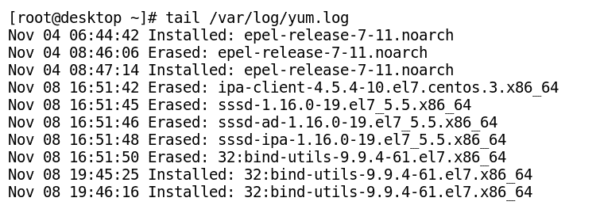

我们可以使用`yum`命令显示已安装和已移除的软件包的历史记录，如下所示：

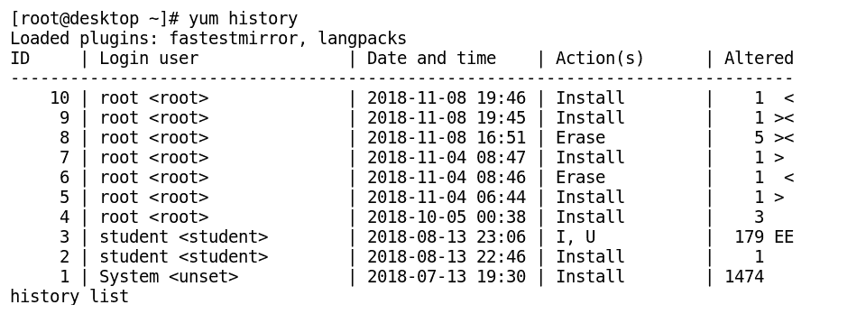

我们可以使用`yum history undo`命令撤销之前的事务，如下所示：

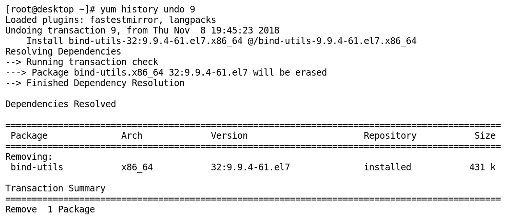

# 使用 YUM 管理应用程序仓库

要使用 YUM 管理应用程序仓库，请执行以下操作：

+   使用`yum repolist`命令仅显示系统中已启用的仓库，如下所示：

```
$ yum repolist
```

+   使用`yum repolist all`命令显示系统中所有可用（启用或禁用）的仓库，如下所示：

```
$ yum repolist all
```

+   我们可以通过仅在运行时启用某个仓库来安装来自特定仓库的软件包。它用于在一个软件包存在于多个仓库时，从特定仓库安装该软件包，如命令行所示：

```
$ yum  --enablerepo=epel install httpd
```

+   我们可以使用`yum-config-manager`工具永久启用或禁用一个仓库。它会在`/etc/yum.repos.d/`目录下的文件中进行必要的更改，如命令行所示：

```
$ yum-config-manager  --enable <repo id>
```

`yum-config-manager`工具还可以用于在`/etc/yum.repos.d`目录下创建客户端仓库配置文件，如下所示：

`$ yum-config-manager       \                                        --addrepo=http://repo.example.com/7/x86_64/`

# 处理其他杂项 yum 选项

YUM 工具还提供了一个交互式 Shell，通过 `yum shell` 命令一次性执行多个任务。要退出 YUM Shell，请输入 `exit` 或 `quit`，或按 *Ctrl* + *D*。以下截图中的示例说明了 `yum shell` 命令的用法：

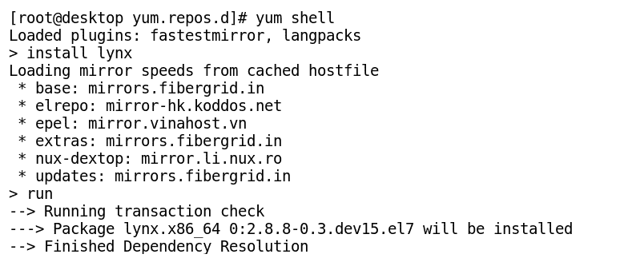

YUM 会将所有启用的仓库的缓存包和其他数据存储在 `/var/cache/yum` 目录中。在这里，YUM 会为每个仓库创建一个子目录。我们可以通过执行以下命令随时清理或清空缓存目录，以节省空间：

```
$ yum clean all
```

我们可以使用以下命令显示 YUM 的使用信息：

```
$ yum help
```

# 管理官方和第三方仓库

有时，所需的软件在 CentOS 7 的基础（官方）仓库中不可用。在这种情况下，CentOS 7 和其他 Linux 社区已贡献了多个第三方仓库，可以用于安装官方仓库中没有的各种应用程序。本节将讨论适用于 CentOS 7 的各种流行第三方仓库。

# CentOS 7 的官方仓库

默认情况下，CentOS 7 提供基础仓库、更新仓库和附加仓库。这些仓库由 CentOS 社区管理，足以满足大多数日常操作需求。

# 第三方仓库

这些是没有由官方 CentOS 社区管理的仓库。有时，我们需要将它们添加到 YUM 仓库数据库中，以便下载和安装在 CentOS 官方仓库中没有的软件。然而，如果添加这些仓库，应该单独管理它们，以避免它们带来的任何意外或冲突更新。

以下是一些特定仓库的列表，这些仓库包含在 CentOS 基础仓库或更新仓库中没有的额外 CentOS 包：

+   **企业 Linux 扩展包（EPEL）仓库**：该仓库由 Fedora 社区维护，是可以添加到系统中的最受信任的第三方仓库之一。我们可以使用以下命令将此仓库添加到系统中：

```
$ yum install epel-release -y 
```

+   **社区企业 Linux 仓库（ELRepo）**：这是一个企业 Linux 仓库，提供与硬件相关的 RPM 包。它包括文件系统驱动程序、图形、声音、摄像头、视频和网络驱动程序，以及最新的内核包。我们可以使用以下命令将此仓库添加到系统中：

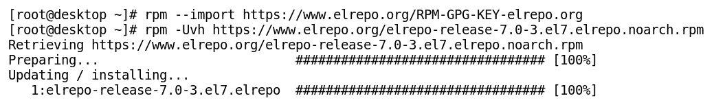

+   **Nux-desktop 仓库**：该仓库提供面向企业版 Linux 的桌面和多媒体相关软件包。一些流行的多媒体软件，如 VLC 媒体播放器、mplayer 等，都可以通过这个仓库安装。此仓库中的一些软件包有一些依赖项，这些依赖项可以通过 EPEL 仓库解决。同时，强烈建议不要与 RPMForge 或 ATRPMS 仓库一起使用此仓库，因为它可能会导致软件包和依赖项之间的冲突。此外，RPMForge 已经是一个废弃的项目，不再维护。我们可以通过以下命令将 Nux-desktop 仓库添加到系统中：

```
$ yum install epel-release 
$ rpm -Uvh \
http://li.nux.ro/download/nux/dextop/el7/x86_64/nux-dextop-release-0-5.el7.nux.noarch.rpm
```

+   **Remi 仓库**：这是一个第三方仓库，主要以提供最新版本的 PHP 堆栈、MySQL 及相关软件而闻名，通常用于企业版 Linux。安装之前，它还需要先在 CentOS 上安装 EPEL 仓库。我们可以通过以下命令将 Remi 仓库添加到系统中：

```
$ yum install epel-release
$ rpm -Uvh https://rpms.remirepo.net/enterprise/remi-release-7.rpm
```

默认情况下，remi 仓库在安装时未启用。要使用此仓库安装软件包，我们需要先启用它。

+   **RPM Fusion 仓库**：这个第三方仓库提供一些 Fedora 项目或 Red Hat 不希望与企业版 Linux 共享的免费和非免费附加包。我们可以通过以下命令将此仓库添加到系统中：

```
$ rpm -Uvh https://download1.rpmfusion.org/free/el/rpmfusion-free-release-7.noarch.rpm
```

有许多第三方仓库可供选择，其中一些不再维护，而一些则存在包冲突。有关仓库的更多信息，例如哪些仓库应该避免使用，哪些仓库推荐使用，你可以访问 CentOS 的以下 Wiki 页面：

[`wiki.centos.org/AdditionalResources/Repositories`](https://wiki.centos.org/AdditionalResources/Repositories)

# 创建自定义仓库

创建一个 YUM 仓库是通过局域网在多台系统上安装软件或安全更新的最简单和最好的方法之一。我们可以从互联网仓库或 DVD 下载所有的软件包，并将它们托管在本地服务器上，该服务器将被称为 YUM 服务器。局域网中的其他 Linux 机器可以配置为从本地 YUM 服务器下载所需的软件包，这些机器将被称为 YUM 客户端。这样可以节省互联网带宽，提供离线安装软件包给客户端，并加速更新过程。

在本节中，我们将创建一个自定义的 CentOS 7 DVD 包仓库，并通过 FTP 服务器将该仓库共享给客户端，步骤如下：

1.  挂载包含软件包的介质。在本例中，它将是 CentOS 7 DVD，如下所示：


1.  从挂载的 DVD 中安装 FTP 服务器包 `vsftpd`，如下所示：

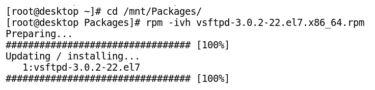

1.  现在，启用服务以便在启动时自动启动 `vsftpd` 并启动该服务，如下所示：

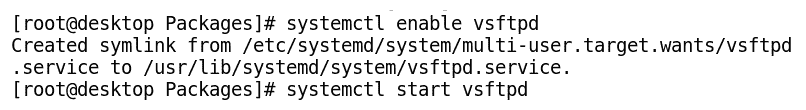

1.  安装`createrepo`软件包以创建本地仓库数据库。如果系统连接了互联网，我们可以使用 YUM 来安装`createrepo`软件包，如命令行所示：

```
$ yum install createrepo -y
```

如果没有互联网连接，可以使用 RPM 包管理器安装软件包，如下所示：

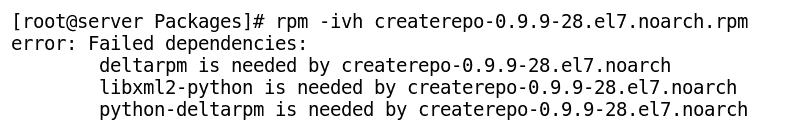

我们遇到前面的错误是因为在系统中未安装`createrepo`软件包的依赖项。因此，我们满足了`createrepo`软件包的依赖关系。首先，按以下顺序安装以下软件包：

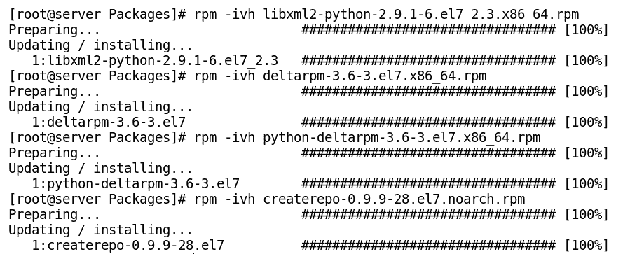

1.  将软件包存储在`ftp`文件夹中以构建本地仓库，如下所示：

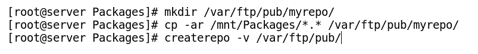

1.  根据`vsftpd`服务器文件恢复从 DVD 复制的软件包的 SELinux 标签，如下所示：


1.  在`/etc/yum.repos.d/`目录下创建一个以`.repo`扩展名结尾的 YUM 服务器配置文件，如命令行所示：

```
$ vim /etc/yum.repos.d/localserver.repo
```

`localserver.repo`文件的内容如下所示：

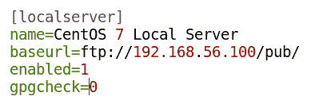

1.  启用本地 YUM 服务器仓库并使用`yum`命令清理 YUM 缓存，如下所示：

```
$ yum clean all
```

在清理 YUM 数据库的先前缓存后，使用如下命令从头开始构建仓库的 YUM 数据库：

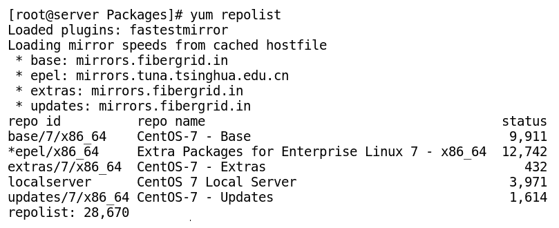

你可以使用其他应用程序，如 Web 服务器或 NFS 服务器，来共享 YUM 服务器（提供软件包的系统）到 YUM 客户端（下载软件包的系统）。我们还需要在防火墙中打开相应的应用程序端口，以允许 YUM 客户端从 YUM 服务器下载软件包。

# 总结

在本章中，我们首先学习了如何保持系统和应用程序软件的更新。我们了解了如何使用 RPM 和 YUM 等软件包管理工具来安装、移除或更新应用程序包。我们还查看了 CentOS 7 的不同第三方仓库。最后，我们通过创建自定义仓库并使其对客户端可用来结束本章。保持系统和应用程序的更新至关重要，可以确保它们没有任何漏洞，有助于保护信息并使系统免受恶意软件和黑客的攻击。

在下一章中，我们将学习一些 CentOS 7 的基本工具。我们将看到系统日志如何工作以及如何管理系统服务。接着，我们将了解防火墙和 SELinux 在强化系统安全方面的功能。
