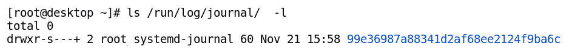
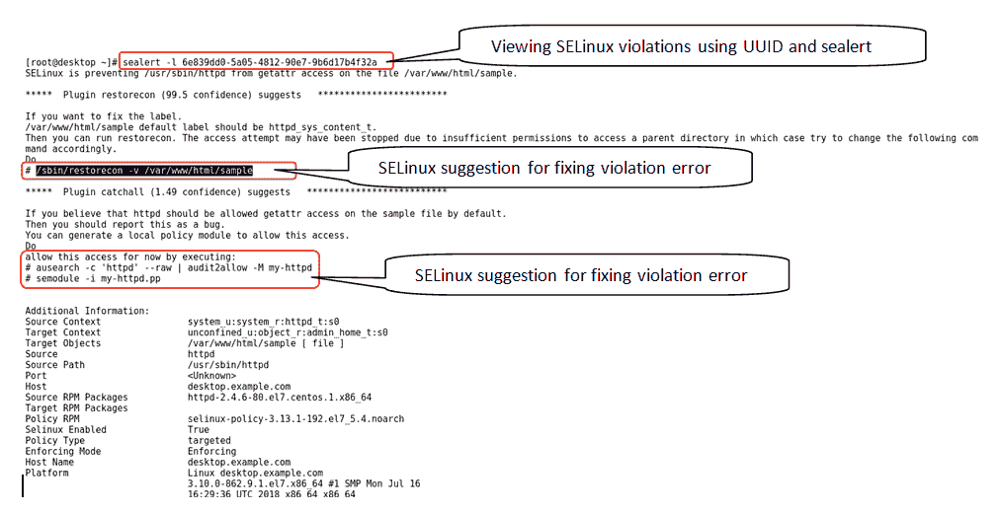

# 第九章：必备高级工具概览

在本章中，我们将学习一些与系统相关的高级和基本概念，如日志记录、控制系统服务、防火墙和**安全增强 Linux**（**SELinux**）。日志记录在调试和故障排除系统应用程序中起着关键作用。深入理解日志记录将使你的日常操作更加轻松，也将帮助你深入了解应用程序的功能。

在本章的最后，我们将学习 CentOS 7 中不同的日志机制，如 journald 和 rsyslog。到目前为止，你已经看到了如何安装、更新和删除应用程序。现在，我们将学习如何使用 systemd 和 systemctl 工具控制这些应用程序和系统服务。最后，我们将理解如何使用 firewalld 和 SELinux 来保护正在运行的服务并加强系统的安全性。

我们将涵盖以下内容：

+   理解系统日志

+   与 rsyslogd 和 journald 一起工作

+   理解系统和服务的控制

+   与 systemd 和 systemctl 一起工作

+   理解 SELinux 概念

+   与 SELinux 一起工作

+   理解 CentOS 7 中的防火墙概念

+   与 firewalld 一起工作

# 理解系统日志

大多数应用程序和内核将它们的事件信息写入保存在不同位置的日志文件中。这有助于跟踪系统上发生的活动，并且也是系统审计的重要组成部分。日志文件的监控有助于发现系统中的任何异常活动。日志记录还有助于排除应用程序问题。根据惯例，Linux 使用`/var/log/`目录来存储系统中的日志。

从 CentOS 7 开始，系统中存在两种日志服务：

+   Rsyslog 服务

+   Systemd-journald 服务

在配置日志服务之前，应该正确配置系统时间服务，因为时间是日志文件的重要组成部分。

# 与 rsyslog 一起工作

rsyslog 服务集中收集 Linux 系统中不同应用程序的日志消息。它根据日志类型和优先级收集日志，并将其持久化存储在`/var/logfollows:/`目录中。

下表列出了一些由 rsyslog 维护的重要日志文件及其描述：

| **日志文件路径** | **描述** |
| --- | --- |
| `/var/log/messages` | 大多数标准日志消息都存储在这里，除了认证日志、邮件日志和一些应用程序调试日志。 |
| `/var/log/secure` | 存储认证日志，其中包含错误和其他消息。 |
| `/var/log/maillog` | 邮件服务器日志保存在这里。 |
| `/var/log/boot.log` | 启动/系统启动消息记录在这里。 |
| `/var/log/cron` | 存储 cron 作业（调度器）日志。 |
| `/var/log/wtmp` | 记录登录活动的日志保存在这里。 |
| `/var/log/dmesg` | 内核消息保存在这里。 |
| `/var/log/cups` | 打印服务日志保存在这里。 |
| `/var/log/samba` | Samba 服务日志存储在这里，不受 rsyslog 管理。Samba 服务直接在此处写入日志。 |
| `/var/log/httpd` | 此目录包含 Apache Web 服务器日志，不受 rsyslog 管理。Apache 直接将日志写入这些文件中。 |
| `/var/log/audit/` | 包含 `auditd` 服务日志和 SELinux 日志文件。 |

Rsyslogd 是 Linux 系统中的一个应用程序，基于从 1980 年开始的 syslog 项目。它使用 syslog 协议在系统中记录事件，并具有某些扩展功能，例如 RELP 协议和缓冲操作支持。有时，在 Linux 中，syslog 也用于 rsyslog 的上下文中。

# 配置 rsyslogd 部分

rsyslogd 服务被 Linux 中的大多数应用程序用于记录事件。rsyslogd 服务使用三个主要组件处理系统中各种应用程序的日志消息：

+   **设施**：代表进程类型

+   **优先级或严重性**：代表消息的严重性

+   **目的地/位置**：描述日志消息发送或记录的位置

rsyslogd 服务的配置文件存储在两个位置：

+   在主配置文件，`/etc/rsyslog.conf`

+   存储在 `/etc/rsyslog.d/` 目录内带有 `.conf` 扩展名的文件

主配置文件，`/etc/rsyslog.conf`，包含了记录日志内容及存储位置的信息。它分为三个不同的部分，如下所示：

+   `#### MODULES ####`：模块部分用于配置 rsyslogd 的高级功能。

+   `#### GLOBAL DIRECTIVES ####`：全局指令部分用于指定全局可配置的参数。

+   `#### RULES ####`：这是最重要的部分，包含了指定记录内容及记录位置的规则。我们将在本章的 *Rsyslogd 规则* 部分详细讨论这一点。

可以通过 `man` 命令访问 rsyslog 的文档：

```
# man 5 rsyslog.conf
```

# Rsyslogd 设施和优先级

设施代表生成日志消息的内部系统进程的固定列表。

下表列出了 CentOS 7 中可用的常见设施关键字及其描述：

| **设施** | **描述** |
| --- | --- |
| `auth` 或 `authpriv` | 代表与身份验证相关的子系统消息，如登录 |
| `cron` | 代表 `crond` 服务及任何定期应用程序消息 |
| `daemon` | 通用名称，用于表示各种守护程序子系统消息 |
| `kern` | 代表内核消息 |
| `lpr` | 代表 传统打印服务消息 |
| `mail` | 代表所有邮件程序消息 |
| `mark` | 仅供内部使用，不应与任何应用程序一起使用 |
| `news` | 代表由 NNTP 生成的消息 |
| `security` | 与 `authpriv` 相同，不再使用 |
| `syslog` | 代表 syslog 守护程序的消息 |
| `user` | 它代表由用户空间生成的消息 |
| `uucp` | 它代表由 UUCP 子系统生成的消息 |
| `local0-local7` | 它代表系统为用户提供的自定义未使用的设施，用于发送由用户定义的服务生成的消息 |
| `*` | 它匹配所有设施 |

优先级表示记录的消息的严重性或优先级。可以使用不同的优先级级别来确定可以记录的事件类型，例如`debug`、`info`、`emerg`、`alert`等，适用于指定的服务。

下表列出了严重性/优先级级别及其描述和分配的优先级数字：

| **分配的数字** | **优先级** | **严重性描述** |
| --- | --- | --- |
| 0 | `emerg` | 当系统无法使用时生成消息 |
| 1 | `alert` | 必须立即采取行动，可用服务即将中止 |
| 2 | `crit` | 当发生关键条件时生成消息 |
| 3 | `err` | 非关键错误条件 |
| 4 | `warning` | 警告条件 |
| 5 | `notice` | 需要注意以防止未来问题的事件的信息性消息 |
| 6 | `info` | 为正常服务操作生成信息性消息 |
| 7 | `debug` | 用于服务操作的调试级别消息 |

如果在优先级字段中指定了通配符`*`，则表示所有类型的严重性（消息）。如果在严重性字段中写入`none`，则表示不会将对应设施的任何消息添加到指定的日志文件中。`none`用于防止相同的消息被记录到不同的日志文件中，如以下示意图所示：


# Rsyslogd 规则

`/etc/rsyslog.conf`文件中的`####RULES####`部分包含用于定义消息日志记录的指令。该指令在`/etc/rsyslog.conf`文件中的语法如下：

```
facility.priority                        destination
```


**以下是说明如何使用`/etc/rsyslog.conf`文件中定义的指令来记录消息的示例：**

+   要记录内核的所有信息消息，我们可以指定一个不同的日志文件，如下所示：

```
$ vi /etc/rsyslog.conf
kern.info /var/log/kernel
```

+   我们在`/var/log/`目录中创建一个`debug.log`文件，用于收集所有服务的调试优先级消息，如以下命令行所示：

```
$ vi /etc/rsyslog.conf
*.debug /var/log/debug.log 
```

+   在`/etc/rsyslog.conf`文件中进行所需更改后，重启 rsyslog 服务以使更改生效，如以下命令行所示：

```
$ systemctl restart rsyslog
```

在进行上述更改后，调试消息将不再出现在`/var/log/messages`文件中。

# 日志文件轮换

日志轮换可以防止`/var/log`目录填满。旧的日志文件在轮换时会被重命名为`filename-datestamp`。`datestamp`表示文件被轮换（归档）的日期，如下表所示：

| **现有日志** | **归档日志** |
| --- | --- |
| `/var/log/messages` | `/var/log/messages-20180530` （2018 年 5 月 30 日轮换） |

**Logrotate** 是定期轮换日志文件的工具。每晚会运行一个名为 `/etc/cron.daily/logrotate` 的 cron 作业来执行日志轮换。日志文件的轮换按照日志轮换程序的配置进行，配置文件存储在以下两个位置：

+   `/etc/logrotate.conf`

+   `/etc/logrotate.d/*`（该目录中的任何文件）

大多数日志文件是按周轮换的；然而，`logrotate` 命令会根据某些条件（例如达到一定大小）使某些日志文件轮换得更快或更慢。

在日志轮换后，日志查看程序会丢弃旧的日志文件归档以节省磁盘空间（通常为 4 周或在达到一定轮换次数后）。轮换时会创建一个新的日志文件，并通知相关服务。在安装新应用程序时，应用程序会通过将其日志配置文件放入 `/etc/logrotate.d/` 目录中，来将日志文件添加到 `logrotate` 管理中。

创建自定义日志文件的示例如下：

```
# vi / etc/logrotate.d/<application_name>
/var/log/path_to_log_file {
rotate 3
size 2M
monthly
postrotate
/bin/systemctl reload httpd
endscript
}
```

以下是 `log rotation` 文件中使用的重要命令：

+   `rotate 3`：保留文件的最后三个版本，并删除最旧的版本

+   `size 2M`：当日志文件达到 2MB 时进行轮换

+   `monthly`：这是一个按大小的替代方法；如果文件大小未达到 2MB，则按月轮换文件

# 分析 syslog 条目

rsyslogd 服务生成的系统日志存储在 `/var/log/` 目录中的多个文件里。最旧的消息保留在日志顶部，而新的日志条目按标准格式附加在日志文件的底部，如下图所示：


# 使用 `tail` 命令监控实时日志文件流量

在故障排除过程中，需要查看运行应用程序时生成的日志。使用带有 `-f` 选项的 `tail` 命令可以实现这一点。在一个终端中，我们会执行要故障排除的应用程序，在另一个终端中执行 `tail` 命令，如下所示：

```
# tail -f </path_of_log_file>
```

它显示指定文件名底部的 10 行，并保持文件打开，以便查看正在写入的新增行。一旦查看完日志后，可以按 *Ctrl* + *C* 关闭日志文件。

例如，要监控系统中的失败登录尝试，可以在一个终端中打开 `/var/log/secure`，在另一个终端中执行 `ssh` 命令，如下所示：


# 使用 logger 命令

尽管大多数应用程序已经配置为自动写入日志文件，但我们也可以使用`logger`命令将消息写入`rsyslogd`。`logger`命令根据`logger`命令中指定的设施和优先级，将日志消息写入日志文件。默认情况下，它将日志发送到名为“user”的设施，并具有名为“notice”的优先级（`user.notice`）。`logger`命令还可以在 shell 脚本中使用，以创建日志，如下例所示：

+   如果我们将信息优先级的日志消息发送到`rsyslog`程序，它将被存储在`/var/log/boot.log`文件中，如以下命令行所示：

```
# logger -p local7.info  "Sample log entry using logger command"
```

+   我们可以通过使用`logger`命令将任何日志消息发送到默认的日志文件`/var/log/messages`，如以下命令行所示：

```
# logger "Log file entry using logger"
```

欲了解更多有关日志记录的信息，请参考`logger`、`tail`、`rsyslog.conf`和`logrotate`命令的手册页。

# 使用`systemd-journald`

此守护进程为 CentOS 7 提供了一种非持久的高级日志管理方法，用于收集和显示来自内核、启动程序和其他运行中的服务的消息。`journald`以二进制格式维护这些消息，并可通过`journalctl`命令访问。默认情况下，日志是跨重启不可持久的。它将消息转发给`rsyslogd`进行永久性存储和处理。

# 使用`journalctl`命令查找事件

在 CentOS 7 中，`systemd-journal`存储在`/run/log/journal/`目录中，如下图所示：



当我们以 root 身份执行`journalctl`命令且不带任何选项时，它将显示完整的系统日志，从最旧的日志条目到最新的日志条目，如以下命令行所示：

```
# journalctl
```

`journalctl`命令使用颜色编码来突出显示消息的严重性，如下表所示：

| **优先级** | **日志中使用的文本高亮描述** |
| --- | --- |
| `Error`、`crit`、`alert` 或 `emerg` | 文字为红色 |
| `Notice` 或 `warning` | 文字为粗体 |
| `Info` 或 `debug` | 常规文本 |

使用不同的选项可以限制`journalctl`命令的日志搜索，输出到期望的结果：

+   `Journalctl -n`：默认情况下，使用`-n`选项与`journalctl`一起使用时，将显示最后 10 条日志条目。我们还可以指定要显示的日志条目的数量，如下图所示：


+   `Journalctl -p`：我们可以通过使用`-p`选项指定日志条目的优先级，来过滤日志输出。我们可以指定优先级的名称或编号，以显示指定或更高级别的日志条目，如下图所示：


+   `Journalctl -f`：`-f`选项类似于`tail`命令中的`-f`选项；它显示日志的最后 10 行，并保持打开状态，显示新写入日志中的条目，直到你按下*Ctrl* + *C*，如下面的截图所示：


**限制 journalctl 输出到特定时间**：`journalctl`命令可以使用两个选项，`--since`和`--until`，来指定时间范围，并显示该时间段内的日志消息。以下`journalctl`查询显示了`18:05:00`到`18:10:00`之间记录的所有日志：

```
# journalctl --since 18:05:00 --until 18:10:00
```

我们可以使用`journalctl`命令仅显示今天的日志条目，如下面的命令行所示：

```
# journalctl --since today 
```

我们还可以使用`journalctl`命令通过启用日志的详细输出，显示附加到日志条目的额外字段，如下面的命令行所示：

```
# journalctl -o verbose
```

下表列出了用于过滤查询的`journalctl`命令的一些重要字段：

| **字段名** | **描述** |
| --- | --- |
| `_COMM` | 基于命令名称过滤日志 |
| `_EXE` | 基于进程的可执行文件路径过滤查询 |
| `_PID` | 基于进程的 PID 过滤日志 |
| `_UID` | 基于运行进程的用户 UID 过滤日志 |
| `_SYSTEMD_UNIT` | 基于启动进程的 systemd 单元过滤日志 |

例如，可以使用以下命令过滤出来自 PID 为 1 的 systemd 进程的日志消息：

```
# journalctl _PID=1
```

`journalctl`命令还可以用来列出所有由`sshd`服务发送的日志消息，如下面的命令行所示：

```
# journalctl _SYSTEMD_UNIT=sshd.service 
```

`journalctl`命令还可以用来查看自上次启动以来的日志消息，如下所示的命令行所示：

```
# journalctl -b
```

# 配置`systemd-journald`以持久存储日志

`systemd-journal`存储在`/run/log/journal`目录中，该目录在系统重启时会被清除。它的配置文件是`/etc/systemd/journald.conf`，可以用来微调日志参数，如用于存储日志的文件系统大小（默认值为 10%）。

`systemd-journal`的配置方式是，如果系统中存在`/var/log/journal/`目录，则日志条目将记录在该目录中，而不是`/run/log/journal/`。同样的概念也用于使`systemd-journal`的存储在重启后保持持久。为了使`systemd-journal`持久化，需要执行以下步骤：

1.  作为 root 用户创建`/var/log/journal/`目录，如下面的命令行所示：

```
# mkdir /var/log/journal

```

1.  将创建的目录的所有者设为 root，组设为`systemd-journal`，权限设为`2755`，如下面的命令行所示：

```
# chown root:systemd-journal /var/log/journal
# chmod 2755 /var/log/journal
```

1.  重启系统或向`systemd-journald`发送`USR1`信号，如下面的命令行所示：

```
# killall -USR1 systemd-journald
```

1.  通过列出一个包含日志文件的新目录，确保 `systemd-journal` 在重启后持久化，目录位于 `/var/log/journal` 目录中，如以下命令所示：

```
# ls /var/log/journal
```

# 理解如何控制系统和服务

从用户或系统管理员的角度来看，了解如何管理系统上安装的各种服务是至关重要的。用户应该能够在启动时启用服务，并在需要时启动或停止服务。

早期，Linux 系统和服务由 SysV init 或 BSD init 管理。后来，通过添加像 service 和 chkconfig 这样的工具，结合 shell 脚本，进一步改进了它们的管理。更近期，从 CentOS 7 开始，系统和服务的管理由 systemd 负责。systemd 取代了 CentOS 7 中的 initd，成为第一个进程。

在接下来的章节中，你将学习如何管理系统上运行的服务。你将学习如何使用 systemd 及其组件，这些组件负责将系统从内核空间切换到用户空间，并在此后管理系统进程。

# 定义基本术语

在本节中，我们将定义与系统和服务管理相关的基本术语。

# 什么是守护进程？

守护进程是一个等待或在后台运行的进程，执行多个任务。它通过网络套接字监听连接。

# 什么是套接字？

当客户端连接建立时，系统会创建一个套接字，并将其传递给守护进程，或者为自己创建一个守护进程。在 Linux 中，套接字主要用于建立客户端与守护进程之间的通信。

# 什么是 systemd？

从 CentOS 7 起，systemd 取代了 init 进程，成为内核启动时启动的第一个进程（PID=1）。它通过为应用程序和内核之间提供接口，管理 Linux 内核中的系统和服务。启动 systemd 后，它开始记录活动、挂载文件系统和设备、启动其他服务，并最终提供用户登录的 shell。systemd 通过不同的库和工具（如 `systemctl`、`journalctl`、`hostenamectl`、`localectl`、`timedatectl`、`systemd-cgls` 等）来执行这些任务，并且在安装 systemd 时会一并安装这些工具。它通过称为单元（units）的对象来管理各种系统资源。

# 什么是单元？

在 systemd 中，单元是 systemd 知道如何管理和操作的对象。它们代表不同的系统资源，并通过称为单元文件的配置文件定义。默认情况下，这些单元文件保存在 `/usr/lib/systemd/system/` 目录下。只有那些单元文件存储在 `/lib/systemd/system` 目录下的单元，才能在会话期间启动或停止。这些文件由应用程序的 RPM 文件安装到系统中。单元是 CentOS 7 之前使用的旧 init 脚本的替代品。

# 什么是 systemctl？

它是 CentOS 7 中`service`和`chkconfig`命令的替代品。`systemctl`命令用于管理不同类型的`systemd`对象（单元）。`systemd`有 12 种单元类型，可以通过以下截图中的命令列出：


以下表格列出了一些常见单元及其描述：

| **单元类型** | **描述** |
| --- | --- |
| 服务 | 这类单元具有`.service`扩展名，表示系统服务。此单元用于启动守护进程，例如 Web 服务器。如果没有指定单元名称，`systemctl`默认将服务作为默认单元。 |
| 套接字 | 这类单元具有`.socket`扩展名，表示**进程间通信**（**IPC**）套接字。 |
| 路径 | 这类单元具有`.path`扩展名，用于在特定的文件系统更改发生之前延迟激活服务。 |
| 目标 | 这类单元具有`.target`扩展名，表示一组单元。 |
| 切片 | 这类单元具有`.slice`扩展名，表示进程的管理单元。 |

# 使用 systemd 和 systemctl

本节介绍了 systemd 和 systemctl 是如何组织的，以及如何使用 systemd 管理重要的对象（单元）。

# 使用`systemctl`查看服务状态

服务单元是`systemd`中最重要的单元之一，通过`systemctl`进行管理。如果未指定单元类型，`systemctl`将显示服务单元的状态（如果存在）。查看任何单元的语法如下：

```
# systemctl     status    name.type
```

这里，name 是服务名称，type 是单元类型，例如服务、套接字、路径等。以下截图中的示例说明了如何使用`systemctl`命令查看服务状态：


以下表格列出了服务的各种状态及其描述：

| **状态** | **描述** |
| --- | --- |
| `Loaded` | 单元配置文件已成功处理 |
| `Active (running)` | 正在运行并有一个或多个活动进程 |
| `Active (exited)` | 成功完成了一次性的配置 |
| `Active (waiting)` | 正在运行并等待事件发生 |
| `Inactive` | 当前未运行 |
| `Enabled` | 启动时会启动 |
| `Disabled` | 启动时不会启动 |
| `Static` | 不能直接启用，但可以由其他启用的单元自动启动 |

# 使用`systemctl`查看单元文件

作为系统管理员或用户，有时需要了解当前`systemd`单元文件的状态。这有助于系统的优化。我们可以使用`systemctl`命令将服务配置为在系统启动后处于活动和加载状态，或者处于非活动状态。

以下表格列出了用于查看单元文件的命令及其描述：

| **命令** | **描述** |
| --- | --- |
| `# systemctl` | 显示所有已加载并在启动时激活的单元的状态 |
| `# systemctl --type=service` 或 `# systemctl list-units --type=service` | 显示所有活动服务单元的状态 |
| `# systemctl --type=service –all` 或 `# systemctl list-units --type=service --all` | 显示所有已加载的服务单元的状态，无论其是否活动 |
| `# systemctl --failed --type=service` | 显示所有失败的服务 |
| `# systemctl is-active sshd` | 显示特定服务当前是否处于活动状态 |
| `# systemctl is-enabled sshd` | 显示特定服务是否已启用在启动时自动启动 |
| `# systemctl list-unit-files --type=service` | 显示所有指定类型单元的启用、禁用或静态设置 |
| `# systemctl status sshd.servisystemctlce -l` | 显示有关指定服务的详细状态信息 |

# 单元依赖关系和单元文件结构

服务可以作为独立的单元启动，也可以作为其他服务的依赖项启动。例如，假设启用了一个套接字单元，但具有相同套接字名称的服务单元未启用，那么当网络套接字收到请求时，该服务将自动启动。类似地，当文件系统路径条件满足时，服务也可以由路径单元触发。以下命令用于列出指定单元的依赖关系树：

```
# systemctl list-dependencies sshd
```

从 CentOS 7 开始，`systemd`提供了一个统一的接口，用于从它们的存储位置启动单元文件。系统中存储的单元文件位置如下：

+   `/usr/lib/systemd/system/`：它包含系统默认的单元文件。

+   `/etc/systemd/system`：它包含用于修改 systemd 默认行为的系统特定参数。

+   `/run/systemd/system/`：它包含单元文件的运行时配置。

单元文件的结构如下图所示：


前面的单元文件可以分为以下三个部分：

+   **单元**：此部分描述单元类型及其依赖关系（如果有）。它还包含`After`语句和`Before`语句。这些语句定义了单元的依赖关系。`Before`语句表示该单元应在指定单元之前启动。`After`语句表示该单元应在启动指定单元后启动。

+   **服务**：此部分包含有关如何启动和停止服务的描述。以`ExecStart`参数开头的行描述如何启动单元，以`ExecStop`参数开头的行描述如何停止单元。

+   **安装**：此部分包含一行以`WantedBy`参数开头，表示该应用程序的目标。目标单元相当于 CentOS 6 及之前版本中的运行级别。

# 使用 systemctl 管理守护进程

可以通过在 systemd 配置目录中创建指向单元文件的链接来在启动时启动服务，方法是使用`systemctl`命令。早期自动启动服务的方法是使用`chkconfig`。下面的示例展示了如何使用`systemctl`命令禁用或启用单元文件：


# 屏蔽服务

为了防止执行某些功能的相似服务之间发生冲突，使用了屏蔽。举例来说，CentOS 7 中有`iptables`和`firewalld`这两种防火墙服务；但是，建议同时只使用其中一个。因此，屏蔽了其中一个防火墙服务，以防止两者之间的冲突。屏蔽通过创建指向`/dev/null`的服务文件`symlink`来防止服务的意外启动，如下图所示：


如果一个服务被禁用，它将不会在启动时自动启动，即使是通过其他单元文件；然而，用户仍然可以手动启动该服务。被屏蔽的服务具有优势，因为它既无法手动启动，也无法自动启动。

以下表格列出了用于管理服务的不同`systemctl`命令：

| **命令** | **描述** |
| --- | --- |
| `# systemctl status <unit>` | 显示单元状态的详细信息 |
| `# systemctl stop <unit>` | 停止正在运行的服务 |
| `# systemctl start <unit>` | 启动已停止的服务 |
| `# systemctl restart <unit>` | 重启（停止然后启动）一个服务 |
| `# systemctl reload <unit>` | 通过重新读取配置文件来重新加载正在运行的服务的配置 |
| `# systemctl mask <unit>` | 完全禁用服务在启动时自动启动，或在任何时候手动启动 |
| `# systemctl unmask <unit>` | 解屏蔽一个被屏蔽的服务，使其可以被用户启用或手动启动 |
| `# systemctl enable <unit>` | 设置服务在启动时自动启动 |
| `# systemctl disable <unit>` | 禁用服务在启动时自动启动 |
| `# systemctl poweroff` | 关闭系统 |
| `# systemctl reboot` | 重启系统 |

# 使用 systemd 控制启动过程

在启动过程中，当内核镜像和 initramfs 镜像加载时，initramfs 会启动系统上的第一个进程，即 process ID 为 1 的 systemd 进程。这个 systemd 进程在系统启动的最后阶段接管控制，并执行以下操作：

+   从`/etc/systemd/`目录读取配置文件

+   读取`/etc/systemd/system/default.target`链接的文件

+   执行`/etc/rc.local`文件

Systemd 目标单元负责在系统启动后自动确定和启动服务。在本节中，我们将学习如何控制在启动时执行一组服务。这些服务将共同定义系统的状态，例如单用户模式或启用网络的多用户模式等。

# 什么是 systemd 目标？

目标单元用于分组和排序其他单元。`systemd` 通过目标单元的帮助，管理同时启动多个相关进程。一些目标，如 `multi-user.target`，定义了系统的特定状态，可以视为 SysV 运行级别的更强大和灵活的等价物。与此同时，其他目标除了有效地管理依赖关系外，并没有提供任何额外的功能。目标单元的配置文件存储在 `/usr/lib/systemd/system` 目录下。

以下表格列出了重要的目标、它们的等效运行级别以及描述：

| **等效运行级别** | **目标单元** | **描述** |
| --- | --- | --- |
| 0 | `poweroff.target` | 关闭并关闭系统 |
| 1 | `rescue.target` | 进入 Sulogin 提示符，并进行基本系统初始化 |
| 2, 3, 4 | `multi-user.target` | 仅支持非图形化多用户基于文本的登录 |
| 5 | `Graphical.target` | 图形多用户模式和基于文本的登录 |
| 6 | `Reboot.target` | 关闭并重启系统 |

一些目标是另一个目标的组成部分：`graphical.target` 包含 `multi-user.target`，而 `multi-user.target` 又依赖于 `basic.target` 等其他目标。我们可以通过执行以下截图中显示的命令行查看这些依赖关系：


我们可以通过以下命令查看当前正在运行的系统中加载的可用目标：

```
# systemctl list-units --type=target --all
```

我们可以通过以下命令查看系统上安装的所有目标：

```
# systemctl list-unit-files --type=target --all
```

# 在运行时切换目标

在 CentOS 7 中，管理员可以通过使用 `systemctl isolate` 命令在运行时切换到不同的目标（运行级别），这一操作在 CentOS 6 中是通过 `telinit` 命令完成的。我们只能隔离到那些在其单元文件中设置了 `AllowIsolate=yes` 的目标。例如，我们可以通过以下命令从 `graphical.target` 切换到 `multi-user.target`：

```
# systemctl isolate multi-user.target
```

上述命令将使用户进入运行级别 3。要切换回运行级别 5，请执行以下命令：

```
# systemctl isolate graphical.target
```

# 更改系统的默认目标

在系统启动时，systemd 激活 `default.target`，通常它是 `/etc/systemd/system/` 目录中的一个符号链接，指向 `graphical.target` 或 `multi-user.target`。它相当于默认的运行级别，系统管理员以前会在 `/etc/inittab` 文件中进行设置。

以下表格列出了用于管理默认目标的 `systemctl` 命令及其描述：

| **命令** | **描述** |
| --- | --- |
| `# systemctl get-default` | 查看当前的默认目标 |
| `# systemctl set-default graphical.target` | 将默认目标设置为 `graphical.target`（图形界面 Shell） |
| `# systemctl set-default multi-user.target` | 将默认目标设置为 `multi-user.target`（基于文本的 Shell） |

使用 `systemctl` 命令更改默认目标的示例如下所示：


# 理解 SELinux 概念

SELinux 是一种额外的安全层，用于保护系统。用户手动设置的权限是一种安全控制，作用于用户的自定义操作，而 SELinux 是强制访问控制，用于保护系统安全。其主要作用是在系统服务遭到破坏时保护数据。SELinux 由一组安全规则组成，这些规则决定了哪个进程可以访问哪些文件、目录或端口。

# SELinux 上下文

当 SELinux 在系统中被强制执行时，它会检查哪些进程可以访问哪些文件、目录和端口。每个文件、进程、目录和端口都有一个特殊的安全标签，称为 SELinux 上下文，它是用来确定进程是否可以访问某个文件、目录或端口的名称。默认情况下，策略不允许任何交互，除非明确的规则授予访问权限。

SELinux 标签具有不同的上下文：用户、角色、类型和敏感性。针对性策略是 CentOS 7 中启用的默认策略，它根据第三个上下文（即类型上下文）定义规则。类型上下文的名称通常以 `_t` 结尾。

# 查看 SELinux 上下文

大多数 Linux 命令都带有 `-Z` 选项，用于显示 SELinux 上下文。例如，`ps`、`ls`、`cp` 和 `mkdir` 都使用 `-Z` 选项来显示或设置文件、目录、进程或端口的 SELinux 上下文。

**以下是一些示例，展示了如何与多个命令一起使用 `-Z` 选项来显示 SELinux 上下文：**

+   `ps` 命令可用于查看进程及其 SELinux 上下文：

```
# ps axZ
```

+   `ps` 命令也可以与选项 `-ZC` 一起使用，以查看指定进程的 SELinux 上下文，如以下示例所示：

```
# ps -ZC sleep
```

+   `ls` 命令可以与 `-Z` 选项一起使用，以查看目录中文件的 SELinux 上下文，如以下命令行所示：

```
# ls -Z /home
# ls -Z /var/www
```

+   `cp` 命令可以与 `-A` 选项一起使用，在执行复制操作时保持文件或目录的 SELinux 上下文，如以下命令行所示：

```
# cp -A /tmp/demo /var/www/html/
```

通常，在我们使用 `vim`、`cp` 或 `touch` 命令创建新文件时，子目录会被分配与父目录相同的上下文。

为了更清楚和深入地理解 SELinux 的概念，我们可以考虑在没有 SELinux 控制和启用 SELinux 控制下 Apache Web 服务器的工作方式：

+   **在没有 SELinux 的情况下**：在这种情况下，网页服务器运行在端口 `80` 上，该端口已在防火墙中打开以允许访问服务网页。假设攻击者通过 Apache 服务中的漏洞入侵了服务器。在入侵后，攻击者将获得以 Apache 用户和 Apache 组权限访问文档根目录的权限。因此，攻击者可以在`/var/www/html/`、`/tmp` 和 `/var/tmp` 目录中创建和写入文件。

+   **在启用 SELinux 强制模式的情况下**：在这种情况下，SELinux 会检查目标策略中给出的规则，这些规则基于类型上下文。Apache 网页服务器进程的 SELinux 上下文类型为 `httpd_t`，`/var/www/html` 中的文件和目录的 SELinux 上下文类型为 `httpd_sys_content_t`**。** `/tmp` 和 `/var/tmp` 目录中的文件和目录在强制模式下的 SELinux 上下文类型为 `tmp_t`。

目标策略规则允许作为 `httpd_t` 运行的进程访问具有 `httpd_sys_content_t` 上下文的文件和目录，因此不允许访问 `/tmp/` 和 `/var/tmp/` 中的文件或目录。因此，即使恶意用户入侵了网页服务器，他们也无法在 `/tmp/` 或 `/var/tmp` 目录中创建或写入文件。用户造成的损害将仅限于 ` /var/www/html` 文件夹，如下图所示：


# 使用 SELinux

本节介绍了用于管理 SELinux 上下文和应用于文件、目录、进程和端口的强制策略的各种命令。

# 更改 SELinux 模式

SELinux 有三种操作模式，如下表所示：

| **SELinux 模式** | **描述** |
| --- | --- |
| 强制 | 在此模式下，规则可用且已应用。SELinux 记录活动并保护系统。 |
| 宽容 | 在此模式下，规则可用但不应用。此模式主要用于故障排除。此模式用于临时允许访问 SELinux 在强制模式下限制的内容。在此模式下，SELinux 记录被拒绝的操作。无需重新启动系统即可从强制模式切换到宽容模式，反之亦然。 |
| 禁用 | 在此模式下，规则不可用。它完全禁用 SELinux。为了禁用或从强制模式或宽容模式切换到禁用模式，系统需要重新启动，因为它会完全重新标记文件。 |

# 使用 setenforce 进行运行时更改

我们可以通过使用 `setenforce` 命令在运行时将 SELinux 模式从强制模式更改为宽容模式，反之亦然。在更改 SELinux 模式之前和之后，我们必须使用 `getenforce` 命令确保当前模式。

**以下是说明 `setenforce` 和 `getenforce` 命令使用的示例：**

+   要显示当前的 SELinux 模式，请使用以下命令：

```
# getenforce
```

+   要将当前 SELinux 模式从强制模式更改为宽容模式，请使用以下命令之一：

```
# setenforce 0 or
# setenforce Permissive

```

+   要将当前 SELinux 模式从宽松模式切换为强制模式，可以使用以下任一命令：

```
# setenforce 1 or# setenforce Enforcing
```

+   要查看详细的 SELinux 信息，请使用以下命令：

```
# sestatus
```

临时更改 SELinux 模式的另一种方法是在启动时向内核传递一个参数。传递`enforcing=0`的内核参数将使系统在该实例中以宽松模式启动，而`selinux=1`将使系统以强制模式启动。

# 设置 SELinux 的默认模式

SELinux 的配置文件是`/etc/selinux/config`。它决定了 SELinux 在启动时的模式和策略。我们可以修改`/etc/selinux/config`文件，将`SELINUX=permissive`参数设置为改变 SELinux 的默认模式，如下图所示：


在 CentOS 的早期版本中，SELinux 配置文件存储在`/etc/sysconfig/selinux`中。现在，在 CentOS 7 中，该文件是`/etc/selinux/config`的符号链接（symlink）。

如果在启动时传递了`enforcing=0`（用于宽松模式）或`selinux=0`（用于禁用 SELinux）的内核参数，那么它将覆盖`/etc/selinux/config`中设置的当前配置。

# 修改文件上下文

如前所述，通常情况下，父目录的 SELinux 上下文会被分配给新创建的文件，前提是该文件是通过`vim`、`cp`或`touch`命令创建的。

如果文件使用`mv`命令移动，或使用`cp -a`命令复制，则原始的 SELinux 上下文将保持不变。

通常，我们需要根据目标目录修改文件上下文，以便在需要时进程可以访问文件对象。在接下来的章节中，我们将讨论可以用来实现这一目标的不同工具。

# 使用`restorecon`恢复默认上下文

使用`restorecon`命令是修改文件或目录 SELinux 上下文的最常用且首选的方法。顾名思义，`restorecon`命令用于通过读取 SELinux 策略中设置的默认规则来恢复文件或目录的默认上下文。如果应用了错误的上下文，`restorecon`会根据文件系统的策略自动修正。

在以下示例中，我们模拟一个问题场景，其中一个文件具有不正确的语法，并使用`restorecon`命令进行修正：


`restorecon`命令是`policycoreutil`包的一部分，因此要使用此命令，必须在系统上安装该包。

# 使用`chon`进行上下文管理

`chcon`命令也可以与`_t`选项一起使用来更改文件的上下文。这种修改文件上下文的方法不推荐使用，因为使用时可能会发生错误。`chcon`命令在使用时会将新上下文写入文件系统，但策略本身不会改变。因此，使用此命令所做的更改将在重新标记文件系统上的 SELinux 上下文时被覆盖。

`chcon` 命令的使用示例如下图所示：


# 使用 `semanage` 进行上下文管理

`semanage` 命令将新上下文写入 SELinux 策略，用于在文件标签重新标记或通过 `restorecon` 设置默认文件上下文时应用文件上下文。它使用扩展正则表达式来指定路径和文件名，以应用这些规则（新文件上下文）。`semanage fcontext` 最常用的扩展正则表达式是 `(/.*)?`。该表达式匹配表达式前列出的目录及该目录下的所有内容（递归匹配）。

`semanage` 命令使用示例如下图所示：


`semanage` 命令是 `policycoreutil-python` 包的一部分。要使用 `semanage` 命令，请确保此软件包已安装在系统中。

# 修改端口上下文

SELinux 不仅仅是基于 SELinux 标签限制进程对文件的访问。它还可以通过限制服务访问未经授权的端口来控制网络流量。默认情况下，SELinux 策略允许 `ssh` 服务访问端口 `22`/TCP。在以下示例中，我们允许 `ssh` 在除默认端口外的另一个端口 `2525`/TCP 上运行，如下所示：

1.  `semanage` 命令可与 `port` 子命令一起使用，列出分配给服务的当前端口，如下图所示：


+   我们还可以使用 `semanage` 命令为特定服务授予对任何自定义端口的访问权限。在以下截图中，`semanage` 命令被用来将选定的端口添加到特定服务的访问列表中：


+   `semanage` 命令还可以用来移除端口与特定服务的关联，如以下截图所示：


# 管理 SELinux 布尔值

SELinux 布尔值是开关，包含一组规则，用于选择性地调整 SELinux 策略的行为。SELinux 布尔值提供了一个简便的接口来改变 SELinux 策略规则的行为。

**以下是说明如何使用 getsebool 和 setsebool 命令管理 SELinux 布尔值的示例：**

+   `getsebool` 命令可与 `-a` 选项一起使用，显示所有 SELinux 布尔值及其当前值，如以下命令行所示。该命令的输出将传递给 `grep` 过滤器，以缩小结果范围：

```
# getsebool -a
```

+   `getsebool -a` 命令的输出可以通过 `grep` 进行过滤，如以下命令行所示：

```
# getsebool -a | grep ftp
```

+   `setsebool` 命令可用于在运行时修改（开启或关闭）SELinux 布尔值，如以下命令行所示：

```
# setsebool ftp_home_dir on
```

+   使用`setsebool`命令并加上`-P`选项，修改 SELinux 布尔值的运行时值和默认值，如下命令所示：

```
# setsebool -P ftp_home_dir on
```

# 管理 SELinux 故障排除

SELinux 提供了一个额外的安全层，超越了用户设置的自由访问控制。它防止任何未授权的进程尝试访问资源，如文件。这里，尝试访问资源的进程可能是一个合法进程，也可能是一个已被攻陷的进程。禁用 SELinux 并不被认为是良好的做法。有时，当从第三方安装二进制文件或应用程序时，它们可能没有适当的 SELinux 上下文，这可能会导致该服务无法正常运行。在这种情况下，SELinux 会以宽松模式运行，并根据日志文件中捕获到的拒绝服务信息创建新规则。在大多数 SELinux 故障排除的案例中，观察到 SELinux 由于文件上的错误类型上下文而应用了访问控制限制。这个问题可以通过使用`restorecon`命令轻松解决，该命令将根据策略中的 SELinux 规则设置文件的默认上下文。通过这种方法，我们可以保持 SELinux 在强制模式下运行，并确保系统的安全性。

通过打开和关闭 SELinux 布尔值来修改 SELinux 的模式，有时也用于放宽或加强服务运行的 SELinux 控制。为了在 SELinux 规则或策略中做出适当的更改，首要要求是正确理解问题。在这方面，通过查看日志来监控 SELinux 违规起着重要作用。为了将 SELinux 消息记录到`/var/log/messages`和`/var/log/audit/audit.log`中，并以易于理解的格式显示，系统应安装`setroubleshoot-server`包，可以通过以下命令实现：

```
# yum install setroubleshoot-server -y
```

# 使用 sealert 进行故障排除

每个 SELinux 违规事件都会分配一个**唯一**的**标识符**（**UUID**）。此 UUID 与`sealert`命令一起使用，用于生成特定事件的报告摘要。

例如，我们在 root 用户的主目录中创建一个文件，然后将该文件移动到`/var/www/html/`目录。现在，尝试通过网页浏览器或使用`curl`命令行工具访问该文件，如下图所示：


现在，可以使用 UUID 和`sealert`命令查看 SELinux 违规的错误报告，如下图所示：



在应用`sealert`报告中给出的 SELinux 违规建议后，错误将被修复，并允许使用`curl`命令访问文件，如下截图所示：


# 理解 CentOS 7 中的防火墙概念

操作系统安全通常遵循深度防御模型，其中安全性在系统的不同层级上实现。从政策和程序、物理控制、网络边界安全、主机安全、应用程序安全等多个元素来加固系统安全。在此过程中，防火墙通过限制对系统的访问，帮助保护系统及应用程序。防火墙规则根据特定标准过滤数据包，如 IP 地址、端口和协议等。

在 Linux 中，防火墙规则由内核中可用的网络过滤子系统（称为**netfilter**）进行管理。netfilter 框架使系统能够以编程方式检查、修改、丢弃或拒绝任何进入、出去或转发的网络数据包。

`iptables`命令是与 netfilter 交互并管理防火墙的最常用工具。`iptables`命令仅管理防火墙中的 IPv4 规则。对于 IPv6 规则的管理，使用`ip6tables`命令；对于软件桥接，使用`ebtables`工具。然而，使用`iptables`工具管理防火墙并不友好，需要对防火墙和`iptables`命令有很好的理解。因此，为了克服`iptables`的复杂性并引入一些高级功能，设计了一个新工具`firewalld`。

# firewalld 概念

在 CentOS 7 中，引入了一个名为**firewalld**的新工具，用于与 netfilter 交互。它可用于配置和监控 IPv4、IPv6 以及软件桥接的防火墙规则。此外，应用程序可以通过`firewalld`与防火墙规则交互，例如请求通过 D-bus 消息系统打开端口。firewalld 支持运行时配置和持久性配置。在 CentOS Base 安装中默认安装，但如果没有安装，用户可以使用以下命令行进行安装：

```
# yum install firewalld -y
# systemctl start firewalld 
# systemctl enable firewalld
```

firewalld 与`iptables`服务不兼容，因此强烈建议不要在同一系统上同时使用它们。可以选择使用`firewalld`并禁用`iptables`（`iptables`、`ip6tables`和`ebtables`），或使用`iptables`并禁用`firewalld`。

# firewalld 区域

firewalld 将进入流量划分为不同的区域。每个区域是一组规则的集合。为了选择使用哪个区域来处理进入连接，firewalld 按照以下三个规则按给定顺序进行匹配：

+   **进入数据包的源地址**与为该区域配置的源地址规则进行匹配。如果源地址匹配，则数据包通过该区域路由。

+   如果源地址不匹配，则数据包的**进入接口**将与为该区域设置的接口进行匹配，并使用该区域。

+   如果数据包的传入接口或数据包的源地址都不匹配，则会应用**默认区域**中给定的规则。默认区域是系统或用户定义的其他区域之一。默认情况下，公共区域被设置为默认区域。以下截图展示了使用`firewall-cmd`列出可用区域和默认区域的示例：


以下表格列出了`firewalld`中可用的预定义区域及其描述：

| **区域** | **描述** |
| --- | --- |
| `trusted` | 允许所有传入流量。 |
| `home` | 此区域用于家庭网络。在此区域，所有传入流量都会被拒绝，除非与传出流量相关，或与该区域的预定义服务匹配，例如`ssh`、`mdns`、`ipp-client`、`samba-client`或`dhcpv6-client`。 |
| `internal` | 此区域的规则与家庭区域定义的规则相同。通常用于内部网络。 |
| `work` | 在此区域，所有传入流量都会被拒绝，除非与传出流量相关，或与该区域的某些预定义服务匹配，例如`ssh`、`mdns`、`ipp-client`或`dhcpv6-client`： |
| `public` | 在此区域，所有传入流量都会被拒绝，除非与传出流量相关，或与该区域的某些预定义服务匹配，例如`ssh`或`dhcpv6-client`。 |
| `external` | 在此区域，所有传入流量都会被拒绝，除非与传出流量相关，或与该区域的某些预定义服务匹配，例如`ssh`。从该区域转发的传出 IPv4 流量会进行伪装（NAT），使其看起来来自于传出的网络接口。 |
| `dmz` | `dmz`是非军事区。只允许选择性的传入连接，这些连接对内部网络的访问受到限制。所有其他流量都会被拒绝。 |
| `block` | 拒绝所有传入流量，并发送`icmp-host-prohibited`消息。只允许与系统传出流量相关的连接的传入流量。 |
| `drop` | 在此区域，所有传入流量都会被丢弃（没有任何 ICMP 错误），除非与传出流量相关。 |

# Firewalld 服务

firewalld 的另一个主要组成部分是服务。某些默认服务用于允许或拒绝特定端口上网络服务的流量访问。每个服务都有一个配置文件，描述其要求，例如服务操作所需的 TCP 或 UDP 端口。用户可以使用以下截图所示的命令列出 firewalld 中所有可用的服务：


对于 firewalld 的安全配置，应该在正确的区域中允许每个服务的访问。

服务配置文件存储在以下两个目录中：

+   `/usr/lib/firewalld/services`

+   `/etc/firewalld/services`

这些服务文件以 XML 格式配置。以下截图显示了 `ftp.xml` 文件的示例：


# 管理 firewalld

Firewalld 可以通过以下两种方式进行管理。

# 使用 firewalld-cmd 命令行工具

这是管理 firewalld 配置（无论是运行中的还是永久性的）最常用的方法。在本节中，我们描述了使用此工具管理 firewalld 的方法。它可以执行使用 firewalld-config GUI 工具执行的所有操作。此工具是 `firewalld` 包的一部分。

# 使用 firewalld-config 图形工具

Firewall-config 是一个图形工具，用于修改和查看 firewalld 的运行（内存中）配置以及永久（硬盘上）配置。此工具是 firewall-config 包的一部分。通过在命令行输入 `firewall-config` 来启动该工具。

firewalld 的配置文件存储在 `/etc/firewalld/` 目录下。Firewalld 支持两种类型的配置：

+   **运行时或内存中的配置**：firewalld 的内存配置会在重新加载 firewalld 或系统重启后丢失。

+   **永久或磁盘配置**：该配置在重启后仍然有效，并在重新加载 firewalld 时应用。

# 使用 firewalld

在启动 firewalld 之前，我们需要确保 `iptables`、`ip6tables` 和 `ebtables` 未运行，因为它们与 firewalld 冲突。

**以下是说明 firewalld-cmd 命令用法的示例：**

1.  使用以下命令停止与 `iptables`、`ip6tables` 和 `ebtables` 冲突的服务：

```
# systemctl stop iptables
# systemctl mask iptbales
# systemctl stop ip6tables
# systemctl mask ip6tables
# systemctl stop ebtables
# systemctl mask ebtables
```

1.  以下命令用于在 CentOS 7 中 `启动` 和启用 `firewalld`：

```
# systemctl start firewalld
# systemctl enable firewalld
# systemctl status firewalld
```

1.  现在，配置 `firewalld` 的第一步应该是检查默认配置的现有区域和服务，以及用户未配置的区域和服务：

+   +   使用以下命令行列出 `firewalld` 中的所有区域：

```
# firewall-cmd --get-zones 
```

+   +   使用以下命令行仅列出 `firewalld` 的活动区域：

```
# firewall-cmd --get-active-zones
```

+   +   使用以下命令行列出当前的默认区域：

```
# firewall-cmd --get-default-zone
```

+   +   使用以下命令行列出可与 `firewalld` 配置的服务：

```
# firewall-cmd --get-services
```

1.  在对 `firewalld` 配置进行任何更改后，必须重新加载它以使更改生效。默认情况下，所有更改仅为运行时更改。我们可以使用 `--permanent` 选项将其设置为永久配置，这样配置在重启后也会保留。现在，让我们通过以下 `firewalld-cmd` 命令更改默认区域：

```
# firewall-cmd --set-default-zone=internal
```

更新默认区域后，我们应该使用以下命令行确认当前默认区域的设置：

```
# firewall-cmd --get-default-zone
```

1.  现在，让我们通过以下命令行使用 `firewall-cmd` 将端口永久添加到公共区域：

```
# firewall-cmd --permanent --zone=internal --add-port=80/tcp --permanent
```

在上述命令中，如果我们没有添加`--permanent`选项，那么更改将在重新加载`firewalld`配置后丢失。我们可以通过以下命令行重新加载`firewalld`配置：

```
# firewall-cmd --reload
```

现在，查看在`firewalld`中最近添加的 TCP 端口`80`的状态：

```
# firewall-cmd --zone=internal --list-ports
```

我们还可以使用`firewall-cmd`命令查看区域的完整配置。在以下示例中，我们列出了内部区域的完整配置：

```
# firewall-cmd --zone=internal --list-all
```

1.  在以下示例中，我们使用`firewall-cmd`命令将 TCP 端口`80`从内部区域中移除，如以下命令行所示：

```
# firewall-cmd --zone=internal --remove-port=80/tcp
```

1.  向`firewalld`中的一个区域添加服务。以下示例展示了如何将`ftp`服务添加到`firewalld`的内部区域：

```
# firewall-cmd --zone=internal --add-service=ftp
```

1.  使用以下命令行列出一个区域中的服务：

```
# firewall-cmd --list-services --zone=internal
```

1.  使用以下命令行从`firewalld`中的一个区域移除服务：

```
# firewall-cmd --zone=internal --remove-service=ftp
```

1.  用户可以在网络发生泄露时，通过使用`firewall-cmd`的 panic 选项来丢弃活动连接的所有进出数据包，如以下命令行所示：

```
# firewall-cmd --panic-on
```

执行上述命令后，系统上的任何 ping、`ssh`或与 Web 相关的活动将被阻止。要关闭此功能，请执行以下命令：

```
# firewall --panic-off
```

除了我们在本节中讨论的`firewall-cmd`配置规则外，firewalld 还有两种添加防火墙规则的方式，即直接规则和丰富规则。

# 总结

在这一章中，我们首先学习了 Linux 系统中的不同类型的日志记录，以及如何有效地使用它们进行调试和故障排除。接着，我们学习了如何管理系统服务以优化系统性能。随后，我们理解了 SELinux 的概念，以加固应用程序和系统的安全性。最后，我们学习了如何使用`firewalld`框架过滤系统中的进出数据包。

Linux 的核心理念是通过实践学习。如果你在每一章节中都练习了所给的命令，并结合理论部分，你会在使用 Linux 时感到更加得心应手。本书是为初学者编写的，但即使是经验丰富的 Linux 用户，也能从每一章中学到一些东西。至此，我们关于使用 CentOS 7 操作系统启动 Linux 的精彩旅程也画上了句号。如果你有任何问题，欢迎向我咨询。你可以通过`shiwangkalkhanda@outlook.com`与我联系。
