# 第一章：CentOS 入门

本章包含以下教程：

+   在图形模式下使用 Anaconda 安装 CentOS

+   在文本模式下使用 Anaconda 安装 CentOS

+   使用 Kickstart 协调多次安装

+   使用 Amazon Web Services 的 EC2 运行云镜像

+   从 Docker Registry 安装容器镜像

+   安装 GNOME 桌面

+   安装 KDE Plasma 桌面

# 介绍

本章的教程重点介绍了使用各种安装方法启动和运行 CentOS。你将学习如何通过 Anaconda 进行交互式图形安装和基于文本的安装，并通过 Kickstart 执行无人值守安装。你还将看到如何在云端通过 Amazon Web Services 运行 CentOS，或在 Docker 容器镜像中运行 CentOS。本书中的大多数教程都在命令提示符下进行，但有些教程需要图形桌面，因此我们将最后介绍如何安装 GNOME 和 KDE Plasma 桌面环境。

# 在图形模式下使用 Anaconda 安装 CentOS

在本教程中，你将学习如何使用图形安装程序 Anaconda 安装 CentOS。这是 CentOS 最常用的安装方式，尽管也有其他方法（其中一些将在后续的教程中讨论）。这种方法也是最简单的安装方式，尤其适合设置单台服务器的部署。

## 准备工作

本教程假设你已经有了一份 CentOS 7 安装介质的副本。如果没有，访问[`www.centos.org`](https://www.centos.org)并下载最小的 ISO 镜像。你还需要将镜像刻录成物理光盘。刻录 ISO 镜像到光盘的说明可以在[`www.centos.org/docs/5/html/CD_burning_howto.html`](https://www.centos.org/docs/5/html/CD_burning_howto.html)找到。

### 提示

如果你的系统没有光驱且其 BIOS 支持从 USB 设备启动，你也可以将 ISO 镜像写入 USB 闪存。

## 如何操作...

按照以下步骤使用图形安装程序 Anaconda 安装 CentOS：

1.  将安装光盘插入系统的光驱中（或将 USB 闪存插入 USB 端口）并重新启动。系统应该会启动到 CentOS 7 安装菜单：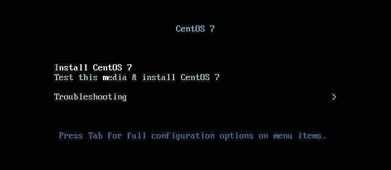

    安装程序从安装菜单启动

    ### 注意

    如果系统没有启动到安装菜单，则可能是驱动器未被配置为启动设备。验证和调整配置的具体步骤因 BIOS 厂商而异，但通常在系统启动时按下*Esc, F1, F2*或*Delete*键可以进入 BIOS 设置。然后，你需要找到启动设备列表，并更改设备搜索启动记录的顺序。

1.  使用箭头键确保**Install CentOS 7**选项被高亮显示，然后按*Enter*键。

1.  **WELCOME TO CENTOS 7** 屏幕确认了安装过程中使用的语言。选择你希望使用的语言，然后点击**Continue**：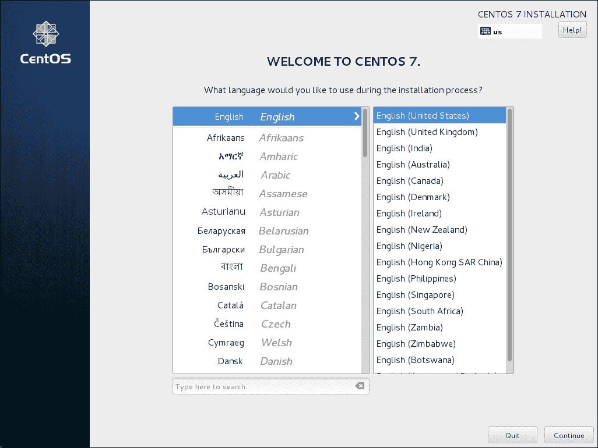

    你可以在安装过程中更改所使用的语言。

1.  下一屏是一个按类别组织安装选项的菜单。我们首先配置网络—点击**网络和主机名**，位于**系统**类别下：

    ### 注意

    如果你的系统没有鼠标，你可以使用*Tab*键在输入框之间切换，使用方向键选择条目，按*Enter*键选择或激活输入。

    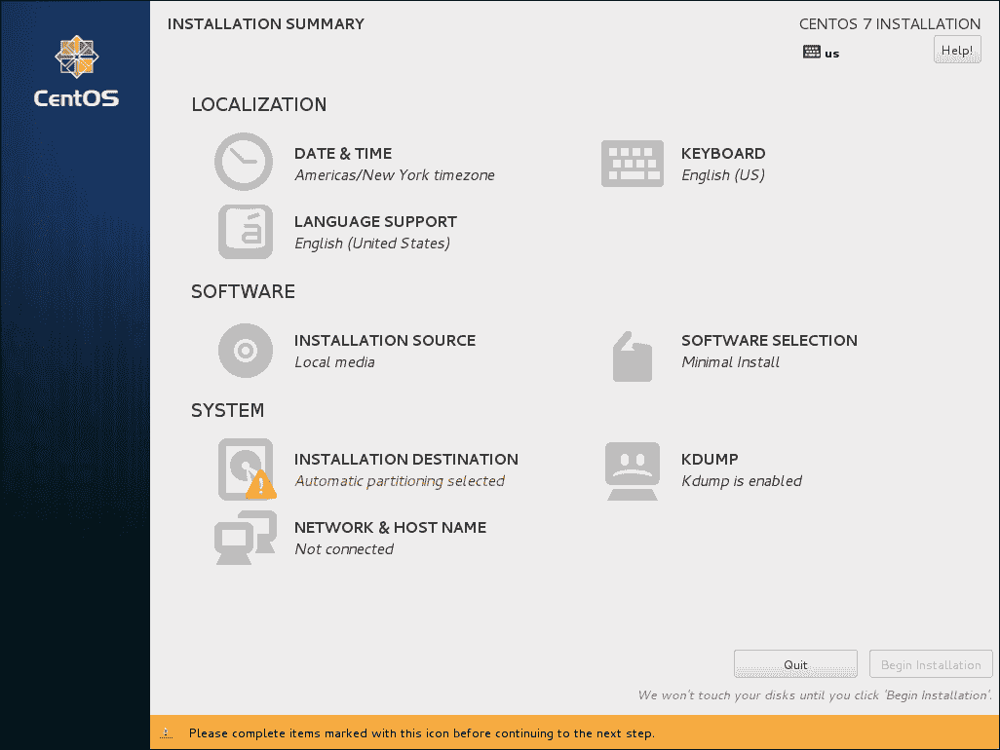

    安装总结屏幕将安装选项组织成类别

1.  在**主机名**字段中输入系统的主机名。然后，选择系统的主要网络接口，并将右侧的开关切换到**开启**以启用它。完成后，点击**完成**按钮返回**安装总结**菜单：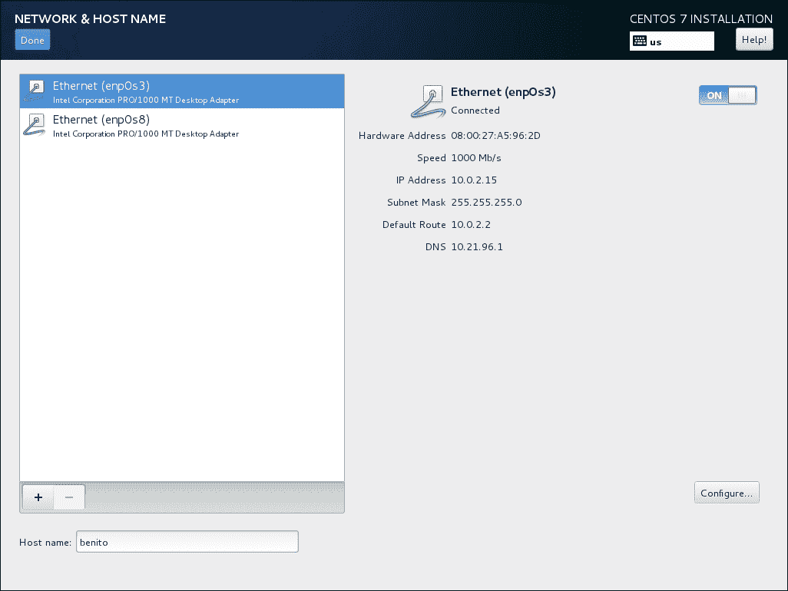

    **网络和主机名**屏幕让我们配置系统的网络接口

1.  点击**日期和时间**，位于**本地化**类别下。

1.  通过选择你的区域和城市或点击地图上的位置来设置时区。然后，点击**完成**以返回**安装总结**菜单：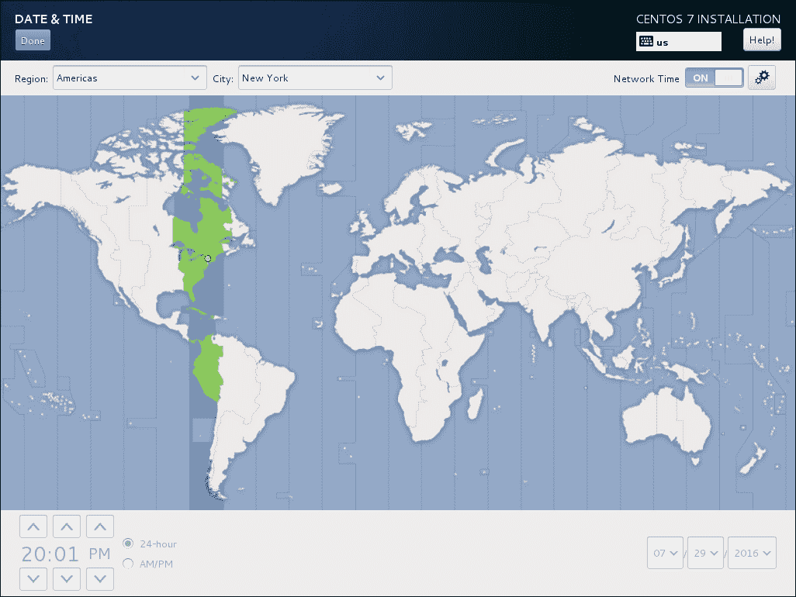

    **日期和时间**屏幕让我们配置系统的时区

1.  如果你知道系统在网络中的用途，并且需要更多的功能而不仅仅是最小化安装，请点击**软件选择**，位于**软件**类别下。选择环境和任何附加组件，以安装所需的软件包。完成后，点击**完成**：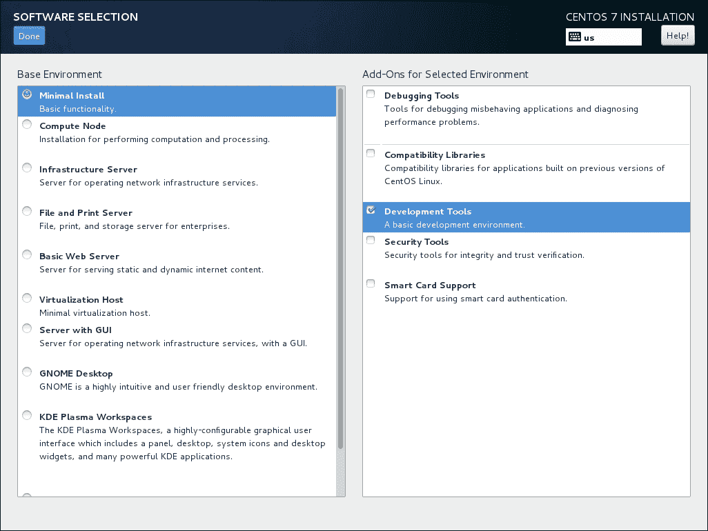

    **软件选择**屏幕让我们安装基于目的的软件

    ### 注意

    软件可以通过`yum`轻松安装，因此如果你在 CentOS 已经运行后需要安装额外的软件，别担心。**软件选择**部分仅为方便而设。

1.  点击**安装目标**，位于**系统**类别下。

1.  在**本地标准磁盘**区域中点击合适的磁盘以设置安装目标。如果磁盘不可启动，或者如果选择了多个磁盘，请点击屏幕底部的**完整磁盘摘要和引导加载器...**链接，打开**已选择磁盘**窗口。然后，选择你想作为启动设备的磁盘，点击**设置为启动设备**按钮，再点击**关闭**。完成后，点击**完成**：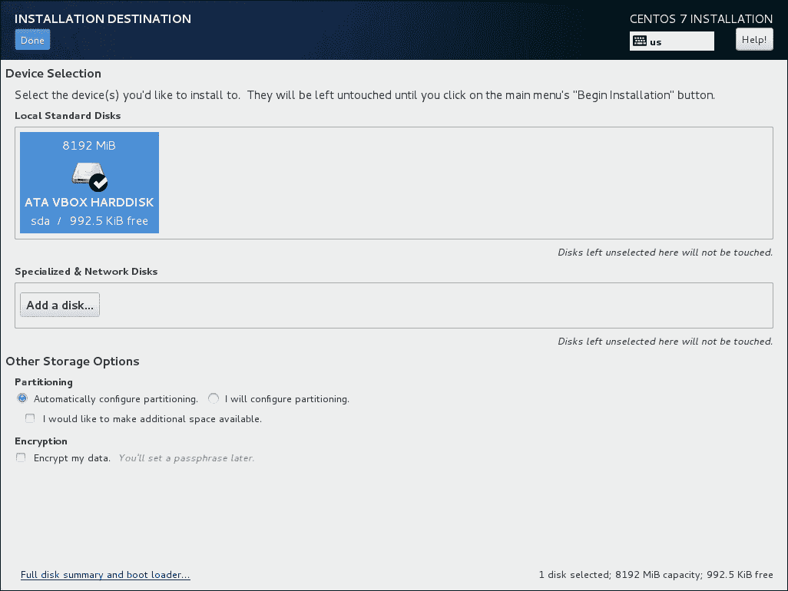

    安装目标屏幕允许我们设置 CentOS 安装的磁盘

1.  点击**开始安装**按钮以启动安装过程。

1.  点击**根密码**。在输入框中输入并确认你想要用于系统根账户的密码。输入完这些信息后，点击**完成**：

    ### 注意

    如果你指定的密码太弱，你需要按两次完成按钮才能返回配置屏幕。如果你需要帮助来创建强密码，请访问[`www.howtogeek.com/195430/how-to-create-a-strong-password-and-remember-it/`](http://www.howtogeek.com/195430/how-to-create-a-strong-password-and-remember-it/)。

    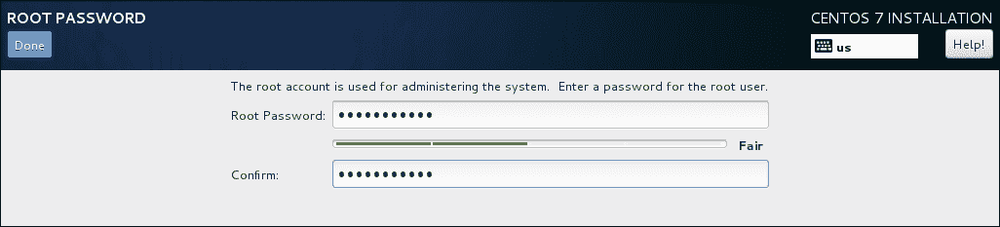

    ROOT 密码设置屏幕允许我们设置 root 账户的密码。

1.  点击**创建用户**。在输入框中，提供你的姓名、用户名和所需的密码。再次，在输入完成后按**完成**：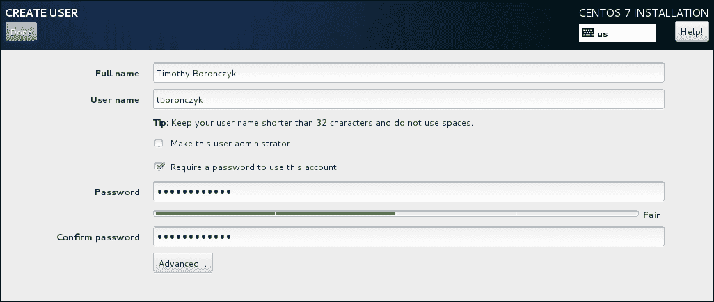

    **创建用户**屏幕让我们创建一个无权限的用户账户。

1.  安装完成后，点击**完成配置**按钮。Anaconda 将完成系统配置，按钮的标签将更改为**重启**。

1.  从驱动器中移除 CentOS 安装介质，然后重启系统。

## 它是如何工作的...

在图形模式下使用 Anaconda 安装 CentOS 后，你现在应该已经有了一个基本的 CentOS 7 系统。这个过程始于我们从安装光盘启动系统并在安装菜单中选择**安装 CentOS 7**。安装程序的内核被加载到内存中，Anaconda 在图形模式下启动。

**网络与主机名**屏幕显示了可用网络接口的列表和一些基本信息，例如网卡的 MAC 地址和传输速率。默认情况下，启用接口时会配置为使用 DHCP 获取 IP 地址。（静态 IP 地址的配置将在后续的教程中讲解。）

系统的时区在**本地化**屏幕上设置。当启用 NTP 时，日期和时间字段会被禁用，因为这些值将由 NTP 服务设置。系统时钟的时间可能会出现漂移，尤其是在虚拟机上运行时，因此允许 NTP 来管理系统时间是个不错的主意，以确保时间准确。如果日期和时间字段未由 NTP 设置，确保**网络时间**开关已设置为**开启**。你可以通过点击带齿轮图标的按钮来指定一个 NTP 服务器。

**安装目标**屏幕让我们为 CentOS 设置安装目标，并指定系统驱动器的分区方式。如果你有特殊需求，可以选择配置分区，但在本教程中，我让 Anaconda 自动分区驱动器。

当 Anaconda 正在安装 CentOS 和你可能请求的其他软件包时，它会显示**配置**屏幕。此屏幕让你有机会为系统的管理员账户 (`root`) 设置密码，并创建一个普通用户账户。你应仅在必要时使用 `root` 账户登录；日常工作中应使用普通账户。Anaconda 通过配置系统的引导记录和创建用户账户来完成安装。

系统重启后，Grub 启动加载器提示符出现，使用箭头键选择启动配置。系统还会显示一个计时器，因此如果不按任何键，系统将使用默认配置启动。

## 另见

有关安装 CentOS 7 的更多信息，请参阅 RHEL 7 安装指南（[`access.redhat.com/documentation/en-US/Red_Hat_Enterprise_Linux/7/html/Installation_Guide`](https://access.redhat.com/documentation/en-US/Red_Hat_Enterprise_Linux/7/html/Installation_Guide/)）。

# 使用 Anaconda 在文本模式下安装 CentOS

接下来，你将学习如何使用 Anaconda 在文本模式下安装 CentOS。建议你图形化安装 CentOS，因为图形模式更易于使用，且提供更多功能。然而，当系统资源不足以以图形模式运行安装程序时，例如显示适配器能力有限或内存不足时，图形模式可能不可用。

## 准备工作

本教程假设你已有 CentOS 7 安装介质的副本。如果没有，请访问 [`www.centos.org`](https://www.centos.org) 下载 ISO 镜像，并将镜像刻录到光盘上。

## 如何操作...

按照以下步骤执行基于文本的 CentOS 安装：

1.  将安装光盘插入系统的光驱（或将 USB 闪存驱动器插入 USB 端口），然后重新启动系统。系统应该会启动到 CentOS 7 安装菜单。

1.  使用箭头键，确保**安装 CentOS 7**选项被高亮显示，然后按***Tab***键。安装程序内核的启动命令会出现在屏幕底部。

1.  在参数列表末尾添加 `text` 并按 ***Enter*** 键。Anaconda 将以文本模式启动：

    ```
           vmzlinuz initrd=initrd.img inst.stage2=hd:LABEL=CentOS 
           \x207\x20x86_64 rd.live.check quiet text 

    ```

    ### 注意

    如果系统内存小于 768 MB，Anaconda 将自动以文本模式启动。

1.  **安装**菜单按类别展示安装选项。输入 **2** 并按 *Enter* 键选择**时区设置**：如何操作...

    基于文本的安装菜单按类别展示安装选项

1.  **时区设置**菜单显示一个地区列表。输入所需选项对应的编号。

1.  系统会显示所选地区的可用时区列表（如果列表较长，可以通过按 *Enter* 键翻页）。输入所需时区对应的编号。

1.  如果你知道系统的用途，并且需要比最小安装更多的功能，输入**3**选择**软件选择**。在这里，你可以选择适合该用途的软件包组。完成后，输入*c*继续返回到**安装**菜单。

1.  输入**5**选择**网络设置**。

1.  输入**1**设置系统的主机名。输入所需的名称并按*Enter*键。

1.  输入数字配置系统的主要网络接口。然后，输入**7**标记**重启后自动连接**，并输入**8**标记**在安装程序中应用配置**。输入*c*返回到**网络设置**菜单，再输入*c*返回到**安装**菜单：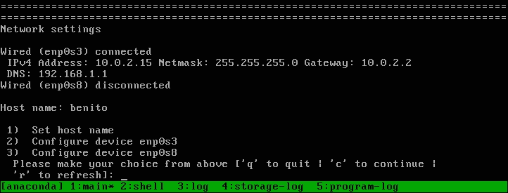

    网络设置菜单让我们配置系统的网络接口。

1.  输入**6**选择**安装目标**。

1.  如果目标驱动器尚未标记，请输入驱动器的编号。然后，输入*c*继续。以下截图显示了**自动分区选项**菜单：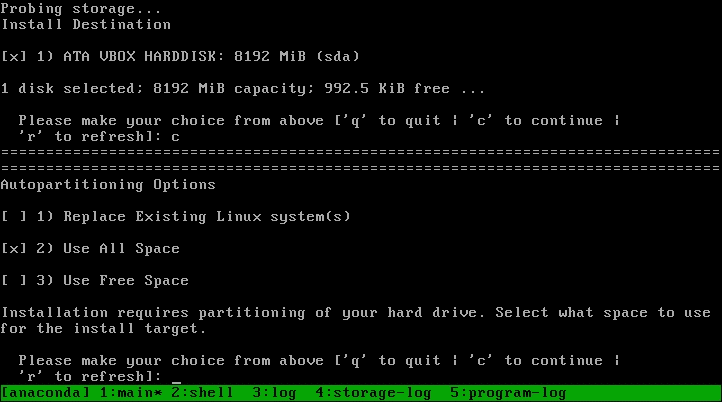

    安装目标菜单让我们设置安装目标，而自动分区选项菜单让我们指定磁盘的使用方式。

1.  输入所需分区的编号（默认是**使用所有空间**），然后输入**c**继续。

1.  选择所需的分区方案（默认是**LVM**），然后输入*c*返回到**安装**菜单。

1.  输入**8**选择**创建用户**。

1.  输入**1**标记**创建用户**选项。输入**2**和**3**分别为账户设置用户名。输入**4**标记**使用密码**选项，然后输入**5**设置你的密码。接着，输入*c*返回到**安装**菜单：

    ### 注意

    如果提供的密码过于简单，你必须确认是否真的要使用该密码。

    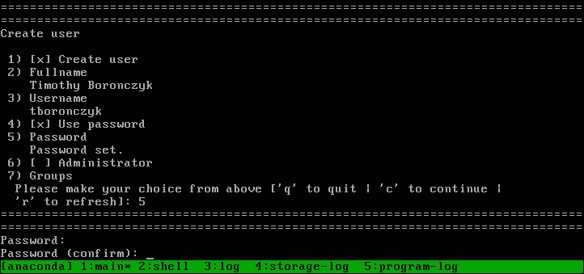

    创建用户菜单让我们创建一个非特权用户账户。

1.  输入**9**选择**设置 root 密码**。输入并确认你希望用于系统 root 账户的密码。

1.  在解决了所有需要关注的部分后，输入*b*开始安装过程。

1.  安装完成后，移除驱动器中的介质并重启系统。

## 它是如何工作的...

本教程展示了如何使用 Anaconda 在文本模式下安装 CentOS。过程从我们通过安装光盘启动系统，选择**安装 CentOS 7**进入安装菜单，并将`text`选项添加到启动参数开始。安装程序的内核加载到内存中，Anaconda 在文本模式下启动。

基于文本的安装方式类似于在图形模式下安装 CentOS，需要回答时区、软件和网络信息的提示。然而，Anaconda 在文本模式下呈现提示的顺序不同，并且缺少某些功能。例如，我们无法进行自定义磁盘分区。尽管如此，文本模式仍然可以让我们快速安装一个基础的 CentOS 系统。

## 另请参见

欲了解有关安装 CentOS 7 的更多信息，请参考 RHEL 7 安装指南（[`access.redhat.com/documentation/en-US/Red_Hat_Enterprise_Linux/7/html/Installation_Guide`](https://access.redhat.com/documentation/en-US/Red_Hat_Enterprise_Linux/7/html/Installation_Guide)）。

# 使用 Kickstart 协调多个安装

如果您计划在多个服务器上安装 CentOS，自动化尽可能多的过程会更方便。在本教程中，您将学习如何使用 Anaconda 的 `kickstart.cfg` 文件执行无人值守的网络安装。

## 准备工作

本教程需要至少两台网络上的系统：一台现有系统，运行 HTTP 服务器以托管安装文件和 Kickstart 配置（教程 *安装 Apache HTTP 服务器和 PHP* 在 第十章，*管理 Web 服务器* 中展示了如何安装 Apache）和目标系统，我们将在其上安装 CentOS。您还需要安装介质和管理员权限。

## 如何操作...

按照以下步骤使用 Kickstart 方法执行无人值守的网络安装：

1.  使用 root 账户登录运行 HTTP 服务器的系统。

1.  将安装光盘放入系统的光驱。

1.  使用 `mount` 命令挂载光盘，以便访问其内容：

    ```
    mount /dev/cdrom /media

    ```

1.  在 Apache 的 Web 根目录下创建一个新目录以托管安装文件：

    ```
    mkdir -p /var/www/html/centos/7/x86_64

    ```

1.  将安装光盘的内容复制到新目录：

    ```
    cp -r /media/* /var/www/html/centos/7/x86_64

    ```

1.  将 Anaconda 在系统安装时创建的 `kickstart.cfg` 文件复制到 Apache 的 Web 根目录：

    ```
    cp /root/kickstart.cfg /var/www/html/kickstart.cfg

    ```

1.  卸载并移除安装光盘：

    ```
    umount /media
    eject /dev/cdrom

    ```

1.  将光盘插入目标系统的驱动器并重启。系统应启动到 CentOS 7 安装菜单。

1.  高亮显示 **Install CentOS 7** 选项并按 *Tab*。

1.  更新用于启动安装程序内核的参数，使其如下所示。根据需要更改 IP 地址，指向托管 Kickstart 文件的系统：

    ```
           vmlinuz initrd=initrd.img ks=http://192.168.56.100/kickstart.cfg 

    ```

1.  按 *Enter* 开始安装过程。

1.  一旦安装过程开始，您可以弹出光盘并开始安装下一个系统。对每个附加系统重复步骤 8-11。

## 原理...

Anaconda 会将我们在执行图形或文本安装时提供的配置值写入 `kickstart.cfg`。如果你计划在多台服务器上安装 CentOS，使用该文件提供界面的答案会更加方便。剩余的安装大多数可以无人值守地进行，系统配置也会更加一致。

本教程展示了如何使 `kickstart.cfg` 文件和 CentOS 安装文件通过网络提供给其他系统，并更新启动命令，以告诉 Anaconda 从哪里查找安装文件和回答提示。由于软件包是从安装服务器而不是光盘获取的，因此安装过程开始后，你可以立即弹出光盘，并使用它开始下一个系统的安装过程。

当然，`kickstart.cfg` 可以作为起点，你可以使用文本编辑器编辑响应，以进一步自定义安装。如果你愿意，也可以在 Web 根目录下创建多个 kickstart 文件，每个文件有不同的配置。只需在设置安装程序的启动参数时指定所需的文件即可。

### 提示

尽管你可以使用基本的文本编辑器编辑你的 kickstart 文件，但也有专门的程序用于编辑这些文件。可以查看 Kickstart Configurator ([`landoflinux.com/linux_kickstart_configurator.html`](http://landoflinux.com/linux_kickstart_configurator.html))。

## 另请参见

欲了解更多有关协调多个 CentOS 7 安装的信息，请参考以下资源：

+   RHEL 7 安装指南 ([`access.redhat.com/documentation/en-US/Red_Hat_Enterprise_Linux/7/html/Installation_Guide`](https://access.redhat.com/documentation/en-US/Red_Hat_Enterprise_Linux/7/html/Installation_Guide))

+   Anaconda 文档 ([`rhinstaller.github.io/anaconda/index.html`](http://rhinstaller.github.io/anaconda/index.html))

+   在 CentOS 7 上安装 PXE 服务器 ([`www.unixmen.com/install-pxe-server-centos-7`](http://www.unixmen.com/install-pxe-server-centos-7))

# 使用 Amazon Web Services 的 EC2 运行云镜像

Amazon Web Services (AWS) 是一套托管在 Amazon 网络基础设施中的服务，允许公司和个人利用其计算/存储能力和全球数据中心。弹性云计算 (EC2) 是一个虚拟化平台，允许我们按需设置虚拟系统，通常用于托管网站和 Web 应用程序。本教程将带你完成在 AWS 平台上设置运行 CentOS 的新虚拟服务器的过程。

## 准备工作

本教程假设你已拥有一个 AWS 账户。你可以在 [`aws.amazon.com`](http://aws.amazon.com) 上注册。你需要提供有效的信用卡信息，尽管你将可以在 12 个月内使用 Amazon 的免费套餐。

## 如何操作...

要在 AWS 的 EC2 平台上设置新的 Amazon Machine Instance (AMI)，请按照以下步骤操作：

1.  登录到[`aws.amazon.com`](https://aws.amazon.com)，并进入 AWS 管理控制台。在**计算**类别下，点击 EC2 链接进入 EC2 管理页面。然后，点击**启动实例**按钮：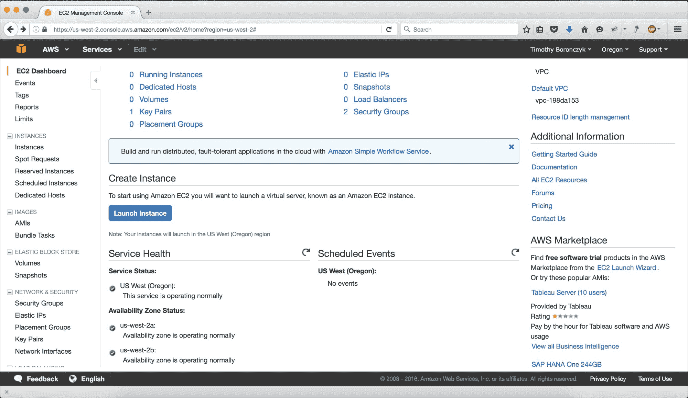

    EC2 管理控制台提供了资源的概览和快速访问方式

1.  在**选择 Amazon 机器镜像（AMI）**页面，侧边菜单中选择**社区 AMIs**，然后勾选**CentOS**过滤器。将显示社区创建的实例列表。选择你需要的那个：

    ### 注意

    仔细查看可用镜像列表。有许多镜像，使用不同版本的 CentOS 和各种配置创建。

    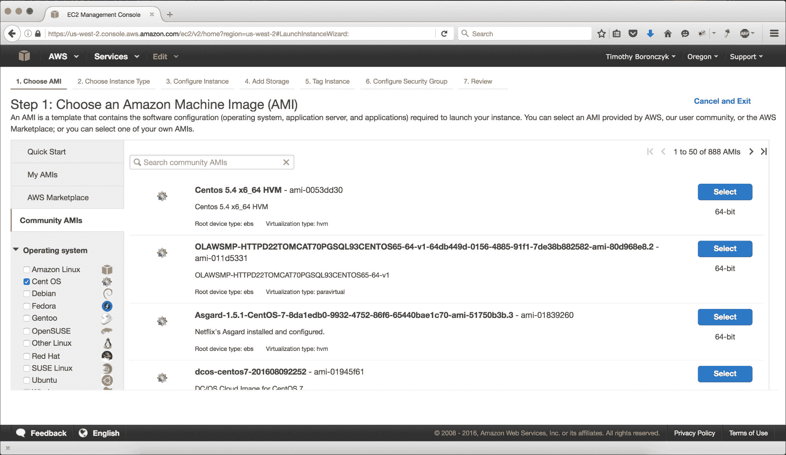

    镜像选择页面展示了一个可过滤的社区用户创建的机器镜像列表。

1.  在**检查实例启动**页面，查看实例的资源（虚拟 CPU 数量、可用内存等），然后点击**启动**按钮：

    ### 注意

    亚马逊通过向导式的方式引导你选择并配置 AMI，页面顶部列出步骤。**检查**和**启动**按钮直接跳转到最后一步。你可以使用页面顶部的链接返回到早期步骤并调整实例的配置。

    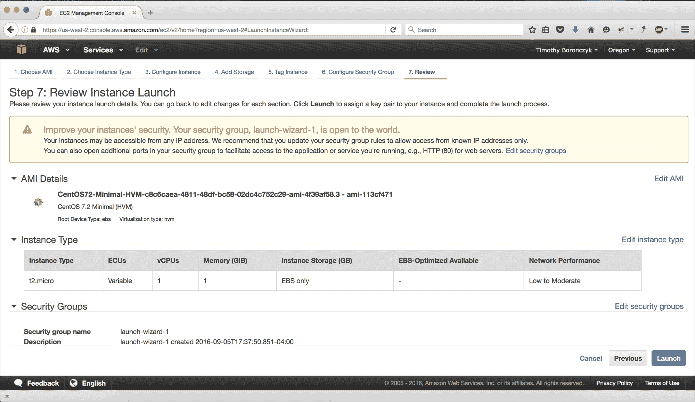

    在**检查实例启动**页面查看实例的资源

1.  使用下拉列表，选择**创建一个新的密钥对**，输入一个合适的文件名作为密钥名，然后点击**下载密钥对**按钮。保存下载的私有加密密钥后，点击**启动实例**按钮：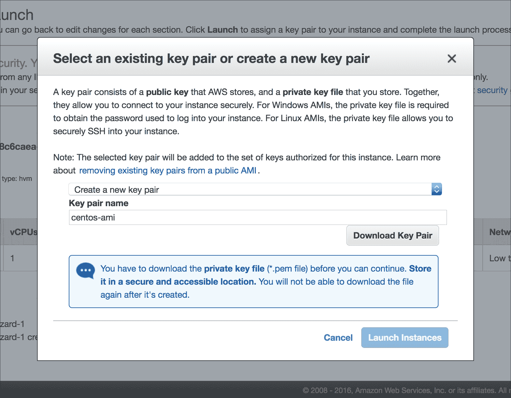

    第一次启动镜像时，你会被提示创建一对加密密钥

1.  在启动状态页面，点击页面底部的**查看实例**按钮。然后，右键点击正在运行的实例，从上下文菜单中选择**连接**。选择首选的连接方式，并按照屏幕上显示的说明操作。

## 它是如何工作的...

本教程将引导你完成在 AWS 的 EC2 平台上启动新的 CentOS AMI 的步骤。要登录系统，需要一个密码或一对加密密钥，由于主要用户账户的密码可能是未知的，我们选择生成一对新的密钥。私钥被下载并随后与 SSH 客户端一起使用，以验证登录身份。

登录到运行中的系统后，查看 `/etc/system-release` 文件的内容，以验证当前运行的 CentOS 版本。同时，如果根账户未被锁定，建议使用 `passwd` 命令修改密码。这是一个重要的安全措施，因为你无法知道谁知道默认密码。关于用户权限管理的食谱请参考第三章，*用户和权限管理*，关于远程访问管理的食谱请参考第六章，*允许远程访问：*

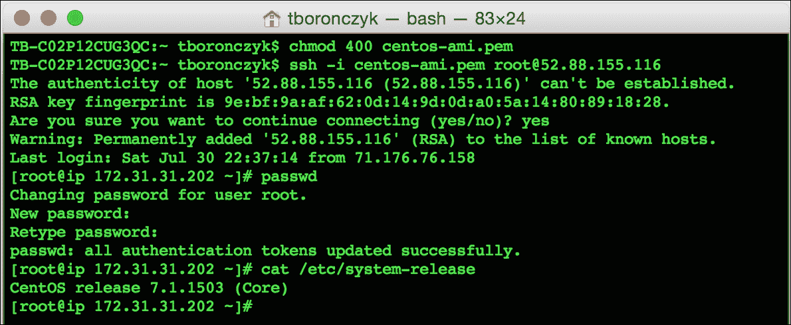

登录后，验证系统的版本号并更新根密码

## 另见

更多关于在 Amazon EC2 平台上使用 AMI 的信息，请参阅以下资源：

+   什么是 Amazon EC2？（[`docs.aws.amazon.com/AWSEC2/latest/UserGuide/concepts.html`](http://docs.aws.amazon.com/AWSEC2/latest/UserGuide/concepts.html)）

+   连接到你的 Linux 实例（[`docs.aws.amazon.com/AWSEC2/latest/UserGuide/AccessingInstances.html`](http://docs.aws.amazon.com/AWSEC2/latest/UserGuide/AccessingInstances.html)）

+   删除 SSH 主机密钥对（[`docs.aws.amazon.com/AWSEC2/latest/UserGuide/building-shared-amis.html#remove-ssh-host-key-pairs`](http://docs.aws.amazon.com/AWSEC2/latest/UserGuide/building-shared-amis.html#remove-ssh-host-key-pairs)）

# 从 Docker 注册表安装容器镜像

本食谱展示了如何使用 Docker 获取 CentOS 基础镜像来满足开发需求。Docker 是一种基于容器概念的虚拟化策略，每个容器将目标软件封装在自己的文件系统中，这样它就可以在安装的操作系统上运行，无论操作系统如何。开发者特别喜欢 Docker，因为它有助于在开发和部署环境之间保持一致性。

## 准备工作

该步骤假设你已安装 Docker。如果没有安装，可以从 [`www.docker.com`](http://www.docker.com) 获取 Docker 安装程序。

## 如何操作...

按照以下步骤从 Docker 注册表安装 CentOS 容器镜像：

1.  打开 Docker Toolbox 终端程序。

1.  在终端的提示符下，调用 `docker pull` 命令以获取 CentOS 7 容器：

    ```
    docker pull centos:7

    ```

1.  容器下载后，你可以使用 `docker run` 启动交互式 shell：

    ```
    docker run -i -t centos:7 /bin/bash

    ```

## 如何工作...

本食谱使用 `docker pull` 命令从 Docker 注册表获取官方 CentOS 容器。通过提供版本标签（`:7`），我们可以确保获取到的是 CentOS 7，而不是更早或更高版本。

或者，Kitematic 是一个图形化程序，允许我们从注册表中搜索并检索容器。只需启动 Kitematic，并在搜索框中输入 CentOS 作为搜索词，然后在结果列表中查找官方 CentOS 仓库。

Kitematic 获取的默认版本是最新版本。要选择 CentOS 7 或维护版本，请点击条目的省略按钮。设置所需的标签，然后点击 **创建** 按钮：

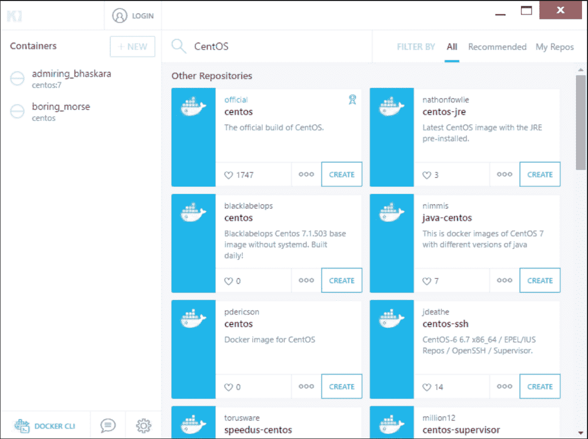

Kitematic 显示了搜索 CentOS 的结果

## 另见：

请参考以下资源获取有关使用 Docker 的更多信息：

+   Docker 主页（[`www.docker.com`](http://www.docker.com)）

+   了解 Docker 架构（[`docs.docker.com/engine/understanding-docker`](https://docs.docker.com/engine/understanding-docker)）

+   官方 CentOS Docker Hub（[`hub.docker.com/_/centos`](https://hub.docker.com/_/centos)）

# 安装 GNOME 桌面

本步骤展示了如何安装 GNOME 桌面环境，它为你在 CentOS 系统中工作提供了一个图形用户界面（GUI）。通常，这种环境不会安装在服务器系统上，但有时拥有一个图形环境是很方便的。例如，管理员可能会觉得使用图形程序更新系统配置会更加舒适。

### 注意：

GNOME 并不是唯一可用的 GUI 环境——其他流行的环境包括 KDE、XFCE 和 Fluxbox。如果 GNOME 不是你的菜，下一步将展示如何安装 KDE。

## 准备工作

本步骤需要一个有网络连接的 CentOS 系统。还需要通过 `root` 账户登录以获得管理员权限。

## 如何操作...

按照以下步骤安装 GNOME 桌面环境：

1.  使用 `yum groupinstall` 安装 `GNOME Desktop` 软件包组：

    ```
    yum groupinstall "GNOME Desktop"

    ```

1.  手动使用 `startx` 启动桌面环境：

    ```
    startx

    ```

1.  如果安装了多个环境，你需要指定 `gnome-session` 的路径：

    ```
    startx /usr/bin/gnome-session

    ```

1.  当你完成 GNOME 的使用并从桌面注销后，你将返回到控制台。

1.  要配置系统在启动时自动启动图形环境，请将默认启动目标设置为 `graphical.target`：

    ```
    systemctl set-default graphical.target

    ```

## 它是如何工作的...

本步骤使用 `yum` 安装 GNOME 桌面环境。所有必要的组件和依赖项都由 `GNOME Desktop` 软件包组安装。软件包组可以节省时间和麻烦，因为它们允许我们一次性安装一组用于共同任务的软件包，而不是逐个安装单独的软件包。

```
yum groupinstall "GNOME Desktop"

```

与 Windows 不同，Windows 的图形桌面是操作系统的一部分，而 Linux 系统将基本的图形和输入处理委托给图形服务器。这种方法是为什么有多个桌面环境可供选择的原因之一——它将许多具体细节抽象化，并提供了一个公共平台，任何数量的环境都可以在其上运行，无论是本地的还是跨网络的。CentOS 的默认图形服务器是 X Window System。

如果 GNOME 是唯一安装的桌面环境，当我们通过 `startx` 启动 X 时，它会作为默认桌面启动。然而，如果安装了多个桌面环境，我们需要告诉 X 我们想要运行哪个桌面。对于 GNOME，我们需要提供 `gnome-session` 的路径：

```
startx /usr/bin/gnome-session

```

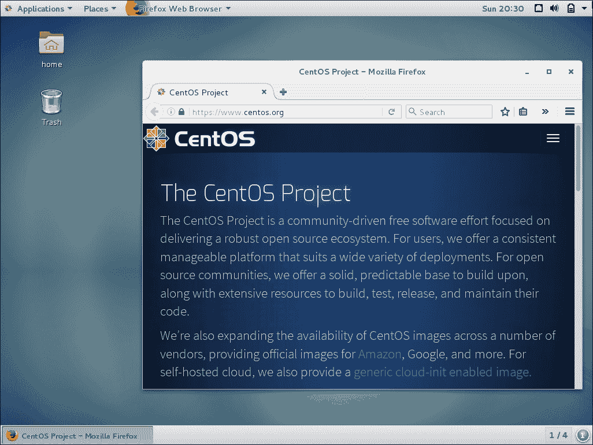

GNOME 桌面提供了一个用于操作系统的图形化界面

systemd 服务管理器负责在系统启动时启动各种服务器和进程。`systemctl` 命令是我们与服务管理器的接口，可以用来设置默认的启动目标。默认目标决定了系统是启动到终端还是图形化登录界面：

```
systemctl set-default graphical.target

```

当设置为图形模式时，systemd 会在系统启动时启动 X 和 GNOME 显示管理器，这会为我们呈现一个图形化登录界面，让我们提供账户信息。一旦身份验证通过，桌面会话就会启动，我们会进入 GNOME 桌面。

如果你不再希望启动到图形环境，可以将默认目标设置回多用户模式，系统将再次启动到基于终端的登录屏幕：

```
systemctl set-default multi-user.target

```

### 提示

如果安装了多个桌面环境，你可以通过登录屏幕上的齿轮按钮来选择想要使用的桌面环境：

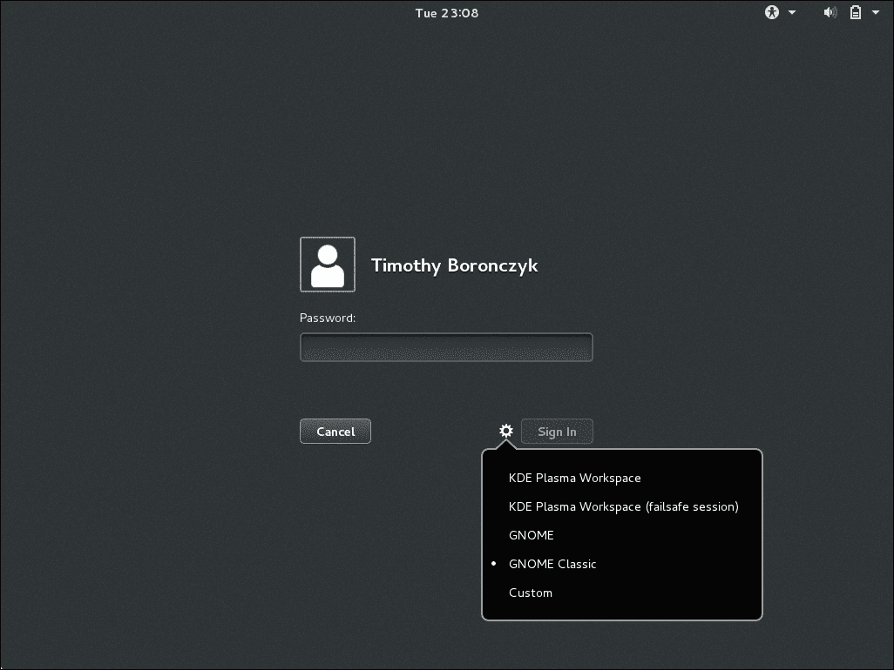

你可以从登录屏幕选择你喜欢的桌面

## 另见

以下资源将为你提供更多关于安装图形化桌面环境和使用 GNOME 桌面的信息：

+   GNOME 库 ([`help.gnome.org`](https://help.gnome.org))

+   RHEL 7 桌面迁移与管理指南 ([`access.redhat.com/documentation/en-US/Red_Hat_Enterprise_Linux/7/html/Desktop_Migration_and_Administration_Guide`](https://access.redhat.com/documentation/en-US/Red_Hat_Enterprise_Linux/7/html/Desktop_Migration_and_Administration_Guide))

+   *X11/启动会话指南* ([`en.wikibooks.org/wiki/Guide_to_X11/Starting_Sessions`](https://en.wikibooks.org/wiki/Guide_to_X11/Starting_Sessions))

+   如何在 CentOS 7 上安装桌面环境 ([`unix.stackexchange.com/questions/181503/how-to-install-desktop-environments-on-centos-7/181504#181504`](http://unix.stackexchange.com/questions/181503/how-to-install-desktop-environments-on-centos-7/181504#181504))

# 安装 KDE Plasma 桌面

将图形界面与操作系统分离，使得用户可以选择他们最喜欢的图形环境。如果你不是 GNOME 的粉丝，也不用担心，因为还有很多其他桌面环境可以探索！本教程将教你如何安装另一个流行的桌面环境 KDE Plasma Workspaces。

## 准备工作

本教程需要一台连接到网络的 CentOS 系统。登录时需要使用 root 账户来获取管理员权限。

## 如何操作...

按照以下步骤安装 KDE Plasma Workspaces 桌面环境：

1.  安装`KDE Plasma 工作空间`软件包组：

    ```
    yum groupinstall "KDE Plasma Workspaces"

    ```

1.  使用`startkde`手动启动桌面环境。当您退出桌面时，将返回到控制台：

    ```
    startkde

    ```

1.  要配置系统在启动时自动启动图形环境，请使用`systemctl`将默认启动目标设置为`graphical.target`：

    ```
    systemctl set-default graphical.target

    ```

## 它的工作原理...

此方法通过 Yum 软件包组安装 KDE Plasma 工作空间桌面环境。安装`KDE Plasma 工作空间`软件包组会安装运行 KDE 所需的所有必要软件组件和依赖项：

```
yum groupinstall "KDE Plasma Workspaces"

```

`startkde`脚本启动 X 服务器并启动 KDE 环境。与 GNOME 不同，我们不直接调用`startx`，因此在安装多个环境时无需提供额外的路径：

```
startkde

```

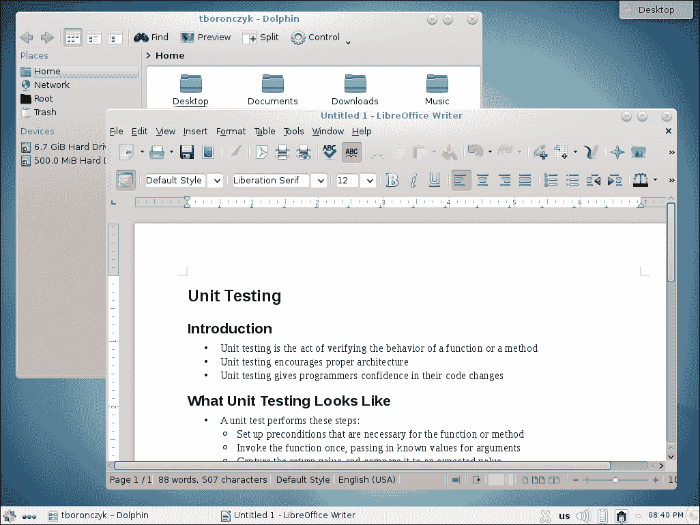

KDE Plasma 工作空间是一款受欢迎的 Linux 系统图形桌面环境。

## 另请参阅

以下资源将为您提供有关安装和使用 KDE Plasma 工作空间的更多信息：

+   如何在 CentOS 7 上安装桌面环境（[`unix.stackexchange.com/questions/181503/how-to-install-desktop-environments-on-centos-7/181504#181504`](http://unix.stackexchange.com/questions/181503/how-to-install-desktop-environments-on-centos-7/181504#181504)）

+   KDE 文档（[`docs.kde.org`](https://docs.kde.org)）
