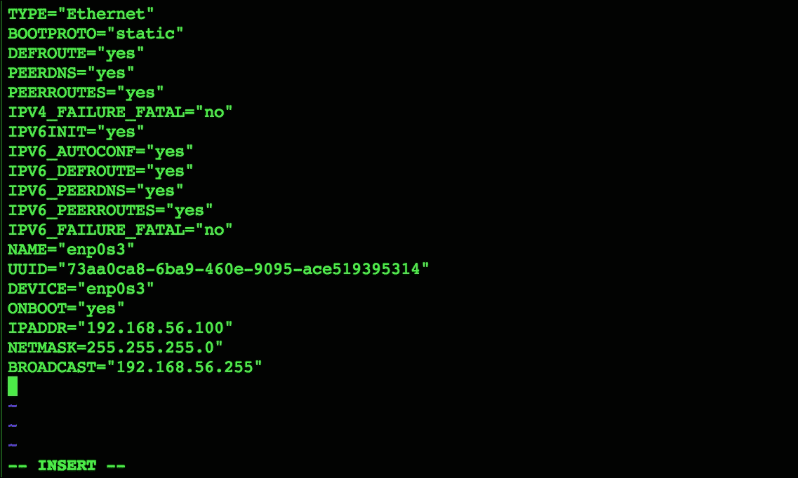
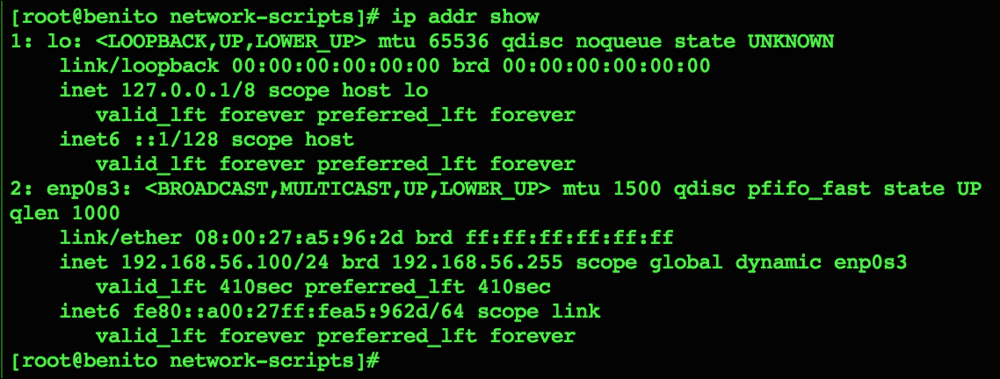
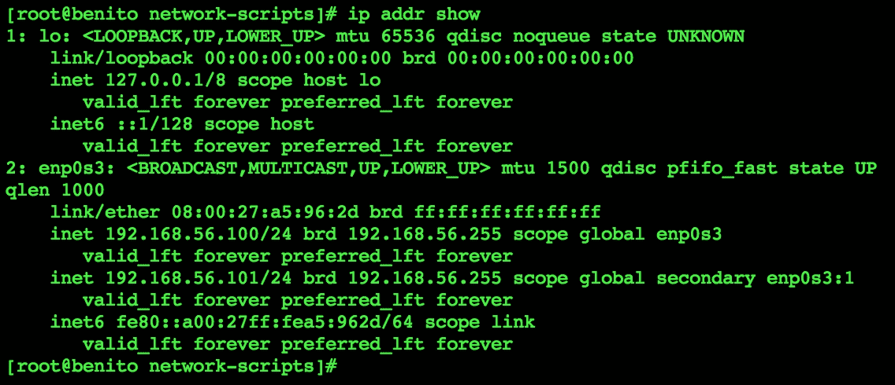
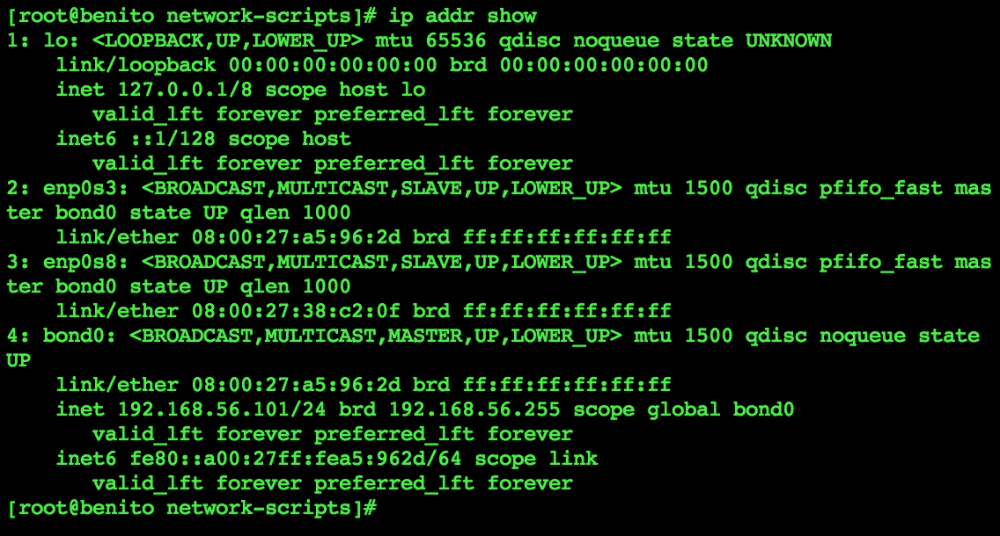
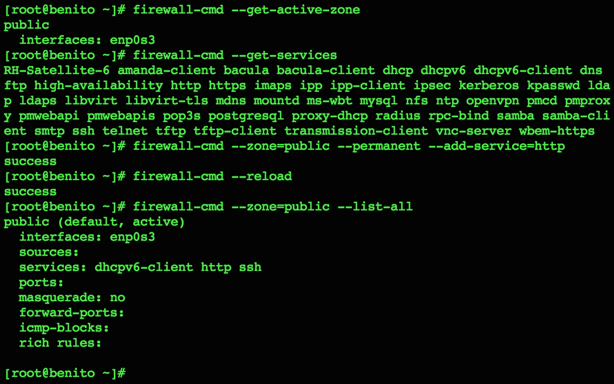
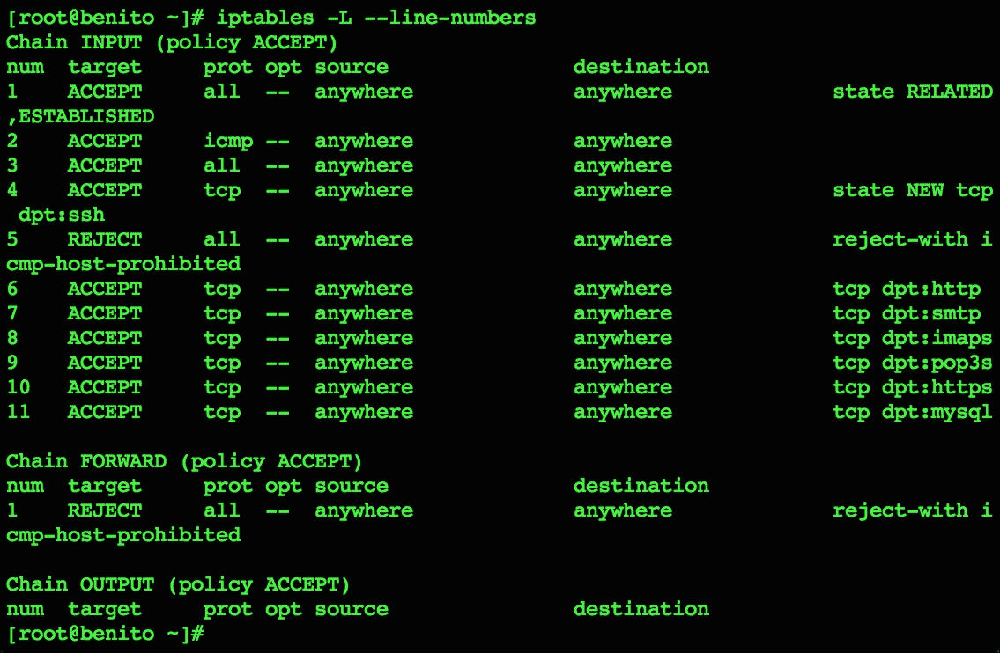
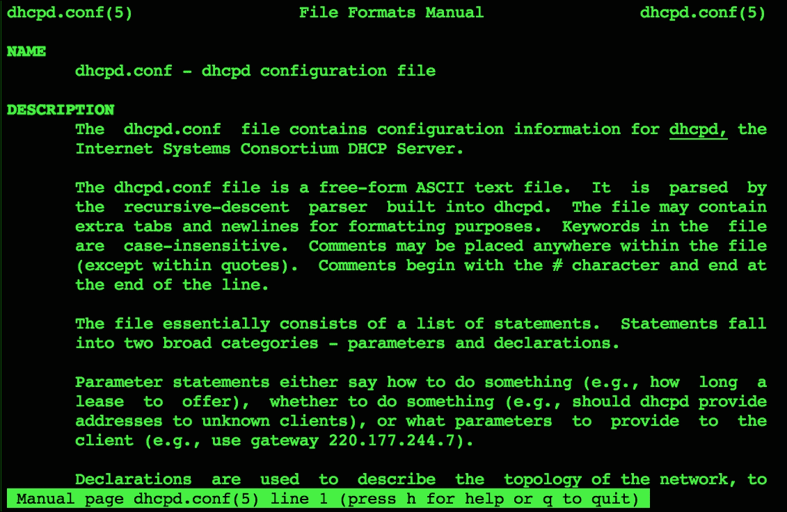
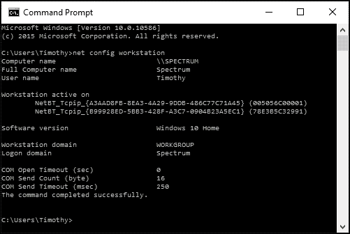
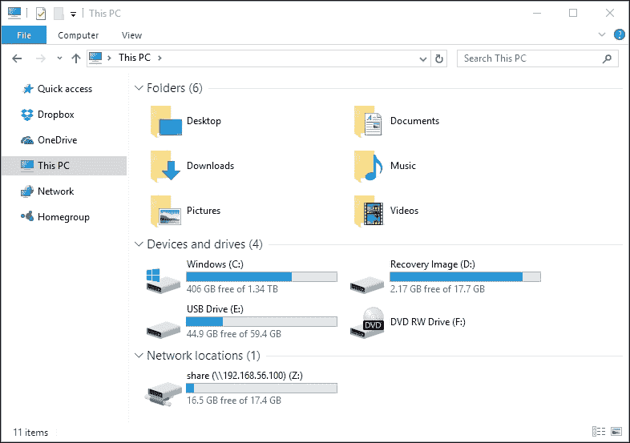

# 第二章。网络

本章包含以下示例：

+   设置静态 IP 地址

+   将多个地址绑定到单个以太网设备

+   绑定两个以太网设备

+   使用 FirewallD 配置网络防火墙

+   使用 iptables 配置网络防火墙

+   安装 DHCP 服务器

+   配置 NFS 服务器以共享文件系统

+   配置 NFS 客户端以使用共享文件系统

+   使用 Samba 服务 Windows 共享

# 简介

本章中的示例涵盖各种网络任务，这些任务对 CentOS 管理员应该很有用。您将学习如何配置静态 IP 地址，将多个地址绑定到单个以太网设备，并将两个设备绑定在一起。您还将了解如何使用 FirewallD 和 iptables 配置系统防火墙，以及如何设置 DHCP 服务器以分发 IP 地址，从而允许使用动态网络配置的其他计算机访问网络。其余示例将教您如何使用 NFS 和 Samba 设置集中式文件存储。

# 设置静态 IP 地址

此示例向您展示如何配置静态 IP 地址。除非在安装过程中配置了静态地址，否则 CentOS 使用动态主机配置协议（DHCP）获取 IP 地址以跨网络进行通信。对于大多数桌面和笔记本系统来说，使用动态分配的地址是可以接受的，但是那些托管电子邮件服务器、文件共享和打印服务以及 Web 服务器的系统应具有不变的地址。静态地址为用户提供了网络上的稳定、已知位置，用户可以访问系统的服务。

## 准备工作

此示例要求 CentOS 系统具有正常的网络连接，并通过使用 `root` 帐户登录来提供管理员权限。假设您的主要以太网设备命名为 `enp0s3` 并且当前配置为 DHCP。如果您的设备名称不同，请在以下命令中适当替换其名称。

## 如何做…

按照以下步骤配置静态 IP 地址：

1.  使用文本编辑器打开以太网设备的配置文件，位于 `/etc/ sysconfig/network-scripts` 下：

    ```
    vi /etc/sysconfig/network-scripts/ifcfg-enp0s3

    ```

1.  将 `BOOTPROTO` 的值更改为 none：

    ```
    BOOTPROTO="none"

    ```

1.  在文件末尾添加 `IPADDR`、`NETMASK` 和 `BROADCAST` 条目以设置所需的 IP 地址。分配适当反映您网络的值：

    ```
    IPADDR="192.168.56.100"
    NETMASK="255.255.255.0"
    BROADCAST="192.168.56.255"

    ```

    

    接口配置为静态 IP 地址

1.  保存更改并关闭文件。

1.  使用文本编辑器打开 `/etc/sysconfig/network` 文件：

    ```
    vi /etc/sysconfig/network

    ```

1.  添加 `GATEWAY` 条目以标识您网络的网关：

    ```
    GATEWAY="192.168.56.1"

    ```

1.  保存更改并关闭文件。

1.  重新启动网络服务以使配置更改生效：

    ```
    systemctl restart network.service

    ```

## 工作原理…

在本教程中，你学习了如何为以太网设备分配静态 IP 地址。假设你主要的以太网设备名称为`enp0s3`，因此设备的配置文件名称为`ifcfg-enp0s3`。如果你的设备名称不同（例如，`eth0`、`eno1677`等），则需要相应调整教程中的指示。

首先，我们将`BOOTPROTO`的值从`dhcp`（用于动态获取 IP 地址的协议）更改为`none`，因为我们是手动设置地址。然后我们添加了`IPADDR`、`NETMASK`和`BROADCAST`条目，以提供静态 IP 地址的详细信息。接下来，我们通过`GATEWAY`在`/etc/sysconfig/network`中指定了网络的默认网关。这使得我们能够将流量路由到本地子网之外。

重启网络服务后，你可以使用`ip`命令确认新的地址。`ip addr show`将显示当前系统网络设备的状态信息：



`ip addr show`命令显示系统的网络信息。

## 另见

要了解更多关于在 CentOS 中配置网络设置的信息，请参考 RHEL 7 网络指南中的*配置 IP 网络*章节 ([`access.redhat.com/documentation/en-US/Red_Hat_Enterprise_Linux/7/html/Networking_Guide/ch-Configure_IP_Networking.html`](https://access.redhat.com/documentation/en-US/Red_Hat_Enterprise_Linux/7/html/Networking_Guide/ch-Configure_IP_Networking.html))。

# 将多个地址绑定到单一以太网设备

本教程展示了如何将多个 IP 地址绑定到单个以太网设备。将多个地址分配给同一设备的能力非常有用——最明显的好处是你无需购买多个以太网卡。虽然硬件成本已经大幅下降，但 IT 预算依然紧张。也许一个不那么显而易见，但更有价值的好处是，它在配置网络服务时提供了更大的灵活性。不同的服务，例如电子邮件和网站，可以在同一系统上运行，但可以使用不同的地址进行访问。

## 准备工作

本教程需要一个有工作网络连接的 CentOS 系统。假设你的主要以太网设备为`enp0s3`并配置了静态 IP 地址。你还需要通过以`root`账户登录来获得管理员权限。

## 如何操作...

按照以下步骤将多个地址绑定到同一以太网设备：

1.  复制设备的配置文件：

    ```
    cp /etc/sysconfig/network-scripts/ifcfg-enp0s3  
           /etc/sysconfig/network-scripts/ifcfg-enp0s3:1

    ```

1.  使用文本编辑器打开新文件：

    ```
    vi /etc/sysconfig/network-scripts/ifcfg-enp0s3:1

    ```

1.  完全删除`UUID`条目。如果存在`HWADDR`条目，也删除它。

1.  更新`NAME`和`DEVICE`的值：

    ```
    NAME="System enp0s3:1"
    DEVICE="enp0s3:1"

    ```

1.  将`IPADDR`的值更改为你希望使用的 IP 地址：

    ```
    IPADDR="192.168.56.101"

    ```

1.  保存更改并关闭文件。

1.  重启网络服务以使配置更改生效：

    ```
    systemctl restart network.service

    ```

## 它是如何工作的...

在这个教程中，您学会了如何为同一以太网设备分配多个 IP 地址。我们复制了其中一个原始网络配置文件，并且小心地命名它，以便创建一个虚拟适配器，并编辑其配置细节。由于第一个设备的配置文件名为`ifcfg-enp0s3`，因此新文件命名为`ifcfg-enp0s3:1`，用以创建与该设备相关联的第一个虚拟适配器。如果您想添加更多适配器（分配更多 IP 地址），请按照步骤递增命名，例如`enp0s3:2`、`enp0s3:3`等。

在配置文件中，我们移除了`HWADDR`和`UUID`条目，因为虚拟适配器不需要这些条目。然后，我们更新了`DEVICE`和`NAME`条目，以便给适配器分配一个唯一的标识，当然，我们还更新了`IPADDR`条目来分配其 IP 地址：



多个 IP 地址通过虚拟适配器绑定到一个以太网设备

## 另见

请参考以下资源以获取更多关于将多个地址绑定到同一以太网设备的信息：

+   为单个网络接口创建多个 IP 地址 ([`www.tecmint.com/create-multiple-ip-addresses-to-one-single-network-interface`](http://www.tecmint.com/create-multiple-ip-addresses-to-one-single-network-interface))

+   将多个 IP 地址分配给 CentOS 7 上的单个网络接口卡 ([`www.unixmen.com/linux-basics-assign-multiple-ip-addresses-single-network-interface-card-centos-7`](http://www.unixmen.com/linux-basics-assign-multiple-ip-addresses-single-network-interface-card-centos-7))

+   添加次要 IP 地址 ([`dbiers.me/adding-secondary-ip-addresses-centosrhel/`](https://dbiers.me/adding-secondary-ip-addresses-centosrhel/))

# 绑定两个以太网设备

在这个教程中，您将学习如何将多个以太网设备组合为一个网络设备，这种配置被称为通道绑定。通道绑定允许我们将多个设备绑定在一起，使它们在 CentOS 系统上运行的服务器中表现为一个单一的接口。其目的是提升系统的整体网络性能，并在其中一个网络设备发生故障时提供冗余。

## 准备工作

本教程要求使用至少有两个以太网设备的 CentOS 系统。假设您的主以太网设备是`enp0s3`。如果您的设备名称不同，请在命令中适当替换设备名称。您还需要通过以`root`账户登录来获得管理员权限。

## 如何操作...

按照以下步骤将两个以太网设备绑定在一起：

1.  安装`bind-utils`和`ethtool`包：

    ```
    yum install bind-utils ethtool

    ```

1.  为绑定接口创建一个新的配置文件：

    ```
    vi /etc/sysconfig/network-scripts/ifcfg-bond0

    ```

1.  向文件中添加以下行，替换适合您网络的`IPADDR`、`NETMASK`和`BROADCAST`值：

    ```
    BOOTPROTO="none"
    DEVICE="bond0"
    USERCTL="no"
    ONBOOT="yes"
    IPADDR="192.168.56.100"
    NETMASK="255.255.255.0"
    BROADCAST="192.168.56.255"

    ```

1.  保存您的更改并关闭配置文件。

1.  打开您希望绑定的第一个设备的配置文件：

    ```
    vi /etc/sysconfig/network-scripts/ifcfg-enp0s3

    ```

1.  确保`BOOTPROTO`设置为`none`，`ONBOOT`设置为`yes`。然后，如果存在，删除`IPADDR`、`NETMASK`和`BROADCAST`条目。

1.  在文件末尾添加`SLAVE`和`MASTER`条目：

    ```
    SLAVE=yes
    MASTER=bond0

    ```

1.  保存更改并关闭配置文件。

1.  对每个额外要绑定的设备，重复步骤 5-8。

1.  创建配置文件，用于让内核控制绑定接口的行为：

    ```
    vi /etc/modprobe.d/bonding.conf

    ```

1.  将以下行添加到文件中：

    ```
    alias bond0 bonding
    options bond0 mode=5 miimon=100

    ```

1.  保存更改并关闭文件。

1.  使用系统内核注册绑定模块：

    ```
    modprobe bonding

    ```

1.  重新启动网络服务以使更改生效：

    ```
    systemctl restart network.service

    ```

## 它是如何工作的...

我们首先在`/etc/sysconfig/network-scripts/ifcfg-bond0`创建了一个绑定接口的配置文件。`BOOTPROTO`设置为`none`，因为 IP 地址是静态设置的，`DEVICE`为接口命名，`USERCTL`设置为`no`，禁止非管理员用户启动和关闭该接口，`ONBOOT`设置为`yes`，使得接口在启动时自动激活。我们还使用`IPADDR`、`NETMASK`和`BROADCAST`提供了 IP 地址信息：

```
BOOTPROTO="none"
DEVICE="bond0"
USERCTL="no"
ONBOOT="yes"
IPADDR="192.168.56.100"
NETMASK="255.255.255.0"
BROADCAST="192.168.56.255"

```

然后，我们更新了每个我们想要绑定的设备的配置文件。我们确保`BOOTPROTO`设置为`none`，并且没有地址信息，因为该设备不再需要自己的 IP 地址。通过添加`SLAVE`和`MASTER`条目，我们将设备标识为绑定到新的`bond0`设备：

```
SLAVE=yes
MASTER=bond0

```

通过执行这些步骤，我们创建了一个新的虚拟设备，称为绑定主设备，该设备将使用我们的实际以太网设备作为从设备。如果一个从设备失败，另一个从设备仍然处于活动状态，从而提供冗余。

接下来，我们创建了一个新的配置文件，包含我们对内核绑定模块的偏好。该模块是绑定设备的内核实现，负责协调物理设备：

```
alias bond0 bonding
options bond0 miimon=100 mode=5

```

`miimon=100`指定每`100`毫秒进行 MII 链路监控，以验证物理设备是否处于活动状态。`mode=5`表示一种基本配置，不需要任何特定类型的网络交换机支持。它允许根据每个从设备的当前负载分配外发流量。还有五种其他模式，提供了丰富的选项来配置设备如何协同工作，尽管需要注意的是某些模式可能需要特定硬件支持。更多信息请参考[`wiki.centos.org/TipsAndTricks/BondingInterfaces`](http://wiki.centos.org/TipsAndTricks/BondingInterfaces)。

修改设备的配置文件后，我们使用`modprobe`注册了绑定内核模块：

```
modprobe bonding

```



通过绑定适配器将两个以太网设备绑定到相同的 IP 地址

## 另请参见

有关在 CentOS 中绑定以太网设备的更多信息，请参考 RHEL 7《网络配置指南》中的*配置网络绑定*章节([`access.redhat.com/documentation/en-US/Red_Hat_Enterprise_Linux/7/html/Networking_Guide/ch-Configure_Network_Bonding.html`](https://access.redhat.com/documentation/en-US/Red_Hat_Enterprise_Linux/7/html/Networking_Guide/ch-Configure_Network_Bonding.html))。

# 使用 FirewallD 配置网络防火墙

现在你将学习如何使用 FirewallD 配置网络防火墙。从 CentOS 7 开始，FirewallD 取代 iptables 作为默认的防火墙配置工具（尽管 iptables 仍在 FirewallD 背后使用）。根据你配置的区域和服务，你可以通过控制允许或禁止进出系统的流量，来增强服务器的网络安全性。

## 准备工作

本教程需要一个具有有效网络连接的 CentOS 系统。你还需要通过使用`root`账户登录获得的管理员权限。

## 怎么做...

这个命令集将向你展示如何使用 FirewallD 的命令行客户端`firewall-cmd`执行几项基本配置任务：

1.  要识别当前活动的区域及其分配的以太网设备，请使用`--get-active-zones`标志：

    ```
    firewall-cmd --get-active-zones

    ```

1.  要临时更改设备分配到的区域，请使用`--zone`参数指定目标区域，并使用`--change-interface`指定以太网设备：

    ```
    firewall-cmd --zone=public --change-interface=enp0s3

    ```

1.  要永久将设备分配到某个区域，请将`ZONE`条目添加到设备的配置文件中。此更改在服务重启之前不会生效：

    ```
    vi /etc/sysconfig/network-scripts/ifcfg-enp0s3
    ZONE="public"

    ```

1.  要识别某个区域的当前配置，请使用`--zone`参数指定目标区域，并加上`--list-all`：

    ```
    firewall-cmd --zone=public --list-all

    ```

1.  要允许流量通过防火墙，请使用`--add-service`或`--add-port`参数：

    可以通过名称允许常见服务和协议的流量，如 HTTP 和 SMTP。以下命令添加了`http`服务，它会打开端口`80`（该端口由 Apache 和其他 HTTP 服务器使用）：

    ```
    firewall-cmd --zone=public --permanent --add-service=http

    ```

    流量总是可以根据端口和网络协议直接允许。以下命令打开端口 8080 以允许 TCP 流量，这是另一个常用于提供网页内容的端口：

    ```
    firewall-cmd --zone=public --permanent --add-port=8080/tcp

    ```

1.  要禁止当前允许通过防火墙的流量，请使用`--remove-service`或`--remove-port`参数：

    ```
    firewall-cmd --zone=public --permanent --remove-service=http
    firewall-cmd --zone=public --permanent --remove- port=8080/tcp

    ```

1.  要在更改后重新加载防火墙，请使用`--reload`：

    ```
    firewall-cmd --reload

    ```

## 它是如何工作的...

FirewallD 的默认安装提供了几个预配置的区域，例如`public`、`dmz`、`work`、`home`和`trusted`。不同的接口可以分配到不同的区域，并应用不同的规则。要查看所有可用区域及其配置，可以使用`firewall-cmd`加上`--list-all-zones`标志：

```
firewall-cmd --list-all-zones

```

大多数对防火墙规则的更新会立即生效，但它们是临时的。我们之前看到过，当我们需要更新设备的配置文件并重启服务以使区域更改生效时，设置的更改是临时的。这使得我们可以在最终确定配置之前对不同的设置进行实验。当配置服务和端口时，使用`--permanent`标志使更改永久生效。如果未提供该标志，更改将立即生效，但仅是临时性的（在系统重启或防火墙服务重启时不会保留）：

```
firewall-cmd --zone=public --permanent --remove-service=http

```

命名服务是预配置的端口设置，通常用于特定的网络服务，并且为了方便使用而提供。例如，SSH 流量通常由面向端口 22 的 TCP 数据包组成，因此`ssh`服务反映了这一点。在示例中，我们使用了`http`服务，它配置了端口 80，这是用于提供网页的标准端口。虽然直接分配端口也能达到相同效果，但服务提供了便于人类阅读的名称，应该在可能的情况下使用。要获取所有可用服务的列表，可以使用`--get-services`：

```
firewall-cmd --get-services

```



firewall-cmd 是一个命令行客户端，用于配置防火墙规则

### 注意

命名服务被定义为`/usr/lib/firewalld/services`目录下的 XML 文件。如果你想允许某些流量访问，但没有定义相应的服务，并且为了可读性你希望使用服务而不是端口和协议进行配置，你可以在该目录中创建一个新的服务文件。可以复制一个现有文件作为起点，并根据需要进行修改。

## 另请参见

有关使用 FirewallD 的更多信息，请参阅以下资源：

+   RHEL 7 迁移规划指南：安全性和访问控制 ([`access.redhat.com/documentation/en-US/Red_Hat_Enterprise_%20Linux/7/html/Migration_Planning_Guide/sect-Red_Hat_Enterprise_%20Linux-Migration_Planning_Guide-Security_and_Access_%20Control.html`](https://access.redhat.com/documentation/en-US/Red_Hat_Enterprise_%20Linux/7/html/Migration_Planning_Guide/sect-Red_Hat_Enterprise_%20Linux-Migration_Planning_Guide-Security_and_Access_%20Control.html))

+   FirewallD ([`fedoraproject.org/wiki/FirewallD`](http://fedoraproject.org/wiki/FirewallD))

+   如何在 CentOS 7 上使用 FirewallD 设置防火墙 ([`www.digitalocean.com/community/tutorials/how-to-set-up-a-firewall-using-firewalld-on-centos-7`](https://www.digitalocean.com/community/tutorials/how-to-set-up-a-firewall-using-firewalld-on-centos-7))

# 使用 iptables 配置网络防火墙

在本教程中，你将学习如何用 iptables 服务替代 FirewallD 并执行基本的防火墙配置。iptables 是 CentOS 7 版本之前管理防火墙设置的默认方法。一些管理员可能偏爱 iptables，因为它更符合他们的使用习惯，或者他们可能在数据中心有多台旧服务器，并希望尽可能保持一致性。

## 准备工作

本教程要求系统为 CentOS，并且需要有效的网络连接。你还需要通过以 `root` 账户登录来获取管理员权限。

## 如何操作...

以下步骤将帮助你用 iptables 服务替换 FirewallD：

1.  停止并禁用 FirewallD 服务：

    ```
    systemctl stop firewalld
    systemctl mask firewalld

    ```

1.  安装包含该服务的 `iptables-services` 包：

    ```
    yum install iptables-services

    ```

1.  启动服务并注册，使其在系统启动时自动启动：

    ```
    systemctl start iptables
    systemctl enable iptables

    ```

以下命令集合将展示如何使用 `iptables` 执行几个基本配置任务：

+   使用 `-L` 标志打印当前配置。添加 `--line-numbers` 标志来显示每条规则的 ID 编号：

    ```
    iptables -L --line-numbers

    ```

+   使用以下命令允许来自 `enp0s3` 接口的 TCP 流量通过防火墙进入 80 端口：

    ```
    iptables -A INPUT -i enp0s3 --dport 80 -p tcp -j ACCEPT

    ```

+   要删除允许 TCP 流量通过 80 端口的规则，请执行 `iptables -L --line-numbers` 查找规则的 ID，然后使用以下命令（将 `##` 替换为规则的 ID）：

    ```
    iptables -D INPUT ##

    ```

+   在配置更改后重新加载 iptables，使其生效：

    ```
    systemctl restart iptables

    ```

## 它是如何工作的...

为了用 iptables 服务替代 FirewallD 来管理网络防火墙，我们首先停止并禁用了 FirewallD 服务；我们不希望运行多个防火墙守护进程，因为这会导致冲突。FirewallD 在后台使用 iptables，因此 iptables 已经安装，但 iptables 服务没有安装。所以，接下来我们安装了 `iptables-services` 包：

```
yum install iptables-services

```

接着我们看到如何执行基本的配置来允许或拒绝流量。例如，本教程展示了添加允许通过 80 端口的 TCP 流量的命令：

```
iptables -A INPUT -i enp0s3 --dport 80 -p tcp -j ACCEPT

```

`-A` 参数表示我们希望添加一条防火墙规则，并紧跟规则类型。可选值包括 `INPUT`、`OUTPUT` 和 `FORWARD`，分别适用于进入流量、离开流量和路由流量（例如，如果系统被配置为路由器）。由于指定了 `INPUT`，我们的规则适用于端口 `80` 上的进入流量。

`-i` 参数指定了规则所监控的网络接口。在这个例子中，规则应用于 `enp0s3`。然后，`--dport` 指定了流量的目标端口，在此情况下是端口 `80`，`-p` 指定了传输协议，例如 TCP 或 UDP。

`-j` 参数是 **跳转到** 的目标动作。使用 iptables 时，规则被串联在一起形成过滤逻辑链。可以想象 iptables 会依次检查流量是否符合每个规则；如果第一个规则不匹配，它会继续检查下一个规则，直到找到匹配的规则为止。当找到匹配规则时，iptables 停止检查并 *跳转* 到所需状态。可能的状态有 `ACCEPT` 以接受流量，`REJECT` 以主动拒绝连接，`DROP` 以静默忽略。

我们还了解了如何使用 `-L` 标志显示当前定义的规则，以及使用 `--line-numbers` 显示标识符，便于与每条规则一起显示：

```
iptables -L --line-numbers

```



iptables 根据配置的规则接受或拒绝流量

知道规则的标识符很方便，如果我们想删除它。通过提供 `-D`、规则类型（`INPUT`、`OUTPUT` 或 `FORWARD`）和 ID，我们可以简洁地从链中删除规则：

```
iptables -D INPUT 6

```

或者，您可以重新指定整个规则，同时将 `-A` 替换为 `-D` 以删除它：

```
iptables -D INPUT -i enp0s3 --dport 80 -p tcp -j ACCEPT

```

## 另见

请参阅以下资源，获取更多关于使用 iptables 的信息：

+   如何从 FirewallD 迁移到 CentOS 7 上的 iptables ([`www.digitalocean.com/community/tutorials/how-to-migrate-from-firewalld-to-iptables-on-centos-7`](https://www.digitalocean.com/community/tutorials/how-to-migrate-from-firewalld-to-iptables-on-centos-7))

+   如何列出和删除 iptables 防火墙规则 ([`www.digitalocean.com/community/tutorials/how-to-list-and-delete-iptables-firewall-rules`](https://www.digitalocean.com/community/tutorials/how-to-list-and-delete-iptables-firewall-rules))

+   25 个最常用的 Linux iptables 规则 ([`www.thegeekstuff.com/2011/06/iptables-rules-examples`](http://www.thegeekstuff.com/2011/06/iptables-rules-examples))

+   丢弃与拒绝 ([`www.chiark.greenend.org.uk/~peterb/network/drop-vs-reject`](http://www.chiark.greenend.org.uk/~peterb/network/drop-vs-reject))

# 安装 DHCP 服务器

本文将向您展示如何在 CentOS 上设置自己的 DHCP 服务器。DHCP 用于根据需求分配 IP 地址和其他网络配置信息给客户端。虽然配置了静态 IP 地址的系统已经知道所有必要的网络配置信息，但配置为使用 DHCP 的系统会在网络上广播请求，并等待 DHCP 服务器的响应。

## 准备工作

本文要求使用一个具有有效网络连接的 CentOS 系统。您还需要通过 `root` 账户登录来获得管理权限。

### 注意

网络中应该只有一个 DHCP 服务器在运行，以防止客户端收到冲突的响应，导致网络不稳定。许多路由器已经在运行 DHCP 服务，因此在继续之前请先检查您自己的网络。

## 如何执行...

按照以下步骤设置 DHCP 服务器：

1.  安装 `dhcp` 软件包：

    ```
    yum install dhcp

    ```

1.  复制包提供的示例配置文件，作为服务器配置的起点：

    ```
    cp /usr/share/doc/dhcp-4.2.5/dhcpd.conf.example  
           /etc/dhcp/dhcpd.conf

    ```

1.  使用文本编辑器打开配置文件：

    ```
    vi /etc/dhcp/dhcpd.conf

    ```

1.  根据您的环境修改配置，特别是您需要处理以下选项：`domain-name` 和 `domain-name-servers`，`subnet`，`dynamic-bootp` 范围，`broadcast-address` 和 `routers`。以下是一个包含两个子网的网络配置示例：

    ```
    # option definitions common to all supported networks
    option domain-name localdomain;
    option domain-name-servers ns1.localdomain;
    default-lease-time 600;
    max-lease-time 7200;
    # This DHCP server is the official DHCP server for the
    # local network
    authoritative;
    # No service will be given on this subnet, but declaring
    # it helps the server to understand the network topology.
    subnet 192.168.56.0 netmask 255.255.255.0 {
    }
    # This is a basic subnet declaration
    subnet 192.168.56.0 netmask 255.255.255.128 {
     range 192.168.56.110 192.168.56.120;
     option domain-name-servers ns1.localdomain;
     option domain-name "localdomain";
     option routers 192.168.56.1;
     option broadcast-address 192.168.56.127;
    }
    # This is the second subnet
    subnet 192.168.56.128 netmask 255.255.255.128 {
     range 192.168.56.200 192.168.56.210;
     option domain-name-servers ns2.sub.localdomain;
     option domain-name "sub.localdomain";
     option routers 192.168.56.129;
     option broadcast-address 192.168.56.255;
    }

    ```

1.  保存更改并关闭文件。

1.  启动 `dhcp` 服务并启用它在系统启动时自动启动：

    ```
    systemctl start dhcpd
    systemctl enable dhcpd

    ```

1.  在系统的防火墙中打开端口 `67` 和 `68` 以允许流量：

    ```
    firewall-cmd --zone=public --permanent --add-service=dhcp
    firewall-cmd --reload

    ```

## 工作原理...

配置为使用 DHCP 的系统将广播请求，并等待接收来自 DHCP 服务器的响应。服务器的响应告诉客户端使用哪个 IP 地址、子网掩码、网关信息等来连接网络。DHCP 提供的地址通常是租用的，这意味着在设定的时间后，它们会过期，客户端需要重新发送请求。除了分发连接详细信息外，DHCP 服务器还必须跟踪已经租出的地址，以免客户端收到其他系统已经使用的地址。

我们首先安装了 `dhcpd` 包，该包包含服务器和示例配置文件。复制示例配置文件作为我们自己配置的起点，可以避免从头编写整个配置：

```
cp /usr/share/doc/dhcp-4.2.5/dhcpd.conf.example  /etc/dhcp/dhcpd.conf

```

在配置文件中，有几个地方需要提供适合您网络的值。作为示例的最小配置文件反映了一个划分为两个子网的网络。第一个子网是 `192.168.56.0/25`，第二个是 `192.168.56.128/25`。每个子网都有自己的声明。

检查第一个子网声明，子网的 ID 为 `192.168.56.0`，子网掩码为 `255.255.255.128`。`range` 选项将限制 DHCP 服务器在 `192.168.56.110` 到 `120` 范围内分配 IP 地址（其他地址仍然有效，并可用于静态分配）。后续的 `option` 条目提供子网的广播地址和网关，并覆盖全局定义的域名和 DNS 服务器：

```
# This is a basic subnet declaration
subnet 192.168.56.0 netmask 255.255.255.128 {
 range 192.168.56.110 192.168.56.120;
 option domain-name-servers ns1.localdomain;
 option domain-name "localdomain";
 option routers 192.168.56.1;
 option broadcast-address 192.168.56.127;
}

```

正确配置 DHCP 服务器需要理解计算机网络。它是一个复杂的话题，因此我们无法详细讨论每个选项。我建议您阅读 `dhcpd.conf` 的手册页，以获得额外的指导。可以使用 `man` 命令访问该页面：

```
man 5 dhcpd.conf

```



dhcpd 的配置文件在手册页中有文档说明。

一旦 DHCP 服务器配置并运行，我们就需要在防火墙中开一个孔，以允许请求和响应自由流动。DHCP 请求使用 UDP 和端口 `57` 和 `58`（可以通过为 FirewallD 定义的服务来允许它们）：

```
firewall-cmd --zone=public --permanent --add-service=dhcp
firewall-cmd --reload

```

## 另见

有关设置 DHCP 服务器的更多信息，请参考以下资源：

+   `dhcpd.conf` 手册页（`man 5 dhcpd.conf`）

+   RHEL 7 网络指南：DHCP 服务器 ([`access.redhat.com/documentation/en-US/Red_Hat_Enterprise_Linux/7/html/Networking_Guide/ch-DHCP_Servers.html`](https://access.redhat.com/documentation/en-US/Red_Hat_Enterprise_Linux/7/html/Networking_Guide/ch-DHCP_Servers.html))

+   快速入门：设置 CentOS 7 作为 DHCP 服务器 ([www.yoyoclouds.com/2015/01/quick-start-setup-centos-7-as-dhcp.html](http://www.yoyoclouds.com/2015/01/quick-start-setup-centos-7-as-dhcp.html))

+   子网计算器 ([www.subnet-calculator.com](http://www.subnet-calculator.com/))

# 配置 NFS 服务器以共享文件系统

网络文件系统（NFS）是一种分布式文件系统协议。也就是说，我们可以将文件存储到远程服务器上的某个目录中，客户端可以挂载该共享目录。远程目录在客户端看起来就像本地目录一样，尽管所有保存到该目录的数据实际上都存储在服务器上。本食谱展示了如何在服务器上配置 NFS 并将存储暴露为网络共享。（下一个食谱将展示如何在客户端配置 NFS。）

## 准备工作

本食谱需要一个具有有效网络连接的 CentOS 系统。你还需要通过以 `root` 账户登录获得管理员权限。

## 如何操作...

按照以下步骤设置 NFS 服务器：

1.  安装 `nfs-utils` 和 `libnfsidmap` 包：

    ```
    yum install nfs-utils libnfsidmap

    ```

1.  创建一个全局可访问的目录，作为文件共享的根目录：

    ```
    mkdir -m 777 /var/nfsshare

    ```

1.  打开 /`etc/exports` 文件，并添加以下条目以标记要通过 NFS 导出的目录。完成后，保存并关闭文件：

    ```
    /var/nfsshare 192.168.56.0/24(rw,sync,root_squash)

    ```

    `exports` 文件非常挑剔。确保网络和括号选项之间没有空格，选项之间的逗号周围也没有空格。

1.  启动必要的服务并注册它们，以便在服务器启动时自动启动：

    ```
     systemctl start rpcbind nfs-server
     systemctl enable rpcbind nfs-server 

    ```

1.  在防火墙中打开端口 `111`、`2048` 和 `2049` 以允许流量通过：

    ```
    firewall-cmd --permanent --zone public --add-service rpc-bind
    firewall-cmd --permanent --zone public --add-service mountd
    firewall-cmd --permanent --zone public --add-service nfs
    firewall-cmd --reload

    ```

## 它是如何工作的...

在本食谱中，你学会了如何使用 NFS 设置共享网络目录。在安装适当的包后，我们创建了共享目录，注册它以供导出，并启动了必要的系统服务。

`/etc/exports` 是管理导出文件系统及其方式的配置文件。我们添加了一个条目，标识了我们要导出的目录，接着列出了它们导出的客户端以及管理导出处理方式的选项：

```
/var/nfsshare 192.168.56.0/24(rw,sync,root_squash)

```

在示例中，我们将共享目录提供给 `192.168.56.0/24`，换句话说，网络上的任何主机。或者，你也可以将目录共享给单个主机或一系列主机。共享目录给特定主机的条目如下所示：

```
/var/nfsshare 192.168.56.101(rw,sync,root_squash)

```

`rw++`选项允许对共享文件夹进行读写访问。`sync`选项则会立即将文件的所有更改刷新到磁盘。虽然写入磁盘可能会导致文件访问变慢，但除非系统负载过高，否则延迟几乎不会被察觉，这对于在崩溃时能提供即时刷新的安全性来说，是一种值得的折衷。

当提供`root_squash`选项时，NFS 将有效地将根用户的所有权压缩为`nfsnobody`，这是一项安全措施，可以减少客户端系统上的根用户尝试以根权限将文件写入共享的风险（否则，恶意用户可以存储一个文件并将其标记为可执行，从而可能以根权限运行）。如果你想将所有文件的所有权压缩为`nfsnobody`，可以使用`all_squash`选项。

NFS 依赖于其他一些服务，因此我们还启用了 rpcbind 并为 rpcbind 和 mountd 打开了防火墙端口。NFS 基于远程过程调用（RPC）协议工作，而 rpcbind 负责将基于 RPC 的服务映射到其端口。来自客户端的传入连接首先会触及 rpcbind 服务，提供一个 RPC 标识符。rpcbind 将该标识符解析为特定服务（此处为 NFS），并将客户端重定向到相应的端口。在那里，mountd 处理请求，以确定请求的共享是否已导出，以及客户端是否被允许访问该共享。

## 另见

参考以下资源获取有关配置 NFS 服务器的更多信息：

+   网络文件系统 ([`www.tldp.org/LDP/nag/node140.html`](http://www.tldp.org/LDP/nag/node140.html))

+   RHEL 7 存储管理指南：NFS 服务器配置 ([`access.redhat.com/documentation/en-US/Red_Hat_Enterprise_Linux/7/html/Storage_Administration_Guide/nfs-serverconfig.html`](https://access.redhat.com/documentation/en-US/Red_Hat_Enterprise_Linux/7/html/Storage_Administration_Guide/nfs-serverconfig.html))

+   如何在 CentOS 7 上设置 NFS 服务器 ([`www.itzgeek.com/how-tos/linux/centos-how-tos/how-to-setup-nfs-server-on-centos-7-rhel-7-fedora-22.html`](http://www.itzgeek.com/how-tos/linux/centos-how-tos/how-to-setup-nfs-server-on-centos-7-rhel-7-fedora-22.html))

# 配置 NFS 客户端以使用共享文件系统

本教程接续上一个教程，向你展示如何在客户端系统上配置 NFS。

## 准备工作

本教程需要一台具有正常网络连接的 CentOS 系统，假设你已经按照上一个教程配置了 NFS 服务器。你还需要通过`root`账户登录来获得管理员权限。

## 如何操作…

按照以下步骤配置 NFS 客户端：

1.  安装`nfs-utils`和`libnfsidmap`包：

    ```
    yum install nfs-utils libnfsidmap

    ```

1.  创建将作为远程文件系统挂载点的目录：

    ```
    mkdir /mnt/nfs

    ```

1.  启动`rpcbind`服务并注册，以确保服务器启动时该服务也会启动：

    ```
    systemctl start rpcbind
    systemctl enable rpcbind

    ```

1.  将 NFS 共享挂载到挂载点：

    ```
    mount -t nfs 192.168.56.100:/var/nfsshare /mnt/nfs

    ```

## 它是如何工作的...

与服务器端类似，NFS 客户端依赖于 RPC。因此，我们启动并启用了 rpcbind 服务。然后，使用 `mount` 命令挂载远程共享：

```
mount -t nfs 192.168.56.100:/var/nfsshare /mnt/nfs

```

`-t` 参数表示共享的文件系统类型，当然是 `nfs`。还需要提供远程共享的位置，服务器的 IP 地址和共享数据的目录，以冒号分隔。最后，指定挂载目标。

要手动卸载共享，使用 `umount` 命令并指定挂载点：

```
umount /mnt/nfs

```

我们还可以配置系统在启动时自动挂载 NFS 共享。使用编辑器打开 `/etc/fstab` 文件，并添加以下行：

```
192.168.0.100:/var/nfsshare /mnt/nfs/var/nfsshare nfs defaults 0 0

```

共享将在系统启动时自动挂载。由于 `mount` 可以在 `/etc/fstab` 中查找信息，因此一旦以这种方式注册，手动挂载共享的调用变得更加简便。现在，你只需提供 `mount` 即可手动挂载共享：

```
mount /mnt/nfs

```

## 另见

有关配置 NFS 客户端的更多信息，请参考以下资源：

+   `mount` 手册页（`man 8 mount`）

+   设置 NFS 客户端 ([`www.tldp.org/HOWTO/NFS-HOWTO/client.html`](http://www.tldp.org/HOWTO/NFS-HOWTO/client.html))

+   RHEL 7 存储管理指南：NFS 客户端配置 ([`access.redhat.com/documentation/en-US/Red_Hat_Enterprise_Linux/7/html/Storage_Administration_Guide/nfs-clientconfig.html`](https://access.redhat.com/documentation/en-US/Red_Hat_Enterprise_Linux/7/html/Storage_Administration_Guide/nfs-clientconfig.html))

+   如何在 CentOS 7 上设置 NFS 服务器 ([`www.itzgeek.com/how-tos/linux/centos-how-tos/how-to-setup-nfs-server-on-centos-7-rhel-7-fedora-22.html`](http://www.itzgeek.com/how-tos/linux/centos-how-tos/how-to-setup-nfs-server-on-centos-7-rhel-7-fedora-22.html))

# 使用 Samba 提供 Windows 共享

在这个教程中，你将学习如何使用 Samba 从 CentOS 系统共享 Windows 共享目录。与 NFS 类似，Windows 共享是远程服务器上的一个目录，客户端可以访问该目录来存储文件。Samba 是一个理解 Windows 使用的 SMB 协议的服务器，使其能够导出 Windows 客户端可以挂载的目录。

## 准备就绪

本教程要求使用具有有效网络连接的 CentOS 系统。你还需要通过以 `root` 账户登录来获取管理员权限。

配置 Samba 时需要提供 Windows 工作组的名称。在开始之前，在 Windows 系统的网络中运行 `net config workstation` 并记录 `Workstation domain` 值：



`net config workstation` 显示有关 Windows 系统的工作组和域的信息

## 如何操作...

按照以下步骤设置 Samba 以与 Windows 系统共享目录：

1.  安装 `samba` 包：

    ```
    yum install samba

    ```

1.  为 Samba 用户创建一个专用组：

    ```
    groupadd smbgroup

    ```

1.  创建将作为文件共享根目录的目录。将其组所有权设置为新的 Samba 用户组：

    ```
    mkdir -m 770 /var/sambashare
    chgrp smbgroup /var/sambashare

    ```

1.  使用文本编辑器打开 Samba 的配置文件：

    ```
    vi /etc/samba/smb.conf

    ```

1.  更新 `[global]` 部分中的 `workgroup` 参数，以匹配 Windows 工作组名称。可以查看配置文件中的其他参数，因为每个参数都进行了详细的注释：

    ```
    Workgroup = WORKGROUP

    ```

1.  在配置文件的末尾添加以下内容：

    ```
    [share]
    path = /var/sambashare
    guest ok = no
    valid users = @smbgroup
    writable = yes
           create mask = 0755 

    ```

1.  保存更改并关闭文件。

1.  启动必要的服务并注册它们，以便它们在服务器启动时自动启动：

    ```
    systemctl start smb nmb
    systemctl enable smb nmb

    ```

1.  打开端口 `137`-`139` 和 `445`，以允许网络流量：

    ```
    firewall-cmd --permanent --zone public --add-service samba
    firewall-cmd --reload

    ```

1.  对于每个将连接到共享的用户，将其分配到用户组并注册他们将使用的密码：

    ```
    usermod -a -G smbgroup tboronczyk
    smbpasswd -a tboronczyk

    ```

## 它是如何工作的…

在本教程中，你学会了如何安装和配置 Samba，以共享 Windows 客户端可以访问的目录。

我们首先使用 `net config` 命令进行了一些研究，发现了我们的客户端所属的 Windows 工作组。这很重要，因为同一网络中的两个系统，如果它们属于不同的工作组，将无法相互通信。在本例中，工作组的名称是 `WORKGROUP`。

接下来，我们安装了 `samba` 包，并创建了一个名为 `smbgroup` 的特殊组。我们将配置 Samba，使得 CentOS 系统上的任何用户帐户，只要其属于 `smbgroup` 组，就可以访问共享。然后，我们创建了要共享的目录，并将其组所有权设置为新组。

我们编辑了 Samba 的配置文件，为 `workgroup` 值指定了我们之前查找的 Windows 工作组名称，并添加了一个部分来定义新的共享。我们通过将 `guest ok` 设置为 `no` 和 `valid users` 设置为 `@smbgroup` 来限制共享访问权限，确保只有属于 `smbgroup` 的认证用户才能访问该共享。`writable` 条目允许用户在共享上创建和更新文件（否则文件将是只读的），而 `create mask` 条目用于指定新文件在 Linux 文件系统中分配的默认文件权限。括号中的 `share` 名称不仅开始了该配置部分，而且还作为共享导出的名称（即 `\\192.168.56.100\share`）。只要每个名称都唯一，你可以导出多个共享。

对于每个将用于连接共享的用户帐户，我们确保它属于 `smbgroup`，并使用 `smbpasswd` 命令指定该帐户将用于认证其 SMB 会话的密码。此密码与系统的凭据分开维护，仅用于对 Samba 进行身份验证，因此应该选择一个与帐户登录密码不同的密码。

管理 Samba 用户可以使用`smbpasswd`。`-a`选项会在 Samba 的账户数据库中添加一个条目，而我们可以使用`-x`选项从数据库中删除用户：

```
smbpasswd -x tboronczyk

```

在 Windows 系统上，你可以使用`net use`命令将远程共享映射到驱动器字母。一旦映射完成，该驱动器将出现在可用驱动器列表中：

```
net use Z: \\192.168.56.100\share /USER:tboronczyk

```

或者，你可以通过 Windows 图形界面来映射驱动器，路径是：`计算机` | `映射网络驱动器` | `映射网络驱动器`，在文件资源管理器中选择**此电脑**书签：



Samba 共享可以作为网络映射驱动器使用

## 另见

有关使用 Samba 的更多信息，请参考以下资源：

+   `smb.conf` 手册页（`man 5 smb.conf`）

+   在 CentOS 上使用 Samba 与 Windows 7/8 ([`rcollier.me/2013/07/30/using-samba-on-centos-with-windows-78/`](https://rcollier.me/2013/07/30/using-samba-on-centos-with-windows-78/))

+   在 CentOS 7 中安装和配置 Samba 服务器 ([`www.unixmen.com/install-configure-samba-server-centos-7`](http://www.unixmen.com/install-configure-samba-server-centos-7))
