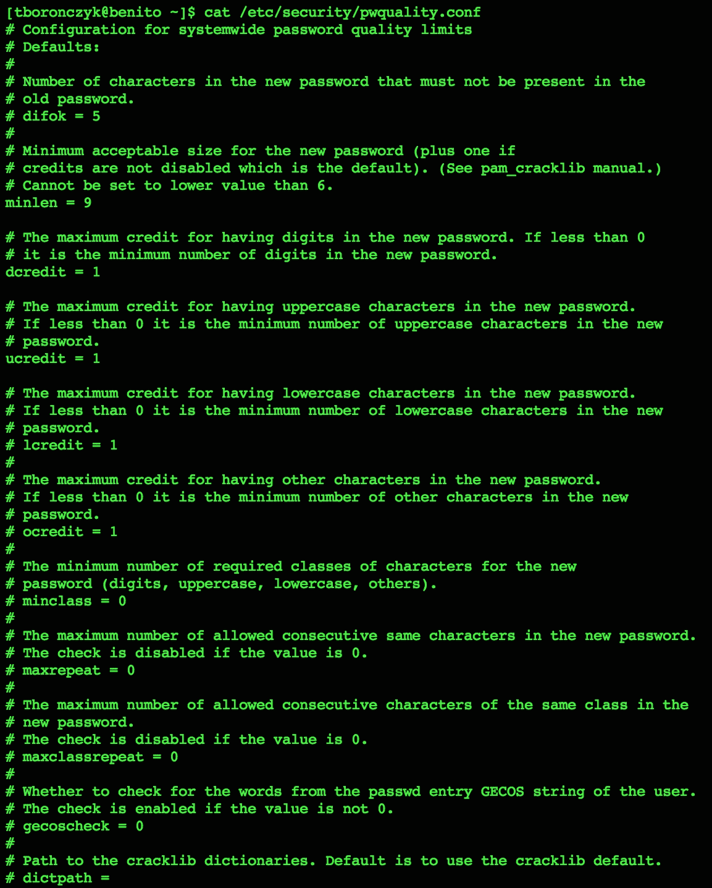
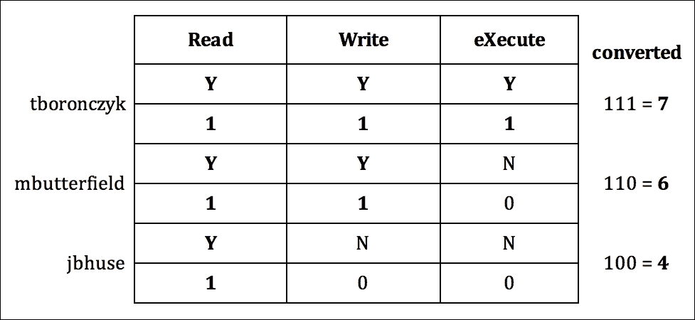
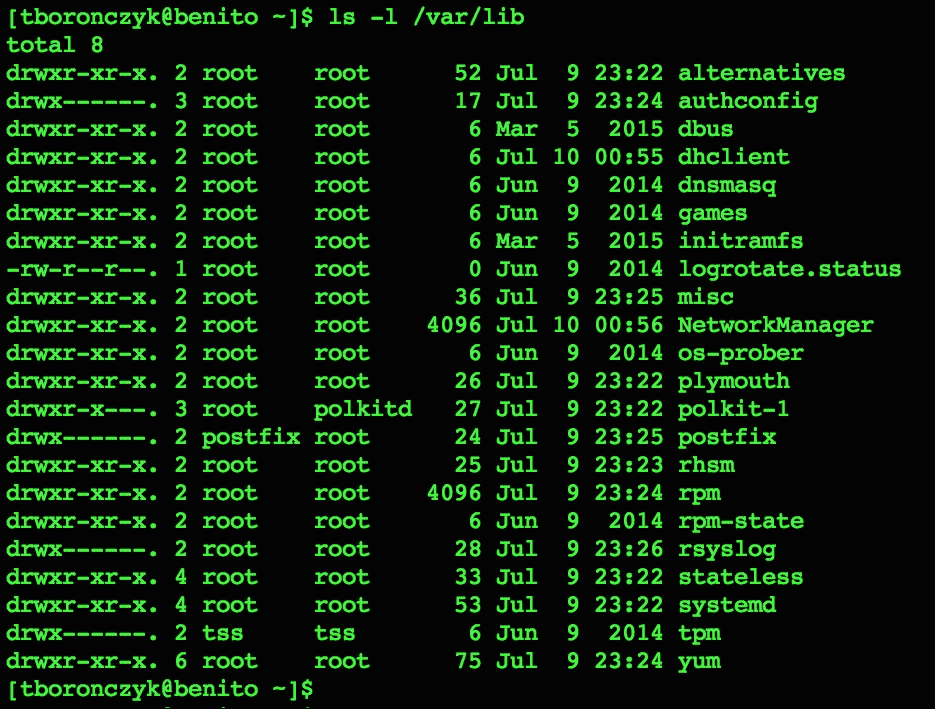
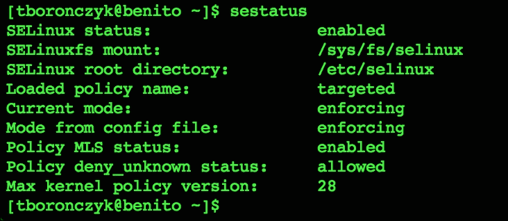
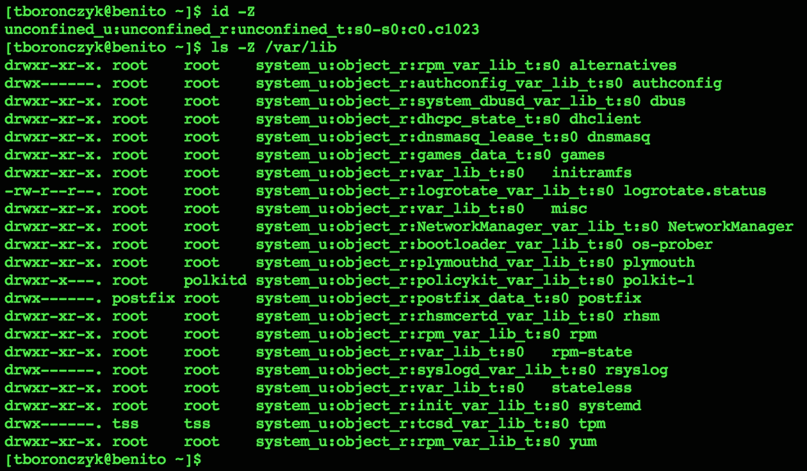
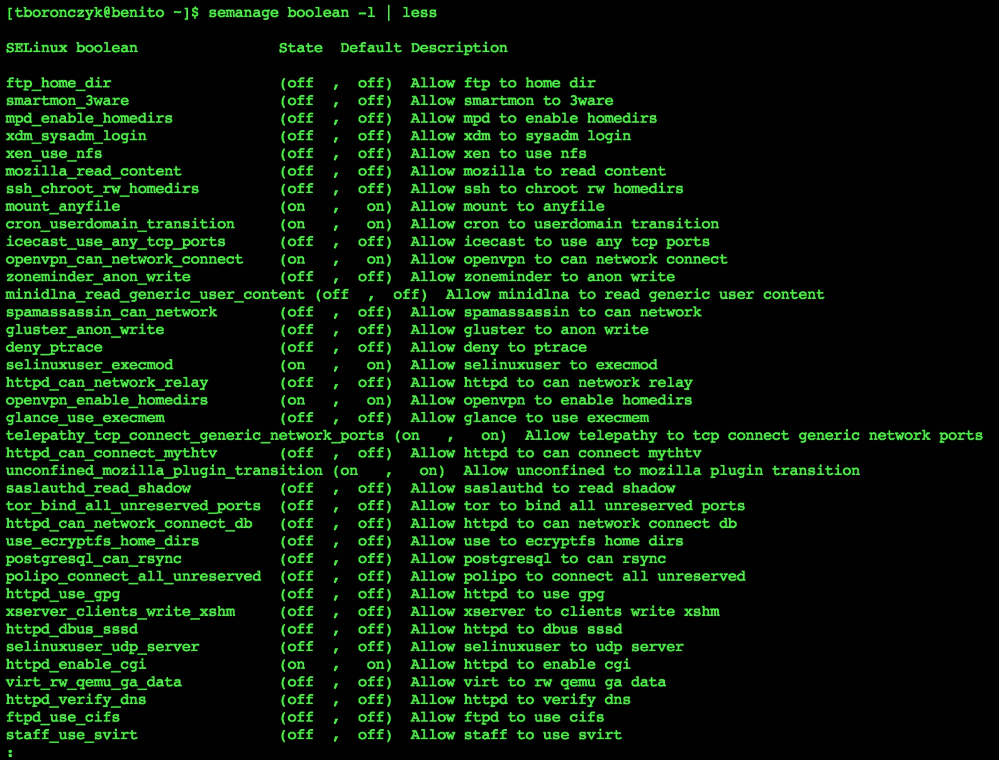

# 第三章 用户和权限管理

本章包含以下配方：

+   使用 sudo 提升权限

+   强制执行密码限制

+   设置新文件和目录的默认权限

+   以不同用户身份运行二进制文件

+   使用 SELinux 增强安全性

# 介绍

本章中的每个配方都与用户和权限相关。您将学习如何让用户在不需要 root 密码的情况下暂时提升权限，如何为用户强制执行复杂度要求。您还将学习如何指定新文件和目录的默认访问权限，以及传统的 Unix 权限系统如何允许程序在与启动它的用户不同的安全上下文中运行。最后，我们将讨论 SELinux，这是一个增强 CentOS 服务器安全性的辅助权限系统。

# 使用 sudo 提升权限

`root`账户是 Linux 的**超级用户账户**，它具有执行系统上几乎所有活动的能力。出于安全考虑，您应该使用一个没有特权的用户账户进行日常操作，只有在需要管理任务时才使用`root`账户。保持 root 密码的机密性也非常重要；知道密码的人越多，保密就越困难。让我想起本杰明·富兰克林的一句话：三个能保守一个秘密，前提是其中两个已经死了。

如果有多个管理员负责管理系统，保持`root`账户的安全可能会变得困难。`sudo`通过提供一种让用户以其他用户（通常是`root`）的权限执行命令的方式来解决这个问题。每个管理员账户可以使用本教程中介绍的方法来临时提升权限，`root`密码可以保持机密。

## 准备工作

本配方需要一个 CentOS 系统，并通过登录`root`账户提供的管理访问权限。您还需要一两个没有特权的用户账户进行配置（有关创建用户账户的信息，请参考`useradd`手册页`man 8 useradd`）。

## 如何操作...

允许没有特权的账户使用`sudo`的一种方法是将其分配到`wheel`组。可以通过以下步骤完成：

1.  使用`usermod`将用户账户添加到`wheel`组：

    ```
    usermod -a -G wheel tboronczyk

    ```

1.  使用`groups`命令验证更新。`wheel`应该列出该账户所属于的其中一个组：

    ```
    groups tboronczyk

    ```

另一种授予`sudo`权限的方法是配置 sudoers 策略，指定哪些账户可以使用`sudo`以及以何种方式使用。您可以通过以下步骤轻松将账户添加到该策略中：

1.  在`/etc/sudoers.d`目录下创建一个以用户账户命名的新文件：

    ```
    touch /etc/sudoers.d/tboronczyk

    ```

1.  打开文件并添加以下指令。完成后，保存更新并关闭文件：

    ```
    tboronczyk ALL = ALL

    ```

## 它是如何工作的...

用户要使用`sudo`命令，必须以某种方式将其列入 sudoers 策略中。`sudo`会检查这一点，以验证该账户是否被授权执行所尝试的操作。此方法提供了两种实现方式：将用户账户分配到已在策略中注册的`wheel`组，或者直接将账户添加到策略中。

在第一种方法中，`usermod`命令将用户分配到`wheel`组。`-G`选项指定组的名称，而`-a`指示`usermod`将用户添加到该组中。提供`-a`非常重要，因为如果没有它，分配的组列表会被`-G`后面指定的内容覆盖（即账户将只属于`wheel`组）。

```
usermod -a -G wheel tboronczyk

```

第二种方法通过在`/etc/sudoers.d`下为用户创建文件来将账户注册到 sudoers 策略中。我们本可以将用户信息直接添加到`/etc/sudoers`配置文件中，但策略已将`sudoers.d`目录下的任何文件包含在其配置中。为每个用户在该目录中创建一个文件，在需要撤销访问权限时，面对大量用户会更易于管理。

这两种方法都允许用户使用`sudo`执行他们通常没有足够权限的命令。例如：

```
sudo umount /media

```

用户首次调用`sudo`时，系统会显示一条消息，提醒他们在使用新获得的权限时要负责。用户必须提供密码以验证身份；此验证将在最后一次调用后缓存五分钟，以作为对可能会走到一个未注销的终端上的恶意用户的额外保护。


sudo 提醒用户，巨大的权力伴随着巨大的责任

sudoers 策略足够灵活，允许用户账户执行特定命令，而不是给予完全的访问权限。回忆一下我们非特权用户账户的配置指令：

```
tboronczyk ALL = ALL

```

指定用户名后，将`ALL`别名分配给`ALL`。通过查看这一点，你可能已经明白，`ALL`是表示所有命令的预定义别名。我们可以将给定用户的别名重新定义为一个允许的命令列表：

```
tboronczyk ALL = /bin/mount /bin/umount

```

现在该账户可以调用它通常有权限访问的任何命令，但只有在具有提升权限的情况下才可以使用`mount`和`umount`命令（假设该账户不是`wheel`的成员）。

### 提示

你是否厌倦了在常用的管理命令前键入`sudo`？你可以为命令创建别名，获得更流畅的命令行体验。假设你的非特权账户被允许使用`sudo`执行`mount`和`umount`命令。将以下行添加到`~/.bashrc`文件中，你可以在不明确键入`sudo`的情况下调用这些命令：

```
alias mount sudo /bin/mount
alias umount sudo /bin/umount

```

策略中的多个指令可以应用于一个账户，在这种情况下，它们是按顺序叠加应用的，从第一个到最后一个。为了演示这一点，假设一个账户已经通过分配到`wheel`组而具有完全的`sudo`使用权限。默认情况下，用户需要提供密码才能执行命令。我们可以放宽这一要求，允许用户使用`ls`命令显示受限目录的内容而无需输入密码：

```
tboronczyk ALL = NOPASSWD: /bin/ls

```

`wheel`组的策略首先应用，建立了默认行为。然后，我们的新指令使用`NOPASSWD`标签，授予用户对`ls`命令的无认证访问权限。用户仍然需要在执行`mount`和`passwd`等命令时提供密码，但在列出受限目录时则不需要提供密码。

## 另请参阅

请参阅以下资源，了解如何使用`sudo`来临时提升账户权限：

+   `sudo`手册页（`man 8 sudo`）

+   `sudoers`手册页（`man 5 sudoers`）

+   Code Snipcademy: 使用`sudo`和`su`及它们的区别（[`code.snipcademy.com/tutorials/linux-command-line/permissions/sudo`](https://code.snipcademy.com/tutorials/linux-command-line/permissions/sudo)）

# 强制实施密码限制

弱密码可能是任何系统最薄弱的安全环节之一。简单密码容易受到暴力破解攻击，而长期使用的密码如果被泄露，会为恶意活动提供长时间的攻击窗口。因此，确保用户选择足够复杂的密码并定期更换非常重要。本教程展示了如何通过对用户密码施加各种限制来增强系统的安全性。您将学习如何指定密码的最低复杂性要求、密码需要多久更改一次，以及如何在多次登录失败后锁定账户。

## 准备工作

本教程需要一个 CentOS 系统和管理员访问权限，可以通过登录`root`账户或使用`sudo`获得。

## 如何执行...

按照以下步骤执行，以强制实施密码限制，从而提高您 CentOS 系统的安全性：

1.  控制密码过期的参数位于`/etc/login.defs`中；使用您选择的文本编辑器打开该文件：

    ```
    vi /etc/login.defs

    ```

1.  定位到密码过期控制部分，并更新`PASS_MAX_DAYS`、`PASS_MIN_DAYS`、`PASS_MIN_LEN`和`PASS_WARN_AGE`的值：

    ```
    PASS_MAX_DAYS  90
    PASS_MIN_DAYS  0
    PASS_MIN_LEN   8
    PASS_WARN_AGE  15

    ```

1.  保存更改并关闭文件。

1.  在`login.defs`中指定的值将应用于新创建的账户。现有用户必须使用`chage`命令单独设置他们的密码参数：

    ```
    chage --maxdays 90 --mindays 0 --warndays 15 tboronczyk

    ```

1.  控制密码复杂性要求的参数位于`/etc/security/pwquality.conf`文件中；打开该文件进行编辑：

    ```
    vi /etc/security/pwquality.conf

    ```

1.  取消注释 `minlen` 值以指定所需的最小密码复杂度加 1。例如，一个由小写字母组成的八字符密码，其 `minlen` 应该设置为 `9`：

    ```
    minlen = 9

    ```

1.  如果需要，你可以取消注释其他值并进行设置。每个值前面都会有简短的描述性注释，说明其功能。如果你希望密码中必须至少有一定数量的字符来自某个特定类别（大写字母、小写字母、数字和其他/特殊字符），可以将该值设置为负数。例如，如果密码必须至少包含一个数字字符和一个大写字母，则 `dcredit` 和 `ucredit` 都应设置为 `-1`：

    配置系统密码复杂度要求的选项可以在 pwquality.conf 文件中找到

1.  保存更改并关闭文件。

1.  接下来，我们将更新 PAM 的 `password-auth` 和 `system-auth` 模块配置，以便在多次登录失败后锁定账户。打开文件 `/etc/pam.d/password-auth`：

    ```
    vi /etc/pam.d/password-auth

    ```

1.  更新文件开头的 `auth` 行组，使其如下所示。第二行和第四行已被添加，并且包括 `pam_faillock` 到认证堆栈中：

    ```
    auth   required      pam_env.so
    auth   required      pam_faillock.so preauth silent audit  deny=3  
           unlock_time=600
    auth   sufficient    pam_unix.so nullok try_first_pass
    auth   [default=die] pam_faillock.so authfail audit deny=3  
           unlock_time=600
    auth   requisite     pam_succeed_if.so uid >= 1000  quiet_success
    auth   required      pam_deny.so

    ```

1.  更新 `account` 行组，使其如下所示。第二行已被添加，包含 `pam_faillock` 到账户堆栈中：

    ```
    account  required   pam_unix.so
    account  required   pam_faillock.so
    account  sufficient pam_localuser.com
    account  sufficient pam_succeed_if.so uid < 1000 quiet
    account  required   pam_permit.so

    ```

    ### 注意

    在更新 `password-auth` 和 `system-auth` 文件时要小心。模块在堆栈中的排列顺序是非常重要的！

1.  保存更改并关闭文件。然后重复步骤 9 到 11，操作文件 `/etc/pam.d/system-auth`。

## 它是如何工作的...

正确配置本地账户的认证要求是一个略显零散的过程。首先，有传统的 Unix 密码文件（`/etc/passwd` 和 `/etc/groups`）以及 `shadow-utils` 包，它提供了阴影支持（`/etc/shadow`）。这些一起构成了本地账户凭证的核心数据库。此外，类似于大多数现代 Linux 系统，CentOS 使用 PAM，这是一个可插拔认证模块的集合。PAM 堆栈默认配置为在阴影文件中查找账户信息，但它还提供了额外的功能，PAM-aware 程序可以利用这些功能，例如密码强度检查。作为管理员，你需要负责配置这些服务，确保它们能够协同工作，并且符合组织所设定的安全标准。

在这个方案中，我们首先更新了 `/etc/logins.def` 中的密码过期相关控制：

```
PASS_MAX_DAYS  90
PASS_MIN_DAYS  0
PASS_MIN_LEN   8
PASS_WARN_AGE  15

```

`PASS_MAX_DAYS` 定义了密码必须更改之前允许经过的最大时间。将该值设置为 `90`，表示用户必须每 90 天至少更改一次密码。`PASS_MIN_DAYS` 定义了用户在更改密码后必须等待多少天才能再次更改。由于该值为 0，用户可以随时更改密码——如果他们愿意，甚至可以一天多次更改密码。`PASS_WARN_AGE` 定义了当 `PASS_MAX_DAYS` 接近时，用户将提前多少天收到密码即将过期的通知。

### 注意

`PASS_MIN_LEN` 应该设置密码的最小长度，但你会发现 PAM 的密码复杂度要求会覆盖这个设置，使得该设置几乎毫无意义。

`useradd` 等工具在创建密码和影子文件中的条目时，会使用这些设置作为默认值。它们不会回溯应用到现有用户，因此我们需要使用`chage`来更新他们的账户：

```
chage --maxdays 90 --mindays 0 --warndays 15 tboronczyk

```

`chage` 可以设置用户密码的最小和最大有效期以及即将过期的通知窗口，但请注意没有最小长度的要求。

我们还可以使用 `chage` 让用户的密码立即过期，这样他们下次登录时必须指定新密码。为此，我们提供 `--lastdays` 参数并设置为 0：

```
chage --lastdays 0 tboronczyk

```

### 提示

如果你有多个账户，可能想通过一些简单的 Shell 脚本来自动化使用 `chage`。这里有一系列的命令通过管道连接，能够以自动化的方式更新所有现有的用户账户：

```
getent shadow | awk -F : 'substr($2, 0, 1) == "$" { print $1 }' | xargs -n 1 chage --maxdays 90 --mindays 0  
--warndays 15

```

该方法通过获取影子文件的内容，并使用 `awk` 以 `:` 为字段分隔符拆分每条记录。`awk` 查看第二个字段（加密密码）的值，看看它是否以 `$` 开头，表示账户有密码，以此来筛选出没有密码的禁用账户和系统账户。每个匹配记录中的用户名随后被传递给 `xargs`，然后 `xargs` 将用户名逐个传递给 `chage`。

由于 PAM 模块 `pam_pwquality` 检查密码的复杂度，我们在该模块的配置文件 `/etc/security/pwquality.conf` 中指定密码复杂度的要求。它通过一种信用系统来衡量密码的质量，每个字符为密码的总分加一分。这个总分必须满足或超过我们为 `minlen` 设置的值。

[`wpollock.com/AUnix2/PAM-Help.htm`](http://wpollock.com/AUnix2/PAM-Help.htm) 页面对 `pam_pwquality` 如何计算密码复杂度做了很好的解释。它的算法如下：

+   不管字符类型如何，每个密码中的字符都会加一分。

+   每使用一个小写字母，就增加一个，最多可达 `lcredit`。

+   每使用一个大写字母，就增加一个，最多可达 `ucredit`。

+   每使用一个数字，就增加一个，最多可达 `dcredit`。

+   每使用一个符号，就增加一个，最多可达 `ocredit`。

这个页面还展示了几种不同密码的复杂性计算，非常值得一读。

然后我们更新了 `password-auth` 和 `system-auth` 文件，以在三次不成功的登录尝试后锁定用户账户。需要配置不同的认证堆栈，因为不同的登录方法会调用不同的认证堆栈（例如通过 SSH 登录与本地登录）：

```
auth   required      pam_env.so
auth   required      pam_faillock.so preauth silent audit deny=3    
    unlock_time=600
auth   sufficient    pam_unix.so nullok try_first_pass
auth   [default=die] pam_faillock.so authfail audit deny=3
    unlock_time=600
auth   requisite     pam_succeed_if.so uid >= 1000 quiet_success
auth   required      pam_deny.so
account  required   pam_unix.so
account  required   pam_faillock.so
account  sufficient pam_localuser.com
account  sufficient pam_succeed_if.so uid < 1000 quiet
account  required   pam_permit.so

```

`pam_faillock` 模块在认证堆栈的多个位置添加。在 `auth` 块中的第一次出现执行预检查（`preauth`），以查看账户是否已被锁定。第二次出现进行失败尝试计数（`authfail`）。由 `deny` 指定的参数是在锁定账户前允许的失败尝试次数。`unlock_time` 指定模块应等待的时间（以秒为单位），以解锁账户，以便进行另一次登录尝试。如示例所述，600 秒意味着用户必须等待 10 分钟才能解除锁定。模块在 `account` 块中的出现拒绝对已锁定账户的认证。

`faillock` 命令用于查看失败的登录尝试次数和解锁账户。要查看失败的尝试次数，请使用 `--user` 参数指定账户的用户名：

```
faillock --user tboronczyk

```

在 `unlock_time` 过去之前手动解锁账户，请使用 `--reset` 参数调用该命令：

```
faillock --user tboronczyk --reset

```

## 参见

想要了解更多关于用户账户认证和如何强制密码限制的信息，请参考以下资源：

+   `chage` 命令的手册页（`man 1 chage`）

+   影子文件的手册页（`man 5 shadow`）

+   `pam_faillock` 命令的手册页（`man 8 pam_faillock`）

+   Linux 文档项目：使用影子套件（[`tldp.org/HOWTO/Shadow-Password-HOWTO-7.html`](http://tldp.org/HOWTO/Shadow-Password-HOWTO-7.html)）

+   Linux-PAM 系统管理员指南（[`www.linux-pam.org/Linux-PAM-html/Linux-PAM_SAG.html`](http://www.linux-pam.org/Linux-PAM-html/Linux-PAM_SAG.html)）

+   RHEL 安全指南：密码安全（[`access.redhat.com/documentation/en-US/Red_Hat_Enterprise_Linux/7/html-single/Security_Guide/index.html#sec-Password_Security`](https://access.redhat.com/documentation/en-US/Red_Hat_Enterprise_Linux/7/html-single/Security_Guide/index.html#sec-Password_Security)）

# 设置新文件和目录的默认权限

Linux 的权限系统决定了用户是否能进入目录或者读取、写入或执行文件。通过设置文件和目录的权限位，可以授予或撤销不同用户和用户组的访问权限。然而，用户可能创建一个文件，并期望其他组中的用户能访问它，但是初始文件权限却阻止了这一点。为了避免这种情况，本文介绍了如何通过指定掩码值设置新文件和目录的默认权限。

## 准备工作

本食谱要求使用 CentOS 系统并具有管理权限，可以通过使用`root`帐户登录或使用`sudo`来获得权限。

## 如何操作...

按照以下步骤指定新文件和目录的默认权限：

1.  若要全局设置掩码值，请打开`/etc/profile`文件：

    ```
    vi /etc/profile

    ```

1.  在文件末尾，添加以下指令（根据需要调整值）。完成后，保存并关闭文件：

    ```
    umask 0007

    ```

1.  若要覆盖全局掩码并为每个用户设置掩码，请打开用户的`~/.bashrc`文件：

    ```
    vi /home/tboronczyk/.bashrc

    ```

1.  在文件末尾，添加以下内容（同样根据需要调整值）。然后保存并关闭文件：

    ```
    umask 0007

    ```

1.  若要仅在当前会话期间设置掩码，请在命令提示符下执行`umask`命令：

    ```
    umask 0007

    ```

    ### 注意

    您可以在命令提示符下执行`umask`而不提供掩码值，以查看当前的掩码值。

## 它是如何工作的...

本食谱介绍了设置掩码值的三种方法，该值决定了新创建的文件和目录上设置的权限。然而，要理解掩码的工作原理，您需要理解传统的读、写和执行权限系统。

Linux 文件系统中的目录和文件由用户和组所有，并为它们分配了一组权限，描述谁可以访问它们。当用户尝试访问某个资源时，系统将其所有权信息与请求访问的用户进行比较，并根据权限决定是否允许访问。

三种权限是读、写和执行。由于对每种权限的访问只能是允许或不允许这两种状态，并且这种二进制选择可以用 1 表示是，0 表示否，因此一系列的 1 和 0 可以视为位模式，每个权限在序列中有不同的位置。下图显示了如何将一系列二进制的“是”和“否”转换为人类可读的值：



二进制值表示用户是否有权限访问某个资源

从文件或目录的角度来看，用户分为三种类型。用户要么是文件的所有者，要么是所有组的成员，要么是其他人（所有其他用户）。

该资源为每种类型的用户分配了一组权限，如下图所示：


文件或目录的完整权限集包括三种类型的用户

这是传统 Unix 权限系统背后的逻辑，但如果你刚开始接触，它可能看起来很令人生畏，不用担心。确定用户类别的权限其实只是加法问题。从 `0` 开始表示完全没有访问权限。要允许读取权限，加上 `4`。要写入权限，加上 `2`。要执行权限，加上 `1`。这些值来源于将权限值作为二进制数在位串中查看，但它们足够容易记住。因此，要允许完全访问，我们加上 `4` + `2` + `1`，结果是 `7`。要仅允许读取和执行权限，`4` + `1` 为 `5`。你在处理权限时会越来越熟悉这些组合，渐渐地自动识别它们。

当文件被创建时，系统从 `666` 开始作为默认值，给予所有三个类别的用户读取和写入权限。目录从 `777` 开始，因为目录的执行权限使用户能够进入目录。系统接着减去创建用户的 umask 值，结果决定了资源在创建时将分配哪些权限。

假设我们创建一个新目录，并且我们的 umask 值为 `0027`。系统从其他用户字段中减去 `7`，从组字段中减去 `2`。`7` - `7` 为 `0`，`7` - `2` 为 `5`，因此新目录的默认权限为 `750`。

因为我们从文件的默认值开始时少了一位，所以可能会得到一个负的权限值。如果 umask 使用 `7` 屏蔽了所有权限，但文件的初始值为 `666`，则 `6` - `7` 为 `-1`。超出 `0` 是没有意义的，因此系统将其视为 `0`。所以，`0027` 的掩码会为文件的权限设置为 `650`。

每当用户登录时，`/etc/profile` 和 `~/.bashrc` 文件会被执行，以配置他们会话的环境。在 `profile` 中调用 `umask` 会设置所有用户的掩码。`.bashrc` 在 `profile` 后执行，并且是针对用户特定的，因此它对 `umask` 的调用会覆盖之前设置的值，为该特定用户设置掩码。

## 另见

有关 umask 的更多信息，请参考以下资源：

+   维基百科：Umask ([`unix.stackexchange.com/questions/102075/why-are-666-the-default-file-creation-permissions`](http://unix.stackexchange.com/questions/102075/why-are-666-the-default-file-creation-permissions))

+   为什么 666 是默认的文件创建权限？([`en.wikipedia.org/wiki/Umask`](https://en.wikipedia.org/wiki/Umask))

+   控制文件权限与 umask ([`linuxzoo.net/page/sec_umask.html`](http://linuxzoo.net/page/sec_umask.html))

# 以不同用户身份运行二进制文件

在 CentOS 上，每个程序都在一个用户账户的环境中运行，无论该程序是由用户执行还是作为自动化系统进程运行。然而，有时我们希望程序在不同的限制下运行，并且访问该账户所允许的权限。例如，一个用户应该能够使用`passwd`命令重置他们的密码。该命令需要对`/etc/passwd`的写入权限，但我们不希望运行该命令的用户具有此权限。本教程将教你如何通过设置程序的 SUID 和 SGID 权限位，使其在不同用户的环境中执行。

## 准备工作

本教程需要一个 CentOS 系统。同时需要管理员权限，可以通过登录 `root` 账户或使用 `sudo` 来获得。

## 如何操作...

按照以下步骤允许程序作为不同用户执行：

1.  使用`ls`命令来识别文件的所有者和组的详细信息。其输出的第三列列出了所有者，第四列列出了组：

    ```
    ls -l myscript.sh

    ```

    

    -l 选项以长格式显示文件列表，其中包括所有权信息

1.  如果需要，使用`chown`命令更改文件的所有权，使文件的所有者是你希望脚本在其环境中执行的用户：

    ```
    chown newuser:newgroup myscript.sh

    ```

1.  设置 SUID 位，以允许程序像由其所有者调用一样执行：

    ```
    chmod u+s myscript.sh

    ```

1.  设置 SGID 位，以允许程序像由其组成员调用一样执行：

    ```
    chmod g+s myscript.sh

    ```

## 工作原理...

当文件的 SUID 和 SGID 位被设置时，程序将在其所有者或组的环境中运行，而不是调用它的用户的环境中。这通常应用于需要普通用户能够访问的管理程序，但程序本身需要管理权限才能正常工作。

使用`chown`设置权限位时，`u`用于设置目标为 SUID 位。设置了 SUID 位的脚本将以其所有者的权限执行。`g`用于设置目标为 SGID 位，允许脚本以其组成员的权限执行。直观地，`+`表示设置该位，`-`表示移除该位，从而使程序可以在调用用户的环境中执行。

```
chmod u-s myscript.sh
chmod g-s myscript.sh

```

SUID 和 SGID 也可以用数字方式设置——SUID 的值是 4，SGID 的值是 2。这些可以相加并作为数字权限值的最左侧数字出现。例如，以下命令设置了 SUID 位、文件所有者的读、写和执行位；组成员的读、写和执行位；以及其他所有人的读和执行位：

```
chmod 4775 myscript.sh

```

然而，数字方法要求你指定文件的所有权限。如果你需要这样做，并且希望同时设置 SUID 或 SGID 位，这并不成问题。否则，使用`+`或`-`来添加或删除所需的位可能更加方便。

使用`chmod`的助记字符设置位也适用于标准权限。`u`、`g`和`a`分别表示目标位的所有者（u 代表用户）、组（g 代表组）和其他所有人（a 代表所有）。读取权限用`r`表示，写入权限用`w`表示，执行权限用`x`表示。以下是使用助记字符的一些示例：

+   允许文件所有者执行该文件：

    ```
    chmod o+x myscript.sh

    ```

+   允许组成员读取文件：

    ```
    chmod g+r myfile.txt

    ```

+   防止非所有者或组成员写入文件：

    ```
    chmod a-w readonly.txt

    ```

## 另见

参考以下资源了解有关`chmod`以及设置 SUID 和 SGID 位的更多信息。

+   `chmod`手册页 ([`linux.die.net/man/1/chmod`](https://linux.die.net/man/1/chmod))

+   如何在 Linux 和 Unix 中设置 SetUID 和 SetGID 位 ([`linuxg.net/how-to-set-the-setuid-and-setgid-bit-for-files-in-linux-and-unix/`](http://linuxg.net/how-to-set-the-setuid-and-setgid-bit-for-files-in-linux-and-unix/))

+   维基百科：Setuid ([`en.wikipedia.org/wiki/Setuid`](https://en.wikipedia.org/wiki/Setuid))

# 使用 SELinux 提高安全性

本教程展示了如何使用安全增强 Linux（SELinux）的基础知识，SELinux 是一个内核扩展，为您的 CentOS 安装增加了一层额外的安全性。由于它在内核级别运行，SELinux 可以控制传统文件系统权限之外的访问，包括限制正在运行的进程和其他资源。

不幸的是，一些管理员禁用了 SELinux，因为诚然它可能成为挫折的源头。管理员们习惯了用户/组/所有人以及读取/写入/执行的方式，突然发现当 SELinux 阻止本应可用的内容时，他们无从下手。然而，SELinux 提供的额外安全层是值得投入精力调查此类问题并在必要时调整其策略的。

## 准备工作

本教程要求使用 CentOS 系统。同时也需要管理员权限，可以通过以`root`账户登录或使用`sudo`命令获得。示范的命令来自`policycoreutils-python`包，因此请先使用`yum install policycoreutils-python`命令安装该包。

## 如何操作...

本集合命令将带您了解在不同上下文中使用 SELinux，具体如下：

+   使用`sestatus`验证 SELinux 是否启用，并查看加载了哪个策略：

    该系统已启用 SELinux，并当前强制执行目标策略。

+   使用`id -Z`查看您的账户映射到的 SELinux 账户、角色和域。

+   使用`ls -Z`查看文件或目录的安全上下文：

    `id`和`ls`都可以显示与安全上下文相关的信息

+   使用`semodule -l`查看当前策略中加载的策略模块列表。输出内容可能非常长，您可能会发现使用`less`或`more`分页查看会更方便：

    ```
    semodule -l | less

    ```

+   使用`semodule -d`并提供模块名称来禁用特定的策略模块：

    ```
    semodule -d mysql

    ```

你可以通过再次使用`semodule -l`查看策略模块的列表来验证模块是否被禁用。`disabled`一词应该会出现在模块名称的右侧。

+   使用`semodule -e`来启用特定的策略模块：

    ```
    semodule -e mysql

    ```

+   使用`semanage boolean`可以选择性地启用或禁用活动模块的特性。`-l`参数会输出可用特性的列表及其当前值和默认值：

    ```
    semanage boolean -l | less

    ```

+   使用`-m`后跟`--on`或`--off`及特性名称来影响所需的特性：

    ```
    semanage boolean -m --on deny_ptrace

    ```

    

    `semanage boolean -l`显示策略模块中可以开启或关闭的特性。

## 它是如何工作的…

SELinux 从对象、主体、域和类型的角度来查看系统。对象是任何资源，无论是文件、目录、网络端口、内存空间等。主体是对对象进行操作的任何实体，如用户或正在运行的程序。域是主体操作的环境，换句话说，是主体可用资源的集合。类型仅仅是识别对象用途的类别。在这个框架下，SELinux 的安全策略将对象组织成角色，并将角色组织到域中。

域被授予或拒绝访问特定类型。例如，用户被允许打开某个特定文件，因为他们属于一个在该域中有权限打开该类型对象的角色。为了判断一个用户是否有能力做某事，SELinux 会将系统的用户账户映射到它自己数据库中的用户（以及角色和域）。默认情况下，账户会映射到 SELinux 的`unconfined_u`用户，后者被分配了`unconfined_r`角色并操作于`unconfined_t`域。

这个例子向我们展示了如何使用`id -Z`来获取我们用户账户映射到的用户、角色和域，以及如何使用`ls -Z`来获取文件的安全标签。当然，命令显示的值会根据文件不同而有所不同。例如，二进制文件`/bin/cp`作为`system_u`用户执行，属于`object_r`角色，并在`bin_t`域中。

`sestatus`命令输出关于 SELinux 的基本状态信息，例如是否启用、是否强制执行其策略，以及如何执行这些策略。SELinux 可以运行在强制模式下，在这种模式下它会积极地执行其策略；也可以运行在宽容模式下，在这种模式下它不会阻止任何操作，但如果某个操作本应被策略阻止，它会记录一条日志。你可以使用`setenforce 0`将 SELinux 设置为宽容模式。

`semodule` 命令用于管理策略模块。为了保持一切井然有序，策略是模块的集合，每个模块关注一个特定的程序或活动。针对最常见的应用程序（如 MySQL、Apache HTTP 服务器和 SSHd）有专门的模块，这些模块描述了哪些域可以访问哪些类型。这个教程展示了如何使用 `semodule` 的 `-e` 和 `-d` 参数启用或禁用这些模块：

```
semodule -d mysql
semodule -e mysql

```

最后，教程介绍了 `semanage` 命令，它用于管理 SELinux 的各个方面。我们看到了它的 `boolean` 子命令，使用它来列出可以切换开关的特定保护项。

这可能无需多说，尽管 SELinux 通过增加额外的访问控制层来有效保护系统，但完全理解它并编写自定义策略是一项严肃的任务。关于这个主题已经写了整本书，并且在线上有大量的资源可供使用。作为入门，Red Hat Enterprise Linux 7 文档中包含的 SELinux 用户和管理员指南以及 DigitalOcean 提供的三部分系列文章，介绍了 SELinux 的基本概念，都是非常好的起点，我已经在这里列出了它们的 URL。我还推荐由 David Caplan、Karl MacMillan 和 Frank Mayer 合著的书籍《*SELinux by Example: Using Security Enhanced Linux*》。

## 另见

有关使用和更好理解 SELinux 的更多信息，请参考以下资源：

+   维基百科: 安全增强 Linux ([`en.wikipedia.org/wiki/Security-Enhanced_Linux`](https://en.wikipedia.org/wiki/Security-Enhanced_Linux))

+   SELinux 项目 Wiki ([`selinuxproject.org/page/Main_Page`](http://selinuxproject.org/page/Main_Page))

+   RHEL7 SELinux 用户和管理员指南 ([`access.redhat.com/documentation/en-US/Red_Hat_Enterprise_Linux/7/html/SELinux_Users_and_Administrators_Guide/part_I-SELinux.html`](https://access.redhat.com/documentation/en-US/Red_Hat_Enterprise_Linux/7/html/SELinux_Users_and_Administrators_Guide/part_I-SELinux.html))

+   CentOS Wiki: SELinux ([`wiki.centos.org/HowTos/SELinux`](http://wiki.centos.org/HowTos/SELinux))

+   CentOS 7 上的 SELinux 入门 ([`www.digitalocean.com/community/tutorials/an-introduction-to-selinux-on-centos-7-part-1-basic-concepts`](http://www.digitalocean.com/community/tutorials/an-introduction-to-selinux-on-centos-7-part-1-basic-concepts))
