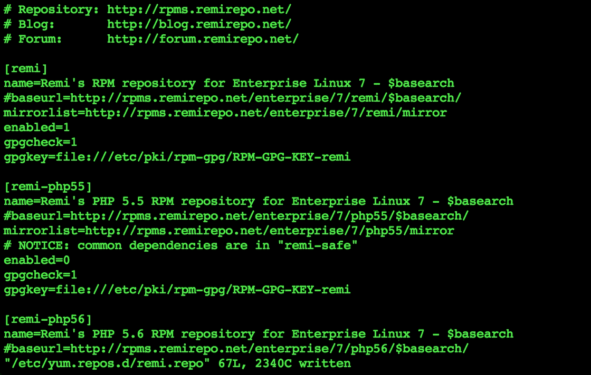
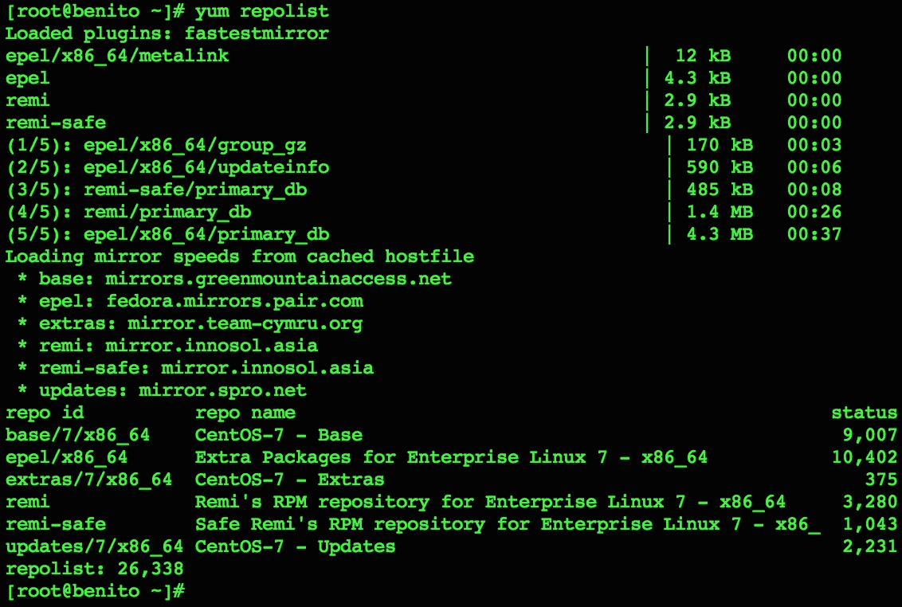
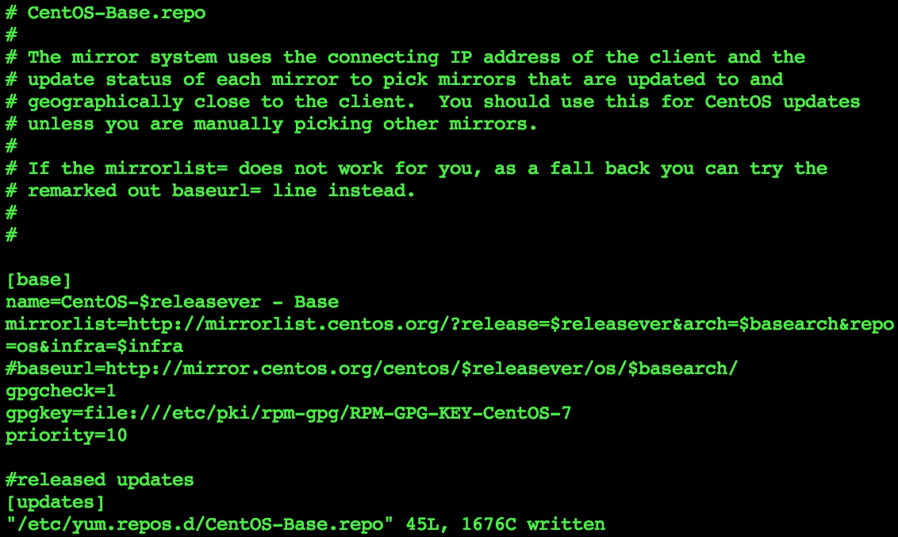
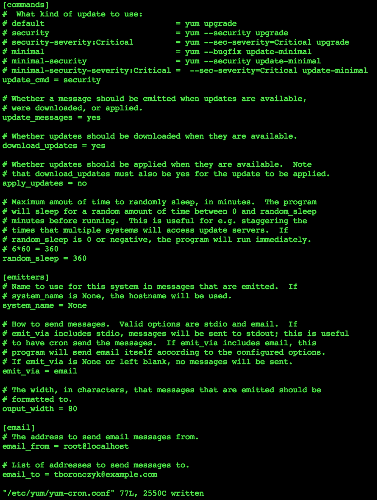
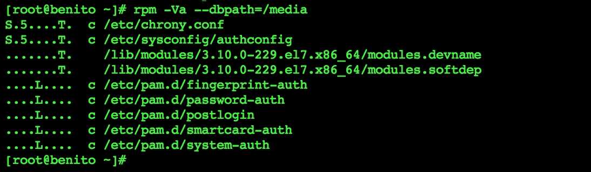

# 第四章：软件安装管理

本章包含以下操作：

+   注册 EPEL 和 Remi 仓库

+   使用 Priorities 插件优先级设置仓库

+   使用 `yum-cron` 自动更新软件

+   验证已安装的 RPM 包

+   从源代码编译程序

# 介绍

本章提供了在 CentOS 系统上管理软件安装的具体操作方法。你将学习如何添加新的软件包仓库，以提供比主 CentOS 仓库更多的软件选择，同时也能了解如何优先排序仓库，从中选择安装软件包的源。你还将学习如何自动更新软件，以便跟上最新的安全补丁和错误修复，如何验证已安装的软件包，以确保恶意用户未篡改你的软件。最后，你将掌握一项逐渐消失但对于修改系统中开源软件至关重要的技能：如何从源代码编译软件。

# 注册 EPEL 和 Remi 仓库

一个全新安装的 CentOS 系统将启用主支持仓库，通过这些仓库我们可以安装各种软件。我们还可以注册第三方仓库，以便获取更多（或更新的）软件。本教程将教你如何添加两个这样的仓库，分别是流行的 **企业 Linux 扩展包（EPEL）** 和 Remi 仓库。

## 准备工作

本教程需要一个具有工作网络连接的 CentOS 系统。还需要管理员权限，可以通过使用 `root` 账户登录或使用 `sudo` 来实现。

## 如何操作...

要注册 EPEL 仓库，请安装 epel-release 包：

```
yum install epel-release

```

注册并启用 REMI 仓库，请按照以下步骤操作：

1.  下载仓库的配置包：

    ```
    curl -O http://rpms.famillecollet.com/enterprise/remi-release-7.rpm

    ```

1.  安装下载的包：

    ```
    yum install remi-release-7.rpm

    ```

1.  删除文件，因为它已不再需要：

    ```
    rm remi-release-7.rpm

    ```

1.  打开 Remi 仓库的配置文件：

    ```
     vi /etc/yum.repos.d/remi.repo 

    ```

1.  在 `[remi]` 部分找到 `enabled` 选项，并将其值更改为 `1` 以启用它：

    ```
    enabled=1

    ```

1.  保存更改并关闭文件。

## 工作原理...

EPEL 仓库托管着与官方 CentOS 仓库互补的软件包。通过安装官方仓库中提供的 `epel-release` 包，可以自动配置它：

```
yum install epel-release

```

Remi 是一个流行的第三方仓库，提供官方仓库中没有的更新版本软件。我们通过 `curl` 从项目服务器下载了仓库的配置包：

```
curl -O http://rpms.famillecollet.com/enterprise/remi-release-7.rpm

```

我们使用了 `-O` 参数（大写字母 O，而不是数字 0），这样文件会保存到磁盘，否则其内容将显示在屏幕上。本教程没有指定应下载文件的具体目录。你可以将文件下载到你的 `home` 目录，甚至是 `/tmp` 目录，因为安装软件包后该文件不再需要。

在下载软件包后，我们可以使用 `yum` 安装它：

```
yum install remi-release-7.rpm

```

### 注意

很多时候，完成同一任务有多种方式。例如，`rpm` 命令也可以在下载包后用来安装软件包：

`**rpm -iv remi-release-7.rpm**`

`-i` 参数安装软件包，而 `-v` 指示 `rpm` 在输出中提供详细信息，以便我们可以看到它的操作。

`remi-release` 包安装了三个 Remi 仓库的配置：Remi、Safe Remi 和 Remi 的 PHP 7 仓库。默认情况下启用 Safe Remi，因为它的软件包被认为可以与官方 CentOS-Base 仓库一起使用。然而，Remi 仓库是禁用的，所以我们需要编辑 `/etc/yum.repos.d/remi.repo`：



通过更新配置文件来启用 Remi 仓库

REMI 以提供 PHP 的较新版本而闻名。如果你想通过 Remi 升级现有的 PHP 安装，可以在 `remi.repo` 或 `remi-php70.repo` 中启用所需的部分。

安装了 EPEL 仓库并启用了 Remi 仓库后，你可以使用 yum 来列出可用的仓库。EPEL 和 Remi 仓库应该会出现在输出中：

```
yum repolist

```



EPEL 和 Remi 仓库已启用并准备就绪！

### 小贴士

Remi 使用与官方 CentOS 仓库中相同的软件包名称。与 Remi 类似，IUS 仓库提供了官方仓库中较新的软件版本，但使用了不同的软件包名称。一些托管服务提供商推荐使用 IUS 而不是 Remi，因为他们会每晚更新服务器，而不同的软件包名称有助于防止计划外的升级。如果你与这样的服务提供商签订了合同并且没有使用 Priorities 插件（将在下一个配方中讨论），请务必听从他们的建议。有关 IUS 的更多信息，请访问他们的官方网站，[`ius.io/`](https://ius.io/)。

## 另请参阅

有关 EPEL 和 Remi 仓库的更多信息，请参考以下资源：

+   Fedora 项目：EPEL ([`fedoraproject.org/wiki/EPEL`](http://fedoraproject.org/wiki/EPEL))

+   Remi 的 RPM 仓库 ([`rpms.famillecollet.com/`](http://rpms.famillecollet.com/))

+   在 CentOS 和 Red Hat 上安装 EPEL 和其他仓库 ([`www.rackspace.com/knowledge_center/article/install-epel-and-additional-repositories-on-centos-and-red-hat`](http://www.rackspace.com/knowledge_center/article/install-epel-and-additional-repositories-on-centos-and-red-hat))

# 使用 Priorities 插件对仓库进行优先级排序

尽管软件包管理器使安装和更新软件几乎变得不费吹灰之力，但如果我们不小心，仍然可能会遇到一些问题。例如，我们可以配置多个仓库，包括 CentOS 不维护的第三方仓库，而一个仓库中的软件包版本可能与另一个仓库中的版本发生冲突。本配方使用 Priorities 插件来对我们使用的仓库进行优先级排序，帮助避免这些问题。

## 准备工作

本食谱需要一个有正常网络连接的 CentOS 系统。还需要管理员权限，可以通过登录 `root` 账户或使用 `sudo` 来获得。

## 如何操作...

按照以下步骤优先排序 `yum` 下载软件的仓库：

1.  使用文本编辑器打开 `/etc/yum.conf` 文件。找到 `plugins` 选项，并确认其值设置为 `1` 以启用插件支持。如有必要，更新其值：

    ```
    plugins = 1

    ```

1.  安装 `yum-plugin-priorities` 包：

    ```
    yum install yum-plugin-priorities

    ```

1.  要设置仓库的优先级，请打开其相应的配置文件，该文件位于 `/etc/yum.repos.d` 目录下。在每个所需部分中添加 `priority` 选项作为新条目：

    ```
    priority=10

    ```

1.  完成后，保存并关闭仓库的配置文件。

    CentOS-Base 仓库为基础软件包分配了相对较高的优先级

## 它是如何工作的...

在本食谱中，我们安装了 Priorities 插件并通过更新仓库配置文件来优先排序仓库。通过优先排序一个仓库，我们可以更轻松地控制系统中安装的软件包和版本。

首先，我们检查了 Yum 的插件支持是否已启用。我们打开了它的配置文件 `/etc/yum.conf` 并验证了 `plugins` 选项的值：

```
plugins = 1

```

接下来，我们安装了 `yum-plugin-priorities` 包：

```
yum install yum-plugin-priorities

```

Priorities 插件有一个最小的配置文件，位于 `/etc/yum/plugins/priorities.conf`。在该文件中，`enabled` 选项让我们可以切换插件是否启用。这意味着我们可以根据需要对仓库进行优先级设置，但也可以在不删除和重新添加仓库配置文件中的优先级值的情况下，暂时禁用优先级设置：

```
enabled = 1

```

最后一步是编辑 `/etc/yum.repos.d` 目录下的仓库配置文件。每个仓库都有自己的配置文件，例如，CentOS-Base 仓库的文件是 `/etc/yum.repos.d/CentOS-Base.repo`，该文件配置了每个频道的连接和安全密钥。为了优先排序仓库，我们只需打开所需的文件，并在所需的部分添加 `priority` 选项的新行：

```
priority = 10

```

优先级以 `1` 到 `99` 范围内的数字来分配，其中 `1` 为最高优先级，`99` 为最低优先级。任何我们没有明确设置优先级的仓库或频道将默认使用优先级 `99`。本应一起使用的仓库（例如 EPEL 和 Remi）可以分配相同的优先级。

### 注意

不要使用连续的优先级数字，如 1、2、3...。例如，设置优先级为 5、10、15... 或 10、20、30...，可以让你稍后添加其他仓库，而无需重新排序现有仓库的优先级。

当分配并启用优先级时，当我们尝试安装或更新一个在多个仓库中都能找到的软件包时，系统会从具有最高优先级的仓库中获取该软件包。通过这种方式，我们可以控制第三方仓库是否可以替代重要的基础包，或者在高度定制的系统上，来自 CentOS 支持仓库的更新是否可以替代第三方软件包。

## 另见

请参考 CentOS Wiki 上的`yum-plugin-priorities`文章，了解更多有关 Priorities 插件的信息，链接：[`wiki.centos.org/PackageManagement/Yum/Priorities`](https://wiki.centos.org/PackageManagement/Yum/Priorities)。

# 使用 yum-cron 自动化软件更新

我们都知道及时跟进安全警报和应用重要更新的重要性，但确保 CentOS 系统上的所有软件都得到更新可能是一项繁琐且耗时的任务，特别是当你管理多个服务器时。本教程展示了如何通过自动化更新过程来确保系统始终保持最新，无需每天手动操作。

## 准备工作

本教程需要一个具有正常网络连接的 CentOS 系统。同时，您需要具有管理员权限，可以通过`root`账户登录或使用`sudo`来获得权限。

## 如何操作...

要使用`yum-cron`自动化软件更新，请执行以下步骤：

1.  安装`yum-cron`软件包：

    ```
    yum install yum yum-cron

    ```

1.  启动并启用该服务：

    ```
    systemctl start yum-cron
    systemctl enable yum-cron

    ```

1.  执行系统更新，确保在`yum-cron`接管之前，系统所有内容都是最新的：

    ```
    yum update

    ```

## 它是如何工作的……

我们的第一步是安装`yum-cron`软件包，但你会注意到，这个操作还会更新 Yum 本身。虽然我们只需要指定`yum-cron`，但包含`yum`可以绕过一个特定的版本问题（你可以在[`bugzilla.redhat.com/show_bug.cgi?id=1293713`](https://bugzilla.redhat.com/show_bug.cgi?id=1293713)上查看该错误报告）：

```
yum install yum yum-cron

```

该软件包安装了`yum-cron`命令，并且设置了一个每天触发它的定时任务（cron job），同时还包括一个`systemctl`单元，用于启用和禁用更新。通过`systemctl`启动该服务时，会创建一个特殊的锁文件。Cron 每天运行这个定时任务来调用`yum-cron`，该命令检查锁文件是否存在。如果文件存在，它会检查更新；否则，它会知道每日更新被禁用（服务被停止），并且不执行任何操作。

`/etc/yum`中的`yum-cron.config`配置文件可以用于修改`yum-cron`的总体行为。最重要的选项是`update_cmd`，因为它允许我们指定执行的更新类型。`yum-cron`可以执行不同的更新策略，如果你希望进行更有针对性的更新而不是默认设置，可以更改`update_cmd`选项的值。

执行不同角色的服务器可能需要不同的更新策略；例如，你可能只希望在生产服务器上应用关键的安全更新，而将其他软件保持在特定版本。配置文件中的注释列出了 `update_cmd` 的有效值及其含义。`default` 执行一般的系统范围更新，而像 `security` 这样的值则仅应用与安全相关的更新：

```
update_cmd = security

```

在 `yum-cron.conf` 中，还可以看到 `emit_via` 选项。`stdio` 值表示 `yum-cron` 生成的任何日志信息都将通过标准输出传递。通常，这些信息会被 cron 捕获并写入 `/var/log/cron`。Cron 可以配置为通过电子邮件发送输出，但你也可以特别配置 `yum-cron` 发送邮件。如果你希望 `yum-cron` 将输出发送给你，请将 `emit_via` 的值更改为 `email`，并将 `email_to` 的值设置为你的电子邮件地址：

```
emit_via = email
email_to = tboronczyk@example.com

```



yum-cron 的配置文件允许我们指定特定的更新策略和通知选项

## 另请参阅

请参考以下资源，了解有关自动化软件更新的更多信息：

+   配置自动更新 ([`www.certdepot.net/rhel7-configure-automatic-updates`](http://www.certdepot.net/rhel7-configure-automatic-updates))

+   启用 CentOS 7 和 RHEL 7 中的自动更新 ([`linuxaria.com/howto/enabling-automatic-updates-in-centos-7-and-rhel-7`](http://linuxaria.com/howto/enabling-automatic-updates-in-centos-7-and-rhel-7))

# 验证已安装的 RPM 包

有人说最安全的系统就是 *“关闭电源，浇筑在混凝土块中，并密封在一个有武装守卫的铅隔离室里。”*（Gene Spafford）你的 CentOS 系统可能没有混凝土保护，这意味着它存在被攻击的风险。本教程将展示如何使用 `rpm` 审计系统，以确保已安装的软件没有被攻击者篡改。

## 准备就绪

该教程需要一个具有工作网络连接的 CentOS 系统。还需要管理员权限，可以通过登录 `root` 账户或使用 `sudo` 来获得权限。

## 如何操作...

首先备份 `/var/lib/rpm` 目录中的 RPM 数据库非常重要。虽然有多种方法可以做到这一点，但为了这个例子，我们将创建该目录的 ISO 镜像，然后可以将其归档或刻录到光盘：

1.  安装 `genisoimage` 和 `wodim` 软件包，获取创建 ISO 镜像和刻录光盘所需的工具：

    ```
    yum install genisoimage wodim

    ```

1.  使用 `genisoimage` 创建 ISO 镜像：

    ```
    genisoimage -o rpm-db-bckup.iso -R -v /var/lib/rpm

    ```

    如果需要，可以使用 `wodim` 刻录镜像：

    ```
    wodim -v dev=/dev/cdrom rpm-db-bckup.iso

    ```

如果以后不打算使用，可以在将 ISO 文件刻录到光盘后删除它。

当需要验证你的系统时，按照以下步骤操作：

1.  使备份数据库可用。如果你已经将 ISO 文件刻录到光盘，并且假设它位于 `/dev/cdrom`，使用 `mount` 如下：

    ```
    mount /media /dev/cdrom

    ```

1.  如果备份是 ISO 文件，使用 `mount` 如下：

    ```
    mount -o loop rpm-db-bckup.iso /media

    ```

1.  验证安装的 `rpm` 软件包与备份的数据库副本的完整性。`rpm` 会返回与原始软件包不同的文件列表，因此成功的审计应没有输出：

    ```
    rpm -V --dbpath=/media rpm

    ```

1.  验证系统上安装的所有软件包的完整性：

    ```
    rpm -Va --dbpath=/media

    ```

## 它是如何工作的…

攻击者可以篡改文件并用恶意副本替换系统上的程序。幸运的是，我们可以使用 `rpm` 来验证从软件包安装的文件的完整性，从而识别这些更改。但是，为了做到这一点，我们还需要一个可以信任的数据库。用于比较文件详细信息的数据库的完整性非常重要，因为聪明的攻击者也可能会想到在那里进行修改。定期制作数据库的只读备份非常重要，或许在每次安装新软件包或更新之前和之后都应该进行备份。然后，你可以将系统软件的状态与可信备份进行比较，从而对结果充满信心。

你可以将备份存储到任何介质上：可移动的 USB 闪存驱动器、可写的 CD 或 DVD 光盘、远程存储，甚至是高容量磁带盒。重要的是它是可信的。这个配方演示了如何将 `/var/lib/rpm` 数据库备份为 ISO 文件，可以将其刻录到光盘上或按原样复制，必要时以只读模式挂载。

```
genisoimage -o rpm-db-bckup.iso -R -v /var/lib/rpm

```

### 注意

长期使用 Linux 的用户可能会记得 `mkisofs` 和 `cdrecord` 程序。`genisoimage` 和 `cdrecord` 是它们的克隆程序，前者仍然以符号链接的形式存在于 CentOS 中，指向 `genisoimage` 和 `cdrecord`。

`-o` 参数指定将创建的 ISO 文件的名称。`-R` 创建必要的索引以保留镜像中文件名的长度和大小写，而 `-v` 表示 `genisoimage` 应以详细模式运行，以便我们能看到它的进度。完成后，我们将得到 `rpm-db-backup.iso` 文件。

### 注意

如果你打算将文件刻录到光盘并删除它，`rpm-db-bckup.iso` 是一个合适的名称。如果你打算将 ISO 文件归档，则应考虑在名称中包含备份创建的时间戳，以便保持有序。例如，以下命令使用 `date` 将日期和时间包含在文件名中：

`**genisoimage -o rpm-db-bckup-$(date +"%Y-%m-%d_%H%M").iso -R -v /var/lib/rpm**`

接下来，配方展示了如何使用 `wodim` 将 ISO 文件刻录到光盘：

```
wodim -v dev=/dev/cdrom rpm-db-bckup.iso

```

`-v` 参数将 `wodim` 设置为详细模式，`dev` 参数指定 CD/DVD 驱动器。配方假设 `/dev/cdrom` 是适当的设备，你可能需要根据系统的配置修改命令。

为了使可信数据库可用，我们挂载了光盘或 ISO 文件。要挂载光盘，我们将光盘放入驱动器并发出以下命令（`/dev/cdrom` 是设备，`/media` 是文件系统将挂载的挂载点）：

```
mount /dev/cdrom /media

```

要挂载 ISO 文件，我们发出以下命令：

```
mount -o loop rpm-db-bckup.iso /media

```

在可信数据库可用后，我们使用带有 `-V` 选项的 `rpm`，该选项用于验证已安装的包。默认情况下，`rpm` 使用 `/var/lib/rpm` 中的文件作为数据库，因此我们使用 `--dbpath` 选项覆盖这一设置，并指向我们的可信副本：

```
rpm -V -dbpath=/media rpm

```

虽然我们可以提供一个或多个包名进行检查，`-a` 选项将会验证系统上所有已安装的包：

```
rpm -Va --dbpath=/media

```

`rpm` 会通过一系列测试，检查文件的大小及其权限，并报告那些未通过测试的文件。没有输出表示系统上安装的文件与最初由包安装时完全一致。否则，`rpm` 会显示一个点表示通过的测试，并使用以下记忆性指示符之一来显示哪些测试未通过：

+   `S`：文件的大小已更改

+   `M`：文件的权限已更改

+   `5`：文件的 MD5 校验和与预期的校验和不匹配

+   `L`：符号链接已更改

+   `D`：设备已更改

+   `U`：文件的用户所有者已更改

+   `G`：文件的所属组已更改

+   `T`：文件的时间戳已更改

`rpm` 还会报告如果文件丢失的情况。

然而，并不是所有的差异都是坏的。我们需要知道哪些更改是可接受的，哪些不是。例如，配置文件的更改可能是可接受的，但二进制工具的更改无疑是问题的指示。`rpm` 通过在测试结果旁列出 `c` 来区分配置文件，这有助于我们将其与其他类型的文件区分开：



在验证该系统包的完整性时，会报告差异

## 另见

参考以下资源获取更多关于验证已安装软件完整性的信息：

+   `rpm` 手册页 (`man 8 rpm`)

+   验证文件与 Red Hat 的 RPM ([`www.sans.org/security-resources/idfaq/rpm.php`](http://www.sans.org/security-resources/idfaq/rpm.php))

+   wodim 无法打开 SCSI 驱动器 ([`www.linuxquestions.org/questions/linux-software-2/wodim-cdrecord-cannot-open-scsi-drive-4175544944/`](http://www.linuxquestions.org/questions/linux-software-2/wodim-cdrecord-cannot-open-scsi-drive-4175544944/))

# 从源代码编译程序

现代的包管理工具使得安装软件变得容易；只需一个命令，我们就能从任意配置的仓库中安装程序及其依赖项。然而，Linux 社区和自由软件运动中的一个重要价值是根据自己的需求修改软件（也许你想修复一个 bug 或添加一个新功能）。对于用编译语言编写的软件，如 C，这通常意味着修改程序的源代码，并将代码编译成可执行的二进制文件。此教程将引导你完成编译并安装 GNU Hello 程序的过程。

## 正在准备中

本步骤要求 CentOS 系统有可用的网络连接，并且需要一个能够使用`sudo`提升权限的非特权用户账户。

## 如何操作...

执行以下步骤从源代码编译和安装程序：

1.  使用`sudo`提升账户权限，安装`gcc`包：

    ```
    sudo yum install gcc

    ```

1.  下载 GNU Hello 源代码：

    ```
    curl ftp://ftp.gnu.org/gnu/hello/hello-2.10.tar.gz | tar - zx

    ```

1.  进入项目的目录：

    ```
    cd hello-2.10

    ```

1.  使用`--help`参数运行`configure`脚本，以查看项目的构建选项。输出内容可能会非常长，您可能会发现使用`less`分页查看内容更为方便：

    ```
    ./configure --help | less

    ```

1.  再次运行`configure`脚本，这次指定任何需要的构建选项来生成`Makefile`文件：

    ```
    ./configure --prefix=/usr/local

    ```

1.  调用`make`，它使用`Makefile`作为指南来编译项目：

    ```
    make

    ```

1.  使用`sudo`再次提升权限，安装程序及其支持文件：

    ```
    sudo make install

    ```

1.  现在，我们可以运行`hello`程序来显示友好的问候：

    ```
    hello

    ```

## 工作原理...

本步骤向您展示了从源代码编译和安装软件的经典`configure`、`make`和`make install`过程。

最小化的 CentOS 安装不包括 C 编译器（一个将 C 语言源代码翻译成二进制机器可执行格式的程序），因此我们做的第一件事就是安装 GNU 编译器集合。因为该软件包将在全系统范围内安装，所以需要使用提升的权限来运行`yum`：

```
sudo yum install gcc

```

### 注意

由于 GNU Hello 项目是用 C 语言编写的，并且包括一个预生成的`configure`脚本，因此只需要`gcc`即可。不过，其他项目可能需要额外的软件，如`autoconf`来生成`configure`脚本，或其他语言（如 Fortran、C++、Objective-C 和 Go）的编译器支持。为了获得更强大的构建环境，可以考虑安装`Development Tools`包组：

`**sudo yum groupinstall "Development Tools"**`

接下来，我们从项目的 FTP 服务器下载了源代码的副本。该代码以压缩档案的形式分发，我们使用`curl`获取了该档案。我们省略了在之前的步骤中使用的`-O`参数，而是将输出直接传递给`tar`进行解压。这会创建一个名为`hello-2.10`的目录，里面包含项目的源代码：

```
curl ftp://ftp.gnu.org/gnu/hello/hello-2.10.tar.gz | tar -zx

```

项目中通常会包含几个信息性文本文件，因此可以随意查看目录中的内容。一些常见的文件包括：

+   `README`: 该文件提供了项目的概述（名称、版本、描述等）

+   `CHANGELOG`: 该文件列出了每个版本中的更改

+   `INSTALL`: 该文件包含安装说明

+   `LICENCE`: 该文件包含关于项目代码使用和分发的许可信息

如果项目使用 GNU Autotools 构建系统（如 GNU Hello 所用），我们可以预期在源文件集中找到`configure`脚本。`configure`的任务是扫描系统的构建环境，以确保任何必要的工具和依赖项可用，并生成`Makefile`文件。`Makefile`将包含编译和安装程序的指令，我们传递给`configure`的任何选项最终都会被包含进`Makefile`中。

为了查看我们可以使用的选项，我们首先运行`configure`并使用`--help`：

```
./configure --help | less

```

有些选项可能是项目特有的，而其他一些则更为通用，涉及设置路径等，这些将在构建过程的后续部分使用。以下是一些重要的通用选项：

+   `--prefix`：程序及其文件将安装的基础目录结构

+   `--disable-FEATURE`：在不启用目标功能的情况下编译程序，否则该功能将被启用

+   `--enable-FEATURE`：在编译程序时启用可选目标功能

+   `--with-PACKAGE`：链接到某些功能所需的特定库

第二次运行`configure`时，我们提供了`--prefix`选项：

```
./configure --prefix=/usr/local

```

`/usr/local`的前缀值意味着这个目录将被加到不同文件安装路径的前面。例如，当我们安装程序时，编译后的`hello`文件将被复制到`PREFIX/bin`，即`/usr/local/bin`，项目的手册页面将安装到`PREFIX/share/man`，即`/usr/local/share/man`，等等。

### 注意

这个过程将 GNU Hello 作为系统范围内可访问的程序安装。但别忘了，你也可以使用`--prefix`选项将文件编译并安装到个人目录：

`**./configure --prefix=/home/tboronczyk/.personal**`

一旦`configure`生成了`Makefile`，我们就执行这些语句来用`make`编译项目：

```
make

```

默认情况下，`make`会在当前目录中查找名为`Makefile`的文件并执行。如果由于某种原因目标脚本命名不同，我们可以通过`-f`选项告诉`make`使用哪个文件：

```
make -f ./Makefile

```

此外，`Makefile`文件通常包含多个指令集或目标。以下是一些常见的目标：

+   `all`：编译程序

+   `check`：运行附带的测试套件，验证项目是否正常运行

+   `clean`：删除在编译过程中创建的任何中间文件

+   `distclean`：删除在配置过程或编译过程中创建的文件，仅保留原始发行版中的文件

+   `dist`：创建一个归档文件以分发程序

+   `install`：将编译后的程序和其他必要文件安装到系统的最终位置

+   `uninstall`：删除`install`安装的文件

如果未提供目标，默认目标是`all`。

理想情况下，我们不希望以`root`身份编译软件，因为`Makefile`可以在任何位置创建任意文件，这是攻击者可以利用的一个点。以普通用户身份执行文件可以简单地阻止此攻击向量，因为非特权帐户没有对敏感目录的写访问权限。这就是为什么在将程序及其文件移动到`/usr/local`目录下时，我们仅为`install`目标使用`sudo`的原因。

## 另见

有关构建软件的更多信息，请参考以下资源：

+   GNU Hello ([`www.gnu.org/software/hello`](http://www.gnu.org/software/hello))

+   RHEL7 开发者指南 ([`access.redhat.com/documentation/en-US/Red_Hat_Enterprise_Linux/7/html/Developer_Guide/index.html`](https://access.redhat.com/documentation/en-US/Red_Hat_Enterprise_Linux/7/html/Developer_Guide/index.html))

+   Autotools Mythbuster ([`autotools.io/`](http://autotools.io/))

+   CentOS Wiki: 设置 RPM 构建环境 ([`wiki.centos.org/HowTos/SetupRpmBuildEnvironment`](http://wiki.centos.org/HowTos/SetupRpmBuildEnvironment))
