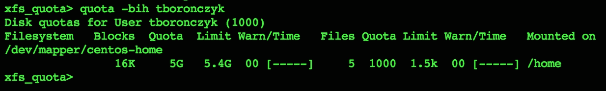

# 第五章：管理文件系统和存储

本章包含以下食谱：

+   查看文件大小和可用存储

+   为用户和组设置存储限制

+   创建 RAM 磁盘

+   创建 RAID

+   在 RAID 中更换设备

+   创建新的 LVM 卷

+   删除现有的 LVM 卷

+   添加存储并扩展 LVM 卷

+   使用 LVM 快照

# 介绍

本章中的食谱侧重于利用您的 CentOS 系统存储来保持可用性、提高可靠性，并保护数据免受不可避免的磁盘故障。您将学习如何确定文件占用了多少空间，以及还有多少存储空间可用。接着，您将看到如何设置限制，以确保用户公平使用系统的存储资源。我们还将创建一个 RAM 磁盘，这是一个基于内存的低延迟存储，用于频繁访问的数据。然后，您将学习如何创建和管理 RAID 阵列，以提供可靠的存储，以及如何使用 LVM 卷从存储池中分配逻辑驱动器，以更好地利用系统的总存储容量。

# 查看文件大小和可用存储

当存储空间紧张时，程序和服务可能会表现出意外行为或完全停止工作，因此了解系统中可用的空间非常重要。本篇介绍了一些命令，用于确定文件和目录的大小，以及已使用和可用的存储空间。

## 准备工作

本食谱需要一个正常工作的 CentOS 系统。根据您要检查的目录和文件的权限，可能需要管理员权限。

## 如何操作...

+   要显示已挂载文件系统的存储容量，请使用`df`命令：

    ```
    df -h /

    ```

+   要查看文件的大小，请使用`ls`命令：

    ```
    ls -sh file.txt

    ```

+   要确定一个目录的大小（即其所有文件大小的总和），请使用`du`命令：

    ```
    du -sh ~

    ```

## 如何工作...

`df`命令返回有关已挂载文件系统上可用空间的信息。前面的示例请求了有关根文件系统的详细信息。

```
df -h /

```

`-h`参数将信息格式化为人类可读的格式，按兆字节、吉字节等显示值，而不是块计数。当没有任何参数时，`df`会以 512 字节的块计数显示所有已挂载文件系统的信息。我们可以使用此命令指定一个或多个挂载点，此时`df`只会报告这些文件系统的信息。


以兆字节和吉字节呈现的值比块计数提供了更多信息

输出的第一列标记为 `Filesystem`，最后一列标记为 `Mounted on`，分别标识文件系统及其挂载点。`Size` 列显示文件系统提供的总空间。`Used` 列显示该空间已占用的部分，`Avail` 列显示剩余可用空间。`Use%` 列显示占用空间的百分比。

虽然 `df` 给了我们总体存储使用情况的概览，但要查看单个文件的大小，我们可以使用 `ls`。该命令支持大量参数，可以显示文件和目录的元信息，例如所有者详情、创建时间和大小。

本教程使用了 `-s` 参数返回文件大小，`-h` 参数则再次以易读格式显示该值：

```
ls -hs filename.txt

```

如果你使用 `ls` 来显示目录的大小，它可能会报告 4.0 K，而不管你选择哪个目录。这是因为目录并不像我们通常想象的那样是存放文件的容器；目录实际上是一个特殊的文件，包含了一个列出其中所有文件的索引。这个索引占用了一个块的存储空间。`ls` 报告的是目录作为一个文件所占用的空间，而不是其中所有文件大小的总和。

要查看一个目录中所有文件的总大小，这通常是我们讨论目录大小时的目标，我们需要使用 `du` 命令：

```
du -hs ~

```

`-s` 参数仅打印当前目录的值，`-h` 参数则将值以易读的格式显示。没有任何参数时，`du` 也会显示当前目录中所有文件和目录的 512 字节块计数。然而，目录被视为容器，因此值反映了所有其包含文件的块计数。我们还可以列出一个或多个文件或目录，这样 `du` 只会报告这些目标的信息。通过将一个目录中的所有文件/目录作为目标并将输出通过 `sort` 管道处理，我们可以使用 `du` 来识别哪些内容占用了最多的存储空间：

```
du -hs ./* | sort -hr

```

`sort` 的 `-h` 参数可以正确地对易读数字进行排序（例如，`4.0K` 小于 `3M`，即使在数字排序中 3 小于 4），而 `-r` 参数则会反转排序顺序，将最大的条目排在前面：


排序可以帮助识别哪些内容占用了最多的存储空间

## 参见

关于本教程中提到的命令的更多信息，请参考它们各自的手册页：

+   `df` 手册页（`man 1 df`）

+   `du` 手册页（`man 1 du`）

+   `ls` 手册页（`man 1 ls`）

# 设置用户和组的存储限制

限制用户可使用的存储空间是有效的资源管理方式，可以确保每个人都能公平地获得资源，尤其是在多用户环境中。本教程展示了如何启用配额并按用户和组设置限制。

## 准备工作

本教程要求使用具有管理员权限的 CentOS 系统，管理员权限通过登录 `root` 账户或使用 `sudo` 获得。假设 `/home` 挂载了自己的文件系统。

## 如何操作...

按照以下步骤设置配额并指定存储限制：

1.  打开 `/etc/fstab` 文件进行编辑：

    ```
    vi /etc/fstab

    ```

1.  要启用用户配额，以强制基于用户账户的使用限制，请将 `uquota` 添加到 `/home` 的挂载选项中。对于组配额，添加 `gquota`。可以同时给出 `uquota` 和 `gquota` 以启用两者：

    ```
    /dev/mapper/centos-home /home xfs defaults,uquota,gquota 0  0

    ```

1.  保存更改并关闭文件。

1.  重启系统：

    ```
    shutdown -r +5 'Reboot required for system maintenance'

    ```

1.  系统重启后，启动 `xfs_quota` shell 并进入专家模式：

    ```
    xfs_quota -x /home

    ```

1.  使用 `limit` 命令为用户账户设置限制：

    ```
    limit bsoft=5g bhard=6g tboronczyk

    ```

1.  使用 `quota` 命令验证用户的配额限制是否已设置：

    ```
    quota -h tboronczyk

    ```

1.  使用 `limit -g` 为一个组设置限制：

    ```
    limit -g bsoft=20g bhard=21g users 

    ```

1.  使用 `quota -g` 验证组的限制是否已设置：

    ```
    quota -gh users

    ```

1.  输入 `quit` 或按 ***Ctrl*** + ***D*** 退出 shell：

    ```
    quit

    ```

## 操作原理...

配额默认情况下未启用，必须在文件系统的挂载选项中显式启用。因此，我们更新了 `/etc/fstab` 并为 `/home` 添加了 `uquota` 和/或 `gquota` 选项：

```
/dev/mapper/centos-home /home xfs defaults,uquota,gquota 0 0

```

我们绝不应该卸载正在使用的文件系统，因为这样可能会导致数据损坏或丢失。因此，当我们重新挂载 `/home` 时，确保没有其他用户登录。如果你已经以 `root` 身份登录并确信只有你一个用户登录，可以使用 `umount` 紧接着 `mount` 来重新挂载文件系统。但如果其他人也登录了，最好按照本教程的建议进行重启。系统重启后，`/home` 会自动挂载，且配额选项将生效：

```
shutdown -r +5 'Reboot required for server maintenance'

```

接下来，我们运行了 `xfs_quota` 作为交互式 shell，输入命令来管理我们的配额。我们使用 `-x` 参数以专家模式启动 shell（管理配额所需的命令仅在专家模式下可用），并指定我们将要设置配额的文件系统挂载点：

```
xfs_quota -x /home

```

### 注意

传统的配额工具可以用来管理基本配额，但 `xfs_quota` 让我们能够利用 XFS 独有的额外配额功能。例如，使用 `xfs_quota` 我们还可以管理项目配额。

对我们来说，最重要的两个命令是 `limit` 和 `quota`。`limit` 用于设置配额限制，`quota` 用于报告配额信息。

我们可以使用 `limit` 设置四个限制，具体如下：

+   `isoft`：此命令设置使用的 inode 数量的软性限制

+   `ihard`：此命令设置使用的 inode 数量的硬性限制

+   `bsoft`：此命令设置使用的块数的软性限制

+   `bhard`：此命令设置使用的块数的硬性限制

inode 是一种由文件系统用于跟踪文件和目录的数据结构。每个文件和目录都由一个 inode 表示，因此设置用户可以拥有的 inode 数量限制，实际上是限制他们能够拥有的文件/目录数量。

块代表物理存储，设置用户块数配额限制了他们的文件所能占用的存储空间。典型的块大小是 512 字节，这意味着存储 1KB 数据需要使用两个块。配方中的示例设置了一个 5 GB 的软块限制和 6 GB 的硬块限制。后缀 `k`、`m` 和 `g` 分别用于指定千字节、兆字节和吉字节的值：

```
limit bsoft=5g bhard=5500m tboronczyk

```

### 注意

可以在不进入交互式 Shell 的情况下，使用 `-c` 在 `xfs_quota` 中运行命令：

`**xfs_quota -x -c 'limit -u bsoft=5g tboronczyk' /home**`

硬限制指定了一个用户绝对无法超过的值。例如，具有 100 个 inode 硬限制的用户，如果已有 99 个文件，只能再创建一个文件。超出此限制时，创建文件的尝试将会出错。

另一方面，软限制定义了一个用户可以在短时间内超过的限制。一旦超过限制，用户将进入宽限期。一个具有 5 GB 软限制的用户将能够使用超过 5 GB 的存储空间，但仅限于一定时间内。如果在宽限期结束时，用户仍然违反了限制，软限制将被视为硬限制，并且他们将无法再保存任何数据。

### 注意

宽限期默认是 7 天。我们可以通过 `timer` 命令来更改这一点，使用 `-i` 来更改 inode 计时器，使用 `-b` 来更改块计时器：`**timer -b 3d tboronczyk**`

要查看当前的配额，使用 `quota` 命令。`-h` 参数会以人类可读的格式显示值：

```
quota -h tboronczyk

```

默认输出显示了文件系统及其挂载点，以及用户的块配额详情：已使用的块数量（在**Blocks**标题下）、软限制（**Quota**）、硬限制（**Limit**），以及软限制违规的宽限期已过时间（**Warn/Time**）。使用 `-i` 可以获取 inode 配额的相同信息，`-b` 和 `-i` 可以一起使用，以同时显示两组信息：

```
quota -bih tboronczyk

```



块配额和 inode 配额可以同时显示

`limit` 和 `quota` 命令默认与用户的配额一起工作，虽然我们可以通过 `-u` 参数明确管理用户的配额。要管理一个组的配额，我们使用 `-g`：

```
quota -gh users

```

如前所述，`xfs_quota` 还允许我们管理项目配额。这些配额实际上是对特定目录施加的限制，不论用户或组的所有权如何，都会强制执行。要使用项目配额，请使用 `pquota` 挂载选项：

```
/dev/mapper/centos-home /home xfs defaults,uquota,pquota 0 0

```

### 注意

项目配额和组配额不能同时使用；如果同时提供 `pquota` 和 `gquota`，`mount` 将无法挂载文件系统。根据文件系统的不同，这可能会导致系统无法启动。

接下来，创建文件 `/etc/projid`。每一行是由一个任意的项目名称和一个唯一的 ID 号码组成，用冒号分隔：

```
echo "my_project:42" >> /etc/projid

```

然后，创建文件`/etc/projects`。其条目由项目 ID、一个分隔冒号和项目的目录组成。`projects`和`projid`文件共同定义了项目名称与其目录之间的关系：

```
echo "42:/home/dev/project" >> /etc/projects

```

配置好这两个配置文件后，最后一步是通过`project -c`在`xfs_quota`中初始化项目的配额跟踪：

```
project -c my_project

```

完成初始设置步骤后，你可以使用`limit`和`quota`命令通过`-p`参数来管理项目的配额：

```
limit -p bsoft=10g bhard=11g my_project

```

## 另请参阅

参考以下资源以获取更多关于配额管理的信息：

+   `xfs_quota`手册页面（`man 8 xfs_quota`）

+   启用 CentOS 7 的用户和组磁盘配额（[`www.linuxtechi.com/enable-user-group-disk-quota-on-centos-7-rhel-7/`](http://www.linuxtechi.com/enable-user-group-disk-quota-on-centos-7-rhel-7/)）

# 创建 RAM 磁盘

本食谱教你如何利用 RAM 低延迟创建 RAM 磁盘，RAM 磁盘是将一部分内存当作标准存储设备来使用的内存区段。RAM 磁盘通常存储易变的数据，这些数据在内存中被不断读取和更新。例如，在桌面系统中，它们用于存储浏览器缓存，以加速网页浏览。在服务器环境中，RAM 磁盘可以存储高负载代理服务的缓存数据，从而减少延迟。

## 准备工作

本食谱需要一个具有管理员权限的 CentOS 系统，可以通过登录`root`账户或使用`sudo`来获得权限。

## 如何操作...

执行以下步骤来创建和使用 RAM 磁盘：

1.  使用`free`命令检查是否有足够的内存可用于 RAM 磁盘（一个实用的 RAM 磁盘大小需要小于空闲内存的量）：

    ```
    free -h

    ```

1.  使用`mount`命令将`tmpfs`文件系统挂载到目标挂载点，并作为挂载选项指定目标大小：

    ```
    mount -t tmpfs -o size=512M tmpfs /mnt

    ```

1.  当不再需要 RAM 磁盘时，卸载文件系统：

    ```
    umount /mnt

    ```

## 它是如何工作的...

每当我们访问硬盘上的数据时，它的电机必须首先旋转存储盘片，并将磁头定位到正确的位置。这些机械动作使得访问速度相较于已经驻留在系统内存（RAM）中的数据非常慢。具体的测量依赖于系统及其硬件，但磁盘访问大约需要 10 毫秒或 10,000,000 纳秒。而内存访问只需要大约 200 纳秒，因此可以安全地说，访问 RAM 的速度至少是磁盘的 10,000 倍，即便是低估值。

在创建 RAM 磁盘之前，你应该首先使用`free`命令检查系统上可用的空闲内存量：

```
free -h

```

`free`命令会显示当前可用的内存以及已使用的内存。`-h`参数将输出格式化为易于人类阅读的格式（将值以兆字节和吉字节列出，而不是字节）。我们可以看到有关 RAM、交换磁盘以及内核使用的任何特殊缓冲区的数字，但我们真正关心的是`Mem`和`Swap`条目中列出的已用和空闲内存的数量。空闲内存较少且交换空间使用量较高时，意味着我们可能没有足够的内存来创建实际的 RAM 磁盘：


该系统只有 1 GB 的内存，资源仅能支持相对较小的 RAM 磁盘

接下来，我们使用`mount`命令在指定的挂载点上提供所需的内存量。示例中使用的是`/mnt`，但您可以自由选择任何您认为合适的挂载点：

```
mount -t tmpfs -o size=512M tmpfs /mnt

```

调用中指定了`tmpfs`作为挂载设备，`/mnt`作为挂载点。`-t`指定了底层文件系统，在这种情况下是`tmpfs`，而`-o`指定了我们的文件系统挂载选项。有关`tmpfs`文件系统的所有可能选项，可以在`mount`手册页中找到，但最重要的选项是`size`，它设置了文件系统的所需大小。

### 注意

可以为`size`指定一个大于可用内存的值，但大多数情况下这是不推荐的。额外的数据将在内存耗尽后转移到交换空间，这将增加延迟，从而抵消使用 RAM 磁盘的好处。

请记住，RAM 磁盘作为低延迟的临时存储用于易失性数据。由于数据存储在内存中，当系统关闭或磁盘被卸载时，磁盘内容将丢失。切勿将持久数据存储在 RAM 磁盘中。

## 另见

请参考以下资源以了解更多关于 RAM 磁盘的信息：

+   `mount`手册页（`man 8 mount`）

+   如何在 Linux 中创建 RAM 磁盘 ([`www.jamescoyle.net/how-to/943-create-a-ram-disk-in-linux`](http://www.jamescoyle.net/how-to/943-create-a-ram-disk-in-linux))

+   什么是`/dev/shm`及其实际应用？([`www.cyberciti.biz/tips/what-is-devshm-and-its-practical-usage.html`](http://www.cyberciti.biz/tips/what-is-devshm-and-its-practical-usage.html))

# 创建 RAID

在本教程中，您将学习如何配置冗余磁盘阵列（RAID）。配置磁盘阵列以提供冗余存储是保护数据免受硬盘故障的极好方法。例如，如果您的数据存储在单个磁盘上，且该磁盘发生故障，那么数据将丢失。您必须更换硬盘并从最新的备份中恢复数据。但如果两个磁盘处于 RAID-1 配置中，您的数据将被镜像存储，并且当一个磁盘发生故障时，您仍然可以从正常工作的磁盘访问数据。故障不会影响数据访问，您可以在更方便的时间更换故障磁盘。

## 准备工作

本文档要求一个正常工作的 CentOS 系统和提升的权限。假设至少安装了两个新的磁盘（标识为 `/dev/sdb` 和 `/dev/sdc`），我们将对其进行分区和配置。

## 如何操作...

执行以下步骤创建 RAID：

1.  使用 `lsblk` 识别新的存储设备。

1.  启动 `cfdisk` 来分区第一个驱动器：

    ```
    cfdisk -z /dev/sdb

    ```

    

    cfdisk 提供了一个用户友好的界面，用于分区存储设备。

1.  要创建占用整个磁盘的单个分区，请使用左右箭头键选择 `New` 并按 *Enter* 键。然后选择 `Primary` 并接受默认大小。

1.  选择 `Write` 并在提示时键入 `yes` 以确认操作。选择 `Quit` 退出 `cfdisk`。

1.  重复步骤 1 到 4 来分区第二个驱动器。

1.  安装 `mdadm` 软件包：

    ```
    yum install mdadm

    ```

1.  使用 `mdadm -C` 创建一个新的阵列，使用两个分区。以下示例创建了一个 RAID-1（镜像）配置：

    ```
    mdadm -C md0 -l 1 -n 2 /dev/sdb1 /dev/sdc1

    ```

1.  使用 `-D` 选项检查 RAID：

    ```
    mdadm -D /dev/md/md0

    ```

1.  使用 `mkfs.xfs` 用 XFS 文件系统格式化 RAID：

    ```
    mkfs.xfs /dev/md/md0

    ```

1.  挂载 RAID 以供使用：

    ```
    mount /dev/md/md0 /mnt

    ```

## 工作原理...

有许多方法可以配置磁盘以协同工作，特别是涉及数据镜像、条带化和奇偶校验等情况。一些配置是在硬件级别实现的，其他可以使用软件实现。本文档使用 `mdadm` 在 RAID 配置中设置多个磁盘，特别是 RAID-1。

存储网络行业协会标准化了几种不同的 RAID 配置。一些较常见的配置如下：

+   **RAID-0**：数据均匀分布在两个或更多个磁盘上。此配置不提供冗余性，阵列中的单个磁盘故障将导致数据丢失。然而，它提供了增加的性能，因为可以同时从不同的磁盘读取和写入数据。

+   **RAID-1**：数据在磁盘之间进行了复制。写入活动较慢，因为相同的数据必须写入每个磁盘，但该配置提供了极好的冗余性；只要至少有一个正常工作的磁盘，数据就可以访问。

+   **RAID-5**：数据块和奇偶校验信息分布在两个或更多个磁盘之间。如果数组的某个成员失败，可以利用另一个磁盘上的奇偶校验信息来重建丢失的数据。写入性能较慢，但读取性能增加，因为可以同时从不同的磁盘读取数据。这种配置可以抵御单个磁盘的故障，但第二个磁盘的故障将导致数据丢失。

+   **RAID-6**：此配置与 RAID-5 类似，但保留了额外的奇偶校验块。该阵列可以承受两个磁盘故障而不丢失数据。

还有其他标准配置（RAID-2、RAID-3 等），甚至是非标准配置，但这些在实际中很少使用。和生活中的一切一样，不同的 RAID 配置之间有权衡，选择适合你的配置将取决于你希望如何平衡冗余、容错性和延迟。

`lsblk`打印出附加到我们 CentOS 系统上的块设备（存储磁盘）信息，应该可以通过查看磁盘大小和没有分区的情况轻松识别新设备的名称。此过程假设新设备是`/dev/sdb`和`/dev/sdc`；在运行`cfdisk`和`mdadm`命令时，需根据你的系统使用适当的设备名：


系统上安装了多个未配置的驱动器

在每个磁盘上创建一个新的主分区，完全占用其容量。此过程使用`cfdisk`，这是一种基于控制台的图形界面程序，用于操作分区。但是，CentOS 中还安装了其他分区工具，你可以根据自己的需求使用，例如`fdisk`、`sfdisk`和`parted`。

一旦磁盘完成分区，我们就可以开始配置 RAID 了。用于设置和管理 RAID 的`mdadm`程序可以通过`yum`安装：

```
yum install mdadm

```

`mdadm -C`创建一个新的 RAID 配置，并需要一个名称来标识它。此过程使用`md0`，结果是创建了设备`/dev/md/md0`。其他参数描述了所需的配置：

```
mdadm -C md0 -l 1 -n 2 /dev/sdb1 /dev/sdc1

```

`-l`（小写字母 L）选项指定标准 RAID 级别，在本例中，数字`1`代表 RAID-1。如果你想设置 RAID-5，则使用`-l 5`。`-n`选项指定 RAID 将使用的分区数，然后列出这些分区。此过程配置了两个分区，`/dev/sdb1`和`/dev/sdc1`。

`mdadm -D`显示特定阵列的详细信息，这些信息对于检查配置和验证阵列的健康状况非常有用。输出结果列出了诸如 RAID 级别、可用存储大小、组成阵列的分区、是否有任何分区/设备发生故障、重同步状态以及其他有用的信息：

```
mdadm -D /dev/md/md0 

```


mdadm 显示新 RAID 配置的状态

### 注意

`mdadm -E`用于获取构成阵列的一个或多个分区的信息：

`**mdadm -E /dev/sdb1 /dev/sdc1**`

接下来，使用`mkfs.xfs`命令将存储空间格式化为 XFS 文件系统：

```
mkfs.xfs /dev/md/md0

```

最后，基于 RAID 的存储空间就可以使用了。此过程展示了如何使用`mount`命令手动挂载存储空间，尽管你也可以在`/etc/fstab`中添加条目，以便在系统启动时自动挂载文件系统。

## 另见

有关设置 RAID 的更多信息，请参考以下资源：

+   `cfdisk`手册页面（`man 8 cfdisk`）

+   `mdadm` 手册页 (`man 8 mdadm`)

+   `mkfs.xfs` 手册页 (`man 8 mkfs.xfs`)

+   Linux RAID Wiki: Linux RAID ([`raid.wiki.kernel.org/index.php/Linux_Raid`](https://raid.wiki.kernel.org/index.php/Linux_Raid))

+   Mdadm 备忘单 ([`www.ducea.com/2009/03/08/mdadm-cheat-sheet/`](http://www.ducea.com/2009/03/08/mdadm-cheat-sheet/))

+   RAID 简介 ([`www.tecmint.com/understanding-raid-setup-in-linux/`](http://www.tecmint.com/understanding-raid-setup-in-linux/))

+   标准 RAID 等级 ([`en.wikipedia.org/wiki/Standard_RAID_levels`](https://en.wikipedia.org/wiki/Standard_RAID_levels))

# 在 RAID 中更换设备

当阵列成员出现故障时，尽早更换它非常重要，因为更多驱动器的故障会增加数据丢失的风险。本教程将教你如何正确地更换故障驱动器并重建阵列。

## 准备工作

本教程需要一个具有管理员权限的 CentOS 系统，可以通过登录 `root` 账户或使用 `sudo` 获取权限。假设已按照前一教程设置 RAID-1 配置，并且将要更换的驱动器是 `/dev/sdb`。

## 如何操作...

按照以下步骤更换 RAID 中的故障磁盘：

1.  使用 `mdadm` 和 `-f` 选项将故障分区标记为故障：

    ```
    mdadm /dev/md/md0 -f /dev/sdb1

    ```

1.  使用 `-r` 从 RAID 配置中移除分区：

    ```
    mdadm /dev/md/md0 -r /dev/sdb1

    ```

1.  物理更换故障磁盘。

1.  使用 `cfdisk` 对新磁盘进行分区：

    ```
    cfdisk -z /dev/sdb

    ```

1.  使用 `-a` 选项将分区添加到 RAID：

    ```
    mdadm /dev/md/md0 -a /dev/sdb1

    ```

## 工作原理...

一旦发现故障，尽快更换故障成员非常重要，因为根据配置的容错能力，第二个设备的故障可能会导致完全的数据丢失。

在我们安全地移除某个成员之前，必须先将其标记为故障，因此第一步是使该分区失效。为此，我们使用了 `mdadm`。`-f` 参数指定我们希望使其失效的分区：

```
mdadm /dev/md/md0 -f /dev/sdb1

```

然后，为了从 RAID 中移除分区，我们使用了 `-r` 参数：

```
mdadm /dev/md/md0 -r /dev/sdb1

```

现在设备不再使用时，我们可以更换物理驱动器。是否可以在系统运行时热插拔驱动器，或者是否需要关机，取决于你的硬件。

一旦替换分区准备就绪，我们就使用 `-a` 参数将其添加到 RAID 中。分区一旦添加，RAID 将开始自动重建，分配数据和奇偶校验信息到新分区：

```
mdadm /dev/md/md0 -a /dev/sdb1

```

上一教程演示了 `mdadm` 的 `-D`（和 `-E`）参数如何用于检索 RAID 状态信息。你可以查看输出以监控重建进度，但通过 `/proc/mdstat` 可以获得更简洁的报告。内容显示了重建处理的速度，并估算完成所需的时间。使用 `watch` 重复显示 `/proc/mdstat`，你可以创建一个临时的仪表板来监控过程：

```
watch -n 10 -x cat /proc/mdstat

```


该 RAID 重建完成的预计时间大约为一个半小时。

## 另请参见

参考以下资源，了解如何在 RAID 中替换损坏的硬盘：

+   `mdadm` 手册页 (`man 8 mdadm`)

+   替换软件 RAID 中损坏的硬盘 ([`www.howtoforge.com/replacing_hard_disks_in_a_raid1_array`](https://www.howtoforge.com/replacing_hard_disks_in_a_raid1_array))

+   提高 RAID 重建和同步速度的五个技巧 ([`www.cyberciti.biz/tips/linux-raid-increase-resync-rebuild-speed.html`](http://www.cyberciti.biz/tips/linux-raid-increase-resync-rebuild-speed.html))

# 创建新的 LVM 卷

逻辑卷管理器（LVM）将数据存储从物理硬件中抽象出来，允许我们将一个或多个物理驱动器上的分区配置为一个逻辑设备。我们还可以灵活地在后续过程中添加或移除物理分区，并扩展或缩小逻辑设备。本教程将向你展示如何从组的存储中创建一个新的 LVM 组和逻辑设备。

## 准备工作

本教程要求有一个正常工作的 CentOS 系统并且具有提升的权限。假设至少已安装了两块新磁盘（分别标识为 `/dev/sdb` 和 `/dev/sdc`），我们将对其进行分区并配置。

## 如何操作...

执行以下步骤以设置新的 LVM 组并创建一个卷：

1.  使用 `lsblk` 识别新的存储设备。

    ### 注意

    你也可以将 LVM 与 RAID 存储一起设置。跳至第 5 步并在给定的命令中将分区替换为 RAID 设备（例如 `/dev/md/md0`）。

1.  启动 `cfdisk` 对第一个硬盘进行分区，并创建一个占用整个磁盘的单一分区：

    ```
    cfdisk -z /dev/sdb

    ```

1.  重复步骤 2，对第二块硬盘进行分区。

1.  使用 `pvcreate` 将新分区注册为物理卷：

    ```
    pvcreate /dev/sdb1 /dev/sdc1

    ```

1.  验证物理卷是否出现在 `pvs` 输出中：

    ```
    pvs

    ```

1.  使用 `vgcreate` 将物理卷组合成一个卷组：

    ```
    vgcreate vg0 /dev/sdb1 /dev/sdc1

    ```

1.  验证该组是否出现在 `vgs` 输出中：

    ```
    vgs

    ```

1.  使用 `lvcreate` 从卷组提供的存储池中创建一个逻辑卷：

    ```
    lvcreate -n myvol -L 500G vg0

    ```

1.  使用 XFS 文件系统格式化该卷：

    ```
    mkfs.xfs /dev/vg0/myvol

    ```

1.  挂载该卷以供使用：

    ```
    mount /dev/vg0/myvol /mnt

    ```

## 它是如何工作的...

LVM 是另一种配置多个存储单元协同工作的方法，侧重于以灵活的方式将它们的资源汇聚在一起。这些单元可以是磁盘分区，也可以是 RAID 阵列，因此使用了通用术语 *卷*。

本教程的开始假设我们有两块新的磁盘作为存储卷，并提供了使用 `lsblk` 和 `cfdisk` 识别设备和进行分区的步骤。它使用 `/dev/sdb` 和 `/dev/sdc` 作为设备，但你应该根据你的系统使用适当的设备。一旦磁盘被分区，我们就可以使用 `pvcreate` 将这些分区注册为物理卷。术语 *物理卷* 描述的是作为物理分区或 RAID 提供的存储。

```
pvcreate /dev/sdb1 /dev/sdc1

```

接下来，使用`vgcreate`将物理卷分组为卷组。食谱通过`vgcreate`使用`sdb1`和`sdc2`分区创建了一个名为`vg0`的卷组。

```
vgcrate vg0 /dev/sdb1 /dev/sdc1

```

首先将期望的卷组名称传递给`vgcreate`，然后是我们希望组合在一起的物理卷。如果`sdb1`和`sdc1`的容量各为 1 TB，它们的存储会合并，卷组的总容量将为 2 TB。如果我们稍后再向该组添加一个 500 GB 的卷，那么该组的存储容量将增加到 2.5 TB。

`pvs`和`vgs`命令分别返回物理卷或卷组的基本信息，食谱使用它们来验证每个注册是否成功。`pvs`报告已注册的物理卷及其所属的组、任何属性以及存储容量。`vgs`列出卷组、组成每个卷组池的物理卷数量、使用该组存储的逻辑卷数量以及组的容量。


使用`pvs`和`vgs`查看物理卷和卷组的状态

使用`lvcreate`命令从卷组的池化存储中创建新的逻辑卷：

```
lvcreate -n myvol -L 500G vg0

```

`-n`选项提供逻辑卷的名称，`-L`选项提供从池中分配给卷的存储量。最后一个参数是支持该卷的卷组的名称。食谱中的示例创建了一个名为`myvol`的卷，容量为 500 GB，由`vg0`组提供支持。逻辑卷按组在`/dev`下组织，因此该卷可作为`/dev/vg0/myvol`使用。

最后，使用`mkfs.xfs`格式化该卷为 XFS 文件系统：

```
mkfs.xfs /dev/vg0/myvol

```

现在逻辑卷已经准备好使用，可以使用`mount`命令手动挂载，也可以在`/etc/fstab`中添加条目，以便系统启动时自动挂载该卷。

## 另见

要获取更多关于开始使用 LVM 的信息，请参考以下资源：

+   `lvcreate`手册页（`man 8 lvcreate`）

+   `pvcreate`手册页（`man 8 pvcreate`）

+   `vgcreate`手册页（`man 8 vgcreate`）

+   Linux 分区 HOWTO ([`tldp.org/HOWTO/Partition/index.html`](http://tldp.org/HOWTO/Partition/index.html))

+   LVM 简易指南 ([`www.tuxradar.com/content/lvm-made-easy`](http://www.tuxradar.com/content/lvm-made-easy))

+   使用系统存储管理器管理 LVM 卷 ([`xmodulo.com/manage-lvm-volumes-centos-rhel-7-system-storage-manager.html`](http://xmodulo.com/manage-lvm-volumes-centos-rhel-7-system-storage-manager.html))

# 删除现有的 LVM 卷

LVM 的灵活性使我们可以根据需要分配物理卷的池化存储。这个食谱向我们展示了如何删除逻辑卷，并将其存储空间释放回卷组，供其他逻辑卷使用。

## 准备工作

本操作需要一个 CentOS 系统，并且需要具有管理员权限，权限可以通过使用`root`账户登录或使用`sudo`获得。假设已按照前述操作创建了一个逻辑卷。

## 如何操作...

按照以下步骤删除 LVM 卷：

1.  使用`umount`卸载文件系统：

    ```
     umount /mnt 

    ```

1.  打开`/etc/fstab`并确认没有自动挂载文件系统的条目。如果有，删除该条目，保存更改并关闭文件。

1.  使用`lvremove`删除逻辑卷：

    ```
    lvremove vg0/myvol

    ```

1.  查看`vgs`的输出以验证移除操作。

## 它是如何工作的...

删除卷将其存储释放回卷组，然后可以用于创建新的逻辑卷或支持扩展现有卷。这个操作教你如何使用`lvremove`命令销毁一个逻辑卷。

由于卷在使用时无法释放，第一步是确保其文件系统已卸载。如果文件系统是自动挂载的，它在`/etc/fstab`中的条目也应该被删除。

接下来，调用`lvremove`命令并提供逻辑卷名称以释放它：

```
lvremove vg0/myvol

```

### 注意

通过仅提供池名称，您可以删除池中的所有卷：

`**lvremove vg0**`

本操作建议检查`vgs`的输出以验证逻辑卷是否已删除。在输出中，`#LV`列下的逻辑卷数量应该减少，`VFree`列下的空闲空间应适当增加。

## 另请参见

有关删除卷的更多信息，请参考以下资源：

+   `lvremove`手册页（`man 8 lvremove`）

+   `vgs`手册页（`man 8 vgs`）

# 添加存储并扩展 LVM 卷

逻辑卷的大小不需要固定，我们可以从其卷组中为一个逻辑卷分配更多存储。这个操作教我们如何向卷组添加更多存储，并扩展逻辑卷的大小以利用它。

## 准备工作

本操作需要一个 CentOS 系统，并且需要具有管理员权限，权限可以通过使用`root`账户登录或使用`sudo`获得。假设已经安装并分区了新磁盘（识别为`/dev/sdd1`），并且已按照前述操作配置了逻辑卷组和卷。

## 如何操作...

按照以下步骤添加存储并增加 LVM 卷的大小：

1.  将新分区注册为物理卷：

    ```
    pvcreate /dev/sdd1

    ```

1.  查看`pvs`的输出以确认卷是否已注册：

    ```
    pvs

    ```

1.  使用`vgextend`将物理卷添加到所需的卷组中：

    ```
    vgextend vg0 /dev/sdd1

    ```

1.  查看`vgs`的输出以确认卷已添加到组中：

    ```
    vgs

    ```

1.  使用`lvextend`增加所需逻辑卷的大小：

    ```
    lvextend vg0/myvol -L+500G

    ```

1.  查看`lvs`的输出以确认新容量：

    ```
    lvs

    ```

1.  使用`xfs_grow`扩展文件系统，以利用新容量：

    ```
    xfs_grow -d /mnt

    ```

    ### 注意

    必须挂载 XFS 文件系统才能扩展其大小；如果尚未挂载，在执行`xfs_grow`之前需要挂载它。

1.  使用`df`确认文件系统的新大小：

    ```
    df -h /mnt

    ```

## How it works...

本文假设已经准备好一个新分区，并通过`pvcreate`命令将其注册为物理卷。然后，物理卷通过`vgextend`命令分配给`vg0`卷组，从而增加了该卷组的可用存储空间。

```
vgextend vg0 /dev/sdd1

```

使用`lvextend`来扩展逻辑卷`vg0/myvol`的大小：

```
lvextend vg0/myvol -L+500G

```

`-L`参数指定从池中分配的存储量。其值可以是绝对值，例如`-L 500G`，在这种情况下，卷的大小将被调整为该容量。也可以使用相对值，通过某个量增加卷的当前容量。此处使用了`-L+500G`，将逻辑卷的大小增加了额外的 500 GB。

### 注意

如果你提供的`-L`值小于逻辑卷当前的容量，将会收到一个错误，因为`lvextend`仅用于增加卷的容量。`lvreduce`命令用于减小逻辑卷的大小：

`**lvreduce vg0/myvol -L 500GB**`

给定一个绝对值，`-L`指定卷的总容量。在前面的命令中，`vg0/myvol`的容量被减少为`500GB`。给定一个相对值，例如`-L-500GB`，`lvreduce`将把卷的容量减少指定的量。

完成后，可以通过检查`lvs`命令的输出确认逻辑卷的容量。该命令报告现有的逻辑卷以及它们所属的组、属性、存储容量和其他统计信息。


逻辑卷的容量已增加，但文件系统需要调整大小以利用新的容量。

最后，需要使用`xfs_growfs`扩展文件系统，以利用可用的额外空间。文件系统必须已挂载才能使该工具正常工作，本文假设它已挂载在`/mnt`。`-d`参数指示`xfs_grow`尽可能增加文件系统的大小（即整个卷的大小）。

```
xfs_growfs -d /mnt

```

另外，你也可以通过`-D`给出一个具体的大小。其值以块计数为单位，因此需要进行一些数学运算才能将文件系统扩展到所需的大小。例如，假设你有一个 1 TB 的文件系统，块大小是 4,096 字节（默认值）。此时块计数为 268,435,456 块。如果你想扩展文件系统 500 GB，目标块计数将是`399507456`：

```
xfs_growfs -D 399507456 /mnt

```

为了让操作更简便，下面是一个展示常见大小对应的块计数的表格：


这些块计数可以与 xfs_growfs 一起使用，用于扩展 XFS 文件系统。

虽然可以减小逻辑卷的大小，但只能扩展 XFS 文件系统。如果你想要减小一个 XFS 支持的卷的大小，你需要将数据移到一个安全的位置，删除并重新创建逻辑卷，设置较小的大小，之后再将数据移回来。

## 另见

请参考以下资源，了解更多关于扩展 LVM 卷的信息：

+   `xfs_growfs` 手册页面 (`man 8 xfs_growfs`)

+   Linux XFS 文件系统指南 ([`landoflinux.com/linux_xfs_filesystem_introduction.html`](http://landoflinux.com/linux_xfs_filesystem_introduction.html))

+   扩展/减少 Linux 中的 LVM ([`www.tecmint.com/extend-and-reduce-lvms-in-linux/`](http://www.tecmint.com/extend-and-reduce-lvms-in-linux/))

+   如何扩展 XFS 格式的磁盘 ([`superuser.com/questions/1000092/how-to-grow-xfs-formated-disk/1001486#1001486`](http://superuser.com/questions/1000092/how-to-grow-xfs-formated-disk/1001486#1001486))

# 使用 LVM 快照

逻辑卷，也称为线性卷，是我们可以创建的卷类型之一；LVM 还允许我们创建快照卷。快照卷与逻辑卷相关联，并跟踪对逻辑卷数据所做的更改。我们可以将快照合并回逻辑卷，从而回滚数据。本教程将展示如何实现这一点。

## 准备工作

本教程要求使用 CentOS 系统，并通过以 `root` 账户登录或使用 `sudo` 提供管理员权限。假设已经配置了逻辑卷，并且在其卷组中有足够的存储空间来创建快照。

## 如何操作...

以下命令展示了如何操作 LVM 快照。在开始之前，你应该使用 `vgs` 命令验证卷组中是否有足够的存储空间来支持快照。

1.  使用 `lvcreate -s` 创建快照卷：

    ```
    lvcreate -s -L 100M -n myvolsnap vg0/myvol

    ```

1.  可以使用 `lvremove` 删除快照卷：

    ```
    lvremove vg0/myvolsnap

    ```

1.  可以使用 `mount` 挂载并访问快照卷：

    ```
    mount -o ro /dev/vg0/myvolsnap /mnt

    ```

1.  若要将逻辑卷恢复到创建快照时的状态，确保两者都未挂载，然后使用 `lvconvert`：

    ```
    lvconvert -v --merge vg0/myvolsnap

    ```

## 它是如何工作的...

本教程展示了如何创建快照卷，快照卷会跟踪对逻辑卷所做的更改，并将快照合并回逻辑卷。

快照通过 `lvcreate` 命令并使用 `-s` 标志创建。`-n` 用于指定快照的名称，`-L` 用于指定将从卷组中为其分配多少存储空间。最后一个参数是创建快照的逻辑卷：

```
lvcreate -s -L 100M -n myvolsnap vg0/myvol

```

示例中给出的值会创建一个名为 `myvolsnap` 的 `vg0/myvol` 的快照，容量为 100 MB。快照卷的存储从与其逻辑卷相同的卷组中分配，因此应该有足够的存储来支持该快照。幸运的是，快照卷不会复制原始卷的所有数据，而是采用写时复制策略，只有在数据被修改时，才会将差异记录到快照中。

如果增量数据超出快照卷的容量，LVM 将无法继续记录更改，快照将不再有效。因此，您应定期监控快照的存储使用情况，并在必要时调整快照大小，或丢弃现有快照并创建一个更大容量的新快照。与其他卷一样，`lvremove` 用于删除快照卷：

```
lvremove vg0/myvolsnap

```

快照也可以像其他逻辑卷一样挂载和访问。LVM 会透明地从原始逻辑卷读取未修改的数据，从而使数据看起来像是完整的副本。根据您创建快照的原因，您可能需要使用 `ro` 挂载选项，以只读方式挂载卷，防止无意中引入更改：

```
mount -o ro /dev/vg0/myvolsnap /mnt

```

`lvconvert` 用于更改卷的类型和其他特性。在调用 `lvconvert` 之前，您应先卸载逻辑卷和快照卷，以便合并过程可以立即开始。否则，LVM 会安排在两者都卸载后，且逻辑卷或快照卷重新挂载时再开始该过程。

要还原逻辑卷的数据，您需要定位其快照卷并使用 `--merge` 选项：

```
lvconvert -v --merge vg0/myvolsnap

```

将快照卷的数据合并到逻辑卷中会撤销逻辑卷数据的更改，基本上将其恢复到快照创建时的状态。完成后，快照会自动删除。`-v` 将 `lvconvert` 设置为详细模式，这对于监控进度和了解合并完成以及快照删除的时间非常有用。

## 另见

请参考以下资源，获取有关操作快照的更多信息：

+   `lvconvert` 手册页 (`man 8 lvconvert`)

+   如何创建快照逻辑卷并恢复 ([`www.tecmint.com/take-snapshot-of-logical-volume-and-restore-in-lvm/`](http://www.tecmint.com/take-snapshot-of-logical-volume-and-restore-in-lvm/))

+   如何创建卷快照 ([`www.unixarena.com/2013/08/linux-lvm-how-to-take-volume-snapshot.html`](http://www.unixarena.com/2013/08/linux-lvm-how-to-take-volume-snapshot.html))
