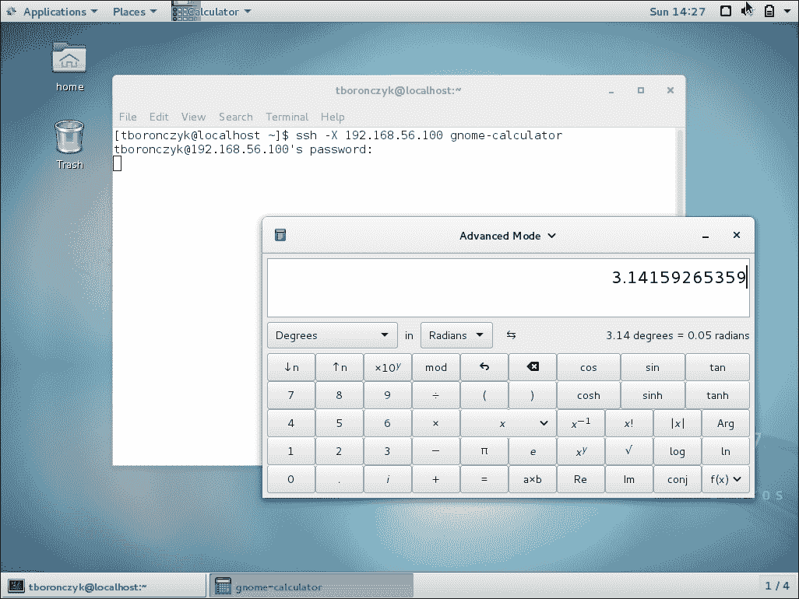
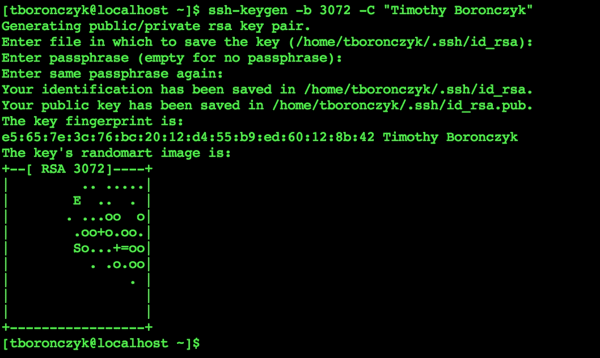
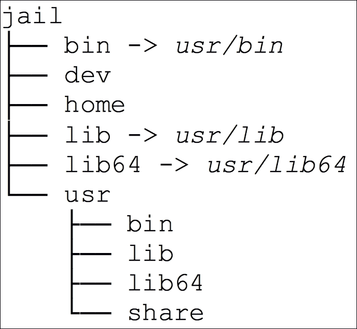
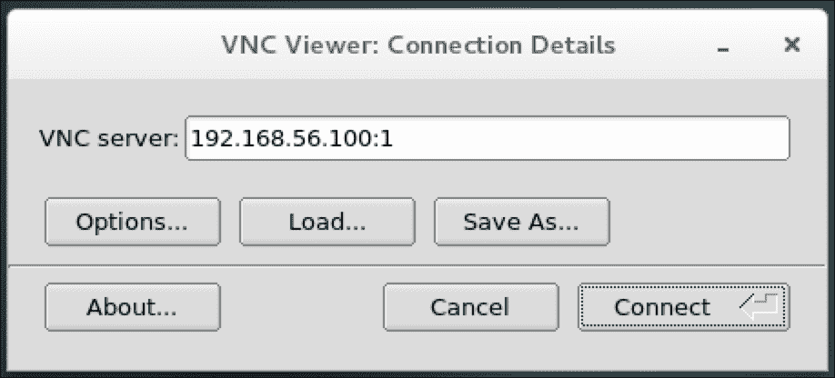

# 第六章：允许远程访问

本章包含以下内容：

+   通过 SSH 远程执行命令

+   配置更安全的 SSH 登录

+   无需密码安全连接到 SSH

+   按用户或组限制 SSH 访问

+   使用 Fail2ban 保护 SSH

+   将会话限制在 chroot 监狱中

+   配置 TigerVNC

+   通过 SSH 隧道连接 VNC

# 介绍

本章中的食谱将帮助你以安全的方式提供远程访问 CentOS 系统。你将学习如何通过 SSH 在远程系统上执行命令，配置 OpenSSH SSH 服务器以增强远程登录的安全性，并使用基于密钥的认证进行连接。你还将学习如何允许或拒绝不同用户的访问，配置 Fail2ban 自动阻止可疑的 IP 地址，以更好地保护你的服务器免受暴力破解攻击，并限制用户在登录后进入 chroot 监狱。结尾的食谱展示了如何通过 VNC 提供远程桌面环境的访问，并通过 SSH 隧道加密 VNC 流量来保障该访问的安全。

# 通过 SSH 远程执行命令

本篇展示了如何通过 **安全外壳**（**SSH**）在远程系统上执行一次性命令。无需建立完整的交互式会话就能执行命令，这非常方便，因为你可以避免打开第二个终端；所有操作都可以直接在同一命令行中完成。

## 准备工作

本食谱要求远程系统运行 OpenSSH 服务器，并且本地计算机已安装 OpenSSH SSH 客户端（CentOS 上默认安装）。示例假设远程系统的 IP 地址为 `192.168.56.100`。此外，你还需要在远程系统上有一个用户账户。

## 如何操作...

以下示例展示了如何通过 SSH 从本地系统远程执行命令：

+   要远程执行命令，使用 `ssh` 并指定目标系统的主机名或 IP 地址，然后是命令及其参数：

    ```
    ssh 192.168.56.100 uname -a

    ```

+   若要以不同用户身份执行命令，请提供远程系统的用户名和地址：

    ```
    ssh tboronczyk@192.168.56.100 id -un

    ```

+   如果远程命令需要 `sudo`，请为 `ssh` 提供 `-t` 参数：

    ```
    ssh -t 192.168.56.100 sudo mount /mnt

    ```

+   使用 `-X` 参数将远程系统的 X11 显示转发，用于执行图形程序：

    ```
    ssh -X 192.168.56.100 gnome-calculator

    ```

+   执行复杂命令时，请使用引号，例如一系列命令或使用 I/O 重定向时。这样可以避免本地和远程 shell 之间的歧义：

    ```
    ssh 192.168.56.100 "tar tvzf archive.tgz > contents.txt"

    ```

+   你可以将来自本地系统的输入传输到远程命令，这些命令从 stdin 读取：

    ```
    cat foo.txt | ssh 192.168.56.100 "cat > foo.txt"

    ```

## 它是如何工作的...

`ssh` 主要用于登录远程系统并访问交互式 shell，因为很多人可能不知道命令可以在没有 shell 的情况下远程执行。本篇提供了几个示例，说明了如何使用 `ssh` 远程执行命令，每个示例都遵循这个通用调用模式：

```
ssh [options] [user@]host command

```

在远程主机后提供的任何内容都被 `ssh` 接受作为远程执行的命令，如以下两个示例所示。第一个命令调用 `uname` 打印关于远程系统的信息，例如内核、处理器和操作系统，第二个命令运行 `id` 显示当前有效用户的用户名：

```
ssh 192.168.56.100 uname -a
ssh tboronczyk@192.168.56.100 id -un

```

当执行这些命令时，`ssh` 不会启动交互式 shell，因为没有必要分配一个 tty/伪终端；它本身作为 shell 执行，处理远程和本地系统之间的输入输出。然而，一些命令需要终端才能正常运行。例如，`sudo` 使用终端确保用户输入密码时不会将其显示在屏幕上。如果没有终端，`sudo` 会拒绝运行，并报告 `you must have a tty to run sudo`。我们可以在执行这些命令时提供 `-t` 参数，强制 `ssh` 分配远程终端资源：

```
ssh -t 192.168.56.100 sudo mount /mnt

```

`-X` 参数转发 X11 显示，允许我们运行图形化程序。尽管程序实际上是在远程系统上运行，但它显示得就像是在本地桌面环境中运行一样：

```
ssh -X 192.168.56.100 "gnome-calculator"

```



可以通过 X11 转发运行图形化应用程序

为了确保命令按您的意图被解析，您可能需要对命令加引号。当使用 I/O 重定向或运行多个命令时，尤其需要这样做。为了理解原因，请参考以下示例：

```
ssh 192.168.56.100 "tar tvzf archive.tgz > contents.txt"

```

`tar` 输出归档文件中的文件列表，然后将其重定向以创建 `contents.txt` 文件。所有操作都发生在远程系统——`tar` 在远程系统上运行，新文件也在远程系统上创建。

现在，这是相同的命令调用，但没有加引号：

```
ssh 192.168.56.100 tar tvzf archive.tgz > contents.txt

```

`tar` 仍然在远程执行，但本地 shell 解析重定向，`contents.txt` 文件在本地系统上创建。

I/O 重定向可以在两个方向上进行。也就是说，我们可以将本地系统的输入通过管道传输到远程系统的标准输入：

```
cat foo.txt | ssh 192.168.56.100 "cat > foo.txt"

```

在此示例中，`foo.txt` 被 `cat` 读取，内容通过管道传送到远程系统。在远程系统上，正在运行的 `cat` 实例将等待读取输入。当它检测到传输结束时，`cat` 输出它接收到的内容，随后该内容被重定向以在远程系统上创建 `foo.txt`。本质上，我们刚刚将本地系统上的 `foo.txt` 复制到远程系统。

## 另见

有关通过 SSH 远程运行命令的更多信息，请参考以下资源：

+   `ssh` 手册页面（`man 1 ssh`）

+   使用 SSH 进行管道传输 ([`linux.icydog.net/ssh/piping.php`](http://linux.icydog.net/ssh/piping.php))

+   Commandlinefu.com SSH 命令 ([`www.commandlinefu.com/commands/matching/ssh/c3No/sort-by-votes`](http://www.commandlinefu.com/commands/matching/ssh/c3No/sort-by-votes))

# 配置更安全的 SSH 登录

SSH 被认为是比旧的协议（如 Telnet、rsh 和 rlogin）更安全的替代方案，因为它加密了客户端和服务器之间的连接。这种加密保护了网络中可能窃听的恶意用户免受攻击。然而，系统仍然可能遭遇拒绝服务攻击或恶意用户利用无人看管的空闲会话。此步骤通过更新服务器配置，增强了 SSH 的安全性，特别是在远程登录方面。

## 准备工作

本步骤适用于运行 OpenSSH 服务器的 CentOS 系统。也需要管理员权限，可以通过登录`root`账户或使用`sudo`来获得。

## 如何操作...

按照以下步骤增强 SSH 登录的安全性：

1.  使用文本编辑器打开 SSH 服务器的配置文件：

    ```
    vi /etc/ssh/sshd_config

    ```

1.  定位到`LoginGraceTime`选项。取消注释并将其值更改为`30`秒，以限制用户提供凭证的时间：

    ```
    LoginGraceTime 30

    ```

1.  找到并取消注释`PrintLastLog`选项，并将其值更改为`yes`，以显示用户上次登录的时间和地点：

    ```
    PrintLastLog yes

    ```

1.  取消注释`Banner`选项并将其值设置为`/etc/banner`，以便向用户显示登录警告：

    ```
    Banner /etc/banner

    ```

1.  保存更改并关闭配置文件。

1.  创建`/etc/banner`文件，并写入以下（或类似）内容：

    ```
    This computer system is for authorized use only. All  activity is 
    logged and monitored. Users accessing this  system without 
    authority, or in excess of their authority,  may be subject to 
    criminal, civil, and administrative  action. Continuing to use 
    this system indicates your consent to these terms and conditions 
    of use.

    ```

1.  重启 SSH 服务器，使配置更改生效：

    ```
    systemctl restart sshd.service

    ```

1.  为了在 10 分钟不活动后自动注销会话，请创建`/etc/profile.d/timeout.sh`文件，内容如下：

    ```
    export TMOUT=600

    ```

## 工作原理...

我们在 SSH 服务器配置文件中调整的第一个选项是`LoginGraceTime`，用于确定用户输入用户名和密码的时间长度。默认情况下，如果用户在两分钟内没有提供凭证，连接尝试会超时。我们将此时间减少到`30`秒，但如果您觉得时间不够，可以设置一个更合适的值：

```
LoginGraceTime 30

```

然后，将`PrintLastLog`选项的值设置为`yes`，使用户的上次登录时间和地点显示出来。这有助于因为不熟悉的时间或地点可能会警告用户其账户可能已经被入侵并用于未经授权的访问：

```
PrintLastLog yes

```

接下来，我们配置了登录横幅。虽然强烈措辞的警告不太可能威慑恶意用户，但许多组织要求在用户登录时根据法律要求显著显示这些警告信息。此类消息在一些司法管辖区被视为足够的通知，告知用户他们的行为正在被监视，且对系统上的活动不应期望隐私。这为组织提供了更强的法律依据，追究任何滥用行为。

为了在登录提示前显示警告，我们将`Banner`设置为指向包含消息的文件路径。然后我们创建了一个包含所需文本的文件：

```
Banner /etc/banner

```


用户在登录远程系统之前会看到横幅信息

### 注意

`nroff`可以用来调整横幅的文本对齐：

`` `**(echo -e ".ll 75\n.pl 0\n.nh"; cat) | nroff > /etc/banner**` ``

`cat`从标准输入读取文本（当完成时按***Ctrl*** + ***D***），然后将 echo 输出的指令和文本通过管道传送到`nroff`进行格式化。

`.ll`告诉`nroff`将行长度设置为`75`个字符。建议使用小于`80`的值，因为传统终端每行显示`80`个字符。

`.pl`设置页面长度，将其设置为`0`可以防止`nroff`在文本后添加额外的空白，以试图填充某个假设的打印页面长度。

`.nh`可以防止`nroff`在行末进行单词分割。

如果你希望在用户登录后而不是之前显示横幅，可以使用当天消息文件。在这种情况下，取消注释`PrintMotd`选项并将其值设置为`yes`，然后将文本保存到`/etc/motd`中。

最后，我们创建了`/etc/profile.d/timeout.sh`文件来设置`TMOUT`环境变量。在`/etc/profile.d`下设置`TMOUT`会在用户登录时全球应用它。要针对单个用户，或者如果你想为特定用户覆盖全局值，可以将`export`命令放入他们的`~/.bash_profile`文件中：

```
export TMOUT=600

```

现在，设置了该变量后，bash 会在用户一段时间未活动时自动关闭会话，显示消息`timed out waiting for input: auto-logout`。该值以秒为单位，示例配方会在 10 分钟后关闭空闲会话。

## 另请参见

请参考以下资源，了解如何加强 SSH 登录的安全性：

+   `sshd_config` 手册页 (`man 5 sshd_config`)

+   RHEL 7 系统管理员指南：OpenSSH ([`access.redhat.com/documentation/en-US/Red_Hat_Enterprise_Linux/7/html/System_Administrators_Guide/ch-OpenSSH.html`](https://access.redhat.com/documentation/en-US/Red_Hat_Enterprise_Linux/7/html/System_Administrators_Guide/ch-OpenSSH.html))

+   CentOS Wiki：保护 OpenSSH ([`wiki.centos.org/HowTos/Network/SecuringSSH`](https://wiki.centos.org/HowTos/Network/SecuringSSH))

+   我应该使用登录横幅吗？([`serverfault.com/questions/24376/should-i-use-a-login-banner-and-if-so-what-should-it-say`](http://serverfault.com/questions/24376/should-i-use-a-login-banner-and-if-so-what-should-it-say))

# 无密码安全连接到 SSH

本教程教你如何生成密钥对，并为 SSH 会话设置基于密钥的认证，允许你在不使用密码的情况下秘密连接到远程系统。基于密钥的认证被认为比使用密码更安全，因为弱密码容易被猜测，而强密码则可能容易忘记且更容易被记录下来。在这两种情况下，攻击者都有较大的机会发现用户的密码。而通过基于密钥的认证，用户必须提供正确的私钥文件，几乎不可能被破解或伪造。

## 准备工作

本教程需要远程系统运行 OpenSSH 服务器，并且本地计算机上已安装 OpenSSH SSH 客户端。示例假设远程系统的 IP 地址为 `192.168.56.100`。另外，你需要在远程系统上有一个可用的用户账户。

## 如何操作...

按照以下步骤设置 SSH 会话的基于密钥的认证：

1.  在本地计算机上，使用 `ssh-keygen` 命令创建一对认证密钥。接受默认路径/文件名并保持空白的密码短语：

    ```
    ssh-keygen -b 3072 -C "Timothy Boronczyk"

    ```

1.  如果远程主目录下还没有 `.ssh` 目录，创建该目录：

    ```
    ssh 192.168.56.100 "mkdir -m 700 .ssh"

    ```

1.  将 `id_rsa.pub` 的内容追加到远程系统上的 `.ssh/authorized_keys` 文件中：

    ```
    cat .ssh/id_rsa.pub | ssh 192.168.56.100 "cat >>  
           .ssh/authorized_keys"

    ```

1.  确保 `authorized_keys` 文件的权限：

    ```
    ssh 192.168.56.100 "chmod 640 .ssh/authorized_keys"

    ```

1.  验证是否可以在不提供密码的情况下连接到远程系统：

    ```
    ssh 192.168.56.100

    ```

1.  对于任何额外的远程系统，只要你希望使用基于密钥的认证登录，重复步骤 2 到 5。

## 工作原理...

基于密钥的认证被认为比使用密码更安全，因为破解合适的加密密钥几乎不可能，而暴力破解密码则很简单。本教程使用了 OpenSSH 套件中的 `ssh-keygen` 程序生成了新的密钥对，然后我们用它来验证我们的 SSH 会话：

```
ssh-keygen -b 3072 -C "Timothy Boronczyk"

```

`-C` 在密钥中嵌入一个简短的注释，这对于识别密钥的所有者或用途很有帮助，`-b` 设置用于密钥模数的位数。使用的位数越多，可以表示的数字越大，这意味着更强的破解抗性。如果没有提供 `-b`，默认值为 2,048 位。根据计算能力增长的估算，2,048 位的密钥通常认为适用于 2030 年之前（研究人员在 2010 年成功攻破了 1,024 位的密钥）。3,072 位的密钥被认为适用于 2030 年以后。

在提示时，我们接受了建议的 `~/.ssh/id_rsa` 作为输出文件名（这是 `ssh` 默认在连接到远程服务器时查找我们的私钥的位置）。我们也没有提供密码短语。如果我们提供密码短语，那么密钥将被加密，并且每次使用密钥时，我们都需要提供密码来解密它。

当`ssh-keygen`完成时，私钥`id_rsa`和公钥`id_rsa.pub`将保存在`.ssh`目录中：



密钥对用于无密码认证

然后，我们在远程系统的主目录中创建了`.ssh`目录。你可以在登录远程系统时执行`mkdir`命令，否则可以通过 SSH 远程执行该命令：

```
ssh 192.168.56.100 "mkdir -m 700 .ssh"

```

接下来，我们将公钥添加到远程系统的`.ssh/authorized_keys`中：

```
cat .ssh/id_rsa.pub | ssh 192.168.56.100 "cat >>  .ssh/authorized_keys"

```

由于正确的权限有助于确保密钥的安全，`ssh`不会考虑使用权限过于宽松的密钥。`.ssh`目录的权限应该仅限于所有者的读、写、执行权限（`700`），`authorized_keys`文件的权限应该是所有者和组的读权限，以及所有者的写权限（`640`）。通过简单的`chmod`命令确保一切正确：

```
ssh 192.168.56.100 "chmod 640 .ssh/authorized_keys"

```

当我们连接时，`ssh`会看到`id_rsa`文件，并将我们的私钥作为连接请求的一部分发送。服务器在`authorized_keys`文件中检查相应的公钥，如果一切匹配，我们就会被授权并登录。

## 另请参见

有关使用基于密钥的身份验证与 OpenSSH 的更多信息，请参考以下资源：

+   RHEL 7 系统管理员指南：OpenSSH ([`access.redhat.com/documentation/en-US/Red_Hat_Enterprise_Linux/7/html/System_Administrators_Guide/ch-OpenSSH.html`](https://access.redhat.com/documentation/en-US/Red_Hat_Enterprise_Linux/7/html/System_Administrators_Guide/ch-OpenSSH.html))

+   SSH 密码与密钥认证 ([`security.stackexchange.com/questions/33381/ssh-password-vs-key-authentication`](http://security.stackexchange.com/questions/33381/ssh-password-vs-key-authentication))

# 按用户或组限制 SSH 访问

根据你系统的角色和已配置的用户帐户，你可能不希望所有已注册的用户都能通过 SSH 访问。此指南向你展示了如何配置 SSH 服务器，明确授予或拒绝用户访问权限。

## 准备工作

本指南要求在运行 OpenSSH 服务器的 CentOS 系统上操作。还需要管理员权限，可以通过`root`账户登录，或者使用`sudo`来获取权限。

## 操作步骤...

按照以下步骤限制用户的 SSH 访问：

1.  使用文本编辑器打开 SSH 服务器的配置文件：

    ```
    vi /etc/ssh/sshd_config

    ```

1.  找到`PermitEmptyPasswords`选项。取消注释并将其值设置为`no`，以禁止使用空密码的帐户：

    ```
    PermitEmptyPasswords no

    ```

1.  要禁用`root`账户的远程访问，找到并取消注释`PermitRootLogin`选项，将其值设置为`no`：

    ```
    PermitRootLogin no

    ```

1.  通过为`DenyUsers`添加条目，禁止特定用户帐户的远程访问。该选项的值应该是一个空格分隔的用户名列表，表示你要拒绝访问的用户：

    ```
    DenyUsers bbarrera jbhuse mbutterfield

    ```

1.  通过为`DenyGroups`添加条目，拒绝特定组成员的远程访问：

    ```
    DenyGroups users noremote

    ```

1.  添加`AllowUsers`条目，以拒绝所有除许可用户列表中的人以外的访问：

    ```
    AllowUsers abell tboronczyk

    ```

1.  添加`AllowGroups`条目，以拒绝所有除许可组列表中的人以外的访问：

    ```
    AllowGroups itadmin remote

    ```

1.  保存更改并关闭文件。

1.  重启 SSH 服务器使更改生效：

    ```
    systemctl restart sshd.service

    ```

## 它是如何工作的...

首先，我们取消注释`PermitEmptyPasswords`并将其值设置为`no`。这可以防止没有密码的用户帐户通过 SSH 登录：

```
PermitEmptyPasswords no

```

密码是保护我们免受恶意攻击（通过被破坏的用户帐户）的第一道防线。没有强密码，任何人只需知道用户名就可以轻松登录。这是一个可怕的想法，因为用户名很容易被猜到，有时甚至以电子邮件地址等形式公开。

接下来，我们取消注释`PermitRootLogin`选项并将其值设置为`no`。这可以防止`root`直接建立 SSH 会话：

```
PermitRootLogin no

```

这样的限制在使用 Telnet 等协议时至关重要，因为用户名和密码经常以明文形式通过网络传输——攻击者可以轻松监控网络流量并捕获密码。然而，尽管 SSH 通过加密其流量使这个问题变得无关紧要，但密码仍然容易受到暴力破解攻击。因此，明智的做法是要求用户首先使用其无特权帐户进行身份验证，然后在必要时使用`su`或`sudo`提升权限（请参阅第三章，*用户与权限管理*）。

该方案随后介绍了`DenyUsers`、`DenyGroups`、`AllowUsers`和`AllowGroups`选项，作为大范围限制 SSH 访问的方法。

`DenyUsers`选项禁止特定用户登录。其他用户帐户仍然可以远程访问系统，但在`DenyUsers`下列出的用户将看到`Permission Denied`消息。该方案的示例拒绝`bbarrera`、`jbhuse`和`mbutterfield`的访问：

```
DenyUsers bbarrera jbhuse mbutterfield

```

`DenyGroups`选项的工作原理类似，但它根据用户的组成员资格来拒绝用户访问；以下示例拒绝所有属于`users`组或`noremote`组的用户访问：

```
DenyGroups users noremote

```

拒绝选项对于将少数用户列入黑名单非常有用。要阻止所有用户，除了几个特定的用户，我们使用允许选项。`AllowUsers`拒绝所有人访问，除非在指定的用户列表中。`AllowGroups`是其对应选项，仅允许指定组成员的用户访问：

```
AllowUsers abell tboronczyk
AllowGroups itadmin remote

```

这些选项也可以具有使用`*`和`?`作为通配符的值。`*`匹配零个或多个字符，`?`匹配单个字符。例如，以下内容拒绝所有用户：

```
DenyUsers *

```

### 注意

`AllowUsers` 和 `AllowGroups` 会拒绝所有未列出的用户/组。使用这些选项时要小心，特别是如果你依赖 SSH 来管理服务器，因为很容易会把自己屏蔽出去。在退出当前 SSH 会话之前，请确保你能通过第二个终端成功登录。如果出现问题，你仍然可以通过第一个会话登录并解决问题。

## 另见

请参考以下内容，了解如何限制远程 SSH 访问：

+   `sshd_config` 手册页面 (`man 5 sshd_config`)

+   RHEL 7 系统管理员指南：OpenSSH ([`access.redhat.com/documentation/en-US/Red_Hat_Enterprise_Linux/7/html/System_Administrators_Guide/ch-OpenSSH.html`](https://access.redhat.com/documentation/en-US/Red_Hat_Enterprise_Linux/7/html/System_Administrators_Guide/ch-OpenSSH.html))

+   如何在 SSH 中拒绝所有用户，除了一个用户？ ([`www.linuxquestions.org/questions/linux-security-4/howto-sshd-deny-all-users-except-for-one-368752/`](http://www.linuxquestions.org/questions/linux-security-4/howto-sshd-deny-all-users-except-for-one-368752/))

# 使用 Fail2ban 保护 SSH

一名决心十足的攻击者可能会尝试暴力破解用户密码以获取访问权限，或者进行多次尝试登录，以消耗网络和系统资源，作为拒绝服务攻击的一部分。Fail2ban 可以帮助你防范此类攻击，通过监控服务器的日志文件，识别可疑活动，并自动封禁这些活动的 IP 地址。本教程将教你如何安装 Fail2ban 来保护你的系统。

## 准备工作

本教程需要一台运行 OpenSSH 服务器的 CentOS 系统，并且需要管理员权限，可以通过登录 `root` 账户或使用 `sudo` 获取权限。`fail2ban` 包由 EPEL 仓库提供，如果仓库尚未注册，请参考 第四章中的 *注册 EPEL 和 Remi 仓库* 配方，*软件安装管理*。

## 如何操作...

按照以下步骤使用 Fail2ban 保护你的系统：

1.  安装 `fail2ban` 包：

    ```
    yum install fail2ban

    ```

1.  使用以下内容创建监狱配置文件 `/etc/fail2ban/jail.local`：

    ```
    [sshd]
    enabled=true
    bantime=86400
    maxretry=5

    ```

1.  启动 Fail2ban 服务，并在系统启动时启用其自动启动：

    ```
    systemctl start fail2ban.service
    systemctl enable fail2ban.service

    ```

1.  要查看 `sshd` 监狱的状态，可以使用 `fail2ban-client` 配合 `status` 命令：

    ```
    fail2ban-client status sshd

    ```

## 它是如何工作的...

你已经学会了如何安装 Fail2ban 并配置在多次登录失败后自动屏蔽 IP 地址。你还学会了如何使用 `fail2ban-client` 手动封禁和解封地址。

一个 Fail2ban 监狱配置将过滤器和操作定义结合起来，当在服务器的日志文件中观察到某些模式时，执行相应的活动。过滤器指定用于识别有意义日志条目的模式定义，例如，重复的身份验证失败。另一方面，操作定义了当过滤器匹配时要执行的命令。Fail2ban 随附了多个预定义的过滤器，适用于 Apache、MySQL、Sendmail 和 SSH 等常见服务器，并且还提供了多个预定义操作，例如管理 iptable 条目以封禁和解除封禁 IP 地址、发送电子邮件通知以及触发 DNS 更新。

在 `/etc/fail2ban/jail.conf` 中定义了多个监狱。为了激活 `sshd` 监狱，我们创建了 `jail.local` 文件，并在其中添加了覆盖和扩展默认监狱定义的条目：

```
[sshd]
enabled=true
bantime=86400
maxretry=5

```

从直观上看，`enabled` 选项用于启用或禁用监狱。`maxretry` 设置为 `5`，表示允许失败的登录尝试次数，在超过这个次数后，Fail2ban 将执行封禁操作。`bantime` 设置封禁的持续时间，我们将其设置为 `86400` 秒。通过这个配置，用户最多允许 `5` 次失败尝试，超过后他们的 IP 地址将被封禁 24 小时。

`jail.conf` 中已有的定义已经确定了默认端口和日志文件的位置。如果你在非标准端口上运行 SSH，可以使用 `port` 来覆盖原始定义的设置。SSH 的日志文件位置也可以通过 `logfile` 来覆盖。

`fail2ban-client` 用于与 Fail2ban 服务进行交互。其 `status` 命令输出服务当前状态的信息，如果 `status` 后面跟着监狱名称，则返回该监狱的状态信息。监狱状态中可能特别值得注意的是被封禁的 IP 地址列表：

```
fail2ban-client status sshd

```


监狱的状态输出展示了被封禁地址的列表

客户端还提供 `get` 和 `set` 命令，用于检查和更新正在运行的服务的各种属性。例如，`get sshd bantime` 返回配置的封禁时长。`set sshd bantime` 临时更新封禁时长，直到服务重启。

你可以通过设置监狱的 `banip` 属性来手动封禁某个 IP 地址：

```
fail2ban-client set sshd banip 10.25.30.107

```

若要手动解除封禁某个地址，请设置 `unbanip`：

```
fail2ban-client set sshd unbanip 10.25.30.107

```

能够手动解除封禁地址非常重要，因为有时合法的地址可能会由于某些原因被误封。如果有些地址永远不应该被封禁，可能是某个测试集成服务器故意执行了失败登录，或者是管理员的计算机，你可以在 `jail.local` 配置文件中使用 `ignoreip` 选项来标识这些地址，Fail2ban 将避免封禁这些地址：

```
ignoreip=10.25.30.107

```

## 另见

更多关于 Fail2ban 的信息，请参考以下资源：

+   `fail2ban-client` 手册页面 (`man 1 fail2ban-client`)

+   Fail2ban Wiki ([`www.fail2ban.org/wiki/index.php/Main_Page`](http://www.fail2ban.org/wiki/index.php/Main_Page))

+   使用 Fail2ban 永久禁止重复违规者（[`stuffphilwrites.com/2013/03/permanently-ban-repeat-offenders-fail2ban/`](http://stuffphilwrites.com/2013/03/permanently-ban-repeat-offenders-fail2ban/)）

+   监控 Fail2ban 日志（[`www.the-art-of-web.com/system/fail2ban-log/`](http://www.the-art-of-web.com/system/fail2ban-log/)）

# 将会话限制在 chroot 监狱中

本食谱教你如何设置一个 chroot 监狱。chroot 调用通过将特定路径设置为根目录，改变用户对文件系统层次结构的视图；对于用户来说，这个路径看起来就像是`/`，并且无法越过这个路径。这就创建了一个沙盒或监狱，将用户限制在真实层次结构的一个小分支内。chroot 监狱通常用于安全目的，例如用户隔离、蜜罐以及应用程序测试和恢复程序。

## 准备工作

本食谱要求运行 OpenSSH 服务器的 CentOS 系统。还需要管理员权限，可以通过`root`账户登录或使用`sudo`。

## 如何操作...

按照以下步骤配置 chroot 监狱并将用户限制在其中：

1.  下载`cpchroot`脚本，必要时将命令及其依赖项复制到 chroot 环境中：

    ```
    curl -Lo ~/cpchroot tinyurl.com/zyzozdp

    ```

1.  使用`chmod`使脚本可执行：

    ```
    chmod +x ~/cpchroot

    ```

1.  创建`/jail`目录及其子目录，以模拟根文件系统：

    ```
    mkdir -p /jail/{dev,home,usr/{bin,lib,lib64,share}}
    cd /jail
    ln -s usr/bin bin
    ln -s usr/lib lib
    ln -s usr/lib64 lib64

    ```

1.  执行`chroot`脚本以复制所需的程序和命令：

    ```
    ~/cpchroot /jail bash cat cp find grep less ls   
           mkdir mv pwd rm rmdir

    ```

1.  复制`terminfo`数据库：

    ```
    cp -R /usr/share/terminfo /jail/usr/share

    ```

1.  使用`mknod`在`/jail/dev`下创建特殊设备文件：

    ```
    cd /jail/dev
    mknod null c 1 3
    mknod zero c 1 5
    mknod random c 1 8

    ```

1.  为 chroot 用户创建一个组：

    ```
    groupadd sandbox

    ```

1.  使用文本编辑器打开`/etc/ssh/sshd_config`文件，并将以下内容添加到文件的末尾：

    ```
     Match Group sandbox
               ChrootDirectory /jail 

    ```

1.  保存更改并关闭配置文件。

1.  重新启动 SSH 服务器以使更改生效：

    ```
    systemctl restart sshd.service

    ```

要创建一个新的 chroot 用户，使用`useradd`命令创建用户，并将其分配到`sandbox`组：

```
useradd -s /bin/bash -m -G sandbox rdiamond

```

然后，将他们的`home`目录移动到 chroot`jail`下：

```
mv /home/rdiamond /jail/home

```

要将现有用户设置为 chroot 环境，将其分配到`sandbox`组，并将其`home`目录移至`jail`：

```
usermod -G sandbox bbarrera
mv /home/bbarrera /jail/home

```

## 工作原理...

手动识别和复制依赖项是繁琐且容易出错的。因此，我编写了一个辅助脚本来自动化寻找和克隆程序及其依赖项到监狱中的过程。我们的第一步是使用`curl`下载脚本，然后使用`chmod`使其可执行：

```
curl -Lo ~/cpchroot tinyurl.com/zyzozdp
chmod +x ~/cpchroot

```

该脚本托管在 GitHub 上，但其直接网址过长，因此我使用了一个网址缩短服务来缩短地址。我们需要为`curl`提供`-L`，以便跟踪任何重定向（该服务会响应一个指向 GitHub 的重定向），`-o`设置下载文件的名称，此处为`cpchroot`，并保存到`home`目录下。

### 注意

如果您遇到由于网址缩短服务而出现的问题，可以通过访问[`gist.github.com/tboronczyk/00d77b1baafd13daab3b`](https://gist.github.com/tboronczyk/00d77b1baafd13daab3b)，点击**Raw**按钮，然后复制浏览器地址栏中出现的网址来找到直接链接。

接下来，我们创建了`/jail`目录，并在其中创建了一个模仿根文件系统的目录结构。当用户登录并进入 chroot 环境时，他们及其所有操作都会局限在`/jail`目录内。他们将无法访问该目录之外的内容，因此我们需要复制程序所期望的目录布局：

```
mkdir -p /jail/{dev,home,usr/{bin,lib,lib64,share}}
cd /jail
ln -s usr/bin bin
ln -s usr/lib lib
ln -s usr/lib64 lib64

```

我们使用了带有`-p`选项的`mkdir`，并利用 Shell 扩展通过一个命令创建了大部分布局。CentOS 将其顶级的`/bin`、`/lib`和`/lib64`目录设置为指向`/usr`下相应目录的符号链接，我们通过在`/jail`目录内使用`ln`命令复制了这些链接。最终的布局如下所示：



沙盒根目录的布局模仿了主机的根文件系统。

接下来，我们使用脚本将所需的命令复制到`jail`中。该脚本负责查找每个程序的二进制文件，识别其依赖的所有库，然后将所有文件复制到沙盒文件系统的适当位置：

```
~/cpchroot /jail bash cat cp find grep less ls mkdir mv pwd rm rmdir

```

它的第一个参数是作为我们 chroot 根目录的目录，后面跟着我们希望提供给用户的一个或多个程序列表。该配方提供了 12 个程序作为示例，您可以根据需要自由添加或删除。最低要求是必须有一个 Shell（`bash`）。我建议您至少包含`ls`和`pwd`，这样用户就可以进行导航。

然后，我们将`terminfo`数据库复制到`jail`中：

```
cp -R /usr/share/terminfo /jail/usr/share/

```

一些程序，如`screen`、`less`和`vi`，使用`terminfo`数据库来确保其输出正确显示。该数据库是一个文件集合，描述了不同终端类型的功能，如每屏的行数、如何清除屏幕、支持哪些颜色等。如果这些信息无法访问，用户将被警告`终端功能不完全`，并且输出可能会出现乱码。

为了完成创建`jail`，我们使用`mknod`命令创建了`/dev/null`、`/dev/zero`和`/dev/random`设备：

```
cd /jail/dev/
mknod null c 1 3
mknod zero c 1 5
mknod random c 1 8

```

`mknod`用于创建特殊文件，如字符文件和块文件。这些文件之所以特殊，是因为它们可以生成数据（如`null`和`zero`）或表示物理设备并接收数据。`null`和`zero`都是字符文件，正如字母`c`所表示的那样，因为我们一次从中读取一个字符。另一方面，块文件一次操作多个字符。物理存储磁盘通常表示为块设备。

我们在创建字符设备或块设备时，还需要提供主次设备号。这些值是预定义的，内核理解这些值如何影响设备文件的行为。`1` 和 `3` 是定义空设备的主次设备号，`1` 和 `5` 定义文件为空字节源。你可以在本配方的 *另请参见* 部分中找到 Linux 分配的设备文档，查看完整的主次设备号分配列表。

设置 chroot 环境后，我们开始配置 SSH 服务器。首先，我们创建了一个 `sandbox` 组，任何我们想要隔离的用户都可以分配到该组：

```
groupadd sandbox

```

接下来，我们在 SSH 服务器的配置文件中添加了一个 `Match` 块，目标是新的组：

```
Match Group sandbox
 ChrootDirectory /jail

```

`Match` 在配置文件中开始一个新的条件块，仅在满足条件时应用。在本例中，我们将用户的组匹配为 `sandbox`。当用户属于该组时，`ChrootDirectory` 选项会被应用，并将 `/jail` 设置为用户的根目录。现在，当用户连接时，他们所做的一切都会被限制在 chroot 监狱中，包括自动发生的操作，如启动交互式 shell (`bash`)。

Bash 在用户登录后会尝试将其放入 `home` 目录。但是，如果他们的 `home` 目录无法访问，用户会看到错误信息 `Could not chdir to home directory`，并且会被定位到根目录。为了避免这种情况，我们将他们的 `home` 目录移入了 `jail`：

```
mv /home/jbhuse /jail/home/

```

### 注意

你可能会想在创建新用户时指定 `home` 目录，如下所示：

`**useradd -m -D /jail/home/jbhuse -G sandbox jbhuse**`

不幸的是，这不起作用。`home` 目录在期望的位置创建，用户被 chroot，路径相对于 `/jail` 进行查看，这样 bash 就会寻找 `/jail/jail/home/jbhuse`。这就是为什么示例中演示了将 `home` 目录移到第二步的原因。`/etc/passwd` 中的条目保持不变，`/home/jbhuse` 被解释为 `/jail/home/jbhuse`，一切正常。

## 另请参见

更多关于设置 chroot 环境的信息，请参阅以下内容：

+   `sshd_config` 手册页 (`man 5 sshd_config`)

+   如何配置带有 Chroot 的 SFTP ([`www.unixmen.com/configure-sftp-chroot-rhel-centos-7`](http://www.unixmen.com/configure-sftp-chroot-rhel-centos-7))

+   安全地识别用于 chroot 的依赖项 ([`zaemis.blogspot.com/2016/02/safely-identify-dependencies-for-chroot.html`](http://zaemis.blogspot.com/2016/02/safely-identify-dependencies-for-chroot.html))

+   Linux 分配的设备 ([`www.kernel.org/doc/Documentation/devices.txt`](https://www.kernel.org/doc/Documentation/devices.txt))

# 配置 TigerVNC

虚拟网络计算（VNC）通过捕获显示的帧缓冲区并通过网络提供访问。这个教程展示了如何安装 TigerVNC 并将其配置为提供远程用户访问图形桌面环境，就像他们物理上坐在系统前面一样。

## 准备工作

本教程需要两台系统，一台 CentOS 系统用于托管 VNC 服务器（远程系统），另一台本地计算机通过 VNC 客户端连接到它。假设远程系统正在运行 OpenSSH SSH 服务器和图形桌面环境，如 GNOME 或 KDE。需要在远程服务器上拥有管理员权限，可以通过登录`root`账户或使用`sudo`来获得。预计本地计算机已经安装了 VNC 客户端。

## 如何操作...

按照以下步骤安装和配置 TigerVNC：

1.  在远程系统上安装 TigerVNC 服务器软件包：

    ```
    yum install tigervnc-server

    ```

1.  将随软件包提供的示例单元文件复制到`/etc/systemd/system`，并调整其名称，以包含使用 VNC 的用户的用户名：

    ```
    cp /usr/lib/systemd/system/vncserver@.service  
           /etc/systemd/system/vncserver-tboronczyk@.service

    ```

1.  使用文本编辑器打开新的单元文件：

    ```
    vi /etc/systemd/system/vncserver-tboronczyk@.service

    ```

1.  替换`[Service]`部分中`ExecStart`和`PIDFile`条目中出现的`<USER>`占位符：

    ```
    ExecStart=/usr/sbin/runuser -l tboronczyk -c "/usr/bin/  
           vncserver %i"
    PIDFile=/home/tboronczyk/.vnc/%H%i.pid

    ```

1.  保存更改并关闭文件。

1.  对每个将使用 VNC 连接到桌面的用户，重复步骤 2 到 5。

1.  重新加载 systemd 的配置，使其意识到新的单元文件：

    ```
    systemctl daemon-reload

    ```

1.  在系统的防火墙中开放`5900`到`5903`端口，以接受来自 VNC 的请求：

    ```
    firewall-cmd --zone=public --permanent --add-service=vnc- server
    firewall-cmd --reload

    ```

1.  使用 VNC 的用户应该使用`vncpasswd`设置他们将用于身份验证的密码：

    ```
    vncpasswd

    ```

1.  当用户想要连接时，在启动 TigerVNC 时在单元名称后指定一个显示号`@`：

    ```
    systemctl start vncserver-tboronczyk@:1.service

    ```

1.  当服务器不使用时停止它：

    ```
    systemctl stop vncserver-tboronczyk@.service

    ```

## 它是如何工作的...

除了 VNC 服务器，`tigervnc-server`软件包还安装了一个`systemd`单元文件，用于启动和停止服务器。然而，在使用之前我们需要进行一些配置，因为服务器是在用户账户下运行，以获取他们的桌面。

当 TigerVNC 启动时，它会连接到 X 服务器并登录到用户的桌面，就像用户坐在系统前面一样。这意味着每个用户都需要自己的服务器实例运行，我们需要为每个用户进行配置。我们复制了位于`/usr/lib/systemd/system`下的原始单元文件，每个用户一个副本。

```
cp /usr/lib/systemd/system/vncserver@.service /etc/systemd/system/  
    vncserver-tboronczyk@.service

```

复制文件的名称包含用户名，以便我们可以保持一切有序。它们被放置在`/etc/systemd/system`下，因为`systemd`会先在`/etc/systemd`中查找单元文件，然后才会搜索`/usr/lib/systemd`（实际上，`/etc/systemd`中的许多条目是指向`/usr/lib/systemd`下原始文件的符号链接）。因此，将副本放在这里可以让我们保持原始文件的完整，并且在升级时，如果原始单元文件被替换，这样可以保护我们不丢失配置。


该系统已为多个用户配置了 VNC 访问

我们在每个配置文件的`[SERVICE]`部分中，将所有出现的`<USER>`占位符替换为相应的用户名：

```
ExecStart=/usr/sbin/runuser -l tboronczyk -c "/usr/bin/vncserver %i"
PIDFile=/home/tboronczyk/.vnc/%H%i.pid

```

在`ExecStart`条目中指定的命令是在我们使用`systemctl start`启动服务器时调用的；它使用`runuser`在用户账户下运行 TigerVNC。`-l`（小写 L）参数提供用户名，`-c`指定`runuser`将执行的命令及其参数。`PIDFile`条目指定运行进程将跟踪其进程 ID 的目录。

### 注意

`runuser`的作者 Dan Walsh 写了一篇名为*runuser vs su*的博客，详细讲述了该命令的背景故事。你可以在[`danwalsh.livejournal.com/55588.html`](http://danwalsh.livejournal.com/55588.html)在线阅读。

`@`符号出现在文件名中对 systemd 具有特殊意义。它后面的内容和文件后缀之间的部分会传递给单元文件中的命令，替换`%i`。这让我们能够向服务器传递有限的信息，例如 TigerVNC 运行的显示号。当我们按照示例中的方法启动服务器时，`@`后面会跟上`:1`。这个值会被 systemd 解析，TigerVNC 会在显示器 1 上启动。如果我们使用`:2`，服务器将在显示器 2 上启动。我们可以为不同的用户或即使是同一个用户启动多个 TigerVNC 实例，只要每个显示器号不同即可：

```
systemctl start vncserver-tboronczyk@:1.service

```

显示对应端口的流量应允许通过防火墙。显示 0 使用端口`5900`，显示 1 使用端口`5901`，显示 2 使用端口`5902`，依此类推。如果你使用的是 FirewallD，预定义的`vnc-server`服务会打开端口`5900`-`5903`：

```
firewall-cmd --zone=public --permanent --add-service=vnc-server

```

如果你需要额外的端口，或者不需要打开整个范围，你可以使用`--add-port`只打开所需的端口：

```
firewall-cmd --zone=public --permanent --add-port=5901/tcp

```

用户在连接到显示器之前需要使用`vncpasswd`设置 VNC 密码。密码必须至少为六个字符长，尽管只有前八个字符才是有效的。此外，密码存储在用户的`~/.vnc/`目录中。考虑到这些问题，建议用户不要使用与账户密码相同的密码。也建议用户仅在需要时运行 VNC 服务器，因为任何知道显示号和密码的人都可以连接。

用户还需要一个 VNC 客户端才能从本地计算机连接。CentOS 用户可以安装`tigervnc`包来使用 TigerVNC 的客户端。其他流行的客户端包括 Ubuntu 的 Vinagre，Windows 上 TightVNC 的 RealVNC，以及 OS X 上的 Chicken of the VNC：

```
yum install tigervnc

```

需要远程系统的 IP 地址或主机名以及 VNC 运行的显示（端口）才能建立连接。它们可以通过不同的方式提供，具体取决于客户端，但大多数客户端接受的标准格式是将显示号附加到系统地址，例如`192.168.56.100:1`。接下来，用户将被提示输入密码，如果一切顺利，他们将连接到远程显示：



用户准备通过 VNC 连接到远程显示

## 另请参见

请参考以下资源，了解更多关于运行 TigerVNC 和 systemd 如何在文件名中使用`@`的信息：

+   TigerVNC ([`tigervnc.org/`](http://tigervnc.org/))

+   RHEL 7 系统管理员指南：TigerVNC ([`access.redhat.com/documentation/en-US/Red_Hat_Enterprise_Linux/7/html/System_Administrators_Guide/ch-TigerVNC.html`](https://access.redhat.com/documentation/en-US/Red_Hat_Enterprise_Linux/7/html/System_Administrators_Guide/ch-TigerVNC.html))

+   ArchWiki: TigerVNC ([`wiki.archlinux.org/index.php/TigerVNC`](https://wiki.archlinux.org/index.php/TigerVNC))

+   `@`符号和`systemctl` ([`superuser.com/questions/393423/the-symbol-and-systemctl-and-vsftpd/393429#393429`](http://superuser.com/questions/393423/the-symbol-and-systemctl-and-vsftpd/393429#393429))

+   理解 Systemd 单元和单元文件 ([`www.digitalocean.com/community/tutorials/understanding-systemd-units-and-unit-files`](https://www.digitalocean.com/community/tutorials/understanding-systemd-units-and-unit-files))

# 通过 SSH 隧道转发 VNC 连接

前面的教程展示了如何通过 VNC 远程访问用户的桌面。然而，如果服务运行在不受信任的网络上，显然存在一些安全问题。连接所需的仅是显示号码和密码，而由于密码的前八个字符才是有效的，恶意用户相对容易破解密码。此外，流量是未加密的，可能会被窃听。为了缓解这些风险，本教程将教你如何通过加密的 SSH 隧道转发 VNC 连接。

## 准备工作

本教程需要两个系统，一个是托管 VNC 服务器的 CentOS 系统（远程系统），另一个是本地计算机，具有 VNC 客户端以连接到该服务器。假设远程系统正在运行 OpenSSH SSH 服务器和 TigerVNC 服务器，并配置了 IP 地址`192.168.56.100`。同时假设你拥有管理员权限。VNC 服务器应按照之前的教程配置。本地计算机应安装 OpenSSH SSH 客户端（`ssh`）和 VNC 客户端。

## 如何操作...

按照以下步骤，通过加密的 SSH 隧道转发 VNC 连接：

1.  在远程服务器上，使用文本编辑器打开`vncserver@.service`配置文件：

    ```
    vi /etc/systemd/system/vncserver-tboronczyk@.service

    ```

1.  定位到`ExecStart`条目，并向`runuser`调用的`vncserver`命令添加`-localhost`参数：

    ```
     ExecStart=/usr/sbin/runuser -l tboronczyk -c "/usr/bin/vncserver
    -localhost %i" 

    ```

1.  保存更改并关闭文件。

1.  根据需要为其他用户的配置文件重复步骤 1 到 3。

1.  重新加载 systemd 配置，以使其意识到更新：

    ```
    systemctl daemon-reload

    ```

1.  启动 VNC 服务器：

    ```
    systemctl start vncserver-tboronczyk@:1.service

    ```

1.  在本地系统上，使用 `-L` 参数建立 SSH 会话，以定义隧道：

    ```
    ssh -L 5901:localhost:5901 192.168.56.100

    ```

1.  使用 VNC 客户端连接到隧道的本地端点（`localhost:1`）。

## 工作原理...

本食谱展示了如何通过将 VNC 流量通过 SSH 隧道进行加密。我们将 TigerVNC 服务器配置为仅接受来自本地主机的连接，并在本地客户端端设置隧道，以便通过 SSH 连接路由流量。这有助于减轻一些上述的安全风险，因为需要进行适当的身份验证以建立隧道并加密 VNC 流量。

首先，你编辑了用于启动 VNC 服务器实例的单元文件中的 `ExecStart` 命令。`-localhost` 参数指示 `vncserver` 仅与本地系统通信；任何来自网络的传入连接将被拒绝：

```
ExecStart=/usr/sbin/runuser -l tboronczyk -c "/usr/bin/vncserver   
    -localhost %i"

```

在客户端，用户现在需要使用 `ssh` 建立一个 SSH 隧道，才能连接到远程显示：

```
ssh -L 5901:localhost:5901 192.168.56.100

```

`-L` 参数定义隧道为 `local-port:target-host:target-port`。目标主机和端口表示与 `ssh` 连接的服务器的最终目的地。例如，我们知道本食谱在显示 1 上运行用户的桌面，使用端口 `5901`。我们还知道 TigerVNC 服务器运行在 `192.168.56.100` 上，但配置为仅监听其本地主机。这意味着，我们需要从 `192.168.56.100` 连接到 `localhost:5901`。因此，`localhost:5901` 是相对于该系统的目标。

一旦用户建立了隧道，他们可以最小化会话终端。（不要关闭它！）`ssh` 已连接到远程系统，同时在本地端口（也就是`5901`）上监听。在远程服务器上，`ssh` 已建立到目标主机和端口的第二个连接。VNC 客户端将通过使用地址 `localhost:1` 连接到本地端口，流量随后通过 SSH 隧道路由到远程服务器，然后转发到最终目的地。

远程系统充当网关，流量从客户端隧道经过它到达最终目的地。请记住，除非在远程服务器上也创建了到目标的隧道，否则数据旅程的第二段不会加密。对于本食谱来说，这不成问题，因为远程和目标主机是相同的。如果最终目的地不是本地主机，请确保网络可信，或创建第二个隧道。

### 注意

以这种方式通过 SSH 路由流量也可以用于保护其他服务，例如 NFS、FTP、HTTP、POP3 和 SMTP。整个过程是相同的：配置服务器以便在本地监听，然后在客户端建立隧道。

## 参见

参考以下资源了解更多关于 SSH 隧道的信息：

+   `ssh` 手册页（`man 1 ssh`）

+   使用 SSH 加密网络流量（[`security.berkeley.edu/resources/best-practices-how-articles/securing-network-traffic-ssh-tunnels`](https://security.berkeley.edu/resources/best-practices-how-articles/securing-network-traffic-ssh-tunnels)）

+   简化的 SSH 隧道使用教程（[`www.revsys.com/writings/quicktips/ssh-tunnel.html`](http://www.revsys.com/writings/quicktips/ssh-tunnel.html)）
