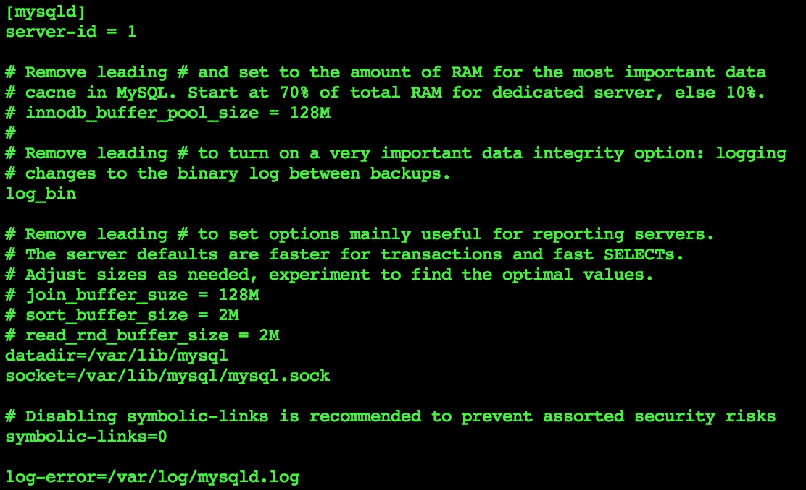
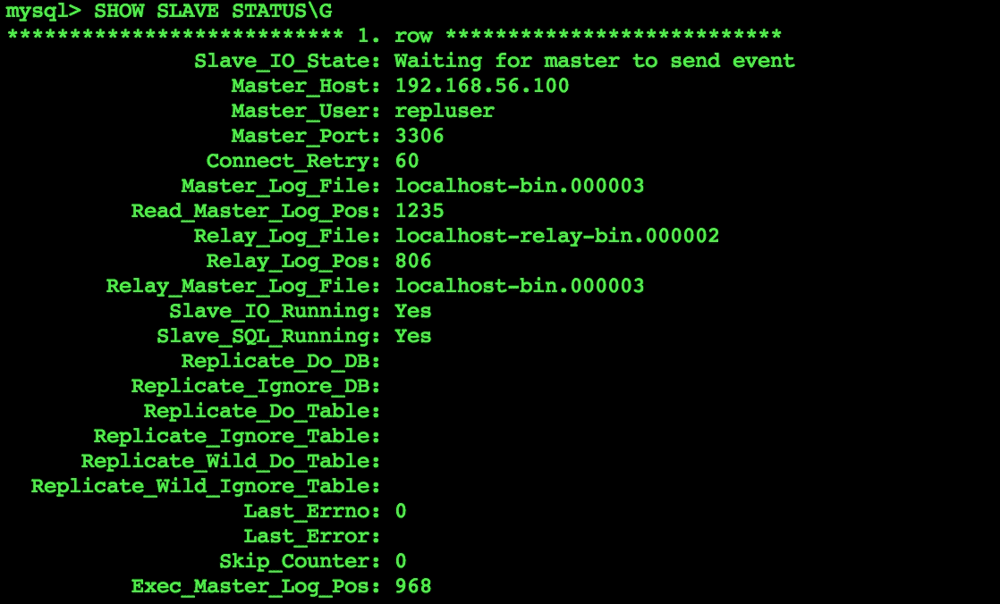
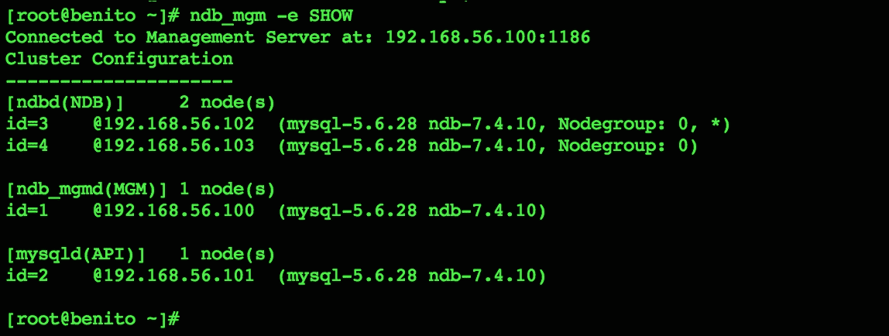
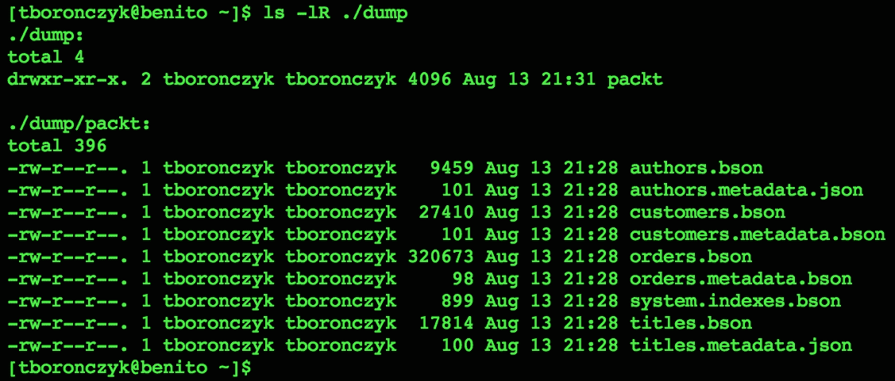

# 第七章：与数据库一起工作

本章包含以下配方：

+   设置 MySQL 数据库

+   备份和恢复 MySQL 数据库

+   配置 MySQL 复制

+   设置 MySQL 集群

+   设置 MongoDB 数据库

+   备份和恢复 MongoDB 数据库

+   配置 MongoDB 副本集

+   设置 OpenLDAP 目录

+   备份和恢复 OpenLDAP 目录

# 介绍

本章重点介绍三种数据库。首先，您将学习如何安装最广泛使用的关系数据库服务器之一——MySQL。您还将学习如何设置主从复制以维护 MySQL 数据库的镜像副本，以及如何建立 MySQL 集群以提供可扩展的高可用数据存储。接下来，我们将进入 NoSQL 数据库的世界。您将学习如何安装流行的文档导向数据库服务器 MongoDB，并配置 MongoDB 副本集（复制）。然后，您将学习如何使用 OpenLDAP 设置 LDAP 目录服务器。对于这些数据库，本章还包含如何执行基本备份和恢复任务的配方，以确保您的数据安全。

# 设置 MySQL 数据库

本配方展示了如何在 CentOS 上执行 MySQL 流行数据库服务器的基本安装。MySQL 是目前第二大最广泛使用的数据库系统，广泛应用于各行各业，为从动态网站到大规模数据仓库等所有内容提供数据存储。

## 准备工作

本配方要求使用 CentOS 系统，具有有效的网络连接和管理员权限，您可以使用`root`账户或`sudo`。

## 如何操作...

按照以下步骤安装 MySQL 并创建一个新数据库：

1.  下载由 Oracle 维护的 MySQL 仓库的仓库配置包：

    ```
    curl -LO dev.mysql.com/get/mysql57-community-release-el7-
           7.noarch.rpm

    ```

1.  安装下载的包：

    ```
    yum install mysql57-community-release-el7-7.noarch.rpm

    ```

1.  现在 MySQL 仓库已注册，安装`mysql-community-server`包：

    ```
    yum install mysql-community-server

    ```

1.  启动 MySQL 服务器，并启用它在每次系统重启时自动启动：

    ```
    systemctl start mysqld.service
    systemctl enable mysqld.service

    ```

1.  在系统防火墙中打开端口`3306`，以允许外部连接到 MySQL：

    ```
    firewall-cmd --zone=public --permanent --add-service=mysql
    firewall-cmd --reload

    ```

1.  从服务器日志文件中获取 MySQL `root`用户的临时密码：

    ```
    grep "temporary password" /var/log/mysqld.log

    ```

1.  使用`mysqladmin`设置`root`的新密码。当程序提示输入当前密码时，输入从日志中找到的临时密码：

    ```
    mysqladmin -u root -p password

    ```

1.  使用`mysql`连接到 MySQL 服务器，使用`root`账户：

    ```
    mysql -u root -p

    ```

1.  要创建一个新数据库，执行`CREATE DATABASE`语句：

    ```
    CREATE DATABASE packt;

    ```

1.  执行`CREATE USER`语句，为 MySQL 创建一个用户账户，用于操作数据库：

    ```
    CREATE USER "tboronczyk"@"localhost" IDENTIFIED  BY "P@$$W0rd";

    ```

1.  执行`GRANT`语句，将适当的权限分配给新数据库的账户：

    ```
    GRANT CREATE, DROP, ALTER, LOCK TABLES, INDEX,  INSERT, UPDATE, 
           SELECT, DELETE ON packt.* TO 
    "tboronczyk"@"localhost";

    ```

1.  执行`FLUSH PRIVILEGES`，指示 MySQL 重新构建其权限缓存：

    ```
    FLUSH PRIVILEGES;

    ```

1.  退出 MySQL 客户端并返回终端：

    ```
    exit

    ```

## 它是如何工作的...

我们首先下载了一个包，用于在我们的系统上注册 Oracle 维护的 MySQL 仓库。MySQL 是从 Oracle 仓库安装的，因为 CentOS 仓库会安装 MariaDB。经过一系列收购事件（2008 至 2010 年），MySQL 的代码库和商标成为了 Oracle 的财产。由于人们普遍担心 Oracle 对 MySQL 的管理以及 MySQL 的未来，其中一位原始开发者将该项目分叉并创建了 MariaDB。2014 年，Red Hat 和 CentOS 仓库将默认数据库从 MySQL 替换为 MariaDB（欢迎来到开源政治的世界）。

### 注意

MariaDB 的目标是保持作为一个免费的开源项目，遵循 GNU GPL 许可证，并成为 MySQL 的“增强型、即插即用替代品”。目前，这两个之间的差异对普通用户来说几乎可以忽略不计。但在分叉替代品的世界里，主要是编程接口和通信协议保持兼容。核心功能在初期可能保持一致，但随着时间的推移，新的功能将独立添加，产品的功能集开始出现分歧。MariaDB 用版本号的跳跃来体现这一点。MariaDB 5.1 提供了与 MySQL 5.1 相同的功能，MariaDB 5.5 也同样如此。但 MariaDB 不打算实现 MySQL 5.6 的所有功能，并将其版本号更改为 10.0。对于那些在家里计算的人来说，在写这篇文章时，Oracle 维护的仓库中托管的是 MySQL 5.7，而 CentOS 仓库当前提供的是 MariaDB 5.5。

托管该包的服务器假设人们通过网页浏览器下载文件，并发出重定向以开始下载。由于我们使用的是 `curl`，所以我们提供了 `-L` 参数，以便跟随重定向到达实际的包文件：

```
curl -LO dev.mysql.com/get/mysql57-community-release-el7-7.noarch.rpm

```

接下来，我们安装了下载的包。仓库注册完成后，我们可以使用 `mysql-community-server` 包来安装 MySQL。该包安装了服务器二进制文件，而与 MySQL 配套的客户端工具则作为依赖项一同安装：

```
yum install mysql57-community-release-el7-7.noarch.rpm
yum install mysql-community-server

```

MySQL 维护着自己的用户账户，默认的管理员账户是 `root`。就像 CentOS 的 `root` 用户一样，你不应该用该账户进行常规活动；它应当保留用于管理任务，如创建新用户、授予权限以及刷新服务器缓存等。其他权限较低的账户应当用于日常活动。为了保护 `root` 账户，MySQL 在第一次启动时会随机生成其密码。我们需要查找 MySQL 记录密码的日志文件，以便设置一个我们自己选择的新密码：

```
grep "temporary password" /var/log/mysqld.log

```

知道了临时密码后，我们使用`mysqladmin`更改了密码。`-u`选项指定 MySQL 账户的用户名，`-p`提示我们输入密码，`password`是用于更改密码的子命令。我们在提示输入原始密码时输入了临时密码，然后系统提示我们输入并确认新密码：

```
mysqladmin -u root -p password

```

### 注意

`root`的默认密码是从 MySQL 5.6 开始的新行为，它会将密码写入`/root/.mysql_secret`，而 5.7 版本则将其写入日志文件。在旧版本中（因此 MariaDB 从 5.5 版本开始由 CentOS 仓库安装），密码是空的。`validate_password`插件也在 MySQL 5.7 中启用。它要求密码至少包含 8 个字符，并且至少包含一个数字、一个大写字母、一个小写字母和一个特殊字符（即标点符号）。在选择 root 的新密码时，请考虑这些要求。


需要临时密码来设置 root 的永久密码

有多个客户端可以用来连接 MySQL 并与数据库进行交互。本示例使用了`mysql`，因为它会作为默认依赖项安装。再次说明，`-u`表示账户的用户名，`-p`会提示我们输入密码：

```
mysql -u root -p

```

在交互模式下运行时，客户端显示`mysql>`提示符，我们在此提交 SQL 语句。每执行完一个查询后，客户端会显示服务器的响应、语句执行的时间以及服务器报告的任何错误或警告。

我们在提示符下发出了`CREATE DATABASE`语句，以创建名为`packt`的新数据库：

```
CREATE DATABASE packt;

```

然后，我们创建了一个新用户账户`CREATE USER`，以避免在日常工作中使用`root`账户。该账户名为`tboronczyk`，并允许从本地主机进行身份验证：

```
CREATE USER "tboronczyk"@"localhost" IDENTIFIED BY "P@$$w0rd";

```

如果账户需要从不同的系统连接到服务器，可以用系统的主机名或 IP 地址替代`localhost`。不过，MySQL 会将每个用户名和主机名组合视为独立的账户。例如，`tboronczyk@localhost`和`tboronczyk@ 192.168.56.100`是不同的账户，并且可以为它们分配不同的权限。

### 注意

你可以在主机名中使用通配符，创建可以从多个系统连接的账户。`%`通配符匹配零个或多个字符，因此可以用来表示任何系统：

`**CREATE USER "tboronczyk"@"%" IDENTIFIED BY "P@$$w0rd";**`

新账户创建时没有任何权限，因此我们必须通过执行`GRANT`语句来分配权限：

```
GRANT CREATE, DROP, ALTER, LOCK TABLES, INSERT, UPDATE, SELECT,  
DELETE ON packt.* TO "tboronczyk"@"localhost";

```

该语句为用户分配以下权限，适用于`packt`数据库中的所有表（用`*`表示）：

+   `CREATE`：允许用户创建数据库和表

+   `DROP`：允许用户删除整个表和数据库

+   `ALTER`：允许用户更改现有表的定义

+   `LOCK TABLES`：允许用户锁定表，以便独占读写访问

+   `INDEX`：此命令允许用户创建表索引

+   `INSERT`：此命令允许用户向表中添加记录

+   `UPDATE`：此命令允许用户更新表中的记录

+   `SELECT`：此命令允许用户从表中检索记录

+   `DELETE`：此命令允许用户从表中删除记录

可以在 MySQL 官方文档中找到完整的权限列表及其允许用户执行的操作，网址为 [`dev.mysql.com/doc/refman/5.7/en/grant.html`](http://dev.mysql.com/doc/refman/5.7/en/grant.html)。

接下来，我们指示 MySQL 使用 `FLUSH PRIVILEGES` 重建其权限缓存：

```
    FLUSH PRIVILEGES; 

```

当 MySQL 启动时，它会将用户和权限信息缓存到内存中（你会记得在第五章，《*管理文件系统和存储*》中提到，读取内存中的数据比从磁盘读取要快得多），然后每次用户执行操作时，都会检查缓存以验证他们是否拥有足够的权限。每当我们创建或删除用户账户，或授予或撤销账户权限时，需要告诉 MySQL 更新其缓存，否则我们所做的更改将不会被注意到，直到下次 MySQL 启动。

使用 `mysql` 连接到 MySQL 时，你可能经常使用额外的选项。一个常见选项是 `-h`，它标识远程服务器的主机名或 IP 地址，如果 MySQL 在不同的系统上运行。`-e` 直接执行语句，而不是启动 `mysql` 交互模式。此外，若要操作特定数据库，可以在其余命令后给出数据库名称，或者使用 `-D` 来指定。以下示例演示了如何通过连接到 `192.168.56.100` 上的 MySQL 服务器，并对其 `sakila` 数据库执行 `SELECT` 语句：

```
mysql -u tboronczyk -p -h 192.168.56.100 -D sakila -e "SELECT  
last_name, first_name FROM actor"

```

## 另见

查阅以下资源以获取有关使用 MySQL 的更多信息：

+   `mysql` 手册页 (`man 1 mysql`)

+   MySQL 5.7 参考手册 ([`dev.mysql.com/doc/refman/5.7/en`](http://dev.mysql.com/doc/refman/5.7/en))

+   Jump Start MySQL ([`www.amazon.com/Jump-Start-MySQL-Timothy-Boronczyk/dp/0992461286`](http://www.amazon.com/Jump-Start-MySQL-Timothy-Boronczyk/dp/0992461286))

+   MySQL 教程 ([`www.mysqltutorial.org/`](http://www.mysqltutorial.org/))

# 备份和恢复 MySQL 数据库

本食谱向你展示如何使用 `mysqldump` 备份 MySQL 数据库。该工具连接到 MySQL 服务器，查询数据库的结构及其数据，并以 SQL 语句的形式输出数据。然后，备份可以用于恢复数据库或将数据填充到新数据库中。

## 准备工作

本食谱要求 MySQL 服务器正在运行，并且可以访问 MySQL 的 `root` 用户或其他具有必要权限的用户，以执行备份。

## 如何操作...

按照以下步骤备份 MySQL 数据库：

1.  连接到你想要备份的 MySQL 数据库：

    ```
    mysql -u root -p packt

    ```

1.  执行`FLUSH TABLES`语句将数据库的表设置为只读：

    ```
    FLUSH TABLES WITH READ LOCK;

    ```

1.  打开第二个终端，保持第一个终端活动，并且`mysql`客户端仍在运行。

1.  在新终端中，使用`mysqldump`导出表的定义和数据：

    ```
    mysqldump -u root -p packt > backup.sql

    ```

1.  备份完成后，返回第一个终端并退出`mysql`以解锁表。

    由于备份由 SQL 语句组成，你可以通过使用`mysql`导入这些语句来重建数据库：

    ```
    mysql -u root -p packt < backup.sql

    ```

## 它是如何工作的……

数据丢失的后果可能从轻微的烦恼到严重的经济后果不等，因此备份是保护自己的一种重要方式。想象一下，如果银行丢失了你所有的财务记录，会发生什么！你的数据对你有多重要，以及如果丢失了它有多难以重建，那么拥有备份以防万一就显得尤为重要。

在备份之前，我们连接到服务器并执行了`FLUSH TABLES`。该语句强制 MySQL 完成任何待处理的数据更新，然后将表设置为只读，以防止在备份过程中对数据进行修改。这确保了我们备份中的数据是一致的：

```
FLUSH TABLES WITH READ LOCK;

```

在我们释放锁之前，表将保持只读状态，可以通过执行`UNLOCK TABLES`语句或终止与 MySQL 服务器的连接来释放锁，因此我们保持当前会话运行，并打开第二个终端来执行备份。当表处于只读状态时，任何检索数据的查询都会执行，但那些更新或插入数据的查询会被阻止。

### 注意

考虑按照*配置 MySQL 复制*配方中所描述的设置 MySQL 复制，然后备份从服务器上的数据库副本，以避免任何停机。停止从服务器的复制，使用`mysqldump`导出数据，然后恢复复制。主服务器的表不需要被锁定，在复制暂停期间主服务器所做的任何更改将在从服务器重新上线后被复制。

然后，我们使用`mysqldump`从数据库中导出所有表的定义和数据：

```
mysqldump -u root -p packt > backup.sql

```

通过在备份文件名中包含日期，保持文件有序：

```
mysqldump -u root -p packt > backup-$(date +%F).sql

```

`mysqldump`查询数据库以检索数据，因此无论我们使用哪个帐户来执行备份，它都必须具有必要的权限。具体需要哪些权限，最终取决于你的数据库架构。例如，如果数据库使用视图，则帐户需要`SHOW VIEW`权限。用于恢复数据库的帐户也必须具备相同的权限。如果你希望为备份和恢复活动使用专用帐户，应该记住这一点。

要仅备份某些表，可以在数据库后列出它们。例如，以下命令备份`customers`和`addresses`表：

```
mysqldump -u root -p packt customers addresses > backup.sql

```

你还可以为`mysqldump`提供一些选项，这些选项会影响备份中包含的内容。以下是一些常用选项的列表：

+   `--no-add-drop-table`：此选项不包括在任何 `CREATE TABLE` 语句之前的 `DROP TABLE` 语句。如果没有先删除表，恢复备份时，已经定义了表的系统可能会在执行 `CREATE TABLE` 语句时失败。

+   `--events`：此选项导出与数据库关联的任何存储事件的定义。

+   `--hex-blob`：此选项使用十六进制表示法输出二进制值。这有助于防止某些字节序列被错误地解释，从而导致恢复失败。

+   `--tables`：此选项仅备份指定的表。这是指定表的另一种方式，而不是在数据库名称后列出它们。

+   `--routines`：此选项导出与数据库关联的任何存储过程的定义。

+   `--where`：这是一个 `WHERE` 条件，用于返回特定的行。例如，`--tables customers --where "last_name LIKE 'B%'"` 将仅导出 `customers` 表中姓氏以 B 开头的客户行。

你可以在在线文档中找到完整的选项列表：[`dev.mysql.com/doc/refman/5.7/en/mysqldump.html`](http://dev.mysql.com/doc/refman/5.7/en/mysqldump.html)。

## 另见

参考以下资源获取更多有关使用 `mysqldump` 进行备份的信息：

+   `mysqldump` 手册页 (`man 1 mysqldump`)

+   MySQL 5.7 参考手册：`mysqldump` ([`dev.mysql.com/doc/refman/5.7/en/mysqldump.html`](http://dev.mysql.com/doc/refman/5.7/en/mysqldump.html))

+   使用 `mysqldump` 备份和恢复 MySQL 数据库 ([`www.thegeekstuff.com/2008/09/backup-and-restore-mysql-database-using-mysqldump`](http://www.thegeekstuff.com/2008/09/backup-and-restore-mysql-database-using-mysqldump))

# 配置 MySQL 复制

本篇教程将教你如何配置 MySQL 的主从复制，以在接近实时的情况下维护数据库的镜像副本。

为了进行数据复制，主 MySQL 服务器记录所有发生的更改（如插入、更新等）的详细信息，并将其写入名为二进制日志的文件中。每个从服务器连接到主服务器系统，读取日志文件中的信息，然后复制更改，以维护自己的本地数据库副本。每个从服务器独立负责自己，这意味着我们可以将从服务器停机进行维护，而不会影响主服务器的可用性。一旦从服务器恢复上线，它将从上次停止的地方继续复制。

复制在许多情况下都非常有用。例如，如果在从服务器上维护了数据库的完整副本，您可以轻松地将主服务器切换为故障转移或灾难恢复。对于那些对可扩展性和性能有要求的环境，可以由主服务器执行写操作，而由多个只读从服务器处理密集的读操作，这些从服务器位于负载均衡器后面。

## 准备工作

本食谱演示了如何使用两台系统配置 MySQL 复制。第一台系统是主 MySQL 服务器，我们假设它的 IP 地址为`192.168.56.100`。第二台系统是从服务器，地址为`192.168.56.101`。你需要在两个系统上都有管理员访问权限，使用`root`账户或`sudo`来完成配置。

两台系统都应该已经安装了 MySQL，如之前的*设置 MySQL 数据库*食谱所述。如果你在主服务器上已创建一个或多个数据库后才设置复制，请按照*备份和恢复 MySQL 数据库*食谱备份并导入到从服务器，再进行复制配置。这能确保复制开始时所有数据库都保持同步。

## 如何做...

按照以下步骤配置 MySQL 主从复制：

1.  使用文本编辑器打开主 MySQL 服务器的配置文件`/etc/my.cnf`：

    ```
    vi /etc/my.cnf

    ```

1.  在`[mysqld]`部分，为`server-id`选项添加一个新条目，并将其值设置为`1`：

    ```
    server-id = 1

    ```

1.  找到`log_bin`选项并取消注释：

    ```
    log_bin

    ```

1.  保存更改并关闭配置文件。

1.  重启服务器以使更改生效：

    ```
    systemctl restart mysqld.service

    ```

1.  使用`mysql`连接到主服务器并为从服务器创建一个新账户。该账户需要`REPLICATION SLAVE`权限：

    ```
    CREATE USER "slave"@"192.168.56.101" IDENTIFIED BY "S3CR3t##";
    GRANT REPLICATION SLAVE ON *.* TO "slave"@"192.168.56.101";
    FLUSH PRIVILEGES;

    ```

1.  执行`SHOW MASTER STATUS`以确定主服务器当前在写入二进制日志时的位置。注意返回的`File`和`Position`值，因为这些信息在配置从服务器时会用到：

    ```
    SHOW MASTER STATUS;

    ```

    

    主服务器的状态包括日志文件名和服务器的写入位置：

1.  使用编辑器打开从服务器的配置文件。为`server-id`选项添加一个新条目，并将其值设置为`2`：

    ```
    server-id = 2

    ```

1.  为`read-only`选项添加一个条目：

    ```
    read-only

    ```

1.  保存更改并关闭文件。

1.  重启从服务器以使更改生效：

    ```
    systemctl restart mysqld.service

    ```

1.  要配置与主服务器的通信，请使用`mysql`连接到从服务器，并执行`CHANGE MASTER`语句。该值应反映第 7 步中`SHOW MASTER STATUS`返回的内容：

    ```
    CHANGE MASTER TO
     MASTER_HOST = "192.168.56.100",
     MASTER_USER = "slave",
     MASTER_PASSWORD = "S3CR3t##", 
     MASTER_LOG_FILE = "localhost-bin.000003",
     MASTER_LOG_POS = 1235;

    ```

1.  通过在从服务器系统上执行`START SLAVE`来启动复制过程：

    ```
    START SLAVE;

    ```

1.  执行`SHOW SLAVE STATUS`以验证复制是否正在运行。返回的`Slave_IO_Running`和`Slave_SQL_Running`值都应为`Yes`：

    ```
    SHOW SLAVE STATUS\G

    ```

    `SHOW SLAVE STATUS`会返回大量信息——列出为表格，由于列换行，输出几乎无法阅读。使用`\G`来执行语句（与分号不同）会让`mysql`以垂直方式显示结果，在这种情况下，阅读起来更加清晰。

1.  要停止复制，请在从服务器系统上执行`STOP SLAVE`。

## 它是如何工作的...

配置开始于主服务器的`/etc/my.cnf`文件，在此文件中我们添加了`server-id`选项，为服务器指定了一个数字标识符。复制环境中的每个服务器都使用此标识符与其他服务器进行区分，因此它必须在环境中是唯一的。然后，我们取消注释了`log_bin`选项，指示服务器记录每次变更的详细信息到二进制日志。



主服务器的配置文件设置了服务器标识符并启用了日志记录

接下来，我们在主服务器上创建了一个专用账户，并授予其`REPLICATION SLAVE`权限。从服务器将使用此账户连接主服务器并从日志中读取数据：

```
CREATE USER "slave"@"192.168.56.101" IDENTIFIED BY "S3CR3t##";
GRANT REPLICATION SLAVE ON *.* TO "slave"@"192.168.56.101";

```

最后，我们执行了`SHOW MASTER STATUS`命令。结果中`File`和`Position`的值标识了二进制日志文件的名称以及服务器在其中的当前位置。随着主服务器向日志写入数据，位置会增加，并且当日志文件轮换时，日志文件名的后缀也会发生变化。我们需要知道当前的位置，以便配置从服务器从该点开始读取/复制。

在从服务器上，我们设置了服务器的唯一标识符，并在配置文件中添加了`read-only`选项。如果有人在从服务器的数据库中做出更改，并且该更改与来自二进制日志的传入更新冲突，复制将会中断。`read-only`选项是一个防护措施，防止用户直接更新从服务器的数据库，确保所有更新都来自主服务器。

接下来，我们使用`CHANGE MASTER`语句设置从服务器的复制过程。`CHANGE MASTER`语句指定了主服务器，设置了从服务器用于连接的用户名和密码，并指定了日志文件的名称及从当前的位置开始复制：

```
CHANGE MASTER TO
 MASTER_HOST = "192.168.56.100",
 MASTER_USER = "slave",
 MASTER_PASSWORD = "S3CR3t##", 
 MASTER_LOG_FILE = "localhost-bin.000003",
 MASTER_LOG_POS = 1235;

```

复制过程通过`START SLAVE`命令启动，通过`STOP SLAVE`命令停止。`SHOW SLAVE STATUS`命令返回关于当前复制状态的信息：



我们可以检查从服务器的状态，以查看复制是否正常运行且没有任何问题。

当复制运行时，MySQL 会创建两个后台进程——一个与主服务器通信（IO 进程），另一个执行 SQL 语句以维护本地数据库（SQL 进程）。`Slave_IO_Running`值显示通信进程是否正在运行，而`Slave_SQL_Running`值反映执行进程是否正在运行。当复制正常运行时，这两个值都应该是`Yes`。

如果复制出现问题，`Last_IO_Error`和`Last_SQL_Error`条目将报告各自进程抛出的任何错误。通过比较`Master_Log_File`和`Read_Master_Log_Pos`字段的值与`SHOW MASTER STATUS`返回的结果，也可以查看从服务器与主服务器之间的延迟情况。

当前配置允许从库复制来自主库的每个数据库，但我们也可以通过在从库的 `my.cnf` 文件中添加 `replicate-do-db` 条目来限制复制到特定的数据库。可以添加多个条目，每个条目对应一个数据库：

```
replicate-do-db = packt
replicate-do-db = acme
replicate-do-db = sakila

```

或者，我们可以使用 `replicate-ignore-db` 选项来复制所有数据库，除非是特定的数据库：

```
replicate-ignore-db = mysql

```

复制也可以在表级进行过滤，使用 `replicate-do-table` 和 `replicate-ignore-table` 选项来定位和忽略数据库中的特定表：

```
replicate-do-table = acme.customers
replicate-do-table = acme.addresses

```

## 另请参见

请参考以下资源，了解更多关于 MySQL 数据库复制的信息：

+   MySQL 5.7 参考手册：复制 ([`dev.mysql.com/doc/refman/5.7/en/replication.html`](http://dev.mysql.com/doc/refman/5.7/en/replication.html))

+   MySQL 在 RHEL 7 上的复制 ([`www.youtube.com/watch?v=kIfRXshR2zc`](https://www.youtube.com/watch?v=kIfRXshR2zc))

+   MySQL 高可用性架构 ([`skillachie.com/2014/07/25/mysql-high-availability-architectures`](http://skillachie.com/2014/07/25/mysql-high-availability-architectures))

+   MySQL 中的复制技巧与窍门 ([`www.linux-mag.com/id/1661/`](http://www.linux-mag.com/id/1661/))

# 搭建 MySQL 集群

本教程指导您设置 MySQL 集群的过程。集群数据库通过将数据分布到多个系统并维护副本来避免单点故障，从而应对可扩展性和高可用性的挑战。

集群中的成员被称为节点。MySQL 集群中有三种节点类型：数据节点、API 节点和管理节点。数据节点负责存储数据。用户和进程通过连接到 API 节点来访问数据库。管理节点则负责管理整个集群。尽管可以在同一系统上安装多个节点，例如，一个系统可能同时托管 API 节点和数据节点，但在同一系统上托管多个数据节点显然不是一个好主意，因为这会抵消 MySQL 将数据分布到多个系统的努力。

## 准备工作

本教程演示如何使用四台系统部署 MySQL 集群。第一台系统将托管管理节点，假设其 IP 地址为 `192.168.56.100`。第二台系统将托管 API 节点，地址为 `192.168.56.101`。其余系统将配置为数据节点，地址为 `192.168.56.102` 和 `192.168.56.103`。你需要在这四台系统上具有管理员权限，可以使用 `root` 账户或 `sudo`。

## 操作步骤...

按照以下步骤设置集群化的 MySQL 数据库：

1.  从 MySQL 网站下载集群压缩包并使用 `tar` 解压其包：

    ```
    curl -L dev.mysql.com/get/Downloads/MySQL-Cluster-7.4/  
           MySQL-Cluster-gpl-7.4.10-1.el7.x86_64.rpm-bundle.tar | tar  x

    ```

1.  在每个系统上安装 `perl-Data-Dumper` 并用下载的 `MySQL-Cluster-shared` 包替换已安装的 `mariadb-libs` 包：

    ```
    yum install perl-Data-Dumper MySQL-Cluster-shared-gpl-*.rpm
    yum erase mariadb-libs

    ```

1.  在每个系统上安装`MySQL-Cluster-server`和`MySQL-Cluster-client`包：

    ```
    yum install MySQL-Cluster-{server,client}-gpl-*.rpm

    ```

1.  在托管管理节点的系统上创建`/var/lib/mysql-cluster`目录：

    ```
    mkdir /var/lib/mysql-cluster

    ```

1.  为管理节点创建集群的配置文件`/var/lib/mysql-cluster/config.ini`，内容如下：

    ```
    [ndbd default]
    NoOfReplicas = 2
    DataMemory = 100M
    IndexMemory = 10M
    ServerPort = 2202
    [ndb_mgmd]
    hostname = 192.168.56.100
    [mysqld]
    hostname = 192.168.56.101
    [ndbd]
    hostname = 192.168.56.102
    [ndbd]
    hostname = 192.168.56.103

    ```

1.  启动管理节点：

    ```
    ndb_mgmd -f /var/lib/mysql-cluster/config.ini

    ```

1.  在管理节点系统的防火墙中打开端口`1186`：

    ```
    firewall-cmd --zone=public --permanent --add-port=1186/tcp
    firewall-cmd --reload

    ```

1.  在每个数据节点系统上，使用以下内容创建`/etc/my.cnf`文件：

    ```
    [mysql_cluster]
    ndb-connectstring = 192.168.56.100

    ```

1.  启动每个数据节点：

    ```
    ndbd

    ```

1.  在数据节点系统的防火墙中打开端口`2202`：

    ```
    firewall-cmd --zone=public --permanent --add-port=2202/tcp
    firewall-cmd --reload

    ```

1.  在托管 API 节点的系统上创建`/etc/my.cnf`，内容如下：

    ```
    [mysqld]
    ndbcluster
    default-storage-engine = ndbcluster
    [mysql_cluster]
    ndb-connectstring = 192.168.56.100

    ```

1.  将 MySQL 服务器作为 API 节点启动：

    ```
    mysqld_safe &

    ```

1.  检索在安装 MySQL 服务器时创建的`root`账户临时密码。该密码记录在`/root/.mysql_secret`中：

    ```
    cat /root/.mysql_secret

    ```

1.  使用`mysqladmin`为 root 账户设置新密码。当提示输入当前密码时，输入上一步中识别的密码：

    ```
    mysqladmin -u root -p password

    ```

1.  在 API 节点系统的防火墙中打开端口`3306`：

    ```
    firewall-cmd --zone=public --permanent --add-service=mysql
    firewall-cmd --reload

    ```

1.  使用托管管理节点的系统上的`ndb_mgm`客户端验证集群的状态：

    ```
    ndb_mgm -e SHOW

    ```

## 工作原理...

本食谱介绍了如何设置具有两个数据节点的 MySQL 集群数据库：一个 API 节点和一个管理节点。管理节点由`ndb_mgmd`进程组成，该进程向其他节点提供配置信息并监控它们。在数据节点上，`ndbd`进程处理集群数据的存储、分区和复制。一个了解管理节点和数据节点的 MySQL 服务器充当 API 节点，供用户与集群数据库交互。

在 Oracle 维护的仓库中提供的包没有支持网络数据库（NDB）的功能，因此我们首先从 MySQL 官网上下载了一个包含支持 NDB/集群的 MySQL 版本的包：

```
curl -L dev.mysql.com/get/Downloads/MySQL-Cluster-7.4/MySQL- 
Cluster-gpl-7.4.10-1.el7.x86_64.rpm-bundle.tar | tar x

```

MySQL 抽象了数据如何在物理上组织和操作的细节，将其委托给不同的存储引擎。不同的引擎具有不同的能力。由于 NDB 引擎是实现集群的引擎，我们需要一个支持该引擎的版本。与以往将 curl 的输出写入文件不同，这次我们将输出直接传递给`tar`，并使用`x`参数即时展开压缩包。

之后，我们从 CentOS 仓库安装了`perl-Data-Dumper`包，并用刚下载的`MySQL-Cluster-shared`包替换了每个系统中已安装的`mariadb-libs`包：

```
yum install perl-Data-Dumper MySQL-Cluster-shared-gpl-*.rpm
yum erase mariadb-libs

```

`MySQL-Cluster-shared`包提供了其他程序用来与 MySQL 协作的共享库。这些库替换了从 CentOS 仓库默认安装的 MariaDB 版本，避免了库冲突，确保安装干净。由于不再需要，我们卸载了`mariadb-libs`包。

Yum 在安装完 `MySQL-Cluster-server` 包后执行的一些后安装步骤是用 Perl 脚本编写的，并使用了 Perl 的 `Data::Dumper` 模块。这使得 `Perl-Data-Dumper` 包成为 `MySQL-Cluster-server` 包的一个依赖项。然而，一个错误导致 Yum 没有注意到这一点，所以我们自己安装了这个包，以便 `MySQL-Cluster-server` 包的安装能够顺利进行。这不会阻止包的安装，但会要求我们手动完成一些额外的配置步骤。

在满足需求后，我们在每个系统上安装了 `MySQL-Cluster-server` 和 `MySQL-Cluster-client` 包：

```
yum install MySQL-Cluster-{server,client}-gpl-*.rpm

```

针对整个集群的配置基本上是集中在 `/var/lib/mysql-cluster/config.ini` 中的管理节点。该文件分为几个部分，第一个部分是 `[ndb default]`，它提供了应该用于集群的默认配置值。这里的值适用于集群的每个节点，除非在各自节点的配置部分中被更具体的指令覆盖。

```
[ndbd default]
NoOfReplicas = 2
DataMemory = 100M
IndexMemory = 10M
ServerPort = 2202

```

`NoOfReplicas` 选项设置了集群中副本的数量。它的值可以设置为 `1` 或 `2`，尽管推荐值为 `2`。请记住，一个集群化的数据库不仅在数据节点上进行分区，还会进行复制；每个节点通常托管数据库大小的 *1/n* 的分区（其中 *n* 是数据节点的数量），并且还会有其他节点的副本。即使系统下线，集群仍然可以运行，因为其数据仍然可以在副本中找到。将 `NoOfReplicas` 设置为 `1` 表示数据库只有一个副本（没有副本），数据库的可用性取决于所有数据节点是否正常运行。

数据节点将数据库的工作副本保存在 RAM 中以减少延迟，同时定期将数据同步到磁盘。`DataMemory` 选项指定了节点应为数据保留多少 RAM，而 `IndexMemory` 指定了应为主键和唯一索引保留多少内存。无论您提供什么值，请确保有足够的资源可用以避免 RAM 交换。

`ServerPort` 选项指定了节点之间通信所使用的端口号。默认情况下，MySQL 会动态分配端口以便在同一系统上运行多个节点更容易，但由于此方案在每个节点上运行在其自己的主机系统上，并且我们需要知道端口以允许通过防火墙的流量，因此我们自行指定了端口。

配置中的后续部分使用 `hostname` 选项指定管理节点（通过 `[ndb_mgmtd]` 部分）、API 节点（通过 `[mysqld]` 部分）和数据节点（通过 `[ndbd]` 部分）运行的地址。如果同一类型的节点在集群中运行多个，则会显示多个相同类型的部分：

```
[ndb_mgmd]
hostname = 192.168.56.100
[mysqld]
hostname = 192.168.56.101
[ndbd]
hostname = 192.168.56.102
[ndbd]
hostname = 192.168.56.103

```

在其余系统中，`/etc/my.cnf` 作为数据节点和 API 节点使用的配置文件被创建。每个都包括 `[mysql_cluster]` 部分，其中提供了 `ndb-connectstring` 选项：

```
[mysql_cluster]
ndb-connectstring = 192.168.56.100

```

`ndb-connectstring` 选项指定托管管理节点的系统的地址。随着数据和 API 节点上线，它们将与管理器通信，以接收其配置信息。如果您的集群有多个管理节点，则可以在连接字符串中以逗号分隔列出其他节点：

```
ndb-connectstring = "192.168.56.100,192.168.56.105,192.168.56.106"

```

此外，API 节点的配置包括 `[mysqld]` 部分。其中包含 `ndbcluster` 选项以启用 NDB 引擎，并且 `default-storage-engine` 选项指示 MySQL 在没有在 `CREATE TABLE` 语句中特别指定的情况下，使用 NDB 管理所有新表：

```
[mysqld]
ndbcluster
default-storage-engine = ndbcluster

```

当用户或进程使用 `CREATE TABLE` 语句创建新表时，他们可以使用 `ENGINE` 指令指定 MySQL 的存储引擎来管理其数据，例如：

```
CREATE TABLE users (
 id INTEGER UNSIGNED NOT NULL PRIMARY KEY,
 first_name VARCHAR(50) NOT NULL DEFAULT '',
 last_name VARCHAR(50) NOT NULL DEFAULT ''
)
ENGINE = NDBCluster;

```

默认引擎是 InnoDB 引擎。但是，只有由 NDB 管理的表中的数据才会传输到集群中。如果表由其他引擎管理，则数据会留存在 API 节点本地，并且不会对集群中的其他节点可用。为了避免可能引起的意外问题和混淆，我们更改了默认引擎，使表在未提供 `ENGINE` 指令时使用 NDB 引擎。

在启动 MySQL 集群时，节点的启动顺序很重要，因为一个节点可能依赖于其他节点。首先启动管理节点，然后是数据节点，最后是 API 节点。

在 API 节点上，MySQL 根帐户的密码在服务器首次启动时是随机生成的，并写入 `/root/.mysql_secret` 文件，就像我们在 *设置 MySQL 数据库* 配方中使用 `mysqladmin` 更改它一样：

```
cat /root/.mysql_secret
mysqladmin -u root -p password

```

在管理节点系统上发送给 `ndb_mgm` 客户端的 `SHOW` 命令允许我们查看集群的状态，并确保一切正常运行。客户端可以以交互模式调用，或者可以直接使用 `-e` 参数传递命令：

```
ndb_mgm -e SHOW

```



可以使用 `ndb_mgm` 客户端查看 MySQL 集群的状态。

## 另请参阅

关于使用 MySQL 集群的更多信息，请参考以下资源：

+   MySQL 参考手册：MySQL 集群核心概念 ([`dev.mysql.com/doc/refman/5.7/en/mysql-cluster-basics.html`](http://dev.mysql.com/doc/refman/5.7/en/mysql-cluster-basics.html))

+   MySQL 参考手册：MySQL 集群安装 ([`dev.mysql.com/doc/refman/5.7/en/mysql-cluster-installation.htm`](http://dev.mysql.com/doc/refman/5.7/en/mysql-cluster-installation.htm)l)

+   MySQL 参考手册：MySQL 集群节点、节点组、复制和分区 ([`dev.mysql.com/doc/refman/5.7/en/mysql-cluster-nodes-groups.html`](http://dev.mysql.com/doc/refman/5.7/en/mysql-cluster-nodes-groups.html))

+   MySQL 参考手册：MySQL 集群的在线备份 ([`dev.mysql.com/doc/refman/5.7/en/mysql-cluster-backup.html`](http://dev.mysql.com/doc/refman/5.7/en/mysql-cluster-backup.html))

+   轻松搭建 MySQL 集群 ([`youtube.com/watch?v=64jtbkuPtv`](http://youtube.com/watch?v=64jtbkuPtv)c)

+   *高可用性 MySQL 烹饪书* 作者：Alex Davies ([`www.packtpub.com/big-data-and-business-intelligence/high-availability-mysql-cookbook`](https://www.packtpub.com/big-data-and-business-intelligence/high-availability-mysql-cookbook))

# 设置 MongoDB 数据库

尽管关系型数据库已经主导了数据存储领域，但一直存在其他专注于以不同方式处理数据的系统，例如文档型数据库、面向对象的数据库、键值数据库和层次型数据库。随着*NoSQL*和*大数据*运动的兴起，这些替代型数据库的受欢迎程度重新回升。本教程教你如何安装 MongoDB，这是一个现代的文档型数据库系统。

## 准备工作

本教程要求使用一个 CentOS 系统，并具备有效的网络连接和管理员权限，可以通过`root`账户或`sudo`来获得权限。它还假设你已经注册了 EPEL 仓库（请参见第四章中的*注册 EPEL 和 Remi 仓库*教程，*软件安装管理*）。

## 如何操作…

按照以下步骤安装 MongoDB 并创建一个新的数据库：

1.  从 EPEL 仓库安装`mongodb-server`和`mongodb`软件包：

    ```
    yum install mongodb-server mongodb

    ```

1.  使用文本编辑器打开`/etc/mongod.conf`：

    ```
    vi /etc/mongod.conf

    ```

1.  找到`auth`条目并取消注释，确保其值为`true`：

    ```
    # Run with/without security
    auth = true

    ```

1.  找到`bind-ip`选项并注释掉：

    ```
     # Comma separated list of ip addresses to listen on 
           # bind_ip = 127.0.0.1

    ```

1.  保存对配置文件的更改并关闭它。

1.  启动 MongoDB 服务器并启用其在系统重启时自动启动：

    ```
    systemctl start mongod.service
    systemctl enable mongod.service

    ```

1.  在系统防火墙中打开`27017`端口：

    ```
    firewall-cmd --zone=public --permanent --add-port=27017/tcp
    firewall-cmd --reload

    ```

1.  使用`mongo`连接到 MongoDB 服务器：

    ```
    mongo

    ```

1.  设置`admin`为当前活动数据库：

    ```
    use admin

    ```

1.  执行`createUser()`来创建一个新的用户，用于管理用户账户：

    ```
    db.createUser({
     user: "admin",
     pwd: "P@$$W0rd",
     roles: [{ role: "userAdminAnyDatabase", db: "admin" }]
    })

    ```

1.  使用新创建的`admin`账户进行身份验证：

    ```
    db.auth({ user: "admin", pwd: "P@$$W0rd" })

    ```

1.  设置`packt`为当前活动数据库：

    ```
    use packt

    ```

1.  创建一个用于操作数据库的用户账户：

    ```
    db.createUser({
     user: "tboronczyk",
     pwd: "S3CR3t##",
     roles: [{ role: "readWrite", db: "packt" }]
    })

    ```

1.  退出客户端并返回终端：

    ```
    exit

    ```

## 工作原理...

MongoDB 是同类数据库中最受欢迎的，被许多知名公司使用，包括 eBay、Craigslist、SAP 和 Yandex。所需的软件包可以在 EPEL 仓库中找到；`mongodb-server` 包含 MongoDB 服务器应用程序，而 `mongodb` 包含客户端和其他用于与服务器及数据库交互的工具：

```
yum install mongodb-server mongodb

```

默认情况下，MongoDB 在未启用安全性的情况下运行，任何人都可以对任何数据库执行任何操作。为了防止这种情况，我们通过取消注释 MongoDB 配置文件（`/etc/mongod.conf`）中的 `auth` 选项来启用安全性。启用安全性后，用户必须先进行身份验证才能与数据库交互，服务器会验证该账户是否有权执行请求的操作：

```
auth = true

```

当前的配置允许 MongoDB 仅在回环接口（`127.0.0.1`）上监听连接，因此我们还注释掉了 `bind_ip` 选项：

```
# bind_ip = 127.0.0.1

```

如果不绑定，MongoDB 将通过系统的所有地址进行访问。或者，如果系统有多个地址（可能系统有多个接口，或者你在第二章的*绑定多个地址到单个以太网设备*示例中实现了此功能，*网络*），并且你只希望 MongoDB 响应其中一个地址，可以保持选项激活，并将所需的 IP 地址作为其值。

更新配置文件后，我们启动了服务器，并在系统防火墙中打开了 MongoDB 的默认端口，以允许远程连接：

```
firewall-cmd --zone=public --permanent --add-port=27017/tcp
firewall-cmd --reload

```

接下来，我们使用 `mongo` 客户端与运行在本地主机上的 MongoDB 服务器建立连接：

```
mongo

```

我们设置 `admin` 为活动数据库，并执行 `createUser()` 方法来创建一个管理员账户，用于管理 MongoDB 的数据库用户：

```
use admin
db.createUser({
 user: "admin",
 pwd: "P@$$W0rd",
 roles: [{ role: "userAdminAnyDatabase", db: "admin" }]
})

```

`createUser()` 方法接受一个文档，其中列出了新账户的用户名（`user`）、密码（`pwd`）和角色（`roles`），并将其添加到活动数据库（`admin`）中的 `system.users` 集合中。用户账户存储在数据库级别，而存储用户详细信息的数据库被称为该用户的身份验证数据库。用户可以与其他数据库进行交互，但他们必须首先在身份验证数据库中进行身份验证。即使用户名相同，在不同数据库中创建的账户也被视为独立账户，可能具有不同的权限。

`roles` 属性是一个对象数组，每个对象列出用户在与给定数据库交互时所属的角色。以 `admin` 为例，用户是 `userAdminAnyDatabase` 角色的成员。MongoDB 的权限系统基于基于角色的访问控制（RBAC）。RBAC 的重点是用户及其角色，而不是向每个账户授予单独的权限。权限分配给角色，然后用户账户会成为该角色的成员，从而继承角色的权限。

`userAdminAnyDatabase` 是一个内置角色，配置了必要的权限，可以为任何数据库创建和删除用户账户，分配角色成员资格，并管理用户密码。MongoDB 除了 `userAdminAnyDatabase` 外，还提供了多个预定义的角色，包括以下角色：

+   `dbAdmin`：这些用户负责管理数据库

+   `userAdmin`：这些用户负责管理其他用户

+   `read`：这些用户仅从数据库中读取文档

+   `readWrite`：这些用户可以读取文档，并且需要写权限来插入/修改文档

+   `dbOwner`：这些用户拥有数据库（结合了 `dbAdmin`、`userAdmin` 和 `readWrite` 角色）

还有 `backup` 和 `restore` 角色，供负责执行数据库备份的用户使用，管理 MongoDB 集群的角色，以及一些上述角色的全局版本，如 `readAnyDatabase`，供需要对所有 MongoDB 数据库进行读取访问的用户使用。完整的角色列表可以在官方文档中找到，网址：[`docs.mongodb.com/manual/reference/built-in-roles/`](https://docs.mongodb.com/manual/reference/built-in-roles/)。

### 注意

最小权限原则鼓励我们避免过度使用全局角色；最好是创建与自己的数据库协作的用户。如果一个账户需要与其认证数据库之外的数据库进行交互，可以按以下方式分配多个角色：

```
  db.createUser({
 user: "tboronczyk",
 pwd: "S3CR3t##",
 roles: [
 { role: "read", db: "admin" },
 { role: "readWrite", db: "packt" },
 { role: "readWrite", db: "acme" }
 ]
 })

```

接下来，我们使用新的 `admin` 用户为 `packt` 数据库创建了一个新用户（并顺便创建了 `packt` 数据库）：

```
db.auth("admin", "P@$$W0rd")
use packt
db.createUser({
 user: "tboronczyk",
 pwd: "S3CR3t##",
 roles: [{ role: "readWrite", db: "packt" }]
})

```

当第一个文档被插入时，MongoDB 会隐式创建数据库和集合，并且由于 MongoDB 将新用户存储在活动数据库中，因此将 `packt` 设置为活动数据库并创建用户就足以触发它的创建。

`auth()` 方法假设活动数据库是提供的凭据的认证数据库。在此情况下，认证成功，因为 `admin` 已经是活动数据库；在切换到 `packt` 后再尝试以 `admin` 身份进行认证会失败。然而，认证后身份会一直保持，直到下次调用 `auth()` 或退出客户端。所以，即使我们切换了数据库，我们仍然在 `admin` 数据库的 `admin` 用户角色和权限下操作。

尽管通过一个简单的 `mongo` 调用连接到了服务器，活动数据库仍然可以通过命令行指定。`mongo` 还提供了多个选项，例如连接到运行在其他系统上的 MongoDB 服务器并提供认证凭据。`--host` 用于指定 MongoDB 运行的远程主机名或 IP 地址，`--username` 和 `--password` 选项允许你提供账户的认证信息：

```
mongo --host 192.168.56.100 --username tboronczyk --password ""  packt

```

如果在调用时同时使用了`--username`和`--password`，并且指定了数据库，MongoDB 会假设该数据库是帐户的认证数据库。如果帐户属于其他数据库，可以使用`--authenticationDatabase`选项指定其认证数据库：

```
mongo --authenticationDatabase admin --username admin --password 
    ""  packt

```

`--password`选项需要一个值，但如果其值为空，MongoDB 会提示你输入密码。我建议你像我这里做的那样使用空字符串（`""`）作为值，以强制出现密码提示。

### 注意

出于安全原因，绝不要将密码作为命令调用的一部分输入。密码可能会出现在运行时`ps`的输出中，也会出现在你的 shell 历史记录中。

## 另请参见

请参考以下资源获取更多关于 MongoDB 使用的信息：

+   MongoDB 手册 ([`docs.mongodb.org/manual`](http://docs.mongodb.org/manual))

+   MongoDB 手册：基于角色的访问控制 ([`docs.mongodb.org/manual/core/authorization`](http://docs.mongodb.org/manual/core/authorization))

+   MongoDB 初学者教程 ([`www.youtube.com/watch?v=W-WihPoEbR4`](http://www.youtube.com/watch?v=W-WihPoEbR4))

+   维基百科：基于角色的访问控制 ([`en.wikipedia.org/wiki/Role-based_access_control`](https://en.wikipedia.org/wiki/Role-based_access_control))

# 备份和恢复 MongoDB 数据库

本教程教你如何使用`mongodump`工具备份 MongoDB 数据库，并使用`mongorestore`恢复数据库。

## 准备工作

本教程要求 MongoDB 服务器正在运行，并且需要访问一个拥有`userAdmin`角色的用户帐户。

## 如何操作...

按照以下步骤备份 MongoDB 数据库：

1.  以拥有`userAdmin`角色的用户身份连接到 MongoDB：

    ```
    mongo --username admin --password "" admin

    ```

1.  创建一个拥有`backup`和`restore`角色的帐户，用于创建和恢复备份：

    ```
    db.createUser({
     user: "backupusr",
     pwd: "B@CK&4th",
     roles: [
     { role: "backup", db: "admin" },
     { role: "restore", db: "admin" }
     ]
    })

    ```

1.  在命令行中使用`mongodump`导出 MongoDB 数据库：

    ```
    mongodump --authenticationDatabase admin --username  backupusr 
           --password "" --db packt

    ```

1.  要从使用`mongodump`创建的备份恢复数据库，请使用`mongorestore`程序：

    ```
    mongorestore --authenticationDatabase admin --username  backupusr
           --password "" --drop --db packt dump/packt

    ```

## 它是如何工作的...

用于备份的帐户必须具备分配给`backup`角色的权限，而用于恢复的帐户必须具备分配给`restore`角色的权限。因此，我们在使用工具之前，连接到 MongoDB 服务器并创建了一个同时拥有这两个角色的帐户：

```
db.createUser({
 user: "backupusr",
 pwd: "B@CK&4th",
 roles: [
 { role: "backup", db: "admin" },
 { role: "restore", db: "admin" }
 ]
})

```

新帐户随后将与`mongodump`一起用于备份我们的数据库：

```
mongodump --authenticationDatabase admin --username backupusr 
    --password "" --db packt

```

上述调用将导出`--db`参数指定的`packt`数据库中的所有内容。如果没有指定`--db`，`mongodump`将导出所有可用数据库，除了服务器的`local`数据库。也可以使用`--collection`参数仅导出数据库中的特定集合：

```
mongodump --db packt --collection authors

```

默认情况下，`mongodump`会创建一个名为`dump`的本地目录来组织导出的数据。`dump`目录下会有每个导出数据库的目录，里面包含每个集合的两个文件。第一个文件是 BSON 文件，一种类似 JSON 的二进制格式，由于它支持比 JSON 更多的数据类型，因此被广泛使用。例如，JSON 没有定义日期类型，而 JSON 仅支持单一的数值类型，而 BSON 支持 32 位和 64 位整数以及双精度浮点数。第二个文件是一个元数据 JSON 文件，存储关于集合的详细信息，如任何集合选项或索引定义。

### 注意

如果`dump`目录已经存在，`mongodump`将覆盖任何现有文件。为了避免问题，可以使用`--out`参数指定一个不同的位置：

`**mongodump --db packt --out dump-$(date +%F)**`



导出的集合数据按数据库在`dump`目录中组织

然后，提供集合文件的路径给`mongorestore`，以导入由`mongodump`导出的数据。将使用`--db`参数指定要插入集合的数据库：

```
mongorestore --authenticationDatabase admin --username backupusr 
    --password "" --drop --db packt dump/packt

```

`mongorestore`只会插入数据；如果集合中已存在具有相同`_id`字段的文档，则这些记录会被跳过，而不是更新。根据具体情况，这可能是想要的，也可能不是。因此，为了确保恢复的数据与导出的数据一致，使用`--drop`参数，指示`mongorestore`在导入备份之前先删除现有的集合。

除了`mongodump`和`mongorestore`，还有`mongoexport`和`mongoimport`。`mongoexport`将集合数据导出为 JSON 或 CSV 文件，而`mongoimport`从这些格式中导入数据。需要注意的是，JSON 的类型系统（特别是 CSV 中的“类型”）不如 BSON 细化，因此可能会丧失一些精度。为了确保备份的可靠性，推荐使用`mongodump`和`mongorestore`。

`mongoexport`的默认导出格式是 JSON。如果要将集合数据导出为 CSV 格式，可以使用`--csv`参数：

```
mongoexport --db packt --collection titles --csv --out titles.csv

```

通过使用`--fields`参数提供以逗号分隔的字段名称，可以针对特定字段进行导出：

```
mongoexport --db packt --collection titles --fields isbn,title,     
    authors,year,language,pages --csv --out titles.csv

```

在使用`mongoimport`导入数据时，有一些值得注意的参数：`--type`，用于指定导入文件的类型（可以是 JSON 或 CSV），`--headerline` - 在 CSV 文件中，如果第一行是列标题，跳过该行数据，`--fields` - 只导入文件中的特定字段，以及`--upsert`，它对现有文档执行插入或更新操作，而不是跳过这些文档：

```
mongoimport --db packt --collection titles --fields isbn,title,
    authors --type csv --upsert < titles.csv

```

## 另请参阅

请参考以下资源，以获取更多关于备份和恢复 MongoDB 数据库的信息：

+   `mongodump`的手册页（`man 1 mongodump`）

+   `mongorestore`的手册页（`man 1 mongorestore`）

+   `mongoexport`的手册页（`man 1 mongoexport`）

+   `mongoimport`的手册页（`man 1 mongoimport`）

+   MongoDB 手册：MongoDB 备份方法 ([`docs.mongodb.org/manual/core/backups`](http://docs.mongodb.org/manual/core/backups))

+   BSON: 二进制 JSON ([`bsonspec.org/`](http://bsonspec.org/))

# 配置 MongoDB 副本集

本配方教你如何使用 MongoDB 副本集配置复制。

当使用副本集执行复制时，MongoDB 的一个安装会识别为主服务器，而集群中的其他安装则为次级服务器。主服务器接受写入操作，写入会复制到次级服务器，次级服务器则处理读取请求。如果主服务器出现故障，次级服务器会自动发起法定人数投票，并将一个次级服务器提升为主服务器的角色。旧的主服务器重新上线时会重新加入集群。此配置提供了冗余、分布式的读写访问以及高可用性下的自动故障切换。

## 准备工作

本配方演示了如何使用三个系统配置副本集。第一个系统将作为集群的主服务器，我们假设它的 IP 地址是`192.168.56.100`。另外两个系统将作为次级服务器，地址分别为`192.168.56.102`和`192.168.56.103`。在所有三个系统上都应安装 MongoDB。你还需要管理员访问权限来完成配置，并且需要一个具有`userAdmin`角色的用户账户。

MongoDB 复制依赖于主机名。在开始此配方之前，请确保系统之间能够通过主机名互相访问。如果系统无法访问且你无法在网络的 DNS 中添加必要的记录，你可以通过在`/etc/hosts`中添加条目来覆盖本地解析，类似于以下内容：

```
192.168.56.100 benito benito.localdomain
192.168.56.101 javier javier.localdomain
192.168.56.102 geomar geomar.localdomain

```

## 如何操作...

按照以下步骤使用 MongoDB 副本集配置复制：

1.  在主系统上，导航到`/var/lib/mongodb`，并使用`openssl`创建一个共享密钥。该密钥作为每个服务器用于认证自己为复制集成员的密码：

    ```
    cd /var/lib/mongodb
    openssl rand 756 -base64 -out rs0.key

    ```

1.  确保文件的权限已正确设置；文件应该由`mongodb`拥有，并且仅对其所有者可读：

    ```
    chown mongodb.mongodb rs0.key
    chmod 600 rs0.key

    ```

1.  使用文本编辑器打开`/etc/mongod.conf`：

    ```
    vi /etc/mongod.conf

    ```

1.  找到`replSet`选项，取消注释，并将其值设置为`rs0`：

    ```
    # Arg is <setname>[/<optionalseedhostlist>]
    replSet = rs0

    ```

1.  取消注释`keyFile`选项并提供包含共享密码的文件路径：

    ```
    # Private key for cluster authentication
    keyFile = /var/lib/mongodb/rs0.key

    ```

1.  保存更改并关闭文件。

1.  重启 MongoDB 服务器：

    ```
    systemctl restart mongod.service

    ```

1.  将共享密钥复制到每个次级系统：

    ```
    scp rs0.key 192.168.56.101:/var/lib/mongodb/rs0.key
    scp rs0.key 192.168.56.102:/var/lib/mongodb/rs0.key

    ```

1.  在其他次级系统上重复步骤 2-7。

1.  连接到主 MongoDB 服务器，并创建一个具有`clusterManager`角色的账户，用于配置和管理副本集：

    ```
    db.createUser({
     user: "repladmin",
     pwd: "dupl1C@t3",
     roles: [{ role: "clusterManager", db: "admin" }]
    })

    ```

1.  使用`repladmin`用户进行身份验证：

    ```
    db.auth("repladmin", "dupl1C@t3")

    ```

1.  使用`rs.initiate()`方法初始化集群：

    ```
    rs.initiate()

    ```

1.  使用`rs.add()`注册次级成员：

    ```
    rs.add("192.168.56.101")
    rs.add("192.168.56.102")

    ```

## 它是如何工作的...

集群必须包含奇数个服务器，因为必须有多数票来批准次要服务器提议担任主服务器角色，若主服务器不可用。使用了三个服务器，这是提供适当冗余性和可用性的集群的最小数量。

集群成员通过共享的副本集名称和密码相互识别，我们在每个服务器的`mongod.conf`配置文件中提供该信息。名称通过`replSet`选项指定：

```
replSet = rs0

```

密码值可以是最多 1,024 个字符。出于安全原因，建议使用长随机字符串来抵抗暴力破解和字典攻击。我们可以使用`openssl rand`生成此类值：

```
openssl rand 756 -base64 -out rs0.key

```

`rand` 生成我们请求的随机字节数，在此情况下为 756 字节。`-base64` 使用 Base64 编码方案对其进行编码，以安全地将字节表示为纯文本。编码会带来一些开销，Base64 将三个字节编码为四个字符，并且在字节数不足三个时会进行填充。因此，Base64 编码 765 个随机字节会产生 1,024 个字符的文本，适用于我们的需求。

生成的包含密码的密钥文件被复制到每个系统。其所有权被设置为系统的`mongodb`用户，并且文件的访问权限会被撤销，除非是该用户。

```
chown mongodb.mongodb rs0.key
chmod 600 rs0.key

```

配置文件通过`keyFile`选项在配置文件中指定：

```
keyFile = /var/lib/mongodb/rs0.key

```

集群的管理需要分配给`clusterManager`角色的权限，因此我们创建了一个拥有该角色的帐户，并使用新帐户进行了身份验证：

```
db.createUser({
 user: "repladmin",
 pwd: "dupl1C@t3",
 roles: [{ role: "clusterManager", db: "admin" }]
})
db.auth("repladmin", "dupl1C@t3")

```

我们通过在主服务器上运行`rs.initiate()`启动集群，然后使用`rs.add()`注册次要服务器：

```
rs.initiate()
rs.add("192.168.56.101")
rs.add("192.168.56.102")

```

在调用`rs.initiate()`之后，您会注意到 mongo 客户端的提示符已更改为`rs0:primary`，以通知我们已连接到`rs0`复制组中的主服务器。如果您登录到次要服务器，提示符将显示为`rs0:secondary`。

或者，可以通过传递一个对象来配置集群，该对象指定次要服务器作为`rs.initiate()`的参数。该对象的`_id`属性是集群的名称，`members`属性是一个包含次要主机的数组：

```
rs.initiate({
 _id : "rs0",
 members : [
 {_id : 0, host : "192.168.56.100"},
 {_id : 1, host : "192.168.56.101"},
 {_id : 2, host : "192.168.56.102"}
 ]
})

```

## 参见

参考以下资源，了解更多有关使用 MongoDB 副本集的信息：

+   MongoDB 手册：复制（[`docs.mongodb.org/manual/core/replication-introduction`](http://docs.mongodb.org/manual/core/replication-introduction)）

+   MongoDB 复制与副本集（[`www.youtube.com/watch?v=CsvbG9tykC4`](http://www.youtube.com/watch?v=CsvbG9tykC4)）

# 设置 OpenLDAP 目录

本教程将教你如何安装 OpenLDAP，这是 X.500 目录服务器的开源实现。X.500 协议系列在 1980 年代末期开发，用于支持以层次结构方式存储和查找名称、电子邮件地址、计算机系统及其他实体。每个条目都是目录信息树（DIT）中的一个节点，并由其区分名（DN）标识。条目的信息以键/值对的形式表示，这些键值对称为属性。

## 准备工作

本教程要求使用一个具有工作网络连接的 CentOS 系统，并拥有管理员权限，可以通过`root`账户或`sudo`来实现：

## 如何操作……

按照以下步骤设置 OpenLDAP 目录：

1.  安装`openldap-server`和`openldap-clients`包：

    ```
    yum install openldap-servers openldap-clients

    ```

1.  将随 OpenLDAP 一起提供的数据库配置文件复制到服务器的数据目录中。确保该文件归`ldap`用户所有：

    ```
    cp /usr/share/openldap-servers/DB_CONFIG.example  
           /var/lib/ldap/DB_CONFIG
    chown ldap.ldap /var/lib/ldap/DB_CONFIG

    ```

1.  使用`slappasswd`为 OpenLDAP 的`Manager`账户生成密码哈希。在提示时输入所需的密码：

    ```
    slappasswd

    ```

1.  启动 LDAP 服务器，并可选择设置为系统重启时自动启动：

    ```
    systemctl start slapd.service
    systemctl enable slapd.service

    ```

1.  在系统防火墙中打开端口`389`，以允许外部连接到服务器：

    ```
    firewall-cmd --zone=public --permanent --add-service=ldap
    firewall-cmd --reload

    ```

1.  使用以下内容创建文件`config.ldif`。DIT 的后缀基于域名`ldap.example.com`，`olcRootPW`的值是第 3 步中获得的密码哈希：

    ```
    dn: olcDatabase={2}hdb,cn=config
    changetype: modify
    replace: olcSuffix
    olcSuffix: dc=ldap,dc=example,dc=com
    -
    replace: olcRootDN
    olcRootDN: cn=Manager,dc=ldap,dc=example,dc=com
    -
    add: olcRootPW
    olcRootPW: {SSHA}cb0i4Kwzvd5tBlxEtwB50myPIUKI3bkp
    dn: olcDatabase={1}monitor,cn=config
    changetype: modify
    replace: olcAccess
    olcAccess: {0}to * by dn.base="gidNumber=0+uidNumber=0,
     cn=peercred,cn=external,cn=auth" read by dn.base="cn=
     Manager,dc=ldap,dc=example,dc=com" read by * none

    ```

1.  调用`ldapmodify`执行`config.ldif`中的操作：

    ```
    ldapmodify -Y EXTERNAL -H ldapi:/// -f config.ldif

    ```

1.  使用`ldapadd`导入位于`/etc/openldap/schema`中的`cosine`、`inetorgperson`和`nis`模式：

    ```
    cd /etc/openldap/schema
    ldapadd -Y EXTERNAL -H ldapi:/// -f cosine.ldif
    ldapadd -Y EXTERNAL -H ldapi:/// -f inetorgperson.ldif
    ldapadd -Y EXTERNAL -H ldapi:/// -f nis.ldif

    ```

1.  使用以下内容创建文件`root.ldif`：

    ```
    dn: dc=ldap,dc=example,dc=com
    objectClass: dcObject
    objectClass: organization
    o: My Company's LDAP Database

    ```

1.  使用`ldapadd`导入`root.ldif`，并通过`Manager`账户进行身份验证：

    ```
    ldapadd -D "cn=Manager,dc=ldap,dc=example,dc=com" -W -H  
           ldapi:/// -f root.ldif

    ```

## 它是如何工作的……

我们首先安装了`openldap-server`包，其中包含了 LDAP 服务器（`slapd`）及一些辅助工具，还安装了`openldap-clients`包，后者包含了用于与目录服务器交互的基本工具：

```
yum install openldap-servers openldap-clients

```

OpenLDAP 使用 Berkeley DB（BDB/HDB）数据库作为后端数据存储、索引和缓存。该数据库与目录服务器分开配置，示例配置文件随服务器一起安装。我们将示例文件复制到了服务器的数据目录中，但保留了其默认值；默认值适合初始使用，尽管在部署 OpenLDAP 后，你可能希望定期检查设置，以确保最佳性能（`man 5 slapd-bdb`提供了文件配置选项的描述）：

```
cp /usr/share/openldap-servers/DB_CONFIG.example  
    /var/lib/ldap/DB_CONFIG

```

目录的管理员用户`Manager`最初没有分配密码。OpenLDAP 期望密码是哈希值，因此我们使用`slappasswd`创建了一个合适的哈希值：

```
slappasswd

```

`slappasswd` 使用的默认哈希算法是加盐的 SHA（SSHA），这一点可以通过输出中的 `{SSHA}` 前缀看出。如果需要，也可以通过 `-h` 参数指定使用不同的算法来哈希密码。可选值有 `{CRYPT}`、`{MD5}`、`{SMD5}`（加盐的 MD5）、`{SHA}` 或 `{SSHA}`。加盐算法优于非加盐算法，因为 `slappasswd` 随机生成的盐值使得哈希对彩虹攻击具有更高的抗性。

OpenLDAP 已弃用基于文件的配置方式，转而采用在线配置，将参数存储在配置 DIT 中，以便在不需要重新启动目录服务器的情况下进行更新。启动服务器后，我们将必要的操作写入 `config.ldif`，这些操作会进行更新，然后使用 `ldapmodify` 批量执行：

```
ldapmodify -Y EXTERNAL -H ldapi:// -f config.ldif

```

`-H` 参数提供了一个或多个我们想要连接的服务器 URI。我们可以指定传输协议、主机名或 IP 地址以及端口，但 URI 并不是一个完整的 RFC-4516 风格的 LDAP URI（其他组件，如基础 DN，通过其他参数指定）。支持的协议有 `ldap`、`ldaps`（LDAP over SSL）和 `ldapi`（LDAP over IPC/unix-socket）。访问本地主机时不需要主机名，因此仅使用 `ldapi://`。

`-Y` 参数指定 `EXTERNAL` 作为认证机制，允许使用服务器的 SASL 方法之外的外部机制。当与 `ldapi` 配合使用时，`EXTERNAL` 使用我们的登录会话用户名进行认证。

`ldapmodify` 的默认行为是从 STDIN 读取输入，但可以通过 `-f` 参数指定输入文件。由于语句较为冗长，使用输入文件是一个很好的选择，这样你可以事先检查是否有错误。如果你确实希望通过 STDIN 提供输入，我建议使用 `-c` 参数以“连续模式”运行 `ldapmodify`。默认情况下，程序在遇到错误时会终止，但在连续模式下，它会继续运行。这样可以在出现问题时重新提交操作，而无需重新连接：

```
ldapmodify -Y EXTERNAL -H ldapi:/// -c

```

我们的第一个操作将 DIT 的后缀从默认的 `dc=my-domain,dc=com` 更改为更合适的值。这个示例使用 `ldap.example.com`，但当然你可以根据需要替换为自己的域名：

```
dn: olcDatabase={2}hdb,cn=config
changetype: modify
replace: olcSuffix
olcSuffix: dc=ldap,dc=example,dc=com

```

后缀存储在 `olcSuffix` 属性中，该属性位于 `olcDatabase={2}hdb,cn=config` 条目下，表示 DIT 的顶级结构。传统上，后缀基于域名并作为一系列域组件（DC）表达，因此域名 `ldap.example.com` 变为 `dc=ldap,dc=example,dc=com`。

后缀在其他几个地方也出现了，因此我们也需要更新它们——`olcRootDN`属性，它列出了 DIT 的管理员用户的名称，以及在`olcAccess`中的权限语句，授予`Manager`和系统的`root`帐户访问权限。此外，我们添加了存储管理员密码哈希的`olcRootPW`属性。我们不需要为同一条目的属性多次指定 DN，而是可以用单个连字符分隔操作：

```
replace: olcRootDN
olcRootDN: cn=Manager,dc=ldap,dc=example,dc=com
-
add: olcRootPW
olcRootPW: {SSHA}3NhShraRoA+MaOGSrjWTzK3fX0AIq+7P
dn: olcDatabase={1}monitor,cn=config
changetype: modify
replace: olcAccess
olcAccess: {0}to * by dn.base="gidNumber=0+uidNumber=0,
 cn=peercred,cn=external,cn=auth" read by dn.base="cn=
 Manager,dc=ldap,dc=example,dc=com" read by * none

```

接下来，我们导入了`cosine`、`nis`和`inetorgperson`模式。从零开始创建新的模式可能是一个艰巨的任务，因为需要进行大量规划，以确定需要哪些类型以及应该分配哪些 PEN/OIDs。导入 OpenLDAP 提供的这些模式使我们能够访问各种有用的预定义类型：

```
ldapadd -Y EXTERNAL -H ldapi:/// -f cosine.ldif
ldapadd -Y EXTERNAL -H ldapi:/// -f inetorgperson.ldif
ldapadd -Y EXTERNAL -H ldapi:/// -f nis.ldif

```

`cosine`定义了一个标准的 X.500 目录服务模式，最初为 COSINE PARADISE 项目开发，并在 RFC-4524 中进行了描述。它为我们提供了如`document`和`domain`对象以及`host`、`mail`、`documentAuthor`等属性。`inetorgperson`定义了`inetOrgPerson`类，这是一个尝试“满足今天的互联网和内部网目录服务部署中要求”的人员对象，如 RFC-2798 和 RFC-4524 中所述。`nis`定义了一个网络信息服务模式，包含用于设置集中式认证的用户和主机属性，如`uidNumber`、`gidNumber`、`ipNetworkNumber`和`ipNetmaskNumber`。

如果查看这些文件的内容，你会发现对象标识符（OIDs）在模式定义中扮演着重要角色，它们为各种对象类和属性提供全球唯一的标识。OIDs 是由点分隔的一串数字，从左到右读取，每个位置代表分布式层级中的一个级别。层级的顶层由各种标准组织和注册管理机构维护，互联网号码分配局（IANA）允许个人在 OID `1.3.6.1.4.1`下注册自己的分支。例如，`1.3.6.1.4.1.4203`被分配给 OpenLDAP 项目。

最后，我们需要首先定义域组件对象（`dcObject`）。该对象是我们本地目录分支的根，未来的条目可以在其下添加。如果你的经验主要集中在使用关系型数据库如 MySQL 或现代 NoSQL 数据库如 MongoDB 上，你可以将`dcObject`视为数据库：

```
dn: dc=ldap,dc=example,dc=com
objectClass: dcObject
objectClass: organization
o: My Company's LDAP Database

```

在使用`ldapadd`导入定义时，我们提供了`-D`参数来指定`Manager`帐户，并使用`-W`提示输入该帐户的密码：

```
ldapadd -D "cn=Manager,dc=ldap,dc=example,dc=com" -W -H ldapi:///  
    -f root.ldif

```

## 另见

请参考以下资源，获取更多关于使用 OpenLDAP 的信息：

+   `ldapmodify`手册页（`man 1 ldapmodify`）

+   OpenLDAP ([`www.openldap.org/`](http://www.openldap.org/))

+   理解 LDAP 协议、数据层次结构和条目组件 ([`www.digitalocean.com/community/tutorials/understanding-the-ldap-protocol-data-hierarchy-and-entry-components`](http://www.digitalocean.com/community/tutorials/understanding-the-ldap-protocol-data-hierarchy-and-entry-components))

+   如何使用 LDIF 文件对 OpenLDAP 系统进行更改 ([`www.digitalocean.com/community/tutorials/how-to-use-ldif-files-to-make-changes-to-an-openldap-system`](http://www.digitalocean.com/community/tutorials/how-to-use-ldif-files-to-make-changes-to-an-openldap-system))

+   如何获取自己的 LDAP OID ([`ldapwiki.willeke.com/wiki/How%20To%20Get%20Your%20Own%20LDAP%20OID`](http://ldapwiki.willeke.com/wiki/How%20To%20Get%20Your%20Own%20LDAP%20OID))

# 备份和恢复 OpenLDAP 数据库

本教程教你如何通过将目录导出为 LDIF 文件来备份 OpenLDAP 数据库，之后可以导入该文件以恢复数据库。

## 准备工作

这个教程需要一个具有工作网络连接和管理员权限的 CentOS 系统，权限可以通过`root`账户或`sudo`来获得。

## 如何操作...

要备份 LDAP 目录，使用`slapcat`工具导出目录：

```
slapcat -b "dc=ldap,dc=example,dc=com" -l backup.ldif

```

要从导出中重建目录，请按照以下步骤操作：

1.  停止 LDAP 服务器：

    ```
    service stop slapd.service

    ```

1.  使用`slapadd`导入文件：

    ```
    slapadd -f backup.ldif

    ```

1.  确保数据文件的所有者是`ldap`用户：

    ```
    chown -R ldap.ldap /var/lib/ldap/*

    ```

1.  重启 LDAP 服务器：

    ```
    service restart slapd.service

    ```

## 它是如何工作的...

`slapcat`将 LDAP 数据库的内容导出为 LDIF 格式的输出。默认情况下，内容会发送到 STDOUT，因此你应该使用 Shell 的重定向操作符（`>`或`>>`）或使用命令的`-l`（小写 L）参数，该参数指定输出文件的名称：

```
slapcat -b "dc=ldap,dc=example,dc=com" -l backup.ldif

```

目标目录的后缀通过`-b`参数指定。如果有任何下级目录，它们也会默认被导出。若要从导出中排除下级目录，只导出顶级目录内容，可以使用`-g`参数：

```
slapcat -b "dc=ldap,dc=example,dc=com" -g -l backup.ldif

```

`slapcat`返回的是在扫描数据库时遇到的条目的顺序。这意味着一个对象的定义可能会出现在其属性引用的实体之后。这对于`slapadd`不是问题，因为它导入数据的方式不同于`ldapadd`，所以应该使用前者来恢复目录。否则，你必须编辑文件以确保顺序不会导致问题；我相信你会同意，在格式冗长的情况下，这种操作并不具吸引力：

```
slapadd -f backup.ldif

```

在执行导出和导入时，LDAP 服务器应当处于停止状态。这确保在过程中无法进行任何写操作，从而保证数据的完整性和一致性。

`slapadd` 直接将文件写入服务器的数据目录，因此这些文件将归 `root` 所有（`slapadd` 使用的用户帐户），所以在导入后但在启动服务器之前，需要将它们的所有权更改为 `ldap`，以便进程能够访问这些文件：

```
chown -R ldap.ldap /var/lib/ldap/*

```

## 另请参阅

请参考以下资源以获取更多有关 OpenLDAP 备份操作的信息：

+   OpenLDAP FAQ-O-Matic：如何备份我的目录 ([`www.openldap.org/faq/data/cache/287.html`](http://www.openldap.org/faq/data/cache/287.html))

+   OpenLDAP 管理员指南：维护 ([`www.openldap.org/doc/admin24/maintenance.html`](http://www.openldap.org/doc/admin24/maintenance.html))
