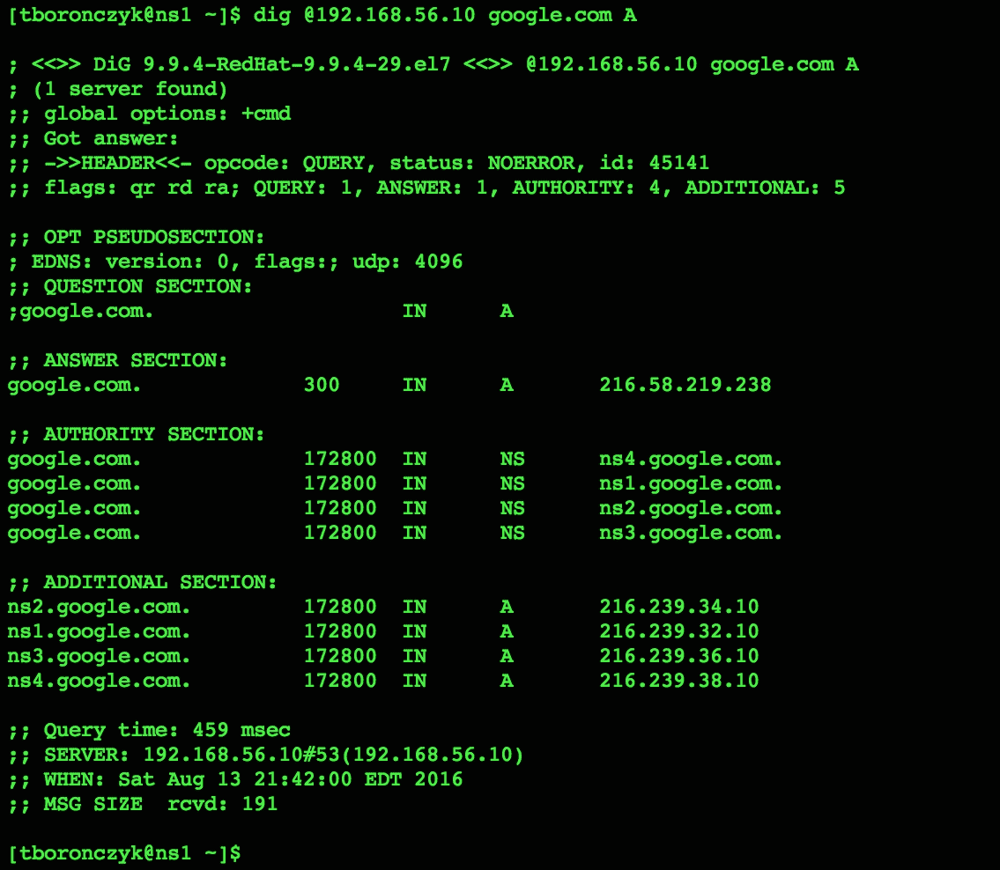
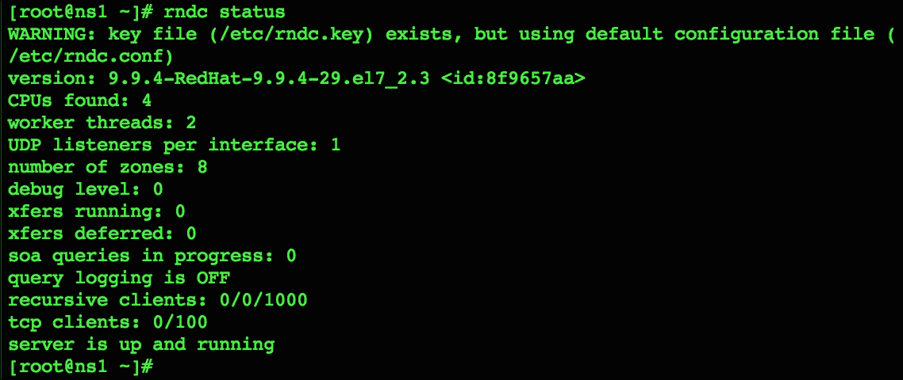

# 第八章：管理域名和 DNS

本章包含以下配方：

+   设置 BIND 为解析 DNS 服务器

+   将 BIND 配置为权威 DNS 服务器

+   编写反向查找区域文件

+   设置从属 DNS 服务器

+   配置 `rndc` 来控制 BIND

# 介绍

在本章中，你将找到一些操作 BIND 的配方，以更好地管理你的域名基础设施。你将学习如何将 BIND 配置为一个解析 DNS 服务器，能够缓存查找结果，这可以帮助减少延迟，还将学习如何将 BIND 配置为权威 DNS 服务器，以便为你的域名或私有内网资源提供权威响应。此外，还讨论了如何处理反向查找请求，并通过配置冗余的、辅助权威 DNS 服务器来确保你的资源始终可访问，这些服务器执行主从式区域记录传输。最后，你将学习如何设置和使用 `rndc`，这是一个非常实用的 BIND 服务器管理客户端。

# 设置 BIND 为解析 DNS 服务器

本配方教你如何使用 BIND 设置一个解析 DNS 服务器。域名服务（DNS）是互联网中默默奉献的工作马，它将如 `facebook.com` 和 `google.com` 这样的易记名称转换为如 `172.217.18.238` 和 `31.13.76.68` 这样的 IP 地址。

互联网通信使用 IP 地址来标识系统，但数字很难记住。例如，我们更容易记住 `google.com` 而不是 `172.217.18.238`（或 IPv6 地址 `2607:f8b0:4006:80e::200e`）。因此，当你在浏览器地址栏中输入 `google.com` 时，你的系统会查询一个 DNS 服务器，将该名称解析为 IP 地址，并随后请求该地址上的网页。当你写电子邮件时，DNS 服务器会在消息发送之前检索收件人邮件服务器的 IP 地址。

由你的服务提供商维护的解析 DNS 服务器可能是接收此类查找请求的第一个服务器，如果它已经知道地址，它会立即响应。如果没有，它将联系请求的域名父区域中的 DNS 服务器，并获得一个指向该域名权威 DNS 服务器的引用，或者指向 DNS 层级结构中下一个区域的服务器。如果请求到达层级的顶部而没有被引导到权威服务器，那么该域名不存在。否则，权威服务器将地址发送回你的解析服务器。解析器然后缓存响应，以便未来的查找能够更快完成。

根据您的网络以及解析地址时涉及的服务器数量，DNS 查找可能会成为一个重要的延迟来源。地址记录应该在前一两个跳跃中找到，并且解析服务器应尽可能靠近用户，以获得最佳性能。因此，设置本地 DNS 服务器以缓存查找结果可以显著提高用户体验网络速度。

## 准备工作

该教程需要一个具有有效网络连接的 CentOS 系统。假设该系统的 IP 地址配置为 `192.168.56.10`。还需要管理员权限，可以通过登录 `root` 账户或使用 `sudo` 来获取权限。

## 如何操作...

按照以下步骤安装 BIND 作为解析 DNS 服务器：

1.  安装 `bind` 和 `bind-utils` 包：

    ```
    yum install bind bind-utils

    ```

1.  用文本编辑器打开 BIND 的配置文件 `/etc/named.conf`：

    ```
    vi /etc/named.conf

    ```

1.  在 `options` 的大括号内找到 `listen-on` 选项。更新其列表以反映 BIND 将使用的系统 IP 地址：

    ```
    listen-on port 53 { 127.0.0.1; 192.168.56.10; };

    ```

1.  如果您希望服务 IPv6 请求，请类似地更改 `listen-on-v6` 的值。否则，将其值更新为 `none`：

    ```
    listen-on-v6 port 53 { none; }

    ```

1.  使用 BIND 允许接收请求的 IP 地址列表更新 `allow-query` 选项：

    ```
    allow-query { localhost; 192.168.56.0/24; };

    ```

1.  保存您对配置文件的更改并关闭该文件。

1.  使用 `systemctl` 启动 BIND，并可选择启用它在系统重启时自动启动：

    ```
    systemctl start named.service
    systemctl enable named.service

    ```

1.  启用 FirewallD 的 `dns` 服务，打开端口 `53` 以允许 TCP 和 UDP 流量：

    ```
    firewall-cmd --zone=public --permanent --add-service=dns
    firewall-cmd --reload

    ```

1.  使用 `dig` 请求查找以测试配置：

    ```
    dig @192.168.56.10 google.com A

    ```

## 工作原理...

默认情况下，BIND 被配置为解析 DNS 服务器，但我们仍然需要更新一些选项，以定义它如何接受查找请求。第一个更改是对 `options` 部分中的 `listen-on*` 选项进行调整，这些选项指定了 BIND 监听请求的端口和网络接口。`listen-on` 适用于 IPv4 网络，`listen-on-v6` 适用于 IPv6。在这两种情况下，DNS 流量的标准端口为端口 `53`：

```
listen-on port 53 { 127.0.0.1; 192.168.56.10; };
listen-on-v6 port 53 { none; }

```

接下来，我们更新了 `allow-query` 选项，提供了一个 BIND 可接受请求的系统白名单。地址可以单独提供，也可以以 CIDR 表示法书写：

```
allow-query { localhost; 92.168.56.0/24; }

```

使用预定义的值，如 `any`、`localhost`、`localnets` 和 `none` 也是可以接受的。直观地讲，`any` 代表所有地址，允许 BIND 监听系统配置的所有地址或接受来自任何源的请求，而 `none` 则禁止所有请求。`localhost` 代表系统的所有地址，`localnets` 代表系统所在所有网络的地址。

### 注意

请小心 `localhost` 和 `localnets` 中的 `local`，不要让它们给你带来虚假的安全感。如果你的系统连接到多个网络，例如一个公共网络（如互联网）和一个私有内部网络，那么它们都被认为是本地网络。没有必要的安全措施，允许来自不受信任网络的访问是一个严重的风险，因为开放的 DNS 服务器可能会被恶意用户利用，进行多种拒绝服务攻击。

更新 BIND 配置并使其启动后，我们可以通过发送 `dig` 查询并检查响应来测试一切是否正常：

```
dig @192.168.56.10 google.com A

```

可以通过在 `dig` 中提供目标服务器的地址并以 `@` 前缀的方式，将请求发送到特定的 DNS 服务器。如果没有在调用中提供 DNS 服务器，`dig` 会将请求发送到系统的 `/etc/resolve.conf` 文件中列出的服务器。

在 DNS 服务器的地址后，我们提供了我们感兴趣的资源名称，并跟上了所需的记录类型。在前面的示例中，查询的是 `google.com` 的地址（`A`）记录。也可以查询其他类型的记录，例如名称服务器（`NS`）和邮件交换（`MX`）记录。



`dig` 查询 DNS 服务器并显示其响应。

`dig` 的响应分为几个部分。**ANSWER SECTION** 显示了我们请求的 `A` 记录。**AUTHORITY SECTION** 列出了请求的域名配置的权威 DNS 服务器，而 **ADDITIONAL SECTION** 显示了权威服务器的 IP 地址。响应中还包含各种元数据，例如请求中设置了哪些标志，查询了哪个 DNS 服务器，以及查找完成所需的时间。

当你对测试结果感到满意时，可以配置网络中的系统以使用新的 DNS 服务器。通常，方法是在每个系统的 `/etc/resolv.conf` 文件中添加 `nameserver` 条目，提供 DNS 服务器的地址：

```
nameserver 192.168.56.10

```

`resolv.conf` 可能会根据系统接口的配置动态生成。如果是这种情况，您在文件中所做的任何更改都会被覆盖。您需要检查接口的配置文件（例如，`/etc/sysconf/network-scripts/ifcfg-enp0s3`），如果 `PEERDNS` 设置为 `yes`，则 `resolv.conf` 由网络管理器维护。请在接口配置中添加 `DNS` 条目，下次启动接口时，DNS 服务器的地址将被写入 `resolve.conf`：

```
DNS=192.168.56.10

```

更新配置后，需要重新启动接口以使更改生效，并验证 `resolve.conf` 的内容：

```
ifdown enp0s3 && ifup enp0s3
cat /etc/resolv.conf

```

解析 DNS 服务器有时被称为递归服务器，因为它们会将查找请求发送到区域层级中的每一层，直到找到答案。转发 DNS 服务器的功能类似于解析/递归服务器，因为这两种类型都会接受查找请求并缓存结果以提高效率；然而，转发服务器将请求发送到另一个 DNS 服务器并等待响应，委托解析过程，而不是自己跟踪答案。这可以减轻解析 DNS 服务器在处理请求时产生的许多网络流量。

要将 BIND 配置为转发 DNS 服务器，请再次打开 `/etc/named.conf` 并将 `forwarders` 和 `forward` 选项添加到 `options` 块中：

```
forwarders { 8.8.8.8; 8.8.4.4; };
forward only;

```

`forwarders` 选项提供了负责解析查找请求的 DNS 服务器列表。示例中列出了 Google 的公共 DNS 服务器，但您的服务提供商也应该提供可以使用的公共 DNS 服务器。

`forward only` 强制 BIND 将请求转发到 `forwarders` 中列出的负责服务器。仅当负责服务器未返回地址或转发信息时，BIND 才会联系该域的根服务器获取权威 DNS 服务器并自行处理请求。转发服务器的递归功能并未完全关闭，但大大减少了。

## 另请参见

以下资源将为您提供更多有关 DNS 工作原理以及如何配置 BIND 的信息：

+   `dig` 手册页 (`man 1 dig`)

+   DNS 术语简介 ([`www.digitalocean.com/community/tutorials/an-introduction-to-dns-terminology-components-and-concepts`](http://www.digitalocean.com/community/tutorials/an-introduction-to-dns-terminology-components-and-concepts))

+   火箭科学家的 DNS ([`www.zytrax.com/books/dns/`](http://www.zytrax.com/books/dns/))

+   DNS 如何工作 ([`howdns.works/`](http://howdns.works/))

+   BIND 9 管理员参考手册 ([`www.isc.org/downloads/bind/doc/`](http://www.isc.org/downloads/bind/doc/))

+   RHEL 7 网络指南：BIND ([`access.redhat.com/documentation/en-US/Red_Hat_Enterprise_Linux/7/html/Networking_Guide/sec-BIND.html`](https://access.redhat.com/documentation/en-US/Red_Hat_Enterprise_Linux/7/html/Networking_Guide/sec-BIND.html))

+   由 Cricket Liu 和 Paul Albitz 编写的 DNS & BIND ([`shop.oreilly.com/product/9780596100575.do`](http://shop.oreilly.com/product/9780596100575.do))

# 将 BIND 配置为权威 DNS 服务器

层级结构的一个好处是可以委派下级节点的责任。尽管互联网名称与数字分配公司（ICANN）对 DNS 目录拥有管理权限，但它将责任委托给了各个认证注册商，负责管理顶级域名，如 `com`、`net` 和 `org`，并将责任委托给适当的政府机构，负责国家顶级域名，如 `ca`、`de` 和 `es`。当您注册一个域名时，注册商会将责任委托给您，您也可以根据需要进一步委托责任给您的子域名。每个通过委托责任而形成的边界就构成了一个 DNS 区域。

本配方将教您如何将 BIND 配置为您域的权威 DNS 服务器。如果您还记得上一个配方中关于 DNS 请求传播的讨论，您会记得权威服务器对解析有最终决定权。这是因为它的信息来自 DNS 系统外部，由管理员手动配置该区域的信息。您还将学习如何编写包含信息（如将主机名映射到 IP 地址）的区域文件，我向您保证，这并不像初看时那么可怕。

## 准备工作

这个配方需要一个已经配置了 BIND 作为解析 DNS 服务器的 CentOS 系统，如前面的配方所述（BIND 的配置将更新为操作作为一个权威服务器）。还需要管理员权限，可以通过使用 `root` 账户登录或通过 `sudo` 提升权限。

根据 RFC-2606（保留的顶级 DNS 名称）的建议，我将使用 `example.com` 域名作为示例。如果您有自己的域名，可以随意替换。为了说明方便，本配方将展示一个由多台服务器组成的网络，这些服务器处理域名中常见的各种服务，如电子邮件服务器和 Web 服务器。系统如下：

+   `ns1`: 托管域名的主要权威 DNS 服务器，IP 地址为 `192.168.56.10`（这是我们将要操作的系统）

+   `ns2`: 托管辅助权威 DNS 服务器，地址为 `192.168.56.20`

+   `mail`: 托管主电子邮件服务器，地址为 `192.168.56.12`

+   `mail2`: 托管辅助电子邮件服务器，地址为 `192.168.56.22`

+   `www`: 托管 Web 和 FTP 服务器，地址为 `192.168.56.100`

## 如何操作...

按照以下步骤将 BIND 配置为权威 DNS 服务器：

1.  使用文本编辑器打开 `/etc/named.conf` 文件：

    ```
    vi /etc/named.conf

    ```

1.  确认 `listen-on*` 和 `allow-query` 选项已按前一个配方所述进行配置：

    ```
    listen-on port 52 { 127.0.0.1; 192.168.56.10; };
    listen-on-v6 port 52 { none; };
    allow-query { 192.168.56.0/24; };

    ```

1.  将 `recursion` 选项的值更改为 `no`，完全禁用 BIND 的递归查找行为：

    ```
    recursion no;

    ```

1.  在文件末尾，添加以下区域配置：

    ```
    zone "example.com." in {
     type master;
     file "/var/named/zones/example.com.fwd";
     allow-transfer { none; };
    };

    ```

1.  保存更改并关闭文件。

1.  创建 `/var/named/zones` 目录：

    ```
    mkdir /var/named/zones

    ```

1.  创建区域文件`/var/named/zones/example.com.fwd`，并添加以下内容（我们在*如何工作...*部分的讨论将帮助你理解每条记录的含义）：

    ```
    $TTL 1d
    $ORIGIN example.com.
    ; start of authority resource record
    @       IN SOA   ns1 hostmaster.example.com. (
     2016041501 ; serial
     12h        ; refresh
     5m         ; retry
     2w         ; expire
     3h)        ; negative TTL
    ; nameserver records
     IN NS    ns1
     IN NS    ns2
    ns1     IN A     192.168.56.10 
    ns2     IN A     192.168.56.20
    ; mail records
    @       IN MX    10 mail
     IN MX    20 mail2
    mail    IN A     192.168.56.12
    mail2   IN A     192.168.56.22
    ; webserver records
    @       IN A     192.168.56.100
    www     IN CNAME @
    ftp     IN CNAME @

    ```

1.  确保目录和区域文件具有正确的所有权和访问权限：

    ```
    chown root.named /var/named/zones
    chmod 750 /var/named/zones
    chmod 640 /var/named/zones/*

    ```

1.  重启 BIND 以使配置更改生效：

    ```
    systemctl restart named.service

    ```

1.  使用 dig 请求查找以测试配置：

    ```
    dig @192.168.56.10 example.com SOA

    ```

## 如何工作...

一个权威 DNS 服务器应该提供的唯一记录是那些具有权威信息的区域记录，因此我们首先在 BIND 的配置文件中禁用了`recursion`。禁用后，BIND 不会转发请求，也不会尝试解析非权威记录的查找请求：

```
recursion off;

```

然后，我们在配置文件的末尾添加了一个简短的部分，指定了 BIND 服务器如何为`example.com.`区域提供服务：

```
zone "example.com." in {
 type master;
 file "/var/named/zones/example.com.fwd";
 allow-transfer { none; };
};

```

本节以关键字`zone`开始，用以表示区域配置，后面跟着作为完全限定域名（FQDN）给出的区域名称。FQDN 总是以点号结尾，因为它们包含所有委托的路径，包括根目录。由于 DNS 系统的根没有名称，它的分隔符表现为结尾的点。因此，`example.com.`是完全限定的，而`example.com`则不是。（有些人错误地使用 FQDN 一词，实际上他们是在谈论部分限定域名。这是我一个不合逻辑的小毛病，所以提醒你注意。）

### 注意

思考如何在文件系统中导航有助于你理解完全限定名和部分限定名之间的区别。当给定绝对（完全限定）路径`/var/named`时，导航从文件系统的根目录开始，依次进入`var`目录，然后进入`named`目录。根目录没有除分隔符以外的名称。然而，相对（部分限定）路径`var/named`并不以分隔符开头。它的导航从当前目录开始，无论当前目录在哪。域名也类似，但它们按相反的顺序遍历层级，朝着根目录移动，使用点号作为分隔符，而不是斜杠。

`type master`选项将此服务器指定为区域的主权威 DNS 服务器。一种常见的部署策略是设置多个权威服务器，在主/从配置中工作。管理员在主服务器上更新区域信息，然后将该信息传输到一个或多个从服务器，后者作为次级权威 DNS 服务器提供服务。你将在*设置从属 DNS 服务器*一章中学习如何设置，但现在我们只关注主服务器。

`allow-transfers`选项列出了在接收到区域信息传输请求时，此服务器允许响应的从属系统，但由于我们尚未配置第二个权威 DNS 服务器，我们使用`none`来禁用传输。这有助于保护我们免受特定类型的拒绝服务攻击。资源记录足够小，可以在正常查找活动中通过 UDP 包进行传输，而区域传输则是通过 TCP 批量传输所有记录。恶意用户快速连续发送传输请求可能会使你的网络饱和。

区域的信息存储在一个名为**区域文件**的文本文件中，其位置通过`file`选项指定。本章中遵循的约定是将文件放在`/var/named`下的`zone`目录中，并使用`fwd`和`rev`作为文件扩展名，表示文件是正向查找区文件还是反向查找区文件。因此，我们的文件保存为`/var/named/zones/example.com.fwd`。

本示例中的文件是一个正向区域文件，因为它将名称映射到它们的 IP 地址。反向查找区域则映射相反的关系，即地址到名称。它们在*编写反向查找区域文件*的示例中讨论。

### 注意

我见过许多不同的命名约定用于命名区域文件。一些管理员使用`zon`或`zone`作为文件扩展名。一些则会将区域文件分开存储在名为`fwd-zone`和`rev-zone`的目录中。说实话，只要你保持一致性并且文件组织得当，`systemctl restart named.servicent`，做什么都无所谓。

`$TTL`是区域文件中的第一个指令，它指定了解析 DNS 服务器可以缓存从权威服务器接收到的记录的默认时间长度。特定的记录可能会提供它们自己的 TTL 值，这会覆盖默认值：

```
$TTL 14400

```

`$ORIGIN`指令提供了标识区域的 FQDN。文件中出现的任何`@`都会被`$ORIGIN`的值替代：

```
$ORIGIN example.com.

```

剩余的条目统称为资源记录，由一系列字段组成，字段的顺序是`name ttl class type values`。`name`字段给出了拥有记录的资源名称。如果为空，则其值默认为前一个记录中使用的名称。`ttl`也是可选的，默认为`$TTL`的值。为了我们的目的，`class`将始终是`IN`，因为我们编写的是互联网资源记录。其他的类包括`CH`（Chaos）和`HS`（Hesiod），但它们并不广泛使用。

文件中的第一个记录必须是权威起始（`SOA`）记录，它标识该服务器是该区域的授权 DNS 服务器。`SOA`记录的值包括该区域主授权服务器的名称（我们提供的是`ns1`）、负责该区域的人的电子邮件地址（`hostmaster.example.com.`）、序列号（`2016041501`）、刷新间隔（`12h`）、重试间隔（`5m`）、过期间隔（`2w`）以及负面响应（当请求的记录不存在时发送）从服务器缓存的最长时间（`3h`）。记录通常写作单行条目，但括号允许我们将记录分割成多行：

```
; start of authority resource record
@       IN SOA   ns1 hostmaster.example.com. (
 2016041501 ; serial
 12h        ; refresh
 5m         ; retry
 2w         ; expire
 3h)        ; negative TTL

```

电子邮件地址中通常会出现的`@`符号被更改为点号，在`hostmaster.example.com.`中，因为`@`在区域文件中有特殊含义。同时注意，哪些名称是完全限定的（FQDN）。没有完全限定的名称会自动追加 FQDN，因此`ns1`被理解为`ns1.example.com.`。如果电子邮件地址的域名部分没有完全限定，那么`hostmaster.example.com`将被视为`hostmaster.example.com.example.com.`，显然这不是我们想要的结果。

`SOA`记录中超出部分的值主要供从属 DNS 服务器使用。刷新值告诉从属 DNS 服务器应该多久尝试刷新其区域文件的副本。重试间隔告诉从属服务器在主服务器无法连接时，应该等待多长时间再进行重试，过期值则指定从属服务器在与主服务器完全失去联系的情况下，可以使用其副本作为授权服务器满足查询请求的时间。负面 TTL 是一个解析器应该缓存来自 DNS 服务器的负面响应的时间长度，例如`NXDOMAIN`和`NODATA`响应。

序列号是一个任意的 10 位数字值，主机可以使用它来区分当前版本的区域文件与之前版本的不同。每次更新文件时，必须更新序列号。一个常见的约定是使用当前日期后跟一个序列号。例如，2016 年 4 月 15 日写作`20160415`，然后再添加两个数字以标识同一天的多个更新（`2016041501`，`2016041502`，`2016041503`，依此类推）。

接下来，我们给出了用于识别区域授权 DNS 服务器的`NS`记录。`SOA`和`NS`记录在每个区域文件中都是必需的：

```
; nameserver records
 IN NS    ns1
 IN NS    ns2
ns1     IN A     192.168.56.10 
ns2     IN A     192.168.56.20

```

`NS`记录识别授权服务器的名称。在前面的示例中，我们将`n1`和`n2`定义为区域的授权 DNS 服务器，它们被理解为`ns1.example.com.`和`ns2.example.com.`，因为它们没有完全限定。`A`记录将一个名称映射到其地址（`AAAA`用于 IPv6 地址）。我们在示例中编写的记录表示`ns1.example.com.`可以通过`192.168.56.10`访问，`ns2.example.com.`可以通过`192.168.56.20`访问。

### 注意

`NS` 记录属于区域，但我将`NS` 记录的第一个字段留空，因为该字段默认为上一条记录中使用的名称。在本例中，名称恰好是来自 `SOA` 记录（即 `$ORIGIN`）的 `@`。以下任何替代方案都具有相同含义并且同样可接受：

```
@ IN NS n1
$ORIGIN IN NS n1
example.com. IN NS n1
```

但是要小心，因为 `MX` 记录也属于区域。随着我们开始下一组记录，最后一个名称是来自该服务器 `A` 记录的 `ns2`。这意味着第一个 `MX` 记录必须提供 `@`、`$ORIGIN` 或 `example.com.` 之一。

`MX` 记录定义了负责处理区域邮件的服务器名称。邮件传输器分配了相对优先级，客户端将首先尝试与优先级最低的邮件服务器通信。如果服务器无法访问，客户端将尝试连接下一个最低的服务器，直到列表耗尽：

```
; mail records
@       IN MX    10 mail
 IN MX    20 mail2
mail    IN A     192.168.56.12
mail2   IN A     192.168.56.22

```

我们的配置定义了主要邮件服务器 `mail.example.com.`，IP 地址为 `192.168.56.12`，相对优先级为 10。第二个服务器，可能是在故障时的备份，是 `mail2.example.com.`，位于 `192.168.56.22`，优先级为 20。

最后，我们定义了识别区域 Web 服务器和系统其他别名的记录：

```
; webserver records
@       IN A     192.168.56.100
www     IN CNAME @
ftp     IN CNAME @

```

在 URL 开头出现 `www` 的普遍性自点网时代以来已经减少。不过，许多区域将地址解析为带有和不带 `www` 的相同 IP。我们的配置也是如此，为 `example.com` 或 `www.example.com` 的查找返回 `192.168.56.100`。这通过创建将域映射到 Web 服务器地址的 `A` 记录，然后将别名 `www` 到域的 `A` 记录的规范名称（`CNAME`）记录来实现。我们的配置还将 `ftp` 别名为 `A` 记录，以便用户可以使用 `ftp.example.com` 地址将其站点文件上传到 Web 服务器。

## 另请参阅

查看以下资源以获取有关运行 DNS 服务器和管理您的域的更多信息：

+   BIND 9 管理员参考手册 ([`www.isc.org/downloads/bind/doc`](http://www.isc.org/downloads/bind/doc))

+   DNS 中不要犯的五个基本错误 ([`archive.oreilly.com/pub/a/sysadmin/2007/04/26/5-basic-mistakes-not-to-make-in-dns.html`](http://archive.oreilly.com/pub/a/sysadmin/2007/04/26/5-basic-mistakes-not-to-make-in-dns.html))

+   适用于小型局域网的 BIND ([`www.madboa.com/geek/soho-bind`](http://www.madboa.com/geek/soho-bind))

+   RFC-1034: 域概念和设施 ([`tools.ietf.org/html/rfc1034`](https://tools.ietf.org/html/rfc1034))

+   RFC-1035: 域名-实施和规范 ([`tools.ietf.org/html/rfc1035`](https://tools.ietf.org/html/rfc1035))

+   RFC-1912: 常见 DNS 运行和配置错误 ([`tools.ietf.org/html/rfc1912`](https://tools.ietf.org/html/rfc1912))

# 编写反向查找区域文件

到目前为止，我们将 DNS 请求视为正向查找，将资源名称如`www.example.com`转换为 IP 地址。然而，服务也可以通过提供 IP 地址来请求 DNS 服务器进行反向查找，想要知道与之关联的名称。像这样的反向查找特别适用于日志记录、身份验证和安全目的。例如，系统可以查询 DNS 服务器以验证客户端是否真的从它声称的系统进行连接。为了处理这种请求，本食谱将向你展示如何编写一个反向查找区域文件。

## 准备工作

本食谱需要一台安装并配置好 BIND 的 CentOS 系统，如前述食谱所描述。还需要管理员权限，可以通过使用`root`帐户登录或使用`sudo`来获取。

## 如何实现...

按照以下步骤添加反向查找区域：

1.  打开 BIND 配置文件：

    ```
    vi /etc/named.conf

    ```

1.  添加以下区域条目：

    ```
    zone "56.168.192.in-addr.arpa." in {
     type master;
     file "/var/named/zones/example.com.rev";
     allow-transfer { none; };
    };

    ```

1.  保存更改并关闭配置文件。

1.  创建`/etc/named/zones/example.com.rev`文件，并添加以下内容：

    ```
    $TTL 1d
    $ORIGIN 56.168.192.in-addr.arpa.
    ; start of authority
    @   IN SOA  ns1.example.com. hostmaster.example.com. (
     2016041501 ; serial
     12h        ; refresh
     5m         ; retry
     2w         ; expire
     3h)        ; error TTL
    ; nameservers
     IN NS   ns1.example.com.
     IN NS   ns2.example.com.
    10  IN PTR  ns1.example.com.
    20  IN PTR  ns2.example.com.
    ; mail servers
    12  IN PTR  mail.example.com.
    22  IN PTR  mail2.example.com.
    ; web servers
    100 IN PTR  example.com.
    100 IN PTR  www.example.com.
    100 IN PTR  ftp.example.com.

    ```

1.  确保区域文件具有正确的所有权和访问权限：

    ```
    chown root.named /var/named/zones/example.com.rev
    chmod 640 /var/named/zones/example.com.rev

    ```

1.  重启 BIND 使配置更改生效：

    ```
    systemctl restart named.service

    ```

1.  使用`dig`进行反向 DNS 查找，以测试该区域：

    ```
    dig @192.168.56.10 -x 192.168.56.100

    ```

## 工作原理...

反向查找区域就像任何其他由区域文件定义的区域一样。所以，希望本食谱中的内容不会让你感到太意外。不过，仍有一些值得回顾的要点。

首先，区域的名称是通过将网络地址与特殊域`in-addr.arpa`结合来构建的，该域用于定义反向映射的 IP 地址（`ip6.arpa`用于 IPv6）。地址的字节顺序会被反转，以保持与从最具体到最广泛的域名一致性。因此，`56.168.192.in-addr.arpa.`是`192.168.56/24`地址空间反向查找的完全限定域名（FQDN）：

```
zone "56.168.192.in-addr.arpa." in {
 type master;
 file "/etc/named/zones/example.com.rev";
 allow-transfer { none; };
};

```

### 注意

本食谱将区域文件命名为`example.com.rev`，以便它在目录列表中与正向区域文件`example.com.fwd`一起排序。其他命名惯例可能将文件命名为`56.168.192.in-addr.arpa.zone`。再次强调，无论你选择什么惯例，关键是保持一致性。

在编写反向区域文件时，请记住我们讨论过的扩展和替换规则，最重要的是部分限定名称在`$ORIGIN`的上下文中进行解释。我们可以在正向查找区域的`SOA`记录中只写主权威 DNS 服务器的主机名，但在反向文件中需要确保名称是完全限定的，以防止它们被当作`ns1.56.168.192.in-addr.arpa.`来处理：

```
; start of authority
@   IN SOA  ns1.example.com. hostmaster.example.com. (
 2016041501 ; serial
 12h        ; refresh
 5m         ; retry
 2w         ; expire
 3h)        ; error TTL

```

指针记录（`PTR`）将 IP 地址与资源名称关联。除了 `SOA` 和 `NS` 记录（因为它们是任何区域文件中的必需记录）之外，反向文件中可以出现的唯一其他记录类型是 `PTR`。这一点意味着，需要多个记录来正确反向任何在正向文件中使用 `CNAME` 记录创建的别名。由于我们使用 `www` 和 `ftp` 作为 `example.com.` 的别名，并解析为 `192.168.56.100`，因此在反向区域文件中会出现三个与该地址相关的记录，如下所示：

```
100 IN PTR  example.com.
100 IN PTR  www.example.com.
100 IN PTR  ftp.example.com.

```

我们可以使用 `dig` 和 `-x` 参数来测试区域配置：

```
dig @192.168.56.10 -x 192.168.56.100

```

`-x` 让 `dig` 知道我们正在执行反向查找。我们提供 IP 地址的正常写法，`dig` 会反转其字节并在发送请求时附加 `in-addr.arpa` 域名。

## 另见

参考以下资源以获取更多关于反向区域和查找的信息：

+   BIND 9 管理员参考手册（[`www.isc.org/downloads/bind/doc/`](http://www.isc.org/downloads/bind/doc/)）

+   DNS 反向映射（[`www.zytrax.com/books/dns/ch3/`](http://www.zytrax.com/books/dns/ch3/)）

+   无类 `in-addr.arpa.` 委托（[`www.indelible.org/ink/classless`](http://www.indelible.org/ink/classless)）

# 配置辅助 DNS 服务器

冗余性对于确保关键服务在出现问题时仍然可用至关重要。由于 DNS 是网络中最关键的组件之一，无论是私有内网还是公共互联网，只有一个权威 DNS 服务器是不明智的。事实上，IANA 的*权威名称服务器技术要求*文档中规定，区域内必须至少有两个不同的权威名称服务器。本配方将向你展示如何配置第二个 BIND 实例作为辅助权威服务器，从主服务器接收区域信息，形成主/从配置。然后，查询请求可以由任何一台服务器满足，并被认为是权威响应。

## 准备工作

本配方需要两台已安装并按之前配方配置好的 CentOS 系统，并使用*配置 BIND 为权威 DNS 服务器*配方中描述的网络。假设作为主服务器的系统配置为 `192.168.56.10`，从服务器配置为 `192.168.56.20`。还需要管理员权限，可以通过登录 `root` 账户或使用 `sudo` 来获得。

## 如何操作...

按照以下步骤配置 BIND 为接收来自主 DNS 服务器区域信息的辅助权威 DNS 服务器：

1.  在运行从实例 BIND 的系统上，打开 `named.conf` 文件，并按以下方式配置 `example.com.` 区域：

    ```
    zone "example.com." in {
     type slave;
     file "/var/named/slaves/example.com.fwd";
     masters { 192.168.56.10; };
     allow-transfer { none; };
     notify no;
    };

    ```

1.  按如下方式配置其反向区域：

    ```
    zone "56.168.192.in-addr.arpa." in {
     type slave;
     file "/var/named/slaves/example.com.rev";
     masters { 192.168.56.10; };
     allow-transfer { none; };
     notify no;
    };

    ```

1.  保存更改并关闭文件。

1.  重启从服务器以使配置更改生效：

    ```
    systemctl restart named.service

    ```

1.  在运行主实例 BIND 的系统上，打开 `named.conf` 文件。

1.  使用从属服务器的地址更新 `example.com.` 区域的 `allow-transfer` 条目。区域的配置应如下所示：

    ```
    zone "example.com." in {
     type master;
     file "/var/named/zones/example.com.fwd";
     allow-transfer { 192.168.56.20; };
    };

    ```

1.  对反向区域配置进行相同的更改：

    ```
    zone "56.168.192.in-addr.arpa." in {
     type master;
     file "/var/named/zones/example.com.rev";
     allow-transfer { 192.168.56.20; };
    };

    ```

1.  保存更改并关闭文件。

1.  重启主服务器以使配置更改生效：

    ```
    systemctl restart named.service

    ```

1.  在从属服务器上，使用 `dig` 测试配置并请求区域传输：

    ```
    dig @192.168.56.10 example.com. AXFR

    ```

## 它是如何工作的...

从属服务器在主权威 DNS 服务器通知其区域记录已更改并且从属服务器维护的区域文件副本根据 `SOA` 记录到期时，请求区域传输。在本食谱中，我们从两个运行 BIND 的系统开始，并编辑它们的配置以允许传输。我们从配置为从属的系统开始，配置了之前处理过的正向和反向查找区域：

```
zone "example.com." in {
 type slave;
 file "/var/named/slaves/example.com.fwd";
 masters { 192.168.56.10; };
 allow-transfer { none; };
 notify no;
};
zone "56.168.192.in-addr.arpa." in {
 type slave;
 file "/var/named/slaves/example.com.rev";
 masters { 192.168.56.10; };
 allow-transfer { none; };
 notify no;
};

```

`type slave` 选项指示该服务器作为区域的从属服务器运行。由于主从关系是按区域设置的，因此同一个 BIND 实例可以在一个区域中充当主服务器，而在另一个区域中充当从属服务器。`masters` 选项提供了主服务器的地址。

`file` 选项提供了 BIND 将写入传输的区域信息的路径。将传输的区域与系统上的任何主区域文件分开存放不仅有利于组织管理，而且有利于安全性。BIND 需要对目录具有写权限才能保存传输文件，但主区域文件应对除管理员（即 `root`）之外的任何人设置为只读，以防篡改。我们的配置将它们保存到 `/var/named/slaves`，该目录在我们安装 `bind` 包时已创建，并且已经具有适当的权限。

`allow-transfers` 选项列出了此服务器允许响应的区域传输请求的系统。为了防止可能的滥用，我们将其值设置为 none，这样就不允许从从属服务器进行传输。所有传输将由主权威 DNS 服务器处理，即使如此，它也只会将数据发送给从属服务器。

每当区域重新加载时，BIND 会向区域的 `NS` 记录中列出的从属权威服务器发送通知。由于主服务器已经通知了其他从属服务器（如果你配置了多个从属服务器），因此没有必要让从属服务器向其他从属服务器发送通知，因此我们通过 `notify no` 关闭了这种行为。

然而，如果需要，你可以通过 `also-notify` 选项将通知发送给除了区域文件中列出的服务器之外的其他服务器。如果你有额外的从属服务器，并且不想通过 `NS` 记录公开它们，或者如果你希望通知其他自动化过程，这将非常有用。只需提供你希望通知的服务器的地址，并通过 `also-notify` 进行设置：

```
also-notify { 192.168.56.200; 192.168.68.200; };

```

若只通知 `also-notify` 中列出的服务器，而不通知从属权威服务器，可以将 `notify` 设置为 `explicit`：

```
also-notify { 192.168.56.200; 192.168.68.200; };
notify explicit;

```

接下来，我们更新了主服务器的配置，使用`allow-transfers`指定从服务器的地址，以允许主服务器响应来自从服务器的区域传输请求：

```
zone "example.com." in {
 type master;
 file "/var/named/zones/example.com.fwd";
 allow-transfer { 192.168.56.20; };
};

```

在重启 BIND 以使我们的更改生效后，我们可以通过在从属系统上使用`dig`请求主服务器的区域传输来测试配置：

```
dig @192.168.56.10 example.com. AXFR

```

### 注意

每次更新区域配置时，记得在`SOA`记录中递增序列号。从属服务器在更新其区域信息之前会检查序列号，如果值没有改变，它将不会进行更新。

## 另请参见

有关配置和处理区域传输的更多信息，请参考以下资源：

+   BIND 9 管理员参考手册 ([`www.isc.org/downloads/bind/doc/`](http://www.isc.org/downloads/bind/doc/))

+   火箭科学家的 DNS ([`www.zytrax.com/books/dns/`](http://www.zytrax.com/books/dns/))

+   权威名称服务器的技术要求 ([`www.iana.org/help/nameserver-requirements`](http://www.iana.org/help/nameserver-requirements))

+   AXFR 协议如何工作 ([`cr.yp.to/djbdns/axfr-notes.html`](http://cr.yp.to/djbdns/axfr-notes.html))

+   DNS 架构模式 ([`www.allgoodbits.org/articles/view/5`](http://www.allgoodbits.org/articles/view/5))

+   保护互联网名称服务器 ([`resources.sei.cmu.edu/library/asset-view.cfm?assetid=52493`](http://resources.sei.cmu.edu/library/asset-view.cfm?assetid=52493))

# 配置`rndc`来控制 BIND

`rndc`是用于管理 BIND 服务器的客户端工具。然而，在使用它之前，必须配置`rndc`和 BIND。此食谱将向您展示如何配置它们，然后展示一些用于管理服务器缓存的命令。

## 准备工作

本食谱需要一个已安装并按前述食谱配置的 CentOS 系统。还需要管理员权限，可以通过以`root`帐户登录或使用`sudo`来获得权限。

## 如何操作...

按照以下步骤配置`rndc`：

1.  使用`rndc-confgen`工具生成必要的密钥文件：

    ```
    rndc-confgen -a -c /etc/rndc.key

    ```

1.  创建`/etc/rndc.conf`文件，内容如下：

    ```
           include "/etc/rndc.key";
           options {
               default-key "rndc-key";
               default-server 127.0.0.1;
               default-port 953;
           };

    ```

1.  确保`rndc.key`和`rndc.conf`的正确所有权和访问权限：

    ```
    chown root.named /etc/rndc*
    chmod 640 /etc/rndc*

    ```

1.  打开`/etc/named.conf`，并在`options`块的闭括号后添加以下配置设置：

    ```
           include "/etc/rndc.key";
           controls {
               inet 127.0.0.1 port 953 allow { 127.0.0.1; } keys {
               "rndc-key"; };
           };

    ```

1.  重启 BIND 使配置更改生效：

    ```
    systemctl restart named.service

    ```

1.  使用`rndc`请求 BIND 状态来测试配置：

    ```
    rndc status

    ```

## 它是如何工作的...

`rndc`与 BIND 之间的通信需要一个共享密钥进行授权。因此，首先我们使用`rndc-confgen`生成了一个。在没有参数的正常操作中，程序会生成密钥和必要的配置片段，并将所有内容输出到屏幕上。你可以将输出的部分复制粘贴到适当的文件中，但如果你只能通过终端和键盘访问，这可能会很困难。相反，我们运行程序时加上`-a`选项，让它生成密钥的定义并将其输出到自己的配置文件中，其他配置部分则手动输入。`-c`选项只是指定了我们希望的密钥定义文件名称：

```
rndc-confgen -a -c /etc/rndc.key

```

### 注意

有些人报告说，`rndc-confgen`在他们的系统上似乎崩溃。如果你遇到这种情况，最可能的原因是它在等待足够的数据来生成密钥，但`/dev/random`的熵池不足，导致`rndc-confgen`一直在等待。终止该进程并使用`-r`选项再次尝试，指定`/dev/urandom`作为备用来源：

`**rndc-confgen -a -c /etc/rndc.key -r /dev/urandom**`

快速查看`/etc/rndc.key`，可以看到密钥的定义如下：

```
key "rndc-key" {
 algorithm hmac-md5;
 secret "YBmUKeobRMlAOUjCqMcb6g==";
};

```

`rndc`使用自己的配置文件。因此，接下来我们创建了`/etc/rndc.conf`：

```
include "/etc/rndc.key";
options {
 default-key "rndc-key";
 default-server 127.0.0.1;
 default-port 953;
};

```

我们包含了来自`rndc.key`的密钥定义，并将其指定为`rndc`使用的默认密钥。我们还指定了本地回环地址作为默认服务器，并将 953 作为默认端口。通过这些配置选项，`rndc`会尝试连接到本地运行的 BIND 服务器，而无需我们在命令行中提供额外的参数。

最后，我们需要配置 BIND 以允许并验证 rndc 的连接请求。因此，我们再次包括密钥定义，并在`named.conf`中添加一个`controls`块：

```
include "/etc/rndc.key";
controls {
 inet 127.0.0.1 port 953 allow {127.0.0.1;} keys {"rndc-key";};
};

```

`inet`语句指定了哪些地址允许连接以及它们需要的认证密钥。第一个地址列出了 BIND 将监听的地址，以接收连接请求。为了安全起见，配置故意限制，只允许我们在本地使用`rndc`——BIND 监听本地地址并服务于从本地地址发出的命令。

如果你想使用`rndc`进行远程管理，我建议你不要开放访问，而是使用 SSH 登录到远程系统并使用该系统上的`rndc`副本。BIND 的控制通道保持关闭，不允许任何不怀好意的人访问，你也不需要分发密钥文件的副本，两系统之间的通信是加密的：

```
ssh 192.168.56.10 rndc status

```

### 注意

你可以通过创建一个`alias`来节省输入时间：

`**alias rndc-ns1="ssh 192.168.56.10 rndc"** **rndc-ns1 status**`

当没有指定子命令时，`rndc`会显示一个使用信息，列出我们可以执行的操作。`status`命令输出 BIND 的当前状态，包括已配置了多少个区域，是否有区域传输正在进行，以及对于解析 DNS 服务器，它当前正在尝试通过递归解决多少个查询：

```
rndc status

```



`rndc` 用于管理 BIND DNS 服务器

如果你正在运行一个解析 DNS 服务器，`flush` 命令可能会很有用。它会从 BIND 的缓存中删除所有的缓存查找信息。如果你只想清除与特定域名相关的记录，可以使用 `flushname`：

```
rndc flushname google.com

```

`reload` 和 `refresh` 命令在权威服务器中非常有用。`reload` 命令使 BIND 在不重启服务器的情况下重新解析更新后的区域文件。除非指定了特定的区域，否则所有区域都会被重新加载：

```
rndc reload example.com.

```

对于从属 DNS 服务器，如果其区域文件副本过时，我们可以使用 `refresh` 命令强制 BIND 更新其副本：

```
rndc refresh example.com.

```

## 另见

有关使用 `rndc` 的更多信息，请参考以下资源：

+   `rndc` 手册页（`man 8 rndc`）

+   RHEL 7 网络指南：BIND ([`access.redhat.com/documentation/en-US/Red_Hat_Enterprise_Linux/7/html/Networking_Guide/sec-BIND.html`](https://access.redhat.com/documentation/en-US/Red_Hat_Enterprise_Linux/7/html/Networking_Guide/sec-BIND.html))
