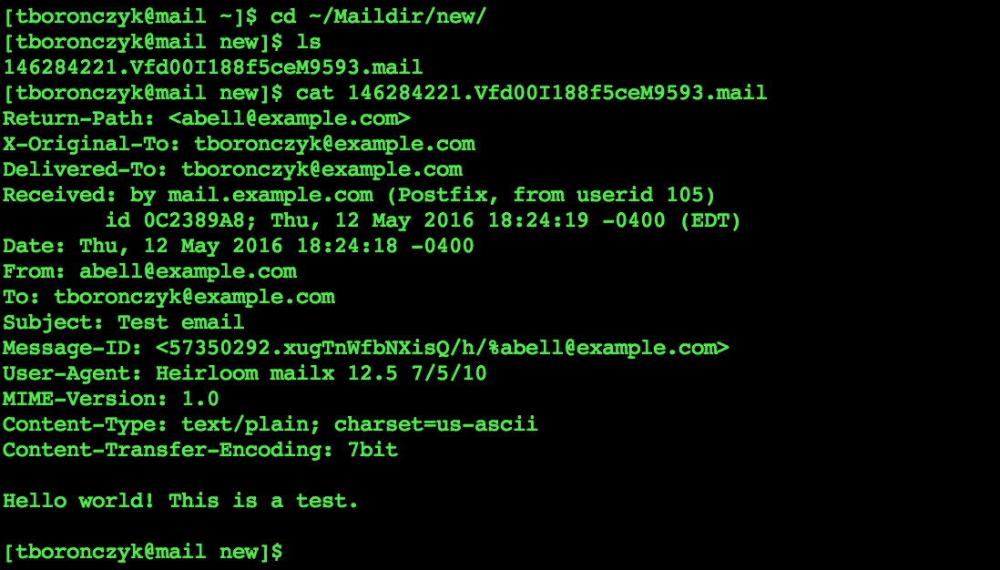
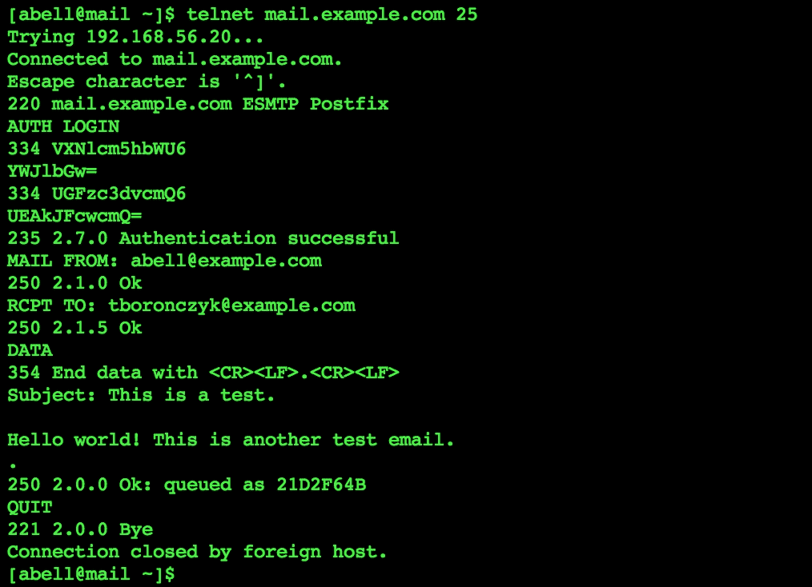
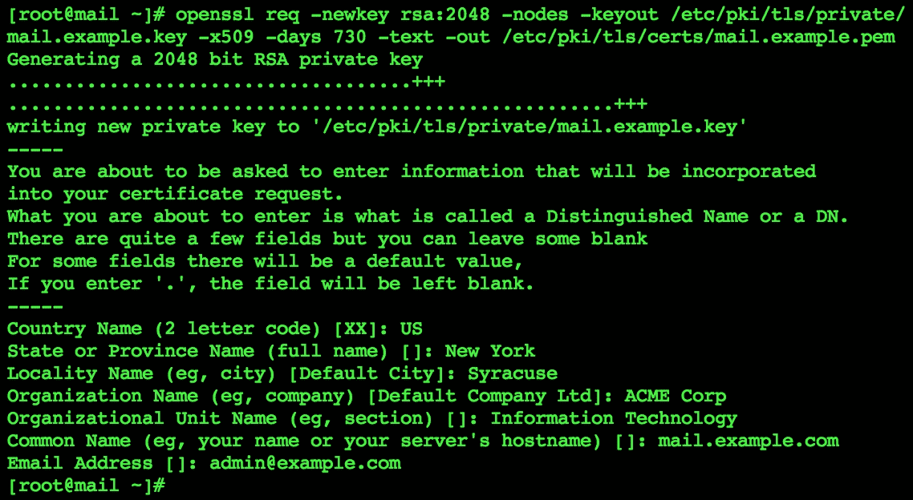
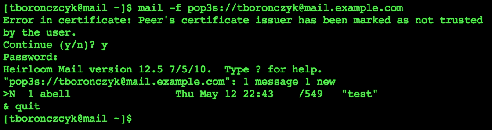
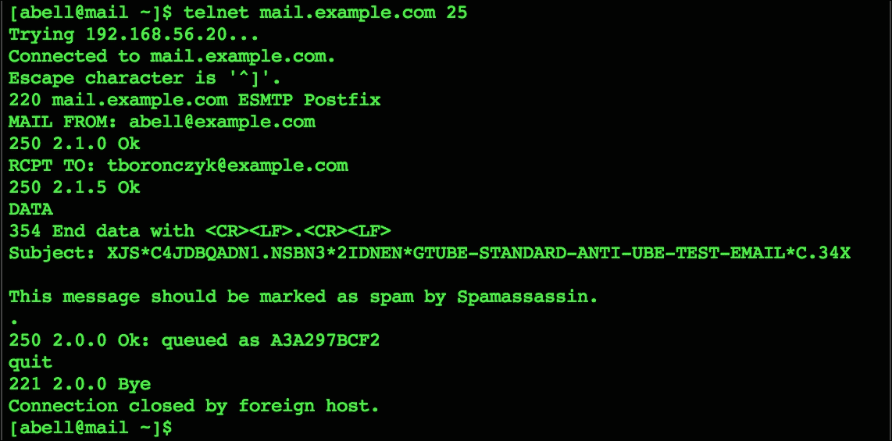
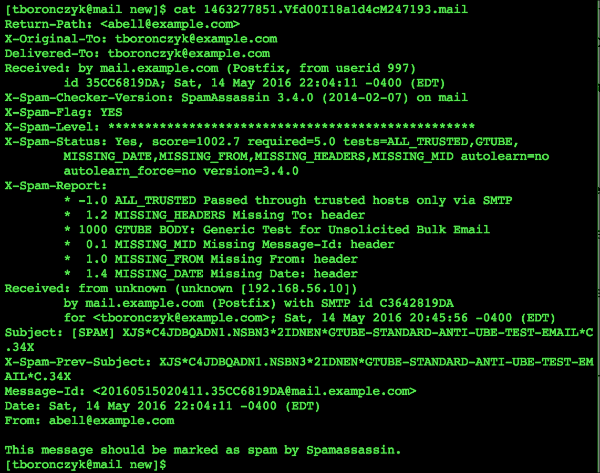

# 第九章：电子邮件管理

本章包含以下食谱：

+   配置 Postfix 以提供 SMTP 服务

+   使用 Dovecot 为 Postfix 添加 SASL

+   配置 Postfix 以使用 TLS

+   配置 Dovecot 以实现安全的 POP3 和 IMAP 访问

+   使用 SpamAssassin 进行垃圾邮件防护

+   使用 Procmail 进行邮件路由

# 引言

在本章中，你将找到一些食谱，帮助你为你的域名设置并保护电子邮件服务。你将学习如何配置 Postfix 作为 SMTP 服务器，并学习如何配置它以支持 SASL 身份验证和 TLS 加密。接着，我们将配置 Dovecot，提供用户通过 POP3 和 IMAP 协议访问他们的电子邮件。最后，你将学习如何设置 SpamAssassin 和 Procmail，以减少垃圾邮件进入你的收件箱。

# 配置 Postfix 以提供 SMTP 服务

本食谱教你如何将 Postfix 配置为你的域名的基础电子邮件服务器。电子邮件是互联网最古老的服务之一，已经成为其最普及的服务之一。此外，电子邮件也可能是最难管理的服务之一。

使用简单邮件传输协议（SMTP），一封电子邮件从发信点到达你的收件箱，经过许多处理过程。当有人给你写信时，他们使用电子邮件客户端来撰写邮件。客户端将邮件发送到他们的邮件服务器，邮件服务器查找你的域名的`MX`记录，并将邮件转发到你的邮件服务器进行投递。一旦邮件被你的邮件服务器接收，它就会被送到服务器上的邮件目录。至少这是基本的概念。一封邮件可以通过任意数量的中间服务器在发件服务器和你的邮件服务器之间转发；服务器可以配置为发送邮件、接收邮件，或两者兼有。不同的协议用于从服务器中检索邮件（POP3 和 IMAP），这些协议与发送邮件时使用的协议不同，且为了尽量领先于垃圾邮件发送者，可能会增加相当多的复杂性。

### 注意

由于电子邮件生态系统的复杂性，成为一名邮件服务器管理员通常比全职工作还要繁重，因此我只能向你展示基础知识。后续的食谱将教你如何为你的设置添加身份验证和加密，依然有很多内容需要探索和学习。我强烈建议你利用每个食谱后面“*另见*”部分提到的额外资源。

## 准备工作

本食谱要求使用具有工作网络连接的 CentOS 系统。还需要管理员权限，可以通过使用`root`账户登录或通过使用`sudo`来获得权限。你还需要在系统上准备一些用户账户以供测试。

由于 `MX` 记录在邮件传递过程中用于解析邮件服务器的地址，因此假设你已经完成了上一章中的配方，或者已经配置了你自己的 DNS 记录。此处使用的 IP 地址 `192.168.56.20` 与第 *8 章* 《管理域和 DNS》 中 *配置 BIND 作为权威 DNS 服务器* 配方中所列的示例网络一致。

## 如何操作...

按照以下步骤设置 Postfix：

1.  使用文本编辑器打开 Postfix 配置文件 `/etc/postfix/main.cf`：

    ```
    vi /etc/postfix/main.cf

    ```

1.  查找示例中的 `myhostname` 参数。删除前面的 `#` 字符以取消注释其中一个示例，并更新其值为你的合格主机名：

    ```
    myhostname = mail.example.com

    ```

1.  找到示例中的 `mydomain` 参数，取消注释并编辑它，将你的域名设置为其值：

    ```
     mydomain = example.com 

    ```

1.  查找 `inet_interfaces` 参数。将 `localhost` 条目前面加上 `#` 以注释掉它，然后取消注释 `all` 条目：

    ```
    inet_interfaces = all
    #inet_interfaces = $myhostname
    #inet_interfaces = $myhostname, localhost
    #inet_interfaces = localhost

    ```

1.  查找 `mydestination` 参数并注释掉第一个条目。取消注释包含 `$mydomain` 的条目：

    ```
    #mydestination = $myhostname, localhost.$mydomain,  localhost
    mydestination = $myhostname, localhost.$mydomain,  localhost,  
           $mydomain
    #mydestination = $myhostname, localhost.$mydomain,  localhost,
    #       $mydomain mail.$mydomain, www.$mydomain,  ftp.$mydomain

    ```

1.  查找示例中的 `mynetworks` 参数。取消注释其中一个条目，并编辑它使其值反映你的网络：

    ```
    mynetworks = 192.168.56.0/24, 127.0.0.0/8

    ```

1.  查找示例中的 `home_mailbox` 参数并取消注释带有 `Maildir/` 值的条目：

    ```
    home_mailbox = Maildir/

    ```

1.  保存更改并关闭文件。

1.  启动 Postfix 服务器，并可选择使其在系统重启时自动启动：

    ```
    systemctl start postfix.service
    systemctl enable postfix.service

    ```

1.  在系统防火墙中打开 `25` 端口，以允许外部连接到 Postfix：

    ```
    firewall-cmd --zone=public --permanent --add-service=smtp
    firewall-cmd --reload

    ```

## 它是如何工作的...

CentOS 系统默认安装了 Postfix，将其用作本地邮件传输代理。为了将其重新配置为我们的域名邮件服务器，我们更新了其配置文件 `/etc/postfix/main.cf` 中的几个参数。

首先，我们更新了 `myhostname` 参数以提供我们系统的合格域名（主机名和域名）：

```
myhostname = mail.example.com

```

### 注意

配置文件中的注释提到 FQDN，但我们知道 FQDN 需要一个尾部的点。如果你提供了一个真正的 FQDN 作为值，Postfix 会启动失败，并提示该参数的值无效。

`mydomain` 参数指定了该系统所属的域，Postfix 正在处理该域的电子邮件。尽管 Postfix 会尝试基于系统的合格主机名来确定域名，但明确使用 `mydomain` 来定义它以确保正确也是一个好主意：

```
mydomain = example.com

```

`inet_interface` 参数标识了 Postfix 将监听连接的网络接口。原始配置仅接受来自本地主机的连接；因此，我们将其更新为监听所有接口，尽管如果你的系统连接到多个网络，你可能希望指定更具体的内容：

```
inet_interfaces = all

```

`mydestination` 参数列出了 Postfix 接受邮件并最终投递的域。我们更改了原始配置以包括我们的域名：

```
mydestination = $myhostname, localhost.$mydomain, localhost,  $mydomain

```

如果需要，你应该向列表中添加其他值，以便识别系统的所有主机名，类似于最后一个示例中展示的`mydestination`，这样做很重要，以防止 Postfix 误以为消息是发往其他域而实际上是发往自身：

```
mydestination = $myhostname, localhost.$mydomain, localhost,  
    $mydomain, mail.$mydomain, www.$mydomain, ftp.$mydomain

```

`mynetworks` 参数用于识别 Postfix 可以为其转发消息的可信网络。这是防止垃圾邮件发送者滥用你的邮件服务器的第一道防线，因为如果消息不是发往我们域名，或者是从不在可信网络中的系统接收的，Postfix 将拒绝接受该消息：

```
mynetworks = 192.168.56.0/24, 127.0.0.0/8

```

最后，我们使用 `home_mailbox` 参数来设置邮件的投递目的地：

```
home_mailbox = Maildir/

```

消息通常会以 **mbox** 格式附加到用户在 `/var/spool/mail` 中的文件中。Maildir 格式则将每条消息单独存储在用户 Maildir 目录的子目录中。默认情况下，Postfix 将邮件投递到邮件队列。我们可以在两种格式之间转换消息，但现在选择 Maildir 会让我们在稍后的配制 IMAP 用户访问时稍微更方便一些。

一旦 Postfix 重启，我们可以发送一封测试邮件来验证服务器配置是否正确。这里当然有多种方法来实现。最简单的是使用命令行电子邮件客户端，如 `mailx` 来发送邮件。`mailx` 默认没有安装，但可以通过 `yum` 安装：

```
yum install mailx

```

调用 `mailx` 发送消息。`-s` 参数提供消息的主题，`-r` 参数提供发件人的地址（你自己的电子邮件地址）。接着，收件人的地址会紧跟其后：

```
mailx -r abell@example.com -s "Test email" tboronczyk@example.com

```

`mailx` 从 `stdin` 读取消息。一个简单的“hello world”或“this is a test”就足够用来测试了；当你输入完毕后，输入一个单独的句点或者按 *Ctrl* + *D*：

如果一切顺利，`mailx` 会将邮件发送到 Postfix，由 Postfix 将其投递到用户的邮件目录 `/home/<username>/Maildir/new`。检查该目录并输出文件内容，以确保消息已成功投递：

```
ls /home/tboronczyk/Maildir/new
cat /home/tboronczyk/Maildir/new/146284221.Vfd00I188f5ceM9593.mail

```



接收到的消息会被传送到用户的 Maildir 目录

另外，我们也可以通过 Telnet 客户端直接连接到 Postfix。输入原始命令发送电子邮件比使用 `mailx` 发送稍微复杂一些，但它更灵活，并且可以更清楚地看到 Postfix 的响应。这在排查问题时非常有用。

默认情况下没有安装 Telnet 客户端，因此你需要先使用 `yum` 安装 `telnet`：

```
yum install telnet

```

然后使用 `telnet` 连接到服务器的 `25` 端口，这是保留给 SMTP 的端口：

```
telnet mail.example.com 25

```

`MAIL FROM` 命令用于提供发件人的电子邮件地址，而 `RCPT TO` 用于提供收件人的地址。每输入一次，Postfix 应该会以 `250 Ok` 状态响应：

```
MAIL FROM: tboronczyk@example.com
250 2.1.0 Ok
RCPT TO: abell@example.com
250 2.1.0 Ok

```

`DATA`开始消息的内容。Postfix 会接受我们输入的所有内容作为消息，直到我们在单独的行上输入一个句点：

```
DATA
352 End data with <CR><LF>.<CR><LF>
Subject: Test email
Hello world! This is a test.
.
250 2.0.0 Ok: queued as 705486E22E

```

然后，为了关闭连接，输入`QUIT`：

```
QUIT
221 2.0.0 Bye
Connection closed by foreign host.

```

## 另请参见

请参考以下资源，了解更多有关使用 Postfix 的信息：

+   RHEL 7 系统管理员指南：邮件传输代理 ([`access.redhat.com/documentation/en-US/Red_Hat_Enterprise_Linux/7/html/System_Administrators_Guide/s1-email-mta.html`](https://access.redhat.com/documentation/en-US/Red_Hat_Enterprise_Linux/7/html/System_Administrators_Guide/s1-email-mta.html))

+   RFC-5321：简单邮件传输协议 ([`tools.ietf.org/html/rfc5321`](https://tools.ietf.org/html/rfc5321))

+   Mbox 与 Maildir：邮件存储格式 ([`www.linuxmail.info/mbox-maildir-mail-storage-formats/`](http://www.linuxmail.info/mbox-maildir-mail-storage-formats/))

+   在 CentOS 7 中设置本地邮件服务器 ([`www.unixmen.com/setup-a-local-mail-server-in-centos-7`](http://www.unixmen.com/setup-a-local-mail-server-in-centos-7))

# 使用 Dovecot 将 SASL 添加到 Postfix

如果邮件服务器将消息转发到另一个域（即收件人的地址不在我们的域中），并且该消息来自我们网络外部，则该服务器被称为开放转发。垃圾邮件发送者经常寻找开放转发，因为这种宽松的行为容易被利用，而 Postfix 默认通过只转发来自我们网络的消息来保护我们。不幸的是，限制合法用户仅在我们网络内发送电子邮件是不可行的。本食谱教你如何使用 Dovecot 将简单身份验证和安全层（SASL）身份验证添加到 Postfix 配置中。然后，Postfix 将非常高兴地为我们经过身份验证的用户转发消息，无论他们的网络位置如何，同时仍然拒绝为其他任何人转发邮件。

## 准备工作

本食谱需要一个已经按照前面食谱配置了 Postfix 的 CentOS 系统。还需要管理员权限，可以通过 root 账户登录或使用`sudo`来实现。

## 如何操作...

按照这些步骤将 Postfix 安全配置为 SASL：

1.  安装`dovecot`软件包：

    ```
    yum install dovecot

    ```

1.  使用文本编辑器打开`/etc/dovecot/conf.d/10-master.conf`文件：

    ```
    vi /etc/dovecot/conf.d/10-master.conf

    ```

1.  定位到`unix_listener`部分，查找`/var/spool/postfix/private/auth`。通过移除前导的`#`字符来取消注释该部分：

    ```
    # Postfix smtp-auth
    unix_listener /var/spool/postfix/private/auth {
     mode = 0666
    }

    ```

1.  将`mode`更新为`0660`，并将`user`和`group`参数添加到值为`postfix`的部分：

    ```
    # Postfix smtp-auth
    unix_listener /var/spool/postfix/private/auth {
     mode = 0660
     user = postfix
     group = postfix
    }

    ```

1.  保存更改并关闭文件。

1.  使用文本编辑器打开`/etc/dovecot/conf.d/10-auth.conf`文件：

    ```
    vi /etc/dovecot/conf.d/10-auth.conf

    ```

1.  定位到`auth_mechanisms`选项，并将`login`添加到其值中：

    ```
    auth_mechanisms = plain login

    ```

1.  保存更改并关闭文件。

1.  启动 Dovecot 服务器，并可选择启用它在系统重启时自动启动：

    ```
    systemctl start dovecot.service
    systemctl enable dovecot.service

    ```

1.  使用文本编辑器打开`/etc/postfix/main.cf`文件：

    ```
    vi /etc/postfix/main.cf

    ```

1.  在配置文件的末尾，添加以下选项和值：

    ```
    smtpd_sasl_auth_enable = yes
    smtpd_sasl_type = dovecot
    smtpd_sasl_path = private/auth
    smtpd_sasl_security_options = noanonymous

    ```

1.  保存更改并关闭文件。

1.  重启 Postfix：

    ```
    systemctl restart postfix.service

    ```

## 它是如何工作的...

Dovecot 主要是一个邮件检索服务器，允许用户使用 POP 和 IMAP 协议访问电子邮件，它还允许 Postfix 接入其 SASL 认证机制。我们需要一个检索服务器供用户从系统中获取电子邮件，Dovecot 和 Postfix 整合得很好，因此选择 Dovecot 而非其他选项是合理的。

Dovecot 的配置分为多个文件，每个文件处理一个特定的功能或特性。在这个步骤中，我们需要更新主配置文件`/etc/dovecot/conf.d/10-master.conf`和认证配置文件`/etc/dovecot/conf.d/10-auth.conf`。

在`10-master.conf`中，我们找到了定义 SMTP 认证服务的`unix_listener`参数，该服务将与 Postfix 共享。取消注释该参数会创建一个套接字文件`/var/spool/postfix/private/auth`，Dovecot 和 Postfix 将通过该文件进行通信。然后我们更新了`mode`参数，并添加了`user`和`group`参数以确保套接字的所有权和访问权限：

```
unix_listener /var/spool/postfix/private/auth {
 mode = 0660
 user = postfix
 group = postfix
}

```

在`10-auth.conf`中，我们找到了`auth_mechanism`参数，并将`login`添加到它的值中。该参数设置了 Dovecot 使用的认证机制列表，`login`是专门用于 SMTP 认证的机制：

```
auth_mechanisms = plain login

```

`plain`允许用户以明文形式提供用户名和密码。`login`也被视为明文机制，但不用担心；你将在下一个步骤中学习如何保护它。

最后的配置步骤是将必要的 SASL 相关参数添加到 Postfix 的`main.cf`文件中：

```
smtpd_sasl_auth_enable = yes
smtpd_sasl_type = dovecot
smtpd_sasl_path = private/auth
smtpd_sasl_security_options = noanonymous

```

`smtpd_sasl_auth_enable`启用 SASL 认证，`smtpd_sasl_type`通知 Postfix 它将使用 Dovecot 的认证服务。`smtpd_sasl_path`参数指定了相对于 Postfix 工作目录，用于与 Dovecot 通信的套接字文件的路径。`smtpd_sasl_security_options`禁止匿名连接，要求所有用户都必须认证。

Postfix 期望用户名和密码是 Base64 编码的，因此我们需要在用 Telnet 测试配置之前先进行编码。可以使用`base64`，但要小心不要在提供原始值时引入尾随换行符。调用`base64`后，你可以在`stdin`中输入用户名或密码，并立即按*Ctrl* + *D*两次，但不要按*Enter*。你可能想将`base64`的输出重定向到一个单独的文件，这样可以更容易地将编码值与原始值区分开，因为它们在终端中会连在一起显示而没有换行符：

```
base64 > ./username
tboronczyk
base64 > ./password
P@$$W0rd
cat ./username ./password

```

### 注意

尽管“换行符警惕性”有些麻烦，但这种方法比将值通过管道传输的方式要好：

`**echo -n tboronczyk | base64**`

命令的调用将保留在你的 shell 历史记录中。虽然对于用户名来说这样没问题，但由于这个原因，密码等敏感数据绝不能作为命令的一部分在命令行中提供。

通过在 `25` 端口使用 `telnet` 连接到服务器后，发送 `AUTH LOGIN` 命令以启动身份验证。Postfix 应该回应 `VXNlcm5hbWU6`，这是 `Username:` 的 Base64 编码值：

```
AUTH LOGIN
334 VXNlcm5hbWU6

```

提供你的编码后的用户名并按 *Enter*。然后 Postfix 会返回 `UGFzc3dvcmQ6`，这显然是 `Password:` 的编码版本。提供编码后的密码后，系统会告知你身份验证是否成功：



身份验证交换要求凭证进行 Base64 编码

## 另见

请参考以下资源，获取更多有关 Postfix、Dovecot 和 SASL 的信息：

+   Dovecot 官网 ([`www.dovecot.org/`](http://www.dovecot.org/))

+   RFC 4422: 简单身份验证和安全层 ([`tools.ietf.org/html/rfc4422`](https://tools.ietf.org/html/rfc4422))

+   Postfix SASL 使用指南 ([`www.postfix.org/SASL_README.html`](http://www.postfix.org/SASL_README.html))

+   25、465、587... 我该使用哪个端口？ ([`blog.mailgun.com/25-465-587-what-port-should-i-use/`](http://blog.mailgun.com/25-465-587-what-port-should-i-use/))

# 配置 Postfix 使用 TLS

实现邮件中继的身份验证是保护邮件服务器安全的重要步骤。但正如你在之前的教程中所学，用户名和密码是以明文方式发送的。Base64 编码使用 ASCII 字符编码二进制数据，这使得用户的密码可以包含非 ASCII 字符，但编码并不是加密。如果用户的邮件客户端和服务器之间的流量通过不受信任的网络传输，恶意用户可以轻易捕获凭证并冒充用户。因此，本教程通过配置传输层安全性（TLS）加密来保护通信，避免窃听。

## 准备工作

本教程需要一个已经按照之前教程配置了 Postfix 的 CentOS 系统。同时需要管理员权限，可以通过使用 `root` 账户登录或使用 `sudo`。

## 如何操作...

按照以下步骤配置 Postfix 使用 TLS：

1.  使用 `openssl` 生成一个新的密钥文件和安全证书：

    ```
    openssl req -newkey rsa:2048 -nodes \
     -keyout /etc/pki/tls/private/mail.example.key \
     -x509 -days 730 -subj "/CN=mail.example.com" -text \
     -out /etc/pki/tls/certs/mail.example.pem

    ```

1.  使用文本编辑器打开 `/etc/postfix/main.cf` 文件：

    ```
    vi /etc/postfix/main.cf

    ```

1.  在文件的末尾，添加以下选项和值：

    ```
    smtpd_tls_security_level = may
    smtpd_tls_cert_file = /etc/pki/tls/certs/mail.example.pem
    smtpd_tls_key_file = /etc/pki/tls/private/mail.example.key

    ```

1.  保存更改并关闭文件。

1.  重启 Postfix：

    ```
    systemctl restart postfix.service

    ```

## 它是如何工作的...

SSL/TLS 通信需要一个加密密钥和确认密钥所有权的安全证书。自签名证书足以用于个人用途或在私人网络上使用，因此本教程将教你如何使用 `openssl` 生成自签名证书：

```
openssl req -newkey rsa:2048 -nodes \ 
  -keyout /etc/pki/tls/private/mail.example.key \ 
  -x509 -days 730 -subj "/CN=mail.example.com" -text \ 
  -out /etc/pki/tls/certs/mail.example.pem

```

`req`选项创建一个新的证书请求，`-newkey`要求`openssl`生成一个新的私钥，并在签署证书时使用该密钥（这就是我们所说的自签名证书）。`rsa:2048`表示密钥将是一个 2048 位的 RSA 密钥。根据计算能力增长的预估，2048 位密钥通常被认为足够抵抗攻击，直到大约 2030 年。2048 位以上的密钥适用于此之后。`-nodes`防止密钥文件使用密码进行加密。重要的是不要用密码加密密钥文件，因为 Postfix 需要访问该密钥。如果加密了，我们每次启动 Postfix 时都需要提供密码来解密密钥。

`-x509`指定证书将是 X.509 证书（SSL 和 TLS 连接使用的类型），`-days`设置证书的过期日期，单位为未来的天数，在本例中为 730 天（3 年）。`-subj`用于指定证书的`CN`（常用名称）字段的值，该值应为证书所标识的系统的主机名或 IP 地址。或者，你可以省略该参数，`openssl`会交互式提示你为其他字段提供值。最后，`-text`参数指定证书应以文本格式编码，这是 Postfix 所期望的格式：



更多的身份信息可以嵌入到证书中。

自签名证书基本上就是说，*这是我的加密密钥，你知道这是我的，因为我这么说*。如果你的系统服务是面向公众的，你很可能需要投资购买一个由受信任证书颁发机构（CA）签署的证书。受信任的证书表示，*你可以信任这个密钥是我的，因为一个共同的朋友会为我担保*。要获得受信任的证书，你需要一个证书签名请求（CSR）：

```
openssl req -new -newkey rsa:2048 -nodes \
 -keyout mail.example.key -out mail.example.csr

```

然后，你将钱和 CSR 发送给 CA。稍等片刻，你将收到你的证书。

### 注意

根据 CA 和请求的具体情况，受信任的证书可能非常昂贵。而且，信任也不像以前那样可靠。当一家知名 CA 的员工被揭露为签署伪造证书时，引发了丑闻，据称这些伪造证书是为了内部测试目的。人们只能对 Web 信任体系缺乏监管感到惊讶。希望最糟糕的时期已经过去。浏览器厂商开始推动更严格的指南和更多的审计工作。也有像*Let's Encrypt*这样的项目，使得可以自动生成免费的安全受信任证书。

接下来，我们将必要的配置参数添加到 Postfix 的`main.cf`文件中：

```
 smtpd_tls_security_level = may
    smtpd_tls_cert_file = /etc/pki/tls/certs/mail.example.pem
    smtpd_tls_key_file = /etc/pki/tls/private/mail.example.key 

```

`smtp_tls_security_level` 配置 Postfix 在加密连接方面的强制行为。`may` 启用机会性 TLS——服务器会声明支持加密，客户端可以利用它，但加密不是必须的。你也可以将该参数设置为 `encrypt`，强制要求使用加密。

`smtpd_tls_cert_file` 和 `smtpd_tls_key_file` 分别指定我们之前生成的自签名证书和加密密钥的路径。如果你使用的是受信任的证书，那么还需要提供 `smtpd_tls_CAfile` 参数，并为其指定一个值，来标识签名 CA 的公钥证书。

如果你发现安全连接的协商速度较慢，可以尝试一些调整参数。例如，我们可以显式地指定 Postfix 使用的熵源，使用 `tls_random_source`：

```
 tls_random_source = dev:/dev/urandom 

```

此外，我们还可以缓存服务器和邮件客户端之间加密会话的详细信息。`smtpd_tls_session_cache_database` 参数定义了 Postfix 存储缓存详细信息的文件，而 `smtpd_tls_session_cache_timeout` 则指定了会话可以缓存的时间。这可以减少每次客户端连接时建立新会话的开销：

```
 smtpd_tls_session_cache_database =
      btree:/var/lib/postfix/smtpd_tls_cache
    smtpd_tls_session_cache_timeout = 3600s 

```

要测试配置，可以使用 telnet 连接并发出 `STARTTLS` 命令。Postfix 应该会响应，表示它准备好开始协商安全连接：

```
STARTTLS
220 Ready to start TLS

```

## 另请参见

请参阅以下资源以了解如何使用 Postfix 和 TLS：

+   Postfix TLS 支持 ([`www.postfix.org/TLS_README.html`](http://www.postfix.org/TLS_README.html))

+   维基百科：公钥基础设施 ([`en.wikipedia.org/wiki/Public_key_infrastructure`](https://en.wikipedia.org/wiki/Public_key_infrastructure))

+   OpenSSL 基础知识：处理 SSL 证书、私钥和证书签署请求 ([`www.digitalocean.com/community/tutorials/openssl-essentials-working-with-ssl-certificates-private-keys-and-csrs`](https://www.digitalocean.com/community/tutorials/openssl-essentials-working-with-ssl-certificates-private-keys-and-csrs))

# 配置 Dovecot 以进行安全的 POP3 和 IMAP 访问

当你检查电子邮件时，电子邮件程序会连接到你的邮件服务器，查看邮件目录中是否有新消息。如果配置为使用邮局协议（POP3），它会将邮件下载到本地并从服务器中删除。如果配置为使用互联网消息访问协议（IMAP），邮件会保留在服务器上，你可以远程管理它。

Dovecot 原生支持这两种协议。由于我们已经安装了 Dovecot 来提供其 SASL 功能，所以我们只需要在系统防火墙中打开 POP3 和 IMAP 流量的标准端口即可。然而，连接将是未加密的，信息将以明文形式通过网络传输。本篇教程教你如何使用 SSL 加密这些连接。

## 准备工作

该配置要求一个已配置好 Postfix 和 Dovecot 的 CentOS 系统，如之前的配方所述。还需要管理员权限，可以通过登录 `root` 账户或使用 `sudo` 来实现。

## 如何做到...

按照以下步骤配置对 Dovecot 的访问：

1.  使用文本编辑器打开 `/etc/dovecot/dovecot.conf`：

    ```
    vi /etc/dovecot/dovecot.conf

    ```

1.  定位到 `protocols` 参数。去掉前面的 `#` 字符，并将其值设置为 `imaps pop3s`：

    ```
    protocols = imaps pop3s

    ```

1.  保存更改并关闭文件。

1.  使用文本编辑器打开 `/etc/dovecot/conf.d/10-ssl.conf`：

    ```
    vi /etc/dovecot/conf.d/10-ssl.conf

    ```

1.  定位到 `ssl` 参数并将其值设置为 `yes`：

    ```
     ssl = yes

    ```

1.  定位到 `ssl_cert` 和 `ssl_key` 参数。用证书和密钥文件的路径更新它们的值（请注意，两个路径前面都有 `<`）：

    ```
    ssl_cert = </etc/pki/tls/certs/mail.example.pem
    ssl_key = </etc/pki/tls/private/mail.example.key

    ```

1.  保存更改并关闭文件。

1.  重启 Dovecot 使更改生效：

    ```
    systemctl restart dovecot.service

    ```

1.  在防火墙中打开端口 `993` 以支持 IMAP SSL 和端口 `995` 以支持 POP3 SSL：

    ```
    firewall-cmd --permanent --add-service=imaps \
     --add-service=pop3s
    firewall-cmd --reload

    ```

## 它是如何工作的...

Dovecot 使得为 POP3 和 IMAP 连接保护流量变得简单；事实上，配置它只花了几秒钟。我们首先编辑了 `/etc/dovecot/dovecot.conf` 文件中的 `protocols` 参数，以便让 Dovecot 知道我们希望这些协议是安全的：

```
protocols = imaps pop3s

```

然后，我们更新了 `/etc/dovecot/conf.d/10-ssl.conf` 文件，以启用 SSL 使用 `ssl` 参数，并使用 `ssl_cert` 和 `ssl_key` 来标识证书和加密密钥。由于 Postfix 和 Dovecot 运行在同一系统上，并且我们已经为 Postfix 生成了密钥和证书，因此可以在 Dovecot 的配置中引用相同的文件。Dovecot 使用路径前的 `<` 来指定它应该使用文件的内容作为参数的值，而不是字面字符串本身：

```
ssl = yes
ssl_cert = </etc/pki/tls/certs/mail.example.pem
ssl_key = </etc/pki/tls/private/mail.example.key

```

Dovecot 仍然会允许来自本地主机的 POP 和 IMAP 的非 SSL 访问（分别在端口 `110` 和 `143` 上），但是一旦我们重启它以使配置更改生效，所有其他用户将需要使用 SSL 来访问他们的邮件。

我们可以使用 `mailx` 来测试配置。首先，我们检查 POP3：

```
mailx -f pop3s://tboronczyk@mail.example.com

```

`-f` 参数指定了 `mailx` 用来读取并获取我们邮件的目录。给定为 URI 时，这个值指示 `mailx` 使用 POP3 SSL (`pop3s`) 从 `mail.example.com` 系统读取我们用户的默认目录。

除了更改 URI 的协议外，检查 IMAP 的命令是一样的：

```
mailx -f imaps://tboronczyk@mail.example.com

```

由于我们使用的是自签名证书，`mailx` 会提示证书没有被用户标记为信任，并询问是否继续。对这个提示输入 `y`，然后会提示输入用户密码。之后，`mailx` 会显示用户的收件箱。在提示符下输入 `quit` 退出程序：



mailx 可以用来测试我们配置的 POP3 和 IMAP SSL。

### 注意

如果`mailx`提示缺少`nss-config-dir`变量，你可以在命令行中使用`-S`来定义该变量。其值应为`mailx`可以用来验证证书信任的证书数据库的路径：

```
mailx -S nss-config-dir=/etc/pki/nssdb \
   -f pop3s://tboronczyk@mail.example.com
```

当我们第一次配置 Postfix 时，我们调整了其`home_mailbox`参数，将邮件存储在不同的目录中。我当时知道这只是可选的，但在我们设置检索访问时，它会使事情变得更容易、更清晰。如果当时没有设置`home_mailbox`，那么收到的邮件将被附加到`/var/spool/mail`下的用户邮件队列文件中，且 Dovecot 访问它们时需要一些额外的配置。这些更改可以在`/etc/dovecot/conf.d/10-mail.conf`中进行。

或者，你可以此时将邮件队列文件转换为`Maildir`目录中的单独邮件。首先，安装`mb2md`包：

```
yum install ftp://ftp.pbone.net/mirror/atrpms.net/el7- 
    x86_64/atrpms/stable/mb2md-3.20-2.at.noarch.rpm

```

打开`/etc/postfix/main.cf`文件，找到`home_mailbox`参数。去掉值为`Maildir/`的条目前的`#`字符：

```
home_mailbox = Maildir/

```

保存更改后，重新启动 Postfix 以使更新生效。然后，对于每个账户，使用`mb2md`转换邮件队列文件。该工具需要在目标用户的上下文中运行，因此使用`su`命令临时切换到该用户的上下文：

```
su -l -c "mb2md -m" tboronczyk

```

## 参见

请参阅以下资源，以获取有关本食谱中讨论的不同主题的更多信息，包括 Dovecot、POP3 和 IMAP。

+   `mailx`手册页 (`man 1 mailx`)

+   Dovecot 主页 ([`www.dovecot.org/`](http://www.dovecot.org/))

+   RFC 3501: Internet 消息访问协议 ([`tools.ietf.org/html/rfc3501`](https://tools.ietf.org/html/rfc3501))

+   RFC 1939: 邮局协议 ([`tools.ietf.org/html/rfc1939`](https://tools.ietf.org/html/rfc1939))

+   将 Mbox 邮箱转换为 Maildir 格式 ([`batleth.sapienti-sat.org/projects/mb2md/`](http://batleth.sapienti-sat.org/projects/mb2md/))

# 使用 SpamAssassin 过滤垃圾邮件

一些估算认为超过 90%的电子邮件是未请求的广告（垃圾邮件）！不管这些估算是否正确，不可否认的是垃圾邮件是一个巨大问题。垃圾邮件会给邮件服务器增加额外的负载，占用存储空间，甚至可能带来安全风险。此外，虽然有很多法律手段试图管理垃圾邮件，但这些尝试大多失败了。

本食谱教你如何设置 SpamAssassin 来识别垃圾邮件。SpamAssassin 通过检查各种垃圾邮件特征，如缺少头部信息和无效的返回地址，来过滤传入的邮件，并使用启发式方法分析邮件内容。每项检查都会为邮件的总体垃圾邮件评分做出贡献，如果该评分超过设定的阈值，则该邮件会被标记为垃圾邮件。

## 准备工作

本文需要一个已按照上一篇食谱配置好 Postfix 的 CentOS 系统。此外，还需要管理员权限，可以通过以 root 账户登录或使用`sudo`来获取。

## 操作步骤如下...

按照以下步骤使用 SpamAssassin 识别垃圾邮件：

1.  安装 `spamassassin` 包：

    ```
    yum install spamassassin

    ```

1.  启动 SpamAssassin，并可选择使其在系统重新启动时自动启动：

    ```
    systemctl start spamassassin.service
    systemctl enable spamassassin.service

    ```

1.  创建 SpamAssassin 的贝叶斯分类器数据库：

    ```
    sa-learn --sync

    ```

1.  创建一个非特权系统用户帐户，Postfix 可以使用它与 SpamAssassin 进行通信：

    ```
    useradd -r -s /sbin/nologin spamd

    ```

1.  打开 Postfix 的 `master.cf` 文件进行编辑：

    ```
    vi /etc/postfix/master.cf

    ```

1.  定位定义 `smtp` 服务的行，并附加 `-o` 参数指定 `spamassassin` 作为内容过滤器：

    ```
    smtp inet n - n - - smtpd -o content_filter=spamassassin

    ```

1.  在配置文件末尾，添加 `spamassassin` 过滤器的定义：

    ```
    spamassassin unix - n n - - pipe user=spamd  argv=/usr/bin/spamc -e 
           /usr/sbin/sendmail -oi -f ${sender}  ${recipient}

    ```

1.  保存更改并关闭文件。

1.  重新启动 Postfix 以使配置更新生效：

    ```
    systemctl restart postfix.service

    ```

## 工作原理如下...

SpamAssassin 的初始安装非常简单。我们安装了 `spamassassin` 包，并启动并启用了运行 `spamd` 守护程序的 `spamassassin` 服务。客户端程序 `spamc` 用于与守护程序通信，其余的步骤则专注于配置 Postfix 以使用 `spamc` 对电子邮件进行评分。

我们创建了一个名为 `spamd` 的新用户帐户，供 Postfix 在调用 `spamc` 时使用。该帐户旨在作为非交互式系统帐户，因此我们提供了 `-r` 参数。这导致不会创建任何 `home` 目录，并且该帐户的用户 ID 被分配一个小于 100 的值。`-s` 参数将 `/sbin/nologin` 指定为帐户的 shell，以防止某人使用该帐户登录：

```
useradd -r -s /sbin/nologin spamd

```

要让 Postfix 将消息传递给 SpamAssassin，我们需要在其 `master.cf` 配置文件中定义一个新的 `spamassassin` 服务，并要求 Postfix 使用该服务作为内容过滤器。`master.cf` 的组织方式与我们之前见过的配置文件大不相同——每行定义邮件传递管道中的一个进程及其特定属性。

文件中的第一个活动条目是 `smtp` 服务的条目，看起来像这样：

```
smtp inet n - n - - smtpd

```

第一列是服务的名称，第二列指定服务将如何通信。例如，`inet` 表示进程使用 TCP/IP 套接字，而 `unix` 表示使用本地 Unix 域套接字。接下来的三列指示进程是否私有（仅对 Postfix 可访问）、是否以非管理员权限运行以及是否进行了 chroot。它们的值可以是 `y` 表示是，`n` 表示否，或 `-` 表示使用 Postfix 的默认值。剩余的列提供了进程定时运行的唤醒计时器、同时运行的实例数限制以及提供服务的调用命令。

要将我们的 `spamassassin` 服务设置为过滤器，我们更新了 `smtp` 服务的命令，使用 `-o` 选项来设置 `content_filter` 参数为我们服务的名称：

```
smtp inet n - n - - smtpd -o content_filter=spamassassin

```

然后我们在文件底部定义了 `spamassassin` 服务：

```
spamassassin unix - n n - - pipe user=spamd argv=/usr/bin/spamc -e  
/usr/sbin/sendmail -oi -f ${sender} ${recipient}

```

`pipe` 命令是 Postfix 配送系统的一部分，旨在将邮件传递到外部进程。`user` 参数指定调用的进程将在哪个用户帐户下运行，`argv` 是将要执行的命令及其参数。我们的定义引用了我们之前创建的 `spamd` 用户，并将邮件传递给 `spamc` 客户端。

在 `spamd` 审查邮件后，默认情况下 `spamc` 会将邮件返回给标准输出。为了避免丢失邮件，我们将输出通过管道传递给另一个进程以交付邮件。`-e` 告诉 `spamc` 将输出通过管道传递进行处理，在这种情况下是传递给名为 `sendmail` 的程序。

Sendmail 是一个比 Postfix 更老的邮件服务器。它主宰了电子邮件领域数十年，因此许多程序尝试与它对接以发送邮件。这个 `sendmail` 实例实际上是 Postfix 的 Sendmail 兼容接口，它允许其他进程认为它们正在调用 Sendmail，而实际上它们在与 Postfix 配合工作。`-oi` 参数告诉 `sendmail` 将包含单个点的行视为常规输入，而不是将其解释为消息的结束。`-f` 参数将邮件的发件人地址设置为 `${sender}` 的值，这是一个由 Postfix 填充的特殊变量，包含发件人的电子邮件地址，而邮件将发送到 `${recipient}`，即收件人的电子邮件地址。

为了测试配置，我们可以发送一封邮件，主题为已知值，SpamAssassin 总是将其标记为垃圾邮件：

```
XJS*C4JDBQADN1.NSBN3*2IDNEN*GTUBE-STANDARD-ANTI-UBE-TEST- EMAIL*C.34X

```



发送一封带有已知签名的邮件来测试 SpamAssassin

当您检查收件箱中的邮件时，您会注意到 SpamAssassin 会在主题行前添加 `[SPAM]`，从而使您能够轻松识别不需要的邮件。它还会向邮件添加附加头部，概述它得出邮件为垃圾邮件的结论的相关发现：



SpamAssassin 更新邮件的主题行，并添加附加头部，解释它为何认为邮件是垃圾邮件

请记住，垃圾邮件的世界在不断变化；程序员们正在努力构建更好的垃圾邮件过滤器，但垃圾邮件发送者也在同样努力寻找规避方法。因此，保持 SpamAssassin 数据库的更新非常重要。SpamAssassin 安装时会添加一个 cron 任务，用于每天更新数据库，但您也可以随时手动运行更新，方法是运行：

```
sa-update

```

如果 SpamAssassin 错误地将大量合法邮件识别为垃圾邮件，或反之，您可以使用 `sa-learn` 来训练其贝叶斯分类器，从而更好地识别不需要的邮件。我们可以提供一组已知为垃圾邮件的邮件，并使用 `--spam` 参数标识它们，同时用 `--ham` 参数标识好的邮件，供程序学习：

```
sa-learn --ham /home/tboronczyk/Maildir/cur
sa-learn --spam /home/tboronczyk/Mail/.Spam

```

`sa-learn`会跟踪它已看到的消息。如果你之前标记某个邮件为垃圾邮件，然后后续将其作为正常邮件使用，该程序会将其从垃圾邮件数据库中删除，反之亦然，如果你标记某邮件为正常邮件，但后来决定它应作为垃圾邮件使用。

## 另请参见

参阅以下资源，了解更多关于使用 SpamAssassin 的信息：

+   `sa-learn`手册页 (`man 1 sa-learn`)

+   SpamAssassin 主页 ([`spamassassin.apache.org/`](http://spamassassin.apache.org/))

+   用 Postfix 运行 SpamAssassin ([`howto.gumph.org/content/run-spamassassin-with-postfix/`](http://howto.gumph.org/content/run-spamassassin-with-postfix/))

+   使用 SpamAssassin 停止 Postfix 服务器上的垃圾邮件 ([`www.linux.com/learn/stop-spam-your-postfix-server-spamassassin`](https://www.linux.com/learn/stop-spam-your-postfix-server-spamassassin))

+   用五岁小孩能懂的方式解释贝叶斯定理 ([`www.youtube.com/watch?v=2Df1sDAyRvQ`](https://www.youtube.com/watch?v=2Df1sDAyRvQ))

# 使用 Procmail 路由消息

根据你的偏好，仅将消息标记为垃圾邮件可能不够。也许你希望在电子邮件客户端中设置规则，将所有不需要的邮件从收件箱移动到专门的垃圾邮件目录。或者，你希望这种路由在服务器端自动完成。我们可以使用 Procmail 来配置这一点，它是一个邮件过滤和投递代理。

在本教程中，我们将查看如何配置 Procmail 来路由消息。我们将扫描传入的邮件，查找 SpamAssassin 添加到邮件中的特殊头部（如果它认为邮件是垃圾邮件），然后将其投递到一个单独的目录，而不是收件箱。

## 准备工作

这个教程需要一个已按前面的教程配置好 Postfix 的 CentOS 系统。同时也需要管理员权限，可以通过登录`root`账户或使用`sudo`来获得。

## 如何操作...

按照以下步骤设置 Procmail 路由消息：

1.  创建`/etc/procmailrc`文件，内容如下：

    ```
    MAILDIR=$HOME/Maildir
    DEFAULT=$MAILDIR/new
    INCLUDERC=/etc/mail/spamassassin/spamassassin-spamc.rc
    :0
    * ^X-Spam-Status: Yes
    .Spam

    ```

1.  为每个用户创建垃圾邮件目录：

    ```
    echo Spam >> /home/tboronczyk/Maildir/subscriptions
    mkdir /home/tboronczyk/Maildir/.Spam

    ```

1.  如果你是以`root`身份创建了用户的垃圾邮件目录，请修复该目录和订阅文件的所有权和权限：

    ```
    chown tboronczyk /home/tboronczyk/Maildir/subscriptions
    chmod 0600 /home/tboronczyk/Maildir/subscriptions
    chown tboronczyk.tboronczyk /home/tboronczyk/Maildir/.Spam
    chmod 0700 /home/tboronczyk/Maildir/.Spam

    ```

1.  用编辑器打开 Postfix 的`main.cf`配置文件：

    ```
    vi /etc/postfix/main.cf

    ```

1.  查找示例的`mailbox_command`参数。取消注释第二个示例，并将其路径修改为`procmail`可执行文件的路径：

    ```
    mailbox_command = /bin/procmail -a "$EXTENSION"

    ```

1.  保存更改并关闭文件。

1.  重启 Postfix 以使更新的配置生效：

    ```
    systemctl restart postfix.service

    ```

## 它是如何工作的...

像 Postfix 一样，Procmail 在 CentOS 系统上默认安装。但是，我们需要创建它的配置文件，以便让它为我们服务。主要的配置文件是`/etc/procmailrc`，我们通过定义`MAILDIR`、`DEFAULT`和`INCLUDERC`变量来启动它。

```
MAILDIR=$HOME/Maildir
DEFAULT=$MAILDIR/new
INCLUDERC=/etc/mail/spamassassin/spamassassin-spamc.rc

```

`MAILDIR`提供了用户邮件目录的位置。`procmailrc`是一个全局配置文件，我们使用`$HOME`来表示用户的主目录，其中包含`Maildir`。`DEFAULT`提供了接收邮件的默认位置，即邮件目录的`new`目录。

`INCLUDERC`给出了在 Procmail 处理配置文件时应该包含的其他文件的名称。在这种情况下，SpamAssassin 安装了一个配置文件来与 Procmail 集成，我们在此引用它。

配置的第二部分看起来像一段神秘的咒语——即匹配规则的定义。在 Procmail 术语中，它们被称为食谱（recipes）：

```
:0
* ^X-Spam-Status: Yes
.Spam

```

配置文件中可以给出多个规则，在这种情况下，它们会按出现的顺序自上而下地处理。

所有规则以`:0`开头，并包含条件和后续的动作。这里，条件以`*`开始，指定一个正则表达式模式，Procmail 会在邮件及其头部中搜索该模式。动作行则列出匹配的邮件将被投递到的目录。如果给出的路径是相对路径，那么该目录将相对于`$MAILDIR`来确定。因此，该规则要求 Procmail 将任何带有`X-Spam-Status`头部并由 SpamAssassin 标记的邮件路由到用户的`Maildir/.Spam`目录。

原始的 Maildir 规范只允许`new`、`cur`和`tmp`目录，但其他一些实现已经扩展了它以支持额外的目录。用户可以通过他们的电子邮件客户端通过 IMAP 创建他们的垃圾邮件目录，在这种情况下，所有细节都由 Dovecot 处理。或者，我们可以在文件系统中为他们创建该目录。当我们手动创建目录时，`subscriptions`文件必须列出附加的目录，每行一个条目，以便它们在用户的邮件客户端中可见。目录本身将以一个点号（.）作为前缀命名：

```
echo Spam >> /home/tboronczyk/Maildir/subscriptions
mkdir /home/tboronczyk/Maildir/.Spam

```

Procmail 还允许每个用户进行个性化设置。例如，如果只有一个用户希望将标记的邮件移动到他们的垃圾邮件文件夹，那么匹配的规则可以从全局配置（位于`/etc`）移到他们`home`目录下的一个名为`.procmailrc`的文件中。仍然建议将变量定义保留在全局配置中，这样它们对所有用户都可用，因为 Procmail 首先执行全局文件，然后执行用户的本地`.procmailrc`（如果它可用）。

可以在`:0`后面给出各种标志，以修改 Procmail 的行为或规则的解释方式。例如，默认情况下，Procmail 只搜索邮件的头部。要搜索邮件的正文，我们需要提供`B`标志。以下规则是一个示例，它在邮件正文中搜索文本"Hello World"，并将匹配的邮件路由到`/dev/null`：

```
:0 B
* Hello World
/dev/null

```

你可能会发现一些有用的标志：

+   `H`：搜索邮件的头部

+   `B`：搜索邮件正文

+   `D`：以区分大小写的方式匹配正则表达式

+   `e`: 只有在前一条规则未成功时，才执行该规则

+   `c`: 创建消息的副本

+   `h`: 仅将消息的头部发送到管道程序

+   `b`: 仅将消息的正文发送到管道程序

如果操作以 `|` 开头，则该值被解释为命令，消息将通过管道发送到该命令。以下是一个示例，它将任何来自人力资源部门的邮件副本通过 `lpr` 打印出来：

```
:0 c
* ^From: hr-dept@example.com
| lpr

```

如果操作以 `!` 开头，则该值被视为电子邮件，消息将被转发。此示例将来自已知收件人的电子邮件转发到个人电子邮件帐户：

```
:0
* ^From: secret-admirer@example.com
! tboronczyk@another-example.com

```

## 另请参见

有关 Procmail 的更多信息，请参阅以下资源：

+   `procmail` 手册页（`man 1 procmail`）

+   `procmailrc` 文件手册页（`man 5 procmailrc`）

+   Timo 的 Promail 小贴士和食谱（[`www.netikka.net/tsneti/info/proctips.php`](http://www.netikka.net/tsneti/info/proctips.php)）
