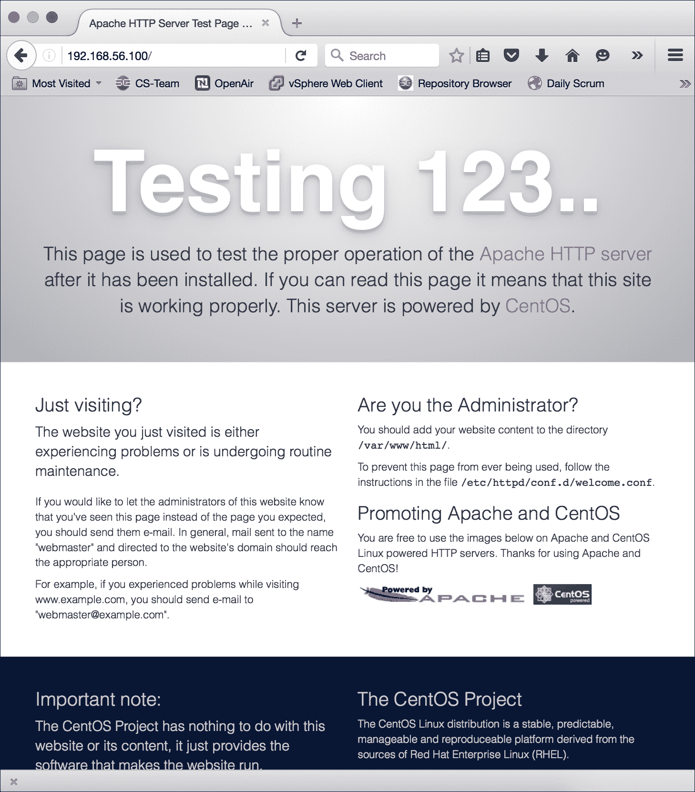
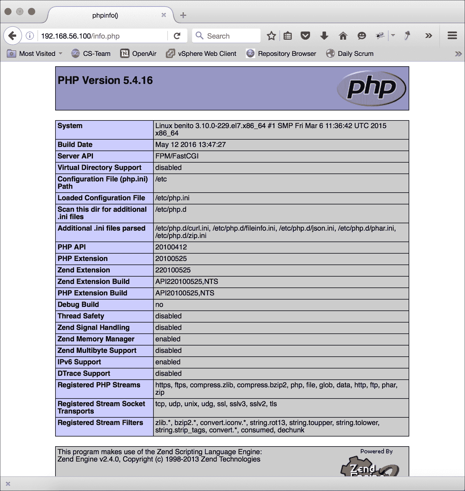

# 第十章：管理 Web 服务器

本章包含以下食谱：

+   安装 Apache HTTP 服务器和 PHP

+   配置基于名称的虚拟主机

+   配置 Apache 通过 HTTPS 提供页面

+   启用重写并执行 URL 重写

+   安装 NGINX 作为负载均衡器

# 介绍

本章包含了如何使用 Apache HTTP 服务器来托管网站的食谱。首先，您将学习如何安装服务器以及 PHP，这是一个非常常见的服务器端脚本引擎，用于生成动态的 Web 内容。接下来，您将了解如何通过基于名称的虚拟主机在同一个服务器实例上托管多个网站，如何加密连接并通过 HTTPS 提供内容，以及如何动态重写传入的 URL。最后，我们将介绍 NGINX 及其作为反向代理的使用，能够减少服务器负载，同时加速用户访问我们的网站。

# 安装 Apache HTTP 服务器和 PHP

你可能听过 LAMP 这个缩写，它代表 Linux、Apache、MySQL 和 PHP。它指的是提供网站和 Web 应用程序的流行技术组合。本食谱将教你如何安装 Apache HTTP 服务器（简称 Apache）并配置它与 PHP 一起工作，以提供动态的 Web 内容。

Apache 最早在二十多年前发布，是最早的 Web 服务器之一，并且一直是最受欢迎的服务器之一。它在 LAMP 堆栈中的任务是通过响应用户对 Web 资源的请求与用户互动。它的一个卖点可能就是它的设计，允许通过模块扩展其功能。有许多模块，例如 `mod_ssl`，它为 Apache 添加了 HTTPS 支持，以及 `mod_rewrite`，它允许您动态修改请求的 URL。

PHP 是一种用于创建动态 Web 内容的脚本语言。它在后台工作，脚本的输出通常由 Apache 提供，以响应请求。PHP 通常作为模块（`mod_php`）安装，将语言的解释器嵌入到 Apache 的处理过程中，但现在，运行 PHP 作为独立进程更受欢迎。这就是我们在这个食谱中采用的方法。

## 准备工作

这个食谱要求使用具有有效网络连接的 CentOS 系统。假设系统已配置为 IP 地址 `192.168.56.100`。还需要管理员权限，可以通过登录 `root` 账户或使用 `sudo` 来获得权限。

请注意，官方 CentOS 仓库安装的是 PHP 5.4。如果您想安装更新的版本，Remi 仓库提供了 PHP 5.5、5.6 和 7.0。要安装 5.x 版本之一，请打开 `/etc/yum.repos.d/remi.repo` 文件，找到 `[remi-php55]` 或 `[remi-php56]` 部分中的 `enabled` 选项，并将其值设置为 `1`。对于 7.0 版本，请更新 `/etc/yum.repos.d/remi-php70.repo` 文件中的 `enabled` 选项。

### 注意

PHP 6 发生了什么事？*这是一个很长的故事……*。开发 PHP 的志愿者团队曾致力于第 6 版的开发，但该项目遇到了许多困难，最终被搁置。为了避免与关于 PHP 6 的博客文章产生混淆，决定将其版本号提升到 7。简而言之，PHP 6 确实存在过，但从未达到正式发布状态，大多数为 6 版规划的酷炫功能最终被包含在 PHP 5.3、5.4 和 7.0 中。

## 如何操作...

按照以下步骤安装 Apache HTTP 服务器和 PHP：

1.  安装 `httpd` 和 `php-fpm` 包：

    ```
    yum install httpd php-fpm

    ```

1.  使用文本编辑器打开 Apache 的配置文件：

    ```
    vi /etc/httpd/conf/httpd.conf

    ```

1.  找到 `ServerName` 选项。去掉行首的 `#` 以取消注释，并将该选项的值更改为反映服务器的主机名或 IP 地址：

    ```
    ServerName 192.168.56.100:80

    ```

1.  找到 `DirectoryIndex` 选项，并将 `index.php` 添加到列表中：

    ```
     <IfModule dir_module>
              DirectoryIndex index.html index.php
           </IfModule> 

    ```

1.  在文件末尾添加以下配置：

    ```
     <IfModule proxy_fcgi_module>
              ProxyPassMatch ^/(.*\.php)$  
              fcgi://127.0.0.1:9000/var/www/html/$1
           </IfModule> 

    ```

1.  保存您的配置更改并关闭文件。

1.  验证 `mod_proxy`（列为 `proxy_module`）和 `mod_proxy_fcgi`（列为 `proxy_fcgi_module`）扩展模块是否已启用：

    ```
    httpd -M | grep proxy

    ```

1.  输出中应该出现这两个模块。

1.  启动 Apache 和 PHP 的 FPM 服务，并启用它们在系统重启时自动启动：

    ```
    systemctl start httpd.service php-fpm.service
    systemctl enable httpd.service php-fpm.service

    ```

1.  打开系统防火墙的 `80` 端口，以允许 HTTP 请求通过：

    ```
    firewall-cmd --zone=public --permanent --add-service=http
    firewall-cmd --reload

    ```

## 它是如何工作的...

有多种方式可以将 PHP 与 Apache 的 HTTP 服务器集成以生成动态网页内容。历史上，使用 Apache 的 `mod_php` 模块是常见的做法，但现在推荐的方法是将 PHP 作为独立进程运行，Web 服务器通过 FastCGI 协议与其通信。因此，我们安装了 Apache HTTP 服务器的 `httpd` 包和 PHP 解释器及其进程管理器的 `php-fpm` 包：

```
yum install httpd php-fpm

```

PHP FastCGI 进程管理器（FPM）从 5.3 版本起包含在核心 PHP 分发包中。将 PHP 与 Apache 分离有助于构建更具可扩展性的架构，使用持久的 PHP 进程可以减少 CPU 的负担，因为每个请求不需要重新启动新的解释器。

Apache 的主配置文件是 `/etc/httpd/conf/httpd.conf`，我们在其中更新了 `ServerName` 选项以反映服务器的主机名或 IP 地址。虽然这一步不是严格必要的，但如果不设置该选项，服务器将会在日志文件中写入警告消息。此外，服务器能够识别自身是有益的：

```
ServerName 192.168.56.100:80

```

接下来，我们通过将 `index.php` 添加到 `DirectoryIndex` 选项的值列表中进行了更新。当用户请求一个解析为目录的资源时，服务器会在该目录中查找与 `DirectoryIndex` 列表中的名称匹配的文件。如果找到，Apache 将返回该文件以满足请求。这种行为使得访客可以通过类似 `www.example.com` 而不是 `www.example.com/index.html` 的 URL 访问网站的首页：

```
DirectoryIndex index.html index.php

```

文件列出的顺序是有意义的。例如，如果目录中同时存在`index.html`和`index.php`，则返回`index.html`，因为它在选项列表中排在`index.php`之前。

然后，我们导航到文件的末尾添加了以下代理配置。如果`ProxyPassMatch`的正则表达式匹配到传入的请求，那么服务器将获取指定的 URL 并返回该内容：

```
 <IfModule proxy_fcgi_module>
      ProxyPassMatch ^/(.*\.php)$ fcgi://127.0.0.1:9000/var/www/html/$1
    </IfModule> 

```

正则表达式是使用一种特殊的符号书写的，描述了如何匹配文本。大多数字符是按字面意思匹配的，但有些字符具有特殊的意义：

+   `.`：这匹配任何字符。模式`bu.`匹配文本`bud`、`bug`、`bun`、`bus`等。

+   `+`：这表示前面的元素可以匹配一次或多次。模式`fe+t`可以匹配`fet`、`feet`、`feeet`等，但不能匹配`ft`。

+   `*`：这表示前面的元素可以匹配零次或多次。模式`fe*t`可以匹配`ft`、`fet`、`feet`、`feeet`等。

+   `?`：这表示前面的元素可以选择性地匹配一次。模式`colou?r`匹配`color`和`colour`。

+   `^`：这将匹配文本行的开头。模式`^abc`仅在`abc`出现在文本的开头时才匹配`abc`（`^`在`[ ]`中使用时具有特殊含义）。

+   `$`：这将匹配文本行的结尾。模式`xyz$`仅在`xyz`出现在行末时才匹配`xyz`。

+   `[ ]`：这表示匹配括号内的任意字符。模式`co[lr]d`匹配`cold`和`cord`。当`[ ]`中的第一个字符是`^`时，列表会被取反；`co[^lr]d`匹配`coed`，但不匹配`cold`或`cord`。

+   `( )`：这将元素分组并捕获匹配项。模式`jump(ed)?`可以匹配`jump`和`jumped`。

如果你希望匹配这些特殊字符的字面意义，则应在前面加上反斜杠进行转义，例如`foo\.html`将匹配`foo.html`，而不是`fooahtml`、`foobhtml`等。

特殊的数字变量如`$1`和`$2`包含任何捕获到的匹配项的值。它们被赋值的顺序与括号捕获匹配项的顺序相同，因此`(foo)\.(html)`将`$1`设置为`foo`，`$2`设置为`html`。

有了这些理解，你现在应该能够解读正则表达式`^/(.*\.php)$`，它捕获以`.php`扩展名结尾的请求资源的路径和文件名。`$1`变量表示捕获到的路径，因此请求`/about/staff.php`将被代理为`fcgi://127.0.0.1:9000/var/www/html/about /staff.php`，其中 PHP 的 Fast-CGI 监听器正在本地接口的`9000`端口上监听。

Apache 的功能通常通过模块扩展，作为一种安全措施，最好将特定模块的配置选项包装在 `IfModule` 块中。此类块的开头包含模块的名称，并出现在尖括号 `< >` 中。块的结束则是 `</IfModule>`，就像关闭一个 HTML 元素一样。

服务器提供文件的目录是通过选项 `DocumentRoot` 设置的。默认值为 `/var/www/html`，因此我们放置在那里或其子目录中的任何文件都可以访问。例如，为了说明这一点，发行版包含一个示例的 `index.html` 文件，我们可以用它来验证服务器是否正常运行；将 `/usr/share/httpd/noindex/index.html` 文件复制到 `/var/www/html` 中：

```
cp /usr/share/httpd/noindex/index.html /var/www/html

```

然后，打开浏览器并访问系统的域名或 IP 地址。你应该看到欢迎页面：



你可以将 Apache 的默认首页复制到 Web 目录中，以测试服务器是否已启动并正常运行

对于 PHP，你需要将 PHP 文件放置在 Fast-CGI 服务可以读取的位置。代理 URL 是 `fcgi://127.0.0.1:9000/var/www/html/$1`，因此我们也可以将 PHP 文件放置在 `/var/www/html` 中。

创建 `info.php` 文件，并添加以下内容：

```
 <?php
    phpinfo(); 

```

现在保存文件，然后在浏览器中访问该页面。你应该看到 PHP 的 `phpinfo()` 函数的输出，提供有关 PHP 配置的详细信息，以及哪些模块可用：



PHP 报告有关其环境和请求的信息

### 注意

出于安全考虑，建议在验证一切正常后删除你复制的欢迎 `index.html` 文件以及 `info.php` 脚本。它们提供的信息可能会让恶意用户比你希望的更多地了解你的 Web 服务器配置。

## 另请参见

请参考以下资源以获取更多关于 Apache 和 PHP 的工作信息：

+   Apache HTTP 服务器项目 ([`httpd.apache.org/`](http://httpd.apache.org/))

+   PHP 首页 ([`php.net/`](http://php.net/))

+   Apache `mod_proxy_fcgi` 文档 ([`httpd.apache.org/docs/current/mod/mod_proxy_fcgi.html`](http://httpd.apache.org/docs/current/mod/mod_proxy_fcgi.html))

+   Httpd Wiki: PHP-FPM ([`wiki.apache.org/httpd/PHP-FPM`](http://wiki.apache.org/httpd/PHP-FPM))

+   RFC-2616: HTTP/1.1 ([`www.rfc-base.org/txt/rfc-2616.txt`](http://www.rfc-base.org/txt/rfc-2616.txt))

# 配置基于名称的虚拟主机

正如你在我们讨论 DNS 时回忆起的内容，在第八章中，*管理域名和 DNS* 用户的浏览器需要通过 DNS 查询将网站的主机名转换为其 IP 地址，才能连接并检索所需的网页内容。你也许还记得，这并不需要一一对应映射——多个站点可以解析到相同的 IP 地址。Apache 足够灵活，允许同一服务器通过名为基于名称的虚拟主机的配置来提供多个站点。

本教程将教你如何设置基于名称的虚拟主机。每个站点都有自己的配置（通常会保存在单独的配置文件中以便于管理）。根据请求中出现的站点名称，Apache 然后从可用的配置中选择，以正确地提供所需的站点。

## 准备工作

本教程要求你使用已连接网络的 CentOS 系统，并且安装了运行如前一教程所述的 Apache。因为我们将通过域名而不是 IP 地址连接到服务器，所以你需要通过更新 DNS 记录或首先向 `/etc/hosts` 文件添加条目，确保域名解析到正确的地址。还需要管理员权限，可以通过登录 `root` 账户或使用 `sudo` 来获取。

## 如何操作…

按照以下步骤设置基于名称的虚拟主机：

1.  使用文本编辑器打开 Apache 的配置文件：

    ```
    vi /etc/httpd/conf/httpd.conf

    ```

1.  在文件底部添加以下 `Include` 选项：

    ```
    Include sites/*.conf

    ```

1.  保存更新后的配置并关闭文件。

1.  创建配置中引用的 `sites` 目录：

    ```
    mkdir /etc/httpd/sites

    ```

1.  在新 `sites` 目录中为第一个站点创建一个虚拟主机配置文件：

    ```
    vi /etc/httpd/sites/www.example.conf

    ```

1.  向站点的配置文件中添加以下代码：

    ```
     <VirtualHost *:80>
             ServerName www.example.com
             DocumentRoot "/var/www/example.com/www/html"

             <IfModule proxy_fcgi_module>
                ProxyPassMatch ^/(.*\.php)$ 
                fcgi://127.0.0.1:9000/var/www/example.com/www/html/$1
             </IfModule>
           </VirtualHost> 

    ```

1.  保存更改并关闭文件。

1.  创建配置选项中引用的站点文档根目录：

    ```
    mkdir -p /var/www/example.com/www/html

    ```

1.  对于每个额外要托管的站点，重复步骤 4-8，使用主机或域名为每个站点创建唯一的目录路径。

1.  重新启动 HTTP 服务器以使配置更改生效：

    ```
    systemctl restart httpd.service

    ```

## 它是如何工作的…

配置 Apache 以服务多个域名就是为每个站点创建一个 `VirtualHost` 定义。本教程将这些定义组织到 `/etc/httpd/sites` 目录下的各自文件中，并通过 `Include` 指令在主 `httpd.conf` 配置文件中引用它们：

```
Include sites/*.conf

```

如何组织你的网站由你决定。本教程使用了一种方案，其中每个网站都从基于域名的路径提供，路径以`/var/www`为根。路径`/var/www/example.com/www/html`包含`www.example.com`网站的文件。`web.example.com`网站的文件将放在`/var/www/example.com/web/html`中。`html`目录仅仅是网站的可通过 Web 访问的根目录。通过包含它而不是直接从`example.com/www`提供文件，我们可以将任何不打算直接访问的支持文件放在根目录之外（例如，包含 PHP 网站配置选项的脚本），同时仍然将它们与网站的其他文件保持组织性。

### 注意

将公开可访问的目录根目录命名为`html`是一种约定，但我认为它已经过时，因为不仅仅是 HTML 文件通常被提供。我通常将自己的根目录命名为`public`或`public_files`，并在配置文件中相应更新它们的引用。

每个虚拟主机的定义都包含在`VirtualHost`块内。开头提供了服务器监听的接口的 IP 地址，后面是端口号。`*`表示该定义适用于系统的所有接口，而`80`是 HTTP 流量的默认端口：

```
 <VirtualHost *:80> 

```

在定义中没有明确出现的选项假定具有与主配置中相同的设置，因此至少需要定义`ServerName`和`DocumentRoot`选项，以使定义具有唯一性。如果你使用 PHP，你还需要提供`ProxyPassMatch`选项，以便将请求映射到正确的 PHP 文件：

```
 <VirtualHost *:80>
      ServerName www.example.com
      DocumentRoot "/var/www/example.com/www/html"
      <IfModule proxy_fcgi_module>
        ProxyPassMatch ^/(.*\.php)$ fcgi://127.0.0.1:9000/var/www/  
        example.com/www/html/$1
      </IfModule>
    </VirtualHost> 

```

### 注意

虚拟主机定义加载的顺序是有一定重要性的；第一个加载的定义作为默认设置，将处理任何不匹配任何虚拟主机定义的请求。可以通过为配置文件添加数字前缀，例如`10-www.example.conf`，来帮助你控制加载顺序。

每个请求都被记录到`/var/log/httpd/access_log`，任何错误都会被记录到`error_log`。当然，如果你只提供一个站点，这样做是没问题的。但当提供多个站点时，你可能会发现将日志条目路由到不同站点的不同文件会更有帮助。`CustomLog`选项指定了一个文件，访问和一般日志消息将写入该文件，并且条目的格式。`ErrorLog`指定了写入错误消息的文件。这两个选项都可以出现在虚拟主机的配置中：

```
    <VirtualHost *:80>
      ServerName www.example.com
      DocumentRoot "/var/www/example.com/www/html"
      CustomLog "/var/log/httpd/example.com/www/access_log" "%h %u 
      %t "%r" %>s %b"
      ErrorLog  "/var/log/httpd/example.com/www/error_log"
      <IfModule proxy_fcgi_module>
        ProxyPassMatch ^/(.*\.php)$ fcgi://127.0.0.1:9000/var/www/
        example.com/www/html/$1
      </IfModule>
    </VirtualHost>

```

`CustomLog`的第二个参数可以是格式字符串本身或表示格式字符串的别名。格式字符串仅仅定义了日志消息中包含的详细信息。

有许多格式说明符可以使用，这些都已在 Apache HTTPd 服务器的文档中记录。以下是一些常见的格式说明符，你可以在[`httpd.apache.org/docs/current/mod/mod_log_config.html#formats`](http://httpd.apache.org/docs/current/mod/mod_log_config.html#formats)找到完整的列表：

+   `%b`：这是返回给客户端的响应大小（以字节为单位）

+   `%D`：这是处理请求所花费的时间，单位为毫秒（`%T`表示所花费的时间，单位为秒）

+   `%h`：这是发起请求的系统的 IP 地址或主机名

+   `%H`：这是发起请求时使用的协议

+   `%m`：这是发起请求时使用的方法

+   `%q`：这是请求的 URI 中的查询字符串部分

+   `%r`：这是请求的第一行

+   `%>s`：这是请求的最终状态码（`%s`表示重定向请求的初始状态）

+   `%t`：这是接收到请求的时间

+   `%u`：这是接收到请求时经过身份验证的用户名

+   `%v`：这是处理请求的服务器名称（`ServerName`）

`LogFormat`选项指定了一个带别名的格式字符串。例如，`httpd.conf`文件使用`LogFormat`定义了名为`common`和`combined`的字符串，这些字符串可以在其他地方使用。定义你自己的虚拟主机日志别名，并在各个配置文件中使用该别名，而不是将复杂的格式字符串分散在各处，是一个不错的主意。在`httpd.conf`中，只需在`common`和`combined`条目的相同区域添加自定义的`LogFormat`条目：

```
LogFormat "%v %h %u %t "%r" %>s %b" vhostcommon

```

然后，你可以在你的网站配置文件中引用该别名：

```
CustomLog "/var/www/example.com/www/logs/access_log" vhostcommon

```

在做出更改后，重新启动 Apache 以使配置生效。

无论日志的目标位置是什么，请确保安全上下文的所有权/权限允许 Apache 能够写入日志文件。如果日志位于`/var/log/httpd`下，那么创建必要的子目录应该就足够了。服务器将在启动时自动创建日志文件：

```
mkidr -p /var/log/httpd/example.com/www

```

然而，如果你希望将日志保存在另一个目录中，例如`/var/www/example.com/www/logs`，可能会遇到服务器无法写入日志的情况。无论文件系统权限看起来多么正常，SELinux 都会启用。为了解决这个问题，首先使用`ls -Z`验证安全上下文：

```
ls -Z /var/www/example.com/www | grep logs
drwxr-xr-x. apache apache unconfined_u:object_r:httpd_sys_content_  
t:s0 logs

```

在这种情况下，`logs`目录属于 Apache 运行的`apache`用户，并且目录的权限应该允许服务器创建日志文件。然而，我们也可以看到该目录继承了标识为 web 内容的标签，标签为`httpd_sys_content_t`。为了解决问题，我们需要使用`chcon`命令重新标记该目录以用于日志记录：

```
chcon -Rv --type=httpd_log_t /var/www/example.com/www/logs

```

## 另请参见

有关虚拟主机的更多信息，请参考以下资源：

+   Apache 虚拟主机文档 ([`httpd.apache.org/docs/current/vhosts/`](http://httpd.apache.org/docs/current/vhosts/))

+   Apache `mod_log_config`文档 ([`httpd.apache.org/docs/current/mod/mod_log_config.html`](http://httpd.apache.org/docs/current/mod/mod_log_config.html))

+   虚拟主机示例 ([`httpd.apache.org/docs/current/vhosts/examples.html`](http://httpd.apache.org/docs/current/vhosts/examples.html))

+   CentOS Wiki：SELinux 使用指南 ([`wiki.centos.org/HowTos/SELinux`](https://wiki.centos.org/HowTos/SELinux))

# 配置 Apache 以通过 HTTPS 提供页面

HTTP 流量是以明文形式在网络上传输的。在不受信的环境中，恶意用户可以监视并捕获流量，窃听你正在访问的网站和阅读的内容。如果受害者只是阅读每日新闻或观看 YouTube 上的猫咪视频，窃听可能并不有趣，但如果发生未加密的电子商务交易，用户的信用卡号、邮寄地址和其他细节可能会被窃取。为了支持加密流量，Apache 支持 HTTPS。这个配方将教你如何配置 HTTPS 支持，并保护用户的流量免受窥探，无论内容多么无害。

## 准备工作

本配方要求使用带有有效网络连接的 CentOS 系统。假设系统已配置 IP 地址`192.168.56.100`，并且按前面的配方运行 Apache。还需要管理员权限，可以通过`root`账户登录或使用`sudo`。

## 如何操作...

按照以下步骤通过 HTTPS 提供页面：

1.  使用`openssl`生成新的密钥文件和安全证书：

    ```
    openssl req -newkey rsa:2048 -nodes \
     -keyout /etc/pki/tls/private/www.example.key \
     -x509 -days 730 -subj "/CN=www.example.com" -text \
     -out /etc/pki/tls/certs/www.example.pem

    ```

1.  安装服务器的 SSL 模块：

    ```
    yum install mod_ssl

    ```

1.  使用文本编辑器打开`/etc/httpd/conf.d/ssl.conf`文件：

    ```
    vi /etc/httpd/conf.d/ssl.conf

    ```

1.  查找`SSLCertificateFile`选项，并更新其值以指向自签名证书文件：

    ```
    SSLCertificateFile /etc/pki/tls/certs/www.example.pem

    ```

1.  查找`SSLCertificateKeyFile`选项，并将其更新为指向加密密钥：

    ```
    SSLCertificateKeyFile /etc/pki/tls/private/www.example.key

    ```

1.  保存更改并关闭文件。

1.  重启服务器以使更新的配置生效：

    ```
    systemctl restart httpd

    ```

1.  在防火墙中打开端口`443`以允许 HTTPS 流量：

    ```
    firewall-cmd --zone=public --permanent --add-service=https
    firewall-cmd --reload

    ```

## 它是如何工作的...

Apache HTTP 服务器带有一个默认的 SSL/TLS 配置，包含在`/etc/httpd/conf.d/ssl.conf`中的一个通用虚拟主机定义内。大部分配置已经为我们完成，剩下的就是安装 SSL 模块，生成新的密钥和证书，并更新配置以指向我们的文件。

首先，我们生成了一个新的加密密钥和签名证书。如果你已经阅读了第九章中的*配置 Postfix 以使用 TLS*配方，那么你已经知道密钥用于安全通信，证书确认密钥的所有权：

```
openssl req -newkey rsa:2048 -nodes \
 -keyout /etc/pki/tls/private/www.example.key \
 -x509 -days 730 -subj "/CN=www.example.com" -text \
 -out /etc/pki/tls/certs/www.example.pem

```

这个方案生成一个自签名证书，足够个人使用和内网站点使用。`req`选项用于创建新证书，`-newkey`生成新的私钥。该密钥是 2048 位的 RSA 密钥，并且本身不加密（`-nodes`），所以我们不需要每次启动 Web 服务器时提供解密密钥的密码。证书是一个 X.509 证书（`-x509`），有效期为 3 年（`-days 730`）。证书的`CN`字段必须与它将用于的站点的域名匹配。

在配置文件中，`SSLCertificateFile`选项指定包含证书文件的文件，而密钥则通过`SSLCertificateKeyFile`来标识：

```
SSLCertificateFile /etc/pki/tls/certs/www.example.pem
SSLCertificateKeyFile /etc/pki/tls/private/www.example.key

```

服务器通过查看传入请求中的站点名称来确定使用哪个虚拟主机配置来处理请求。然而，原始的 HTTPS 实现加密了请求的全部内容，包括站点的主机名，这引发了一个“先有鸡还是先有蛋”的问题。服务器需要知道要提供哪个证书，但如果不读取请求，它就无法知道，而客户端希望在发送请求之前就得到与站点域名匹配的证书。在基于名称的虚拟主机上使用 TLS 几乎是不可能的，任何加密站点都需要独立的 IP 地址。

RFC-3546（传输层安全扩展）修改了协议，使主机名可以不加密地发送。这使得服务器可以选择正确的证书来满足客户端的需求，并为使用 TLS 与虚拟主机配合使用打开了大门。主流浏览器大约花了十年时间才支持这一变化，但现在我们几乎可以确认支持了。从 Internet Explorer 7 版本开始，Mozilla Firefox 2 版本开始，Google Chrome 6 版本开始，已经支持所谓的服务器名称指示（SNI）。

为了通过 HTTPS 提供虚拟主机服务，每个站点都需要自己的证书和密钥。然后，将`SSLEngine`、`SSLCertificateFile`和`SSLCertificateKeyFile`选项添加到主机的配置中。配置中还需要将端口号更改为`443`，这是 HTTPS 流量的默认端口：

```
 <VirtualHost *:443>
      ServerName www.example.com
      DocumentRoot "/var/www/example.com/www/html"
      CustomLog "/var/log/httpd/example.com/www/access_log" common
      ErrorLog  "/var/log/httpd/example.com/www/error_log"
      SSLEngine on
      SSLCertificateFile /etc/pki/tls/certs/www.example.pem
      SSLCertificateKeyFile /etc/pki/tls/private/www.example.key
      <IfModule proxy_fcgi_module>
        ProxyPassMatch ^/(.*\.php)$ fcgi://127.0.0.1:9000/var/www/
        example.com/www/html/$1
      </IfModule>
    </VirtualHost> 

```

尽管自签名证书对于个人使用和私有网络/内网站点来说是足够的，但对于可公开访问的大规模站点，你很可能希望使用一个受信任的证书。然而，根据证书授权机构（CA）和你的请求的具体情况，购买受信任证书可能会很昂贵。如果你只需要一个基本的受信任证书，那么你可能想要了解一下 Let's Encrypt 是否能满足你的需求。Let's Encrypt 是一个项目，提供一个自动化的自助服务模型，可以免费生成受信任的证书。

要使用 *Let's Encrypt*，您需要安装 EPEL 仓库中提供的 `certbot` 包（如果您还没有启用该仓库，请参阅第四章中的 *注册 EPEL 和 Remi 仓库* 章节）。然后运行 `certbot certonly` 命令并按照提示请求您的证书。完整的操作指南可以在 Let's Encrypt/Certbot 用户指南中找到：[`letsencrypt.readthedocs.io/en/latest/using.html`](http://letsencrypt.readthedocs.io/en/latest/using.html)。

### 注意

使用 Let's Encrypt 时有一些注意事项。首先，证书的有效期只有三个月；您需要每 90 天请求一次新证书。它也不会为 IP 地址生成证书。此外，它有请求频率限制，虽然这对于防止滥用是必要的，但对于使用动态 DNS 服务（如 DynDNS 或 NoIP）使站点可访问的用户来说，会造成一些问题。要使 Let's Encrypt 成为您的可行选择，您需要一个合适的域名和对 web 系统的访问权限以自动化证书更新。如果您正在运行家庭服务器或使用共享主机提供商，那么 Let's Encrypt 可能不适合您。

## 另见

请参考以下资源，了解如何使用 HTTPS：

+   SSL/TLS 强加密：操作指南 ([`httpd.apache.org/docs/2.4/ssl/ssl_howto.html`](http://httpd.apache.org/docs/2.4/ssl/ssl_howto.html))

+   如何在 CentOS 7 上为 Apache 创建 SSL 证书 ([`www.digitalocean.com/community/tutorials/how-to-create-an-ssl-certificate-on-apache-for-centos-7`](http://www.digitalocean.com/community/tutorials/how-to-create-an-ssl-certificate-on-apache-for-centos-7))

+   如何在 CentOS 7 上使用 Let's Encrypt 保护 Apache ([`www.digitalocean.com/community/tutorials/how-to-secure-apache-with-let-s-encrypt-on-centos-7`](https://www.digitalocean.com/community/tutorials/how-to-secure-apache-with-let-s-encrypt-on-centos-7))

# 启用覆盖并执行 URL 重写

本教程教您如何使用 `mod_rewrite`。我之前提到过 `mod_rewrite`；它是 Apache 的一个模块，允许我们修改 URL 并将其解析为不同的资源。人们有很多理由需要这样做。例如，假设您移动了一些文件，且它们的 URL 已发生变化，但您不希望其他地方的链接指向旧位置导致失效。您可以编写一个重写规则，匹配旧的位置并实时更新 URL，从而成功响应请求。另一个例子是 SEO；您可能有一些长且不友好的标准 URL，但希望用更短、更易记的 URL 替代。友好的 URL 可以在后台映射到标准 URL。

## 准备工作

本食谱要求使用有网络连接的 CentOS 系统。假设系统配置了 IP 地址`192.168.56.100`并且正在运行先前食谱中描述的 Apache。还需要管理员权限，可以通过使用`root`账户登录或使用`sudo`来获得。

## 如何操作...

按照以下步骤进行 URL 重写：

1.  使用文本编辑器打开`/etc/httpd/conf/httpd.conf`文件：

    ```
    vi /etc/httpd/conf/httpd.conf

    ```

1.  定位到定义文档根目录各种选项的`Directory`部分。找到其`AllowOverrides`选项，并将值从`None`更新为`All`：

    ```
     <Directory "/var/www/html">
           ...
               AllowOverrides All
           ...
           </Directory> 

    ```

1.  保存更改并关闭文件。

1.  重启 Apache 以使配置更新生效：

    ```
    systemctl restart httpd

    ```

1.  验证`mod_rewrite`模块（标识为`rewrite_module`）是否可用：

    ```
    httpd -M | grep rewrite

    ```

1.  在你的文档根目录下创建一个名为`.htaccess`的文件：

    ```
     vi /var/www/html/.htaccess 

    ```

1.  在`.htaccess`文件中添加`RewriteEngine`以启用 URL 重写引擎：

    ```
    RewriteEngine on

    ```

1.  添加描述所需重定向的`Rewrite`规则。例如，以下规则将所有没有文件扩展名的请求重定向到给定名称的 PHP 文件：

    ```
    RewriteRule ^/?([A-Z]+)$ $1.php [NC,L]

    ```

1.  保存并关闭文件。

## 它是如何工作的...

`.htaccess`文件是位于站点目录结构中的补充配置文件。当配置好后，Apache 会在满足请求时搜索`.htaccess`文件并应用其中的选项设置。当然，每次请求时都要搜索并加载配置值会对性能产生轻微影响，但这种权衡增加了灵活性。例如，服务器不需要重启即可使`.htaccess`文件中的配置更改生效。在共享主机环境中，精明的用户可以在不要求服务器管理员协助或访问`/etc/httpd`中的主配置文件（这些文件可能包含敏感配置值）的情况下，为自己的网站调整服务器行为。即使是依赖特定服务器功能的 Web 应用程序，也可能包含一个`.htaccess`文件，内含必要的配置以简化其部署。

默认情况下，Apache 不允许使用`.htaccess`文件来覆盖服务器的配置。要启用它，我们需要在适当的上下文中更新`AllowOverrides`选项，然后重启服务器。本食谱在适用于 Web 根目录的部分进行了更改：

```
 <Directory "/var/www/html">
    ...
        AllowOverrides All
    ...
    </Directory> 

```

### 注意

如果你使用虚拟主机，确保将`AllowOverrides`选项放入你站点的配置文件中。

`None`的值会导致服务器忽略任何`.htaccess`文件。除此之外，并非所有选项都允许出现在`.htaccess`文件中。文件中最常见的选项涉及重写请求或目录特定访问。可以出现的选项按不同类别分组，我们可以指定允许覆盖的选项类别。可能的组名如下：

+   `AuthConfig`：此选项允许覆盖授权选项（`AuthUserFile`，`AuthDBMUserFile` 等等）。

+   `FileInfo`：此选项允许覆盖与请求相关的选项（`ErrorDocument`，`Redirect`，`RewriteRule` 等等）。

+   `Indexes`：这些选项允许覆盖与索引相关的选项（`DirectoryIndex`，`IndexOptions` 等等）。

+   `Limit`：此选项允许覆盖访问选项（`Allow`，`Deny` 和 `Order`）。

+   `All`：此选项允许覆盖所有选项组。

由于 `AllowOverrides` 应用于目录级别，因此可以允许或拒绝在不同目录中使用不同的覆盖。例如，可以在整个网站上禁用覆盖，但可以在 `private` 目录中允许覆盖授权选项，从而指定特定的授权数据库：

```
 <Directory "/var/www/html">
        AllowOverrides None
    </Directory>
    <Directory "/var/www/html/priv">
        AllowOverrides AuthConfig
    </Directory> 

```

### 注意

即使你对 Apache 有完全控制权，并且出于性能原因希望将所有内容放置在主 `httpd.conf` 文件中，允许通过 `FileInfo` 覆盖重写选项也能让你在不重启服务器的情况下设计和排查规则。然后，当你确定规则正确无误时，可以将其迁移到主配置文件中，并关闭覆盖选项。

`rewrite_module` 将自身注入到服务器的请求处理工作流中，并根据我们在规则集中的提供内容，实时更改请求的 URL。尽管该模块默认已安装，但我们仍需显式启用 URL 重写，使用 `RewriteEngine on`。除此之外，两个最重要的重写选项是 `RewriteRule` 和 `RewriteCond`。

`RewriteRule` 选项指定一个正则表达式，用于与 URL 进行比较。如果匹配，则进行给定的替代操作。可以在替代操作中使用位置变量，如 `"$1"`，来引用捕获的模式匹配。在我们的例子中，规则匹配路径（如 `/about` 或 `/contactus`），并将其重写为指向同名的 PHP 脚本（如 `about.php` 或 `contact.php`），从而隐藏我们正在使用 PHP 的事实。

```
 RewriteRule ^/?([A-Z]+)$ $1.php [NC,L] 

```

我们还可以提供一些标志来影响请求的返回方式。例如，`NC` 标志会执行不区分大小写的模式匹配。`L` 标志会停止引擎并返回 URL，而不再处理其他规则。常见的还有 `R`，它强制进行重定向（通常会给出 HTTP 状态码，例如 `R=301`），以及 `QSA`，它将原始 URL 的查询字符串附加到新 URL 上。

`RewriteCond` 选项提供了一个条件，必须满足该条件才能评估 `RewriteRule`。该条件是正则表达式匹配、变量和测试操作符的结合。可以使用一些特殊变量来引用 URL 的某些部分，例如主机名（`%{HTTP_HOST}`）、请求的文件（`%{REQUEST_FILENAME}`）以及查询字符串（`%{QUERY_STRING}`），或者有关环境/请求的详细信息，例如 Cookie（`%{HTTP_COOKIE}`）和用户代理字符串（`%{HTTP_USER_AGENT}`）。`-d` 操作符用于测试路径是否是目录，`-f` 用于测试路径是否是文件，`!` 用于取反匹配。`RewriteCond` 还可以接受一些标志，例如 `NC` 标志，它让比较不区分大小写，以及 `OR` 标志，用于将多个选项通过 *或* 关系连接（多个选项默认被视为 *与*）。

一个非常常见的重写示例，使用了 `RewriteCond` 和 `RewriteRule`，当请求不匹配现有的文件或目录时，会将用户引导到一个主 `index.php` 文件。这在许多将所有请求通过中央控制点路由的 Web 应用程序中使用得非常多：

```
 RewriteCond %{REQUEST_FILENAME} !-f
    RewriteCond %{REQUEST_FILENAME} !-d
    RewriteRule ^(.*) index.php [L,QSA] 

```

第一个 `RewriteCond` 选项检查请求是否是现有文件，第二个检查请求是否是现有目录。如果请求既不是文件也不是目录，那么 `RewriteRule` 选项会将请求映射到 `index.php`。任何可能存在的查询字符串都会被包括在内，并且它被标记为最后的操作，因此不会再进行进一步的重写。

许多人开玩笑说 URL 重写是黑魔法。的确，`mod_rewrite` 功能强大，能够将请求转换得如此神奇，当你无法找到正确的写法时，它会让人感到沮丧。在这种情况下，你可能需要开启日志记录，以便深入了解引擎如何看待请求。要启用日志记录，可以使用 `RewriteLog` 选项指定日志文件，并使用 `RewriteLogLevel` 来指定日志的详细程度。通常，`RewriteLogLevel` 设置为 `5` 足够了。它们可以被添加到 `.htaccess` 文件中，待确认规则正确后再删除：

```
 RewriteLog /var/log/httpd/rewrite_log
    RewriteLogLevel 5 

```

## 参见

请参阅以下资源，以获取有关 URL 重写的更多信息：

+   Apache `mod_rewrite` 文档 ([`httpd.apache.org/docs/current/mod/mod_rewrite.html`](http://httpd.apache.org/docs/current/mod/mod_rewrite.html))

+   URL 重写指南 ([`httpd.apache.org/docs/2.0/misc/rewriteguide.html`](http://httpd.apache.org/docs/2.0/misc/rewriteguide.html))

+   面向恐惧者的 URL 重写 ([`24ways.org/2013/url-rewriting-for-the-fearful`](https://24ways.org/2013/url-rewriting-for-the-fearful))

# 安装 NGINX 作为负载均衡器

高流量网站可以分布到不同的服务器上，要么更好地分配工作负载，要么实现冗余。集群中的每台服务器都有自己的一份网站或 Web 应用文件，并能够满足用户的请求。诀窍在于按顺序将用户的请求路由到这些服务器之一。实现这一点的方法有很多种，但常见的一种是设置负载均衡器或反向代理服务器。

NGINX 在登场时间上略晚于 Apache；它大约十多年前为了处理高负载连接而特别编写，可以作为 web 服务器、代理、缓存和负载均衡器。在本例中，我们将看到如何将 NGINX 设置为负载均衡器，在客户端和一组 Apache 服务器之间代理请求。

## 准备工作

本例需要一个具有工作网络连接的 CentOS 系统。假设你已经配置了其他系统，使用 Apache 提供网站，如前面章节所述；我们将使用 IP 地址`192.168.56.20`和`192.168.56.30`来引用这些系统。NGINX 的包托管在 EPEL 仓库中；如果仓库尚未注册，请参考第四章中的*注册 EPEL 和 Remi 仓库*一节，*软件安装管理*。此外，还需要管理员权限，可以通过`root`账户登录或使用`sudo`。

## 如何操作...

按照以下步骤使用 NGINX 设置反向代理：

1.  从 EPEL 仓库安装`nginx`包：

    ```
    yum install nginx

    ```

1.  使用文本编辑器打开 NGINX 服务器的配置文件：

    ```
    vi /etc/nginx/nginx.conf

    ```

1.  在`http`块中，添加一个新的`upstream`块以标识集群中的服务器：

    ```
     upstream cluster {
             server 192.168.56.20;
             server 192.168.56.30;
           } 

    ```

1.  找到`location`块并添加一个引用`upstream`块的`proxy_pass`选项：

    ```
     location / {
               proxy_pass http://cluster;
           } 

    ```

1.  保存配置文件的更改并关闭文件。

1.  启动服务器并使其在系统重启时自动启动：

    ```
    systemctl start nginx.service
    systemctl enable nginx.service

    ```

1.  在系统的防火墙中打开端口`80`，允许 HTTP 请求通过：

    ```
    firewall-cmd --zone=public --permanent --add-service=http
    firewall-cmd --reload

    ```

## 工作原理...

一如既往，我们首先安装了程序包，这次是`nginx`。该包可以在 EPEL 仓库中找到。安装后，我们更新了它的配置，标识了集群中的服务器，并代理了请求。首先，我们添加了一个`upstream`块：

```
 upstream cluster {
      server 192.168.56.20;
      server 192.168.56.30;
    } 

```

`cluster`仅仅是我们为这一组服务器指定的名称，方便我们通过名称引用该组。如果你有多个集群在进行负载均衡，可以有多个`upstream`块。每个`server`条目中都包含了运行网站的系统的 IP 地址或主机名。

接着，我们找到了主`location`块，并添加了一个`proxy_pass`参数。`proxy_pass`将把传入的请求转发到集群中的一台系统，并返回响应以满足请求：

```
 location / {
        proxy_pass http://cluster;
    } 

```

NGINX 和托管 Web 服务器之间的通信是通过`http`协议进行的，因为在`proxy_pass`的值中指定了该协议。这是可以的，因为集群系统将会在负载均衡器后面的受信任网络中运行。如果你的网站需要通过 HTTPS 提供服务，那么需要 NGINX 处理 TLS 协商，因为它是客户端所见的公有服务器点；客户端对负载均衡器后面的内容一无所知。

要配置 NGINX 处理 HTTPS 请求，需在`server`块内更新`listen`选项以监听端口 443。然后添加包含`ssl_certificate`和`ssl_certificate_key`选项的条目，分别标识证书和密钥：

```
 server {
        # listen 80 default_server;
        # listen [::]:80 default_server;
        listen 443 ssl default_server;
        listen [::]:443 ssl default_server;

        ssl_certificate /etc/pki/tls/certs/www.example.pem;
        ssl_certificate_key /etc/pki/tls/private/www.example.key;
    ...
    } 

```

一旦完成更改并保存配置文件，请在防火墙中打开端口`443`并重启 NGINX：

```
firewall-cmd --zone=public --permanent --add-service=https
firewall-cmd --reload
systemctctl restart nginx.service

```

循环轮询是负载均衡的默认方法。这意味着第一个请求会被代理到集群中的第一台服务器，然后是第二台服务器，依此类推。当 NGINX 到达列表末尾时，它会从列表顶部重新开始，将下一个请求代理到第一台服务器。我们还可以使用其他策略，例如加权均衡。

要执行加权均衡，我们为任意服务器分配一个权重，它将在每次迭代中处理该数量的请求。在这里，第一台服务器将处理五个请求，之后 NGINX 会将请求代理到第二台服务器：

```
 upstream cluster {
      server 192.168.56.20 weight=5;
      server 192.168.56.30;
    } 

```

在使用负载均衡时，请记住，没有任何一台 Web 服务器能保证接收到用户发送的下一个请求。如果你在负载均衡一个使用会话的 Web 应用时，这可能会成为问题。你可能需要考虑将会话数据存储在一个每台 Web 服务器都能访问的中央系统上，可能是使用像 Redis 或 Memcache 这样的数据库。

### 注意

我建议避免使用任何依赖于会话持久性的负载均衡策略。可以参考[`www.chaosincomputing.com/2012/05/sticky-sessions-are-evil`](http://www.chaosincomputing.com/2012/05/sticky-sessions-are-evil)上的帖子，它提供了关于这些问题的良好概述。

## 另请参见

请参阅以下资源，获取更多关于 NGINX 和负载均衡的信息：

+   NGINX 官网 ([`www.nginx.com/`](https://www.nginx.com/))

+   如何在 CentOS 7 上安装 NGINX ([`www.digitalocean.com/community/tutorials/how-to-install-nginx-on-centos-7`](https://www.digitalocean.com/community/tutorials/how-to-install-nginx-on-centos-7))

+   配置 HTTPS 服务器 ([`nginx.org/en/docs/http/configuring_https_servers.html`](http://nginx.org/en/docs/http/configuring_https_servers.html))

+   使用 NGINX 作为负载均衡器 ([`nginx.org/en/docs/http/load_balancing.html`](http://nginx.org/en/docs/http/load_balancing.html))

+   如何将 PHP 会话存储在 Memcache 中 ([`www.scalescale.com/tips/nginx/store-php-sessions-memcached`](http://www.scalescale.com/tips/nginx/store-php-sessions-memcached))
