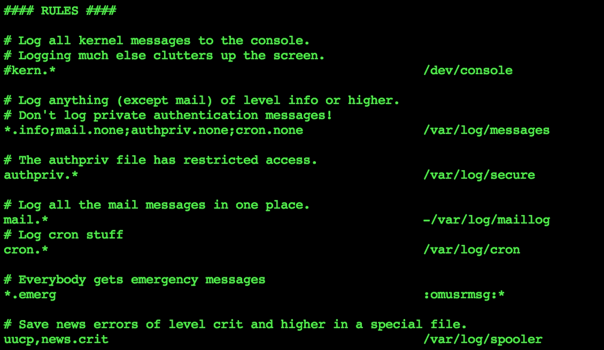
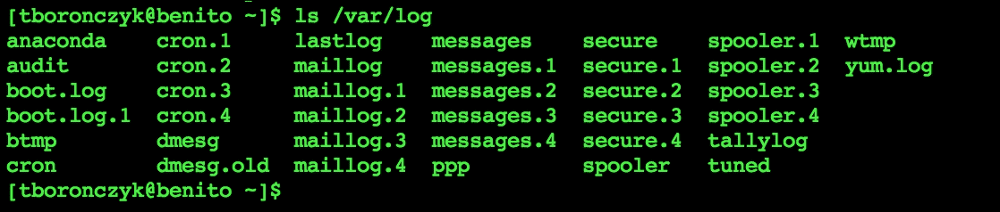
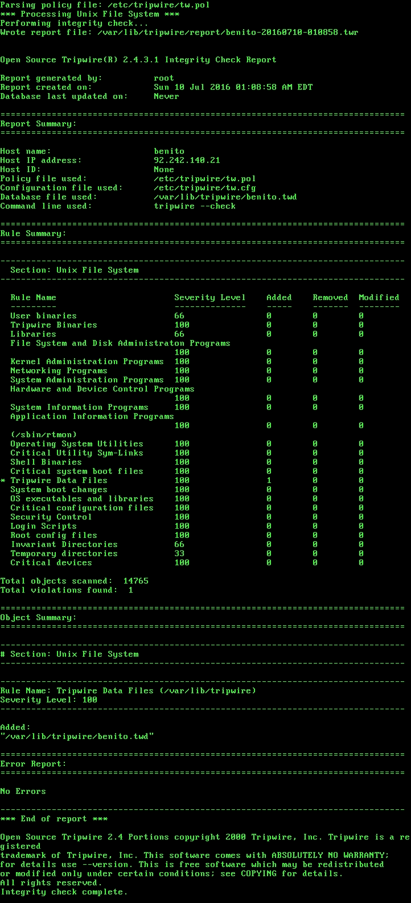
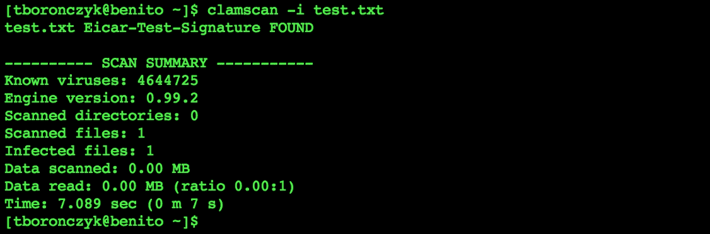
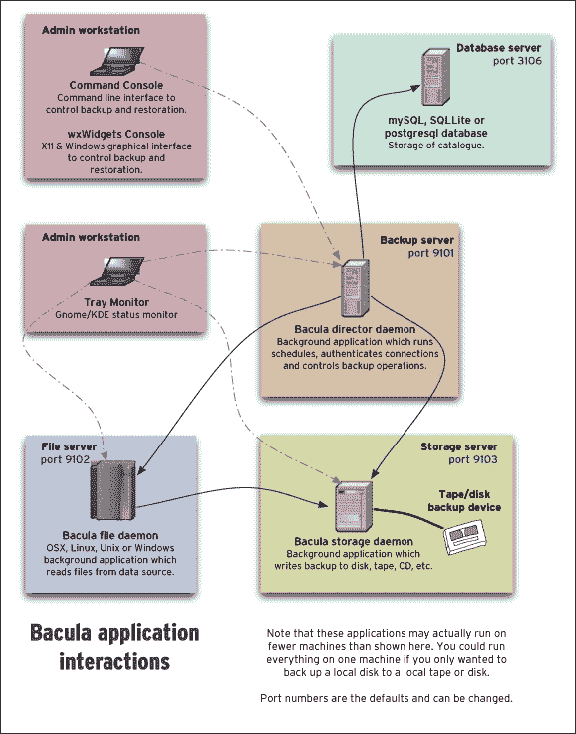
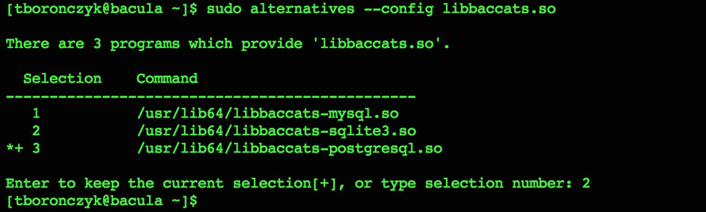
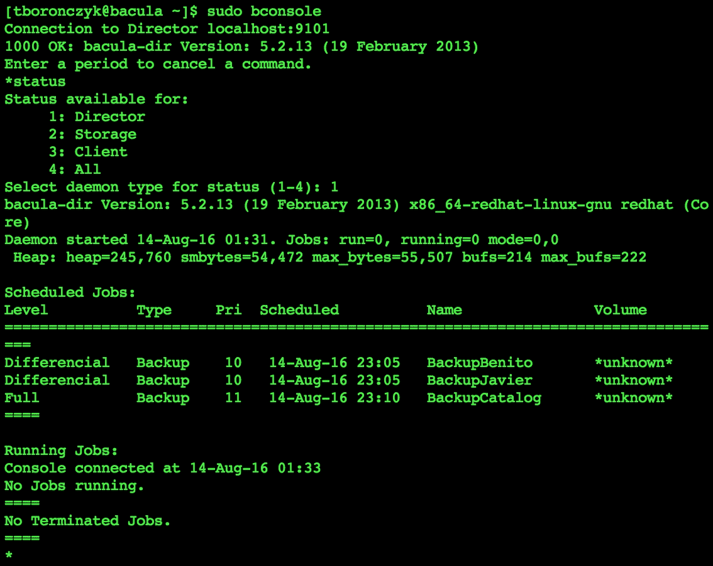

# 第十一章。防范威胁

本章包含以下配方： 

+   发送消息到 Syslog

+   使用 logrotate 旋转日志文件

+   使用 Tripwire 检测修改文件

+   使用 ClamAV 来抵御病毒

+   使用 chkrootkit 检测 rootkit

+   使用 Bacula 进行网络备份

# 介绍

从记录系统活动到嗅探 rootkit，本章提供了一些配方，帮助保护您在系统及其数据上投资免受各种威胁。首先，您将学习如何使用 Syslog 设置一个集中日志服务器，然后学习如何旋转日志文件以确保它们不会失控。然后，我们将看看如何使用 Tripwire 检测系统入侵，方法是检查重要系统文件是否有变化。本章还包括了一些设置 ClamAV 和 chkrootkit 的配方，以保持您的系统免受病毒、特洛伊木马、rootkit 和其他恶意软件的影响。最后，我们将介绍如何使用 Bacula 设置一个集中式备份服务器，以保护您的数据免受意外删除和硬件故障等日常威胁。

# 发送消息到 Syslog

Syslog 是一个进程，它监听来自其他应用程序的消息并将它们写入其日志文件，提供处理所有日志记录活动的通用服务。消息也可以发送到远程系统上运行的 Syslog 的运行实例，作为整个网络的集中日志服务器。除了便利性外，集中式日志记录出于安全原因也很有用，因为当日志记录到第二个系统时，攻击者更难掩盖其行踪。在本配方中，您将学习如何配置本地和远程 Syslog 实例来运行您自己的日志服务器。

## 准备工作

此配方需要两台已连接到网络的 CentOS 系统。配方将将第一台系统称为本地系统，并假定它配置有 IP 地址`192.168.56.100`和主机名`benito`。第二个系统，称为远程系统，假定具有地址`192.168.56.35`和主机名`logs`。这些系统应能够通过主机名相互访问；因此，您需要在系统的`/etc/hosts`文件中添加适当的 DNS 记录或覆盖条目。还需要管理权限，可以通过`root`帐户登录或通过`sudo`使用。

## 如何操作...

要将本地系统的日志消息转发到远程系统，请在本地系统上执行以下步骤：

1.  使用文本编辑器打开 Syslog 的配置文件：

    ```
    vi /etc/rsyslog.conf

    ```

1.  在文件末尾添加以下规则：

    ```
    *.*  @logs.example.com

    ```

1.  保存更改并关闭配置文件。

1.  重新启动 Syslog 以使更新后的配置生效：

    ```
    systemctl restart rsyslog

    ```

然后，在远程系统上执行以下步骤以接受传入的日志消息：

1.  使用文本编辑器打开 Syslog 的配置文件：

    ```
    vi /etc/rsyslog.conf

    ```

1.  定位负责加载`imudp`模块的`$ModLoad`指令，并通过删除前导的`#`字符取消注释它。紧接着取消注释紧随其后的`$UDPServerRun`指令：

    ```
    $ModLoad imudp
    $UDPServerRun 514

    ```

1.  保存更改并关闭配置文件。

1.  重启 Syslog 使更新的配置生效：

    ```
    systemctl restart rsyslog

    ```

1.  打开防火墙以允许 UDP 流量通过`514`端口：

    ```
    firewall-cmd --zone=public --permanent --add-port=514/udp
    firewall-cmd --reload

    ```

## 它是如何工作的…

Syslog 通过多个日志设施接收消息，每条消息都有一个指定的优先级/严重性。消息可以根据它们的设施和优先级进行过滤，以便传递所需的消息，同时丢弃其余的消息。设施和优先级的列表已在 RFC-5424（Syslog 协议）中列出，而 Rsyslog（CentOS 中使用的 Syslog 版本）实现了其中的大部分。

设施提供了一种广泛的分类方法，旨在通过生成消息的服务类型来组织消息。你可以把它们想象成频道，其中记录用户登录失败的消息可以通过`auth`频道发送，而记录服务重启的消息可以通过`daemon`频道发送。Rsyslog 的设施如下：

+   `auth`：与安全和授权相关的消息

+   `cron`：来自 cron 的消息

+   `daemon`：来自系统守护进程的消息

+   `kern`：来自 Linux 内核的消息

+   `lpr`：来自系统打印服务的消息

+   `mail`：来自系统邮件服务的消息

+   `news`：来自 NTTP 服务的消息

+   `syslog`：由 Syslog 本身生成的消息

+   `user`：用户级消息

+   `uucp`：来自 UUCP 服务的消息

+   `local0`-`local7`：用于处理其他设施无法处理的用户级消息

优先级表示消息的严重性，例如，生成错误消息的情况比生成信息或调试消息的情况更严重。Rsyslog 的优先级如下：

+   `emerg`, `panic`：系统不可用

+   `alert`：需要立即采取行动

+   `crit`：发生了一个严重事件

+   `err`, `error`：发生错误

+   `warn`, `warning`：遇到重要情况

+   `notice`：通知消息

+   `info`：信息性消息

+   `debug`：调试消息

Syslog 配置文件中的规则指定日志的写入位置，它们由两部分组成——第一部分是一个模式，用来识别一个设施和优先级。它由设施和优先级名称通过点号分隔，例如`auth.warn`或`local2.debug`。多个设施可以通过逗号分隔，例如`auth,daemon,cron.warn`。此外，`*`可以作为通配符，用来匹配所有设施或优先级。`auth.*`表示来自`auth`设施的任何优先级的消息，`*.warn`表示来自任何设施的`warn`优先级或更高的消息，`*.*`表示所有消息，无论设施或优先级。

与模式匹配的消息将由规则的第二部分处理，即动作。通常，动作是将消息写入文件的位置，但它也可以丢弃消息（使用`~`作为位置）、将消息发送到一个命名管道，由外部进程处理（将位置前缀加上`|`），或者将消息转发到另一个系统（提供一个以`@`为前缀的主机名作为位置）。

由于已安装 Rsyslog，服务的配置文件是`/etc/rsyslogd.conf`。在本地系统上，我们添加了以下规则：

```
*.*  @logs.example.com

```

该规则匹配所有消息并将其发送到服务器`logs.example.com`。一个`@`表示消息将通过 UDP 发送，而两个`@`则表示消息将通过 TCP 发送：

```
*.*  @@archive.example.com

```

然后，我们在远程系统上取消注释了以下配置：

```
$ModLoad imudp
$UDPServerRun 514

```

`$ModLoad`加载一个 Syslog 模块，在本例中是`imudp`，它处理通过 UDP 接收的消息。`$UDPServerRun`指令指定该模块监听消息的端口。传统上，Syslog 消息发送到`514`端口。

### 注意

Syslog 可以配置为使用 TCP 传输消息，但除非有特定的需要，我建议你使用 UDP。UDP 可靠性较差，但 TCP 会带来更多的开销，并可能在大量日志记录事件期间导致更严重的网络拥塞。



配置文件包含规则，将消息根据其设施和优先级引导到不同的文件。

许多应用程序能够将消息发送到 Syslog，即使它们默认写入自己的日志文件。例如，MySQL 在命令行中提供合适的参数时，会接受`--syslog`参数。其他程序，如 BIND 和 Apache，则需要在其配置文件中进行更改。即使是你编写的 Shell 脚本，也可以通过以下方式使用`logger`命令将消息发送到 Syslog：

```
logger -n logs.example.com -p user.notice "Test notice"

```

`logger`接受多个参数，然后是日志消息。`-n`指定消息发送的服务器（如果没有提供，消息将发送到本地系统的 Syslog 实例），`-p`指定消息的设施和优先级。

## 另见

请参考以下资源，了解更多关于 Syslog 的操作信息：

+   Rsyslog 网站 ([`www.rsyslog.com/`](http://www.rsyslog.com/))

+   Rsyslog 的基本配置 ([`access.redhat.com/documentation/en-US/Red_Hat_Enterprise_Linux/7/html/System_Administrators_Guide/s1-basic_configuration_of_rsyslog.html`](https://access.redhat.com/documentation/en-US/Red_Hat_Enterprise_Linux/7/html/System_Administrators_Guide/s1-basic_configuration_of_rsyslog.html))

+   RFC5424：Syslog 协议 ([`www.rfc-base.org/txt/rfc-5424.tx`](http://www.rfc-base.org/txt/rfc-5424.tx)t)

# 使用 logrotate 轮换日志文件

日志文件非常重要，因为它们能更好地了解系统上发生的事情。日志中的调试和错误消息可以用来追踪问题的根源并迅速解决。认证消息记录了谁在何时访问了系统，反复的认证失败可能是攻击者试图获得未授权访问的迹象。然而，日志的实用性通常会随着时间的推移而减少，而生成大量日志条目的活跃应用程序如果不加以管理，可能会轻易地消耗系统的所有存储资源。本食谱将向您展示如何旋转日志文件，以防止日志文件过大失控，并避免过时的日志浪费空间。

## 准备工作

本食谱要求使用具有有效网络连接的 CentOS 系统。还需要具有管理员权限，可以通过以 `root` 账户登录或使用 `sudo` 获得。

## 如何操作...

按照以下步骤使用 `logrotate` 配置日志文件旋转：

1.  创建 `/etc/logrotate.d/example` 文件：

    ```
    vi /etc/logrotate.d/example

    ```

1.  将以下内容写入文件：

    ```
    /var/log/example.log {
     monthly
     rotate 4
     missingok
     notifempty
     create 0600 root root
     postrotate
     kill -HUP $(cat /var/run/example.pid)
     endscript
    }

    ```

1.  保存您的更新并关闭文件。

## 它是如何工作的...

`logrotate` 通过将日志文件重命名为顺序备份并创建一个新的文件供应用程序写入来旋转日志文件。在旋转 `example.log` 时，它将 `example.log` 重命名为 `example.log.1`。如果 `example.log.1` 已存在，它首先将该文件重命名为 `example.log.2`（以此类推，其他按序号排列的文件也是如此）。

为了这个示例，本食谱创建了一个新的配置来旋转 `/var/log/example.log` 文件。`logrotate` 的主配置文件是 `/etc/logrotate.conf`，而附加文件可以放置在 `/etc/logrotate.d` 目录中。您需要检查 `logrotate.d` 目录，查看您希望管理的应用程序日志的旋转是否已经配置好（许多软件包会在那里放置一个配置文件作为一种方便）。如果软件包维护者的配置不符合您的需求，您可以更新该配置。主文件中的指令设置全局行为，而附加文件中的指令会根据每个配置文件的情况进行覆盖。

配置提供了目标日志文件的名称，后跟一组大括号指令，用于指定 `logrotate` 如何管理该文件。`*` 可以作为通配符匹配多个文件，这在应用程序写入多个日志文件时很有用。例如，Apache HTTP 服务器将消息写入 `/var/log/http` 目录下的 `access_log` 和 `error_log` 文件。所以它的配置将如下所示：

```
/var/log/http/*log {
...
}

```

`monthly` 指令指示 `logrotate` 每月旋转一次文件。其他选项包括 `daily`（每天）、`weekly`（每周）和 `yearly`（每年）。或者，您可以指示 `logrotate` 根据文件大小来管理文件——`size` 指令指定一个大小，`logrotate` 将旋转那些大于该大小的文件。

```
size 30k

```

如果给定的值没有单位，默认单位为字节。`logrotate` 还支持 `k` 表示千字节，`M` 表示兆字节，`G` 表示吉字节。

`rotate` 指令指定轮换中保留多少个日志文件。在我们的例子中，最多允许保留四个文件；因此，`example.log.3` 会覆盖 `example.log.4`，并且不会有 `example.log.5`。`missingok` 指令告知 `logrotate` 如果某个日志文件不存在也可以继续运行（其默认行为是报错）。同时，`notifempty` 指令指示 `logrotate` 如果文件为空，则跳过轮换。`create` 指令告知 `logrotate` 在重命名原始日志文件后创建一个新文件，并为新文件提供模式、用户和组：

```
rotate 4
missingok
notifempty
create 0600 root root

```



轮换的日志文件按顺序编号

### 注意

原始的 `example.log.4` 文件的内容不一定会丢失。一个选项是使用 `mail` 指令，在覆盖文件之前指示 `logrotate` 将其内容通过电子邮件发送给你。

`**mail tboronczyk@example.com**`

个人建议，只有在文件相对较小的情况下使用 `mail`，因为发送大型文件可能会对邮件服务器造成不必要的负担。此外，包含敏感信息的日志文件不应该通过电子邮件传输。对于敏感日志和较大的文件，我建议使用 `prerotate` 来调用 `scp` 或其他工具，在轮换之前将文件复制到其他地方。

```
prerotate
 scp /var/log/example.log.4  storage@archive.example.com:example.log-$ (date +%F)
endscript
```

我们可以指定在日志文件轮换前后执行的外部操作。`prerotate` 指令提供一组在轮换开始前执行的 shell 命令，`postrotate` 指令提供在轮换后执行的命令。两个指令都使用 `endscript` 来标记命令集的结束，如前面的提示和配方配置中所示。配置中调用 `kill` 发送挂起信号（`HUP`）到示例进程，这将重新加载该守护进程。如果日志文件被移动并重新创建，一些程序可能会出现混乱，重新加载后程序会重新打开日志文件的连接，从而继续记录日志：

```
postrotate
 kill -HUP $(cat /var/run/example.pid)
endscript

```

`logrotate` 是通过 `cron` 每日运行的，因此一旦你创建/调整了轮换配置，就可以完成设置。下次 `logrotate` 运行时，它会重新读取所有配置文件并获取更新。

## 另见

参见以下资源，获取更多关于使用 `logrotate` 的信息：

+   `logrotate` 手册页 (`man 8 logrotate`)

+   使用 Logrotate 管理 Linux 日志文件 ([`www.techrepublic.com/article/manage-linux-log-files-with-logrotate`](http://www.techrepublic.com/article/manage-linux-log-files-with-logrotate))

+   如何管理系统日志 ([`www.tecmint.com/manage-linux-system-logs-using-rsyslogd-and-logrotate/`](http://www.tecmint.com/manage-linux-system-logs-using-rsyslogd-and-logrotate/))

# 使用 Tripwire 检测修改过的文件

本教程向你展示了如何设置 Tripwire，这是一个用于检测系统中文件更改的审计工具。Tripwire 通常被作为入侵检测系统来使用，因为重要配置文件的意外修改通常是入侵或恶意活动的标志。能够监控这些变化，可以帮助你及时发现并制止可能发生的恶意活动。

## 准备工作

本教程要求使用有网络连接的 CentOS 系统。`tripwire`包位于 EPEL 仓库中，因此必须按第四章《软件安装管理》中讨论的内容注册该仓库。还需要管理员权限，或者登录`root`账户，或者使用`sudo`命令。

## 如何操作...

按照这些步骤使用 Tripwire 监控系统入侵：

1.  从 EPEL 仓库安装`tripwire`包：

    ```
    yum install tripwire

    ```

1.  运行`tripwire-setup-keyfiles`来生成 Tripwire 的密钥文件、配置文件和策略文件：

    ```
    tripwire-setup-keyfiles

    ```

    系统会提示你输入站点密钥文件和本地密钥文件的密码，并再次输入站点密码来签名生成的配置文件和策略文件。

1.  初始化 Tripwire 的数据库。系统会提示你输入本地密码短语：

    ```
    tripwire --init 2>output.txt

    ```

1.  检查输出中的警告，以确定在策略中定义但在系统上不存在的文件：

    ```
    cat output.txt

    ```

1.  注释掉`/etc/tripwire/twpol.txt`中引用`output.txt`中不存在的文件的条目。如果`output.txt`中的所有警告都由于文件不存在而引起，那么你可以通过以下方式自动化此步骤：

    ```
    for f in $(grep "Filename:" output.txt | cut -f2 -d:); do
     sed -i "s|\($f\) |#\\1|g" /etc/tripwire/twpol.txt
    done

    ```

1.  重新生成已签名的策略文件。系统会提示你输入站点密钥文件的密码：

    ```
    twadmin --create-polfile -S /etc/tripwire/site.key  
           /etc/tripwire/twpol.txt

    ```

1.  删除原始数据库并初始化一个新的数据库。这次，过程应该在没有任何警告的情况下完成：

    ```
    rm /var/lib/tripwire/benito.twd
    tripwire --init

    ```

## 它是如何工作的...

Tripwire 审计你的系统以检测哪些文件发生了变化。其背后的理念是，如果攻击者获得了你的系统访问权限，他们不可避免地会创建或修改关键文件来确保其存在。然而，攻击者很容易修改 Tripwire 的策略文件，制造出没有变化的假象；因此，配置文件、策略文件和关键文件都需要用密钥文件进行签名。当我们运行以下命令时，配置文件、策略文件和密钥文件都会生成：

```
tripwire-setup-keyfiles 

```

由于默认策略试图尽可能全面地涵盖大多数用户，可能会包含与我们的 CentOS 系统不相关的条目。如果我们使用未经修改的默认策略运行，Tripwire 会报告缺失的文件，筛选出误报的文件会使我们更难辨别是否有人删除了真正需要关注的文件。与其手动审查策略文件，特别是如果你不是专家并不熟悉某些文件，最好的做法是在已知干净的系统上进行初步扫描，然后让 Tripwire 报告不存在的文件。这将帮助节省时间，并帮助我们将策略调整到我们的系统上。

初始化 Tripwire 数据库使用命令 `tripwire --init`。程序将扫描系统，比较文件系统与策略文件中的信息，并收集现有文件的统计数据。这些统计数据将存储在数据库中，作为下次运行 Tripwire 时与文件进行比较的基准指标。该过程将包含缺失文件的错误输出重定向到单独的文本文件，原因有二：列表可能很长，有时翻阅文件比滚动终端会话更方便；另外，我们可以基于该输出脚本化地定制策略：

```
tripwire --init 2>output.txt

```

`sed` 是传统的搜索和替换工具，而 `grep` 非常适合查找和提取感兴趣的行，因此我们可以使用这两个工具来更新策略文件 `/etc/tripwire/twpol.txt`。首先，我们需要知道 `output.txt` 中的消息格式如下：

```
cat output.txt

```


不存在的文件在初始化 Tripwire 数据库时会产生警告

### 注意

如果输出文件中的所有警告都与不存在的文件有关，那么就可以安全地自动更新策略。这就是我们在继续之前仔细检查内容的原因。

我们使用 `grep` 来筛选包含 `Filename:` 的行，然后使用 `cut` 按冒号分割该行并提取第二部分——不存在的文件名。`for` 循环捕获每个文件名，并将其赋值给变量 `f`，然后我们可以在 `sed` 的模式中引用它。该模式执行全局查找和替换，使用捕获括号和数字反向引用将文件名替换为以 `#` 开头：

```
for f in $(grep "Filename:" output.txt | cut -f2 -d:); do
 sed -i "s|\($f\) |#\\1|g" /etc/tripwire/twpol.txt;
done

```

### 注意

确保文件名后面有一个空格非常重要，这样可以确保我们只匹配整个文件名。例如，我们想避免 `/etc/rc.d` 也会匹配到 `/etc/rc.d/init`，因为它们有共同的前缀。

策略的未签名纯文本副本存储在 `/etc/tripwire/twpol.txt`。在我们进行更改后，我们希望创建一个签名的策略文件，Tripwire 将出于前面提到的安全原因使用它。这可以通过 `twadmin` 和 `--create-policy` 参数完成。`-S` 参数为命令提供签名密钥的路径，然后我们提供策略的纯文本副本作为输入：

```
twadmin --create-polfile -S /etc/tripwire/site.key
/etc/tripwire/twpol.txt

```

`twadmin` 会签署策略并将结果写入 `/etc/tripwire/tw.pol`。在策略文件修改后，我们可以重新初始化数据库。实际上，每次更新策略文件时，你都应该重新生成数据库，该数据库存储在 `/var/lib/tripwire` 中，并以系统的主机名命名：

```
rm /var/lib/tripwire/benito.twd
tripwire --init

```

要扫描系统中的违规行为，可以运行带有 `--check` 选项的 Tripwire：

```
tripwire --check

```



Tripwire 在执行扫描后会报告其发现。

当然，为了有效，扫描必须至少每天执行一次。为此，`tripwire` 包在 `/etc/cron.daily` 中安装了一个 cron 任务，该任务会运行 Tripwire 扫描。根据 cron 的配置，扫描的输出很可能会通过 cron 发送到系统的 `root` 用户的邮箱（并很可能最终进入 `/var/spool/mail/root`）。你可以编辑 `/etc/cron.daily/tripwire-check`，让输出发送到你的邮箱：

```
test -f /etc/tripwire/tw.cfg && /usr/sbin/tripwire --check |  
/bin/mailx -s "Tripwire Report" tboronczyk@example.com 2>&1

```

如果你愿意，你也可以配置 Tripwire 自行发送电子邮件。首先，你需要确保 Tripwire 能够向你的地址发送邮件。执行以下命令发送测试邮件，然后检查确保它到达了你的收件箱：

```
tripwire --test --email tboronczyk@example.com

```

### 注释

在运行手动扫描时，你可以使用 `--email-report` 选项，让 Tripwire 将结果发送到你的电子邮件。

`**tripwire --check --email-report**`

默认情况下，Tripwire 会尝试通过 sendmail（或 Postfix 的 sendmail 接口）发送电子邮件。如果你需要通过 SMTP 服务器发送邮件，可以查看 `man 4 twconfig` 中的 *电子邮件通知变量* 部分。

在 Tripwire 配置中，指定目标电子邮件地址会稍微复杂一些。Tripwire 策略文件中定义的测试被分组到规则集中，这样可以将文件按逻辑方式进行分组。例如，有一个规则集测试 Tripwire 可执行文件的完整性，这与测试系统管理程序的规则集是分开的。每个规则集可以有一个定义的电子邮件地址来发送通知，这对于灵活性非常好，允许一个管理员接收关于某一组文件的修改通知，另一个管理员接收关于其他文件的通知：

```
(
 rulename = "Tripwire Binaries",
 emailto = tboronczyk@example.com,
 severity = $(SIG_HI)
)

```

如果你是唯一的管理员，反复指定相同的地址可能会很麻烦。一个更好的方法是将电子邮件地址定义为全局变量，然后通过巧妙地使用 `sed` 来简化操作。

首先，编辑`twpol.txt`文件，在全局变量定义部分添加你的电子邮件地址的变量赋值：

```
@@section GLOBAL
TWROOT=/usr/sbin;
TWBIN=/usr/sbin;
TWPOL=/"/etc/tripwire";
TWD="/var/lib/tripwire";
TWSKEY="/etc/tripwire";
TWLKEY="/etc/tripwire";
TWREPORT="/var/lib/tripwire/report";
HOSTNAME=benito;
EMAILADDR="tboronczyk@example.com";

```

保存更改并关闭文件。然后，考虑到每个规则集中都包含`severity`指令，我们可以使用替换模式来插入`mailto`指令：

```
sed -i "s|\( \+\)\(severity = \)|\\1mailto =  \$(EMAILADDR),\n\\1\\2|g" 
    /etc/tripwire/twpol.txt

```

最终结果应该在每个规则集的定义中包含`emailto`指令：

```
(
 rulename = "Tripwire Binaries",
 emailto = $(EMAILADDR),
 severity = $(SIG_HI)
)

```

在检查结果后，重新签署策略文件并重新初始化数据库。

## 另请参见

请参阅以下资源，了解更多关于使用 Tripwire 的信息：

+   Tripwire 简介（`man 8 twintro`）

+   Tripwire 配置手册页面（`man 4 twconfig`）

+   Tripwire 策略手册页面（`man 4 twpolicy`）

+   入侵检测与 Tripwire（[`www.akadia.com/services/tripwire.html`](http://www.akadia.com/services/tripwire.html)）

+   如何设置和使用 Tripwire（[`www.linuxjournal.com/article/8758`](http://www.linuxjournal.com/article/8758)）

# 使用 ClamAV 抵御病毒

病毒、木马以及其他形式的恶意软件威胁是真实存在的。它们在数量和复杂性上都呈指数级增长，防病毒软件不得不采用复杂的检测方法。虽然无法保证你的系统不会成为这些恶意代码的受害者，但在使用互联网和共享文件时保持警惕，实施常识性的安全策略，并使用最新的防病毒程序，能够在很大程度上保护你。这个教程将向你展示如何安装 ClamAV 这一专业级开源防病毒程序，保持其威胁数据库的最新状态，并扫描你的系统。

## 准备工作

这个教程需要一个具有有效网络连接的 CentOS 系统。ClamAV 软件包可以在 EPEL 仓库中找到，因此必须注册该仓库，如第四章《软件安装管理》中所讨论的那样。还需要具有管理员权限，可以通过登录`root`账户或使用`sudo`来获取。

## 如何做到这一点...

按照以下步骤安装 ClamAV 并扫描病毒和木马：

1.  从 EPEL 仓库安装`clamav`和`clamav-update`软件包：

    ```
    yum install clamav clamav-update

    ```

1.  使用文本编辑器打开`freshclam`配置文件：

    ```
    vi /etc/freshclam.conf

    ```

1.  找到`Example`行并在行首添加`#`以将其注释掉：

    ```
    # Comment or remove the line below
    #Example

    ```

1.  保存更新并关闭文件。

1.  运行`freshclam`以更新扫描器的威胁数据库：

    ```
    freshclam

    ```

1.  创建一个`systemd`服务文件来管理`freshclam`守护进程，以实现自动更新：

    ```
    vi /lib/systemd/system/freshclam.service

    ```

1.  使用以下内容作为文件的内容：

    ```
    [Unit]
    Description = freshclam daemon to update clamav
    After = network.target
    [Service]
    Type = forking
    ExecStart = /usr/bin/freshclam -d
    Restart = on-failure
    [Install]
    WantedBy=multi-user.target

    ```

1.  强制`systemd`重新加载其服务：

    ```
    systemctl daemon-reload

    ```

1.  启动新的`freshclam`服务并启用它在系统重启时自动启动：

    ```
    systemctl start freshclam.service
    systemctl enable freshclam.service

    ```

1.  使用`clamscan`扫描`home`目录中的文件以检查威胁：

    ```
    clamscan -ir /home/tboronczyk

    ```

## 它是如何工作的...

首先，我们安装了`clamav`和`clamav-update`软件包。`clamav`软件包包含病毒扫描器，而`clamav-update`包含`freshclam`程序，该程序用于更新 ClamAV 的病毒定义，以保持其最新：

```
yum install clamav clamav-update

```

`freshclam`从`/etc/freshclam.conf`读取其配置文件。该文件包含一行包含单词`Example`，以防止用户盲目使用默认设置，我们必须在使用`freshclam`之前将其删除或注释掉。默认设置适合我们的目的，这更多的是一种烦恼，但它确实迫使我们查看文件并查看哪些行为可以调整。每个指令都有注释，说明其默认行为是什么。

然后，我们运行了`freshclam`以更新扫描器的数据库：

```
freshclam

```

### 注意

该过程将其进度输出到终端，您可能会看到几个错误消息。例如，它可能会报告无法下载某个每日文件。不要惊慌；`freshclam`会尝试多个镜像。只要它报告`main.cvd`、`daily.cvd`和`bytecode.cvd`在完成时是最新的，您就知道已经拥有最新的定义。

我们可以随时运行`freshclam`以确保定义数据库是最新的，但每次手动运行它会不太方便。当以`-d`参数启动时，`freshclam`将在守护进程模式下运行，并定期检查更新（默认每两小时检查一次）。为了保持整洁，我们创建了一个服务文件来运行`freshclam`并将其注册到`systemd`：

```
[Unit]
Description = freshclam clamav update daemon
After = network.target
[Service]
Type = forking
ExecStart = /usr/bin/freshclam -d
Restart = on-failure
[Install]
WantedBy=multi-user.target

```

`[Unit]`部分定义了服务的基本属性，如描述和它依赖于网络连接。`[Service]`部分定义了服务本身，`ExecStart`将运行`freshclam`并带有`-d`参数，`Type`让 systemd 知道该进程将分叉并在后台以守护进程方式运行，`Restart`将使 systemd 监控该服务，如果它崩溃，将自动重启。`[Install]`部分定义了当我们运行`systemctl enable`时，它将如何被链接。

### 注意

系统文件的内容相当基础，可以作为您编写其他自定义服务的起点。

使用`clamscan`扫描文件中的威胁：

```
clamscan -ir /home/tboronczyk

```

`-i`参数指示扫描器仅输出感染的文件，而不是每个扫描的文件名。`-r`触发递归扫描，深入子目录。给定的路径可以是要扫描的单个文件或目录，在本例中是我们的`home`目录：



ClamAV 提供其扫描结果的总结

### 注意

您可以使用 EICAR 的测试文件，从[`www.eicar.org/85-0-Download.html`](http://www.eicar.org/85-0-Download.html)下载，来验证 ClamAV 是否正常工作。有关更多信息，请阅读它们的预期用途页面，网址为[`www.eicar.org/86-0-Intended-use.html`](http://www.eicar.org/86-0-Intended-use.html)。

ClamAV 通常有两种使用方式——作为扫描器检查现有文件以检测威胁，或作为过滤器实时检测数据流中的威胁。设置定期扫描的最简单方法是通过设置 cron 作业。

要创建一个个人的 cron 作业，以运行`clamav`扫描`home`目录，请使用`crontab`：

```
crontab -e

```

`crontab`将启动默认编辑器，供您输入作业计划。然后，`crontab`将在您保存计划并关闭文件后自动激活该作业。

一个每天凌晨 3:00 运行`clamscan`的示例计划可能如下所示：

```
0 3 * * * clamscan >> $HOME/clamscan.log

```

前五列指定作业运行的时间。第一列是分钟，第二列是小时，第三列是日期，第四列是月份，最后一列是作业运行的星期几。`*`用作简写，表示整个范围，因此该示例将每天的每个月运行。更多信息可以在`crontab`文件的格式手册页中找到（`man 5 crontab`）。

在服务器系统上，ClamAV 通常作为实时扫描器作为邮件过滤器运行。邮件服务器（例如 Postfix）接收邮件，然后将其传递给 ClamAV 进行扫描。假设您正在运行 Postfix，正如第九章中讨论的那样，*管理电子邮件*，以下是设置 ClamAV 与 Postfix 协同工作的步骤。

首先，我们需要安装一些额外的软件包。`clamav-scanner-systemd`软件包将安装我们需要的功能，使得`clamscan`可以作为守护进程运行，这样它始终可用，而`clamav-milter-systemd`软件包则安装了一个邮件过滤器，作为 Postfix 和扫描器之间的代理：

```
yum install clamav-scanner-systemd clamav-milter-systemd

```

然后，编辑配置文件`/etc/clamd.d/scan.conf`。注释掉`Example`行，并取消注释`LocalSocket`选项：

```
LocalSocket /var/run/clamd.scan/clamd.sock

```

`LocalSocket`给出的值是扫描守护进程用于与外部进程通信的套接字文件。

接下来，编辑`/etc/mail/clamav-milter.conf`文件，这是`clamav-milter`邮件过滤器的配置文件。注释掉`Example`行，取消注释第一个`MilterSocket`指令，并添加`ClamdSocket`指令。`ClamdSocket`的值应与`scan.conf`中的`LocalSocket`相同，但需以`unix:`为前缀，表示这是一个 Unix 套接字：

```
MilterSocket /var/run/clamav-milter/clamav.socket
ClamdSocket unix:/var/run/clamd.scan/clamd.sock

```

启动并启用扫描守护进程和过滤服务：

```
system start clamd@scan.service clamav-milter.service
system enable clamd@scan.service clamav-milter.service

```

最后，打开`/etc/postfix/main.cnf`并添加`smtpd_milters`条目，让 Postfix 知道过滤器的存在：

```
smtpd_milters=unix:/var/run/clamav-milter/clamav.socket

```

更新 Postfix 配置后，别忘了重启 Postfix：

```
systemctl restart postfix.service

```

## 另见

有关与 ClamAV 合作的更多信息，请参考以下资源：

+   ClamAV 文档 ([`www.clamav.net/documents/installing-clamav`](http://www.clamav.net/documents/installing-clamav))

+   欧洲计算机防病毒研究所 ([`www.eicar.org/`](http://www.eicar.org/))

# 使用 chkrootkit 检查 rootkit

如果不幸的是攻击者获得了系统访问权限，他们首先会做的事情之一就是隐藏自己的入侵，同时尽可能长时间地保持访问权限，可能会安装 rootkit。rootkit 是一个潜伏在系统中的程序，攻击者通过它获得管理员权限。它们会嵌入到 Linux 内核中以防止被检测到，甚至有些 rootkit 可以隐藏在系统固件的专用内存中，让攻击者即使在系统断电时也能控制系统。本食谱展示了如何使用 chkrootkit 检查系统是否存在 rootkit。

## 准备工作

本食谱要求使用 CentOS 系统，并且需要有效的网络连接。同时需要管理员权限，可以通过登录 `root` 账户或使用 `sudo` 来获得权限。

## 如何操作...

按照以下步骤使用 chkrootkit 检查是否存在 rootkit：

1.  安装编译 `chkrootkit` 二进制文件所需的 `gcc` 和 `glibc-static` 软件包：

    ```
    yum install gcc glibc-static

    ```

1.  下载 `chkrootkit` 源代码：

    ```
     curl -O ftp://ftp.pangeia.com.br/pub/seg/pac/chkrootkit.tar.gz

    ```

1.  提取下载的源代码归档并进入代码目录：

    ```
    tar xzvf chkrootkit.tar.gz
    cd chkrootkit-0.50

    ```

1.  运行 make 来编译 chkrootkit 的二进制组件：

    ```
    make

    ```

1.  chkrootkit 需要 `netstat` 来进行网络测试，`netstat` 包含在 `net-tools` 软件包中：

    ```
    yum install net-tools

    ```

1.  运行 chkrootkit 扫描是否存在 rootkit：

    ```
    ./chkrootkit

    ```

## 它是如何工作的...

chkrootkit 由一个 shell 脚本和一小部分编译工具组成，作为源代码分发，因此需要编译。为了完成编译，你需要在系统中安装一个编译器。最基本的 `gcc` 就足够了。此外，我们还需要安装 `glibc-static` 包，因为该项目的 `Makefile` 会构建一个静态编译的二进制文件——所有二进制文件的依赖都会被编译进去；它不会动态引用系统共享库的副本：

```
yum install gcc glibc-static

```

chkrootkit 的源代码可以在项目网站上找到。食谱中使用的链接是指向最新源代码归档的直接链接，并通过 `curl` 下载：

```
curl -O ftp://ftp.pangeia.com.br/pub/seg/pac/chkrootkit.tar.gz

```

下载完成后，构建 chkrootkit 只需提取归档文件，进入新创建的目录并运行 `make`：

```
make

```

当你在 第四章的《从源代码编译程序》一节中学习如何从源代码编译程序时，你使用了常见的 `configure`、`make` 和 `make install` 方法。然而，chkrootkit 并没有附带 configure 脚本，而且它的 `Makefile` 中没有包含 `install` 目标。我们在这里需要做的，就是直接运行 `make` 来启动编译过程。

chkrootkit 会运行一系列测试以检查已知的 rootkit 特征。部分测试使用其编译好的工具，而其他测试则使用常见的系统工具。其中一个网络测试会使用 `netstat` 检查哪些端口是开放的，`netstat` 在 CentOS 中默认没有安装，但可以从 `net-tools` 软件包中获取。因此，在使用 chkrootkit 之前，我们需要先安装这个依赖：

```
 yum install net-tools

```

一旦安装完成，我们可以执行 chkrootkit 脚本。没有任何参数运行时，chkrootkit 会执行所有测试。否则，我们可以指定一个或多个测试，只有这些测试会运行。`-l`（小写 L）参数将显示可能的测试列表：

```
 ./chkrootkit -l

```

## 另见

查看以下资源，了解更多关于使用 chkrootkit 的信息：

+   chkrootkit 网站（[`www.chkrootkit.org`](http://www.chkrootkit.org)）

+   Chkrootkit：检查你的系统是否存在隐藏的 rootkit（[`www.youtube.com/watch?v=IdvdUv0Nsq4`](https://www.youtube.com/watch?v=IdvdUv0Nsq4)）

# 使用 Bacula 进行网络备份

事实上，我们生活在一个越来越依赖数据的世界中。此外，从意外删除到灾难性的硬盘故障，数据安全面临着许多威胁。你的数据越重要，如果丢失后再创建越困难，那么备份就越重要。因此，本教程将向你展示如何使用 Bacula 设置备份服务器，并配置网络中的其他系统将它们的数据备份到此服务器。

## 准备工作

本教程要求至少有两台具有有效网络连接的 CentOS 系统。第一台是本地系统，我们假设它的主机名为 `benito`，IP 地址为 `192.168.56.41`。第二台是备份服务器。你需要在这两台系统上都有管理员权限，可以使用 `root` 账户登录或通过 `sudo` 使用权限。

## 如何操作...

在本地系统上执行以下步骤以安装和配置 Bacula 文件守护进程：

1.  安装 `bacula-client` 包：

    ```
     yum install bacula-client

    ```

1.  使用文本编辑器打开文件守护进程的配置文件：

    ```
     vi /etc/bacula/bacula-fd.conf

    ```

1.  在 `FileDaemon` 资源中，更新 `Name` 指令的值，以反映系统的主机名，并加上后缀 `-fd`：

    ```
     FileDaemon { 
             Name = benito-fd 
           ... 
           }

    ```

1.  保存更改并关闭文件。

1.  启动文件守护进程，并设置为系统重启时自动启动：

    ```
     systemctl start bacula-fd.service 
           systemctl enable bacula-fd.service 

    ```

1.  打开防火墙，允许 TCP 流量通过端口 `9102`：

    ```
     firewall-cmd --zone=public --permanent --add-port=9102/tcp 
           firewall-cmd --reload

    ```

1.  在每个需要备份的系统上重复步骤 1-6。

在指定为备份服务器的系统上执行以下步骤，安装和配置 Bacula 主控、存储和文件守护进程。

1.  安装 `bacula-console`、`bacula-director`、`bacula-storage` 和 `bacula-client` 包：

    ```
    yum install bacula-console bacula-director bacula-storage 
           bacula-client

    ```

1.  重新链接目录库以使用 SQLite 数据库存储：

    ```
    alternatives --config libbaccats.so

    ```

1.  在提示提供选择编号时，输入 2。

1.  创建 SQLite 数据库文件并导入表格架构：

    ```
     /usr/libexec/bacula/create_sqlite3_database 
           /usr/libexec/bacula/make_sqlite3_tables 

    ```

1.  使用文本编辑器打开主控配置文件：

    ```
    vi /etc/bacula/bacula-dir.conf

    ```

1.  在 `Job` 资源中，`Name` 的值为 `BackupClient1`，将 `Name` 指令的值更改为本地系统的名称。然后添加一个 `Client` 指令，值与该系统的 `FileDaemon` `Name` 相匹配：

    ```
     Job { 
             Name = "BackupBenito" 
             Client = benito-fd 
             JobDefs = "DefaultJob" 
           }

    ```

1.  复制 `Job` 资源，并根据需要更新其指令值，以便为每个需要备份的系统定义一个 `Job` 资源。

1.  对于每个需要备份的系统，复制`Client`资源，其中`Name`指令设置为`bacula-fd`。在复制的资源中，更新`Name`和`Address`指令以标识该系统：

    ```
     Client { 
             Name = bacula-fd 
             Address = localhost 
             ... 
           } 
           Client { 
             Name = benito-fd 
             Address = 192.168.56.41 
             ... 
           } 
           Client { 
             Name = javier-fd 
             Address = 192.168.56.42 
             ... 
           }

    ```

1.  保存更改并关闭文件。

1.  打开存储守护进程的配置文件：

    ```
           vi /etc/bacula/bacula-sd.conf 

    ```

1.  在`Device`资源中，`Name`为`FileStorage`的条目，将`Archive Device`指令的值更改为`/bacula`：

    ```
           Device { 
             Name = FileStorage 
             Media Type = File 
             Archive Device = /bacula 
           ...

    ```

1.  保存更新并关闭文件。

1.  创建`/bacula`目录并分配适当的所有权：

    ```
           mkdir /bacula 
           chown bacula:bacula /bacula

    ```

1.  如果启用了 SELinux，请重置新目录的安全上下文：

    ```
           restorecon -Rv /bacula

    ```

1.  启动管理程序和存储守护进程，并使它们在系统重启时自动启动：

    ```
           systemctl start bacula-dir.service bacula-sd.service 
           bacula-fd.service 
           systemctl enable bacula-dir.service bacula-sd.service 
           bacula-fd.service

    ```

1.  打开防火墙，允许 TCP 流量通过端口`9101-9103`：

    ```
           firewall-cmd --zone=public --permanent --add-port=9101-9103/tcp 
           firewall-cmd -reload

    ```

1.  启动 Bacula 的控制台界面：

    ```
           bconsole 

    ```

1.  输入`label`创建备份的目标。在提示输入卷名称时，使用`Volume0001`或类似的值。当提示选择池时，选择`File`池：

    ```
           label 

    ```

1.  输入`quit`退出控制台界面。

## 它是如何工作的

配置 Bacula 大多数时候可能是一个令人生畏的任务，因为该套件的分布式架构以及在组织和调度备份与恢复作业方面提供的灵活性。然而，一旦一切都顺利运行，我相信你会放心，因为你知道你的数据已经远离意外和灾难的风险。

Bacula 由多个组件组成。在这个例子中，我们的重点是三个守护进程——管理程序、文件守护进程和存储守护进程。文件守护进程安装在每个需要备份的客户端系统上，并监听来自管理程序的连接。管理程序按计划连接到每个文件守护进程，并告诉它备份哪些文件以及将其复制到哪里（存储守护进程）。存储守护进程接收备份的数据，并将其写入备份介质，例如磁盘或磁带驱动器。

首先，我们在客户端系统上使用`bacula-client`软件包安装了文件守护进程。然后，我们编辑了位于`/etc/bacula/bacula-fd.conf`的文件守护进程配置文件，以指定进程的名称。约定是将系统主机名后缀添加`-fd`：

```
 FileDaemon { 
      Name = benito-fd 
      FDPort = 9102 
      WorkingDirectory = /var/spool/bacula 
      Pid Directory = /var/run 
      Maximum Concurrent Jobs = 20 
    }

```

在更新配置后，我们启动了服务并在系统防火墙中打开了适当的端口。文件守护进程现在正在监听，等待管理程序连接并告诉它需要执行的操作。

在备份服务器上，我们安装了`bacula-director`、`bacula-storage`和`bacula-client`软件包。这为我们提供了管理程序和存储守护进程，以及另一个文件守护进程。文件守护进程在备份服务器上的作用是备份 Bacula 的目录：



这张从 Bacula 文档中复制的图像展示了不同应用程序之间的关系：

Bacula 维护了一个关于之前备份任务的元数据数据库，称为目录，它可以由 MySQL、PostgreSQL 或 SQLite 管理。SQLite 是一个嵌入式数据库库，意味着使用它的程序会链接到 SQLite 库并管理自己的数据库文件。为了支持多个数据库，Bacula 的代码编写方式使得所有数据库访问程序都包含在不同的共享库中，每个数据库都有一个不同的库。然后，当 Bacula 想要与数据库交互时，它通过 `libbaccats.so` 进行，这个 *假* 库实际上只是一个指向特定数据库库的符号链接。这样，Bacula 就能在不需要重新编译源代码的情况下支持不同的数据库。

为了创建符号链接，我们使用了 `alternatives` 并选择了我们想要使用的真实库：

```
 alternatives --config libbaccats.so

```

然后，我们使用随 Bacula 附带的脚本初始化了数据库的模式：

```
 /usr/libexec/bacula/create_sqlite3_database 
    /usr/libexec/bacula/make_sqlite3_tables

```



Bacula 支持多个数据库而无需重新编译

### 注意

这个方案利用了 Bacula 的 SQLite 支持，因为它方便且不需要额外的设置工作。如果你想使用 MySQL，请按照 第七章，*使用数据库* 中的说明安装 MySQL，创建一个专门供 Bacula 使用的 MySQL 用户，然后使用以下脚本初始化模式：

```
/usr/libexec/bacula/grant_mysql_privileges
 /usr/libexec/bacula/create_mysql_database
 /usr/libexec/bacula/make_mysql_tables
```

你还需要查看 Bacula 的配置文件，以便为 Bacula 提供所需的 MySQL 凭证。

不同的资源在导演的配置文件 `/etc/bacula/bacula-dir.conf` 中定义，其中许多资源不仅包含它们自己的值，还引用其他资源。例如，`FileSet` 资源指定备份和恢复时包含或排除的文件，而 `Schedule` 资源指定何时进行备份。`JobDef` 资源可以包含多个备份任务共用的配置指令，并且还引用特定的 `FileSet` 和 `Schedule` 资源。`Client` 资源标识运行文件守护进程的系统的名称和地址，而 `Job` 资源将 `JobDef` 和 `Client` 资源组合起来，定义特定系统的备份或恢复任务。某些资源在更细粒度的级别上定义内容，并作为构建其他资源的基础，从而灵活地创建复杂的定义。

### 提示

默认的资源定义定义了足够的基本备份和恢复任务，适用于此方案。你应该研究配置，了解不同资源如何协同工作，以便根据你的备份需求进行调整。


这张图片摘自 Bacula 的文档，展示了不同资源之间的关系。

要开始，我们通过更改名称和客户端定制了现有的备份`Job`。然后我们通过更改名称和地址，将现有的`Client`资源定制为指向特定的运行文件守护进程的系统。`Job`和`Client`资源的配对被复制，为我们要备份的每个系统都创建了一对。请注意，我们还保留了一个默认的`Client`资源，定义了本地主机的`bacula-fd`。这是本地备份服务器上的文件守护进程，将作为恢复作业和目录备份等操作的目标：

```
    Job { 
      Name = "BackupBenito" 
      Client = benito-fd 
      JobDefs = "DefaultJob" 
    } 

    Job { 
      Name = "BackupJavier" 
      Client = javier-fd 
      JobDefs = "DefaultJob" 
    } 

    Client { 
      Name = bacula-fd 
      Address = localhost 
      ... 
    } 

    Client { 
      Name = benito-fd
 Address = 192.168.56.100 
      ... 
    } 

    Client { 
      Name = javier-fd 
      Address = 192.168.56.100 
      ... 
    }

```

### 提示

如果你有很多客户端系统或许多作业定义，可以通过将这些资源定义在各自的文件中，并将它们读入`bacula-dir.conf`，以便更好地组织。创建目录`/etc/bacula/config.d`，并将单独的配置文件放在该目录下。然后在`bacula-dir.conf`中添加以下行以读取它们：

`**@|"find /etc/bacula/config.d -name '*.conf' f -exec echo @{} \;"**`

为了完成设置，我们需要为备份卷打标签。这个任务和其他大多数任务一样，是通过`bconsole`完成的，`bconsole`是 Bacula 控制台接口。

我们使用`label`命令为备份卷定义了一个标签，当被提示选择池时，我们将标签卷分配到`File`池中。与逻辑卷的工作方式非常相似（参见第五章，*管理文件系统和存储*），单个设备或存储单元被分配为一个卷，并且这些卷被分组到存储池中。例如，如果一个池包含两个由磁带驱动器支持的卷，而其中一个驱动器已满，则存储守护进程会将备份数据写入有空闲空间的磁带上。即使在我们的配置中，我们将备份存储到磁盘，但仍然需要创建一个卷作为数据写入的目标。

在这一点上，你应该考虑哪种备份策略最适合你。完全备份是数据的完整副本，增量备份仅捕获自上次完全备份以来发生变化的文件，差异备份则仅捕获自上次完全备份以来发生变化的文件（无论备份类型如何）。通常，管理员会采用这些备份策略的组合，例如在每周开始时进行完全备份，然后每天进行差异备份或增量备份。这样可以节省存储空间，因为差异备份和增量备份较小，并且在需要恢复文件时也非常方便，因为只需要搜索少量备份就能找到文件。

另一个考虑因素是每次备份的预期大小以及备份完成所需的时间。全量备份显然需要更长的时间，在一个 9 到 5 的工作时间的办公室（周一至周五），晚上可能无法进行全量备份。在周五进行全量备份可以利用周末的时间进行备份。较小的增量备份可以在其他时间进行，当时间较少时。

另一个在备份策略中需要注意的重要点是备份会保存多久以及保存的位置。这涉及到更大的问题——灾难恢复。如果你的办公室发生火灾，一年的备份将毫无用处，如果它们仍保存在办公室的 IT 机房中。在我曾工作的一个地方，我们将最后的全量备份和最后一天的增量备份保存在本地磁盘上，然后将它们复制到磁带并运送到异地。

无论你选择实施什么样的策略，你的备份的有效性取决于你从备份中恢复数据的能力。你应该定期测试备份，以确保你能恢复文件。

要按需运行备份任务，在 `bconsole` 中输入 `run`。系统将提示你从当前配置的任务中选择一个。然后，你将看到该任务的选项，例如将执行哪种级别的备份（全量、增量或差异备份），优先级以及何时运行。你可以输入 `yes` 或 `no` 来接受或取消它，或者输入 `mod` 来修改某个参数。接受后，任务将排队并分配一个任务 ID。

要从备份中恢复文件，请使用 `restore` 命令。系统将提供一系列选项，允许你指定要从哪个备份中恢复所需的文件。根据你的选择，提示会有所不同。Bacula 的提示信息非常清晰，所以仔细阅读它们，它会引导你完成整个过程。

除了 `run` 和 `restore` 命令外，另一个有用的命令是 `status`。它允许你查看 Bacula 组件的当前状态，是否有任何正在运行的任务，以及哪些任务已完成。你可以通过在 `bconsole` 中输入 `help` 来获取所有命令的完整列表。



`bconsole` 是 Bacula director 的控制台界面

## 另请参见

参考以下资源获取有关使用 Bacula 的更多信息：

+   Bacula 文档 ([`blog.bacula.org/documentation/`](http://blog.bacula.org/documentation/))

+   如何在 CentOS 7 上使用 Bacula ([`www.digitalocean.com/community/tutorial_series/how-to-use-bacula-on-centos-7`](https://www.digitalocean.com/community/tutorial_series/how-to-use-bacula-on-centos-7))

+   Bacula-Web（Bacula 的基于 Web 的报告和监控工具） ([`www.bacula-web.org/`](http://www.bacula-web.org/))
