# 服务器硬件

通常认为计算机网络服务器，至少在我们讨论的方式中，是硬件优先，软件其次。虽然更容易将计算机设想为网络服务器，事实上，服务器是运行在计算机上的一款软件。严格来说，服务器是指任何提供服务以满足向其提出请求的设备。因此，在餐厅中接单并将餐食送到我们面前的人也是服务器，同样，在计算机上运行并处理数据库中 SQL 请求、并将数据返回给请求者的软件也是服务器。无论你如何设想一个服务器，为了学习服务器的概念，我们可以达成共识：一个运行服务器软件并向网络提供服务的集中式计算机就是服务器。

理解了这一点后，我们来看一下计算机网络服务器所履行的各种角色，以及典型计算机在作为服务器角色时的硬件配置。

本章将涵盖以下主题：

+   服务器角色

+   形式因素

+   服务器电源系统

+   系统散热

# 服务器角色

运行在服务器上的软件定义了该服务器的角色。实际上，服务器有时可能会承担两个或更多不同的角色，这取决于所使用的软件。服务器可能承担的不同角色很多，但为了 Server+ 考试的需要，你应该了解以下每种服务器类型的角色和功能：

+   应用服务器

+   数据库服务器

+   目录服务器

+   文件服务器

+   邮件服务器

+   消息服务器

+   网络服务服务器

+   打印服务器

+   路由和远程访问服务器

+   Web 服务器

以下部分将解释每个服务器角色。

# 应用服务器

在当前基于云的 web 启用或 **软件即服务** (**SaaS**) 应用程序的环境中，应用服务器的功能类似于上面给出的通用描述。应用服务器通常为一个或多个应用程序提供服务，并充当用户请求与其他服务器或网络功能（如数据库系统）之间的中级服务。应用服务器有三种基本类型。它们的区别在于它们的功能以及它们在流程中的位置。这三种应用服务器类型如下：

+   **局域网应用服务器**：这种类型的应用服务器可以存在于组织的内部网络中，为网络用户在一个或多个应用程序中提供数据处理支持。它们可能会托管整个应用程序的处理，或与用户计算机共享处理。此类应用服务器的常见实现方式是三层客户端/服务器环境，其中应用服务器作为网络用户与数据库管理系统之间的中间件。以下图示展示了三层客户端/服务器系统：

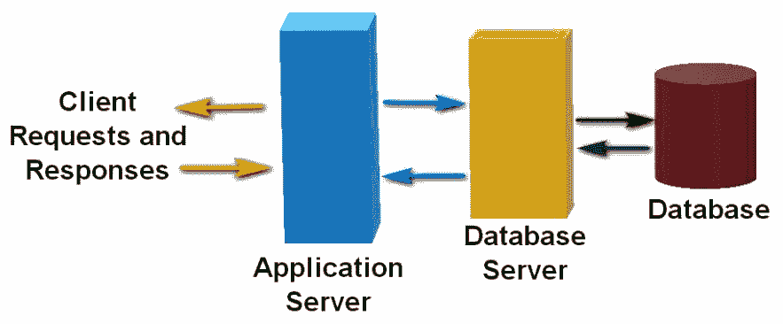

在三层客户端/服务器系统中，应用服务器为用户和数据库管理系统或其他功能特定的服务器提供服务。

+   **基于查询的应用服务器**：这种类型的应用服务器托管一个或多个用于从数据库请求数据的脚本或编程语言服务。用户的计算机可能具有一个活跃的仪表板、状态板，或一个特定的脚本或服务请求系统，例如**Active Server Page**（**ASP**）、**JavaServer Pages**（**JSP**）、Django 或 Ruby on Rails。应用服务器访问数据库并将当前或实时数据返回给客户端软件。

+   **应用/网页服务器**：在许多情况下，应用服务器正逐渐成为网页服务器，反之亦然。任一类型的服务器都可以支持**超文本传输协议**（**HTTP**）的请求与响应流量，并与客户端浏览器互动。独立的网页服务器（也称为 HTTP 服务器）通常除了执行基本的网页服务器职责外，还包含多个专用脚本和数据库查询服务。具备网页功能的应用服务器包括向客户端浏览器传送网页内容的能力。网页/应用服务器的例子有 IBM WebSphere、Oracle iPlanet、Apache Tomcat 和微软的**Internet Information Services**（**IIS**）。

# 数据库服务器

如前图所示，在*应用服务器*部分，数据库服务器提供了客户端请求与数据库管理系统及其数据库之间的接口，无论是直接连接还是通过应用服务器。在大多数情况下，应用服务器将数据请求传递给数据库服务器，以处理和检索请求的数据。然后，数据库服务器将数据返回给请求节点。在数据库客户端/服务器环境中，执行数据库输入/输出操作的数据库管理系统是后端。运行在主机计算机或应用服务器上的软件是前端。数据请求从前端流向后端，然后再返回。

# 目录服务器

目录服务器支持目录服务。好的，*那么什么是目录服务呢？* *你是否曾进入一栋非常高的建筑物，使用目录板找到你需要寻找的人员或组织所在的位置？* 通常，你会找到名称，并且同一行上有位置。*听起来是不是很熟悉？* 目录服务交叉引用或映射计算机或网络资源的名称、指定或位置到它们各自的本地或网络地址。

通常识别和寻址的资源包括磁盘卷、目录、文件夹、文件、输入设备、输出设备以及系统上连接或安装的任何其他设备。这项服务在网络中至关重要。有了这些信息，资源就可以被定位、使用和管理。如果没有目录服务，网络资源的寻址就像一个没有街道地址的城市。高效的网络操作将变得不可能。目录服务也被称为名称服务，因为它们管理一个命名空间。**命名空间**是一种数据抽象，保存系统资源的名称或身份列表，并且这些资源的网络地址或位置。在命名空间中，用户、应用程序和其他服务可以访问资源，而无需事先知道其位置。目录服务器或名称服务器是一个服务器应用程序，它提供目录或名称服务的组织、管理和安全性，例如，微软的 Active Directory、Red Hat 目录服务器、Lotus Domino。

# 文件服务器

文件服务器顾名思义——就是一个用于文件的服务器。文件服务器有多种类型，但通常来说，文件服务器为网络上的其他节点提供数据资源。文件服务器的配置是多个因素的组合，包括存储容量、访问时间、安全性、容错能力，当然还有预算。为了最好地满足组织的数据需求，文件服务器必须根据这些因素的合适组合进行设置。文件服务器可以扮演两种角色之一：

+   **专用文件服务器**：这种类型的文件服务器专门为客户端提供文件或数据库内容。专用文件服务器仅在这个角色下运行。

+   **非专用文件服务器**：这种类型的文件服务器支持两个或更多的服务器服务或功能。

定义这些角色的是数据共享的方法。文件服务器可以是**文件传输协议**（**FTP**）服务器、**服务消息块**/**公共互联网文件系统**（**SMB**/**CIFS**）协议服务器、HTTP 服务器，或**网络文件系统**（**NFS**）服务器。另一种文件服务器的形式是**网络附加存储**（**NAS**）系统。

# 邮件服务器

邮件服务器，也被称为**电子邮件服务器**或**邮件传输代理**（**MTA**），处理并传输网络上的电子邮件信息，直到互联网。邮件服务器模拟人类邮递员的功能，接收传入邮件并将其转发到目的地，通常是另一个邮件服务器。邮件服务器与邮件传输的两个主要协议是**简单邮件传输协议**（**SMTP**）和**邮局协议 3**（**POP3**）。SMTP 在邮件服务器之间传输消息。POP3 是一个客户端协议，它与邮件服务器交互，发送和接收指向特定用户的消息。

# 消息服务器

消息服务器是一个中间件服务，接收、转发或保存客户端应用程序和服务之间的消息。这些消息在运行在网络上的客户端进程之间通信请求、响应和状态更新。消息服务器主要有两种类型：

+   **点对点消息服务器**：这种消息传递是一个客户端通过消息服务器与单个收件人客户端之间的通信。尽管其他客户端可能在监控消息通道，但只有被寄信客户端会收到消息。点对点消息服务的一个例子是 Java 消息服务。

+   **发布-订阅消息服务器**：这种消息传递方式从客户端（发布者）通过消息服务器传递到包含多个订阅客户端的消息类别。订阅者指示希望接收哪些消息类别。然后客户端只接收他们已订阅的类别的消息。发布-订阅消息服务的例子包括 Faye、NATS 和 Redis。

# 网络服务服务器

网络服务是网络服务器向网络客户端提供核心服务的服务，如数据存储**输入/输出**（**I/O**）操作、信息显示、点对点通信等。网络服务在 OSI 应用层上运行。

尽管**网络操作系统**（**NOS**）提供了大部分网络服务、协议和服务，如**域名系统**（**DNS**）、**动态主机配置协议**（**DHCP**）、即时通讯、**网络语音传输协议**（**VoIP**）、**网络时间协议**（**NTP**）和电子邮件可以从集中式网络服务服务器运行。

# 打印服务器

打印服务器是一种设备（计算机、设备或软件），接受客户端的打印请求并提供对网络连接的打印机、绘图仪或其他成像设备的排序和管理。直接连接到台式计算机的打印机可以通过打印队列管理打印功能，通常按先到先服务的原则进行。在网络上，有任意数量的客户端请求打印服务时，对打印机的访问有时可能会引起争议。除了管理网络的打印队列外，打印服务器还可以管理或执行打印策略，例如打印量、彩色打印等。今天的打印服务器是专门用于单一打印功能的独立网络设备。以下图示显示了包括打印服务器的无线网络：

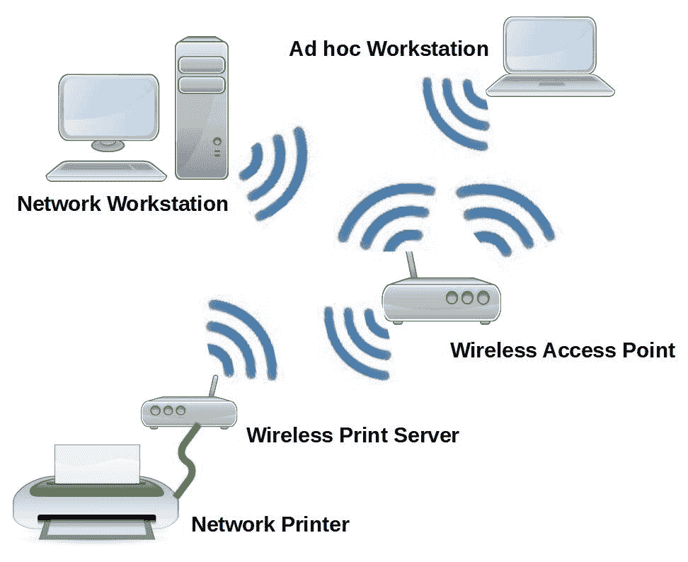

包括打印服务器的无线局域网

# 代理服务器

代理服务器是中介网络服务，它接受来自远程服务器的网络客户端请求资源。代理服务器检查客户端的请求并确定提供请求资源的最有效方式。客户端的请求可以是服务、文件或网页等各种基于网络的资源。在今天的网络中，代理服务器通常是 Web 代理，提供多种功能，例如减少网络流量、隐藏请求者身份和绕过 IP 地址屏蔽等。代理服务器不一定需要中央网络计算机来操作。代理服务器可以位于一个或多个用户的工作站上，网络中的一台服务器，或介于两者之间的多个位置。代理服务器的位置远不如其将用户工作站连接到互联网上所需服务器的能力重要。代理服务器有多种类型，每种类型提供一种主要服务。最常见的代理服务器类型有：

+   **网关代理服务器**：这种类型的代理服务器，也称为**应用级网关**或**隧道代理服务器**，作为本地网络与互联网之间的门户，发送和接收未修改的客户端请求和响应。

+   **面向互联网（转发）代理服务器**：这种类型的代理服务器促进内部网络向互联网请求资源。

+   **开放代理服务器**：这些是转发代理服务器，将请求和响应消息发送到或从任何地方的内部网络传输。

+   **内部代理服务器**：这种类型的代理服务器提供多种方式来保护和服务其内部网络。反向代理服务器可以执行身份验证、授权、缓存、解密和负载均衡。

+   **反向代理服务器**：内部代理服务器的一个常见用途是作为反向代理服务器。此类代理服务器接受来自互联网的请求，例如 HTTP 请求，并将其传递给适当的内部网络服务器进行处理。

# 路由与远程访问服务（RRAS）

RRAS 是一套微软协议，旨在提供三种基本功能：

+   **防火墙**：Windows Server 2008 中的 Windows 防火墙替代了 RRAS 中的基本防火墙功能。

+   **路由器**：配置为运行 RRAS 的服务器可以执行多协议路由，包括 IP、IPX、AppleTalk、**路由信息协议**（**RIP**）、**开放最短路径优先**（**OSPF**）和**互联网组管理协议**（**IGMP**）的路由。

+   **远程访问**：为拨号和**虚拟私人网络**（**VPN**）客户端提供远程访问连接，支持 AppleTalk、IP 或 IPX。

RRAS 采用**点对点协议**（**PPP**）作为其传输协议。这使得 RRAS 能够结合路由器和远程访问功能。

# 虚拟服务器

虚拟的东西就像某物，但它实际上并不等同于那个东西。所以，**虚拟服务器**就像是一个服务器，但它并不真正是服务器。嗯，差不多。虚拟服务器是一个软件支持的逻辑对象，运行在物理计算机的内存中。只要物理计算机具备足够的硬件资源，特别是内存，它可以支持多个虚拟服务器。如下图所示，一台物理计算机可以支持一个、两个甚至更多虚拟服务器。除了硬件和适当的设备驱动程序外，虚拟化层——称为**虚拟机监控程序（Hypervisor）**，直接为虚拟服务器提供支持，每个虚拟服务器都在内存中占据一个外壳。每个虚拟服务器都可以支持多个虚拟机，这些虚拟机可以安装在同一台主机硬件上，或者其他网络计算机上：

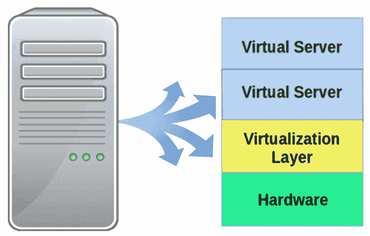

一台物理计算机可以承载一个或多个虚拟服务器

# 外形规格

对于计算硬件，**外形规格**指的是计算机机箱及其内部组件的尺寸、形状和其他物理特性，包括电源、内部存储设备的安装支架、主板及其支架、内存、扩展卡、微处理器插槽及其他插槽和支架。接下来的图像展示了多种主板外形规格，每种规格的主板都被设计成适配相同外形规格的计算机机箱。例如，一块 ATX 主板安装在 ATX 计算机机箱中：

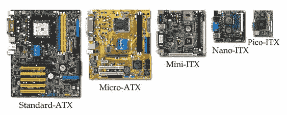

五种不同外形规格的主板

图片来源：VIA Technologies, Inc

# 塔式服务器

在较小的网络和一些家庭网络中，常见的做法是将一台塔式计算机作为网络服务器。像下面图片中的塔式计算机，通常是放置在一个立式机箱或柜子中的。塔式计算机常用作网络服务器。这意味着塔式计算机通常会比**小型办公室/家庭办公室**（**SOHO**）计算机拥有更多不同的组件和连接器，哪怕它们也位于塔式机箱中：

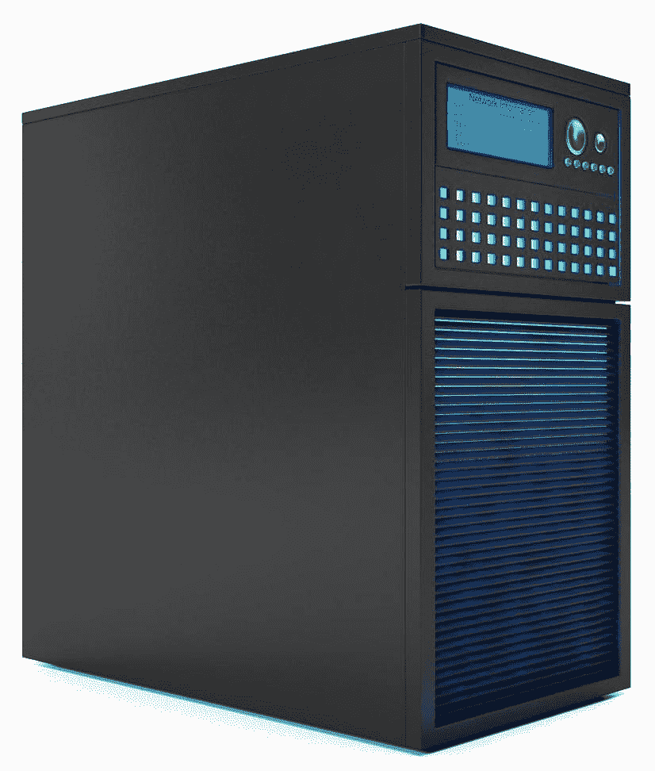

一台塔式网络服务器

塔式机箱的直立高大设计提供了更好的内部组件散热。然而，当塔式计算机被集群使用时，它们占用更多空间并可能造成复杂的布线安排。此外，塔式计算机通常并不是最安静的设备。

# 机架式安装

服务器运行的计算机硬件被安装在一个纤薄的机箱内，固定在机架系统中。机架本身通常是一个两轨或四轨的垂直结构。服务器或其他机架安装设备通过安装支架固定在垂直轨道上，支架由水平安装的轨道组成，设备坐落于其上，并有紧固件将两者固定在垂直支柱上。连接到机架安装设备后部的电缆可能会安装在一个电缆管理臂上，这有助于 1）整理设备上的电缆，2）在维修或升级设备时避免电缆阻碍。机架安装设备的高度以机架单元（U）为单位进行衡量。一个机架单元等于 1.75 英寸（44.45 毫米）高。机架安装设备的尺寸是以其在垂直机架中占用的 U 数为标准。下图展示了**1U**、**2U**、**3U**和**4U**半机架安装设备的相对尺寸。服务器最常见的尺寸为**1U**或**2U**：

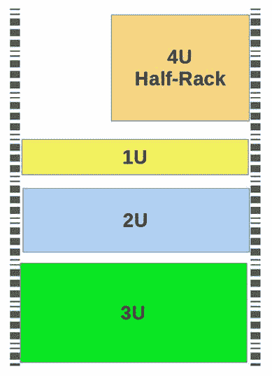

机架式服务器的尺寸以机架单元（U）为单位

**电子工业联盟**（**EIA**）已为机架系统设定了一个标准，高度为 42U，宽度为 19 英寸或 23 英寸（48.3 厘米至 58.4 厘米）。机架的深度可以根据整体结构或机柜的大小而有所不同，如下图所示：

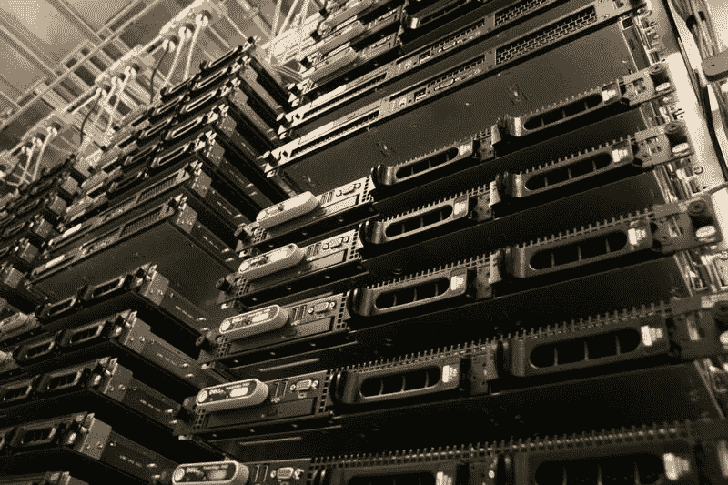

安装在机架系统中的 1U 机架服务器

图片来源：2018 年 FatCow Web Hosting

# 刀片技术

刀片服务器机箱容纳多个服务器刀片，每个刀片是一个缩小版的计算机，可以插入机架可安装的刀片机箱槽中。刀片设计的目的是减少物理体积、减少直接接口的数量，并降低服务器系统的整体功耗。为了实现这一目标，每个刀片都配备了执行内部处理所需的组件。冷却、电力、网络、布线和管理系统都集成在刀片机箱中或由机架或机柜中的其他设备提供。如以下图片所示，一个刀片服务器机箱支持多个服务器刀片。每个安装在刀片服务器中的服务器刀片，实际上是一个独立的服务器，具有处理器、内存、网络适配器和**主机总线适配器**（**HBA**）。通常，一个服务器刀片仅支持一个应用或服务：

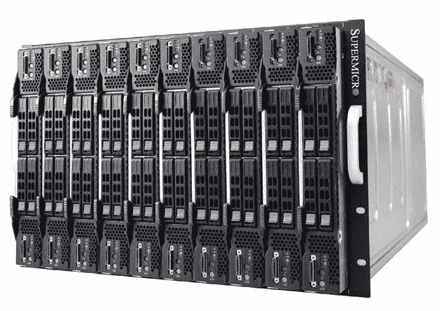

机架安装的刀片服务器机箱中的多个服务器刀片

图片来源：超微计算机公司

# 服务器电力系统

无论服务器系统的形态如何，其电力需求都高于桌面或笔记本电脑。吉尔斯特法则（关于计算的一切）指出：

"你永远无法确定，一切都取决于情况。"

这基本概述了服务器的电力和冷却系统。服务器所需的功率（以瓦特为单位）由安装的组件和附加设备决定。冷却也是如此。所需的冷却量和种类取决于电力驱动下组件产生的热量。然而，无论服务器是独立计算机还是数据中心的刀片服务器，设备的电力和冷却系统必须提供足够的服务来驱动和通风其组件。选择和安装适当设备的挑战在于预见系统的增长或对这些服务的需求增加。网络服务器的事实标准机型是标准 ATX（如之前在*机型*部分的图片中所示）。ATX 标准设定了服务器主要组件的外形、尺寸和功能，主要是主板、**电源单元**（**PSU**）和机箱。这确保了这些组件的兼容性和互操作性。

# 电力

在我们深入讨论电气系统和电力之前，先来了解一些你在讨论中会遇到的术语：

+   **电流**：电荷的流动或运动

+   **电阻**：反对电流流动的电线特性

+   **安培**：电流流动的速率

+   **电压**：电流电力的标准测量单位

+   **瓦特**：辐射、吸收或散发的能量输出率

+   **接地**：与地球之间通过导电连接的保护措施

这些术语及其含义对于讨论电源供应和冷却系统非常重要。接下来的章节将探讨网络服务器电力的不同特性和应用。

# 交流电与直流电 / 110V 与 230V

电源单元（PSU）的主要功能是将**交流电**（**AC**）或**直流电**（**DC**）转换为低电压的直流电，以供服务器内部组件使用。在北美，主要的家庭电力服务是 120V 交流电（通常称为 110V），其实际电压范围为 115V 至 127V。世界其他地区（包括美国的一些商业数据中心）使用的直流电主电源标准是 230V，±10%。在美国，电源单元（PSU）的输出电压符合 ATX 标准：+3.3VDC、+5VDC 和±12VDC，无论电力输入如何。由于电压在一定范围内波动，因此某些系统使用不同的数字，但它们指代的是相似的系统。例如，美国的标准家庭电压是 120V 交流电。请注意，在下面的表格中，**星形电压**栏中的 120V 根据电路连接方式，可能提供 208V 或 240V：

| **星形电压** | **三角电压** |
| --- | --- |
| 120 | 208 |
| 120 | 240 |
| 230 | 400 |
| 240 | 415 |
| 277 | 480 |
| 347 | 600 |

美国常见的星形接法和三角接法电压

# 星形接法与三角接法

在电气电路图中有两种标准配置——**星形（Wye）**和**三角形（Delta）**。这些名称描述了它们在电路图中大致的形状。星形配置将带电线路连接到中性线，形成一种*Y*形状。三角形配置将两根带电线路连接在一起，形成一个三角形。记住它们的简单方法是，星形电路使用中性线，而三角形电路则不使用。

# 负 48V

电信信号的电压标准，包括无线网络，是负 48V 电源。所有电气电路都以正（+）和负（-）极性运行，形成一个*带电*侧和一个*接地*侧。110V 和 230V 系统将接地连接到负（-）极侧。负 48V 电源将其接地连接到正（+）极侧。如果你想知道为什么电信系统使用负电压标准，那是因为这种电压对人类更安全，尤其是对于那些爬电线杆的人来说。

# 一相与三相

电气电路以三种配置之一传输——单相、分相或三相。以下是这些术语的基本定义：

+   **单相电**：一种二线交流电配电系统，其中一根电缆承载电流，另一根电缆为中性线。下图展示了单相线路的波形。

+   **分相电**：一种三线单相交流电配电系统，其中两根电缆承载电流，第三根电缆为中性线。分相电配电在家庭和小型商业建筑中较为常见。

+   **三相电**：一种四线系统，其中三根重叠的电缆承载交流电流。每根电缆及其电流相对于其他电缆有所偏移，如下图所示。第四根电缆作为中性线。三相电是大型电网、工业用途和数据中心的传输标准：

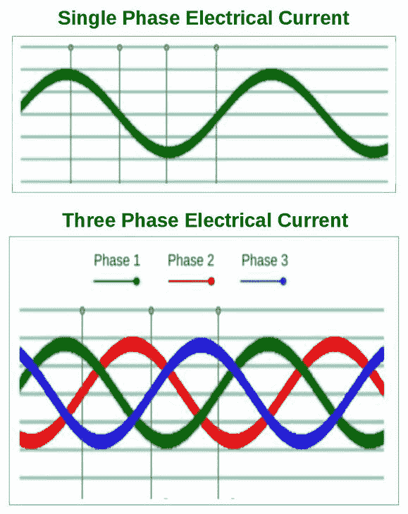

单相和三相电流

# 电源单元（PSU）

让我们从内到外看看服务器的电力系统，从安装在服务器机箱内的电源单元（PSU）开始。PSU 模块通常在制造时安装在系统机箱上。然而，由于 PSU 是计算机系统中最常见的故障点，即便是制造时附加的 PSU 也是可以更换的。服务器的电力需求取决于其大小及已安装或附加的组件。随着磁盘驱动器、网络适配器和内存的数量增加，服务器所需的电力也会增加。服务器的 PSU 需要比标准台式机或便携式计算机中包含的 PSU 更强大且在操作上更高效。由于服务器对网络至关重要，它们必须保持可用，这意味着它们的电源单元必须持续稳定地提供所需的电压，以便为服务器供电。

# 功率

市面上大多数电源，除了一些*有信誉*的厂商的产品，可能使用劣质组件，并宣称过高的性能指标。虽然电源的瓦特数只是衡量其性能的一个指标，但许多计算机用户仅依赖电源的瓦特数作为选择电源的决定性因素。制造商明白瓦特数对消费者的重要性，因此会确保它在包装和电源本身上都十分显眼，如下图所示：

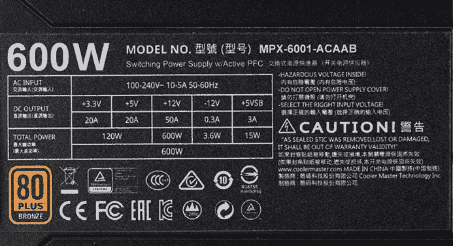

一款 600 瓦酷冷至尊电源的产品标签

图片来源：酷冷至尊科技公司

# 80-plus 认证

80-plus 认证计划是基于电源效率的计算机电源自愿认证。*80*代表设定为不同负载水平下的最小运行效率标准。根据电源的性能水平，提供六个认证级别。符合每个认证级别要求的产品可以在包装、市场营销和产品标签上附上徽章，如下图所示。第一个级别是基本的 80-plus 认证（称为*White*），验证电源在 20%、50%和 100%负载下的效率为 80%。中等级别是*Gold*，认证电源在这三个负载下的效率至少为 87%。最高级别是*Titanium*，验证电源在所有负载下的效率超过 90%。下面的图像展示了 80-plus 计划的各个认证级别：

80-plus 计划的电源认证级别

# 选择合适的电源

在选择服务器电源时，除了考虑所需的瓦特数外，你还应考虑几个其他因素。以下列出了选择适合你服务器的电源时应考虑的特点和功能：

+   **瓦特数**：这个数字代表服务器对电源的功率需求，以瓦特为单位。有多个在线瓦特数计算器（见下方截图）可以帮助你计算服务器所需的总瓦特数。建议在初步计算中加上计划中的服务器或网络扩展的瓦特数：

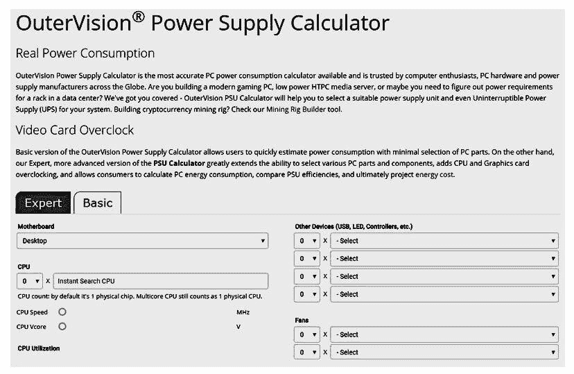

基于网络的互动电源计算器

图片来源：eXtreme Outer Vision, LLC

+   **连接器与模块化**：确保电源供应器附带的连接器与将要连接的组件兼容。模块化电源供应器没有内置电缆，只有插座。这可以最大限度地减少电源上电缆的数量，只保留必要的连接，避免杂乱。非模块化电源则有不同数量和类型的标准连接器。目前大多数电源供应器常见的连接器包括：

    +   ATX 24 针或 ATX 20+4 针主电源线连接器

    +   8 针 **入门级电源供应** (**EPS**) +12 伏特

    +   4+4 针 +12 伏特电源线连接器

    +   6 针 **PCI express** (**PCIe**)

    +   8 针 PCIe

    +   6+2 针 PCIe 电源线连接器

    +   4 针外设电源线连接器

    +   SATA 电源线连接器

+   **高效能评级**：80plus 认证是一个很好的指导标准，但你应当验证电源供应器的效率评级，这应该是在实际负载模拟下测试得出的结果。80% 的效率评级意味着电源供应器的 20% 能量（瓦特）以热量的形式损失。

+   **轨道**：在电源供应器的上下文中，轨道指的是单一电压输出的电流。例如，ATX 电源供应器有一个 3.3V 轨道，两个 5V 轨道（分别用于 +5V 和 -5V），两个 12V 轨道（分别用于 +12V 和 -12V），以及一个 5V 待机轨道。

+   **外部连接**：这听起来可能微不足道，但如果没有适合你所在地区（国家）的外部电源线及相应的连接器，所有你精心策划和选择的努力将付之东流。如果你在美国，使用符合 **国家电气制造商协会** (**NEMA**) 标准的电源线和插头。NEMA 5-15P 插头是美国最常见的连接器。在如数据中心等功率需求更高的场合，选择更强力的连接器是明智的。在这些场合，像 NEMA 5-30R 这样的旋锁连接器可以将插头牢牢固定在电源插座中。

+   **电压切换**：许多电源供应器（PSU）包含电压传感器，能够自动检测电流并切换到其适当的电压和模式。然而，并非所有电源供应器都具备此功能——有些具有手动开关，有些则根本没有开关，仅支持单一电力服务。

# 冗余

确保服务器或服务器集群具备容错能力并提供高可用性的一种方式是采用冗余电源系统。冗余电源系统可以在主电源出现故障时提供安全保障。最基本的冗余电源形式包括两个独立的电源供应器（PSU），它们可以一起为服务器提供电力，交替工作，或一个电源处于工作状态，另一个处于待机模式。本节中的图像展示了一个四单元冗余电源供应系统。冗余单元之间的切换使用三种配置之一：

+   **OR**：OR 是一种数学过程，用于在两个（或更多）选项之间进行选择，类似于*要么...要么...*。在这种配置中，两个 PSU 可以共享电力负载任务，或者其中一个 PSU 可以处于待机模式。在这两种情况下，当**金属氧化物半导体场效应晶体管**（**MOSFET**）检测到某个单元的电力输出下降时，它会切换到备用 PSU。

+   **N+1**：N+1 切换方法通常用于具有三个或更多电源的冗余系统。在这种安排中，+1 电源是备用单元，N 个电源共享电力转换操作。

+   **N+1 的 OR**：这种方法常用于 PSU 刀片系统。每个刀片是 N+1 分组的一部分，并与两个或更多电源总线相连。与其他冗余配置一样，每个 N+1 分组可以共享电力转换或处于待机模式：

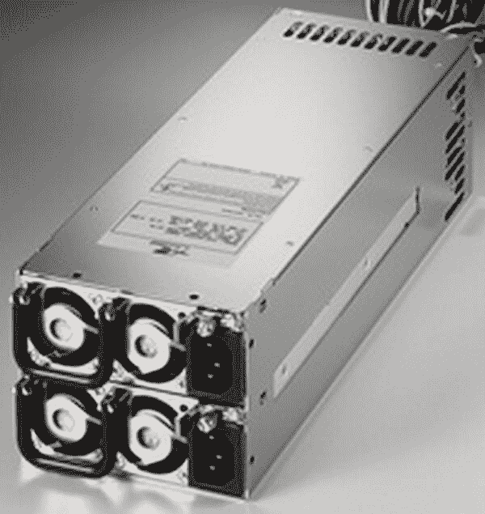

四单元冗余电源

图片来源：Zippy Technology Corp.

# 系统散热

所有电子设备都会产生热量。某些设备产生的热量比其他设备更多，因此必须通过散热来降低热量的影响，以避免故障或间歇性问题。服务器内部的电子组件（大多数位于主板上）中产生大量热量的包括微处理器、**图形处理单元**（**GPU**）、芯片组、内存和**电压调节模块**（**VRM**）。其中，微处理器（CPU）和 GPU 是服务器内部产生最多热量的组件。高温环境或被称为**热应力**的情况可能会影响电子组件的使用寿命或运行状态。物理学告诉我们，当物体变热时，它们会膨胀；当它们冷却时，会收缩。任何在热与冷循环中持续扩展与收缩的电子组件都会受到压力，这可能导致性能问题。热与冷之间的温差越大，损害的严重程度越高。现在，大多数新型计算机系统和处理器都具有一种称为**热设计功率**（**TDP**）的等级，该等级表示系统或单元产生的热量。下表列出了一些处理器的最大 TDP 等级示例。该值表示散热系统必须散发的热量，以保持系统的正常运行。尽管目前没有统一标准来解释 TDP，较低的值意味着功耗和产生的热量较低。TDP 只是系统散热需求的一个一般指标。

| **处理器** | **最大 TDP** |
| --- | --- |
| Intel Atom Z3740 | 4W |
| AMD A10 Micro-6700T | 5W |
| Intel Core i3-5020U | 15W |
| Intel Xeon E5-2630L v4 | 55W |
| AMD Ryzen 5 PRO 2600 | 65W |
| Intel Core i5-7600K | 91W |
| AMD Ryzen 7 2700X | 105W |
| Intel Core i9-7980XE | 165W |

微处理器及其 TDP 等级示例

# 散热系统

无论是形状、形式、大小还是用途，计算机都需要冷却系统。在台式机、塔式机和一些笔记本电脑中，冷却系统位于机箱内部。对于刀片服务器，冷却可能在刀片柜、机架柜或整个计算机房中。为冷却计算机系统的内部组件，存在多种不同的方法。其中一些是传统方法，另一些是新型方法。在 Server+ 考试中，您需要理解以下章节中描述的冷却系统。

# 空气冷却和气流

一个基础的空气冷却系统通常是计算机机箱和内部组件中默认配置的系统。它最简单的形式由**散热片**、**导热膏**和计算机的**机箱风扇**组成。散热片直接连接到 CPU，两者之间涂有少量的导热膏，以提供热传导。散热片和 CPU 之间的空气间隙可能会起到热绝缘作用，因此导热膏可以消除这种可能性。散热片是带肋的金属挤出物，延伸了 CPU 的表面，允许更多的空气带走热量。一个或多个机箱风扇的气流穿过散热片的鳍片，带走热量。这种散热方式被称为**被动冷却**。通过添加隔板或气流偏导器，将气流特别引导到被动冷却系统中，可以增强空气冷却系统的效果。

一些高端机箱不仅包括多个风扇（两个或更多的机箱风扇和一个显卡风扇），还配有一个导风系统，将气流引导至 CPU 和机箱中的其他热点。与使用气流来冷却计算机的方式相对的是**液体冷却**，它利用冷却液将热量从 CPU 中带走。液体冷却应用了热力学原理，即热量会从温暖的物体转移到较冷的物体上。CPU 液体冷却系统的工作原理类似于汽车的冷却系统。液体冷却剂，在这种情况下是蒸馏水，通过 CPU 附件泵送。水的冷却作用将 CPU 的热量带走，并通过气流散发出去。

下图展示了散热器（左侧）和 CPU 附件（右侧）：

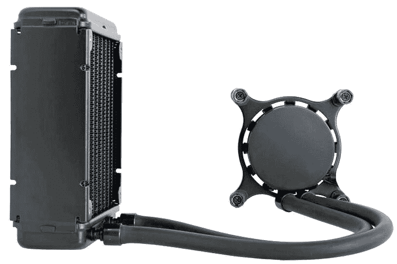

一个 CPU 液体冷却系统

图片来源：Asetek

# 总结

在本章中，你了解到计算机上运行的软件确立了它作为服务器的角色。服务器可以为网络的客户端提供多种服务，包括：应用程序服务器、文件服务器、邮件服务器、消息服务器、网络服务器、打印服务器、RRAS 以及 Web 服务器。不同类型的应用程序服务器有局域网应用程序服务器、基于查询的应用程序服务器以及应用程序/Web 服务器。文件服务器可以是专用的，也可以是非专用的。网络服务服务器提供 OSI 应用层上的核心服务。虽然操作系统提供了许多网络服务和协议，但如 DNS、DHCP、IM、VoIP 和 NTP 等服务可能来自网络服务服务器。代理服务器是中间网络服务器，它接受、履行、过滤并转发远程客户端的请求。代理服务器的类型有：网关型、面向互联网型、开放型、面向内部型和反向型。在 Server+ 考试中，你可能会遇到另外两种服务器类型：RRAS，它是一种提供防火墙、路由器和远程访问服务的网络服务服务器，以及虚拟服务器，它是一个在物理计算机内存中运行的软件启用逻辑对象。服务器和计算机通常遵循特定的外形标准。外形标准规定了计算机外壳的尺寸、形状、物理特性、电源和冷却性能，以及电源、主板、内存和其他组件的安装方式。

服务器的外形标准是 ATX。塔式计算机有一个立式机箱或机柜，台式机和笔记本设计也是如此。机架可安装服务器通常为 1U 或 2U 高度，其宽度与机架或机柜的宽度匹配。刀片服务器外壳是一种类似机柜的设备，用于容纳服务器刀片，每个刀片都是一台服务器。电源单元（PSU）将国内的交流电或直流电（110V 或 230V）转换为 +3.3VDC、+5VDC 和 +/- 12VDC，电信设备使用 -48V 电源。选择服务器电源单元时需要考虑的因素包括功率、连接器和模块化、效率等级、轨道、外部连接和电压切换。冗余电源具有两个或更多电源单元，它们可以结合使用、交替使用或通过活动和备用方式提供电力。服务器内部的组件，尤其是 CPU、GPU、芯片组、内存和 VRM，产生的热量可能会对某些组件造成热应力。热应力可能并且通常会影响电子组件。

服务器常见的两种冷却系统是被动冷却（空气冷却）和液体冷却系统。被动系统包括散热器、热导膏和机箱风扇。液体冷却系统通过管道和散热器泵送蒸馏水，水吸收的热量在冷却后再循环使用。在下一章中，我们将详细了解服务器的关键内部组件，这些组件需要电力并且需要冷却，包括 CPU、RAM、各种总线结构、BIOS/UEFI 和 CMOS。这些内部服务器组件对服务器的整体操作至关重要，因此在 Server+ 考试中会特别强调它们。

# 问题

1.  以下哪项不是常见的应用服务器类型？

    1.  局域网应用服务器

    1.  网络服务器

    1.  DHCP 服务器

    1.  基于查询的应用服务器

1.  以下哪项关于文件服务器的说法是正确的？

    1.  文件服务器只能是专用服务器

    1.  文件服务器可以是专用的或非专用的

    1.  文件服务器不能虚拟化

    1.  文件服务器和数据库服务器本质上是相同的

1.  什么类型的服务器托管像 DNS、DHCP、VoIP 和 NTP 这样的协议？

    1.  代理服务器

    1.  文件服务器

    1.  消息服务器

    1.  网络服务服务器

1.  你有任务需要在内部网络上安装和配置一个代理服务器，以减少从局域网到广域网的流量。你应该使用哪种常规配置？

    1.  网关

    1.  面向互联网

    1.  内部面向

    1.  开放

    1.  反向

1.  对还是错：虚拟服务器是任何托管虚拟专用网络的服务器。

    1.  对

    1.  错

1.  以下哪项是网络服务器的事实标准机箱规格？

    1.  LTX

    1.  AT

    1.  ATX

    1.  Mini-ATX

1.  机架单元或“U”的标准高度是多少？

    1.  1.75 英寸

    1.  2.75 英寸

    1.  3.50 英寸

    1.  50 毫米

1.  ATX 电源单元为服务器硬件的内部组件提供哪些电压？请选择所有适用项。

    1.  +3.3VDC

    1.  110VAC

    1.  +5VDC

    1.  +/- 12VDC

    1.  -48VDC

    1.  230VDC

1.  服务器的空气冷却系统是什么类型的系统？

    1.  活跃

    1.  被动

    1.  液冷

    1.  隔板
