# 服务器内部结构

在上一章中，我们讨论了服务器的电源和冷却系统。现在，让我们来看看服务器的关键内部组件。你知道，就是那些需要供电和冷却的部分。这包括 CPU、RAM、各种总线结构、**基本输入输出系统** (**BIOS**)/**统一可扩展固件接口** (**UEFI**)和**互补金属氧化物半导体** (**CMOS**)。我们还将讨论 BIOS/UEFI 服务器固件。在本章中，我们将涉及以下内容：

+   **中央处理单元** (**CPU**)

+   主存储器

+   总线、通道和扩展插槽

+   BIOS/UEFI 配置

# CPU

CPU 有许多名称（也叫微处理器、处理器、大脑等），它是执行程序指令、执行算术运算并控制数据的流动以及与计算机连接或安装的外设输入输出功能的电子组件。但这些你肯定已经知道了。

对于 Server+考试，你需要了解的更多是 CPU 的特性，而不是它的工作原理，包括其安装插槽、时钟频率、核心数、步进等。所以，让我们开始吧。

# 多处理器

多处理器环境是一个拥有两个或更多集成 CPU 的单一计算机系统。CPU 共享计算机的内存、总线和其他资源。各 CPU 协同工作，按顺序执行程序指令，其中一个 CPU 执行一条指令，而其他 CPU 同时执行另一条指令。这个过程的目的是让计算机比单处理器（单处理机）运行得更快：

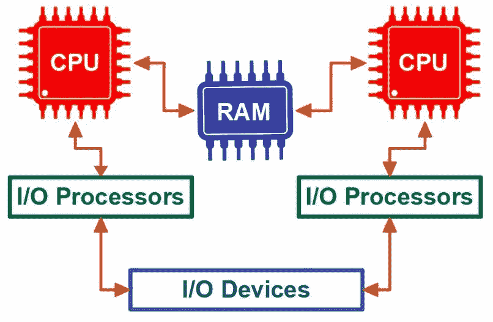

一个简化的双处理器多处理系统视图

# 对称多处理（SMP）与非对称多处理（ASMP）

多处理器系统中的 CPU 可以设置为对称或非对称的多处理方式。在 SMP 中，CPU 平等共享操作系统、主存储器、总线、输入/输出驱动程序和设备。SMP 系统的目标是平衡处理器之间的计算负载并加速处理速度。然而，建议 SMP 系统中的处理器数量不超过 16 个。

在 ASMP 中，一个 CPU 是主控 CPU，所有其他 CPU 为从属 CPU。主控 CPU 处理操作系统任务并将进程请求分配给从属 CPU。从属 CPU 可以是通用的，也可以专门用于特定的处理任务。主控处理器在必要时借助从属处理器来控制系统功能。

# SIMD、MISD 和 MIMD

多处理器系统可以执行*并行处理*，其中每个处理器执行相同的指令或一组独特的指令，操作相同的数据集或多个数据集。今天的多处理计算机支持不同类型的并行处理，三种主要形式为：

+   **单指令多数据（SIMD）**：多个处理器在不同的数据源块上执行相同的指令。SIMD 加速了多媒体处理。

+   **多指令单数据（MISD）**：多个处理器在同一个数据源上执行不同的指令。MISD 计算不常见，因为这种并行处理方式通常只适用于特定的问题。

+   **多指令多数据（MIMD）**：多个处理器在不同的数据源块上执行不同的指令。MIMD 就是大多数人所理解的并行计算。

# 多核处理

多处理器处理是指多个微处理器作为一个整体单元进行工作，而多核处理则是一个微处理器内部包含多个处理器或核心。每个核心都是一个微处理器，能够处理与其他核心不同的指令流，且这些核心都位于同一**集成电路**（**IC**）芯片上。

如果你拥有一个四核处理器，那么你的 CPU 内部包含了四个独立的处理器。这意味着你可以同时查看电子邮件、观看视频、在电子表格中处理预算和收听音乐流。每个动作都在自己的核心上独立运行：

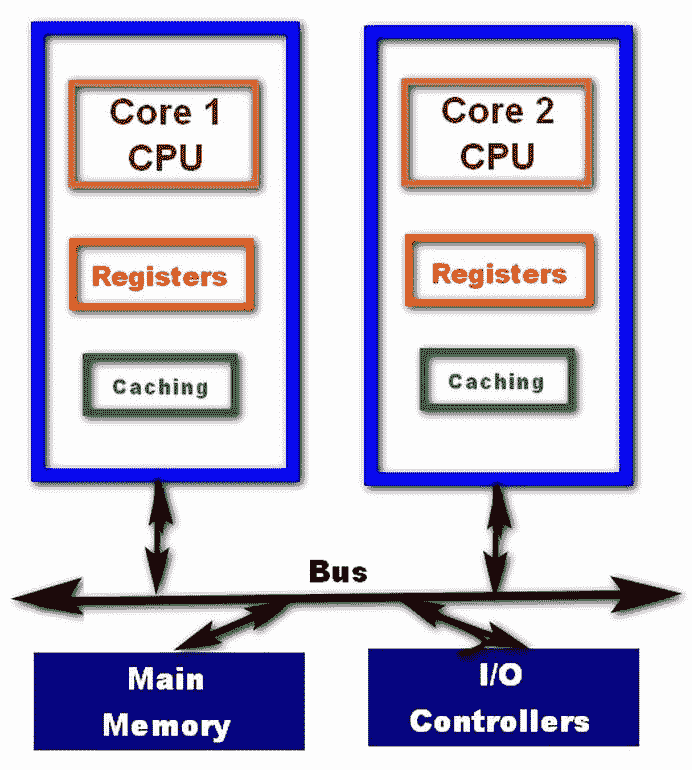

双核微处理器结构的简化视图

# CPU 封装和插槽

CPU 的形状和结构就是它的封装。几乎所有的服务器 CPU 都采用**土地网格阵列**（**LGA**）封装。在这种封装中，安装引脚是插槽的一部分，CPU 上有接收孔（端口）可以插入每个引脚。下图展示了 LGA 封装的 CPU 底部的端口：

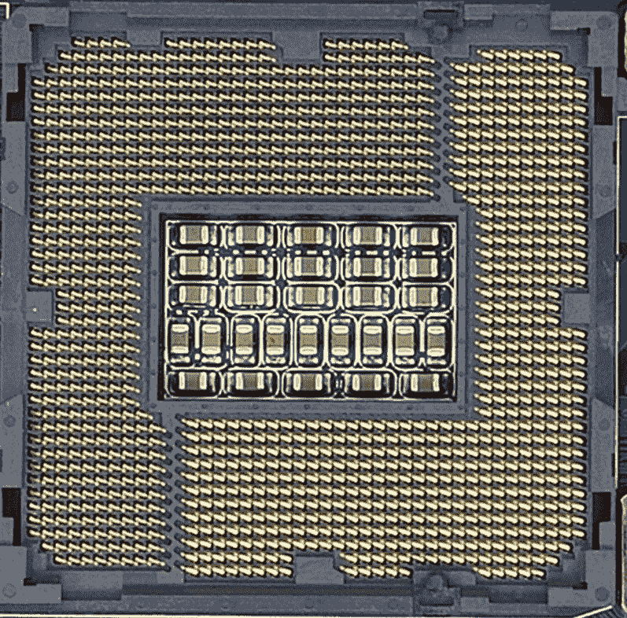

显示 LGA 封装的 CPU 底部，展示安装端口

图片来自：AnandTech

CPU 插槽的种类几乎和 CPU 的种类一样多。下图展示了主板上的 LGA 插槽。注意锁定臂，它将 CPU 固定在插槽中：

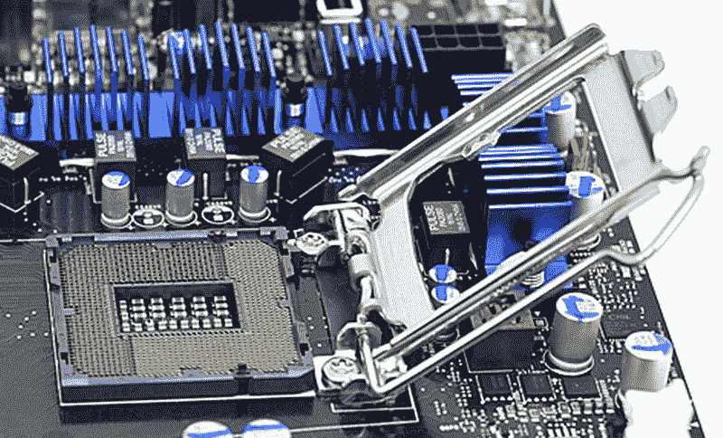

在主板上安装的 LGA 插槽

图片来自：AnandTech

下表列出了一些为多种处理器设计的插槽示例：

| **插槽** | **推出年份** | **兼容 CPU** | **封装** | **引脚数** | **最大速度** |
| --- | --- | --- | --- | --- | --- |
| LGA 771/Socket J | 2006 | 英特尔 Xeon | LGA | 771 | 1600 MHz |
| Socket 1207FX | 2006 | AMD Athlon 64 FX | LGA | 1207 | 2000 MHz |
| Socket G34 | 2010 | AMD Opteron (6000 系列) | LGA | 1974 | 3200 MHz |
| LGA 1248 | 2010 | 英特尔 Itanium 9300 系列 | LGA | 1248 | 1.47 GHz |
| LGA 1567/Socket LS | 2010 | 英特尔 Xeon 6500/7500 系列 | LGA | 1567 | 2.66 GHz |
| Socket SP3 | 2017 | AMD Epyc | LGA | 4094 | 2.9 GHz |
| LGA 2066/Socket R4 | 2017 | 英特尔 Skylake | LGA | 2066 | 4.2 GHz |

常见服务器插槽及其支持的 CPU

例如，2010 年推出的 LGA 1564 或 Socket LS 插槽与 Intel Xeon 6500 系列 CPU 兼容。以下图所示，Socket SP3 插槽适配 AMD EPYC 处理器。通常，一个新的处理器和新的插槽会一起发布。然而，一个新的 CPU 型号或版本也可能适配现有的插槽标准：

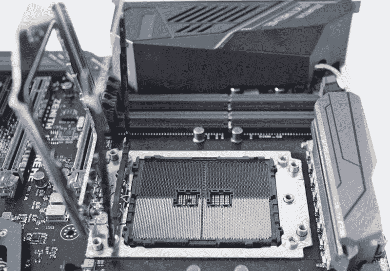

一个 AMD SP3 插槽

图片来自：AnandTech

# 缓存内存

缓存（发音为*cash*），根据字典的定义，是你*为将来使用而储藏的东西*。在计算机系统中，有几种类型的缓存：

+   **浏览器缓存**：当你下载一个网页时，浏览器会存储该页面的一部分或全部内容，尤其是那些不太可能变化的部分，如图片、标题、文本、脚本等。这可以避免在浏览网站时重复下载这些内容。

+   **磁盘缓存**：许多较大的硬盘驱动器包括少量 RAM，作为缓存功能。例如，一个 1TB 的硬盘驱动器有 32MB 的磁盘缓存，用于提高磁盘的 I/O 性能。

+   **内存缓存**：不要与处理器缓存混淆，要求大量数据的应用软件（如图形编辑器）会在 RAM 中创建缓存，以减少 I/O 操作并加快处理速度。

+   **处理器缓存**：在 CPU 和服务器的上下文中，这种类型的缓存（也称为 CPU 内存或缓存内存）为 CPU 提供数据和指令，避免访问较慢的主内存。关于这一点，下一节会进一步介绍。

# CPU 缓存内存

CPU 有一小部分内存供其使用，这部分内存被称为 CPU 内存或缓存内存，由多个层次的**静态 RAM**（**SRAM**）组成，通常有三层，如下图所示。这个缓存的目的是以比主内存 DRAM 更快的速度为 CPU 提供数据和指令。CPU 的缓存系统还会尝试预测 CPU 接下来会请求什么内容，并且基于当前的处理情况，大多数情况下预测是正确的，这使得处理速度更快：

缓存为 CPU 提供了快速的多级缓冲

缓存内存有几个重要的特性：

+   **时间局部性**：缓存内存保存了不变的图像、数据和指令，从而避免了再次从源或主内存中获取它们的需要。

+   **空间（序列）局部性**：通常，CPU 下一个对指令或数据块的请求已经存在于缓存中。如果 CPU 请求的内容不在缓存中，就会发生*缓存未命中*。如果 CPU 请求的是缓存中的内容，就会发生*缓存命中*，这种情况更为常见。

# CPU 缓存内存层次

如在*CPU 缓存内存*部分所示，大多数 CPU 系统包括三种级别的缓存内存。**三级缓存**（**L3**）较慢，但比主内存快，并且是三者中最大的。**二级缓存**（**L2**）比 L3 快，但较小。而**一级缓存**（**L1**）是三者中最快的，且最小。

如前所述，在*CPU 缓存内存*部分，指令和数据从主内存传到 L3，L3 的大小足以包含足够的活动程序或数据，从而预测 L2 及以上级别的下一个请求。多核处理器通常共享 L3 缓存内存。L2 利用空间局部性来预测 L1 会请求什么，并从 L3 请求包含预测项的块。L1 通过更精确地预测 CPU 下一个请求的项，并向 L2 请求该项，继续这个过程。

# 写回/写直通缓存

缓存内存系统利用 CPU 可能空闲的时间——我们这里指的是毫秒级的时间——将从 CPU 或更高级别缓存传下来的数据写入。数据被传送到主内存或直接传送到二级存储设备。这一操作称为**写回**。

在某些情况下，CPU 会直接将数据写入主内存或存储设备。当这种情况发生时，CPU 也会将数据传递到缓存内存。这一操作称为**写直通**。额外的写入步骤会减缓处理速度，但如果下一个 CPU 请求导致缓存命中，系统将获得时间上的好处。

# 高级 RISC 机器（ARM）服务器

看起来，从一开始，Intel x86 系列处理器就一直是网络的核心和大脑。这并不是坏事。只是现在可能有一个新的“新面孔”——ARM。**简化指令集计算机**（**RISC**）是一种专用技术，涉及使用更强大的指令集，指令数量较少。手机和其他移动设备依赖 ARM 处理器来处理许多与内存和存储相关的功能。

由于其简化指令集，ARM 处理器通常比传统处理器体积小，容易适配到处理器核心。现在运行最多 12 核处理器的服务器同样可以使用 ARM 来运行，这可能涉及到多个不太复杂的处理器，它们可以共享计算任务。虽然 12 个处理器会导致服务器性能显著提升，但在 x86 服务器中，处理器仍然可能成为瓶颈，具体取决于其负载。

# CPU 倍频器

与其支持系统相比，CPU 的速度非常快。它的速度或频率（以 MHz 为单位）是计算机**前端总线**（**FSB**）的函数，前端总线将 CPU 与芯片组的北桥（内存控制器中心）连接起来。为了设置其内部频率，CPU 会将一个倍频器应用于 FSB 的实际频率。

倍频是一个比率，通常称为 CPU 倍频、时钟倍频或时钟比率，它被应用于前端总线（FSB）的频率，以确定和设置 CPU 的内部频率。比如对于一个 100 MHz 的 CPU，如果其 BIOS 中定义了 40 倍（40X）的倍频，则该 CPU 的内部时钟频率为 4.0 GHz。

CPU 倍频是超频或降频计算机的关键。要超频计算机，常见于游戏中，只需提高倍频的值。要降频计算机，即减慢其速度，则需要降低倍频的值。超频通常需要额外的散热能力，而降频有助于节省便携设备的电池。

# CPU 修订

**CPU 修订**是指对 CPU 进行修订和编号，以修复错误或改进功能。当制造商发布新的 CPU 时，其修订等级通常为零，或者是零的变体，如**A0**。例如，英特尔将修订版本称为规格更新，并提高修订等级或步骤。AMD 发布*修订号*，每个修订号都比上一个版本的修订号要高。

# 主内存

主存储器、主内存、主存储或 RAM，所有这些名称指的都是计算机的“心脏”。如果 CPU 是大脑，那么 RAM 就提供了计算机中指令、数据、地址和所有其他信息流动的循环。

# RAM

随机存取内存（RAM）允许直接定位和访问数据、指令、地址或状态信息。RAM 中的每个字节都可以被独立地寻址和访问，或者以数据块的形式访问。其随机访问能力有助于提高计算机的整体速度。RAM 的类型如下：

+   **动态 RAM**（**DRAM**）是电气易失性的，必须定期接受刷新电信号才能保持其状态（正或负）。RAM 由数百万个单一的电子组件（晶体管）组成，每个组件只能存储一个单一的值，我们用二进制的两个值之一—`0`或`1`来表示。RAM 由数百万个晶体管组成，每个晶体管可以存储正电或负电的电荷。

+   **静态 RAM**（**SRAM**）是非易失性的，这意味着它不需要刷新，且在计算机供电时能够保持其电荷。当电源关闭后，SRAM 会失去其存储的电荷和所代表的数据。

# 双倍数据速率（DDR）RAM

像处理器一样，RAM 也经历了一些进化阶段。以下是 RAM 的一个简短时间线：

+   **动态 RAM（DRAM）**：DRAM 的一个特点是它与处理器独立操作，这可能会导致在两个组件等待对方时出现延迟，最终导致其没能长久存在。

+   **同步动态随机存取内存（SDRAM）**：SDRAM 与系统总线上的控制信号协调操作，使其能够保持领先一步。然而，SDRAM 是**单数据速率**（**SDR**），意味着在一个系统时钟周期内，它只能在时钟周期的开始或结束时进行一次读写。随着处理器变得更加复杂，尤其是更快速，SDRAM 证明自己过于缓慢。

+   **DDR-SDRAM**：DDR 内存改进了 SDR 技术，允许在时钟周期的开始和结束时进行数据输入输出，从而实现了数据传输速率的翻倍。

+   **DDR2/DDR3**：这两项技术在原始 DDR 内存的基础上加入了内部时钟，分别在 DDR2 和 DDR3 中将时钟速度分别降低为原来的一半和四分之一。DDR3 提升了内存容量至最多 8 GB，数据传输速率提高至最高 2133 Mbps，并且降低了功耗至 1.5V。

+   **DDR4-SDRAM**：DDR，第四代（DDR4）SDRAM 是 DDR 技术的最新发展。DDR4 相较于 DDR3 的主要改进有：内存上限翻倍（最多 16 GB），数据传输速率最高可达 3200 Mbps，并且功耗更低（1.2V）。

# RAM 封装

家用和桌面计算机上安装的 RAM 模块的封装形式为插槽安装的集成电路板，带有边缘连接器，内存大小（以兆字节为单位）和引脚数量（针脚）各不相同。自从 DDR 规范的发展以来，内存板已经采用了**双列直插内存模块**（**DIMM**）、**小型外形双列直插内存模块**（**SO-DIMM**）和 MicroDIMM 形式：

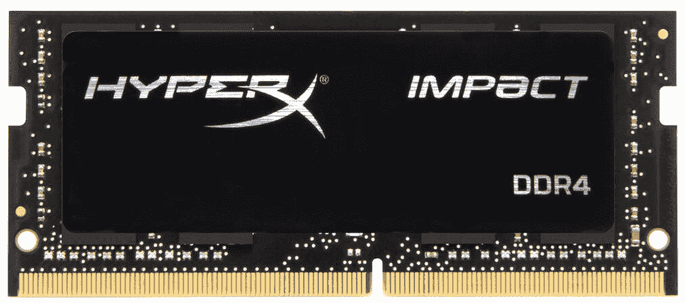

DDR4 SO-DIMM 内存卡

图片提供：金士顿科技公司

下表列出了各种内存模块的边缘连接器引脚数量：

| **DIMM 模块** | **SDR** | **DDR** | **DDR2** | **DDR3** | **DDR4** |
| --- | --- | --- | --- | --- | --- |
| **双列直插内存模块**（**DIMM**） | 168 | 184 | 240 | 240 | 288 |
| SO-DIMM | 100 | 200 | 200 | 204 | 256 |
| MicroDIMM | 172 | 214 | 214 | 214 | - |
| **注册 DIMM**（**RDIMM**） | - | 184 | 240 | 240 | 288 |
| **降载 DIMM**（**LRDIMM**） | - | 184 | 240 | 240 | 288 |

不同 DIMM 板的引脚数量

然而，除了最新的处理器，制造商还发布了新版本的 DIMM。两种较新的 DIMM 版本是 RDIMM 和 LRDIMM。RDIMM 中的寄存器在内存控制器和 DIMM 上的 DRAM 之间充当缓冲。这使得服务器能够支持更多的 RDIMM，但也可能增加功耗和额外的延迟。LRDIMM 使用内存缓冲器将其 DRAM 的电信号合并为单一信号，这允许 DIMM 支持最多 8 个 DRAM 单元。然而，功耗和延迟的增加比 RDIMM 更为显著：

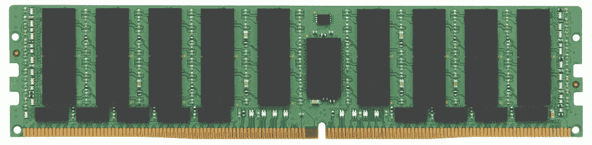

一个 1.32 GB 的 LRDIMM

图片提供：金士顿科技公司

# 内存时序

在 RAM 中的一个常见经验法则是 *数值越低越好*，但是 *低多少？* 内存的运作方式并不像我们通常所描述的那样。我们认为，一次操作涉及从 CPU 请求数据、内存控制器定位数据并将请求的数据传送上来。这是一个简单的三步过程，*对吧？* 其实不是。CPU 从内存请求数据或指令的过程比我们想象的要复杂得多。无论如何，内存 I/O 请求所需的时间越短，计算机的整体速度就会越快。

当你购买服务器内存时，可能会注意到一组数字类似于 `9-10-11-24`。在这些测量值的缩写中，**t** 在 **tRCD**、**tRP** 和 **tRAS** 中表示 *时间*。这一串数字代表内存时序中的四个主要测量值：

+   **CAS 延迟（CL）**：内存时序中的第一个数字代表 **列地址选通**（**CAS**）延迟或 **CL**，即接收并完成数据请求所需的时间，单位是 **纳秒**（**ns**）。

    下表显示了不同内存技术的 CL 示例。请注意，实际延迟是时钟周期与 CL 的乘积。

| **内存技术** | **时钟周期（ns）** | **CL** | **实际延迟（ns）** |
| --- | --- | --- | --- |
| SDR | 7.50 | 3 | 22.50 |
| DDR | 5.00 | 3 | 15.00 |
| DDR2 | 2.50 | 6 | 15.00 |
| DDR3 | 1.25 | 11 | 13.75 |
| DDR4 | 0.75 | 18 | 13.50 |

各种内存技术中 CL 的示例

+   **RAS 到 CAS 延迟（tRCD）**：内存中的数据排列类似于一个包含行和列的电子表格。内存时序中的第二个数字是 **行地址选通**（**RAS**），它表示定位请求数据所在行所需的时间。接着，**列地址选通**（**CAS**）表示移动到相应列的时间。换句话说，如果请求的数据位于 C15，RAS 就是移动到第 15 行的时间，而 CAS 则是移动到 C 列并获取 C15 位置数据的时间。

+   **RAS 预充电（tRP）**：尽管它的功能听起来几乎与其相反，RAS 预充电会释放内存中的活动行，tRP 是内存时序中的第三个值，表示执行此操作所需的时间。

+   **行激活时间（tRAS）**：也叫做 **激活到预充电延迟**，第四个值 tRAS 是关闭活动行并打开新行所需的时间。你还可能看到 tRAS 被描述为完成一个指令的时间，以及请求并接收下一个指令的时间。

# 错误校正码（ECC）与非 ECC

ECC 内存在处理高价值或机密数据的计算机中比较常见，例如支持一个或多个服务器的计算机。ECC 内存与非 ECC 内存的不同之处在于，ECC 内存模块包括一个专门的内存单元，用于为模块的其他内存单元提供奇偶校验和错误修正。ECC 内存保证了数据的完整性。在 ECC 技术出现之前，错误修正方法是使用奇偶校验，分为偶校验和奇校验。非 ECC 内存没有错误修正功能，仅仅是响应处理器的请求。

# 双通道内存

你可能听说过内存配对的必要性，也听说过内存插槽的颜色编码。这似乎很重要，但是*这与在服务器中升级内存有什么关系呢？*

许多新型主板拥有彩色编码的双通道 RAM 插槽。当这些插槽中插入匹配的内存模块时，系统可以同时在两个内存板之间传输数据，从而减少访问时间。实际上，匹配内存可以促进双通道模式的提高访问速度，虽然相对于单通道模式和不匹配的内存对，其改善并不显著。但当安装了匹配的内存对时，性能会更快。

# 彩色编码的 RAM 插槽

尽管不同制造商在主板上设置的内存插槽颜色可能有所不同，但基本的规则是内存插槽成对、成三、成四，或根据主板的内存通道技术发展，未来可能有其他安排。例如，在双通道模式下，成对的内存插槽会被标为黄色、橙色或红色，以表示这是匹配的内存对插槽。

对于成三、成四等情况也是如此：

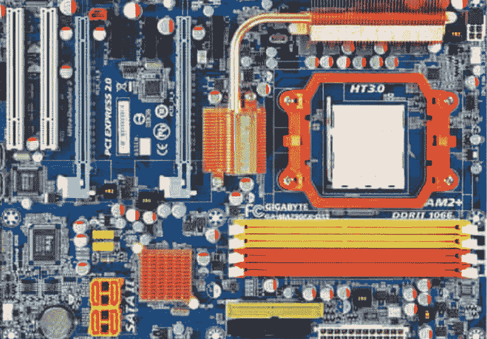

主板上的彩色编码内存插槽

图片由：技嘉科技股份有限公司提供

# 总线、通道和扩展插槽

计算机主板上的组件以及连接到主板的设备，不断地相互传递数据和指令。就像任何其他形式的通信一样，它们之间必须有一个媒介来连接。这种媒介，在这里就是*总线通道*，它为数据、地址和指令的传输提供了路径。

在计算机中，通常有两类总线通道：内部总线和外部总线。*内部总线*仅存在于主板上，用于主板的各个组件之间传递数据和指令。*外部总线*则为外设和扩展组件提供与主板上其他组件进行通信的途径。

*总线*一词来源于拉丁语单词*omnibus*，意为*为所有人*。计算机中的连接链路承载着*一切*，因此它们被称为总线。总线不应与*buss*混淆，后者是“吻”的另一种说法。

一个总线结构由三条协调工作的总线线组成（见下文*总线宽度*部分的图示）：

+   **控制总线**：CPU 向组件或设备传输命令和指令，这些组件或设备需要接收数据或执行命令。这是一个专用的单向总线，承载着在地址总线上指定的地址处内容所需的命令。

+   **地址总线**：CPU 向组件或设备传输需要服务的数据地址。地址总线也是单向的。

+   **数据总线**：CPU 从内存或设备控制器发送或接收数据。

# 总线宽度

一条总线通道由若干条电路迹线组成，每条迹线传输一个信号（位）到设备引脚。总线通道的迹线通常是 8 的倍数，如 8、16、24、32、64 等等，迹线的数量控制着系统内存的大小。总线通道中位数或迹线数限制了高端地址值。例如，一个 8 位地址总线只能寻址到最大为 28 或 256 的内存单元。如果总线为 32 位，那么它能够引用的内存中最高的地址是 232 或 4,294,967,296（稍多于 4GB 或 500MB）。显然，总线通道越宽（即越多位宽），它在二进制中能表示的数字就越大。

微处理器的描述和规格包括其兼容的总线宽度。例如，Intel Xeon 和 AMD Athlon 是流行的服务器 CPU，两者都是 64 位处理器：

系统总线结构的组成部分

# 外围组件互连（PCI）总线

并不是每块主板都配有你喜爱的外设、控制器或接口，事实上，很少有主板会完全具备这些功能。为了帮助你解决这一问题，主板包括了一些扩展槽，你可以在这些插槽中插入所需的设备和功能接口卡。多年来，在计算机和服务器的发展过程中，多个扩展卡标准出现并逐渐淘汰，新的标准或扩展标准取而代之。本章前面提到的*彩色编码内存插槽*部分展示了一块配有两组扩展卡插槽（蓝色和白色）的主板。

对于 Server+考试，你需要详细了解的总线通道和扩展槽技术清单很短，且属于同一家族：PCI—也称为**PCI 常规**、**PCI 扩展**（**PCI-X**）和**PCI-Express**（**PCI-e**）。这些标准的 PCI 插槽和扩展卡在多个方面有所不同，但最显著的差异体现在插槽和卡的高度和长度、总线宽度以及信号电压上。

# PCI 尺寸和适配标准

所有 PCI 及其变种都适用相同的物理板卡格式标准。PCI 板卡的标准规定了四种尺寸和适配格式：全高、低型、全长和半长。不过也有一些例外：

+   一张全高扩展卡无法适配低型插槽

+   一张半高扩展卡可以适配全长插槽

+   半高扩展卡无法插入全高插槽

+   一张全长扩展卡无法插入半长插槽

好吧，最后一个是显而易见的！最佳做法是将 PCI 扩展卡与其对应的 PCI 插槽匹配。

# PCI 传统

总线通道的*总线宽度*是通道中轨道的数量。一般来说，PCI 总线及其变种的总线宽度为 32 或 64 条轨道。为了避免重复，通道中的一条轨道传输总线中传输的一个数据位。PCI 标准的*信号电压*是 5V 或 3.3V 之一。

PCI 常规标准的常见变种（见下图）包括：

+   **32 位 PCI—5V 信号电压**：这是桌面计算机主板上常见的 PCI 插槽。它的时钟频率为 33 MHz，最大数据传输速率（DTR）为 1 Gbps。

+   **64 位 PCI—5V 信号电压**：通常用于服务器和双处理器主板扩展插槽，其时钟频率为 33 MHz，最大 DTR 为 2.1 Gbps。

+   **64 位 PCI—3.3V 信号电压**：也称为 PCI-X，这种 PCI 扩展插槽通常用于服务器主板。它的最大时钟频率范围为 66 到 533 MHz，最大数据传输速率（DTR）为 4.3 Gbps（在 533 MHz 时）：

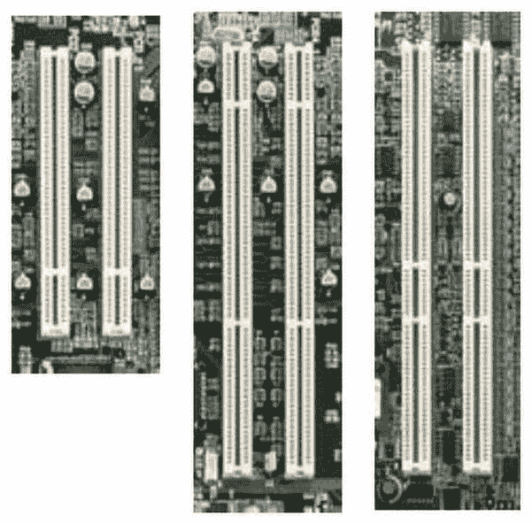

从左到右：PCI 32 位 33 MHz 插槽，PCI 64 位 66 MHz 插槽，以及 64 位 33 MHz 插槽

下表列出了每种 PCI 总线标准的最大**数据传输速率**（**DTR**）：

| **技术** | **最大 DTR（Mbps）** |
| --- | --- |
| **并行** | **串行**（*半双工*） | **串行**（*全双工*） |
| PCI（传统） | 132 |  |
| PCI Express 2x | 500 | 1000 |
| PCI Express 4x | 1000 | 2000 |
| PCI Express 8x | 2000 | 4000 |
| PCI Express 16x | 4000 | 8000 |
| PCI Express 32x | 8000 | 16000 |

PCI 和 PCI-e 总线技术的数据传输速率（DTR）

# PCI-e

PCI-e 总线标准替代了传统的 PCI 和 PCI-X 总线标准。PCI-e 和 PCI 的主要区别在于总线拓扑（信号格式）。PCI-e 总线使用点对点串行通信通道，而 PCI 使用共享的并行总线。另一个区别是，PCI 总线的速度仅与连接的最慢设备一样快，而 PCI-e 支持端点设备之间的全双工通信：

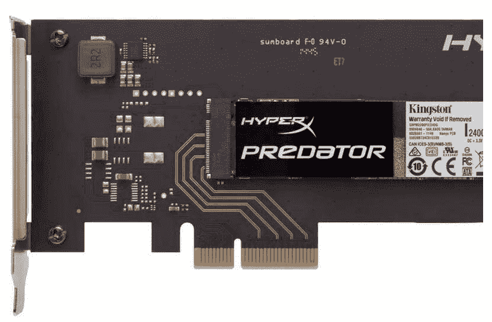

PCIe 4X 标准扩展卡和接口示例

图片来源：金士顿科技公司

# 扩展卡

所以，*什么类型的卡适合插入主板扩展插槽？* 接下来的部分将介绍你在 Server+考试中应该了解的扩展卡功能。

# 网络接口控制器（NIC）

大多数较新的主板将 NIC（也称为**网络适配器**）的所有或部分功能集成到芯片组中。无线通信尤其如此。许多活动网络服务器通过安装为扩展卡的一个或多个网络适配器连接到网络或通信链路。

网络接口卡（NIC）的主要功能是为其主机计算机与网络之间提供连接和接口。NIC 将计算机发送的数据转换为与网络协议和标准兼容的格式。

# 主机总线适配器（HBA）

HBA 提供了外设与计算机之间的连接点。HBA 通常是插入主板插槽的扩展卡。HBA 卡作为外部设备与计算机之间进行通信的通道。也许在服务器中最常见的 HBA 是硬盘控制器卡，它包含磁盘控制器，并提供一个或多个硬盘驱动器的接口。HBA 提供的硬盘接口包括以太网、**并行高级技术附件**（**PATA**）/**集成驱动电子**（**IDE**）、**串行高级技术附件**（**SATA**）和**小型计算机系统接口**（**SCSI**）设备等。

# 独立磁盘冗余阵列（RAID）控制器

另一种类型的 HBA 是 RAID 控制器，也称为*磁盘阵列控制器*。磁盘阵列控制器提供多个硬盘驱动器的管理，它将硬盘驱动器作为逻辑单元而非物理单元呈现给 CPU。RAID 技术的使用必须与 RAID 控制器和磁盘驱动器相同。例如，**RAID O**控制器无法与任何涉及容错的 RAID 技术配合使用。

# 上升卡

上升卡是一种插入系统板并提供额外插槽以供适配卡使用的板卡。由于它位于系统板之上，因此可以以与系统板平行的方向将额外适配器连接到系统，从而节省机箱内部空间。上升卡通常用于机架式服务器中。一个 1U 机架单元系统可以在主板上集成单槽上升卡，从而使扩展卡能够适应机箱内。而 2U 计算机可以像 1U 那样集成上升卡，或者为 3.5 英寸上升卡提供一个扩展插槽，并配有三个插槽。以下图像展示了一个带有两个 PCI-e 8x 端口的 2U 上升卡示例：

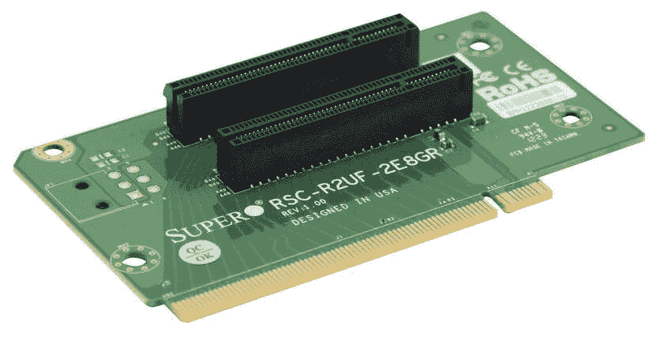

带有 2 个 PCI-e 插槽的 2U 上升卡

图片来源：超级微型计算机公司

# USB 接口和端口

USB 标准有多种，每种都有不同的尺寸、形状和用途。所有 USB 标准都定义了通信协议、物理电缆和一个或多个连接器及端口。每种 USB 连接器和端口的形状与大小，不论其版本如何，都是几种连接器类型中的一种。只要使用的连接器和端口类型相同，一些标准在功能上是兼容的。

不同的 USB 连接器类型（至少是当前仍在使用的）包括：

+   **A 型**：A 型连接器和端口是大多数人认为的 USB。无论计算机是否便携，这种连接器类型几乎出现在每台计算机上。它还出现在许多游戏主机、电视机、音频设备等设备上。A 型连接提供外围设备与主机之间的下行连接，主机向连接的设备提供 5V 直流电源。

+   **B 型**：B 型连接器和端口常见于打印机、外部磁盘驱动器及其他外围设备的设备端电缆连接。

+   **C 型**：USB C 型连接器和端口尚未在网络服务器中找到应用。C 型已经成为手机、笔记本电脑和其他便携设备的常见连接方式。其优点在于 C 型连接器不受方向限制（没有上下之分），电缆的任一端都可以连接到主机系统：

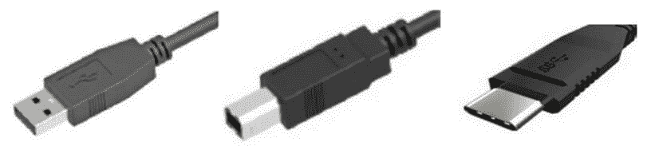

从左到右：A 型、B 型和 C 型 USB 连接器

图片提供：Newnex 科技公司

还有其他 USB 连接器和端口类型，如迷你、微型和内部连接器。每种连接器都有其特定的用途，但不要担心在考试中看到它们。

# 配置

任何服务器管理中一个极其重要的部分是其配置设置。记住，计算机只是由一堆电气和电子组件通过互联来完成重复任务的设备。服务器的配置设置最初是在其固件中设置的，当主板和**只读存储器**（**ROM**）制造时就已经设置好了。然而，在任何服务器的生命周期中，某些配置设置总会发生变化。新的外围设备、存储设备、内存大小或其他添加或调整可能会使服务器继续支持网络的需求。

# BIOS

BIOS 自 1975 年起就已存在，并且功能上基本没有太大变化。BIOS 存储在计算机主板上的非易失性存储器（ROM）中，是计算机启动时执行的第一个指令集，并为操作系统提供输入和输出操作的支持。

BIOS 的主要作用是提供初始化系统所需的信息，为所有连接的存储设备和外围设备加载设备驱动程序，并加载和启动操作系统。引导过程使用的配置数据存储在 CMOS 芯片上的少量内存中。为了确保配置设置始终可用于系统启动过程，使用了一个硬币形状的平面电池，称为 CMOS 电池，其使用寿命大约为 10 年。

BIOS 读取主硬盘驱动器的第一个扇区，以访问启动设备的地址（通常是硬盘驱动器）或初始化指令（代码）的地址。然后，它初始化启动设备并启动操作系统。然而，BIOS 有一个大限制——它仅支持 16 位数据传输，这限制了从 ROM 读取的数据量。

# UEFI

现在许多作为服务器使用的新型计算机都采用了 UEFI 来替代 BIOS，甚至有些系统同时拥有两者。UEFI 是一种用于替代 BIOS 的系统配置技术。虽然 UEFI 和 BIOS 本质上执行相同的基本功能，但 UEFI 将其配置数据存储在硬盘驱动器上的`.EFI`文件中，位于一个称为**EFI 系统分区**（**ESP**）的特殊区域内。加载和初始化操作系统所需的文件也位于 ESP 中。

# 摘要

CPU 是执行程序、执行算术功能并管理计算机数据和输入/输出功能的电子组件。多处理器是一台配备两个或更多 CPU 的计算机，可以是对称或非对称的。在对称多处理（SMP）中，CPU 是平等的并共享资源，而在非对称多处理（ASMP）中，一个 CPU 是主控，所有其他 CPU 都是从属。在多处理计算机中支持 SIMD、MISD 和 MIMD。多核处理涉及一个包含多个处理器或核心的单一微处理器。

计算机系统使用多种类型的缓存内存，包括浏览器缓存、磁盘缓存、内存缓存和处理器缓存。缓存内存提供的数据访问速度比从主内存中获取数据快。CPU 系统包括三级缓存内存：L3、L2 和 L1。

CPU 的速度，以 MHz 为单位，是前端总线（FSB）的函数。CPU 的内部频率将 CPU 倍频器应用于 FSB 的频率。步进是对 CPU 进行修订的过程。DRAM 是易失性的；SRAM 是非易失性的，但在没有系统电源的情况下会丢失其存储内容。内存时序测量包括 CL、tRCD、tRP 和 tRAS。ECC 内存有一个专用内存单元，提供奇偶校验和错误修正。

总线通道分为内部总线和外部总线。内部总线位于主板上，在各组件之间传递数据和指令。外部总线为外围设备和扩展卡提供通信链接。总线结构包括控制总线、地址总线和数据总线。你应该了解的总线通道和扩展插槽有 PCI、PCI-X 和 PCI-e，以及它们之间的重要差异。

BIOS 永久存储在 ROM 中，并包含计算机开机时执行的第一条指令。BIOS 启动系统，加载设备驱动程序，并启动操作系统。启动过程的配置信息存储在 CMOS 中。较新的计算机使用 UEFI 代替 BIOS。

# 问题

1.  什么是执行程序、执行算术功能并管理计算机中的数据和输入/输出功能的电子组件？

    1.  GPU

    1.  控制单元

    1.  CPU

    1.  内存

1.  以下哪种说法描述了对称多处理？

    1.  CPU 是不平等的，并按比例分配系统资源

    1.  CPU 是平等的，并共享系统资源

    1.  一个 CPU 是主控，所有其他 CPU 为从属

    1.  每个 CPU 处理相同的指令

1.  以下哪项描述了非对称多处理？

    1.  CPU 是不平等的，并按比例分配系统资源

    1.  CPU 是平等的，并共享系统资源

    1.  一个 CPU 是主控，所有其他 CPU 为从属

    1.  每个 CPU 处理相同的指令

1.  一个具有两个或更多 CPU 的单一计算设备，无论是对称还是非对称，称为：

    1.  微处理器

    1.  多处理器

    1.  单处理器

    1.  以上都不是

1.  在这种微处理器类型中，多个处理器在单一数据源上执行不同的指令：

    1.  SIMD

    1.  MISD

    1.  MIMD

    1.  UEFI

1.  以下哪个不是 CPU 系统中缓存内存的级别？

    1.  三级缓存

    1.  二级缓存

    1.  一级缓存

    1.  零级缓存

1.  CPU 的速度与哪个系统特性有关？

    1.  CPU 倍频和 FSB 的频率

    1.  ECC 和内存奇偶校验

    1.  BIOS 和 DRAM

    1.  内存时序和 CL

1.  以下哪个不是 PCI 总线通道？

    1.  PCI

    1.  PCI-X

    1.  PCI-e

    1.  PCIC

1.  以下哪两个包含 PC 的配置数据，并在计算机开机时激活？

    1.  BIOS

    1.  CMOS

    1.  BOOTP

    1.  UEFI

1.  从内存接收和处理数据请求所需的时间是多少？

    1.  CAS 延迟 (CL)

    1.  RAS 到 CAS 延迟 (tRCD)

    1.  RAS 预充电 (tRP)

    1.  行激活时间 (tRAS)
