# 第三章：数据存储

网络中至关重要的一部分是数据存储设备，它们使数据能够以有序、分类和映射的形式永久存储，以便于保存和检索。在我们日常使用计算机时，我们几乎将桌面或便携计算机中的硬盘驱动器视为理所当然。毕竟，它就在那儿。网络上的数据存储，虽然使用与桌面计算机中硬盘驱动器相同的基本存储技术，但更加复杂，确实需要更多关注。

本章将重点讨论网络数据存储的技术、设备、协议、介质和应用。为此，我们将讨论以下主题：

+   数据存储设备的硬件规格

+   硬盘驱动器的主要接口协议

+   数据存储系统

+   文件系统

+   独立磁盘冗余阵列（RAID）

+   数据存储需求的容量规划

# 数据存储设备及其规格

数据已经成为个人、企业、公司、企业集团、公司或组织最有价值的资产之一，并且必须加以保护。处理和存储数据的计算设备和存储设备必须可靠且可用，最重要的是，必须是安全的。

在本节中，我们将研究磁盘驱动器硬件和配置、数据存储和传输协议及技术，并深入探讨 RAID。

# 硬盘规格

在最基本的功能层面上，所有形状和大小的硬盘驱动器中的技术基本相同。下图展示了一个基本硬盘驱动器的核心内部组件。如图所示，一个执行器臂，通过执行器轴连接并定位，伸出并缩回读写磁头，以便将其放置在适当的磁道/圆柱和扇区上：

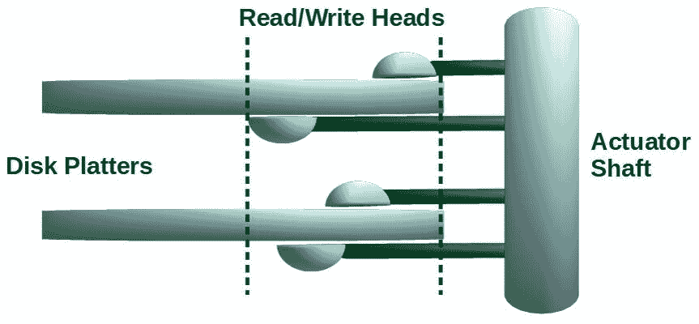

硬盘驱动器的主要组件

如前所述，硬盘驱动器有各种尺寸。在这里，尺寸有不同的含义：高度、周长和容量。硬盘驱动器的外形规格决定了前两个特性。硬盘驱动器的容量与硬盘的外形规格有关，但更多的是使用技术的功能。

# 外形规格

正如我们在前一章中讨论的那样，外形因素（form factor）决定了计算机机箱、主板、电源等的外形和尺寸。然而，对于硬盘驱动器，外形因素决定了硬盘的高度、宽度、长度，以及其与主机计算机连接器的类型和位置。以下部分将讨论服务器中常见的硬盘外形规格。

# 小型外形规格（SFF）

SFF 比大多数其他常见形式要小。内部磁盘盘片的直径平均为 2.5 英寸。SFF 标准规定驱动器的宽度为 2.7 英寸，总长度为 100 毫米（或 3.93 英寸），高度范围从 5 毫米（0.20 英寸）到 15 毫米（0.59 英寸）。由于其紧凑的尺寸，SFF 硬盘驱动器在笔记本电脑和其他便携式计算机中非常常见。SFF 驱动器也可以用于桌面计算机，但需要安装支架以填充 3.5 英寸的硬盘位。

由于其存储容量可达到 5 TB，SFF 驱动器在某些服务器环境中得到了应用。在这些系统中，交互式和事务处理系统使用 SFF 驱动器，而备份、归档和大容量备份则使用更大的驱动器或技术。

# 大型外形因子（LFF）

**大型外形因子**（**LFF**）硬盘驱动器的高度维度可以从 19.9 毫米（0.78 英寸）到 26.1 毫米（1.03 英寸）不等。虽然这看起来并不*大*，但最新的 LFF 驱动器可以存储多达 100 TB，具体取决于其技术（稍后会详细介绍）。LFF 驱动器的长度为 146 毫米（5.75 英寸），宽度为 101.6 毫米（4.0 英寸）。下图展示了 SFF 和 LFF 大小的差异：

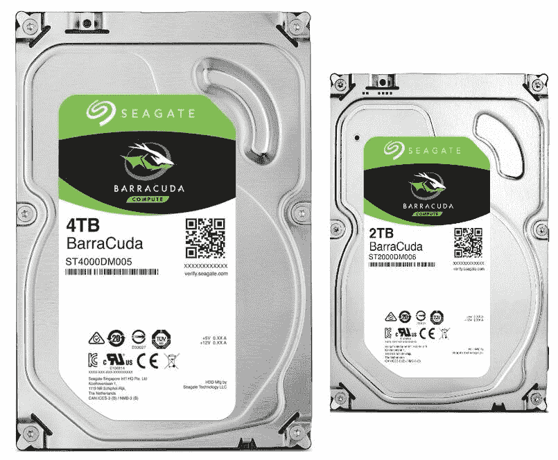

3.5 英寸 LFF（左）与 2.5 英寸 SFF（右）对比

图片来源：Seagate Technology, LLC

# HDD 规格与配置

HDD 的技术规格描述了其技术、接口、容量和操作速度。对于任何 HDD，都有两组规格：设备规格和配置规格。**设备规格**表示磁盘驱动器组件和操作的*原始*或未格式化的测量值。**配置规格**，也称为**逻辑配置**，反映了在格式化或分区磁盘介质后对设备规格所做的任何更改。

与内部或外部磁盘驱动器相关的重要设备规格如下：

+   **每分钟转速（RPM）**：HDD 的两种主要转速为 7,200 和 5,400，这表示磁盘驱动器中的磁盘盘片每分钟旋转的次数。更高的转速意味着更快的磁盘驱动器。例如，7,200 RPM 的驱动器大约比 5,400 RPM 的驱动器快三分之一。在这种情况下，更快意味着磁盘盘片上的存储位在读写头下移动的速度更快，从而加快了数据传输过程。

+   **接口**：驱动器支持的通信接口类型可以指示驱动器的容量、用于传输数据到或从 HDD 的总线宽度以及其最大（原始）数据存储容量。下表显示了目前流行的硬盘总线接口的传输速率和最大容量（有关更多信息，请参阅本章后面的*硬盘接口*部分）：

| **HDD 接口** | **最大传输速率（Mbps）** | **最大容量（TB）** |
| --- | --- | --- |
| PATA | 133 | 1 |
| SCSI | 320 | 1 |
| SATA | 600 | 12 |
| SAS | 750 | 12 |

常用硬盘接口的特点

+   **访问时间**：这是磁盘控制器启动 I/O 操作后，直到数据可以从磁盘介质读取或写入之前所发生的各个时序元素的总和。访问时间包括以下内容：

    +   **寻道时间**：是指执行器臂将读/写磁头定位到合适的磁盘盘片上，并将其移动到包含目标数据扇区的盘片上的磁道所需的时间。

    +   **旋转延迟**：也叫做旋转延迟或延迟，是指旋转的磁盘盘片将目标数据扇区移动到读/写磁头下所需的时间。

    +   **命令执行时间** 和 **稳定时间**：这些测量通常非常小，可能不会包含在制造商的硬盘驱动器性能规格中。**命令执行时间**是指建立各个元素之间的连接所需的时间，这些元素涉及数据从内存或硬盘驱动器的传输。**稳定时间**是指将读/写磁头放置到位置，以便将数据写入磁盘介质或从磁盘介质读取数据所需的时间。大多数硬盘驱动器规格将稳定时间计入寻道时间。

+   **吞吐量**：也叫做 **数据传输速率** (**DTR**)，这是指在特定操作中，将数据从一个位置移动到另一个位置所需的时间。在硬盘驱动器的上下文中，吞吐量分为 *读取吞吐量* 和 *写入吞吐量*。在这两种情况下，它表示从读/写磁头到内存（读取吞吐量），或从内存到读/写磁头（写入吞吐量）所需的时间。

+   **每秒 I/O 操作数（IOPS）**：读作 *eye-ops*，IOPS 衡量硬盘驱动器每秒从随机非连续地址读取和写入操作的次数。这个测量的结构可能会因不同制造商而有所不同，因此它可能不是一个可靠的指标来比较硬盘驱动器。

# 磁盘容量 – 十进制与二进制

存储设备（如硬盘驱动器）的存储容量既以十进制值也以二进制值表示，这可能会让设备上实际可用的空间产生混淆。例如，1000¹⁰ 或 1 KB 的十进制值常常与 2¹⁰ 或 1024¹⁰ 交换使用，后者也被称为 1 KB。

硬盘驱动器和其他一些存储设备在格式化后，通常会显示出约七个百分点的容量损失。例如，一个新的 1 GB 硬盘驱动器格式化后只剩下大约 938 MB。这一差异代表了总存储容量的七百分比，似乎消失了。

产生混淆的原因在于，计算机由于其设计的原因，使用二进制来表示数值，比如将 2²⁰视为与 10⁶相等，或者将 1,048,576 视为与 1,000,000 等价，实际上 1MB 等于 1MB。

以下表格列出了更常用的前缀符号及其等效值：

| **前缀** | **值** | **十进制**指数 | **十进制值** | **二进制**指数 | **二进制值** |
| --- | --- | --- | --- | --- | --- |
| Kilo | 千 | 10³ | 1,000 | 210 | 1,024 |
| Mega | 百万 | 10⁶ | 1,000,000 | 220 | 1,048,576 |
| Giga | 十亿 | 10⁹ | 1,000,000,000 | 230 | 1,073,741,824 |
| Tera | 万亿 | 10¹² | 1,000,000,000,000 | 240 | 1,099,511,627,776 |
| Peta | 千万亿 | 10¹⁵ | 1,000,000,000,000,000 | 250 | 1,125,899,906,842,624 |
| Exa | 百万亿 | 10¹⁸ | 1,000,000,000,000,000,000 | 260 | 1152921504606846976 |
| Zetta | 十亿亿 | 10²¹ | 1,000,000,000,000,000,000,000 | 270 | 1180591620717411303424 |
| Yotta | 十亿亿亿 | 10²⁴ | 1,000,000,000,000,000,000,000,000 | 280 | 1,208,925,819,614,629,174,706,176 |

数字表示法前缀

# 硬盘驱动器（HDD）与固态硬盘驱动器（SSD）

机械硬盘（HDD），或常见的硬盘，至少有八个主要的活动部件，其中一些部件在*硬盘驱动器的主要组件*图像中有所展示，该图像出现在本章前面的*硬盘规格*部分。仅仅是“活动部件”一词就足以让人警觉，因为任何活动的部件都可能损坏或磨损。当然，并不是很多硬盘由于执行臂卡住或偶尔的读写间隙错误而发生故障，但它们是有可能发生的。理想情况下，硬盘应该没有活动部件，这样就不会有机械故障的威胁。而 SSD 就是这样的设备。

SSD 的工作原理与 USB 闪存驱动器类似，二者都将数据存储在半导体芯片中（见下图）。固态（Solid-state）这一术语自晶体管收音机时代便开始流行，指的是由半导体组成的电路。固态还意味着没有活动部件。SSD 大多设计为便携式或紧凑型计算机的内部安装设备，但也可以作为外部设备使用，类似于非常大的闪存驱动器。SSD 通常使用 SAS 或 SATA 接口：

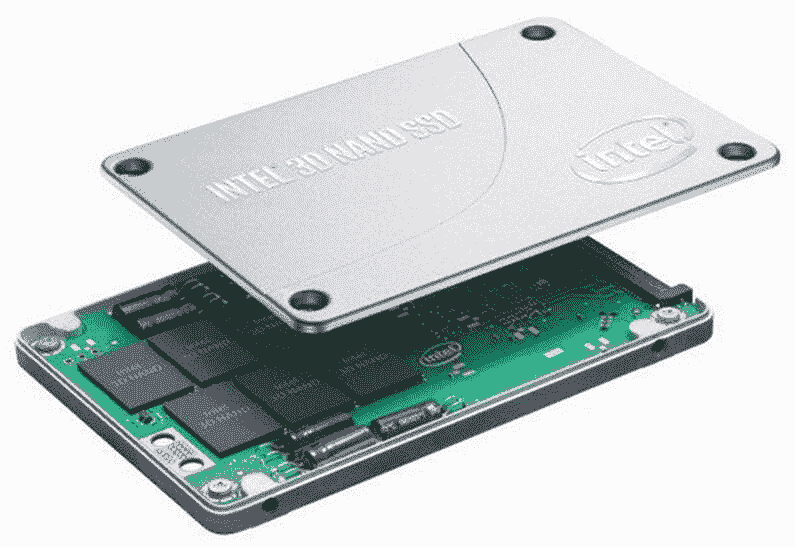

SSD 的爆炸视图。

图片提供：英特尔公司

使用 SSD 相较于 HDD 的好处主要体现在三方面：可靠性、速度和减少的能耗。如下面的表格所示，SSD 在某些极端情况下优于 HDD。平均而言，SSD 的速度是 HDD 的四倍左右，并且功耗仅为 HDD 的一半。另一方面，SSD 的存储容量尚未赶上 HDD，其每 GB 的成本也要高得多。这意味着，SSD 存储设备在可靠性、速度和操作成本方面更具优势。然而，初期成本较高：

| **特性** | **HDD** | **SSD** |
| --- | --- | --- |
| 故障率 | 150 万小时 MTBF* | 200 万小时 MTBF* |
| 读/写速度 | 50 – 120 MBps | 200 – 550 MBps |
| 电力使用 | 6 – 7 瓦特 | 2 – 3 瓦特 |
| 最大容量 | 10 TB | 4 TB |
| 成本 | $ 0.03/GB | $ 0.20/GB |

HDD 与 SSD 的物理特性比较

* MTBF = 平均故障间隔时间

# SSD 规格和配置

比较 HDD 与 SSD 的速度时很简单——SSD 更快。问题的答案是，*HDD 和 SSD 之间的区别是什么？* 其实是*几乎所有的东西*。嗯，也许不是所有的。毕竟，SSD 没有所有的运动部件，实际上它没有任何 HDD 的运动部件。这排除了某些性能规格的比较，例如转速（RPM）、旋转延迟、稳定时间等。

虽然 HDD 是串行访问设备，但 SSD 是随机访问设备。你可以随机访问 HDD，但访问数据时会有延迟。而在 SSD 上，你可以直接访问数据。与 HDD 相关的物理延迟问题不会影响 SSD 的性能。像 IOPS、访问时间和吞吐量等指标，可能高出或低于 HDD 许多倍。也要记住，SSD 目前仍然更贵。

# 硬盘接口

虽然 HDD 可能位于系统机箱内部，但它是与主板和 CPU 连接的外围设备。HDD 与计算机进行通信，即通过驱动接口交换数据。驱动接口是设备驱动程序、硬盘设备、内存和控制器用来传递数据请求及所请求数据的总线结构。

HDD 接口可以是字串行的，也可以是比特串行的。字面导向接口通过并行比特信号传输数据，数据位宽为 8 位、16 位或 32 位。字面导向接口的例子包括**小型计算机串行接口**（**SCSI**）和**并行高级技术附件**（**PATA**）。比特导向接口通过**主机总线适配器**（**HBA**）进行互联。比特导向接口的例子有**光纤通道**（**FC**）、**串行 ATA**（**SATA**）和**串行附加 SCSI**（**SAS**）。

安全+考试中你需要了解的 HDD 驱动接口如下：

+   **PATA**：PATA 使用并行比特信号在 HDD 与控制器和驱动器之间传输数据。它通过 80 针电缆与系统连接，电缆传递 5V 信号。并不是每根导线都传输数据。事实上，每两根导线中的一根是接地线。由于连接电缆的尺寸，PATA 硬盘是内置设备。PATA 设备能够以最高 80 MBps 的数据速率传输数据。

+   **SATA**：SATA 使用串行位信号在硬盘驱动器（HDD）与主板、控制器和驱动器之间传输数据。SATA 通过 7 根导线的电缆以更高的速度传输数据。SATA 的出现主要是因为 PATA 标准无法支持更大容量磁盘驱动器的更高**数据传输速率**（**DTRs**）。SATA 设备的数据传输速率最高可达 600 MBps。

+   **SCSI**：SCSI（*scuzzy*）为多种设备提供了多连接接口，包括硬盘驱动器（HDD）、光驱、打印机、扫描仪及其他外设。最多可以连接 15 个设备到一个 SCSI 接口，而该接口仅占用主机计算机中的一个 HBA 插槽。SCSI 使用并行位信号传输，数据传输速率（DTR）可达到 80 MBps。

+   **SAS**：SAS 在其基础接口 SCSI 的基础上进行了改进，扩展了其多项能力和容量。SAS 控制器直接连接到 SAS 硬盘驱动器（HDD）。SAS 可以在单个接口上连接最多 128 个不同的设备。它是一个全双工接口，数据传输速率（DTR）可达到 3.0 GBps。SAS 的另一个重要特点是它是热插拔技术。

+   **FC**：FC 技术主要是一种在数据中心和服务器农场中常用的通信协议。尽管其名称表明它基于光纤电缆，但由于它是基于协议的，因此所使用的传输介质可以是同轴电缆、铜双绞线或光纤电缆。使用的电缆类型决定了 FC 连接设备之间的分离长度。铜连接节点的最大距离应在 100 英尺以内，而多模光纤电缆连接的设备可以相隔最长 10 公里（6.67 英里）。由于其可靠性、灵活性、速度和传输距离，FC 技术正在替代数据中心中的 SCSI。目前，FC 的最大数据传输速率（DTR）可以达到 128 GBps。

# 数据存储系统

在这一点上，我们需要简要介绍一些基本的磁盘存储术语和概念。在 Server+考试中，通常假定你已经掌握这些术语和概念，因此这是我们需要覆盖的内容。在接下来的几节中，我们将探讨数据存储和检索方法、技术及系统的技术组织。

# 直接附加存储（DAS）

DAS 的名称应该不言而喻。DAS 是任何直接连接或附加到计算机上的存储设备，包括 HDD、SSD、USB、磁带、光盘、闪存驱动器等。安装在计算机机箱内的硬盘驱动器就是 DAS；通过 USB 连接的外部硬盘驱动器也是 DAS；USB 磁带驱动器也是 DAS。换句话说，如果一个数据存储设备直接连接到计算机及其总线，那么它就是 DAS。

# 网络附加存储（NAS）

如下图所示，NAS 是一个或多个附加到网络上的数据存储设备，网络客户端可以共享这些设备。NAS 对于网络用户来说，看起来类似于 DAS，尤其是当使用**网络文件系统**（**NFS**）时。NFS 是一种网络文件共享协议，允许经过认证和授权的用户访问网络文件系统和资源，如 NAS。虽然 NFS 是 NAS 系统的常见组成部分，但它也可以与无结构的 HDD 集群一起使用，这些集群通常被称为**一堆磁盘**（**JBOD**）。在 JBOD 配置中，磁盘作为独立设备运行：

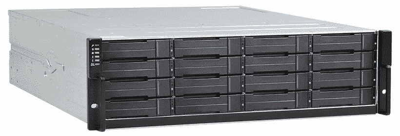

一台 16 盘位的 NAS 设备

图片来源：Infortrend 科技公司

# 存储区域网络（SAN）

FC 通信的一个常见应用，特别是在大型网络和数据中心中，是 SAN。SAN 是一个独立的存储设备网络和专用交换机网络，它为连接的网络节点提供高速数据访问。对于网络服务器来说，SAN 的一部分看起来就像直接连接到该服务器一样。每个连接到 SAN 的服务器都有相同的视图。SAN 为网络服务器提供了在存储设备之间移动数据的能力，并执行备份和恢复操作，此外，还为多个服务器提供数据访问。

# SAN Fabric

如下图所示，最简单的 SAN 由一个或多个网络服务器组成，这些服务器通过一个或多个专用交换机连接到由两个或更多硬盘驱动器组成的数据存储阵列。在此图中，红色虚线框框住了所谓的**Fabric**，即 SAN 中由交换机控制的磁盘驱动器网络：

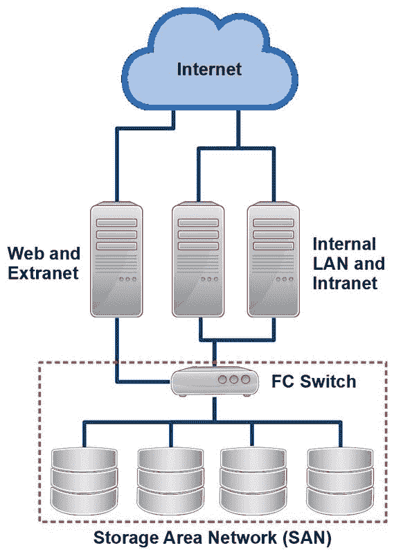

SAN 的组成部分

# SAN 通信

大多数 SAN 使用两种通信技术中的一种：FC 和**互联网 SCSI**（**iSCSI**）：

+   **FC SAN：** FC 是最常用的 SAN 通信技术。基于 FC 的 SAN 包含 FC 交换机，用于互联存储设备，并配有 FC HBA（主机总线适配器），将 FC 交换机连接到网络服务器。

+   **iSCSI SAN：** iSCSI 替代方案不需要基于 FC 的 SAN 中的专用设备。iSCSI SAN 可以在以太网交换机和物理连接到存储设备及网络服务器上运行。其结果是一个低成本、但性能较低的 SAN 解决方案。

另一种 SAN 选项是**以太网光纤通道**（**FCoE**）。FCoE 将以太网和 FC 信号合并到一个共同的网络介质中。然而，并非所有的以太网网络设备都支持 FCoE 标准。

# 逻辑单元号（LUN）区域划分与屏蔽

在基于任何通信技术的存储区域网络（SAN）中，一个关键元素是 LUN。LUN 是分配给 SAN 存储单元的身份标识，它可以是硬盘驱动器（HDD）的一个部分、整个 HDD，甚至多个 HDD，尤其是在 RAID 配置中。LUN 代表存储介质与网络客户端之间的映射，指示哪些网络主机可以访问哪些由 SAN 管理的数据。

在 FC SAN 中，设置 LUN 分区明确指定哪些网络服务器/主机可以访问特定的 LUN 及其内容。如下面的示意图所示，左侧的服务器具有访问第一个和第三个 LUN 的区域权限，而右侧的服务器可以访问第二个和第四个 LUN。LUN 分区是 FC SAN 特有的。iSCSI 和 FCoE 由于使用以太网技术，设置方式与**虚拟局域网**（**VLAN**）类似：

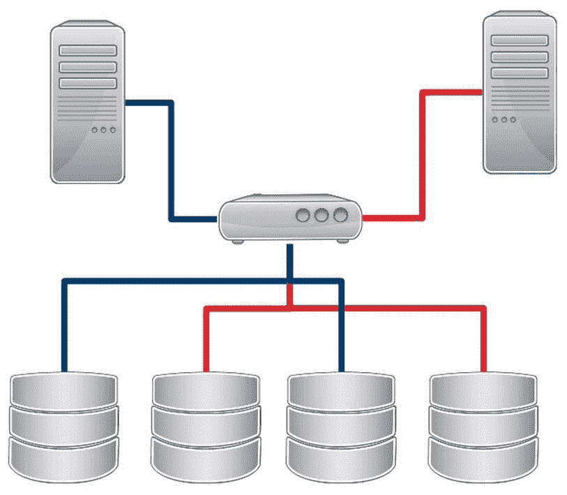

LUN 分区确定哪些主机可以访问哪些 LUN

一旦 LUN 分区配置完成，LUN 掩蔽会应用额外的限制，能够将 LUN 从特定的服务器和主机中隐藏。虽然 LUN 掩蔽可以作为许多数据中心中的安全策略的一部分，但其主要用途通常是限制访问，仅允许网络服务器或主机（及其用户）访问所需的数据。

# 文件系统

任何计算机，无论是独立的还是网络连接的，都会使用**文件系统**来组织它在辅助存储上存储的数据。文件系统不仅仅是用于存储数据文件的模式，它还包括命名、存储、定位和检索数据所使用的过程、方法和结构。尽管它也被一些人用来指代磁盘分区。

# 操作系统和文件系统

网络服务器可以使用各种各样的文件系统，一些是操作系统专有的，另一些则是标准或更通用的。例如，以下表格显示了来自不同供应商的几种 Linux 版本都使用了**扩展文件系统版本 3**（**ext3**）和后来的**ext4**。Windows 系统依赖于**新技术文件系统**（**NTFS**）多年，并且至今仍在使用，但新的文件系统正在不断出现：

| **发布年份** | **操作系统** | **文件系统** |
| --- | --- | --- |
| 2000 | Windows Server 2000 | NTFS |
| 2005 | Fedora/Ubuntu/Debian Linux | ext3 |
| 2006 | Windows Vista | NTFS |
| 2009 | Windows 7 | NTFS |
| 2012 | Windows Server 2012 | 弹性文件系统（ReFS） |
| 2013 | Fedora/Ubuntu/Debian Linux | 扩展文件系统版本 4（ext4） |
| 2015 | OpenSUSE 42.1 | 更好的文件系统（Btrfs）/扩展文件系统（XFS） |
| 2017 | macOS | 苹果文件系统（APFS） |

各种操作系统及其相关文件系统的历史示例

# 文件共享

**服务器消息块**（**SMB**）是一种文件共享协议，它赋予应用程序访问网络上文件和其他网络资源的能力。网络客户端能够在任何配置为响应 SMB 客户端请求的网络服务器上创建、打开、读取、写入或移动数据文件。SMB 协议有一个标准的 SMB 请求消息格式，但针对不同的操作系统或系统要求，开发了不同的*方言*和格式变化。其中一种方言，实际上是最早的方言之一，就是**通用互联网文件系统**（**CIFS**），这是微软为访问网络上的文件和打印服务所使用的 SMB 版本。微软用自己版本的 SMB 取代了 CIFS。

另一个常见的 SMB 方言是**Samba**，它使 Windows 计算机能够与运行 UNIX 或 Linux 操作系统的计算机共享文件。Samba 结合了多种不同的协议和服务，包括 SMB 和**NetBIOS over TCP/IP**（**NBT**）。

# RAID

数据中心和服务器管理中的一个重要元素是**可用性**，因为在一个网络中，数据存储和通信链路总是可用的，这意味着全天候、每周 7 天都有可用。在一个电力驱动的世界中，使电气设备始终可用，不仅仅是依赖备份电源单元、**不间断电源系统**（**UPSs**）和发电机。即使电力保证始终可用，仍然有许多其他威胁可能影响系统或网络的可用性。然而，在你为 Server+考试做准备时，我们应重点关注数据存储设备和系统的可用性，特别是它们的可靠性。

RAID 是一种技术方法，用于提高数据存储系统的可用性、可靠性和性能，尤其是在大型数据中心、云系统和高吞吐量**事务处理系统**（**TPSs**）中。一般来说，RAID 系统建立在两个或更多的 HDD 或 SSD 卷上，这些卷同步运行。没有 RAID 标准，每个提供 RAID 解决方案的公司都可以提供自己的规格和级别。然而，通常会实施一些常见的做法和配置。

# 条带化和镜像

条带化和镜像是 RAID 系统用于创建数据冗余的方法：

+   **条带化**将数据分成块，存储在两个或更多的磁盘驱动器或存储卷上。这些块的大小根据提供商不同而有所变化，从单个字节和固定长度的块到整个分区。例如，一个有 5 个硬盘的 RAID 系统可能会将 128 KB 的数据块条带化到每个驱动器上，如果需要，还会通过重复顺序来继续进行。一个有 10 个磁盘的 RAID 系统可能会将一个 10 MB 的文件条带化到每个磁盘上，每个磁盘的条带大小为 1 MB。

+   **镜像**本质上是将数据复制或拷贝到两个或更多驱动器上。镜像的主要目的是提供数据文件的准确副本，例如，以便当原始文件或存储它的驱动器发生故障时，它可以作为故障转移。尽管镜像类似于备份，但它是在线并立即可用的，而备份则需要更多的步骤。镜像文件通常是同步的，这意味着对原始文件的更新也会同步到镜像中。这还可能加速数据访问操作，因为可以从两个副本中读取数据文件的不同部分。

# RAID 级别

RAID 级别是一种功能性方法，结合了数据条带化或镜像，或者两者兼有，并且可能会应用奇偶校验，也可能不使用。多年来，厂商和供应商定义了 10 个或更多 RAID 级别，其中一些仍然作为准标准在使用，而另一些则已经过时。

下表列出了常见的 RAID 级别，这些级别可能会出现在 Server+考试中：

| **RAID 级别** | **描述** | **最小磁盘数** |
| --- | --- | --- |
| 0 | 数据条带化；无奇偶校验 | 2 |
| 1 | 镜像；无奇偶校验 | 2 |
| 5 | 数据条带化；有奇偶校验 | 3 |
| 6 | 数据条带化；双重奇偶校验 | 4 |
| 1+0 (10) | 数据条带化与镜像结合；无奇偶校验 | 4 |

活跃的 RAID 级别

+   **RAID 0**：RAID 级别 0 并不是一种冗余或数据恢复方法，它更像是一种性能增强工具。通过将数据条带化到多个磁盘驱动器中，数据的 I/O 处理速度得以提升。下图展示了在三个磁盘上进行条带化的示意图：

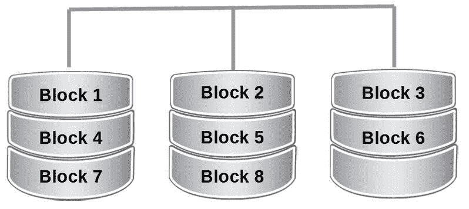

RAID 0 将数据块条带化到多个磁盘上

+   **RAID 1**：RAID 级别 1 提供数据块的镜像或*副本*，如果磁盘驱动器发生故障或主数据副本损坏，镜像可以用于继续处理。下图展示了 RAID 1 镜像的示意图：

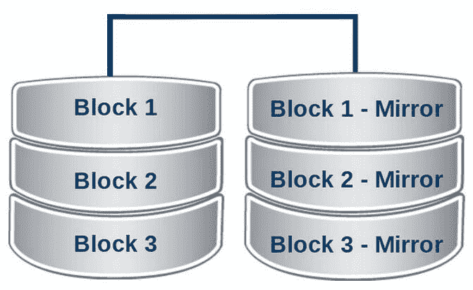

RAID 1 将数据镜像保存到另一块磁盘上

+   **RAID 5**：RAID 级别 5 看起来像是 RAID 0 加上奇偶校验（见下图）。相似之处仅此而已，因为 RAID 5 是企业网络和数据中心中最常见的 RAID 实现，它利用条带化的数据和奇偶校验信息，从出现故障的磁盘中恢复数据块，以便处理可以不中断地继续进行。RAID 5 实现的缺点是，在 I/O 密集型环境中，尤其是有大量写操作的环境下，延迟可能成为一个问题：

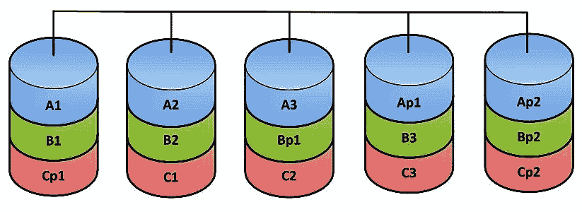

RAID 5 将数据和奇偶校验信息条带化到多个驱动器上

+   **RAID 6**：RAID 级别 6 本质上是 RAID 5 的双倍奇偶校验版本，这意味着可以有两个或更多磁盘驱动器故障，而处理仍能继续。也就是说，前提是阵列中有两个以上的磁盘。RAID 6 也在企业网络和数据中心中广泛使用。

+   **RAID 10**：RAID 级别 1+0 或 10 将级别 1 的镜像与级别 0 的条带化结合在一起，但没有奇偶校验。该 RAID 级别在较小的网络和服务器中很受欢迎，并通过软件 RAID 应用程序进行应用。

# RAID 实现

RAID 系统可以在服务器、SAN 或 NAS 上以硬件 RAID 或软件 RAID 形式实现。从操作上讲，两个 RAID 类型之间并没有太大区别，尽管许多专家更倾向于使用硬件 RAID。如果存在差异，它们主要体现在 RAID 处理的位置。在软件 RAID 实现中，RAID 处理由服务器的（通常是 RAID 主机服务器的）CPU 执行。硬件 RAID 的实现方式有多种：可以通过安装在主机服务器中的 RAID 控制器扩展卡（如下图所示）；也可以是独立的 RAID 控制器设备；或是具有嵌入式 RAID 控制器的磁盘驱动器。性能通常是两者之间的主要区别，硬件 RAID 有优势。然而，这些差异取决于磁盘驱动器的数量、格式化方式和使用的 RAID 级别：

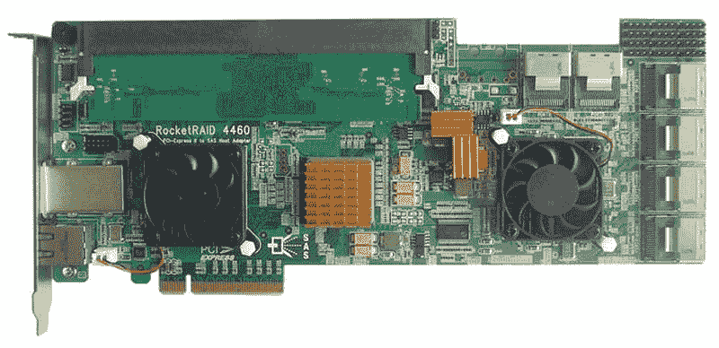

一张硬件 RAID 控制器扩展卡

图片来源：HighPoint 公司

数组控制器，也称为磁盘阵列控制器、RAID 控制器和**存储处理器**（**SP**），管理和控制磁盘驱动器阵列，并将其呈现给服务器和主机作为一个或多个逻辑单元。磁盘阵列可以是一个大的 JBOD，也可以配置为 NAS 或 SAN。一个数组控制器通常有三个主要组件：处理器、RAM 和 I/O 接口。处理器解析传入的数据请求，决定数据是要提供还是要存储。数据移动所需的指令和寻址信息存储在 RAM 中。I/O 组件通常至少有一个前端端口与主机计算机的主机适配器通信，以及一个后端端口与磁盘驱动器连接。

RAID 系统通常包括**电池备份缓存内存**。该缓存提供了一个缓冲区，使 RAID 控制器能够比将数据写入磁盘的速度更快地处理 I/O 操作的双向数据。电池供电可确保在发生断电时数据得以保留。在更大的 RAID 实现中，**冗余磁盘阵列控制器**（**RDAC**）与主磁盘阵列控制器共享一个双端口连接，在主控制器发生故障时提供即时备份和故障切换。如果没有这种冗余，磁盘阵列控制器故障将导致磁盘阵列无法访问。

# 磁盘配额

系统和网络管理员不仅需要确保系统或网络的运行，并保持对用户的可用性。其职责还包括管理、控制和分配系统资源。多用户系统上的硬盘空间可能需要设置使用限制，以为所有用户提供足够的存储空间。实现这一目标的一种方法是设置磁盘配额。

**磁盘配额**，即在用户或组级别设置的配额，限制写入硬盘的单个文件或数据块的最大大小。通常，磁盘配额是针对个人用户或组的，分为两种配额设置类型：用户配额或数据块配额，文件配额或 inode 配额（UNIX）。用户配额限制个人或组账户的最大磁盘使用量。文件配额限制用户或组创建的文件数量和/或大小。

此外，磁盘配额的类型是特定于文件系统的。磁盘配额可以在大多数操作系统中设置，包括 Windows（参见下图）、UNIX 和 Linux：

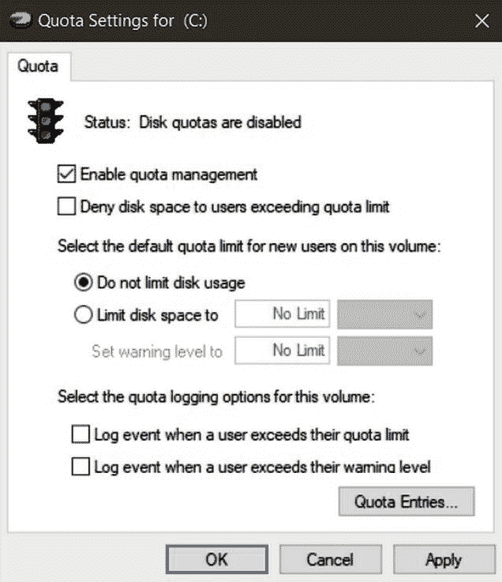

在 Windows 系统上设置磁盘配额

# 磁盘压缩

许多管理员将磁盘压缩视为减少数据文件在硬盘上占用空间的一种方式。甚至有人声称，磁盘压缩可能会加快 I/O 过程，因为压缩/解压缩操作发生在内存中。事实上，这正是吉尔斯特定律（Gilster's Law）适用的另一个场所：

“你永远无法确定，一切都取决于情况。”

一般来说，磁盘压缩可能会略微增加 I/O 过程的时间，无论是读取还是写入。根据以压缩形式存储的数据的性质，存储在磁盘上的数据量增加可能会减轻压缩带来的延迟。在高容量 I/O 系统中，压缩磁盘可能不是最佳解决方案。然而，在 I/O 活动较少的数据归档或数据仓库中，压缩磁盘则是更合适的选择。

**磁盘压缩**减少了存储数据在磁盘介质上占用的空间。磁盘压缩不同于文件压缩，后者仅压缩单个文件，而磁盘压缩压缩写入磁盘的所有数据。当启用磁盘压缩时，操作系统和硬盘控制器之间的一个数据压缩工具会拦截写入或读取受影响硬盘的任何数据。根据需要，数据会被压缩或解压缩，并传递给下一个环节。

# 高可用性 (HA)

网络服务器及所有其他网络连接系统的一个极其重要的特性就是高可用性（HA）。具有 HA 特性的系统在大部分时间内处于运行和可用状态。HA 通过系统应该或实际实现的正常运行时间百分比来衡量。你可能听说过表达“**四个九（9999）**”。这指的是在表示正常运行时间百分比时，小数点右侧的数字个数（如下面的表格所示）：

| **可用性** | **常见名称** | **每年停机时间** | **每月停机时间** | **每周停机时间** | **每天停机时间** |
| --- | --- | --- | --- | --- | --- |
| 99.9999999% | 9 个九 | 31.56 毫秒 | 2.63 毫秒 | 604.80 微秒 | 86.40 微秒 |
| 99.999% | 5 个九 | 5.26 分钟 | 26.30 秒 | 6.05 秒 | 864.00 毫秒 |
| 99.99% | 4 个九 | 52.60 分钟 | 4.38 分钟 | 1.01 分钟 | 8.64 秒 |
| 99% | 2 个九 | 3.65 天 | 7.31 小时 | 1.68 小时 | 14.40 分钟 |
| 55.5555555% | 9 个五 | 162.33 天 | 13.53 天 | 74.92 小时 | 10.67 小时 |

一些常用的高可用性措施及其时间等效

* ms: 毫秒

* µs: 微秒

* sec: 秒

* min: 分钟

* hrs: 小时

# 九个 9（9-nines）

如前表所示，高可用性的含义可能会根据网络服务器和网络连接设备的用途和使用而有所不同。网络中的每个支持设备，如 RAID、NAS、SAN、**路由与远程访问服务**（**RRAS**）等，通常都对数据中心管理员和用户有一定的高可用性期望。*9 个 9*的目标可能对于大多数服务器操作来说过于激进，每年仅允许 31.56 毫秒的停机时间。然而，许多**服务级别协议**（**SLA**）或客户或订阅者支持承诺，通常为四个或五个 9，承诺每年停机时间不超过 5 到 52 分钟。这些承诺通常是来自服务器或数据中心实际结果的平均值，或是网络配置中为提供所需可用性而设定的目标。

# 容错

高可用性的目标是保持系统的可用性和可访问性，而**容错**的目标是在组件或系统故障的情况下保留所有进行中的数据和操作。容忍故障或失败对于任何服务器或服务器连接存储阵列都是至关重要的。容错集成到系统中的程度取决于所提供服务的性质以及涉及数据的敏感性。一个需要全天候高需求的系统，必须始终可用，结合了高可用性和容错原则。在另一个极端，系统的容错可能更多是一个*软着陆*，提供所需的时间以保存所有进行中的数据。

任何级别的容错都有三个一般特点：

+   **没有单点故障**：任何可能故障并导致系统崩溃的系统元素都有一个故障转移或冗余元素来进行备份。

+   **组件故障不应该导致系统停机**：如果组件发生故障，替换组件不需要关闭任何或所有系统的电源。

+   **任何故障或失败都能轻松识别和隔离**：故障组件不会导致数据或处理丢失或中断。

这些原则可以应用于任何系统的三大故障领域：硬件、软件和电力。

# 更换故障组件

替换或使故障组件脱机而不影响用户或操作的能力是高可用性和容错的主要目标。避免因替换故障组件而需要关闭整个系统是最终目标。然而，并非在所有情况下都需要关闭整个系统或仅仅是故障组件。一些组件具备在运行中替换的能力，*随时更换*。

无论如何，硬件故障和电源组件更换有三种常见的方法：

+   **热交换**：热交换涉及在系统运行并完全操作的情况下，立即切换或物理更换故障组件。热交换设备的例子，称为**热备件**，包括音频设备、显示器、USB 设备、SATA 硬盘和网络插口。

+   **温交换**：温交换要求在替换或切换过程中暂停系统或故障组件的操作。通常，温交换涉及介质的更换，而不是整个组件。

+   **冷交换**：冷交换涉及完全关闭系统，通过应用**冷备件**来进行升级、更换或修理。

# 磁盘存储容量规划

预测计算机、系统或数据中心未来需要多少存储空间，无论是近期还是远期，都是一项棘手的任务。一方面，您不想不必要地引入过多的存储容量，浪费原本可以用于其他地方的资金。另一方面，存储空间不足可能意味着系统中断和更高的紧急价格。诀窍是找到一个平衡点，在特定的时间框架内拥有适当的磁盘空间，并制定清晰的计划，确定何时需要增加或减少存储空间。

大多数硬盘制造商提供磁盘容量规划工具，您可以用来预测未来的存储需求。此外，还有一些系统管理软件包包含容量规划功能（见下图）。但是，在开始预测未来需求之前，请确保您了解磁盘存储需求的来源，以及其他技术或方法如何解决容量需求。磁盘存储技术和方法，如分层存储、数据压缩、虚拟化、SAN 和 NAS，可能是更好且更经济的选择：

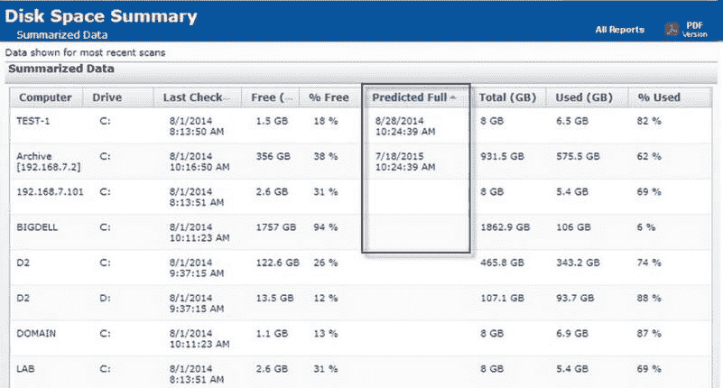

磁盘空间容量规划报告

图片来源：Power Admin, LLC

# 其他存储设备

其他不适合高效数据检索的数据存储设备适用于数据备份、文件存档和灾难恢复。在这些设备中，磁带可能是最常用的介质，原因有二：便携性和成本。

# 磁带

**磁带**是一种涂有铁氧体或铬层的塑料或镁带，可以通过磁化或去磁来表示数据位，这些数据被写入磁带上，采用最多 128 条轨道的平行或螺旋模式。最初，磁带存储在卷轴上，但今天，它通常包装在塑料盒（磁带盒）内。

数据是顺序地写入或从磁带中读取的，这意味着要从磁带的末端检索数据，必须跳过前面的所有数据。历史上，磁带并不是一种随机访问的介质。然而，新的技术，如**线性磁带开放标准**（**LTO**），通过将数据对象与其元数据分开存储，表现得像随机访问。LTFS 组织允许磁带存储多达 220 TB 的数据。

企业或其他任何组织通常将其记录的磁带存储在磁带库中，无论是用于常规系统备份、数据档案，还是灾难恢复。

**磁带库**可以是一个有组织的存储设施或柜子，按时间顺序、目的或内容顺序存储磁带。然而，能够按设定的时间表顺序旋转几个磁带盒的磁带设备也被称为磁带库。

# 光学存储

另一种用于数据备份、存储大文件、从一台计算机转移数据或编程到另一台计算机，或商业软件应用程序的光学数据存储技术。**光盘驱动器**（**ODD**）可以读取或写入光盘，但大多数情况下，光盘作为输入设备使用。

常见的光盘类型包括**紧凑型光盘**（**CD**）、**数字多功能/视频光盘**（**DVD**）和蓝光光盘。曾几何时，光盘被认为比大多数便携式磁带介质更好。一个 CD 可以存储多达 700 MB 的数据；一个 DVD 可以容纳最多 8.4 GB；而一个蓝光光盘最多可以包含 50 GB 的数据。然而，随着 USB 闪存驱动器（U 盘/闪存驱动器）现在可以存储多达 256 GB 的数据，光盘驱动器作为备份介质的能力可能有限。

# 摘要

形状因素决定了计算机外壳、主板、电源和磁盘存储驱动器的外形和适配性，形状因素设置了高度、宽度、长度以及连接到主机计算机的连接器的类型和位置。HDD 设备规格包括 RPM、接口、访问时间、吞吐量和 IOPS。HDD 是顺序设备，而 SSD 是随机访问设备。

SSD 通过固态半导体芯片存储数据，并且没有活动部件。SSD 使用 SAS 或 SATA 接口。磁盘驱动器接口是字串行或比特串行和比特导向的接口，通过 HBA、FC、SATA 和 SAS 连接。PATA 使用并行比特信号传输。SATA 使用串行比特信号传输。SCSI 为多个设备提供连接接口。SAS 扩展了 SCSI。NAS 是将存储设备集群化并显示为网络共享的设备。SAN 是一个存储设备和交换机的网络，提供对连接网络节点的访问。LUN 标识一个 SAN 存储单元。数据在二级存储上以文件系统组织。SMB 帮助应用程序访问网络上的文件和网络资源。SMB 有不同版本或方言，特定操作系统有其独特的实现方式，例如 CIFS。

RAID 系统是由两个或多个同步操作的 HDD 或 SSD 卷构建的。RAID 系统通过条带化（striping）和镜像（mirroring）方法创建数据冗余。条带化将数据分割成条带，存储在两个或多个硬盘驱动器上；镜像则将数据复制到两个或多个硬盘驱动器上。RAID 级别包括条带化或镜像，或者两者兼有，也可能使用奇偶校验。RAID 0 使用条带化，但不是冗余方法；RAID 1 提供镜像功能，可以在磁盘驱动器故障或数据损坏时保持数据可用；RAID 5 类似于 RAID 0，但增加了奇偶校验，使用条带化的数据和奇偶校验信息来重建故障硬盘上的数据块；RAID 6 相当于 RAID 5，但奇偶校验信息被加倍，通常应用于更大的网络中；RAID 1+0 或 10 结合了 RAID 1 的镜像和 RAID 0 的条带化，但不使用奇偶校验。硬件 RAID 通过主机服务器中的控制卡、独立的 RAID 设备，或通过带有嵌入式控制器的硬盘实现。磁盘压缩可以减少数据在磁盘介质上占用的空间。磁盘压缩与文件压缩不同。操作系统与硬盘之间的数据压缩工具拦截传输中的数据，并根据需要进行压缩或解压，然后继续传送数据。

HA（高可用性）是指系统的正常运行时间占比很高的状态。容错系统能够在组件或系统故障时继续运行。热插拔是指在系统保持完全正常运行的情况下，立即切换或更换故障组件。温插拔要求暂停操作，虽然系统仍然通电，但需要停机更换故障组件。冷插拔需要关机才能更换或修复组件。其他介质和存储设备，如磁带和光存储设备，也可以用来存储数据。

# 问题

1.  以下哪些是 HDD 和 SSD 之间的区别？请选择所有适用项：

    1.  旋转延迟

    1.  访问时间

    1.  存储容量

    1.  以上所有

1.  SSD 设备使用以下哪两种接口？请选择两种。

    1.  PATA

    1.  SATA

    1.  SCSI（小型计算机系统接口）

    1.  SAS

1.  以下哪项存储技术描述的是多个独立磁盘未配置成阵列的情况？

    1.  RAID（冗余磁盘阵列）

    1.  DAS（直接附加存储）

    1.  SAN（存储区域网络）

    1.  JBOD（独立磁盘冗余阵列）

1.  以下哪项最佳描述了 SAN？

    1.  一个或多个直接连接到计算机的存储设备

    1.  一个数据存储设备集群，看起来像是直接附加存储

    1.  一个自包含的存储设备网络和交换机，提供高速数据访问

    1.  用于识别服务器和主机访问权限的分区

1.  以下哪两项描述了在 SAN 中服务器和主机访问数据资源的方式？

    1.  文件权限

    1.  LUN 分区

    1.  LUN 掩蔽

    1.  文件系统

1.  Linux 和 Windows 常见的文件系统分别是：

    1.  Linux 和 UNIX

    1.  DOS 和 Windows

    1.  ext3 和 NTFS

    1.  EFS 和 RAID

1.  SAMBA 是哪种应用层协议的实现？

    1.  HTTP/FTP

    1.  IPSec/WPA

    1.  SBA/TCP

    1.  SMB/CIFS

1.  在不同的 RAID 级别中，应用了哪两种冗余方法？选择两项。

    1.  镜像

    1.  压缩

    1.  加密

    1.  条带化

1.  以下哪项不是 RAID 的数据冗余级别？

    1.  RAID 0

    1.  RAID 1

    1.  RAID 5

    1.  RAID 10

1.  一个系统如果在相当长的一段时间内保持完全运行并能被用户访问，则被认为是：

    1.  容错

    1.  抗故障

    1.  高可用性

    1.  极高可用性

1.  将左边的名称与右边最能描述它的描述匹配。

a. 热插拔

b. 冷插拔

c. 温插拔

1\. 需要关闭系统电源才能进行替换或修复

2\. 在系统保持完全运行的情况下，立即切换或替换故障组件

3\. 在系统仍然通电的情况下暂停操作，以便替换故障组件
